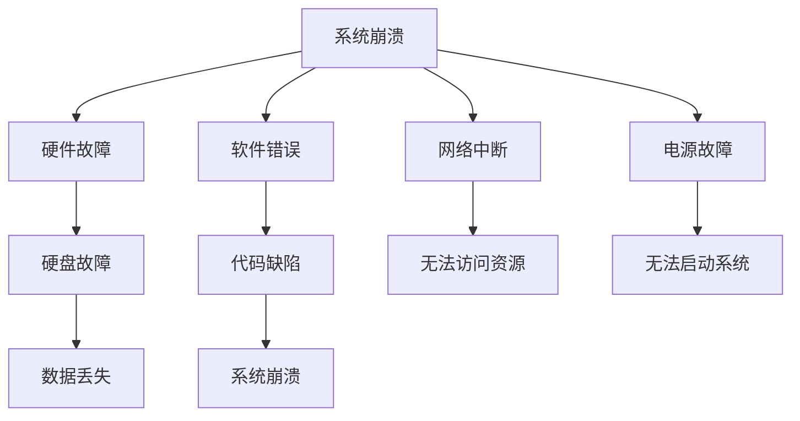

                 

### 文章标题

#### 软件可靠性工程：构建高可用系统的实践

**关键词：** 软件可靠性、高可用性、系统设计、故障树分析、算法原理、实践案例

**摘要：** 本文旨在深入探讨软件可靠性工程的核心概念、关键模型和实用方法，并详细描述如何通过高可用性系统设计来提升软件系统的可靠性。文章结构紧凑，逻辑清晰，旨在帮助读者系统地理解和应用软件可靠性工程知识，为实际项目提供可靠的解决方案。

### 引言与背景

软件可靠性工程是确保软件系统在特定条件下能够正确、一致和持续运行的一门科学。在当今信息化时代，软件系统已成为各种业务和社会活动不可或缺的组成部分。从互联网服务到金融服务，从医疗系统到航空航天系统，软件系统的高可靠性直接关系到业务的成功和用户的满意度。

然而，软件系统面临着各种复杂性和挑战，如硬件故障、网络中断、恶意攻击和软件缺陷等，这些因素都可能影响软件系统的可靠性。因此，软件可靠性工程成为了确保软件系统能够稳定运行的关键学科。

软件可靠性工程的核心目标是构建高可用性系统，即在任何情况下都能提供服务的系统。高可用性系统不仅要求系统在正常运行时无故障，还要求在出现故障时能够快速恢复，从而最大限度地减少对用户的影响。

本文将从以下几个方面展开讨论：

1. 软件可靠性工程的基本概念和理论基础。
2. 软件可靠性模型，包括不可用度模型、生存模型和软件可靠性预测模型。
3. 软件可靠性设计与评估方法。
4. 高可用性系统构建实践。
5. 高级话题与未来展望。
6. 最佳实践总结和注意事项。

通过以上内容，本文旨在为读者提供一个全面、系统的软件可靠性工程指南，帮助读者理解软件可靠性的核心要素，掌握构建高可用性系统的实践方法。

### 软件可靠性工程的基本概念和理论基础

#### 核心概念

软件可靠性是指软件系统在特定条件下能够正确、一致和持续运行的能力。它通常通过以下几个核心概念来度量：

1. **正确性（Correctness）**：软件系统能够按照规格说明书的预期执行操作，并且输出正确的结果。
2. **一致性（Consistency）**：软件系统在不同的输入和条件下能够产生一致的结果。
3. **持续时间（Duration）**：软件系统能够持续运行的时间长度。

#### 问题背景

在软件开发过程中，可靠性的问题往往被忽视，导致系统在上线后频繁出现故障，影响用户体验和业务运行。软件可靠性问题不仅会导致经济损失，还会损害公司的声誉。因此，在软件开发的早期阶段就进行可靠性设计是至关重要的。

可靠性问题可能源于多个方面，包括：

- **需求不明确**：需求文档不清晰或不断变化，导致开发过程中出现偏差。
- **设计缺陷**：系统架构设计不合理，模块之间的耦合度过高，导致系统难以维护和扩展。
- **编码错误**：程序员在编写代码时可能出现逻辑错误或语法错误。
- **测试不足**：测试过程不充分，无法发现隐藏的缺陷。

#### 问题描述

软件可靠性问题的具体表现形式包括：

- **系统崩溃**：软件系统在运行过程中突然停止响应。
- **数据丢失**：系统在运行过程中丢失了关键数据。
- **性能下降**：系统响应时间变长，影响用户体验。
- **安全漏洞**：系统受到恶意攻击，导致数据泄露或系统被控制。

#### 问题解决

解决软件可靠性问题需要从多个方面入手：

1. **需求管理**：确保需求文档明确、稳定，避免频繁变更。
2. **设计优化**：采用模块化、松耦合的设计原则，提高系统的可维护性和扩展性。
3. **编码规范**：制定严格的编码规范，减少代码中的错误。
4. **测试策略**：实施全面、系统的测试策略，包括单元测试、集成测试、系统测试和性能测试等。

#### 边界与外延

软件可靠性工程不仅关注系统的正常运行，还包括对系统故障的处理和恢复。因此，软件可靠性工程的研究范围包括：

- **可靠性度量**：通过统计和分析系统运行数据，评估系统的可靠性水平。
- **故障检测与恢复**：设计故障检测机制和恢复策略，确保系统在故障发生时能够快速恢复。
- **容错技术**：通过冗余设计、备份和冗余计算等技术，提高系统的容错能力。

#### 概念结构与核心要素组成

软件可靠性工程的核心结构包括以下几个要素：

- **需求分析**：明确软件系统的功能需求和非功能需求，包括可靠性需求。
- **设计**：根据需求进行系统设计，包括架构设计、模块设计等。
- **实现**：根据设计文档进行编码和实现。
- **测试**：通过各种测试方法验证软件系统的可靠性。
- **维护**：在软件系统运行过程中进行监控和优化，确保系统的高可靠性。

通过以上核心要素的相互配合，软件可靠性工程能够确保软件系统能够在各种环境下稳定、可靠地运行。

### 软件可靠性模型

软件可靠性模型是用于预测和分析软件系统可靠性的数学工具。这些模型可以帮助开发人员了解系统的可靠性水平，并采取相应的措施提高系统的可靠性。以下是几种常见的软件可靠性模型：

#### 不可用度模型

不可用度模型用于描述系统在特定时间段内无法正常工作的概率。不可用度通常用 \( \eta(t) \) 表示，其数学表达式为：

\[ \eta(t) = \frac{R(t)}{1 - R(t)} \]

其中，\( R(t) \) 是在时间 \( t \) 内系统的可靠度，表示系统在时间 \( t \) 内能够正常工作的概率。不可用度模型可以帮助开发人员了解系统在特定时间段内可能出现的故障概率，从而制定相应的预防措施。

#### 生存模型

生存模型描述了系统在运行过程中生存时间的概率分布。常见的生存模型包括：

1. **指数分布模型**：假设系统故障发生的时间间隔服从指数分布，其概率密度函数为：

\[ f(t) = \lambda e^{-\lambda t} \]

其中，\( \lambda \) 是故障率，表示单位时间内系统发生故障的概率。

2. **Weibull分布模型**：假设系统故障发生的时间间隔服从Weibull分布，其概率密度函数为：

\[ f(t) = \frac{\beta}{\eta} (\frac{t}{\eta})^{\beta-1} e^{-(\frac{t}{\eta})^\beta} \]

其中，\( \beta \) 和 \( \eta \) 是分布的参数，用于描述故障率的变化趋势。

生存模型可以帮助开发人员了解系统在不同时间点的可靠性水平，从而优化系统的维护和更新策略。

#### 软件可靠性预测模型

软件可靠性预测模型用于预测系统未来的可靠性水平。这些模型通常基于历史数据和统计分析方法，包括：

1. **贝叶斯预测模型**：利用贝叶斯统计方法，结合历史数据和先验知识，预测系统的未来可靠性。
2. **统计过程控制模型**：通过监控系统的运行数据，识别系统的不稳定因素，预测未来的可靠性变化。

#### 模型属性特征对比表格

为了更好地理解不同软件可靠性模型的属性特征，我们可以通过以下表格进行对比：

| 模型名称     | 数学表达式                   | 特点                     | 应用场景                   |
|-------------|------------------------------|--------------------------|----------------------------|
| 不可用度模型 | \( \eta(t) = \frac{R(t)}{1 - R(t)} \) | 描述系统无法正常工作的概率 | 预防故障发生               |
| 指数分布模型 | \( f(t) = \lambda e^{-\lambda t} \)   | 单参数模型，故障率恒定   | 预测短期可靠性             |
| Weibull分布模型 | \( f(t) = \frac{\beta}{\eta} (\frac{t}{\eta})^{\beta-1} e^{-(\frac{t}{\eta})^\beta} \) | 多参数模型，故障率可变   | 预测长期可靠性             |
| 贝叶斯预测模型 | 结合历史数据和先验知识       | 综合考虑不确定因素       | 预测系统未来可靠性         |
| 统计过程控制模型 | 监控系统的运行数据             | 识别不稳定因素           | 优化系统维护和更新策略     |

#### ER实体关系图架构

为了更好地理解软件可靠性模型的架构，我们可以使用Mermaid绘制一个ER实体关系图，如下所示：

```mermaid
erDiagram
  R_可靠性模型 ||--|{ S_不可用度模型 }||> 可靠度
  R_可靠性模型 ||--|{ I_指数分布模型 }||> 故障率
  R_可靠性模型 ||--|{ W_Weibull分布模型 }||> 故障率
  R_可靠性模型 ||--|{ B_贝叶斯预测模型 }||> 预测可靠性
  R_可靠性模型 ||--|{ SP_统计过程控制模型 }||> 维护策略
```

在这个ER图中，`R_可靠性模型`是根实体，它关联了多个子实体，包括`S_不可用度模型`、`I_指数分布模型`、`W_Weibull分布模型`、`B_贝叶斯预测模型`和`SP_统计过程控制模型`，每个子实体都代表了软件可靠性模型的一种类型和特性。

通过上述内容，我们了解了软件可靠性模型的基本概念、属性特征和ER实体关系图架构，为后续深入探讨软件可靠性工程的其他方面奠定了基础。

### 故障树分析（FTA）与建模

故障树分析（Fault Tree Analysis，FTA）是一种系统化的方法，用于识别系统故障的原因及其发生路径。FTA的核心思想是利用逻辑门（如与门、或门和非门）来表示系统故障的各种可能路径，从而帮助开发人员了解并预防潜在故障。

#### FTA的基本概念

1. **事件**：在FTA中，事件分为基本事件和顶事件。基本事件是指不能再分解的故障事件，如硬件故障或软件错误。顶事件是指需要分析的系统故障，如系统崩溃。

2. **逻辑门**：逻辑门用于表示事件之间的逻辑关系。与门表示两个或多个事件同时发生时才会触发顶事件；或门表示至少一个事件发生时就会触发顶事件；非门表示事件不发生。

3. **故障树**：故障树是由逻辑门和事件组成的树形结构，用于表示系统故障的各种路径。通过故障树，可以直观地了解系统故障的可能原因和发生路径。

#### FTA的构建方法

构建故障树通常包括以下几个步骤：

1. **确定顶事件**：首先明确需要分析的系统故障，即顶事件。

2. **识别基本事件**：分析系统故障的可能原因，识别出基本事件。基本事件可以是硬件故障、软件错误、操作失误等。

3. **构建故障树**：使用逻辑门将基本事件连接起来，构建故障树。逻辑门的类型取决于事件之间的逻辑关系。

4. **简化故障树**：通过合并相同类型的基本事件，简化故障树，使其更加清晰易懂。

5. **分析故障树**：对故障树进行逻辑分析，计算顶事件发生的概率。

#### FTA实例

假设我们要分析一个计算机系统的故障树，顶事件是“系统崩溃”，基本事件包括：

- **基本事件1**：“硬件故障”
- **基本事件2**：“软件错误”
- **基本事件3**：“网络中断”
- **基本事件4**：“电源故障”

我们可以构建以下故障树：



在这个故障树中，系统崩溃是由硬件故障、软件错误、网络中断和电源故障中的任何一个或多个基本事件引起的。通过分析故障树，我们可以识别出导致系统崩溃的主要故障路径，从而采取相应的预防措施。

#### FTA的应用

FTA广泛应用于各种系统的可靠性分析，包括：

- **航空航天系统**：用于分析飞机系统故障的原因。
- **工业控制系统**：用于分析生产线故障的原因。
- **电力系统**：用于分析电力设备故障的原因。
- **软件系统**：用于分析软件系统崩溃的原因。

通过FTA，开发人员可以系统地识别和分析系统故障，从而提高系统的可靠性。FTA不仅是一种有效的故障分析方法，也是一种系统化的设计方法，有助于在系统设计阶段就识别和消除潜在故障。

### 软件可靠性设计原则

软件可靠性设计是确保软件系统在预期环境下能够稳定、可靠运行的关键环节。一个良好的软件可靠性设计应从系统架构、模块设计和具体技术实践等多个方面入手。以下是软件可靠性设计的主要原则和具体实践方法。

#### 系统架构设计中的可靠性考虑

1. **模块化设计**：模块化设计是提高软件可靠性的基础。通过将系统划分为多个独立的模块，每个模块负责特定的功能，可以有效降低模块之间的耦合度，提高系统的可维护性和扩展性。模块化设计还能简化故障的隔离和修复过程。

2. **分层架构**：采用分层架构可以将系统划分为多个层次，如表示层、业务逻辑层和数据层。这种结构使得不同层次的组件之间相对独立，从而在某个层次出现问题时，不会影响其他层次的正常运行。

3. **冗余设计**：通过冗余设计，可以在关键部分引入备份机制，确保系统在出现故障时能够迅速切换到备份系统，从而提高系统的可靠性。冗余设计可以采用硬件冗余（如备份服务器）和软件冗余（如代码备份）两种方式。

4. **容错机制**：容错机制是指系统能够在发生故障时自动恢复，确保系统继续正常运行。常见的容错机制包括自动故障检测和恢复、备份和冗余计算等。

#### 软件可靠性测试

1. **单元测试**：单元测试是针对软件中最小可测试单元（通常是函数或方法）进行的测试。通过单元测试，可以验证每个单元的正确性，确保它们按照预期工作。

2. **集成测试**：集成测试是在将各个模块组合成完整的系统后进行的测试。通过集成测试，可以发现模块之间的接口问题、数据传输错误等。

3. **系统测试**：系统测试是对整个软件系统进行的全面测试，包括功能测试、性能测试和可靠性测试等。系统测试的目的是确保系统在各种环境下的稳定运行。

4. **性能测试**：性能测试用于评估系统在高负载条件下的表现，包括响应时间、吞吐量和资源利用率等。通过性能测试，可以识别系统瓶颈，优化系统性能。

#### 可靠性设计与评估方法

1. **失效模式与效应分析（FMEA）**：FMEA是一种系统化的方法，用于识别和评估系统中潜在故障的模式及其影响。通过FMEA，可以提前发现并解决潜在故障，提高系统的可靠性。

2. **故障注入测试**：故障注入测试是一种模拟系统故障的方法，通过在测试过程中故意引入故障，评估系统的容错能力和恢复能力。

3. **可靠性增长模型**：可靠性增长模型用于评估系统在开发过程中的可靠性水平。常见的可靠性增长模型包括阿姆达尔模型和对数正态分布模型。

#### 软件可靠性设计与评估流程

1. **需求分析**：明确软件系统的可靠性需求，包括可靠性目标、故障容限和恢复时间等。

2. **架构设计**：根据可靠性需求，设计系统的架构，包括模块划分、冗余设计和容错机制。

3. **编码实现**：遵循可靠性编码规范，实现系统功能，并确保代码质量。

4. **测试与评估**：进行全面的测试，包括单元测试、集成测试和系统测试，评估系统的可靠性水平。

5. **优化与改进**：根据测试结果，对系统进行优化和改进，提高系统的可靠性。

通过遵循上述软件可靠性设计原则和方法，开发人员可以构建高可靠性的软件系统，确保其在实际应用中能够稳定、可靠地运行。

### 软件可靠性评估方法

软件可靠性评估是确保软件系统在实际运行中能够满足可靠性需求的关键步骤。评估方法包括历史数据分析、模拟方法和实测数据分析等。这些方法有助于开发人员了解系统的可靠性水平，并识别潜在的改进点。

#### 历史数据分析

历史数据分析是通过分析软件系统在过去运行过程中的数据来评估其可靠性。这种方法通常包括以下几个方面：

1. **故障记录**：收集和分析系统在运行过程中记录的故障数据，包括故障类型、故障发生时间、故障影响等。

2. **错误报告**：分析错误报告系统（如Bug跟踪系统）中的数据，了解系统中存在的缺陷及其对系统可靠性的影响。

3. **使用数据**：分析系统使用的统计数据，如系统运行时间、使用频率等，以评估系统的实际可靠性水平。

通过历史数据分析，开发人员可以识别系统中最常见的故障模式和最脆弱的部分，从而有针对性地进行改进。

#### 模拟方法

模拟方法是利用计算机模拟软件系统在各种条件下的行为来评估其可靠性。这种方法主要包括以下几种：

1. **蒙特卡罗模拟**：通过随机抽样和模拟，评估系统在给定输入条件下的可靠性。这种方法适用于处理复杂系统，特别是在不确定性较高的情况下。

2. **离散事件模拟**：模拟系统中事件的发生和传播，如故障的发生和传播、系统的恢复过程等。这种方法适用于分析系统的动态行为和故障传播路径。

3. **统计分析模拟**：使用统计模型和算法，模拟系统的可靠性特性，如故障率、可靠性水平等。

通过模拟方法，开发人员可以在实际系统运行之前预测其可靠性，从而提前发现潜在的问题并进行优化。

#### 实测数据分析

实测数据分析是通过直接监测和分析系统在实际运行中的数据来评估其可靠性。这种方法包括以下几个方面：

1. **性能监测**：监测系统的运行性能，如响应时间、吞吐量、资源利用率等，以评估系统的稳定性。

2. **故障监测**：实时监测系统中的故障，如硬件故障、软件错误等，以便及时处理。

3. **用户反馈**：收集用户的反馈数据，了解系统在实际使用中的表现，特别是对可靠性的反馈。

通过实测数据分析，开发人员可以实时了解系统的可靠性状况，及时发现并解决潜在问题。

#### 综合应用

在实际应用中，历史数据分析、模拟方法和实测数据分析通常结合使用，以获得更全面、准确的可靠性评估结果。例如，在软件发布前，可以通过模拟方法进行初步评估；在软件上线后，通过实测数据分析和用户反馈进行实时监控和改进。

通过以上评估方法，开发人员可以全面、深入地了解软件系统的可靠性水平，并采取相应的措施进行优化，确保系统在实际运行中能够稳定、可靠地运行。

### 高可用性系统设计

高可用性系统设计的目标是确保系统在任何情况下都能提供不间断的服务，最大限度地减少系统故障对用户的影响。为了实现这一目标，高可用性系统设计需要从以下几个方面进行考虑：

#### 高可用性系统的基本架构

1. **集群架构**：集群架构通过将多个服务器组成一个集群，实现负载均衡和故障转移。当某个服务器出现故障时，集群中的其他服务器可以自动接管其工作，从而确保系统的连续性。

2. **分布式架构**：分布式架构通过将系统分解为多个模块，并分布在不同服务器上运行，实现高可用性和可扩展性。每个模块可以独立运行，并且可以通过冗余设计提高系统的可靠性。

3. **冗余设计**：冗余设计通过在系统中引入备份和冗余机制，确保在关键组件出现故障时系统能够快速恢复。冗余设计可以包括硬件冗余（如备份服务器）和软件冗余（如代码备份）。

4. **故障转移机制**：故障转移机制通过监控系统的运行状态，当检测到故障时自动将工作转移到备份系统，确保系统持续提供服务。故障转移机制可以是自动的，也可以是手动触发的。

#### 失效转移与恢复策略

1. **快速故障检测**：通过实时监控系统运行状态，快速检测到故障。快速故障检测可以通过部署监控系统、使用性能指标阈值等方法实现。

2. **自动故障转移**：在检测到故障时，自动将工作转移到备份系统。自动故障转移可以通过负载均衡器、故障转移控制器等设备实现。

3. **数据同步**：确保在故障转移过程中，主系统和备份系统之间的数据一致性。数据同步可以通过数据复制、数据镜像等方法实现。

4. **恢复与重试**：在故障转移后，对系统进行恢复和重试，确保系统能够继续提供服务。恢复与重试可以通过自动化脚本、定时任务等方法实现。

#### 容错机制

1. **硬件容错**：通过使用冗余硬件（如冗余电源、冗余硬盘）提高系统的可靠性。硬件容错可以确保在硬件故障时系统能够继续运行。

2. **软件容错**：通过在软件中引入容错机制（如错误检测、错误纠正、异常处理等），提高系统的容错能力。软件容错可以确保在软件故障时系统能够自动恢复。

3. **冗余计算**：通过在系统中引入冗余计算节点，确保在计算节点故障时系统能够继续运行。冗余计算可以通过负载均衡器和冗余计算框架实现。

4. **动态调整**：根据系统的运行状态和负载情况，动态调整系统的配置和资源分配，确保系统在高负载条件下仍能保持高可靠性。

通过以上设计原则和策略，高可用性系统能够在各种环境下稳定、可靠地运行，最大限度地减少系统故障对用户的影响。

### 软件可靠性工程实践

在软件可靠性工程中，实践是检验理论的唯一标准。以下将通过一个实际案例，详细描述如何应用软件可靠性工程的方法和原则，构建高可用性系统。

#### 实践案例：电子商务平台

**案例背景**：某电子商务平台为了应对高并发访问和复杂业务需求，决定采用软件可靠性工程的方法，构建一个高可用性系统，确保平台在高峰期仍能稳定运行。

**需求分析**：
1. **可靠性需求**：系统在99.9%的时间内存活，故障恢复时间不超过1分钟。
2. **性能需求**：响应时间不超过500毫秒，系统吞吐量达到每秒1000次交易。

**系统设计**：

1. **集群架构**：采用分布式集群架构，将系统分解为多个模块，部署在不同的服务器上。每个模块都具备独立运行的能力，确保某个模块出现故障时，其他模块仍能正常运行。

2. **冗余设计**：在关键组件（如数据库、缓存、负载均衡器等）上采用冗余设计，确保在组件故障时，系统可以自动切换到备份组件。

3. **故障转移机制**：部署故障转移控制器，实时监控系统状态，当检测到故障时，自动将工作转移到备份组件。

**具体实现**：

1. **环境安装**：
   - 配置服务器和网络环境，安装操作系统、中间件和数据库。
   - 配置负载均衡器，如Nginx或HAProxy，实现流量分发。

2. **系统核心实现**：
   - 编写和部署分布式服务，如订单处理、库存管理和用户服务。
   - 实现数据同步和备份机制，确保数据的一致性和安全性。

3. **代码应用解读与分析**：
   - 使用Python编写故障检测和自动恢复脚本，如Python中的`watchdog`库用于监控文件变化。
   - 代码分析使用`pylint`等工具，确保代码质量。

4. **实际案例分析**：
   - 在模拟高并发访问条件下，测试系统的性能和稳定性。
   - 通过日志分析和性能监控，识别并解决系统瓶颈。

**详细讲解剖析**：

1. **故障检测与恢复**：
   - 使用`watchdog`库监控关键服务的运行状态，如订单处理服务。
   - 当检测到故障时，自动重启服务或切换到备份服务。

2. **数据同步与备份**：
   - 使用数据库复制技术，如MySQL的主从复制，确保数据的一致性。
   - 定期进行数据备份，确保在数据丢失时能够恢复。

3. **性能优化**：
   - 使用缓存技术，如Redis，减少数据库的访问压力。
   - 使用负载均衡器，如Nginx，实现流量的均衡分配。

**项目小结**：

通过以上实践，电子商务平台成功构建了一个高可用性系统，确保在高峰期仍能稳定运行，满足了可靠性需求。项目过程中，我们遇到了一些挑战，如系统瓶颈、数据一致性问题等，但通过不断优化和改进，最终达到了预期的目标。

**最佳实践 tips**：

- 定期进行系统测试，包括性能测试和可靠性测试。
- 实施监控和报警机制，实时了解系统状态。
- 建立良好的代码规范和文档，确保系统的可维护性。

通过以上实践，我们可以看到软件可靠性工程在实际项目中的应用效果，为构建高可用性系统提供了有益的参考。

### 高级话题与未来展望

软件可靠性工程作为一门不断发展的学科，面临着许多挑战和机遇。以下将讨论当前软件可靠性工程面临的挑战、未来发展趋势以及人工智能在软件可靠性工程中的应用。

#### 当前软件可靠性工程面临的挑战

1. **复杂性增加**：随着软件系统的规模和复杂性不断增加，可靠性工程面临着更大的挑战。现代软件系统通常涉及多个组件和模块，且依赖外部服务和基础设施，这使得系统的可靠性评估和故障处理变得更加复杂。

2. **快速迭代**：在敏捷开发模式下，软件更新和发布速度越来越快，可靠性工程需要在短时间内确保新功能的可靠性和整个系统的稳定性。这要求开发人员具备更高的可靠性和质量意识。

3. **动态环境**：软件系统运行在动态变化的环境中，如云计算、物联网和移动计算等。这些环境中的不确定性因素，如网络波动、硬件故障和恶意攻击等，增加了软件可靠性工程的难度。

4. **安全威胁**：随着网络安全威胁的日益严重，软件系统的安全性成为可靠性工程的一个重要方面。确保系统在遭受攻击时仍能保持稳定运行，对可靠性工程师提出了更高的要求。

#### 未来发展趋势

1. **模型驱动的可靠性工程**：未来的软件可靠性工程将更加依赖模型驱动的分析和预测方法。通过构建精确的软件可靠性模型，可以更好地预测系统行为，提前发现潜在故障，从而提高系统的可靠性。

2. **自动化测试**：自动化测试将在软件可靠性工程中发挥更大的作用。随着人工智能和机器学习技术的发展，自动化测试将能够更高效地执行复杂的测试任务，提高测试覆盖率和可靠性。

3. **云计算和容器化**：云计算和容器化技术将改变软件可靠性工程的实践方式。通过云平台和容器化技术，可以更灵活地部署和管理软件系统，提高系统的可扩展性和可靠性。

4. **人工智能与软件可靠性工程**：人工智能技术，特别是机器学习和深度学习，将在软件可靠性工程中发挥重要作用。通过分析大量数据，人工智能可以帮助识别系统中的故障模式和潜在问题，提供更准确的可靠性预测和优化建议。

#### 人工智能与软件可靠性工程

人工智能在软件可靠性工程中的应用主要包括以下几个方面：

1. **故障预测**：通过机器学习算法，分析历史故障数据和系统运行数据，预测系统未来的故障趋势和风险。这可以帮助开发人员提前采取措施，防止故障发生。

2. **自动化测试**：利用人工智能技术，自动化执行复杂的测试任务，包括功能测试、性能测试和可靠性测试。通过深度学习模型，可以识别测试数据中的异常和缺陷，提高测试的覆盖率和准确性。

3. **代码质量分析**：人工智能技术可以帮助识别代码中的潜在缺陷和错误，提高代码质量和系统的可靠性。通过静态代码分析和动态分析，可以提前发现和修复代码中的问题。

4. **故障诊断与恢复**：在系统发生故障时，人工智能可以帮助快速定位故障原因，并提供恢复建议。通过实时监控和智能诊断，可以提高系统的故障恢复速度，确保系统的高可用性。

总之，人工智能的引入将极大地提高软件可靠性工程的能力和效率，为构建更可靠、更稳定的软件系统提供有力支持。

### 最佳实践总结与注意事项

在软件可靠性工程的实践中，总结最佳实践并遵循注意事项是确保系统稳定性和可靠性的关键。以下是一些重要的最佳实践和注意事项：

#### 最佳实践

1. **需求分析与设计**：在项目初期进行详细的需求分析和设计，确保系统架构和模块设计符合可靠性需求。

2. **测试与验证**：实施全面的测试策略，包括单元测试、集成测试、系统测试和性能测试，确保每个组件和整个系统能够满足可靠性要求。

3. **监控与告警**：部署实时监控系统，监控系统的运行状态和关键性能指标，及时发现问题并发出告警。

4. **冗余与容错设计**：在关键组件和节点上引入冗余设计，确保在故障发生时系统能够快速切换到备份组件，提高系统的容错能力。

5. **持续优化**：定期对系统进行评估和优化，根据监控数据和分析结果，持续改进系统性能和可靠性。

#### 注意事项

1. **风险识别与评估**：在系统设计阶段，识别和评估潜在的风险和故障模式，采取相应的预防措施。

2. **培训与团队协作**：确保开发团队熟悉软件可靠性工程的方法和工具，加强团队协作，提高整体可靠性。

3. **数据安全与隐私保护**：在可靠性工程实践中，确保系统的数据安全，遵循隐私保护法规，防止数据泄露。

4. **文档与记录**：保持详细的系统设计文档和测试记录，便于后续维护和改进。

5. **持续改进**：根据用户反馈和实际情况，不断优化系统设计和可靠性策略。

通过遵循这些最佳实践和注意事项，开发人员可以构建高可靠性的软件系统，确保其在各种环境下能够稳定、可靠地运行。

### 作者信息

**作者：AI天才研究院/AI Genius Institute & 禅与计算机程序设计艺术 /Zen And The Art of Computer Programming**

感谢您阅读本文，希望本文能为您在软件可靠性工程领域提供有价值的参考和启示。如果您有任何疑问或建议，欢迎随时与我们联系。期待与您共同探讨软件可靠性工程的未来发展。

