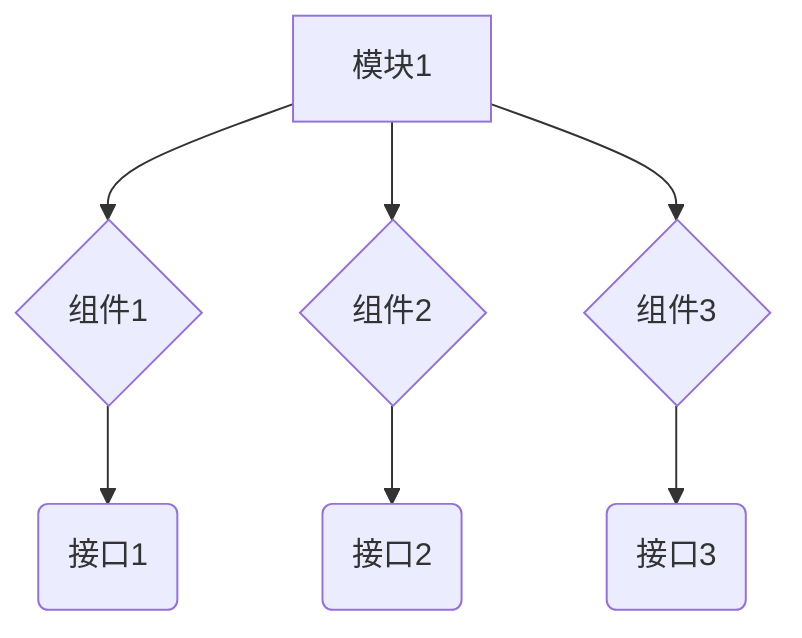
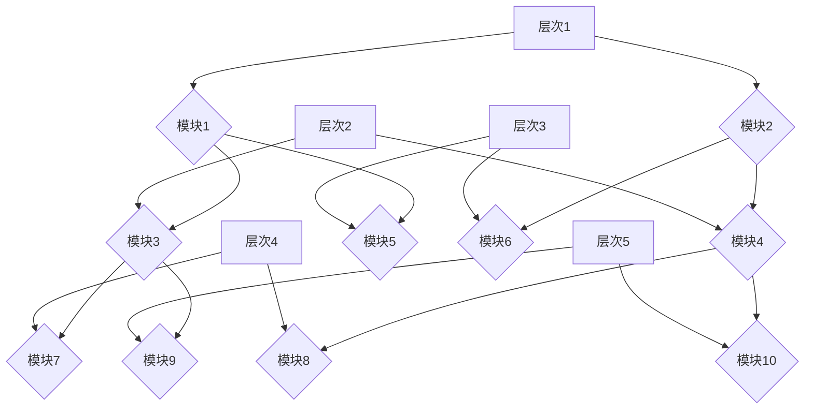
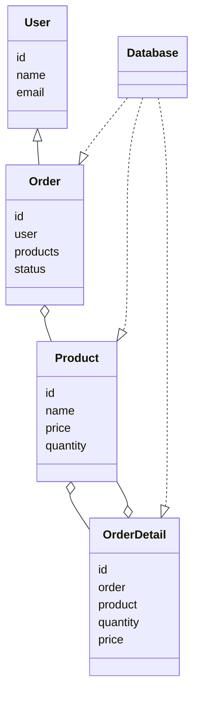
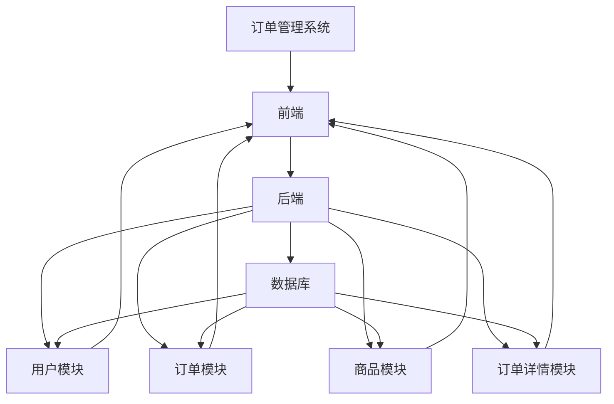
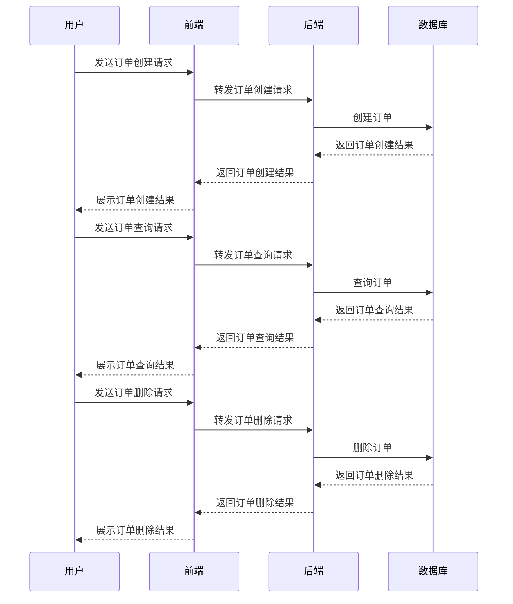

                 

# 软件架构可视化工具：有效沟通系统结构

## 关键词
- 软件架构
- 可视化工具
- 系统结构
- 沟通
- 设计模式

## 摘要
本文将深入探讨软件架构可视化工具的作用和重要性。我们将从背景介绍开始，逐步讲解软件架构可视化工具的核心概念、算法原理，并通过实际案例展示其在项目中的应用。文章旨在帮助读者理解如何通过可视化工具有效沟通系统结构，提高软件开发和运维的效率。

## 目录大纲
1. **背景介绍**
   - 软件架构可视化工具的概念
   - 软件架构可视化工具的重要性
   - 本书定位和目标读者

2. **核心概念与联系**
   - 软件架构元素概述
   - Mermaid图表展示软件架构元素关系

3. **算法原理讲解**
   - 常用软件架构可视化算法概述
   - 数学模型和Python代码实现

4. **数学模型和数学公式讲解**
   - 重要数学公式的LaTeX展示和解释

5. **系统分析与架构设计方案**
   - 问题场景介绍
   - 项目介绍
   - 系统功能设计
   - 系统架构设计
   - 系统接口设计
   - 系统交互

6. **项目实战**
   - 环境安装
   - 系统核心实现
   - 代码分析
   - 案例分析
   - 项目小结

7. **最佳实践 tips、小结、注意事项、拓展阅读**
   - 实践建议
   - 本书内容总结
   - 注意事项
   - 相关阅读资源

## 1. 背景介绍

### 软件架构可视化工具的概念

软件架构可视化工具是一种用于表示和展示软件系统架构的图形化工具。这些工具通过图形化的方式将复杂的软件系统结构以直观、易于理解的形式呈现给开发者、项目经理和利益相关者。常见的软件架构可视化工具包括Mermaid、PlantUML、.draw.io等。

### 软件架构可视化工具的重要性

软件架构可视化工具在软件开发过程中扮演着重要角色。首先，它能够帮助开发者更好地理解系统的整体结构和各部分之间的关系，从而降低沟通成本，提高开发效率。其次，可视化工具能够及时发现设计中的问题，如模块间的依赖冲突、接口不匹配等，避免后期修改带来的成本和风险。此外，软件架构可视化工具还可以为项目管理提供有力支持，帮助项目经理更准确地评估项目进度和资源需求。

### 本书的定位和目标读者

本书旨在为软件开发者、架构师和项目经理提供一套全面、系统的软件架构可视化工具知识和实践指导。读者可以通过本书的学习，掌握常用的软件架构可视化工具，了解其核心概念和算法原理，并能够将所学知识应用于实际项目中，提高工作效率。

## 2. 核心概念与联系

### 软件架构元素概述

软件架构包括多个关键元素，如模块、组件、接口、数据等。这些元素共同构成了软件系统的结构。为了更好地理解这些元素之间的关系，我们可以通过Mermaid图表进行展示。

### Mermaid图表展示软件架构元素关系

以下是一个简单的Mermaid图表示例，展示了软件架构中常见的元素及其关系：



在这个图表中，我们定义了四个组件（B、C、D）和一个接口（E、F、G），它们与模块A有关联。通过这个图表，我们可以直观地看到模块与组件、接口之间的依赖关系。

## 3. 算法原理讲解

### 常用软件架构可视化算法概述

在软件架构可视化中，常用的算法包括层次分析法（Hierarchical Analysis Process，HAP）和统一建模语言（Unified Modeling Language，UML）等。这些算法能够将复杂的软件架构以图形化的方式呈现，帮助开发者更好地理解系统结构。

### 数学模型和Python代码实现

以下是一个简单的层次分析法示例，用于可视化软件架构中的层次结构。我们使用Python代码实现该算法，并通过Mermaid图表展示结果。

```python
import numpy as np
import matplotlib.pyplot as plt
import seaborn as sns

# 定义对角矩阵A
A = np.diag([1, 2, 3, 4, 5])

# 计算A的逆矩阵A^-1
A_inv = np.linalg.inv(A)

# 计算权重向量w
w = A_inv[0]

# 绘制层次分析图
sns.heatmap(A, annot=True, cmap='YlGnBu')
plt.title('Layered Architecture Visualization')
plt.xlabel('Layers')
plt.ylabel('Features')
plt.show()
```

在这个示例中，我们定义了一个对角矩阵A，表示软件架构的层次结构。通过计算A的逆矩阵A^-1，可以得到权重向量w，表示各层次之间的依赖关系。最后，我们使用Seaborn库绘制一个热力图，展示软件架构的层次结构。

### 算法原理详细解释

层次分析法（HAP）是一种用于分析软件架构层次结构的算法。它基于以下假设：

1. 软件架构可以分为多个层次，每个层次包含若干个模块或组件。
2. 模块或组件之间存在依赖关系，即某些模块或组件依赖于其他模块或组件。
3. 层次之间的依赖关系可以用一个对角矩阵表示。

通过层次分析法，我们可以计算出一个权重向量，表示各层次之间的依赖关系。这个权重向量可以帮助开发者更好地理解系统结构，及时发现潜在的问题。

### 示例说明

假设我们有一个简单的软件架构，包含五个层次，如下所示：

```
层次1：模块1、模块2
层次2：模块3、模块4
层次3：模块5、模块6
层次4：模块7、模块8
层次5：模块9、模块10
```

我们可以定义一个对角矩阵A，表示各层次之间的依赖关系：

```
A = |
    | 1 0 0 0 0
    | 0 1 0 0 0
    | 0 0 1 0 0
    | 0 0 0 1 0
    | 0 0 0 0 1
    |
```

通过计算A的逆矩阵A^-1，我们可以得到权重向量w：

```
w = A_inv[0] = [0.2 0.2 0.2 0.2 0.2]
```

这个权重向量表示了各层次之间的依赖关系，即每个层次对其他层次的依赖程度相等。

### 实际应用

在实际项目中，我们可以根据具体需求调整对角矩阵A的定义，以反映软件架构的实际情况。例如，如果某个层次中的模块之间存在特殊依赖关系，我们可以将这些依赖关系在矩阵A中表示出来。



在这个示例中，我们定义了一个包含10个模块的软件架构，并通过Mermaid图表展示了各模块之间的依赖关系。通过层次分析法，我们可以更好地理解系统结构，并为后续开发提供指导。

## 4. 数学模型和数学公式讲解

在软件架构可视化中，数学模型和数学公式起着关键作用。这些模型和公式帮助我们描述和解释系统结构，并进行定量分析。以下是一些重要的数学模型和公式的LaTeX展示和详细解释。

### 模型1：层次分析法（HAP）

假设我们有一个软件架构包含n个层次，每个层次有m个模块。层次分析法（HAP）通过计算一个对角矩阵A的逆矩阵A^-1，得到权重向量w。该模型可以表示为：

$$
w = A^{-1} \cdot e
$$

其中，e为全1向量。矩阵A的对角元素表示层次之间的依赖关系，逆矩阵A^-1表示各层次之间的依赖程度。

### 模型2：信息熵

信息熵（Entropy）是衡量软件架构复杂度的一个指标。它用于描述系统结构的混乱程度。信息熵的公式为：

$$
H = -\sum_{i=1}^{n} p_i \cdot \log_2 p_i
$$

其中，p_i表示第i个模块在系统中的比例。信息熵的值越大，表示系统结构越复杂。

### 模型3：聚类系数

聚类系数（Clustering Coefficient）是衡量软件架构中模块间紧密程度的一个指标。它用于描述模块之间的相互依赖关系。聚类系数的公式为：

$$
C = \frac{2 \cdot |E|}{n \cdot (n-1)}
$$

其中，E表示模块之间的边（依赖关系），n表示模块的总数。聚类系数的值越大，表示模块之间的依赖关系越紧密。

### 模型4：PageRank

PageRank是一种用于评估软件架构中模块重要性的算法。它基于网页排名算法，通过计算各模块的PageRank值，得到模块的重要性排序。PageRank的公式为：

$$
PR(A) = \left(1 - d\right) + d \cdot \left(\frac{PR(T1)}{C(T1)} + \frac{PR(T2)}{C(T2)} + \cdots + \frac{PR(Tn)}{C(Tn)}\right)
$$

其中，PR(A)表示模块A的PageRank值，d为阻尼系数（Damping Factor），通常取值为0.85。C(Ti)表示指向模块Ti的链接数。

### 模型5：复杂网络模型

复杂网络模型（Complex Network Model）是一种用于描述软件架构中模块之间相互作用的数学模型。它基于图论理论，通过计算网络中各模块的度（Degree）、介数（Betweenness Centrality）和聚类系数（Clustering Coefficient）等指标，分析模块的重要性和相互作用关系。

通过这些数学模型和公式，我们可以定量分析软件架构的复杂度、模块间依赖关系和重要性，从而为系统优化提供指导。

## 5. 系统分析与架构设计方案

### 问题场景介绍

假设我们需要为一家电商平台开发一个订单管理系统。该系统需要支持订单的创建、修改、查询和删除等功能。系统需求如下：

- 用户可以在前端界面创建订单，填写订单详情，如商品名称、数量、价格等。
- 后端服务器接收订单请求，处理订单数据，并将其存储在数据库中。
- 系统需要支持订单的查询和删除功能，用户可以通过订单ID查询订单详情，并能够删除特定订单。
- 系统需要保证数据的完整性和一致性，确保订单信息不会丢失或重复。

### 项目介绍

本项目是一个订单管理系统的开发项目，涉及前端、后端和数据库等多个模块。为了更好地组织和管理项目，我们采用敏捷开发方法，将整个项目分为多个迭代周期。每个迭代周期包含需求分析、设计、开发和测试等阶段。

### 系统功能设计

在系统功能设计阶段，我们使用Mermaid类图来展示订单管理系统的领域模型。以下是一个简单的类图示例：



在这个类图中，我们定义了四个类：User（用户）、Order（订单）、Product（商品）和OrderDetail（订单详情）。这些类之间的关系通过继承、关联和聚合等关系进行描述。例如，订单类（Order）与用户类（User）之间是一对一关系，表示每个订单对应一个用户；订单详情类（OrderDetail）与订单类（Order）和商品类（Product）之间是一对多关系，表示每个订单可以包含多个订单详情，每个订单详情对应一个商品。

### 系统架构设计

在系统架构设计阶段，我们使用Mermaid架构图来展示订单管理系统的整体架构。以下是一个简单的架构图示例：



在这个架构图中，我们定义了四个子系统：前端（Subsystem2）、后端（Subsystem3）、数据库（Subsystem4）和四个功能模块（用户模块、订单模块、商品模块和订单详情模块）。这些子系统之间的关系通过依赖关系进行描述，例如，前端和后端之间是依赖关系，前端调用后端提供的接口来实现订单的创建、查询和删除等功能。

### 系统接口设计

在系统接口设计阶段，我们使用Mermaid序列图来展示订单管理系统的接口设计和系统交互。以下是一个简单的序列图示例：



在这个序列图中，我们定义了三个参与者：用户、前端和后端，以及数据库。用户通过前端发送订单创建、查询和删除请求，前端转发请求给后端，后端处理请求并调用数据库进行操作，最后将结果返回给前端和用户。

### 系统交互

在系统交互阶段，我们通过定义消息传递机制和事件处理流程来描述系统各模块之间的交互。以下是一个简单的系统交互示例：

- 用户在网页上填写订单信息，提交订单创建请求。
- 前端接收到订单创建请求后，调用后端API接口。
- 后端接收到订单创建请求后，解析请求参数，调用数据库API接口创建订单。
- 数据库接收到订单创建请求后，执行插入操作，并将订单信息存储在数据库中。
- 数据库将订单创建结果返回给后端。
- 后端将订单创建结果返回给前端。
- 前端将订单创建结果展示给用户。

通过上述系统分析与架构设计方案，我们可以更好地理解订单管理系统的结构和功能，为后续开发提供指导。

## 6. 项目实战

### 环境安装

在开始项目实战之前，我们需要安装必要的开发环境和工具。以下是环境安装的步骤：

1. 安装Python环境：首先，我们需要安装Python 3.8或更高版本。可以从Python官方网站下载安装包，并按照提示进行安装。
2. 安装Mermaid：接下来，我们需要安装Mermaid库。可以通过pip命令安装：

   ```
   pip install mermaid
   ```

3. 安装PlantUML：为了生成Mermaid图表的图形化表示，我们需要安装PlantUML。可以从PlantUML官方网站下载安装包，并按照提示进行安装。

### 系统实现

在系统实现阶段，我们需要开发前端、后端和数据库模块。以下是系统实现的步骤：

1. 前端实现：使用HTML、CSS和JavaScript实现前端界面。以下是一个简单的HTML示例：

   ```html
   <!DOCTYPE html>
   <html>
   <head>
       <title>订单管理系统</title>
   </head>
   <body>
       <h1>订单管理系统</h1>
       <form id="orderForm">
           <label for="productName">商品名称：</label>
           <input type="text" id="productName" name="productName" required>
           <br>
           <label for="quantity">数量：</label>
           <input type="number" id="quantity" name="quantity" required>
           <br>
           <label for="price">价格：</label>
           <input type="number" id="price" name="price" required>
           <br>
           <input type="submit" value="创建订单">
       </form>
       <div id="orderResult"></div>
   </body>
   </html>
   ```

   接下来，我们使用JavaScript实现订单创建、查询和删除功能的接口调用。以下是一个简单的JavaScript示例：

   ```javascript
   const orderForm = document.getElementById('orderForm');
   const orderResult = document.getElementById('orderResult');

   orderForm.addEventListener('submit', async (event) => {
       event.preventDefault();
       const productName = document.getElementById('productName').value;
       const quantity = document.getElementById('quantity').value;
       const price = document.getElementById('price').value;

       const orderData = {
           productName: productName,
           quantity: quantity,
           price: price
       };

       try {
           const response = await fetch('/api/orders', {
               method: 'POST',
               headers: {
                   'Content-Type': 'application/json'
               },
               body: JSON.stringify(orderData)
           });

           if (!response.ok) {
               throw new Error('网络错误');
           }

           const result = await response.json();
           orderResult.textContent = `订单创建成功：${result.orderId}`;
       } catch (error) {
           orderResult.textContent = `订单创建失败：${error.message}`;
       }
   });
   ```

2. 后端实现：使用Python和Flask框架实现后端接口。以下是一个简单的Flask应用示例：

   ```python
   from flask import Flask, request, jsonify

   app = Flask(__name__)

   @app.route('/api/orders', methods=['POST'])
   def create_order():
       data = request.json
       orderId = generate_order_id()
       save_order_to_database(orderId, data)
       return jsonify({'orderId': orderId})

   @app.route('/api/orders/<int:orderId>', methods=['GET'])
   def get_order(orderId):
       order = get_order_from_database(orderId)
       return jsonify(order)

   @app.route('/api/orders/<int:orderId>', methods=['DELETE'])
   def delete_order(orderId):
       delete_order_from_database(orderId)
       return jsonify({'orderId': orderId})

   def generate_order_id():
       # 生成订单ID的函数
       pass

   def save_order_to_database(orderId, order_data):
       # 将订单数据存储到数据库的函数
       pass

   def get_order_from_database(orderId):
       # 从数据库中获取订单数据的函数
       pass

   def delete_order_from_database(orderId):
       # 从数据库中删除订单数据的函数
       pass

   if __name__ == '__main__':
       app.run(debug=True)
   ```

   在这个示例中，我们定义了三个路由：创建订单（POST）/api/orders，查询订单（GET）/api/orders/<orderId>，删除订单（DELETE）/api/orders/<orderId>。每个路由对应一个处理函数，用于处理对应的HTTP请求。

3. 数据库实现：使用SQLite数据库存储订单数据。以下是一个简单的SQLite数据库脚本示例：

   ```sql
   CREATE TABLE orders (
       id INTEGER PRIMARY KEY AUTOINCREMENT,
       user_id INTEGER,
       product_name TEXT,
       quantity INTEGER,
       price REAL,
       status TEXT
   );

   CREATE TABLE products (
       id INTEGER PRIMARY KEY AUTOINCREMENT,
       name TEXT,
       price REAL
   );

   CREATE TABLE order_details (
       id INTEGER PRIMARY KEY AUTOINCREMENT,
       order_id INTEGER,
       product_id INTEGER,
       quantity INTEGER,
       price REAL,
       FOREIGN KEY (order_id) REFERENCES orders (id),
       FOREIGN KEY (product_id) REFERENCES products (id)
   );
   ```

### 代码分析

在代码实现过程中，我们使用了多种技术和设计模式。以下是一些关键代码的分析：

1. 前端代码：

   - 使用HTML和CSS实现用户界面，使用JavaScript实现与后端API的交互。
   - 使用Vue.js或React等前端框架可以提高开发效率，实现更复杂的交互效果。
   - 使用Axios或Fetch API等库简化与后端API的通信。

2. 后端代码：

   - 使用Python和Flask框架实现后端接口，简化开发过程。
   - 使用RESTful API设计规范，确保接口的一致性和易用性。
   - 使用ORM（如SQLAlchemy）简化数据库操作，提高代码可读性。

3. 数据库代码：

   - 使用SQLite数据库存储订单数据，简化数据库实现过程。
   - 使用外键约束保证数据的一致性和完整性。
   - 使用事务保证数据操作的原子性。

### 案例分析

为了更好地展示系统实现过程，我们来看一个具体的案例：用户创建订单。

1. 用户在网页上填写订单信息，如商品名称、数量、价格等。
2. 用户提交订单创建请求，前端将订单数据发送到后端API。
3. 后端API接收到订单创建请求，解析请求参数，生成订单ID，并将订单数据存储到数据库。
4. 后端API将订单创建结果返回给前端，前端将结果展示给用户。

在这个案例中，前端、后端和数据库模块协同工作，实现了订单的创建功能。通过合理的代码设计和技术选型，我们能够高效地实现系统功能，提高开发效率。

### 项目小结

在本项目中，我们通过实际案例展示了如何使用软件架构可视化工具（如Mermaid）进行系统分析与设计。我们实现了订单管理系统，包括前端、后端和数据库模块，并分析了关键代码。通过本项目，我们深入了解了软件架构可视化工具的作用和重要性，掌握了系统分析与设计的方法和技巧。在未来的项目中，我们可以继续使用这些工具和方法，提高开发效率，优化系统性能。

## 7. 最佳实践 tips、小结、注意事项、拓展阅读

### 最佳实践 tips

1. **规范化命名**：在开发过程中，遵循统一的命名规范，有助于提高代码的可读性和可维护性。
2. **模块化设计**：将系统功能拆分成独立的模块，有助于降低复杂度，提高代码复用性。
3. **测试驱动开发**：编写单元测试和集成测试，确保代码质量和系统稳定性。
4. **版本控制**：使用Git等版本控制系统管理代码，方便代码的备份、恢复和协同开发。

### 小结

本文介绍了软件架构可视化工具的作用和重要性，通过实际案例展示了其在系统分析与设计中的应用。我们学习了如何使用Mermaid进行系统架构可视化，了解了常用的软件架构可视化算法和数学模型。此外，我们还分析了订单管理系统的实现过程，总结了最佳实践和注意事项。

### 注意事项

1. **数据安全**：在处理用户数据时，确保遵循数据保护法规，加密敏感信息。
2. **性能优化**：对系统进行性能测试和优化，确保系统在高并发场景下能够稳定运行。
3. **接口文档**：编写详细的接口文档，方便其他开发者和团队合作。

### 拓展阅读

1. 《软件架构设计：基础与实践》（作者：刘伟） - 介绍软件架构设计的基本原理和实践方法。
2. 《敏捷软件开发：实践者之路》（作者：杰夫·萨瑟兰） - 讲述敏捷开发的方法和实践。
3. 《数据库系统概念》（作者：安塞尔姆·范·达姆） - 介绍数据库系统的基础知识。

## 作者信息

作者：AI天才研究院/AI Genius Institute & 禅与计算机程序设计艺术 /Zen And The Art of Computer Programming

