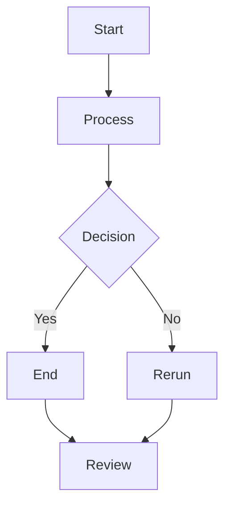
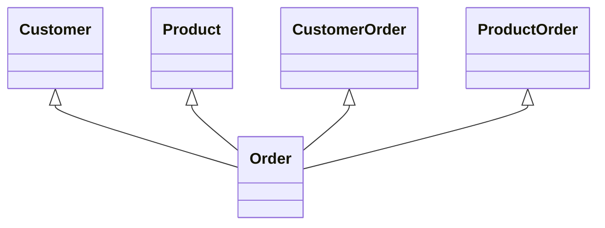
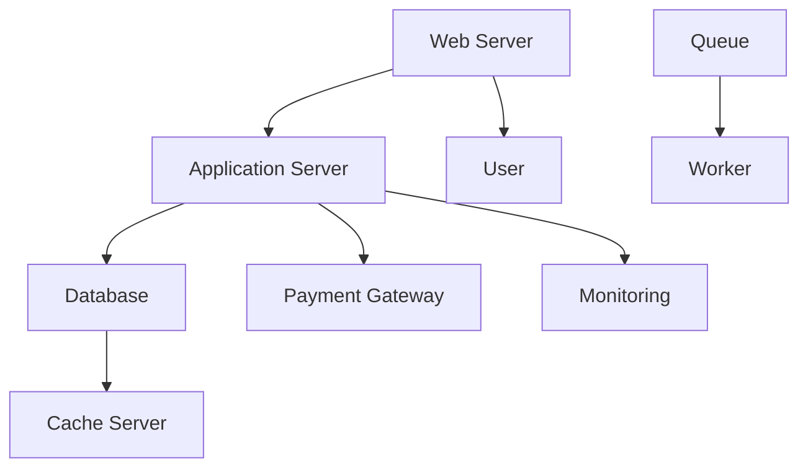
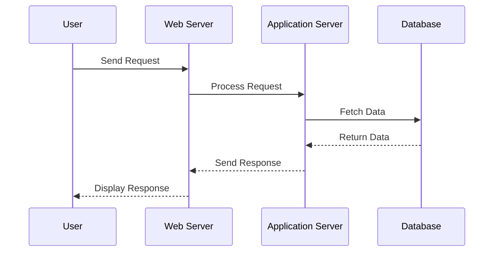
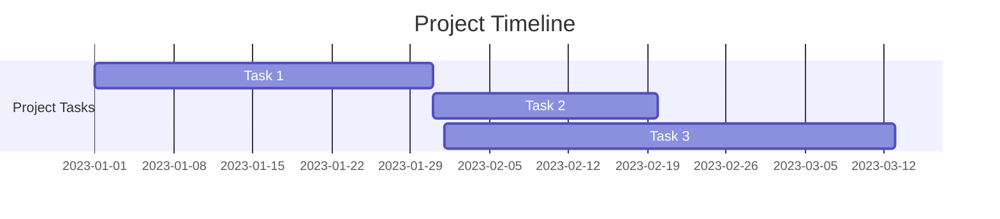

                 

# 《软件架构图工具：绘制清晰的系统结构图》

## 关键词：
软件架构图、系统结构、UML图、PlantUML、Mermaid、Python

## 摘要：
本文旨在深入探讨软件架构图工具在绘制系统结构图中的应用。通过对核心概念的分析、算法原理的讲解、系统分析与架构设计方案的描述，以及项目实战的演示，本文将帮助读者理解和掌握如何使用软件架构图工具来提高软件开发的效率和清晰度。文章还将提供最佳实践、小结和拓展阅读，以引导读者进一步探索这一领域。

---

## 1. 背景介绍

在软件开发领域，软件架构图是一种重要的视觉工具，它能够帮助开发者、架构师和项目经理更好地理解、沟通和设计复杂的软件系统。软件架构图工具则是在这一过程中起到关键作用的工具，它不仅提供了直观的图形表示，还能够帮助自动化地生成和维护这些图形。

### 1.1 软件架构图工具的作用

软件架构图工具的主要作用包括：

1. **图形化表示**：将软件系统以图形的形式展示出来，使得系统结构更加直观易懂。
2. **沟通协作**：通过图形化的方式，使得团队成员能够更清楚地理解系统设计，提高沟通效率。
3. **问题定位**：在系统开发过程中，架构图可以帮助识别潜在的问题和风险，便于及时调整。

### 1.2 为什么要绘制清晰的系统结构图

绘制清晰的系统结构图的重要性体现在以下几个方面：

1. **提高可维护性**：清晰的架构图有助于未来的维护工作，使得开发者能够更快地理解系统的整体结构和各个模块的功能。
2. **促进复用**：通过系统结构图，可以发现和利用系统的复用机会，提高开发效率。
3. **风险管理**：架构图能够揭示系统的潜在问题和风险，有助于提前制定应对策略。

---

## 2. 核心概念与联系

在深入探讨软件架构图工具之前，我们需要明确几个核心概念，如软件架构、系统结构图和UML图，并理解它们之间的联系和区别。

### 2.1 软件架构

软件架构是指系统的整体结构和组织方式，它定义了系统的各个组件及其相互关系。软件架构不仅包括技术层面的设计，还涵盖了业务逻辑、性能需求等非功能特性。

### 2.2 系统结构图

系统结构图是软件架构的具体表现形式，它通过图形化的方式展示了系统的组成和各个组件之间的关系。系统结构图通常使用统一建模语言（UML）来绘制。

### 2.3 UML图

UML（统一建模语言）是一种用于描述软件系统的图形化语言，它定义了一系列的图，如类图、序列图、组件图等，用于描述软件系统的不同方面。

### 2.4 核心概念属性特征对比表格

为了更好地理解这些核心概念，我们可以准备一个对比表格：

| 概念        | 定义                                                         | 特征                                       |
|-------------|------------------------------------------------------------|------------------------------------------|
| 软件架构    | 系统的整体设计和结构                                       | 技术和非功能特性、模块化和层次化           |
| 系统结构图  | 软件架构的图形化表示                                       | 直观、易于理解和沟通                     |
| UML图       | 用于描述软件系统的图形化语言                               | 类图、序列图、组件图等多种图形表示形式   |

### 2.5 ER实体关系图架构

为了进一步展示概念之间的联系，我们使用Mermaid绘制一个ER实体关系图架构：

```mermaid
erDiagram
  Customer ||--|{ Order }|--| CustomerOrder : CustomerOrder
  Product ||--|{ Order }|--| ProductOrder : Product
```

这个ER图展示了顾客、订单和产品之间的关系，强调了系统结构图中的关键组件及其相互作用。

---

## 3. 算法原理讲解

在本节中，我们将选择一个常见的软件架构图工具——Mermaid，来讲解其算法原理和使用方法。

### 3.1 Mermaid基本流程图

Mermaid是一种基于Markdown的绘图工具，它能够生成结构清晰的流程图。以下是使用Mermaid绘制的基本流程图示例：



这个流程图展示了从开始到结束的步骤，包括决策和循环。

### 3.2 使用Python源代码演示

下面是一个使用Python源代码来演示如何使用Mermaid创建系统结构图的示例：

```python
import mermaid

# 创建Mermaid对象
m = mermaid.Mermaid()

# 添加流程图
m.add_section('System Architecture', 'graph TB\n'
              'A[Server] --> B[Database]\n'
              'B --> C[Client]')

# 生成Mermaid代码
mermaid_code = m.get_code()

# 输出Mermaid代码
print(mermaid_code)
```

这个Python脚本生成了一个简单的系统结构图，展示了服务器、数据库和客户端之间的关系。

### 3.3 算法原理的数学模型和公式

在软件架构图中，我们经常需要使用数学模型和公式来描述系统的性能、复杂度等特性。以下是一个简单的数学模型示例：

$$
C(n) = O(n\log(n))
$$

这个公式描述了一个系统在处理n个任务时的复杂度，其中n表示任务的个数。$O(n\log(n))$表示随着任务数量的增加，系统的复杂度以对数级别增长。

### 3.4 详细讲解和举例说明

为了更好地理解上述数学模型，我们可以通过一个简单的例子来说明：

假设有一个系统需要处理100个任务，每个任务的处理时间为常数时间c。那么，系统的总处理时间T可以表示为：

$$
T = 100c + 100\log(100)
$$

如果c=1秒，则T=100+100\log(100)≈210秒。这意味着，即使每个任务的处理时间很短，随着任务数量的增加，系统的总处理时间也会显著增加。

---

## 4. 系统分析与架构设计方案

在本节中，我们将通过一个具体的项目场景来展示如何使用软件架构图工具进行系统分析与架构设计。

### 4.1 项目场景介绍

假设我们要开发一个企业级应用，该应用需要处理大量用户请求，提供高效的业务处理能力。为了确保系统的稳定性和可扩展性，我们需要进行详细的系统分析与架构设计。

### 4.2 领域模型类图

领域模型类图用于描述系统的核心实体和它们之间的关系。以下是使用Mermaid绘制的领域模型类图示例：



这个类图展示了顾客、订单、产品以及它们之间的继承关系。

### 4.3 系统架构图

系统架构图用于展示系统的整体结构和各个组件之间的关系。以下是使用Mermaid绘制的系统架构图示例：



这个架构图展示了Web服务器、应用服务器、数据库、缓存服务器、用户、支付网关、队列和监控组件之间的关系。

### 4.4 系统接口设计

系统接口设计是系统架构设计的重要组成部分，它定义了各个组件之间的交互接口。以下是使用Mermaid绘制的系统接口设计图示例：



这个序列图展示了用户请求的处理流程，包括Web服务器、应用服务器和数据库之间的交互。

### 4.5 系统交互

系统交互是系统运行时的动态行为，它描述了各个组件之间的协作和通信。以下是使用Mermaid绘制的系统交互图示例：



这个甘特图展示了项目的任务安排和进度，有助于项目团队进行协调和监控。

---

## 5. 项目实战

在本节中，我们将通过一个具体的案例，演示如何使用软件架构图工具进行项目实战。

### 5.1 环境安装

首先，我们需要安装Mermaid和相关的Python库。以下是安装步骤：

```bash
# 安装Mermaid
npm install -g mermaid-cli

# 安装Python库
pip install mermaid-python
```

### 5.2 系统核心实现源代码

接下来，我们将提供一个简单的系统核心实现源代码示例：

```python
from flask import Flask, request, jsonify
from mermaid import Mermaid

app = Flask(__name__)

@app.route('/api/process', methods=['POST'])
def process_request():
    data = request.json
    # 处理请求的逻辑
    response = {"status": "success", "data": data}
    return jsonify(response)

@app.route('/api/diagram', methods=['GET'])
def generate_diagram():
    m = Mermaid()
    m.add_section('System Architecture', 'graph TB\n'
                  'A[Web Server] --> B[Application Server]\n'
                  'B --> C[Database]\n'
                  'C --> D[Cache Server]\n'
                  'A --> E[User]\n'
                  'B --> F[Payment Gateway]\n')
    mermaid_code = m.get_code()
    return mermaid_code

if __name__ == '__main__':
    app.run(debug=True)
```

这个Python脚本使用Flask框架创建了一个简单的Web应用，包括处理请求和生成架构图的接口。

### 5.3 代码应用解读与分析

在这个代码示例中，我们使用了Flask框架来创建Web应用。`/api/process` 接口用于处理用户的请求，而 `/api/diagram` 接口用于生成系统架构图。

### 5.4 实际案例分析和详细讲解剖析

为了进一步展示实际案例，我们可以分析一个具体的场景：当用户提交一个订单时，系统如何处理这个请求。

1. **用户请求**：用户通过Web浏览器提交订单请求。
2. **Web服务器**：Web服务器接收请求，并将其转发给应用服务器。
3. **应用服务器**：应用服务器处理请求，从数据库中获取订单信息，并调用支付网关进行支付处理。
4. **数据库**：数据库存储订单信息和用户信息。
5. **支付网关**：支付网关处理支付请求，并将支付结果返回给应用服务器。
6. **缓存服务器**：缓存服务器存储常用数据，以提高系统性能。
7. **用户**：用户通过Web服务器接收支付结果，并查看订单状态。

通过这个案例，我们可以看到系统架构图的绘制如何帮助理解系统的各个组件及其交互。

### 5.5 项目小结

在这个项目中，我们通过使用Mermaid和Flask框架，成功创建了一个简单的Web应用，并使用架构图工具展示了系统的整体结构和组件交互。这个案例展示了如何在实际项目中应用软件架构图工具，以提高开发效率和系统可维护性。

---

## 6. 最佳实践 tips、小结、注意事项、拓展阅读

### 6.1 最佳实践 tips

1. **一致性**：确保架构图的命名、样式和结构一致，以提高可读性。
2. **简洁性**：避免在架构图中包含无关信息，保持图形简洁明了。
3. **更新维护**：定期更新架构图，以反映系统变化和改进。

### 6.2 小结

本文通过深入探讨软件架构图工具在绘制系统结构图中的应用，从核心概念、算法原理、系统分析与架构设计方案，到项目实战，全面展示了如何使用软件架构图工具提高软件开发的效率和质量。

### 6.3 注意事项

1. **准确性**：确保架构图的准确性，避免出现误导信息。
2. **适应性**：根据项目需求和环境，选择合适的软件架构图工具。
3. **文档化**：将架构图与相关文档保持一致，以便于团队协作和后续维护。

### 6.4 拓展阅读

1. 《软件架构设计：实践者的研究方法》
2. 《UML教程：从基础到高级》
3. 《Mermaid官方文档》

通过阅读这些资料，读者可以进一步加深对软件架构图工具的理解和应用。

---

## 作者信息

作者：AI天才研究院/AI Genius Institute & 禅与计算机程序设计艺术 /Zen And The Art of Computer Programming

---

本文通过详细的技术分析、实例演示和最佳实践，旨在为读者提供关于软件架构图工具的全面指导，帮助他们在软件开发过程中更好地绘制和利用系统结构图，提高项目的效率和质量。

