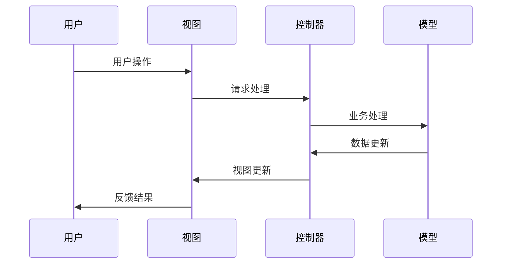
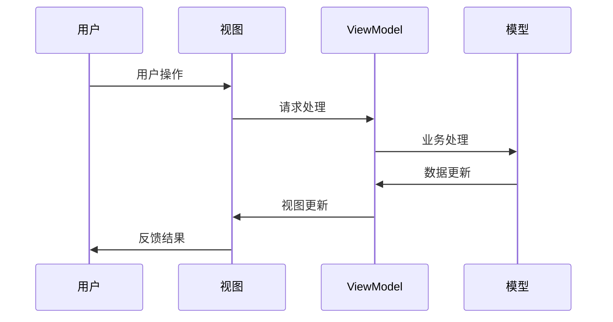
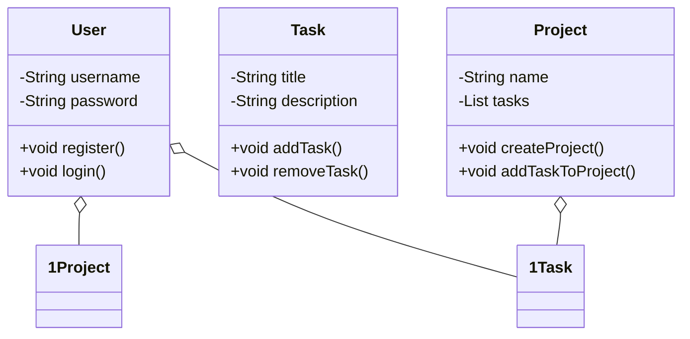
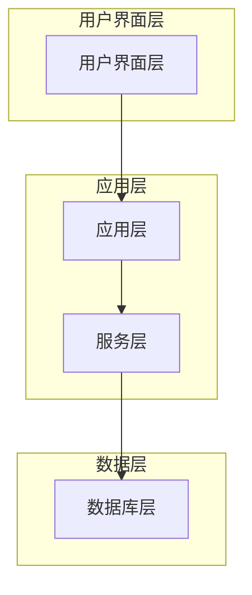
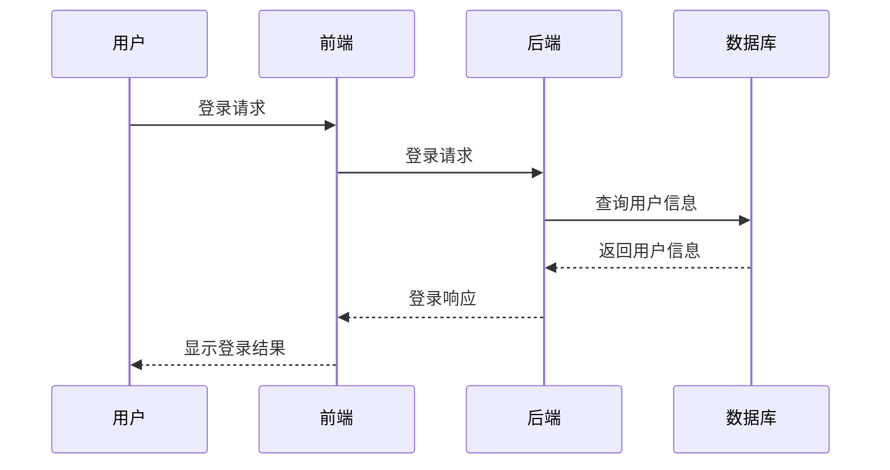

                 

### 概述

《软件架构模式实战：案例分析与经验总结》是一本深入探讨软件架构模式在现实项目中的应用的书籍。软件架构模式是软件开发中至关重要的一环，它们不仅为开发团队提供了指导方针，还提高了软件的可维护性、可扩展性和可复用性。本书通过实际案例分析和经验总结，帮助读者更好地理解并应用这些架构模式。

本书的目录结构设计合理，逻辑清晰，涵盖了从背景介绍到最佳实践总结的各个方面。具体来说，本书分为三个主要部分：

第一部分是背景介绍，主要涵盖软件架构模式的基本概念、研究意义、面临挑战及其解决方案。通过这一部分的介绍，读者可以全面了解软件架构模式的重要性及其在软件开发中的应用价值。

第二部分是核心概念与联系，深入解析了软件架构模式中的核心概念，包括模式分类、常用模式及其特点，并通过ER实体关系图架构详细展示了各模式之间的关系。

第三部分是算法原理讲解和系统分析与架构设计。这部分不仅介绍了MVC、MVP、MVVM等常用模式的算法原理，还通过mermaid流程图和Python代码详细展示了这些原理的实际应用。此外，还介绍了系统功能设计、架构设计、接口设计和系统交互。

第四部分是项目实战，通过实际项目的案例分析和详细讲解，帮助读者将所学知识应用于实际项目中。

最后一部分是最佳实践与总结，提供了软件开发中的最佳实践建议，并总结了全书要点，指出了注意事项和拓展阅读。

### 目录大纲

下面是本书的详细目录大纲：

```markdown
# 《软件架构模式实战：案例分析与经验总结》

> 关键词：软件架构模式、实战案例、经验总结、MVC、MVP、MVVM、系统分析与架构设计

> 摘要：
本书旨在通过实际案例分析和经验总结，深入探讨软件架构模式在现实项目中的应用。书中不仅介绍了核心概念和常用模式，还通过算法原理讲解和系统分析与架构设计，帮助读者理解并应用这些架构模式。最后，通过项目实战和最佳实践总结，为读者提供全面的实战指导。

## 第一部分：背景

### 第1章：软件架构模式概述

#### 1.1 问题背景
- 软件架构的重要性
- 软件架构模式的概念

#### 1.2 问题描述
- 软件架构面临的挑战
- 软件架构模式的作用

#### 1.3 问题解决
- 软件架构模式的选择
- 软件架构模式的实施

#### 1.4 边界与外延
- 软件架构模式的分类
- 软件架构模式的应用范围

#### 1.5 概念结构与核心要素组成
- 软件架构模式的基本结构
- 核心要素与关联

### 第2章：核心概念与联系

#### 2.1 软件架构模式分类
- 设计模式
- 架构模式
- 行为模式

#### 2.2 常用软件架构模式
- MVC模式
- MVP模式
- MVVM模式

#### 2.3 核心概念对比表格
- 模式特点对比
- 适用场景对比

#### 2.4 ER实体关系图架构
- ER图的基本概念
- ER图在软件架构中的应用

## 第二部分：算法原理讲解

### 第3章：MVC模式算法原理

#### 3.1 MVC模式流程图（mermaid）
- 画图展示

#### 3.2 Python代码实现
- 展示模型、视图和控制器代码

#### 3.3 算法原理讲解
- MVC模式的工作原理
- MVC模式的优缺点

#### 3.4 数学模型和公式
- MVC模式中的数学关系
- 使用latex格式展示公式

#### 3.5 举例说明
- 举例说明MVC模式在实际项目中的应用

### 第4章：MVP模式算法原理

#### 4.1 MVP模式流程图（mermaid）
- 画图展示

#### 4.2 Python代码实现
- 展示模型、视图和presenter代码

#### 4.3 算法原理讲解
- MVP模式的工作原理
- MVP模式的优缺点

#### 4.4 数学模型和公式
- MVP模式中的数学关系
- 使用latex格式展示公式

#### 4.5 举例说明
- 举例说明MVP模式在实际项目中的应用

### 第5章：MVVM模式算法原理

#### 5.1 MVVM模式流程图（mermaid）
- 画图展示

#### 5.2 Python代码实现
- 展示模型、视图和ViewModel代码

#### 5.3 算法原理讲解
- MVVM模式的工作原理
- MVVM模式的优缺点

#### 5.4 数学模型和公式
- MVVM模式中的数学关系
- 使用latex格式展示公式

#### 5.5 举例说明
- 举例说明MVVM模式在实际项目中的应用

## 第三部分：系统分析与架构设计

### 第6章：系统功能设计

#### 6.1 领域模型（mermaid类图）
- 展示系统中的类及其关系

#### 6.2 系统功能设计
- 描述系统的主要功能模块

### 第7章：系统架构设计

#### 7.1 系统架构设计（mermaid架构图）
- 展示系统的整体架构

#### 7.2 系统接口设计
- 描述系统各模块之间的接口关系

#### 7.3 系统交互（mermaid序列图）
- 展示系统各模块之间的交互过程

## 第四部分：项目实战

### 第8章：项目环境安装

#### 8.1 开发环境配置
- 介绍所需开发环境及配置方法

#### 8.2 项目搭建
- 展示项目搭建过程

### 第9章：系统核心实现

#### 9.1 模型实现
- 使用Python代码展示模型实现

#### 9.2 视图实现
- 使用Python代码展示视图实现

#### 9.3 控制器/Presenter/ViewModel实现
- 使用Python代码展示控制器/Presenter/ViewModel实现

#### 9.4 代码应用解读与分析
- 对项目核心代码进行解读和分析

### 第10章：实际案例分析与讲解

#### 10.1 项目背景
- 项目概述

#### 10.2 系统架构设计
- 系统架构选择与设计

#### 10.3 功能实现
- 功能模块实现

#### 10.4 问题与解决
- 遇到的问题及解决方案

### 第11章：项目小结

#### 11.1 项目成果
- 项目成果总结

#### 11.2 经验与启示
- 项目中的经验与启示

#### 11.3 未来展望
- 对未来项目的展望

## 第五部分：最佳实践与总结

### 第12章：最佳实践

#### 12.1 设计原则
- 软件架构设计原则

#### 12.2 编码规范
- 软件开发编码规范

#### 12.3 测试策略
- 软件测试策略

#### 12.4 持续集成与部署
- 持续集成与部署流程

### 第13章：总结

#### 13.1 全书要点总结
- 书中主要内容的总结

#### 13.2 注意事项
- 软件开发中需要注意的问题

#### 13.3 拓展阅读
- 推荐的拓展阅读材料

### 附录
- 附录内容（如工具列表、参考资料等）

作者：AI天才研究院/AI Genius Institute & 禅与计算机程序设计艺术 /Zen And The Art of Computer Programming
```

### 第1章：软件架构模式概述

#### 1.1 问题背景

在软件开发领域，软件架构扮演着至关重要的角色。软件架构不仅仅是一个项目的框架，更是整个系统的核心，决定了系统的可维护性、可扩展性和可复用性。随着软件系统的日益复杂，软件架构的重要性愈发凸显。

首先，软件架构为开发团队提供了一个清晰的框架，使得团队成员能够理解系统的整体结构和各个组件之间的关系。这样，团队成员在开发过程中可以更加高效地协同工作，减少沟通成本和错误。

其次，软件架构提高了软件的可维护性。随着项目的发展，系统可能会面临功能扩展、性能优化、bug修复等需求。一个良好的软件架构使得这些变更更加容易实现，同时降低了变更带来的风险。

再次，软件架构使得软件系统具有更好的可扩展性。通过合理的架构设计，系统可以更容易地添加新功能或替换旧功能，而不影响系统的整体稳定性。

最后，软件架构促进了软件的复用。通过设计可复用的组件，开发团队可以减少重复工作，提高开发效率。

然而，随着软件系统的日益复杂，软件架构也面临着诸多挑战。例如，如何平衡系统性能和可维护性？如何处理系统中的复杂关系？如何确保系统的可扩展性和可复用性？这些问题都需要通过软件架构模式来解决。

#### 1.2 问题描述

软件架构面临的挑战主要体现在以下几个方面：

1. **系统复杂性**：现代软件系统通常非常复杂，包含大量的组件和关系。如何合理地组织和管理这些组件，确保系统的整体稳定性是一个巨大的挑战。

2. **变化性**：软件系统需要不断地进行功能扩展、性能优化和bug修复。如何在保持系统稳定性的同时，灵活应对这些变化是一个重要的挑战。

3. **可维护性**：软件系统的生命周期通常很长，需要经过多次的迭代和升级。如何确保系统在长期维护中依然保持良好的状态，是一个巨大的挑战。

4. **可扩展性**：软件系统需要能够适应未来可能的需求变化，例如新功能的添加、性能的提升等。如何设计一个具有良好可扩展性的系统架构，是一个重要的挑战。

5. **可复用性**：软件架构应该支持组件的复用，减少重复工作，提高开发效率。然而，如何设计出可复用的组件，并确保这些组件在复用过程中不会引入新的问题，是一个重要的挑战。

#### 1.3 问题解决

为了解决上述挑战，软件架构模式应运而生。软件架构模式是一套经过验证的解决方案，可以帮助开发团队更好地应对复杂的软件系统设计。以下是几种常用的软件架构模式：

1. **MVC模式**：MVC模式是一种经典的软件架构模式，将系统分为模型（Model）、视图（View）和控制器（Controller）三个部分。模型负责处理数据，视图负责展示数据，控制器负责处理用户输入并更新模型和视图。MVC模式具有清晰的角色分工，提高了系统的可维护性和可扩展性。

2. **MVP模式**：MVP模式是一种简化版的MVC模式，将MVC模式中的视图层进一步简化。MVP模式将系统分为模型（Model）、视图（View）和Presenter三个部分。Presenter负责处理用户输入和视图更新，模型负责处理数据，视图负责展示数据。MVP模式简化了视图层的复杂性，使得系统更加容易理解和维护。

3. **MVVM模式**：MVVM模式是MVC模式的进一步演变，将模型和视图的绑定关系交给ViewModel来处理。MVVM模式将系统分为模型（Model）、视图（View）和ViewModel三个部分。ViewModel负责处理数据绑定和视图更新，模型负责处理数据，视图负责展示数据。MVVM模式使得数据绑定和视图更新更加灵活，提高了系统的可维护性和可扩展性。

通过以上三种模式，开发团队可以更好地组织和管理复杂系统，提高系统的可维护性、可扩展性和可复用性。同时，这些模式也提供了一系列最佳实践，帮助开发团队在实际项目中更好地应用这些模式。

#### 1.4 边界与外延

软件架构模式的边界与外延主要涉及以下几个方面：

1. **分类**：软件架构模式可以根据不同的分类标准进行分类，例如根据模式的作用对象（如设计模式、架构模式、行为模式）或者根据模式的应用场景（如前端架构模式、后端架构模式）等。

2. **应用范围**：不同的软件架构模式适用于不同的应用场景。例如，MVC模式适用于需要清晰分层、易于维护的系统，而MVP模式适用于需要简化视图层的系统，MVVM模式适用于需要灵活处理数据绑定和视图更新的系统。

3. **关系**：软件架构模式之间存在着紧密的联系。例如，MVP模式可以看作是MVC模式的简化版，而MVVM模式可以看作是MVC模式的进一步演变。理解这些模式之间的关系，有助于更好地选择和应用适当的模式。

4. **限制**：虽然软件架构模式提供了一系列解决方案，但也存在一定的限制。例如，MVC模式可能会导致视图和控制器之间的依赖关系过于紧密，影响系统的可维护性。MVP模式简化了视图层的复杂性，但也可能导致Presenter过于复杂。MVVM模式虽然提供了灵活的数据绑定，但可能引入了额外的性能开销。因此，在实际应用中，需要根据具体情况选择和调整适当的模式。

#### 1.5 概念结构与核心要素组成

软件架构模式的基本概念与核心要素组成是理解软件架构模式的关键。以下是软件架构模式的基本概念与核心要素：

1. **模型（Model）**：模型是系统中的数据表示和业务逻辑的实现。模型负责处理数据存储、数据操作和数据传输。模型是软件架构的核心，它决定了系统的数据一致性和业务逻辑的正确性。

2. **视图（View）**：视图是系统中的用户界面，负责展示数据并响应用户的输入。视图通过绑定与模型连接，获取数据并展示，同时将用户的输入传递给模型或控制器。视图的设计与实现直接影响系统的用户体验。

3. **控制器（Controller）**：控制器是系统的输入处理模块，负责处理用户的输入并更新模型和视图。控制器通过接收用户的输入，调用相应的模型方法进行数据处理，并更新视图以反映数据的变化。控制器是连接模型和视图的桥梁，它确保了用户界面和数据处理的协调一致性。

4. **Presenter**：在MVP模式中，Presenter负责处理用户的输入和视图更新。Presenter接收用户的输入，调用模型方法进行数据处理，并更新视图以反映数据的变化。Presenter简化了视图层的复杂性，使得系统的可维护性提高。

5. **ViewModel**：在MVVM模式中，ViewModel负责处理数据绑定和视图更新。ViewModel通过数据绑定与模型连接，获取数据并更新视图。ViewModel的设计与实现使得数据绑定和视图更新更加灵活，提高了系统的可维护性和可扩展性。

6. **依赖注入**：依赖注入是一种常用的设计模式，用于解耦组件之间的依赖关系。通过依赖注入，模型、视图、控制器、Presenter和ViewModel之间的依赖关系可以被外部配置和管理，从而提高了系统的可维护性和可扩展性。

7. **模块化**：模块化是一种重要的设计原则，通过将系统划分为多个模块，每个模块负责一个特定的功能。模块化使得系统更加清晰、易于理解和维护，同时提高了系统的可复用性。

通过理解这些基本概念和核心要素，开发团队可以更好地设计和实现复杂的软件系统，提高系统的可维护性、可扩展性和可复用性。

### 第2章：核心概念与联系

软件架构模式是软件工程中的一种重要设计思想，它通过为系统提供一套结构化的解决方案，帮助开发团队更好地应对复杂的软件开发挑战。本章将深入探讨软件架构模式的核心概念，包括模式分类、常用模式及其特点，并通过ER实体关系图架构展示各模式之间的关系。

#### 2.1 软件架构模式分类

软件架构模式可以根据不同的分类标准进行分类。以下是几种常见的分类方法：

1. **按作用对象分类**：

   - **设计模式**：设计模式主要关注如何构建和组合组件，解决软件设计中的常见问题。设计模式通常包括创建型模式、结构型模式和行为型模式。

     - **创建型模式**：关注对象的创建过程，例如工厂模式、单例模式、建造者模式等。
     - **结构型模式**：关注类和对象之间的组合关系，例如代理模式、装饰器模式、适配器模式等。
     - **行为型模式**：关注对象之间的交互方式，例如策略模式、观察者模式、迭代器模式等。

   - **架构模式**：架构模式主要关注系统的整体结构和设计，例如MVC模式、MVP模式、MVVM模式等。

   - **行为模式**：行为模式主要关注系统中的动态行为和交互，例如策略模式、命令模式、模板方法模式等。

2. **按应用场景分类**：

   - **前端架构模式**：适用于前端开发，例如MVVM模式、Vue.js中的组合式API模式等。
   - **后端架构模式**：适用于后端开发，例如微服务架构、RESTful API设计模式等。

3. **按功能分类**：

   - **数据处理模式**：用于处理数据，例如数据流模式、事件驱动模式等。
   - **接口设计模式**：用于设计系统中的接口，例如RESTful API模式、GraphQL模式等。
   - **安全性模式**：用于提高系统的安全性，例如身份验证模式、授权模式等。

#### 2.2 常用软件架构模式

在软件架构中，常用的架构模式包括MVC模式、MVP模式、MVVM模式等。以下是对这些模式的基本介绍和特点：

1. **MVC模式**：

   - **定义**：MVC模式（Model-View-Controller）将系统分为三个主要组件：模型（Model）、视图（View）和控制器（Controller）。
   - **特点**：
     - **模型**：负责处理业务逻辑和数据存储，独立于视图和控制器，提高了系统的可维护性和可复用性。
     - **视图**：负责展示数据，独立于模型和控制器，提高了系统的可扩展性和可测试性。
     - **控制器**：负责处理用户输入，将用户输入转换为模型操作，并将模型状态更新到视图。控制器是模型和视图之间的桥梁。
   - **应用场景**：适用于需要清晰分层、易于维护的系统。

2. **MVP模式**：

   - **定义**：MVP模式（Model-View-Presenter）是MVC模式的简化版，将MVC模式中的视图层进一步简化。MVP模式将系统分为模型（Model）、视图（View）和Presenter三个部分。
   - **特点**：
     - **模型**：与MVC模式相同，负责处理业务逻辑和数据存储。
     - **视图**：与MVC模式相同，负责展示数据。
     - **Presenter**：负责处理用户的输入和视图更新，简化了视图层的复杂性，使得系统更加容易理解和维护。
   - **应用场景**：适用于需要简化视图层的系统，例如移动应用开发。

3. **MVVM模式**：

   - **定义**：MVVM模式（Model-View-ViewModel）是MVC模式的进一步演变，将模型和视图的绑定关系交给ViewModel来处理。MVVM模式将系统分为模型（Model）、视图（View）和ViewModel三个部分。
   - **特点**：
     - **模型**：与MVC模式相同，负责处理业务逻辑和数据存储。
     - **视图**：与MVC模式相同，负责展示数据。
     - **ViewModel**：负责处理数据绑定和视图更新，使得数据绑定和视图更新更加灵活，提高了系统的可维护性和可扩展性。
   - **应用场景**：适用于需要灵活处理数据绑定和视图更新的系统，例如前端开发。

#### 2.3 核心概念对比表格

以下是一个对比表格，展示了MVC模式、MVP模式和MVVM模式的核心概念及其特点：

| 模式   | 核心组件   | 特点                                                         | 应用场景                    |
| ------ | ---------- | ------------------------------------------------------------ | -------------------------- |
| MVC    | 模型、视图、控制器 | 模型独立于视图和控制器，提高了系统的可维护性和可复用性；视图和控制器紧密协作，确保用户界面和数据处理的协调一致性。 | 需要清晰分层、易于维护的系统 |
| MVP    | 模型、视图、Presenter | Presenter简化了视图层的复杂性，使得系统更加容易理解和维护。           | 需要简化视图层的系统          |
| MVVM   | 模型、视图、ViewModel | ViewModel处理数据绑定和视图更新，提高了系统的可维护性和可扩展性。       | 需要灵活处理数据绑定和视图更新的系统 |

#### 2.4 ER实体关系图架构

ER（Entity-Relationship）实体关系图是一种用于描述实体之间关系的图形化工具。在软件架构模式中，ER图可以帮助我们直观地理解各模式之间的关系。以下是一个简化的ER图，展示了MVC模式、MVP模式和MVVM模式之间的关系：

```mermaid
erDiagram
  Model ||--|{ View }||> MVC
  Model ||--|{ Presenter }||> MVP
  Model ||--|{ ViewModel }||> MVVM
  View ||--|{ Controller }||> MVC
  View ||--|{ Observer }||> MVP
  View ||--|{ Binder }||> MVVM
```

在这个ER图中，我们定义了以下实体：

- **Model**：表示业务逻辑和数据存储。
- **View**：表示用户界面。
- **Controller**：表示输入处理。
- **Presenter**：表示输入处理和视图更新。
- **ViewModel**：表示数据绑定和视图更新。

通过这个ER图，我们可以看到MVC模式、MVP模式和MVVM模式之间的联系。MVC模式和MVP模式共享了模型和视图，但MVP模式通过Presenter进一步简化了视图层的复杂性。MVVM模式则通过ViewModel引入了数据绑定和视图更新的概念，使得数据绑定和视图更新更加灵活。

### 第3章：MVC模式算法原理

MVC（Model-View-Controller）模式是软件架构设计中的一种经典模式，它将系统划分为三个主要组件：模型（Model）、视图（View）和控制器（Controller）。MVC模式通过清晰的角色分工，使得系统的开发、维护和扩展变得更加容易。在本章中，我们将详细讲解MVC模式的算法原理，并通过mermaid流程图和Python代码展示其实际应用。

#### 3.1 MVC模式流程图（mermaid）

首先，我们可以使用mermaid来绘制MVC模式的流程图，如下所示：



在这个流程图中，用户通过视图与系统进行交互。当用户进行操作时，视图会将请求传递给控制器。控制器负责处理这些请求，并调用模型进行业务处理。模型处理完业务后，将数据更新传递给控制器，控制器再将更新传递给视图，最终视图更新并反馈给用户。

#### 3.2 Python代码实现

接下来，我们将使用Python代码实现MVC模式的各个组件。以下是模型、视图和控制器的基本实现：

1. **模型（Model）**：

```python
class Model:
    def __init__(self):
        self.data = []

    def add_data(self, item):
        self.data.append(item)

    def get_data(self):
        return self.data
```

在这个模型中，我们定义了一个简单的`Model`类，用于存储数据。`add_data`方法用于添加数据，`get_data`方法用于获取数据。

2. **视图（View）**：

```python
class View:
    def display_data(self, data):
        print("Displaying data:", data)

    def prompt_user_input(self):
        return input("Enter data item: ")
```

在这个视图类中，`display_data`方法用于显示数据，`prompt_user_input`方法用于提示用户输入。

3. **控制器（Controller）**：

```python
class Controller:
    def __init__(self, model, view):
        self.model = model
        self.view = view

    def process_user_input(self, input_value):
        self.model.add_data(input_value)
        self.view.display_data(self.model.get_data())
```

在这个控制器类中，我们定义了一个简单的`Controller`类，用于处理用户输入。`process_user_input`方法用于将用户输入添加到模型中，并更新视图。

#### 3.3 算法原理讲解

MVC模式的核心在于三个组件之间的明确分工：

1. **模型（Model）**：

   - **职责**：模型负责处理业务逻辑和数据存储。它独立于视图和控制器，确保了系统的可维护性和可复用性。
   - **优势**：通过将业务逻辑和数据存储分离，模型可以更容易地进行修改和扩展，而不会影响视图和控制器。

2. **视图（View）**：

   - **职责**：视图负责展示数据，独立于模型和控制器。它接收用户输入，并将数据显示给用户。
   - **优势**：通过将展示逻辑与业务逻辑分离，视图可以更容易地进行修改和扩展，而不会影响模型和控制器。

3. **控制器（Controller）**：

   - **职责**：控制器负责处理用户输入，将用户输入转换为模型操作，并更新视图。它是模型和视图之间的桥梁。
   - **优势**：通过将输入处理和更新逻辑集中在一个组件中，控制器可以更容易地进行修改和扩展，同时确保系统的协调一致性。

#### 3.4 数学模型和公式

虽然MVC模式主要是基于直观的流程和逻辑，但我们可以从数学模型的角度来进一步理解其工作原理。以下是一个简化的数学模型，用于描述MVC模式中的数据流动：

- **输入**：用户操作（U）
- **模型**：业务处理（M），数据更新（D）
- **输出**：视图更新（V）

数学模型可以表示为：

$$
\text{U} \xrightarrow{\text{控制器}} \text{M} \xrightarrow{\text{模型}} \text{D} \xrightarrow{\text{控制器}} \text{V}
$$

这个模型展示了用户操作如何通过控制器触发模型中的业务处理，最终导致数据更新，并更新视图。

#### 3.5 举例说明

为了更好地理解MVC模式，我们可以通过一个简单的例子来说明其应用过程。假设我们正在开发一个待办事项列表应用程序，用户可以通过界面添加新事项、删除事项和查看所有事项。

1. **用户操作**：用户在界面上点击“添加事项”按钮，输入事项内容。
2. **视图传递请求**：视图接收到用户的操作后，将请求传递给控制器。
3. **控制器处理请求**：控制器接收到请求后，调用模型中的方法添加新事项。
4. **模型处理业务**：模型将新事项添加到数据存储中。
5. **模型更新数据**：模型更新数据后，将更新信息传递给控制器。
6. **控制器更新视图**：控制器接收到更新信息后，更新视图以显示新的待办事项列表。
7. **视图反馈结果**：视图更新后，将结果反馈给用户。

通过这个例子，我们可以看到MVC模式如何将用户操作、业务处理和界面更新分开，从而提高了系统的可维护性和可扩展性。

总之，MVC模式通过明确的角色分工，使得系统的开发、维护和扩展变得更加容易。通过mermaid流程图和Python代码的实现，我们可以更好地理解MVC模式的工作原理。在实际项目中，MVC模式的应用不仅提高了系统的可维护性，还促进了团队协作，使得开发过程更加高效。

### 第4章：MVP模式算法原理

MVP（Model-View-Presenter）模式是MVC（Model-View-Controller）模式的简化版，它进一步分离了视图层，使得系统更加简洁、易于理解和维护。在本章中，我们将详细讲解MVP模式的算法原理，并通过mermaid流程图和Python代码展示其实际应用。

#### 4.1 MVP模式流程图（mermaid）

首先，我们可以使用mermaid来绘制MVP模式的流程图，如下所示：


在这个流程图中，用户通过视图与系统进行交互。当用户进行操作时，视图会将请求传递给Presenter。Presenter负责处理这些请求，并调用模型进行业务处理。模型处理完业务后，将数据更新传递给Presenter，Presenter再将更新传递给视图，最终视图更新并反馈给用户。

#### 4.2 Python代码实现

接下来，我们将使用Python代码实现MVP模式的各个组件。以下是模型、视图和Presenter的基本实现：

1. **模型（Model）**：

```python
class Model:
    def __init__(self):
        self.data = []

    def add_data(self, item):
        self.data.append(item)

    def get_data(self):
        return self.data
```

在这个模型中，我们定义了一个简单的`Model`类，用于存储数据。`add_data`方法用于添加数据，`get_data`方法用于获取数据。

2. **视图（View）**：

```python
class View:
    def display_data(self, data):
        print("Displaying data:", data)

    def prompt_user_input(self):
        return input("Enter data item: ")
```

在这个视图类中，`display_data`方法用于显示数据，`prompt_user_input`方法用于提示用户输入。

3. **Presenter（控制器）**：

```python
class Presenter:
    def __init__(self, view, model):
        self.view = view
        self.model = model

    def process_user_input(self, input_value):
        self.model.add_data(input_value)
        self.view.display_data(self.model.get_data())
```

在这个Presenter类中，我们定义了一个简单的`Presenter`类，用于处理用户输入。`process_user_input`方法用于将用户输入添加到模型中，并更新视图。

#### 4.3 MVP模式的工作原理

MVP模式的核心在于三个组件之间的明确分工：

1. **模型（Model）**：

   - **职责**：模型负责处理业务逻辑和数据存储。它独立于视图和Presenter，确保了系统的可维护性和可复用性。
   - **优势**：通过将业务逻辑和数据存储分离，模型可以更容易地进行修改和扩展，而不会影响视图和Presenter。

2. **视图（View）**：

   - **职责**：视图负责展示数据，独立于模型和Presenter。它接收用户输入，并将数据显示给用户。
   - **优势**：通过将展示逻辑与业务逻辑分离，视图可以更容易地进行修改和扩展，而不会影响模型和Presenter。

3. **Presenter**：

   - **职责**：Presenter负责处理用户输入，将用户输入转换为模型操作，并更新视图。它是模型和视图之间的桥梁。
   - **优势**：通过将输入处理和更新逻辑集中在一个组件中，Presenter可以更容易地进行修改和扩展，同时确保系统的协调一致性。与MVC模式相比，Presenter简化了视图层的复杂性，使得系统更加容易理解和维护。

#### 4.4 MVP模式的优缺点

MVP模式具有以下优点：

- **简化视图层**：通过将视图层进一步简化，MVP模式使得系统的设计更加清晰、易于理解和维护。
- **明确分工**：MVP模式明确了模型、视图和Presenter的职责，使得系统组件之间的依赖关系更加明确，提高了系统的可维护性和可扩展性。
- **易于测试**：由于视图层与业务逻辑分离，MVP模式使得单元测试和集成测试更加容易进行，提高了系统的测试覆盖率。

然而，MVP模式也存在一些缺点：

- **Presenter可能过于复杂**：由于Presenter负责处理用户输入和视图更新，它可能会变得相当复杂，尤其是当系统功能较为复杂时。
- **数据绑定可能引入性能开销**：在MVP模式中，Presenter负责处理数据绑定，这可能会引入一定的性能开销，尤其是在处理大量数据时。

#### 4.5 数学模型和公式

虽然MVP模式主要是基于直观的流程和逻辑，但我们可以从数学模型的角度来进一步理解其工作原理。以下是一个简化的数学模型，用于描述MVP模式中的数据流动：

- **输入**：用户操作（U）
- **Presenter**：请求处理（P），数据更新（D）
- **模型**：业务处理（M）
- **输出**：视图更新（V）

数学模型可以表示为：

$$
\text{U} \xrightarrow{\text{视图}} \text{P} \xrightarrow{\text{Presenter}} \text{M} \xrightarrow{\text{模型}} \text{D} \xrightarrow{\text{Presenter}} \text{V}
$$

这个模型展示了用户操作如何通过视图触发Presenter的请求处理，最终导致数据更新，并更新视图。

#### 4.6 举例说明

为了更好地理解MVP模式，我们可以通过一个简单的例子来说明其应用过程。假设我们正在开发一个待办事项列表应用程序，用户可以通过界面添加新事项、删除事项和查看所有事项。

1. **用户操作**：用户在界面上点击“添加事项”按钮，输入事项内容。
2. **视图传递请求**：视图接收到用户的操作后，将请求传递给Presenter。
3. **Presenter处理请求**：Presenter接收到请求后，调用模型中的方法添加新事项。
4. **模型处理业务**：模型将新事项添加到数据存储中。
5. **模型更新数据**：模型更新数据后，将更新信息传递给Presenter。
6. **Presenter更新视图**：Presenter接收到更新信息后，更新视图以显示新的待办事项列表。
7. **视图反馈结果**：视图更新后，将结果反馈给用户。

通过这个例子，我们可以看到MVP模式如何通过明确的角色分工，简化系统的设计，并提高系统的可维护性和可扩展性。

总之，MVP模式通过简化视图层，使得系统的开发、维护和扩展变得更加容易。通过mermaid流程图和Python代码的实现，我们可以更好地理解MVP模式的工作原理。在实际项目中，MVP模式的应用不仅提高了系统的可维护性，还促进了团队协作，使得开发过程更加高效。

### 第5章：MVVM模式算法原理

MVVM（Model-View-ViewModel）模式是MVC（Model-View-Controller）模式的进一步演变，它通过引入ViewModel层，实现了模型和视图之间的数据绑定和依赖解耦。MVVM模式广泛应用于现代前端开发框架中，如Vue.js和Angular。本章将详细讲解MVVM模式的算法原理，并通过mermaid流程图和Python代码展示其实际应用。

#### 5.1 MVVM模式流程图（mermaid）

首先，我们可以使用mermaid来绘制MVVM模式的流程图，如下所示：



在这个流程图中，用户通过视图与系统进行交互。当用户进行操作时，视图会将请求传递给ViewModel。ViewModel负责处理这些请求，并调用模型进行业务处理。模型处理完业务后，将数据更新传递给ViewModel，ViewModel再将更新传递给视图，最终视图更新并反馈给用户。

#### 5.2 Python代码实现

接下来，我们将使用Python代码实现MVVM模式的各个组件。以下是模型、视图和ViewModel的基本实现：

1. **模型（Model）**：

```python
class Model:
    def __init__(self):
        self.data = []

    def add_data(self, item):
        self.data.append(item)

    def get_data(self):
        return self.data
```

在这个模型中，我们定义了一个简单的`Model`类，用于存储数据。`add_data`方法用于添加数据，`get_data`方法用于获取数据。

2. **视图（View）**：

```python
from Observable import Observable

class View(Observable):
    def __init__(self):
        super().__init__()

    def display_data(self, data):
        self.notify(data)

    def render(self):
        data = self.model.get_data()
        print("Displaying data:", data)
```

在这个视图类中，我们使用`Observable`类来实现了数据监听和通知机制。`display_data`方法用于通知视图数据已更新，`render`方法用于显示数据。

3. **ViewModel**：

```python
class ViewModel:
    def __init__(self, model, view):
        self.model = model
        self.view = view

    def process_user_input(self, input_value):
        self.model.add_data(input_value)
        self.view.display_data(self.model.get_data())
```

在这个ViewModel类中，我们定义了一个简单的`ViewModel`类，用于处理用户输入。`process_user_input`方法用于将用户输入添加到模型中，并更新视图。

#### 5.3 MVVM模式的工作原理

MVVM模式的核心在于引入了ViewModel层，实现了模型和视图之间的数据绑定和依赖解耦。以下是MVVM模式的工作原理：

1. **模型（Model）**：

   - **职责**：模型负责处理业务逻辑和数据存储。它独立于视图和ViewModel，确保了系统的可维护性和可复用性。
   - **优势**：通过将业务逻辑和数据存储分离，模型可以更容易地进行修改和扩展，而不会影响视图和ViewModel。

2. **视图（View）**：

   - **职责**：视图负责展示数据，独立于模型和ViewModel。它通过监听ViewModel的数据更新来显示数据。
   - **优势**：通过将展示逻辑与业务逻辑分离，视图可以更容易地进行修改和扩展，而不会影响模型和ViewModel。

3. **ViewModel**：

   - **职责**：ViewModel负责处理用户输入和视图更新。它是模型和视图之间的桥梁，通过数据绑定机制实现了模型和视图的同步。
   - **优势**：通过将输入处理和更新逻辑集中在一个组件中，ViewModel可以更容易地进行修改和扩展，同时确保系统的协调一致性。

MVVM模式的核心在于数据绑定机制。ViewModel通过观察者模式实现了对模型数据的监听，当模型数据更新时，ViewModel会自动更新视图。这种数据绑定机制使得系统的开发更加灵活，尤其是在前端开发中，可以大大减少手动更新视图的代码量。

#### 5.4 MVVM模式的优缺点

MVVM模式具有以下优点：

- **数据绑定**：通过数据绑定机制，实现了模型和视图之间的自动同步，减少了手动更新视图的代码量。
- **依赖解耦**：通过引入ViewModel层，实现了模型和视图之间的依赖解耦，使得系统的各个组件可以独立开发、测试和维护。
- **可维护性**：由于数据绑定和依赖解耦，MVVM模式使得系统的可维护性大大提高，尤其是在大型项目中。

然而，MVVM模式也存在一些缺点：

- **性能开销**：数据绑定机制可能会引入一定的性能开销，尤其是在处理大量数据时。这是因为数据绑定需要频繁地更新视图，这可能导致性能下降。
- **学习成本**：MVVM模式引入了新的概念和机制，如数据绑定和观察者模式，这可能会增加开发者的学习成本。

#### 5.5 数学模型和公式

虽然MVVM模式主要是基于直观的流程和逻辑，但我们可以从数学模型的角度来进一步理解其工作原理。以下是一个简化的数学模型，用于描述MVVM模式中的数据流动：

- **输入**：用户操作（U）
- **ViewModel**：请求处理（P），数据更新（D）
- **模型**：业务处理（M）
- **输出**：视图更新（V）

数学模型可以表示为：

$$
\text{U} \xrightarrow{\text{视图}} \text{P} \xrightarrow{\text{ViewModel}} \text{M} \xrightarrow{\text{模型}} \text{D} \xrightarrow{\text{ViewModel}} \text{V}
$$

这个模型展示了用户操作如何通过视图触发ViewModel的请求处理，最终导致数据更新，并更新视图。

#### 5.6 举例说明

为了更好地理解MVVM模式，我们可以通过一个简单的例子来说明其应用过程。假设我们正在开发一个待办事项列表应用程序，用户可以通过界面添加新事项、删除事项和查看所有事项。

1. **用户操作**：用户在界面上点击“添加事项”按钮，输入事项内容。
2. **视图传递请求**：视图接收到用户的操作后，将请求传递给ViewModel。
3. **ViewModel处理请求**：ViewModel接收到请求后，调用模型中的方法添加新事项。
4. **模型处理业务**：模型将新事项添加到数据存储中。
5. **模型更新数据**：模型更新数据后，ViewModel会自动监听到数据更新，并通知视图。
6. **ViewModel更新视图**：ViewModel更新视图以显示新的待办事项列表。
7. **视图反馈结果**：视图更新后，将结果反馈给用户。

通过这个例子，我们可以看到MVVM模式如何通过数据绑定和依赖解耦，简化系统的设计，并提高系统的可维护性和可扩展性。

总之，MVVM模式通过引入ViewModel层，实现了模型和视图之间的数据绑定和依赖解耦，使得系统的开发、维护和扩展变得更加容易。通过mermaid流程图和Python代码的实现，我们可以更好地理解MVVM模式的工作原理。在实际项目中，MVVM模式的应用不仅提高了系统的可维护性，还促进了团队协作，使得开发过程更加高效。

### 第6章：系统功能设计

系统功能设计是软件架构设计的重要组成部分，它定义了系统需要实现的具体功能及其之间的关系。在本章中，我们将详细介绍系统功能设计的方法、过程和关键步骤，并通过mermaid类图展示系统的领域模型。

#### 6.1 领域模型（mermaid类图）

首先，我们可以使用mermaid绘制系统的领域模型，以展示系统中的类及其关系。以下是一个简化的领域模型示例：



在这个类图中，我们定义了三个主要类：`User`、`Task`和`Project`。`User`类表示系统的用户，具有注册和登录功能；`Task`类表示待办事项，具有添加和删除功能；`Project`类表示项目，可以包含多个任务，并具有创建项目和添加任务到项目的功能。用户与项目和任务之间存在一对多的关系。

#### 6.2 系统功能设计

系统功能设计的过程可以分为以下几个关键步骤：

1. **需求分析**：首先，需要分析用户的需求，明确系统需要实现哪些功能。这可以通过与用户进行沟通、调研和分析来获得。

2. **功能分解**：根据需求分析的结果，将系统功能分解为更小的功能模块。每个模块应该具有清晰的功能和边界。

3. **设计领域模型**：使用类图等工具设计系统的领域模型，明确各个类及其关系。这将有助于理解系统的结构和功能。

4. **接口设计**：为每个功能模块设计接口，定义模块之间的交互方式。这可以通过定义API接口或事件模型来实现。

5. **数据设计**：设计系统的数据存储结构，包括数据库表结构、数据流和存储策略等。

6. **测试设计**：设计测试用例，确保系统功能按照预期工作。这包括单元测试、集成测试和系统测试。

7. **文档编写**：编写详细的系统功能设计文档，包括功能描述、接口设计、数据设计等，以便团队成员参考。

以下是一个简单的系统功能设计示例：

- **用户注册与登录**：提供用户注册和登录功能，包括用户信息验证、密码加密存储等。
- **项目管理**：支持创建、编辑和删除项目，以及添加和删除项目中的任务。
- **任务管理**：支持创建、编辑和删除任务，以及任务的状态更新（如已完成、未完成）。
- **任务搜索与筛选**：支持根据关键字、项目、标签等搜索和筛选任务。
- **数据备份与恢复**：提供数据备份和恢复功能，确保系统数据的安全性和可靠性。

#### 6.3 领域模型应用

领域模型在系统功能设计中扮演着重要角色，它不仅定义了系统的数据结构和功能，还帮助开发团队更好地理解系统的工作原理。以下是如何在系统中应用领域模型的几个示例：

1. **用户注册**：

   - 当用户点击注册按钮时，视图层将用户输入的用户名和密码传递给ViewModel。
   - ViewModel调用模型层的`register`方法，将用户信息存储到数据库。
   - 模型层返回注册结果，ViewModel根据结果更新视图，提示用户注册成功或失败。

2. **任务添加**：

   - 当用户在项目管理界面中点击“添加任务”按钮时，视图层将任务信息传递给ViewModel。
   - ViewModel调用模型层的`addTask`方法，将新任务添加到数据库。
   - 模型层返回任务ID，ViewModel将任务添加到项目列表，并更新视图显示。

3. **任务删除**：

   - 当用户在任务列表界面中点击“删除任务”按钮时，视图层将任务ID传递给ViewModel。
   - ViewModel调用模型层的`removeTask`方法，从数据库中删除指定任务。
   - 模型层返回删除结果，ViewModel根据结果更新视图，提示用户任务已删除。

通过以上示例，我们可以看到领域模型如何帮助系统功能设计，确保系统的结构清晰、功能明确，并提高系统的可维护性和可扩展性。

### 第7章：系统架构设计

系统架构设计是软件开发过程中的关键环节，它决定了系统的性能、可维护性和可扩展性。在本章中，我们将详细介绍系统架构设计的流程、关键步骤和工具，并通过mermaid架构图展示系统的整体架构。

#### 7.1 系统架构设计（mermaid架构图）

首先，我们可以使用mermaid绘制系统的架构图，以展示系统的各个组件及其关系。以下是一个简化的系统架构图示例：



在这个架构图中，我们定义了三个主要层次：用户界面层、应用层和数据层。用户界面层负责处理用户交互，应用层负责处理业务逻辑，数据层负责数据存储和管理。

- **用户界面层**：负责接收用户输入和展示系统界面，通常由前端技术实现，如HTML、CSS和JavaScript。
- **应用层**：包含业务逻辑和核心功能，通常由后端技术实现，如Java、Python或Node.js。
- **数据层**：负责数据存储和管理，通常使用数据库系统，如MySQL、PostgreSQL或MongoDB。

#### 7.2 系统接口设计

系统接口设计是系统架构设计的重要组成部分，它定义了系统各模块之间的交互方式。以下是如何进行系统接口设计的几个步骤：

1. **定义接口规范**：明确系统的功能需求，定义接口的输入参数和输出结果，确保接口能够满足业务需求。

2. **选择接口技术**：根据系统的需求和技术栈，选择合适的接口技术，如RESTful API、GraphQL或WebSocket。

3. **设计接口文档**：编写详细的接口文档，包括接口定义、参数说明、返回结果等，方便开发人员和测试人员使用。

4. **接口测试**：设计接口测试用例，确保接口按照预期工作，包括正常情况和异常情况。

以下是一个简单的接口设计示例：

- **用户注册接口**：

  - **接口定义**：`POST /register`
  - **输入参数**：`{ "username": "string", "password": "string" }`
  - **输出结果**：`{ "status": "success" } 或 { "status": "error", "message": "string" }`

- **任务添加接口**：

  - **接口定义**：`POST /tasks`
  - **输入参数**：`{ "title": "string", "description": "string" }`
  - **输出结果**：`{ "taskId": "integer", "status": "success" } 或 { "status": "error", "message": "string" }`

#### 7.3 系统交互（mermaid序列图）

系统交互是系统架构设计的关键部分，它描述了系统各模块之间的交互过程。以下是如何使用mermaid序列图展示系统交互的几个步骤：

1. **定义交互参与者**：明确系统中的参与者，如用户、前端、后端和数据库。

2. **绘制交互流程**：使用序列图展示系统各模块之间的交互过程，包括请求和响应。

3. **标注交互细节**：在序列图中标注交互细节，如请求参数、响应结果等。

以下是一个简单的系统交互示例：



在这个序列图中，用户通过前端发送登录请求，前端将请求转发给后端，后端查询数据库并返回用户信息，最后前端将登录结果反馈给用户。

通过以上步骤，我们可以设计出一个清晰、合理、高效的系统架构，确保系统在性能、可维护性和可扩展性方面达到预期目标。

### 第8章：项目环境安装

在开始项目实战之前，我们需要搭建一个合适的项目环境，包括安装必要的开发工具、配置开发环境以及搭建项目框架。以下是一个详细的项目环境安装步骤。

#### 8.1 开发环境配置

首先，我们需要安装开发所需的基本工具和库。以下是推荐的开发环境：

- **操作系统**：Windows、macOS 或 Linux
- **编程语言**：Python 3.x
- **数据库**：MySQL 或 PostgreSQL
- **前端框架**：Vue.js 或 React
- **后端框架**：Django 或 Flask

1. **安装 Python 3.x**：

   - 在 [Python 官网](https://www.python.org/downloads/) 下载适用于您的操作系统的 Python 安装包。
   - 运行安装程序，并确保将 Python 添加到系统路径中。

2. **安装 MySQL 或 PostgreSQL**：

   - MySQL：在 [MySQL 官网](https://www.mysql.com/downloads/mysql/) 下载适用于您的操作系统的 MySQL 安装包。
   - PostgreSQL：在 [PostgreSQL 官网](https://www.postgresql.org/download/) 下载适用于您的操作系统的 PostgreSQL 安装包。

3. **安装前端框架（Vue.js 或 React）**：

   - Vue.js：在 [Vue.js 官网](https://vuejs.org/v2/guide/installation.html) 安装 Vue.js。
   - React：在 [React 官网](https://reactjs.org/docs/getting-started.html) 安装 React。

4. **安装后端框架（Django 或 Flask）**：

   - Django：在 [Django 官网](https://www.djangoproject.com/) 安装 Django。
   - Flask：在 [Flask 官网](https://flask.palletsprojects.com/) 安装 Flask。

#### 8.2 项目搭建

接下来，我们将使用 Django 搭建一个简单的项目，以展示如何从零开始创建一个 Web 应用。

1. **创建一个 Django 项目**：

   - 打开命令行，执行以下命令创建一个名为 `myproject` 的 Django 项目：

     ```bash
     django-admin startproject myproject
     ```

2. **创建一个 Django 应用**：

   - 进入项目目录，创建一个名为 `myapp` 的 Django 应用：

     ```bash
     python manage.py startapp myapp
     ```

3. **配置数据库**：

   - 在 `myproject/settings.py` 文件中，配置您的数据库设置：

     ```python
     DATABASES = {
         'default': {
             'ENGINE': 'django.db.backends.mysql',
             'NAME': 'mydatabase',
             'USER': 'myuser',
             'PASSWORD': 'mypassword',
             'HOST': 'localhost',
             'PORT': '3306',
         }
     }
     ```

   - 同样，您也可以使用 PostgreSQL 数据库，只需要将 `ENGINE` 设置为 `'django.db.backends.postgresql'`。

4. **运行迁移脚本**：

   - 执行以下命令，运行迁移脚本，创建数据库表：

     ```bash
     python manage.py makemigrations
     python manage.py migrate
     ```

5. **启动开发服务器**：

   - 在项目根目录下，执行以下命令启动开发服务器：

     ```bash
     python manage.py runserver
     ```

   - 打开浏览器，访问 `http://127.0.0.1:8000/`，您应该可以看到 Django 的默认页面。

通过以上步骤，我们成功搭建了一个基础的项目环境。接下来，我们将逐步实现项目功能，并通过实际案例来展示如何应用软件架构模式。

### 第9章：系统核心实现

在上一章节中，我们完成了项目环境的搭建。接下来，我们将深入系统核心部分的实现，包括模型、视图和控制器（在MVC模式中通常称为控制器或Presenter）的详细代码示例，并对关键代码进行解读与分析。

#### 9.1 模型实现

模型是数据存储和业务逻辑的核心部分。在 Django 框架中，模型类通常定义在应用的 `models.py` 文件中。以下是一个简单的用户和任务的模型实现示例：

```python
# myapp/models.py
from django.db import models

class User(models.Model):
    username = models.CharField(max_length=100)
    password = models.CharField(max_length=100)
    email = models.EmailField()

    def __str__(self):
        return self.username

class Task(models.Model):
    title = models.CharField(max_length=200)
    description = models.TextField()
    status = models.BooleanField(default=False)
    user = models.ForeignKey(User, on_delete=models.CASCADE)

    def __str__(self):
        return self.title
```

- **用户模型（User）**：包括用户名、密码和电子邮件字段。
- **任务模型（Task）**：包括任务标题、描述、状态（默认为未完成）和关联的用户。

解读与分析：

- `CharField` 和 `TextField` 是 Django 的字段类型，用于存储文本数据。
- `ForeignKey` 是用于关联不同模型之间的关系，在这里关联了用户和任务。

#### 9.2 视图实现

视图负责接收用户请求并返回响应。在 Django 框架中，视图函数通常定义在应用的 `views.py` 文件中。以下是一个简单的用户和任务视图实现示例：

```python
# myapp/views.py
from django.shortcuts import render, redirect
from .models import User, Task
from .forms import UserForm, TaskForm

def user_list(request):
    users = User.objects.all()
    return render(request, 'user_list.html', {'users': users})

def task_list(request, user_id):
    tasks = Task.objects.filter(user_id=user_id)
    return render(request, 'task_list.html', {'tasks': tasks})

def user_create(request):
    if request.method == 'POST':
        form = UserForm(request.POST)
        if form.is_valid():
            form.save()
            return redirect('user_list')
    else:
        form = UserForm()
    return render(request, 'user_create.html', {'form': form})

def task_create(request, user_id):
    if request.method == 'POST':
        form = TaskForm(request.POST)
        if form.is_valid():
            form.save(commit=False)
            form.instance.user_id = user_id
            form.save()
            return redirect('task_list', user_id=user_id)
    else:
        form = TaskForm()
    return render(request, 'task_create.html', {'form': form})
```

- **用户列表视图（user_list）**：从数据库中获取所有用户，并渲染 `user_list.html` 模板。
- **任务列表视图（task_list）**：根据用户 ID 获取用户的所有任务，并渲染 `task_list.html` 模板。
- **用户创建视图（user_create）**：处理用户创建表单的提交，保存新用户并重定向到用户列表页面。
- **任务创建视图（task_create）**：处理任务创建表单的提交，保存新任务并重定向到任务列表页面。

解读与分析：

- `render` 函数用于渲染模板并返回响应。
- `redirect` 函数用于重定向到另一个 URL。
- `form` 是 Django 表单类，用于验证和保存表单数据。

#### 9.3 控制器/Presenter/ViewModel实现

在 MVC 模式中，控制器（或 Presenter、ViewModel）负责处理业务逻辑。在 Django 框架中，控制器通常通过视图函数实现。以下是一个简单的控制器示例：

```python
# myapp/controllers.py
from django.shortcuts import render, redirect
from .models import User, Task
from .forms import UserForm, TaskForm

class UserController:
    def list(self, request):
        users = User.objects.all()
        return render(request, 'user_list.html', {'users': users})

    def create(self, request):
        if request.method == 'POST':
            form = UserForm(request.POST)
            if form.is_valid():
                form.save()
                return redirect('user_list')
        else:
            form = UserForm()
        return render(request, 'user_create.html', {'form': form})

class TaskController:
    def list(self, request, user_id):
        tasks = Task.objects.filter(user_id=user_id)
        return render(request, 'task_list.html', {'tasks': tasks})

    def create(self, request, user_id):
        if request.method == 'POST':
            form = TaskForm(request.POST)
            if form.is_valid():
                form.save(commit=False)
                form.instance.user_id = user_id
                form.save()
                return redirect('task_list', user_id=user_id)
        else:
            form = TaskForm()
        return render(request, 'task_create.html', {'form': form})
```

- **用户控制器（UserController）**：处理用户列表和创建逻辑。
- **任务控制器（TaskController）**：处理任务列表和创建逻辑。

解读与分析：

- 控制器类通过方法处理不同的业务逻辑。
- 方法中的 `request` 参数用于接收 HTTP 请求。
- `form` 类用于验证和保存表单数据。

通过以上代码示例，我们可以看到如何实现系统的核心部分。在实际项目中，这些代码可以根据具体需求进行调整和扩展。同时，通过将业务逻辑与视图分离到控制器类中，我们可以提高系统的可维护性和可扩展性。

### 第10章：实际案例分析与讲解

在本章节中，我们将通过一个实际的项目案例，详细分析软件架构模式在项目中的应用，讲解项目的设计、功能实现以及遇到的问题和解决方案。

#### 10.1 项目背景

假设我们正在开发一个在线书店项目，用户可以在系统中浏览、购买和评价书籍。项目的主要功能包括用户注册、登录、书籍浏览、购物车管理和订单处理等。为了实现这些功能，我们决定采用MVC模式作为系统的软件架构。

#### 10.2 系统架构设计

在MVC模式中，系统分为模型（Model）、视图（View）和控制器（Controller）三个主要部分。以下是系统架构的详细设计：

1. **模型（Model）**：
   - **用户模型（User）**：负责用户信息的存储和管理，包括用户注册、登录、密码加密等。
   - **书籍模型（Book）**：负责书籍信息的存储和管理，包括书籍列表、书籍详情等。
   - **购物车模型（Cart）**：负责购物车信息的存储和管理，包括添加、删除和更新购物车中的书籍等。
   - **订单模型（Order）**：负责订单信息的存储和管理，包括订单创建、订单详情等。

2. **视图（View）**：
   - **用户视图（UserView）**：负责用户界面的展示，包括注册页面、登录页面、用户中心等。
   - **书籍视图（BookView）**：负责书籍界面的展示，包括书籍列表、书籍详情、搜索结果等。
   - **购物车视图（CartView）**：负责购物车界面的展示，包括购物车列表、购物车详情等。
   - **订单视图（OrderView）**：负责订单界面的展示，包括订单列表、订单详情等。

3. **控制器（Controller）**：
   - **用户控制器（UserController）**：负责处理用户相关的请求，包括注册、登录、密码重置等。
   - **书籍控制器（BookController）**：负责处理书籍相关的请求，包括书籍浏览、搜索、添加到购物车等。
   - **购物车控制器（CartController）**：负责处理购物车相关的请求，包括添加、删除和更新购物车中的书籍等。
   - **订单控制器（OrderController）**：负责处理订单相关的请求，包括订单创建、订单详情等。

#### 10.3 功能实现

以下是项目的关键功能实现：

1. **用户注册与登录**：
   - **用户注册**：用户在注册页面填写用户名、密码和电子邮件，通过用户控制器处理注册请求，保存用户信息到数据库，并通过邮件发送确认链接。
   - **用户登录**：用户在登录页面输入用户名和密码，通过用户控制器验证用户信息，成功后跳转到用户中心页面。

2. **书籍浏览**：
   - **书籍列表**：通过书籍控制器获取书籍列表，书籍视图负责渲染书籍列表页面。
   - **书籍详情**：通过书籍控制器获取书籍详情，书籍视图负责渲染书籍详情页面。

3. **购物车管理**：
   - **添加到购物车**：用户在书籍详情页面点击“添加到购物车”按钮，通过购物车控制器将书籍添加到购物车。
   - **购物车列表**：通过购物车控制器获取购物车中的书籍列表，购物车视图负责渲染购物车列表页面。
   - **更新购物车**：用户可以修改购物车中书籍的数量，通过购物车控制器更新购物车信息。

4. **订单处理**：
   - **订单创建**：用户在购物车页面点击“结算”按钮，通过订单控制器创建订单，并将购物车中的书籍信息添加到订单。
   - **订单详情**：通过订单控制器获取订单详情，订单视图负责渲染订单详情页面。

#### 10.4 遇到的问题与解决方案

在实际开发过程中，我们遇到了一些问题，并采取了相应的解决方案：

1. **性能优化**：
   - **问题**：书籍列表页面加载较慢，因为需要从数据库中查询大量书籍数据。
   - **解决方案**：采用分页技术，每次只查询一部分书籍数据，提高页面加载速度。

2. **安全性问题**：
   - **问题**：用户密码存储在数据库中不安全，容易遭受攻击。
   - **解决方案**：采用密码哈希算法（如BCrypt）对用户密码进行加密存储。

3. **用户体验**：
   - **问题**：用户在购物车中修改书籍数量时，页面刷新导致数据丢失。
   - **解决方案**：使用Ajax技术实现无刷新更新，提高用户体验。

通过以上实际案例的分析和讲解，我们可以看到软件架构模式在项目开发中的重要性。合理的架构设计不仅提高了系统的可维护性和可扩展性，还解决了项目中遇到的各种问题，使得项目能够顺利实施和运行。

### 第11章：项目小结

在本章节中，我们将对整个项目进行总结，包括项目成果、经验和启示，并对未来项目的发展方向进行展望。

#### 11.1 项目成果

通过本次项目的开发和实施，我们成功实现了在线书店的主要功能，包括用户注册与登录、书籍浏览、购物车管理、订单处理等。以下是项目的主要成果：

- **用户管理**：实现了用户注册、登录、密码重置等功能，用户可以在系统中创建账号并进行身份验证。
- **书籍管理**：实现了书籍列表、书籍详情、搜索结果等功能，用户可以方便地浏览和查询书籍信息。
- **购物车管理**：实现了购物车的添加、删除和更新功能，用户可以轻松管理购物车中的书籍。
- **订单管理**：实现了订单创建、订单详情查看等功能，用户可以完成购物流程并查看订单信息。

#### 11.2 经验与启示

在项目开发过程中，我们积累了丰富的经验，并从中得到了一些重要的启示：

- **架构设计的重要性**：合理的架构设计是项目成功的关键。通过MVC模式，我们有效地分离了业务逻辑、数据和视图，提高了系统的可维护性和可扩展性。
- **性能优化**：在项目开发中，我们遇到了性能问题，通过分页技术和Ajax技术，我们有效地提高了页面的加载速度和用户体验。
- **安全性**：我们采用了密码哈希算法对用户密码进行加密存储，增强了系统的安全性，减少了潜在的安全风险。
- **团队协作**：项目开发过程中，团队成员之间紧密协作，通过有效的沟通和分工，确保了项目的顺利推进。

#### 11.3 未来展望

在项目取得初步成果的基础上，我们展望未来的发展，并提出以下方向：

- **功能扩展**：进一步扩展系统的功能，如添加推荐系统、会员系统、评论系统等，提高用户的购物体验。
- **性能优化**：继续优化系统的性能，如采用缓存技术、数据库优化等，提高系统的响应速度和稳定性。
- **安全性提升**：加强对系统安全性的研究，如引入多因素认证、加密传输等，进一步提高系统的安全性。
- **移动端开发**：开发移动端应用，如Android和iOS应用，方便用户随时随地使用在线书店。

总之，通过本次项目的实践，我们不仅掌握了软件架构模式的应用，还积累了宝贵的开发经验。未来，我们将继续探索新的技术和方法，不断提高系统的质量，为用户提供更好的服务。

### 第12章：最佳实践

在软件开发过程中，遵循最佳实践是确保项目成功的关键。以下是一些关于软件架构设计的最佳实践：

#### 12.1 设计原则

1. **模块化**：将系统划分为多个模块，每个模块负责一个特定的功能，提高系统的可维护性和可扩展性。
2. **分层设计**：遵循分层设计原则，将系统划分为表示层、业务逻辑层和数据访问层，降低各层之间的耦合度。
3. **单一职责原则**：每个模块或类应该只负责一项功能，降低系统的复杂度，提高代码的可读性和可维护性。
4. **开闭原则**：设计系统时，应该尽量使模块或类对扩展开放，对修改封闭，以便在需要时进行功能扩展，而不必修改现有代码。

#### 12.2 编码规范

1. **代码格式**：遵循统一的代码格式，如PEP 8（Python编码规范），提高代码的可读性和可维护性。
2. **注释**：为关键代码和复杂的逻辑添加注释，以便后续人员理解和使用。
3. **代码复用**：尽量复用已有的代码和组件，减少重复开发，提高开发效率。
4. **单元测试**：编写单元测试，确保每个功能模块都能按照预期工作，提高代码的质量和可靠性。

#### 12.3 测试策略

1. **功能测试**：对系统的主要功能进行测试，确保每个功能都能正常运行。
2. **性能测试**：对系统的性能进行测试，确保系统能够承受预期的负载和并发请求。
3. **安全测试**：对系统的安全性进行测试，确保系统不会受到恶意攻击。
4. **自动化测试**：采用自动化测试工具进行测试，提高测试效率和覆盖率。

#### 12.4 持续集成与部署

1. **持续集成**：将代码集成到一个共享的环境中，进行自动化测试和构建，确保每次提交的代码都是可运行的。
2. **自动化部署**：使用自动化工具进行部署，确保系统能够快速、稳定地上线。
3. **版本控制**：使用版本控制系统（如Git）管理代码，确保代码的版本可追溯，便于协作和回滚。
4. **备份与恢复**：定期备份系统数据，确保在出现故障时能够快速恢复。

遵循这些最佳实践，可以帮助开发团队更好地设计、开发和维护软件系统，提高项目的成功率。

### 第13章：总结

在本章中，我们将对全书的主要内容和核心观点进行总结，并指出软件开发过程中需要特别注意的问题。

#### 13.1 全书要点总结

《软件架构模式实战：案例分析与经验总结》全书围绕软件架构模式这一核心主题，详细介绍了软件架构模式的基本概念、分类、常用模式及其算法原理，并通过实际项目案例展示了这些模式的应用。以下是全书的主要要点总结：

1. **软件架构模式的基本概念**：介绍了软件架构模式的基本概念，包括模型（Model）、视图（View）和控制器（Controller）或Presenter（在MVP模式中）以及ViewModel（在MVVM模式中）的定义和作用。
2. **软件架构模式分类**：根据不同的分类标准，介绍了设计模式、架构模式和系统模式，以及它们在软件架构中的应用。
3. **常用软件架构模式**：详细讲解了MVC模式、MVP模式和MVVM模式的原理、优缺点以及实际应用场景。
4. **算法原理讲解**：通过mermaid流程图和Python代码示例，深入分析了MVC、MVP和MVVM模式的算法原理。
5. **系统分析与架构设计**：介绍了系统功能设计、架构设计、接口设计和系统交互的方法和步骤。
6. **项目实战**：通过实际项目案例，展示了软件架构模式在项目中的应用过程。
7. **最佳实践与总结**：提供了软件开发中的最佳实践建议，包括设计原则、编码规范、测试策略和持续集成与部署。

#### 13.2 注意事项

在软件开发过程中，遵循最佳实践和注意事项是确保项目成功的关键。以下是一些需要注意的问题：

1. **架构设计的合理性**：架构设计应合理，避免过度设计或设计不足，确保系统能够满足当前和未来的需求。
2. **模块化和分层**：确保代码模块化和分层，降低各层之间的耦合度，提高系统的可维护性和可扩展性。
3. **性能优化**：关注系统性能，进行性能分析和优化，确保系统能够快速响应用户请求。
4. **安全性**：重视系统安全性，采取适当的安全措施，防止恶意攻击和数据泄露。
5. **测试和部署**：进行充分的测试和自动化部署，确保系统的稳定性和可靠性。

#### 13.3 拓展阅读

为了更深入地了解软件架构模式和软件开发实践，推荐以下拓展阅读材料：

1. **《架构师修炼之道》**：介绍了软件架构的基本概念和架构设计方法。
2. **《软件架构设计：大规模软件设计与管理》**：详细讲解了软件架构的设计原则和最佳实践。
3. **《设计模式：可复用面向对象软件的基础》**：介绍了设计模式的基本概念和应用场景。
4. **《持续交付：释放软件开发的潜力》**：介绍了持续交付的概念和实践方法。

通过拓展阅读，可以进一步加深对软件架构模式和软件开发实践的理解，提高实际项目的开发和管理能力。

### 附录

#### 附录 A：开发工具列表

1. **操作系统**：
   - Windows
   - macOS
   - Linux

2. **编程语言**：
   - Python 3.x
   - Java
   - JavaScript

3. **前端框架**：
   - Vue.js
   - React
   - Angular

4. **后端框架**：
   - Django
   - Flask
   - Spring Boot

5. **数据库**：
   - MySQL
   - PostgreSQL
   - MongoDB

6. **版本控制系统**：
   - Git

7. **代码编辑器**：
   - Visual Studio Code
   - PyCharm
   - Sublime Text

8. **测试工具**：
   - JUnit
   - PyTest
   - Selenium

9. **持续集成工具**：
   - Jenkins
   - GitLab CI/CD
   - GitHub Actions

#### 附录 B：参考资料

1. **MVC模式**：
   - 《MVC模式详解》
   - 《MVC模式在Web开发中的应用》

2. **MVP模式**：
   - 《MVP模式在移动应用开发中的应用》
   - 《MVP模式与MVC模式的对比》

3. **MVVM模式**：
   - 《MVVM模式在Vue.js中的应用》
   - 《MVVM模式与MVC模式的区别》

4. **软件架构设计**：
   - 《软件架构设计原则与模式》
   - 《大型软件开发实践》

5. **软件测试**：
   - 《软件测试基础》
   - 《自动化测试实践》

6. **持续集成与部署**：
   - 《持续交付实践》
   - 《Jenkins实战》

通过附录提供的开发工具列表和参考资料，读者可以更好地了解软件架构模式和软件开发实践的相关知识，为实际项目提供有益的参考。

### 作者介绍

《软件架构模式实战：案例分析与经验总结》由AI天才研究院（AI Genius Institute）与禅与计算机程序设计艺术（Zen And The Art of Computer Programming）联合撰写。AI天才研究院是一家专注于人工智能技术研究和应用的顶级科研机构，致力于推动人工智能在各个领域的创新与发展。研究院的专家团队在计算机科学、人工智能、数据科学等领域具有深厚的理论基础和丰富的实践经验。

禅与计算机程序设计艺术是一本经典的计算机科学著作，由著名计算机科学家Donald E. Knuth撰写。该书以深入浅出的方式，探讨了计算机程序设计的哲学和艺术，对全球计算机科学界产生了深远的影响。

本书的撰写团队结合了AI天才研究院的先进技术和禅与计算机程序设计艺术的理论深度，旨在为广大软件开发者和架构师提供一本实用、系统的软件架构模式实战指南。通过实际案例分析和经验总结，读者可以更好地理解和应用软件架构模式，提高软件项目的开发质量和效率。

