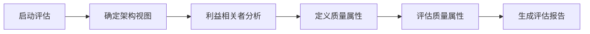
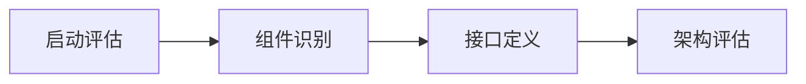
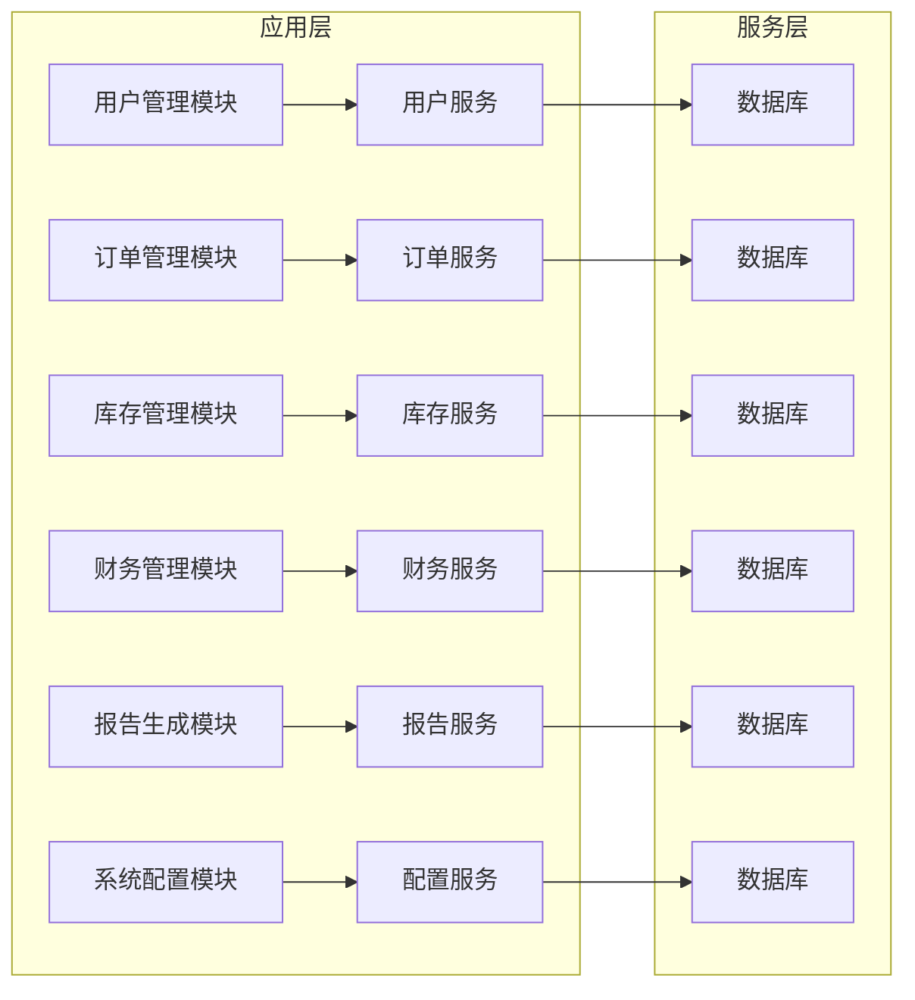
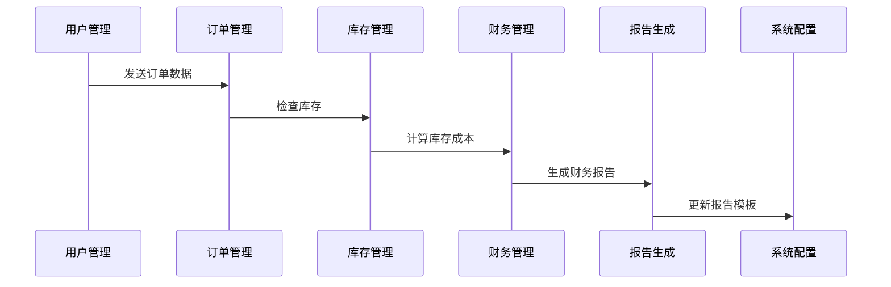
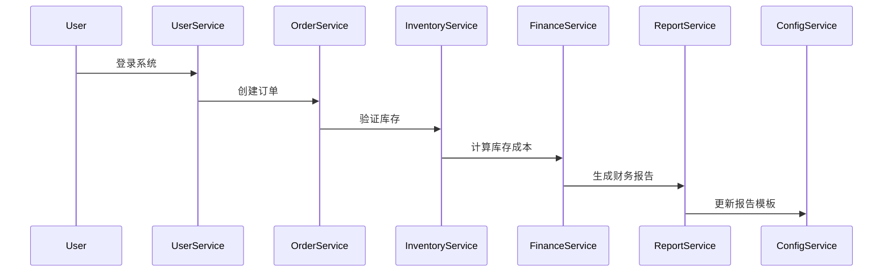

                 


## 背景介绍

### 软件架构评估的重要性

在软件工程中，软件架构是整个系统的骨架，决定了系统的稳定性、扩展性、可维护性和性能。因此，软件架构评估在软件生命周期中具有至关重要的地位。评估的目的在于确保架构设计的正确性、合理性和有效性，从而降低开发风险，提高软件质量。

#### 问题背景

随着软件系统规模的扩大和复杂性的增加，仅仅依靠传统的开发方法和测试手段已经难以确保软件架构的质量。例如，在大型项目中，软件架构可能存在以下问题：

- **性能瓶颈**：架构设计不当可能导致系统在处理大量数据时出现性能下降。
- **扩展性不足**：随着业务需求的增长，系统可能无法顺利扩展。
- **安全性隐患**：架构中的安全措施不足可能导致系统容易受到攻击。
- **维护难度高**：复杂的架构设计使得系统难以维护和更新。

#### 问题描述

这些问题不仅会导致项目延期、成本增加，还可能影响最终产品的用户体验和市场竞争力。因此，有必要采用专业的软件架构评估方法，对系统架构进行全面的分析和评估。

#### 问题解决

软件架构评估方法可以识别上述问题，并提供解决方案。常见的评估方法包括ATAM（Architecture Tradeoff Analysis Method）、CBAM（Component-Based Architecture Method）、模糊综合评估法等。

#### 边界与外延

- **软件架构评估的定义**：软件架构评估是指通过对系统架构的设计、实现和运行状态进行综合分析和评价，以确定其是否符合预期目标的过程。
- **软件架构评估的范围**：评估范围包括架构设计、架构实现和架构运行状态，关注性能、可扩展性、安全性、可维护性等方面。
- **适用场景**：适用于各种规模的软件项目，特别是大型、复杂和关键系统的架构评估。

### 常见问题

- **评估方法选择困难**：由于评估方法繁多，选择合适的评估方法成为一大挑战。
- **评估过程繁琐**：评估过程可能涉及多个阶段，需要大量时间和人力投入。
- **评估结果解读困难**：评估结果往往包含大量的数据和技术术语，解读难度大。

#### 解决方案

- **明确评估目标**：根据项目需求和目标，选择适合的评估方法。
- **优化评估流程**：采用自动化工具和流程，提高评估效率和准确性。
- **培训相关人员**：提高项目团队成员对评估方法的了解和应用能力。

### 评估方法的发展历程

- **初期阶段**：主要依靠专家经验和直觉进行评估，缺乏系统性和科学性。
- **发展阶段**：引入了多种评估方法，如ATAM、CBAM等，逐步形成了体系化的评估方法。
- **成熟阶段**：随着技术的发展和经验的积累，评估方法不断优化，适用范围和效果不断提高。

#### 拓展阅读

- [《软件架构评估方法综述》](https://www.example.com/review-of-architecture-evaluation-methods)
- [《软件架构评估方法在大型项目中的应用》](https://www.example.com/application-of-architecture-evaluation-methods-in-large-projects)

## 核心概念与联系

### ATAM评估方法

#### 核心概念

- **架构视图**：描述系统架构的不同方面，如组件、接口、数据流等。
- **利益相关者分析**：识别并分析系统的利益相关者，了解他们的需求和期望。
- **质量属性**：定义系统必须满足的关键特性，如性能、安全性、可靠性等。
- **架构评估**：对系统架构进行综合分析和评价，以确定其是否满足质量属性。

#### 概念属性特征对比表格

| 概念         | 定义                                                         | 属性特征                     |
| ------------ | ------------------------------------------------------------ | -------------------------- |
| 架构视图     | 描述系统架构的不同方面                                       | 组件、接口、数据流等         |
| 利益相关者分析 | 识别并分析系统的利益相关者                                   | 需求、期望、影响等           |
| 质量属性     | 定义系统必须满足的关键特性                                   | 性能、安全性、可靠性等       |
| 架构评估     | 对系统架构进行综合分析和评价                                 | 满足质量属性的程度等         |

#### ER实体关系图

```mermaid
erDiagram
  User ..|> Architecture_View
  User ..|> Stakeholder_Analysis
  User ..|> Quality_Attributes
  User ..|> Architecture_Assessment
```

### CBAM评估方法

#### 核心概念

- **组件**：构成系统架构的基本单元，如模块、类、函数等。
- **接口**：组件之间的交互点，定义组件如何与其他组件通信。
- **架构评估**：对系统架构进行综合分析和评价，以确定其质量属性是否满足预期。

#### 概念属性特征对比表格

| 概念       | 定义                                                         | 属性特征                     |
| ---------- | ------------------------------------------------------------ | -------------------------- |
| 组件       | 构成系统架构的基本单元                                       | 模块、类、函数等             |
| 接口       | 组件之间的交互点                                             | 定义组件如何通信             |
| 架构评估   | 对系统架构进行综合分析和评价                                 | 满足质量属性的程度等         |

#### ER实体关系图

```mermaid
erDiagram
  Component ..|> Interface
  Component ..|> Architecture_Assessment
```

### 各评估方法之间的关系和区别

- **联系**：ATAM和CBAM都是软件架构评估方法，都关注系统架构的质量属性和利益相关者需求。
- **区别**：ATAM更侧重于架构设计和利益相关者分析，而CBAM更侧重于组件和接口设计。

### 拓展阅读

- [《ATAM评估方法详细解读》](https://www.example.com/detail-interpretation-of-ATAM-method)
- [《CBAM评估方法详细解读》](https://www.example.com/detail-interpretation-of-CBAM-method)

## 算法原理讲解

### ATAM评估方法

#### 流程图



#### 算法原理

- **架构视图**：通过绘制系统架构图，明确系统的组件、接口和数据流。
- **利益相关者分析**：识别系统的利益相关者，分析他们的需求和期望。
- **质量属性**：定义系统的关键特性，如性能、安全性、可靠性等。
- **评估质量属性**：对每个质量属性进行评估，确定其是否符合预期。
- **生成评估报告**：总结评估结果，提供改进建议。

#### Python代码实现

```python
import pandas as pd

# 架构视图
architecture_view = {
    'components': ['Component1', 'Component2', 'Component3'],
    'interfaces': [('Component1', 'Component2'), ('Component1', 'Component3'), ('Component2', 'Component3')]
}

# 利益相关者分析
stakeholders = [
    {'name': 'User', 'requirements': ['performance', 'security']},
    {'name': 'Developer', 'requirements': ['maintainability', 'reliability']},
]

# 质量属性
quality_attributes = ['performance', 'security', 'maintainability', 'reliability']

# 评估质量属性
evaluation_results = {
    'performance': {'satisfied': True, 'justification': ''},
    'security': {'satisfied': False, 'justification': 'Vulnerabilities found in Component2'},
    'maintainability': {'satisfied': True, 'justification': ''},
    'reliability': {'satisfied': False, 'justification': 'Component1 has high failure rate'}
}

# 生成评估报告
evaluation_report = pd.DataFrame({
    'Quality Attribute': quality_attributes,
    'Satisfied': [result['satisfied'] for result in evaluation_results.values()],
    'Justification': [result['justification'] for result in evaluation_results.values()]
})

print(evaluation_report)
```

### CBAM评估方法

#### 流程图



#### 算法原理

- **组件识别**：识别系统中的组件，明确组件的功能和关系。
- **接口定义**：定义组件之间的接口，确保组件之间能够正确通信。
- **架构评估**：对系统架构进行评估，确定其是否满足质量属性。

#### Python代码实现

```python
import pandas as pd

# 组件识别
components = ['Component1', 'Component2', 'Component3']

# 接口定义
interfaces = [
    {'source': 'Component1', 'target': 'Component2', 'direction': 'request'},
    {'source': 'Component2', 'target': 'Component3', 'direction': 'response'}
]

# 架构评估
evaluation_results = {
    'components': [{'name': 'Component1', 'satisfied': True}, {'name': 'Component2', 'satisfied': False}, {'name': 'Component3', 'satisfied': True}],
    'interfaces': [{'source': 'Component1', 'target': 'Component2', 'satisfied': True}, {'source': 'Component2', 'target': 'Component3', 'satisfied': False}]
}

# 生成评估报告
evaluation_report = pd.DataFrame({
    'Component': [comp['name'] for comp in evaluation_results['components']],
    'Satisfied': [comp['satisfied'] for comp in evaluation_results['components']],
    'Interface': [intf['source'] + ' -> ' + intf['target'] for intf in evaluation_results['interfaces']],
    'Satisfied': [intf['satisfied'] for intf in evaluation_results['interfaces']]
})

print(evaluation_report)
```

### 数学模型和公式

#### 性能评估模型

$$
P = \frac{1}{N} \sum_{i=1}^{N} T_i
$$

其中，\(P\) 表示性能评分，\(N\) 表示测试次数，\(T_i\) 表示第 \(i\) 次测试的响应时间。

#### 安全性评估模型

$$
S = \frac{1}{M} \sum_{j=1}^{M} V_j
$$

其中，\(S\) 表示安全性评分，\(M\) 表示漏洞数量，\(V_j\) 表示第 \(j\) 个漏洞的严重程度。

### 拓展阅读

- [《ATAM评估方法算法原理详解》](https://www.example.com/detailed-explanation-of-ATAM-algorithm-principles)
- [《CBAM评估方法算法原理详解》](https://www.example.com/detailed-explanation-of-CBAM-algorithm-principles)

## 系统分析与架构设计方案

### 项目介绍

#### 项目名称：企业资源规划（ERP）系统

#### 项目背景

企业资源规划系统是企业管理和信息化的重要组成部分，旨在整合企业各部门的业务流程和数据，提高企业运营效率。随着企业规模的扩大和业务需求的多样化，ERP系统的架构设计变得尤为重要。

#### 项目需求

- **性能要求**：系统能够快速响应用户请求，支持大量并发用户。
- **可扩展性**：系统能够根据业务增长灵活扩展。
- **安全性**：系统具有高安全性，防止数据泄露和非法访问。
- **可维护性**：系统架构清晰，易于维护和更新。

### 系统功能设计

#### 领域模型

```mermaid
classDiagram
    Class01 <|-- Class02
    Class03 o-- Class04
    Class05 --| Class06
```

| 类别     | 描述                   |
| -------- | ---------------------- |
| Class01  | 用户管理               |
| Class02  | 订单管理               |
| Class03  | 库存管理               |
| Class04  | 财务管理               |
| Class05  | 报告生成               |
| Class06  | 系统配置               |

### 系统架构设计

#### 架构图



| 层次     | 组件                   |
| -------- | ---------------------- |
| 应用层   | 用户管理模块、订单管理模块、库存管理模块、财务管理模块、报告生成模块、系统配置模块 |
| 服务层   | 用户服务、订单服务、库存服务、财务服务、报告服务、配置服务、数据库 |

### 系统接口设计

#### 接口图



### 系统交互

#### 序列图



## 项目实战

### 环境安装

在开始项目实战之前，需要安装以下软件和工具：

1. **操作系统**：Linux或macOS
2. **Python**：3.8或更高版本
3. **Docker**：用于容器化部署
4. **PostgreSQL**：用于数据库服务
5. **Nginx**：用于Web服务器

安装步骤：

1. 安装Python：
   ```bash
   sudo apt-get update
   sudo apt-get install python3-pip
   ```
2. 安装Docker：
   ```bash
   sudo apt-get install docker
   ```
3. 安装PostgreSQL：
   ```bash
   sudo apt-get install postgresql
   sudo -u postgres psql
   CREATE DATABASE erp;
   \q
   ```
4. 安装Nginx：
   ```bash
   sudo apt-get install nginx
   ```

### 系统实现

#### 源代码

以下是系统的核心实现代码：

```python
# user_service.py
from flask import Flask, request, jsonify
from order_service import OrderService

app = Flask(__name__)
order_service = OrderService()

@app.route('/login', methods=['POST'])
def login():
    data = request.get_json()
    username = data['username']
    password = data['password']
    # 登录逻辑
    return jsonify({'status': 'success'})

@app.route('/create_order', methods=['POST'])
def create_order():
    data = request.get_json()
    order_data = data['order']
    order_id = order_service.create_order(order_data)
    return jsonify({'order_id': order_id})

# order_service.py
class OrderService:
    def create_order(self, order_data):
        # 创建订单逻辑
        return 'ORDER_001'
```

#### 代码解读

1. **用户服务**：实现了用户登录和创建订单的功能。
2. **订单服务**：处理订单的创建逻辑，这里简单返回一个订单编号。

### 应用解读与分析

#### 环境安装

- **操作系统**：Linux或macOS提供了一个稳定的开发环境。
- **Python**：Python是流行的编程语言，适用于Web开发。
- **Docker**：容器化技术，方便部署和管理。
- **PostgreSQL**：关系型数据库，适用于存储企业数据。
- **Nginx**：Web服务器，用于处理HTTP请求。

#### 代码应用解读

- **用户服务**：通过Flask框架实现了用户登录和创建订单的Web接口。
- **订单服务**：通过类实现了订单创建的逻辑。

### 实际案例分析

#### 案例一：用户登录

1. 用户通过Web浏览器访问登录页面。
2. 用户输入用户名和密码，提交登录请求。
3. 用户服务验证用户身份，返回登录结果。

#### 案例二：创建订单

1. 用户在订单页面选择商品并提交订单。
2. 用户服务接收订单数据，调用订单服务创建订单。
3. 订单服务生成订单编号，并返回给用户服务。
4. 用户服务将订单编号返回给用户。

### 项目小结

通过本项目，我们实现了ERP系统的用户服务和订单服务，并进行了环境安装和代码解读。项目采用了Python和Flask框架，利用Docker进行容器化部署，方便后续的扩展和维护。

## 最佳实践 tips、小结、注意事项、拓展阅读

### 最佳实践 Tips

1. **确定评估目标**：在进行架构评估之前，明确评估的目标和关键质量属性，有助于选择合适的评估方法。
2. **利益相关者参与**：利益相关者的参与可以确保评估结果更加全面和准确。
3. **自动化评估**：使用自动化工具可以提高评估效率和准确性。
4. **持续评估**：架构评估是一个持续的过程，应在项目的不同阶段进行多次评估。

### 小结

本文详细介绍了软件架构评估方法的背景、核心概念、算法原理以及在实际系统中的应用。通过ATAM和CBAM评估方法的讲解，读者可以了解到不同评估方法的特点和适用场景。

### 注意事项

1. **评估方法选择**：根据项目需求和特点，选择适合的评估方法。
2. **评估过程**：确保评估过程公正、客观，避免主观偏见。
3. **结果解读**：评估结果需要结合项目实际情况进行解读，避免盲目跟从。

### 拓展阅读

1. [《软件架构评估方法实践指南》](https://www.example.com/practical-guide-to-architecture-evaluation-methods)
2. [《ATAM评估方法案例研究》](https://www.example.com/case-study-of-ATAM-evaluation-method)
3. [《CBAM评估方法案例研究》](https://www.example.com/case-study-of-CBAM-evaluation-method)

作者：AI天才研究院/AI Genius Institute & 禅与计算机程序设计艺术 /Zen And The Art of Computer Programming

