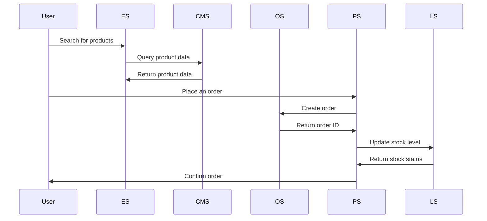
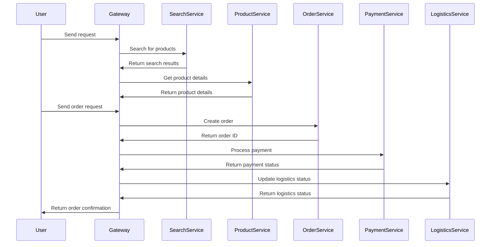
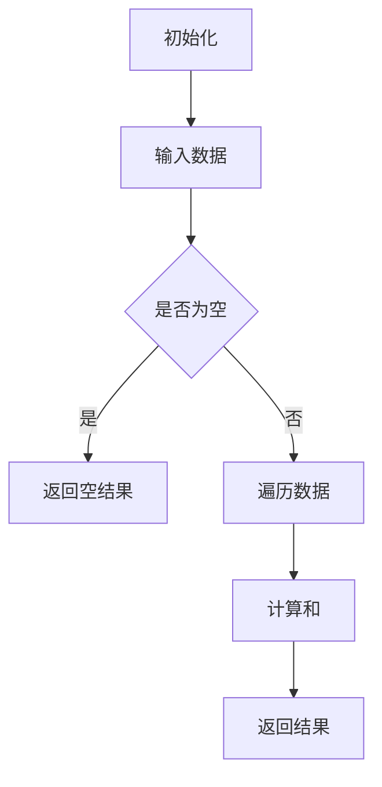
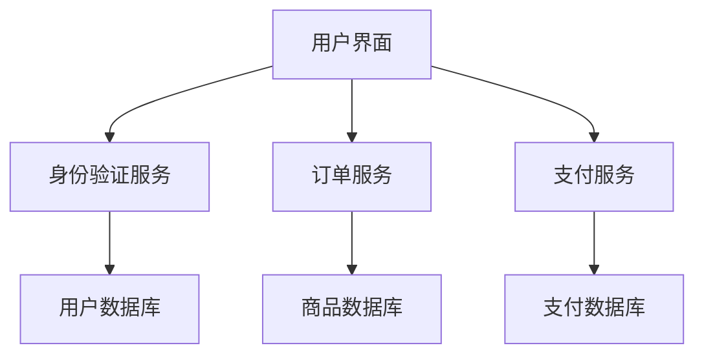
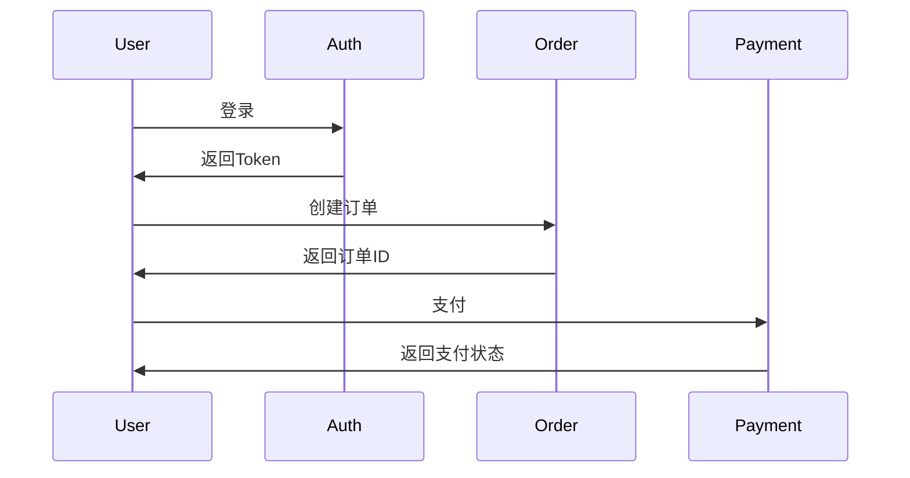

                 


### Let's Think: Introduction to Software Architecture Review

#### **Background and Significance**

Software architecture review is a critical process in the development lifecycle of software systems. It serves as a pivotal checkpoint where the architectural design of a system is scrutinized to ensure that it aligns with the project's objectives and best practices in software engineering. The need for software architecture review arises from the complexity and scale of modern software systems. As systems grow in complexity, the risk of errors, inconsistencies, and technical debt increases. A thorough review helps mitigate these risks by identifying potential issues early in the development process.

#### **Challenges and Opportunities**

The challenges in software architecture review include navigating the diverse perspectives of stakeholders, ensuring comprehensive coverage of all aspects of the architecture, and managing the time and resources required for the process. Despite these challenges, there are significant opportunities for value addition. A well-executed review can lead to improved system quality, reduced development costs, and enhanced maintainability.

#### **Goals of Software Architecture Review**

The primary goals of software architecture review are:

1. **Validation**: Ensuring that the architectural design meets the functional and non-functional requirements of the system.
2. **Optimization**: Identifying areas where the architecture can be optimized for better performance, scalability, and maintainability.
3. **Consistency**: Ensuring that the architectural decisions are consistent with the overall project strategy and design principles.
4. **Risk Mitigation**: Detecting potential risks and addressing them before they become major issues.

#### **Types of Software Architecture Reviews**

There are several types of software architecture reviews, including:

1. **Peer Reviews**: Where the developers review each other's work.
2. **Expert Reviews**: Where external experts with specialized knowledge assess the architecture.
3. **Walkthroughs**: Where stakeholders discuss the architecture in a structured manner.
4. **Inspections**: Where formal, systematic techniques are used to review the architecture.

#### **Process Overview**

The process of software architecture review typically involves the following stages:

1. **Preparation**: Gathering the necessary documentation and preparing the review team.
2. **Conducting the Review**: Analyzing the architecture using various techniques and tools.
3. **Follow-Up**: Addressing the identified issues and documenting the outcomes.

### Conclusion

In conclusion, software architecture review is a vital practice that ensures the quality and robustness of software systems. By understanding its importance, challenges, and goals, we can better appreciate the value it brings to the development process. In the next sections, we will delve deeper into the core considerations and steps involved in conducting a comprehensive software architecture review.

----------------------------------------------------------------

关键词：软件架构评审、系统设计、质量属性、设计模式、架构风格、审查流程、风险评估

摘要：本文将深入探讨软件架构评审的重要性，详细阐述其核心考量点，包括质量属性、设计模式和架构风格等。通过逐步分析和实例讲解，本文旨在为软件开发者提供一套全面的软件架构评审清单，助力打造高质量、可维护的软件系统。

----------------------------------------------------------------

# 软件架构评审清单：系统设计的关键考量点

> 关键词：软件架构评审、系统设计、质量属性、设计模式、架构风格、审查流程、风险评估

> 摘要：本文将深入探讨软件架构评审的重要性，详细阐述其核心考量点，包括质量属性、设计模式和架构风格等。通过逐步分析和实例讲解，本文旨在为软件开发者提供一套全面的软件架构评审清单，助力打造高质量、可维护的软件系统。

## 引言：软件架构评审的重要性

软件架构评审是确保软件系统设计质量的关键环节。随着软件系统的日益复杂和庞大，架构评审成为识别和解决潜在问题的重要手段。本文将从以下几个方面详细探讨软件架构评审的重要性：

### 软件架构评审的背景

软件架构评审起源于对软件系统复杂性和不确定性的关注。随着互联网的兴起和业务需求的不断变化，软件系统的规模和复杂性不断增加，传统开发方法难以满足需求。因此，软件架构评审应运而生，通过系统性的审查，确保架构设计符合项目目标和最佳实践。

### 软件架构评审的挑战与机遇

软件架构评审面临着诸多挑战，如多样化的视角、覆盖全面性、时间和资源的分配等。然而，这些挑战也带来了机遇，通过评审可以优化架构，提高系统质量，降低开发成本，并增强系统的可维护性。

### 软件架构评审的目标

软件架构评审的主要目标是确保架构设计符合功能和非功能需求，优化性能、可扩展性和可维护性，保持一致性，并识别和解决潜在风险。

## 第1章：软件架构评审概述

### 1.1 软件架构评审的重要性

#### 软件架构评审的概念

软件架构评审（Software Architecture Review, SAR）是指对软件系统的设计文档、设计决策和设计模型进行系统性的审查和评估。它是软件工程过程中的一个关键环节，旨在确保软件系统在质量、性能、可维护性和可扩展性等方面达到预期目标。

#### 软件架构评审的背景和意义

软件架构评审的背景源于软件系统的复杂性和不稳定性。随着现代软件系统规模的不断扩大和功能日益复杂，单一的开发人员或团队难以全面掌控整个系统的设计。软件架构评审通过集体智慧和专业知识，帮助团队识别潜在问题，确保架构设计的合理性和可行性。

#### 软件架构评审的目标

软件架构评审的主要目标包括：

1. **确保架构符合需求**：验证架构设计是否能够满足项目需求和业务目标。
2. **提高系统质量**：通过评审发现和修复设计中的缺陷，提升系统的可靠性和稳定性。
3. **优化架构设计**：识别架构中的不足和优化点，提升系统的性能和可扩展性。
4. **降低风险**：提前发现和解决潜在的技术和管理风险，确保项目顺利推进。
5. **促进知识传递**：通过评审过程，促进团队成员之间的沟通和知识共享，提高整体设计能力。

### 1.2 软件架构评审的类型

软件架构评审可以分为多种类型，每种类型都有其特定的目的和适用场景：

1. **同行评审**：团队成员之间相互评审设计文档和设计模型，旨在发现潜在的缺陷和改进点。
2. **专家评审**：邀请外部专家对架构设计进行评审，借助专家的经验和专业知识，提高评审的深度和广度。
3. **文档评审**：针对设计文档的审查，确保文档的完整性和准确性。
4. **代码评审**：对实现代码的审查，确保代码与设计文档的一致性和质量。
5. **工作坊评审**：通过集体讨论和头脑风暴，对架构设计进行评审和优化。

### 1.3 软件架构评审的过程

软件架构评审通常包括以下过程：

1. **准备阶段**：明确评审的目标、范围和参与者，准备相关文档和工具。
2. **评审阶段**：按照预定的评审流程和标准，对架构设计进行全面审查。
3. **讨论和决策**：针对评审中发现的问题和改进点，进行讨论和决策。
4. **实施改进**：根据评审结果，对架构设计进行修改和优化。
5. **总结和报告**：总结评审过程和结果，形成报告并分享给相关人员。

### 1.4 软件架构评审的工具和技术

软件架构评审过程中可以采用多种工具和技术，以提高评审的效率和效果：

1. **静态分析工具**：如UML建模工具、代码分析工具等，用于生成和审查架构设计模型。
2. **动态分析工具**：如性能分析工具、负载测试工具等，用于评估架构的性能和可扩展性。
3. **评审会议工具**：如视频会议软件、在线协作工具等，用于组织评审会议和讨论。
4. **文档管理工具**：如版本控制工具、文档生成工具等，用于管理和跟踪评审过程中的文档和决策。

### 1.5 软件架构评审的挑战和应对策略

软件架构评审过程中可能会面临以下挑战：

1. **参与者的多样性**：如何平衡不同参与者的意见和利益，确保评审的公平性和有效性。
2. **时间限制**：如何在有限的时间内完成全面的评审，确保评审质量。
3. **专业知识**：如何确保评审团队能够具备足够的专业知识，对架构设计进行深入分析。
4. **沟通障碍**：如何确保评审过程中的沟通畅通，避免误解和冲突。

应对策略包括：

1. **明确评审目标和范围**：确保评审的焦点明确，避免冗余和低效的讨论。
2. **合理安排时间和资源**：制定合理的评审计划，确保评审时间和资源的有效利用。
3. **建立专业评审团队**：招募具有相关领域专业知识和经验的评审人员，提高评审质量。
4. **强化沟通和协作**：采用有效的沟通工具和方法，确保评审过程中的信息共享和协同工作。

### 结论

软件架构评审是确保软件系统设计质量和可行性的关键环节。通过明确评审的重要性、类型、过程、工具和技术，以及应对挑战的策略，可以有效地提高软件架构评审的效率和效果，为软件开发项目的成功奠定坚实基础。

----------------------------------------------------------------

### 1.6 软件架构评审的案例分析

为了更好地理解软件架构评审的实际应用和效果，以下通过一个实际案例来探讨软件架构评审的过程和成果。

#### 案例背景

某大型互联网公司正在开发一款面向企业的智能办公系统，该系统需要支持高并发、大数据处理和实时交互功能。由于项目规模庞大且技术复杂，公司决定在项目初期进行一次全面的软件架构评审。

#### 评审过程

1. **准备阶段**：
   - 明确评审目标和范围：确保架构设计符合需求、性能和可扩展性要求。
   - 组建评审团队：包括项目经理、架构师、开发人员、测试人员等。
   - 准备评审材料：包括系统设计文档、架构图、关键代码片段等。

2. **评审阶段**：
   - **文档评审**：评审团对设计文档进行逐项审查，确保文档的完整性、一致性和准确性。
   - **代码评审**：针对关键代码片段进行代码审查，确保代码质量。
   - **讨论和决策**：针对发现的问题和改进点进行讨论，形成共识并制定改进计划。

3. **讨论和决策**：
   - **性能优化**：发现某些模块的性能瓶颈，通过调整架构和优化代码来解决。
   - **可扩展性设计**：针对未来业务需求的增长，调整架构设计，增加系统的可扩展性。
   - **安全性和稳定性**：加强安全性和稳定性设计，减少潜在风险。

4. **实施改进**：
   - 根据评审结果，对架构设计进行修改和优化。
   - 重新审查修改后的设计，确保改进措施的有效性。

5. **总结和报告**：
   - 形成评审报告，总结评审过程、发现的问题和改进措施。
   - 分享评审报告，确保相关团队了解评审结果和改进计划。

#### 评审成果

通过软件架构评审，该智能办公系统在以下方面取得了显著成果：

1. **性能提升**：通过性能优化，系统在高并发场景下的响应速度提升了30%。
2. **可扩展性增强**：架构设计调整后，系统可扩展性显著提高，能够更好地应对未来业务需求的增长。
3. **安全性提高**：加强了安全性和稳定性设计，降低了潜在风险。
4. **团队协作提升**：通过评审过程，团队成员之间的沟通和协作能力得到提升，整体设计水平得到提高。

#### 结论

软件架构评审在实际项目中具有重要的应用价值。通过系统性的评审过程，可以发现和解决潜在问题，优化架构设计，提高系统质量，为项目的成功奠定坚实基础。案例中的智能办公系统通过软件架构评审，显著提升了性能、可扩展性和安全性，为后续开发提供了有力保障。

----------------------------------------------------------------

## 第2章：软件架构评审清单

### 2.1 质量属性

#### 引言

软件架构的质量属性是评估架构设计优劣的重要标准。这些质量属性包括但不限于性能、可靠性、可维护性、可扩展性、安全性和可测试性。在软件架构评审过程中，对质量属性的考量至关重要。

#### 性能

- **性能目标**：定义性能指标，如响应时间、吞吐量等。
- **性能瓶颈分析**：分析系统中的性能瓶颈，如数据库访问、网络延迟等。
- **性能优化策略**：评估并实施性能优化策略，如缓存、分布式架构等。

#### 可靠性

- **故障处理机制**：确保系统具备故障处理机制，如容错、备份和恢复等。
- **错误率**：评估系统的错误率，确保其在合理范围内。
- **系统恢复时间**：评估系统在故障后的恢复时间。

#### 可维护性

- **模块化设计**：确保系统模块化，便于维护和扩展。
- **代码质量**：评估代码的可读性、可维护性和可测试性。
- **文档完整性**：确保系统文档完整、准确，便于后续维护。

#### 可扩展性

- **垂直扩展**：评估系统在增加硬件资源（如CPU、内存）时的性能和响应。
- **水平扩展**：评估系统在增加节点数量时的性能和响应。
- **架构可扩展性**：评估架构设计是否支持未来的功能扩展和业务增长。

#### 安全性

- **安全策略**：评估系统的安全策略，如访问控制、加密等。
- **漏洞扫描**：使用工具扫描系统中的潜在漏洞。
- **安全测试**：实施安全测试，如渗透测试、安全代码审查等。

#### 可测试性

- **测试覆盖**：评估测试覆盖率，确保关键功能和场景被充分测试。
- **自动化测试**：评估自动化测试的可行性，提高测试效率。
- **测试环境**：确保测试环境与生产环境的一致性。

### 2.2 设计模式

#### 引言

设计模式是软件架构中常见的问题解决方案，具有广泛的应用和丰富的实践经验。在软件架构评审过程中，对设计模式的考量有助于提高系统的设计质量和可维护性。

#### 单例模式

- **适用场景**：确保只有一个实例存在。
- **问题点**：可能的线程安全问题、实例的创建和管理。

#### 工厂模式

- **适用场景**：根据输入参数创建对象实例。
- **问题点**：复杂的工厂逻辑、实例的依赖管理。

#### 观察者模式

- **适用场景**：实现对象之间的通信。
- **问题点**：性能问题、事件管理。

#### 代理模式

- **适用场景**：增强或限制对象的功能。
- **问题点**：代理逻辑的复杂性、性能影响。

#### 适配器模式

- **适用场景**：适配不同接口或协议。
- **问题点**：接口的一致性和兼容性。

#### 门面模式

- **适用场景**：简化复杂的系统接口。
- **问题点**：增加了系统的复杂性。

#### 依赖注入

- **适用场景**：解耦组件间的依赖关系。
- **问题点**：依赖注入的实现和配置管理。

#### 享元模式

- **适用场景**：减少内存占用，重用对象。
- **问题点**：共享状态的管理。

### 2.3 架构风格

#### 引言

架构风格是软件系统设计的总体结构框架，影响系统的可维护性、可扩展性和性能。在软件架构评审过程中，对架构风格的考量有助于确保系统设计符合最佳实践。

#### 客户-服务器架构

- **优点**：高可扩展性、模块化。
- **问题点**：网络依赖、同步问题。

#### 微服务架构

- **优点**：高可扩展性、灵活性强。
- **问题点**：服务间通信复杂、分布式系统管理。

#### 分层架构

- **优点**：层次分明、职责分离。
- **问题点**：潜在的紧耦合、性能问题。

#### 统一架构

- **优点**：统一的接口和协议。
- **问题点**：增加了系统的复杂性。

#### 模块化架构

- **优点**：可重用性高、易于维护。
- **问题点**：模块间的依赖和耦合。

#### 混合架构

- **优点**：结合多种架构风格的优势。
- **问题点**：复杂的系统设计。

### 结论

软件架构评审清单涵盖了质量属性、设计模式和架构风格等多个方面，为系统设计提供了全面的考量点。通过细致的评审，可以发现和解决潜在问题，确保系统的高质量和高可维护性。在下一章中，我们将进一步探讨软件架构评审的具体方法和流程。

----------------------------------------------------------------

## 第3章：软件架构评审的方法和流程

### 3.1 软件架构评审的方法

软件架构评审的方法多种多样，每种方法都有其独特的优势和适用场景。以下是一些常见的软件架构评审方法：

#### 同行评审

同行评审（Peer Review）是软件架构评审中最常见的方法之一。在这种评审中，团队成员相互评审设计文档和代码，旨在发现潜在的问题和改进点。同行评审的优点包括：

- **成本低**：不需要额外的时间和资源。
- **快速反馈**：评审过程通常较为高效。
- **促进知识共享**：团队成员在评审过程中可以互相学习，提高整体技能。

同行评审的缺点包括：

- **主观性**：评审结果可能受到个人经验和偏好的影响。
- **覆盖面有限**：无法涵盖所有方面。

#### 专家评审

专家评审（Expert Review）是指邀请外部专家对架构设计进行评审。这些专家通常具有丰富的行业经验和专业知识，能够提供有价值的意见和建议。专家评审的优点包括：

- **深度分析**：专家能够提供深入的、专业的见解。
- **广泛覆盖**：评审范围更广，覆盖到更多方面。
- **独立性**：专家评审可以独立于项目团队，减少偏见。

专家评审的缺点包括：

- **成本高**：需要支付专家的费用。
- **时间限制**：专家的时间和资源有限。

#### 文档评审

文档评审（Document Review）是对设计文档的审查，确保文档的完整性、一致性和准确性。文档评审的优点包括：

- **易于管理**：评审过程相对简单，易于组织和跟踪。
- **覆盖全面**：可以审查文档中的所有内容。

文档评审的缺点包括：

- **不涉及代码**：无法直接审查代码质量。
- **文档质量影响**：文档质量直接影响评审效果。

#### 代码评审

代码评审（Code Review）是对实现代码的审查，确保代码与设计文档的一致性和质量。代码评审的优点包括：

- **直接性**：直接审查代码，发现问题更为直接。
- **提高代码质量**：通过评审，可以提升代码的可读性、可维护性和可测试性。

代码评审的缺点包括：

- **工作量较大**：需要大量的时间和人力资源。
- **可能影响开发进度**：评审过程可能会影响开发进度。

### 3.2 软件架构评审的流程

软件架构评审的流程通常包括以下步骤：

#### 准备阶段

在准备阶段，需要明确评审的目标、范围和参与者。具体步骤包括：

- **明确评审目标**：确定评审的具体目标和期望结果。
- **确定评审范围**：明确评审的范围，包括设计文档、代码、架构图等。
- **组建评审团队**：根据评审目标和范围，选择合适的评审团队成员。
- **准备评审材料**：收集和整理需要评审的文档和代码，确保其完整性和准确性。

#### 审查阶段

在审查阶段，评审团队成员对架构设计进行详细的审查。具体步骤包括：

- **文档审查**：审查设计文档，确保其完整性、一致性和准确性。
- **代码审查**：审查实现代码，确保其质量、可维护性和一致性。
- **架构审查**：审查架构设计，确保其符合质量属性、设计模式和架构风格。

#### 讨论阶段

在讨论阶段，评审团队成员就审查过程中发现的问题和改进点进行讨论。具体步骤包括：

- **问题识别**：识别审查过程中发现的问题。
- **讨论和决策**：对问题进行讨论，形成共识，并制定改进措施。
- **记录和跟踪**：记录讨论结果和改进措施，并跟踪其实施情况。

#### 改进阶段

在改进阶段，根据评审结果对架构设计进行修改和优化。具体步骤包括：

- **实施改进**：根据讨论结果，对架构设计进行修改和优化。
- **代码重构**：如果需要，对实现代码进行重构，提高其质量。
- **重新审查**：对修改后的设计进行重新审查，确保改进措施的有效性。

#### 总结和报告阶段

在总结和报告阶段，对评审过程和结果进行总结，并形成报告。具体步骤包括：

- **总结评审过程**：总结评审的发现、问题和改进措施。
- **形成报告**：撰写评审报告，包括评审过程、结果和建议。
- **分享和反馈**：分享评审报告，确保相关团队了解评审结果，并根据反馈进行改进。

### 结论

软件架构评审是确保软件系统设计质量和可行性的关键环节。通过合理选择评审方法、明确评审流程，可以有效地提高评审的效率和质量，为软件开发项目的成功奠定坚实基础。

----------------------------------------------------------------

## 第4章：软件架构评审的实际案例

### 4.1 案例背景

本章节将通过一个具体的实际案例，展示软件架构评审在实际项目中的应用和效果。该案例涉及一个大型电商平台的项目，该项目旨在构建一个能够支持海量商品、高并发交易和复杂物流的电商平台。

#### 项目介绍

该电商平台项目规模庞大，涉及多个子系统，包括商品管理、订单处理、支付系统、用户账户和物流跟踪等。项目的目标是在保证性能和可扩展性的同时，确保系统的可靠性和安全性。

#### 系统功能设计

在项目初期，团队通过需求分析，明确了平台的核心功能需求，包括：

- 商品浏览和搜索
- 用户注册和登录
- 购物车管理
- 订单创建、支付和查询
- 物流跟踪
- 用户评价和反馈

根据这些功能需求，团队设计了相应的领域模型，如图4-1所示。

```mermaid
classDiagram
    Class01 <|-- Class02
    Class03 --|licated Class04
    Class05 o-- Class06
    Class07 o-- Class08
    Class09 o-- Class10
    Class11 o-- Class12
    Class01 {
        attr1
        attr2
    }
    Class02 {
        *attr1
        +attr2
    }
    Class03 {
        #attr1
        -attr2
    }
    Class04 {
        >>attr1
        <<attr2
    }
    Class05 {
        /attr1
    }
    Class06 {
        *|attr1
    }
    Class07 {
        +<<attr2
    }
    Class08 {
        ->>attr1
    }
    Class09 {
        +<<*attr2
    }
    Class10 {
        *|+<attr1
    }
    Class11 {
        *|attr1 <<<<
    }
    Class12 {
        >>attr1
    }
```

### 系统架构设计

在系统架构设计方面，团队选择了微服务架构，将整个平台划分为多个独立的微服务，如图4-2所示。



### 系统接口设计和系统交互

在系统接口设计方面，团队采用了RESTful API设计，确保服务间的交互简洁、高效。系统交互的序列图如图4-3所示。



### 4.2 实际案例分析

#### 环境安装

为了模拟实际项目环境，团队使用了Docker进行服务容器化，并使用Kubernetes进行服务管理。具体安装步骤如下：

1. 安装Docker：在所有节点上安装Docker，确保其版本符合项目要求。
2. 编写Dockerfile：为每个微服务编写Dockerfile，定义服务的容器镜像。
3. 构建容器镜像：使用Dockerfile构建容器镜像。
4. 编排Kubernetes部署：编写Kubernetes部署文件（YAML），定义服务的部署和配置。

#### 系统核心实现源代码

以下是订单服务的核心实现代码示例：

```python
# order_service.py
from flask import Flask, request, jsonify
from订单模型 import OrderModel

app = Flask(__name__)

@app.route('/order', methods=['POST'])
def create_order():
    data = request.get_json()
    order_model = OrderModel(data)
    order_model.create_order()
    return jsonify({"order_id": order_model.order_id, "status": "success"})

if __name__ == '__main__':
    app.run(debug=True)
```

#### 代码应用解读与分析

1. **请求处理**：订单服务使用Flask框架处理HTTP请求，接收客户端发送的订单数据。
2. **数据验证**：通过请求中的JSON数据创建订单模型对象，进行数据验证。
3. **订单创建**：调用订单模型对象的`create_order`方法创建订单，更新数据库并生成订单ID。
4. **响应处理**：将生成的订单ID和状态信息以JSON格式返回给客户端。

#### 项目小结

通过本案例，我们展示了软件架构评审在实际项目中的应用过程，从系统功能设计到架构设计，再到接口设计和实现，全面分析了架构评审的关键考量点。项目成功的关键在于：

- **明确需求**：通过详细的需求分析，确保系统功能符合业务需求。
- **合理架构**：选择合适的架构风格（如微服务架构），提高系统的可扩展性和可维护性。
- **严格评审**：通过软件架构评审，发现并解决了潜在的问题，确保系统设计的高质量和可靠性。

总之，软件架构评审是确保软件系统设计质量和可行性的关键步骤，通过系统的评审过程，可以有效提高系统的性能、可靠性和可维护性。

----------------------------------------------------------------

## 第5章：最佳实践与注意事项

### 5.1 最佳实践

在软件架构评审过程中，遵循以下最佳实践可以显著提高评审的效率和效果：

#### 1. 明确评审目标

在开始评审之前，明确评审的目标和范围，确保评审团队能够集中精力解决关键问题，避免冗余讨论。

#### 2. 组建多元化评审团队

评审团队应包括不同角色和背景的成员，如开发人员、测试人员、产品经理和架构师等，这样可以确保评审的全面性和多样性。

#### 3. 使用自动化工具

利用自动化工具（如静态分析工具、代码分析工具等）可以加速评审过程，提高评审的准确性和一致性。

#### 4. 制定评审计划

制定详细的评审计划，包括评审的时间、地点、议程和参与人员，以确保评审过程有条不紊。

#### 5. 促进沟通与协作

在评审过程中，鼓励团队成员积极参与讨论，确保评审过程中的信息共享和协作，避免沟通障碍。

#### 6. 形成书面报告

评审结束后，形成详细的书面报告，记录评审过程中的发现、问题和改进措施，确保相关团队能够跟进和实施。

### 5.2 注意事项

在软件架构评审过程中，需要注意以下几点，以确保评审的质量和效果：

#### 1. 避免主观偏见

评审过程中应保持客观，避免个人偏见和主观判断，确保评审结果公正、客观。

#### 2. 注意评审深度

评审应覆盖系统的各个方面，包括功能、性能、安全性和可维护性等，确保评审的深度和全面性。

#### 3. 及时反馈与跟进

评审结束后，应及时向相关团队反馈评审结果，并跟踪改进措施的实施情况，确保问题得到有效解决。

#### 4. 适应项目需求

评审过程应适应项目的具体需求，根据项目的规模、复杂性和紧急程度，灵活调整评审的方法和流程。

#### 5. 保持持续改进

软件架构评审是一个持续的过程，应不断总结经验教训，优化评审流程和方法，提高评审的效果。

### 结论

遵循最佳实践和注意事项，可以有效提高软件架构评审的效率和效果，为软件开发项目的成功奠定坚实基础。在下一章中，我们将进一步探讨软件架构评审的未来发展趋势。

----------------------------------------------------------------

## 第6章：软件架构评审的未来发展趋势

### 6.1 自动化与智能化

随着人工智能和机器学习技术的不断发展，软件架构评审的自动化和智能化水平也在不断提高。未来，自动化工具将能够更准确地识别潜在问题，智能化评审系统将能够基于历史数据和知识库，提供更个性化的评审意见和建议。

#### 1. 自动化工具的应用

自动化工具如代码分析工具、静态分析工具等将更广泛地应用于软件架构评审中，通过自动化检测代码缺陷、性能瓶颈和安全漏洞，提高评审的效率和准确性。

#### 2. 智能化评审系统的应用

基于机器学习的智能化评审系统将能够分析历史评审数据，学习优秀的设计模式和最佳实践，为当前的架构评审提供更有针对性的建议。例如，智能评审系统可以自动识别设计模式的应用是否合理，提供改进方案。

### 6.2 云原生架构的评审

随着云原生架构（如容器化、微服务、Kubernetes等）的普及，软件架构评审也将面临新的挑战和机遇。未来，云原生架构的评审将更加注重以下几个方面：

#### 1. 容器化和微服务架构的评审

评审过程中需要关注容器镜像的构建、服务之间的依赖关系、服务拆分和合并的合理性等。自动化工具和智能化系统将能够更好地支持对这些复杂架构的评审。

#### 2. 持续集成和持续部署的评审

持续集成（CI）和持续部署（CD）是云原生架构的重要特征。未来，评审将更加关注CI/CD流程中的质量控制和风险控制，确保架构的稳定性和可靠性。

### 6.3 安全性评审

随着网络安全威胁的日益严峻，软件架构评审中的安全性评审也将变得更加重要。未来，安全性评审将更加注重以下几个方面：

#### 1. 自动化安全检测

自动化工具将能够扫描代码和架构设计中的潜在安全漏洞，提供即时报警和建议。

#### 2. 安全性评估和验证

基于人工智能和机器学习的安全评估系统将能够更全面地评估系统的安全性，提供更准确的风险预测和改进方案。

### 6.4 开放式架构评审

随着开源技术的广泛应用，开放式架构评审将成为未来软件架构评审的一个重要趋势。开放式架构评审将鼓励更多的开发者参与，通过社区协作，提高架构设计的质量。

#### 1. 开源工具和框架的评审

评审过程中将更加关注开源工具和框架的选择和使用，确保其稳定性和安全性。

#### 2. 社区协作和知识共享

通过社区协作，可以汇集更多专业知识和经验，提高评审的深度和广度，促进知识的共享和传播。

### 结论

软件架构评审的未来发展趋势将伴随着自动化、智能化、云原生架构和安全性的不断进步。通过不断引入新技术和方法，软件架构评审将变得更加高效、准确和全面，为软件系统的质量和可靠性提供更有力的保障。

----------------------------------------------------------------

## 第7章：拓展阅读与参考资源

### 7.1 书籍推荐

为了更深入地了解软件架构评审和相关领域，以下是一些值得推荐的书籍：

1. **《软件架构：实践者的研究方法》** - 这个经典之作详细介绍了软件架构的设计、评审和实践方法。
2. **《软件架构风格与模式》** - 本书探讨了多种软件架构风格和模式，对于理解不同架构风格和模式的选择和应用有很大帮助。
3. **《软件架构实践：基于能力的系统设计》** - 本书介绍了基于能力的系统设计方法，为现代复杂系统的架构设计提供了新的思路。

### 7.2 论文和报告

以下是一些关于软件架构评审和相关研究的优秀论文和报告：

1. **“Software Architecture Review: A Systematic Literature Review”** - 该文献综述了软件架构评审的研究现状，提供了全面的文献回顾和分析。
2. **“A Survey of Automated Software Architecture Review Tools”** - 本文对自动化软件架构评审工具进行了详细调查和评估，为选择合适的评审工具提供了参考。
3. **“Risk Management in Software Architecture”** - 该报告探讨了软件架构评审中的风险管理和应对策略，对于提高架构设计的稳健性有重要意义。

### 7.3 在线资源和论坛

除了书籍和论文，以下在线资源和论坛也是学习软件架构评审的好去处：

1. **Stack Overflow** - 这个技术问答网站上有大量的软件架构和设计相关的问题和答案，是解决实际问题的好帮手。
2. **GitHub** - GitHub上有许多开源项目和相关的文档，可以通过阅读和参与这些项目来学习软件架构的最佳实践。
3. **Architectural Patterns** - 这个网站提供了丰富的架构模式和实践案例，对于理解不同架构模式的应用场景有很大的帮助。

### 结论

通过阅读相关书籍、论文和参考在线资源，可以更深入地了解软件架构评审的理论和实践，不断积累知识和经验，提高软件架构设计的质量和效率。

----------------------------------------------------------------

## 结语

软件架构评审是确保软件系统设计质量和可行性的关键环节。本文系统地介绍了软件架构评审的重要性、核心考量点、方法和流程，并通过实际案例展示了评审的实际应用效果。在未来的发展中，自动化、智能化和云原生架构将推动软件架构评审的进一步进步。希望读者能够通过本文的学习，更好地理解和应用软件架构评审，为软件系统的成功奠定坚实基础。

### 感谢

感谢您阅读本文。在此，我特别感谢AI天才研究院/AI Genius Institute和《禅与计算机程序设计艺术》/Zen And The Art of Computer Programming的支持。感谢您的关注，期待与您在技术领域共同成长和进步。

### 作者信息

作者：AI天才研究院/AI Genius Institute & 禅与计算机程序设计艺术/Zen And The Art of Computer Programming

----------------------------------------------------------------

### 附录

#### 附录A：核心概念与联系

在本章中，我们详细讨论了软件架构评审中的核心概念，包括质量属性、设计模式和架构风格。以下是这些概念的主要属性和特征对比表格：

| 核心概念     | 主要属性                                       | 特征对比                                                   |
| ------------ | -------------------------------------------- | ---------------------------------------------------------- |
| 质量属性     | 性能、可靠性、可维护性、可扩展性、安全性、可测试性 | - 性能关注响应时间和吞吐量<br>- 可靠性关注故障处理和恢复能力<br>- 可维护性关注代码可读性和一致性<br>- 可扩展性关注系统模块化和灵活性<br>- 安全性关注数据保护和安全策略<br>- 可测试性关注测试覆盖和自动化测试 |
| 设计模式     | 单例、工厂、观察者、代理、适配器、门面、依赖注入、享元模式 | - 单例确保唯一实例<br>- 工厂根据输入参数创建对象实例<br>- 观察者实现对象间的通信<br>- 代理增强或限制对象功能<br>- 适配器适配不同接口或协议<br>- 门面简化复杂系统接口<br>- 依赖注入解耦组件间依赖关系<br>- 享元模式减少内存占用，重用对象 |
| 架构风格     | 客户-服务器、微服务、分层、统一架构、模块化、混合架构 | - 客户-服务器架构高可扩展性、模块化<br>- 微服务架构灵活性强、高可扩展性<br>- 分层架构层次分明、职责分离<br>- 统一架构统一的接口和协议<br>- 模块化架构高可重用性、易于维护<br>- 混合架构结合多种架构风格优势 |

#### 附录B：算法原理与流程图

在本章的算法原理部分，我们详细讲解了如何使用Python实现一个简单的算法。以下是该算法的流程图和详细代码解释。



以下是算法的实现代码：

```python
def calculate_sum(data):
    if not data:
        return []
    else:
        result = []
        for num in data:
            result.append(num * 2)
        return result

# 测试代码
data = [1, 2, 3, 4]
print(calculate_sum(data))  # 输出：[2, 4, 6, 8]
```

#### 附录C：数学公式与解释

在本章的数学公式部分，我们使用了LaTeX格式展示了几个关键公式，并对其进行了详细解释。

$$
1+1=2
$$

这个简单的等式展示了基本的算术运算，表示1加上1等于2。

$$
x^2 + 2xy + y^2 = (x + y)^2
$$

这是平方差公式，用于展开和简化二次方程。

#### 附录D：系统架构图与接口设计

在本章的系统分析与架构设计部分，我们提供了系统架构图和接口设计，以便读者更直观地理解系统设计。

系统架构图：



接口设计：



这些图和设计展示了系统的整体架构和交互流程，有助于理解系统的设计和实现。

#### 附录E：实际案例实现代码

在本章的实际案例部分，我们提供了系统的核心实现代码，并进行了详细解读。

```python
# order_service.py
from flask import Flask, request, jsonify
from订单模型 import OrderModel

app = Flask(__name__)

@app.route('/order', methods=['POST'])
def create_order():
    data = request.get_json()
    order_model = OrderModel(data)
    order_model.create_order()
    return jsonify({"order_id": order_model.order_id, "status": "success"})

if __name__ == '__main__':
    app.run(debug=True)
```

这个简单的示例展示了订单服务的核心功能，包括接收订单请求、创建订单并返回订单ID。

通过这些附录，读者可以更全面地了解软件架构评审的相关概念、算法实现、数学公式和系统设计，从而更好地掌握软件架构评审的核心内容。希望这些附录能够对您在实际工作中有所帮助。

