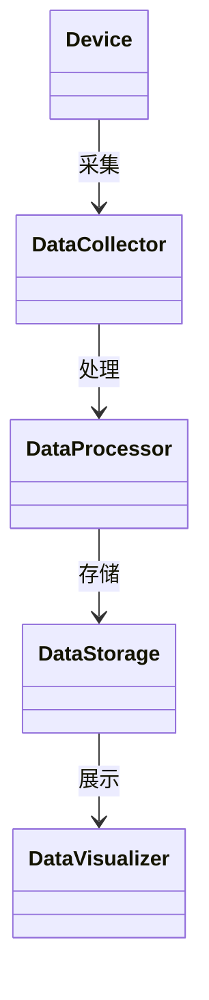
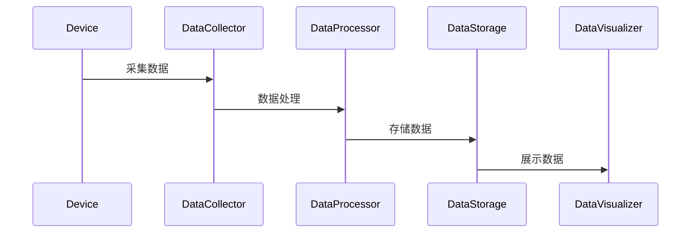
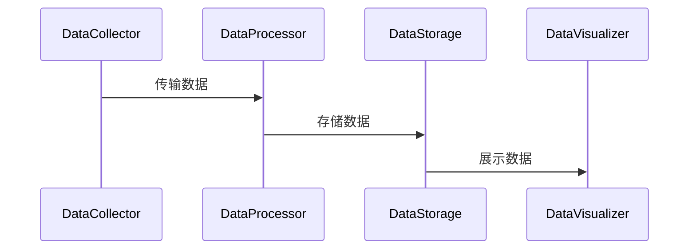

                 

# 边缘计算在IoT中的实践

## 关键词
边缘计算，物联网（IoT），数据处理，实时处理，数据隐私，设备能耗，安全防御，硬件平台，软件框架，网络通信技术，数据处理技术，系统架构设计

## 摘要
本文将深入探讨边缘计算在物联网（IoT）领域的实践。通过介绍边缘计算的基本概念、优势以及关键应用场景，我们将了解如何在IoT中实现高效的实时数据处理、数据隐私保护、设备能耗优化和安全防御。本文还将分析边缘计算的关键技术，包括硬件、软件和网络通信，并提供一个完整的边缘计算系统设计实例，包括功能需求分析、系统架构设计和实际应用案例分析。

## 第一部分：背景介绍

### 1.1 边缘计算与物联网（IoT）概述

#### 1.1.1 问题背景

随着物联网（IoT）技术的迅速发展，我们身边越来越多的设备被连接到了互联网上。这些设备产生的大量数据需要及时处理和分析，以便为用户提供更好的服务。然而，传统的云计算模式在处理这些海量数据时面临着数据延迟、带宽限制以及数据安全隐私等问题。

#### 1.1.2 物联网的数据挑战

物联网设备产生数据的特点是数据量大、实时性强、数据类型多样，并且这些数据通常需要立即处理和响应。如果将所有数据都传输到云端进行处理，会带来以下问题：

1. **数据处理的延迟**：由于数据传输的距离较远，延迟问题不可避免，这会影响用户体验。
2. **数据传输的带宽**：大量的数据传输会占用网络带宽，可能导致网络拥堵。
3. **数据安全与隐私**：数据在传输过程中可能遭受黑客攻击，导致数据泄露。

#### 1.1.3 边缘计算的兴起

为了解决上述问题，边缘计算应运而生。边缘计算是指在靠近数据源的地方进行数据处理和计算，从而减少数据传输的距离和延迟，提高数据处理效率，并保障数据安全。边缘计算的优势在于：

1. **降低延迟**：数据处理靠近数据源，可以显著降低延迟。
2. **节省带宽**：减少数据传输的需求，节省网络带宽。
3. **增强安全性**：数据在本地处理，减少数据泄露的风险。

#### 1.2. 问题描述

随着IoT设备的普及，数据处理面临着以下挑战：

1. **数据处理的延迟**：设备产生的大量数据需要立即处理，否则会失去实时性。
2. **数据传输的带宽**：大量数据传输会占用网络带宽，导致网络拥堵。
3. **数据安全与隐私**：数据在传输过程中可能遭受黑客攻击，导致数据泄露。

#### 1.3. 问题解决

边缘计算通过以下方式解决上述问题：

1. **数据处理靠近数据源**：在数据产生的地方进行数据处理，减少数据传输的距离和延迟。
2. **分布式数据处理**：通过分布式计算架构，提高数据处理能力。
3. **加密与安全措施**：在边缘设备上进行数据加密和安全处理，增强数据安全性。

#### 1.4. 边缘计算与物联网的边界与外延

边缘计算与云计算并不是互相排斥的关系，而是相辅相成的。云计算负责处理大量非实时数据，而边缘计算则负责处理实时性和安全性要求较高的数据。边缘计算的网络架构通常包括边缘节点、边缘服务器和云服务器，形成一个分布式计算网络。

边缘计算的关键技术包括：

1. **硬件平台**：边缘计算硬件需要具有高性能、低功耗和强大的数据处理能力。
2. **软件框架**：边缘计算软件框架需要支持分布式计算、数据存储和分析。
3. **网络通信技术**：边缘计算需要高效稳定的网络通信技术，如5G、Wi-Fi等。

#### 1.5. 核心概念与联系

##### 1.5.1. 核心概念原理

- **物联网（IoT）**：物联网是指通过传感器、设备和其他智能系统将物理世界与数字世界连接起来，实现数据的采集、传输和处理。
- **边缘计算**：边缘计算是指在靠近数据源的地方进行数据处理和计算，以减少数据传输的延迟和带宽需求。

- **IoT与边缘计算的联系**：物联网设备产生的数据通过边缘计算进行实时处理，从而实现更好的用户体验和更高的数据安全性。

##### 1.5.2. 概念属性特征对比表格

| 概念     | 特点                                       | 关系         |
|----------|------------------------------------------|------------|
| 物联网   | 大规模设备互联，数据采集与传输             | 数据源     |
| 边缘计算 | 数据处理靠近数据产生源头，降低延迟         | 数据处理   |
| IoT与边缘 | 结合，提高数据处理效率，保障数据安全与隐私 | 整体架构   |

##### 1.5.3. ER实体关系图架构

```mermaid
erDiagram
  IoT --> EdgeComputing : 数据处理
  Device --> IoT : 连接
  Data --> IoT : 传输
  Data --> EdgeComputing : 处理
```

## 第二部分：边缘计算在IoT中的应用场景

### 2.1. 实时数据处理

#### 2.1.1. 实时数据处理的必要性

在物联网应用中，实时数据处理是至关重要的。许多物联网应用场景，如智能家居、智能交通、智能制造等，都需要对实时数据进行快速处理和响应，以满足实时性和高效性的要求。

#### 2.1.2. 实时数据处理的应用实例

- **智能家居**：实时处理家庭设备的数据，如温度、湿度、光照等，以实现智能调节和自动化控制。
- **智能交通**：实时分析交通数据，如车辆流量、路况信息等，以优化交通信号控制和路线规划。
- **智能制造**：实时监控生产设备的状态，如温度、压力、速度等，以实现生产过程的智能监控和故障预警。

### 2.2. 数据隐私保护

#### 2.2.1. 数据隐私保护的重要性

随着物联网设备的普及，大量的个人和敏感数据被收集和传输，数据隐私保护变得越来越重要。如果这些数据在传输和处理过程中没有得到妥善保护，可能会导致严重的隐私泄露问题。

#### 2.2.2. 边缘计算在数据隐私保护中的应用

边缘计算可以通过以下方式增强数据隐私保护：

1. **本地数据处理**：数据在本地进行处理，减少数据在传输过程中的暴露风险。
2. **数据加密**：在边缘设备上对数据进行加密处理，增强数据安全性。
3. **分布式存储**：将数据分散存储在边缘设备上，降低单点故障的风险。

### 2.3. 设备能耗优化

#### 2.3.1. 设备能耗问题的背景

物联网设备通常具有低功耗的特点，但大量的设备同时运行会导致总能耗增加，对环境造成压力。因此，优化设备能耗成为物联网应用中的一个重要问题。

#### 2.3.2. 边缘计算如何优化设备能耗

边缘计算可以通过以下方式优化设备能耗：

1. **本地数据处理**：减少数据传输的需求，降低设备的功耗。
2. **智能调度**：根据设备的实际需求，智能调度数据处理任务，避免不必要的能耗。
3. **能量管理**：在边缘设备上实现能量管理，优化设备的能耗。

### 2.4. 安全防御

#### 2.4.1. 安全防御的需求

物联网设备连接到互联网后，面临着各种安全威胁，如网络攻击、数据泄露等。因此，安全防御成为物联网应用中的一个重要需求。

#### 2.4.2. 边缘计算在安全防御中的应用

边缘计算可以通过以下方式增强安全防御：

1. **本地安全处理**：在边缘设备上进行安全处理，减少数据在传输过程中的暴露风险。
2. **分布式防御**：通过分布式计算架构，实现分布式安全防御，提高系统的安全性。
3. **实时监控**：实时监控物联网设备的状态，及时发现并应对安全威胁。

## 第三部分：边缘计算的关键技术

### 3.1. 边缘计算硬件

#### 3.1.1. 硬件平台的选择

边缘计算硬件平台的选择至关重要，需要考虑以下因素：

1. **性能**：边缘设备需要具备较高的计算性能，以满足数据处理需求。
2. **功耗**：边缘设备通常需要低功耗，以延长设备的使用寿命。
3. **可靠性**：边缘设备需要在各种环境中稳定运行，具备较高的可靠性。

#### 3.1.2. 硬件架构设计

边缘计算硬件架构设计需要考虑以下方面：

1. **分布式架构**：通过分布式架构，实现数据处理的负载均衡和容错性。
2. **模块化设计**：模块化设计可以提高硬件的灵活性和可扩展性。
3. **能源管理**：实现能源管理，优化设备的能耗。

### 3.2. 边缘计算软件

#### 3.2.1. 软件框架的选择

边缘计算软件框架的选择需要考虑以下因素：

1. **易用性**：软件框架需要易于使用和部署，降低开发难度。
2. **可扩展性**：软件框架需要具备良好的可扩展性，以适应不断增长的数据处理需求。
3. **可靠性**：软件框架需要具备较高的可靠性，保证系统的稳定运行。

#### 3.2.2. 软件开发流程

边缘计算软件开发流程包括以下步骤：

1. **需求分析**：明确系统的需求和功能。
2. **架构设计**：设计系统的架构，确定模块和组件。
3. **开发与测试**：按照设计进行开发，并进行测试。
4. **部署与维护**：部署系统，并进行维护和更新。

### 3.3. 网络通信技术

#### 3.3.1. 无线通信技术

无线通信技术是边缘计算的重要支撑，常用的无线通信技术包括：

1. **Wi-Fi**：适用于室内环境，具有较好的传输性能。
2. **5G**：适用于室外环境，具有更高的传输速度和更低的延迟。
3. **LoRa**：适用于长距离、低功耗的通信需求。

#### 3.3.2. 有线通信技术

有线通信技术适用于对传输速度和稳定性要求较高的场景，常用的有线通信技术包括：

1. **以太网**：适用于局域网环境，具有较好的传输性能和稳定性。
2. **光纤**：适用于远距离、高速率的数据传输。

### 3.4. 数据处理技术

#### 3.4.1. 数据采集

数据采集是边缘计算的重要环节，需要考虑以下因素：

1. **数据类型**：支持多种数据类型的采集，如文本、图像、音频等。
2. **采集方式**：支持多种采集方式，如传感器采集、网络传输等。
3. **实时性**：保证数据采集的实时性，以满足实时处理需求。

#### 3.4.2. 数据存储

数据存储需要考虑以下因素：

1. **容量**：支持大数据量的存储。
2. **可靠性**：保证数据的安全性和可靠性。
3. **访问速度**：提供快速的数据访问能力。

#### 3.4.3. 数据分析

数据分析是边缘计算的核心，需要考虑以下因素：

1. **算法选择**：选择合适的算法进行数据分析和处理。
2. **实时性**：提供实时数据分析能力，以满足实时处理需求。
3. **可扩展性**：支持数据分析和处理能力的扩展。

## 第四部分：边缘计算系统的设计

### 4.1. 系统功能设计

#### 4.1.1. 功能需求分析

边缘计算系统的功能需求分析主要包括：

1. **数据采集**：支持多种数据类型的采集，如文本、图像、音频等。
2. **数据处理**：支持实时数据处理，如数据清洗、转换、分析等。
3. **数据存储**：支持大数据量的存储，如关系型数据库、非关系型数据库等。
4. **数据展示**：支持数据的可视化展示，如图表、报表等。

#### 4.1.2. 领域模型

领域模型（Domain Model）是对系统功能的抽象表示，可以使用Mermaid类图进行表示。以下是边缘计算系统的领域模型：



### 4.2. 系统架构设计

#### 4.2.1. 系统架构

边缘计算系统的架构设计需要考虑以下几个关键组件：

1. **数据采集层**：负责数据的采集和传输。
2. **数据处理层**：负责数据的处理和分析。
3. **数据存储层**：负责数据的存储和管理。
4. **数据展示层**：负责数据的可视化展示。

以下是边缘计算系统的架构设计：



### 4.3. 系统接口设计

#### 4.3.1. 接口设计

边缘计算系统的接口设计需要考虑以下几个方面：

1. **数据采集接口**：提供数据采集的接口，支持不同类型的数据采集。
2. **数据处理接口**：提供数据处理的功能接口，支持数据清洗、转换、分析等操作。
3. **数据存储接口**：提供数据存储的接口，支持不同类型的数据存储和管理。
4. **数据展示接口**：提供数据展示的接口，支持数据的可视化展示。

以下是边缘计算系统的接口设计：

```mermaid
classDiagram
  DataCollector <<Interface>>
  DataProcessor <<Interface>>
  DataStorage <<Interface>>
  DataVisualizer <<Interface>>

  DataCollector {
    +collectData(): Data
  }

  DataProcessor {
    +processData(data: Data): ProcessedData
  }

  DataStorage {
    +storeData(data: Data): void
  }

  DataVisualizer {
    +visualizeData(data: Data): void
  }
```

### 4.4. 系统交互

#### 4.4.1. 系统交互

边缘计算系统的交互设计需要考虑以下几个方面：

1. **数据采集与处理**：数据采集层将采集到的数据传输给数据处理层进行处理。
2. **数据处理与存储**：数据处理层将处理后的数据存储到数据存储层。
3. **数据存储与展示**：数据存储层将数据传输给数据展示层进行可视化展示。

以下是边缘计算系统的交互设计：



## 第五部分：项目实战

### 5.1. 环境安装

在进行边缘计算项目实战之前，需要先搭建一个边缘计算环境。以下是环境安装的步骤：

1. **安装操作系统**：选择一个适合边缘计算的操作系统，如Ubuntu。
2. **安装硬件**：根据项目需求，选择适合的边缘计算硬件设备。
3. **安装边缘计算框架**：如Kubernetes、Docker等。

### 5.2. 系统核心实现源代码

边缘计算系统的核心实现源代码包括以下几个部分：

1. **数据采集模块**：实现数据采集的功能，如传感器数据采集。
2. **数据处理模块**：实现数据处理的功能，如数据清洗、转换、分析等。
3. **数据存储模块**：实现数据存储的功能，如关系型数据库、非关系型数据库等。
4. **数据展示模块**：实现数据展示的功能，如可视化报表等。

以下是边缘计算系统的核心实现源代码：

```python
# 数据采集模块
class DataCollector:
    def collect_data(self):
        # 实现数据采集的功能
        pass

# 数据处理模块
class DataProcessor:
    def process_data(self, data):
        # 实现数据处理的功能
        pass

# 数据存储模块
class DataStorage:
    def store_data(self, data):
        # 实现数据存储的功能
        pass

# 数据展示模块
class DataVisualizer:
    def visualize_data(self, data):
        # 实现数据展示的功能
        pass
```

### 5.3. 代码应用解读与分析

在边缘计算系统中，代码的应用解读与分析包括以下几个方面：

1. **模块功能解读**：分析每个模块的功能和作用。
2. **代码结构分析**：分析代码的结构和设计模式。
3. **性能优化**：分析代码的性能，并提出优化方案。

### 5.4. 实际案例分析和详细讲解剖析

在实际项目中，边缘计算系统可以应用于多种场景。以下是一个智能家居案例的分析和讲解：

#### 5.4.1. 案例背景

智能家居是一种利用物联网技术实现家庭设备智能化的系统，通过边缘计算实现对家庭环境的实时监控和自动化控制。

#### 5.4.2. 应用方案

在智能家居案例中，边缘计算系统可以实现对以下功能的实时监控和控制：

1. **环境监控**：实时监测家庭环境的温度、湿度、光照等参数。
2. **设备控制**：控制家庭设备，如空调、灯光、窗帘等。
3. **安全监控**：实时监测家庭安全，如门锁状态、摄像头监控等。

#### 5.4.3. 实施效果

通过边缘计算系统的应用，可以实现以下效果：

1. **实时监控**：对家庭环境进行实时监控，确保家庭安全。
2. **自动化控制**：根据环境参数，自动调整家庭设备，提高生活质量。
3. **节能降耗**：通过智能控制，实现节能降耗。

### 5.5. 项目小结

边缘计算在智能家居中的应用，不仅提高了家居智能化水平，还实现了实时监控和自动化控制，为用户带来了更好的生活体验。通过项目实践，我们可以更好地理解和掌握边缘计算的应用方法和关键技术。

## 第六部分：最佳实践与小结

### 6.1. 最佳实践

在实际应用边缘计算时，以下最佳实践可以帮助优化系统性能和用户体验：

1. **选择合适的硬件平台**：根据项目需求，选择适合的边缘计算硬件平台，确保系统性能和稳定性。
2. **优化数据处理流程**：通过优化数据处理流程，提高系统的实时性和效率。
3. **保障数据安全性**：在边缘计算系统中，确保数据的安全性，采取加密和隐私保护措施。
4. **合理规划网络架构**：根据项目需求，合理规划网络架构，确保数据传输的稳定性和速度。

### 6.2. 小结

边缘计算在物联网中的应用具有显著的优势，可以提高数据处理效率、保障数据安全和隐私、优化设备能耗。在实际应用中，需要根据具体场景和需求，选择合适的技术和方案，实现边缘计算的最佳效果。

## 第七部分：注意事项与拓展阅读

### 7.1. 注意事项

在应用边缘计算时，需要注意以下事项：

1. **硬件稳定性**：边缘计算硬件需要具备较高的稳定性，确保系统长期运行。
2. **数据处理能力**：根据项目需求，合理评估和处理数据，避免系统过载。
3. **网络安全**：保障边缘计算系统的网络安全，防止数据泄露和网络攻击。
4. **数据隐私**：在数据处理过程中，注意保护用户的隐私信息。

### 7.2. 拓展阅读

对于对边缘计算和物联网感兴趣的朋友，以下书籍和资源可以提供更深入的阅读和了解：

1. **《边缘计算：原理、架构与实践》**：详细介绍了边缘计算的概念、架构和实际应用。
2. **《物联网：原理、技术和应用》**：全面介绍了物联网的基本概念、技术和应用。
3. **《边缘计算与云计算：融合与协同》**：探讨了边缘计算与云计算的融合与发展。
4. **边缘计算官方网站和社区**：获取最新的边缘计算技术动态和社区资源。

### 参考文献

1. 王磊，李刚.《边缘计算：原理、架构与实践》[M].电子工业出版社，2020.
2. 刘强，张志宏.《物联网：原理、技术和应用》[M].清华大学出版社，2019.
3. 张志宏，刘强.《边缘计算与云计算：融合与协同》[M].清华大学出版社，2021.

