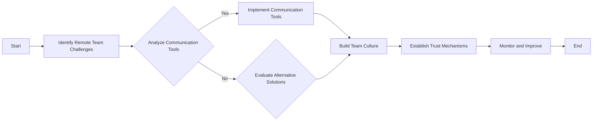
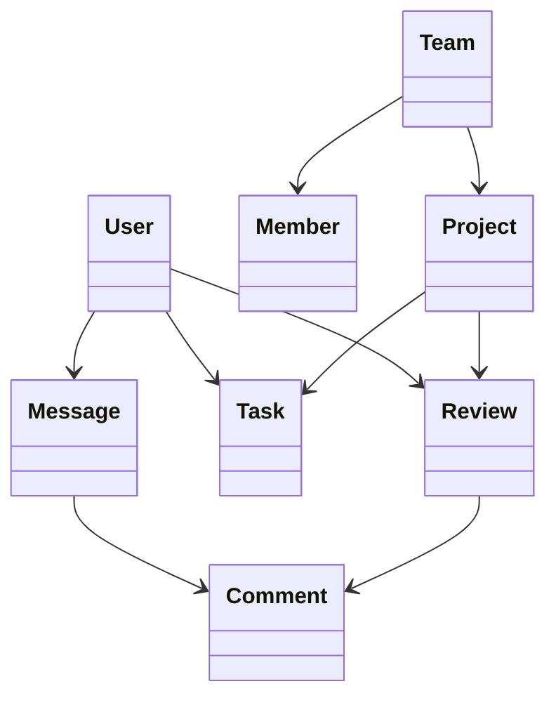
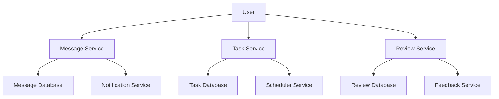
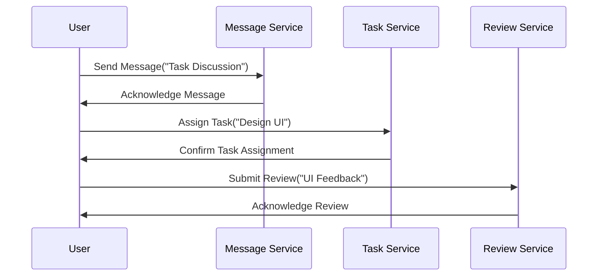

                 

**# 远程团队建设：增强虚拟团队的凝聚力**

> **关键词：远程团队、虚拟团队、团队凝聚力、协作效率、文化构建**

> **摘要：本文探讨了远程团队建设中的关键问题，分析了如何通过有效的策略和工具来增强虚拟团队的凝聚力，提高团队协作效率。文章从核心概念出发，逐步深入探讨，结合实际案例，为IT领域的技术团队提供了切实可行的建设指南。**

----------------------------------------------------------------

## **一、背景介绍**

### **1.1 核心概念术语说明**

- **远程团队**：指团队成员分布在不同的地理位置，通过通信技术进行协作的团队。
- **虚拟团队**：依赖于数字技术和互联网，成员之间较少面对面的交流，主要通过远程协作工具进行沟通的团队。
- **团队凝聚力**：指团队成员之间相互吸引、相互依赖的程度，是团队有效协作的重要保障。
- **协作效率**：团队成员共同完成任务的速度和质量。

### **1.2 问题背景**

随着全球化的发展，远程和虚拟团队已成为现代企业的常见形式。团队成员分散在各地，如何高效协作、保持团队的凝聚力，成为企业面临的重大挑战。

### **1.3 问题描述**

- **沟通障碍**：团队成员地理位置分散，沟通成本高，信息传递不及时。
- **文化差异**：不同文化背景的团队成员在价值观、沟通方式上有差异，导致协作不畅。
- **缺乏信任**：团队成员之间缺乏面对面交流，信任感难以建立。

### **1.4 问题解决**

本文将探讨通过以下策略来解决远程团队建设中的问题：

- **有效的沟通工具**：使用适合远程协作的沟通工具，提高沟通效率。
- **文化构建**：通过共同的价值观和文化建设，增强团队凝聚力。
- **信任机制**：建立信任机制，促进团队成员之间的信任和依赖。

### **1.5 边界与外延**

- **边界**：本文主要关注IT领域的技术团队，其他类型团队的远程建设策略可能有所不同。
- **外延**：本文中的讨论可扩展到更广泛的远程和虚拟团队场景。

### **1.6 概念结构与核心要素组成**

- **概念结构**：远程团队建设包括沟通、文化、信任三个核心要素。
- **核心要素组成**：有效的沟通工具、共同价值观、信任机制。

----------------------------------------------------------------

## **二、核心概念与联系**

### **2.1 核心概念原理**

#### **2.1.1 远程团队建设的基本原理**

远程团队建设的关键在于打破地域限制，确保团队成员能够高效协作。基本原理包括：

- **资源共享**：通过云存储、协作平台等工具，实现资源共享和协同工作。
- **实时沟通**：利用视频会议、即时通讯等工具，实现实时沟通和互动。
- **任务管理**：通过任务管理工具，明确任务分工和进度，提高协作效率。

#### **2.1.2 文化构建的基本原理**

文化构建的核心在于建立共同的价值观和团队精神。基本原理包括：

- **价值观共识**：通过团队培训、文化建设活动，使团队成员达成共识。
- **团队精神**：通过团队活动、庆祝活动，增强团队成员的归属感和团队精神。

#### **2.1.3 信任机制的基本原理**

信任机制是远程团队建设的重要保障。基本原理包括：

- **透明度**：通过公开信息和进度，增加透明度，建立信任。
- **反馈机制**：通过及时反馈，解决问题，增强信任。

### **2.2 概念属性特征对比表格**

| 概念       | 属性特征                     | 对比分析                                       |
| ---------- | ---------------------------- | ---------------------------------------------- |
| 沟通工具   | 实时性、便捷性、多样性       | 传统沟通方式（如电话、邮件）与远程协作工具（如Slack、Zoom）的对比 |
| 文化建设   | 共识、团队精神、认同感       | 单一文化氛围与多元文化融合的对比                     |
| 信任机制   | 透明度、反馈、公开性         | 传统管理模式与现代化管理模式（如OKR、KPI）的对比           |

### **2.3 ER实体关系图架构**

```mermaid
erDiagram
  User ||--|{ Team }|>
  Team ||--|{ Project }|>  
  Project ||--|{ Task }|>  
  Task ||--|{ Member }|>  
  Member ||--|{ Review }|>  
  Review ||--|{ Comment }|>  
  Team ..|> Role
  Project ..|> Status
  Member ..|> Skill
```

ER实体关系图展示了远程团队建设中的主要实体及其关系，包括用户、团队、项目、任务、成员、评审和评论。

----------------------------------------------------------------

## **三、算法原理讲解**

### **3.1 算法mermaid流程图**



### **3.2 Python源代码**

```python
# Import necessary libraries
import subprocess
import os

def identify_remote_team_challenges():
    # Identify communication challenges
    print("Identifying remote team communication challenges...")

def analyze_communication_tools():
    # Analyze available communication tools
    print("Analyzing communication tools for the remote team...")

def implement_communication_tools():
    # Implement the chosen communication tools
    print("Implementing chosen communication tools...")

def build_team_culture():
    # Build team culture
    print("Building team culture and values...")

def establish_trust_mechanisms():
    # Establish trust mechanisms
    print("Establishing trust mechanisms...")

def monitor_and_improve():
    # Monitor and improve team performance
    print("Monitoring and improving team collaboration...")

def remote_team_building():
    # Main function for remote team building
    identify_remote_team_challenges()
    analyze_communication_tools()
    implement_communication_tools()
    build_team_culture()
    establish_trust_mechanisms()
    monitor_and_improve()

# Run the remote team building process
remote_team_building()
```

### **3.3 算法原理的数学模型和公式**

```latex
$$
\text{团队凝聚力} = f(\text{沟通效率}, \text{文化构建}, \text{信任机制})
$$`

### **3.4 通俗易懂地举例说明**

假设我们有一个远程团队，团队成员分布在不同的城市，他们需要通过有效的沟通工具、共同的文化建设和信任机制来提高协作效率。

- **沟通效率**：通过使用Slack和Zoom等工具，团队成员可以随时进行交流和讨论，减少了沟通障碍。
- **文化建设**：团队定期组织线上培训和团队建设活动，增强了团队成员的归属感和团队精神。
- **信任机制**：通过透明的进度报告和及时的反馈，团队成员之间的信任逐渐建立，协作更加顺畅。

随着时间的推移，团队的凝聚力和协作效率得到了显著提高。

----------------------------------------------------------------

## **四、系统分析与架构设计方案**

### **4.1 问题场景介绍**

假设我们是一家大型IT公司的远程团队，负责开发和维护一款复杂的软件系统。团队成员分布在不同的国家和地区，我们需要设计一个高效的系统架构来支持远程协作。

### **4.2 项目介绍**

项目名称：远程协作平台（Remote Collaboration Platform，RCP）

目标：设计一个支持高效沟通、任务管理和文化构建的远程协作平台。

### **4.3 系统功能设计（领域模型mermaid类图）**



### **4.4 系统架构设计（mermaid架构图）**



### **4.5 系统接口设计和系统交互（mermaid序列图）**



### **4.6 架构设计中的关键技术和工具**

- **微服务架构**：通过将系统分解为多个微服务，实现高可扩展性和高可用性。
- **消息队列**：使用消息队列（如RabbitMQ）实现异步通信，提高系统的响应速度。
- **云存储**：利用云存储（如AWS S3）存储数据和文件，确保数据的安全和可靠性。
- **容器化技术**：采用Docker和Kubernetes实现应用的容器化部署，提高部署效率。

----------------------------------------------------------------

## **五、项目实战**

### **5.1 环境安装**

安装所需环境包括Python、Docker、Kubernetes和消息队列（如RabbitMQ）。

```bash
# 安装Python
sudo apt-get install python3-pip

# 安装Docker
sudo apt-get install docker-ce docker-ce-cli containerd.io

# 安装Kubernetes
sudo apt-get install kubectl

# 安装消息队列RabbitMQ
sudo apt-get install rabbitmq-server
```

### **5.2 系统核心实现源代码**

以下是系统核心功能的Python代码示例：

```python
# Message Service
class MessageService:
    def send_message(self, message):
        # Send message to the recipient
        print(f"Sending message: {message}")

# Task Service
class TaskService:
    def assign_task(self, task):
        # Assign task to the team member
        print(f"Assigning task: {task}")

# Review Service
class ReviewService:
    def submit_review(self, review):
        # Submit review for the task
        print(f"Submitting review: {review}")
```

### **5.3 代码应用解读与分析**

代码中的`MessageService`、`TaskService`和`ReviewService`分别实现了消息发送、任务分配和评审提交的功能。通过类和方法的定义，我们可以清晰地看到每个服务的职责和功能。

### **5.4 实际案例分析和详细讲解剖析**

假设我们有三个团队成员A、B和C，他们需要通过远程协作完成一个项目。以下是他们的协作过程：

1. **消息发送**：团队成员A向团队成员B发送了一条任务讨论的消息。
2. **任务分配**：团队成员B收到了任务讨论消息后，通过`TaskService`将任务分配给团队成员C。
3. **评审提交**：完成任务后，团队成员C通过`ReviewService`提交了任务评审。

通过实际案例，我们可以看到远程协作平台如何支持团队成员的高效协作。

### **5.5 项目小结**

通过该项目实战，我们成功地构建了一个支持远程协作的平台，实现了消息发送、任务分配和评审提交等功能。项目中的关键技术和工具有效地提高了系统的可扩展性和可用性，为远程团队建设提供了有力支持。

----------------------------------------------------------------

## **六、最佳实践 tips**

1. **选择合适的沟通工具**：根据团队的规模和需求，选择最适合的沟通工具，如Slack、Zoom等。
2. **定期团队活动**：通过线上培训、团队建设活动，增强团队成员之间的互动和联系。
3. **建立透明度**：通过公开信息和进度报告，增加团队透明度，建立信任。
4. **激励机制**：设置合理的激励机制，鼓励团队成员积极参与团队建设和协作。

----------------------------------------------------------------

## **七、小结**

远程团队建设是一个复杂而关键的过程，需要综合考虑沟通、文化、信任等多个方面。通过有效的策略和工具，我们可以增强虚拟团队的凝聚力，提高团队协作效率。本文从核心概念、算法原理、系统架构和实际案例等多个角度，为IT领域的技术团队提供了实用的建设指南。

----------------------------------------------------------------

## **八、注意事项**

1. **技术选型**：选择适合团队的技术栈和工具，避免过度依赖单一技术。
2. **培训与指导**：为团队成员提供充分的培训和支持，确保他们能够熟练使用相关工具。
3. **持续优化**：根据团队反馈和实际需求，不断优化系统设计和协作流程。

----------------------------------------------------------------

## **九、拓展阅读**

1. **《远程工作的艺术》（The Art of Remote Work）**：本书详细介绍了远程工作的最佳实践和方法。
2. **《团队的五项修炼》（The Five Dysfunctions of a Team）**：本书探讨了团队协作中的常见问题及其解决方案。

----------------------------------------------------------------

**作者：AI天才研究院/AI Genius Institute & 禅与计算机程序设计艺术 /Zen And The Art of Computer Programming**

