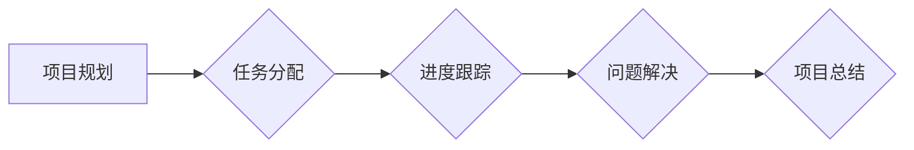
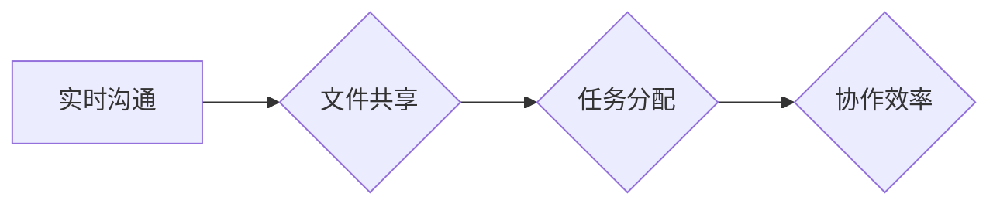
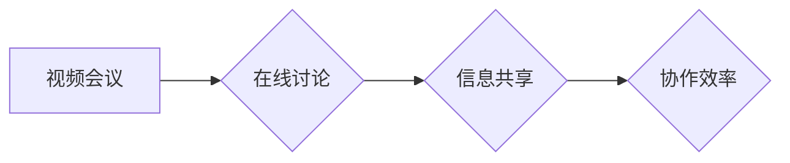

                 

# 远程团队管理：提高分布式团队的工作效率

## 关键词

远程团队管理、分布式团队、工作效率、敏捷管理、沟通技巧、领导力、时间管理、信任建设、项目管理工具、协作工具、虚拟会议

## 摘要

随着信息技术的快速发展，远程团队管理已成为现代企业运营的重要组成部分。本文针对远程团队管理中存在的问题，如沟通不畅、文化差异、时间管理困难、信任问题等，提出了一套系统性的解决方案。通过介绍核心概念、实践方法与工具，并结合实际案例分析，本文旨在为企业管理者提供有效提高远程团队工作效率的指导。

### 引言

#### 1.1 问题背景

随着全球化的不断深入和信息技术的快速发展，远程团队管理已经成为现代企业中不可或缺的一部分。远程工作不仅能够帮助企业降低运营成本，提高员工满意度，还能吸引全球优秀人才。然而，远程团队管理也面临着诸多挑战，如沟通不畅、文化差异、时间管理、信任问题等。这些问题严重影响了团队的工作效率和整体绩效。因此，如何有效提高远程团队的工作效率，成为了企业管理者急需解决的重要课题。

#### 1.2 问题描述

远程团队管理涉及到团队组织、沟通协调、任务分配、绩效评估等多个方面。当前，许多企业已经意识到远程团队管理的重要性，但实际操作中往往存在以下问题：

- **沟通不畅**：远程团队之间的沟通效率低下，信息传递不及时，导致工作效率下降。
- **文化差异**：跨文化团队的成员在价值观、工作习惯等方面存在差异，导致协作困难。
- **时间管理**：团队成员因地理位置不同，存在时间差，影响工作安排和进度。
- **信任问题**：远程团队成员之间缺乏面对面交流，信任度较低，影响团队合作。

#### 1.3 问题解决

本书旨在提供一套系统性的远程团队管理方法，帮助企业管理者解决上述问题，提高远程团队的工作效率。本书将围绕以下几个方面进行探讨：

- **核心概念与联系**：介绍远程团队管理的核心概念，如敏捷管理、沟通技巧、领导力、时间管理、信任建设等，并分析这些概念之间的联系。
- **实践方法与工具**：介绍一系列实用的远程团队管理工具和方法，如项目管理系统、协作工具、虚拟会议等。
- **案例分析**：通过实际案例，分析远程团队管理成功的经验和失败的教训，提供有价值的启示。
- **最佳实践**：总结远程团队管理的最佳实践，为读者提供可操作的指导建议。

#### 1.4 边界与外延

本书主要关注远程团队管理的基本理论和实践方法，不涉及具体的IT技术实现。同时，本书适用于所有类型的远程团队，包括跨地域、跨国界、跨时区等不同类型的团队。

#### 1.5 概念结构与核心要素组成

- **远程团队管理**：以现代信息技术为支撑，对远程团队成员进行组织、协调、控制和激励的过程。
- **核心概念**：敏捷管理、沟通技巧、领导力、时间管理、信任建设等。
- **关键要素**：团队组织结构、沟通机制、协作工具、绩效评估体系等。

### 第2章：远程团队管理的核心概念与联系

#### 2.1 敏捷管理

敏捷管理是一种以人为核心的管理理念，强调灵活应对变化、快速迭代和持续改进。在远程团队管理中，敏捷管理可以帮助团队快速适应外部环境的变化，提高响应速度和创新能力。

**概念属性特征对比表格：**

| 特征 | 敏捷管理 | 传统管理 |
| --- | --- | --- |
| 适应变化 | 高度适应 | 少适应 |
| 快速迭代 | 快速 | 较慢 |
| 团队合作 | 强调 | 较少强调 |
| 持续改进 | 强调 | 较少强调 |

**ER实体关系图架构：**

```mermaid
erDiagram
    Project ||--|{ Team }|>
    Team ||--|{ Member }|>
    Member ||--|{ Task }|>
    Task ||--|{ Status }|>
```

#### 2.2 沟通技巧

沟通技巧是远程团队管理的关键，良好的沟通能够确保团队成员之间的信息畅通，提高协作效率。沟通技巧包括倾听、表达、反馈等，具体方法有面对面沟通、虚拟会议、邮件沟通等。

**概念属性特征对比表格：**

| 特征 | 面对面沟通 | 虚拟会议 | 邮件沟通 |
| --- | --- | --- | --- |
| 实时性 | 高 | 较低 | 低 |
| 表情符号 | 可用 | 可用 | 不可用 |
| 文字表达 | 丰富 | 简洁 | 丰富 |
| 成本 | 高 | 低 | 低 |

**ER实体关系图架构：**

```mermaid
erDiagram
    Team ||--|{ Communication }|>
    Communication ||--|{ Message }|>
    Message ||--|{ Type }|>
```

#### 2.3 领导力

领导力是远程团队管理的重要方面，优秀的领导者能够激发团队成员的潜能，提高团队的凝聚力和执行力。领导力包括愿景规划、目标设定、团队激励、冲突解决等。

**概念属性特征对比表格：**

| 特征 | 领导力 | 管理能力 |
| --- | --- | --- |
| 激励员工 | 强调 | 较少强调 |
| 决策能力 | 强调 | 较少强调 |
| 沟通能力 | 强调 | 较少强调 |
| 适应变化 | 强调 | 较少强调 |

**ER实体关系图架构：**

```mermaid
erDiagram
    Team ||--|{ Leadership }|>
    Leadership ||--|{ Skill }|>
    Skill ||--|{ Performance }|>
```

#### 2.4 时间管理

时间管理是远程团队管理中的一个重要问题，良好的时间管理能够提高团队成员的工作效率，确保项目进度。时间管理方法包括制定计划、优先级排序、避免拖延等。

**概念属性特征对比表格：**

| 特征 | 时间管理 | 随意管理 |
| --- | --- | --- |
| 计划性 | 强调 | 较少强调 |
| 优先级 | 强调 | 较少强调 |
| 避免拖延 | 强调 | 较少强调 |
| 跟踪进度 | 强调 | 较少强调 |

**ER实体关系图架构：**

```mermaid
erDiagram
    Team ||--|{ TimeManagement }|>
    TimeManagement ||--|{ Task }|>
    Task ||--|{ Deadline }|>
```

#### 2.5 信任建设

信任是远程团队协作的基石，建立良好的信任关系能够提高团队的合作效率，降低沟通成本。信任建设包括透明沟通、诚实守信、共同目标等。

**概念属性特征对比表格：**

| 特征 | 信任建设 | 不信任建设 |
| --- | --- | --- |
| 透明沟通 | 强调 | 避免 |
| 诚实守信 | 强调 | 不强调 |
| 共同目标 | 强调 | 不强调 |

**ER实体关系图架构：**

```mermaid
erDiagram
    Team ||--|{ TrustBuilding }|>
    TrustBuilding ||--|{ Communication }|>
    Communication ||--|{ Transparency }|>
```

#### 2.6 核心概念之间的联系

敏捷管理、沟通技巧、领导力、时间管理和信任建设等核心概念之间相互关联，共同构成了远程团队管理的理论基础。敏捷管理强调快速响应变化，需要良好的沟通技巧和领导力；时间管理有助于提高工作效率，需要领导者的有效规划和激励；信任建设是团队协作的基础，需要通过沟通和领导力来维系。

**ER实体关系图架构：**

```mermaid
erDiagram
    AgileManagement ||--|{ Communication }|>
    AgileManagement ||--|{ Leadership }|>
    AgileManagement ||--|{ TimeManagement }|>
    AgileManagement ||--|{ TrustBuilding }|>
    Communication ||--|{ Leadership }|>
    Communication ||--|{ TimeManagement }|>
    Communication ||--|{ TrustBuilding }|>
    Leadership ||--|{ TimeManagement }|>
    Leadership ||--|{ TrustBuilding }|>
    TimeManagement ||--|{ TrustBuilding }|>
```

### 第3章：远程团队管理的实践方法与工具

#### 3.1 项目管理系统

项目管理系统能够帮助远程团队更好地规划、跟踪和管理项目进度，提高工作效率。常用的项目管理工具有JIRA、Trello、Asana等。

**Mermaid流程图：**



#### 3.2 协作工具

协作工具是远程团队沟通和协作的重要手段，如Slack、Microsoft Teams、Zoom等。这些工具能够支持实时沟通、文件共享、任务分配等功能。

**Mermaid流程图：**



#### 3.3 虚拟会议

虚拟会议是远程团队沟通和协作的重要方式，通过视频会议、在线讨论等方式，确保团队成员之间的信息畅通和协作高效。常用的虚拟会议工具有Zoom、Microsoft Teams、Google Meet等。

**Mermaid流程图：**



### 第4章：案例分析

#### 4.1 成功案例

**案例背景：** 一家跨国公司由于业务扩展，需要组建一个跨地域的远程团队。团队成员分布在不同的国家和地区，语言和时区差异较大。

**解决方案：** 
- 采用敏捷管理方法，快速响应业务需求，提高团队响应速度。
- 使用Slack进行实时沟通，确保信息畅通。
- 采用Trello进行任务分配和进度跟踪，提高工作效率。
- 通过Zoom进行虚拟会议，加强团队成员之间的交流。

**结果：** 经过一段时间的管理，该团队的工作效率显著提高，项目进度得到有效控制，最终成功完成了任务。

#### 4.2 失败案例

**案例背景：** 一家初创公司由于缺乏远程团队管理的经验，导致项目进展缓慢，团队成员之间存在严重的沟通不畅和信任问题。

**解决方案：** 
- 建立明确的沟通机制，确保信息畅通。
- 采用透明沟通策略，增强团队成员之间的信任。
- 定期进行团队建设活动，提高团队凝聚力。
- 引入项目管理工具，提高任务分配和进度跟踪的效率。

**结果：** 经过一段时间的调整，该团队的工作效率有所提高，但项目进度仍然滞后，最终导致项目失败。

### 第5章：最佳实践

#### 5.1 建立明确的沟通机制

- 定期举行团队会议，确保团队成员之间的沟通畅通。
- 设立专门的沟通渠道，如Slack、邮件等，方便团队成员随时交流。
- 建立问题反馈机制，鼓励团队成员提出意见和建议。

#### 5.2 采用透明沟通策略

- 在团队内部公开项目进展和重要决策，增强团队成员之间的信任。
- 鼓励团队成员主动分享信息，避免信息孤岛。
- 定期进行团队反馈和总结，发现问题并采取措施。

#### 5.3 定期进行团队建设活动

- 组织线下或线上团队建设活动，增强团队成员之间的联系。
- 定期举行团队培训，提高团队成员的专业技能。
- 鼓励团队成员参加行业会议和培训，拓宽视野。

### 小结

远程团队管理是一个复杂的系统性工程，涉及多个方面的问题。通过本文的探讨，我们了解了远程团队管理的核心概念、实践方法与工具，并通过实际案例分析，总结了成功的经验和失败的教训。为了提高远程团队的工作效率，企业管理者需要结合实际情况，采取有效的管理措施，建立明确的沟通机制，采用透明沟通策略，定期进行团队建设活动，从而实现团队的高效协作。

### 注意事项

- 远程团队管理需要根据实际情况灵活调整，避免一刀切。
- 领导者需要具备较强的沟通能力和领导力，以身作则，带领团队走向成功。
- 定期对远程团队管理的效果进行评估，及时调整管理策略。

### 拓展阅读

- 《敏捷开发实践指南》
- 《团队协作技巧》
- 《远程工作：未来的工作模式》
- 《信任：如何建立和维护信任关系》

### 作者信息

作者：AI天才研究院/AI Genius Institute & 禅与计算机程序设计艺术 /Zen And The Art of Computer Programming

