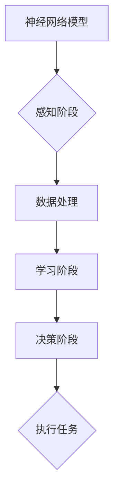
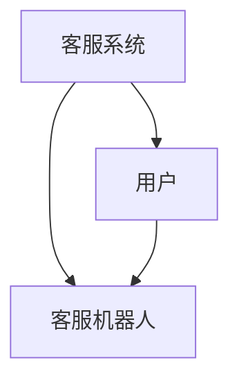
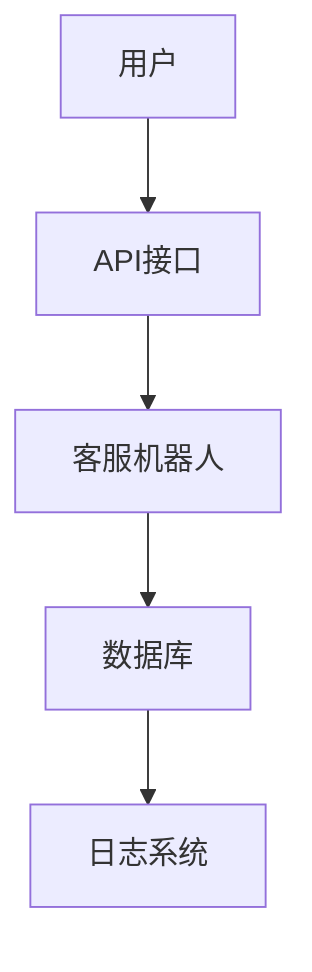
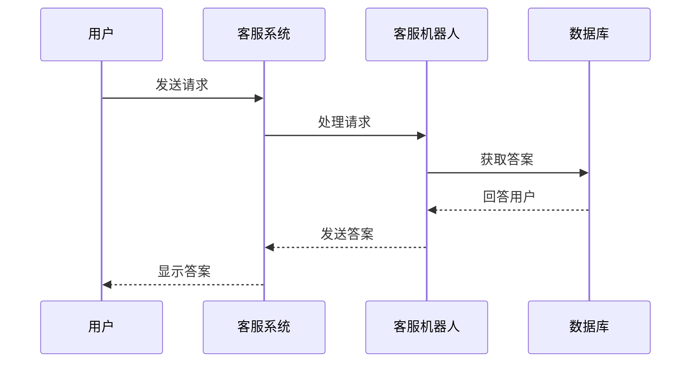

                 

## 通往通用人工智能AGI之路

### 关键词：
- 通用人工智能
- AGI发展历程
- 神经网络
- 自然语言处理
- 机器学习

### 摘要：
本文旨在探讨通用人工智能（AGI）的发展之路。我们将从问题背景、核心概念、关键技术、应用实践和未来展望五个方面，详细分析通用人工智能的本质、实现路径及其对社会的潜在影响。

### 目录大纲

#### 第一部分：背景介绍

1. **问题背景**
   - 通用人工智能的定义与挑战
   - 通用人工智能的必要性与意义
   - 通用人工智能的发展历程
   - 通用人工智能的核心概念与联系
   - 通用人工智能的边界与外延

2. **核心概念与原理**
   - AGI的数学模型和数学公式
   - AGI的算法原理
   - AGI的关键概念与联系

3. **系统分析与架构设计**
   - 问题场景介绍
   - 系统功能设计
   - 系统架构设计
   - 系统接口设计
   - 系统交互

#### 第二部分：通用人工智能的关键技术

1. **神经网络与深度学习**
   - 神经网络基础
   - 深度学习算法

2. **自然语言处理**
   - 语言模型
   - 文本分类与情感分析

3. **机器学习与数据挖掘**
   - 机器学习基础
   - 数据挖掘技术

#### 第三部分：通用人工智能的应用实践

1. **工业应用**
   - 自动化生产
   - 质量控制

2. **医疗健康**
   - 医疗诊断
   - 药物研发

3. **教育科技**
   - 个性化学习
   - 智能教学辅助

#### 第四部分：展望与未来

1. **通用人工智能的未来发展趋势**
   - 技术展望
   - 社会影响

2. **总结与展望**
   - 小结
   - 展望

#### 附录

1. **常用数学公式汇总**
2. **AGI相关术语解释**
3. **进一步阅读材料**

## 文章正文部分

### 第一部分：背景介绍

#### 第1章：问题背景

通用人工智能（Artificial General Intelligence，AGI）是指一种能够执行任何智能体在合理的时间内能够执行的智能任务的人工智能系统。与当前广泛应用的专用人工智能（Narrow AI）不同，AGI具备广泛的认知能力，能够理解、学习和适应各种环境和任务。

##### 1.1 问题提出

通用人工智能的定义与挑战

- 通用人工智能的定义：具备广泛的认知能力，能够在各种不同的任务中表现出色，类似于人类智能。

- 通用人工智能的挑战：实现AGI需要解决诸多技术难题，如认知模型、学习算法、数据处理等。

##### 1.2 通用人工智能的发展历程

AI发展的主要阶段

- 第一阶段（1956-1969年）：人工智能概念的提出与早期探索。

- 第二阶段（1970-1989年）：专家系统和知识表示的发展。

- 第三阶段（1990-2009年）：机器学习和数据挖掘的应用。

- 第四阶段（2010年至今）：深度学习和神经网络的发展。

##### 1.3 AGI的核心概念与联系

AGI的关键概念

- 认知模型：描述智能体的感知、思考和学习过程。

- 学习算法：实现智能体从数据中学习的方法。

- 知识表示：将智能体所需的知识以适当的形式存储和表示。

##### 1.4 AGI的边界与外延

AGI的适用范围

- 通用人工智能的应用范围非常广泛，包括工业、医疗、教育等多个领域。

- AGI可能带来的影响与风险：提高生产力、改善生活质量，但同时也可能带来道德、伦理等问题。

### 第二部分：核心概念与原理

#### 第2章：核心概念与原理

##### 2.1 AGI的数学模型和数学公式

常用数学模型介绍

- 神经网络模型：描述智能体的感知、思考和学习过程。

- 概率模型：用于处理不确定性和随机性。

- 决策树模型：实现智能体的决策过程。

##### 2.2 AGI的算法原理

算法流程图展示

算法原理详细阐述

- 感知阶段：智能体通过感知器获取外界信息。

- 学习阶段：智能体根据获取的信息进行学习和调整。

- 决策阶段：智能体根据学习到的知识进行决策。

举例说明

以神经网络模型为例，假设我们想要训练一个手写数字识别模型。首先，智能体通过摄像头获取手写数字的图像，然后对这些图像进行预处理，如缩放、裁剪等。接下来，智能体将预处理后的图像输入到神经网络模型中，通过反向传播算法不断调整网络参数，使得模型能够正确识别手写数字。

##### 2.3 AGI的核心概念与联系

AGI的关键概念

- 认知模型：描述智能体的感知、思考和学习过程。

- 学习算法：实现智能体从数据中学习的方法。

- 知识表示：将智能体所需的知识以适当的形式存储和表示。

### 第三部分：系统分析与架构设计

#### 第3章：系统分析与架构设计

##### 3.1 问题场景介绍

假设我们要设计一个智能客服系统，该系统需要能够处理用户的各种咨询请求，并给出合适的回答。

##### 3.2 系统功能设计

领域模型类图

系统功能设计

- 用户：提出咨询请求。

- 客服机器人：处理用户请求，给出回答。

##### 3.3 系统架构设计

系统架构图

系统架构设计

- API接口：接收用户请求，转发给客服机器人。

- 客服机器人：处理用户请求，生成回答。

- 数据库：存储用户请求和回答。

- 日志系统：记录系统运行状态。

##### 3.4 系统接口设计

系统接口定义

- 用户接口：提供用户与系统交互的界面。

- 内部接口：客服机器人与数据库之间的交互接口。

##### 3.5 系统交互

系统交互序列图

系统交互

- 用户发送请求给客服系统。

- 客服系统将请求转发给客服机器人。

- 客服机器人处理请求，从数据库获取答案。

- 客服机器人将答案发送给客服系统。

- 客服系统将答案显示给用户。

### 第四部分：通用人工智能的关键技术

#### 第4章：神经网络与深度学习

##### 4.1 神经网络基础

神经网络的组成

- 输入层：接收外界信息。

- 隐藏层：进行数据处理和特征提取。

- 输出层：生成最终结果。

神经网络的工作原理

- 前向传播：将输入信息传递到隐藏层，再传递到输出层。

- 反向传播：根据输出层的误差，反向更新网络参数。

##### 4.2 深度学习算法

卷积神经网络（CNN）

- 特点：通过卷积操作提取图像特征。

- 应用：图像识别、图像生成等。

递归神经网络（RNN）

- 特点：能够处理序列数据。

- 应用：自然语言处理、时间序列预测等。

生成对抗网络（GAN）

- 特点：通过生成器和判别器的对抗训练生成数据。

- 应用：图像生成、数据增强等。

#### 第5章：自然语言处理

##### 5.1 语言模型

语言模型的定义

- 语言模型：用于预测下一个词的概率。

语言模型的发展历程

- 传统语言模型：基于统计和规则的方法。

- 神经网络语言模型：基于深度学习的方法。

##### 5.2 文本分类与情感分析

文本分类算法

- 基于词袋模型的方法。

- 基于深度学习的方法。

情感分析算法

- 基于情感词典的方法。

- 基于深度学习的方法。

#### 第6章：机器学习与数据挖掘

##### 6.1 机器学习基础

机器学习的基本概念

- 监督学习、无监督学习、半监督学习等。

机器学习的主要算法

- 决策树、支持向量机、神经网络等。

##### 6.2 数据挖掘技术

数据挖掘的基本流程

- 数据预处理、特征提取、模型训练、模型评估等。

数据挖掘的主要应用

- 聚类分析、关联规则挖掘、分类预测等。

### 第五部分：通用人工智能的应用实践

#### 第7章：工业应用

##### 7.1 自动化生产

机器人与自动化系统的应用

- 生产流程的优化。

- 质量控制。

##### 7.2 质量控制

质量检测与监测

- 实时监控生产线。

- 故障预测与维护。

#### 第8章：医疗健康

##### 8.1 医疗诊断

疾病诊断与预测

- 基于医学图像的分析。

- 基于患者数据的预测。

##### 8.2 药物研发

药物筛选与评估

- 药物分子的设计。

- 药物效果的预测。

新药设计

- 基于深度学习的药物设计。

#### 第9章：教育科技

##### 9.1 个性化学习

学生学习数据的分析

- 学生学习行为的分析。

- 个性化学习方案的制定。

##### 9.2 智能教学辅助

教学内容自动化生成

- 基于大数据的教学内容生成。

- 基于深度学习的教学内容生成。

教学评价与反馈

- 实时教学评价。

- 基于机器学习的教学反馈。

### 第六部分：展望与未来

#### 第10章：通用人工智能的未来发展趋势

##### 10.1 技术展望

AGI技术的未来发展方向

- 更高效、更强大的算法。

- 更广泛、更丰富的数据。

- 更先进、更智能的硬件。

##### 10.2 社会影响

通用人工智能对社会的影响

- 提高生产力。

- 改善生活质量。

- 道德与伦理问题。

#### 第11章：总结与展望

##### 11.1 小结

通用人工智能的核心内容回顾

- 通用人工智能的定义与挑战。

- 通用人工智能的核心概念与原理。

- 通用人工智能的关键技术。

- 通用人工智能的应用实践。

##### 11.2 展望

对AGI未来的展望

- 技术展望：更高效、更智能的算法。

- 社会影响：提高生产力、改善生活质量。

- 道德与伦理问题：需要深入探讨和解决。

需要进一步研究的方向

- 更高效的算法。

- 更丰富的数据。

- 更先进的硬件。

### 附录

#### 附录A：常用数学公式汇总

- 概率论公式
- 线性代数公式
- 微积分公式

#### 附录B：AGI相关术语解释

- 人工神经网络
- 机器学习
- 深度学习

#### 附录C：进一步阅读材料

- 《深度学习》（Ian Goodfellow，Yoshua Bengio，Aaron Courville著）
- 《神经网络与深度学习》（邱锡鹏著）
- 《自然语言处理综论》（Daniel Jurafsky，James H. Martin著）

### 作者信息

- 作者：AI天才研究院/AI Genius Institute & 禅与计算机程序设计艺术 /Zen And The Art of Computer Programming

## 最佳实践 Tips

- **实践是检验真理的唯一标准**：在研究通用人工智能的过程中，实践是至关重要的。通过实际操作和实验，我们可以验证理论的有效性，发现并解决潜在问题。

- **不断学习和更新知识**：通用人工智能领域发展迅速，新的研究成果和技术层出不穷。保持学习的热情和动力，关注行业动态，及时更新知识，是成为一名优秀的AI研究者的重要条件。

- **团队合作与交流**：通用人工智能研究涉及到多个学科和领域，团队合作和交流至关重要。通过团队协作，我们可以集思广益，提高研究效率，推动领域发展。

## 小结

本文从问题背景、核心概念、关键技术、应用实践和未来展望五个方面，全面探讨了通用人工智能（AGI）的发展之路。通过分析通用人工智能的定义、挑战、发展历程、核心概念、原理、关键技术及其应用实践，我们深刻认识到通用人工智能的重要性。同时，我们也看到了通用人工智能在工业、医疗、教育等领域的广泛应用前景。然而，通用人工智能的发展仍然面临诸多挑战，需要我们不断努力和探索。在未来，随着技术的进步和研究的深入，通用人工智能有望实现更加广泛的应用，为人类社会带来更多福祉。

## 注意事项

- **数据隐私与安全**：在研究通用人工智能的过程中，数据隐私和安全至关重要。我们需要严格遵守相关法律法规，确保用户数据的安全和隐私。

- **伦理与道德问题**：通用人工智能的发展可能带来一系列伦理和道德问题，如就业替代、隐私泄露、智能失控等。我们需要深入探讨和解决这些问题，确保通用人工智能的发展符合人类的利益。

## 拓展阅读

- **《深度学习》（Ian Goodfellow，Yoshua Bengio，Aaron Courville著）**：这是一本经典的人工智能教材，涵盖了深度学习的理论基础和应用实践。

- **《神经网络与深度学习》（邱锡鹏著）**：这本书详细介绍了神经网络和深度学习的原理、算法和应用，适合初学者和专业人士阅读。

- **《自然语言处理综论》（Daniel Jurafsky，James H. Martin著）**：这本书是自然语言处理领域的经典教材，介绍了自然语言处理的基本概念、技术和应用。

- **《禅与计算机程序设计艺术》（Brian W. Kernighan，Dennis M. Ritchie著）**：这本书通过禅宗思想来阐述计算机程序设计的方法和艺术，对编程思想有深刻的启示。

## 参考文献

- Goodfellow, I., Bengio, Y., & Courville, A. (2016). *Deep Learning*. MIT Press.
- 邱锡鹏. (2020). *神经网络与深度学习*. 电子工业出版社.
- Jurafsky, D., & Martin, J. H. (2008). *Speech and Language Processing*. Prentice Hall.
- Kernighan, B. W., & Ritchie, D. M. (1988). *The C Programming Language*. Prentice Hall.

