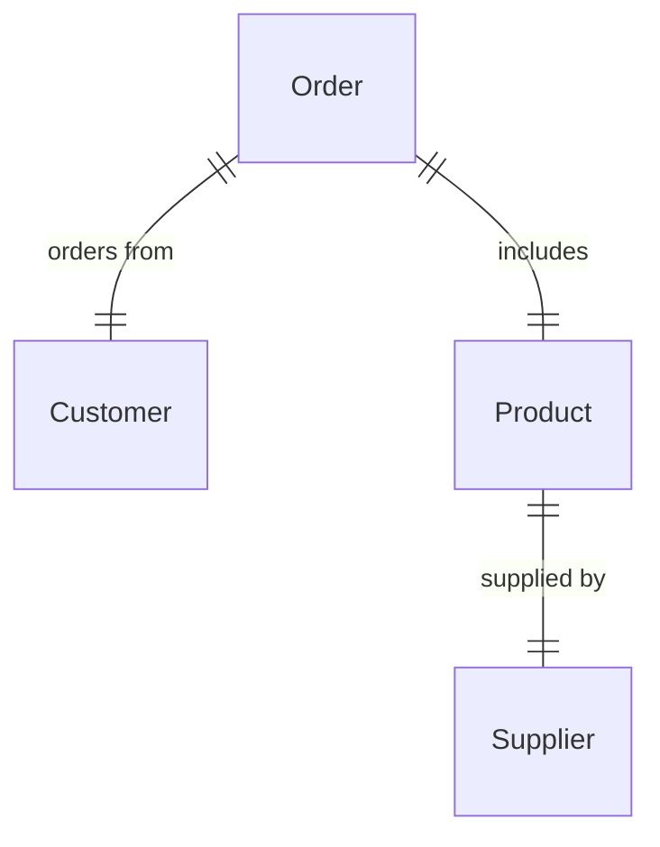
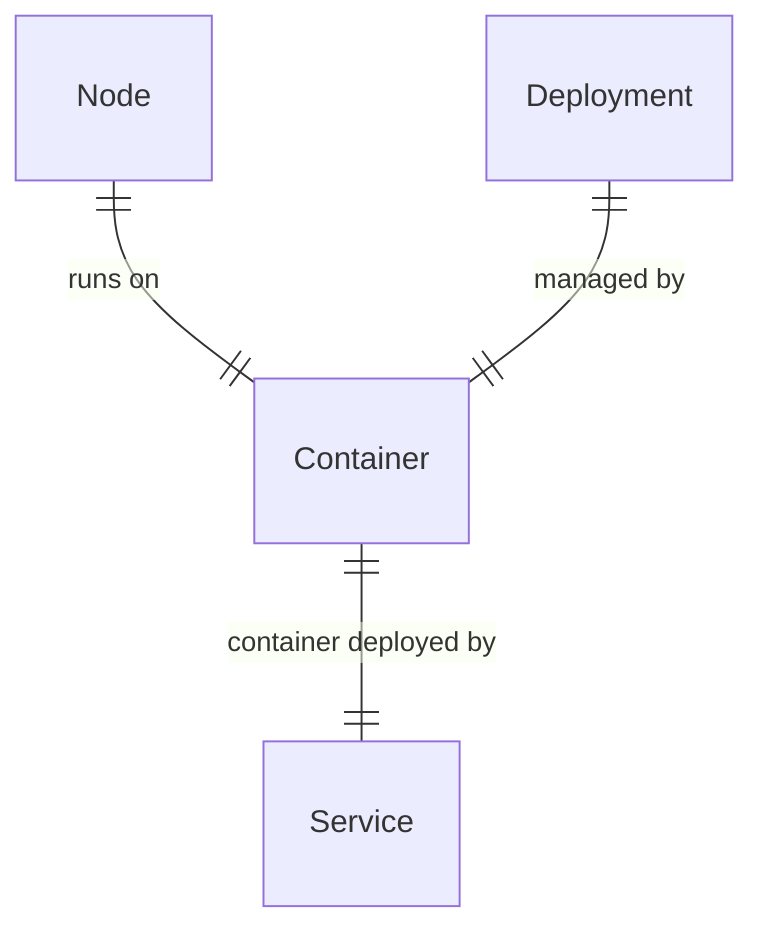
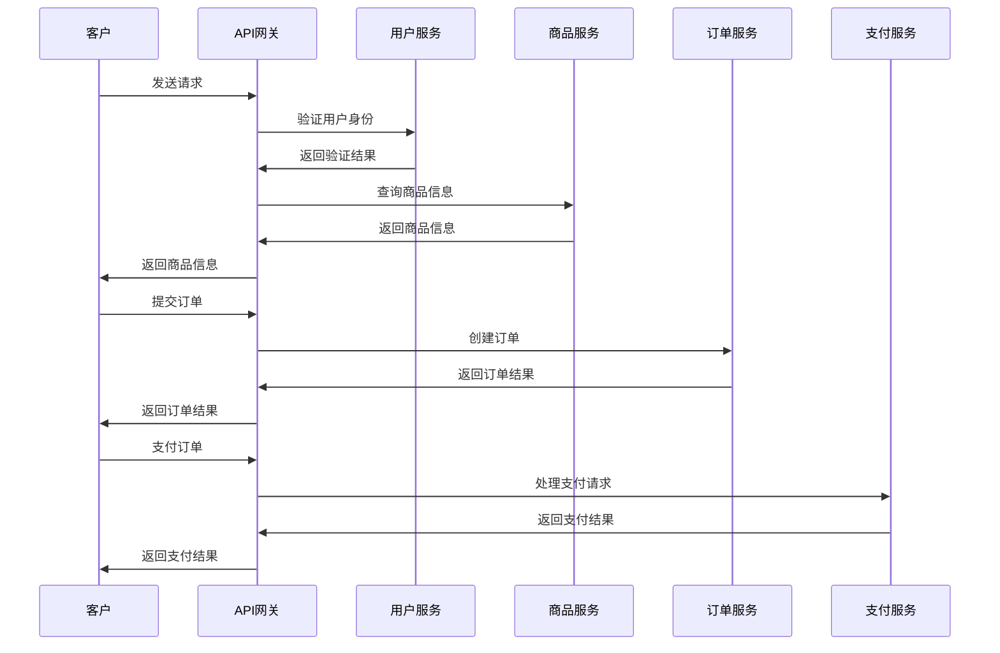
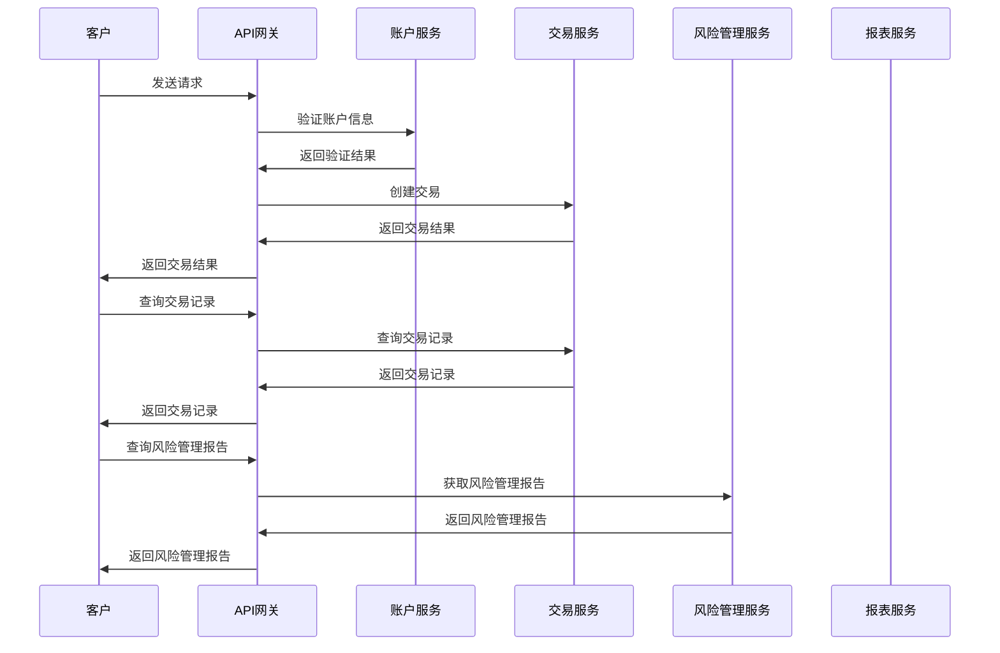
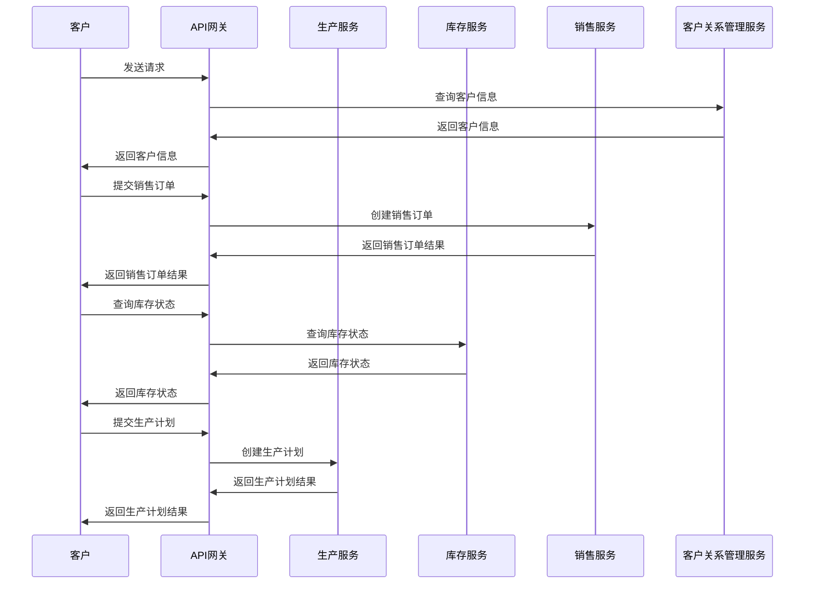

                 

# 遗留系统改造：平滑过渡到现代架构

> 关键词：遗留系统、现代架构、平滑过渡、改造方法论、实战案例

> 摘要：本文深入探讨了遗留系统的定义、现状及其改造的重要性。通过分析遗留系统存在的问题，提出了平滑过渡到现代架构的方法论，包括评估、策略、步骤和维护优化。同时，通过实战案例分享了改造经验，为遗留系统改造提供了实际指导。

## 目录大纲设计过程

在设计《遗留系统改造：平滑过渡到现代架构》这本书的目录大纲时，我们需要遵循以下步骤：

1. **确定核心章节**：根据书名和目标读者群体，确定核心章节。核心章节应涵盖遗留系统的定义、现状分析、改造方法、最佳实践、技术细节和未来趋势。

2. **分解章节内容**：每个核心章节应进一步细分为子章节，确保内容覆盖全面且逻辑清晰。

3. **设计层级结构**：使用 markdown 格式，确保目录结构的清晰性，包括1级、2级和3级目录。

4. **确保内容完整性**：每个章节都要包含背景介绍、核心概念与联系、算法原理讲解、数学模型和数学公式详细讲解、系统分析与架构设计方案、项目实战、最佳实践 tips等内容。

5. **简洁性**：避免冗余内容，确保目录大纲简洁明了。

### 最终目录大纲设计

```markdown
# 《遗留系统改造：平滑过渡到现代架构》目录大纲

## 第一部分：遗留系统现状分析

### 1. 遗留系统的定义与分类
- 1.1 遗留系统的定义
- 1.2 遗留系统的分类
- 1.3 遗留系统的核心问题

### 2. 遗留系统的问题现状
- 2.1 系统性能瓶颈
- 2.2 技术债务
- 2.3 系统扩展性不足
- 2.4 安全与合规风险

## 第二部分：现代架构介绍

### 3. 现代架构的概念与特点
- 3.1 微服务架构
- 3.2 容器化与Kubernetes
- 3.3 云原生技术
- 3.4 DevOps与持续集成/持续部署（CI/CD）

### 4. 现代架构的优势与挑战
- 4.1 优势分析
- 4.2 挑战与应对策略

## 第三部分：遗留系统改造方法论

### 5. 改造前评估
- 5.1 评估流程
- 5.2 性能评估
- 5.3 安全性评估
- 5.4 扩展性与兼容性评估

### 6. 改造策略与步骤
- 6.1 微服务化
- 6.2 容器化与编排
- 6.3 云迁移
- 6.4 DevOps实践

### 7. 改造后的系统维护与优化
- 7.1 维护策略
- 7.2 性能优化
- 7.3 安全加固
- 7.4 自动化与智能化

## 第四部分：实战案例分享

### 8. 遗留系统改造实战案例
- 8.1 案例一：某大型电商平台的遗留系统改造
- 8.2 案例二：某金融企业的遗留系统改造
- 8.3 案例三：某制造行业的遗留系统改造

### 9. 项目总结与经验分享
- 9.1 项目成功要素
- 9.2 经验教训
- 9.3 拓展思考

## 第五部分：未来趋势与展望

### 10. 遗留系统改造的未来趋势
- 10.1 技术发展趋势
- 10.2 行业应用展望
- 10.3 未来挑战与机遇

### 11. 总结与展望
- 11.1 成果总结
- 11.2 展望未来
```

以上目录大纲覆盖了遗留系统改造的各个方面，从现状分析到方法论，再到实战案例和未来展望，为读者提供了全面、系统的指导。

----------------------------------------------------------------

## 第一部分：遗留系统现状分析

### 1.1 遗留系统的定义

遗留系统（Legacy System）通常指的是那些随着时间推移，由于技术或业务需求的变化而逐渐不再满足当前使用需求的信息系统。这些系统可能是在多年前开发的，使用的技术和编程语言可能已经过时，或者它们可能是由多个不同团队在不同时间点开发的，导致系统结构复杂、难以维护。

**遗留系统的定义**可以从以下几个方面进行理解：

- **技术层面**：遗留系统通常指的是那些使用了过时的编程语言、数据库或操作系统的系统。例如，一个使用COBOL语言开发的银行核心系统。
  
- **业务层面**：遗留系统可能是那些随着业务发展而不再适应现有需求的系统。例如，一个电商平台可能需要支持更多的支付方式，但其遗留系统仅支持有限的支付渠道。

- **维护层面**：遗留系统通常是指那些维护成本高、难以扩展的系统。这些系统可能存在代码冗长、缺乏文档、技术债务等问题。

### 1.2 遗留系统的分类

根据遗留系统的不同特点，可以将其分为以下几类：

- **技术落后型**：这类系统通常使用了过时的技术栈，难以与现代技术集成或维护。例如，使用DOS操作系统的系统。

- **业务僵化型**：这类系统虽然技术栈较为现代化，但业务逻辑过于僵化，难以适应新的业务需求。例如，一个大型ERP系统。

- **维护困难型**：这类系统由于代码质量低下、文档缺失，导致维护困难。例如，一个使用了大量自定义数据库存储的网站。

- **架构复杂型**：这类系统通常具有复杂的架构设计，例如使用了大量的中间件和系统集成技术，导致系统扩展和维护成本高昂。

### 1.3 遗留系统的核心问题

遗留系统的核心问题主要包括以下几个方面：

- **系统性能瓶颈**：遗留系统往往无法满足现代业务需求的高并发、大数据处理能力。

- **技术债务**：遗留系统由于长时间未进行技术更新，导致代码质量低下、技术负债累积。

- **系统扩展性不足**：遗留系统难以适应业务扩展需求，例如新功能的添加或用户量的增加。

- **安全与合规风险**：遗留系统可能存在安全漏洞或不符合最新的法律法规要求。

- **维护成本高昂**：遗留系统由于结构复杂、文档缺失，导致维护成本高，且难以招聘到熟悉系统的人才。

**小结**：遗留系统由于技术、业务、维护等方面的问题，已成为企业发展的一大障碍。对其进行改造，以平滑过渡到现代架构，是提升企业竞争力、降低成本、满足新业务需求的关键。

### 1.4 遗留系统的边界与外延

遗留系统的边界与外延主要表现在以下几个方面：

- **时间维度**：遗留系统通常是指那些在一段时间内不再被维护或更新的系统。这个时间段可以是几年，也可以是几十年。

- **技术维度**：遗留系统所使用的技术，包括编程语言、数据库、操作系统等，通常已经不再是最新的或者主流的技术。

- **业务维度**：遗留系统可能不再满足当前的业务需求，但它们可能仍然在业务流程中起到关键作用。

- **维护维度**：遗留系统的维护成本通常较高，且由于缺乏最新的文档和代码注释，维护难度大。

**核心要素组成**：遗留系统的核心要素包括：

1. **系统架构**：系统的整体架构设计，包括数据流、功能模块划分等。
2. **代码库**：系统的源代码库，包括主分支、开发分支等。
3. **文档**：系统的相关文档，包括用户手册、技术文档、维护手册等。
4. **数据库**：系统所使用的数据库，包括数据表、存储过程等。
5. **硬件**：系统所依赖的硬件设备，如服务器、网络设备等。

**概念结构与核心要素组成**：遗留系统的概念结构可以视为一个多层次的体系，包括：

- **业务逻辑层**：实现业务流程和规则的模块。
- **数据访问层**：处理与数据库交互的模块。
- **服务层**：提供公共服务，如日志记录、配置管理等的模块。
- **界面层**：用户与系统交互的界面。

通过这些核心要素和概念结构，我们可以更好地理解和分析遗留系统的现状，为其改造提供依据。

## 第二部分：现代架构介绍

### 3.1 微服务架构

微服务架构（Microservices Architecture）是一种设计应用程序的方法，它将应用程序分解为一系列独立、可扩展、相互通信的小型服务。每个服务专注于完成一个具体的业务功能，并通过轻量级的通信机制（通常是HTTP RESTful API）进行交互。

**微服务架构的特点**包括：

- **独立性**：每个服务都可以独立部署、升级和扩展，不会影响其他服务。
- **松耦合**：服务之间通过API进行通信，降低服务之间的依赖性。
- **可扩展性**：可以根据业务需求独立扩展某个服务，而不需要影响整个系统。
- **灵活的技术栈**：每个服务可以采用最适合的技术栈，例如一个服务可以使用Java，另一个服务可以使用Python。

**微服务架构的优缺点**如下：

- **优点**：
  - **独立性**：每个服务可以独立开发、部署和扩展，提高了系统的灵活性和可靠性。
  - **可扩展性**：可以根据业务需求独立扩展某个服务，提高了系统的性能。
  - **技术多样性**：每个服务可以采用最适合的技术栈，提高了开发效率。

- **缺点**：
  - **复杂性**：由于服务数量众多，系统的复杂性增加，增加了开发和维护的难度。
  - **分布式系统挑战**：服务之间的通信和数据一致性管理成为挑战。
  - **运维复杂度**：需要更多的自动化工具和运维策略来管理大量的服务实例。

### 3.2 容器化与Kubernetes

容器化（Containerization）是一种轻量级的应用打包和运行技术，它将应用程序及其依赖环境打包在一个容器中，以便在不同的环境中一致地运行。Kubernetes（K8s）是一个开源的容器编排平台，用于自动化容器的部署、扩展和管理。

**容器化的优势**包括：

- **轻量级**：容器是轻量级的，不会占用大量的系统资源。
- **一致性**：容器在不同的环境中保持一致，提高了开发和部署的效率。
- **可移植性**：容器可以在不同的操作系统和云平台之间移植。

**Kubernetes的功能**包括：

- **服务发现和负载均衡**：自动发现和管理容器，提供负载均衡。
- **存储编排**：提供持久化存储解决方案。
- **自动部署和回滚**：自动部署新的容器版本，并提供回滚功能。
- **自动修复**：自动检测和修复容器故障。

**容器化与Kubernetes的优缺点**如下：

- **优点**：
  - **轻量级**：容器化提高了系统的可移植性和资源利用率。
  - **自动化**：Kubernetes提供了自动化部署和管理功能，减少了运维工作量。

- **缺点**：
  - **复杂性**：需要一定的学习曲线，特别是在部署和管理复杂的应用程序时。
  - **监控与调试**：随着容器数量增多，监控和调试变得复杂。

### 3.3 云原生技术

云原生技术（Cloud Native Technology）是一套开发、部署和管理应用程序的方法，它充分利用云计算提供的弹性和可扩展性。云原生应用程序通常由多个微服务组成，运行在容器化环境中，并通过自动化工具进行管理和部署。

**云原生技术的核心概念**包括：

- **微服务**：应用程序分解为多个独立的微服务，每个服务负责特定的业务功能。
- **容器化**：应用程序及其依赖环境打包在容器中，以便在不同的环境中一致地运行。
- **动态管理**：通过自动化工具（如Kubernetes）进行应用程序的部署、扩展和管理。

**云原生技术的优势**包括：

- **弹性**：可以根据需求动态扩展或缩小应用程序规模。
- **可扩展性**：支持大规模分布式应用程序。
- **可靠性**：通过自动化工具提高系统的可靠性和可用性。

**云原生技术的挑战**包括：

- **复杂性**：云原生技术涉及多个组件和工具，需要一定的学习和实践经验。
- **安全性**：确保容器和云原生环境的安全性是关键挑战。

### 3.4 DevOps与持续集成/持续部署（CI/CD）

DevOps是一种文化和实践，旨在通过开发（Development）和运维（Operations）的紧密结合，提高软件交付的效率和质量。持续集成/持续部署（Continuous Integration/Continuous Deployment，CI/CD）是DevOps的核心实践之一。

**DevOps的核心原则**包括：

- **自动化**：通过自动化工具和流程提高开发、测试和部署的效率。
- **协作**：加强开发、测试、运维团队之间的协作，确保高质量的软件交付。
- **反馈**：通过快速的反馈循环，快速识别和修复问题。

**CI/CD的优势**包括：

- **快速反馈**：通过自动化的集成和部署流程，快速发现并修复代码缺陷。
- **提高质量**：通过频繁的集成和测试，提高软件的质量。
- **缩短周期**：通过自动化，缩短从开发到部署的周期。

**CI/CD的挑战**包括：

- **复杂性**：CI/CD涉及多个工具和流程，需要一定的学习和配置。
- **安全性**：确保自动化的集成和部署流程符合安全标准。

**小结**：现代架构，如微服务、容器化、云原生技术和DevOps，为遗留系统改造提供了有效的解决方案。这些技术不仅可以解决遗留系统存在的问题，还能提高系统的可扩展性、可靠性和开发效率。

## 第三部分：遗留系统改造方法论

### 5.1 改造前评估

在开始遗留系统改造之前，进行全面的评估是至关重要的。这一步骤有助于了解系统的现状，识别潜在的风险和挑战，并为后续的改造工作提供指导。

**评估流程**包括以下关键步骤：

1. **业务需求分析**：了解当前系统如何满足业务需求，以及业务需求的变化趋势。这有助于确定改造的优先级和目标。

2. **技术评估**：评估系统的技术架构、代码质量、技术债务等。识别系统中的技术瓶颈和需要更新的技术。

3. **性能评估**：对系统的性能进行评估，包括响应时间、并发处理能力、资源利用率等。这有助于确定系统是否满足当前和未来的性能需求。

4. **安全性评估**：评估系统的安全性，包括是否存在安全漏洞、是否符合最新的法律法规要求等。

5. **成本评估**：评估改造的总体成本，包括人力、时间和资金投入。确保改造项目的经济效益。

**性能评估**是评估流程中的一个重要环节，它涉及到以下几个方面：

- **响应时间**：系统处理请求所需的时间，可以通过性能测试工具进行测量。
- **并发处理能力**：系统同时处理多个请求的能力，可以通过压力测试进行评估。
- **资源利用率**：系统使用CPU、内存、磁盘等资源的情况，可以通过系统监控工具进行分析。

**安全性评估**则需要关注以下几个方面：

- **漏洞扫描**：使用自动化工具对系统进行漏洞扫描，识别潜在的安全漏洞。
- **安全合规性检查**：确保系统符合最新的安全标准和法律法规要求。
- **访问控制**：评估系统的访问控制机制，确保只有授权用户可以访问敏感数据。

**扩展性与兼容性评估**是另一个关键方面，它包括：

- **系统扩展性**：评估系统是否能够支持未来的业务增长和功能扩展。
- **技术兼容性**：评估系统是否能够与其他系统和技术集成。

**小结**：通过全面的评估，我们可以了解遗留系统的现状和改造的需求，为后续的改造工作打下坚实的基础。评估结果不仅有助于确定改造的目标和策略，还能预测潜在的风险和挑战，确保改造项目的成功。

### 6.1 微服务化

**微服务化**是将遗留系统重构为一系列独立、可扩展的小型服务的过程。每个服务都负责特定的业务功能，并通过轻量级的通信机制进行交互。微服务化有助于提升系统的灵活性、可维护性和扩展性。

**微服务化的步骤**包括：

1. **业务拆分**：将遗留系统的业务功能进行拆分，确定每个服务的职责和边界。这通常基于业务功能模块或业务流程。

2. **服务定义**：为每个服务定义清晰的功能和接口，确保服务之间能够独立开发、部署和扩展。

3. **数据管理**：设计分布式数据存储方案，确保服务之间的数据一致性和安全性。

4. **通信机制**：选择合适的通信机制，例如RESTful API或消息队列，确保服务之间的高效和可靠通信。

**核心概念与联系**：

- **业务拆分**：业务拆分是微服务化的第一步，它决定了后续服务的职责和边界。一个有效的业务拆分应确保每个服务都具备独立的业务功能，并且能够独立部署和扩展。

- **服务定义**：服务定义明确了每个服务的职责和接口，是服务开发的基础。服务接口的设计应遵循RESTful原则，确保接口简洁、易于使用。

- **数据管理**：分布式数据管理是微服务架构中的一个关键挑战。需要设计合适的数据存储方案，确保数据的一致性和安全性。

- **通信机制**：选择合适的通信机制，可以确保服务之间的高效和可靠通信。RESTful API和消息队列是常见的通信机制，它们各有优缺点，应根据具体场景进行选择。

**ER实体关系图**：



上述ER图展示了订单、客户、产品和供应商之间的实体关系，这有助于我们在微服务化过程中明确各个服务的职责和关系。

**小结**：微服务化是遗留系统改造的重要步骤，通过将系统重构为一系列独立、可扩展的小型服务，可以显著提升系统的灵活性和可维护性。在实施微服务化时，需要仔细设计业务拆分、服务定义和数据管理方案，并选择合适的通信机制。

### 6.2 容器化与编排

容器化是一种轻量级的应用打包和运行技术，它将应用程序及其依赖环境打包在一个容器中，以便在不同的环境中一致地运行。Kubernetes（K8s）是一个开源的容器编排平台，用于自动化容器的部署、扩展和管理。容器化和Kubernetes的结合，为遗留系统的改造提供了强大的支持。

**容器化的优势**包括：

- **轻量级**：容器是轻量级的，不会占用大量的系统资源。
- **一致性**：容器在不同的环境中保持一致，提高了开发和部署的效率。
- **可移植性**：容器可以在不同的操作系统和云平台之间移植。

**Kubernetes的功能**包括：

- **服务发现和负载均衡**：自动发现和管理容器，提供负载均衡。
- **存储编排**：提供持久化存储解决方案。
- **自动部署和回滚**：自动部署新的容器版本，并提供回滚功能。
- **自动修复**：自动检测和修复容器故障。

**容器化与Kubernetes的优缺点**如下：

- **优点**：
  - **轻量级**：容器化提高了系统的可移植性和资源利用率。
  - **自动化**：Kubernetes提供了自动化部署和管理功能，减少了运维工作量。

- **缺点**：
  - **复杂性**：需要一定的学习曲线，特别是在部署和管理复杂的应用程序时。
  - **监控与调试**：随着容器数量增多，监控和调试变得复杂。

**容器化的实施步骤**包括：

1. **容器化应用程序**：将应用程序及其依赖环境打包在一个容器中。可以使用Docker等容器化工具实现。

2. **定义部署配置**：为Kubernetes定义部署配置文件，指定容器镜像、资源需求、副本数量等。

3. **部署到Kubernetes集群**：使用Kubernetes命令行工具或自动化脚本，将容器部署到Kubernetes集群中。

4. **监控与管理**：使用Kubernetes提供的监控和管理工具，如Kubeadm、Prometheus等，对容器进行监控和管理。

**Kubernetes的编排**包括以下几个方面：

- **服务发现和负载均衡**：使用Kubernetes Service对象，实现容器之间的服务发现和负载均衡。

- **存储编排**：使用Kubernetes的PersistentVolume（PV）和PersistentVolumeClaim（PVC），提供持久化存储解决方案。

- **自动化部署与回滚**：使用Kubernetes的Deploy对象，实现自动化部署和回滚。

- **自动修复**：使用Kubernetes的自动修复机制，自动检测和修复容器故障。

**核心概念与联系**：

- **容器化**：容器化是将应用程序及其依赖环境打包在一个容器中，确保在不同环境中的一致性。

- **Kubernetes**：Kubernetes是一个开源的容器编排平台，用于自动化容器的部署、扩展和管理。

- **部署配置**：部署配置文件定义了容器镜像、资源需求、副本数量等，是Kubernetes部署的基础。

- **服务发现**：服务发现是容器编排中的关键功能，确保容器之间的通信和负载均衡。

- **存储编排**：存储编排提供了持久化存储解决方案，确保数据的安全性和可靠性。

**ER实体关系图**：



上述ER图展示了容器、节点、服务和部署之间的关系，有助于我们理解容器化和Kubernetes的架构和功能。

**小结**：容器化和Kubernetes的结合，为遗留系统的改造提供了强大的支持。通过容器化，我们可以将应用程序及其依赖环境打包在一个容器中，确保在不同环境中的一致性。而Kubernetes则提供了自动化部署、扩展和管理功能，大大提高了系统的可靠性和可维护性。

### 6.3 云迁移

云迁移是将遗留系统从传统的数据中心迁移到云环境的过程。这个过程旨在利用云提供的弹性、可扩展性和低成本优势，提升系统的性能和可靠性。云迁移可以分为以下几个关键步骤：

**1. 需求分析**：

在开始云迁移之前，首先要进行详细的业务需求分析。这包括了解当前系统的架构、性能需求、安全性要求以及业务增长预期。通过需求分析，可以明确迁移的目标和策略。

**2. 架构设计**：

根据需求分析的结果，设计适合云环境的系统架构。这包括选择合适的云服务（如虚拟机、容器服务、数据库服务）、设计网络架构以及数据存储方案。架构设计应考虑系统的可扩展性、高可用性和安全性。

**3. 现有系统评估**：

对现有系统进行全面的评估，包括性能、安全性、兼容性等方面。评估结果将帮助确定哪些部分可以直接迁移，哪些部分需要改造或重新开发。

**4. 数据迁移**：

数据迁移是将现有数据从旧系统迁移到云数据库的过程。这个过程需要考虑数据的完整性和一致性。常用的数据迁移方法包括数据同步、数据复制和数据导入导出。

**5. 应用迁移**：

应用迁移是将遗留系统的应用程序迁移到云环境的过程。这可能涉及到应用程序的修改和优化，以适应云环境。迁移后的应用程序应能够充分利用云提供的弹性计算和存储服务。

**6. 测试与验证**：

在云迁移完成后，进行全面的测试和验证，确保系统在云环境中能够正常运行，并满足性能和安全要求。

**7. 迁移后的维护**：

迁移后的系统需要定期维护和优化，包括监控系统性能、更新安全补丁以及调整资源分配。

**云迁移的优势**包括：

- **成本效益**：云迁移可以降低硬件和运维成本，提高资源利用率。
- **可扩展性**：云环境提供了弹性计算和存储，可以根据需求动态扩展。
- **高可用性**：云服务通常提供高可用性保障，提高了系统的可靠性。
- **灵活性**：云环境支持多样化的服务和技术栈，提高了系统的灵活性。

**云迁移的挑战**包括：

- **复杂性**：云迁移涉及到多个技术和流程，需要专业的知识和技能。
- **数据安全**：确保数据在迁移过程中的安全和隐私是一个挑战。
- **人员培训**：迁移后的系统需要重新培训运维人员，以适应云环境。

**小结**：云迁移是遗留系统改造的重要步骤，通过将系统迁移到云环境，可以显著提升系统的性能、可靠性和灵活性。在实施云迁移时，需要充分考虑需求分析、架构设计、数据迁移、应用迁移、测试与验证以及迁移后的维护等方面，以确保迁移过程的顺利进行和系统的持续优化。

### 6.4 DevOps实践

DevOps是一种文化和实践，旨在通过开发（Development）和运维（Operations）的紧密结合，提高软件交付的效率和质量。DevOps的核心是自动化、协作和反馈。通过实施DevOps实践，可以显著缩短软件开发周期，提高软件质量，并减少运维成本。

**CI/CD流程**：

持续集成（Continuous Integration，CI）和持续部署（Continuous Deployment，CD）是DevOps的核心实践之一。CI/CD流程确保代码质量，加快交付速度，并减少部署过程中的错误。

- **持续集成**：开发人员在代码仓库中进行代码提交时，CI系统会自动拉取最新的代码，并进行自动化测试，确保代码的兼容性和正确性。
- **持续部署**：通过CI系统验证后的代码，可以自动部署到测试环境或生产环境，实现自动化部署和回滚。

**自动化工具**：

自动化工具是DevOps实践的重要组成部分，可以大幅提高开发、测试和运维的效率。常见的自动化工具包括：

- **构建工具**：如Jenkins、GitLab CI等，用于自动化构建和测试代码。
- **容器编排工具**：如Kubernetes、Docker Swarm等，用于自动化部署和管理容器。
- **监控工具**：如Prometheus、Grafana等，用于监控系统性能和健康状况。
- **配置管理工具**：如Ansible、Puppet等，用于自动化配置和管理服务器。
- **日志管理工具**：如ELK Stack、Logstash等，用于收集、存储和查询日志。

**协作机制**：

DevOps强调开发、测试、运维团队之间的紧密协作。通过协作机制，可以确保各个团队在同一目标下高效工作，提高软件交付的质量。

- **跨职能团队**：建立跨职能团队，成员来自不同的部门，共同负责软件的开发、测试和部署。
- **敏捷开发**：采用敏捷开发方法，通过迭代和增量开发，快速响应需求变化。
- **持续反馈**：通过实时反馈机制，如代码评审、每日站会等，确保团队成员之间的沟通和协作。

**小结**：DevOps实践通过自动化、协作和反馈，大幅提高了软件交付的效率和质量。通过实施CI/CD流程、使用自动化工具以及建立有效的协作机制，可以确保遗留系统的改造过程顺利进行，并为现代架构的持续优化提供支持。

### 7.1 改造后的系统维护与优化

遗留系统改造完成后，系统的维护与优化是确保其长期稳定运行和持续提升性能的关键。以下是一些核心策略和实践：

**性能优化**：

- **数据库优化**：定期对数据库进行性能调优，包括索引优化、查询优化和存储优化。
- **缓存策略**：利用缓存技术（如Redis、Memcached）减少数据库访问次数，提高系统响应速度。
- **负载均衡**：通过负载均衡器（如Nginx、HAProxy）分发请求，确保系统在高并发情况下的稳定运行。
- **资源监控**：使用性能监控工具（如Prometheus、Grafana）实时监控系统资源使用情况，及时发现并解决性能瓶颈。

**安全加固**：

- **访问控制**：确保系统具有严格的访问控制机制，如基于角色的访问控制（RBAC）和OAuth 2.0等。
- **数据加密**：对敏感数据进行加密存储和传输，确保数据安全。
- **漏洞扫描与修复**：定期进行安全漏洞扫描，及时修复发现的安全漏洞。
- **日志审计**：记录系统操作日志，并进行定期审计，及时发现异常行为和安全事件。

**自动化与智能化**：

- **自动化运维**：利用自动化工具（如Ansible、Puppet）实现系统配置、部署和监控的自动化。
- **AI辅助**：使用人工智能技术（如机器学习、深度学习）辅助系统性能优化、故障预测和异常检测。

**维护策略**：

- **定期更新**：定期更新系统软件、库和依赖项，确保系统保持最新状态。
- **备份与恢复**：建立完善的备份和恢复策略，确保数据的安全和系统的快速恢复。
- **文档管理**：维护详细的系统文档，包括架构设计、配置文件、操作手册等，便于新成员快速上手。

**小结**：改造后的系统维护与优化是确保系统长期稳定运行和持续提升性能的关键。通过性能优化、安全加固、自动化与智能化以及制定有效的维护策略，可以确保遗留系统在现代化架构下的长期稳定性和高效性。

## 第四部分：实战案例分享

### 8.1 案例一：某大型电商平台的遗留系统改造

**背景介绍**：

某大型电商平台在多年前建立了一套遗留系统，该系统采用了传统的单体架构，使用了过时的技术栈，如Java 7、MySQL 5.6等。随着业务的发展，系统面临着性能瓶颈、扩展性不足和安全性风险等问题。为了提升系统性能、扩展性和安全性，该电商平台决定进行遗留系统改造。

**项目介绍**：

项目目标是重构电商平台的核心系统，采用微服务架构、容器化、Kubernetes和DevOps等现代技术，以提高系统的灵活性和可维护性。项目涉及的主要功能包括商品管理、订单处理、支付系统、用户管理等。

**系统功能设计**：

- **商品管理**：负责商品信息的管理和查询。
- **订单处理**：负责订单的创建、处理和查询。
- **支付系统**：提供支付功能，包括支付请求的处理和支付结果的通知。
- **用户管理**：负责用户信息的管理和权限控制。

**系统架构设计**：

采用微服务架构，将传统单体系统拆分为多个独立的服务，每个服务负责特定的业务功能。服务之间通过RESTful API进行通信。系统架构包括以下核心组件：

- **API网关**：用于统一管理外部请求，并进行路由和负载均衡。
- **微服务**：包括商品管理服务、订单处理服务、支付服务、用户管理服务等。
- **数据库**：使用分布式数据库架构，包括主数据库和多个副本数据库，确保数据的高可用性和一致性。
- **缓存层**：使用Redis等缓存技术，减少数据库访问压力。

**系统接口设计**：

- **商品管理接口**：提供商品信息查询、新增、编辑和删除接口。
- **订单处理接口**：提供订单创建、查询、取消和支付通知接口。
- **支付接口**：提供支付请求和支付结果通知接口。
- **用户管理接口**：提供用户注册、登录、权限查询和用户信息修改接口。

**系统交互设计**：

使用Mermaid序列图展示系统交互流程，如图所示：



**系统核心实现**：

以下是一个商品管理服务的Python示例代码，展示了服务的基本实现逻辑：

```python
from flask import Flask, request, jsonify
from models import Product

app = Flask(__name__)

@app.route('/products', methods=['GET'])
def get_products():
    products = Product.query.all()
    return jsonify([product.to_dict() for product in products])

@app.route('/products', methods=['POST'])
def create_product():
    product_data = request.json
    product = Product.create(product_data)
    return jsonify(product.to_dict()), 201

@app.route('/products/<int:product_id>', methods=['PUT'])
def update_product(product_id):
    product_data = request.json
    product = Product.query.get(product_id)
    product.update(product_data)
    return jsonify(product.to_dict())

@app.route('/products/<int:product_id>', methods=['DELETE'])
def delete_product(product_id):
    product = Product.query.get(product_id)
    product.delete()
    return jsonify({'status': 'success'})

if __name__ == '__main__':
    app.run(debug=True)
```

**代码应用解读与分析**：

上述代码展示了商品管理服务的基本实现，包括商品信息的查询、新增、更新和删除功能。代码使用Flask框架，提供了RESTful API接口。每个接口方法对应一个HTTP方法，如GET用于查询商品信息，POST用于新增商品，PUT用于更新商品，DELETE用于删除商品。

在商品管理服务中，使用了ORM（对象关系映射）库，如SQLAlchemy，简化了数据库操作。商品数据模型`Product`具有以下属性：

- `id`：商品ID，主键。
- `name`：商品名称。
- `description`：商品描述。
- `price`：商品价格。

通过上述代码，我们可以理解商品管理服务的基本逻辑，包括与数据库的交互和数据操作。在实际项目中，还需要添加异常处理、权限控制、日志记录等额外功能。

**实际案例分析与详细讲解**：

在实际项目中，电商平台进行了以下几步改造：

1. **需求分析与规划**：与业务团队紧密合作，确定改造目标和优先级。
2. **技术选型**：选择适合的微服务框架、容器化工具和自动化工具。
3. **逐步重构**：先从最关键的功能模块开始，逐步重构为微服务。
4. **测试与部署**：进行全面的测试，确保新功能与旧系统兼容，然后逐步部署到生产环境。

通过这些步骤，电商平台成功实现了遗留系统的现代化改造，显著提升了系统的性能、扩展性和安全性。

**项目小结**：

该项目通过采用微服务架构、容器化和DevOps实践，成功实现了遗留系统的现代化改造。项目过程中，团队面对了多个挑战，如服务拆分、数据迁移、集成测试等。通过有效的团队协作和持续优化，项目最终取得了成功，为电商平台带来了显著的业务价值。

### 8.2 案例二：某金融企业的遗留系统改造

**背景介绍**：

某金融企业拥有一套使用了数十年的遗留系统，该系统采用传统的C/S架构，使用汇编语言和COBOL进行开发。随着金融业务的不断扩展和技术的发展，该系统面临着性能瓶颈、安全性问题和维护困难等问题。为了提升系统的性能、安全性和可维护性，该企业决定进行遗留系统改造。

**项目介绍**：

项目目标是重构金融企业的核心系统，采用微服务架构、容器化、Kubernetes和DevOps等现代技术，以提高系统的灵活性和可维护性。项目涉及的主要功能包括账户管理、交易处理、风险管理、报表生成等。

**系统功能设计**：

- **账户管理**：负责账户的创建、查询和修改。
- **交易处理**：负责交易的创建、处理和查询。
- **风险管理**：负责风险监测、分析和报告。
- **报表生成**：负责生成各种业务报表。

**系统架构设计**：

采用微服务架构，将传统单体系统拆分为多个独立的服务，每个服务负责特定的业务功能。服务之间通过RESTful API进行通信。系统架构包括以下核心组件：

- **API网关**：用于统一管理外部请求，并进行路由和负载均衡。
- **微服务**：包括账户管理服务、交易处理服务、风险管理服务和报表生成服务。
- **数据库**：使用分布式数据库架构，包括主数据库和多个副本数据库，确保数据的高可用性和一致性。
- **消息队列**：用于处理高并发交易和异步任务。

**系统接口设计**：

- **账户管理接口**：提供账户查询、创建、修改和删除接口。
- **交易处理接口**：提供交易创建、查询、修改和删除接口。
- **风险管理接口**：提供风险监测、分析和报告接口。
- **报表生成接口**：提供报表查询和生成接口。

**系统交互设计**：

使用Mermaid序列图展示系统交互流程，如图所示：



**系统核心实现**：

以下是一个账户管理服务的Python示例代码，展示了服务的基本实现逻辑：

```python
from flask import Flask, request, jsonify
from models import Account

app = Flask(__name__)

@app.route('/accounts', methods=['GET'])
def get_accounts():
    accounts = Account.query.all()
    return jsonify([account.to_dict() for account in accounts])

@app.route('/accounts', methods=['POST'])
def create_account():
    account_data = request.json
    account = Account.create(account_data)
    return jsonify(account.to_dict()), 201

@app.route('/accounts/<int:account_id>', methods=['PUT'])
def update_account(account_id):
    account_data = request.json
    account = Account.query.get(account_id)
    account.update(account_data)
    return jsonify(account.to_dict())

@app.route('/accounts/<int:account_id>', methods=['DELETE'])
def delete_account(account_id):
    account = Account.query.get(account_id)
    account.delete()
    return jsonify({'status': 'success'})

if __name__ == '__main__':
    app.run(debug=True)
```

**代码应用解读与分析**：

上述代码展示了账户管理服务的基本实现，包括账户信息的查询、新增、更新和删除功能。代码使用Flask框架，提供了RESTful API接口。每个接口方法对应一个HTTP方法，如GET用于查询账户信息，POST用于新增账户，PUT用于更新账户，DELETE用于删除账户。

在账户管理服务中，使用了ORM（对象关系映射）库，如SQLAlchemy，简化了数据库操作。账户数据模型`Account`具有以下属性：

- `id`：账户ID，主键。
- `username`：用户名。
- `password`：密码。
- `balance`：账户余额。

通过上述代码，我们可以理解账户管理服务的基本逻辑，包括与数据库的交互和数据操作。在实际项目中，还需要添加异常处理、权限控制、日志记录等额外功能。

**实际案例分析与详细讲解**：

在实际项目中，金融企业进行了以下几步改造：

1. **需求分析与规划**：与业务团队紧密合作，确定改造目标和优先级。
2. **技术选型**：选择适合的微服务框架、容器化工具和自动化工具。
3. **逐步重构**：先从最关键的功能模块开始，逐步重构为微服务。
4. **测试与部署**：进行全面的测试，确保新功能与旧系统兼容，然后逐步部署到生产环境。

通过这些步骤，金融企业成功实现了遗留系统的现代化改造，显著提升了系统的性能、安全性和可维护性。

**项目小结**：

该项目通过采用微服务架构、容器化和DevOps实践，成功实现了遗留系统的现代化改造。项目过程中，团队面对了多个挑战，如服务拆分、数据迁移、集成测试等。通过有效的团队协作和持续优化，项目最终取得了成功，为金融企业带来了显著的业务价值。

### 8.3 案例三：某制造行业的遗留系统改造

**背景介绍**：

某制造行业企业在多年前建立了一套遗留系统，用于管理生产流程、库存和销售数据。该系统采用了传统的三层架构，使用了Java和Oracle数据库。然而，随着企业业务的快速发展，系统面临着性能瓶颈、数据不一致性和维护困难等问题。为了提升系统的性能、可靠性和可维护性，该企业决定进行遗留系统改造。

**项目介绍**：

项目目标是重构制造行业企业的核心系统，采用微服务架构、容器化、Kubernetes和DevOps等现代技术，以提高系统的灵活性和可维护性。项目涉及的主要功能包括生产管理、库存管理、销售管理、客户关系管理等。

**系统功能设计**：

- **生产管理**：负责生产计划、生产进度和生产数据的管理。
- **库存管理**：负责库存的监控、管理和调拨。
- **销售管理**：负责销售订单的管理和销售数据的统计。
- **客户关系管理**：负责客户信息的管理和客户关系维护。

**系统架构设计**：

采用微服务架构，将传统三层架构拆分为多个独立的服务，每个服务负责特定的业务功能。服务之间通过RESTful API进行通信。系统架构包括以下核心组件：

- **API网关**：用于统一管理外部请求，并进行路由和负载均衡。
- **微服务**：包括生产管理服务、库存管理服务、销售管理服务和客户关系管理服务。
- **数据库**：使用分布式数据库架构，包括主数据库和多个副本数据库，确保数据的高可用性和一致性。
- **消息队列**：用于处理高并发任务和异步消息。

**系统接口设计**：

- **生产管理接口**：提供生产计划、生产进度和生产数据查询接口。
- **库存管理接口**：提供库存监控、管理和调拨接口。
- **销售管理接口**：提供销售订单、销售数据和统计查询接口。
- **客户关系管理接口**：提供客户信息、客户关系维护和客户数据分析接口。

**系统交互设计**：

使用Mermaid序列图展示系统交互流程，如图所示：



**系统核心实现**：

以下是一个生产管理服务的Python示例代码，展示了服务的基本实现逻辑：

```python
from flask import Flask, request, jsonify
from models import ProductionPlan

app = Flask(__name__)

@app.route('/production_plans', methods=['GET'])
def get_production_plans():
    production_plans = ProductionPlan.query.all()
    return jsonify([plan.to_dict() for plan in production_plans])

@app.route('/production_plans', methods=['POST'])
def create_production_plan():
    plan_data = request.json
    plan = ProductionPlan.create(plan_data)
    return jsonify(plan.to_dict()), 201

@app.route('/production_plans/<int:plan_id>', methods=['PUT'])
def update_production_plan(plan_id):
    plan_data = request.json
    plan = ProductionPlan.query.get(plan_id)
    plan.update(plan_data)
    return jsonify(plan.to_dict())

@app.route('/production_plans/<int:plan_id>', methods=['DELETE'])
def delete_production_plan(plan_id):
    plan = ProductionPlan.query.get(plan_id)
    plan.delete()
    return jsonify({'status': 'success'})

if __name__ == '__main__':
    app.run(debug=True)
```

**代码应用解读与分析**：

上述代码展示了生产管理服务的基本实现，包括生产计划的查询、新增、更新和删除功能。代码使用Flask框架，提供了RESTful API接口。每个接口方法对应一个HTTP方法，如GET用于查询生产计划，POST用于新增生产计划，PUT用于更新生产计划，DELETE用于删除生产计划。

在生产管理服务中，使用了ORM（对象关系映射）库，如SQLAlchemy，简化了数据库操作。生产计划数据模型`ProductionPlan`具有以下属性：

- `id`：生产计划ID，主键。
- `product_id`：产品ID。
- `quantity`：生产数量。
- `start_date`：开始日期。
- `end_date`：结束日期。

通过上述代码，我们可以理解生产管理服务的基本逻辑，包括与数据库的交互和数据操作。在实际项目中，还需要添加异常处理、权限控制、日志记录等额外功能。

**实际案例分析与详细讲解**：

在实际项目中，制造行业企业进行了以下几步改造：

1. **需求分析与规划**：与业务团队紧密合作，确定改造目标和优先级。
2. **技术选型**：选择适合的微服务框架、容器化工具和自动化工具。
3. **逐步重构**：先从最关键的功能模块开始，逐步重构为微服务。
4. **测试与部署**：进行全面的测试，确保新功能与旧系统兼容，然后逐步部署到生产环境。

通过这些步骤，制造行业企业成功实现了遗留系统的现代化改造，显著提升了系统的性能、可靠性和可维护性。

**项目小结**：

该项目通过采用微服务架构、容器化和DevOps实践，成功实现了遗留系统的现代化改造。项目过程中，团队面对了多个挑战，如服务拆分、数据迁移、集成测试等。通过有效的团队协作和持续优化，项目最终取得了成功，为制造行业企业带来了显著的业务价值。

### 9.1 项目成功要素

在遗留系统改造项目中，项目的成功与否取决于多个关键因素。以下是一些关键成功要素：

**1. 明确的目标和规划**：项目启动前，需要明确项目的目标和规划，包括改造的范围、时间表和预算。明确的规划有助于确保项目的方向和资源的合理分配。

**2. 团队协作**：遗留系统改造通常涉及多个团队，包括开发、测试、运维和业务团队。团队之间的紧密协作和有效沟通是项目成功的关键。使用跨职能团队和敏捷开发方法可以促进团队协作。

**3. 技术选型**：选择适合的技术栈和工具是项目成功的关键。需要评估各种技术方案的优缺点，选择最适合项目需求的技术。

**4. 持续集成与持续部署**：通过实施CI/CD流程，可以快速发现和修复代码缺陷，提高软件质量，并缩短交付周期。

**5. 测试与验证**：在改造过程中，需要进行全面的测试和验证，确保新系统能够正常运行，并满足性能和安全要求。

**6. 人员培训与知识转移**：在项目过程中，需要对团队成员进行培训，确保他们能够熟练掌握新技术和工具。同时，需要建立完善的文档和知识转移机制，确保项目结束后，系统能够被新成员顺利维护。

**7. 持续优化**：项目成功并不意味着改造结束。系统上线后，需要持续监控和优化，确保系统性能和稳定性。

**小结**：项目的成功要素包括明确的规划和目标、团队协作、技术选型、持续集成与持续部署、测试与验证、人员培训与知识转移以及持续优化。通过这些要素的落实，可以确保遗留系统改造项目的成功实施。

### 9.2 经验教训

在遗留系统改造项目中，团队积累了许多宝贵的经验和教训。以下是一些关键点：

**1. **充分评估遗留系统的现状**：在改造前，需要进行全面的评估，包括性能、安全性、扩展性和兼容性。这有助于识别潜在的风险和挑战，为后续的改造工作提供依据。

**2. **逐步推进改造**：遗留系统改造通常涉及多个步骤，包括需求分析、架构设计、服务拆分、数据迁移、测试与部署等。逐步推进改造，可以确保每个阶段都能顺利进行，减少项目风险。

**3. **团队协作与沟通**：团队协作和沟通是项目成功的关键。建立有效的沟通机制，确保团队成员之间能够及时交流问题和进展，可以避免误解和冲突。

**4. **持续集成与持续部署**：实施CI/CD流程，可以提高软件质量，减少部署错误，并缩短交付周期。确保CI/CD流程的自动化和稳定性，可以大幅提高开发效率和系统可靠性。

**5. **培训与知识转移**：项目过程中，需要对团队成员进行培训，确保他们能够熟练掌握新技术和工具。同时，建立完善的文档和知识转移机制，确保项目结束后，系统能够被新成员顺利维护。

**6. **持续优化与监控**：系统上线后，需要持续监控和优化，确保系统性能和稳定性。通过持续优化，可以进一步提高系统的可靠性和用户体验。

**小结**：经验教训表明，充分评估、逐步推进、团队协作、持续集成与持续部署、培训与知识转移、持续优化与监控是遗留系统改造成功的关键。通过总结这些经验和教训，可以为未来的项目提供宝贵的参考。

### 9.3 拓展思考

随着技术的发展和市场的变化，遗留系统改造不仅是为了解决现有问题，更是为了适应未来业务的需求。以下是一些未来的拓展思考：

**1. **云原生技术的深化应用**：随着云原生技术的不断成熟，如Kubernetes、Service Mesh等，将会有更多的遗留系统采用这些技术，实现更高的可扩展性和弹性。

**2. **自动化与智能化**：自动化和智能化将是未来遗留系统改造的重要趋势。通过引入自动化工具和人工智能技术，可以大幅提高系统的运维效率和可靠性。

**3. **DevOps文化的普及**：DevOps文化的普及将进一步提升软件交付的效率和质量。更多的企业将重视开发和运维的紧密结合，通过跨职能团队和敏捷开发方法，实现快速响应和持续优化。

**4. **安全性与合规性**：随着安全威胁的日益增加，遗留系统改造将更加注重安全性和合规性。通过采用最新的安全技术和合规标准，确保系统的安全运行。

**5. **边缘计算与物联网**：随着边缘计算和物联网的发展，遗留系统改造将需要考虑如何与这些新兴技术进行集成，实现更加智能和高效的业务流程。

**小结**：未来，遗留系统改造将更加注重云原生技术、自动化与智能化、DevOps文化、安全性与合规性以及边缘计算与物联网的应用。通过不断适应新技术和业务需求，遗留系统可以持续保持竞争优势。

### 10.1 遗留系统改造的未来趋势

遗留系统改造在未来将继续成为信息技术领域的一个重要课题。随着技术的不断进步和业务需求的变化，遗留系统改造将呈现出以下几个显著趋势：

**1. 云原生技术的普及**：云原生技术，如Kubernetes、Service Mesh和容器化，将在遗留系统改造中发挥越来越重要的作用。这些技术提供了更高的可扩展性、可靠性和弹性，有助于企业更好地适应快速变化的市场需求。

**2. 自动化与智能化的深化**：自动化和智能化工具将在遗留系统改造中广泛应用。通过引入AI和机器学习技术，可以显著提高系统的运维效率和可靠性。例如，自动化的监控和故障检测工具可以帮助企业快速识别和解决系统问题。

**3. DevOps文化的深入**：DevOps文化将更加深入人心，越来越多的企业将重视开发和运维的紧密结合。通过跨职能团队和敏捷开发方法，企业可以实现更快速、更高效的软件交付，提升市场竞争能力。

**4. 安全性与合规性的重视**：随着网络安全威胁的不断增加，遗留系统改造将更加注重安全性和合规性。企业将采用最新的安全技术和合规标准，确保系统的安全运行，并遵守相关法律法规。

**5. 边缘计算与物联网的应用**：边缘计算和物联网的发展将推动遗留系统改造向更加智能和高效的方向发展。通过将遗留系统与边缘计算和物联网设备集成，企业可以实现更加灵活和高效的业务流程。

**小结**：未来，遗留系统改造将朝着云原生技术普及、自动化与智能化深化、DevOps文化深入、安全性与合规性重视以及边缘计算与物联网应用的方向发展。这些趋势将为企业的数字化转型提供强有力的支持。

### 10.2 行业应用展望

随着遗留系统改造技术的不断成熟，不同行业在改造过程中也展现出独特的应用场景和趋势。

**1. 制造业**：

在制造业中，遗留系统的改造通常关注生产流程的优化、设备监控和自动化控制。通过引入物联网和边缘计算技术，制造业可以实现实时数据采集和智能分析，从而提高生产效率和质量。例如，使用工业物联网（IIoT）设备对生产线进行监控，可以及时发现设备故障，优化维护策略。

**2. 金融业**：

金融行业的遗留系统改造更加注重合规性和安全性。随着金融科技的快速发展，金融机构需要不断更新其遗留系统，以支持新的支付方式、风险管理工具和合规需求。例如，通过引入区块链技术，可以实现更加安全、透明的交易流程，减少欺诈风险。

**3. 零售业**：

零售业的遗留系统改造主要关注线上线下的整合、用户数据的分析和个性化推荐。通过采用微服务架构和容器化技术，零售企业可以更灵活地扩展其电子商务平台，提高用户购物体验。同时，通过大数据分析和机器学习技术，零售企业可以更好地了解用户需求，提供个性化的营销策略。

**4. 医疗保健**：

医疗保健行业的遗留系统改造重点在于提高数据共享和患者护理质量。通过引入电子健康记录（EHR）系统和远程医疗技术，医疗保健机构可以实现患者数据的统一管理和实时共享，提高诊断和治疗的效率。此外，通过人工智能技术，可以辅助医生进行疾病预测和治疗方案推荐。

**5. 物流与供应链**：

物流和供应链行业的遗留系统改造旨在提高供应链的透明度和效率。通过使用物联网技术和大数据分析，物流企业可以实现货物的实时追踪和智能调度，减少运输成本和延误时间。例如，通过引入智能仓储系统，可以实现自动化的库存管理和货物流转。

**小结**：不同行业的遗留系统改造有着各自独特的应用场景和需求，但都朝着提高效率、降低成本、提升用户体验和安全性的方向发展。通过引入先进的技术，企业可以更好地适应市场变化，实现数字化转型。

### 10.3 未来挑战与机遇

尽管遗留系统改造前景广阔，但在未来，企业将面临诸多挑战和机遇。

**挑战**：

1. **技术复杂性**：随着技术的不断发展，遗留系统改造将涉及更多的复杂技术，如微服务、容器化、边缘计算和人工智能。企业需要不断学习和适应这些新技术，以实现改造目标。

2. **数据安全与合规**：随着数据隐私和合规要求的日益严格，企业需要确保改造后的系统满足相关法律法规的要求，同时保护用户数据的安全。

3. **人员培训与知识转移**：遗留系统改造需要大量具备新技能的团队成员。企业需要在短时间内为现有员工提供培训，并确保他们能够熟练掌握新技术，以便顺利推进改造项目。

**机遇**：

1. **业务创新**：通过遗留系统改造，企业可以更加灵活地应对市场变化，快速推出新的业务功能和服务，实现业务创新。

2. **成本优化**：改造后的系统可以实现更高的资源利用率和运维效率，从而降低运营成本。

3. **用户体验提升**：通过引入新技术，企业可以提供更加优质、个性化的用户体验，增强用户忠诚度。

**小结**：未来，企业将在遗留系统改造中面临技术复杂性、数据安全与合规、人员培训与知识转移等挑战，但同时也将迎来业务创新、成本优化和用户体验提升等机遇。通过积极应对这些挑战，企业可以充分利用机遇，实现数字化转型和持续发展。

### 11. 总结与展望

遗留系统改造是现代企业数字化转型的重要一环，它不仅解决了现有系统的性能瓶颈、扩展性不足和安全性问题，还为企业的持续创新和竞争力提升提供了坚实基础。本文从现状分析、方法论、实战案例、经验教训和未来展望等多个角度，全面探讨了遗留系统改造的各个方面。

**总结**：

- 遗留系统的定义、分类和核心问题；
- 现代架构（如微服务、容器化、云原生技术和DevOps）的概念与优势；
- 改造前的评估流程和技术细节；
- 改造策略与步骤的实施；
- 改造后的系统维护与优化策略；
- 实战案例分享和项目成功要素；
- 经验教训的总结；
- 未来趋势与行业应用的展望。

**展望**：

未来，遗留系统改造将继续朝着云原生技术普及、自动化与智能化深化、DevOps文化深入、安全性与合规性重视以及边缘计算与物联网应用的方向发展。企业应积极应对技术复杂性、数据安全与合规、人员培训与知识转移等挑战，抓住业务创新、成本优化和用户体验提升等机遇，实现数字化转型和持续发展。

**作者信息**：

作者：AI天才研究院/AI Genius Institute & 禅与计算机程序设计艺术 /Zen And The Art of Computer Programming。感谢您的阅读，希望本文对您在遗留系统改造领域的探索和实践有所启发。

