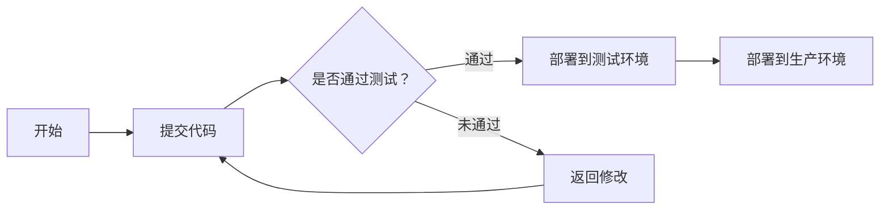
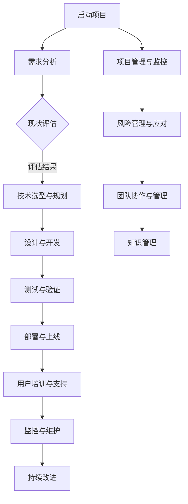

                 

# 遗留系统现代化：策略与实施

## 关键词

- **遗留系统**
- **现代化**
- **系统重构**
- **技术选型**
- **风险管理**

## 摘要

本文旨在探讨遗留系统现代化的重要性及其实施策略。首先，我们将回顾遗留系统的定义、背景和挑战。接着，文章将深入分析遗留系统现代化的核心概念和策略，涵盖评估方法、技术选型、系统重构与迭代等关键环节。随后，通过实际案例分析，我们将展示如何在实际项目中实施遗留系统现代化。最后，本文将提供详细的实施步骤和关键技术的讨论，并探讨团队协作与管理的重要性。通过本文的阅读，读者将获得关于遗留系统现代化的全面理解和实用指南。

----------------------------------------------------------------

## 第一部分：遗留系统现代化的背景与挑战

### 第1章：遗留系统现代化的背景

#### 1.1 遗留系统的定义与问题

**遗留系统的定义：** 遗留系统通常指的是在当前技术环境中仍然运行但已经过时的软件系统。这些系统可能是在数十年前开发的，基于旧的技术栈和架构，难以满足现代业务需求。

**遗留系统的起源：** 遗留系统的起源可以追溯到信息技术发展的早期阶段，当时的技术和开发方法相对简单。随着时间的推移，这些系统逐渐变得难以维护和扩展。

**遗留系统的问题与挑战：** 遗留系统面临的主要问题包括：

- **技术债务：** 随着时间的推移，遗留系统可能会积累大量未解决的问题和漏洞。
- **性能瓶颈：** 随着业务需求的增长，遗留系统可能无法提供所需的性能水平。
- **维护困难：** 遗留系统的代码库庞大且复杂，维护成本高。
- **安全漏洞：** 遗留系统可能存在已知的漏洞，难以及时修复。

**遗留系统对业务的影响：** 遗留系统对业务的负面影响包括：

- **效率低下：** 遗留系统可能导致业务流程的延迟和低效。
- **成本增加：** 维护和修复遗留系统可能需要大量的时间和资源。
- **业务中断：** 遗留系统的故障可能导致业务中断，影响客户满意度。

#### 1.2 信息化时代的发展

**信息化进程对遗留系统的影响：** 随着信息化进程的推进，新的技术和开发方法不断涌现。这些新技术和方法往往无法与遗留系统无缝集成，导致遗留系统的现代化需求日益迫切。

**信息化时代的业务需求变化：** 随着业务的不断增长和变化，客户对业务系统的需求也发生了变化。遗留系统可能无法提供所需的灵活性和扩展性，难以满足现代业务需求。

**遗留系统面临的压力与挑战：** 面对信息化时代的发展，遗留系统面临以下压力和挑战：

- **技术更新速度：** 新技术的快速更新使得遗留系统难以跟上技术发展的步伐。
- **业务需求变化：** 业务需求的快速变化要求遗留系统能够灵活应对。
- **安全风险：** 随着网络攻击的增多，遗留系统的安全风险也越来越大。

#### 1.3 遗留系统现代化的需求

**遗留系统现代化的目的：** 遗留系统现代化的主要目的是提高系统的性能、可靠性和可维护性，以满足现代业务需求。

**遗留系统现代化的关键需求：** 遗留系统现代化需要满足以下关键需求：

- **性能提升：** 通过优化系统和应用架构，提高系统的性能和响应速度。
- **安全性增强：** 修复漏洞，提高系统的安全防护能力。
- **可维护性改善：** 通过重构和更新代码库，提高系统的可维护性。
- **扩展性增强：** 改善系统的架构，使其能够轻松适应未来的业务需求。

### 第2章：遗留系统现代化的核心概念

#### 2.1 遗留系统评估方法

**遗留系统评估的目的与方法：** 遗留系统评估的目的是确定遗留系统的当前状态，评估其现代化潜力。评估方法包括：

- **文档审查：** 检查系统的设计文档、用户手册和维护记录。
- **代码审查：** 分析代码质量、结构和技术债务。
- **性能测试：** 评估系统的性能瓶颈和响应时间。
- **用户调研：** 调研用户对现有系统的使用体验和需求。

**遗留系统评估的关键指标：** 遗留系统评估的关键指标包括：

- **技术债务：** 指系统中的技术缺陷和漏洞数量。
- **性能指标：** 指系统的响应时间、吞吐量和资源消耗。
- **维护成本：** 指系统维护所需的资源和人力成本。
- **安全性：** 指系统的安全漏洞数量和防护能力。

#### 2.2 现代化技术的选型与适配

**现代化技术的分类与特点：** 现代化技术包括容器化、微服务架构、持续集成和持续交付等。每种技术都有其独特的特点：

- **容器化：** 提供轻量级的隔离环境，提高部署的灵活性和可移植性。
- **微服务架构：** 将系统分解为独立的、可复用的服务，提高系统的可维护性和可扩展性。
- **持续集成：** 自动化代码集成和测试，提高开发效率和代码质量。
- **持续交付：** 自动化部署和发布，确保快速、安全地交付新功能。

**遗留系统的技术选型与适配策略：** 根据遗留系统的评估结果，选择适合的现代化技术。适配策略包括：

- **逐步迁移：** 逐步将遗留系统中的部分功能迁移到现代架构。
- **重构与替换：** 重构无法迁移的部分，用现代技术替换。
- **集成与融合：** 将遗留系统与新系统集成，共同提供服务。

#### 2.3 系统重构与迭代

**系统重构的方法与策略：** 系统重构包括以下方法：

- **逐步重构：** 逐步修改和优化系统的关键部分。
- **增量重构：** 在现有系统的基础上，逐步增加新功能和改进。
- **全面重构：** 完全重新设计系统，替换关键部分。

**系统迭代的优点与实施步骤：** 系统迭代的优点包括：

- **灵活性：** 可以快速响应业务需求变化。
- **可控性：** 可以逐步实施，降低风险。

实施步骤包括：

- **需求分析：** 确定系统迭代的目标和需求。
- **设计规划：** 设计系统迭代的方案和架构。
- **开发与测试：** 开发新功能，进行全面的测试。
- **部署与监控：** 部署新系统，监控运行状态。

----------------------------------------------------------------

## 第二部分：遗留系统现代化的核心概念与策略

### 第3章：遗留系统现代化的策略

#### 3.1 战略规划与组织协调

**遗留系统现代化规划的原则：**

- **业务驱动：** 现代化规划应围绕业务需求进行，确保系统能够支持业务目标。
- **分阶段实施：** 分阶段进行现代化改造，逐步减轻风险和压力。
- **持续改进：** 不断优化系统和流程，确保持续的性能提升和成本降低。

**现代化项目的组织与协调：**

- **项目团队组建：** 组建专业的项目团队，包括项目经理、开发人员、测试人员和运维人员。
- **角色与职责分配：** 明确各成员的角色和职责，确保高效协作。
- **沟通与协作：** 建立有效的沟通机制，确保团队成员之间的信息共享和协作。

#### 3.2 技术路线与实施方案

**遗留系统现代化技术路线的制定：**

- **评估与选型：** 根据遗留系统的评估结果，选择适合的现代化技术。
- **迁移与重构：** 制定详细的迁移与重构计划，逐步实施。
- **测试与验证：** 对新系统和遗留系统进行全面的测试和验证，确保性能和安全。

**现代化实施过程的实施方案：**

- **需求分析：** 确定现代化改造的需求和目标。
- **设计规划：** 设计系统的整体架构和细节设计。
- **开发与测试：** 开发新功能，进行全面的测试。
- **部署与监控：** 部署新系统，监控运行状态，及时处理故障。

#### 3.3 风险管理与持续改进

**遗留系统现代化的风险管理：**

- **风险识别：** 识别项目实施过程中可能出现的风险。
- **风险评估：** 对识别的风险进行评估，确定其影响和可能性。
- **风险应对：** 制定风险应对策略，包括风险规避、减轻和转移。

**现代化项目的持续改进机制：**

- **反馈机制：** 建立反馈机制，收集用户和团队的意见和建议。
- **持续优化：** 根据反馈，不断优化系统和流程。
- **监控与评估：** 定期监控项目进展和系统性能，评估改进效果。

----------------------------------------------------------------

## 第三部分：遗留系统现代化的案例分析

### 第4章：遗留系统现代化的案例分析

#### 4.1 案例一：企业级遗留系统的现代化改造

**案例背景介绍：**

某大型企业拥有一个运行多年的遗留系统，用于管理其供应链和库存。该系统基于旧的技术栈，难以满足现代业务需求，且维护成本高昂。

**现代化改造的具体实施过程：**

1. **需求分析：** 确定新系统需具备的功能和性能要求。
2. **评估与选型：** 选择合适的现代化技术，如容器化和微服务架构。
3. **设计规划：** 设计新的系统架构，包括前端、后端和数据库。
4. **开发与测试：** 开发新功能，进行全面的测试。
5. **迁移与重构：** 逐步将遗留系统中的功能迁移到新系统。
6. **部署与监控：** 部署新系统，监控运行状态，及时处理故障。

**案例分析结果与经验总结：**

1. **性能提升：** 新系统在性能和响应速度方面得到了显著提升。
2. **成本降低：** 维护成本降低，系统稳定性提高。
3. **灵活性增强：** 新系统具有更好的扩展性和灵活性，能够快速响应业务需求。
4. **经验总结：** 案例表明，遗留系统现代化改造是一个复杂的过程，需要充分的规划和风险管理。

#### 4.2 案例二：政府遗留系统的升级与优化

**案例背景介绍：**

某市政府拥有一个用于公共服务管理的遗留系统，包括市民服务、行政审批等模块。该系统存在性能瓶颈、维护困难和安全漏洞等问题。

**升级与优化的具体实施过程：**

1. **需求分析：** 确定新系统的功能需求和性能要求。
2. **技术选型：** 选择合适的云计算和大数据技术。
3. **设计规划：** 设计新的系统架构，包括前端、后端和数据库。
4. **开发与测试：** 开发新功能，进行全面的测试。
5. **迁移与重构：** 逐步将遗留系统中的功能迁移到新系统。
6. **部署与监控：** 部署新系统，监控运行状态，及时处理故障。

**案例分析结果与经验总结：**

1. **性能优化：** 新系统在性能和响应速度方面得到了显著提升。
2. **安全性增强：** 新系统的安全防护能力得到增强，降低了安全风险。
3. **服务效率提高：** 新系统提高了市民服务的效率和满意度。
4. **经验总结：** 案例表明，政府遗留系统的升级与优化需要充分考虑安全性和数据隐私保护，同时注重用户体验和服务效率。

----------------------------------------------------------------

## 第四部分：遗留系统现代化的实施步骤

### 第5章：遗留系统现代化的实施步骤

#### 5.1 阶段一：现状评估与需求分析

**现状评估的具体步骤：**

1. **文档审查：** 检查系统的设计文档、用户手册和维护记录。
2. **代码审查：** 分析代码质量、结构和技术债务。
3. **性能测试：** 评估系统的性能瓶颈和响应时间。
4. **用户调研：** 调研用户对现有系统的使用体验和需求。

**需求分析的方法与工具：**

- **用户访谈：** 与系统用户进行面对面访谈，了解他们对系统的需求。
- **问卷调查：** 通过问卷调查收集用户对系统的意见和建议。
- **数据分析：** 分析系统日志和用户行为数据，发现系统的瓶颈和改进点。
- **需求文档：** 编写详细的需求文档，明确新系统的功能和性能要求。

#### 5.2 阶段二：方案设计与实施规划

**现代化方案的设计原则：**

- **业务导向：** 设计方案应围绕业务需求，确保系统能够支持业务目标。
- **技术先进：** 选择适合的现代化技术，提高系统的性能和可靠性。
- **成本效益：** 在确保性能和可靠性的同时，尽量降低实施成本。
- **可扩展性：** 设计方案应具备良好的扩展性，能够适应未来业务需求。

**实施规划的制定与调整：**

1. **项目计划：** 制定详细的项目计划，包括时间表、里程碑和关键任务。
2. **资源分配：** 分配项目所需的资源和人力，确保项目能够按时完成。
3. **风险管理：** 识别项目实施过程中可能出现的风险，制定相应的应对策略。
4. **沟通与协作：** 建立有效的沟通机制，确保团队成员之间的信息共享和协作。
5. **调整与优化：** 根据项目进展和实际情况，及时调整和优化项目计划。

#### 5.3 阶段三：项目实施与风险管理

**项目实施的步骤与关键节点：**

1. **需求分析与设计：** 完成新系统的需求分析和设计。
2. **开发与单元测试：** 开发新功能，进行单元测试，确保代码质量。
3. **集成测试与系统测试：** 进行集成测试和系统测试，确保新系统能够正常运行。
4. **部署与上线：** 将新系统部署到生产环境，确保其稳定运行。
5. **用户培训与支持：** 对用户进行培训，提供技术支持，确保用户能够顺利使用新系统。

**风险管理的策略与措施：**

- **风险识别：** 识别项目实施过程中可能出现的风险。
- **风险评估：** 对识别的风险进行评估，确定其影响和可能性。
- **风险应对：** 制定风险应对策略，包括风险规避、减轻和转移。
- **监控与报告：** 定期监控项目进展和风险情况，及时报告风险和问题。
- **应急响应：** 制定应急响应计划，确保在风险发生时能够迅速应对。

----------------------------------------------------------------

## 第五部分：遗留系统现代化中的关键技术

### 第6章：遗留系统现代化中的关键技术

#### 6.1 容器化与微服务架构

**容器化技术的基本原理：**

- **容器化技术概述：** 容器化是一种轻量级虚拟化技术，通过将应用程序及其依赖环境封装在一个独立的容器中，实现应用程序的独立运行和部署。
- **容器化技术的优点：** 
  - **轻量级：** 容器化技术具有较低的 overhead，比虚拟机更加轻量。
  - **可移植性：** 容器化的应用程序可以在不同的环境中无缝运行，提高可移植性。
  - **可扩展性：** 容器化技术支持水平扩展和弹性伸缩，提高系统的性能和可靠性。

**微服务架构的优势与设计：**

- **微服务架构概述：** 微服务架构是一种将大型应用程序分解为一系列小型、独立的服务，每个服务负责特定的业务功能。
- **微服务架构的优势：**
  - **灵活性：** 微服务架构使得系统能够灵活地应对业务需求变化。
  - **可维护性：** 微服务架构简化了系统的维护和扩展，降低了维护成本。
  - **可复用性：** 微服务架构促进了服务的复用，提高了开发效率。
- **微服务架构的设计原则：**
  - **单一职责：** 每个服务应负责单一的业务功能，确保服务的可维护性和可扩展性。
  - **自治性：** 每个服务应独立部署、独立运行，提高系统的可靠性。
  - **通信协议：** 服务之间应采用轻量级的通信协议，如 HTTP/REST。

**微服务架构的ER实体关系图架构：**

```mermaid
erDiagram
  ServiceA <--||{|> EntityA
  ServiceB -->|<|-- EntityB
  ServiceC ||--|{ EntityC
```

- **ServiceA**：负责业务功能A的服务
- **EntityA**：与业务功能A相关的实体
- **ServiceB**：负责业务功能B的服务
- **EntityB**：与业务功能B相关的实体
- **ServiceC**：负责业务功能C的服务
- **EntityC**：与业务功能C相关的实体

#### 6.2 持续集成与持续交付

**持续集成的基本概念：**

- **持续集成概述：** 持续集成是一种软件开发实践，通过自动化构建和测试，确保代码库中的每个提交都是可集成的。
- **持续集成的优点：**
  - **早期发现问题：** 通过自动化测试，及时发现代码中的问题，减少缺陷的累积。
  - **提高代码质量：** 持续集成促进了代码质量和代码规范的提升。
  - **缩短发布周期：** 通过自动化构建和测试，加快新功能的发布速度。

**持续交付的实践方法：**

- **持续交付概述：** 持续交付是一种软件开发实践，通过自动化部署，确保代码库中的每个提交都可以在生产环境中成功部署。
- **持续交付的优点：**
  - **快速响应需求：** 通过自动化部署，可以快速响应业务需求变化，提高系统的灵活性。
  - **减少发布风险：** 通过自动化测试和部署，降低发布过程中出现故障的风险。
  - **提高系统稳定性：** 通过持续交付，确保系统始终保持最新状态，提高系统的稳定性。

**持续集成与持续交付的流程图：**



- **开始**：开发人员将代码提交到代码库。
- **提交代码**：代码提交到代码库，触发自动化构建和测试。
- **是否通过测试？**：进行单元测试、集成测试等，判断代码是否通过测试。
- **通过**：将代码部署到测试环境，进行进一步的测试和验证。
- **未通过**：返回修改代码，重新提交。
- **部署到测试环境**：将代码部署到测试环境，进行全面的测试。
- **部署到生产环境**：将测试通过后的代码部署到生产环境，确保系统稳定运行。

#### 6.3 云计算与大数据技术

**云计算在遗留系统现代化中的应用：**

- **云计算概述：** 云计算是一种通过互联网提供计算资源、存储资源和网络服务的计算模式。
- **云计算在遗留系统现代化中的应用：**
  - **弹性伸缩：** 通过云计算平台，可以按需分配计算资源，实现系统的弹性伸缩，提高系统的性能和可靠性。
  - **成本优化：** 通过云计算平台，可以降低硬件投资和运维成本，实现成本优化。
  - **数据备份与恢复：** 通过云计算平台，可以轻松实现数据的备份和恢复，确保数据的安全性和可靠性。

**大数据技术在遗留系统分析中的价值：**

- **大数据技术概述：** 大数据技术是一种用于处理、存储和分析海量数据的方法和工具。
- **大数据技术在遗留系统分析中的价值：**
  - **性能优化：** 通过大数据技术，可以对遗留系统进行性能分析，发现性能瓶颈，进行优化。
  - **用户行为分析：** 通过大数据技术，可以分析用户行为数据，发现用户需求，优化用户体验。
  - **故障预测与预警：** 通过大数据技术，可以对系统日志进行分析，预测故障，提前预警。

**云计算与大数据技术的集成应用案例：**

**案例背景介绍：** 某大型电商平台拥有一个庞大的遗留系统，用于管理商品信息、订单处理和用户行为数据。随着业务的不断增长，系统性能和可靠性面临挑战。

**解决方案：**

1. **云计算平台部署：** 将遗留系统部署到云计算平台，实现弹性伸缩和成本优化。
2. **大数据平台搭建：** 构建大数据平台，用于存储、处理和分析用户行为数据。
3. **性能优化：** 利用大数据平台，对遗留系统进行性能分析，发现性能瓶颈，进行优化。
4. **用户行为分析：** 利用大数据平台，分析用户行为数据，发现用户需求，优化用户体验。
5. **故障预测与预警：** 利用大数据平台，分析系统日志，预测故障，提前预警。

**效果评估：**

1. **性能提升：** 系统性能得到显著提升，响应速度加快，用户满意度提高。
2. **成本降低：** 通过云计算平台，实现了成本优化，降低了硬件投资和运维成本。
3. **用户体验优化：** 通过大数据技术，优化了用户行为分析，提高了用户体验。
4. **故障率降低：** 通过大数据技术，实现了故障预测与预警，降低了故障率。

**结论：** 云计算与大数据技术的集成应用，为遗留系统现代化提供了有效的解决方案，提高了系统的性能、可靠性和用户体验。

----------------------------------------------------------------

## 第六部分：遗留系统现代化中的团队协作与管理

### 第7章：遗留系统现代化中的团队协作与管理

#### 7.1 团队协作的挑战与策略

**团队协作的挑战：**

- **沟通障碍：** 团队成员之间可能存在语言、文化和沟通方式的差异，导致沟通不畅。
- **任务分工不明确：** 项目中的任务分工不明确，可能导致团队成员之间的责任冲突和效率低下。
- **资源分配不均：** 资源分配不均，可能导致部分团队成员工作量过大，而其他成员工作量不足。
- **目标不一致：** 团队成员对项目目标的理解不一致，可能导致项目进度延误和失败。

**团队协作的策略：**

- **明确沟通渠道：** 建立明确的沟通渠道，确保团队成员之间的信息畅通。
- **分工与责任明确：** 制定详细的任务分工和责任分配方案，确保每个成员都清楚自己的职责。
- **资源合理分配：** 合理分配项目资源，确保团队成员的工作量均衡。
- **目标统一：** 通过团队讨论和目标设定，确保团队成员对项目目标有共同的理解和认同。

#### 7.2 项目管理与监控

**项目管理的基本流程：**

- **项目启动：** 确定项目目标、范围和预算，组建项目团队。
- **规划：** 制定项目计划，包括任务分解、时间安排、资源分配和风险管理。
- **执行：** 按照项目计划，执行任务，确保项目按计划进行。
- **监控与控制：** 监控项目进度、质量和成本，及时调整和优化项目计划。
- **收尾：** 完成项目任务，进行项目总结和评估，确保项目目标的实现。

**项目监控的方法与工具：**

- **进度监控：** 利用项目管理工具，如 JIRA、Trello 等，监控项目进度和任务完成情况。
- **质量监控：** 进行单元测试、集成测试和系统测试，确保代码质量和系统性能。
- **成本监控：** 监控项目预算和资源消耗，确保项目在预算范围内完成。
- **风险监控：** 识别项目风险，制定风险应对策略，确保项目风险可控。

**项目监控的常见工具：**

- **JIRA：** 用于任务管理、进度监控和项目管理。
- **Trello：** 用于任务管理和进度监控。
- **Selenium：** 用于自动化测试和性能监控。
- **Prometheus：** 用于监控系统性能和资源消耗。

#### 7.3 团队技能提升与知识管理

**团队技能提升的策略：**

- **培训与学习：** 定期组织培训和学习活动，提高团队成员的专业技能和知识水平。
- **内部交流与分享：** 鼓励团队成员进行内部交流与分享，促进知识传递和技能提升。
- **项目经验总结：** 在每个项目结束后，进行项目经验总结，发现问题和不足，制定改进措施。

**知识管理的重要性与实践方法：**

- **知识管理的重要性：** 知识管理是团队协作和项目管理的重要手段，有助于提高团队的效率和创新能力。
- **知识管理的实践方法：**
  - **文档管理：** 建立文档管理制度，确保文档的规范、完整和可追溯性。
  - **知识共享平台：** 建立知识共享平台，方便团队成员之间进行知识交流和共享。
  - **知识库建设：** 建立知识库，收集和整理团队成员的经验和知识，为项目提供参考和指导。
  - **知识传承：** 通过师徒制度、项目交接等方式，确保团队知识的传承和持续发展。

**知识管理的工具与平台：**

- **Confluence：** 用于文档管理和知识共享。
- **SharePoint：** 用于文档管理和知识库建设。
- **Git：** 用于版本控制和代码管理。
- **Wiki：** 用于团队内部的知识共享和交流。

----------------------------------------------------------------

## 结束语

遗留系统现代化是一项复杂的任务，需要深入的分析、精心的规划和有效的实施。通过本文的探讨，我们了解了遗留系统的定义、背景和挑战，分析了现代化技术的选型与适配策略，并提供了实际案例的剖析。我们阐述了遗留系统现代化的实施步骤、关键技术和团队协作与管理策略。希望本文能为您提供关于遗留系统现代化的全面理解和实用指南。

**作者：** AI天才研究院 / AI Genius Institute & 禅与计算机程序设计艺术 / Zen And The Art of Computer Programming

----------------------------------------------------------------

### 参考文献

1. Martin, F. W. (2014). **Clean Architecture: A Craftsman's Guide to Software Structure and Design**. Prentice Hall.
2. Schwaber, K., Beedle, M. (2002). **Agile Project Management with Scrum**. Microsoft Press.
3. Fowler, M. (2017). **Microservices: Designing Fine-Grained Systems**. Addison-Wesley.
4. Humble, J., Humble, D., Farley, D. (2016). **Continuous Delivery: Reliable Software Releases through Build, Test, and Deployment Automation**. Addison-Wesley.
5. O'Reilly Media, Inc. (2018). **Cloud Computing: The New Nature of Business**. O'Reilly Media, Inc.
6. **Apache Kafka Documentation**. [https://kafka.apache.org/documentation/](https://kafka.apache.org/documentation/)
7. **Docker Documentation**. [https://docs.docker.com/](https://docs.docker.com/)
8. **Google Cloud Platform Documentation**. [https://cloud.google.com/docs/](https://cloud.google.com/docs/)
9. **AWS Documentation**. [https://aws.amazon.com/documentation/](https://aws.amazon.com/documentation/)
10. **Microsoft Azure Documentation**. [https://docs.microsoft.com/en-us/azure/](https://docs.microsoft.com/en-us/azure/)

----------------------------------------------------------------

### 附录：遗留系统现代化流程图

以下为遗留系统现代化流程的详细步骤，供参考：



- **A 启动项目**：确定项目目标和范围，组建项目团队。
- **B 需求分析**：收集和分析用户需求，明确新系统的功能和性能要求。
- **C 现状评估**：评估现有系统的状态，包括技术债务、性能瓶颈和安全漏洞等。
- **D 技术选型与规划**：根据现状评估结果，选择合适的现代化技术，制定详细规划。
- **E 设计与开发**：设计新系统的架构和功能，进行开发和编码。
- **F 测试与验证**：进行单元测试、集成测试和系统测试，确保新系统的质量和性能。
- **G 部署与上线**：将新系统部署到生产环境，确保其稳定运行。
- **H 用户培训与支持**：对用户进行培训，提供技术支持，确保用户能够顺利使用新系统。
- **I 监控与维护**：监控新系统的运行状态，及时处理故障和问题，确保系统稳定运行。
- **J 持续改进**：根据用户反馈和系统运行情况，不断优化系统和流程。
- **K 项目管理与监控**：制定项目管理计划，监控项目进度和质量，确保项目按计划进行。
- **L 风险管理与应对**：识别项目风险，制定风险应对策略，确保项目风险可控。
- **M 团队协作与管理**：建立团队协作机制，确保团队成员之间的沟通和协作，提高项目效率。
- **N 知识管理**：建立知识管理机制，收集和整理项目经验和知识，为后续项目提供参考。

