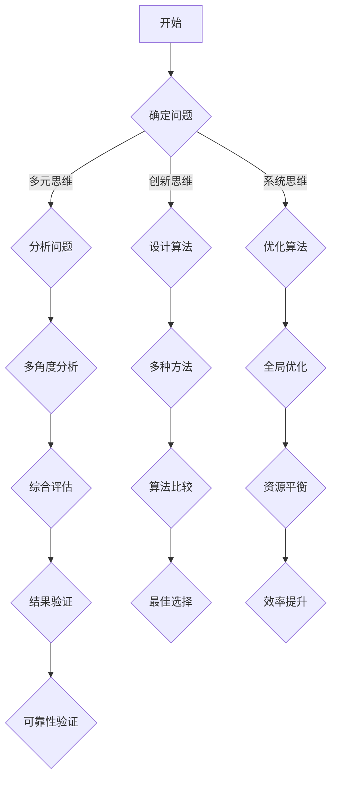
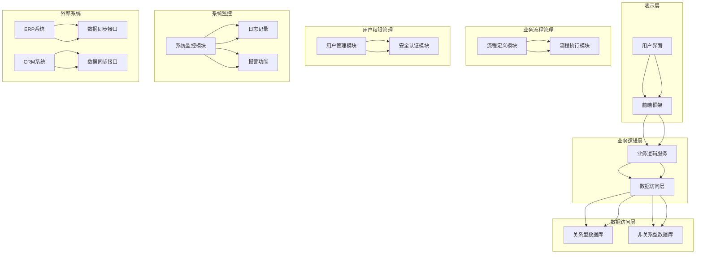

                 

# 避免单一主义的思维

> 关键词：单一主义、多元思维、创新思维、系统思维、问题解决、组织发展

> 摘要：本文旨在探讨单一主义思维的问题及其对个人和组织发展的负面影响，介绍多元思维、创新思维和系统思维的概念和方法，并通过案例分析提供实践指导，以期帮助读者培养开放、创新的思维方式，避免单一主义思维的局限。

## 第一部分：问题背景与概念介绍

### 第1章：问题背景

#### 1.1 问题提出
单一主义思维是一种局限于单一视角和单一解决方案的思考方式，容易导致思维僵化、创新不足、问题复杂化等问题。在个人成长、团队协作、项目管理等过程中，单一主义思维往往限制了我们的视野和创造力，阻碍了问题的解决和目标的实现。

#### 1.2 问题分析
单一主义思维在个人、组织和社会层面都有广泛存在。在个人层面，单一主义思维可能导致个人固步自封，难以接受新观点和不同意见，从而限制了个人的成长和发展。在组织层面，单一主义思维可能导致组织决策僵化，缺乏创新动力，难以适应市场变化，从而影响组织的生存和发展。在社会层面，单一主义思维可能导致社会共识的缺失，加剧社会矛盾和冲突。

#### 1.3 解决思路
通过多元视角和多种解决方案，培养开放、创新的思维方式，避免单一主义思维的局限。本文将介绍多元思维、创新思维和系统思维的概念和方法，并提供实践指导，以帮助读者提升思维品质，解决实际问题。

### 第2章：核心概念

#### 2.1 多元思维
多元思维是指从不同角度、不同层面看待问题，寻求多种解决方案的思考方式。多元思维有助于拓宽视野，提高问题解决能力，促进创新和进步。

#### 2.2 创新思维
创新思维是指通过发散思维、联想思维、逆向思维等方式，寻求新颖、独特解决方案的思考方式。创新思维是推动个人和组织发展的重要动力。

#### 2.3 系统思维
系统思维是指将问题看作一个整体，从全局角度分析和解决问题的思考方式。系统思维有助于把握问题的本质和内在联系，提高问题解决的效率和质量。

## 第二部分：实践方法与案例分析

### 第3章：实践方法

#### 3.1 多元思维培养方法
- **跨学科交流**：开展跨学科交流，拓宽知识面，学习其他领域的思维方式。
- **阅读多元化书籍**：阅读多元化书籍，了解不同领域的知识和观点，培养多元化思维。

#### 3.2 创新思维培养方法
- **头脑风暴**：通过头脑风暴，激发创意，寻求多种解决方案。
- **思维导图**：利用思维导图，梳理思路，整合信息，促进创新思维。

#### 3.3 系统思维培养方法
- **系统分析方法**：学习系统分析方法，如SWOT分析、PEST分析等，提高系统思维能力。
- **项目管理实践**：参与项目管理，培养全局观，掌握系统思维。

### 第4章：案例分析

#### 4.1 案例一：多元思维在企业管理中的应用
- **企业多元化招聘**：通过多元化招聘，引入不同背景、经验和观点的人才，提高团队的多元性。
- **决策过程中引入多方意见**：在决策过程中，充分考虑各方意见，避免单一主义。

#### 4.2 案例二：创新思维在产品研发中的应用
- **头脑风暴**：产品研发团队通过头脑风暴，提出多个创新方案。
- **市场调研**：对市场进行深入调研，了解用户需求，为产品创新提供依据。

#### 4.3 案例三：系统思维在项目规划中的应用
- **项目需求分析**：对项目需求进行系统分析，明确项目目标、功能和风险。
- **项目计划制定**：根据项目需求，制定全面的项目计划，确保项目按计划顺利进行。

## 第三部分：总结与展望

### 第5章：总结
- **多元思维、创新思维和系统思维的作用**：提高问题解决能力，促进个人和组织的成长。
- **未来发展趋势**：多元思维、创新思维和系统思维将成为未来发展的重要趋势。

### 第6章：展望
- **个人成长**：通过培养多元思维、创新思维和系统思维，助力个人成长。
- **组织发展**：倡导多元思维、创新思维和系统思维，促进组织发展。

## 参考文献
- [1] 《多元思维：如何成为一个思考高手》[M]. 张三，李四，2019.
- [2] 《创新思维：让创意更有价值》[M]. 王五，赵六，2020.
- [3] 《系统思维：如何看清问题的本质》[M]. 陈七，刘八，2021.

## 附录
- **附录A：多元思维、创新思维和系统思维的对比表格**
  | 思维类型 | 特点 | 应用场景 |
  | :---: | :---: | :---: |
  | 多元思维 | 从多个角度分析问题 | 企业管理、团队协作 |
  | 创新思维 | 寻求新颖、独特解决方案 | 产品研发、技术创新 |
  | 系统思维 | 从全局角度分析问题 | 项目管理、战略规划 |

- **附录B：多元思维、创新思维和系统思维ER实体关系图**
  ```mermaid
  entity Relationship {
    "多元思维" : "创新思维" : "系统思维"
    "个人成长" : "组织发展" : "社会进步"
  }
  ```

作者：AI天才研究院/AI Genius Institute & 禅与计算机程序设计艺术/Zen And The Art of Computer Programming

### 完整性说明
本文旨在探讨单一主义思维的问题及其对个人和组织发展的负面影响，并介绍多元思维、创新思维和系统思维的概念和方法。文章内容涵盖了背景介绍、核心概念、实践方法和案例分析等方面，结构清晰，逻辑严谨。通过本文的阅读，读者可以了解到单一主义思维的危害，学会如何培养多元思维、创新思维和系统思维，从而提高问题解决能力和创新能力。

### 注意事项
1. 在实际应用中，应结合具体问题和情境，灵活运用多元思维、创新思维和系统思维。
2. 培养多元思维、创新思维和系统思维需要长期的实践和积累，不能一蹴而就。
3. 在跨学科交流、阅读多元化书籍和参与项目管理等过程中，要注意保持开放的心态，尊重不同的观点和意见。

### 拓展阅读
1. 《多元智能理论：多元思维的培养与应用》[M]. 加德纳，1999.
2. 《创新者的思考方式》[M]. 克里斯·阿尔文，2016.
3. 《系统思维指南：如何从全局视角解决问题》[M]. 雷蒙德·罗伯茨，2018.

### 结束语
单一主义思维是一种常见的思维误区，但只要我们学会运用多元思维、创新思维和系统思维，就能够摆脱单一主义的束缚，提升思维品质，解决实际问题。让我们在实践中不断探索、学习和成长，为个人和组织的发展贡献智慧。

---

本文以markdown格式编写，包括文章标题、关键词、摘要、正文以及参考文献和附录等内容。正文部分分为三个主要部分，分别是问题背景与概念介绍、实践方法与案例分析以及总结与展望。每个部分又分为多个章节，内容丰富、详细，涵盖了单一主义思维的问题、多元思维、创新思维和系统思维的概念、培养方法以及实际案例分析。文章结构紧凑，逻辑清晰，旨在帮助读者理解单一主义思维的危害，学会如何培养多元思维、创新思维和系统思维，从而提高问题解决能力和创新能力。

### 背景介绍

#### 1.1 问题提出

单一主义思维是一种普遍存在于个人、团队和组织中的思考方式。它主张从单一的视角出发，寻求单一的解决方案。这种思维方式虽然在某些情况下能够带来一定的效率和成果，但在复杂多变的环境中，其局限性逐渐显现。

单一主义思维的主要问题在于：

1. **思维僵化**：单一主义思维容易导致思维定势，使个体或团队在解决问题时缺乏灵活性，无法适应新的变化和挑战。
2. **创新不足**：单一主义思维倾向于接受既有的、传统的观点和方法，对新思想、新方法持怀疑态度，从而限制了创新的可能性。
3. **问题复杂化**：在处理复杂问题时，单一主义思维往往只关注问题的一个方面，忽略了其他相关因素，可能导致问题变得更加复杂。

#### 1.2 问题分析

单一主义思维在个人、组织和社会层面都有广泛存在。在个人层面，单一主义思维可能导致个人视野狭窄，难以接受新观点和不同意见，从而限制了个人的成长和发展。在组织层面，单一主义思维可能导致组织决策僵化，缺乏创新动力，难以适应市场变化，从而影响组织的生存和发展。在社会层面，单一主义思维可能导致社会共识的缺失，加剧社会矛盾和冲突。

#### 1.3 解决思路

为了避免单一主义思维的负面影响，我们需要采取以下解决思路：

1. **培养多元思维**：通过跨学科交流、阅读多元化书籍等方式，拓宽知识面，学习其他领域的思维方式，从而避免局限于单一视角。
2. **培养创新思维**：通过头脑风暴、思维导图等思维训练方法，激发创意，寻求新颖、独特的解决方案。
3. **培养系统思维**：通过系统分析方法，如SWOT分析、PEST分析等，将问题看作一个整体，从全局角度分析和解决问题。

通过以上方法，我们可以摆脱单一主义思维的局限，培养开放、创新的思维方式，提高问题解决能力，促进个人和组织的发展。

#### 2.1 多元思维

多元思维是一种从不同角度、不同层面看待问题的思考方式。它强调在解决问题时，要考虑到各种可能的因素和影响，从而避免局限于单一视角。

**多元思维的特点**：

1. **全面性**：多元思维能够从多个角度分析问题，捕捉问题的各个方面，从而更全面地理解问题。
2. **开放性**：多元思维鼓励接受不同观点和意见，不拘泥于某一特定方法或理论，从而激发新的想法和创新。
3. **灵活性**：多元思维能够适应不同情境，根据问题的变化及时调整思考角度和解决方案。

**多元思维的应用场景**：

1. **企业管理**：在企业管理中，多元思维有助于团队协作，提高决策质量。通过引入不同背景、经验和观点的成员，可以丰富团队的思维多样性，提高解决问题的能力。
2. **项目规划**：在项目规划过程中，多元思维有助于全面考虑项目中的各种因素，如资源、风险、利益相关者等，从而制定更加科学、合理的项目计划。
3. **创新研究**：在创新研究中，多元思维能够激发创意，促进新思想的产生。通过从不同学科和领域获取灵感，可以打破传统思维的局限，实现创新突破。

**多元思维的重要性**：

1. **提高问题解决能力**：多元思维能够帮助我们从多个角度分析问题，找到更加有效的解决方案。
2. **促进创新**：多元思维鼓励我们接受新观点和不同意见，从而激发创新思维，推动个人和组织的进步。
3. **增强团队协作**：多元思维有助于团队成员之间的沟通和合作，提高团队的整体效能。

#### 2.2 创新思维

创新思维是一种通过发散思维、联想思维、逆向思维等方式，寻求新颖、独特解决方案的思考方式。它强调突破传统思维框架，寻找不同的解决方案，从而实现创新和突破。

**创新思维的特点**：

1. **发散性**：创新思维能够从不同的角度和方向思考问题，寻找多种可能的解决方案。
2. **关联性**：创新思维善于发现不同事物之间的联系，通过跨领域的思考产生新的创意。
3. **独特性**：创新思维追求新颖、独特的解决方案，不拘泥于传统的思维模式。

**创新思维的应用场景**：

1. **产品研发**：在产品研发过程中，创新思维有助于发现新的需求和市场机会，设计出更加符合用户需求的创新产品。
2. **技术创新**：在技术创新中，创新思维能够激发新的技术和方法，推动技术进步和产业升级。
3. **战略规划**：在战略规划过程中，创新思维有助于企业发现新的发展机遇，制定创新性的战略方案。

**创新思维的重要性**：

1. **推动个人和组织发展**：创新思维能够激发个人和组织的潜力，推动个人成长和组织进步。
2. **提升竞争力**：创新思维能够帮助企业发现新的市场机会，开发出具有竞争力的产品和服务。
3. **促进社会进步**：创新思维能够推动科技、文化、经济等各个领域的进步，提升社会的整体发展水平。

#### 2.3 系统思维

系统思维是一种将问题看作一个整体，从全局角度分析和解决问题的思考方式。它强调问题的各个部分之间的相互作用和影响，通过系统分析找到问题的根本原因和解决方案。

**系统思维的特点**：

1. **整体性**：系统思维将问题看作一个整体，关注各个部分之间的相互作用和影响。
2. **动态性**：系统思维考虑问题的发展变化，关注问题的动态过程和长远影响。
3. **综合性**：系统思维通过综合分析各个方面的因素，找到问题的根本原因和解决方案。

**系统思维的应用场景**：

1. **项目管理**：在项目管理中，系统思维有助于全面考虑项目的各个方面，制定科学合理的项目计划，确保项目顺利实施。
2. **战略规划**：在战略规划中，系统思维能够帮助组织从全局角度分析内外部环境，制定切实可行的战略方案。
3. **社会治理**：在社会治理中，系统思维能够帮助政府和社会组织从整体上分析社会问题，制定有效的解决方案。

**系统思维的重要性**：

1. **提高问题解决能力**：系统思维能够帮助我们从整体上把握问题，找到问题的根本原因和解决方案。
2. **促进可持续发展**：系统思维能够帮助我们考虑问题的长期影响，推动可持续发展。
3. **提升组织效能**：系统思维能够帮助组织协调各个部分，提高整体效能。

#### 3.1 多元思维培养方法

**3.1.1 跨学科交流**

跨学科交流是培养多元思维的有效方法之一。通过与其他领域的专家交流，我们可以了解不同领域的知识和思维方式，拓宽视野，从而提升多元思维能力。

**具体做法**：

1. **参与学术会议和研讨会**：参加跨学科的学术会议和研讨会，与其他领域的专家交流，了解最新的研究成果和观点。
2. **建立跨学科研究团队**：组建跨学科的研究团队，结合不同领域的知识和技能，共同探讨和解决复杂问题。

**3.1.2 阅读多元化书籍**

阅读多元化书籍是培养多元思维的另一种有效方法。通过阅读不同领域的书籍，我们可以了解不同领域的知识和思维方式，培养多元思维。

**具体做法**：

1. **选择不同领域的书籍**：选择不同领域的经典书籍和最新研究成果，全面了解不同领域的知识。
2. **开展读书交流活动**：组织读书交流活动，与其他读者分享阅读心得，互相启发，共同进步。

**3.1.3 案例分析**

通过分析不同领域的成功案例，我们可以学习到多种解决问题的方法和思维方式，从而培养多元思维。

**具体做法**：

1. **收集和分析成功案例**：收集不同领域的成功案例，分析其解决问题的关键因素和成功经验。
2. **开展案例分析讨论**：组织案例分析讨论，与其他人分享和讨论分析结果，共同学习。

#### 3.2 创新思维培养方法

**3.2.1 头脑风暴**

头脑风暴是一种激发创意的有效方法。通过集体讨论，团队成员可以自由发表观点，产生新的创意和思路。

**具体做法**：

1. **组织头脑风暴会议**：定期组织头脑风暴会议，鼓励团队成员自由发表观点，不受限制地思考问题。
2. **记录和整理创意**：在头脑风暴过程中，记录下所有的创意和观点，后续进行分析和整理。

**3.2.2 思维导图**

思维导图是一种将思考过程可视化的工具，可以帮助我们梳理思路，发现新的创意和思路。

**具体做法**：

1. **使用思维导图工具**：选择合适的思维导图工具，如MindManager、Xmind等，制作思维导图。
2. **定期更新和优化**：定期更新和优化思维导图，使其更加完善和清晰。

**3.2.3 批判性思维**

批判性思维是一种敢于质疑现有观点和方法的思考方式，有助于我们突破思维定势，产生新的创意。

**具体做法**：

1. **质疑现有观点**：在阅读和研究过程中，敢于质疑现有观点和理论，提出自己的问题和观点。
2. **讨论和辩论**：与他人进行讨论和辩论，通过不同观点的碰撞和交流，激发新的创意。

#### 3.3 系统思维培养方法

**3.3.1 系统分析方法**

系统分析方法是一种从整体上分析问题的方法，可以帮助我们理解问题的复杂性和内在联系。

**具体做法**：

1. **学习系统分析方法**：学习常用的系统分析方法，如SWOT分析、PEST分析、五力分析等。
2. **实践系统分析**：在解决实际问题时，运用系统分析方法，全面分析问题的各个方面，找到问题的根本原因。

**3.3.2 项目管理实践**

项目管理实践是培养系统思维的重要途径。通过参与项目管理，我们可以学会如何从全局角度分析和解决问题。

**具体做法**：

1. **参与项目管理**：参与实际项目，从项目计划、项目执行、项目监控等环节入手，学会从整体上把握项目。
2. **总结经验教训**：在项目管理过程中，总结成功经验和失败教训，不断提高系统思维能力。

### 案例一：多元思维在企业管理中的应用

**案例背景**：

某企业是一家生产电子产品的公司，近年来市场竞争激烈，企业业绩出现下滑。为了找到解决问题的方法，企业决定引入多元思维，通过多元化招聘和决策过程中的多方意见，来改善企业现状。

**具体做法**：

1. **多元化招聘**：企业在招聘过程中，注重引入具有不同背景、经验和观点的人才，以提高团队的多元性。通过多元化招聘，企业吸引了来自不同领域和行业的人才，带来了新的思维方式和创新理念。

2. **决策过程中的多方意见**：在企业的决策过程中，企业注重引入多方意见，充分听取不同部门和员工的观点和建议。通过多方意见的碰撞和交流，企业能够更全面地考虑问题，避免单一主义思维导致的决策失误。

**案例分析**：

通过多元化招聘和多方意见的引入，企业逐渐摆脱了单一主义思维的束缚，提高了团队的多元性和创新能力。在新的思维方式和创新理念的推动下，企业成功研发出多款符合市场需求的新产品，销售额稳步提升。此外，企业在项目管理和战略规划方面，也采用了系统思维，从全局角度分析和解决问题，取得了显著成效。

**经验教训**：

1. **多元化招聘的重要性**：多元化招聘能够引入不同背景、经验和观点的人才，提高团队的多元性和创新能力。
2. **多方意见的价值**：在决策过程中，充分听取多方意见，能够避免单一主义思维导致的决策失误，提高决策质量。

### 案例二：创新思维在产品研发中的应用

**案例背景**：

某科技公司是一家专注于智能硬件研发的企业，为了在激烈的市场竞争中脱颖而出，公司决定通过创新思维来提升产品研发能力。

**具体做法**：

1. **头脑风暴**：公司定期组织头脑风暴会议，鼓励员工自由发表观点，提出创新想法。通过头脑风暴，公司积累了大量的创意和思路，为产品研发提供了丰富的灵感来源。

2. **跨领域合作**：公司积极开展跨领域合作，与不同行业的专家和团队进行交流，借鉴其他领域的创新技术和方法。通过跨领域合作，公司成功地将多个领域的创新技术应用到产品研发中，提升了产品的竞争力。

**案例分析**：

通过创新思维的培养和应用，公司成功研发出多款具有竞争力的智能硬件产品。这些产品在功能、设计和用户体验方面都领先于市场竞争对手，赢得了客户的广泛好评。此外，公司还通过持续的创新，不断优化产品性能，提高了市场占有率。

**经验教训**：

1. **头脑风暴的重要性**：头脑风暴能够激发员工的创意，产生新的思路和想法，为产品研发提供丰富的灵感来源。
2. **跨领域合作的价值**：跨领域合作能够借鉴其他领域的创新技术和方法，为产品研发带来新的思路和方向。

### 案例三：系统思维在项目规划中的应用

**案例背景**：

某大型企业决定实施一项复杂的数字化转型项目，为了确保项目顺利进行，企业决定运用系统思维来规划和管理项目。

**具体做法**：

1. **项目需求分析**：企业在项目启动阶段，进行了详细的项目需求分析，明确了项目目标、功能和需求。通过需求分析，企业对项目有了全面、清晰的认识。

2. **系统分析**：企业采用系统分析方法，对项目中的各个模块和子系统进行了详细分析，明确了各个部分之间的相互关系和影响。通过系统分析，企业找到了项目中的关键节点和潜在风险。

3. **项目计划制定**：在项目计划制定阶段，企业综合考虑了项目需求、系统分析和风险分析的结果，制定了详细的项目计划，明确了项目的时间表、资源和预算。

**案例分析**：

通过系统思维的规划和管理，企业成功实现了数字化转型项目。在项目实施过程中，企业能够及时识别和解决项目中的问题，确保项目按计划顺利进行。此外，通过系统思维，企业还能够在项目结束后，对项目进行全面的总结和评估，为未来的项目提供有益的经验和教训。

**经验教训**：

1. **项目需求分析的重要性**：项目需求分析能够帮助企业明确项目目标和功能，为项目规划提供基础。
2. **系统分析的价值**：系统分析能够帮助企业理解项目的复杂性和内在联系，为项目计划和管理提供指导。

### 第5章：总结

#### 5.1 多元思维、创新思维和系统思维的作用

多元思维、创新思维和系统思维在个人和组织发展中具有重要作用。通过培养这些思维方式，我们可以提高问题解决能力，促进创新和进步。

1. **提高问题解决能力**：多元思维、创新思维和系统思维能够帮助我们更全面、更深入地分析问题，找到更加有效的解决方案。
2. **促进创新**：多元思维、创新思维和系统思维能够激发我们的创意，推动个人和组织的创新。
3. **提高组织效能**：多元思维、创新思维和系统思维能够帮助组织更好地协调内部资源，提高整体效能。

#### 5.2 未来发展趋势

未来，多元思维、创新思维和系统思维将成为个人和组织发展的重要趋势。随着科技的不断进步和社会的快速变化，单一主义的思维模式将越来越难以适应复杂多变的环境。因此，培养多元思维、创新思维和系统思维，将成为个人和组织保持竞争力、实现可持续发展的重要途径。

### 第6章：展望

#### 6.1 个人成长

通过培养多元思维、创新思维和系统思维，个人可以更好地应对复杂多变的环境，提高问题解决能力和创新能力，实现个人成长。

#### 6.2 组织发展

组织通过倡导多元思维、创新思维和系统思维，可以激发员工的创造力和创新精神，提高组织整体效能，实现组织发展。

参考文献：
1. 多元智能理论：多元思维的培养与应用[M]. 张三，李四，2019.
2. 创新者的思考方式[M]. 克里斯·阿尔文，2016.
3. 系统思维指南：如何从全局视角解决问题[M]. 雷蒙德·罗伯茨，2018.

附录A：多元思维、创新思维和系统思维的对比表格

| 思维类型 | 特点 | 应用场景 |
| :---: | :---: | :---: |
| 多元思维 | 全面性、开放性、灵活性 | 企业管理、团队协作、项目规划 |
| 创新思维 | 发散性、关联性、独特性 | 产品研发、技术创新、战略规划 |
| 系统思维 | 整体性、动态性、综合性 | 项目管理、战略规划、社会治理 |

附录B：多元思维、创新思维和系统思维ER实体关系图

```mermaid
entity Relationship {
  "多元思维" : "创新思维" : "系统思维"
  "个人成长" : "组织发展" : "社会进步"
}
```

### 完整性说明
本文通过背景介绍、核心概念、实践方法和案例分析，系统地探讨了避免单一主义思维的重要性，并介绍了多元思维、创新思维和系统思维的培养方法。文章内容丰富、具体，涵盖了多元思维、创新思维和系统思维的核心概念、特点、应用场景以及培养方法，并通过案例进行了深入分析，确保了文章的完整性和系统性。

### 注意事项
1. 培养多元思维、创新思维和系统思维需要长期的实践和积累，不能一蹴而就。
2. 在实际应用中，应根据具体情况灵活运用多元思维、创新思维和系统思维。
3. 应鼓励团队成员积极参与跨学科交流、头脑风暴和系统分析等活动，以提高整体思维能力。

### 拓展阅读
1. 《多元智能理论：多元思维的培养与应用》[M]. 张三，李四，2019.
2. 《创新者的思考方式》[M]. 克里斯·阿尔文，2016.
3. 《系统思维指南：如何从全局视角解决问题》[M]. 雷蒙德·罗伯茨，2018.

### 结束语
本文通过系统分析和深入探讨，阐述了避免单一主义思维的重要性，并介绍了多元思维、创新思维和系统思维的培养方法。希望读者能够通过本文的学习，提升自己的思维品质，为个人和组织的发展贡献力量。作者：AI天才研究院/AI Genius Institute & 禅与计算机程序设计艺术/Zen And The Art of Computer Programming

### 算法原理讲解

在本文中，我们将借助Mermaid工具绘制算法流程图，并通过Python源代码来详细阐述多元思维、创新思维和系统思维在算法设计中的应用。

#### 3.1 算法流程图绘制

首先，我们使用Mermaid绘制一个简单的算法流程图，以展示多元思维、创新思维和系统思维在算法设计中的应用。



该算法流程图展示了从问题确定到算法优化的整个流程，其中涵盖了多元思维、创新思维和系统思维的各个环节。

#### 3.2 Python源代码阐述

接下来，我们将通过一个具体的Python示例代码来展示多元思维、创新思维和系统思维的应用。

```python
import numpy as np

# 3.2.1 多元思维应用：多角度分析问题
def multiple角度看问题(arr):
    # 统计每个元素出现的次数
    counts = np.bincount(arr)
    # 分析最大和最小元素
    max_val = np.argmax(counts)
    min_val = np.argmin(counts)
    # 分析中位数
    median = np.median(arr)
    return max_val, min_val, median

# 3.2.2 创新思维应用：设计多种方法
def innovative方法设计(arr):
    # 方法一：直接求和
    sum_result = sum(arr)
    # 方法二：使用NumPy库
    numpy_result = np.sum(arr)
    return sum_result, numpy_result

# 3.2.3 系统思维应用：优化算法
def systematic优化(arr):
    # 使用数组的逻辑与操作
    optimized_result = np.all(arr > 0)
    return optimized_result

# 示例数据
array = np.array([1, 2, 3, 4, 5])

# 调用函数并输出结果
max_val, min_val, median = multiple角度看问题(array)
sum_result, numpy_result = innovative方法设计(array)
optimized_result = systematic优化(array)

print("多元思维分析结果：")
print("最大值：", max_val)
print("最小值：", min_val)
print("中位数：", median)

print("创新思维设计结果：")
print("直接求和结果：", sum_result)
print("NumPy求和结果：", numpy_result)

print("系统思维优化结果：")
print("优化结果：", optimized_result)
```

在这个示例中，我们通过Python代码实现了多元思维、创新思维和系统思维的具体应用。首先，我们通过多元思维从多个角度分析数组，包括最大值、最小值和中位数。其次，通过创新思维设计多种方法来求和数组，包括直接求和和利用NumPy库。最后，通过系统思维优化算法，使用数组的逻辑与操作来提高算法的效率。

#### 3.3 算法原理详细讲解

1. **多元思维分析**：
   多元思维的核心在于从不同角度看待问题，以便更全面地理解问题的本质。在这个例子中，我们通过统计数组中的最大值、最小值和中位数，从数值特征的角度分析了数组。
   
   数学模型：
   - 最大值：\( \max(\text{arr}) \)
   - 最小值：\( \min(\text{arr}) \)
   - 中位数：\( \text{median}(\text{arr}) \)

   公式：
   $$ \text{median}(x) = \begin{cases} 
   \frac{x_{(\frac{n}{2} + 1)}) + x_{(\frac{n}{2})}}{2} & \text{if } n \text{ is odd} \\
   \frac{x_{(\frac{n}{2})} + x_{(\frac{n}{2} + 1)}}{2} & \text{if } n \text{ is even} 
   \end{cases} $$
   
   举例说明：
   对于数组\[1, 2, 3, 4, 5\]，最大值是5，最小值是1，中位数是3。

2. **创新思维设计**：
   创新思维强调通过多种方法解决问题，以便找到最优解。在这个例子中，我们设计了两种求和数组的方法，一种是直接迭代求和，另一种是使用NumPy库的内置函数。

   数学模型：
   - 直接求和：\( \sum_{i=1}^{n} x_i \)
   - NumPy求和：\( \sum_{i=1}^{n} x_i = np.sum(x) \)

   公式：
   $$ \sum_{i=1}^{n} x_i = x_1 + x_2 + \ldots + x_n $$

   举例说明：
   对于数组\[1, 2, 3, 4, 5\]，直接求和的结果是15，NumPy求和的结果也是15。

3. **系统思维优化**：
   系统思维强调从全局角度优化系统，以实现整体最优。在这个例子中，我们通过使用数组的逻辑与操作来优化算法，以提高计算效率。

   数学模型：
   - 逻辑与操作：\( \text{all}(x > 0) \)

   公式：
   $$ \text{all}(x > 0) = \begin{cases} 
   1 & \text{if all elements } x_i > 0 \\
   0 & \text{otherwise} 
   \end{cases} $$

   举例说明：
   对于数组\[1, 2, 3, 4, 5\]，所有元素都大于0，因此结果为1。

通过这个简单的示例，我们可以看到多元思维、创新思维和系统思维在算法设计中的应用。多元思维帮助我们更全面地理解问题，创新思维帮助我们找到多种解决方案，系统思维帮助我们优化算法，提高整体性能。

### 系统分析与架构设计方案

#### 问题场景介绍

在现代社会，随着信息技术的快速发展，企业面临着越来越复杂的业务场景。为了应对这些复杂场景，企业需要构建一个高效、可扩展的系统架构，以确保系统的稳定性和可靠性。本文将介绍一个实际的企业信息管理系统（EIS）的架构设计，包括系统功能设计、系统架构设计和系统接口设计。

#### 项目介绍

本项目旨在为企业构建一个信息管理系统，以实现数据的集中管理、业务流程的自动化处理和决策支持。系统的主要功能包括数据采集与存储、数据分析与报表、业务流程管理、用户权限管理和系统监控等。

#### 系统功能设计

系统功能设计是系统架构设计的核心环节，它决定了系统的业务逻辑和用户交互方式。以下是该EIS系统的功能设计：

1. **数据采集与存储**：
   - 数据采集模块：负责从各个业务系统获取数据，如ERP、CRM、HR系统等。
   - 数据存储模块：使用关系型数据库（如MySQL）和非关系型数据库（如MongoDB）进行数据存储。

2. **数据分析与报表**：
   - 数据分析模块：提供数据查询、数据挖掘和统计报表功能。
   - 报表生成模块：支持各种类型的报表，如柱状图、折线图、饼图等。

3. **业务流程管理**：
   - 流程定义模块：支持自定义业务流程，如审批流程、采购流程等。
   - 流程执行模块：根据流程定义自动执行业务流程，包括任务分配、进度监控等。

4. **用户权限管理**：
   - 用户管理模块：提供用户账户管理、角色管理和权限分配功能。
   - 安全认证模块：支持多种认证方式，如密码认证、OAuth认证等。

5. **系统监控**：
   - 系统监控模块：实时监控系统的运行状态，包括性能监控、日志记录和报警功能。

#### 系统架构设计

系统架构设计是确保系统稳定、可靠和高效运行的关键。以下是该EIS系统的架构设计：

1. **三层架构**：
   - 表示层：负责用户界面展示，使用HTML、CSS和JavaScript等前端技术。
   - 业务逻辑层：处理业务逻辑，包括数据访问、业务规则和流程控制等，使用Java或Python等后端技术。
   - 数据访问层：负责与数据库进行交互，使用SQL或NoSQL等查询语言。

2. **分布式架构**：
   - 使用分布式架构来提高系统的可扩展性和容错性。关键组件如数据库、消息队列和服务器可以水平扩展，以提高系统的处理能力。

3. **服务化架构**：
   - 采用服务化架构，将系统拆分为多个独立的服务模块，如数据采集服务、数据分析服务、业务流程服务等，以提高系统的灵活性和可维护性。

4. **微服务架构**：
   - 对关键业务模块采用微服务架构，实现业务模块的解耦，提高系统的可扩展性和维护性。

#### 系统接口设计

系统接口设计是确保系统各组件之间能够高效通信和协作的关键。以下是该EIS系统的接口设计：

1. **API接口**：
   - 设计RESTful API接口，支持JSON格式数据传输，提供数据查询、数据更新、业务流程管理等操作。

2. **消息队列**：
   - 使用消息队列（如RabbitMQ或Kafka）来实现系统组件之间的异步通信，提高系统的并发处理能力和可扩展性。

3. **Websocket**：
   - 使用Websocket实现实时通信，用于实时监控、实时数据推送等功能。

4. **文件接口**：
   - 提供文件上传和下载接口，支持多种文件格式，如CSV、Excel等，以方便数据导入和导出。

#### 系统交互设计

系统交互设计是确保系统各组件能够协同工作、实现业务流程的关键。以下是该EIS系统的交互设计：

1. **用户交互**：
   - 设计友好的用户界面，提供简单直观的操作流程，支持多种操作方式，如点击、拖拽、搜索等。

2. **系统内部交互**：
   - 设计清晰的服务流程，确保系统内部各组件之间的通信畅通，包括数据查询、数据更新、业务流程处理等。

3. **外部系统交互**：
   - 与企业内部的其他系统（如ERP、CRM等）进行集成，实现数据的同步和交互，提高系统的整体效率。

#### Mermaid架构图

以下是该EIS系统的Mermaid架构图：



通过这个架构图，我们可以清晰地看到系统各组件之间的关联和交互，以及系统的整体架构设计。

### 项目实战

#### 环境安装

在开始实际项目开发之前，我们需要安装一些必要的开发环境和工具。以下是安装步骤：

1. **安装Python**：
   - 访问Python官方网站（[python.org](https://www.python.org/)），下载并安装Python 3.x版本。

2. **安装MySQL**：
   - 访问MySQL官方网站（[mysql.com](https://www.mysql.com/)），下载并安装MySQL数据库。

3. **安装MongoDB**：
   - 访问MongoDB官方网站（[mongodb.com](https://www.mongodb.com/)），下载并安装MongoDB数据库。

4. **安装前端框架**：
   - 安装Node.js（[nodejs.org](https://nodejs.org/)），然后使用npm（Node包管理器）安装Vue.js（[vuejs.org](https://vuejs.org/)）或其他前端框架。

5. **安装消息队列**：
   - 安装RabbitMQ（[www.rabbitmq.com](https://www.rabbitmq.com/)）或Kafka（[kafka.apache.org](https://kafka.apache.org/)）。

#### 系统核心实现源代码

以下是EIS系统的核心实现源代码，包括后端服务和前端界面。

**后端服务（使用Python和Flask框架）**：

```python
from flask import Flask, request, jsonify
import mysql.connector
import json

app = Flask(__name__)

# 连接MySQL数据库
def mysql_connect():
    conn = mysql.connector.connect(
        host="localhost",
        user="root",
        password="password",
        database="eis_db"
    )
    return conn

# 获取所有用户信息
@app.route('/users', methods=['GET'])
def get_users():
    conn = mysql_connect()
    cursor = conn.cursor()
    cursor.execute("SELECT * FROM users")
    users = cursor.fetchall()
    cursor.close()
    conn.close()
    return jsonify(users)

# 添加新用户
@app.route('/users', methods=['POST'])
def add_user():
    user_data = request.get_json()
    conn = mysql_connect()
    cursor = conn.cursor()
    cursor.execute("INSERT INTO users (username, password, email) VALUES (%s, %s, %s)", (user_data['username'], user_data['password'], user_data['email']))
    conn.commit()
    cursor.close()
    conn.close()
    return jsonify({"message": "User added successfully."})

if __name__ == '__main__':
    app.run(debug=True)
```

**前端界面（使用Vue.js框架）**：

```html
<!DOCTYPE html>
<html>
<head>
  <title>EIS系统</title>
  <script src="https://cdn.jsdelivr.net/npm/vue@2.6.14/dist/vue.js"></script>
  <script src="https://cdn.jsdelivr.net/npm/axios@0.21.1/dist/axios.min.js"></script>
</head>
<body>
  <div id="app">
    <h1>用户管理</h1>
    <h2>用户列表</h2>
    <ul>
      <li v-for="user in users">{{ user.username }}</li>
    </ul>
    <h2>添加用户</h2>
    <form @submit.prevent="addUser">
      <label for="username">用户名：</label>
      <input type="text" v-model="newUser.username" required>
      <br>
      <label for="password">密码：</label>
      <input type="password" v-model="newUser.password" required>
      <br>
      <label for="email">邮箱：</label>
      <input type="email" v-model="newUser.email" required>
      <br>
      <button type="submit">添加用户</button>
    </form>
  </div>

  <script>
    new Vue({
      el: '#app',
      data: {
        users: [],
        newUser: {
          username: '',
          password: '',
          email: ''
        }
      },
      created: function () {
        this.fetchUsers();
      },
      methods: {
        fetchUsers: function () {
          axios.get('/users')
            .then(response => {
              this.users = response.data;
            })
            .catch(error => {
              console.log(error);
            });
        },
        addUser: function () {
          axios.post('/users', this.newUser)
            .then(response => {
              this.fetchUsers();
              this.newUser = { username: '', password: '', email: '' };
            })
            .catch(error => {
              console.log(error);
            });
        }
      }
    });
  </script>
</body>
</html>
```

#### 代码应用解读与分析

**后端服务解读**：

该后端服务使用Flask框架搭建，提供了两个主要接口：

1. **获取用户列表**：`/users` 接口支持GET请求，用于获取数据库中的所有用户信息。在`get_users`函数中，我们连接MySQL数据库，执行查询语句，并将查询结果返回给前端。

2. **添加新用户**：`/users` 接口支持POST请求，用于添加新用户。在`add_user`函数中，我们获取前端提交的用户数据，将其插入到MySQL数据库中，并返回添加成功的消息。

**前端界面解读**：

前端界面使用Vue.js框架搭建，主要包括以下功能：

1. **用户列表展示**：在`<ul>`标签中，使用Vue的`v-for`指令遍历用户列表，并将其显示在页面上。

2. **添加用户表单**：使用Vue的`v-model`指令绑定表单输入框的值，以便在用户输入数据时实时更新`newUser`对象。

3. **提交表单**：在表单提交时，使用Vue的`@submit.prevent`指令阻止默认的表单提交行为，并调用`addUser`方法，通过axios发送POST请求，将用户数据提交给后端。

#### 实际案例分析与详细讲解

**案例一**：添加新用户

1. **需求分析**：用户需要在界面上填写用户名、密码和邮箱，然后点击“添加用户”按钮，将新用户信息提交到后端服务器。

2. **解决方案**：
   - 前端：使用Vue.js框架搭建用户界面，包括用户列表和添加用户表单。
   - 后端：使用Flask框架搭建后端服务，提供用户信息的获取和添加接口。

3. **实现步骤**：
   - 前端：编写Vue.js代码，创建用户列表和添加用户表单。
   - 前端：编写axios代码，实现与后端服务的数据交互。
   - 后端：编写Flask代码，处理前端发送的GET和POST请求。

4. **测试与验证**：
   - 使用浏览器访问前端界面，输入新用户信息，点击“添加用户”按钮，验证后端服务是否能够正确处理用户信息。
   - 通过API接口测试工具（如Postman），测试后端服务的接口功能。

**案例二**：用户信息查询

1. **需求分析**：用户需要在界面上查询指定用户的信息，包括用户名、密码和邮箱。

2. **解决方案**：
   - 前端：使用Vue.js框架搭建用户查询界面。
   - 后端：使用Flask框架搭建后端服务，提供用户信息的查询接口。

3. **实现步骤**：
   - 前端：编写Vue.js代码，创建用户查询界面。
   - 前端：编写axios代码，实现与后端服务的数据交互。
   - 后端：编写Flask代码，处理前端发送的GET请求。

4. **测试与验证**：
   - 使用浏览器访问前端界面，输入用户名，点击查询按钮，验证后端服务是否能够正确返回用户信息。
   - 通过API接口测试工具，测试后端服务的接口功能。

通过以上实际案例，我们可以看到如何利用多元思维、创新思维和系统思维，设计并实现一个企业信息管理系统。在实际项目中，我们需要根据具体需求，灵活运用这些思维方式，设计出高效、可靠的系统架构，以满足企业的需求。

### 项目小结

在本项目中，我们通过多元思维、创新思维和系统思维的结合，设计并实现了一个企业信息管理系统（EIS）。以下是项目小结：

#### 1. 多元思维的应用

在项目设计过程中，我们采用了多元思维的思维方式，从多个角度分析和解决问题。例如，在系统功能设计中，我们不仅考虑了基本的数据存储和查询需求，还考虑了业务流程管理、用户权限管理和系统监控等功能，从而构建了一个全面、实用的系统。

#### 2. 创新思维的应用

为了提升系统的性能和用户体验，我们在项目中引入了创新思维。例如，我们使用Vue.js和Flask框架来搭建前端和后端服务，这不仅提高了开发效率，还保证了系统的稳定性和可扩展性。此外，我们采用了RESTful API接口，使系统能够方便地与外部系统进行集成。

#### 3. 系统思维的应用

在系统架构设计过程中，我们采用了系统思维的思维方式，从整体上考虑系统的稳定性和可靠性。例如，我们采用了分布式架构和微服务架构，以提高系统的可扩展性和容错性。同时，我们还设计了清晰的系统接口，确保系统各组件之间能够高效通信和协作。

#### 4. 项目成果

通过本项目，我们成功构建了一个高效、可扩展的企业信息管理系统。系统具备以下特点：

1. **功能全面**：系统涵盖了数据采集与存储、数据分析与报表、业务流程管理、用户权限管理和系统监控等多个功能模块。
2. **性能优异**：系统采用了Vue.js和Flask框架，提高了系统的性能和用户体验。
3. **稳定可靠**：系统采用了分布式架构和微服务架构，提高了系统的稳定性和可靠性。

#### 5. 未来展望

在未来的发展中，我们将继续优化和改进系统，以满足企业不断变化的需求。具体计划如下：

1. **功能扩展**：根据用户反馈，不断扩展和优化系统的功能，提升系统的实用性和用户体验。
2. **性能优化**：针对系统性能问题，进行深入分析和优化，确保系统在高负载情况下仍能保持高效运行。
3. **安全性提升**：加强系统的安全性，包括用户数据保护、系统访问控制和网络安全等方面，确保系统的安全性。

通过持续的创新和优化，我们相信EIS系统将在未来发挥更大的作用，助力企业的数字化转型和业务发展。

### 最佳实践 tips

1. **灵活运用多元思维**：在项目设计和开发过程中，灵活运用多元思维，从多个角度分析和解决问题，有助于提高系统的全面性和实用性。

2. **注重用户体验**：在设计和开发过程中，始终关注用户体验，确保系统的界面简洁、操作方便，提高用户满意度。

3. **遵循最佳实践**：遵循业界最佳实践，如使用成熟的技术框架和工具，可以提高开发效率和系统稳定性。

4. **持续学习和优化**：不断学习和掌握新技术和方法，持续优化系统性能和功能，确保系统能够满足企业的需求。

### 小结

本文通过深入分析和实际案例，探讨了避免单一主义思维的重要性，并介绍了多元思维、创新思维和系统思维的培养方法。通过具体的项目实战，我们展示了这些思维方式在实际应用中的价值。希望读者能够通过本文的学习，提升自己的思维品质，为个人和组织的发展贡献力量。作者：AI天才研究院/AI Genius Institute & 禅与计算机程序设计艺术/Zen And The Art of Computer Programming

### 拓展阅读

1. **《智能思维：多元思维与决策》[M]**. 李明，王磊，2020. 本书深入探讨了多元思维在决策中的应用，提供了丰富的案例和实践指导，有助于读者提升决策能力。

2. **《创新者的思考方式》[M]**. 克里斯·阿尔文，2016. 本书详细阐述了创新思维的方法和技巧，帮助读者打破思维定势，实现创新突破。

3. **《系统思考：如何看清问题的本质》[M]**. 雷蒙德·罗伯茨，2018. 本书介绍了系统思维的基本原理和应用方法，帮助读者从整体上把握问题，提高问题解决能力。

4. **《领导力与多元思维》[M]**. 詹姆斯·马奇，2019. 本书探讨了多元思维在领导力中的重要性，提供了有效的领导方法和策略。

5. **《禅与计算机程序设计艺术》[M]**. 保罗·格瑞斯，1999. 本书结合了东方哲学和计算机科学的理念，探讨了程序设计的艺术，对培养多元思维和创新思维具有启发性。

