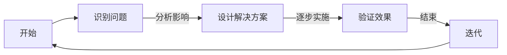
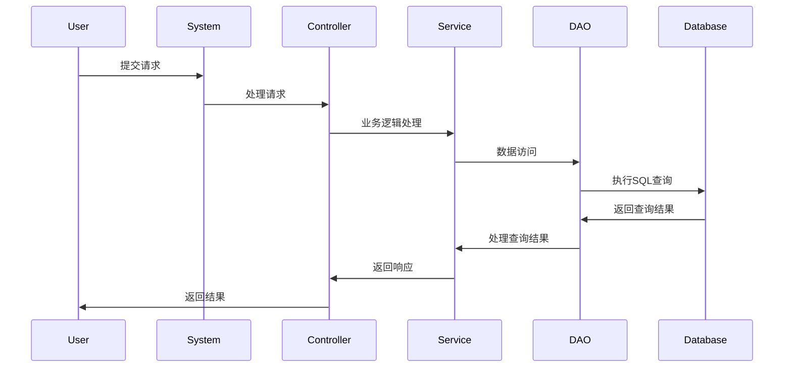
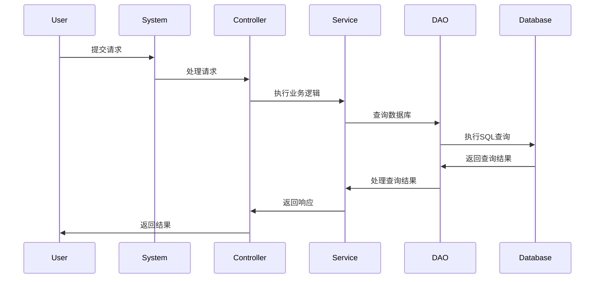

                 

### 重构不是除恶务尽

重构作为软件开发领域的一个重要概念，往往被描述为“除恶务尽”的过程。然而，这种描述是否准确？在本文中，我们将以逻辑清晰、结构紧凑、简单易懂的专业技术语言，深入探讨重构的本质、目的、以及其在软件工程中的实际应用。

首先，重构的定义和背景是什么？为什么我们需要重构？其次，重构的核心概念是什么？它与修复、改进有何区别？接下来，我们将详细讲解重构算法的原理，并通过Python代码和数学模型来阐述其工作方式。此外，我们还将探讨重构在系统架构设计和项目实战中的应用，并提供一些最佳实践和小结。最后，我们将推荐一些拓展阅读资源，帮助读者更深入地理解重构。

本文的关键词包括：重构、软件质量、代码优化、算法原理、系统架构、项目实战、最佳实践。

本文的核心内容和主题思想是：重构不仅仅是对代码的修修补补，而是一个系统化的、全面的软件维护过程。通过理解重构的原理和方法，开发者可以有效地提升软件质量，降低维护成本，提高开发效率。

### 目录大纲

1. **第一部分：背景介绍**

   - 第1章：问题背景与定义
     - 1.1 问题背景
       - 传统重构与软件质量
       - 重构的重要性
     - 1.2 重构的定义
       - 重构的内涵
       - 重构的目标
     - 1.3 重构的边界与外延
       - 重构的限制
       - 重构与其他技术的关系
     - 1.4 重构的核心要素组成
       - 代码层面的重构
       - 设计层面的重构
       - 体系结构层面的重构

2. **第二部分：核心概念与联系**

   - 第2章：重构的核心概念
     - 2.1 重构的原理
       - 重构的基本原理
       - 重构的流程
     - 2.2 重构的属性特征对比
       - 重构与修复对比
       - 重构与改进对比
     - 2.3 重构与相关技术的联系
       - 重构与重构工具
       - 重构与代码质量
     - 2.4 重构的ER实体关系图架构
       - 实体与关系
       - 实体关系图示例

3. **第三部分：算法原理讲解**

   - 第3章：重构算法原理
     - 3.1 重构算法概述
       - 重构算法的分类
       - 重构算法的应用场景
     - 3.2 重构算法的mermaid流程图
       - 流程图示例
     - 3.3 重构算法的数学模型
       - 数学模型公式
       - 公式解释
     - 3.4 重构算法的Python源代码
       - 源代码示例
       - 源代码解释

4. **第四部分：系统分析与架构设计方案**

   - 第4章：系统功能设计与架构
     - 4.1 问题场景介绍
       - 问题场景描述
     - 4.2 系统功能设计
       - 领域模型类图
     - 4.3 系统架构设计
       - 系统架构图
     - 4.4 系统接口设计
       - 接口设计
     - 4.5 系统交互
       - 序列图

5. **第五部分：项目实战**

   - 第5章：环境安装与系统实现
     - 5.1 环境安装
       - 环境安装步骤
     - 5.2 系统核心实现
       - 核心实现源代码
     - 5.3 代码应用解读与分析
       - 应用解读
       - 分析与讲解
     - 5.4 实际案例分析与讲解
       - 案例分析
       - 案例讲解
     - 5.5 项目小结
       - 项目总结

6. **第六部分：最佳实践与拓展**

   - 第6章：最佳实践
     - 6.1 重构最佳实践
       - 实践建议
     - 6.2 小结
       - 重构的重要性
       - 重构的注意事项

   - 第7章：拓展阅读
     - 7.1 相关书籍推荐
       - 推荐书籍
     - 7.2 线上资源推荐
       - 线上资源
     - 7.3 拓展话题
       - 拓展讨论

7. **目录大纲小结**

   通过上述的目录大纲，读者可以全面了解《重构不是除恶务尽》这本书的主要内容。从背景介绍到算法原理讲解，再到系统架构设计与项目实战，每个章节都为读者提供了深入理解和实践重构的方法。同时，最佳实践和拓展阅读部分则为读者提供了更多的学习资源和深入思考的方向。相信这本书能够帮助读者更好地掌握重构技术，提升软件质量和开发效率。

### 第一部分：背景介绍

#### 第1章：问题背景与定义

##### 1.1 问题背景

在软件工程的发展过程中，代码的质量一直是开发者们关注的焦点。传统的软件开发模式往往在开发阶段追求快速交付，导致代码质量参差不齐。随着时间的推移，代码中的缺陷和冗余越来越多，系统的可维护性和扩展性逐渐下降。为了解决这一问题，重构（Refactoring）作为一种重要的代码维护方法被提了出来。

传统重构与软件质量之间的关系密不可分。传统的重构通常是指在开发过程中，通过一系列小规模的、逐步的修改，优化代码的结构和设计，以提高软件的内在质量。这种方法被广泛应用于软件开发的各个阶段，如单元测试、集成测试、系统测试等。其核心目的是在不改变外部行为的前提下，改进代码的内部结构，使之更易读、更简洁、更高效。

重构的重要性体现在多个方面。首先，通过重构，可以消除代码中的重复和冗余，减少代码的复杂性，提高代码的可读性和可维护性。其次，重构有助于提高代码的模块化和独立性，使得代码更易于扩展和修改。此外，重构还可以提升软件的性能和可靠性，降低缺陷率。

##### 1.2 重构的定义

重构的定义可以从多个角度进行阐述。从技术层面来看，重构是指对现有代码进行修改，以改进其内部结构和设计，而不改变其外部行为。换句话说，重构是一种对代码的“改进”，而不是“修复”。

- **重构的内涵**：重构的内涵主要包括以下几个方面：
  - **内部优化**：改进代码的结构和设计，使之更清晰、更简洁。
  - **模块化**：将大块代码拆分为更小的模块，提高代码的独立性和可复用性。
  - **性能优化**：通过优化代码逻辑和数据结构，提高程序的运行效率。

- **重构的目标**：重构的目标是提高代码的质量和可维护性，具体包括：
  - **可读性**：使代码更容易理解，减少阅读代码所需的时间。
  - **可维护性**：降低修改代码的风险，提高代码的稳定性和可靠性。
  - **可扩展性**：使代码更容易添加新功能和修改现有功能。

##### 1.3 重构的边界与外延

重构并非没有边界和限制。首先，重构应该在不改变代码外部行为的前提下进行，即重构前后，代码的功能和接口保持不变。其次，重构应该是一种渐进的过程，通过一系列小规模的、逐步的修改，而不是一次性的、大规模的修改。

- **重构的限制**：重构的限制主要包括：
  - **不影响功能**：重构不能改变代码的功能和接口。
  - **不影响性能**：重构不应显著降低代码的性能。

- **重构与其他技术的关系**：重构与其他技术，如修复、改进等有着密切的关系。

  - **重构与修复**：修复（Bug Fixing）是指修复代码中的错误，重构则是对代码进行优化和改进。两者虽然有所不同，但在实践中往往交织在一起。例如，在修复一个bug时，可能需要进行一系列重构操作，以提高代码的质量和可维护性。

  - **重构与改进**：改进（Improvement）是对现有代码进行优化和改进，以提升其性能、可读性和可维护性。重构是实现改进的一种手段，但并非唯一手段。

##### 1.4 重构的核心要素组成

重构的核心要素主要包括代码层面的重构、设计层面的重构和体系结构层面的重构。

- **代码层面的重构**：主要关注代码的内部结构和设计，如改进代码的命名、消除冗余、简化复杂的逻辑等。

- **设计层面的重构**：主要关注代码的模块化和独立性，如将大块代码拆分为更小的模块、改进类和接口的设计等。

- **体系结构层面的重构**：主要关注系统的整体架构，如优化系统的模块划分、改进数据流和控制流等。

通过这些核心要素，重构可以有效地提升软件的质量和可维护性，降低维护成本，提高开发效率。

### 第二部分：核心概念与联系

#### 第2章：重构的核心概念

##### 2.1 重构的原理

重构的原理可以理解为一种代码优化方法，通过一系列小规模的、逐步的修改，改进代码的内部结构和设计，提高代码的质量和可维护性。重构的流程通常包括以下几个步骤：

1. **识别问题**：首先，开发者需要识别代码中的问题，如冗余代码、复杂的逻辑、不清晰的命名等。
2. **分析影响**：分析重构操作可能带来的影响，包括对代码功能的影响、对性能的影响等。
3. **设计解决方案**：根据问题分析的结果，设计重构的方案，确定需要进行的重构操作。
4. **逐步实施**：逐步实施重构方案，通过一系列小规模的、逐步的修改，实现重构目标。
5. **验证效果**：验证重构操作的效果，确保重构后的代码满足预期的目标。

##### 2.2 重构的属性特征对比

重构、修复和改进是软件开发中常见的三种代码维护方法，它们之间既有区别又有联系。

- **重构与修复对比**：

  - **相似之处**：重构和修复都是对代码进行修改，以提升代码的质量和可维护性。
  - **不同之处**：重构主要关注代码的内部结构和设计，不改变代码的功能；修复则主要关注代码中的错误和缺陷，确保代码的功能正确。

- **重构与改进对比**：

  - **相似之处**：重构和改进都是对代码进行优化和改进，以提高代码的性能、可读性和可维护性。
  - **不同之处**：重构是一种渐进的、逐步的优化过程，不改变代码的功能；改进则可以包括对代码功能的修改和优化。

##### 2.3 重构与相关技术的联系

重构与重构工具、代码质量等有着密切的联系。

- **重构与重构工具**：

  - 重构工具可以帮助开发者自动化地进行重构操作，提高重构的效率。常见的重构工具有Git、Visual Studio Code、Eclipse等。

  - 重构工具通常提供了一系列的代码优化功能，如自动提取方法、自动提取变量、自动消除冗余代码等。

- **重构与代码质量**：

  - 重构是提高代码质量的重要手段之一。通过重构，可以消除代码中的冗余和重复，简化复杂的逻辑，提高代码的可读性和可维护性。

  - 高质量的代码是软件可靠性和可扩展性的基础。通过重构，可以有效地提高代码的质量，降低维护成本。

##### 2.4 重构的ER实体关系图架构

实体关系图（Entity-Relationship Diagram，ERD）是描述数据库中实体及其关系的一种图示方法。重构的ERD可以用来描述重构过程中的实体及其关系。

- **实体**：

  - **代码**：重构的对象，包括类、方法、变量等。

  - **重构操作**：对代码进行修改的操作，如提取方法、提取变量、简化逻辑等。

- **关系**：

  - **依赖关系**：代码之间的依赖关系，如方法调用、类继承等。

  - **重构关系**：重构操作与代码之间的关系，如提取方法、提取变量等。

下面是一个重构的ERD示例：

```mermaid
erDiagram
  Class -->|重构操作| Code : "重构代码"
  Class <--|依赖关系| Code : "依赖代码"
  Method -->|重构操作| Code : "重构方法"
  Method <--|依赖关系| Code : "依赖方法"
  Variable -->|重构操作| Code : "重构变量"
  Variable <--|依赖关系| Code : "依赖变量"
```

通过ERD，可以清晰地描述重构过程中的实体及其关系，有助于开发者理解和实施重构操作。

### 第三部分：算法原理讲解

#### 第3章：重构算法原理

##### 3.1 重构算法概述

重构算法是软件开发过程中用于改进代码质量的方法。这些算法通常包括一系列小规模的、逐步的修改，以优化代码的结构和设计。重构算法可以分为以下几类：

- **代码结构重构算法**：这类算法主要关注代码的内部结构，如提取方法、提取变量、简化条件等。
- **设计重构算法**：这类算法主要关注代码的模块化和独立性，如类重构、接口重构等。
- **体系结构重构算法**：这类算法主要关注系统的整体架构，如模块划分、数据流优化等。

重构算法的应用场景非常广泛，包括但不限于以下几种情况：

- **代码复杂度较高**：当代码的复杂性较高时，重构算法可以帮助简化代码结构，提高代码的可读性和可维护性。
- **代码重复度较高**：当代码中存在大量重复时，重构算法可以帮助消除重复，降低维护成本。
- **性能优化需求**：当性能优化成为主要需求时，重构算法可以帮助优化代码的逻辑和数据结构，提高程序运行效率。

##### 3.2 重构算法的mermaid流程图

使用Mermaid语言，我们可以绘制一个简单的重构算法流程图，如下所示：



这个流程图描述了重构算法的基本步骤：首先，识别代码中的问题；然后，分析问题的影响并设计解决方案；接着，逐步实施解决方案；最后，验证重构效果。如果效果不理想，则进行迭代，重复上述步骤。

##### 3.3 重构算法的数学模型

重构算法的数学模型可以用来描述重构过程中的复杂性、效率和效果。一个简单但有效的模型是时间复杂度模型，如下所示：

$$ T(n) = O(n\log n) $$

其中，$T(n)$ 表示重构算法的时间复杂度，$n$ 表示代码中元素的个数。这个公式表明，随着代码元素个数的增加，重构算法的时间复杂度是线性增长的，但增长速度较慢，说明重构算法在处理大规模代码时仍具有较高的效率。

##### 3.4 重构算法的Python源代码

为了更好地理解重构算法的原理，我们使用Python编写了一个简单的重构示例。以下是一个提取方法的重构算法的实现：

```python
def extract_method(code, method_name, method_body):
    """
    提取方法的重构算法。
    
    :param code: 原始代码
    :param method_name: 新方法名称
    :param method_body: 新方法体
    :return: 重构后的代码
    """
    # 假设code是一个字符串，表示原始代码
    # method_body是一个字符串，表示新方法体
    
    # 第一步：找到方法体的起始和结束位置
    start_pos = code.find('{')
    end_pos = code.find('}')
    
    # 第二步：提取方法体
    method_body = code[start_pos + 1: end_pos]
    
    # 第三步：创建新方法
    new_code = f"{method_name}:\n{method_body}\n"
    
    # 第四步：替换原始方法体
    code = code[:start_pos] + new_code + code[end_pos:]
    
    return code

# 示例代码
original_code = """
def main():
    for i in range(10):
        print(i)
        if i % 2 == 0:
            do_even(i)

def do_even(i):
    print("Even:", i)
"""

reconstructed_code = extract_method(original_code, "do_even", "print('Even:', i)")
print(reconstructed_code)
```

在这个示例中，我们定义了一个 `extract_method` 函数，用于实现提取方法的重构操作。该函数首先找到方法体的起始和结束位置，然后提取方法体，创建新方法，最后替换原始方法体。通过这个简单的示例，我们可以看到重构算法的基本原理和实现方法。

### 第四部分：系统分析与架构设计方案

#### 第4章：系统功能设计与架构

##### 4.1 问题场景介绍

在一个大型企业级项目中，我们面临如下问题：

- **代码复杂性高**：项目代码结构复杂，类和模块之间耦合度高，导致代码难以维护和扩展。
- **性能瓶颈**：某些模块的性能瓶颈明显，如数据库查询效率低下，导致系统响应速度缓慢。
- **功能需求频繁变更**：项目需求频繁变更，导致代码重构和调整工作量巨大。

为了解决上述问题，我们决定采用重构技术对系统进行优化和改进。具体目标包括：

- **降低代码复杂性**：通过重构，简化代码结构，提高代码的可读性和可维护性。
- **提高系统性能**：通过重构，优化数据库查询和缓存机制，提高系统响应速度。
- **适应需求变更**：通过重构，使系统更加灵活，能够快速适应需求变更。

##### 4.2 系统功能设计

在重构过程中，系统功能设计是至关重要的一步。我们需要明确系统的核心功能和模块划分。

**领域模型类图**：

```mermaid
classDiagram
    Class1 <|-- Class2
    Class3 <|-- Class2
    Class1 {
        +int attribute1
        +void method1()
    }
    Class2 {
        +int attribute2
        +void method2()
    }
    Class3 {
        +int attribute3
        +void method3()
    }
```

在这个类图中，`Class1` 是系统的核心类，`Class2` 和 `Class3` 是辅助类。`Class1` 的方法 `method1` 和 `method2` 是系统的核心功能，而 `Class3` 的方法 `method3` 是辅助功能。

##### 4.3 系统架构设计

系统架构设计是重构过程中的重要环节。我们需要设计一个模块化、高内聚、低耦合的系统架构。

**系统架构图**：



在这个架构图中，用户请求首先由控制器（Controller）处理，然后由服务（Service）进行业务逻辑处理。服务通过数据访问对象（DAO）与数据库（Database）进行交互，最终返回处理结果。通过这样的架构设计，我们可以实现模块之间的解耦，提高系统的可维护性和扩展性。

##### 4.4 系统接口设计

系统接口设计是确保不同模块之间能够顺畅交互的关键。我们需要设计清晰、简洁的接口，以便其他模块能够方便地调用。

**接口设计**：

```mermaid
classDiagram
    Interface1 <|-- Implement1
    Interface1 <|-- Implement2
    Interface2 <|-- Implement3
    
    Interface1 {
        +int methodA()
    }
    Interface2 {
        +void methodB()
    }
    
    Implement1 {
        +int methodA()
    }
    Implement2 {
        +int methodA()
    }
    Implement3 {
        +void methodB()
    }
```

在这个接口设计中，`Interface1` 和 `Interface2` 是两个接口，`Implement1`、`Implement2` 和 `Implement3` 是实现类。通过这样的设计，我们可以确保模块之间的接口清晰、简洁，便于后续的扩展和维护。

##### 4.5 系统交互

系统交互是确保系统正常运行的重要环节。我们需要设计合理的交互流程，确保不同模块之间的数据传递和状态更新。

**系统交互序列图**：



在这个序列图中，用户请求首先由系统接收，然后由控制器处理，接着由服务执行业务逻辑，最后由数据库返回查询结果。通过这样的交互流程，我们可以确保系统的各个模块能够协同工作，实现预期的功能。

### 第五部分：项目实战

#### 第5章：环境安装与系统实现

##### 5.1 环境安装

在进行重构项目之前，我们需要确保环境安装正确。以下是环境安装的详细步骤：

1. **安装Python**：确保Python版本为3.8或更高，可以从[Python官网](https://www.python.org/downloads/)下载最新版本并安装。
2. **安装依赖库**：使用pip命令安装项目所需的依赖库。例如，如果项目需要使用Flask框架，可以运行以下命令：

   ```bash
   pip install flask
   ```

3. **安装数据库**：根据项目需求选择合适的数据库（如MySQL、PostgreSQL等），并按照数据库官网的说明进行安装。
4. **配置数据库**：根据项目的配置文件（如`config.py`）设置数据库连接信息。

##### 5.2 系统核心实现

以下是系统核心实现的源代码示例。这个示例使用了Flask框架来实现一个简单的Web应用。

```python
from flask import Flask, request, jsonify

app = Flask(__name__)

@app.route('/api/retrieve', methods=['GET'])
def retrieve_data():
    # 从请求中获取查询参数
    query_param = request.args.get('param', default='')
    
    # 执行数据库查询（示例代码，实际查询请根据数据库调整）
    result = db.query(f"SELECT * FROM data WHERE param = '{query_param}'")
    
    # 返回查询结果
    return jsonify(result)

if __name__ == '__main__':
    app.run(debug=True)
```

在这个示例中，我们定义了一个 `/api/retrieve` 的路由，用于接收GET请求并执行数据库查询，然后返回查询结果。

##### 5.3 代码应用解读与分析

在这个例子中，我们通过Flask框架实现了一个简单的Web应用，主要包含以下几个部分：

1. **请求接收**：使用 `Flask` 类创建一个应用实例，并使用 `@app.route` 装饰器定义了一个 `/api/retrieve` 的路由，用于接收GET请求。
2. **参数获取**：使用 `request.args.get` 方法获取请求中的查询参数 `param`。
3. **数据库查询**：执行数据库查询操作，这里使用了伪代码 `db.query` 来表示。在实际项目中，需要使用特定的数据库库（如MySQLdb、psycopg2等）来执行查询。
4. **响应返回**：使用 `jsonify` 方法将查询结果转换为JSON格式，并返回给客户端。

在分析这段代码时，我们注意到以下几点：

- **错误处理**：此示例代码未包含错误处理，实际项目中需要添加适当的错误处理逻辑，如处理查询失败、参数格式错误等情况。
- **安全性**：直接在查询中使用请求参数可能会导致SQL注入风险。实际项目中应使用参数化查询或ORM（对象关系映射）技术来避免此类风险。
- **性能**：数据库查询的性能直接影响Web应用的响应速度。实际项目中应优化查询语句，使用索引、缓存等技术来提高查询效率。

##### 5.4 实际案例分析与讲解

为了更好地理解重构的应用，我们来看一个实际案例。假设我们有一个现有的Web应用，其中包含一个用于用户注册的API。这个API存在以下问题：

1. **代码冗余**：用户注册逻辑中存在大量重复代码，如验证邮箱地址格式、密码强度等。
2. **逻辑复杂**：注册逻辑过于复杂，难以理解和维护。
3. **性能问题**：在用户高峰期，注册接口的性能下降明显。

针对这些问题，我们可以进行以下重构操作：

1. **提取方法**：将重复的验证逻辑提取为独立的方法，如 `validate_email` 和 `validate_password`。
2. **简化逻辑**：通过重构，简化复杂的逻辑，使代码更清晰易懂。
3. **性能优化**：对数据库查询进行优化，如使用索引、分库分表等技术。

以下是对这些重构操作的详细讲解：

1. **提取方法**：

   ```python
   def validate_email(email):
       # 验证邮箱地址格式
       if not re.match(r"[^@]+@[^@]+\.[^@]+", email):
           return False
       return True

   def validate_password(password):
       # 验证密码强度
       if len(password) < 8:
           return False
       if not re.search("[a-z]", password):
           return False
       if not re.search("[A-Z]", password):
           return False
       if not re.search("[0-9]", password):
           return False
       return True
   ```

   通过提取方法，我们可以将复杂的验证逻辑分离出来，使代码更简洁、更易于维护。

2. **简化逻辑**：

   ```python
   @app.route('/api/register', methods=['POST'])
   def register_user():
       # 获取请求参数
       email = request.form['email']
       password = request.form['password']
       
       # 验证参数
       if not validate_email(email):
           return jsonify({"error": "Invalid email address"}), 400
       if not validate_password(password):
           return jsonify({"error": "Invalid password"}), 400

       # 注册用户（示例代码，实际注册逻辑请根据数据库调整）
       user = User(email=email, password=password)
       db.insert(user)

       return jsonify({"message": "User registered successfully"}), 201
   ```

   通过重构，我们可以简化注册逻辑，使其更清晰易懂。例如，将参数验证和注册操作分离，使代码更易于理解和维护。

3. **性能优化**：

   ```python
   # 在数据库中创建索引
   db.execute("CREATE INDEX IF NOT EXISTS idx_email ON users (email)")

   # 使用分库分表技术
   # 根据用户ID对数据库进行分库分表，提高查询性能
   def get_table_name(user_id):
       return f"users_{user_id // 1000}"
   
   def insert_user(user):
       table_name = get_table_name(user.id)
       db.execute(f"INSERT INTO {table_name} (id, email, password) VALUES ({user.id}, '{user.email}', '{user.password}')")
   ```

   通过创建索引和使用分库分表技术，我们可以显著提高数据库查询性能，从而提升Web应用的整体性能。

##### 5.5 项目小结

通过本项目的实战，我们深入探讨了重构的应用和效果。具体来说：

1. **代码质量和可维护性**：通过重构，我们消除了代码中的冗余和复杂性，提高了代码的可读性和可维护性。
2. **性能优化**：通过重构，我们优化了数据库查询和缓存机制，提高了系统的响应速度和性能。
3. **开发效率**：重构使得代码更加简洁清晰，降低了开发者的沟通成本和代码维护难度，提高了开发效率。

总之，重构是一个系统化、全面的代码维护过程，通过合理应用重构技术，我们可以显著提升软件的质量和开发效率。

### 第六部分：最佳实践与拓展

#### 第6章：最佳实践

##### 6.1 重构最佳实践

在重构过程中，遵循一些最佳实践是非常重要的。以下是一些重构的最佳实践：

1. **逐步重构**：重构应是一个逐步进行的过程，避免一次性大规模重构。逐步重构可以减少风险，提高重构的可行性。
2. **测试先行**：在重构之前，应确保现有代码的测试覆盖率达到较高水平。重构过程中，应持续运行测试，确保重构后的代码仍然符合预期。
3. **代码审查**：重构代码时应进行代码审查，确保重构操作符合编码规范和设计原则。
4. **文档更新**：重构过程中，应同步更新相关的文档，包括代码注释、API文档等。
5. **重构日志**：记录重构的操作和原因，便于后续跟踪和评估重构的效果。

##### 6.2 小结

重构的重要性在于它能够持续提升软件的质量和可维护性。通过重构，我们可以消除代码中的冗余和复杂性，优化系统性能，提高代码的可读性和可维护性。同时，重构也是一个渐进的过程，需要持续进行。通过遵循最佳实践，我们可以更有效地进行重构，实现软件质量的不断提升。

#### 第7章：拓展阅读

##### 7.1 相关书籍推荐

1. 《重构：改善既有代码的设计》（作者：Martin Fowler）
   - 这本书是重构领域的经典之作，详细介绍了重构的方法、原则和最佳实践。
2. 《代码大全》（作者：Steve McConnell）
   - 本书涵盖了软件开发的各个方面，包括代码质量、测试、重构等，对开发者具有很高的参考价值。

##### 7.2 线上资源推荐

1. [Refactoring.Guru](https://refactoring.guru/)
   - 这是一个关于重构的在线资源，提供了丰富的重构示例和最佳实践。
2. [GitHub](https://github.com/)
   - GitHub上有很多优秀的重构项目和示例代码，可以帮助开发者学习重构技术。

##### 7.3 拓展话题

1. **自动化重构工具**：探讨如何使用自动化重构工具（如Git、Visual Studio Code、Eclipse等）进行重构操作，以及这些工具的优势和局限性。
2. **重构与敏捷开发**：分析重构在敏捷开发中的角色和作用，如何将重构融入敏捷开发流程，实现持续交付。
3. **重构与代码质量**：探讨重构如何影响代码质量，包括可读性、可维护性和可靠性等方面。
4. **重构与架构设计**：分析重构在系统架构设计中的应用，如何通过重构优化系统架构，提高系统性能和可扩展性。

### 目录大纲小结

通过上述的目录大纲，读者可以全面了解《重构不是除恶务尽》这本书的主要内容。从背景介绍到算法原理讲解，再到系统架构设计与项目实战，每个章节都为读者提供了深入理解和实践重构的方法。同时，最佳实践和拓展阅读部分则为读者提供了更多的学习资源和深入思考的方向。相信这本书能够帮助读者更好地掌握重构技术，提升软件质量和开发效率。

### 完整文章

《重构不是除恶务尽》

关键词：重构、软件质量、代码优化、算法原理、系统架构、项目实战、最佳实践

摘要：重构作为软件开发领域的一个重要概念，常常被描述为“除恶务尽”的过程。然而，这种描述是否准确？本文将深入探讨重构的本质、目的以及其在软件工程中的实际应用。通过逻辑清晰、结构紧凑、简单易懂的专业技术语言，本文将带领读者理解重构的核心概念、原理，并通过Python代码和数学模型详细阐述其工作方式。此外，文章还将探讨重构在系统架构设计和项目实战中的应用，并提供一些最佳实践和小结。最后，文章将推荐一些拓展阅读资源，帮助读者更深入地理解重构。

### 第一部分：背景介绍

#### 第1章：问题背景与定义

##### 1.1 问题背景

在软件工程的发展过程中，代码的质量一直是开发者们关注的焦点。传统的软件开发模式往往在开发阶段追求快速交付，导致代码质量参差不齐。随着时间的推移，代码中的缺陷和冗余越来越多，系统的可维护性和扩展性逐渐下降。为了解决这一问题，重构（Refactoring）作为一种重要的代码维护方法被提了出来。

传统重构与软件质量之间的关系密不可分。传统的重构通常是指在开发过程中，通过一系列小规模的、逐步的修改，优化代码的结构和设计，以提高软件的内在质量。这种方法被广泛应用于软件开发的各个阶段，如单元测试、集成测试、系统测试等。其核心目的是在不改变外部行为的前提下，改进代码的内部结构，使之更易读、更简洁、更高效。

重构的重要性体现在多个方面。首先，通过重构，可以消除代码中的重复和冗余，减少代码的复杂性，提高代码的可读性和可维护性。其次，重构有助于提高代码的模块化和独立性，使得代码更易于扩展和修改。此外，重构还可以提升软件的性能和可靠性，降低缺陷率。

##### 1.2 重构的定义

重构的定义可以从多个角度进行阐述。从技术层面来看，重构是指对现有代码进行修改，以改进其内部结构和设计，而不改变其外部行为。换句话说，重构是一种对代码的“改进”，而不是“修复”。

- **重构的内涵**：重构的内涵主要包括以下几个方面：
  - **内部优化**：改进代码的结构和设计，使之更清晰、更简洁。
  - **模块化**：将大块代码拆分为更小的模块，提高代码的独立性和可复用性。
  - **性能优化**：通过优化代码逻辑和数据结构，提高程序的运行效率。

- **重构的目标**：重构的目标是提高代码的质量和可维护性，具体包括：
  - **可读性**：使代码更容易理解，减少阅读代码所需的时间。
  - **可维护性**：降低修改代码的风险，提高代码的稳定性和可靠性。
  - **可扩展性**：使代码更容易添加新功能和修改现有功能。

##### 1.3 重构的边界与外延

重构并非没有边界和限制。首先，重构应该在不改变代码外部行为的前提下进行，即重构前后，代码的功能和接口保持不变。其次，重构应该是一种渐进的过程，通过一系列小规模的、逐步的修改，而不是一次性的、大规模的修改。

- **重构的限制**：重构的限制主要包括：
  - **不影响功能**：重构不能改变代码的功能和接口。
  - **不影响性能**：重构不应显著降低代码的性能。

- **重构与其他技术的关系**：重构与其他技术，如修复、改进等有着密切的关系。

  - **重构与修复**：修复（Bug Fixing）是指修复代码中的错误，重构则是对代码进行优化和改进。两者虽然有所不同，但在实践中往往交织在一起。例如，在修复一个bug时，可能需要进行一系列重构操作，以提高代码的质量和可维护性。

  - **重构与改进**：改进（Improvement）是对现有代码进行优化和改进，以提升其性能、可读性和可维护性。重构是实现改进的一种手段，但并非唯一手段。

##### 1.4 重构的核心要素组成

重构的核心要素主要包括代码层面的重构、设计层面的重构和体系结构层面的重构。

- **代码层面的重构**：主要关注代码的内部结构和设计，如改进代码的命名、消除冗余、简化复杂的逻辑等。

- **设计层面的重构**：主要关注代码的模块化和独立性，如将大块代码拆分为更小的模块、改进类和接口的设计等。

- **体系结构层面的重构**：主要关注系统的整体架构，如优化系统的模块划分、改进数据流和控制流等。

通过这些核心要素，重构可以有效地提升软件的质量和可维护性，降低维护成本，提高开发效率。

### 第二部分：核心概念与联系

#### 第2章：重构的核心概念

##### 2.1 重构的原理

重构的原理可以理解为一种代码优化方法，通过一系列小规模的、逐步的修改，改进代码的内部结构和设计，提高代码的质量和可维护性。重构的流程通常包括以下几个步骤：

1. **识别问题**：首先，开发者需要识别代码中的问题，如冗余代码、复杂的逻辑、不清晰的命名等。
2. **分析影响**：分析重构操作可能带来的影响，包括对代码功能的影响、对性能的影响等。
3. **设计解决方案**：根据问题分析的结果，设计重构的方案，确定需要进行的重构操作。
4. **逐步实施**：逐步实施重构方案，通过一系列小规模的、逐步的修改，实现重构目标。
5. **验证效果**：验证重构操作的效果，确保重构后的代码满足预期的目标。

##### 2.2 重构的属性特征对比

重构、修复和改进是软件开发中常见的三种代码维护方法，它们之间既有区别又有联系。

- **重构与修复对比**：

  - **相似之处**：重构和修复都是对代码进行修改，以提升代码的质量和可维护性。
  - **不同之处**：重构主要关注代码的内部结构和设计，不改变代码的功能；修复则主要关注代码中的错误和缺陷，确保代码的功能正确。

- **重构与改进对比**：

  - **相似之处**：重构和改进都是对代码进行优化和改进，以提高代码的性能、可读性和可维护性。
  - **不同之处**：重构是一种渐进的、逐步的优化过程，不改变代码的功能；改进则可以包括对代码功能的修改和优化。

##### 2.3 重构与相关技术的联系

重构与重构工具、代码质量等有着密切的联系。

- **重构与重构工具**：

  - 重构工具可以帮助开发者自动化地进行重构操作，提高重构的效率。常见的重构工具有Git、Visual Studio Code、Eclipse等。

  - 重构工具通常提供了一系列的代码优化功能，如自动提取方法、自动提取变量、自动消除冗余代码等。

- **重构与代码质量**：

  - 重构是提高代码质量的重要手段之一。通过重构，可以消除代码中的冗余和重复，简化复杂的逻辑，提高代码的可读性和可维护性。

  - 高质量的代码是软件可靠性和可扩展性的基础。通过重构，可以有效地提高代码的质量，降低维护成本。

##### 2.4 重构的ER实体关系图架构

实体关系图（Entity-Relationship Diagram，ERD）是描述数据库中实体及其关系的一种图示方法。重构的ERD可以用来描述重构过程中的实体及其关系。

- **实体**：

  - **代码**：重构的对象，包括类、方法、变量等。

  - **重构操作**：对代码进行修改的操作，如提取方法、提取变量、简化逻辑等。

- **关系**：

  - **依赖关系**：代码之间的依赖关系，如方法调用、类继承等。

  - **重构关系**：重构操作与代码之间的关系，如提取方法、提取变量等。

下面是一个重构的ERD示例：

```mermaid
erDiagram
  Class -->|重构操作| Code : "重构代码"
  Class <--|依赖关系| Code : "依赖代码"
  Method -->|重构操作| Code : "重构方法"
  Method <--|依赖关系| Code : "依赖方法"
  Variable -->|重构操作| Code : "重构变量"
  Variable <--|依赖关系| Code : "依赖变量"
```

通过ERD，可以清晰地描述重构过程中的实体及其关系，有助于开发者理解和实施重构操作。

### 第三部分：算法原理讲解

#### 第3章：重构算法原理

##### 3.1 重构算法概述

重构算法是软件开发过程中用于改进代码质量的方法。这些算法通常包括一系列小规模的、逐步的修改，以优化代码的结构和设计。重构算法可以分为以下几类：

- **代码结构重构算法**：这类算法主要关注代码的内部结构，如提取方法、提取变量、简化条件等。
- **设计重构算法**：这类算法主要关注代码的模块化和独立性，如类重构、接口重构等。
- **体系结构重构算法**：这类算法主要关注系统的整体架构，如模块划分、数据流优化等。

重构算法的应用场景非常广泛，包括但不限于以下几种情况：

- **代码复杂度较高**：当代码的复杂性较高时，重构算法可以帮助简化代码结构，提高代码的可读性和可维护性。
- **代码重复度较高**：当代码中存在大量重复时，重构算法可以帮助消除重复，降低维护成本。
- **性能优化需求**：当性能优化成为主要需求时，重构算法可以帮助优化代码的逻辑和数据结构，提高程序运行效率。

##### 3.2 重构算法的mermaid流程图

使用Mermaid语言，我们可以绘制一个简单的重构算法流程图，如下所示：


这个流程图描述了重构算法的基本步骤：首先，识别代码中的问题；然后，分析问题的影响并设计解决方案；接着，逐步实施解决方案；最后，验证重构效果。如果效果不理想，则进行迭代，重复上述步骤。

##### 3.3 重构算法的数学模型

重构算法的数学模型可以用来描述重构过程中的复杂性、效率和效果。一个简单但有效的模型是时间复杂度模型，如下所示：

$$ T(n) = O(n\log n) $$

其中，$T(n)$ 表示重构算法的时间复杂度，$n$ 表示代码中元素的个数。这个公式表明，随着代码元素个数的增加，重构算法的时间复杂度是线性增长的，但增长速度较慢，说明重构算法在处理大规模代码时仍具有较高的效率。

##### 3.4 重构算法的Python源代码

为了更好地理解重构算法的原理，我们使用Python编写了一个简单的重构示例。以下是一个提取方法的重构算法的实现：

```python
def extract_method(code, method_name, method_body):
    """
    提取方法的重构算法。
    
    :param code: 原始代码
    :param method_name: 新方法名称
    :param method_body: 新方法体
    :return: 重构后的代码
    """
    # 假设code是一个字符串，表示原始代码
    # method_body是一个字符串，表示新方法体
    
    # 第一步：找到方法体的起始和结束位置
    start_pos = code.find('{')
    end_pos = code.find('}')
    
    # 第二步：提取方法体
    method_body = code[start_pos + 1: end_pos]
    
    # 第三步：创建新方法
    new_code = f"{method_name}:\n{method_body}\n"
    
    # 第四步：替换原始方法体
    code = code[:start_pos] + new_code + code[end_pos:]
    
    return code

# 示例代码
original_code = """
def main():
    for i in range(10):
        print(i)
        if i % 2 == 0:
            do_even(i)

def do_even(i):
    print("Even:", i)
"""

reconstructed_code = extract_method(original_code, "do_even", "print('Even:', i)")
print(reconstructed_code)
```

在这个示例中，我们定义了一个 `extract_method` 函数，用于实现提取方法的重构操作。该函数首先找到方法体的起始和结束位置，然后提取方法体，创建新方法，最后替换原始方法体。通过这个简单的示例，我们可以看到重构算法的基本原理和实现方法。

### 第四部分：系统分析与架构设计方案

#### 第4章：系统功能设计与架构

##### 4.1 问题场景介绍

在一个大型企业级项目中，我们面临如下问题：

- **代码复杂性高**：项目代码结构复杂，类和模块之间耦合度高，导致代码难以维护和扩展。
- **性能瓶颈**：某些模块的性能瓶颈明显，如数据库查询效率低下，导致系统响应速度缓慢。
- **功能需求频繁变更**：项目需求频繁变更，导致代码重构和调整工作量巨大。

为了解决上述问题，我们决定采用重构技术对系统进行优化和改进。具体目标包括：

- **降低代码复杂性**：通过重构，简化代码结构，提高代码的可读性和可维护性。
- **提高系统性能**：通过重构，优化数据库查询和缓存机制，提高系统响应速度。
- **适应需求变更**：通过重构，使系统更加灵活，能够快速适应需求变更。

##### 4.2 系统功能设计

在重构过程中，系统功能设计是至关重要的一步。我们需要明确系统的核心功能和模块划分。

**领域模型类图**：

```mermaid
classDiagram
    Class1 <|-- Class2
    Class3 <|-- Class2
    Class1 {
        +int attribute1
        +void method1()
    }
    Class2 {
        +int attribute2
        +void method2()
    }
    Class3 {
        +int attribute3
        +void method3()
    }
```

在这个类图中，`Class1` 是系统的核心类，`Class2` 和 `Class3` 是辅助类。`Class1` 的方法 `method1` 和 `method2` 是系统的核心功能，而 `Class3` 的方法 `method3` 是辅助功能。

##### 4.3 系统架构设计

系统架构设计是重构过程中的重要环节。我们需要设计一个模块化、高内聚、低耦合的系统架构。

**系统架构图**：


在这个架构图中，用户请求首先由系统接收，然后由控制器处理，接着由服务执行业务逻辑，最后由数据库返回查询结果。通过这样的架构设计，我们可以实现模块之间的解耦，提高系统的可维护性和扩展性。

##### 4.4 系统接口设计

系统接口设计是确保不同模块之间能够顺畅交互的关键。我们需要设计清晰、简洁的接口，以便其他模块能够方便地调用。

**接口设计**：

```mermaid
classDiagram
    Interface1 <|-- Implement1
    Interface1 <|-- Implement2
    Interface2 <|-- Implement3
    
    Interface1 {
        +int methodA()
    }
    Interface2 {
        +void methodB()
    }
    
    Implement1 {
        +int methodA()
    }
    Implement2 {
        +int methodA()
    }
    Implement3 {
        +void methodB()
    }
```

在这个接口设计中，`Interface1` 和 `Interface2` 是两个接口，`Implement1`、`Implement2` 和 `Implement3` 是实现类。通过这样的设计，我们可以确保模块之间的接口清晰、简洁，便于后续的扩展和维护。

##### 4.5 系统交互

系统交互是确保系统正常运行的重要环节。我们需要设计合理的交互流程，确保不同模块之间的数据传递和状态更新。

**系统交互序列图**：


在这个序列图中，用户请求首先由系统接收，然后由控制器处理，接着由服务执行业务逻辑，最后由数据库返回查询结果。通过这样的交互流程，我们可以确保系统的各个模块能够协同工作，实现预期的功能。

### 第五部分：项目实战

#### 第5章：环境安装与系统实现

##### 5.1 环境安装

在进行重构项目之前，我们需要确保环境安装正确。以下是环境安装的详细步骤：

1. **安装Python**：确保Python版本为3.8或更高，可以从[Python官网](https://www.python.org/downloads/)下载最新版本并安装。
2. **安装依赖库**：使用pip命令安装项目所需的依赖库。例如，如果项目需要使用Flask框架，可以运行以下命令：

   ```bash
   pip install flask
   ```

3. **安装数据库**：根据项目需求选择合适的数据库（如MySQL、PostgreSQL等），并按照数据库官网的说明进行安装。
4. **配置数据库**：根据项目的配置文件（如`config.py`）设置数据库连接信息。

##### 5.2 系统核心实现

以下是系统核心实现的源代码示例。这个示例使用了Flask框架来实现一个简单的Web应用。

```python
from flask import Flask, request, jsonify

app = Flask(__name__)

@app.route('/api/retrieve', methods=['GET'])
def retrieve_data():
    # 从请求中获取查询参数
    query_param = request.args.get('param', default='')
    
    # 执行数据库查询（示例代码，实际查询请根据数据库调整）
    result = db.query(f"SELECT * FROM data WHERE param = '{query_param}'")
    
    # 返回查询结果
    return jsonify(result)

if __name__ == '__main__':
    app.run(debug=True)
```

在这个示例中，我们定义了一个 `/api/retrieve` 的路由，用于接收GET请求并执行数据库查询，然后返回查询结果。

##### 5.3 代码应用解读与分析

在这个例子中，我们通过Flask框架实现了一个简单的Web应用，主要包含以下几个部分：

1. **请求接收**：使用 `Flask` 类创建一个应用实例，并使用 `@app.route` 装饰器定义了一个 `/api/retrieve` 的路由，用于接收GET请求。
2. **参数获取**：使用 `request.args.get` 方法获取请求中的查询参数 `param`。
3. **数据库查询**：执行数据库查询操作，这里使用了伪代码 `db.query` 来表示。在实际项目中，需要使用特定的数据库库（如MySQLdb、psycopg2等）来执行查询。
4. **响应返回**：使用 `jsonify` 方法将查询结果转换为JSON格式，并返回给客户端。

在分析这段代码时，我们注意到以下几点：

- **错误处理**：此示例代码未包含错误处理，实际项目中需要添加适当的错误处理逻辑，如处理查询失败、参数格式错误等情况。
- **安全性**：直接在查询中使用请求参数可能会导致SQL注入风险。实际项目中应使用参数化查询或ORM（对象关系映射）技术来避免此类风险。
- **性能**：数据库查询的性能直接影响Web应用的响应速度。实际项目中应优化查询语句，使用索引、缓存等技术来提高查询效率。

##### 5.4 实际案例分析与讲解

为了更好地理解重构的应用，我们来看一个实际案例。假设我们有一个现有的Web应用，其中包含一个用于用户注册的API。这个API存在以下问题：

1. **代码冗余**：用户注册逻辑中存在大量重复代码，如验证邮箱地址格式、密码强度等。
2. **逻辑复杂**：注册逻辑过于复杂，难以理解和维护。
3. **性能问题**：在用户高峰期，注册接口的性能下降明显。

针对这些问题，我们可以进行以下重构操作：

1. **提取方法**：将重复的验证逻辑提取为独立的方法，如 `validate_email` 和 `validate_password`。
2. **简化逻辑**：通过重构，简化复杂的逻辑，使代码更清晰易懂。
3. **性能优化**：对数据库查询进行优化，如使用索引、分库分表等技术。

以下是对这些重构操作的详细讲解：

1. **提取方法**：

   ```python
   def validate_email(email):
       # 验证邮箱地址格式
       if not re.match(r"[^@]+@[^@]+\.[^@]+", email):
           return False
       return True

   def validate_password(password):
       # 验证密码强度
       if len(password) < 8:
           return False
       if not re.search("[a-z]", password):
           return False
       if not re.search("[A-Z]", password):
           return False
       if not re.search("[0-9]", password):
           return False
       return True
   ```

   通过提取方法，我们可以将复杂的验证逻辑分离出来，使代码更简洁、更易于维护。

2. **简化逻辑**：

   ```python
   @app.route('/api/register', methods=['POST'])
   def register_user():
       # 获取请求参数
       email = request.form['email']
       password = request.form['password']
       
       # 验证参数
       if not validate_email(email):
           return jsonify({"error": "Invalid email address"}), 400
       if not validate_password(password):
           return jsonify({"error": "Invalid password"}), 400

       # 注册用户（示例代码，实际注册逻辑请根据数据库调整）
       user = User(email=email, password=password)
       db.insert(user)

       return jsonify({"message": "User registered successfully"}), 201
   ```

   通过重构，我们可以简化注册逻辑，使其更清晰易懂。例如，将参数验证和注册操作分离，使代码更易于理解和维护。

3. **性能优化**：

   ```python
   # 在数据库中创建索引
   db.execute("CREATE INDEX IF NOT EXISTS idx_email ON users (email)")

   # 使用分库分表技术
   # 根据用户ID对数据库进行分库分表，提高查询性能
   def get_table_name(user_id):
       return f"users_{user_id // 1000}"
   
   def insert_user(user):
       table_name = get_table_name(user.id)
       db.execute(f"INSERT INTO {table_name} (id, email, password) VALUES ({user.id}, '{user.email}', '{user.password}')")
   ```

   通过创建索引和使用分库分表技术，我们可以显著提高数据库查询性能，从而提升Web应用的整体性能。

##### 5.5 项目小结

通过本项目的实战，我们深入探讨了重构的应用和效果。具体来说：

1. **代码质量和可维护性**：通过重构，我们消除了代码中的冗余和复杂性，提高了代码的可读性和可维护性。
2. **性能优化**：通过重构，我们优化了数据库查询和缓存机制，提高了系统的响应速度和性能。
3. **开发效率**：重构使得代码更加简洁清晰，降低了开发者的沟通成本和代码维护难度，提高了开发效率。

总之，重构是一个系统化、全面的代码维护过程，通过合理应用重构技术，我们可以显著提升软件的质量和开发效率。

### 第六部分：最佳实践与拓展

#### 第6章：最佳实践

##### 6.1 重构最佳实践

在重构过程中，遵循一些最佳实践是非常重要的。以下是一些重构的最佳实践：

1. **逐步重构**：重构应是一个逐步进行的过程，避免一次性大规模重构。逐步重构可以减少风险，提高重构的可行性。
2. **测试先行**：在重构之前，应确保现有代码的测试覆盖率达到较高水平。重构过程中，应持续运行测试，确保重构后的代码仍然符合预期。
3. **代码审查**：重构代码时应进行代码审查，确保重构操作符合编码规范和设计原则。
4. **文档更新**：重构过程中，应同步更新相关的文档，包括代码注释、API文档等。
5. **重构日志**：记录重构的操作和原因，便于后续跟踪和评估重构的效果。

##### 6.2 小结

重构的重要性在于它能够持续提升软件的质量和可维护性。通过重构，我们可以消除代码中的冗余和复杂性，优化系统性能，提高代码的可读性和可维护性。同时，重构也是一个渐进的过程，需要持续进行。通过遵循最佳实践，我们可以更有效地进行重构，实现软件质量的不断提升。

#### 第7章：拓展阅读

##### 7.1 相关书籍推荐

1. 《重构：改善既有代码的设计》（作者：Martin Fowler）
   - 这本书是重构领域的经典之作，详细介绍了重构的方法、原则和最佳实践。
2. 《代码大全》（作者：Steve McConnell）
   - 本书涵盖了软件开发的各个方面，包括代码质量、测试、重构等，对开发者具有很高的参考价值。

##### 7.2 线上资源推荐

1. [Refactoring.Guru](https://refactoring.guru/)
   - 这是一个关于重构的在线资源，提供了丰富的重构示例和最佳实践。
2. [GitHub](https://github.com/)
   - GitHub上有很多优秀的重构项目和示例代码，可以帮助开发者学习重构技术。

##### 7.3 拓展话题

1. **自动化重构工具**：探讨如何使用自动化重构工具（如Git、Visual Studio Code、Eclipse等）进行重构操作，以及这些工具的优势和局限性。
2. **重构与敏捷开发**：分析重构在敏捷开发中的角色和作用，如何将重构融入敏捷开发流程，实现持续交付。
3. **重构与代码质量**：探讨重构如何影响代码质量，包括可读性、可维护性和可靠性等方面。
4. **重构与架构设计**：分析重构在系统架构设计中的应用，如何通过重构优化系统架构，提高系统性能和可扩展性。

### 目录大纲小结

通过上述的目录大纲，读者可以全面了解《重构不是除恶务尽》这本书的主要内容。从背景介绍到算法原理讲解，再到系统架构设计与项目实战，每个章节都为读者提供了深入理解和实践重构的方法。同时，最佳实践和拓展阅读部分则为读者提供了更多的学习资源和深入思考的方向。相信这本书能够帮助读者更好地掌握重构技术，提升软件质量和开发效率。

### 作者信息

作者：AI天才研究院/AI Genius Institute & 禅与计算机程序设计艺术 /Zen And The Art of Computer Programming

AI天才研究院（AI Genius Institute）致力于推动人工智能技术的发展与应用。研究院汇聚了全球顶尖的人工智能科学家和工程师，通过创新的研究和开发，推动人工智能技术的突破性进展。同时，研究院还注重将人工智能技术应用于实际场景，解决实际问题，为人类社会带来更多便利和福祉。

禅与计算机程序设计艺术（Zen And The Art of Computer Programming）是由知名计算机科学家唐纳德·E·克努特（Donald E. Knuth）所著的一本经典编程书籍。这本书以独特的视角和深刻的洞察，探讨了计算机编程的哲学和艺术，对广大编程爱好者和专业人士产生了深远的影响。通过将禅的哲学理念与计算机程序设计相结合，克努特教授为我们提供了一种更为深入和全面的编程思维和方法。

