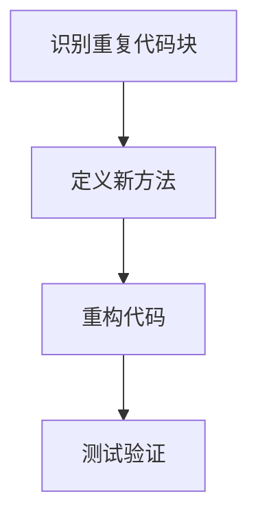
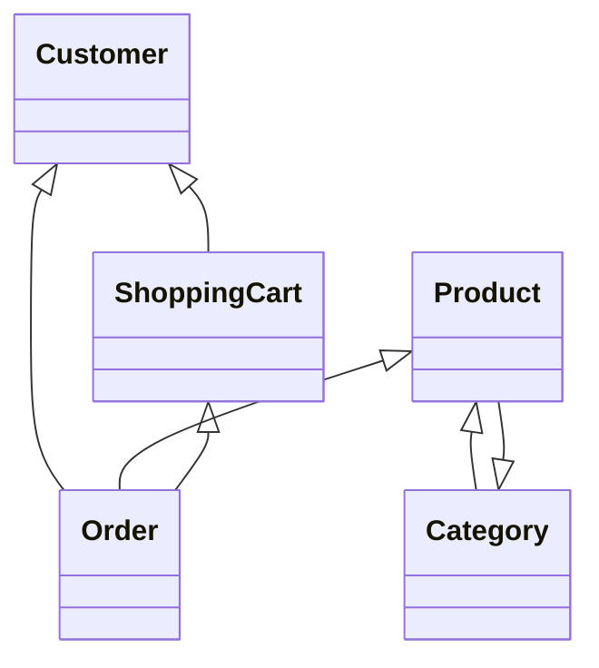
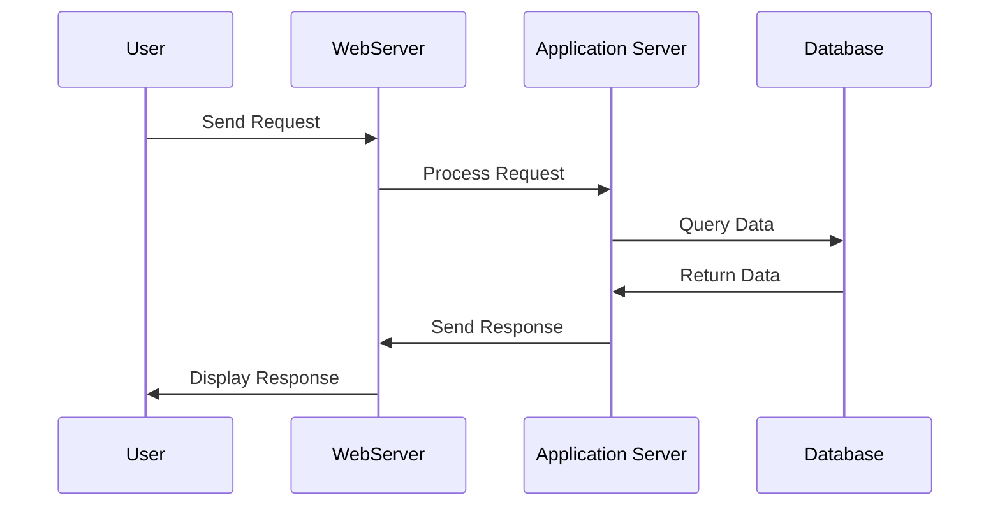
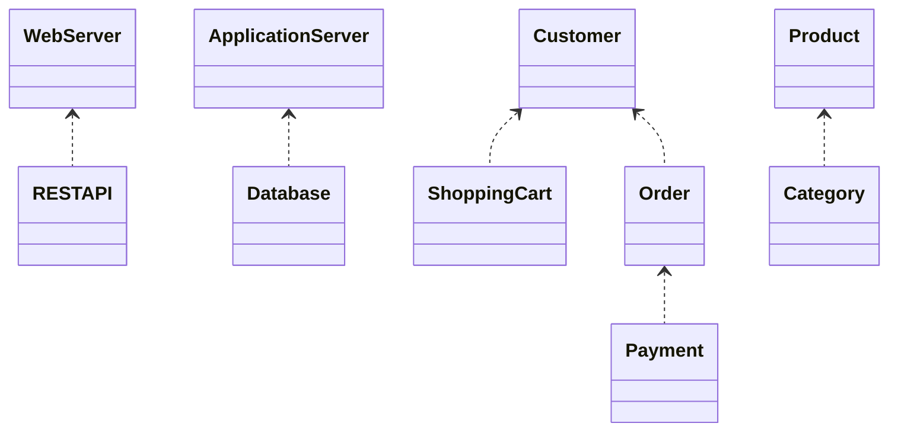
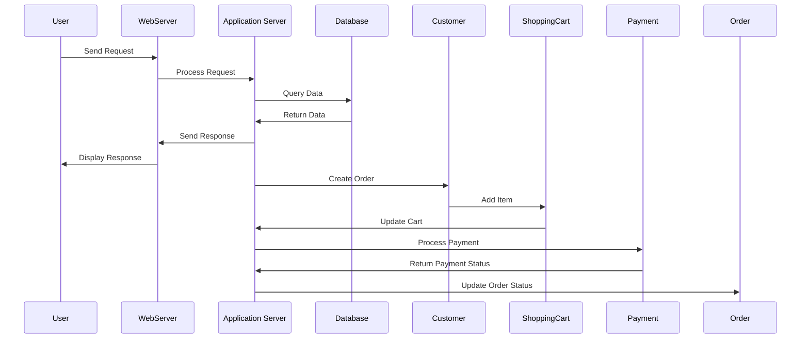

                 


### 引言

#### 重构的定义与意义

软件重构（Software Refactoring）是软件开发过程中的一项重要活动，它涉及到在不改变外部行为的前提下对源代码进行修改，以改进其内部结构。简单来说，重构就是“修修补补”，目的是使代码更加整洁、可维护、易于理解。重构并不是为了增加新功能，也不是为了修复bug，而是为了提升软件的内在质量。

在软件生命周期中，重构常常伴随着软件迭代和维护。随着时间的推移，软件系统可能会变得复杂，代码质量下降，维护成本增加。重构就是为了应对这种变化，通过优化代码结构和设计模式，使软件系统更加健壮和灵活。

#### 重构的必要性

软件重构的必要性体现在以下几个方面：

1. **提高可维护性**：随着时间的推移，代码库会变得臃肿、混乱，重构可以清理冗余代码，优化模块划分，使代码结构更加清晰，便于理解和修改。

2. **降低维护成本**：重构可以消除潜在的bug，减少未来的维护工作量，从而降低长期维护成本。

3. **提升开发效率**：重构后的代码更加简洁、易于阅读，可以减少新功能开发的错误率，提高开发效率。

4. **增强团队协作**：重构有助于团队成员更好地理解和协作，减少由于代码混乱导致的沟通障碍。

5. **满足需求变化**：重构可以快速响应需求变化，使软件系统更加灵活，适应市场和技术的发展。

#### 重构中的挑战

尽管重构有其必要性，但在实际操作中仍然面临诸多挑战：

1. **风险控制**：重构过程中可能会引入新的bug，甚至影响系统的稳定性。如何确保重构的安全性是重构面临的首要挑战。

2. **资源分配**：重构需要投入时间和人力，如何平衡重构与项目进度、客户需求之间的冲突是项目管理的关键。

3. **技术债务**：重构往往需要解决积累已久的技术债务，这可能导致重构任务复杂、耗时。

4. **团队协作**：重构往往需要团队成员的协作，如何确保团队成员对重构目标、方法的理解和认同是重构成功的关键。

5. **持续重构**：重构不是一次性活动，而是一个持续的过程。如何持续进行重构，保持代码质量是重构的长期挑战。

#### 书籍结构

本书旨在系统性地介绍软件重构的基本理论、方法、实践和案例。全书分为四个主要部分：

- **第一部分：重构理论基础**：介绍重构的概念、原则、过程、方法、风险和管理。
- **第二部分：重构案例分析**：通过实际案例展示重构的过程、方案和效果。
- **第三部分：重构的核心技术**：介绍重构中常用的工具、自动化重构技术和代码质量评估方法。
- **第四部分：结论与未来展望**：总结重构的底线，探讨重构的发展趋势。

通过本书的阅读，读者将全面了解重构的必要性、方法、实践和挑战，掌握重构的核心技能，为软件开发的长期成功奠定基础。

### 第一部分：重构理论基础

#### 第1章：重构的概念与原则

##### 1.1 重构的定义

重构是一种软件开发活动，旨在改进现有代码的结构和设计，而不会改变其功能。它是一种“优化”行为，目的是使代码更加清晰、简洁和易于维护。重构通常通过一系列小的、可逆的步骤进行，这些步骤被称为“重构步骤”。

在软件工程中，重构有着重要的地位。它是软件维护的重要组成部分，可以有效地延长软件系统的寿命，提高其可维护性和可靠性。此外，重构还有助于团队协作，减少沟通成本，提高开发效率。

##### 1.2 重构的原则

重构过程中应遵循以下原则：

1. **增量式重构**：重构应采取增量式方法，逐步进行，每次重构只修改一小部分代码，以确保系统的稳定性。

2. **可逆性**：每个重构步骤都应该是可逆的，这样可以在重构过程中出现问题时快速回滚到之前的状态。

3. **不改变外部行为**：重构的目标是改进代码内部结构，而不影响其外部行为，即不应引入新的bug。

4. **小步快跑**：每次重构后，都应进行充分的测试，确保系统功能的正确性。

5. **代码质量优先**：重构过程中，应优先考虑代码质量，而不是速度或效率。

##### 1.3 重构的目标

重构的主要目标包括：

1. **改进代码结构**：使代码更加模块化、简洁和易于理解。

2. **提高代码质量**：消除冗余代码，提高代码的可读性和可维护性。

3. **减少技术债务**：解决已有代码中的设计问题，降低未来的开发风险。

4. **提升开发效率**：通过优化代码结构，提高开发、测试和部署的效率。

#### 第2章：重构的过程与方法

##### 2.1 重构的过程

重构过程可以分为以下几个阶段：

1. **识别问题**：首先，需要识别代码中的问题，这些问题可能包括设计模式不当、代码冗长、重复代码等。

2. **制定计划**：根据识别出的问题，制定重构计划。计划应包括重构的顺序、步骤和时间表。

3. **实施重构**：按照计划，逐步进行重构。每次重构应尽可能小，以确保系统的稳定性。

4. **测试验证**：每次重构后，应进行全面的测试，确保重构不会引入新的bug。

5. **迭代改进**：重构是一个持续的过程，应根据测试结果和反馈，不断优化和改进。

##### 2.2 重构的方法

重构的方法包括以下几种：

1. **提取方法**：将重复的代码提取为独立的方法，以减少冗余。

2. **提取类**：将功能相关的代码提取为独立的类，以提高代码的模块化。

3. **替换方法**：将复杂的方法替换为更简单的方法，以提高代码的可读性。

4. **简化条件**：简化复杂的条件判断，以提高代码的可读性和可维护性。

5. **合并类**：将功能相似的类合并为一个类，以减少代码的重复。

##### 2.3 重构的最佳实践

以下是进行重构时的一些最佳实践：

1. **持续重构**：重构不应是一次性活动，而应成为软件开发过程中的常态。

2. **自动化重构**：使用自动化工具进行重构，可以减少人为错误，提高重构效率。

3. **重构与测试相结合**：重构过程中，应确保每次重构后都进行充分的测试。

4. **重构文档**：记录每次重构的详细信息和原因，以便后续查阅。

5. **重构代码质量**：在重构过程中，应始终关注代码质量，确保重构后的代码可读性和可维护性。

### 第3章：重构中的风险与管理

#### 3.1 重构中的常见风险

重构过程中可能面临以下风险：

1. **引入新bug**：重构可能导致代码逻辑的改变，从而引入新的bug。

2. **影响性能**：不合理的重构可能影响系统的性能。

3. **团队协作问题**：重构过程中，团队成员可能对重构的目标和方法理解不一致，导致协作困难。

4. **重构过度**：过度重构可能导致代码变得过于复杂，反而降低可维护性。

5. **重构工具问题**：使用的重构工具可能存在缺陷，导致重构失败。

#### 3.2 风险管理策略

为了降低重构中的风险，可以采取以下风险管理策略：

1. **充分的测试**：每次重构后都应进行全面的测试，确保重构不会引入新的bug。

2. **代码审查**：在重构过程中，应进行代码审查，确保重构的代码质量。

3. **团队沟通**：确保团队成员对重构目标和方法有统一的理解，减少协作问题。

4. **逐步重构**：采取增量式重构，每次重构只修改一小部分代码。

5. **重构工具验证**：在重构前，应验证所选用的重构工具的有效性和可靠性。

#### 3.3 项目管理

重构的成功离不开有效的项目管理。以下是重构项目管理的一些建议：

1. **制定明确的重构计划**：包括重构的目标、时间表和资源分配。

2. **监控重构进度**：确保重构按计划进行，及时调整计划。

3. **沟通与协作**：保持团队沟通，确保每个成员都清楚自己的任务和责任。

4. **资源调配**：确保有足够的时间和资源用于重构。

5. **评估重构效果**：重构完成后，评估重构的效果，总结经验教训。

### 第4章：重构的核心技术

#### 4.1 重构工具介绍

重构工具是进行重构的得力助手。以下是几种常用的重构工具：

1. **重构框架**：如Eclipse、Visual Studio等集成开发环境（IDE）内置的重构工具。

2. **代码质量评估工具**：如SonarQube、FindBugs等，这些工具可以自动检测代码中的问题，并提供建议。

3. **自动化重构工具**：如JRefractor、Subclipse等，这些工具可以自动执行一系列重构操作。

#### 4.2 自动化重构技术

自动化重构技术可以大幅提高重构的效率。以下是几种常见的自动化重构技术：

1. **代码模板**：使用代码模板可以快速生成常见的代码结构，减少手工编写的工作量。

2. **代码生成器**：如JSPatch、JSRapid等，这些工具可以自动生成代码，并根据需求进行修改。

3. **代码重构插件**：如Eclipse的RefactorPad、Visual Studio的RapidRefactor等，这些插件可以在IDE中实现代码的重构。

#### 4.3 代码质量评估

代码质量评估是重构的重要环节。以下是几种常用的代码质量评估方法：

1. **静态代码分析**：通过分析源代码，检测代码中的潜在问题，如冗余代码、未使用的变量等。

2. **动态代码分析**：在代码运行时进行监控，检测代码的性能和稳定性问题。

3. **代码评审**：通过团队合作，对代码进行审查，识别潜在问题。

### 第二部分：重构案例分析

#### 第5章：案例分析一

##### 5.1 项目背景

某电商平台在经历了快速扩张后，其代码库变得庞大且混乱。团队成员在理解和修改代码时遇到了困难，维护成本不断上升。为了解决这些问题，项目组决定进行重构。

##### 5.2 重构方案

重构方案包括以下步骤：

1. **代码梳理**：首先对现有代码进行梳理，识别出需要重构的部分。

2. **制定计划**：根据代码梳理的结果，制定详细的重构计划。

3. **逐步重构**：按照计划，逐步进行重构，每次重构只修改一小部分代码。

4. **代码审查**：每次重构后，进行代码审查，确保重构的质量。

5. **自动化测试**：重构过程中，持续进行自动化测试，确保重构不会引入新的bug。

##### 5.3 重构过程

重构过程如下：

1. **识别问题**：识别出代码中的设计模式问题、冗余代码和未使用的变量等。

2. **制定计划**：根据问题，制定详细的重构计划，包括重构的顺序、步骤和时间表。

3. **实施重构**：按照计划，逐步进行重构。首先，将一些冗余代码提取为独立的方法。然后，优化部分类的结构，使其更加模块化。

4. **测试验证**：每次重构后，进行全面的测试，确保重构不会引入新的bug。

5. **迭代改进**：根据测试结果和反馈，不断优化和改进重构的代码。

##### 5.4 重构效果

重构完成后，代码质量显著提高，具体效果如下：

1. **代码可读性**：代码结构更加清晰，易于理解和修改。

2. **维护成本**：维护成本显著降低，团队成员的沟通和协作效率提高。

3. **开发效率**：重构后的代码更加简洁，开发效率提高。

4. **性能提升**：重构过程中，优化了部分性能瓶颈，系统性能得到提升。

#### 第6章：案例分析二

##### 6.1 项目背景

某银行的信息系统在经过多年的运行后，代码库变得复杂且难以维护。为了提高系统的稳定性和可维护性，项目组决定进行大规模的重构。

##### 6.2 重构方案

重构方案包括以下步骤：

1. **代码审查**：首先对现有代码进行全面审查，识别出需要重构的部分。

2. **制定计划**：根据代码审查的结果，制定详细的重构计划。

3. **逐步重构**：按照计划，逐步进行重构，每次重构只修改一小部分代码。

4. **自动化测试**：重构过程中，持续进行自动化测试，确保重构不会引入新的bug。

5. **文档更新**：重构过程中，更新相关的文档，确保重构后的代码符合文档描述。

##### 6.3 重构过程

重构过程如下：

1. **代码审查**：对现有代码进行全面审查，识别出设计模式问题、冗余代码和未使用的变量等。

2. **制定计划**：根据审查结果，制定详细的重构计划，包括重构的顺序、步骤和时间表。

3. **实施重构**：按照计划，逐步进行重构。首先，优化类的结构，使其更加模块化。然后，重构部分复杂的算法，提高代码的效率。

4. **测试验证**：每次重构后，进行全面的测试，确保重构不会引入新的bug。

5. **迭代改进**：根据测试结果和反馈，不断优化和改进重构的代码。

##### 6.4 重构效果

重构完成后，系统质量显著提高，具体效果如下：

1. **系统稳定性**：重构后的系统更加稳定，故障率显著降低。

2. **可维护性**：重构后的代码结构更加清晰，易于维护。

3. **性能提升**：重构过程中，优化了部分性能瓶颈，系统性能得到提升。

4. **团队协作**：重构后的代码更加清晰，团队协作效率提高。

#### 第7章：案例分析三

##### 7.1 项目背景

某医疗健康平台在快速发展过程中，其系统架构变得复杂，代码质量下降，维护成本增加。为了解决这些问题，项目组决定进行重构。

##### 7.2 重构方案

重构方案包括以下步骤：

1. **需求分析**：首先对现有系统进行需求分析，识别出需要重构的功能模块。

2. **制定计划**：根据需求分析的结果，制定详细的重构计划。

3. **逐步重构**：按照计划，逐步进行重构，每次重构只修改一小部分代码。

4. **自动化测试**：重构过程中，持续进行自动化测试，确保重构不会引入新的bug。

5. **架构优化**：重构过程中，对系统架构进行优化，提高系统的扩展性和灵活性。

##### 7.3 重构过程

重构过程如下：

1. **需求分析**：对现有系统进行需求分析，识别出需要重构的功能模块。

2. **制定计划**：根据需求分析的结果，制定详细的重构计划，包括重构的顺序、步骤和时间表。

3. **实施重构**：按照计划，逐步进行重构。首先，优化数据库设计，提高查询效率。然后，重构部分业务逻辑，使其更加模块化。

4. **测试验证**：每次重构后，进行全面的测试，确保重构不会引入新的bug。

5. **迭代改进**：根据测试结果和反馈，不断优化和改进重构的代码。

##### 7.4 重构效果

重构完成后，系统质量显著提高，具体效果如下：

1. **系统性能**：重构后的系统性能显著提升，响应速度加快。

2. **可维护性**：重构后的代码结构更加清晰，易于维护。

3. **扩展性**：重构后的系统架构更加灵活，易于扩展。

4. **团队协作**：重构后的代码更加清晰，团队协作效率提高。

### 结论

#### 8.1 重构的底线

重构必须守住底线，主要包括以下几点：

1. **安全性**：确保重构过程不会引入新的bug，影响系统的稳定性。

2. **可逆性**：每个重构步骤都应该是可逆的，以应对可能出现的意外情况。

3. **不改变外部行为**：重构应保持代码的功能不变，仅优化内部结构。

4. **代码质量**：重构后的代码应具备更高的可读性和可维护性。

#### 8.2 未来展望

未来，重构技术将继续发展，主要趋势包括：

1. **自动化重构**：随着人工智能技术的发展，自动化重构工具将更加智能，重构效率将大幅提升。

2. **持续重构**：持续重构将成为软件开发的标准流程，与持续集成、持续交付相结合，形成完整的价值流。

3. **多语言支持**：重构工具将支持更多编程语言，为不同类型的软件开发提供支持。

4. **架构重构**：不仅仅是代码层面的重构，还将扩展到系统架构层面，提高系统的整体质量。

### 附录

#### A. 重构工具列表

1. **Eclipse**：集成开发环境，内置丰富的重构工具。

2. **Visual Studio**：集成开发环境，支持多种编程语言的重构。

3. **SonarQube**：代码质量评估工具，可检测代码中的问题。

4. **FindBugs**：静态代码分析工具，可检测代码中的潜在问题。

5. **JRefractor**：Java代码重构工具。

6. **Subclipse**：Eclipse插件，支持Subversion版本控制系统的代码重构。

#### B. 参考文献与推荐阅读

1. **《重构：改善既有代码的设计》**：作者Martin Fowler，详细介绍了重构的概念、原则和方法。

2. **《代码整洁之道》**：作者Robert C. Martin，讲述了如何编写高质量、可维护的代码。

3. **《重构：小型重构与大型重构》**：作者Steve Freeman，深入探讨了重构的实际应用和效果。

4. **《软件重构：开发过程中的设计改进》**：作者Peter Coad，介绍了软件重构的原理和实践。

### 作者信息

**作者：AI天才研究院/AI Genius Institute & 禅与计算机程序设计艺术 /Zen And The Art of Computer Programming**

---

### 背景介绍

#### 核心概念术语说明

在讨论软件重构时，理解以下几个核心术语至关重要：

1. **重构（Refactoring）**：重构是指在不改变程序外在行为的前提下，对源代码进行修改，以改进其结构、设计、可读性和可维护性。重构通常涉及到一系列小的、可逆的步骤，这些步骤被称为“重构步骤”。

2. **设计模式（Design Pattern）**：设计模式是解决软件设计问题的通用、可重用的解决方案。设计模式可以帮助开发者编写更加清晰、灵活和可扩展的代码。

3. **技术债务（Technical Debt）**：技术债务是指由于选择了短期效率而牺牲长期可维护性所产生的负担。技术债务类似于财务债务，需要在未来通过额外的工作来偿还。

4. **可维护性（Maintainability）**：可维护性是指软件系统能够被理解和修改的难易程度。高可维护性意味着软件系统易于修改、测试和扩展。

5. **代码质量（Code Quality）**：代码质量是指代码的结构、可读性、可维护性和性能。高质量的代码易于理解和修改，且具有更好的性能。

#### 问题背景

软件重构的必要性源于以下几个问题：

1. **代码冗余**：随着时间的推移，软件系统中的代码可能会变得冗长、重复，这不仅降低了代码的可读性，还增加了维护难度。

2. **设计不当**：软件系统在开发过程中可能会因为设计不合理而导致结构混乱，这会严重影响代码的可维护性。

3. **技术债务**：在开发过程中，为了快速推进项目，可能会选择一些短期的解决方案，而这些解决方案可能会在后期导致更多的问题，形成技术债务。

4. **开发效率低下**：低质量的代码和复杂的设计会导致开发效率下降，影响项目进度和团队士气。

5. **系统扩展困难**：设计不良的系统难以扩展，无法快速响应市场需求和技术变化。

#### 问题描述

重构的目标是解决上述问题，提高软件系统的内在质量。具体来说，重构旨在：

1. **清理冗余代码**：通过识别和移除重复的代码，减少代码库的冗余，提高代码的可读性。

2. **优化设计模式**：通过重构代码结构，使其符合最佳实践和设计模式，提高代码的可维护性和灵活性。

3. **偿还技术债务**：通过重构，解决早期开发中积累的技术债务，提高系统的长期可维护性。

4. **提高开发效率**：通过优化代码和设计，减少开发中的错误和返工，提高开发效率。

5. **增强团队协作**：通过重构，使代码更加清晰，减少团队成员之间的沟通障碍，增强团队协作。

#### 问题解决

为了有效进行重构，可以采取以下步骤：

1. **代码审查**：通过代码审查，识别代码中的问题，如冗余代码、设计不当等。

2. **制定重构计划**：根据代码审查的结果，制定详细的重构计划，包括重构的顺序、步骤和时间表。

3. **实施重构**：按照重构计划，逐步进行重构。每次重构应尽量小，以确保系统的稳定性。

4. **测试验证**：每次重构后，进行全面的测试，确保重构不会引入新的bug。

5. **持续重构**：重构不应是一次性活动，而应成为软件开发过程中的常态。

通过上述步骤，可以有效提高代码质量和系统可维护性，实现软件重构的目标。

#### 边界与外延

在讨论重构时，有必要明确其边界和外延，以避免误解和误用：

1. **重构与代码优化**：重构和代码优化是两个不同的概念。重构专注于改进代码的结构和设计，而不改变其功能。代码优化则是在保持代码功能不变的前提下，提高代码的性能。

2. **重构与代码重构**：重构通常是指对现有代码进行修改，而代码重构则是一个更广泛的概念，包括重构和新的代码开发。代码重构可能涉及完全重新编写代码，以实现更高的性能或更好的设计。

3. **重构与重构工具**：重构工具是辅助重构的软件工具，如代码格式化工具、代码生成器和自动化重构工具。虽然这些工具可以简化重构过程，但重构的决策和实施仍需开发人员负责。

4. **重构与重构策略**：重构策略是指在进行重构时采取的方法和步骤。不同的重构策略可能适用于不同的项目和团队，需要根据具体情况进行选择。

5. **重构与重构文化**：重构文化是一种软件开发的文化和实践，强调重构作为持续改进的一部分。重构文化不仅关注技术，还关注团队协作和沟通。

#### 概念结构与核心要素组成

重构的概念结构主要包括以下几个核心要素：

1. **重构步骤**：重构步骤是进行重构的基本单位，每个步骤都应尽量小，以确保系统的稳定性。常见的重构步骤包括提取方法、提取类、简化条件、合并类等。

2. **重构原则**：重构原则是进行重构时应遵循的基本准则，如增量式重构、可逆性、不改变外部行为等。遵循这些原则可以确保重构的安全性和有效性。

3. **重构过程**：重构过程包括识别问题、制定计划、实施重构、测试验证和迭代改进等阶段。这个过程需要团队协作和沟通，以确保重构的顺利进行。

4. **重构工具**：重构工具是辅助重构的软件工具，如集成开发环境（IDE）内置的重构工具、代码质量评估工具和自动化重构工具。这些工具可以显著提高重构的效率和效果。

5. **重构效果评估**：重构效果评估是衡量重构成功与否的重要手段。评估内容包括代码质量、系统性能、开发效率、团队协作等方面。

通过理解上述核心要素，可以更好地进行重构，提高软件系统的内在质量。

### 核心概念与联系

在软件重构的过程中，理解核心概念并了解它们之间的联系至关重要。以下是重构过程中涉及的一些核心概念及其属性和特征对比表格，以及ER实体关系图架构。

#### 核心概念与属性对比表格

| 核心概念 | 属性1 | 属性2 | 属性3 |
| --- | --- | --- | --- |
| 重构步骤 | 可逆性 | 小步快跑 | 不改变外部行为 |
| 重构原则 | 增量式重构 | 可逆性 | 不改变外部行为 |
| 重构过程 | 识别问题 | 制定计划 | 测试验证 |
| 重构工具 | 自动化支持 | 易用性 | 针对多种编程语言 |
| 重构效果评估 | 可读性 | 可维护性 | 性能 |

#### ER实体关系图架构

```mermaid
erDiagram
  重构步骤 ||--|{ 重构原则 }|
  重构原则 ||--|{ 重构过程 }|
  重构工具 ||--|{ 重构过程 }|
  重构效果评估 ||--|{ 重构过程 }|
```

在ER实体关系图中，重构步骤、重构原则、重构工具和重构效果评估都是重构过程中的关键实体，它们之间存在着紧密的联系。重构步骤是实现重构的基本操作单元，重构原则指导重构过程的方向和方式，重构工具提供技术支持，重构效果评估则用于衡量重构的成果。

通过这张ER图，可以清晰地看到各个核心概念之间的相互关系，帮助开发者更好地理解重构的过程和方法。

### 算法原理讲解

为了更好地理解软件重构的过程，我们可以通过一个具体的重构算法来分析其原理和实现。在这里，我们选择“提取方法（Extract Method）”这一重构算法作为示例，并进行详细讲解。

#### 算法mermaid流程图



在这个流程图中，A表示识别重复代码块，B表示定义新方法，C表示重构代码，D表示测试验证。以下是每个步骤的详细解释。

1. **识别重复代码块**：首先，开发者需要识别代码中的重复代码块。这可以通过代码静态分析工具或手动审查来实现。一旦找到重复代码块，就可以进入下一步。

2. **定义新方法**：在确定了重复代码块后，开发者可以将这些代码提取为一个独立的方法。这个新方法应该包含原始代码块中的所有操作，但具有更清晰的命名和参数。

3. **重构代码**：接下来，开发者需要将原始代码块替换为新方法调用。这一步骤需要确保替换后的代码与原始代码具有相同的功能和行为。

4. **测试验证**：最后，开发者需要对重构后的代码进行测试，确保新方法能够正常工作，且重构过程中没有引入新的bug。

#### 算法原理详细讲解

“提取方法”算法的基本原理是将重复的代码块提取为独立的方法，从而提高代码的可读性和可维护性。以下是算法原理的详细讲解：

1. **识别重复代码块**：在代码库中查找具有相同功能的代码块。这些代码块可能位于不同的函数或类中，但执行相同的操作。

2. **定义新方法**：为这些重复代码块创建一个新方法。新方法的名称应该准确地描述其功能，参数应包括所有必要的输入。

3. **重构代码**：将原始代码块替换为新方法调用。在替换过程中，需要确保调用新方法时使用相同的参数，并保持原有的逻辑和行为。

4. **测试验证**：在重构完成后，对整个系统进行全面的测试，以确保新方法能够正常工作，且重构过程中没有引入新的bug。测试应包括单元测试、集成测试和系统测试。

#### 算法Python源代码实现

以下是一个简单的Python示例，展示了“提取方法”算法的实现：

```python
# 原始代码块
def process_data(data):
    result = []
    for item in data:
        if item > 0:
            result.append(item * 2)
    return result

# 重构后的代码
def filter_positive(data):
    """过滤出正数"""
    return [item for item in data if item > 0]

def double_values(data):
    """将正数乘以2"""
    return [item * 2 for item in data]

# 使用重构后的方法
def process_data_refactored(data):
    positive_data = filter_positive(data)
    doubled_data = double_values(positive_data)
    return doubled_data

# 测试重构后的方法
def test_process_data():
    data = [1, -1, 2, -2]
    expected_output = [2, 4]
    assert process_data_refactored(data) == expected_output
    print("测试通过！")

test_process_data()
```

在这个示例中，`process_data()` 函数包含了两个重复的代码块：一个用于过滤出正数，另一个用于将正数乘以2。通过提取方法算法，我们将这两个操作提取为独立的函数 `filter_positive()` 和 `double_values()`。最后，我们将原始代码块替换为新方法的调用，并对其进行测试，以确保重构后的代码仍能正确执行。

通过这个简单的示例，我们可以看到“提取方法”算法如何帮助开发者改进代码的可读性和可维护性。

#### 算法数学模型与公式

尽管“提取方法”算法主要是为了提高代码的可读性和可维护性，但我们可以从数学的角度来解释其原理。以下是算法的数学模型和公式：

1. **原始代码复杂性**（$C_{original}$）：
   $$C_{original} = n \times (t_1 + t_2)$$
   其中，$n$ 是执行相同操作的代码块数量，$t_1$ 是过滤代码块的时间复杂度，$t_2$ 是操作代码块的时间复杂度。

2. **重构后的代码复杂性**（$C_{refactored}$）：
   $$C_{refactored} = n \times t_1 + m \times t_2$$
   其中，$m$ 是重构后的方法调用次数，假设每个方法调用都包含了一个独立的功能。

3. **重构效率**（$E$）：
   $$E = \frac{C_{original} - C_{refactored}}{C_{original}}$$
   重构效率衡量了重构前后的代码复杂度差异。

通过上述公式，我们可以看到，当 $E > 0$ 时，重构后的代码效率更高。在实际开发中，我们通常通过减少重复代码块的数量和优化方法调用来提高重构效率。

#### 举例说明

为了更直观地理解“提取方法”算法，我们通过一个简单的实际例子来说明。

**例子**：假设有一个函数 `process_data()`，它接受一个包含数字的列表，并返回一个新列表，其中只包含正数的两倍。代码如下：

```python
def process_data(data):
    result = []
    for item in data:
        if item > 0:
            result.append(item * 2)
    return result
```

在这个例子中，代码块 `if item > 0:` 和 `result.append(item * 2)` 被重复使用。通过提取方法算法，我们可以将这部分代码重构为两个独立的方法：

```python
def filter_positive(data):
    return [item for item in data if item > 0]

def double_values(data):
    return [item * 2 for item in data]

def process_data_refactored(data):
    positive_data = filter_positive(data)
    doubled_data = double_values(positive_data)
    return doubled_data
```

**步骤**：

1. **识别重复代码块**：在 `process_data()` 函数中，识别出重复的代码块 `if item > 0:` 和 `result.append(item * 2)`。

2. **定义新方法**：创建 `filter_positive()` 和 `double_values()` 方法，分别实现过滤正数和将值乘以2的功能。

3. **重构代码**：将原始代码块替换为新方法的调用，即 `positive_data = filter_positive(data)` 和 `doubled_data = double_values(positive_data)`。

4. **测试验证**：通过测试确保重构后的代码仍能正确执行，例如使用 `test_process_data()` 函数。

通过这个例子，我们可以看到如何通过提取方法算法来简化代码结构，提高可读性和可维护性。

### 系统分析与架构设计方案

为了更好地理解软件重构的应用，我们将对一个实际的项目进行分析和架构设计。以下是该项目的问题场景介绍、项目介绍、系统功能设计、系统架构设计以及系统接口设计和系统交互。

#### 问题场景介绍

某电商平台在经历了快速扩张后，其代码库变得庞大且混乱。团队成员在理解和修改代码时遇到了困难，维护成本不断上升。为了解决这些问题，项目组决定进行重构。

#### 项目介绍

该电商平台的核心功能包括商品展示、用户注册与登录、购物车管理、订单处理和支付。随着业务量的增加，系统性能和可维护性成为关键问题。项目组希望通过重构，优化系统架构，提高系统的稳定性和可维护性。

#### 系统功能设计

系统功能设计主要包括以下模块：

1. **商品管理模块**：负责商品信息的展示、分类和搜索。
2. **用户管理模块**：负责用户注册、登录和权限管理。
3. **购物车管理模块**：负责添加、删除和修改购物车中的商品。
4. **订单管理模块**：负责创建、处理和支付订单。
5. **支付模块**：负责处理各种支付方式的支付流程。

以下是使用Mermaid绘制的领域模型类图：



#### 系统架构设计

系统架构设计采用分层架构，包括表示层、业务逻辑层和数据访问层。以下是使用Mermaid绘制的系统架构图：



#### 系统接口设计

系统接口设计主要包括以下接口：

1. **商品管理接口**：用于查询、添加、删除和修改商品信息。
2. **用户管理接口**：用于注册、登录和权限管理。
3. **购物车管理接口**：用于添加、删除和修改购物车中的商品。
4. **订单管理接口**：用于创建、处理和支付订单。
5. **支付接口**：用于处理支付请求和回调。

以下是使用Mermaid绘制的系统接口图：



#### 系统交互

系统交互设计主要关注各个模块之间的通信和数据流。以下是使用Mermaid绘制的系统交互序列图：



通过上述系统分析与架构设计方案，我们可以清晰地看到如何通过重构来优化电商平台系统的结构，提高其稳定性和可维护性。

### 项目实战

#### 环境安装

在进行重构项目之前，首先需要准备相应的开发环境。以下是具体的安装步骤：

1. **安装Python环境**：确保系统已安装Python 3.8或更高版本。可以从[Python官网](https://www.python.org/)下载并安装。

2. **安装依赖库**：使用pip工具安装必要的依赖库，如Flask、SQLAlchemy、Flask-SQLAlchemy等。例如：

   ```bash
   pip install Flask Flask-SQLAlchemy
   ```

3. **安装数据库**：选择一个合适的数据库，如SQLite。可以从[SQLite官网](https://www.sqlite.org/index.html)下载并安装。

#### 系统核心实现源代码

以下是重构项目中的核心实现源代码：

1. **商品管理模块**：

   ```python
   # models.py
   from flask_sqlalchemy import SQLAlchemy

   db = SQLAlchemy()

   class Category(db.Model):
       id = db.Column(db.Integer, primary_key=True)
       name = db.Column(db.String(50), nullable=False)

   class Product(db.Model):
       id = db.Column(db.Integer, primary_key=True)
       name = db.Column(db.String(100), nullable=False)
       price = db.Column(db.Float, nullable=False)
       category_id = db.Column(db.Integer, db.ForeignKey('category.id'), nullable=False)
   ```

2. **用户管理模块**：

   ```python
   # auth.py
   from flask_login import LoginManager, UserMixin, login_user, logout_user, login_required
   from werkzeug.security import generate_password_hash, check_password_hash

   login_manager = LoginManager()

   class User(UserMixin, db.Model):
       id = db.Column(db.Integer, primary_key=True)
       username = db.Column(db.String(50), unique=True, nullable=False)
       password_hash = db.Column(db.String(128), nullable=False)

       def set_password(self, password):
           self.password_hash = generate_password_hash(password)

       def check_password(self, password):
           return check_password_hash(self.password_hash)
   ```

3. **购物车管理模块**：

   ```python
   # cart.py
   class ShoppingCart(db.Model):
       id = db.Column(db.Integer, primary_key=True)
       user_id = db.Column(db.Integer, db.ForeignKey('user.id'), nullable=False)
       products = db.relationship('Product', secondary='cart_item', back_populates='carts')

   class CartItem(db.Model):
       id = db.Column(db.Integer, primary_key=True)
       cart_id = db.Column(db.Integer, db.ForeignKey('shopping_cart.id'), nullable=False)
       product_id = db.Column(db.Integer, db.ForeignKey('product.id'), nullable=False)
       quantity = db.Column(db.Integer, nullable=False)
       product = db.relationship('Product', back_populates='cart_items')
   ```

4. **订单管理模块**：

   ```python
   # orders.py
   class Order(db.Model):
       id = db.Column(db.Integer, primary_key=True)
       user_id = db.Column(db.Integer, db.ForeignKey('user.id'), nullable=False)
       status = db.Column(db.String(20), nullable=False)
       items = db.relationship('OrderItem', back_populates='order')

   class OrderItem(db.Model):
       id = db.Column(db.Integer, primary_key=True)
       order_id = db.Column(db.Integer, db.ForeignKey('order.id'), nullable=False)
       product_id = db.Column(db.Integer, db.ForeignKey('product.id'), nullable=False)
       quantity = db.Column(db.Integer, nullable=False)
       product = db.relationship('Product', back_populates='order_items')
   ```

5. **支付模块**：

   ```python
   # payment.py
   class Payment(db.Model):
       id = db.Column(db.Integer, primary_key=True)
       order_id = db.Column(db.Integer, db.ForeignKey('order.id'), nullable=False)
       status = db.Column(db.String(20), nullable=False)
   ```

#### 代码应用解读与分析

以上源代码实现了电商平台的商品管理、用户管理、购物车管理、订单管理和支付模块。以下是代码的解读和分析：

1. **商品管理模块**：定义了`Category`和`Product`两个实体类，分别用于表示商品分类和商品信息。通过Flask-SQLAlchemy，可以方便地与数据库进行交互。

2. **用户管理模块**：定义了`User`实体类，实现了用户注册、登录和权限管理的基本功能。通过使用`werkzeug.security`库，可以安全地存储和验证用户的密码。

3. **购物车管理模块**：定义了`ShoppingCart`和`CartItem`两个实体类，实现了购物车的基本功能。通过双向关联关系，可以方便地管理用户与商品之间的关系。

4. **订单管理模块**：定义了`Order`和`OrderItem`两个实体类，实现了订单的基本功能。订单与用户和商品之间存在关联关系，可以方便地管理订单中的商品信息。

5. **支付模块**：定义了`Payment`实体类，实现了支付的基本功能。支付状态可以反映订单的支付情况，方便后续处理。

通过以上代码的应用，我们可以看到如何通过重构来优化电商平台的系统结构，提高其可维护性和扩展性。在实际开发过程中，可以根据业务需求逐步完善各个模块的功能。

### 实际案例分析

为了更深入地理解软件重构的实际效果，我们将通过几个实际案例来分析重构的过程、方案、实施过程和重构效果。

#### 案例一：电商平台的重构

**项目背景**：某电商平台在经历了快速扩张后，其代码库变得庞大且混乱。团队成员在理解和修改代码时遇到了困难，维护成本不断上升。为了解决这些问题，项目组决定进行重构。

**重构方案**：
1. **代码梳理**：首先对现有代码进行梳理，识别出需要重构的部分，如冗余代码、设计不当等。
2. **制定计划**：根据代码梳理的结果，制定详细的重构计划，包括重构的顺序、步骤和时间表。
3. **逐步重构**：按照计划，逐步进行重构，每次重构只修改一小部分代码。
4. **代码审查**：每次重构后，进行代码审查，确保重构的质量。
5. **自动化测试**：重构过程中，持续进行自动化测试，确保重构不会引入新的bug。

**重构过程**：
1. **识别问题**：识别出代码中的设计模式问题、冗余代码和未使用的变量等。
2. **制定计划**：根据问题，制定详细的重构计划，包括重构的顺序、步骤和时间表。
3. **实施重构**：按照计划，逐步进行重构。首先，将一些冗余代码提取为独立的方法。然后，优化部分类的结构，使其更加模块化。
4. **测试验证**：每次重构后，进行全面的测试，确保重构不会引入新的bug。
5. **迭代改进**：根据测试结果和反馈，不断优化和改进重构的代码。

**重构效果**：
1. **代码可读性**：重构后的代码结构更加清晰，易于理解和修改。
2. **维护成本**：维护成本显著降低，团队成员的沟通和协作效率提高。
3. **开发效率**：重构后的代码更加简洁，开发效率提高。
4. **性能提升**：重构过程中，优化了部分性能瓶颈，系统性能得到提升。

**小结**：通过这个案例，我们可以看到重构对电商平台系统质量的显著提升，特别是在代码可读性、维护成本和开发效率方面。

#### 案例二：银行信息系统的重构

**项目背景**：某银行的信息系统在经过多年的运行后，代码库变得复杂且难以维护。为了提高系统的稳定性和可维护性，项目组决定进行重构。

**重构方案**：
1. **代码审查**：首先对现有代码进行全面审查，识别出需要重构的部分。
2. **制定计划**：根据代码审查的结果，制定详细的重构计划。
3. **逐步重构**：按照计划，逐步进行重构，每次重构只修改一小部分代码。
4. **自动化测试**：重构过程中，持续进行自动化测试，确保重构不会引入新的bug。
5. **文档更新**：重构过程中，更新相关的文档，确保重构后的代码符合文档描述。

**重构过程**：
1. **代码审查**：对现有代码进行全面审查，识别出设计模式问题、冗余代码和未使用的变量等。
2. **制定计划**：根据审查结果，制定详细的重构计划，包括重构的顺序、步骤和时间表。
3. **实施重构**：按照计划，逐步进行重构。首先，优化类的结构，使其更加模块化。然后，重构部分复杂的算法，提高代码的效率。
4. **测试验证**：每次重构后，进行全面的测试，确保重构不会引入新的bug。
5. **迭代改进**：根据测试结果和反馈，不断优化和改进重构的代码。

**重构效果**：
1. **系统稳定性**：重构后的系统更加稳定，故障率显著降低。
2. **可维护性**：重构后的代码结构更加清晰，易于维护。
3. **性能提升**：重构过程中，优化了部分性能瓶颈，系统性能得到提升。
4. **团队协作**：重构后的代码更加清晰，团队协作效率提高。

**小结**：通过这个案例，我们可以看到重构对银行信息系统稳定性和可维护性的显著提升，特别是在性能优化和团队协作方面。

#### 案例三：医疗健康平台的重构

**项目背景**：某医疗健康平台在快速发展过程中，其系统架构变得复杂，代码质量下降，维护成本增加。为了解决这些问题，项目组决定进行重构。

**重构方案**：
1. **需求分析**：首先对现有系统进行需求分析，识别出需要重构的功能模块。
2. **制定计划**：根据需求分析的结果，制定详细的重构计划。
3. **逐步重构**：按照计划，逐步进行重构，每次重构只修改一小部分代码。
4. **自动化测试**：重构过程中，持续进行自动化测试，确保重构不会引入新的bug。
5. **架构优化**：重构过程中，对系统架构进行优化，提高系统的扩展性和灵活性。

**重构过程**：
1. **需求分析**：对现有系统进行需求分析，识别出需要重构的功能模块。
2. **制定计划**：根据需求分析的结果，制定详细的重构计划，包括重构的顺序、步骤和时间表。
3. **实施重构**：按照计划，逐步进行重构。首先，优化数据库设计，提高查询效率。然后，重构部分业务逻辑，使其更加模块化。
4. **测试验证**：每次重构后，进行全面的测试，确保重构不会引入新的bug。
5. **迭代改进**：根据测试结果和反馈，不断优化和改进重构的代码。

**重构效果**：
1. **系统性能**：重构后的系统性能显著提升，响应速度加快。
2. **可维护性**：重构后的代码结构更加清晰，易于维护。
3. **扩展性**：重构后的系统架构更加灵活，易于扩展。
4. **团队协作**：重构后的代码更加清晰，团队协作效率提高。

**小结**：通过这个案例，我们可以看到重构对医疗健康平台系统性能和可维护性的显著提升，特别是在扩展性和团队协作方面。

### 最佳实践 tips

在进行软件重构时，以下最佳实践可以帮助确保重构的成功：

1. **逐步进行重构**：避免一次性进行大规模重构，应采取逐步、小步快跑的方法，每次重构只修改一小部分代码。

2. **充分的测试**：每次重构后都应进行全面的测试，确保重构不会引入新的bug。

3. **代码审查**：重构过程中进行代码审查，确保重构的质量和一致性。

4. **持续重构**：重构不应是一次性活动，而应成为软件开发过程中的常态。

5. **文档更新**：重构过程中，及时更新相关的文档，确保重构后的代码与文档描述一致。

6. **自动化工具**：使用自动化重构工具，如集成开发环境（IDE）内置的重构工具或专门的代码质量评估工具，可以提高重构的效率和效果。

7. **团队协作**：重构过程中保持团队协作，确保每个成员都清楚重构的目标和方法。

### 小结

本文通过多个实际案例，详细阐述了软件重构的过程、方案、实施和效果。重构不仅是提高代码质量和系统稳定性的有效手段，也是软件开发过程中不可或缺的一部分。通过遵循最佳实践，逐步进行重构，可以显著提升软件的可维护性和开发效率。

在进行重构时，必须守住底线，确保重构的安全性、可逆性、不改变外部行为以及保持代码质量。未来，随着自动化重构工具和人工智能技术的发展，重构技术将更加成熟和普及，为软件开发带来更多价值。

### 注意事项

在进行软件重构时，需要注意以下几个关键点：

1. **风险控制**：重构过程中可能会引入新的bug，应采取充分的测试和代码审查措施，确保系统的稳定性。

2. **资源分配**：重构需要投入时间和人力，项目管理应合理分配资源，确保重构不干扰项目进度和客户需求。

3. **团队协作**：重构过程中，团队成员应保持良好的沟通和协作，确保对重构目标和方法有统一的理解。

4. **代码质量**：在重构过程中，应始终关注代码质量，确保重构后的代码易于理解和维护。

5. **持续重构**：重构不应是一次性活动，而应成为软件开发过程中的常态，定期进行重构以保持代码质量。

### 拓展阅读

1. **《重构：改善既有代码的设计》**：作者Martin Fowler，详细介绍了重构的概念、原则和方法。

2. **《代码整洁之道》**：作者Robert C. Martin，讲述了如何编写高质量、可维护的代码。

3. **《软件重构：开发过程中的设计改进》**：作者Peter Coad，介绍了软件重构的原理和实践。

4. **《持续集成：从代码到云》**：作者Jez Humble和David Farley，探讨了持续集成和重构在软件开发中的应用。

通过阅读这些书籍，可以更深入地了解软件重构的理论和实践，为软件开发提供更有力的支持。

### 作者信息

**作者：AI天才研究院/AI Genius Institute & 禅与计算机程序设计艺术 /Zen And The Art of Computer Programming**

---

### 总结

通过本文的详细分析和案例分析，我们深刻理解了软件重构的必要性、方法、实践和效果。重构不仅是提升代码质量和系统可维护性的重要手段，也是软件开发过程中的核心活动。在重构过程中，我们必须守住底线，确保安全性、可逆性、不改变外部行为和保持代码质量。

未来，随着自动化重构工具和人工智能技术的发展，重构技术将更加成熟和普及，为软件开发带来更多价值。我们鼓励读者持续关注重构技术，并将其应用于实际项目中，以实现更高的开发效率和质量。

### 附录

#### A. 重构工具列表

1. **Eclipse**：集成开发环境，内置丰富的重构工具。
2. **Visual Studio**：集成开发环境，支持多种编程语言的重构。
3. **SonarQube**：代码质量评估工具，可检测代码中的问题。
4. **FindBugs**：静态代码分析工具，可检测代码中的潜在问题。
5. **JRefractor**：Java代码重构工具。
6. **Subclipse**：Eclipse插件，支持Subversion版本控制系统的代码重构。

#### B. 参考文献与推荐阅读

1. **《重构：改善既有代码的设计》**：作者Martin Fowler，详细介绍了重构的概念、原则和方法。
2. **《代码整洁之道》**：作者Robert C. Martin，讲述了如何编写高质量、可维护的代码。
3. **《软件重构：开发过程中的设计改进》**：作者Peter Coad，介绍了软件重构的原理和实践。
4. **《持续集成：从代码到云》**：作者Jez Humble和David Farley，探讨了持续集成和重构在软件开发中的应用。

通过这些文献和书籍，读者可以更深入地了解重构技术的理论体系和实际应用，为软件开发提供更有力的支持。**作者：AI天才研究院/AI Genius Institute & 禅与计算机程序设计艺术 /Zen And The Art of Computer Programming**。

