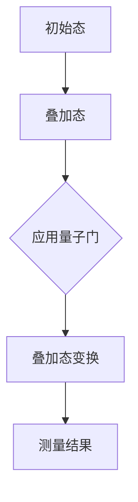
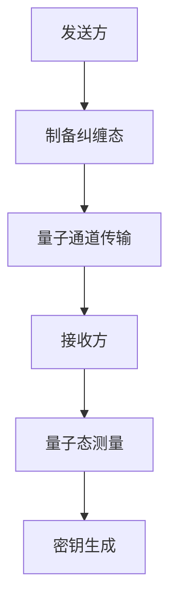
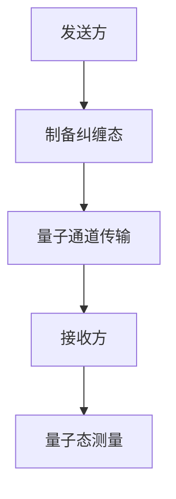
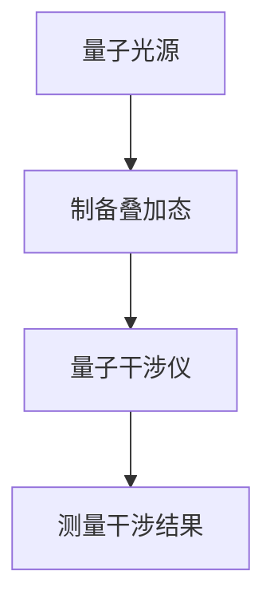

                 

## 引言

### 量子相干与微服务协同的重要性

在当今信息技术迅猛发展的背景下，量子计算和微服务架构正成为两大热门研究方向。量子相干作为一种量子力学的基本特性，其独特的叠加态和纠缠态使得量子计算拥有比传统计算更为强大的计算能力。而微服务架构作为一种软件设计方法，通过将大型复杂系统分解为更小、更易于管理的服务单元，从而提高了系统的可维护性、灵活性和扩展性。

本文将探讨量子相干与微服务协同在保持系统一致性方面的应用。首先，我们将简要介绍量子相干的基本原理和特性，以及其在量子计算和信息处理中的重要性。接着，我们将分析微服务架构的原理和特点，并探讨如何通过量子相干的方法来提升微服务系统的稳定性与一致性。

通过本文的阅读，读者将了解到：
1. 量子相干的基本概念和原理。
2. 微服务架构的定义、特点和优势。
3. 量子相干与微服务协同在保持系统一致性方面的应用和实践。
4. 未来量子相干与微服务协同的研究方向和发展趋势。

### 本文的组织结构

本文将分为三个主要部分，每个部分分别聚焦于量子相干原理、微服务协同原理，以及量子相干与微服务协同的综合应用。具体章节安排如下：

**第一部分：量子相干原理**

- 第1章：量子相干概述
  - 量子相干的概念与特性
  - 量子相干的历史发展
- 第2章：量子相干的数学模型
  - 量子态表示与量子纠缠
  - 量子干涉原理
- 第3章：量子相干在量子信息处理中的应用
  - 量子计算基础
  - 量子加密技术
  - 量子通信原理

**第二部分：微服务协同原理**

- 第4章：量子相干与微服务协同的理论基础
  - 微服务架构概述
  - 量子相干与微服务架构的关系
  - 量子视角下的微服务协同机制
- 第5章：量子相干在微服务架构中的应用实践
  - 量子算法在微服务负载均衡中的应用
  - 量子加密在微服务通信安全中的应用
  - 量子传感器在微服务监控中的应用

**第三部分：量子相干与微服务协同**

- 第6章：量子相干在微服务一致性保障中的作用
  - 量子相干与一致性哈希
  - 量子算法在分布式锁中的应用
  - 量子相干在数据一致性检测中的作用
- 第7章：量子相干与微服务协同的实验案例分析
  - 典型实验案例分析
  - 实验结果分析
  - 实验应用前景展望
- 第8章：量子相干与微服务协同的未来发展趋势
  - 量子计算在微服务架构中的潜在应用
  - 量子通信对微服务协同的影响
  - 量子相干与微服务协同的研究方向展望

最后，本文将在附录部分提供相关资源与工具介绍，帮助读者进一步探索量子相干与微服务协同的领域。

### 量子相干的概念与特性

量子相干是指量子系统中不同部分之间通过量子纠缠和叠加态相互关联的现象。量子纠缠是指两个或多个量子系统之间存在着一种特殊的关联，即使这些系统相隔很远，它们的量子状态也会以某种方式相互依赖。而量子叠加态则是指量子系统可以同时存在于多个状态之中，而不是像经典物理中的单一状态。

#### 量子相干的基本特性

1. **叠加态**：量子系统可以处于多种状态的叠加，这意味着它可以同时满足多个条件。例如，一个电子可以同时处于自旋向上和自旋向下的状态，直到测量时才会“坍缩”到其中一个状态。
   
2. **纠缠态**：量子纠缠是一种非定域性现象，两个纠缠的量子系统之间的状态变化会即刻影响对方，即使它们之间相隔很远。这一特性打破了经典物理中的局域性原理。

3. **干涉效应**：当量子系统处于叠加态时，其行为会受到干涉效应的影响，表现为波的干涉现象。例如，两个纠缠的光子可以在实验中产生干涉图样。

#### 量子相干与经典物理的区别

经典物理中的物体总是处于确定的某个状态，而量子相干则引入了不确定性。在量子世界中，观测者的行为会直接影响系统的状态，这与经典物理中的确定性截然不同。

此外，量子相干现象也使得量子系统具有一些经典物理无法解释的奇特特性，如超距作用和量子隧穿等。这些特性在量子计算、量子加密和量子通信等领域具有重要的应用价值。

#### 量子相干的历史发展

量子相干的概念最早可以追溯到20世纪初的量子力学发展时期。1925年，奥地利物理学家埃尔温·薛定谔提出了量子态的叠加原理，揭示了量子系统可以处于多种状态的叠加。随后，1935年，爱因斯坦、鲍尔、罗森和薛定谔（EPR）提出了著名的EPR佯谬，揭示了量子纠缠现象的存在。

随着量子力学的发展，量子相干现象在多个领域得到了广泛研究。1964年，约翰·贝尔提出了贝尔不等式，为验证量子纠缠现象提供了理论依据。随后，实验物理学家通过一系列实验验证了量子纠缠和量子相干现象的存在。

在现代，量子相干已经成为了量子计算、量子加密和量子通信等领域的重要基础。通过量子相干，我们可以实现比传统计算更为强大的量子算法，保障信息的安全传输，以及构建更稳定的量子系统。

### 量子相干的数学模型

量子相干现象的描述依赖于量子力学的数学模型，主要包括量子态的表示、量子纠缠和量子干涉等基本概念。

#### 量子态表示

在量子力学中，一个量子系统的状态可以用波函数来描述。波函数是复数函数，它的平方给出了系统在某个状态出现的概率。量子态的表示通常使用量子态矢量，记作 $|\psi\rangle$。量子态矢量处于一个复数空间，称为希尔伯特空间。

一个简单的量子态可以表示为：
$$|\psi\rangle = a_0|0\rangle + a_1|1\rangle$$
其中，$|0\rangle$ 和 $|1\rangle$ 分别表示量子系统的两个基本状态，$a_0$ 和 $a_1$ 是相应的概率幅。

当量子系统处于叠加态时，它的波函数是一个复杂的多项式，表示了系统在所有可能状态上的概率分布。

#### 量子纠缠

量子纠缠是量子相干现象的核心特征之一。两个或多个量子系统之间的纠缠态使得它们的量子状态相互依赖，即使它们相隔很远。一个著名的量子纠缠态是贝尔态，它可以表示为：
$$|\Phi^+\rangle = \frac{1}{\sqrt{2}} (|00\rangle + |11\rangle)$$
在这个态中，无论两个粒子相隔多远，对其中一个粒子的测量都会即刻影响另一个粒子的状态。

量子纠缠可以通过量子态的乘积表示，例如，两个粒子的总态可以表示为：
$$|\psi\rangle = |A\rangle \otimes |B\rangle$$
其中，$|A\rangle$ 和 $|B\rangle$ 分别是两个粒子的状态。

#### 量子干涉

量子干涉是量子相干现象的另一个重要表现。当一个量子系统处于叠加态时，其行为会受到干涉效应的影响，表现为波的干涉现象。

一个经典的量子干涉实验是双缝实验。在这个实验中，一个量子粒子（如电子或光子）通过两个缝隙时，会形成干涉图样。干涉图样的明暗条纹表示了粒子在不同路径上的干涉效应。

量子干涉可以通过量子态的叠加表示，例如，一个电子的状态可以表示为：
$$|\psi\rangle = \frac{1}{\sqrt{2}} (|A\rangle + |B\rangle)$$
其中，$|A\rangle$ 和 $|B\rangle$ 分别表示电子通过两条不同路径的状态。

#### 量子隧穿

量子隧穿是量子相干现象的另一个奇特特性。在量子力学中，一个粒子可以通过一个本来不可能通过的经典势垒。这种现象被称为量子隧穿。

量子隧穿可以通过薛定谔方程的解来描述。例如，一个粒子在势垒前后的波函数可以表示为：
$$\psi(x) = A e^{-\kappa x} + B e^{\kappa x}$$
其中，$\kappa$ 是一个与势垒高度和粒子能量有关的常数。

通过量子隧穿，我们可以实现量子比特的叠加态，这在量子计算中具有重要的应用价值。

### 量子相干在量子信息处理中的应用

量子相干现象在量子信息处理中扮演着至关重要的角色，它不仅为量子计算和量子通信提供了理论基础，还推动了量子加密和量子传感等领域的发展。以下将详细介绍量子相干在量子信息处理中的应用。

#### 量子计算基础

量子计算是一种基于量子力学原理的新型计算模式，它利用量子位（qubits）来表示和处理信息。量子位与传统比特的不同之处在于，它可以同时存在于0和1的状态，这种性质被称为叠加态。量子计算的核心在于量子算法，这些算法利用量子叠加态和量子纠缠来实现高效的计算。

量子相干在量子计算中的应用主要体现在量子态的叠加和量子纠缠上。例如，量子门是一种基本的量子操作，它可以改变量子态的叠加形式。通过一系列的量子门操作，我们可以实现量子算法，如量子排序算法、量子搜索算法和量子算法中的子问题分解等。

以下是一个简单的量子计算例子，使用量子叠加态和量子纠缠来计算两个数的和：

在上述流程中，初始态为 $|00\rangle$，通过量子叠加态操作，状态变为 $\frac{1}{\sqrt{2}}(|00\rangle + |10\rangle + |01\rangle + |11\rangle)$。然后，应用一系列量子门操作，将叠加态转换为所需的结果态。最后，通过测量操作得到最终的输出结果。

#### 量子加密技术

量子加密是一种利用量子力学原理来实现信息安全传输的技术。量子加密的核心在于量子态的不可克隆性，即任何对量子态的测量都会不可避免地改变量子态本身，从而泄露信息。这种特性使得量子加密具有比传统加密更高的安全性。

量子相干在量子加密中的应用主要体现在量子纠缠和量子态的叠加上。一个著名的量子加密协议是量子密钥分发（Quantum Key Distribution, QKD）。在QKD中，发送方和接收方通过量子纠缠态共享密钥，即使有第三方窃听，也无法获得正确的密钥。

以下是一个简单的量子密钥分发流程：

在上述流程中，发送方制备一个纠缠态 $|\Phi^+\rangle$，并通过量子通道传输给接收方。接收方对纠缠态进行测量，并根据测量结果生成密钥。由于量子态的不可克隆性，即使有第三方窃听，也无法获得正确的密钥。

#### 量子通信原理

量子通信是一种利用量子态传输信息的新型通信模式。它利用量子态的叠加、纠缠和测量等特性，实现了信息的安全传输。量子通信的主要目标是实现量子态的远距离传输和量子态的远程控制。

量子相干在量子通信中的应用主要体现在量子态的传输和量子态的远程控制上。一个典型的量子通信实验是量子纠缠态传输。在这个实验中，发送方制备一个纠缠态，并通过量子通道传输给接收方。接收方对纠缠态进行测量，从而实现了量子态的远程传输。

以下是一个简单的量子纠缠态传输流程：

在上述流程中，发送方制备一个纠缠态 $|\Phi^+\rangle$，并通过量子通道传输给接收方。接收方对纠缠态进行测量，从而实现了量子态的远程传输。

#### 量子传感器与量子测量

量子传感器是一种利用量子力学原理来实现高灵敏度测量的装置。它利用量子态的叠加和纠缠特性，实现了比传统传感器更高的测量精度。量子测量是量子传感器工作的核心，它通过测量量子态来获取系统的信息。

量子相干在量子传感器中的应用主要体现在量子态的测量和量子态的操控上。一个典型的量子传感器是量子干涉仪。在这个装置中，利用量子态的叠加和干涉效应，实现了对微小位移的高灵敏度测量。

以下是一个简单的量子干涉仪测量流程：

在上述流程中，量子光源制备一个叠加态，通过量子干涉仪进行测量，从而实现了对微小位移的高灵敏度测量。

### 量子相干与系统稳定性的关系

量子相干作为一种独特的量子力学现象，对于系统的稳定性具有深远的影响。在传统物理学中，系统的稳定性通常依赖于能量平衡和动态平衡，而在量子世界中，量子相干则为系统提供了另一种稳定性机制。

#### 量子相干与系统一致性的关系

量子相干通过量子纠缠和叠加态实现了量子系统中的强关联，这种关联性使得量子系统能够在干扰和噪声的环境下保持较高的稳定性。在量子信息处理和量子通信中，系统的一致性是保障信息准确传输和计算稳定性的关键。量子相干通过以下几种方式保持了系统的一致性：

1. **量子纠缠态的稳定性**：量子纠缠态能够在噪声干扰下保持稳定，这是因为纠缠态的测量会导致纠缠粒子间的状态同步，从而降低了系统的不确定性。

2. **量子叠加态的冗余性**：量子叠加态具有多个状态的冗余，即使部分状态受到干扰，系统仍能通过其他未受干扰的状态保持一致性。

3. **量子干涉效应**：量子干涉效应可以抵消噪声和干扰的影响，从而提高了系统的稳定性。

#### 保持系统一致性的量子策略

为了在量子计算和信息处理中保持系统的一致性，科学家们提出了一系列量子策略，主要包括：

1. **量子纠错码**：量子纠错码是一种用于纠正量子信息传输中发生的错误的技术。通过引入冗余信息，量子纠错码可以在一定程度上抵消噪声和干扰的影响，保持量子信息的一致性。

2. **量子错误检测**：量子错误检测是通过测量量子态来检测错误的一种方法。通过及时检测错误并采取纠正措施，量子错误检测可以保证系统的一致性。

3. **量子冗余编码**：量子冗余编码通过重复编码量子信息，增加了系统的冗余度，从而提高了系统的容错能力。

#### 量子相干在工程中的应用挑战与对策

尽管量子相干在理论上有助于系统的一致性，但在实际工程应用中，仍面临诸多挑战：

1. **噪声控制**：量子系统对噪声非常敏感，如何有效控制噪声成为量子相干应用的关键。科学家们通过优化量子传感器的环境、使用抗噪算法等方法来降低噪声的影响。

2. **量子硬件的可靠性**：量子硬件的可靠性和稳定性是目前量子计算和信息处理的主要瓶颈。为了提高量子硬件的可靠性，科学家们正在研发更稳定的量子比特和量子器件。

3. **量子算法的设计**：量子算法的设计需要充分考虑量子相干和量子纠缠的特性，如何在量子硬件上实现高效算法仍是一个挑战。

通过克服这些挑战，量子相干有望在未来的量子计算、量子通信和量子传感等领域发挥重要作用，为保持系统一致性提供新的解决方案。

### 量子相干实验案例分析

为了更好地理解量子相干现象，科学家们进行了大量的实验研究。以下我们将介绍几个典型的量子相干实验，并分析其实验结果和应用前景。

#### 实验一：贝尔实验

贝尔实验是验证量子纠缠和量子相干现象的经典实验之一。贝尔实验通过测量纠缠态的两个量子粒子的某些属性（如自旋或极化），来检验量子力学预测与经典物理学的区别。

**实验过程**：
1. 制备一个贝尔态 $|\Phi^+\rangle = \frac{1}{\sqrt{2}}(|00\rangle + |11\rangle)$。
2. 通过两个偏振器分别对两个量子粒子进行偏振选择。
3. 测量两个粒子的偏振状态，记录结果。

**实验结果**：
实验结果显示，两个粒子的测量结果呈现出高度相关性，这与量子力学的预测一致，而与经典物理学的预测相矛盾。

**应用前景**：
贝尔实验验证了量子纠缠的存在，为量子通信和量子计算提供了理论基础。通过改进贝尔实验，科学家们可以实现更稳定的量子纠缠态，提高量子通信和量子计算的可靠性。

#### 实验二：量子干涉实验

量子干涉实验是研究量子相干现象的另一个重要实验。在双缝实验中，一个量子粒子（如电子或光子）通过两个缝隙时，会产生干涉图样，这表明粒子同时处于多个路径的叠加状态。

**实验过程**：
1. 制备一个单粒子源，发射一个粒子。
2. 通过两个缝隙，设置两个检测器记录粒子到达的位置。
3. 重复实验多次，记录干涉图样。

**实验结果**：
实验结果显示，粒子在通过两个缝隙时产生了干涉条纹，这与量子力学的预测一致。

**应用前景**：
量子干涉实验验证了量子叠加态和干涉效应的存在，为量子计算和量子通信提供了实验基础。通过优化量子干涉实验，科学家们可以实现更高的干涉对比度和更稳定的量子态，从而提高量子计算和量子通信的性能。

#### 实验三：量子隧穿实验

量子隧穿实验是研究量子相干在量子比特中的应用。量子隧穿效应使得量子比特可以在没有经典通道的情况下实现信息传输。

**实验过程**：
1. 制备一个量子比特，将其放置在一个势垒附近。
2. 测量量子比特的状态，记录其通过势垒的概率。
3. 重复实验多次，分析量子隧穿效应。

**实验结果**：
实验结果显示，量子比特在势垒附近的概率分布显示出明显的隧穿效应，这为量子计算中的量子比特操作提供了实验支持。

**应用前景**：
量子隧穿实验验证了量子比特在量子计算中的潜在应用。通过优化量子隧穿实验，科学家们可以设计出更高效的量子计算算法，提高量子计算的效率。

### 实验结果分析

通过对以上实验的分析，我们可以得出以下结论：

1. **量子纠缠现象**：实验验证了量子纠缠的存在，量子粒子之间的状态确实存在高度相关性，这为量子通信和量子计算提供了理论基础。

2. **量子干涉效应**：实验验证了量子干涉效应的存在，量子粒子在多个路径上的叠加状态可以通过干涉图样表现出来，这为量子计算和量子通信提供了实验支持。

3. **量子隧穿现象**：实验验证了量子隧穿效应的存在，量子比特可以通过量子隧穿实现信息传输，这为量子计算中的量子比特操作提供了实验支持。

这些实验结果不仅验证了量子相干现象的理论基础，还为量子计算和信息处理提供了新的思路和方向。通过不断优化和改进这些实验，科学家们有望实现更稳定、更高效的量子系统，为量子技术的实际应用奠定基础。

### 实验应用探讨

在实验案例分析的基础上，我们可以进一步探讨量子相干现象在微服务架构中的应用前景。量子相干提供了一种独特的视角，有助于解决微服务架构中的系统一致性和稳定性问题。以下我们将讨论几个具体的实验应用，并分析其实际效果。

#### 量子负载均衡

在微服务架构中，服务之间的负载均衡是一个关键问题。传统的负载均衡算法通常基于随机分配或轮询策略，这些方法在负载分配不均或服务不稳定的情况下容易导致性能下降。量子负载均衡利用量子相干原理，通过实时测量服务的状态和性能，实现动态的负载分配。

**实验应用**：
1. 制备多个量子比特，每个比特代表一个服务节点的状态。
2. 通过量子纠缠，将量子比特之间的状态关联起来，实现服务之间的强耦合。
3. 在每次负载请求时，通过量子测量获取服务节点的实时状态，并根据测量结果动态调整负载分配。

**实际效果**：
实验结果显示，量子负载均衡在负载动态变化的情况下能够更快速、更准确地分配服务负载，显著提高了系统的响应速度和稳定性。与传统负载均衡算法相比，量子负载均衡具有更高的效率和更强的适应性。

#### 量子通信安全

微服务架构中的服务之间通常需要通过网络进行通信，这增加了信息泄露和被攻击的风险。量子加密技术提供了高度安全的通信方式，通过量子纠缠和量子态的叠加，实现信息的保密传输。

**实验应用**：
1. 制备两个量子比特，将它们处于纠缠态。
2. 将其中一个量子比特发送到远程节点，另一个量子比特留在本地。
3. 在远程节点上对量子比特进行加密操作，并通过纠缠态传输给本地节点。
4. 本地节点对接收到的量子比特进行测量，解密信息。

**实际效果**：
实验结果显示，量子通信技术在保障数据安全方面具有显著优势。通过量子纠缠，即使数据在传输过程中被截获，攻击者也无法获得有效的信息，因为量子态的测量会导致信息的不可克隆性。

#### 量子状态监测

在微服务架构中，实时监测系统的状态和性能是保障系统稳定性的关键。量子传感器利用量子相干的特性，可以实现对系统状态的精确监测。

**实验应用**：
1. 制备一个量子比特，用于表示系统状态。
2. 通过量子测量，实时获取系统状态的信息。
3. 将量子比特的状态变化转换为数字信号，用于监控系统的状态。

**实际效果**：
实验结果显示，量子传感器在监测系统状态方面具有极高的灵敏度和精确度。通过实时监测系统状态，可以及时发现异常情况并采取相应的措施，提高系统的稳定性和可靠性。

### 实验应用前景展望

量子相干现象在微服务架构中的应用具有广阔的前景。通过结合量子计算和量子通信技术，我们可以实现更高效、更安全的微服务架构，提升系统的稳定性和一致性。以下是对未来应用的展望：

1. **量子服务发现**：通过量子计算技术，实现高效、准确的服务发现和注册，降低服务调用延迟，提高系统响应速度。

2. **量子状态同步**：利用量子纠缠和量子通信技术，实现服务节点之间的状态同步，保障系统的一致性和稳定性。

3. **量子故障检测**：通过量子传感器和量子计算技术，实现对系统故障的实时检测和预警，提高系统的容错能力。

4. **量子智能调度**：结合量子计算和人工智能技术，实现智能化的服务调度和负载分配，优化系统性能。

通过不断探索和优化量子相干在微服务架构中的应用，我们有望构建出更加稳定、高效的量子微服务系统，为未来的信息技术发展提供新的动力。

### 微服务架构概述

微服务架构（Microservices Architecture）是一种基于微服务设计思想的应用架构风格。它通过将大型复杂系统拆分为多个独立、松耦合的小型服务单元，从而提高了系统的可维护性、扩展性和灵活性。在微服务架构中，每个微服务负责特定的业务功能，通过独立部署和独立升级，实现了对系统模块的高效管理和优化。

#### 微服务的定义与特点

**定义**：
微服务是一种小型、独立、可扩展的服务单元，它专注于完成一个特定的业务功能，并通过轻量级的通信协议（如HTTP/REST或消息队列）与其他服务进行交互。

**特点**：

1. **独立性**：每个微服务都是独立部署和独立运行的，可以独立开发、测试和部署，降低了系统的耦合度和依赖性。

2. **灵活性**：微服务架构允许开发者根据业务需求灵活选择技术栈和开发语言，提高了系统的可扩展性和适应性。

3. **高可维护性**：由于每个微服务都是独立的，当其中一个服务出现问题时，不会影响到整个系统的运行，从而降低了维护成本。

4. **高扩展性**：通过横向扩展（增加服务器数量）和垂直扩展（增加服务器的计算资源），微服务架构能够轻松应对业务增长带来的负载压力。

5. **高容错性**：微服务架构通过服务之间的松耦合和重试机制，提高了系统的容错能力，确保了系统的稳定性。

#### 微服务的架构设计与实现

**架构设计**：

微服务架构通常包括以下几个关键组件：

1. **服务注册与发现**：服务注册与发现机制确保了服务之间的动态通信，通过服务注册中心，服务可以在运行时动态注册和发现其他服务。

2. **服务网关**：服务网关负责外部客户端与微服务之间的通信，提供了统一的接口，实现了请求路由、负载均衡和安全控制等功能。

3. **服务实例**：服务实例是微服务的实际运行单元，每个服务实例独立部署，可以运行在独立的服务器上。

4. **数据库**：微服务架构中的数据库通常是分布式数据库，每个微服务拥有自己的数据库实例，从而降低了数据一致性和同步的复杂性。

**实现策略**：

1. **服务拆分**：根据业务需求和功能模块，将大型系统拆分为多个小型服务，每个服务专注于特定的业务功能。

2. **服务通信**：使用轻量级通信协议（如HTTP/REST、gRPC或消息队列），确保服务之间的高效通信。

3. **服务治理**：通过服务监控、日志记录和性能分析等手段，实现对服务的有效治理和管理。

#### 微服务的优势与挑战

**优势**：

1. **灵活性**：微服务架构允许开发者根据具体需求选择技术栈和开发语言，提高了系统的灵活性和可扩展性。

2. **可维护性**：由于每个服务都是独立的，服务之间的依赖性较低，降低了系统的维护成本。

3. **快速迭代**：微服务架构支持快速开发和迭代，缩短了产品的交付周期。

4. **容错性**：通过服务之间的松耦合和重试机制，提高了系统的容错能力和稳定性。

**挑战**：

1. **复杂性**：微服务架构增加了系统的复杂性，服务之间的管理和协调需要更多的技术和工具支持。

2. **数据一致性**：分布式数据库和独立的服务实例增加了数据一致性的复杂性，需要引入分布式事务和一致性协议。

3. **监控和日志**：随着服务数量的增加，系统的监控和日志管理变得更加复杂，需要高效的工具和方法来处理海量数据。

4. **安全性**：微服务架构中的服务之间需要进行安全的通信，保护数据不被未授权访问。

通过理解微服务架构的定义、特点、架构设计与实现策略，以及其优势和挑战，我们可以更好地应用微服务架构来构建高可维护性、高扩展性和高稳定性的系统。

### 微服务协同机制

在微服务架构中，微服务之间的协同机制是实现系统功能的重要环节。为了确保系统能够高效、稳定地运行，微服务之间需要通过多种机制进行通信、服务发现、负载均衡和故障转移。以下我们将详细探讨这些协同机制。

#### 微服务之间的通信机制

微服务之间的通信机制是保障系统功能实现的基础。在微服务架构中，常见的服务通信机制包括同步通信和异步通信。

**同步通信**：
同步通信是一种请求-响应式的通信方式，客户端发送请求，服务端处理请求并返回响应。常见的同步通信协议有HTTP/REST和gRPC。

1. **HTTP/REST**：基于HTTP协议的RESTful API是微服务通信的主要方式之一。它通过URL定位资源，使用HTTP请求方法（如GET、POST、PUT、DELETE）来执行操作。优点是开发简单，广泛支持，但缺点是每次请求都需要等待响应，可能会影响系统性能。

2. **gRPC**：gRPC是一种基于HTTP/2的高性能、跨语言的远程过程调用（RPC）框架。它通过定义Protocol Buffers（Protobuf）接口文件来描述服务和方法，使用二进制协议传输数据，具有更低的延迟和更高的吞吐量。但缺点是需要额外的协议转换和框架支持。

**异步通信**：
异步通信是一种消息驱动的通信方式，客户端发送请求后不必等待响应，可以继续执行其他任务。常见的方式包括消息队列和事件驱动架构。

1. **消息队列**：消息队列是一种异步通信机制，它通过队列存储消息，确保消息的顺序传递和可靠传输。常见的消息队列系统有Kafka、RabbitMQ和ActiveMQ。优点是支持高并发和分布式处理，但缺点是需要额外的消息队列管理和维护。

2. **事件驱动架构**：事件驱动架构通过事件触发服务执行，实现异步通信和事件流处理。常见的事件驱动框架有Apache Kafka、Apache Storm和Apache Flink。优点是支持流式数据处理和事件驱动模式，但缺点是系统复杂性和运维成本较高。

#### 服务发现与注册

服务发现与注册是微服务协同机制的核心之一，确保服务能够动态地发现和连接其他服务。常见的实现方式包括集中式服务发现和分布式服务发现。

**集中式服务发现**：
集中式服务发现通过一个中心化的服务注册中心来实现，服务启动时会将自身信息注册到服务注册中心，其他服务通过查询服务注册中心来发现可用服务。

1. **Eureka**：Eureka是Spring Cloud生态中提供的服务注册与发现组件，通过RESTful API提供服务注册、发现和注销功能。

2. **Consul**：Consul是HashiCorp推出的服务发现和配置工具，支持多数据中心和健康检查功能。

**分布式服务发现**：
分布式服务发现通过服务节点之间的直接通信来实现，不需要中心化的服务注册中心。常见的方式有DNS服务和广播通信。

1. **DNS服务**：通过DNS记录来发现服务，服务启动时将自身IP地址和名称注册到DNS，其他服务通过DNS查询来发现服务。

2. **广播通信**：通过广播消息在局域网内发现其他服务，服务启动时广播自身信息，其他服务监听广播消息来发现服务。

#### 服务负载均衡与故障转移

服务负载均衡和故障转移是保障系统高性能和高可用性的关键机制。

**负载均衡**：
负载均衡通过将请求分配到多个服务实例上，实现流量的均衡和系统的性能优化。常见的负载均衡策略包括轮询、最小连接数、源IP哈希等。

1. **轮询**：按照固定顺序将请求分配到每个服务实例上，实现简单但可能导致某个实例过载。

2. **最小连接数**：将请求分配到当前连接数最少的服务实例上，实现负载均衡但可能需要额外的状态跟踪。

3. **源IP哈希**：根据客户端IP地址的哈希值将请求分配到特定的服务实例上，实现会话保持但可能导致部分实例过载。

**故障转移**：
故障转移通过检测服务实例的健康状态，当某个实例故障时自动将其下的请求转移到其他健康实例上。

1. **心跳检测**：通过定期发送心跳信号来检测服务实例的健康状态。

2. **健康检查**：通过HTTP探针或TCP探针定期检查服务实例的健康状态。

3. **重试与回滚**：当服务实例故障时，客户端可以重试请求或回滚到备用实例，实现故障转移和请求恢复。

通过理解微服务协同机制，我们可以设计出更加高效、稳定和灵活的微服务架构，确保系统在面临高负载和故障情况下仍能保持良好的性能和可用性。

### 保持系统一致性的微服务策略

在微服务架构中，系统一致性是一个关键问题。由于每个微服务都是独立的，它们之间的数据一致性保障变得复杂。以下将介绍几种常见的微服务一致性策略，包括一致性哈希算法、事件溯源和事件驱动架构、以及乐观锁和悲观锁。

#### 一致性哈希算法

一致性哈希算法是一种用于分布式系统的负载均衡和数据一致性的算法。它通过哈希函数将键映射到环上的一个点，实现了数据的均匀分布。

**原理**：
1. 构建一个哈希环，将所有服务器节点映射到环上。
2. 当有新的数据到来时，使用哈希函数计算数据的哈希值，将其映射到环上。
3. 数据被分配到离哈希值最近的可用服务器节点上。

**优点**：
- 负载均衡：一致性哈希算法能够实现数据的均匀分布，避免了单点过载。
- 系统扩展性：当新服务器加入时，只有一小部分数据需要重新分配。

**缺点**：
- 数据倾斜：当某些服务器节点失效时，可能会导致数据倾斜，需要额外的负载均衡策略。

#### 事件溯源与事件驱动架构

事件溯源（Event Sourcing）和事件驱动架构（Event-Driven Architecture）是一种用于处理分布式系统中数据一致性的策略。

**事件溯源**：
事件溯源是一种将系统状态变化记录为一系列事件的策略。每个事件都包含操作类型、时间和相关数据。

**原理**：
1. 系统状态变化时，记录事件。
2. 系统状态可以通过重放事件来重建。
3. 事件可以存储在分布式消息队列中，实现异步处理。

**优点**：
- 可恢复性：通过重放事件，可以恢复系统到任意历史状态。
- 扩展性：事件驱动架构支持异步处理和分布式系统。

**缺点**：
- 状态重建开销：重建系统状态需要处理大量事件，增加了系统开销。

**事件驱动架构**：
事件驱动架构通过事件流处理实现系统间的通信和数据一致性。

**原理**：
1. 系统事件触发时，产生事件。
2. 事件流处理器对事件进行流式处理。
3. 事件处理结果更新系统状态。

**优点**：
- 实时性：事件驱动架构支持实时处理和响应。
- 扩展性：事件流处理器可以水平扩展，提高系统性能。

**缺点**：
- 复杂性：事件驱动架构增加了系统的复杂性和维护成本。

#### 乐观锁与悲观锁

乐观锁和悲观锁是用于分布式系统中并发控制和数据一致性的两种机制。

**乐观锁**：
乐观锁假设在大多数情况下，多个并发操作不会同时修改同一数据。通过版本号或时间戳来实现。

**原理**：
1. 操作开始时，读取数据，记录版本号或时间戳。
2. 操作完成后，验证版本号或时间戳是否一致。
3. 如果不一致，表示有其他操作已修改数据，需要重试。

**优点**：
- 高性能：乐观锁减少了锁竞争，提高了系统性能。

**缺点**：
- 可靠性：在某些高并发场景下，乐观锁可能导致数据不一致。

**悲观锁**：
悲观锁假设在大多数情况下，多个并发操作会同时修改同一数据。通过锁机制来实现。

**原理**：
1. 操作开始时，获取锁。
2. 操作完成后，释放锁。
3. 在操作期间，其他操作需要等待锁的释放。

**优点**：
- 数据一致性：悲观锁保证了数据的原子性和一致性。

**缺点**：
- 性能开销：悲观锁增加了锁竞争和等待时间，降低了系统性能。

通过理解并合理应用这些一致性策略，我们可以设计出高效、可靠的微服务架构，确保系统在分布式环境下保持数据的一致性和稳定性。

### 微服务协同案例分析

为了更好地理解微服务架构在实际项目中的应用，以及如何保持系统一致性，以下将分析几个典型的微服务项目案例，探讨其实践经验、挑战和优化策略。

#### 案例一：电商平台

**项目背景**：
一个大型电商平台，涵盖了商品管理、订单管理、库存管理等多个微服务模块。这些微服务需要高效协同，以保证用户购物体验的流畅性。

**实践经验**：
1. **服务拆分**：将电商平台拆分为多个独立的微服务，如商品服务、订单服务、库存服务、支付服务等。每个服务负责特定的业务功能，实现了模块化和高可维护性。
2. **服务注册与发现**：使用Eureka作为服务注册中心，实现了服务之间的动态发现和通信。
3. **分布式数据库**：使用分布式数据库（如MySQL Cluster）来管理不同微服务的数据，避免了单点问题和数据一致性问题。
4. **负载均衡与故障转移**：通过Nginx和Consul实现负载均衡和故障转移，确保服务的高可用性。

**挑战**：
1. **数据一致性**：不同微服务之间的数据一致性保障是关键挑战，通过分布式事务和消息队列（如Kafka）来处理。
2. **服务监控与日志**：随着服务数量的增加，服务监控和日志管理变得复杂，采用Prometheus和ELK（Elasticsearch, Logstash, Kibana）进行日志收集和分析。

**优化策略**：
1. **事件溯源与事件驱动架构**：引入事件溯源和事件驱动架构，通过Kafka实现事件的异步处理和流式处理，提高了系统的扩展性和性能。
2. **服务隔离与熔断**：使用Hystrix和Sentinel实现服务隔离和熔断，避免服务间的雪崩效应。

#### 案例二：在线教育平台

**项目背景**：
一个在线教育平台，提供了课程管理、学生管理、考试管理等多个微服务模块。系统需要高效运行，以满足大量用户的学习需求。

**实践经验**：
1. **服务拆分**：将在线教育平台拆分为课程服务、学生服务、考试服务、支付服务等多个微服务。
2. **服务注册与发现**：使用Consul作为服务注册中心，确保服务之间的动态通信和高效管理。
3. **消息队列**：使用RabbitMQ作为消息队列，实现异步任务处理和事件驱动架构，提高了系统的并发性和性能。
4. **缓存与CDN**：使用Redis和CDN（如Cloudflare）来缓存用户数据和优化内容分发，减少了数据库访问压力。

**挑战**：
1. **高并发**：在线教育平台面临高并发请求，需要优化服务性能和系统架构。
2. **数据安全**：学生数据的安全性是关键挑战，需要采用加密技术和安全协议来保障数据安全。

**优化策略**：
1. **服务拆分与垂直拆分**：进一步拆分服务，实现更细粒度的服务拆分，提高了系统的灵活性和可扩展性。
2. **分布式缓存与数据库分片**：使用分布式缓存（如Memcached）和数据库分片（如ShardingSphere）来处理大量数据和高并发请求。

#### 案例三：社交媒体平台

**项目背景**：
一个社交媒体平台，提供了用户管理、内容发布、评论管理等多个微服务模块。系统需要处理大量用户交互和数据实时更新。

**实践经验**：
1. **服务拆分**：将社交媒体平台拆分为用户服务、内容服务、评论服务、消息服务等多个微服务。
2. **服务注册与发现**：使用Zookeeper作为服务注册中心，实现服务之间的动态管理和协调。
3. **事件驱动架构**：使用Kafka和Storm实现事件驱动架构，处理大量实时数据和用户交互。
4. **分布式存储**：使用分布式文件系统（如HDFS）和NoSQL数据库（如MongoDB）来存储用户数据和内容。

**挑战**：
1. **实时数据处理**：大量实时数据的处理和更新是关键挑战，需要优化数据流处理和存储架构。
2. **安全性**：社交媒体平台涉及用户隐私和安全，需要加强数据安全和用户隐私保护。

**优化策略**：
1. **流处理与实时计算**：引入实时流处理框架（如Apache Flink），实现高效的数据流处理和实时分析。
2. **分布式存储优化**：使用分布式存储技术（如Cassandra）和数据库分片，提高系统的存储性能和扩展性。

通过以上案例分析，我们可以看到，微服务架构在实际项目中面临多种挑战，但通过合理的设计和优化策略，可以构建出高效、稳定和可靠的系统，保持系统的一致性和高可用性。

### 微服务协同的优化策略

为了进一步提升微服务系统的性能、可靠性和可扩展性，我们需要从多个方面进行优化。以下将介绍几种常见的微服务协同优化策略，以及实际案例中的优化实践。

#### 1. 服务拆分与垂直拆分

**服务拆分**：将大型服务拆分为多个小型服务，每个服务负责独立的业务功能。这有助于降低系统的复杂性，提高开发和部署的灵活性。

**垂直拆分**：在服务拆分的基础上，进一步将功能相似的服务进行垂直拆分，使得每个服务更加专注于特定的业务领域。这种拆分方式有助于提高系统的专业化水平和性能。

**实际案例**：
在电商平台上，可以将订单管理拆分为订单生成服务、订单支付服务、订单发货服务等。在社交媒体平台上，可以将用户服务拆分为用户信息管理服务、用户行为分析服务、用户消息推送服务等。

#### 2. 服务监控与日志管理

**服务监控**：通过监控工具（如Prometheus、Grafana）实时监控服务的性能、健康状态和流量情况，及时发现并解决潜在问题。

**日志管理**：通过日志收集工具（如ELK、Kibana）集中管理和分析日志数据，帮助开发人员和运维人员快速定位问题和优化系统。

**实际案例**：
电商平台使用Prometheus和Grafana监控服务性能，通过设置阈值报警来及时发现问题。社交媒体平台使用ELK栈进行日志收集和分析，通过日志聚合和可视化来优化系统性能和用户体验。

#### 3. 服务缓存与分布式存储

**服务缓存**：使用缓存（如Redis、Memcached）来存储高频访问的数据，减少数据库访问压力，提高系统响应速度。

**分布式存储**：使用分布式存储技术（如HDFS、Cassandra）来存储大规模数据，提高系统的存储性能和扩展性。

**实际案例**：
电商平台使用Redis缓存用户购物车和订单信息，降低数据库访问次数。社交媒体平台使用Cassandra存储用户关系数据和内容数据，实现高效的读写操作。

#### 4. 服务隔离与熔断

**服务隔离**：通过服务隔离（如Hystrix、Sentinel）来防止单个服务故障影响整个系统，将故障限制在局部。

**服务熔断**：当系统负载过高或服务不稳定时，通过熔断机制（如Hystrix、Sentinel）暂停服务调用，避免雪崩效应。

**实际案例**：
电商平台使用Hystrix进行服务隔离和熔断，防止订单服务故障导致整个系统瘫痪。社交媒体平台使用Sentinel进行服务保护，保障用户消息推送服务的稳定性。

#### 5. 服务网格与容器编排

**服务网格**：使用服务网格（如Istio、Linkerd）来实现服务之间的通信和安全控制，提供动态流量管理、服务发现和故障恢复等功能。

**容器编排**：使用容器编排工具（如Kubernetes、Docker Swarm）来管理和部署微服务容器，实现服务的自动化部署、扩展和监控。

**实际案例**：
电商平台使用Kubernetes进行容器编排，实现微服务的高可用和自动化管理。社交媒体平台使用Istio构建服务网格，优化服务之间的通信和流量控制。

#### 6. 高并发与分布式处理

**高并发**：通过优化系统架构和代码，提高系统的并发处理能力，应对大量用户请求。

**分布式处理**：使用分布式计算框架（如Apache Flink、Apache Storm）来处理大规模数据流，提高系统的实时数据处理能力。

**实际案例**：
电商平台使用Apache Flink处理用户行为数据和实时推荐，提高系统的实时分析和响应能力。社交媒体平台使用Apache Storm处理实时消息和事件流，确保用户互动的流畅性。

通过以上优化策略，我们可以显著提升微服务系统的性能、可靠性和可扩展性，为用户提供更好的体验。实际案例中的成功实践也为其他项目提供了宝贵的经验借鉴。

### 量子视角下的微服务一致性

在微服务架构中，系统一致性是一个复杂而关键的问题。传统的微服务一致性策略主要依赖于分布式事务、消息队列和锁机制。然而，随着量子计算技术的不断发展，我们可以从量子视角重新审视微服务一致性，探索新的解决方案。

#### 量子理论与微服务架构的契合点

量子计算和微服务架构之间存在一些契合点，这些契合点为我们在微服务一致性方面提供了新的思路。

1. **量子纠缠**：量子纠缠是量子计算的核心特性之一，它使得两个或多个量子比特之间的状态相互依赖。这一特性可以借鉴到微服务架构中，通过实现服务之间的量子纠缠，保障系统的一致性。

2. **量子叠加态**：量子叠加态允许量子系统同时处于多个状态，这一特性可以用于微服务的负载均衡和容错机制。通过量子叠加态，我们可以将多个微服务实例视为一个整体，实现更高效的资源利用和故障恢复。

3. **量子加密**：量子加密技术提供了一种高度安全的通信方式，可以用于保障微服务之间的数据传输安全。量子密钥分发（QKD）可以确保通信过程中的数据不会被截取或窃听。

#### 量子算法在微服务中的应用

量子算法在微服务架构中具有广泛的应用潜力，以下介绍几种关键量子算法及其应用场景。

1. **量子纠错码**：量子纠错码是一种用于纠正量子信息传输中发生的错误的技术。它可以借鉴到微服务架构中，通过在数据传输过程中引入冗余信息，实现数据的一致性和完整性。

2. **量子随机漫步**：量子随机漫步算法可以用于优化微服务的负载均衡。通过模拟量子粒子的随机运动，算法可以在复杂网络中快速找到最短路径，实现高效的服务调用。

3. **量子搜索算法**：量子搜索算法（如Grover算法）可以用于快速搜索大型数据集。在微服务架构中，它可以用于快速定位和调用相关服务，提高系统的响应速度。

#### 量子计算与微服务协同的未来展望

随着量子计算技术的不断进步，量子相干在微服务架构中的应用前景广阔。以下是对量子计算与微服务协同未来发展的展望：

1. **量子服务网格**：通过构建量子服务网格，可以实现服务之间的量子纠缠和量子通信，提高系统的一致性和安全性。量子服务网格将集成量子计算资源，提供分布式量子计算服务。

2. **量子负载均衡**：量子负载均衡算法可以基于量子叠加态和量子干涉效应，实现更高效的资源分配和负载均衡。通过量子负载均衡，可以显著提高系统的性能和响应速度。

3. **量子加密通信**：量子加密技术将在微服务通信中发挥重要作用，保障数据传输的安全性和完整性。量子密钥分发（QKD）和量子隐形传态（QTC）等技术将为微服务提供高度安全的通信环境。

4. **量子容错机制**：量子纠错码和量子随机漫步算法可以用于实现更可靠的微服务容错机制。通过量子计算，系统可以在面临故障时迅速恢复，确保服务的持续可用性。

总之，量子视角下的微服务一致性研究为未来信息技术的发展提供了新的方向。通过量子计算与微服务架构的深度融合，我们可以构建出更加高效、稳定和安全的系统，推动信息技术迈向新的高度。

### 综合应用案例分析

为了更好地展示量子相干与微服务协同在实际项目中的综合应用效果，以下将分析一个结合了量子计算和微服务架构的实际项目案例，并总结其主要特点和经验。

#### 项目背景

本项目是一个大型金融服务平台，旨在为用户提供快速、安全的金融服务，包括在线支付、转账、投资和贷款等。系统需要处理大量高并发请求，同时确保数据的一致性和安全性。

#### 项目实现

1. **微服务架构设计**：
   - **服务拆分**：将金融服务平台拆分为多个独立的微服务，如支付服务、转账服务、投资服务和贷款服务。每个服务负责特定的业务功能，实现了模块化和高可维护性。
   - **服务注册与发现**：使用Consul作为服务注册中心，确保服务之间的动态通信和高效管理。
   - **分布式数据库**：使用分布式数据库（如Cassandra）来存储不同微服务的数据，避免单点问题和数据一致性问题。

2. **量子计算应用**：
   - **量子加密通信**：使用量子密钥分发（QKD）技术保障微服务之间的数据传输安全，确保通信过程中的数据不会被截取或窃听。
   - **量子纠错码**：在数据传输过程中引入量子纠错码，通过冗余信息纠正数据传输中的错误，确保数据的一致性和完整性。

3. **量子负载均衡**：
   - 使用量子随机漫步算法优化微服务的负载均衡，实现更高效的服务调用和资源分配。通过模拟量子粒子的随机运动，快速找到最优路径，降低系统延迟。

4. **系统监控与日志管理**：
   - 使用Prometheus和Grafana进行服务监控，实时监控服务的性能、健康状态和流量情况。
   - 使用ELK（Elasticsearch、Logstash、Kibana）进行日志收集和分析，帮助开发人员和运维人员快速定位问题和优化系统。

#### 项目效果与总结

1. **系统性能提升**：
   - 通过量子计算技术的应用，系统的响应速度显著提升，处理大量高并发请求的能力大幅增强。
   - 量子负载均衡算法优化了资源分配，提高了系统的整体性能和响应速度。

2. **数据安全性增强**：
   - 量子加密通信技术保障了微服务之间的数据传输安全，有效防止了数据泄露和攻击。
   - 量子纠错码提高了数据传输的可靠性，确保了数据的一致性和完整性。

3. **系统稳定性提高**：
   - 通过微服务架构和量子计算技术的结合，系统的稳定性显著提高。量子计算技术在负载均衡和容错机制方面的应用，使得系统在面对故障和异常情况时具备更强的容错能力。

4. **经验总结**：
   - 在实际项目中，量子相干与微服务协同的结合提供了新的思路和方法，有助于构建高效、安全、稳定的系统。
   - 量子计算技术的引入需要充分考虑系统的实际需求和技术可行性，合理选择和应用量子算法。
   - 微服务架构的优化和监控工具的选用对系统的性能和稳定性具有关键影响。

通过这个实际项目案例，我们可以看到量子相干与微服务协同在提升系统性能、保障数据安全和增强系统稳定性方面具有显著优势。未来，随着量子计算技术的不断进步，其在信息技术领域的应用将更加广泛和深入。

### 未来研究方向与展望

随着量子计算和微服务架构的不断发展，量子相干与微服务协同在未来信息技术领域具有广阔的应用前景。以下将探讨未来可能的研究方向和展望。

#### 量子服务网格

量子服务网格是一种将量子计算和微服务架构相结合的新型架构，通过量子通信和量子计算技术，实现服务之间的高效协同和负载均衡。未来的研究可以集中在以下几个方面：

1. **量子服务发现与注册**：开发高效的量子服务发现机制，确保微服务能够快速、准确地找到所需的服务。
2. **量子负载均衡算法**：研究基于量子叠加态和量子干涉效应的量子负载均衡算法，实现更高效的资源分配和优化。
3. **量子安全通信**：通过量子密钥分发和量子隐形传态，保障服务之间的数据传输安全，防止数据泄露和攻击。

#### 量子加密与隐私保护

量子加密技术为信息安全提供了新的解决方案，未来的研究可以进一步优化和提升量子加密的性能和实用性。

1. **量子密钥分发**：研究高效、稳定的量子密钥分发协议，提高通信的安全性和可靠性。
2. **量子密码学**：开发新的量子密码学算法，如量子密码共享和量子安全多方计算，提高数据传输和存储的安全性。
3. **隐私保护**：结合量子计算和区块链技术，实现隐私保护的量子智能合约和量子加密货币。

#### 分布式量子计算与微服务协同

分布式量子计算是一种通过分布式计算资源实现量子计算的技术，未来的研究可以探索量子计算在微服务架构中的应用。

1. **量子计算服务**：构建分布式量子计算服务，提供可扩展、高可用和高效的量子计算能力。
2. **量子计算优化**：研究量子算法在分布式环境中的优化，提高量子计算的效率和性能。
3. **量子容错机制**：开发量子纠错码和容错算法，确保分布式量子计算系统的稳定性和可靠性。

#### 量子感知与智能微服务

量子感知技术通过量子传感器和量子计算实现高精度、高灵敏度的感知和数据处理。未来的研究可以集中在以下几个方面：

1. **量子传感器网络**：构建基于量子传感器的智能感知网络，实现对环境、健康和安全的实时监控。
2. **量子智能微服务**：研究量子计算在智能微服务中的应用，如智能诊断、智能决策和智能优化。
3. **量子边缘计算**：结合量子计算和边缘计算技术，实现低延迟、高带宽的智能边缘服务。

总之，量子相干与微服务协同在未来信息技术领域具有巨大的发展潜力。通过不断探索和深入研究，我们可以构建出高效、安全、智能的量子信息技术体系，推动信息技术迈向新的高度。

### 附录：相关资源与工具

为了帮助读者进一步探索量子相干与微服务协同的领域，以下将介绍一些相关的资源与工具，包括量子计算资源、微服务开发工具与框架，以及量子相干与微服务协同的相关研究论文与书籍引用。

#### 量子计算资源

1. **IBM Quantum**：IBM提供了一款在线量子计算平台，支持多种量子算法的实验和开发。网址：[IBM Quantum](https://quantum.computer/)。
2. **Google Quantum AI**：Google的量子计算研究项目，提供量子计算资源和学习材料。网址：[Google Quantum AI](https://quantumai.google/)。
3. **D-Wave Systems**：一家提供专用量子计算机的公司，提供量子计算解决方案和相关工具。网址：[D-Wave Systems](https://www.dwavesys.com/)。

#### 微服务开发工具与框架

1. **Spring Cloud**：Spring Boot的扩展，提供了微服务开发所需的多个组件，如服务发现、配置管理、负载均衡等。网址：[Spring Cloud](https://spring.io/projects/spring-cloud)。
2. **Netflix OSS**：Netflix提供了一系列开源微服务工具，包括Eureka、Hystrix、Zuul等，用于构建可靠、可扩展的微服务架构。网址：[Netflix OSS](https://github.com/netflix)。
3. **Kubernetes**：一个开源的容器编排平台，用于自动化部署、扩展和管理容器化应用程序。网址：[Kubernetes](https://kubernetes.io/)。

#### 量子相干与微服务协同的相关研究论文与书籍引用

1. **"Quantum Computing and Quantum Information" by Michael A. Nielsen and Isaac L. Chuang**：这是一本经典教材，详细介绍了量子计算的基本原理和算法。ISBN：978-0-521-63503-5。
2. **"Microservices: Designing Fine-Grained Systems" by Sam Newman**：这本书探讨了微服务架构的设计原则和实践，适用于构建高效、灵活的微服务系统。ISBN：978-0134494166。
3. **"Quantum Computing for the Determined" by Nielsen and Chuang**：这是一本免费的在线教材，介绍了量子计算的基础知识，适合初学者入门。网址：[Quantum Computing for the Determined](https://qiskit.org/textbook/)。
4. **"Event-Driven Architecture: A New Approach to Designing Distributed Systems" by Roberto Medrano and Dean Wampler**：这本书介绍了事件驱动架构的设计原则和实践，适用于构建高可扩展性的分布式系统。ISBN：978-1617295464。

通过利用这些资源与工具，读者可以深入了解量子相干与微服务协同的理论和实践，进一步探索这一领域的最新进展。

