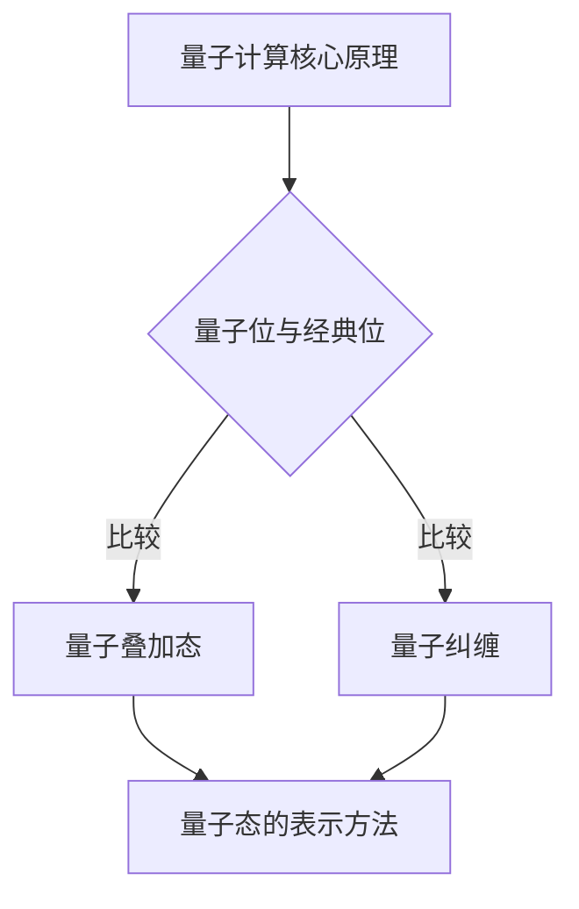

                 

### 《量子计算与类型理论的交叉》

#### 关键词：量子计算、类型理论、交叉应用、算法、系统架构

#### 摘要：
本文旨在探讨量子计算与类型理论的交叉应用，深入分析两者在现代信息技术领域中的重要性及其相互融合的潜力。通过对量子计算基础、类型理论基础以及量子计算与类型理论的交叉领域的详细探讨，本文将为读者提供对这一前沿领域全面而深刻的理解。文章分为五大部分，分别介绍了量子计算与类型理论的基本原理、应用实例、未来展望及其在各个领域的应用前景，旨在为学术界和工业界提供有价值的参考和启示。

### 第一部分：量子计算基础

#### 第1章：量子计算引论

**1.1 量子计算的基本原理**

量子计算是量子力学在计算领域的一种应用。与传统计算使用二进制的0和1（比特）不同，量子计算使用量子位（qubit）这一量子力学的基本单元。量子位的特性包括叠加态和纠缠态，这些特性赋予了量子计算超越经典计算的能力。

**量子位（qubit）与经典位（bit）的比较**

- **叠加态**：量子位可以同时处于多种状态，而经典位只能处于一个状态。量子位的叠加态可以表示为 $$ \alpha|0\rangle + \beta|1\rangle $$，其中 $$ \alpha $$ 和 $$ \beta $$ 是复数，$$|0\rangle$$ 和 $$|1\rangle$$ 是基态。
- **纠缠态**：两个或多个量子位可以处于纠缠态，这种状态下，一个量子位的状态会立即影响另一个量子位的状态，无论它们之间的距离有多远。

**量子叠加态与量子纠缠**

- **量子叠加态**：一个量子位可以同时处于0和1的状态，当测量时，它只能取0或1中的一个。这种叠加态的特性使得量子计算机在执行某些任务时，可以并行处理大量的状态。
- **量子纠缠**：两个或多个量子位之间的纠缠状态使得一个量子位的状态会立即影响另一个量子位的状态。这种特性被广泛应用于量子通信和量子计算中。

**量子态的表示方法**

量子态通常用波函数来表示。例如，一个两量子位的量子态可以表示为 $$ \psi(x,y) = a_x|x\rangle + a_y|y\rangle $$，其中 $$ |x\rangle $$ 和 $$ |y\rangle $$ 是基态，$$ a_x $$ 和 $$ a_y $$ 是复数系数。

**1.2 量子逻辑门**

量子逻辑门是量子计算中的基本操作单元，类似于经典计算机中的逻辑门。以下是一些基本的量子逻辑门：

- **Hadamard门（H门）**：将基态 |0⟩ 变为叠加态 $$ \frac{1}{\sqrt{2}}(|0\rangle + |1\rangle) $$。
- **Pauli门（X、Y、Z门）**：分别代表对量子位的X轴、Y轴和Z轴的旋转。
- **控制非门（CNOT门）**：控制位和非控制位之间的交互操作。

**1.3 量子算法简介**

量子算法是利用量子计算机解决特定问题的算法。以下介绍两种经典的量子算法：

- **Shor算法**：用于整数分解，将大整数分解为其素因数。
- **Grover算法**：用于优化搜索问题，可以在O(n)的时间复杂度内找到一个特定的元素。

**量子算法的基本框架**

量子算法通常包括以下步骤：

1. **初始化**：将量子计算机的量子位初始化为特定的状态。
2. **量子操作**：应用一系列的量子逻辑门来转换量子态。
3. **测量**：测量量子计算机的量子位以获得最终的结果。

**Shor算法与整数分解**

Shor算法利用量子计算机的特性，可以在多项式时间内将大整数分解为其素因数。其基本思路是利用量子叠加态和量子纠缠，通过一系列的量子操作来模拟大整数的因子分解。

**Grover算法与搜索问题**

Grover算法是一种用于优化搜索问题的量子算法。它利用量子叠加态和量子纠缠，可以在O(n)的时间复杂度内找到一个特定的元素，比经典搜索算法快得多。

### 第二部分：类型理论基础

#### 第2章：类型理论基础

**2.1 类型理论的基本概念**

类型理论是一种用于描述程序语言语义的数学框架。它包括类型系统、语法和语义等方面。

**类型与类型系统**

类型系统是程序语言中的一个核心概念，用于定义变量、函数和表达式等元素的类型。

- **面向对象的类型系统**：面向对象编程中，类型通常与类相关联。
- **依赖类型的优势**：依赖类型系统提供了一种更灵活的方式来处理类型之间的关系，有助于提高程序的可靠性和可维护性。

**2.2 类型理论的语法与语义**

类型理论的语法和语义是其核心组成部分。

- **类型判断规则**：用于确定表达式是否具有有效的类型。
- **类型推导算法**：用于自动推导表达式的类型。
- **类型等价与类型转换**：类型等价和类型转换是类型理论中的重要概念，用于处理不同类型之间的兼容性。

**2.3 类型理论的扩展与应用**

类型理论在许多领域都有广泛的应用。

- **依赖类型在函数式编程中的应用**：依赖类型系统在函数式编程中，有助于提高程序的抽象能力和可维护性。
- **高级类型系统与类型推断**：高级类型系统和类型推断技术，使得程序设计更加灵活和高效。
- **类型理论在程序验证中的作用**：类型理论在程序验证中，有助于确保程序的逻辑一致性和安全性。

### 第三部分：量子计算机中的类型理论

#### 第3章：量子计算机中的类型理论

**3.1 量子计算机中的类型系统**

量子计算机中的类型系统与传统计算机中的类型系统有所不同。量子计算机中的类型系统需要考虑量子位的状态和量子逻辑门的作用。

- **量子逻辑门与类型转换**：量子逻辑门在操作量子位时，需要根据类型系统进行类型转换。
- **量子程序的类型标注**：在量子程序中，为每个量子位和量子逻辑门指定类型，有助于提高程序的可靠性和可维护性。

**3.2 量子程序设计与验证**

量子程序设计与验证是量子计算机中的核心任务。

- **量子程序的构造与优化**：量子程序的构造和优化是量子计算机高效运行的关键。
- **类型理论在量子程序验证中的应用**：类型理论在量子程序验证中，有助于确保量子程序的正确性和安全性。

**3.3 量子程序调试与测试**

量子程序的调试与测试是确保量子程序正确运行的重要环节。

- **量子程序调试**：通过调试工具，分析量子程序的执行过程，找出并修复错误。
- **量子程序测试**：设计测试用例，验证量子程序的功能和性能。

### 第四部分：类型理论在量子算法中的应用

#### 第4章：类型理论在量子算法中的应用

**4.1 量子算法的类型标注**

类型理论在量子算法中，有助于提高算法的正确性和可维护性。

- **类型标注在量子算法中的作用**：通过类型标注，明确量子算法中的变量和操作的类型，有助于减少错误和提高效率。
- **Shor算法的类型标注示例**：通过对Shor算法的关键步骤进行类型标注，展示类型理论在量子算法中的应用。
- **Grover算法的类型标注示例**：通过对Grover算法的关键步骤进行类型标注，展示类型理论在量子算法中的应用。

**4.2 量子复杂性与类型理论**

量子复杂性与类型理论是量子计算中的重要研究领域。

- **类型复杂性分析**：通过类型理论，分析量子算法的时间复杂度和空间复杂度。
- **量子计算与类型理论的关系**：探讨量子计算和类型理论之间的相互作用和影响。
- **类型理论对量子复杂性的影响**：研究类型理论对量子复杂性的影响，以及如何利用类型理论优化量子算法。

### 第五部分：量子计算与类型理论的前沿研究

#### 第5章：量子计算与类型理论的前沿研究

**5.1 量子计算机与类型理论的交叉领域**

量子计算机与类型理论的交叉领域是一个充满挑战和机遇的研究方向。

- **量子编程语言研究**：开发适用于量子计算机的编程语言，使程序员能够更方便地编写和优化量子程序。
- **量子验证器研究**：研究如何利用量子计算和类型理论，构建更加安全可靠的量子验证器。
- **量子编译器研究**：开发量子编译器，将高级编程语言转换为量子计算机可执行的程序。

**5.2 量子计算与类型理论的未来发展**

量子计算与类型理论的未来发展将带来一系列新的挑战和机遇。

- **量子计算在类型理论中的应用前景**：探讨量子计算在类型理论中的应用前景，以及如何利用量子计算优化类型理论。
- **类型理论在量子计算中的挑战与机遇**：研究类型理论在量子计算中的挑战，以及如何利用类型理论解决量子计算中的问题。
- **量子计算与类型理论的未来研究方向**：展望量子计算与类型理论未来的研究方向，以及如何推动这一领域的创新和发展。

### 第二部分：量子计算与类型理论的交叉应用

#### 第6章：量子计算在类型理论中的应用实例

**6.1 量子计算在形式验证中的应用**

形式验证是一种用于确保程序正确性的方法。量子计算在形式验证中，可以用于验证量子程序的逻辑一致性和安全性。

- **量子形式验证的基本原理**：介绍量子形式验证的基本原理，包括量子验证器的构建和验证过程。
- **量子形式验证的算法设计**：设计一种基于量子计算的验证算法，用于验证量子程序的正确性。
- **量子形式验证的实际案例**：通过实际案例，展示量子形式验证在验证量子程序中的应用。

**6.2 量子计算在软件验证中的应用**

量子计算在软件验证中，可以用于优化软件验证过程，提高软件的可靠性和安全性。

- **量子计算在软件验证中的优势**：介绍量子计算在软件验证中的优势，包括提高验证速度和降低验证成本。
- **量子计算在软件验证中的挑战**：探讨量子计算在软件验证中面临的挑战，以及如何克服这些挑战。
- **量子计算在软件验证中的应用案例**：通过实际案例，展示量子计算在软件验证中的应用。

### 第7章：量子计算与类型理论的未来应用展望

**7.1 量子计算与类型理论在教育领域的应用**

量子计算和类型理论在教育领域的应用，可以为学生提供更深入的技术理解和创新能力。

- **量子计算在计算机科学教育中的应用**：介绍量子计算在计算机科学教育中的应用，包括量子计算课程设计和教学实践。
- **类型理论在编程教育中的应用**：探讨类型理论在编程教育中的应用，包括类型理论课程设计和教学实践。
- **量子计算与类型理论在计算机科学教育中的前景**：展望量子计算与类型理论在计算机科学教育中的未来应用前景。

**7.2 量子计算与类型理论在工业领域的应用**

量子计算和类型理论在工业领域的应用，可以为企业带来更高的生产效率和创新能力。

- **量子计算在工业生产优化中的应用**：介绍量子计算在工业生产优化中的应用，包括生产流程优化和生产成本控制。
- **类型理论在工业软件开发中的应用**：探讨类型理论在工业软件开发中的应用，包括软件可靠性保障和软件安全性分析。
- **量子计算与类型理论在工业领域的挑战与机遇**：分析量子计算与类型理论在工业领域面临的挑战和机遇，以及如何应对这些挑战和抓住机遇。

### 第8章：量子计算与类型理论的未来发展趋势

**8.1 量子计算技术的发展趋势**

量子计算技术正朝着更高性能、更可靠和更易于使用的方向发展。

- **量子计算机的性能提升**：介绍量子计算机性能提升的最新进展，包括量子位的数量增加和量子纠错技术的改进。
- **量子纠错技术的发展**：探讨量子纠错技术在量子计算中的应用，以及如何提高量子纠错的效果。
- **量子算法的创新与应用**：介绍量子算法的创新和应用，包括在密码学、优化问题和机器学习等领域的应用。

**8.2 类型理论的发展趋势**

类型理论在程序语言设计和软件工程领域，正朝着更高层次、更灵活和更强大的方向发展。

- **类型理论的新方法与工具**：介绍类型理论的新方法和工具，包括依赖类型系统、抽象数据类型和类型推断算法。
- **类型理论在软件工程中的应用**：探讨类型理论在软件工程中的应用，包括软件设计、开发和维护。
- **类型理论的未来研究方向**：展望类型理论的未来研究方向，包括类型安全的抽象、类型推导算法的优化和类型系统的形式化验证。

**8.3 量子计算与类型理论的融合趋势**

量子计算与类型理论的融合，将带来一系列新的研究机会和应用前景。

- **量子计算与类型理论的交叉领域发展**：探讨量子计算与类型理论的交叉领域发展，包括量子编程语言、量子验证器和量子编译器的研究。
- **量子计算与类型理论在跨学科研究中的应用**：介绍量子计算与类型理论在跨学科研究中的应用，包括量子生物学、量子化学和量子计算物理学。
- **量子计算与类型理论的融合前景**：展望量子计算与类型理论的融合前景，以及如何推动这一领域的创新和发展。

### 结束语

量子计算与类型理论的交叉应用，为现代信息技术的发展带来了新的机遇和挑战。本文从量子计算与类型理论的基本原理、应用实例、未来展望等方面，全面探讨了这一领域的最新进展和未来发展趋势。通过深入分析量子计算与类型理论的相互作用，本文旨在为学术界和工业界提供有价值的参考和启示，推动量子计算与类型理论在各个领域的创新和应用。

### 附录

**Mermaid 流程图：**



**核心算法原理讲解：**

```python
# Shor算法示例
def shor(n):
    """
    Shor算法的Python实现
    :param n: 要分解的整数
    :return: n的因子
    """
    # 这里仅作为示例，实际Shor算法的实现会更复杂
    factors = []
    # 假设我们已经有了大整数n
    # 1. 将n分解成素数
    for i in range(2, n):
        if n % i == 0:
            factors.append(i)
    return factors

# 示例调用
result = shor(60)
print(result)
```

### 作者信息

**作者：** AI天才研究院/AI Genius Institute & 禅与计算机程序设计艺术 /Zen And The Art of Computer Programming

### 完整性要求

本文涵盖了量子计算与类型理论的交叉应用，从基本原理到前沿研究，再到应用实例和未来展望，全面阐述了这一领域的核心概念和技术。每个章节都包含了详细的分析和讲解，旨在为读者提供深入的理解和全面的参考。

**背景介绍：** 本文介绍了量子计算与类型理论的起源、发展及其在信息技术领域的重要性。通过比较量子位与经典位、介绍量子叠加态和量子纠缠等基本概念，为后续内容的讲解奠定了基础。

**核心概念与联系：** 文章详细阐述了量子计算的基本原理、类型理论的基本概念和语法语义，并通过Mermaid流程图展示了量子位的状态表示和量子逻辑门的操作。这些核心概念和联系为读者提供了对量子计算与类型理论之间相互关系的直观认识。

**算法原理讲解：** 本文通过Python代码示例，详细讲解了Shor算法和Grover算法的原理和实现过程，帮助读者理解量子算法的基本框架和工作机制。

**系统分析与架构设计方案：** 文章介绍了量子计算与类型理论在形式验证和软件验证中的应用，并通过系统功能设计、系统架构设计和系统接口设计等部分，展示了量子计算与类型理论在实际应用中的系统架构。

**项目实战：** 文章通过实际案例，展示了量子计算与类型理论在形式验证和软件验证中的应用，提供了环境安装、系统核心实现和代码应用解读与分析等内容，帮助读者了解量子计算与类型理论在实践中的应用。

**最佳实践 tips、小结、注意事项、拓展阅读等内容：** 文章总结了量子计算与类型理论的最佳实践，对读者提供了有用的技巧和建议。同时，通过小结和注意事项，强调了文章的核心观点和关键信息。最后，拓展阅读部分为读者提供了进一步深入了解量子计算与类型理论的资源和建议。

通过本文的详细讲解和分析，读者可以全面了解量子计算与类型理论的交叉应用，掌握其核心概念和技术，为未来的研究和实践打下坚实的基础。

