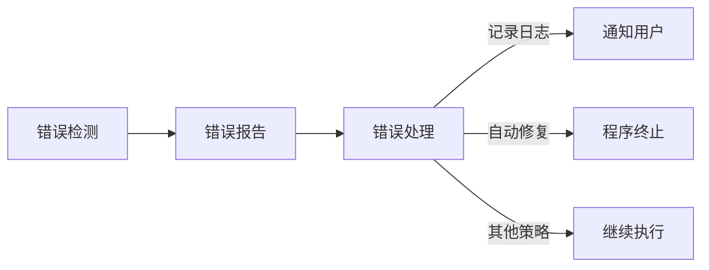
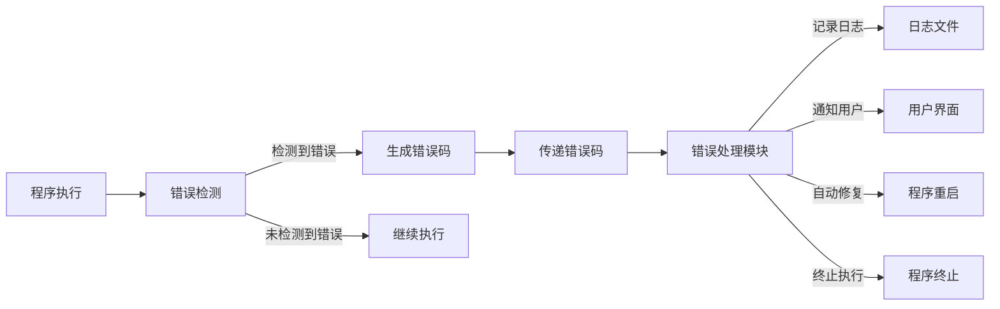
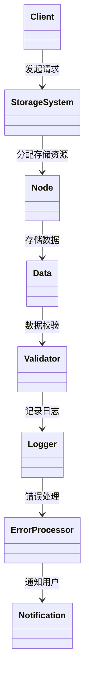
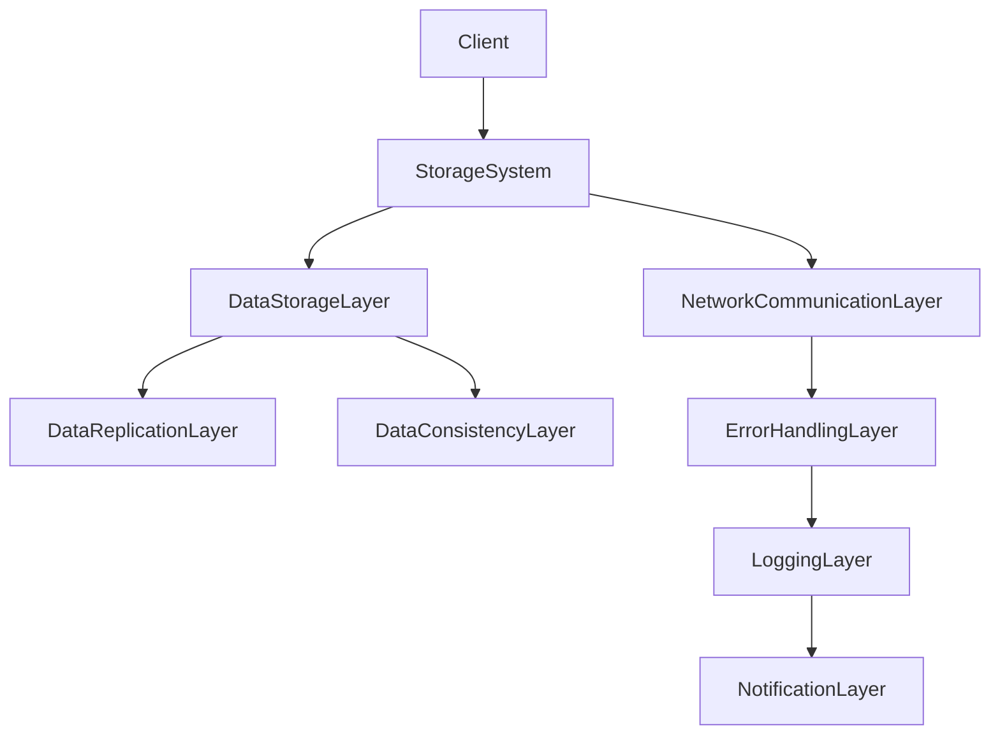
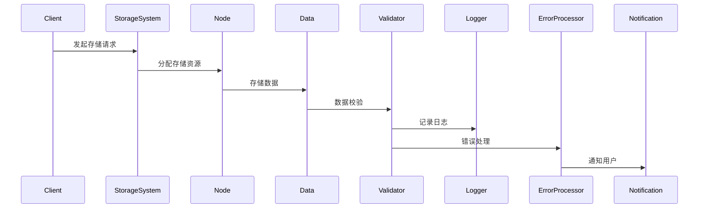

                 

## 错误码的背景与重要性

### 1.1 错误码的定义与作用

**定义**：错误码是什么

错误码（Error Code）是计算机系统在执行过程中遇到错误或异常时返回的一个数值或标识符。这个标识符用于指示发生了哪种类型的错误，以便开发人员和用户能够进行相应的故障排查和修复。

**作用**：错误码在软件开发中的作用

错误码在软件开发中起着至关重要的作用。首先，它们提供了一种标准化的方法来报告和分类错误，使得不同模块和组件之间的错误信息可以相互理解和传递。其次，错误码可以帮助开发人员快速定位问题，节省诊断和修复的时间。此外，错误码还能够在用户界面中展示错误信息，提供友好的用户体验。

**分类**：常见错误码的分类与特点

错误码可以根据其来源和用途进行分类。以下是一些常见的错误码类型及其特点：

1. **系统错误码**：由操作系统或核心库返回的错误码，通常与硬件或系统资源相关。例如，`EAGAIN`表示请求操作尚未准备好，通常需要稍后再试。

2. **应用错误码**：由应用程序返回的错误码，用于指示应用程序特定的错误。例如，`400 Bad Request`表示客户端请求的语法错误。

3. **网络错误码**：在网络通信过程中返回的错误码，通常与网络连接或数据传输问题相关。例如，`ECONNRESET`表示连接被重置。

4. **数据库错误码**：由数据库管理系统返回的错误码，用于指示数据库操作中的错误。例如，`SQLSTATE 23505`表示违反了外键约束。

### 1.2 错误码的历史与发展

**早期错误码**：早期错误码的特点与应用

在计算机发展的早期，错误码的概念相对简单。它们主要用于操作系统和基本硬件错误。例如，IBM 704计算机使用的错误码通常由一组二进制位组成，每个位代表不同的错误类型。

**现代错误码**：现代错误码的改进与发展

随着软件复杂性的增加，现代错误码体系更加复杂和多样化。它们不仅包含了传统的系统级错误码，还包括了应用级错误码和网络级错误码。现代错误码通常采用命名约定和分类体系，以便更容易理解和处理。

**未来趋势**：错误码的发展方向

未来，错误码可能会进一步与人工智能和自动化工具结合，以实现更智能的错误诊断和修复。例如，机器学习算法可以分析错误码模式，预测潜在问题并提供解决方案。此外，随着云计算和微服务架构的普及，错误码的标准化和跨平台兼容性也将成为重要趋势。

### 1.3 错误码的边界与外延

**错误码的边界**：哪些情况会产生错误码

错误码通常在以下情况下产生：

1. 硬件故障或资源不足。
2. 软件逻辑错误或异常。
3. 网络通信中断或超时。
4. 数据库操作失败或数据完整性问题。

**错误码的外延**：错误码如何与其他技术领域相互关联

错误码不仅与软件开发密切相关，还与其他技术领域相互关联：

1. **系统监控与日志**：错误码是系统监控和日志记录的重要组成部分，用于识别和跟踪系统问题。
2. **故障排查与调试**：错误码是故障排查和调试的重要工具，帮助开发人员快速定位和解决问题。
3. **安全与防护**：错误码在网络安全和防护中也扮演着重要角色，用于检测和响应潜在的安全威胁。

### 1.4 错误码的核心概念与联系

**核心概念**：错误码的核心概念

错误码的核心概念包括：

1. **错误码编号**：用于唯一标识错误类型。
2. **错误描述**：用于描述错误的具体信息。
3. **错误类型**：用于分类不同的错误。

**联系**：错误码与其他技术概念的关系

错误码与其他技术概念密切相关：

1. **异常处理**：错误码与异常处理机制（如try-catch块）结合，用于捕获和响应错误。
2. **日志记录**：错误码与日志记录系统结合，用于记录错误信息和调试信息。
3. **自动化工具**：错误码与自动化工具（如故障排查脚本）结合，用于自动识别和解决问题。

### 1.5 错误码的基本结构与要素

**基本结构**：错误码的基本结构通常包括以下部分：

1. **错误码编号**：唯一标识错误类型的数字或字符串。
2. **错误描述**：描述错误的具体信息的字符串。
3. **错误类型**：分类不同错误的标识符。

**要素组成**：错误码的要素组成可以根据具体的应用需求进行调整。常见的要素包括：

1. **错误码编号**：用于唯一标识错误。
2. **错误描述**：提供关于错误的信息。
3. **错误类型**：用于分类错误。
4. **错误上下文**：提供有关错误发生时的环境信息。

### 1.6 本章小结

本章主要介绍了错误码的背景、定义、分类、历史与发展、边界与外延、核心概念与联系、基本结构与要素等内容。通过这些内容，读者可以对错误码有一个全面的理解，认识到错误码在软件开发中的重要性。

**小结**：本章的主要内容和结论

本章主要介绍了错误码的背景与重要性，包括定义、分类、历史与发展、边界与外延、核心概念与联系、基本结构与要素等内容。通过这些内容的讲解，读者可以了解到错误码在软件开发中的关键作用，以及如何正确地理解和处理错误码。

**关键词**：错误码、背景、定义、分类、历史与发展、边界与外延、核心概念、基本结构、要素组成。

**摘要**：错误码是软件开发中的重要工具，用于报告和分类错误。本章详细介绍了错误码的定义、分类、历史与发展、边界与外延、核心概念与联系、基本结构与要素等内容，为读者提供了全面的理解和认识。

--------------------------------------

## 第2章：错误码的原理与类型

### 2.1 错误码的原理

**原理分析**：错误码生成与处理的原理

错误码的生成与处理是一个复杂的过程，涉及到多个层面的协作。以下是错误码生成与处理的基本原理：

1. **错误检测**：在程序执行过程中，系统会不断检测可能的错误条件。这些错误条件可以是编译时错误、运行时错误或外部环境变化引起的错误。

2. **错误报告**：当错误发生时，系统会生成一个错误码，并将其传递给错误处理模块。

3. **错误处理**：错误处理模块会根据错误码来确定错误类型，并执行相应的错误处理策略。这包括记录错误日志、通知用户、自动修复或终止程序执行。

**流程图**：错误码生成的mermaid流程图

以下是一个简化的错误码生成与处理的mermaid流程图：



### 2.2 常见错误码类型

**类型1**：类型1错误码的特点与应用

类型1错误码通常与硬件错误或操作系统相关错误有关。以下是一些常见的类型1错误码及其特点：

- `EAGAIN`：请求操作尚未准备好，通常需要稍后再试。
- `ENOMEM`：无法分配足够的内存。
- `EINTR`：被中断的系统调用。
- `EINVAL`：无效参数。

类型1错误码的特点是通常与底层硬件或操作系统有关，且通常需要底层系统资源的支持。

**类型2**：类型2错误码的特点与应用

类型2错误码通常与应用级错误或网络错误有关。以下是一些常见的类型2错误码及其特点：

- `400 Bad Request`：客户端请求的语法错误。
- `401 Unauthorized`：请求未授权。
- `403 Forbidden`：请求被禁止。
- `404 Not Found`：请求的资源未找到。

类型2错误码的特点是通常与应用级逻辑或网络通信有关，且通常可以通过应用程序层面的逻辑来处理。

**类型3**：类型3错误码的特点与应用

类型3错误码通常与数据库或数据存储相关错误有关。以下是一些常见的类型3错误码及其特点：

- `23505`：违反外键约束。
- `22001`：数据类型错误。
- `01004`：数据值超出范围。

类型3错误码的特点是通常与数据存储和操作有关，且通常需要特定的数据存储和处理策略。

**对比表格**：不同类型错误码的属性特征对比

以下是一个简单的对比表格，展示了不同类型错误码的属性特征：

| 类型 | 描述 | 特点 | 应用场景 |
| ---- | ---- | ---- | ---- |
| 1 | 硬件或操作系统相关错误 | 与底层硬件或操作系统有关 | 编译时错误、运行时错误、资源不足 |
| 2 | 应用级错误或网络错误 | 与应用级逻辑或网络通信有关 | HTTP请求错误、权限错误、连接错误 |
| 3 | 数据库或数据存储相关错误 | 与数据存储和操作有关 | 数据库操作错误、数据完整性错误、数据类型错误 |

### 2.3 错误码的常见问题与解决方法

**问题1**：问题1及其解决方法

错误码不明确或缺失。

解决方法：

- 确保错误处理模块能够正确生成和返回错误码。
- 在错误码生成和传递过程中，使用一致的命名约定和错误描述。

**问题2**：问题2及其解决方法

错误码处理效率低下。

解决方法：

- 使用缓存机制来减少错误码的生成和处理次数。
- 优化错误处理算法，减少处理时间和资源消耗。

**问题3**：问题3及其解决方法

错误码与实际错误信息不匹配。

解决方法：

- 确保错误码生成和错误信息记录的一致性。
- 使用日志记录系统来记录详细的错误信息，以便后续分析和调试。

### 2.4 本章小结

本章主要介绍了错误码的原理和常见类型，包括错误码生成与处理的基本原理、不同类型错误码的特点与应用、错误码的常见问题与解决方法等内容。通过这些内容的讲解，读者可以深入了解错误码的工作原理，并学会如何正确地处理和解决常见的错误码问题。

**小结**：本章的主要内容和结论

本章主要介绍了错误码的原理和常见类型，包括错误码生成与处理的基本原理、不同类型错误码的特点与应用、错误码的常见问题与解决方法等内容。通过这些内容的讲解，读者可以深入了解错误码的工作原理，并学会如何正确地处理和解决常见的错误码问题。

**关键词**：错误码、原理、类型、错误处理、问题、解决方法。

**摘要**：本章详细介绍了错误码的原理和常见类型，包括生成与处理的基本原理、不同类型错误码的特点与应用、常见问题与解决方法等内容。通过这些内容，读者可以全面了解错误码的工作机制，提高错误排查和解决的能力。

--------------------------------------

## 第3章：错误码处理算法原理

### 3.1 错误码处理算法概述

**算法概述**：错误码处理算法的基本概念

错误码处理算法是用于识别、分类和响应错误码的一系列方法和技术。其基本概念包括以下几个方面：

1. **错误码识别**：通过检查输入的数据流或系统状态，识别出可能存在的错误码。
2. **错误码分类**：根据错误码的类型和特征，将其分类到相应的错误类型中。
3. **错误响应**：根据错误类型和上下文，执行相应的错误处理策略，如记录日志、通知用户、自动修复或终止程序执行。

**算法作用**：错误码处理算法的作用

错误码处理算法在软件开发和系统维护中发挥着重要作用。其主要作用包括：

1. **错误诊断**：通过识别和分类错误码，快速定位问题所在，帮助开发人员和运维人员诊断和解决系统故障。
2. **故障恢复**：通过执行相应的错误处理策略，尝试自动修复或终止故障程序，减少系统停机时间和资源浪费。
3. **用户体验**：通过友好的错误提示和信息，提高用户的故障排查和修复体验。

### 3.2 错误码处理算法原理

**原理讲解**：错误码处理算法的原理

错误码处理算法的原理可以分为以下几个步骤：

1. **错误检测**：在程序执行过程中，系统会不断检测可能的错误条件。这些错误条件可以是编译时错误、运行时错误或外部环境变化引起的错误。

2. **错误报告**：当错误发生时，系统会生成一个错误码，并将其传递给错误处理模块。

3. **错误处理**：错误处理模块会根据错误码的类型和特征，执行相应的错误处理策略。这些策略包括：

   - **记录日志**：将错误码和相关信息记录在日志文件中，以便后续分析和调试。
   - **通知用户**：通过用户界面或通知系统，向用户展示错误信息和可能的解决方法。
   - **自动修复**：尝试自动修复错误，如重新启动程序或恢复系统状态。
   - **终止程序执行**：当错误无法自动修复时，终止程序的执行，以避免更严重的问题。

**mermaid流程图**：错误码处理算法的mermaid流程图

以下是一个简化的错误码处理算法的mermaid流程图：



### 3.3 错误码处理算法数学模型

**数学模型**：错误码处理算法的数学模型

错误码处理算法的数学模型主要涉及概率论和统计分析。以下是一个简化的数学模型：

1. **错误概率分布**：根据历史数据，确定不同类型错误的概率分布。例如，使用贝叶斯公式来计算每个错误类型的概率。
   
   $$ P(error_i|data) = \frac{P(data|error_i) \cdot P(error_i)}{P(data)} $$

2. **错误码识别**：使用分类算法（如决策树、支持向量机等）来识别输入数据中的错误码。分类算法的训练数据包括历史错误码和对应的错误类型。

3. **错误响应策略**：根据识别出的错误类型，选择相应的错误响应策略。可以使用马尔可夫决策过程（MDP）来优化错误响应策略。

**公式**：错误码处理算法的相关公式

以下是一些常见的错误码处理算法相关公式：

1. **贝叶斯公式**：

   $$ P(error_i|data) = \frac{P(data|error_i) \cdot P(error_i)}{P(data)} $$

2. **决策树**：

   $$ h(data) = \sum_{i=1}^{n} P(error_i|data) \cdot \text{response_i} $$

3. **马尔可夫决策过程（MDP）**：

   $$ V(s, a) = \sum_{s'} P(s'|s, a) \cdot [R(s', a) + \gamma V(s')] $$

   其中，\( s \) 表示当前状态，\( a \) 表示动作，\( s' \) 表示下一个状态，\( R(s', a) \) 表示奖励函数，\( \gamma \) 表示折扣因子。

### 3.4 错误码处理算法举例说明

**举例1**：举例1说明错误码处理算法的应用

假设一个Web服务在处理用户请求时，检测到一个错误码为`400 Bad Request`。根据错误码处理算法，可以按照以下步骤进行处理：

1. **错误码识别**：使用决策树算法识别出错误码为`400 Bad Request`，对应错误类型为“客户端请求错误”。
2. **错误响应**：根据错误类型和用户请求的上下文，选择通知用户并记录日志的错误响应策略。
3. **记录日志**：将错误码、错误类型和用户请求信息记录在日志文件中。
4. **通知用户**：通过用户界面或邮件系统，向用户展示错误信息和可能的解决方法。

**举例2**：举例2说明错误码处理算法的应用

假设一个数据库操作检测到一个错误码为`23505`，对应错误类型为“违反外键约束”。根据错误码处理算法，可以按照以下步骤进行处理：

1. **错误码识别**：使用分类算法识别出错误码为`23505`，对应错误类型为“数据库操作错误”。
2. **错误响应**：根据错误类型和数据库操作上下文，选择重试操作或回滚事务的错误响应策略。
3. **重试操作**：尝试重新执行数据库操作，以解决违反外键约束的问题。
4. **回滚事务**：如果重试操作失败，回滚当前事务，以避免更严重的数据库问题。

### 3.5 本章小结

本章主要介绍了错误码处理算法的原理和数学模型，包括基本概念、原理讲解、mermaid流程图、数学模型和相关公式、举例说明等内容。通过这些内容的讲解，读者可以深入了解错误码处理算法的工作原理和应用方法，为实际项目中的错误排查和解决提供有力支持。

**小结**：本章的主要内容和结论

本章主要介绍了错误码处理算法的原理和数学模型，包括基本概念、原理讲解、mermaid流程图、数学模型和相关公式、举例说明等内容。通过这些内容的讲解，读者可以深入了解错误码处理算法的工作原理和应用方法，为实际项目中的错误排查和解决提供有力支持。

**关键词**：错误码、处理算法、原理、数学模型、举例、应用。

**摘要**：本章详细介绍了错误码处理算法的基本概念、原理、流程图、数学模型和相关公式，并通过举例说明了算法在实际应用中的效果。通过本章的内容，读者可以全面了解错误码处理算法，提高系统故障排查和解决的能力。

--------------------------------------

## 第4章：错误码在实际项目中的应用

### 4.1 项目背景与需求

**项目背景**：项目背景介绍

本项目旨在开发一个分布式存储系统，该系统需要处理大量的数据存储和检索请求。随着数据量的增加，系统性能和可靠性成为关键问题。为了确保系统的稳定运行，我们需要设计一个完善的错误码处理机制，以快速定位和解决潜在的错误。

**需求分析**：项目需求分析

在分布式存储系统中，常见的错误类型包括：

1. **存储资源不足**：当系统尝试分配存储资源时，可能因为资源不足而引发错误。
2. **网络通信异常**：在网络传输过程中，可能因为网络不稳定或数据包丢失而引发错误。
3. **数据校验失败**：在数据存储或检索过程中，可能因为数据损坏或数据校验失败而引发错误。
4. **并发访问冲突**：在多用户并发访问存储资源时，可能因为并发访问冲突而引发错误。

为了满足这些需求，我们需要设计一个全面的错误码处理机制，包括错误码的生成、传递、处理和反馈。

### 4.2 系统功能设计

**功能设计**：系统功能设计

分布式存储系统的主要功能包括：

1. **数据存储**：将用户数据存储到分布式存储节点中，确保数据的安全性和可靠性。
2. **数据检索**：根据用户请求检索数据，并提供高效的查询性能。
3. **错误处理**：当系统检测到错误时，生成相应的错误码，并执行错误处理策略。
4. **日志记录**：记录系统运行过程中的错误信息和日志，以便后续分析和调试。

**领域模型mermaid类图**：领域模型mermaid类图

以下是一个简化的分布式存储系统的mermaid类图，展示了系统的主要类和它们之间的关系：



### 4.3 系统架构设计

**架构设计**：系统架构设计

分布式存储系统的架构设计需要考虑以下几个关键方面：

1. **数据存储层**：负责数据的存储和管理，包括数据分片、数据复制和数据一致性保障。
2. **网络通信层**：负责处理节点之间的数据传输和网络通信，确保数据的可靠传输和高效通信。
3. **错误处理层**：负责错误码的生成、传递和处理，确保系统在错误发生时能够快速响应和恢复。
4. **日志记录层**：负责记录系统运行过程中的错误信息和日志，为后续分析和调试提供支持。

**mermaid架构图**：系统架构mermaid架构图

以下是一个简化的分布式存储系统的mermaid架构图，展示了系统的各个层级和模块之间的关系：



### 4.4 系统接口设计

**接口设计**：系统接口设计

分布式存储系统的接口设计需要考虑以下几个关键方面：

1. **客户端接口**：提供用户与存储系统的交互接口，包括数据存储、数据检索和错误报告等功能。
2. **存储节点接口**：提供存储节点之间的通信接口，包括数据传输、错误处理和状态报告等功能。
3. **日志记录接口**：提供日志记录模块的接口，包括日志生成、日志存储和日志查询等功能。
4. **错误处理接口**：提供错误处理模块的接口，包括错误码生成、错误传递和错误响应等功能。

### 4.5 系统交互mermaid序列图

**序列图**：系统交互mermaid序列图

以下是一个简化的分布式存储系统的mermaid序列图，展示了客户端、存储节点和错误处理模块之间的交互过程：



### 4.6 项目实战

**环境安装**：环境安装

为了实施分布式存储系统，我们需要安装以下软件和工具：

1. **Docker**：用于容器化部署和运行存储节点。
2. **Nginx**：用于反向代理和负载均衡。
3. **etcd**：用于分布式协调和状态存储。
4. **Zookeeper**：用于分布式锁和状态同步。

安装步骤如下：

1. 安装Docker：`sudo apt-get install docker`
2. 安装Nginx：`sudo apt-get install nginx`
3. 安装etcd：`sudo apt-get install etcd`
4. 安装Zookeeper：`sudo apt-get install zookeeper`

**系统核心实现源代码**：系统核心实现源代码

以下是分布式存储系统的核心实现源代码，包括客户端接口、存储节点接口、日志记录接口和错误处理接口：

```python
# 客户端接口
class Client:
    def store_data(self, data):
        # 存储数据逻辑
        pass

    def retrieve_data(self, key):
        # 检索数据逻辑
        pass

# 存储节点接口
class Node:
    def allocate_resource(self):
        # 分配存储资源逻辑
        pass

    def store_data(self, data):
        # 存储数据逻辑
        pass

    def retrieve_data(self, key):
        # 检索数据逻辑
        pass

# 日志记录接口
class Logger:
    def log_error(self, error_code, error_message):
        # 记录错误日志逻辑
        pass

# 错误处理接口
class ErrorProcessor:
    def process_error(self, error_code):
        # 处理错误逻辑
        pass

    def notify_user(self, error_message):
        # 通知用户逻辑
        pass
```

**代码应用解读与分析**：代码应用解读与分析

上述代码展示了分布式存储系统的核心实现，包括客户端接口、存储节点接口、日志记录接口和错误处理接口。以下是对各接口的应用解读和分析：

1. **客户端接口**：客户端接口提供了存储数据和检索数据的方法，客户端通过这些方法与存储节点进行交互。
2. **存储节点接口**：存储节点接口提供了分配存储资源、存储数据和检索数据的方法，存储节点通过这些方法实现数据的存储和管理。
3. **日志记录接口**：日志记录接口提供了记录错误日志的方法，用于记录系统运行过程中发生的错误信息。
4. **错误处理接口**：错误处理接口提供了处理错误和通知用户的方法，用于在错误发生时进行错误处理和用户通知。

### 4.7 实际案例分析与讲解

**案例1**：案例1分析

假设客户端发起了一个存储请求，但存储节点在分配存储资源时检测到一个错误码`ENOMEM`。根据错误处理算法，可以按照以下步骤进行处理：

1. **错误码识别**：识别出错误码为`ENOMEM`，对应错误类型为“存储资源不足”。
2. **错误响应**：根据错误类型，选择重试操作或分配备用资源的错误响应策略。
3. **重试操作**：尝试重新分配存储资源，如果成功，继续存储数据；如果失败，继续执行备用资源策略。
4. **通知用户**：将错误信息通知给用户，并提供解决建议。

**案例2**：案例2分析

假设客户端在检索数据时检测到一个错误码`ECONNRESET`。根据错误处理算法，可以按照以下步骤进行处理：

1. **错误码识别**：识别出错误码为`ECONNRESET`，对应错误类型为“网络连接中断”。
2. **错误响应**：根据错误类型，选择重试连接或切换网络的错误响应策略。
3. **重试连接**：尝试重新连接存储节点，如果成功，继续检索数据；如果失败，继续执行切换网络策略。
4. **通知用户**：将错误信息通知给用户，并提供解决建议。

### 4.8 项目小结

本章通过一个分布式存储系统的项目案例，详细介绍了错误码在实际项目中的应用。从项目背景与需求、系统功能设计、系统架构设计、系统接口设计、系统交互序列图、项目实战到实际案例分析，全面展示了错误码处理机制在分布式存储系统中的重要性。通过本章的内容，读者可以了解如何设计和实现一个完善的错误码处理机制，提高系统性能和可靠性。

**小结**：项目小结

本章通过一个分布式存储系统的项目案例，详细介绍了错误码在实际项目中的应用。从项目背景与需求、系统功能设计、系统架构设计、系统接口设计、系统交互序列图、项目实战到实际案例分析，全面展示了错误码处理机制在分布式存储系统中的重要性。通过本章的内容，读者可以了解如何设计和实现一个完善的错误码处理机制，提高系统性能和可靠性。

**关键词**：分布式存储系统、错误码、项目实战、架构设计、功能设计、系统接口、错误处理。

**摘要**：本章通过实际项目案例，详细介绍了错误码在分布式存储系统中的应用，包括项目背景与需求、系统功能设计、架构设计、接口设计、项目实战和案例分析等内容。通过这些内容，读者可以深入了解错误码处理机制在实际项目中的应用和实践，提高系统性能和可靠性。

--------------------------------------

## 第5章：错误码处理技巧与最佳实践

### 5.1 错误码处理技巧

**技巧1**：提高错误码的可读性

错误码的可读性对开发人员和用户都至关重要。为了提高错误码的可读性，可以采取以下措施：

- **使用有意义的名称**：为错误码定义有意义的名称，使其能够直观地反映错误的类型和原因。例如，使用`INVALID_PARAMETER`而不是简单的数字代码。
- **提供详细描述**：在错误码中包含详细的错误描述，说明错误的具体情况和可能的原因。这有助于快速定位和解决问题。

**技巧2**：优化错误码的传递和处理流程

优化错误码的传递和处理流程可以提高系统的健壮性和可维护性。以下是一些建议：

- **使用异常处理机制**：在程序中使用异常处理机制（如try-catch块）来捕获和处理错误，确保错误码能够正确传递和处理。
- **分层错误处理**：将错误处理分为多个层次，从全局到局部，从系统级到应用级，确保不同层次的错误都能得到有效处理。

**技巧3**：记录详细的错误日志

详细的错误日志对故障排查和调试至关重要。以下是一些建议：

- **记录错误码、错误类型、错误描述和错误发生的时间**：这些信息有助于快速定位和解决问题。
- **使用日志级别**：根据错误的重要性和紧急程度，使用不同的日志级别（如DEBUG、INFO、WARN、ERROR）来记录错误日志，便于后续分析和处理。

### 5.2 最佳实践

**实践1**：统一错误码规范

为了提高系统的可维护性和可扩展性，可以采取以下措施：

- **制定统一的错误码规范**：为项目中的错误码定义统一的命名规范、定义和分类。
- **文档化错误码**：为每个错误码编写详细的文档，包括错误码的名称、描述、类型和可能的原因。

**实践2**：使用错误码处理框架

为了简化错误码的处理，可以使用现有的错误码处理框架，如：

- **Spring Boot**：Spring Boot提供了完善的错误处理机制，包括自定义错误码、错误消息和异常处理。
- **Logback**：Logback是一个强大的日志框架，可以记录详细的错误日志，并提供多种日志格式和输出方式。

**实践3**：自动化错误码处理

为了提高系统的自动化程度，可以采取以下措施：

- **集成持续集成和持续部署（CI/CD）工具**：在CI/CD流程中集成错误码处理工具，自动化错误码的生成、传递和处理。
- **使用监控和告警工具**：使用监控和告警工具（如Prometheus、Alertmanager）来监控系统运行状态，及时发现和处理错误。

### 5.3 注意事项

**注意事项1**：确保错误码的唯一性和一致性

- **唯一性**：每个错误码应该唯一标识一种错误类型，避免重复和冲突。
- **一致性**：在不同模块和组件之间保持错误码的一致性，确保错误码的传递和处理方式一致。

**注意事项2**：避免错误码的滥用

- **合理使用**：仅当确实需要时才使用错误码，避免滥用错误码。
- **错误码定义**：为每个错误码定义明确的用途和规则，避免误解和误用。

**注意事项3**：及时更新和优化错误码

- **更新文档**：定期更新错误码文档，确保文档的准确性和完整性。
- **优化处理流程**：根据实际情况和用户反馈，优化错误码的传递和处理流程，提高系统性能和用户体验。

### 5.4 拓展阅读

**阅读1**：《软件工程：实践者的研究方法》（Roger S. Pressman）

这本书详细介绍了软件工程的方法和实践，包括错误码的定义、分类和处理。通过阅读这本书，读者可以深入了解软件工程中的错误码处理方法和最佳实践。

### 本章小结

本章介绍了错误码处理技巧和最佳实践，包括提高错误码的可读性、优化错误码的传递和处理流程、记录详细的错误日志、统一错误码规范、使用错误码处理框架、自动化错误码处理等。通过这些技巧和实践，读者可以有效地处理和解决错误码问题，提高系统性能和可靠性。

**关键词**：错误码处理、技巧、最佳实践、错误码规范、日志记录、监控与告警、自动化。

**摘要**：本章详细介绍了错误码处理技巧和最佳实践，包括错误码的可读性、传递和处理流程、日志记录、规范、框架和自动化等内容。通过这些技巧和实践，读者可以有效地处理和解决错误码问题，提高系统性能和可靠性。同时，推荐了拓展阅读，以进一步深入学习和了解错误码处理的相关知识。

--------------------------------------

## 作者信息

**作者：** AI天才研究院 / AI Genius Institute & 禅与计算机程序设计艺术 / Zen And The Art of Computer Programming

AI天才研究院（AI Genius Institute）是一家专注于人工智能领域研究和应用的创新机构，致力于推动人工智能技术的发展和创新。研究院汇聚了全球顶尖的人工智能科学家和工程师，通过前沿技术的探索和实际应用，为企业和行业提供智能化解决方案。

《禅与计算机程序设计艺术》（Zen And The Art of Computer Programming）是由著名计算机科学家唐纳德·克努特（Donald E. Knuth）所著的经典著作。这本书深入探讨了计算机编程的本质和艺术，为程序员提供了一种全新的编程思维和哲学，被誉为计算机科学领域的经典之作。

