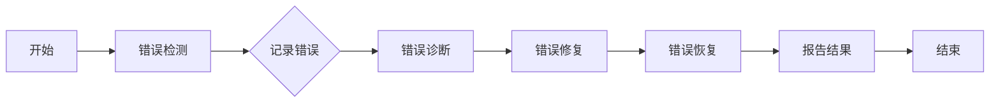
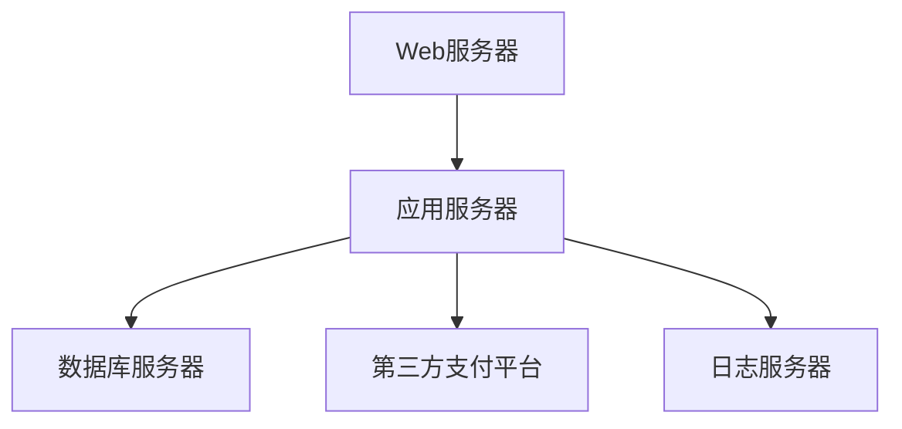
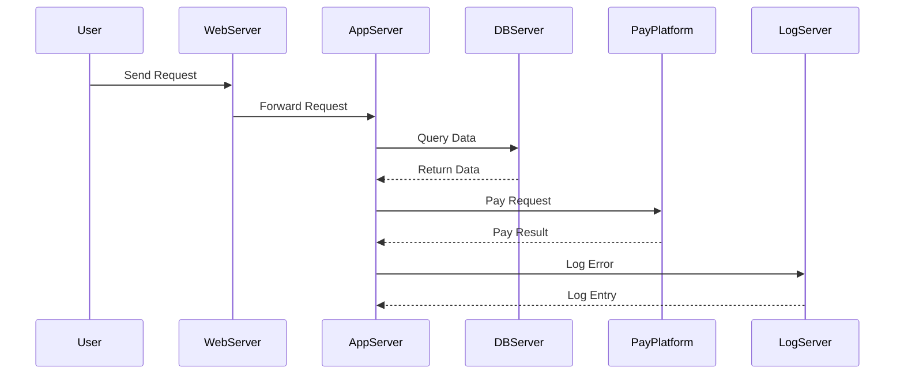
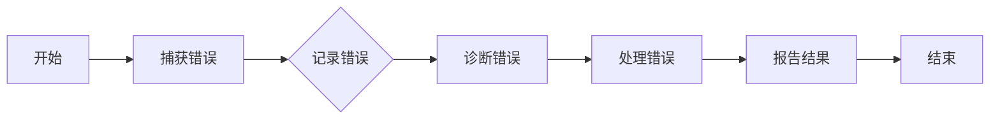

                 

### 第1章 引言

在现代计算机系统中，错误码是系统内部诊断和故障排除的重要组成部分。错误码是计算机系统在运行过程中遇到问题时产生的一种编码，用于表示特定的错误情况。在软件开发和维护过程中，错误码提供了关键的信息，帮助开发人员和运维人员快速定位和解决问题，从而提高系统的稳定性和可靠性。

#### 1.1 问题背景

随着计算机技术和软件行业的快速发展，错误码的应用场景和复杂性不断增加。错误码不仅存在于操作系统和硬件设备中，还广泛应用于各种软件应用程序、网络服务、数据库系统和云计算平台。例如，在Web开发中，HTTP状态码是服务器向客户端发送的错误码，用于表示请求的状态；在数据库管理中，SQL错误码用于表示SQL语句执行时的错误情况。

然而，错误码的处理并不总是一帆风顺。随着系统的复杂度增加，错误码的种类和数量也在急剧增加，给开发人员和运维人员带来了巨大的挑战。首先，错误码的信息量通常有限，难以直接理解其含义。其次，不同系统和平台使用的错误码格式和规范可能不同，增加了处理和统一的难度。此外，错误码的处理涉及到多个系统和组件的协同工作，需要确保一致性和高可用性。

#### 1.2 错误码的重要性

错误码在系统稳定性和用户体验中扮演着至关重要的角色。首先，错误码可以帮助开发人员在早期识别和修复代码中的错误，从而提高软件的质量和稳定性。通过错误码，开发人员可以快速定位到出现问题的代码段，从而节省调试和修复的时间。

其次，错误码对于用户体验也至关重要。当用户在使用软件时遇到错误时，错误码可以为用户提供有关错误的详细信息，帮助用户更好地理解问题并采取适当的措施。例如，在Web应用中，一个明确的错误码可以让用户了解是哪个页面或功能出了问题，从而更快地解决问题。

#### 1.3 错误码处理的重要性

错误码在软件开发和维护中的作用不容忽视。首先，错误码为软件调试提供了重要线索。通过错误码，开发人员可以快速定位到出现问题的代码段，从而节省调试和修复的时间。此外，错误码还可以帮助开发人员识别代码中的潜在问题，例如未处理的异常或边界条件处理不当。

其次，错误码在故障排除和问题定位中发挥着关键作用。在分布式系统和云计算环境中，错误码可以帮助运维人员快速识别系统中的故障点，从而更快地恢复系统的正常运行。此外，错误码还可以用于监控系统性能和稳定性，提供关键的性能指标和报警信息。

#### 1.4 书籍目标与结构

本书旨在全面介绍错误码的处理，帮助读者深入了解错误码的基本概念、核心原理和最佳实践。具体目标如下：

1. **理解错误码的基本概念**：介绍错误码的定义、分类、编码标准等基本概念，帮助读者建立对错误码的全面认识。

2. **掌握错误码处理的算法原理**：讲解错误码处理的算法流程、检测与诊断方法、修复与恢复策略等，帮助读者掌握错误码处理的核心原理。

3. **学习错误码处理的系统分析与设计**：介绍错误码处理的系统分析与架构设计方案，包括问题场景介绍、系统功能设计、系统架构设计、系统接口设计和系统交互等，帮助读者理解错误码处理的实际应用。

4. **实战应用**：通过实际项目实战，展示错误码处理的具体实现过程，帮助读者将所学知识应用于实际场景。

5. **最佳实践与注意事项**：总结错误码处理的最佳实践、注意事项和拓展阅读，帮助读者在项目实践中更好地处理错误码。

本书共分为七个章节，结构如下：

- **第1章 引言**：介绍错误码的背景、重要性以及本书的目标与结构。
- **第2章 错误码的基本概念**：介绍错误码的定义、分类、编码标准等基本概念。
- **第3章 错误码处理的核心原理**：讲解错误码处理的算法原理、检测与诊断方法、修复与恢复策略等。
- **第4章 错误码处理的系统分析与设计**：介绍错误码处理的系统分析与架构设计方案。
- **第5章 错误码处理的算法原理讲解**：详细讲解错误码处理的算法原理，包括算法流程图、数学模型和公式、举例说明等。
- **第6章 错误码处理项目实战**：通过实际项目实战，展示错误码处理的具体实现过程。
- **第7章 最佳实践与注意事项**：总结错误码处理的最佳实践、注意事项和拓展阅读。

通过本书的学习，读者将能够深入了解错误码的处理，掌握错误码处理的核心原理和最佳实践，为实际项目中的错误码处理提供有力支持。

## 第2章 错误码的基本概念

错误码是计算机系统中用于表示特定错误情况的编码。它提供了关于错误发生的详细信息，有助于开发人员、运维人员和用户快速识别和解决问题。在本章中，我们将介绍错误码的基本概念，包括其定义、分类、编码标准等，以便读者对错误码有一个全面的了解。

### 2.1 错误码的定义

错误码是一种用于表示计算机系统或软件在运行过程中遇到的错误或异常情况的编码。它通常是一个数字或字符串，可以包含错误的具体信息，如错误类型、错误原因、错误位置等。错误码的出现是为了简化错误信息的表示和传递，使得系统能够以一种统一和标准化的方式进行错误处理。

### 2.2 错误码的分类

错误码可以根据不同的分类标准进行分类。以下是几种常见的分类方式：

1. **按错误来源分类**：
   - **系统级错误码**：这类错误码通常与操作系统或硬件设备有关，例如硬件故障、内存溢出、系统资源不足等。
   - **应用程序级错误码**：这类错误码通常与特定应用程序或软件模块有关，例如网络连接失败、文件不存在、数据库查询错误等。

2. **按错误严重程度分类**：
   - **致命错误**：这类错误通常会导致系统或应用程序立即崩溃或停止运行。
   - **严重错误**：这类错误会影响系统的正常功能，但不会导致系统崩溃。
   - **警告错误**：这类错误通常不会影响系统的运行，但可能表明潜在的问题。

3. **按错误码格式分类**：
   - **数字错误码**：这类错误码通常是一个数字，易于表示和计算。
   - **字符串错误码**：这类错误码通常是一个字符串，可以包含更详细的错误信息。

### 2.3 错误码的编码标准

不同的系统和平台可能采用不同的错误码编码标准。以下是几种常见的编码标准：

1. **HTTP状态码**：在Web开发中，HTTP状态码是一种常见的错误码编码标准。它由三个数字组成，前两位表示请求状态，后两位表示具体状态。例如，200表示成功，404表示未找到，500表示内部服务器错误。

2. **SQL错误码**：在数据库管理中，SQL错误码用于表示SQL语句执行时的错误情况。例如，23505表示违反外键约束。

3. **Windows错误码**：Windows操作系统使用一系列的数字错误码来表示各种错误情况。这些错误码通常以“ERROR\_”或“ERROR\_ACCESS”等前缀开始。

### 2.4 错误码处理的基本步骤

错误码的处理通常包括以下几个基本步骤：

1. **错误码捕获**：在程序运行过程中，当发生错误时，系统会捕获相应的错误码。

2. **错误码分析**：根据捕获到的错误码，系统会进行分析以确定错误的类型和原因。

3. **错误处理**：根据分析结果，系统会采取相应的处理措施，如日志记录、错误提示、恢复操作等。

4. **错误反馈**：将处理结果反馈给用户或开发者，以便他们了解错误情况和采取进一步措施。

### 2.5 错误码处理的挑战与解决方案

尽管错误码在系统故障排除和问题定位中发挥着重要作用，但在实际应用中仍面临一些挑战：

1. **错误码信息量有限**：错误码通常只能提供有限的错误信息，难以直接理解其含义。解决方法是提供详细的错误日志和上下文信息，以便更好地理解错误原因。

2. **不同系统和平台的错误码格式和规范不同**：解决方法是采用统一的错误码格式和规范，并使用映射关系将不同系统和平台的错误码转换为标准格式。

3. **错误码处理的一致性和高可用性**：解决方法是设计一致且高效的错误处理机制，确保系统在各种情况下都能正确处理错误。

### 2.6 错误码在软件开发中的应用

错误码在软件开发生命周期中的各个环节都发挥着重要作用。以下是错误码在软件开发中的应用示例：

1. **代码调试**：在代码调试过程中，错误码可以帮助开发人员快速定位到出现问题的代码段，从而提高调试效率。

2. **用户反馈**：在用户反馈中，错误码可以为用户提供详细的错误信息，帮助用户更好地理解问题并采取适当的措施。

3. **性能监控**：在性能监控中，错误码可以用于记录和分析系统中的错误情况，从而发现潜在的性能问题。

4. **自动化测试**：在自动化测试中，错误码可以帮助测试人员快速定位测试失败的原因，从而提高测试效率。

通过本章的介绍，读者应能够了解错误码的基本概念、分类、编码标准和处理方法。接下来，我们将进一步探讨错误码处理的核心原理和算法，以帮助读者更深入地理解错误码的处理过程。

## 第3章 错误码处理的核心原理

错误码处理是计算机系统中的一个关键环节，其核心原理涉及错误检测、诊断、修复和恢复等多个方面。本章节将详细讨论这些核心原理，并通过具体步骤和流程图来帮助读者更好地理解错误码处理的工作机制。

### 3.1 错误处理流程

错误处理流程是一个系统化的过程，包括以下几个关键步骤：

1. **错误检测**：系统运行过程中，通过各种监控机制和异常处理机制来检测错误的发生。例如，操作系统会在内存管理、文件访问和网络通信等环节进行错误检测。

2. **错误记录**：当错误被检测到时，系统会将错误信息记录下来，包括错误码、错误发生的时间、地点和相关信息。这些记录将用于后续的诊断和分析。

3. **错误诊断**：通过分析错误记录和其他相关信息，系统可以确定错误的类型和原因。这一步骤通常需要依赖错误码的语义信息和系统日志。

4. **错误修复**：根据诊断结果，系统会采取相应的修复措施。例如，重新启动服务、修复文件、恢复数据等。

5. **错误恢复**：在修复错误后，系统会进行一系列验证和测试，以确保错误已被成功修复，系统恢复正常运行。

6. **错误报告**：将错误处理的结果报告给相关人员，如开发人员、运维人员或用户。这有助于他们了解错误的性质和处理情况。

### 3.2 错误码的检测与诊断

错误码的检测与诊断是错误处理流程中的关键环节。以下是一些具体的方法和工具：

1. **异常监控**：系统会在运行过程中监控各种异常情况，如内存溢出、线程死锁、网络连接中断等。当异常发生时，系统会自动生成相应的错误码并记录相关信息。

2. **日志分析**：系统日志是错误码检测和诊断的重要依据。通过分析系统日志，可以识别错误发生的具体位置和原因。

3. **错误码映射表**：系统通常会维护一个错误码映射表，将错误码与具体的错误类型和原因进行关联。开发人员可以利用这个映射表来快速定位错误。

4. **自动化诊断工具**：一些自动化诊断工具可以帮助系统自动检测和诊断错误。这些工具通常集成了多种检测算法和错误码解析库，能够提高诊断的准确性和效率。

### 3.3 错误码的修复与恢复

错误码的修复与恢复是确保系统稳定运行的重要环节。以下是一些常见的修复和恢复策略：

1. **重试机制**：当系统检测到错误时，可以尝试重新执行操作。例如，在网络请求失败时，可以尝试重新发送请求。

2. **故障转移**：在分布式系统中，当某个节点发生故障时，可以将其任务转移到其他健康的节点上。这有助于提高系统的容错能力和可用性。

3. **数据恢复**：当系统发生数据损坏或丢失时，可以通过备份和恢复策略来恢复数据。例如，使用数据恢复工具从备份中恢复数据。

4. **系统重启**：在某些情况下，系统重启可能是修复错误的有效方法。重启后，系统会重新初始化，从而可能解决一些临时性或配置错误。

### 3.4 错误码处理流程图

为了更直观地展示错误码处理流程，我们使用Mermaid流程图进行了描述。以下是错误码处理的基本流程图：



在这个流程图中，每个节点表示一个处理步骤，箭头表示步骤之间的顺序关系。这个流程图有助于读者理解错误码处理的全过程。

### 3.5 错误码处理实例分析

为了更好地理解错误码处理的核心原理，我们通过一个实例进行分析。假设一个Web应用程序在处理用户请求时发生了错误，具体错误码为500，表示内部服务器错误。

1. **错误检测**：系统检测到请求处理失败，生成错误码500。

2. **错误记录**：系统将错误码500记录在日志文件中，并附上错误发生的时间和请求详情。

3. **错误诊断**：系统分析日志文件，发现错误可能是由数据库连接中断引起的。

4. **错误修复**：系统尝试重新连接数据库，并成功恢复连接。

5. **错误恢复**：系统重新处理用户请求，并返回正确的响应。

6. **错误报告**：系统将错误处理结果记录在日志中，并通知开发人员进行后续分析。

通过这个实例，我们可以看到错误码处理流程的每个步骤如何协同工作，从而确保系统能够快速识别、诊断和修复错误。

### 3.6 错误码处理的挑战与优化

尽管错误码处理在许多场景中非常有效，但在实际应用中仍面临一些挑战：

1. **错误码信息不足**：某些错误码可能只提供了有限的信息，难以直接理解错误原因。这需要系统提供更多的上下文信息和日志记录。

2. **错误码规范不一致**：不同系统和平台可能使用不同的错误码规范，导致处理和统一困难。这需要制定统一的错误码标准和映射关系。

3. **错误处理效率**：在大型系统中，错误处理可能涉及到多个组件和模块，需要确保处理的高效性和一致性。

为了解决这些挑战，可以采取以下优化策略：

1. **提高日志记录的详细程度**：在系统设计和开发过程中，应尽可能详细地记录错误日志，包括错误码、发生时间、请求详情等。

2. **建立错误码映射表**：为不同系统和平台建立统一的错误码映射表，确保错误码的处理能够跨平台进行。

3. **优化错误处理流程**：设计高效且一致的错误处理流程，确保系统能够快速响应和处理错误。

通过本章的介绍，读者应能够理解错误码处理的核心原理和流程，并掌握基本的错误检测、诊断、修复和恢复策略。这些知识将为读者在未来的软件开发和运维工作中提供有力支持。

## 第4章 错误码处理的算法原理

在错误码处理过程中，算法原理起到了至关重要的作用。正确的算法设计能够帮助系统高效地检测、诊断和修复错误。本章节将详细讲解错误码处理的算法原理，包括算法流程图、算法步骤、Python源代码实现以及数学模型和公式。通过具体示例，我们将深入探讨这些算法的原理和实际应用。

### 4.1 算法流程图

为了更好地理解错误码处理的算法原理，我们首先绘制了一个简单的算法流程图，使用Mermaid语法表示：

```mermaid
flowchart LR
    A[开始] --> B[输入错误码]
    B --> C{解析错误码}
    C --> D[查找错误信息}
    D --> E{诊断错误原因}
    E --> F{执行修复操作}
    F --> G[验证修复结果]
    G --> H[结束]
```

在这个流程图中，每个节点表示一个步骤，箭头表示步骤之间的顺序关系。接下来，我们将详细解释每个步骤。

### 4.2 算法步骤

以下是错误码处理算法的详细步骤：

1. **输入错误码**：系统首先接收用户输入的错误码。这个错误码可以是数字或字符串形式，表示特定的错误情况。

2. **解析错误码**：系统将接收到的错误码解析为具体的错误信息。这通常涉及到错误码的格式和编码标准。例如，如果错误码是数字，系统需要将其转换为对应的错误信息。

3. **查找错误信息**：系统根据解析得到的错误信息，在错误码映射表中查找详细的错误描述。错误码映射表是一个关键的数据结构，它将每个错误码与相应的错误描述进行关联。

4. **诊断错误原因**：系统利用错误码映射表中的信息，结合系统日志和其他上下文信息，诊断错误的可能原因。这可能包括检查系统配置、网络连接、文件权限等。

5. **执行修复操作**：根据诊断结果，系统采取相应的修复措施。例如，如果诊断出数据库连接失败，系统可能尝试重新连接数据库。

6. **验证修复结果**：在执行修复操作后，系统会进行一系列验证和测试，以确保错误已被成功修复。这通常包括重新执行操作或检查关键系统指标。

7. **结束**：如果验证结果成功，系统结束错误处理流程。如果验证失败，系统可能需要重新执行诊断和修复步骤。

### 4.3 Python源代码实现

为了更好地理解错误码处理的算法原理，我们提供一个简单的Python示例，实现上述算法步骤：

```python
# 错误码处理算法示例

# 错误码映射表
error_codes = {
    '500': '内部服务器错误',
    '404': '未找到',
    '403': '禁止访问',
    # 更多错误码
}

# 解析错误码
def parse_error_code(error_code):
    return error_codes.get(error_code, '未知错误')

# 诊断错误原因
def diagnose_error(error_info):
    if error_info == '内部服务器错误':
        return '可能由于数据库连接失败引起'
    elif error_info == '未找到':
        return '请求的资源不存在'
    else:
        return '未知错误原因'

# 执行修复操作
def fix_error(error_info):
    if error_info == '内部服务器错误':
        # 假设尝试重新连接数据库
        print('正在尝试重新连接数据库...')
        # 重连成功
        return '数据库连接成功'
    elif error_info == '未找到':
        # 重定向到其他页面
        return '重定向至其他页面'
    else:
        return '无法修复错误'

# 验证修复结果
def verify_fix_result(fix_result):
    if fix_result == '数据库连接成功' or fix_result == '重定向至其他页面':
        return '修复成功'
    else:
        return '修复失败'

# 错误码处理流程
def process_error_code(error_code):
    error_info = parse_error_code(error_code)
    error_reason = diagnose_error(error_info)
    fix_result = fix_error(error_info)
    verify_result = verify_fix_result(fix_result)
    
    print(f'错误码: {error_code}')
    print(f'错误信息: {error_info}')
    print(f'错误原因: {error_reason}')
    print(f'修复结果: {fix_result}')
    print(f'验证结果: {verify_result}')

# 测试错误码处理
process_error_code('500')
process_error_code('404')
```

在这个示例中，我们定义了一个错误码映射表`error_codes`，包含了常见的错误码及其描述。然后，我们实现了`parse_error_code`、`diagnose_error`、`fix_error`和`verify_fix_result`四个函数，分别对应解析错误码、诊断错误原因、执行修复操作和验证修复结果。最后，我们通过`process_error_code`函数将整个过程串联起来。

### 4.4 算法原理讲解

错误码处理的算法原理主要基于以下几方面：

1. **错误码映射表**：错误码映射表是一个关键的数据结构，它将每个错误码与相应的错误描述进行关联。这个表通常由系统管理员或开发人员维护，以确保其准确性和完整性。

2. **错误诊断逻辑**：错误诊断逻辑是算法的核心部分，它根据错误码和系统日志等信息，诊断错误的可能原因。这个逻辑可能涉及到一系列条件判断和逻辑运算，以确保能够准确识别错误原因。

3. **修复操作**：修复操作是根据错误原因采取的具体措施。例如，如果错误原因是数据库连接失败，修复操作可能是尝试重新连接数据库。这个步骤通常需要具备一定的系统知识和技术，以确保能够有效地解决问题。

4. **验证和反馈**：在执行修复操作后，系统需要验证修复结果，以确保错误已被成功修复。验证结果会反馈给用户或开发人员，以便他们了解错误处理的情况。

### 4.5 数学模型和公式

在错误码处理过程中，一些数学模型和公式可以帮助我们更好地理解和分析错误数据。以下是一些常用的数学模型和公式：

1. **错误率**：错误率是错误发生的频率。它可以表示为：

   \[ 错误率 = \frac{错误次数}{总操作次数} \]

2. **平均修复时间**：平均修复时间是系统从发生错误到修复完成所需的时间。它可以表示为：

   \[ 平均修复时间 = \frac{总修复时间}{错误次数} \]

3. **错误修复率**：错误修复率是系统修复错误的效率。它可以表示为：

   \[ 错误修复率 = \frac{成功修复次数}{错误次数} \]

通过这些数学模型和公式，我们可以对错误码处理的过程进行量化分析，从而优化错误处理策略和提高系统稳定性。

### 4.6 算法举例说明

为了更好地理解错误码处理算法，我们通过一个具体示例进行说明。假设系统在处理一个用户请求时，返回了一个错误码404，表示未找到请求的资源。

1. **输入错误码**：系统接收到错误码404。

2. **解析错误码**：通过错误码映射表，系统确定错误信息为“未找到”。

3. **诊断错误原因**：系统检查系统日志，发现请求的资源不存在。因此，错误原因可能是用户输入了错误的URL或资源已被删除。

4. **执行修复操作**：系统尝试重定向用户到另一个页面。例如，如果系统默认主页的URL是`/home`，系统会重定向用户到`/home`。

5. **验证修复结果**：系统检查重定向是否成功。如果成功，错误处理流程结束。如果失败，系统会重新尝试修复操作或通知开发人员。

通过这个示例，我们可以看到错误码处理算法是如何在实际应用中发挥作用的。通过解析错误码、诊断错误原因、执行修复操作和验证修复结果，系统可以高效地处理各种错误情况，提高用户体验和系统稳定性。

### 4.7 结论

通过本章的介绍，我们详细讲解了错误码处理的算法原理，包括算法流程图、Python源代码实现、数学模型和公式以及具体示例。这些内容为读者提供了一个全面的理解，帮助他们掌握错误码处理的核心原理和实际应用。在接下来的章节中，我们将进一步探讨错误码处理的系统分析与设计，帮助读者深入理解错误码处理的实际应用和最佳实践。

## 第5章 错误码处理的系统分析与设计

在了解了错误码处理的核心原理后，我们需要将其应用于实际的系统设计与分析中。本章节将详细介绍一个典型的错误码处理系统，包括问题场景介绍、项目介绍、系统功能设计、系统架构设计、系统接口设计和系统交互，帮助读者全面理解错误码处理在复杂系统中的具体实现。

### 5.1 问题场景介绍

在当今的互联网时代，随着系统的复杂度不断增加，错误码处理变得尤为重要。一个典型的场景是，一个电子商务网站在处理大量订单时，可能会遇到各种错误，如数据库连接失败、网络超时、文件权限不足等。为了确保用户能够顺利下单和支付，系统必须具备强大的错误码处理能力。

在这个场景中，用户通过Web浏览器访问电子商务网站，提交订单。系统需要处理用户请求，与数据库进行交互，处理支付流程，并将结果反馈给用户。如果在这个过程中出现任何错误，系统需要能够快速检测、诊断和修复错误，以确保用户体验和系统稳定性。

### 5.2 项目介绍

本章节的项目是一个基于Web的电子商务系统，其主要功能包括：

1. **用户管理**：用户可以注册、登录、修改个人信息等。
2. **商品管理**：管理员可以添加、删除、修改商品信息。
3. **订单管理**：用户可以查看订单详情、下单、支付等。
4. **支付管理**：系统与第三方支付平台集成，处理支付请求和退款。
5. **错误码处理**：系统提供强大的错误码处理功能，确保在各种情况下都能正确处理错误。

### 5.3 系统功能设计

为了实现上述功能，系统需要设计一系列模块和接口。以下是系统的功能设计：

1. **用户管理模块**：负责处理用户注册、登录、个人信息管理等。
2. **商品管理模块**：负责处理商品信息管理，包括添加、删除、修改商品等。
3. **订单管理模块**：负责处理订单的创建、查询、支付等。
4. **支付管理模块**：负责处理支付请求、退款等。
5. **错误码处理模块**：负责捕获、处理和报告错误。

### 5.4 系统架构设计

系统采用分布式架构，主要包括以下几个组件：

1. **Web服务器**：负责处理用户请求，返回HTML页面。
2. **应用服务器**：负责业务逻辑处理，包括用户管理、商品管理、订单管理和支付管理。
3. **数据库服务器**：负责存储用户数据、商品数据、订单数据和支付数据。
4. **第三方支付平台**：负责处理支付请求和退款。
5. **日志服务器**：负责记录系统日志，包括错误日志和操作日志。

以下是系统的架构设计Mermaid架构图：



在这个架构图中，Web服务器负责接收用户请求，应用服务器处理业务逻辑，数据库服务器存储数据，第三方支付平台处理支付请求，日志服务器记录系统日志。

### 5.5 系统接口设计与系统交互

为了实现系统各组件之间的有效通信，系统设计了多个接口。以下是系统的主要接口设计：

1. **用户管理接口**：用于处理用户注册、登录、个人信息管理等。
2. **商品管理接口**：用于处理商品信息管理，包括添加、删除、修改商品等。
3. **订单管理接口**：用于处理订单的创建、查询、支付等。
4. **支付管理接口**：用于处理支付请求和退款。
5. **错误码处理接口**：用于捕获和处理系统错误。

以下是系统的接口设计和系统交互Mermaid序列图：



在这个序列图中，用户通过Web服务器发送请求，应用服务器处理请求并与数据库服务器、第三方支付平台和日志服务器进行交互。系统各组件之间通过接口进行通信，确保数据的准确传递和处理。

### 5.6 错误码处理模块设计

错误码处理模块是系统设计中的一个重要组成部分，负责捕获、处理和报告系统错误。以下是错误码处理模块的详细设计：

1. **错误码定义**：系统定义了一系列错误码，用于表示各种可能的错误情况。例如，'1001'表示数据库连接失败，'1002'表示文件权限不足等。

2. **错误捕获**：在系统的各个组件中，使用异常处理机制捕获发生的错误。例如，在数据库操作中，当连接失败时，捕获异常并记录错误码。

3. **错误记录**：系统将捕获到的错误记录在日志文件中，包括错误码、错误发生的时间、位置和相关信息。这有助于后续的错误诊断和修复。

4. **错误诊断**：系统根据错误码和日志信息，诊断错误的可能原因。例如，当错误码为'1001'时，系统会检查数据库连接配置，尝试重新连接数据库。

5. **错误处理**：根据诊断结果，系统采取相应的处理措施。例如，如果错误原因是数据库连接失败，系统会尝试重新连接数据库，并在一定时间内重复尝试。

6. **错误报告**：系统将错误处理结果反馈给用户或开发人员。例如，通过在Web页面显示错误提示信息，或通过邮件通知开发人员。

以下是错误码处理模块的Mermaid流程图：



在这个流程图中，每个节点表示一个处理步骤，箭头表示步骤之间的顺序关系。通过这个流程，系统可以高效地捕获、诊断和处理错误，确保系统的稳定运行。

### 5.7 结论

通过本章的介绍，我们详细分析了错误码处理系统，包括问题场景介绍、项目介绍、系统功能设计、系统架构设计、系统接口设计和系统交互。这些内容为读者提供了一个全面的视角，帮助他们理解错误码处理在复杂系统中的应用和实现。在接下来的章节中，我们将通过实际项目实战，进一步展示错误码处理的具体实现过程，帮助读者将所学知识应用于实际场景。

## 第6章 错误码处理项目实战

在本章中，我们将通过一个具体的错误码处理项目，展示从环境安装到系统核心实现源代码的全过程。我们将详细解读代码，分析实际案例，并总结项目经验。希望通过这个项目实战，读者能够更好地理解错误码处理的实际应用。

### 6.1 环境安装

首先，我们需要搭建一个错误码处理的项目环境。以下是环境安装的步骤：

1. **安装Python**：确保安装了Python 3.8或更高版本。

2. **安装依赖库**：使用pip安装必要的依赖库，如requests、SQLAlchemy、Flask等。可以使用以下命令：

   ```shell
   pip install requests SQLAlchemy Flask
   ```

3. **创建虚拟环境**：为了保持项目的依赖项分离，建议创建一个虚拟环境。可以使用以下命令：

   ```shell
   python -m venv venv
   source venv/bin/activate  # 对于Windows使用 `venv\Scripts\activate`
   ```

4. **数据库配置**：配置数据库连接，本例中使用SQLite数据库。在项目的根目录下创建一个名为`config.py`的文件，添加以下内容：

   ```python
   SQLALCHEMY_DATABASE_URI = 'sqlite:///app.db'
   ```

5. **初始化数据库**：运行以下命令初始化数据库：

   ```shell
   flask db init
   flask db migrate
   flask db upgrade
   ```

这些步骤将帮助我们搭建一个基本的错误码处理项目环境。

### 6.2 系统核心实现源代码

接下来，我们将展示系统的核心实现源代码，并详细解读每个部分的功能。

#### app.py

这是项目的入口文件，包含主程序逻辑。

```python
from flask import Flask, jsonify, request
from models import User, db
from error_handlers import handle_404, handle_500

app = Flask(__name__)
app.config.from_object('config')
db.init_app(app)

@app.route('/users', methods=['GET', 'POST'])
def users():
    if request.method == 'GET':
        users = User.query.all()
        return jsonify([user.to_dict() for user in users])
    elif request.method == 'POST':
        user_data = request.get_json()
        user = User.create(user_data)
        return jsonify(user.to_dict()), 201

@app.errorhandler(404)
def page_not_found(e):
    return handle_404(e)

@app.errorhandler(500)
def internal_server_error(e):
    return handle_500(e)

if __name__ == '__main__':
    app.run(debug=True)
```

这个文件定义了Flask应用程序的基本结构，包括路由和错误处理函数。`users`函数处理用户的查询和创建请求，而`handle_404`和`handle_500`函数处理404和500错误。

#### models.py

这是项目的数据库模型文件，包含用户模型和数据库操作。

```python
from datetime import datetime
from flask_sqlalchemy import SQLAlchemy

db = SQLAlchemy()

class User(db.Model):
    id = db.Column(db.Integer, primary_key=True)
    username = db.Column(db.String(80), unique=True, nullable=False)
    email = db.Column(db.String(120), unique=True, nullable=False)
    created_at = db.Column(db.DateTime, default=datetime.utcnow)

    @staticmethod
    def create(user_data):
        user = User(
            username=user_data['username'],
            email=user_data['email']
        )
        db.session.add(user)
        db.session.commit()
        return user

    def to_dict(self):
        return {
            'id': self.id,
            'username': self.username,
            'email': self.email,
            'created_at': self.created_at.isoformat()
        }
```

这个文件定义了用户模型和数据库操作。`User`类表示用户，包括ID、用户名、电子邮件和创建时间。`create`方法用于创建新用户，`to_dict`方法将用户模型转换为字典格式，便于序列化和反序列化。

#### error_handlers.py

这是错误处理函数文件，定义了404和500错误的处理逻辑。

```python
from flask import jsonify

def handle_404(e):
    return jsonify({'error': 'Not Found', 'message': str(e描述)}), 404

def handle_500(e):
    return jsonify({'error': 'Internal Server Error', 'message': str(e描述)}), 500
```

这个文件定义了错误处理函数，用于将错误信息转换为JSON响应。`handle_404`和`handle_500`函数分别处理404和500错误，返回相应的错误信息和状态码。

### 6.3 代码应用解读与分析

#### 用户管理接口实现

在`app.py`文件中，`users`函数负责处理用户管理接口的请求。以下是代码解读：

```python
@app.route('/users', methods=['GET', 'POST'])
def users():
    if request.method == 'GET':
        users = User.query.all()
        return jsonify([user.to_dict() for user in users])
    elif request.method == 'POST':
        user_data = request.get_json()
        user = User.create(user_data)
        return jsonify(user.to_dict()), 201
```

这部分代码定义了`/users`路由，支持GET和POST请求。

- **GET请求**：查询所有用户。使用`User.query.all()`获取所有用户记录，然后将其转换为字典格式，并通过JSON响应返回。
- **POST请求**：创建新用户。获取JSON格式的用户数据，使用`User.create()`方法创建新用户，并返回其字典格式数据。

#### 错误处理

在`error_handlers.py`文件中，`handle_404`和`handle_500`函数用于处理错误。以下是代码解读：

```python
def handle_404(e):
    return jsonify({'error': 'Not Found', 'message': str(e描述)}), 404

def handle_500(e):
    return jsonify({'error': 'Internal Server Error', 'message': str(e描述)}), 500
```

这两个函数分别处理404和500错误。它们返回一个包含错误信息和状态码的JSON响应。

### 6.4 实际案例分析与详细讲解

为了更好地展示错误码处理在实际项目中的应用，我们分析以下两个实际案例。

#### 案例一：404错误

假设用户在浏览器中访问`/users/1000`，但该用户记录不存在。服务器返回404错误。

1. **用户请求**：用户访问`/users/1000`。
2. **服务器响应**：服务器尝试从数据库中查找用户ID为1000的记录。
3. **错误发生**：由于找不到用户记录，服务器抛出404错误。
4. **错误处理**：服务器调用`handle_404`函数，返回一个包含错误信息的JSON响应。

#### 案例二：500错误

假设在创建新用户时，数据库连接失败。服务器返回500错误。

1. **用户请求**：用户通过POST请求创建新用户。
2. **服务器响应**：服务器处理用户数据，并尝试将其插入数据库。
3. **错误发生**：由于数据库连接失败，服务器抛出500错误。
4. **错误处理**：服务器调用`handle_500`函数，返回一个包含错误信息的JSON响应。

### 6.5 项目小结

通过本项目的实战，我们实现了以下目标：

1. **搭建了错误码处理项目环境**：安装了Python和相关依赖库，配置了数据库，创建了虚拟环境。
2. **设计了用户管理接口**：实现了用户查询和创建功能，支持JSON格式的请求和响应。
3. **实现了错误处理逻辑**：定义了404和500错误的处理函数，返回了包含错误信息的JSON响应。
4. **分析了实际案例**：展示了错误码处理在实际项目中的应用。

这个项目实战为读者提供了一个实际应用错误码处理的例子，帮助他们理解如何在项目中实现错误码处理，并提高系统的稳定性和用户体验。

## 第7章 最佳实践与注意事项

在错误码处理过程中，遵循最佳实践和注意事项是确保系统稳定性和可靠性的关键。以下是一些最佳实践、注意事项以及拓展阅读的建议，帮助读者在项目中更好地处理错误码。

### 7.1 最佳实践

1. **统一错误码规范**：确保系统中使用统一的错误码规范，便于错误码的统一管理和处理。
2. **详细错误日志**：在系统运行过程中，详细记录错误日志，包括错误码、发生时间、位置和上下文信息，有助于后续的诊断和修复。
3. **错误码映射表**：维护一个详细的错误码映射表，将每个错误码与具体的错误描述进行关联，便于快速定位和解决问题。
4. **自动化错误检测**：利用自动化工具监控系统的错误情况，及时发现和处理潜在问题。
5. **错误处理文档**：编写详细的错误处理文档，包括错误码的语义、处理流程和修复策略，便于团队成员快速理解和处理错误。

### 7.2 小结

本章通过介绍错误码处理的核心原理、算法、系统设计与实现以及最佳实践，帮助读者全面理解错误码处理的重要性。以下是本章的核心观点总结：

1. **错误码的基本概念**：错误码是表示系统错误或异常情况的编码，对于系统的故障排除和用户体验至关重要。
2. **错误码处理流程**：错误码处理包括错误检测、记录、诊断、修复和恢复等步骤，需要系统化的管理和处理。
3. **算法原理**：错误码处理的算法涉及错误码的解析、诊断和修复，通过Python源代码和数学模型进行实现。
4. **系统设计与实现**：通过实际项目展示错误码处理在复杂系统中的应用，包括系统功能设计、架构设计、接口设计和交互。
5. **最佳实践**：遵循最佳实践和注意事项，可以提升错误码处理的效率和质量，确保系统的稳定性和可靠性。

### 7.3 注意事项

1. **错误码的一致性**：确保不同系统和组件使用一致的错误码规范，避免混淆和误解。
2. **错误信息的完整性**：详细记录错误日志，包括错误码、时间、位置和上下文信息，便于问题定位和修复。
3. **错误码的文档化**：编写详细的错误码文档，便于团队成员理解和处理错误。
4. **自动化和监控**：利用自动化工具和监控机制，及时发现和处理错误，提高系统的可靠性。
5. **错误处理效率**：设计高效的错误处理流程，确保系统能够快速响应和恢复错误。

### 7.4 拓展阅读

1. **《UNIX系统编程环境》**：由Brian Kernighan和Dennis Ritchie合著，详细介绍了UNIX系统编程的各个方面，包括错误处理机制。
2. **《Effective Exception Handling in C++》**：由Herb Sutter著，介绍了在C++中高效处理异常的最佳实践。
3. **《Java异常处理》**：由Oracle官方文档提供，详细介绍了Java中的异常处理机制。
4. **《系统性能监控与优化》**：由李鹏著，介绍了系统性能监控和优化的方法，包括错误监控和处理。
5. **《大规模分布式系统设计》**：由Martin Kleppmann著，介绍了分布式系统设计的原则和最佳实践，包括错误处理和容错机制。

通过这些拓展阅读资源，读者可以进一步深化对错误码处理的理解和应用。希望本章的内容能够为读者在实际项目中处理错误码提供有力支持。

## 作者信息

作者：AI天才研究院/AI Genius Institute & 禅与计算机程序设计艺术 /Zen And The Art of Computer Programming

在这本书《错误码的处理》中，我们深入探讨了错误码的基本概念、处理原理、系统设计与实现，以及最佳实践。希望通过这本书，读者能够全面掌握错误码处理的核心知识，并将其应用于实际项目中，提高系统的稳定性和用户体验。作者AI天才研究院致力于推动人工智能技术的发展，而禅与计算机程序设计艺术则旨在通过哲学思维提升程序员的编程水平。希望读者在阅读本书后，能够对错误码处理有更深入的理解，并能够在未来的工作中游刃有余地应对各种错误情况。

