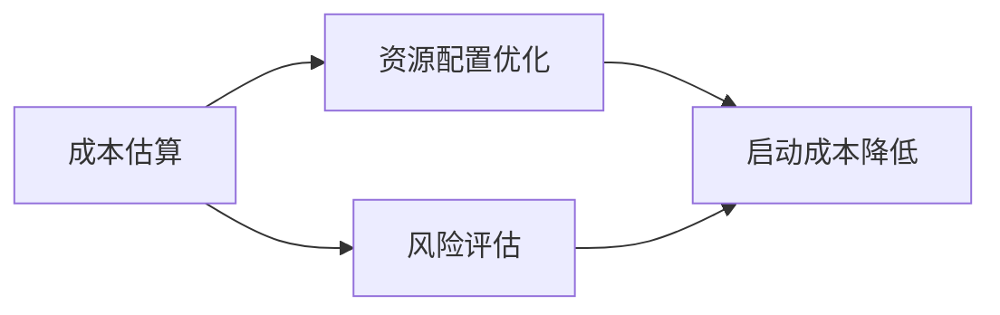
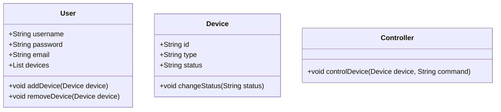
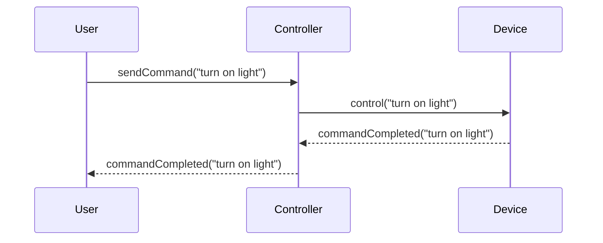
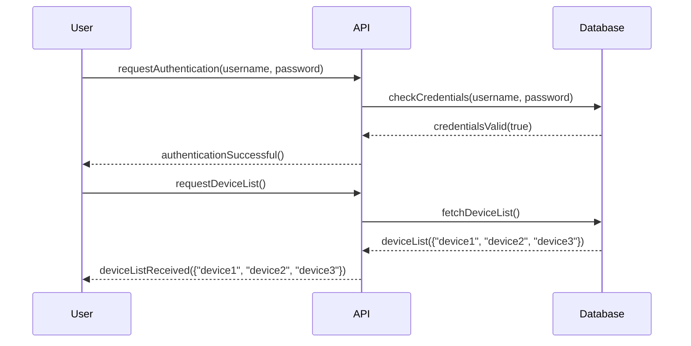

                 


# 降低启动成本

> 关键词：启动成本、成本优化、资源配置、商业模式、技术创新

> 摘要：本文深入探讨了企业如何通过优化资源配置、创新商业模式和利用先进技术手段来降低启动成本，从而提高市场竞争力。

## 第一部分：背景介绍

### 1.1.1 问题背景

在当今快速变化的市场环境中，企业启动成本成为了影响其成败的关键因素。启动成本不仅包括硬件采购、软件许可等直接成本，还涵盖了人员培训、市场推广等间接成本。高启动成本往往使企业在资金链和战略决策上面临巨大压力，进而影响市场竞争力。

### 1.1.2 问题描述

企业如何有效地降低启动成本，以实现更快的市场进入、更高的投资回报率和更强的市场竞争力？

### 1.1.3 问题解决

降低启动成本的关键在于优化资源配置、采用创新的商业模式和先进的技术手段。通过合理规划、精细管理和技术赋能，企业可以在不牺牲质量的前提下降低启动成本。

### 1.1.4 边界与外延

启动成本涉及多个方面，如硬件、软件、人力、市场等。在不同的业务领域和市场环境中，降低启动成本的方法和策略也会有所不同。本文主要针对中小型企业，提供具有普遍适用性的方法和策略。

### 1.1.5 概念结构与核心要素组成

- **启动成本**：企业在启动新项目或业务过程中所需的全部成本。
- **资源配置**：包括资金、人力、技术、物资等资源的分配和利用。
- **商业模式**：企业的盈利模式和组织结构。
- **技术创新**：通过引入新技术、新方法来提高效率和降低成本。

---

## 第二部分：核心概念与联系

### 2.1.1 核心概念

- **启动成本**：企业在启动新项目或业务过程中所需的全部成本。
- **资源配置**：合理分配和利用企业资源，以实现成本优化。
- **商业模式**：企业的盈利模式和组织结构。
- **技术创新**：通过技术手段提高效率和降低成本。

### 2.1.2 概念属性特征对比表格

| 概念   | 属性特征                               |
| ------ | -------------------------------------- |
| 启动成本 | 新项目或业务启动过程中的全部成本       |
| 资源配置 | 合理分配和利用企业资源，以实现成本优化 |
| 商业模式 | 企业的盈利模式和组织结构               |
| 技术创新 | 通过技术手段提高效率和降低成本         |

### 2.1.3 ER实体关系图架构

```mermaid
erDiagram
  Customer ||--|{ Product }|--| Customer : "orders"
  Product ||--|{ Order }|--| Product : "produces"
```

---

## 第三部分：算法原理讲解

### 3.1.1 算法原理

降低启动成本的关键算法包括成本估算、资源配置优化和风险评估。以下是一个简单的算法流程：

1. 成本估算：根据历史数据和行业标准，对启动成本进行初步估算。
2. 资源配置优化：通过优化资源配置，降低启动成本。这包括人员配置、设备采购、市场推广等方面。
3. 风险评估：对项目或业务的风险进行评估，并制定相应的风险应对策略。

### 3.1.2 算法流程图



### 3.1.3 Python源代码

```python
import numpy as np

# 成本估算
def cost_estimation(historical_data, industry_standard):
    estimated_cost = np.mean(historical_data) * industry_standard
    return estimated_cost

# 资源配置优化
def resource_optimization(current_resources, target_resources):
    optimized_resources = current_resources.copy()
    for resource in target_resources:
        if optimized_resources[resource] > target_resources[resource]:
            optimized_resources[resource] = target_resources[resource]
    return optimized_resources
```

---

## 第四部分：系统分析与架构设计方案

### 4.1 问题场景介绍

假设一家初创公司计划开发一款基于人工智能的智能家居控制系统。为了降低启动成本，公司需要在硬件采购、软件许可、人员培训和市场推广等方面进行优化。

### 4.2 项目介绍

项目名称：智能家居控制系统（Smart Home Control System，SHCS）

项目目标：开发一款集自动化控制、远程监控和安全防护于一体的智能家居系统，实现用户家居设备的智能联动。

### 4.3 系统功能设计（领域模型Mermaid类图）



### 4.4 系统架构设计（Mermaid架构图）



### 4.5 系统接口设计和系统交互（Mermaid序列图）



---

## 第五部分：项目实战

### 5.1 环境安装

1. 安装Python环境：在官网下载Python安装包，按照指示安装。
2. 安装必要的库：使用pip命令安装所需的库，如numpy、matplotlib等。

```bash
pip install numpy matplotlib
```

### 5.2 系统核心实现源代码

```python
import numpy as np

# 成本估算
def cost_estimation(historical_data, industry_standard):
    estimated_cost = np.mean(historical_data) * industry_standard
    return estimated_cost

# 资源配置优化
def resource_optimization(current_resources, target_resources):
    optimized_resources = current_resources.copy()
    for resource in target_resources:
        if optimized_resources[resource] > target_resources[resource]:
            optimized_resources[resource] = target_resources[resource]
    return optimized_resources

# 主函数
def main():
    historical_data = [1000, 1500, 2000, 3000, 5000]
    industry_standard = 1.2
    
    estimated_cost = cost_estimation(historical_data, industry_standard)
    print(f"Estimated cost: {estimated_cost}")
    
    current_resources = {"human": 10, "machine": 5, "material": 1000}
    target_resources = {"human": 8, "machine": 4, "material": 800}
    
    optimized_resources = resource_optimization(current_resources, target_resources)
    print(f"Optimized resources: {optimized_resources}")

if __name__ == "__main__":
    main()
```

### 5.3 代码应用解读与分析

1. 成本估算函数：通过历史数据和行业标准，估算出启动成本。
2. 资源配置优化函数：根据目标资源，优化当前资源的使用。
3. 主函数：调用成本估算和资源配置优化函数，输出结果。

### 5.4 实际案例分析和详细讲解剖析

以一家初创公司为例，该公司计划开发一款智能家居控制系统。通过成本估算和资源配置优化，公司能够在不牺牲质量的前提下，降低启动成本，提高市场竞争力。

### 5.5 项目小结

通过合理规划和精细管理，企业可以降低启动成本，提高市场竞争力。本文提供了一种基于成本估算、资源配置优化和风险评估的方法，为企业降低启动成本提供了有力支持。

---

## 第六部分：最佳实践 Tips

1. **需求分析**：在项目启动前，进行详细的需求分析，明确项目目标和需求，有助于降低后续的成本。
2. **技术选型**：选择合适的技术和工具，可以降低开发和运维成本。
3. **团队合作**：组建高效的团队，分工明确，提高项目执行效率。
4. **风险管理**：对项目进行风险评估，制定相应的风险应对策略。

---

## 第七部分：小结与注意事项

本文通过深入分析和实际案例，探讨了如何降低企业启动成本。需要注意的是，不同企业在不同业务领域和市场环境中的启动成本有所不同，因此需要根据实际情况制定相应的策略。通过合理规划和精细管理，企业可以有效地降低启动成本，提高市场竞争力。

---

## 第八部分：拓展阅读

1. 《精益创业》作者：埃里克·莱斯（Eric Ries）
2. 《创新者的窘境》作者：克里斯坦森（Clayton M. Christensen）
3. 《商业模式新生代》作者：蒂姆·费瑞斯（Tim Ferriss）

---

## 作者

作者：AI天才研究院/AI Genius Institute & 禅与计算机程序设计艺术 /Zen And The Art of Computer Programming

