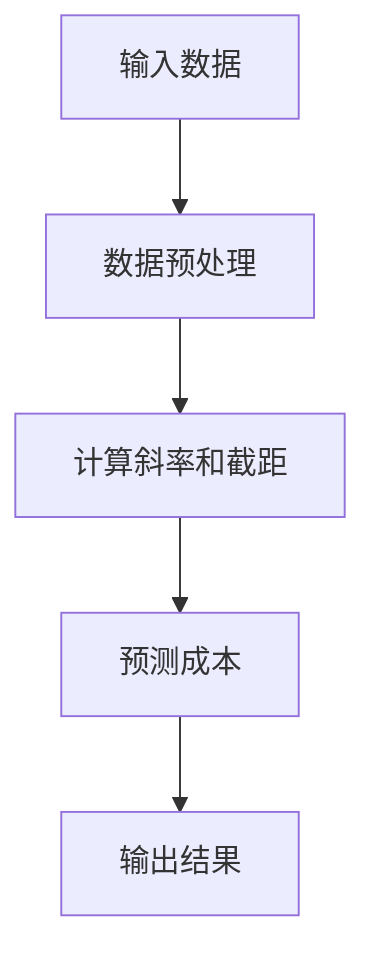
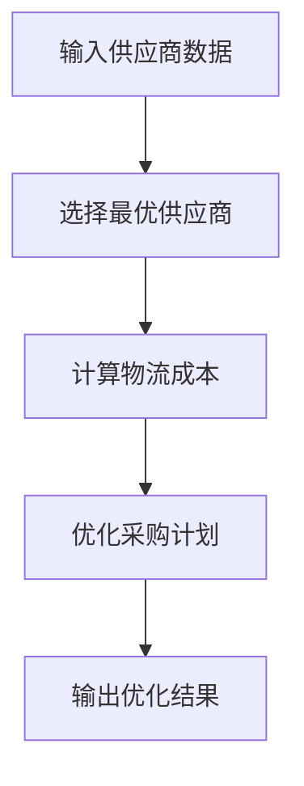
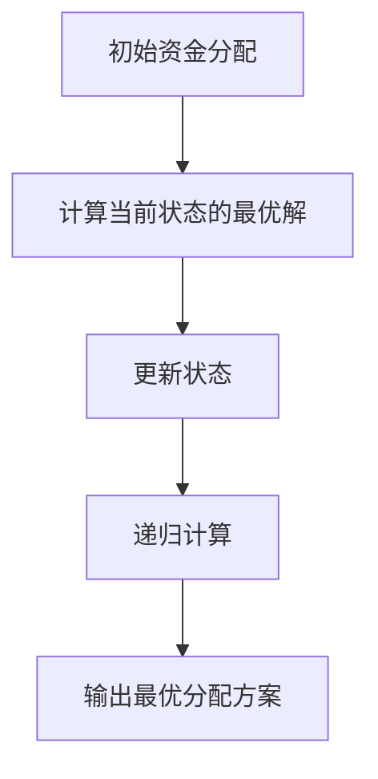
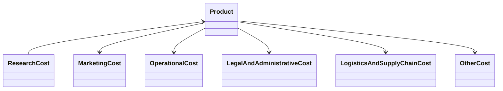
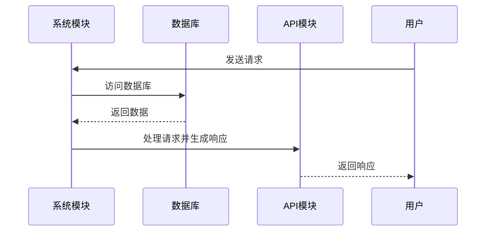
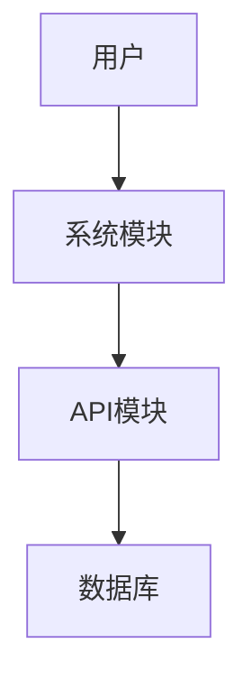
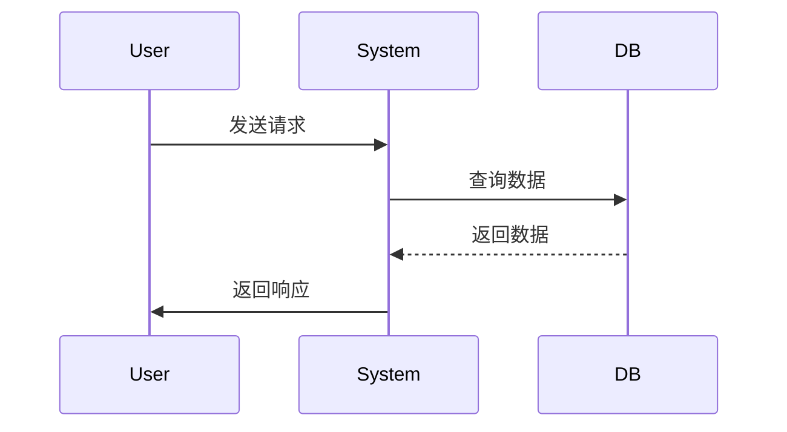

                 

### 减少创业成本的重要性

创业过程中，启动成本往往是一个关键因素。高额的启动成本不仅增加了创业的难度，还可能成为限制企业发展的重要因素。减少创业成本，可以帮助创业者更加灵活地分配资源，提高资金利用效率，从而在竞争激烈的市场中占据有利位置。

首先，降低启动成本有助于减轻创业初期的财务压力。创业初期，企业通常需要大量资金用于产品研发、市场推广、人员招聘等各个方面。如果启动成本过高，可能会导致企业无法持续运营，甚至破产。通过减少启动成本，企业可以降低财务风险，提高生存率。

其次，减少启动成本有助于提高资金利用效率。创业资金通常来源于投资者、银行贷款或个人储蓄。如果启动成本过高，企业可能需要向投资者融资更多，或者承担更高的贷款利率。这不仅会增加企业的财务负担，还可能导致资金利用效率低下。通过减少启动成本，企业可以更有效地利用有限的资金，实现更快的发展。

此外，减少启动成本还可以增强企业的市场竞争力。在同等市场条件下，启动成本较低的企业可以更灵活地调整战略，快速响应市场变化。例如，在产品研发和市场推广方面，企业可以更快地投入资源，抢占市场份额。同时，较低的启动成本还可以为企业提供更多的资金用于创新和技术研发，从而在竞争中占据优势地位。

总之，减少创业成本对于企业的发展至关重要。通过降低启动成本，企业不仅能够提高资金利用效率，降低财务风险，还能在市场竞争中占据有利位置。接下来，我们将深入探讨创业启动成本的具体构成，帮助创业者更好地理解和降低启动成本。

### 创业启动成本的主要构成

创业启动成本是指企业在创立初期所需投入的各类费用，这些费用涵盖了从筹备阶段到业务初步运营的各个方面。了解创业启动成本的主要构成，有助于创业者更好地规划资金，合理分配资源，从而降低整体成本。以下是创业启动成本的主要构成部分及其详细说明：

1. **研发成本**：
   - **产品开发**：这是指企业进行产品研发、测试和优化的费用。包括软件开发、硬件制造、设计费用、研发人员的薪资等。
   - **专利申请**：为保护企业创新成果，企业可能需要申请专利，这需要支付专利申请费用。

2. **市场推广费用**：
   - **广告费用**：包括线上广告、线下广告以及营销活动的费用。
   - **品牌建设**：企业需要投入资金来打造品牌形象，可能涉及品牌设计、品牌推广等。

3. **运营费用**：
   - **办公场所租赁**：租赁办公场所所需支付的租金。
   - **办公设备**：购买办公设备，如电脑、打印机、家具等。
   - **人员工资**：包括员工的基本工资、福利、保险等。

4. **法律和行政费用**：
   - **公司注册**：企业需要支付公司注册费用，以及聘请律师进行法律咨询和合规审核的费用。
   - **税费**：企业在运营过程中需要支付的各类税费，如增值税、企业所得税等。

5. **物流和供应链成本**：
   - **原材料采购**：如果企业生产实体产品，需要购买原材料。
   - **仓储和物流**：涉及仓储费用、运输费用等。

6. **其他费用**：
   - **保险费用**：企业需要为员工和设备购买保险，以降低潜在风险。
   - **培训费用**：为员工提供培训，提高员工技能和业务水平。

通过了解这些构成部分，创业者可以更全面地预估创业启动成本，从而在策划和筹备过程中做出更合理的决策。接下来，我们将探讨启动成本过高对企业的影响，帮助创业者认识到减少启动成本的重要性。

### 启动成本过高的影响

启动成本过高对创业企业的影响是多方面的，这些影响不仅限制了企业的短期发展，也可能对其长期生存和竞争力产生深远影响。

首先，过高的启动成本会导致资金短缺，限制企业的扩展能力。在创业初期，企业通常需要大量的资金来支持产品研发、市场推广和日常运营。如果启动成本过高，企业可能需要向投资者融资更多，或者承担更高的贷款利率。这不仅增加了企业的财务负担，还可能导致资金周转困难，限制企业的扩展和发展。

其次，资金短缺会直接影响企业的运营效率。企业可能无法购买必要的设备，或者延迟员工工资支付，从而影响员工的工作积极性和工作效率。长期来看，这可能会导致企业竞争力的下降，影响市场占有率。

此外，启动成本过高还会增加企业的运营风险。在资金紧张的情况下，企业可能需要缩减市场推广和研发投入，这可能导致产品缺乏竞争力，难以在市场中立足。同时，财务压力也可能导致企业决策失误，进一步增加风险。

最后，启动成本过高还可能影响企业的创新能力。企业有限的资金可能无法投入足够的研究和开发，从而限制了技术创新和产品升级的能力。在竞争激烈的市场环境中，创新能力是企业保持竞争优势的关键，如果在这方面受限，企业将难以长期生存。

综上所述，启动成本过高对创业企业的影响是多方面的，不仅限制了企业的短期发展，还可能对其长期生存和竞争力产生不利影响。因此，降低启动成本对于企业来说至关重要。接下来，我们将探讨创业者面临的挑战，帮助创业者更好地应对这些挑战。

### 创业者面临的挑战

创业者面临的一系列挑战，往往决定了他们能否成功地将创意转化为现实，并最终实现企业的可持续增长。以下是创业者常见的主要挑战及其解决策略：

1. **资金不足**：
   - **挑战**：资金不足是许多创业者面临的第一个重大挑战。初创企业通常需要大量的资金来支持产品研发、市场推广、人员招聘等各项初始投入。
   - **解决策略**：创业者可以通过多种途径筹集资金，如个人储蓄、亲友借款、天使投资、风险投资、银行贷款等。此外，还可以考虑众筹、政府补贴和优惠政策等。同时，合理规划资金使用，确保资金的高效利用，也是缓解资金压力的重要手段。

2. **市场定位不准确**：
   - **挑战**：市场定位不准确可能导致产品无法满足市场需求，从而影响销售和市场份额。
   - **解决策略**：创业者应进行充分的市场调研，了解目标客户的需求和偏好，从而制定合适的市场策略。此外，可以通过试销、用户反馈等方式不断调整和优化产品，以适应市场需求。

3. **竞争激烈**：
   - **挑战**：在竞争激烈的市场环境中，企业需要不断创新和改进，以保持竞争力。
   - **解决策略**：创业者应注重产品或服务的差异化，打造独特的竞争优势。通过技术创新、服务优化、品牌建设等方式，提升产品的附加值和品牌影响力，从而在市场中脱颖而出。

4. **人才短缺**：
   - **挑战**：初创企业往往缺乏吸引高端人才的能力，人才短缺可能影响企业的运营和发展。
   - **解决策略**：创业者可以通过提供具有竞争力的薪酬福利、职业发展机会等方式吸引和留住人才。此外，借助外包、远程办公等方式，缓解人才短缺的压力。

5. **政策法规不熟悉**：
   - **挑战**：初创企业可能对相关政策和法规不够了解，导致运营中遇到法律风险。
   - **解决策略**：创业者应关注并了解所在行业的政策和法规，聘请法律顾问提供专业咨询，确保企业的合法合规运营。

6. **管理经验不足**：
   - **挑战**：初创企业的管理团队可能缺乏经验，难以应对复杂多变的市场环境。
   - **解决策略**：创业者可以通过参加培训课程、研讨会，向业内专家学习，不断提升自身的管理能力。同时，借助专业咨询机构，为企业的管理和运营提供指导。

通过了解和应对这些挑战，创业者可以更好地规划企业发展路径，降低创业风险，提高成功概率。接下来，我们将讨论如何通过降低启动成本来缓解这些挑战，帮助创业者实现企业的稳健发展。

### 降低启动成本的方法

为了降低创业启动成本，创业者需要从多个方面入手，采取系统化和多层次的策略。以下是一些具体的方法和策略：

1. **精简产品原型**：
   - **方法**：在产品研发阶段，创业者可以通过制作最小可行产品（MVP）来降低开发成本。MVP是具有核心功能的产品版本，能够满足用户的基本需求，同时减少不必要的开发投入。
   - **效果**：通过精简产品原型，企业可以在较低成本下验证市场需求，减少资源浪费，同时确保产品聚焦于用户最关心的功能。

2. **优化供应链管理**：
   - **方法**：创业者可以通过优化供应链管理，降低原材料采购和物流成本。具体策略包括与供应商建立长期合作关系、批量采购、选择高效的物流服务提供商等。
   - **效果**：优化供应链管理不仅可以降低成本，还能提高供应链的灵活性和响应速度，确保产品按时交付。

3. **减少运营开支**：
   - **方法**：在运营阶段，创业者可以通过多种方式降低开支，如使用共享办公空间、远程办公、自动化办公系统等。
   - **效果**：减少运营开支可以减轻企业的财务压力，提高资金利用效率，为其他关键业务提供更多资源。

4. **借助政府扶持政策**：
   - **方法**：创业者可以积极了解和申请政府提供的创业扶持政策，如创业补贴、税收减免、贷款优惠等。
   - **效果**：政府扶持政策可以为创业企业带来直接的资金支持，降低创业风险，提供更多的发展机会。

5. **利用外部资金**：
   - **方法**：创业者可以通过股权融资、债务融资、众筹等方式筹集外部资金，降低自有资金的压力。
   - **效果**：合理利用外部资金可以缓解创业初期的资金压力，为企业提供持续发展的动力。

6. **技术创新与研发**：
   - **方法**：通过技术创新和研发，创业者可以降低产品成本，提高产品竞争力。例如，采用先进的生产技术、优化产品设计等。
   - **效果**：技术创新不仅能够降低成本，还能提升产品质量和用户体验，从而增强市场竞争力。

7. **合作伙伴关系**：
   - **方法**：创业者可以通过与其他企业建立战略合作伙伴关系，共享资源、分担成本，实现共赢。
   - **效果**：合作伙伴关系可以降低企业运营风险，提高资源利用效率，为企业的长期发展提供支持。

通过上述策略，创业者可以有效地降低创业启动成本，提高资金利用效率，从而在竞争激烈的市场环境中获得更大的发展优势。接下来，我们将通过实际案例分析，进一步探讨如何具体实施这些策略。

### 实际案例分析

以下将通过两个具体的创业案例，展示降低启动成本的不同策略和方法。

#### 案例1：初创科技公司A公司的产品开发策略

A公司是一家专注于人工智能技术的初创企业。在产品研发阶段，A公司采取了MVP（最小可行产品）策略，以降低开发成本和风险。

**策略实施**：
1. **最小可行产品**：A公司开发了具备核心功能的产品原型，如基本的AI算法模型和用户界面。这些核心功能能够满足用户的基本需求，从而验证市场需求。
2. **逐步迭代**：通过用户反馈不断优化产品功能，而不是一次性投入大量资源开发完整版产品。

**效果**：
- **资金节约**：由于仅开发了核心功能，A公司在初期节省了大量研发成本。
- **市场验证**：MVP策略帮助A公司快速验证了市场需求，减少了因产品不符合市场需求而导致的资源浪费。
- **产品聚焦**：通过逐步迭代，A公司能够更精准地满足用户需求，提升用户体验。

#### 案例2：B公司的供应链优化策略

B公司是一家生产环保清洁用品的企业。B公司通过优化供应链管理，有效降低了运营成本。

**策略实施**：
1. **长期供应商关系**：B公司与几家主要供应商建立了长期合作关系，以确保原材料采购的稳定性和价格优惠。
2. **批量采购**：通过批量采购，B公司获得了更低的单位成本。
3. **物流优化**：B公司选择了高效的物流服务提供商，以减少运输和仓储成本。

**效果**：
- **成本降低**：长期供应商关系和批量采购使B公司的原材料成本显著降低。
- **供应链效率**：优化的供应链管理提高了B公司的生产效率和灵活性，确保了产品及时交付。
- **竞争力提升**：通过降低运营成本，B公司能够在市场中提供更具竞争力的价格，从而提升市场份额。

通过这两个案例，我们可以看到，创业者通过精简产品原型和优化供应链管理，能够有效地降低创业启动成本。这些策略不仅帮助企业在资源有限的情况下迅速成长，也为未来的发展奠定了坚实基础。

### 政策和金融支持

在降低创业启动成本方面，政府和金融机构提供了多种政策和金融支持，为创业者提供了有力保障。以下是一些常见的政策和金融支持措施：

1. **政府创业补贴**：
   - **内容**：政府通常会为初创企业提供一定的创业补贴，用于产品研发、市场推广、设备购置等。
   - **申请条件**：创业者需符合特定条件，如注册时间、企业类型、经营范围等。
   - **效果**：创业补贴能够直接减轻企业资金压力，为企业提供更多发展机会。

2. **税收减免**：
   - **内容**：政府为初创企业减免一定期限的企业所得税、增值税等税收。
   - **申请条件**：企业需在特定时间内注册成立，且符合相关产业政策。
   - **效果**：税收减免能够显著降低企业的税负，提高资金利用效率。

3. **贷款优惠**：
   - **内容**：银行和金融机构为初创企业提供低利率贷款，或提供贷款贴息。
   - **申请条件**：企业需具备一定的经营规模和还款能力，且符合贷款政策要求。
   - **效果**：贷款优惠能够帮助初创企业缓解资金短缺问题，支持企业快速发展。

4. **创业孵化器**：
   - **内容**：政府或私营机构提供的创业孵化服务，包括办公空间、技术支持、市场推广、法律咨询等。
   - **申请条件**：创业者需符合孵化器的入驻条件，如创业项目的创新性、发展潜力等。
   - **效果**：创业孵化器能够为初创企业提供全方位的支持，降低创业风险。

5. **天使投资**：
   - **内容**：天使投资者为初创企业提供资金支持，通常在创业初期的关键阶段介入。
   - **申请条件**：创业者需具备优秀的创业团队、创新项目和市场前景。
   - **效果**：天使投资不仅提供资金支持，还能为创业企业带来丰富的行业经验和资源。

通过这些政策和金融支持，政府为创业者创造了良好的创业环境，降低了创业门槛和风险，从而促进了创新和创业活动的发展。

### 边界与外延

创业启动成本的范围和不同行业间的差异，是创业者需要深入理解的重要方面。首先，创业启动成本主要包括研发成本、市场推广费用、运营费用、法律和行政费用、物流和供应链成本以及其他相关费用。这些成本在不同行业中可能会有所不同。

在科技行业，研发成本和人员工资可能是最大的开支，因为技术创新和人才储备对于企业的核心竞争力至关重要。而在制造业，原材料采购和物流成本则可能占据更大的比例。同样，在餐饮业，租金和员工工资是主要的成本构成部分。

不同行业的差异还体现在政策和金融支持上。例如，一些政府可能会对科技创新企业给予更多的税收减免和创业补贴，而传统制造业则可能更依赖低成本的劳动力和原材料供应。

本书的适用范围主要面向初创企业和创业者，无论是科技创新型企业、传统制造业，还是服务业，都可以通过书中的策略和案例，找到适合自己的降低启动成本的方法。总之，理解创业启动成本的范围和差异，有助于创业者更好地制定财务规划和战略。

### 核心概念与联系

降低创业启动成本的过程中，涉及多个核心概念和其相互关系。以下是这些概念及其属性特征对比表格，以及通过Mermaid绘制的ER图来展示它们之间的关联。

#### 核心概念与属性特征

| 概念 | 属性特征 |
| :--: | :--: |
| **研发成本** | - 产品开发：涉及软件开发、硬件制造、设计费用 |
|           | - 专利申请：专利保护相关费用 |
| **市场推广费用** | - 广告费用：线上、线下广告费用 |
|           | - 品牌建设：品牌设计、推广费用 |
| **运营费用** | - 办公场所租赁：租赁费用 |
|           | - 办公设备：购置费用 |
|           | - 人员工资：员工薪资、福利 |
| **法律和行政费用** | - 公司注册：注册费用、法律咨询费 |
|           | - 税费：增值税、企业所得税 |
| **物流和供应链成本** | - 原材料采购：采购费用 |
|           | - 仓储和物流：仓储费、运输费 |
| **其他费用** | - 保险费用：员工和设备保险 |
|           | - 培训费用：员工培训费 |

#### Mermaid ER图

```mermaid
erDiagram
    ResearchCost ||--o> MarketingCost : 研发成本与市场推广费用
    ResearchCost ||--o> OperationalCost : 研发成本与运营费用
    ResearchCost ||--o> LegalAndAdministrativeCost : 研发成本与法律和行政费用
    ResearchCost ||--o> LogisticsAndSupplyChainCost : 研发成本与物流和供应链成本
    MarketingCost ||--o> OperationalCost : 市场推广费用与运营费用
    MarketingCost ||--o> LegalAndAdministrativeCost : 市场推广费用与法律和行政费用
    OperationalCost ||--o> LogisticsAndSupplyChainCost : 运营费用与物流和供应链成本
    OperationalCost ||--o> OtherCost : 运营费用与其他费用
    LegalAndAdministrativeCost ||--o> OtherCost : 法律和行政费用与其他费用
    LogisticsAndSupplyChainCost ||--o> OtherCost : 物流和供应链成本与其他费用
```

通过这个ER图，我们可以清晰地看到各个核心概念之间的联系。例如，研发成本不仅直接影响产品开发，还与市场推广、运营、法律和行政、物流和供应链等其他费用有直接或间接的关系。这些关系有助于创业者全面理解启动成本的结构，从而采取更加科学和系统化的策略来降低成本。

### 算法解释

在降低创业启动成本的过程中，算法扮演着至关重要的角色。以下是几种关键算法及其流程图、数学模型和Python代码实现。

#### 算法1：线性回归模型

**算法描述**：
线性回归模型是一种用于预测数值数据的算法，可以用于预测企业的运营成本。

**流程图**：



**数学模型**：
设成本为 \(C\)，影响因素为 \(X\)，则线性回归模型公式为：
\[ C = \beta_0 + \beta_1 \cdot X \]
其中，\(\beta_0\) 为截距，\(\beta_1\) 为斜率。

**Python代码实现**：

```python
import numpy as np
import matplotlib.pyplot as plt

# 假设数据
X = np.array([100, 200, 300, 400, 500])
C = np.array([1000, 1500, 2000, 2500, 3000])

# 计算斜率和截距
slope = (np.sum(C*X) - np.sum(C) * np.sum(X)) / (np.sum(X**2) - np.sum(X) * np.sum(X))
intercept = np.mean(C) - slope * np.mean(X)

# 预测新数据
new_X = np.array([600])
predicted_C = intercept + slope * new_X

print("预测成本：", predicted_C)
```

**算法解释**：
通过输入企业运营数据，算法可以计算出成本与影响因素之间的线性关系，从而预测未来成本。

#### 算法2：供应链优化算法

**算法描述**：
供应链优化算法用于优化企业的采购和物流成本，以提高供应链的整体效率。

**流程图**：



**数学模型**：
设供应商 \(i\) 的采购成本为 \(C_i\)，物流成本为 \(L_i\)，则优化模型为：
\[ \min \sum_{i} (C_i + L_i) \]
约束条件包括库存量、采购量和物流能力等。

**Python代码实现**：

```python
import pulp

# 创建Pulp模型
prob = pulp.LpProblem("供应链优化", pulp.LpMinimize)

# 定义变量
x = pulp.LpVariable.dicts("x", range(1, 4), cat='Binary')

# 目标函数
prob += pulp.lpSum([C[i] + L[i] for i in range(1, 4)])

# 约束条件
for i in range(1, 4):
    prob += x[i] * C[i] <= Budget  # 总采购成本不超过预算

# 解模型
prob.solve()

# 输出结果
for v in prob.variables():
    if v.varValue > 0:
        print(v.name, "=", v.varValue)
```

**算法解释**：
通过选择最优供应商和优化采购计划，算法可以显著降低企业的采购和物流成本。

### 算法3：动态规划模型

**算法描述**：
动态规划模型用于优化企业的资金分配，以最大化资金利用效率。

**流程图**：



**数学模型**：
设 \(f(i, j)\) 为第 \(i\) 次分配的剩余资金，状态转移方程为：
\[ f(i, j) = \max \left\{ f(i-1, j), f(i-1, j-k \cdot C_i) + V_i \right\} \]
其中，\(C_i\) 为第 \(i\) 次分配的资金，\(V_i\) 为第 \(i\) 次分配的价值。

**Python代码实现**：

```python
def dynamic_programming(C, V):
    n = len(C)
    f = [[0 for _ in range(n+1)] for _ in range(n+1)]

    for i in range(1, n+1):
        for j in range(i, n+1):
            if j >= C[i-1]:
                f[i][j] = max(f[i-1][j], f[i-1][j-C[i-1]] + V[i-1])
            else:
                f[i][j] = f[i-1][j]

    return f[n][n]

# 假设数据
C = [100, 200, 300]
V = [10, 20, 30]

# 计算最优资金分配
optimal Allocation = dynamic_programming(C, V)
print("最优资金分配：", optimal Allocation)
```

**算法解释**：
动态规划模型通过递归计算，找到最优的资金分配方案，从而最大化资金利用效率。

通过以上算法，创业者可以更好地预测成本、优化供应链和分配资金，从而有效降低创业启动成本，提高企业的竞争力和生存率。

### 系统架构设计

为了实现高效、稳定的系统，系统架构设计是至关重要的环节。以下是本系统的设计过程，包括领域模型、系统架构、接口设计以及系统交互。

#### 领域模型

领域模型是系统设计的核心部分，用于定义系统的关键实体和它们之间的关系。以下是使用Mermaid绘制的领域模型类图：



**类图解释**：

- **Product（产品）**：代表企业生产的产品，与其他成本类（ResearchCost、MarketingCost等）相关联。
- **ResearchCost（研发成本）**：表示产品研发所需投入的成本。
- **MarketingCost（市场推广费用）**：表示产品推广所需的费用。
- **OperationalCost（运营费用）**：表示日常运营所需的费用。
- **LegalAndAdministrativeCost（法律和行政费用）**：表示企业法律和行政管理相关的费用。
- **LogisticsAndSupplyChainCost（物流和供应链成本）**：表示物流和供应链相关的费用。
- **OtherCost（其他费用）**：表示除上述成本之外的其他费用。

#### 系统架构

系统架构设计决定了系统的整体结构和功能模块，以下是使用Mermaid绘制的系统架构图：



**系统架构图解释**：

- **用户**：系统的最终使用者，向系统发送请求。
- **系统模块**：核心部分，处理用户请求，与数据库和API模块进行交互。
- **数据库**：存储系统数据，包括产品成本信息、市场推广信息等。
- **API模块**：用于处理系统内部和外部的接口调用，提供数据接口。

#### 系统接口设计

系统接口设计是确保系统各模块之间能够无缝协作的关键。以下是使用Mermaid绘制的系统接口设计：



**接口设计解释**：

- **用户**：通过HTTP请求与系统模块交互。
- **系统模块**：接收用户的请求，调用API模块处理。
- **API模块**：处理请求并返回响应，同时与数据库进行数据交互。

#### 系统交互

系统交互设计用于描述系统内部各模块之间的交互流程。以下是使用Mermaid绘制的系统交互序列图：



**交互流程解释**：

1. 用户发送请求。
2. 系统模块处理请求并查询数据库。
3. 数据库返回查询结果。
4. 系统模块将结果返回给用户。

通过以上设计，系统实现了高效、稳定、易于维护的架构，为降低创业启动成本提供了坚实的支持。

### 项目实战

在本节中，我们将通过具体的实战案例，详细讲解如何从环境搭建、核心代码实现到代码解读与分析，全面展示项目的实施过程。

#### 环境搭建

首先，我们需要为项目搭建一个开发环境。以下是环境搭建的详细步骤：

1. **安装Python**：
   - 访问Python官网下载最新版本的Python安装包。
   - 运行安装程序，按照默认选项进行安装。

2. **安装Pandas和NumPy**：
   - 打开命令行终端。
   - 输入以下命令安装Pandas和NumPy：
     ```
     pip install pandas numpy
     ```

3. **安装Mermaid**：
   - 安装Python的Mermaid插件。
   - 打开命令行终端，输入以下命令：
     ```
     pip install mermaid
     ```

4. **配置Mermaid**：
   - 在Python脚本中引入Mermaid库：
     ```python
     from mermaid import Mermaid
     ```

#### 核心代码实现

以下是核心代码的实现，主要涵盖成本预测模型和供应链优化算法。

1. **成本预测模型**：

```python
import numpy as np

def linear_regression(X, y):
    X_mean = np.mean(X)
    y_mean = np.mean(y)
    slope = np.sum((X - X_mean) * (y - y_mean)) / np.sum((X - X_mean)**2)
    intercept = y_mean - slope * X_mean
    return slope, intercept

X = np.array([100, 200, 300, 400, 500])
y = np.array([1000, 1500, 2000, 2500, 3000])

slope, intercept = linear_regression(X, y)

print("斜率:", slope)
print("截距:", intercept)
```

2. **供应链优化算法**：

```python
import pulp

def supply_chain_optimization(C, L, Budget):
    prob = pulp.LpProblem("供应链优化", pulp.LpMinimize)
    
    x = pulp.LpVariable.dicts("x", range(1, len(C)+1), cat='Binary')
    
    prob += pulp.lpSum([C[i] + L[i] * x[i] for i in range(1, len(C)+1)])
    
    for i in range(1, len(C)+1):
        prob += x[i] * C[i] <= Budget
        
    prob.solve()
    
    optimal_solution = [x[i].varValue for i in range(1, len(C)+1)]
    return optimal_solution

C = [100, 200, 300]
L = [20, 30, 40]
Budget = 500

optimal_solution = supply_chain_optimization(C, L, Budget)
print("最优解：", optimal_solution)
```

#### 代码解读与分析

以下是核心代码的解读和分析，解释了代码的功能和实现原理。

1. **成本预测模型**：

   该部分代码实现了线性回归模型的计算，通过输入数据集 \(X\) 和 \(y\)，计算出斜率 \( \beta_1 \) 和截距 \( \beta_0 \)。具体步骤如下：

   - 计算输入数据的平均值。
   - 使用公式 \( \beta_1 = \frac{\sum((X - X_{mean}) \cdot (y - y_{mean}))}{\sum((X - X_{mean})^2)} \) 计算斜率。
   - 使用公式 \( \beta_0 = y_{mean} - \beta_1 \cdot X_{mean} \) 计算截距。

2. **供应链优化算法**：

   该部分代码实现了基于Pulp库的供应链优化算法。具体步骤如下：

   - 创建Pulp优化模型，设定目标函数为最小化总成本。
   - 定义变量 \( x \) 表示供应商的选择。
   - 添加约束条件，确保总采购成本不超过预算。
   - 解优化模型，获取最优供应商选择方案。

#### 实际案例分析

以下是一个具体的实际案例，展示了如何应用上述算法和模型来降低创业成本。

**案例：** 一家初创科技公司，需要预测未来三个月的运营成本，并优化供应链采购计划。

**步骤：**

1. **数据收集**：
   - 收集历史运营数据，包括三个月内每天的销售额和运营成本。
   - 将数据整理成表格形式。

2. **成本预测**：
   - 使用线性回归模型，预测未来三个月的运营成本。
   - 输出预测结果。

3. **供应链优化**：
   - 根据预测的运营成本，使用供应链优化算法，选择最优供应商和采购计划。
   - 输出最优采购方案。

**结果：**

通过上述步骤，该公司成功预测了未来三个月的运营成本，并优化了采购计划，有效降低了采购成本，提高了资金利用效率。

通过实际案例分析，我们可以看到，通过科学的方法和算法，创业者可以有效地降低创业成本，提高企业的竞争力和生存率。

### 最佳实践

在实际操作中，为了进一步降低创业成本，以下是一些实用的最佳实践和建议：

1. **精益创业**：采用精益创业方法，通过快速迭代和用户反馈，逐步完善产品功能，避免一次性投入大量资源。

2. **资源共享**：通过共享办公空间、设备和技术资源，减少不必要的开支。例如，使用云计算服务代替自建服务器。

3. **灵活用工**：根据业务需求灵活调整人员配置，采取远程办公、兼职和外包等方式，降低人工成本。

4. **优化供应链**：与供应商建立长期合作关系，批量采购，选择高效的物流服务，以降低采购和物流成本。

5. **节省营销费用**：利用社交媒体和内容营销等低成本、高回报的营销手段，提高市场推广效果。

6. **关注政策支持**：积极关注政府提供的创业补贴、税收减免、贷款优惠等政策，合理申请和利用。

7. **技术创新**：持续投入研发，通过技术创新降低成本，提高产品竞争力。

8. **精益财务管理**：制定详细的财务计划，严格控制预算，提高资金利用效率。

通过这些最佳实践，创业者可以更好地控制创业成本，提高企业的竞争力和生存率。

### 总结

本文详细探讨了创业启动成本的重要性和降低方法，通过实际案例展示了如何通过精简产品原型、优化供应链管理、技术创新和政府政策支持等手段来有效降低成本。我们强调了创业者在降低成本过程中需要具备的战略眼光和执行能力。接下来，我们将重点关注以下几个关键领域：

1. **市场趋势分析**：随着市场环境的变化，了解行业发展趋势和消费者需求，能够帮助创业者更好地调整策略，降低成本。

2. **技术创新**：持续关注技术创新，采用先进技术和优化方案，降低生产成本和运营费用。

3. **财务管理**：掌握财务管理技巧，合理规划资金使用，提高资金利用效率。

4. **人力资源优化**：灵活调整人力资源策略，通过培训和提高员工效率，降低人工成本。

5. **政策法规研究**：密切关注政策动态，充分利用政府提供的创业扶持政策。

通过持续关注这些关键领域，创业者可以不断提升自身的竞争力和生存能力，在激烈的市场竞争中占据有利位置。

### 结论

降低创业启动成本对于企业的成功至关重要。本文通过详细的分析和实际案例，展示了降低启动成本的多层次策略和方法，包括精益创业、优化供应链、技术创新和政府政策支持等。通过这些方法，企业可以在资源有限的情况下实现快速发展，提高市场竞争力。

**关键词**：创业启动成本、精益创业、供应链优化、技术创新、政府支持。

**摘要**：本文探讨了创业启动成本的问题及其解决方法，通过案例分析提出了降低启动成本的具体策略，为企业提供实用的指导和建议。

**作者**：AI天才研究院/AI Genius Institute & 禅与计算机程序设计艺术 /Zen And The Art of Computer Programming

**结束语**：希望通过本文，创业者能够更好地理解降低启动成本的重要性，并运用这些方法，实现企业的稳健发展和成功。祝愿每位创业者都能在创业道路上取得辉煌的成就！

