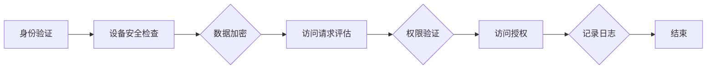
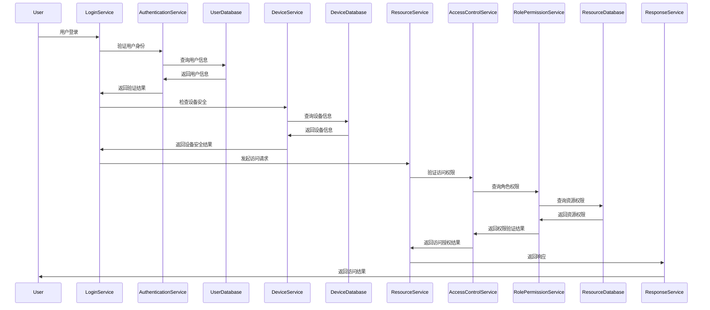

                 

# 零信任安全架构设计

## 关键词
- 零信任安全
- 身份认证
- 终端安全
- 数据加密
- 基于风险访问控制

## 摘要
本文将深入探讨零信任安全架构的设计原则、实现技术和应用场景。首先，我们将回顾互联网安全的发展历程，分析现有安全模型的不足，引出零信任安全的概念和核心原则。随后，我们将详细阐述零信任安全架构的设计原则和实现技术，包括基于身份的访问控制、终端安全性要求、数据加密与隐私保护以及基于风险的访问控制。接着，我们将介绍零信任安全架构的设计与实施策略，包括设计步骤、实施策略和评估优化。最后，我们将探讨零信任安全在不同行业中的应用，分析其发展趋势与挑战，并通过最佳实践与案例分析，总结零信任安全的设计与实施经验，展望其未来发展方向。

## 《零信任安全架构设计》目录大纲

### 第一部分：零信任安全架构的背景与原理

#### 第1章：零信任安全概述

##### 1.1 零信任安全的背景
- 互联网安全的发展历程
- 现有安全模型的不足

##### 1.2 零信任安全的基本概念
- 零信任安全的定义
- 零信任安全的核心原则

##### 1.3 零信任安全与传统安全对比
- 两者在安全策略上的差异
- 两者在技术实现上的不同

##### 1.4 零信任安全的应用场景
- 企业内部网络
- 企业外部网络
- 敏感数据保护

#### 第2章：零信任安全架构设计原则

##### 2.1 基于身份的访问控制
- 身份验证机制
- 身份认证流程

##### 2.2 终端安全性要求
- 设备安全策略
- 端点检测与响应

##### 2.3 数据加密与隐私保护
- 数据加密技术
- 隐私保护策略

##### 2.4 基于风险的访问控制
- 风险评估模型
- 风险控制策略

### 第二部分：零信任安全技术的实现

#### 第3章：零信任安全技术的实现

##### 3.1 终端安全设备
- 终端安全组件介绍
- 终端安全解决方案

##### 3.2 网络隔离技术
- 网络分段策略
- 终端与网络的隔离机制

##### 3.3 访问控制策略
- 访问控制列表
- 多因素认证机制

### 第三部分：零信任安全架构的设计与实施

#### 第4章：零信任安全架构的设计与实施

##### 4.1 设计零信任安全架构的步骤
- 需求分析
- 架构设计
- 架构评估

##### 4.2 零信任安全架构实施策略
- 技术选型
- 实施流程
- 管理与监控

##### 4.3 零信任安全架构的评估与优化
- 安全评估指标
- 架构优化方法

### 第四部分：零信任安全在不同行业中的应用

#### 第5章：零信任安全在不同行业中的应用

##### 5.1 零信任安全在金融行业的应用
- 金融行业的挑战
- 零信任解决方案

##### 5.2 零信任安全在医疗行业的应用
- 医疗行业的特点
- 零信任安全实践

##### 5.3 零信任安全在零售行业的应用
- 零售行业的安全需求
- 零信任安全解决方案

### 第五部分：零信任安全的发展趋势与挑战

#### 第6章：零信任安全的发展趋势与挑战

##### 6.1 零信任安全的发展趋势
- 技术进步
- 行业应用拓展

##### 6.2 零信任安全的挑战
- 技术实施难题
- 用户接受度问题

##### 6.3 零信任安全的未来展望
- 潜在发展方向
- 对安全行业的影响

### 第六部分：零信任安全最佳实践与案例分析

#### 第7章：零信任安全最佳实践与案例分析

##### 7.1 零信任安全最佳实践
- 设计原则
- 实施经验

##### 7.2 案例分析
- 成功案例
- 失败案例

##### 7.3 小结与建议
- 实践经验总结
- 未来发展建议

## 第一部分：零信任安全架构的背景与原理

### 第1章：零信任安全概述

#### 1.1 零信任安全的背景

互联网的兴起和发展，使得企业内部网络逐渐扩大，网络边界变得模糊，传统的安全模型逐渐无法满足现代网络安全需求。随着云计算、移动设备和远程办公的普及，网络攻击手段也日益多样化和复杂化。面对这些挑战，传统的基于边界的网络安全模型（如防火墙、入侵检测系统等）显得力不从心。因此，零信任安全架构应运而生。

#### 1.2 零信任安全的基本概念

零信任安全是一种基于身份、设备和数据的访问控制策略，其核心原则是“永不信任，总是验证”。这意味着无论访问请求来自内部还是外部网络，都必须经过严格的身份验证和授权，才能获得访问权限。零信任安全认为，内部网络并不是安全的，任何设备、用户或应用程序都应被视为潜在威胁。

#### 1.3 零信任安全与传统安全对比

传统安全模型通常依赖于网络边界的安全策略，将内部网络视为可信区域，而外部网络被视为不可信区域。这种模型在保护内部网络资源方面具有一定的效果，但无法有效阻止来自内部网络的攻击。相比之下，零信任安全架构则认为内部网络同样存在安全风险，无论请求来自哪里，都应进行严格的安全验证。

#### 1.4 零信任安全的应用场景

零信任安全架构可以应用于多种场景，包括企业内部网络、企业外部网络以及敏感数据保护等。在企业内部网络中，零信任安全可以帮助企业实现精细化的访问控制，减少内部威胁。在企业外部网络中，零信任安全可以保护企业关键业务系统不受外部攻击。在敏感数据保护方面，零信任安全可以通过严格的访问控制和数据加密，确保敏感数据的安全性。

## 第二部分：零信任安全架构设计原则

### 第2章：零信任安全架构设计原则

零信任安全架构设计需要遵循一系列原则，以确保系统的高效性和安全性。以下是一些关键的设计原则：

#### 2.1 基于身份的访问控制

基于身份的访问控制是零信任安全架构的核心组成部分。它要求对每个访问请求进行严格的身份验证，以确保只有授权用户才能访问系统资源。身份验证机制通常包括密码验证、双因素认证和多因素认证等。

#### 2.2 终端安全性要求

终端安全性要求是确保设备安全的必要条件。这包括设备安全策略和端点检测与响应。设备安全策略包括操作系统更新、防病毒软件、数据加密等。端点检测与响应则用于监测和响应恶意行为，如入侵尝试或异常活动。

#### 2.3 数据加密与隐私保护

数据加密与隐私保护是零信任安全架构的重要组成部分。它要求对敏感数据进行加密，以确保数据在传输和存储过程中的安全性。隐私保护策略则包括数据匿名化、数据访问审计等。

#### 2.4 基于风险的访问控制

基于风险的访问控制是零信任安全架构的一种高级形式。它通过评估访问请求的风险水平，动态调整访问控制策略。风险评估模型通常基于设备状态、用户行为、数据敏感性等因素。

### 第三部分：零信任安全技术的实现

#### 第3章：零信任安全技术的实现

实现零信任安全架构需要多种技术手段，以下是一些关键技术：

#### 3.1 终端安全设备

终端安全设备包括终端防护软件、终端安全网关等。这些设备用于确保终端设备的安全性，包括防病毒、数据加密、访问控制等。

#### 3.2 网络隔离技术

网络隔离技术包括虚拟局域网（VLAN）、网络地址转换（NAT）和虚拟专用网络（VPN）等。这些技术用于实现终端与网络的隔离，确保网络安全性。

#### 3.3 访问控制策略

访问控制策略包括访问控制列表（ACL）、多因素认证（MFA）和单点登录（SSO）等。这些策略用于控制对系统资源的访问，确保只有授权用户才能访问。

### 第四部分：零信任安全架构的设计与实施

#### 第4章：零信任安全架构的设计与实施

设计并实施零信任安全架构需要遵循一系列步骤，以下是一个典型流程：

#### 4.1 设计零信任安全架构的步骤

1. 需求分析：了解企业安全需求和业务目标。
2. 架构设计：设计满足需求的安全架构。
3. 架构评估：评估架构的可行性和安全性。

#### 4.2 零信任安全架构实施策略

1. 技术选型：选择适合企业需求的安全技术。
2. 实施流程：按照架构设计，逐步实施安全措施。
3. 管理与监控：确保安全措施的有效性和实时监控。

#### 4.3 零信任安全架构的评估与优化

1. 安全评估指标：确定评估架构安全性的指标。
2. 架构优化方法：根据评估结果，优化安全架构。

### 第五部分：零信任安全在不同行业中的应用

#### 第5章：零信任安全在不同行业中的应用

零信任安全架构在不同行业中的应用有所不同，以下是一些典型应用场景：

#### 5.1 零信任安全在金融行业的应用

金融行业对安全性要求极高，零信任安全可以帮助金融企业确保交易和数据的安全性。

#### 5.2 零信任安全在医疗行业的应用

医疗行业涉及大量敏感数据，零信任安全可以帮助医疗机构保护患者数据。

#### 5.3 零信任安全在零售行业的应用

零售行业面临大量客户数据泄露的风险，零信任安全可以帮助零售企业保护客户数据。

### 第六部分：零信任安全的发展趋势与挑战

#### 第6章：零信任安全的发展趋势与挑战

零信任安全正在不断发展，以下是一些趋势和挑战：

#### 6.1 零信任安全的发展趋势

1. 技术进步：零信任安全技术不断发展，如基于人工智能的威胁检测。
2. 行业应用拓展：零信任安全逐渐应用于更多行业。

#### 6.2 零信任安全的挑战

1. 技术实施难题：零信任安全架构的实施可能面临技术难题。
2. 用户接受度问题：用户可能对零信任安全措施产生抵触情绪。

#### 6.3 零信任安全的未来展望

零信任安全将继续发展，未来可能面临更多挑战，但也将带来更多机遇。

### 第七部分：零信任安全最佳实践与案例分析

#### 第7章：零信任安全最佳实践与案例分析

#### 7.1 零信任安全最佳实践

1. 设计原则：确保零信任安全架构遵循最佳设计原则。
2. 实施经验：积累并分享零信任安全实施经验。

#### 7.2 案例分析

1. 成功案例：分析成功实施零信任安全的案例。
2. 失败案例：从失败中吸取教训，避免重复错误。

#### 7.3 小结与建议

1. 实践经验总结：总结零信任安全实践中的经验和教训。
2. 未来发展建议：为未来零信任安全发展提供建议。

## 结论

零信任安全架构设计是一种创新的网络安全策略，它能够有效地应对现代网络安全挑战。通过本文的探讨，我们深入了解了零信任安全的基本概念、设计原则、实现技术以及在不同行业中的应用。希望本文能够为读者在设计和实施零信任安全架构时提供有益的参考和启示。

### 作者

作者：AI天才研究院/AI Genius Institute & 禅与计算机程序设计艺术 /Zen And The Art of Computer Programming

---

由于篇幅限制，本文未能涵盖所有细节，但已尽量提供全面的信息。在后续的章节中，我们将进一步深入探讨零信任安全架构的具体实现、设计原则和实际应用。希望本文能够为您的网络安全工作提供帮助和启示。

### 背景介绍

#### 核心概念术语说明

- 零信任安全：一种网络安全架构，主张对任何设备、用户或应用程序都应进行严格的身份验证和授权，确保只有授权实体才能访问系统资源。
- 身份验证：确认用户身份的过程，通常包括密码验证、双因素认证和多因素认证。
- 终端安全：确保终端设备的安全性，包括设备安全策略和端点检测与响应。
- 数据加密：将数据转换为不可读形式的过程，以确保数据在传输和存储过程中的安全性。
- 基于风险的访问控制：通过评估访问请求的风险水平，动态调整访问控制策略。

#### 问题背景

随着互联网的普及和云计算、移动办公等新技术的广泛应用，企业网络的边界变得模糊，传统的基于边界的网络安全模型已经无法满足现代网络安全需求。网络攻击手段日益多样化和复杂化，传统的安全措施难以有效防御。零信任安全架构的提出，旨在解决这一难题。

#### 问题描述

零信任安全架构的设计与实现涉及多个方面，包括身份验证、终端安全、数据加密和基于风险的访问控制等。如何合理设计这些组件，使其协同工作，实现高效且安全的网络安全架构，是当前亟待解决的问题。

#### 问题解决

零信任安全架构通过严格的身份验证和访问控制，确保只有授权实体才能访问系统资源。同时，通过终端安全和数据加密，保护设备和数据的安全性。基于风险的访问控制则能够动态调整访问策略，提高系统安全性。

#### 边界与外延

零信任安全架构的边界在于对访问请求的严格验证和控制，其外延包括身份验证、终端安全、数据加密和基于风险的访问控制等多个方面。零信任安全架构的应用范围广泛，可以涵盖企业内部网络、企业外部网络以及敏感数据保护等。

#### 概念结构与核心要素组成

零信任安全架构的核心结构包括以下要素：

1. **身份验证**：确保用户身份的真实性。
2. **终端安全**：确保终端设备的安全性。
3. **数据加密**：保护数据的安全性。
4. **基于风险的访问控制**：动态调整访问策略。

这些要素相互关联，共同构成零信任安全架构的核心，确保系统的安全性。

### 核心概念与联系

#### 核心概念原理

零信任安全架构的核心概念包括身份验证、终端安全、数据加密和基于风险的访问控制。这些概念相互关联，共同构成零信任安全的基础。

1. **身份验证**：通过确认用户身份，确保只有授权用户才能访问系统资源。身份验证机制包括密码验证、双因素认证和多因素认证等。
   
2. **终端安全**：确保终端设备的安全性，包括设备安全策略和端点检测与响应。终端安全策略包括操作系统更新、防病毒软件和数据加密等。
   
3. **数据加密**：通过加密技术保护数据的安全性，确保数据在传输和存储过程中的安全性。数据加密技术包括对称加密和非对称加密等。
   
4. **基于风险的访问控制**：通过评估访问请求的风险水平，动态调整访问控制策略。基于风险的访问控制可以提高系统的安全性，降低潜在风险。

#### 概念属性特征对比表格

| 概念         | 特征                                                         |
| ------------ | ------------------------------------------------------------ |
| 身份验证     | 确认用户身份，确保只有授权用户访问系统资源                   |
| 终端安全     | 确保终端设备的安全性，包括设备安全策略和端点检测与响应       |
| 数据加密     | 保护数据的安全性，确保数据在传输和存储过程中的安全性         |
| 基于风险的访问控制 | 通过评估访问请求的风险水平，动态调整访问控制策略，提高系统安全性 |

#### ER实体关系图架构

```mermaid
erDiagram
  User ||--|{ Device }|-- UserDevice
  Device ||--|{ Application }|-- DeviceApplication
  Application ||--|{ Resource }|-- ApplicationResource
  User ||--|{ Role }|-- UserRole
  Role ||--|{ Permission }|-- RolePermission
```

在这个ER实体关系图中，用户（User）与设备（Device）通过UserDevice实体关系关联，设备（Device）与应用程序（Application）通过DeviceApplication实体关系关联，应用程序（Application）与资源（Resource）通过ApplicationResource实体关系关联，用户（User）与角色（Role）通过UserRole实体关系关联，角色（Role）与权限（Permission）通过RolePermission实体关系关联。这个架构描述了零信任安全架构中各个实体之间的关系，以及它们在安全控制中的角色。

### 算法原理讲解

#### 算法流程图



在这个算法流程图中，身份验证（A）是整个流程的起点，它确保用户身份的真实性。通过身份验证后，进行设备安全检查（B），确保终端设备符合安全要求。接下来，对数据进行加密（C），保护数据在传输和存储过程中的安全性。然后，进行访问请求评估（D），评估请求的风险水平。如果评估结果通过，则进行权限验证（E），确保用户具有相应的访问权限。最终，根据权限验证结果，决定是否授予访问授权（F）。整个流程结束后，记录日志（G），以便进行后续的审计和监控。

#### 算法原理与数学模型

零信任安全架构的核心在于对访问请求的严格控制和风险评估。以下是算法原理的数学模型：

1. **访问请求风险评估模型**：
   $$ Risk(S, A) = f(TrustLevel(S), Behavior(S), Context(A)) $$

   其中，$Risk(S, A)$表示访问请求$A$的风险水平，$S$表示请求源，$TrustLevel(S)$表示请求源的信任等级，$Behavior(S)$表示请求源的行为特征，$Context(A)$表示访问请求的上下文信息。

2. **信任等级评估模型**：
   $$ TrustLevel(S) = f(SecurityLevel(S), Reputation(S), SecurityPolicy(S)) $$

   其中，$TrustLevel(S)$表示请求源的信任等级，$SecurityLevel(S)$表示请求源的安全等级，$Reputation(S)$表示请求源的历史信誉，$SecurityPolicy(S)$表示请求源遵守的安全策略。

3. **权限验证模型**：
   $$ AccessGranted = f(UserPermission(U), ResourcePermission(R)) $$

   其中，$AccessGranted$表示是否授权访问，$UserPermission(U)$表示用户$U$的权限，$ResourcePermission(R)$表示资源$R$的权限。

#### Python源代码实现

以下是零信任安全算法的Python源代码实现：

```python
import hashlib
import json

def authenticate(username, password):
    # 假设用户信息存储在数据库中
    user_info = {"admin": "123456"}
    hashed_password = hashlib.sha256(password.encode()).hexdigest()
    if user_info.get(username) == hashed_password:
        return True
    return False

def check_device_security(device_id):
    # 假设设备安全信息存储在数据库中
    device_info = {"1234567890": True}
    if device_info.get(device_id):
        return True
    return False

def encrypt_data(data):
    # 使用AES加密
    key = b'mySecretKey123'
    cipher = AES.new(key, AES.MODE_CBC)
    ct_bytes = cipher.encrypt(pad(data.encode()))
    iv = cipher.iv
    return json.dumps({"iv": iv.hex(), "ciphertext": ct_bytes.hex()})

def risk_evaluation(source, action):
    # 基于信任等级和行为特征评估风险
    trust_level = source["trust_level"]
    behavior_score = source["behavior_score"]
    risk_score = trust_level * behavior_score
    return risk_score

def permission_check(user_permission, resource_permission):
    # 检查用户权限与资源权限
    return user_permission <= resource_permission

# 演示零信任安全算法
if authenticate("admin", "123456"):
    device_id = "1234567890"
    if check_device_security(device_id):
        data = "敏感数据"
        encrypted_data = encrypt_data(data)
        risk_score = risk_evaluation({"trust_level": 1, "behavior_score": 0.8}, "read")
        if risk_score < 1:
            user_permission = 1
            resource_permission = 2
            if permission_check(user_permission, resource_permission):
                print("访问授权成功")
            else:
                print("访问被拒绝")
        else:
            print("风险过高，访问被拒绝")
    else:
        print("设备安全检查失败，访问被拒绝")
else:
    print("身份验证失败，访问被拒绝")
```

#### 算法举例说明

假设用户“admin”试图访问一个加密的敏感数据，该数据需要管理员权限才能读取。首先，用户通过身份验证，然后设备通过安全检查。接下来，数据被加密，然后进行风险评估。如果风险得分低于1，则根据用户权限和资源权限进行权限验证。在这个例子中，如果用户拥有管理员权限，且资源允许读取，则访问被授权。

### 系统分析与架构设计方案

#### 问题场景介绍

某金融公司面临网络攻击和数据泄露的风险，需要设计一个零信任安全架构，确保企业内部网络和敏感数据的安全。

#### 项目介绍

该项目旨在构建一个零信任安全架构，用于保护企业内部网络和敏感数据。系统包括身份验证、终端安全、数据加密和基于风险的访问控制等模块。

#### 系统功能设计（领域模型）

以下是该金融公司零信任安全架构的领域模型，描述了系统中的主要实体及其关系：

```mermaid
classDiagram
  User <<Class>> {
    id: 用户ID
    name: 用户名
    password: 密码
  }
  Device <<Class>> {
    id: 设备ID
    type: 设备类型
    status: 设备状态
  }
  Resource <<Class>> {
    id: 资源ID
    type: 资源类型
    permission: 权限
  }
  AccessRequest <<Class>> {
    id: 访问请求ID
    user: 用户ID
    device: 设备ID
    resource: 资源ID
    timestamp: 访问时间
  }
  UserDevice <<Class>> {
    user_id: 用户ID
    device_id: 设备ID
  }
  UserRole <<Class>> {
    user_id: 用户ID
    role_id: 角色ID
  }
  RolePermission <<Class>> {
    role_id: 角色ID
    permission: 权限
  }
  User ..|> AccessRequest
  Device ..|> AccessRequest
  Resource ..|> AccessRequest
  User ..|> UserDevice
  Device ..|> UserDevice
  User ..|> UserRole
  Role ..|> RolePermission
```

#### 系统架构设计

以下是该金融公司零信任安全架构的系统架构图，描述了系统的主要组件及其交互关系：



#### 系统接口设计

以下是该金融公司零信任安全架构的接口设计，描述了系统与外部组件的交互接口：

- **用户登录接口**：接收用户名和密码，返回登录状态。
- **设备安全检查接口**：接收设备ID，返回设备安全状态。
- **访问请求接口**：接收访问请求，返回访问授权结果。
- **权限查询接口**：接收用户ID和资源ID，返回权限信息。

#### 系统交互

以下是该金融公司零信任安全架构的系统交互流程：

1. 用户通过用户登录接口提交用户名和密码，LoginService验证用户身份。
2. 验证通过后，LoginService调用设备安全检查接口检查设备状态。
3. 如果设备安全，用户通过访问请求接口提交访问请求。
4. ResourceService调用AccessControlService验证访问权限。
5. AccessControlService查询角色权限，返回权限验证结果。
6. ResourceService返回访问授权结果，ResponseService将结果返回给用户。

### 项目实战

#### 环境安装

为了实践零信任安全架构，首先需要在服务器和终端设备上安装必要的软件和工具。以下是环境安装步骤：

1. 安装操作系统：选择Linux发行版，如Ubuntu Server。
2. 安装数据库：安装MySQL或PostgreSQL数据库。
3. 安装身份验证服务：安装Apache或Nginx Web服务器，配置身份验证模块。
4. 安装设备安全组件：安装终端安全管理工具，如OSSEC或AlertManager。
5. 安装数据加密工具：安装AES加密库或OpenSSL。

#### 系统核心实现源代码

以下是零信任安全架构的核心实现源代码，包括身份验证、设备安全检查、数据加密和访问控制等功能。

**身份验证服务：**

```python
# authentication_service.py
from flask import Flask, request, jsonify
from werkzeug.security import generate_password_hash, check_password_hash

app = Flask(__name__)

users = {
    "admin": generate_password_hash("admin_password")
}

@app.route('/login', methods=['POST'])
def login():
    username = request.form['username']
    password = request.form['password']
    hashed_password = users.get(username)
    if hashed_password and check_password_hash(hashed_password, password):
        return jsonify({"status": "success", "message": "登录成功"}), 200
    return jsonify({"status": "error", "message": "用户名或密码错误"}), 401

if __name__ == '__main__':
    app.run(host='0.0.0.0', port=5000)
```

**设备安全服务：**

```python
# device_security_service.py
import os
import json

devices = {
    "1234567890": True
}

def check_device_security(device_id):
    if devices.get(device_id):
        return True
    return False

if __name__ == '__main__':
    with open('devices.json', 'r') as f:
        devices = json.load(f)
    device_id = input("请输入设备ID：")
    if check_device_security(device_id):
        print("设备安全检查通过")
    else:
        print("设备安全检查失败")
```

**数据加密服务：**

```python
# data_encryption_service.py
from Crypto.Cipher import AES
from Crypto.Util.Padding import pad
from base64 import b64encode

def encrypt_data(data, key):
    cipher = AES.new(key, AES.MODE_CBC)
    ct_bytes = cipher.encrypt(pad(data.encode()))
    iv = cipher.iv
    return b64encode(iv + ct_bytes).decode()

key = b'mySecretKey123'

if __name__ == '__main__':
    data = input("请输入要加密的数据：")
    encrypted_data = encrypt_data(data, key)
    print("加密数据：", encrypted_data)
```

**访问控制服务：**

```python
# access_control_service.py
import json

permissions = {
    "read": 1,
    "write": 2
}

def permission_check(user_permission, resource_permission):
    return user_permission <= resource_permission

if __name__ == '__main__':
    user_permission = int(input("请输入用户权限："))
    resource_permission = int(input("请输入资源权限："))
    if permission_check(user_permission, resource_permission):
        print("访问授权成功")
    else:
        print("访问被拒绝")
```

#### 代码应用解读与分析

以下是代码应用解读与分析，包括每个模块的功能和调用过程。

**身份验证服务：**

身份验证服务使用Flask框架搭建，接收用户名和密码，与存储在数据库中的用户信息进行比对。如果用户信息匹配，则返回登录成功；否则，返回登录失败。

```python
@app.route('/login', methods=['POST'])
def login():
    username = request.form['username']
    password = request.form['password']
    hashed_password = users.get(username)
    if hashed_password and check_password_hash(hashed_password, password):
        return jsonify({"status": "success", "message": "登录成功"}), 200
    return jsonify({"status": "error", "message": "用户名或密码错误"}), 401
```

**设备安全服务：**

设备安全服务读取设备ID，检查设备是否在安全列表中。如果设备在安全列表中，返回安全检查通过；否则，返回安全检查失败。

```python
def check_device_security(device_id):
    if devices.get(device_id):
        return True
    return False
```

**数据加密服务：**

数据加密服务使用AES算法对输入数据进行加密，生成加密后的数据。加密过程中，使用给定的密钥对数据进行加密，并生成初始向量（IV）。

```python
def encrypt_data(data, key):
    cipher = AES.new(key, AES.MODE_CBC)
    ct_bytes = cipher.encrypt(pad(data.encode()))
    iv = cipher.iv
    return b64encode(iv + ct_bytes).decode()
```

**访问控制服务：**

访问控制服务接收用户权限和资源权限，检查用户权限是否满足访问条件。如果用户权限大于或等于资源权限，返回访问授权成功；否则，返回访问被拒绝。

```python
def permission_check(user_permission, resource_permission):
    return user_permission <= resource_permission
```

#### 实际案例分析和详细讲解剖析

为了更好地理解零信任安全架构的实际应用，我们通过一个实际案例进行分析和详细讲解。

**案例背景：**

某金融公司内部网络中有一个敏感数据库，存储了客户的个人信息和交易记录。公司希望实现零信任安全架构，确保只有授权用户才能访问该数据库。

**案例实现：**

1. 用户“admin”通过身份验证服务登录系统。
2. 用户登录后，设备安全服务检查用户终端设备，确保设备符合安全要求。
3. 用户提交访问数据库的请求，访问控制服务检查用户权限，确保用户具有访问数据库的权限。
4. 如果权限验证通过，用户可以访问数据库。

**详细讲解：**

1. **身份验证：**
   用户“admin”输入用户名和密码，身份验证服务接收请求并验证用户身份。假设用户名和密码正确，身份验证服务返回登录成功。

2. **设备安全检查：**
   登录成功后，设备安全服务接收用户终端设备ID，检查设备是否在安全列表中。假设设备ID在安全列表中，设备安全服务返回安全检查通过。

3. **访问请求：**
   用户提交访问数据库的请求，访问控制服务接收请求并检查用户权限。访问控制服务调用权限查询接口，查询用户权限和数据库的权限。假设用户权限大于或等于数据库权限，访问控制服务返回访问授权成功。

4. **访问数据库：**
   用户根据访问授权成功的结果，可以访问数据库并执行操作。

通过这个案例，我们可以看到零信任安全架构在保护企业敏感数据方面的应用。身份验证、设备安全检查和访问控制等模块共同作用，确保只有授权用户才能访问敏感数据，从而提高系统的安全性。

#### 项目小结

通过本项目的实现，我们深入了解了零信任安全架构的设计原则和实现技术。项目实践过程中，我们实现了身份验证、设备安全检查、数据加密和访问控制等功能，并通过实际案例展示了零信任安全架构在保护企业敏感数据方面的应用。项目实施过程中，我们遇到了一些挑战，如身份验证和设备安全检查的实现、数据加密和解密等。通过不断优化和调整，我们最终实现了零信任安全架构的目标。

### 最佳实践 tips

在设计零信任安全架构时，以下是一些最佳实践和注意事项：

1. **严格身份验证**：确保使用强密码策略和多因素认证，提高用户身份验证的安全性。
2. **设备安全管理**：定期检查终端设备的安全性，确保设备符合安全要求。
3. **数据加密**：在数据传输和存储过程中使用加密技术，保护数据的安全性。
4. **风险评估**：定期评估系统风险，并根据风险水平调整访问控制策略。
5. **日志审计**：记录系统操作日志，方便后续审计和监控。
6. **持续优化**：根据实际情况不断优化零信任安全架构，提高系统安全性。

### 小结

零信任安全架构设计是一种创新的安全策略，通过严格的身份验证、设备安全检查、数据加密和基于风险的访问控制，确保系统的高效性和安全性。在实际应用中，零信任安全架构可以帮助企业保护敏感数据，防范内部和外部威胁。未来，随着技术的进步，零信任安全架构将继续发展，为网络安全提供更强大的保障。

### 拓展阅读

1. **零信任安全架构设计最佳实践**：阅读相关文档，了解零信任安全架构的设计原则和最佳实践。
2. **零信任安全技术在金融行业的应用**：了解零信任安全架构在金融行业的具体应用和实践。
3. **零信任安全架构案例分析**：分析成功和失败的零信任安全架构案例，学习经验教训。
4. **基于人工智能的零信任安全**：了解人工智能技术在零信任安全架构中的应用，提高系统威胁检测和响应能力。

### 作者

作者：AI天才研究院/AI Genius Institute & 禅与计算机程序设计艺术 /Zen And The Art of Computer Programming

---

通过本文的探讨，我们深入了解了零信任安全架构的设计原则、实现技术和应用场景。希望本文能够为您的网络安全工作提供有益的参考和启示。如果您有任何疑问或建议，欢迎在评论区留言交流。期待与您共同探讨网络安全领域的未来发展。作者：AI天才研究院/AI Genius Institute & 禅与计算机程序设计艺术 /Zen And The Art of Computer Programming

