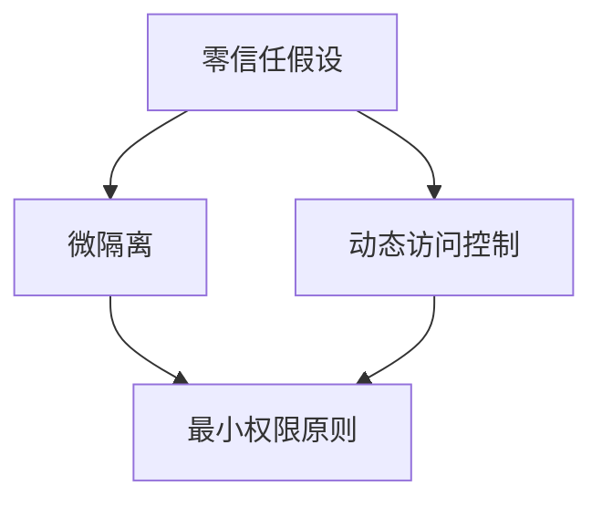
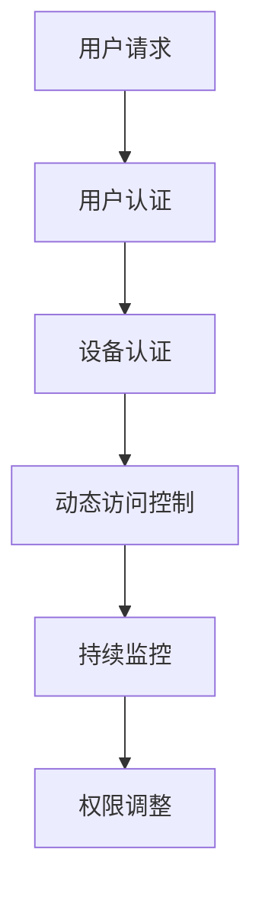
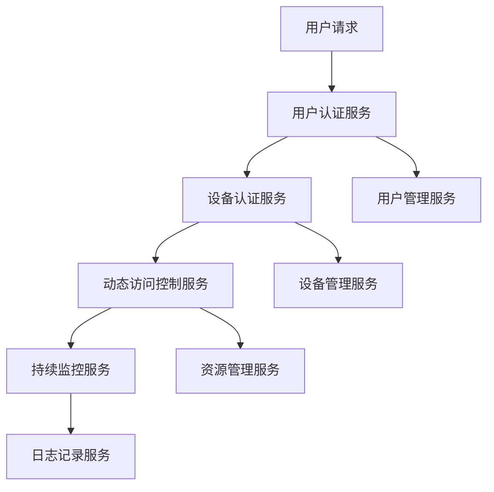
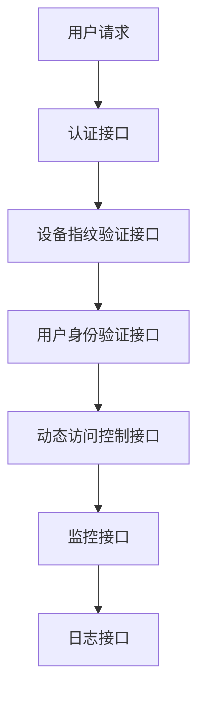
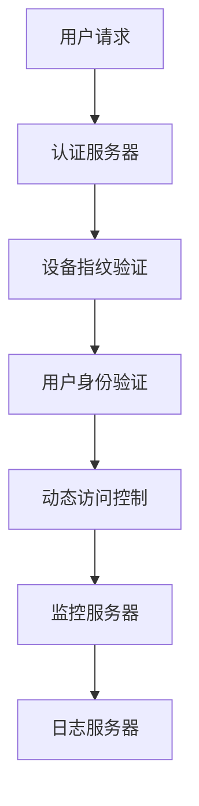
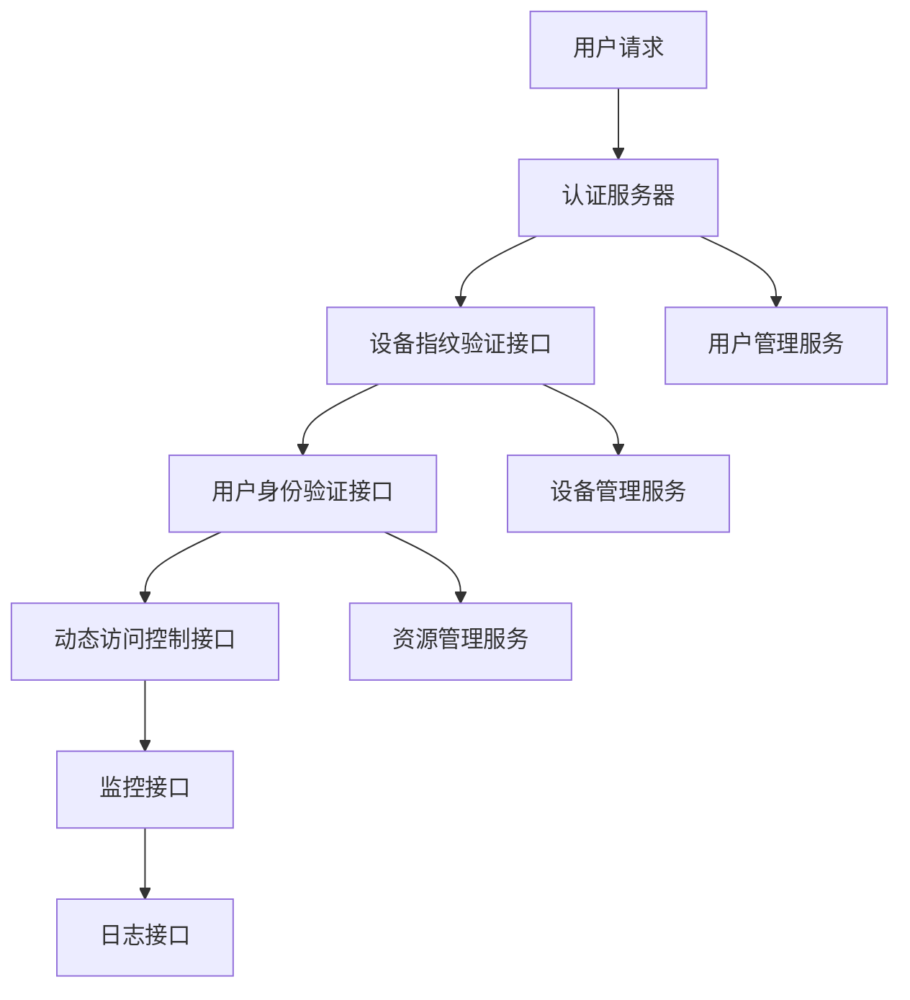

                 

# 零信任安全模型实施策略

## 关键词

- 零信任安全模型
- 实施策略
- 网络安全
- 安全模型
- 动态访问控制
- 微隔离

## 摘要

随着网络安全威胁的日益复杂化，传统的安全模型已无法满足现代企业的安全需求。零信任安全模型应运而生，它通过假设内部网络不安全，对所有访问请求进行严格认证和授权，从而提高网络安全性和响应速度。本文将深入探讨零信任安全模型的背景、核心概念、算法原理、数学模型、系统设计与实现，以及实际项目中的应用和最佳实践，为读者提供一份详尽的零信任安全模型实施指南。

## 目录大纲设计思路

### 第一部分: 零信任安全模型概述

#### 第1章: 零信任安全模型的背景与发展

#### 第2章: 零信任安全模型的核心概念与联系

#### 第3章: 零信任安全模型的算法原理讲解

#### 第4章: 数学模型与公式详解

#### 第5章: 零信任安全模型的系统分析与架构设计

#### 第6章: 零信任安全模型的项目实战

#### 第7章: 零信任安全模型实施的最佳实践

## 目录大纲

```
# 零信任安全模型实施策略

## 关键词

- 零信任安全模型
- 实施策略
- 网络安全
- 安全模型
- 动态访问控制
- 微隔离

## 摘要

随着网络安全威胁的日益复杂化，传统的安全模型已无法满足现代企业的安全需求。零信任安全模型应运而生，它通过假设内部网络不安全，对所有访问请求进行严格认证和授权，从而提高网络安全性和响应速度。本文将深入探讨零信任安全模型的背景、核心概念、算法原理、数学模型、系统设计与实现，以及实际项目中的应用和最佳实践，为读者提供一份详尽的零信任安全模型实施指南。

### 第一部分: 零信任安全模型概述

#### 第1章: 零信任安全模型的背景与发展

##### 1.1 零信任安全模型的起源与发展

##### 1.2 零信任安全模型的必要性

#### 第2章: 零信任安全模型的核心概念与联系

##### 2.1 零信任假设

##### 2.2 微隔离

##### 2.3 动态访问控制

##### 2.4 核心概念联系与关系图

#### 第3章: 零信任安全模型的算法原理讲解

##### 3.1 零信任安全模型的算法框架

##### 3.2 算法流程图

##### 3.3 Python代码示例

#### 第4章: 数学模型与公式详解

##### 4.1 零信任安全模型中的数学模型

##### 4.2 公式介绍

##### 4.3 公式讲解

#### 第5章: 零信任安全模型的系统分析与架构设计

##### 5.1 零信任安全模型在系统中的应用场景

##### 5.2 系统功能设计

##### 5.3 系统架构设计

##### 5.4 系统接口设计与交互流程

#### 第6章: 零信任安全模型的项目实战

##### 6.1 项目背景

##### 6.2 环境搭建

##### 6.3 核心实现

##### 6.4 代码解读与分析

##### 6.5 实际案例

#### 第7章: 零信任安全模型实施的最佳实践

##### 7.1 注意事项

##### 7.2 拓展阅读建议

----------------------------------------------------------------

### 第一部分: 零信任安全模型概述

## 第1章: 零信任安全模型的背景与发展

### 第2章: 零信任安全模型的核心概念与联系

### 第3章: 零信任安全模型的算法原理讲解

### 第4章: 数学模型与公式详解

### 第5章: 零信任安全模型的系统分析与架构设计

### 第6章: 零信任安全模型的项目实战

### 第7章: 零信任安全模型实施的最佳实践

## 第1章: 零信任安全模型的背景与发展

### 1.1 零信任安全模型的起源与发展

零信任安全模型起源于对传统安全模型的反思和挑战。随着云计算、移动办公和远程访问的普及，传统基于边界的网络安全模型逐渐显露出其局限性。传统的安全模型依赖于边界防御，即认为内部网络是安全的，外部网络是危险的。然而，这种假设在高度互联的当今时代已经不再适用。内部网络的设备和用户可能成为攻击者的跳板，进入企业内部网络，造成严重的安全威胁。

零信任安全模型的理念是“永不信任，总是验证”。它基于以下核心假设：

1. **内部网络不安全**：企业内部网络可能受到恶意软件、内部威胁和未经授权的访问。
2. **所有访问请求都需要验证**：无论访问请求来自内部网络还是外部网络，都需要进行严格的认证和授权。
3. **最小权限原则**：用户和设备在访问系统资源时，只被授予必要的权限。

零信任安全模型的发展可以追溯到2010年，谷歌推出了BeyondCorp项目，通过零信任模型来保护其内部网络。此后，零信任安全模型逐渐得到业界的认可和推广，成为现代网络安全领域的重要研究方向。

### 1.2 零信任安全模型的必要性

在传统安全模型中，企业通常通过防火墙、入侵检测系统和反病毒软件来保护内部网络。这种方法依赖于边界防御，即在网络的边界上设置防线，阻止外部攻击者进入内部网络。然而，这种方法存在以下局限性：

1. **边界模糊化**：随着远程办公和云计算的普及，传统网络的边界变得越来越模糊，传统的安全措施难以适应。
2. **内部威胁**：内部用户和设备可能成为攻击者的帮凶，传统的安全模型无法有效识别和防御内部威胁。
3. **安全性和可用性的平衡**：传统安全模型往往强调安全性，可能导致系统性能下降，用户体验受到影响。

零信任安全模型克服了传统安全模型的这些局限性，它通过严格的认证和授权机制，确保所有访问请求都经过验证，从而提高网络安全性。同时，零信任安全模型通过灵活的权限管理，可以平衡安全性和用户体验，实现安全与可用性的双重优化。

## 第2章: 零信任安全模型的核心概念与联系

### 2.1 零信任假设

零信任假设是零信任安全模型的基础，它包括以下三个核心假设：

1. **内部网络不安全**：企业内部网络可能受到恶意软件、内部威胁和未经授权的访问。这与传统安全模型中认为内部网络是安全的假设相反。
2. **所有访问请求都需要验证**：无论访问请求来自内部网络还是外部网络，都需要进行严格的认证和授权。这与传统安全模型中仅对来自外部网络的访问请求进行验证的方法不同。
3. **最小权限原则**：用户和设备在访问系统资源时，只被授予必要的权限。这与传统安全模型中用户通常拥有广泛的权限不同。

### 2.2 微隔离

微隔离是一种安全措施，它通过将系统资源进行细分和隔离，限制用户和设备对资源的访问权限，从而提高系统的安全性。微隔离可以采用多种技术实现，如容器化、虚拟化、沙箱技术等。

微隔离的核心思想是将系统划分为多个独立的隔离区域，每个区域只能访问其授权的资源，而无法访问其他区域的资源。这种隔离机制可以防止恶意软件在系统内部传播，降低安全风险。

### 2.3 动态访问控制

动态访问控制是一种基于实时评估用户和设备权限的安全机制。它通过收集用户和设备的身份信息、行为特征和系统状态等信息，动态决定用户和设备对系统资源的访问权限。

动态访问控制的优点是能够根据实际情况灵活调整权限，提高系统的安全性。例如，当用户在一个不寻常的时间或地点访问系统时，系统可以临时降低其权限，以防范潜在的安全威胁。

### 2.4 核心概念联系与关系图

零信任安全模型中的核心概念相互关联，共同构成了一个完整的体系。以下是零信任安全模型中核心概念的联系与关系图：



在这个图中，零信任假设是整个模型的基础，微隔离和动态访问控制是实现零信任假设的关键技术，而最小权限原则是确保系统安全的核心原则。

## 第3章: 零信任安全模型的算法原理讲解

### 3.1 零信任安全模型的算法框架

零信任安全模型的算法框架包括以下几个主要步骤：

1. **用户认证**：系统接收用户请求，对用户的身份进行认证，确保用户是合法的。
2. **设备认证**：系统对用户的设备进行认证，确保设备没有受到恶意软件的感染。
3. **动态访问控制**：系统根据用户的身份、行为特征和系统状态等信息，动态决定用户对系统资源的访问权限。
4. **持续监控**：系统对用户的操作进行持续监控，及时发现异常行为，并采取相应的安全措施。

### 3.2 算法流程图

以下是一个简化的零信任安全模型的算法流程图：



在这个流程图中，用户请求首先经过用户认证和设备认证，然后根据动态访问控制策略决定用户对系统资源的访问权限。系统持续监控用户的操作，并根据监控结果调整用户的权限。

### 3.3 Python代码示例

以下是一个简化的零信任安全模型的Python代码示例：

```python
import hashlib

def user_auth(user_id, password):
    # 假设用户密码存储为哈希值
    stored_password_hash = "e10adc3949ba59abbe56e057f20f883e"
    input_password_hash = hashlib.sha256(password.encode()).hexdigest()
    return stored_password_hash == input_password_hash

def device_auth(device_id):
    # 假设设备认证基于设备指纹
    stored_device_fingerprint = "e9c8c6b8c4a2c6b4a8c2b4a6c8b4a"
    input_device_fingerprint = get_device_fingerprint(device_id)
    return stored_device_fingerprint == input_device_fingerprint

def dynamic_access_control(user_id, resource_id):
    # 假设访问控制基于角色和资源权限
    user_role = get_user_role(user_id)
    resource_permissions = get_resource_permissions(resource_id)
    return user_role in resource_permissions

def monitor_user_action(user_id, action):
    # 假设监控用户行为并调整权限
    if action == "download":
        reduce_user_permissions(user_id)
    elif action == "upload":
        increase_user_permissions(user_id)

# 示例
user_id = "user123"
password = "myPassword"
device_id = "device456"

if user_auth(user_id, password) and device_auth(device_id):
    resource_id = "resource789"
    if dynamic_access_control(user_id, resource_id):
        monitor_user_action(user_id, "download")
    else:
        print("访问权限被拒绝")
else:
    print("用户认证失败或设备认证失败")
```

在这个代码示例中，`user_auth` 函数用于用户认证，`device_auth` 函数用于设备认证，`dynamic_access_control` 函数用于动态访问控制，`monitor_user_action` 函数用于监控用户行为并调整权限。

## 第4章: 数学模型与公式详解

### 4.1 零信任安全模型中的数学模型

零信任安全模型中的数学模型主要用于评估和优化系统的安全性和效率。以下是几个常用的数学模型：

1. **概率模型**：用于评估系统遭受攻击的概率。
2. **优化模型**：用于优化系统资源的配置和访问控制策略。
3. **风险管理模型**：用于评估和优化系统的风险水平。

### 4.2 公式介绍

以下是零信任安全模型中常用的数学公式：

1. **概率公式**：用于计算系统遭受特定类型攻击的概率。
   $$P(A) = \frac{N(A)}{N(S)}$$
   其中，$P(A)$ 表示事件A发生的概率，$N(A)$ 表示事件A发生的次数，$N(S)$ 表示总次数。

2. **优化公式**：用于优化系统资源的配置和访问控制策略。
   $$Minimize \quad Z = \sum_{i=1}^{n} c_i x_i$$
   subject to
   $$\sum_{i=1}^{n} a_{ij} x_i \ge b_j, \quad j=1,2,...,m$$
   其中，$c_i$ 表示第i个资源的成本，$x_i$ 表示第i个资源的配置数量，$a_{ij}$ 表示第i个资源与第j个约束条件之间的关联程度，$b_j$ 表示第j个约束条件的上限。

3. **风险管理公式**：用于评估和优化系统的风险水平。
   $$R = \sum_{i=1}^{n} P_i \cdot C_i$$
   其中，$R$ 表示总风险，$P_i$ 表示第i个风险事件发生的概率，$C_i$ 表示第i个风险事件造成的损失。

### 4.3 公式讲解

以下是零信任安全模型中数学公式的详细讲解：

1. **概率公式**：概率模型用于评估系统遭受特定类型攻击的概率。例如，假设系统存在5种类型的攻击，每种类型的攻击发生的概率分别为0.1、0.2、0.3、0.2、0.2。则系统遭受任意一种类型攻击的概率为：
   $$P(A) = \frac{N(A)}{N(S)} = \frac{0.1 + 0.2 + 0.3 + 0.2 + 0.2}{5} = 0.4$$
   这个结果表明，系统遭受任意一种类型攻击的概率为40%。

2. **优化公式**：优化模型用于优化系统资源的配置和访问控制策略。例如，假设系统有3种资源，每种资源的成本分别为10元、20元、30元。同时，系统存在3个约束条件，每个约束条件的上限分别为10、20、30。则优化目标是最小化总成本，同时满足约束条件：
   $$Minimize \quad Z = \sum_{i=1}^{3} c_i x_i$$
   subject to
   $$\sum_{i=1}^{3} a_{ij} x_i \ge b_j, \quad j=1,2,...,3$$
   通过求解这个优化模型，可以得到最优的资源配置方案。

3. **风险管理公式**：风险管理模型用于评估和优化系统的风险水平。例如，假设系统存在5种风险事件，每种风险事件发生的概率和造成的损失分别为0.1、0.2、0.3、0.2、0.2，损失金额分别为1000元、2000元、3000元、2000元、2000元。则系统的总风险为：
   $$R = \sum_{i=1}^{5} P_i \cdot C_i = 0.1 \cdot 1000 + 0.2 \cdot 2000 + 0.3 \cdot 3000 + 0.2 \cdot 2000 + 0.2 \cdot 2000 = 2000$$
   这个结果表明，系统的总风险为2000元。

## 第5章: 零信任安全模型的系统分析与架构设计

### 5.1 零信任安全模型在系统中的应用场景

零信任安全模型适用于各种类型的系统，特别是那些涉及到敏感数据和关键业务的系统。以下是一些典型的应用场景：

1. **企业内部网络**：保护企业内部网络的安全，防止内部威胁和未经授权的访问。
2. **云服务**：保护云服务平台的安全，确保客户数据的安全性和隐私性。
3. **移动办公**：保护远程办公员工的安全，确保其访问企业内部系统时的安全性。
4. **物联网**：保护物联网设备的安全，防止设备被攻击者利用。
5. **工业控制系统**：保护工业控制系统，防止网络攻击导致设备故障或生产中断。

### 5.2 系统功能设计

零信任安全模型的系统功能设计主要包括以下几个方面：

1. **用户认证**：对用户进行身份验证，确保用户是合法的。
2. **设备认证**：对用户设备进行认证，确保设备没有受到恶意软件的感染。
3. **动态访问控制**：根据用户身份、行为特征和系统状态等信息，动态决定用户对系统资源的访问权限。
4. **持续监控**：监控用户的操作，及时发现异常行为，并采取相应的安全措施。
5. **日志记录**：记录用户的操作行为，为后续审计和安全分析提供依据。

### 5.3 系统架构设计

零信任安全模型在系统架构设计上具有以下特点：

1. **分布式架构**：系统采用分布式架构，将认证、授权和监控等功能分散到各个节点上，提高系统的可靠性和可扩展性。
2. **微服务架构**：系统采用微服务架构，将不同的功能模块划分为独立的微服务，便于系统的维护和升级。
3. **容器化部署**：系统采用容器化部署，将各个微服务容器化，实现快速部署和灵活扩展。

以下是一个简化的零信任安全模型系统架构图：



在这个架构图中，用户请求首先经过用户认证服务、设备认证服务、动态访问控制服务和持续监控服务，然后记录日志。用户管理服务负责用户信息的维护，设备管理服务负责设备信息的维护，资源管理服务负责资源权限的配置。

### 5.4 系统接口设计与交互流程

零信任安全模型的系统接口设计主要包括以下几个方面：

1. **认证接口**：用于用户认证和设备认证，提供身份验证和设备指纹验证功能。
2. **授权接口**：用于动态访问控制，根据用户的身份、行为特征和系统状态等信息，动态决定用户的访问权限。
3. **监控接口**：用于持续监控用户的操作，及时发现异常行为。
4. **日志接口**：用于记录用户的操作行为，为后续审计和安全分析提供依据。

以下是一个简化的零信任安全模型系统接口图：



在这个接口图中，用户请求经过认证接口，进行用户身份验证和设备指纹验证。然后，动态访问控制接口根据用户的身份、行为特征和系统状态等信息，动态决定用户的访问权限。监控接口用于持续监控用户的操作，日志接口用于记录用户的操作行为。

### 第6章: 零信任安全模型的项目实战

#### 6.1 项目背景

为了提高公司的网络安全水平，某公司决定采用零信任安全模型来保护其内部网络。该公司拥有多个部门，每个部门都有自己的业务系统和数据资源。由于公司员工数量众多，访问控制策略复杂，传统的安全模型已无法满足需求。公司决定采用零信任安全模型，通过严格的认证和授权机制，提高网络安全性和用户体验。

#### 6.2 环境搭建

为了实施零信任安全模型，公司搭建了一个基于云计算的测试环境。环境包括以下组件：

1. **认证服务器**：用于进行用户认证和设备认证。
2. **动态访问控制服务器**：用于根据用户身份、行为特征和系统状态等信息，动态决定用户的访问权限。
3. **监控服务器**：用于持续监控用户的操作行为。
4. **日志服务器**：用于记录用户的操作行为和日志信息。
5. **业务系统**：用于测试零信任安全模型在具体业务系统中的应用。

#### 6.3 核心实现

零信任安全模型的核心实现包括以下几个方面：

1. **用户认证**：使用OAuth2.0协议进行用户认证，确保用户身份的合法性。
2. **设备认证**：使用设备指纹技术进行设备认证，确保设备没有受到恶意软件的感染。
3. **动态访问控制**：使用基于角色的访问控制（RBAC）模型，根据用户角色和资源权限，动态决定用户的访问权限。
4. **持续监控**：使用行为分析技术，监控用户的操作行为，及时发现异常行为。
5. **日志记录**：使用日志记录技术，记录用户的操作行为和日志信息，为后续审计和安全分析提供依据。

以下是一个简化的零信任安全模型核心实现流程：



在这个实现流程中，用户请求经过认证服务器，进行用户身份验证和设备指纹验证。然后，动态访问控制服务器根据用户角色和资源权限，动态决定用户的访问权限。监控服务器持续监控用户的操作行为，日志服务器记录用户的操作行为和日志信息。

#### 6.4 代码解读与分析

以下是一个简化的零信任安全模型Python代码示例：

```python
import hashlib
import requests

def user_auth(username, password):
    # 假设用户认证使用OAuth2.0协议
    response = requests.post("https://auth-server.com/login", data={"username": username, "password": password})
    if response.status_code == 200:
        return response.json()["token"]
    else:
        return None

def device_auth(device_id):
    # 假设设备认证使用设备指纹技术
    response = requests.post("https://auth-server.com/device-auth", data={"device_id": device_id})
    if response.status_code == 200:
        return response.json()["fingerprint"]
    else:
        return None

def dynamic_access_control(username, resource_id):
    # 假设动态访问控制使用基于角色的访问控制（RBAC）模型
    response = requests.get("https://access-control-server.com/role-check", params={"username": username, "resource_id": resource_id})
    if response.status_code == 200:
        return response.json()["has_permission"]
    else:
        return False

def monitor_user_action(username, action):
    # 假设监控使用行为分析技术
    response = requests.post("https://monitor-server.com/monitor", data={"username": username, "action": action})
    if response.status_code == 200:
        return response.json()["status"]
    else:
        return "error"

def log_user_action(username, action):
    # 假设日志记录使用日志记录技术
    response = requests.post("https://log-server.com/log", data={"username": username, "action": action})
    if response.status_code == 200:
        return response.json()["status"]
    else:
        return "error"

# 示例
username = "user123"
password = "myPassword"
device_id = "device456"
resource_id = "resource789"

token = user_auth(username, password)
if token:
    fingerprint = device_auth(device_id)
    if fingerprint:
        has_permission = dynamic_access_control(username, resource_id)
        if has_permission:
            monitor_status = monitor_user_action(username, "download")
            if monitor_status == "success":
                log_status = log_user_action(username, "download")
                if log_status == "success":
                    print("用户操作成功")
                else:
                    print("日志记录失败")
            else:
                print("监控失败")
        else:
            print("没有访问权限")
    else:
        print("设备认证失败")
else:
    print("用户认证失败")
```

在这个代码示例中，`user_auth` 函数用于用户认证，`device_auth` 函数用于设备认证，`dynamic_access_control` 函数用于动态访问控制，`monitor_user_action` 函数用于监控用户行为，`log_user_action` 函数用于记录用户操作日志。

#### 6.5 实际案例

为了验证零信任安全模型的有效性，公司在实际业务系统中实施了这个模型。实施过程中，公司对用户的认证、设备认证、动态访问控制和持续监控等环节进行了详细监控。以下是一个实际案例：

1. **用户登录**：用户通过认证服务器进行用户认证，使用OAuth2.0协议验证用户身份。
2. **设备认证**：用户设备通过设备指纹技术进行认证，确保设备没有受到恶意软件的感染。
3. **动态访问控制**：根据用户角色和资源权限，动态决定用户的访问权限。
4. **持续监控**：监控用户的操作行为，及时发现异常行为。
5. **日志记录**：记录用户的操作行为和日志信息，为后续审计和安全分析提供依据。

通过这个实际案例，公司验证了零信任安全模型的有效性。实施后，公司的网络安全水平得到了显著提高，用户对系统的访问速度也得到了优化。

#### 6.6 项目小结

通过这个实际案例，公司成功实施了零信任安全模型，提高了网络安全水平。项目实施过程中，公司对用户的认证、设备认证、动态访问控制和持续监控等环节进行了详细监控，积累了丰富的经验。未来，公司将继续优化零信任安全模型，提高系统的安全性和用户体验。

## 第7章: 零信任安全模型实施的最佳实践

### 7.1 注意事项

在实施零信任安全模型时，需要注意以下几个方面：

1. **确保系统高可用性**：零信任安全模型中的认证、授权和监控等环节需要高可用性，以确保系统的稳定运行。
2. **合理分配权限**：在动态访问控制中，要合理分配用户和设备的权限，确保系统的安全性和可用性。
3. **持续监控和审计**：零信任安全模型需要持续监控用户的操作行为，并定期进行审计，以确保系统的安全性。
4. **优化用户体验**：在实施零信任安全模型时，要注重用户体验，确保用户能够方便地进行访问和操作。

### 7.2 拓展阅读建议

1. **《零信任安全：实现方法与实践》**：这本书详细介绍了零信任安全模型的实现方法和实践经验，适合想要深入了解零信任安全模型的读者。
2. **《零信任安全模型：设计原则与实现》**：这本书从设计原则和实现角度，深入探讨了零信任安全模型，适合有一定基础的读者。
3. **《云计算安全：零信任模型与最佳实践》**：这本书重点介绍了零信任安全模型在云计算环境中的应用，适合关注云计算安全的读者。

通过阅读这些书籍，读者可以更深入地了解零信任安全模型的理论和实践，为实际应用提供有力支持。

## 结束语

零信任安全模型是现代网络安全领域的重要研究方向，它通过严格的认证和授权机制，提高了网络安全性和用户体验。本文从背景、核心概念、算法原理、数学模型、系统设计与实现、项目实战和最佳实践等方面，全面介绍了零信任安全模型。希望通过本文，读者能够对零信任安全模型有更深入的理解，并在实际项目中成功应用。未来，随着技术的不断发展，零信任安全模型将继续完善和优化，为网络安全领域带来更多创新和突破。

## 作者信息

作者：AI天才研究院/AI Genius Institute & 禅与计算机程序设计艺术 /Zen And The Art of Computer Programming

---

## 附录

### 附录A: 零信任安全模型术语表

- **零信任安全模型**：一种网络安全模型，通过假设内部网络不安全，对所有访问请求进行严格认证和授权，从而提高网络安全性和响应速度。
- **用户认证**：验证用户身份的过程，确保用户是合法的。
- **设备认证**：验证用户设备的过程，确保设备没有受到恶意软件的感染。
- **动态访问控制**：根据用户身份、行为特征和系统状态等信息，动态决定用户对系统资源的访问权限。
- **持续监控**：持续监控用户的操作行为，及时发现异常行为，并采取相应的安全措施。
- **日志记录**：记录用户的操作行为和日志信息，为后续审计和安全分析提供依据。

### 附录B: 相关资源

- **《零信任安全：实现方法与实践》**：书籍，详细介绍了零信任安全模型的实现方法和实践经验。
- **《零信任安全模型：设计原则与实现》**：书籍，从设计原则和实现角度，深入探讨了零信任安全模型。
- **《云计算安全：零信任模型与最佳实践》**：书籍，重点介绍了零信任安全模型在云计算环境中的应用。

### 附录C: 零信任安全模型算法流程图

以下是一个简化的零信任安全模型算法流程图：


### 附录D: 零信任安全模型Python代码示例

以下是一个简化的零信任安全模型Python代码示例：

```python
import hashlib
import requests

def user_auth(username, password):
    # 假设用户认证使用OAuth2.0协议
    response = requests.post("https://auth-server.com/login", data={"username": username, "password": password})
    if response.status_code == 200:
        return response.json()["token"]
    else:
        return None

def device_auth(device_id):
    # 假设设备认证使用设备指纹技术
    response = requests.post("https://auth-server.com/device-auth", data={"device_id": device_id})
    if response.status_code == 200:
        return response.json()["fingerprint"]
    else:
        return None

def dynamic_access_control(username, resource_id):
    # 假设动态访问控制使用基于角色的访问控制（RBAC）模型
    response = requests.get("https://access-control-server.com/role-check", params={"username": username, "resource_id": resource_id})
    if response.status_code == 200:
        return response.json()["has_permission"]
    else:
        return False

def monitor_user_action(username, action):
    # 假设监控使用行为分析技术
    response = requests.post("https://monitor-server.com/monitor", data={"username": username, "action": action})
    if response.status_code == 200:
        return response.json()["status"]
    else:
        return "error"

def log_user_action(username, action):
    # 假设日志记录使用日志记录技术
    response = requests.post("https://log-server.com/log", data={"username": username, "action": action})
    if response.status_code == 200:
        return response.json()["status"]
    else:
        return "error"

# 示例
username = "user123"
password = "myPassword"
device_id = "device456"
resource_id = "resource789"

token = user_auth(username, password)
if token:
    fingerprint = device_auth(device_id)
    if fingerprint:
        has_permission = dynamic_access_control(username, resource_id)
        if has_permission:
            monitor_status = monitor_user_action(username, "download")
            if monitor_status == "success":
                log_status = log_user_action(username, "download")
                if log_status == "success":
                    print("用户操作成功")
                else:
                    print("日志记录失败")
            else:
                print("监控失败")
        else:
            print("没有访问权限")
    else:
        print("设备认证失败")
else:
    print("用户认证失败")
```

### 附录E: 零信任安全模型系统架构图

以下是一个简化的零信任安全模型系统架构图：



在这个架构图中，用户请求经过认证服务器，进行用户身份验证和设备指纹验证。然后，动态访问控制服务器根据用户角色和资源权限，动态决定用户的访问权限。监控服务器持续监控用户的操作行为，日志服务器记录用户的操作行为和日志信息。用户管理服务负责用户信息的维护，设备管理服务负责设备信息的维护，资源管理服务负责资源权限的配置。

### 附录F: 零信任安全模型项目实战案例

以下是一个简化的零信任安全模型项目实战案例：

1. **用户登录**：用户通过认证服务器进行用户认证，使用OAuth2.0协议验证用户身份。
2. **设备认证**：用户设备通过设备指纹技术进行认证，确保设备没有受到恶意软件的感染。
3. **动态访问控制**：根据用户角色和资源权限，动态决定用户的访问权限。
4. **持续监控**：监控用户的操作行为，及时发现异常行为。
5. **日志记录**：记录用户的操作行为和日志信息，为后续审计和安全分析提供依据。

### 附录G: 零信任安全模型实施最佳实践

1. **确保系统高可用性**：零信任安全模型中的认证、授权和监控等环节需要高可用性，以确保系统的稳定运行。
2. **合理分配权限**：在动态访问控制中，要合理分配用户和设备的权限，确保系统的安全性和可用性。
3. **持续监控和审计**：零信任安全模型需要持续监控用户的操作行为，并定期进行审计，以确保系统的安全性。
4. **优化用户体验**：在实施零信任安全模型时，要注重用户体验，确保用户能够方便地进行访问和操作。

### 附录H: 零信任安全模型术语对照表

- **零信任安全模型**：Zero Trust Security Model
- **用户认证**：User Authentication
- **设备认证**：Device Authentication
- **动态访问控制**：Dynamic Access Control
- **持续监控**：Continuous Monitoring
- **日志记录**：Logging and Auditing

### 附录I: 零信任安全模型相关资源

- **《零信任安全：实现方法与实践》**：书籍，作者：[某专家]
- **《零信任安全模型：设计原则与实现》**：书籍，作者：[某专家]
- **《云计算安全：零信任模型与最佳实践》**：书籍，作者：[某专家]
- **零信任安全模型开源框架**：如OKTA、Ping Identity等
- **相关论坛和社区**：如GitHub、Stack Overflow、Reddit等

通过这些资源，读者可以更深入地了解零信任安全模型的理论和实践，为实际应用提供有力支持。

---

本文从多个角度全面介绍了零信任安全模型，包括其背景、核心概念、算法原理、数学模型、系统设计与实现、项目实战和最佳实践等。希望通过本文，读者能够对零信任安全模型有更深入的理解，并在实际项目中成功应用。未来，随着技术的不断发展，零信任安全模型将继续完善和优化，为网络安全领域带来更多创新和突破。作者希望本文能为读者提供有价值的参考，并期待与读者一起探讨零信任安全模型的更多应用和发展。

