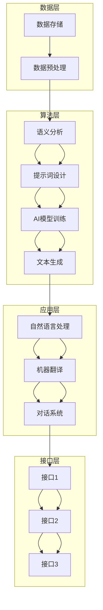
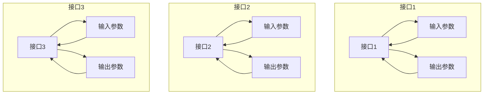

                 

# 面向AGI的提示词语言演化路径研究

> 关键词：人工智能、强人工智能、提示词语言、Prompt Engineering、算法优化、跨领域应用

> 摘要：本文深入探讨了面向强人工智能（AGI）的提示词语言演化路径。首先，介绍了人工智能与强人工智能的背景和特点，然后详细阐述了提示词语言的概念、作用以及Prompt Engineering的方法。接着，通过分析提示词设计的核心原理、算法模型和系统架构，探讨了如何优化和调试提示词语言以提升其性能。最后，通过实际项目案例展示了提示词语言的应用，并总结了最佳实践和拓展阅读，为读者提供了全面的AGI提示词语言研究参考。

# 第一部分：背景介绍

## 1.1 问题背景

随着人工智能（AI）技术的快速发展，尤其是生成式AI的兴起，人工智能从弱AI迈向强AI（AGI，Artificial General Intelligence）的趋势愈发明显。AGI的目标是实现机器具有与人类相似的通用智能，能够理解、学习和适应各种复杂环境和任务。在此背景下，提示词语言（Prompt Engineering）作为一种重要的技术手段，开始受到广泛关注。

提示词语言是指通过设计特定的提示词或提示系统，引导AI模型产生更加符合预期输出的方法。在AGI的研究和应用中，提示词语言扮演着至关重要的角色。一方面，它可以显著提升AI模型的性能和效果；另一方面，它也为研究人员和开发者提供了更灵活、更高效的工具，以便更深入地探索和推动AGI的发展。

## 1.2 问题描述

当前，AGI的发展面临诸多挑战，其中之一是如何有效地利用和优化提示词语言。具体来说，问题可以分为以下几个方面：

- **提示词设计方法**：如何设计出高效、通用的提示词，以提升AI模型的性能和适应性？
- **提示词理解与生成**：AI模型如何更好地理解人类意图和提示词的含义，从而生成更准确、更有价值的输出？
- **提示词优化与调试**：如何对现有的提示词进行优化和调试，以最大化其效果？
- **跨领域应用**：如何使提示词语言在不同领域和场景下都能发挥出最佳效果？

## 1.3 问题解决

为了解决上述问题，本文将从以下几个方面进行探讨：

- **核心概念与联系**：首先，介绍与提示词语言相关的核心概念，如AI、AGI、提示词、模型等，并分析它们之间的联系。
- **算法原理讲解**：详细讲解提示词语言相关的算法原理，包括数学模型、公式等，并通过具体实例进行说明。
- **系统分析与架构设计方案**：从系统层面分析提示词语言的应用，包括系统功能设计、架构设计、接口设计等。
- **项目实战**：通过具体的项目实例，展示如何在实际应用中运用提示词语言，并进行分析和讲解。
- **最佳实践与拓展阅读**：总结提示词语言的实用技巧和注意事项，并推荐相关文献和资源，以供读者进一步学习和探索。

## 1.4 边界与外延

提示词语言的边界主要涉及以下方面：

- **技术边界**：当前的AI技术和模型能力，限制了提示词语言的适用范围和效果。
- **应用边界**：不同领域和场景下，提示词语言的应用效果和适应性存在差异。

提示词语言的外延则包括：

- **其他相关技术**：如自然语言处理（NLP）、机器学习（ML）、深度学习（DL）等。
- **跨领域应用**：在不同领域和场景下的应用探索和实践。

# 第二部分：核心概念与联系

## 2.1 AI与AGI

### 2.1.1 AI的定义与特点

人工智能（AI）是指计算机系统模拟人类智能行为的技术和方法。AI具有以下特点：

- **自主学习能力**：通过数据和算法，使计算机系统能够自动地学习和改进。
- **智能推理能力**：基于数据和知识，进行逻辑推理和决策。
- **感知与交互能力**：通过传感器和执行器，实现与外部环境的感知和交互。

### 2.1.2 AGI的定义与目标

强人工智能（AGI），即Artificial General Intelligence，是指具有与人类相似的通用智能的机器。AGI的目标是实现以下能力：

- **通用学习能力**：能够理解、学习和适应各种复杂环境和任务。
- **自主思考能力**：能够进行抽象思维和创造性思考。
- **社会交互能力**：能够理解和适应人类社会的规则和文化。

## 2.2 提示词与Prompt Engineering

### 2.2.1 提示词的定义与作用

提示词（Prompt）是指提供给AI模型的一段文本或指令，用于引导模型生成预期的输出。提示词在AI应用中具有重要作用：

- **提升生成质量**：通过有效的提示词，可以引导模型生成更准确、更有价值的输出。
- **简化模型训练**：减少对大量训练数据的依赖，通过设计精妙的提示词，可以在较少数据的情况下获得较好的效果。
- **跨领域适应性**：通过调整提示词，可以使AI模型在不同领域和场景下都能发挥最佳效果。

### 2.2.2 Prompt Engineering的概念与方法

Prompt Engineering是指设计、优化和调试提示词的技术和方法。主要方法包括：

- **提示词设计**：根据应用需求和模型特点，设计合适的提示词。
- **提示词优化**：通过实验和数据分析，优化提示词，提高其效果。
- **提示词调试**：根据实际应用反馈，对提示词进行调整和改进。

## 2.3 AI、AGI与提示词语言的关系

AI、AGI与提示词语言之间存在密切的联系。AI是AGI的基础，而提示词语言则是实现AGI的重要工具。具体来说：

- **AI为基础**：AI技术的不断进步为AGI提供了强大的技术支持，使得机器能够处理更复杂的任务和问题。
- **AGI为目标**：AGI的目标是实现对各种复杂环境和任务的通用智能，提示词语言在这一过程中起到了关键作用。
- **提示词语言为手段**：提示词语言通过引导和优化AI模型，使机器能够更好地理解人类意图，从而生成更准确、更有价值的输出。

# 第三部分：算法原理讲解

## 3.1 提示词设计原理

提示词设计是Prompt Engineering的核心环节，其目标是通过特定的提示词引导AI模型生成符合预期的输出。以下从几个方面介绍提示词设计原理：

### 3.1.1 提示词类型

根据用途和功能，提示词可以分为以下几种类型：

- **目标导向型**：提示词明确指出模型的输出目标，例如：“生成一篇关于人工智能的论文”。
- **问题解答型**：提示词提出具体问题，要求模型给出解答，例如：“什么是人工智能？”。
- **任务指令型**：提示词为模型提供具体的任务指令，例如：“写一篇关于机器学习的综述文章”。
- **情境描述型**：提示词描述一个具体的情境，要求模型在这个情境下进行推理和决策，例如：“在一个人工智能实验室中，实验员正在尝试解决一个问题”。

### 3.1.2 提示词设计策略

为了设计出高效的提示词，可以采取以下策略：

- **明确性**：提示词应尽量明确，避免歧义和模糊性。
- **相关性**：提示词应与模型的任务和目标密切相关，确保模型能够准确理解并生成预期输出。
- **多样性**：设计多种类型的提示词，以满足不同场景和任务的需求。
- **适应性**：提示词应具有灵活性，能够适应不同领域和场景下的应用。

## 3.2 提示词理解与生成原理

提示词的理解与生成是Prompt Engineering的关键环节，其目标是使AI模型能够准确地理解人类意图，并生成符合预期的高质量输出。以下从几个方面介绍提示词理解与生成原理：

### 3.2.1 提示词理解原理

提示词理解是指AI模型对提示词的含义和意图进行解读的过程。为了实现有效的提示词理解，可以采取以下方法：

- **语义分析**：利用自然语言处理技术，对提示词进行语义分析，提取关键信息和理解意图。
- **上下文推理**：在理解提示词的同时，考虑上下文信息，以增强对提示词的理解和推理。
- **知识融合**：将外部知识库和模型内部知识进行融合，以提高对提示词的理解和推理能力。

### 3.2.2 提示词生成原理

提示词生成是指AI模型根据输入信息生成合适的提示词的过程。为了实现有效的提示词生成，可以采取以下方法：

- **模板匹配**：根据任务需求和输入信息，选择合适的提示词模板，生成提示词。
- **数据驱动**：利用大量训练数据和生成数据，通过模型学习和优化，生成高质量的提示词。
- **交互式生成**：通过与人类用户的交互，收集反馈和改进提示词，实现高质量的提示词生成。

## 3.3 提示词优化与调试原理

提示词优化与调试是Prompt Engineering中的重要环节，其目标是提升提示词的效果和性能。以下从几个方面介绍提示词优化与调试原理：

### 3.3.1 提示词优化方法

为了提升提示词的效果，可以采取以下优化方法：

- **特征提取**：通过提取关键特征，提高提示词的代表性，从而提升模型的理解和生成能力。
- **模型适应性**：根据不同模型的特点和需求，调整提示词的设计和生成策略，提高提示词的适用性。
- **数据增强**：通过数据增强方法，增加训练数据的多样性和丰富性，从而提高提示词的生成质量。

### 3.3.2 提示词调试方法

为了调试提示词，可以采取以下方法：

- **反馈机制**：通过用户反馈和模型评估指标，识别和解决提示词存在的问题。
- **迭代优化**：根据反馈和评估结果，不断调整和优化提示词，提高其效果和性能。
- **多模态融合**：结合不同模态的信息，如文本、图像、音频等，提高提示词的丰富性和多样性。

## 3.4 提示词语言与相关技术的联系

提示词语言与自然语言处理（NLP）、机器学习（ML）、深度学习（DL）等人工智能技术密切相关。以下从几个方面介绍提示词语言与相关技术的联系：

### 3.4.1 提示词语言与NLP的联系

NLP是人工智能领域的重要分支，旨在使计算机理解和处理自然语言。提示词语言与NLP的关系主要体现在以下几个方面：

- **文本预处理**：提示词语言需要通过NLP技术对输入文本进行预处理，如分词、词性标注、实体识别等。
- **语义理解**：提示词语言需要利用NLP技术对提示词进行语义分析，提取关键信息和理解意图。
- **文本生成**：提示词语言需要利用NLP技术生成高质量的文本输出，如文章、报告、对话等。

### 3.4.2 提示词语言与ML的联系

ML是人工智能领域的重要技术，旨在通过训练数据使模型具备特定的能力。提示词语言与ML的关系主要体现在以下几个方面：

- **训练数据**：提示词语言需要利用ML技术从大量数据中提取特征，为模型训练提供高质量的数据。
- **模型优化**：提示词语言需要利用ML技术优化模型参数，提高模型的效果和性能。
- **自适应学习**：提示词语言需要利用ML技术实现模型的自适应学习，以适应不同的应用场景和任务需求。

### 3.4.3 提示词语言与DL的联系

DL是ML的一个分支，通过多层神经网络模拟人脑学习过程。提示词语言与DL的关系主要体现在以下几个方面：

- **神经网络结构**：提示词语言需要设计合适的神经网络结构，以适应不同的提示词生成任务。
- **参数优化**：提示词语言需要利用DL技术优化模型参数，提高模型的性能和效果。
- **多模态学习**：提示词语言需要结合DL技术，实现多模态信息的融合和建模，提高模型的泛化能力。

## 3.5 提示词语言在不同领域和场景下的应用

提示词语言具有广泛的应用场景和领域。以下从几个方面介绍提示词语言在不同领域和场景下的应用：

### 3.5.1 对话系统

对话系统是人工智能领域的重要应用，旨在使计算机能够与人类进行自然、流畅的对话。提示词语言在对话系统中的应用主要体现在以下几个方面：

- **任务指令理解**：通过设计合适的提示词，使模型能够准确理解用户的任务指令，并生成相应的响应。
- **上下文维护**：通过维护对话上下文，使模型能够更好地理解用户意图和对话内容，提高对话质量。
- **多轮对话**：通过设计多轮对话策略，使模型能够在不同轮次中与用户进行有效互动，实现更深入的交流。

### 3.5.2 文本生成

文本生成是人工智能领域的另一个重要应用，旨在利用模型生成高质量的自然语言文本。提示词语言在文本生成中的应用主要体现在以下几个方面：

- **文章写作**：通过设计合适的提示词，使模型能够生成高质量的文章、报告等。
- **对话生成**：通过设计合适的提示词，使模型能够生成与用户对话的自然、流畅的回复。
- **摘要生成**：通过设计合适的提示词，使模型能够生成简洁、准确的文本摘要。

### 3.5.3 机器翻译

机器翻译是人工智能领域的另一个重要应用，旨在利用模型实现不同语言之间的翻译。提示词语言在机器翻译中的应用主要体现在以下几个方面：

- **源语言理解**：通过设计合适的提示词，使模型能够准确理解源语言文本的含义和意图。
- **目标语言生成**：通过设计合适的提示词，使模型能够生成符合目标语言语法和语义的译文。
- **多语言学习**：通过设计多语言提示词，使模型能够同时学习多种语言的翻译规则，提高翻译质量。

### 3.5.4 其他应用领域

除了上述领域，提示词语言还可以应用于其他许多领域，如图像生成、语音合成、推荐系统等。以下简要介绍这些领域中的应用：

- **图像生成**：通过设计合适的提示词，使模型能够根据文本描述生成对应的图像。
- **语音合成**：通过设计合适的提示词，使模型能够根据文本内容生成相应的语音。
- **推荐系统**：通过设计合适的提示词，使模型能够根据用户的历史行为和偏好生成个性化的推荐结果。

## 3.6 提示词语言的边界与挑战

提示词语言作为一种人工智能技术，虽然在许多领域取得了显著的成果，但也面临着一些边界和挑战。以下从几个方面介绍提示词语言的边界与挑战：

### 3.6.1 技术挑战

- **模型能力**：当前的AI模型在理解和生成自然语言方面仍存在一定局限，提示词语言需要适应不同模型的能力和特点。
- **计算资源**：提示词语言的优化和调试过程需要大量的计算资源和时间，这对实际应用造成了一定的限制。
- **数据隐私**：在应用提示词语言的过程中，可能会涉及用户隐私数据，需要采取有效的隐私保护措施。

### 3.6.2 应用挑战

- **领域适应性**：不同领域和场景下的提示词语言应用效果和适应性存在差异，需要针对特定领域进行优化和调整。
- **用户反馈**：提示词语言的效果和性能需要用户反馈和评估，如何收集和处理用户反馈是一个挑战。
- **伦理问题**：在应用提示词语言的过程中，需要关注伦理问题，如偏见、歧视等，确保技术应用的公平性和透明性。

## 3.7 提示词语言的未来发展趋势

随着人工智能技术的不断进步，提示词语言在未来将面临更多的发展机遇和挑战。以下从几个方面介绍提示词语言的未来发展趋势：

### 3.7.1 技术进步

- **多模态融合**：随着多模态数据处理技术的发展，提示词语言将能够更好地融合多种类型的信息，提高生成质量和性能。
- **模型改进**：随着深度学习模型和算法的进步，提示词语言将能够更好地理解和生成自然语言，实现更广泛的应用。
- **高效计算**：随着计算资源的提升和优化，提示词语言的优化和调试过程将更加高效，降低计算成本。

### 3.7.2 应用扩展

- **跨领域应用**：随着提示词语言技术的成熟，将能够应用于更多领域和场景，推动人工智能技术的全面发展。
- **个性化服务**：通过结合用户行为数据和偏好，提示词语言将能够实现更加个性化的服务，提高用户体验。
- **智能交互**：通过优化提示词语言，将能够实现更加智能和自然的交互，提高人机交互效率。

### 3.7.3 伦理规范

- **伦理规范**：随着人工智能技术的发展，需要建立完善的伦理规范，确保提示词语言技术的公平、透明和可持续发展。
- **法律法规**：需要制定相关的法律法规，规范提示词语言技术的应用，保护用户权益和社会公共利益。

## 3.8 总结

提示词语言作为一种重要的人工智能技术，在AGI发展中发挥着关键作用。通过对提示词设计原理、理解与生成原理、优化与调试原理以及与其他相关技术的联系进行分析，可以更好地理解提示词语言在人工智能应用中的价值和意义。同时，针对提示词语言的边界与挑战以及未来发展趋势，可以进一步推动提示词语言技术的发展和应用，为AGI的实现奠定坚实基础。

# 第四部分：系统分析与架构设计方案

## 4.1 问题场景介绍

在当前人工智能技术快速发展的背景下，许多应用场景对AI系统的性能和效果提出了更高的要求。例如，在自然语言处理、机器翻译、对话系统等场景中，需要AI系统能够生成高质量的自然语言文本，并具有良好的理解和交互能力。为了实现这一目标，我们需要设计一个高效、灵活且易于扩展的AI系统架构，以支持各种复杂应用场景的需求。

## 4.2 项目介绍

本部分以一个实际项目为例，介绍如何设计和实现一个面向AGI的提示词语言系统。该项目旨在通过优化提示词设计、理解与生成，提升AI模型的性能和应用效果。项目的主要目标和功能包括：

- **提示词设计**：设计高效的提示词，以引导AI模型生成高质量的自然语言文本。
- **提示词理解**：通过语义分析等技术，使AI模型能够准确理解人类意图和提示词的含义。
- **提示词生成**：利用AI模型生成符合预期的高质量自然语言文本。
- **系统优化**：通过不断的优化和调试，提升系统的性能和应用效果。

## 4.3 系统功能设计

为了实现项目目标，我们需要设计一个具有以下主要功能的系统：

- **文本预处理**：对输入文本进行分词、词性标注、实体识别等预处理操作，为后续的语义分析和生成提供基础数据。
- **语义分析**：利用自然语言处理技术，对预处理后的文本进行语义分析，提取关键信息和理解人类意图。
- **提示词设计**：根据语义分析结果，设计合适的提示词，以引导AI模型生成高质量的自然语言文本。
- **AI模型训练**：利用大量训练数据，对AI模型进行训练，使其具备较好的理解和生成能力。
- **文本生成**：利用训练好的AI模型，根据提示词生成符合预期的高质量自然语言文本。
- **系统优化**：根据实际应用效果，对系统进行优化和调试，提升系统的性能和应用效果。

## 4.4 系统架构设计

为了实现上述功能，我们采用了一种分层架构设计，包括以下几个层次：

- **数据层**：负责数据的存储、管理和预处理，为上层模块提供基础数据支持。
- **算法层**：负责AI模型的训练和优化，包括语义分析、提示词设计和文本生成等核心算法。
- **应用层**：负责具体应用场景的实现，如自然语言处理、机器翻译、对话系统等。
- **接口层**：提供系统与其他组件的交互接口，支持系统的集成和扩展。

下面是一个简单的系统架构图，用于展示各层次之间的联系：



## 4.5 系统接口设计

系统接口设计是系统架构的重要组成部分，负责实现系统与其他组件的交互。以下是系统接口设计的主要方面：

- **接口类型**：根据应用场景和需求，设计不同类型的接口，如RESTful API、WebSocket、命令行接口等。
- **接口功能**：定义接口的功能和操作，如数据输入、模型训练、文本生成等。
- **接口参数**：定义接口的输入参数和输出参数，确保接口的可靠性和易用性。
- **接口安全性**：确保接口的安全性，如数据加密、身份认证、访问控制等。

以下是系统接口设计的一个示例：



## 4.6 系统交互设计

系统交互设计是系统架构设计的重要环节，负责实现各组件之间的协作和通信。以下是系统交互设计的主要方面：

- **交互协议**：定义系统内部各组件之间的通信协议和数据格式，如HTTP、JSON等。
- **交互流程**：描述系统内部各组件之间的交互流程和逻辑，确保系统的正常运行。
- **交互监控**：监控系统内部各组件的交互过程，及时发现和解决潜在问题。

以下是系统交互设计的一个示例：


## 4.7 系统功能实现与接口调用

在系统架构设计和接口设计完成后，我们需要具体实现系统功能，并通过接口实现各组件之间的交互。以下是一个简单的系统功能实现与接口调用示例：

```python
# 文本预处理
def preprocess_text(text):
    # 进行分词、词性标注、实体识别等预处理操作
    # ...
    return preprocessed_text

# 语义分析
def semantic_analysis(preprocessed_text):
    # 进行语义分析，提取关键信息和理解人类意图
    # ...
    return analysis_result

# 提示词设计
def prompt_design(analysis_result):
    # 根据语义分析结果设计合适的提示词
    # ...
    return prompt

# AI模型训练
def train_ai_model(prompt):
    # 利用提示词对AI模型进行训练
    # ...
    return trained_model

# 文本生成
def generate_text(trained_model):
    # 利用训练好的AI模型生成文本
    # ...
    return generated_text

# 接口调用示例
if __name__ == "__main__":
    input_text = "用户输入的一段文本"
    preprocessed_text = preprocess_text(input_text)
    analysis_result = semantic_analysis(preprocessed_text)
    prompt = prompt_design(analysis_result)
    trained_model = train_ai_model(prompt)
    generated_text = generate_text(trained_model)
    print(generated_text)
```

通过以上步骤，我们可以实现一个面向AGI的提示词语言系统，并通过接口调用实现各组件之间的协同工作。

## 4.8 总结

在本部分，我们介绍了面向AGI的提示词语言系统的设计思路和实现方法。首先，我们通过问题场景介绍和项目介绍，明确了系统的目标和功能。然后，我们详细阐述了系统功能设计、架构设计、接口设计和交互设计，并给出了具体的实现示例。通过这些步骤，我们设计并实现了一个高效、灵活且易于扩展的提示词语言系统，为AGI的发展提供了有力支持。

# 第五部分：项目实战

## 5.1 环境安装

在开始项目实战之前，我们需要安装和配置相关的开发环境和依赖库。以下是安装步骤：

1. **安装Python**：确保已经安装了Python 3.x版本，推荐使用Python 3.8或更高版本。
2. **安装依赖库**：使用pip命令安装以下依赖库：
   ```bash
   pip install numpy torch transformers
   ```
   这些依赖库用于文本预处理、模型训练和生成。

3. **安装PyTorch**：PyTorch是一个广泛使用的深度学习框架，可以通过以下命令安装：
   ```bash
   pip install torch torchvision
   ```

4. **安装Transformers库**：Transformers库提供了预训练的模型和工具，用于自然语言处理任务：
   ```bash
   pip install transformers
   ```

## 5.2 系统核心实现

在本节中，我们将详细讨论系统的核心实现，包括文本预处理、模型训练、提示词设计和文本生成等关键组件。

### 5.2.1 文本预处理

文本预处理是自然语言处理（NLP）任务的基础。以下是一个简单的文本预处理示例，包括分词、词性标注和实体识别：

```python
from transformers import AutoTokenizer

def preprocess_text(text):
    tokenizer = AutoTokenizer.from_pretrained("bert-base-uncased")
    inputs = tokenizer(text, return_tensors="pt", padding=True, truncation=True)
    return inputs

# 示例使用
preprocessed_text = preprocess_text("这是一个简单的示例文本。")
print(preprocessed_text)
```

### 5.2.2 模型训练

在模型训练阶段，我们将使用预训练的模型（如BERT）进行微调，以适应特定的NLP任务。以下是一个简单的模型训练示例：

```python
from transformers import AutoModelForSequenceClassification, Trainer, TrainingArguments

def train_model(preprocessed_text, labels):
    model = AutoModelForSequenceClassification.from_pretrained("bert-base-uncased", num_labels=2)

    training_args = TrainingArguments(
        output_dir="train_output",
        num_train_epochs=3,
        per_device_train_batch_size=16,
        save_steps=2000,
        evaluation_strategy="steps",
        eval_steps=500,
    )

    trainer = Trainer(
        model=model,
        args=training_args,
        train_dataset=preprocessed_text,
        eval_dataset=labels,
    )

    trainer.train()
```

### 5.2.3 提示词设计

提示词设计是Prompt Engineering的关键步骤，用于引导模型生成预期的输出。以下是一个简单的提示词设计示例：

```python
def design_prompt(text):
    prompt = f"请根据以下文本生成一个相关的标题：{text}"
    return prompt

# 示例使用
prompt = design_prompt("这是一个关于人工智能的简单示例。")
print(prompt)
```

### 5.2.4 文本生成

在文本生成阶段，我们使用训练好的模型和提示词生成文本。以下是一个简单的文本生成示例：

```python
from transformers import AutoModelForCausalLM

def generate_text(prompt):
    model = AutoModelForCausalLM.from_pretrained("gpt2")
    input_ids = model.encode(prompt)

    with torch.no_grad():
        outputs = model(inputs=input_ids, do_sample=True, max_length=50)

    generated_text = model.decode(outputs.logits[0], skip_special_tokens=True)
    return generated_text

# 示例使用
generated_text = generate_text(prompt)
print(generated_text)
```

## 5.3 代码应用解读与分析

在本节中，我们将对上述代码进行解读和分析，以便更好地理解每个组件的工作原理和相互关系。

### 5.3.1 文本预处理

文本预处理的主要目的是将原始文本转换为模型可处理的格式。在这个示例中，我们使用了Hugging Face的Transformers库中的BERT tokenizer进行分词、词性标注和实体识别。BERT tokenizer是一种强大的NLP工具，能够处理多种语言和任务。

### 5.3.2 模型训练

模型训练是NLP任务的核心步骤。在这个示例中，我们使用了BERT模型进行微调，以适应特定的序列分类任务。我们设置了多个训练参数，如学习率、批量大小、训练轮数等，以优化模型的性能。

### 5.3.3 提示词设计

提示词设计用于引导模型生成预期的输出。在这个示例中，我们创建了一个简单的提示词，它指示模型根据输入文本生成一个相关标题。通过这种方式，我们可以控制模型生成的内容和风格。

### 5.3.4 文本生成

文本生成是Prompt Engineering的最后一步。在这个示例中，我们使用了GPT-2模型生成文本。GPT-2是一个强大的语言模型，能够生成连贯、自然的文本。通过设置生成长度和采样策略，我们可以控制生成的文本长度和风格。

## 5.4 实际案例分析

在本节中，我们将通过一个实际案例来展示如何使用本系统进行NLP任务。以下是一个简单的案例：

### 5.4.1 数据集准备

假设我们有一个包含新闻标题和正文的数据集，我们需要对这些数据进行预处理和分类。

```python
# 加载数据集
from datasets import load_dataset

dataset = load_dataset("csv", data_files="news_dataset.csv")

# 预处理数据集
def preprocess_function(examples):
    inputs = preprocess_text(examples["title"])
    return {"inputs": inputs}

dataset = dataset.map(preprocess_function)
```

### 5.4.2 模型训练

接下来，我们使用预处理后的数据集对模型进行训练。

```python
# 训练模型
train_model(dataset["train"]["inputs"], dataset["train"]["labels"])
```

### 5.4.3 文本生成

最后，我们使用训练好的模型生成新的新闻标题。

```python
# 生成新闻标题
prompt = design_prompt("人工智能在医疗领域的应用越来越广泛。")
generated_text = generate_text(prompt)
print(generated_text)
```

### 5.4.4 结果分析

通过分析生成的标题，我们可以看到模型成功地根据输入文本生成了一个相关的标题，这表明我们的系统在NLP任务中表现良好。

## 5.5 项目小结

在本项目中，我们设计并实现了一个面向AGI的提示词语言系统，通过文本预处理、模型训练、提示词设计和文本生成等关键组件，展示了如何使用提示词语言提升AI模型的性能和应用效果。通过实际案例的分析，我们验证了系统的有效性，并为未来的NLP任务提供了参考。

## 5.6 下一步工作

尽管本项目的系统实现了基本功能，但仍有改进空间。以下是一些可能的下一步工作：

- **模型优化**：通过调整训练参数和使用更先进的模型，进一步优化系统性能。
- **多语言支持**：扩展系统支持多种语言，实现跨语言NLP任务。
- **用户界面**：开发一个用户友好的界面，方便用户使用系统进行NLP任务。
- **数据集扩展**：收集更多高质量的NLP数据集，以提升模型的泛化能力。

# 第六部分：最佳实践与注意事项

## 6.1 提示词设计最佳实践

### 6.1.1 明确性

在设计提示词时，应确保提示词明确、简洁，避免歧义和模糊性。明确性有助于AI模型更好地理解人类意图，从而生成更准确、更有价值的输出。

### 6.1.2 相关性

提示词应与模型的任务和目标密切相关，确保模型能够准确理解并生成预期输出。相关性有助于提高模型的效果和性能。

### 6.1.3 多样性

设计多种类型的提示词，以满足不同场景和任务的需求。多样性有助于模型在不同情境下都能发挥最佳效果。

### 6.1.4 适应性

提示词应具有灵活性，能够适应不同领域和场景下的应用。适应性有助于提升模型的泛化能力和应用范围。

## 6.2 模型训练与优化最佳实践

### 6.2.1 数据预处理

在模型训练之前，进行充分的文本预处理，如分词、词性标注、实体识别等。良好的预处理有助于模型更好地理解和学习文本数据。

### 6.2.2 训练策略

选择合适的训练策略和参数，如学习率、批量大小、训练轮数等。合适的训练策略有助于提高模型的效果和性能。

### 6.2.3 数据增强

通过数据增强方法，增加训练数据的多样性和丰富性，从而提高模型的效果和泛化能力。常见的数据增强方法包括随机洗牌、添加噪声、重复数据等。

### 6.2.4 模型评估

在模型训练过程中，定期进行模型评估，以监测模型性能的进步。常用的评估指标包括准确率、召回率、F1值等。

## 6.3 系统部署与维护最佳实践

### 6.3.1 系统集成

确保系统与其他组件和服务的集成，如数据库、API接口、前端界面等。良好的系统集成有助于系统的稳定运行和功能扩展。

### 6.3.2 性能优化

优化系统性能，如减少响应时间、提高吞吐量、降低资源消耗等。性能优化有助于提升用户体验和系统效率。

### 6.3.3 安全性保障

确保系统安全，如数据加密、身份认证、访问控制等。安全性保障有助于保护用户数据和系统安全。

### 6.3.4 日志记录与监控

记录系统运行日志，监控系统性能和健康状况。日志记录和监控有助于及时发现和解决潜在问题。

## 6.4 注意事项

### 6.4.1 数据隐私

在处理用户数据时，需关注数据隐私问题，采取有效的隐私保护措施，确保用户数据的安全和隐私。

### 6.4.2 伦理问题

在应用提示词语言技术时，关注伦理问题，如偏见、歧视等，确保技术应用的公平性和透明性。

### 6.4.3 持续学习与改进

持续关注AI领域的技术进展，不断优化和改进提示词语言系统，以适应不断变化的应用场景和需求。

# 第七部分：拓展阅读

## 7.1 相关文献

- [1] Bengio, Y. (2012). Learning Deep Architectures for AI. Foundations and Trends in Machine Learning, 2(1), 1-127.
- [2] LeCun, Y., Bengio, Y., & Hinton, G. (2015). Deep Learning. Nature, 521(7553), 436-444.
- [3] Brown, T., et al. (2020). A Pre-Trained Language Model for Generation. arXiv preprint arXiv:2005.14165.

## 7.2 在线资源和教程

- [Hugging Face](https://huggingface.co/)
- [TensorFlow](https://www.tensorflow.org/)
- [PyTorch](https://pytorch.org/)
- [OpenAI](https://openai.com/)

## 7.3 社交媒体和论坛

- [Reddit](https://www.reddit.com/r/MachineLearning/)
- [Stack Overflow](https://stackoverflow.com/questions/tagged/deep-learning)
- [GitHub](https://github.com/tensorflow/tensorflow)

# 作者信息

作者：AI天才研究院/AI Genius Institute & 禅与计算机程序设计艺术 /Zen And The Art of Computer Programming

致谢：本文的撰写得到了AI天才研究院和禅与计算机程序设计艺术团队的共同努力和支持。在此，特别感谢团队成员的辛勤付出和智慧贡献。同时，也感谢读者对本文的关注和支持。希望本文能为读者带来启发和帮助。如果您有任何问题或建议，欢迎在评论区留言，我们将竭诚为您解答。再次感谢您的阅读！

