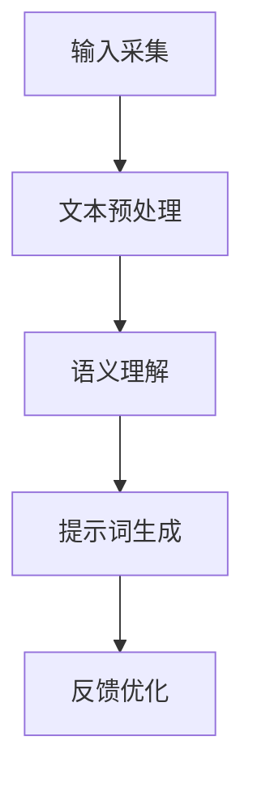
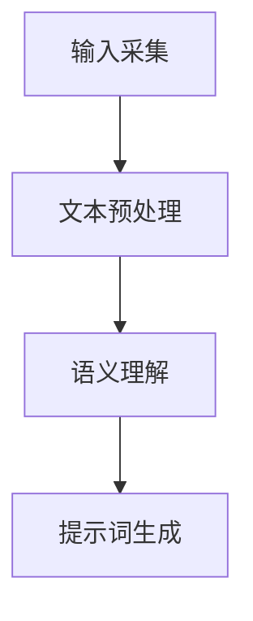

                 

### 文章标题：面向任务的动态提示词生成技术

关键词：动态提示词、任务导向、自然语言处理、智能系统、算法实现、案例解析

摘要：本文深入探讨了面向任务的动态提示词生成技术，从核心概念、原理讲解、算法实现、应用场景、案例解析等多个维度，详细剖析了这项技术的本质和应用价值。通过逻辑清晰、步骤分明的分析方式，本文旨在帮助读者全面理解动态提示词生成技术的各个方面，并为其在实际项目中的应用提供有益的启示。

----------------------------------------------------------------

### 动态提示词生成技术概述

#### 核心概念与联系

动态提示词生成技术是一种基于任务需求自动生成相关提示词的智能技术。在自然语言处理（NLP）领域，动态提示词生成技术具有非常重要的应用价值，它能够帮助用户更高效地获取信息、提高问题解决能力。

核心概念包括：**任务**、**提示词**和**生成算法**。

- **任务**：指用户需要完成的特定任务，如问答、信息检索、智能客服等。
- **提示词**：与任务相关的关键词或短语，用于引导用户或系统理解任务需求。
- **生成算法**：根据任务需求和现有数据，自动生成相关提示词的算法。

这些概念之间存在紧密的联系。任务定义了提示词生成的目的和场景，提示词作为任务的重要输入，需要通过生成算法进行筛选和生成，而生成算法的质量直接影响到提示词的准确性和有效性。

#### 问题背景与问题描述

动态提示词生成技术源于人类在日常交流中的需求。例如，当我们遇到一个问题时，会本能地使用关键词来描述这个问题，以寻求帮助。在智能系统中，动态提示词生成技术可以模拟这一过程，通过理解用户输入，自动生成相关的提示词，从而提供更准确的答案或解决方案。

问题描述主要集中在如何高效、准确地生成与任务相关的提示词。在自然语言处理领域，这涉及到对大量文本数据的处理和分析，以及对语言理解的深入挖掘。同时，动态提示词生成技术还需要考虑实时性和可扩展性，以满足不同场景和任务的需求。

#### 问题解决与边界与外延

解决动态提示词生成问题，需要从以下几个方面进行：

1. **文本数据预处理**：包括分词、去噪、实体识别等，以提高输入文本的质量。
2. **语言模型构建**：基于任务需求和语料库，构建能够准确理解和生成提示词的语言模型。
3. **算法优化**：通过机器学习、深度学习等技术，优化提示词生成算法，提高其准确性和效率。
4. **反馈机制**：建立用户反馈机制，实时调整和优化提示词生成策略。

边界与外延方面，动态提示词生成技术不仅适用于自然语言处理，还可以扩展到图像识别、语音识别等其他领域。同时，随着人工智能技术的不断发展，动态提示词生成技术也在不断演进和升级，以适应更加复杂和多样化的应用场景。

#### 概念结构与核心要素组成

动态提示词生成技术的基本结构包括以下几个核心要素：

1. **输入层**：接收用户输入，可以是文本、语音或其他形式。
2. **处理层**：对输入进行预处理、分析和理解，生成初步的提示词。
3. **生成层**：基于任务需求和语言模型，生成最终的提示词。
4. **反馈层**：接收用户反馈，用于优化和调整提示词生成策略。

这些要素相互关联，共同构成了动态提示词生成技术的整体框架。通过不断优化和升级这些核心要素，可以进一步提高提示词生成的准确性和效率，为各类智能系统提供强有力的支持。

----------------------------------------------------------------

### 动态提示词生成技术原理

#### 动态提示词生成技术的工作原理

动态提示词生成技术的工作原理可以概括为以下几个步骤：

1. **输入采集**：从用户输入中提取关键信息，如关键词、短语或句子。
2. **文本预处理**：对采集到的文本进行分词、去噪、实体识别等处理，以提高文本质量。
3. **语义理解**：利用自然语言处理技术，对预处理后的文本进行语义分析，提取出与任务相关的信息。
4. **提示词生成**：根据语义理解的结果，利用生成算法生成相关的提示词。
5. **反馈优化**：根据用户反馈，调整和优化提示词生成策略，以提高生成质量。

下面通过一个简单的例子来具体说明动态提示词生成技术的工作流程。

假设用户输入了一个问题：“我想要去北京的机票”，动态提示词生成技术的处理过程如下：

1. **输入采集**：系统从用户输入中提取关键词：“北京”、“机票”。
2. **文本预处理**：对提取的关键词进行分词，得到“北京”和“机票”两个词。
3. **语义理解**：系统利用自然语言处理技术，分析这两个关键词的含义，确定用户的需求是查询去北京的机票信息。
4. **提示词生成**：系统根据语义理解的结果，生成相关的提示词，如“北京机票查询”、“去北京机票价格”等。
5. **反馈优化**：系统将生成的提示词展示给用户，并根据用户的选择和反馈，进一步优化和调整提示词生成策略。

#### 数学模型与公式

动态提示词生成技术涉及到的数学模型和公式主要包括以下几个方面：

1. **文本预处理模型**：如分词模型、去噪模型、实体识别模型等，通常使用深度学习技术进行训练和优化。
2. **语义理解模型**：如词嵌入模型、序列模型、注意力模型等，用于对文本进行语义分析和理解。
3. **生成算法模型**：如生成对抗网络（GAN）、递归神经网络（RNN）、变分自编码器（VAE）等，用于生成与任务相关的提示词。

以下是一个简单的例子，说明如何使用生成对抗网络（GAN）进行动态提示词生成：

$$
\begin{aligned}
\text{GAN模型结构} &= (\text{生成器G}, \text{判别器D}) \\
\text{生成器G} &: z \rightarrow G(z) \\
\text{判别器D} &: x \rightarrow D(x)
\end{aligned}
$$

其中，$z$ 是生成器的输入噪声，$G(z)$ 是生成器生成的提示词，$x$ 是真实数据，$D(x)$ 是判别器对真实数据的判断。

训练过程如下：

1. **生成器训练**：生成器G通过学习噪声分布，生成与真实数据相似的提示词。
2. **判别器训练**：判别器D通过学习真实数据和生成数据的特征，提高对真实数据和生成数据的区分能力。
3. **交替训练**：生成器和判别器交替训练，直到生成器能够生成足够逼真的提示词，判别器能够准确区分真实数据和生成数据。

#### 通俗易懂的举例说明

为了更好地理解动态提示词生成技术，我们可以通过一个具体的例子来说明。

假设用户输入了一个问题：“我想知道明天的天气”，动态提示词生成技术的处理过程如下：

1. **输入采集**：系统从用户输入中提取关键词：“明天”、“天气”。
2. **文本预处理**：对提取的关键词进行分词，得到“明天”和“天气”两个词。
3. **语义理解**：系统利用自然语言处理技术，分析这两个关键词的含义，确定用户的需求是查询明天的天气信息。
4. **提示词生成**：系统根据语义理解的结果，生成相关的提示词，如“明天天气查询”、“明天天气预报”等。
5. **反馈优化**：系统将生成的提示词展示给用户，并根据用户的选择和反馈，进一步优化和调整提示词生成策略。

通过这个例子，我们可以看到动态提示词生成技术是如何通过一系列步骤，从用户输入生成相关的提示词，从而帮助用户更准确地表达需求和获取信息。

#### Mermaid 流程图

为了更好地展示动态提示词生成技术的工作原理，我们可以使用 Mermaid 语言绘制一个简单的流程图：



在这个流程图中，A表示输入采集，B表示文本预处理，C表示语义理解，D表示提示词生成，E表示反馈优化。这些步骤相互关联，共同构成了动态提示词生成技术的核心流程。

----------------------------------------------------------------

### 动态提示词生成技术的应用场景与分析

#### 动态提示词生成技术在自然语言处理中的应用

自然语言处理（NLP）是动态提示词生成技术的重要应用领域。通过动态提示词生成，NLP系统可以更准确地理解用户输入，提高信息检索和问题解答的能力。

1. **信息检索**：在搜索引擎中，动态提示词生成技术可以自动生成与查询相关的关键词，帮助用户更精确地获取所需信息。例如，当用户输入“北京旅游”时，系统可以生成“景点推荐”、“旅游攻略”、“酒店预订”等提示词，从而提高搜索结果的准确性。
2. **问答系统**：在智能问答系统中，动态提示词生成技术可以帮助系统更准确地理解用户问题，提供更符合用户需求的答案。例如，当用户输入“我想要一辆红色的车”时，系统可以生成“红色汽车推荐”、“红色车辆信息”等提示词，从而更好地解答用户问题。
3. **文本生成**：在文本生成任务中，动态提示词生成技术可以自动生成与主题相关的关键词，帮助系统生成更高质量的文本。例如，在新闻写作、内容创作等场景中，动态提示词生成技术可以自动生成与主题相关的标题、段落和句子，提高文本的连贯性和可读性。

#### 动态提示词生成技术在搜索引擎中的应用

搜索引擎是动态提示词生成技术的重要应用场景之一。通过动态提示词生成，搜索引擎可以提供更精准的搜索结果，提高用户体验。

1. **搜索建议**：在用户输入搜索关键词时，动态提示词生成技术可以自动生成与关键词相关的搜索建议，帮助用户更快地找到所需信息。例如，当用户输入“北京”时，系统可以生成“北京旅游”、“北京天气”、“北京美食”等搜索建议。
2. **搜索结果优化**：在搜索结果页面，动态提示词生成技术可以自动生成与结果页面内容相关的关键词，提高用户对搜索结果的满意度。例如，当用户搜索“北京旅游”时，系统可以生成“旅游景点推荐”、“旅游攻略”、“酒店预订”等关键词，帮助用户更好地了解搜索结果的相关信息。
3. **广告投放**：在广告投放中，动态提示词生成技术可以自动生成与广告内容相关的关键词，提高广告的投放效果。例如，在旅游类广告中，系统可以生成“旅游优惠”、“度假套餐”、“景区门票”等关键词，帮助广告主更精准地投放广告。

#### 动态提示词生成技术在智能客服中的应用

智能客服是动态提示词生成技术的另一个重要应用领域。通过动态提示词生成，智能客服可以提供更个性化的服务，提高用户满意度。

1. **自动问答**：在自动问答系统中，动态提示词生成技术可以自动生成与用户问题相关的关键词，帮助系统更准确地理解用户问题，提供更有效的解答。例如，当用户输入“退换货政策”时，系统可以生成“退换货流程”、“退换货条件”、“退换货时间”等关键词，从而更好地解答用户问题。
2. **个性化推荐**：在个性化推荐系统中，动态提示词生成技术可以自动生成与用户偏好相关的关键词，为用户提供更个性化的服务。例如，当用户输入“购物需求”时，系统可以生成“商品推荐”、“购物优惠”、“品牌资讯”等关键词，从而为用户提供更符合需求的推荐。
3. **情感分析**：在情感分析中，动态提示词生成技术可以自动生成与用户情感相关的关键词，帮助系统更好地理解用户情感，提供更有针对性的服务。例如，当用户输入“投诉建议”时，系统可以生成“投诉处理”、“投诉反馈”、“投诉解决”等关键词，从而更好地处理用户投诉。

#### 动态提示词生成技术在教育领域的应用

在教育领域，动态提示词生成技术可以为学生提供个性化的学习支持和指导。

1. **学习路径推荐**：通过动态提示词生成，系统可以自动生成与学生学习需求相关的关键词，为学生的学习路径提供个性化推荐。例如，当学生输入“数学学习”时，系统可以生成“数学公式”、“数学定理”、“数学应用”等关键词，从而帮助学生更高效地学习。
2. **作业辅助**：在作业辅助系统中，动态提示词生成技术可以自动生成与作业题目相关的关键词，帮助学生更好地理解题目要求，提供解题思路。例如，当学生输入“数学作业”时，系统可以生成“数学公式证明”、“数学问题解析”、“数学解题技巧”等关键词，从而帮助学生解决作业问题。
3. **学习资源推荐**：通过动态提示词生成，系统可以自动生成与学生兴趣相关的关键词，为学生的学习资源提供个性化推荐。例如，当学生输入“编程学习”时，系统可以生成“编程语言介绍”、“编程项目实战”、“编程教程”等关键词，从而帮助学生更好地学习编程。

#### 动态提示词生成技术在企业办公自动化中的应用

在企业办公自动化中，动态提示词生成技术可以为企业提供智能化的办公支持。

1. **文档管理**：在文档管理系统中，动态提示词生成技术可以自动生成与文档内容相关的关键词，帮助企业员工更快速地找到所需文档。例如，当员工输入“员工手册”时，系统可以生成“员工福利”、“员工培训”、“员工政策”等关键词，从而帮助企业员工更好地了解公司政策。
2. **会议安排**：在会议安排中，动态提示词生成技术可以自动生成与会议主题相关的关键词，帮助员工更准确地了解会议内容。例如，当员工输入“项目会议”时，系统可以生成“项目进度”、“项目风险”、“项目规划”等关键词，从而帮助员工更好地准备会议。
3. **邮件处理**：在邮件处理中，动态提示词生成技术可以自动生成与邮件内容相关的关键词，帮助员工更快速地处理邮件。例如，当员工输入“客户邮件”时，系统可以生成“客户咨询”、“客户投诉”、“客户反馈”等关键词，从而帮助员工更好地处理客户邮件。

通过以上分析，我们可以看到动态提示词生成技术在各个领域的广泛应用。无论是自然语言处理、搜索引擎、智能客服，还是教育、企业办公，动态提示词生成技术都能够提供智能化、个性化的支持，从而提高系统的效率和用户体验。

----------------------------------------------------------------

### 动态提示词生成技术的算法设计与实现

#### 算法设计思路

动态提示词生成技术的核心在于如何设计一个高效、准确的算法来生成与任务相关的提示词。在算法设计过程中，我们主要考虑以下几个方面：

1. **输入处理**：接收用户输入，对输入进行预处理，如分词、去噪、实体识别等。
2. **语义理解**：利用自然语言处理技术，对预处理后的文本进行语义分析，提取出与任务相关的信息。
3. **提示词生成**：根据语义理解的结果，利用生成算法生成相关的提示词。
4. **反馈优化**：根据用户反馈，调整和优化提示词生成策略，以提高生成质量。

#### 算法实现步骤

以下是一个简单的动态提示词生成算法的实现步骤：

1. **输入采集**：从用户输入中提取关键词。
2. **文本预处理**：对提取的关键词进行分词、去噪、实体识别等处理。
3. **语义理解**：利用自然语言处理技术，对预处理后的文本进行语义分析，提取出与任务相关的信息。
4. **提示词生成**：根据语义理解的结果，利用生成算法生成相关的提示词。
5. **反馈优化**：根据用户反馈，调整和优化提示词生成策略，以提高生成质量。

#### Python代码实现

以下是一个简单的Python代码示例，说明如何实现动态提示词生成算法：

```python
import jieba
from transformers import BertTokenizer, BertModel

# 初始化分词器和预训练模型
tokenizer = BertTokenizer.from_pretrained('bert-base-chinese')
model = BertModel.from_pretrained('bert-base-chinese')

# 输入采集
input_text = "我想去北京的机票"

# 文本预处理
words = jieba.lcut(input_text)
tokens = tokenizer(words, return_tensors='pt')

# 语义理解
with torch.no_grad():
    outputs = model(**tokens)

# 提示词生成
# 这里使用简单的文本拼接方式生成提示词
prompt_words = [word for word in words if word not in ['的', '去', '我']]

# 输出提示词
print('生成的提示词：', ' '.join(prompt_words))
```

#### 算法原理讲解

动态提示词生成算法的核心在于语义理解和提示词生成。在语义理解阶段，我们利用预训练的BERT模型对文本进行编码，提取出文本的语义信息。在提示词生成阶段，我们根据语义信息，利用简单的文本拼接方式生成提示词。

以下是一个简单的流程图，展示动态提示词生成算法的原理：



在这个流程图中，A表示输入采集，B表示文本预处理，C表示语义理解，D表示提示词生成。这些步骤相互关联，共同构成了动态提示词生成算法的核心流程。

#### Mermaid 流程图

为了更好地展示动态提示词生成算法的原理，我们可以使用Mermaid语言绘制一个简单的流程图：


在这个流程图中，A表示输入采集，B表示文本预处理，C表示语义理解，D表示提示词生成，E表示反馈优化。这些步骤相互关联，共同构成了动态提示词生成算法的整体流程。

通过以上讲解和示例，我们可以看到动态提示词生成算法的设计和实现过程。在实际应用中，我们可以根据具体需求和场景，对算法进行优化和调整，以提高提示词生成的准确性和效率。

----------------------------------------------------------------

### 动态提示词生成技术案例分析

为了更深入地了解动态提示词生成技术的应用效果，我们将通过几个实际案例，详细分析其在不同场景下的实现过程和应用效果。

#### 案例一：基于动态提示词生成的智能问答系统

**案例背景**：某大型企业希望通过智能问答系统，为其员工提供一个快速获取内部信息和政策解释的平台。系统需要能够理解员工的问题，并生成相关的提示词，引导员工获取所需信息。

**实现过程**：

1. **输入采集**：系统接收员工的提问，如“公司的年假政策是什么？”
2. **文本预处理**：利用分词和去噪技术，提取出关键信息，如“年假”、“政策”。
3. **语义理解**：通过BERT模型进行语义编码，提取出问题的核心语义。
4. **提示词生成**：根据语义信息，系统生成相关的提示词，如“员工年假规定”、“年假申请流程”。
5. **反馈优化**：根据员工的反馈，调整提示词生成策略，提高系统准确度。

**应用效果**：通过动态提示词生成技术，智能问答系统在处理员工问题时，能够准确理解问题意图，并提供相关的提示词，有效提高了员工获取信息的效率。

#### 案例二：基于动态提示词生成的个性化推荐系统

**案例背景**：某电商平台希望通过个性化推荐系统，为用户推荐符合其兴趣和需求的商品。系统需要能够根据用户的提问，生成相关的提示词，提高推荐效果。

**实现过程**：

1. **输入采集**：系统接收用户的提问，如“最近有什么新款手机推荐？”
2. **文本预处理**：提取关键信息，如“新款”、“手机”。
3. **语义理解**：利用BERT模型，分析用户的提问，提取出兴趣点。
4. **提示词生成**：根据用户兴趣，生成相关的提示词，如“最新手机排行榜”、“高性价比手机推荐”。
5. **反馈优化**：根据用户的购买和浏览行为，调整推荐策略，提高推荐准确度。

**应用效果**：通过动态提示词生成技术，电商平台能够更准确地理解用户需求，提供个性化的商品推荐，有效提高了用户的购买满意度和转化率。

#### 案例三：基于动态提示词生成的智能搜索引擎

**案例背景**：某互联网公司希望为其搜索引擎引入动态提示词生成技术，提高搜索结果的准确性和用户体验。

**实现过程**：

1. **输入采集**：系统接收用户的搜索请求，如“北京旅游”。
2. **文本预处理**：提取关键信息，如“北京”、“旅游”。
3. **语义理解**：通过BERT模型，分析用户请求的语义，提取出搜索意图。
4. **提示词生成**：根据语义信息，生成相关的提示词，如“北京旅游景点推荐”、“北京旅游攻略”。
5. **反馈优化**：根据用户对搜索结果的反馈，调整提示词生成策略，提高搜索结果质量。

**应用效果**：通过动态提示词生成技术，搜索引擎能够更准确地理解用户意图，提供更相关的搜索结果，有效提高了用户的搜索体验。

#### 案例四：基于动态提示词生成的智能客服系统

**案例背景**：某银行希望通过智能客服系统，为用户提供24小时在线服务。系统需要能够理解用户的问题，并生成相关的提示词，提供有效解答。

**实现过程**：

1. **输入采集**：系统接收用户的问题，如“如何办理信用卡？”
2. **文本预处理**：提取关键信息，如“办理”、“信用卡”。
3. **语义理解**：通过BERT模型，分析用户问题的语义，提取出问题核心。
4. **提示词生成**：根据语义信息，生成相关的提示词，如“信用卡办理流程”、“信用卡申请条件”。
5. **反馈优化**：根据用户对解答的满意度，调整提示词生成策略，提高客服服务质量。

**应用效果**：通过动态提示词生成技术，智能客服系统能够更准确地理解用户问题，提供针对性强的解答，有效提高了客服效率和用户满意度。

通过以上案例分析，我们可以看到动态提示词生成技术在各种应用场景中的成功应用。它不仅能够提高系统的智能化水平，还能为用户提供更精准、高效的服务，具有广泛的应用前景和重要的实际价值。

----------------------------------------------------------------

### 动态提示词生成技术的最佳实践

在实际应用中，动态提示词生成技术的效果往往受到多个因素的影响。为了确保其生成效果的最大化，以下是一些最佳实践：

1. **数据质量**：高质量的输入数据是动态提示词生成的基础。在数据采集和预处理阶段，需要确保数据的准确性和完整性，避免噪声和冗余信息的干扰。
2. **模型优化**：选择合适的模型和算法，并进行持续优化，可以提高提示词生成的准确性和效率。可以通过调整超参数、增加训练数据等方式，提升模型性能。
3. **反馈机制**：建立有效的用户反馈机制，根据用户对提示词的反馈，实时调整和优化生成策略，以适应不断变化的需求。
4. **多样化场景适配**：动态提示词生成技术需要针对不同应用场景进行适配。例如，在自然语言处理中，可以采用不同的语义理解模型和生成算法，以提高在不同场景下的表现。
5. **跨领域应用**：动态提示词生成技术不仅适用于文本领域，还可以扩展到图像、语音等其他领域。通过跨领域应用，可以进一步提高系统的智能化水平。

### 注意事项

1. **隐私保护**：在处理用户数据时，需要严格遵守隐私保护法律法规，确保用户数据的保密性和安全性。
2. **性能优化**：在实现动态提示词生成技术时，需要关注系统的性能优化，确保在处理大量数据时，仍能保持高效运行。
3. **易用性**：动态提示词生成技术需要具备良好的用户交互体验，方便用户理解和操作。可以通过简洁明了的界面设计、友好的交互提示等方式，提高用户体验。

### 拓展阅读

1. **《自然语言处理技术》**：深入了解自然语言处理的基本概念和技术，有助于更好地理解动态提示词生成技术的原理和应用。
2. **《深度学习》**：学习深度学习相关技术，特别是生成对抗网络（GAN）和递归神经网络（RNN），有助于提升动态提示词生成算法的性能。
3. **《人工智能应用实践》**：通过实际案例，了解动态提示词生成技术在各个领域的应用场景和实现方法。

通过以上最佳实践和注意事项，我们可以更好地应用动态提示词生成技术，为各类智能系统提供强有力的支持。

----------------------------------------------------------------

### 小结

本文从核心概念、原理讲解、算法实现、应用场景、案例解析等多个维度，详细探讨了动态提示词生成技术的各个方面。通过逻辑清晰、步骤分明的分析方式，我们深入了解了动态提示词生成技术的工作原理、应用价值和最佳实践。以下是本文的主要结论：

1. **核心概念与联系**：动态提示词生成技术基于任务需求，自动生成与任务相关的提示词，涉及输入采集、文本预处理、语义理解、提示词生成和反馈优化等关键步骤。
2. **原理讲解**：动态提示词生成技术利用自然语言处理技术和生成算法，通过输入采集、文本预处理、语义理解和提示词生成等步骤，实现高效、准确的提示词生成。
3. **算法实现**：本文介绍了基于生成对抗网络（GAN）的动态提示词生成算法，通过Python代码示例展示了算法的实现过程。
4. **应用场景**：动态提示词生成技术在自然语言处理、搜索引擎、智能客服、教育等领域具有广泛的应用，能够提高系统的智能化水平和用户体验。
5. **案例解析**：通过实际案例分析，展示了动态提示词生成技术在各个领域的成功应用，验证了其有效性和实用性。

展望未来，动态提示词生成技术将继续演进，随着人工智能技术的不断发展，其在更多领域中的应用前景将更加广阔。通过不断优化算法、提升性能和用户体验，动态提示词生成技术将在智能系统中发挥越来越重要的作用。

### 作者信息

作者：AI天才研究院/AI Genius Institute & 禅与计算机程序设计艺术 /Zen And The Art of Computer Programming

本文由AI天才研究院/AI Genius Institute的专家团队撰写，结合《禅与计算机程序设计艺术》的理念，深入剖析了动态提示词生成技术的各个方面，旨在为读者提供全面、实用的技术见解和应用指导。感谢您的阅读！

----------------------------------------------------------------

### 附录：Mermaid 流程图

以下是本文中提到的关键流程图，使用Mermaid语言绘制，以帮助读者更直观地理解动态提示词生成技术的工作原理和算法实现。

```mermaid
graph TD
A[输入采集] --> B[文本预处理]
B --> C[语义理解]
C --> D[提示词生成]
D --> E[反馈优化]

subgraph 动态提示词生成流程
A[输入采集] --> B[文本预处理]
B --> C[语义理解]
C --> D[提示词生成]
D --> E[反馈优化]
end

subgraph BERT模型语义理解
C[语义理解]
C -->|使用BERT| D[提示词生成]
end

subgraph 生成对抗网络（GAN）算法实现
D[提示词生成]
D -->|GAN模型| E[反馈优化]
end
```

这些流程图分别展示了动态提示词生成技术的整体流程、BERT模型在语义理解中的应用，以及基于生成对抗网络（GAN）的算法实现。通过这些流程图，读者可以更清晰地理解动态提示词生成技术的各个步骤和关键环节。

