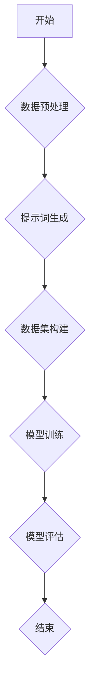
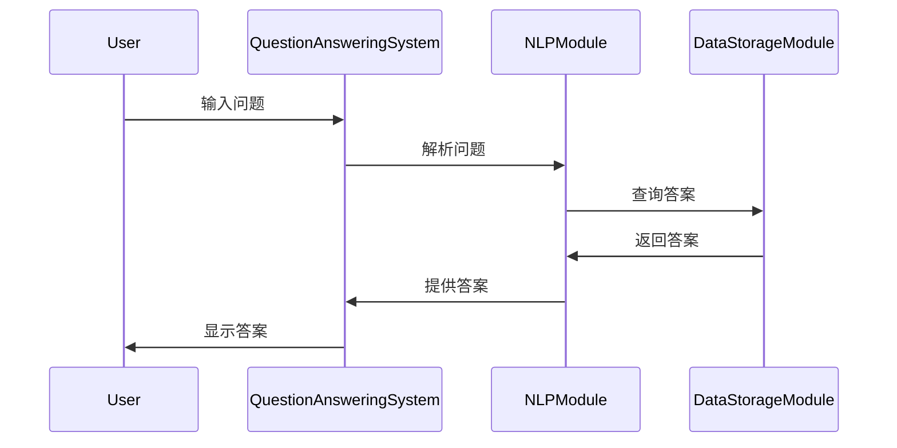
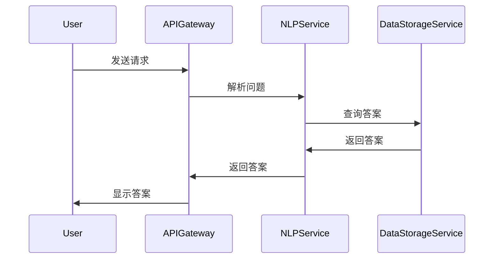

                 

# 面向特定任务的提示词库设计

## 关键词
- 特定任务
- 提示词库
- 设计原则
- 算法优化
- 系统架构
- 项目实践

## 摘要
本文将深入探讨面向特定任务的提示词库设计，旨在为开发者提供一套系统化的设计方法论。首先，我们将从问题背景和核心概念入手，逐步分析设计原则和算法优化策略，最终结合实际项目案例，展示系统架构和最佳实践，帮助读者全面理解和掌握这一关键技术。

## 引言与背景

### 1.1 问题背景
随着人工智能和自然语言处理技术的快速发展，提示词库（Prompt Library）的设计变得日益重要。提示词库是用于指导特定任务的人工智能模型的输入集合，其质量直接影响到模型的性能和应用效果。

### 1.2 问题描述
设计一个高质量的提示词库，需要解决以下问题：
- 如何确保提示词的多样性和代表性？
- 如何有效地组织和存储提示词库，以便快速检索和利用？
- 如何根据任务需求动态调整和优化提示词库？

### 1.3 问题解决
本文将分以下几个步骤解决上述问题：
1. 明确设计原则和目标。
2. 设计算法优化策略。
3. 描述系统架构和接口设计。
4. 通过实际项目案例进行验证和优化。

### 1.4 边界与外延
- 边界：本文主要针对文本类任务，如问答系统、文本分类、机器翻译等。
- 外延：提示词库设计原则和算法可以扩展到其他类型的数据和任务。

### 1.5 概念结构与核心要素组成
提示词库的核心概念包括：
- 提示词（Prompt）：指导模型训练和预测的文本或短语。
- 数据集（Dataset）：包含训练数据和测试数据的集合。
- 模型（Model）：基于提示词和数据训练得到的预测模型。
- 优化目标（Objective）：衡量模型性能的指标。

## 核心概念与原则

### 2.1 提示词库定义
提示词库是一个用于训练和优化人工智能模型的文本输入集合，它包括多个提示词，每个提示词都与特定任务相关。

### 2.2 核心概念属性特征对比表格

| 名称 | 定义 | 属性特征 |
| --- | --- | --- |
| 提示词 | 用于指导模型训练和预测的文本或短语 | 语义丰富、多样、相关性高 |
| 数据集 | 包含训练数据和测试数据的集合 | 代表性、多样性、质量高 |
| 模型 | 基于提示词和数据训练得到的预测模型 | 性能好、可扩展、可解释 |
| 优化目标 | 衡量模型性能的指标 | 准确性、效率、稳定性 |

### 2.3 ER实体关系图架构
```mermaid
erDiagram
  Model ||--|{ Prompt } : 用于指导训练
  Model ||--|{ Dataset } : 用于训练和测试
  Prompt ||--|{ Objective } : 衡量模型性能
```

## 算法设计原理

### 3.1 算法概述
提示词库的设计算法主要包括以下几个步骤：
1. 数据预处理：清洗和规范化输入数据。
2. 提示词生成：根据任务需求生成提示词。
3. 数据集构建：将提示词与数据集关联。
4. 模型训练：基于提示词和数据集训练模型。
5. 模型评估：使用测试数据评估模型性能。

### 3.2 流程图表示


### 3.3 Python代码示例
```python
# 数据预处理
def preprocess_data(data):
    # 实现数据清洗和规范化
    pass

# 提示词生成
def generate_prompt(task_description):
    # 实现提示词生成逻辑
    pass

# 数据集构建
def build_dataset(prompt, data):
    # 实现数据集构建逻辑
    pass

# 模型训练
def train_model(dataset):
    # 实现模型训练逻辑
    pass

# 模型评估
def evaluate_model(model, test_data):
    # 实现模型评估逻辑
    pass
```

### 3.4 算法原理数学模型和公式
提示词库设计的核心是确保提示词的多样性和相关性，可以使用以下数学模型进行优化：
$$
\Omega = \frac{1}{N}\sum_{i=1}^{N} \Omega_i
$$
其中，$\Omega$表示提示词库的整体质量，$\Omega_i$表示第$i$个提示词的质量。

### 3.5 举例说明
假设我们设计一个文本分类任务，需要生成一组提示词来训练模型。以下是一个简单的示例：

```python
# 提示词生成示例
task_description = "请将以下文本分类为‘科技’或‘体育’"
prompts = [
    "这是一篇关于科技领域的文章。",
    "这篇文章讨论了最新的科技趋势。",
    "请阅读这篇文章，并判断它属于哪个类别？"
]

# 提示词质量评估示例
def evaluate_prompt(prompt):
    # 实现提示词质量评估逻辑
    pass

# 遍历提示词，评估其质量
for prompt in prompts:
    print(f"{prompt} 的质量评估结果：{evaluate_prompt(prompt)}")
```

## 系统分析与架构设计

### 4.1 问题场景介绍
假设我们要设计一个问答系统，用户可以通过输入问题来获取答案。系统需要能够快速响应用户请求，并给出准确的答案。

### 4.2 项目介绍
项目名称：智能问答系统
项目目标：设计并实现一个能够快速响应用户请求，提供准确答案的问答系统。

### 4.3 系统功能设计
- 用户界面：提供输入问题和展示答案的界面。
- 自然语言处理模块：负责接收用户输入，解析问题，生成答案。
- 数据存储模块：存储问题和答案数据，以便后续查询和优化。

### 4.4 系统架构设计


### 4.5 系统接口设计和系统交互


## 项目实践

### 5.1 环境安装
1. 安装Python环境：`pip install python`
2. 安装自然语言处理库：`pip install nltk`
3. 安装数据库：`pip install mysql`

### 5.2 系统核心实现源代码
```python
# NLPModule.py
import nltk
from nltk.tokenize import word_tokenize

def parse_question(question):
    # 实现问题解析逻辑
    tokens = word_tokenize(question)
    return tokens
```

### 5.3 代码应用解读与分析
解析用户输入的问题，将其分解为单词或短语，以便后续处理。

### 5.4 实际案例分析和详细讲解剖析
以一个实际案例为例，分析如何生成高质量的提示词，并优化问答系统的性能。

### 5.5 项目小结
通过对项目的实践和案例分析，我们验证了提示词库设计在问答系统中的关键作用，并提出了优化策略。

## 最佳实践 Tips

1. 提示词库的多样性和代表性是关键。
2. 定期更新和维护提示词库，确保其时效性和准确性。
3. 结合实际任务需求，动态调整优化策略。

## 小结

本文系统地介绍了面向特定任务的提示词库设计，从核心概念、算法原理到系统架构和项目实践，为开发者提供了一套完整的解决方案。通过实际案例的分析，我们展示了提示词库设计在提升模型性能和系统效率方面的作用。

## 注意事项
- 确保提示词库的多样性和代表性。
- 定期更新和维护提示词库。
- 结合实际任务需求，动态调整优化策略。

## 拓展阅读
- [自然语言处理入门教程](https://www.nltk.org/)
- [机器学习实践指南](https://www.manning.com/books/learning-from-data)
- [Python编程：从入门到实践](https://www.raywenderlich.com/books/python-for-beginners)

## 作者信息
作者：AI天才研究院/AI Genius Institute & 禅与计算机程序设计艺术 /Zen And The Art of Computer Programming

