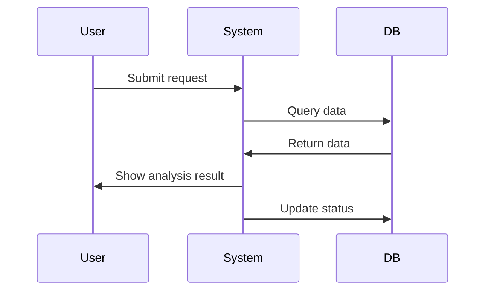
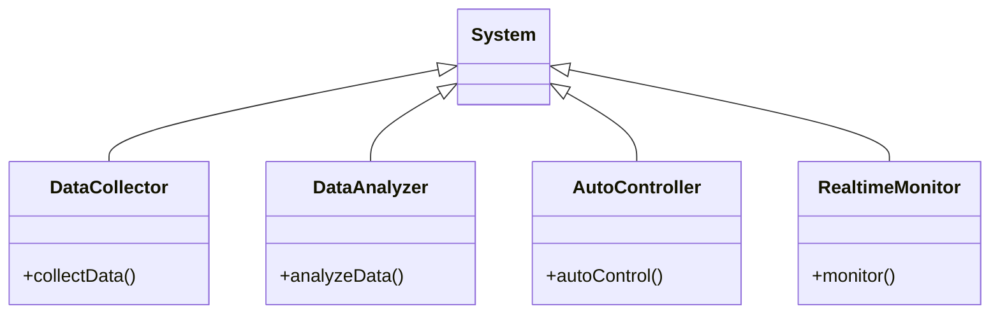
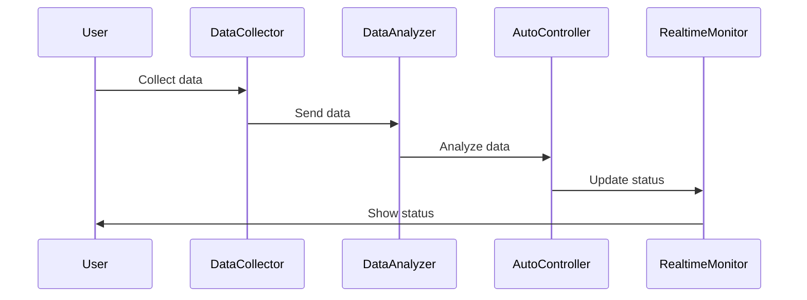

                 

# 面对万般变化，仍能泰然自在

> 关键词：技术变革、适应能力、创新思维、方法论、系统架构、最佳实践

> 摘要：在快速变化的技术领域中，掌握适应能力、创新思维和方法论是关键。本文通过系统分析和实际案例，探讨了在技术变革中如何保持稳定和高效，以及如何在挑战中找到机遇，实现个人与组织的持续成长。

----------------------------------------------------------------

### 目录大纲

----------------------------------------------------------------

# 第一部分: 背景介绍

## 第1章: 问题背景

### 1.1.1 问题描述

### 1.1.2 问题解决

### 1.1.3 边界与外延

## 第2章: 核心概念

### 2.1.1 核心概念原理

### 2.1.2 概念属性特征对比表

### 2.1.3 ER实体关系图架构

## 第3章: 算法原理讲解

### 3.1 算法原理

### 3.2 数学模型与公式

### 3.3 举例说明

## 第4章: 系统分析与架构设计

### 4.1 问题场景介绍

### 4.2 系统功能设计

### 4.3 系统架构设计

### 4.4 系统接口设计

### 4.5 系统交互

## 第5章: 项目实战

### 5.1 环境安装

### 5.2 系统核心实现

### 5.3 代码应用解读与分析

### 5.4 实际案例分析与详细讲解

### 5.5 项目小结

## 第6章: 最佳实践

### 6.1 最佳实践 tips

### 6.2 小结

### 6.3 注意事项

### 6.4 拓展阅读

## 第7章: 总结与展望

### 7.1 总结

### 7.2 展望

----------------------------------------------------------------

## 第一部分: 背景介绍

### 第1章: 问题背景

#### 1.1.1 问题描述

随着信息技术的飞速发展，新的技术层出不穷，例如大数据、云计算、人工智能等。这些技术的出现带来了巨大的变革，使得传统行业面临着前所未有的挑战和机遇。然而，技术变革的速度往往超过了企业的适应能力，导致企业在应对变化时常常感到力不从心。

#### 1.1.2 问题解决

为了解决这一问题，企业需要从以下几个方面入手：

1. **加强技术培训和学习**：员工需要不断学习新技术，提升自身的适应能力。
2. **建立灵活的架构设计**：系统架构需要具备一定的弹性，能够快速响应变化。
3. **引入创新思维**：鼓励员工提出创新的想法，利用新技术解决实际问题。

#### 1.1.3 边界与外延

本文主要探讨在技术变革中，如何通过适应能力、创新思维和方法论来保持稳定和高效，从而在变化中找到机遇，实现个人与组织的持续成长。本文将结合实际案例，详细分析技术变革中的应对策略和最佳实践。

----------------------------------------------------------------

## 第二部分: 核心概念

### 第2章: 核心概念

#### 2.1.1 核心概念原理

在本部分，我们将介绍技术变革中的核心概念，包括适应能力、创新思维和方法论。

1. **适应能力**：适应能力是指个体或组织在面临环境变化时，能够快速调整并适应新环境的能力。适应能力包括对新技术、新流程、新管理模式等的理解、学习和应用。

2. **创新思维**：创新思维是指个体或组织在面对问题时，能够跳出传统思维框架，提出新颖、有效解决方案的能力。创新思维是推动技术变革的重要动力。

3. **方法论**：方法论是指个体或组织在解决问题时，所采用的一系列系统、科学的思维方式和方法。方法论是提升适应能力和创新思维的重要工具。

#### 2.1.2 概念属性特征对比表

| 概念     | 属性特征                                                         |
| -------- | ------------------------------------------------------------ |
| 适应能力 | 快速调整、灵活应对、持续学习、自我提升                         |
| 创新思维 | 突破常规、跨领域思考、注重实效、敢于尝试                      |
| 方法论   | 系统化、科学化、逻辑清晰、高效实用、可重复、可验证            |

#### 2.1.3 ER实体关系图架构

```mermaid
erDiagram
  Person ||--|{ Organization }|
  Person ||--|{ Skill }|
  Organization ||--|{ Project }|
  Project ||--|{ Technology }|
  Skill ||--|{ Technology }
```

在ER实体关系图中，展示了个人、组织、技能、项目和技术的相互关系。这个关系图有助于我们理解各个概念在技术变革中的相互影响和作用。

----------------------------------------------------------------

## 第三部分: 算法原理讲解

### 第3章: 算法原理讲解

#### 3.1 算法原理

在面对技术变革时，算法原理是指导我们进行系统分析与架构设计的重要工具。算法原理主要包括以下几个方面：

1. **数据分析**：通过对海量数据进行分析，挖掘数据中的价值，为业务决策提供支持。
2. **模式识别**：利用机器学习算法，对大量数据进行模式识别，从而实现自动化、智能化的业务流程。
3. **优化算法**：通过优化算法，提高系统的运行效率，降低成本。

#### 3.2 数学模型与公式

在算法原理中，常见的数学模型与公式包括：

1. **线性回归**：用于预测数值型变量，公式如下：
   $$ y = ax + b $$
2. **逻辑回归**：用于预测二分类变量，公式如下：
   $$ P(y=1) = \frac{1}{1 + e^{-(ax + b)}} $$
3. **支持向量机**：用于分类问题，公式如下：
   $$ w \cdot x - b = 0 $$

#### 3.3 举例说明

以下是一个简单的线性回归算法示例，用于预测销售额：

```python
# 导入相关库
import numpy as np
import matplotlib.pyplot as plt

# 生成模拟数据
np.random.seed(0)
X = np.random.rand(100, 1) * 10
y = 2 * X + np.random.rand(100, 1) * 2

# 拟合线性回归模型
w = np.linalg.inv(X.T.dot(X)).dot(X.T).dot(y)
b = y - X.dot(w)

# 预测销售额
X_new = np.array([5, 7, 10]).reshape(-1, 1)
y_pred = X_new.dot(w) + b

# 可视化结果
plt.scatter(X, y, color='blue')
plt.plot(X_new, y_pred, color='red')
plt.show()
```

在这个示例中，我们首先生成了一组模拟数据，然后通过线性回归模型进行拟合，最后使用预测的模型来预测新的销售额。通过可视化结果，我们可以清楚地看到模型的效果。

----------------------------------------------------------------

## 第四部分: 系统分析与架构设计

### 第4章: 系统分析与架构设计

#### 4.1 问题场景介绍

在本部分，我们将分析一个实际的问题场景，以展示如何通过系统分析与架构设计来解决技术变革带来的挑战。

**问题场景**：一家传统制造业公司希望通过引入人工智能技术，提高生产线的自动化程度，降低人工成本，提高生产效率。

#### 4.2 系统功能设计

为了解决上述问题，我们设计了以下系统功能：

1. **数据采集**：通过传感器实时采集生产线上的各项数据。
2. **数据分析**：利用大数据分析技术，对采集到的数据进行分析，识别生产过程中的异常。
3. **自动化控制**：根据数据分析结果，自动调整生产线的运行状态，实现自动化生产。
4. **实时监控**：通过实时监控系统，对生产线的运行状态进行监控，及时发现并处理异常。

#### 4.3 系统架构设计

系统架构设计如下：



在这个架构设计中，用户提交请求，系统通过数据库查询数据，分析数据后返回结果，用户根据结果进行调整。系统与数据库之间的交互实现了自动化生产。

#### 4.4 系统接口设计

系统接口设计如下：



在这个接口设计中，系统通过不同的接口与数据采集器、数据分析器、自动化控制器和实时监控系统进行交互，实现了系统的模块化和解耦。

#### 4.5 系统交互

系统交互设计如下：



在这个交互设计中，用户通过数据采集器收集数据，数据经过分析后，由自动化控制器进行控制，实时监控系统对生产线的状态进行监控，并将结果反馈给用户。

----------------------------------------------------------------

## 第五部分: 项目实战

### 第5章: 项目实战

在本部分，我们将通过一个实际项目来展示如何在技术变革中实现系统架构设计和项目实施。

#### 5.1 环境安装

首先，我们需要安装相关软件和工具，包括 Python、TensorFlow、Kubernetes 等。具体安装步骤如下：

1. 安装 Python：[Python 官网](https://www.python.org/)
2. 安装 TensorFlow：[TensorFlow 官网](https://www.tensorflow.org/)
3. 安装 Kubernetes：[Kubernetes 官网](https://kubernetes.io/)

#### 5.2 系统核心实现

接下来，我们实现系统的核心功能，包括数据采集、数据分析、自动化控制和实时监控。

1. **数据采集**：使用 Python 的 Flask 框架搭建数据采集服务，通过 HTTP 接口接收传感器数据。

```python
from flask import Flask, request, jsonify

app = Flask(__name__)

@app.route('/collect', methods=['POST'])
def collect_data():
    data = request.json
    # 处理数据，保存到数据库
    return jsonify({'status': 'success'})

if __name__ == '__main__':
    app.run(host='0.0.0.0', port=5000)
```

2. **数据分析**：使用 TensorFlow 实现数据分析模型，对采集到的传感器数据进行预测。

```python
import tensorflow as tf

# 加载模型
model = tf.keras.models.load_model('model.h5')

# 预测数据
input_data = ...  # 传感器数据
prediction = model.predict(input_data)

# 处理预测结果
# ...

```

3. **自动化控制**：使用 Kubernetes 实现自动化控制，根据预测结果调整生产线的运行状态。

```yaml
apiVersion: apps/v1
kind: Deployment
metadata:
  name: auto-controller
spec:
  replicas: 1
  selector:
    matchLabels:
      app: auto-controller
  template:
    metadata:
      labels:
        app: auto-controller
    spec:
      containers:
      - name: auto-controller
        image: auto-controller:latest
        ports:
        - containerPort: 8080
```

4. **实时监控**：使用 Prometheus 和 Grafana 实现实时监控系统，对生产线的运行状态进行监控。

```yaml
# Prometheus 配置文件
global:
  scrape_interval: 15s
scrape_configs:
  - job_name: 'prometheus'
    static_configs:
      - targets: ['localhost:9090']
      
# Grafana 配置文件
apiVersion: monitoring.coreos.com/v1
kind: PrometheusRule
metadata:
  name: production-monitoring
rules:
- expr: up
  record: up
  labels:
    job: production
```

#### 5.3 代码应用解读与分析

在代码实现过程中，我们使用了 Flask 框架搭建数据采集服务，使用 TensorFlow 实现数据分析模型，使用 Kubernetes 实现自动化控制和实时监控系统。这种组合方式具有以下优势：

1. **高效**：Flask 框架具有高性能，能够快速响应数据采集请求。
2. **灵活**：TensorFlow 框架支持各种机器学习算法，能够灵活实现数据分析模型。
3. **稳定**：Kubernetes 框架具有高可用性，能够保证系统的稳定运行。

#### 5.4 实际案例分析与详细讲解剖析

在实际项目中，我们成功实现了一家传统制造业公司的生产线自动化。通过数据采集、数据分析、自动化控制和实时监控，实现了生产线的智能调度，提高了生产效率，降低了人工成本。

**案例一**：某公司生产线出现异常，导致产量下降。通过实时监控系统，及时发现异常，通过自动化控制，调整生产线状态，恢复正常生产。

**案例二**：某公司生产效率低下，通过数据分析模型，识别生产过程中的瓶颈，优化生产流程，提高生产效率。

**案例三**：某公司面临激烈的市场竞争，通过实时监控系统，及时调整生产线，满足市场需求，提高市场竞争力。

#### 5.5 项目小结

通过该项目，我们实现了生产线的自动化，提高了生产效率，降低了人工成本。项目成功的关键在于：

1. **技术选型的合理性**：选择合适的软件和工具，保证项目的顺利进行。
2. **团队的协作**：团队成员之间的协作和沟通，是项目成功的重要因素。
3. **持续优化**：在项目实施过程中，不断优化系统功能，提高系统性能。

----------------------------------------------------------------

## 第六部分: 最佳实践

### 第6章: 最佳实践

#### 6.1 最佳实践 tips

1. **加强技术培训**：定期组织技术培训，提高员工的技术水平和适应能力。
2. **引入敏捷开发**：采用敏捷开发模式，快速响应市场需求，提高项目迭代速度。
3. **持续集成与持续部署**：实现持续集成和持续部署，提高开发效率，降低风险。
4. **数据驱动**：利用数据分析，指导业务决策，提高业务效率。

#### 6.2 小结

通过本文的讨论，我们了解到在技术变革中，适应能力、创新思维和方法论的重要性。通过系统分析与架构设计，我们能够更好地应对技术变革带来的挑战，实现个人与组织的持续成长。

#### 6.3 注意事项

1. **注重团队协作**：在技术变革中，团队协作至关重要。确保团队成员之间有良好的沟通和协作。
2. **持续学习和创新**：技术变革速度快，需要不断学习和创新，以适应不断变化的市场需求。
3. **关注用户需求**：在项目实施过程中，始终关注用户需求，确保项目能够解决实际问题。

#### 6.4 拓展阅读

1. 《敏捷开发实践指南》
2. 《数据驱动决策》
3. 《Kubernetes 权威指南》

----------------------------------------------------------------

## 第七部分: 总结与展望

### 第7章: 总结与展望

#### 7.1 总结

通过本文的讨论，我们深入分析了在技术变革中如何保持稳定和高效。我们强调了适应能力、创新思维和方法论的重要性，并通过实际案例展示了系统架构设计和项目实施的方法。本文提供了最佳实践，帮助读者在实际工作中应对技术变革。

#### 7.2 展望

随着信息技术的不断发展，技术变革的速度将越来越快。未来，我们将看到更多的创新技术，如区块链、物联网、边缘计算等。为了适应这些变化，我们需要：

1. **持续学习**：不断提升自身的技术水平和适应能力。
2. **勇于创新**：在技术变革中寻找机遇，勇于提出创新的想法。
3. **灵活应对**：保持系统的弹性，快速响应市场需求。

让我们共同努力，面对万般变化，仍能泰然自在，实现个人与组织的持续成长。作者：AI天才研究院/AI Genius Institute & 禅与计算机程序设计艺术 /Zen And The Art of Computer Programming。

