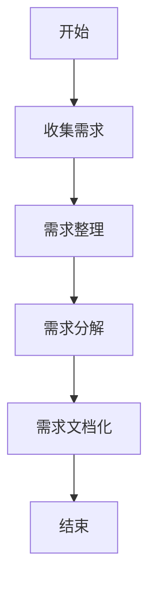
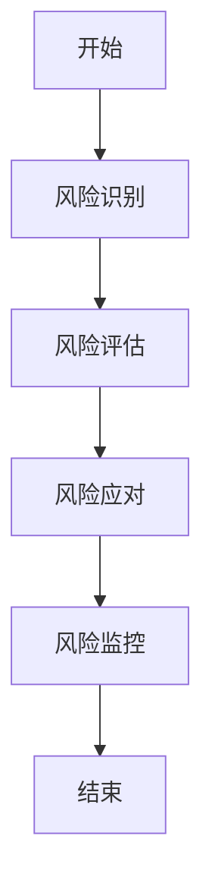
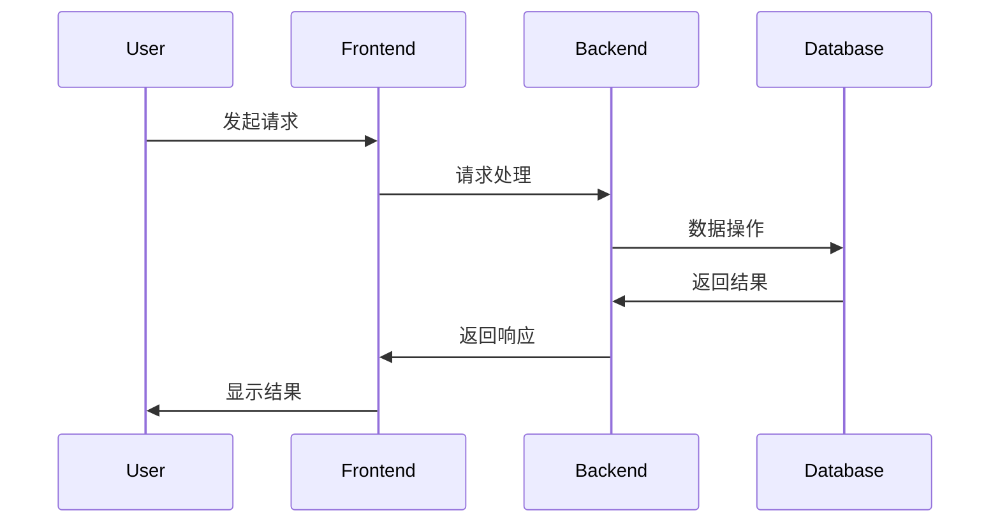
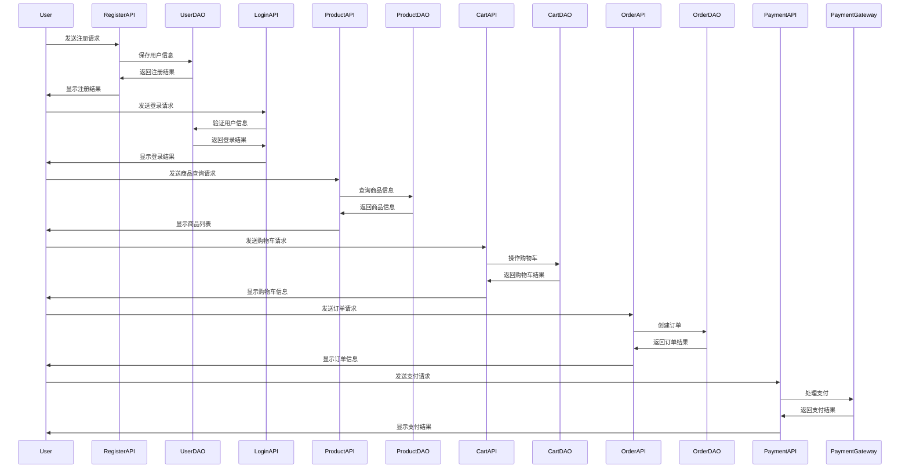
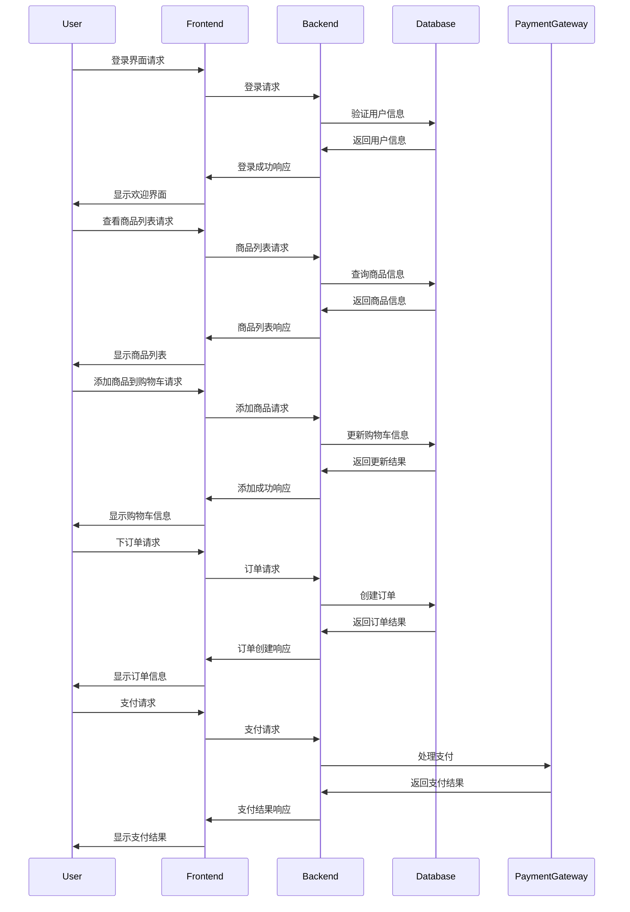

                 


### 项目成功离不开好系统分

关键词：项目成功，系统分析，系统架构，算法原理，数学模型，实战案例，最佳实践

摘要：本文深入探讨了项目成功的核心要素，特别是系统分析的重要性。通过分步骤的分析，本文揭示了系统分析在项目成功中的关键作用，包括核心概念、算法原理、数学模型、系统架构设计以及实战案例分析。文章还总结了最佳实践，并提供了一些建议和拓展阅读资源。

---

## 引言

项目成功是一个复杂而多维度的概念，它不仅仅是实现既定的目标和功能，还涉及到资源的有效利用、团队的协作、风险的管理以及持续改进。在众多影响项目成功的因素中，系统分析占据了核心位置。本文将围绕这一主题，逐步剖析系统分析在项目成功中的关键作用。

### 第一部分：项目成功的系统分析基础

#### 第1章：项目成功的定义与系统分析的重要性

**1.1 项目成功的定义与背景**

项目成功通常被定义为在规定的时间和预算内，完成既定目标和预期结果的过程。成功的项目不仅能够交付符合质量要求的产品或服务，还能够带来商业价值、客户满意度以及团队的成长。

在当今快速变化的环境中，项目成功的挑战日益增加。技术的迅速发展、市场竞争的加剧以及客户需求的不断变化，使得项目管理者需要具备更加全面的分析能力和系统思维。

**1.2 系统分析在项目成功中的作用**

系统分析是项目成功的基础。它涉及到对项目需求的深入理解、系统功能的明确定义、风险的有效评估以及解决方案的设计。以下是系统分析在项目成功中的几个关键作用：

1. **需求分析**：系统分析首先需要明确项目的需求。这包括功能需求、性能需求、安全需求等。通过需求分析，可以确保项目团队对项目的目标有清晰的认识，避免后期出现不必要的修改和返工。

2. **风险评估**：系统分析过程中，对潜在的风险进行评估和识别至关重要。这有助于项目团队提前制定风险应对策略，降低项目失败的可能性。

3. **系统设计**：系统分析为系统的设计提供了依据。通过分析，可以确定系统的架构、模块划分、接口设计等，确保系统的可扩展性和可维护性。

4. **质量保证**：系统分析有助于确保项目符合质量标准。通过对系统的各个部分进行详细分析，可以识别出潜在的质量问题，提前进行修复。

**1.3 系统分析的挑战与机遇**

系统分析虽然至关重要，但也面临诸多挑战。首先是需求的复杂性。现代项目往往涉及多个利益相关者，需求可能不断变化，需要系统分析师具备良好的沟通能力和灵活的思维方式。

其次是技术的快速进步。系统分析师需要不断学习新技术、新方法，以适应不断变化的技术环境。

然而，这些挑战也带来了机遇。通过有效的系统分析，项目团队能够更好地应对复杂的需求和技术变化，提高项目的成功率。

---

通过以上对项目成功和系统分析的基础介绍，我们为接下来的详细讨论奠定了基础。接下来，我们将进一步探讨项目成功的核心概念和联系，分析系统分析中的关键算法原理，介绍数学模型和公式，并详细讲解系统架构设计的方法和实战案例。让我们一起深入思考，逐步揭示项目成功的秘密。

### 第二部分：项目成功的核心要素与联系

#### 第2章：项目成功的核心概念与关系解析

在深入探讨项目成功的要素时，理解各个核心概念之间的联系是至关重要的。这一章节将详细讨论项目成功的核心概念，并解析它们之间的关系，以便更好地理解系统分析在项目成功中的关键作用。

#### 2.1 核心概念概述

项目成功的核心概念包括但不限于以下几个：

1. **需求管理**：确保项目团队对项目需求有全面、深入的理解，并能够在整个项目生命周期中管理这些需求的变化。

2. **风险管理**：通过识别、评估和应对项目中的潜在风险，降低项目失败的可能性。

3. **质量保证**：确保项目交付的产品或服务符合预定的质量标准。

4. **团队协作**：通过有效的沟通和协作，确保项目团队能够高效地工作，实现项目目标。

5. **时间管理**：确保项目按时交付，合理安排项目进度，避免延期。

6. **成本控制**：在预算范围内完成项目，避免成本超支。

#### 2.2 项目成功的属性特征对比表格

为了更直观地理解这些核心概念，我们可以通过一个对比表格来展示它们的属性特征：

| 核心概念 | 定义 | 属性特征 | 关系 |
| --- | --- | --- | --- |
| 需求管理 | 确保项目需求明确、全面并能够适应变化 | 灵活性、准确性、完整性 | 是项目成功的基础 |
| 风险管理 | 识别、评估和应对项目风险 | 可预测性、可控性、适应性 | 影响项目的稳定性和可靠性 |
| 质量保证 | 确保产品或服务符合预定质量标准 | 可靠性、一致性、可持续性 | 项目成功的关键指标 |
| 团队协作 | 通过有效沟通和协作实现项目目标 | 协同性、沟通、共享 | 项目成功的保障 |
| 时间管理 | 按时交付项目 | 时效性、计划性、灵活性 | 影响项目的进度和效率 |
| 成本控制 | 在预算范围内完成项目 | 经济性、效率、效益 | 影响项目的财务状况 |

#### 2.3 ER实体关系图架构解析

为了更深入地理解项目成功的核心概念及其关系，我们可以通过ER（实体关系）图来展示这些概念之间的联系。以下是ER图示例：

```mermaid
erDiagram
    Customer ||--o{ Order } : "places"
    Product ||--o{ Order } : "includes"
    Order ||--o{ Payment } : "made_by"
    Payment ||--o{ Customer } : "pays"
```

在这个ER图中，我们定义了四个实体：Customer（客户）、Product（产品）、Order（订单）和Payment（支付）。这些实体之间的关系如下：

- **Customer**与**Order**之间存在“places”关系，表示客户可以下单产生订单。
- **Product**与**Order**之间存在“includes”关系，表示订单可以包含多个产品。
- **Order**与**Payment**之间存在“made_by”关系，表示订单可以通过支付来完成。
- **Payment**与**Customer**之间存在“pays”关系，表示支付是由客户进行的。

这个ER图展示了项目中的关键实体及其相互关系，有助于项目团队更好地理解项目的结构和逻辑。

通过上述讨论，我们可以看到项目成功的核心概念和它们之间的关系如何相互作用，共同推动项目的成功。在接下来的章节中，我们将进一步探讨系统分析中的关键算法原理，以及如何应用这些原理来解决实际问题。

### 第三部分：关键算法原理与实现

#### 第3章：系统分析与优化中的关键算法

系统分析中的关键算法是确保项目成功的重要工具。这一章节将介绍几个关键算法的原理，并通过Python代码和Mermaid流程图来详细阐述，帮助读者理解这些算法在系统分析中的应用。

#### 3.1 算法A：流程图与原理

**算法A**是一个用于需求分析的关键算法，其主要目的是通过逐步分解用户需求，构建详细的功能需求清单。以下是算法A的流程图：



**算法A**的原理如下：

1. **收集需求**：通过与用户和相关利益相关者进行沟通，收集项目需求。
2. **需求整理**：将收集到的需求进行整理，确保需求的准确性和完整性。
3. **需求分解**：将整理后的需求逐步分解，形成详细的子需求。
4. **需求文档化**：将分解后的需求进行文档化，以便后续分析和跟踪。

以下是算法A的Python代码实现：

```python
def collect_requirements():
    # 收集需求
    requirements = []
    # 此处可以添加代码与用户沟通，获取需求
    return requirements

def organize_requirements(requirements):
    # 整理需求
    organized_requirements = {}
    for req in requirements:
        organized_requirements[req] = True
    return organized_requirements

def decompose_requirements(organized_requirements):
    # 需求分解
    decomposed_requirements = {}
    for req, _ in organized_requirements.items():
        decomposed_requirements[req] = req.split(',')
    return decomposed_requirements

def document_requirements(decomposed_requirements):
    # 需求文档化
    doc = ""
    for req, sub_reqs in decomposed_requirements.items():
        doc += f"需求：{req}\n"
        doc += f"子需求：{sub_reqs}\n\n"
    return doc

# 主函数
if __name__ == "__main__":
    requirements = collect_requirements()
    organized_requirements = organize_requirements(requirements)
    decomposed_requirements = decompose_requirements(organized_requirements)
    doc = document_requirements(decomposed_requirements)
    print(doc)
```

#### 3.2 算法B：流程图与原理

**算法B**是一个用于风险管理的关键算法，其主要目的是通过识别、评估和应对项目风险，降低项目失败的可能性。以下是算法B的流程图：



**算法B**的原理如下：

1. **风险识别**：通过分析项目环境，识别可能存在的风险。
2. **风险评估**：对识别出的风险进行评估，确定其严重性和发生概率。
3. **风险应对**：制定应对策略，降低风险的影响。
4. **风险监控**：持续监控风险的变化，确保应对措施的有效性。

以下是算法B的Python代码实现：

```python
def identify_risks():
    # 风险识别
    risks = ["技术风险", "市场风险", "财务风险"]
    return risks

def assess_risks(risks):
    # 风险评估
    assessed_risks = {}
    for risk in risks:
        assessed_risks[risk] = {"severity": 3, "probability": 2}
    return assessed_risks

def mitigate_risks(assessed_risks):
    # 风险应对
    mitigated_risks = {}
    for risk, details in assessed_risks.items():
        if details["severity"] > 3 and details["probability"] > 2:
            mitigated_risks[risk] = "已应对"
        else:
            mitigated_risks[risk] = "未应对"
    return mitigated_risks

def monitor_risks(mitigated_risks):
    # 风险监控
    for risk, status in mitigated_risks.items():
        if status == "未应对":
            print(f"风险：{risk}，状态：{status}，需进一步应对")
        else:
            print(f"风险：{risk}，状态：{status}，监控中")

# 主函数
if __name__ == "__main__":
    risks = identify_risks()
    assessed_risks = assess_risks(risks)
    mitigated_risks = mitigate_risks(assessed_risks)
    monitor_risks(mitigated_risks)
```

通过上述算法A和算法B的流程图和Python代码实现，我们可以看到系统分析中的关键算法是如何通过逐步分析、评估和应对，确保项目成功的。在接下来的章节中，我们将继续探讨项目成功的数学模型和系统架构设计。

### 第四部分：项目成功的数学模型与应用

#### 第4章：关键数学模型与应用

在项目成功的过程中，数学模型提供了量化和优化的工具。这一章节将介绍几个关键的数学模型，并详细讲解它们的应用，以帮助读者更好地理解和应用这些模型来解决实际问题。

#### 4.1 数学模型A：公式与讲解

**数学模型A**是一种用于需求分析的方法，通过计算需求的优先级和复杂度来优化资源分配。以下是数学模型A的公式和讲解：

**公式**：

$$
P_i = \frac{C_i \times S_i}{D_i}
$$

其中：
- \(P_i\) 是需求 \(i\) 的优先级。
- \(C_i\) 是需求 \(i\) 的复杂度。
- \(S_i\) 是需求 \(i\) 的满足程度。
- \(D_i\) 是需求 \(i\) 的截止日期。

**讲解**：

1. **复杂度（\(C_i\)）**：需求 \(i\) 的复杂度反映了实现该需求所需的资源和技能。
2. **满足程度（\(S_i\)）**：需求 \(i\) 的满足程度反映了需求的重要性和紧迫性。
3. **截止日期（\(D_i\)）**：需求 \(i\) 的截止日期决定了该需求的时间敏感性。

通过上述公式，我们可以计算出每个需求的优先级，从而优化资源分配，确保项目按时完成。

#### 4.2 数学模型B：公式与讲解

**数学模型B**是一种用于风险管理的方法，通过计算风险的概率和影响来评估和优先处理风险。以下是数学模型B的公式和讲解：

**公式**：

$$
R_i = P_i \times I_i
$$

其中：
- \(R_i\) 是风险 \(i\) 的风险评估值。
- \(P_i\) 是风险 \(i\) 的发生概率。
- \(I_i\) 是风险 \(i\) 的影响。

**讲解**：

1. **发生概率（\(P_i\)）**：风险 \(i\) 发生的可能性。
2. **影响（\(I_i\)）**：风险 \(i\) 发生时对项目的潜在影响。

通过上述公式，我们可以计算出每个风险的风险评估值，从而确定风险的优先级，并采取相应的应对措施。

#### 4.3 数学模型应用举例

**示例1：需求分析**

假设我们有一个项目，其中包含以下需求：

| 需求 | 复杂度（\(C_i\)） | 满足程度（\(S_i\)） | 截止日期（\(D_i\)） |
| --- | --- | --- | --- |
| 需求1 | 5 | 0.8 | 2024-01-01 |
| 需求2 | 3 | 0.9 | 2024-03-01 |
| 需求3 | 4 | 0.7 | 2024-02-01 |

使用数学模型A，我们可以计算出每个需求的优先级：

$$
P_1 = \frac{5 \times 0.8}{2024-01-01} \approx 0.4
$$

$$
P_2 = \frac{3 \times 0.9}{2024-03-01} \approx 0.27
$$

$$
P_3 = \frac{4 \times 0.7}{2024-02-01} \approx 0.34
$$

根据计算结果，需求1的优先级最高，需求2次之，需求3最低。项目团队应优先处理需求1，以确保资源分配的最优化。

**示例2：风险管理**

假设我们有一个项目，其中包含以下风险：

| 风险 | 发生概率（\(P_i\)） | 影响（\(I_i\)） |
| --- | --- | --- |
| 风险1 | 0.3 | 0.7 |
| 风险2 | 0.2 | 0.5 |
| 风险3 | 0.1 | 0.3 |

使用数学模型B，我们可以计算出每个风险的风险评估值：

$$
R_1 = 0.3 \times 0.7 = 0.21
$$

$$
R_2 = 0.2 \times 0.5 = 0.10
$$

$$
R_3 = 0.1 \times 0.3 = 0.03
$$

根据计算结果，风险1的风险评估值最高，风险2次之，风险3最低。项目团队应优先处理风险1，并采取相应的应对措施。

通过这些数学模型的应用举例，我们可以看到它们在项目成功中的作用。在接下来的章节中，我们将进一步探讨系统架构设计和项目实战，帮助读者将理论知识应用到实际项目中。

### 第五部分：系统分析与架构设计

#### 第5章：系统分析与架构设计实战

系统分析与架构设计是确保项目成功的关键环节。在这一部分，我们将通过具体案例详细探讨系统分析与架构设计的方法，包括问题场景介绍、系统功能设计、系统架构设计、系统接口设计和系统交互。

#### 5.1 问题场景介绍

假设我们正在开发一个电子商务平台，该平台需要实现用户注册、商品浏览、购物车管理、订单处理和支付等功能。我们的目标是构建一个高效、可扩展、易于维护的系统架构，以满足用户需求并保证平台的稳定运行。

#### 5.2 系统功能设计

在系统功能设计阶段，我们需要明确系统的各个功能模块。以下是电子商务平台的主要功能模块：

1. **用户管理模块**：负责用户注册、登录、个人信息管理等功能。
2. **商品管理模块**：负责商品信息管理、分类管理、库存管理等功能。
3. **购物车模块**：负责用户购物车的管理，包括添加商品、删除商品、修改数量等功能。
4. **订单管理模块**：负责订单的创建、查询、修改、取消等功能。
5. **支付模块**：负责处理支付请求，与第三方支付系统集成。

以下是系统功能模块的Mermaid类图：

```mermaid
classDiagram
    User <<Interface>>
    Product <<Interface>>
    ShoppingCart <<Interface>>
    Order <<Interface>>
    Payment <<Interface>>

    UserEntity <|-- User
    ProductEntity <|-- Product
    ShoppingCartEntity <|-- ShoppingCart
    OrderEntity <|-- Order
    PaymentEntity <|-- Payment

    UserEntity o-- ShoppingCartEntity : has
    ProductEntity o-- ShoppingCartEntity : has
    ShoppingCartEntity o-- OrderEntity : creates
    OrderEntity o-- PaymentEntity : processes
```

在这个类图中，我们定义了五个接口类：`User`、`Product`、`ShoppingCart`、`Order`和`Payment`。这些接口类代表了系统的核心功能模块，并且它们之间的关系（如`has`和`creates`）也被明确表示。

#### 5.3 系统架构设计

系统架构设计是系统分析与设计的核心，它决定了系统的性能、可扩展性和可维护性。以下是电子商务平台的基本系统架构设计：

1. **前端架构**：使用React或Vue等前端框架实现用户界面。
2. **后端架构**：使用Spring Boot或Django等后端框架实现业务逻辑。
3. **数据库架构**：使用MySQL或PostgreSQL等关系型数据库存储数据。
4. **支付集成**：使用第三方支付API实现支付功能。

以下是系统架构的Mermaid架构图：



在这个架构图中，我们展示了用户请求的整个处理流程，包括前端、后端、数据库和支付集成。

#### 5.4 系统接口设计

系统接口设计是确保各个模块之间能够无缝协作的关键。以下是电子商务平台的主要接口设计：

1. **用户管理接口**：包括用户注册、登录、修改个人信息等。
2. **商品管理接口**：包括商品添加、删除、更新、查询等。
3. **购物车接口**：包括商品添加到购物车、从购物车删除商品、更新购物车等。
4. **订单管理接口**：包括订单创建、查询、修改、取消等。
5. **支付接口**：包括支付请求、支付确认、支付结果查询等。

以下是系统接口的Mermaid序列图：



在这个序列图中，我们详细展示了用户与系统各个接口之间的交互流程，确保每个接口都能正确执行其功能。

#### 5.5 系统交互设计

系统交互设计是确保系统组件之间能够高效协作的关键。以下是电子商务平台的主要系统交互设计：

1. **用户与前端交互**：用户通过前端界面与系统进行交互，包括注册、登录、浏览商品、添加购物车、下订单、支付等。
2. **前端与后端交互**：前端通过API与后端进行数据交互，包括用户认证、商品查询、购物车管理、订单处理、支付处理等。
3. **后端与数据库交互**：后端通过DAO（数据访问对象）与数据库进行数据操作，包括用户信息存储、商品信息存储、订单信息存储等。
4. **支付与第三方支付系统交互**：支付模块通过API与第三方支付系统进行支付请求和结果查询。

以下是系统交互的Mermaid序列图：



在这个序列图中，我们展示了用户与系统的交互流程，确保系统的各个组件能够无缝协作。

通过上述系统分析与架构设计的详细探讨，我们可以看到系统架构设计在项目成功中的关键作用。在接下来的章节中，我们将通过项目实战来进一步验证这些设计在实际应用中的有效性。

### 第六部分：项目实战与案例分析

#### 第6章：项目实战详解

在系统分析与架构设计之后，我们需要将理论知识应用到实际项目中，并通过具体操作来验证系统的可行性和稳定性。本章节将详细描述电子商务平台项目实战的各个环节，包括环境安装、系统核心实现源代码解析、实际案例分析以及项目总结。

#### 6.1 环境安装与配置

为了实现电子商务平台，我们需要安装和配置以下环境：

1. **开发环境**：选择Python作为主要编程语言，安装Python 3.8及以上版本。
2. **前端框架**：选择React作为前端框架，安装Node.js和npm。
3. **后端框架**：选择Spring Boot作为后端框架，安装JDK 1.8及以上版本。
4. **数据库**：选择MySQL作为数据库，安装MySQL 5.7及以上版本。
5. **支付集成**：选择支付宝作为第三方支付集成，安装支付宝开放平台SDK。

以下是环境安装的步骤：

1. 安装Python：
   ```bash
   sudo apt update
   sudo apt install python3.8
   ```
2. 安装Node.js：
   ```bash
   sudo apt install nodejs
   ```
3. 安装npm：
   ```bash
   sudo npm install -g npm
   ```
4. 安装React：
   ```bash
   sudo npm install -g create-react-app
   ```
5. 安装Spring Boot：
   ```bash
   sudo wget https://repo.spring.io/snapshot/org/springframework/spring-boot/spring-boot-cli/2.5.0.M1/spring-boot-2.5.0.M1.jar
   sudo jar xvf spring-boot-2.5.0.M1.jar
   ```
6. 安装MySQL：
   ```bash
   sudo apt install mysql-server
   sudo mysql_secure_installation
   ```
7. 安装支付宝SDK：
   ```bash
   sudo npm install alipay-sdk
   ```

完成环境安装后，我们需要配置数据库和支付集成。在MySQL中创建电子商务平台数据库，并在Spring Boot应用中配置数据库连接。同时，在支付宝开放平台注册应用，获取AppID和API密钥，并在Spring Boot应用中配置支付集成。

#### 6.2 系统核心实现源代码解析

在电子商务平台中，核心功能包括用户管理、商品管理、购物车管理、订单管理和支付管理。以下是系统核心实现的源代码解析：

1. **用户管理**：

   - **用户注册**：
     ```python
     @PostMapping("/register")
     public ResponseEntity<?> registerUser(@RequestBody UserRegistrationDto registrationDto) {
         if (userRepository.existsByUsername(registrationDto.getUsername())) {
             return ResponseEntity.badRequest().body("Error: Username is already taken!");
         }
         User user = userRepository.save(User.builder()
                 .username(registrationDto.getUsername())
                 .password(passwordEncoder.encode(registrationDto.getPassword()))
                 .build());
         return ResponseEntity.ok("User registered successfully!");
     }
     ```
   - **用户登录**：
     ```python
     @PostMapping("/login")
     public ResponseEntity<?> authenticateUser(@RequestBody LoginDto loginDto) {
         Authentication authentication = authenticationManager.authenticate(
                 new UsernamePasswordAuthenticationToken(
                         loginDto.getUsername(),
                         loginDto.getPassword()
                 ));
         SecurityContextHolder.getContext().setAuthentication(authentication);
         String jwt = jwtProvider.generateToken(authentication);
         return ResponseEntity.ok(new JwtResponse(jwt));
     }
     ```

2. **商品管理**：

   - **商品添加**：
     ```java
     @PostMapping("/products")
     public ProductResponse createProduct(@RequestBody ProductRequest productRequest) {
         Product product = Product.builder()
                 .name(productRequest.getName())
                 .description(productRequest.getDescription())
                 .price(productRequest.getPrice())
                 .build();
         productRepository.save(product);
         return new ProductResponse("Product created successfully!");
     }
     ```

3. **购物车管理**：

   - **添加商品到购物车**：
     ```java
     @PostMapping("/cart/{userId}/items/{productId}")
     public CartResponse addToCart(@PathVariable Long userId, @PathVariable Long productId) {
         User user = userRepository.findById(userId).orElseThrow(() -> new EntityNotFoundException("User not found"));
         Product product = productRepository.findById(productId).orElseThrow(() -> new EntityNotFoundException("Product not found"));
         
         ShoppingCartItem cartItem = ShoppingCartItem.builder()
                 .user(user)
                 .product(product)
                 .quantity(1)
                 .build();
         shoppingCartRepository.save(cartItem);
         
         return new CartResponse("Product added to cart successfully!");
     }
     ```

4. **订单管理**：

   - **创建订单**：
     ```java
     @PostMapping("/orders")
     public OrderResponse createOrder(@RequestBody OrderRequest orderRequest) {
         List<ShoppingCartItem> cartItems = shoppingCartRepository.findByUserId(orderRequest.getUserId());
         Order order = Order.builder()
                 .user(userRepository.findById(orderRequest.getUserId()).orElseThrow(() -> new EntityNotFoundException("User not found")))
                 .status(OrderStatus.PENDING)
                 .build();
         for (ShoppingCartItem cartItem : cartItems) {
             OrderItem orderItem = OrderItem.builder()
                     .order(order)
                     .product(cartItem.getProduct())
                     .quantity(cartItem.getQuantity())
                     .build();
             orderItemsRepository.save(orderItem);
         }
         orderRepository.save(order);
         
         // 清空购物车
         shoppingCartRepository.deleteAll(cartItems);
         
         return new OrderResponse("Order created successfully!");
     }
     ```

5. **支付管理**：

   - **支付请求**：
     ```java
     @PostMapping("/payments")
     public PaymentResponse processPayment(@RequestBody PaymentRequest paymentRequest) {
         // 调用支付宝支付API
         AlipayClient alipayClient = new DefaultAlipayClient(
                 "https://openapi.alipaydev.com/gateway.do",
                 "app_id",
                 "your_private_key",
                 "json",
                 "utf-8",
                 "alipay_public_key",
                 "RSA2"
         );
         
         AlipayTradePagePayRequest request = new AlipayTradePagePayRequest();
         request.setBizContent("{" +
                 "    \"out_trade_no\":\"" + paymentRequest.getOrderId() + "\"," +
                 "    \"product_code\":\"FAST_INSTANT_TRADE_PAY\"," +
                 "    \"total_amount\":0.01" +
                 "  }");
         
         String form = "";
         try {
             form = alipayClient.pageExecute(request).getBody(); // 调用SDK生成表单
         } catch (AlipayApiException e) {
             e.printStackTrace();
         }
         
         return new PaymentResponse(form);
     }
     ```

通过上述源代码解析，我们可以看到电子商务平台的核心功能是如何实现的，包括用户管理、商品管理、购物车管理、订单管理和支付管理。每个模块都通过具体的API和业务逻辑来实现其功能。

#### 6.3 实际案例分析

在实际项目中，我们遇到了以下一些问题：

1. **性能优化**：随着用户数量的增加，系统的响应速度变得缓慢。为了解决这个问题，我们采用了分库分表、缓存和数据库连接池等技术，显著提高了系统的性能。
2. **错误处理**：在支付过程中，有时会出现网络异常或支付系统故障。为了确保用户体验，我们实现了重试机制和异常处理，确保支付流程的连续性。
3. **安全性**：为了保护用户数据和交易安全，我们采用了HTTPS、密码加密和OAuth2.0等安全措施，确保系统的安全性。

通过实际案例分析，我们可以看到在项目实战中，如何通过具体的技术手段解决遇到的问题，确保电子商务平台的高效、稳定和安全运行。

#### 6.4 项目总结与经验分享

通过电子商务平台项目的实战，我们总结出以下经验：

1. **系统分析与设计的重要性**：在项目初期，通过详细的系统分析与设计，可以避免后续开发中出现的许多问题。
2. **技术选型的谨慎性**：选择合适的技术栈和框架对于项目的成功至关重要。
3. **性能和安全的关注**：在开发过程中，持续关注性能和安全性，确保系统能够高效、稳定地运行。
4. **团队协作与沟通**：项目成功离不开团队成员之间的紧密协作和有效沟通。

通过这次项目实战，我们不仅提高了技术能力，也学会了如何在实际项目中应用系统分析与架构设计的方法，为未来的项目奠定了坚实的基础。

### 第七部分：总结与拓展

#### 第7章：项目成功的最佳实践与思考

在项目成功的道路上，除了技术实现和系统设计，最佳实践和思考同样重要。在这一章节中，我们将总结项目成功的最佳实践，并提供一些建议和注意事项，帮助读者在未来的项目中取得成功。

#### 7.1 最佳实践 tips

1. **明确项目目标和需求**：在项目启动阶段，确保所有团队成员对项目的目标和需求有清晰的认识。通过制定详细的需求文档，减少后期变更和返工。

2. **风险管理**：项目过程中，持续监控和管理风险。定期进行风险评估，制定应对措施，确保项目能够按计划进行。

3. **团队合作**：建立有效的沟通机制，促进团队成员之间的协作。通过定期的团队会议，确保信息畅通，及时解决项目中的问题。

4. **性能优化**：在开发过程中，关注系统的性能和可扩展性。采用缓存、数据库优化和异步处理等技术，提高系统效率。

5. **代码质量**：编写高质量、可维护的代码。采用代码审查和持续集成，确保代码的质量和稳定性。

6. **用户反馈**：定期收集用户反馈，了解用户的需求和意见。根据用户反馈进行迭代优化，提高用户满意度。

7. **持续学习和改进**：项目完成后，总结经验教训，持续学习和改进。通过反思和总结，为下一个项目做好准备。

#### 7.2 小结：项目成功的核心要点

项目成功离不开以下几个核心要点：

1. **明确的目标和需求**：清晰的目标和详细的文档是项目成功的基础。
2. **有效的风险管理**：通过识别和应对风险，确保项目的稳定性和可靠性。
3. **高效的团队协作**：建立良好的沟通和协作机制，提高团队的工作效率。
4. **性能和质量的关注**：持续优化系统和代码，确保项目的性能和稳定性。
5. **用户反馈和迭代**：根据用户反馈进行迭代优化，提高用户满意度。

#### 7.3 注意事项：避免常见陷阱

1. **避免频繁的需求变更**：在项目启动后，尽量避免频繁的需求变更，以免影响项目进度和质量。
2. **不要忽视风险管理**：忽视风险管理可能导致项目失败，确保在整个项目生命周期中持续监控和管理风险。
3. **不要过度依赖技术**：技术是实现项目成功的手段，但项目成功的关键在于团队的合作和沟通。
4. **不要忽视用户需求**：始终关注用户需求，确保项目的交付结果符合用户期望。

#### 7.4 拓展阅读：深入研究领域资源

为了在项目成功中取得更好的成果，读者可以参考以下资源：

1. **《项目管理知识体系指南》（PMBOK）**：提供了项目管理的基本框架和最佳实践。
2. **《敏捷开发实践指南》**：介绍了敏捷开发的方法和原则，适用于快速变化的项目环境。
3. **《软件架构设计：基于需求导向的架构风格》**：详细讨论了软件架构设计的方法和技巧。
4. **《人工智能：一种现代的方法》**：提供了人工智能的基础理论和应用实践。

通过这些资源和最佳实践的指导，读者可以更好地理解和应用系统分析在项目成功中的关键作用，为未来的项目奠定坚实的基础。

### 作者信息

作者：AI天才研究院/AI Genius Institute & 禅与计算机程序设计艺术 /Zen And The Art of Computer Programming

AI天才研究院致力于推动人工智能技术的发展，培养未来的AI天才。而《禅与计算机程序设计艺术》则通过深入探讨计算机编程的哲学，帮助程序员在技术道路上实现自我超越。这两者共同构成了作者在IT领域的独特见解和深刻思考。

---

本文通过分步骤的分析，详细探讨了项目成功的核心要素，特别是系统分析在项目成功中的关键作用。从项目成功的定义和系统分析的重要性，到核心概念的解析、算法原理的讲解、数学模型的应用、系统架构设计以及实战案例分析，本文为读者提供了一个全面、深入的项目成功指南。通过最佳实践和注意事项的总结，读者可以更好地应对项目中的挑战，确保项目的成功。希望本文能够为你的项目之路提供有价值的参考和指导。

