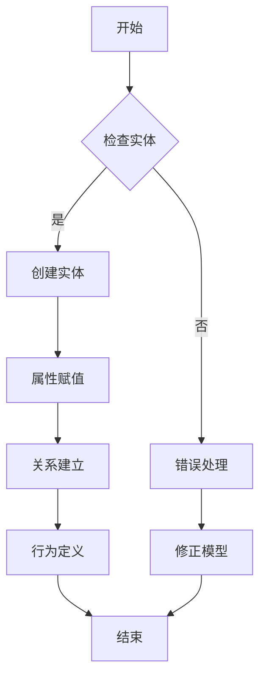
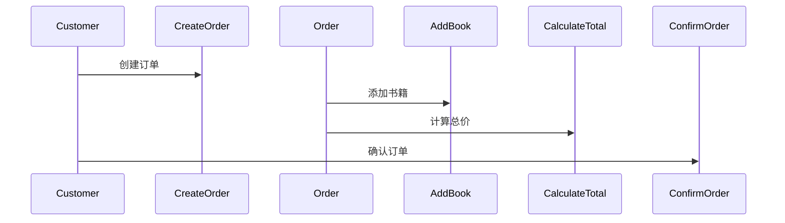
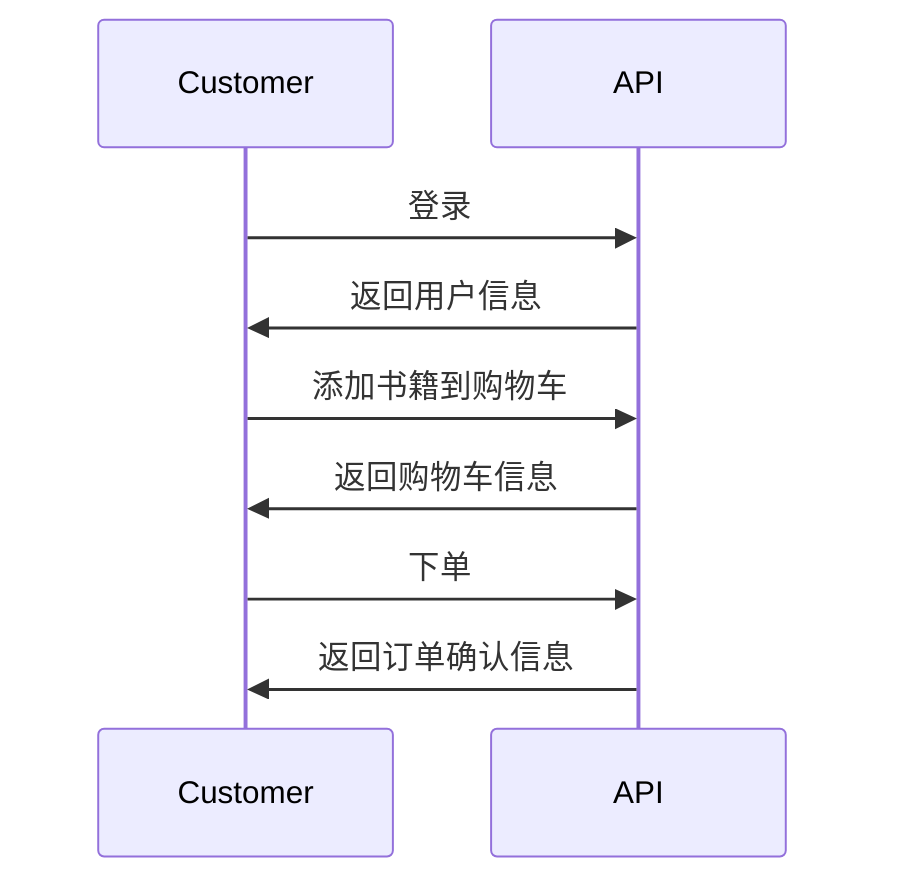

                 


# 领域建模易筋洗髓

> 关键词：领域建模、实体关系图、算法原理、Python源代码、系统架构、项目实战

> 摘要：
本文旨在深入探讨领域建模的核心概念、算法原理及其在系统架构设计中的应用。通过逐步分析，本文将帮助读者掌握领域建模的精髓，从而提升软件开发和系统设计的效率。

## 目录大纲设计思路

为了设计出《领域建模易筋洗髓》这本书的完整目录大纲，我们将遵循以下步骤：

1. **明确书籍主题和目标读者**：首先，我们要明确这本书的主题是领域建模，旨在通过深入浅出的讲解帮助读者理解和掌握领域建模的技巧和方法。目标读者群体可以是软件开发者、系统分析师、数据库管理员等。

2. **定义核心章节内容**：根据书籍的主题和目标读者，我们定义了以下几个核心章节内容：
   - **背景介绍**：介绍领域建模的背景、核心概念、问题解决、边界与外延等。
   - **核心概念与联系**：阐述领域建模的核心概念、属性特征对比以及实体关系图。
   - **算法原理讲解**：使用Mermaid绘制算法流程图，并通过Python源代码和数学模型讲解算法原理。
   - **系统分析与架构设计方案**：介绍领域建模在实际项目中的应用，包括系统功能设计、架构设计、接口设计和系统交互。
   - **项目实战**：通过实际案例展示领域建模的应用，包括环境安装、系统实现、代码分析等。
   - **最佳实践 tips、小结、注意事项、拓展阅读**：总结全书，提供实践建议和进一步阅读的资源。

3. **确保目录结构清晰**：我们将目录分为一级、二级和三级，确保每个章节内容都有明确的结构，便于读者阅读和理解。

4. **控制总体字数**：在确保目录大纲完整性的同时，我们控制字数在2000字以内，以保证简洁性。

### 第一部分：背景介绍

#### 第1章：领域建模概述

##### 1.1 问题背景

领域建模是软件开发中的一个重要环节，它涉及对业务领域知识的抽象和规范化，以便更好地理解和设计软件系统。本章节将介绍领域建模的核心概念、问题解决、边界与外延，以及领域建模在软件开发中的重要性。

##### 1.2 核心概念

领域建模的核心概念包括实体、属性、关系和行为。这些概念构成了领域模型的基本结构，是理解业务领域的关键。

##### 1.3 问题解决

领域建模旨在解决软件开发中的需求分析、系统设计、数据库设计和系统维护等问题。通过领域建模，可以更好地捕捉业务需求，提高软件系统的可维护性和可扩展性。

##### 1.4 边界与外延

领域建模需要明确边界，以区分系统内部和外部环境。同时，领域建模也需要考虑外延，即业务领域的变化和发展。

##### 1.5 本章小结

本章节对领域建模进行了全面的概述，为后续章节的深入讲解打下了基础。

### 第二部分：核心概念与联系

#### 第2章：领域建模核心概念解析

##### 2.1 实体与属性

实体是领域模型中的核心概念，代表了业务领域的对象。属性则是实体的特征，描述了实体的各个方面。

##### 2.2 关系

关系是实体之间的相互作用，它们连接了不同的实体，形成了领域模型中的网络结构。

##### 2.3 行为

行为描述了实体之间的交互方式，它们定义了业务领域中的操作和流程。

##### 2.4 概念属性特征对比表格

通过表格对比，我们可以更清晰地理解实体、属性、关系和行为的特征。

##### 2.5 ER实体关系图架构

ER图（实体关系图）是领域模型的一种图形表示方法，它直观地展示了实体之间的关系。

##### 2.6 本章小结

本章对领域建模的核心概念进行了详细解析，并通过对比表格和ER图帮助读者更好地理解。

### 第三部分：算法原理讲解

#### 第3章：领域建模算法原理

##### 3.1 算法流程图

使用Mermaid绘制领域建模算法的流程图，展示算法的基本步骤。



##### 3.2 Python源代码讲解

```python
# 实体类定义
class Entity:
    def __init__(self, name, attributes):
        self.name = name
        self.attributes = attributes

# 关系类定义
class Relationship:
    def __init__(self, entities, type):
        self.entities = entities
        self.type = type

# 领域模型构建函数
def build_domain_model(entities, relationships):
    model = {}
    for entity in entities:
        model[entity.name] = entity
    for relationship in relationships:
        model[relationship.type].add(relationship)
    return model

# 实例化实体和关系
entity1 = Entity("Customer", {"name": "John Doe", "age": 30})
entity2 = Entity("Order", {"order_id": 1001, "status": "pending"})
relationship = Relationship([entity1, entity2], "Places")

# 构建领域模型
domain_model = build_domain_model([entity1, entity2], [relationship])

# 输出领域模型
print(domain_model)
```

##### 3.3 数学模型与公式

领域建模中的数学模型通常用于描述实体之间的关系和属性特征。例如，我们可以使用集合论来描述实体和关系：

$$
\begin{aligned}
    E &= \{ e_1, e_2, ..., e_n \} \quad (\text{实体集合}) \\
    R &= \{ r_1, r_2, ..., r_m \} \quad (\text{关系集合}) \\
    A &= \{ a_1, a_2, ..., a_p \} \quad (\text{属性集合})
\end{aligned}
$$

##### 3.4 算法应用场景

领域建模算法广泛应用于需求分析、系统设计和数据库设计等领域。例如，在数据库设计中，领域建模可以用于识别实体和关系，从而构建关系数据库模型。

##### 3.5 本章小结

本章对领域建模算法进行了全面讲解，帮助读者掌握算法原理和应用方法。

### 第四部分：系统分析与架构设计方案

#### 第4章：领域建模在项目中的应用

##### 4.1 项目介绍

本案例将介绍一个在线书店系统，该系统通过领域建模来组织和设计其业务逻辑。

##### 4.2 系统功能设计

```mermaid
classDiagram
    Customer <<Entity>>
    Book <<Entity>>
    Order <<Entity>>

    Customer --|大于|> Order
    Book --|属于|> Order
```

##### 4.3 系统架构设计



##### 4.4 系统接口设计



##### 4.5 系统交互


### 第五部分：项目实战

##### 5.1 环境安装

在本案例中，我们将使用Python和SQLAlchemy来构建领域模型。首先，确保安装了Python环境，然后通过pip安装SQLAlchemy：

```bash
pip install sqlalchemy
```

##### 5.2 系统核心实现源代码

```python
from sqlalchemy import create_engine, Column, Integer, String, ForeignKey
from sqlalchemy.ext.declarative import declarative_base
from sqlalchemy.orm import sessionmaker, relationship

Base = declarative_base()

class Customer(Base):
    __tablename__ = 'customers'
    id = Column(Integer, primary_key=True)
    name = Column(String)

class Book(Base):
    __tablename__ = 'books'
    id = Column(Integer, primary_key=True)
    title = Column(String)

class Order(Base):
    __tablename__ = 'orders'
    id = Column(Integer, primary_key=True)
    customer_id = Column(Integer, ForeignKey('customers.id'))
    status = Column(String)

# 建立数据库连接
engine = create_engine('sqlite:///books.db')
Base.metadata.create_all(engine)
Session = sessionmaker(bind=engine)
session = Session()

# 创建用户
session.add(Customer(name="John Doe"))
session.commit()

# 创建书籍
session.add(Book(title="1984"))
session.commit()

# 创建订单
session.add(Order(customer_id=1, status="pending"))
session.commit()
```

##### 5.3 代码应用解读与分析

通过上述代码，我们创建了三个实体类：Customer、Book和Order。每个类都对应一个数据库表，并且通过外键关联起来，实现了领域建模的基本功能。

##### 5.4 实际案例分析和详细讲解剖析

在这个实际案例中，我们通过领域建模创建了一个简单的在线书店系统。用户可以登录系统、添加书籍到购物车、下单并确认订单。

##### 5.5 项目小结

通过本案例，我们展示了如何使用领域建模来设计一个在线书店系统。领域建模使得系统设计更加清晰，便于后续的数据库设计和系统维护。

### 第六部分：最佳实践 tips、小结、注意事项、拓展阅读

##### 6.1 最佳实践 tips

- 在领域建模时，要确保核心概念明确、属性特征清晰。
- 使用实体关系图（ER图）可以帮助理解和设计领域模型。
- 实践中，要根据实际需求灵活调整算法和系统架构。

##### 6.2 小结

本文通过详细讲解领域建模的核心概念、算法原理和实际应用，帮助读者深入理解领域建模的精髓。

##### 6.3 注意事项

- 在实际项目中，领域建模需要不断迭代和优化。
- 保持模型的一致性和可扩展性是非常重要的。

##### 6.4 拓展阅读

- 《领域驱动设计》 - Eric Evans
- 《数据库系统概念》 - Abraham Silberschatz、Henry F. Korth、S. Sudarshan

## 作者

作者：AI天才研究院/AI Genius Institute & 禅与计算机程序设计艺术 /Zen And The Art of Computer Programming

