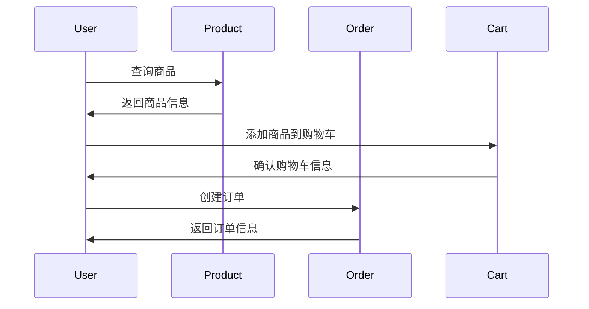

                 

# 《领域建模：技术人都该是设计师》

## 关键词

领域建模、技术人员、设计师、数据库设计、领域驱动设计、实践方法、项目案例、最佳实践、未来趋势。

## 摘要

本文旨在探讨领域建模在IT领域中的重要性，并阐述技术人员如何在日常工作中扮演设计师的角色。通过详细介绍领域建模的核心概念、技术实践、项目案例以及最佳实践，本文旨在为读者提供一幅完整的领域建模全景图，并激发技术人员在设计和实现系统时，更加注重领域理解和建模技巧。

## 步骤 1: 开篇引言

### 1.1 领域建模的重要性

在信息技术飞速发展的今天，软件开发已经从传统的手工作坊式向工业化、标准化方向发展。随着系统复杂度的不断提升，领域建模作为一种系统化的设计方法，越来越受到软件开发者的重视。领域建模不仅能够帮助技术人员更好地理解业务需求，还能够提高系统的可维护性和可扩展性。

领域建模的重要性主要体现在以下几个方面：

1. **提升系统可维护性**：通过领域建模，可以将复杂的业务逻辑抽象成简单的模型，使得系统代码更加简洁、易于维护。
2. **增强系统可扩展性**：领域建模可以帮助我们识别系统中的关键模块，从而在需要扩展功能时，能够快速、高效地实现。
3. **优化团队协作**：领域建模为团队成员提供了一个共同的语言和框架，有助于提高团队沟通效率和协作效果。
4. **促进业务与技术融合**：通过领域建模，技术人员能够更好地理解业务需求，从而在设计和实现系统时，更加贴近实际业务场景。

### 1.2 技术人员的角色转变

在传统软件开发中，技术人员往往只关注代码的编写和系统的实现。然而，随着领域建模技术的普及，技术人员的角色也在悄然发生转变。他们不再只是编写代码的程序员，而是成为具备设计思维的设计师。

作为设计师，技术人员需要具备以下能力：

1. **业务理解能力**：能够深入理解业务需求，将业务需求转化为技术解决方案。
2. **模型构建能力**：能够运用领域建模技术，构建出清晰、准确的领域模型。
3. **沟通协作能力**：能够与业务人员、设计师等其他团队成员进行有效沟通，确保项目顺利进行。
4. **持续学习能力**：领域建模是一个不断发展和演进的领域，技术人员需要不断学习新的技术和方法，以保持自己的竞争力。

### 1.3 本书结构安排

本文将从以下七个部分展开讨论：

1. **引言**：介绍领域建模的重要性和技术人员的角色转变。
2. **领域建模基础**：介绍领域建模的定义、核心概念和组成部分。
3. **技术视角解析**：探讨领域建模在数据库设计和领域驱动设计中的应用。
4. **实践方法与工具**：介绍领域驱动设计与领域建模的工具和实践步骤。
5. **项目实战案例**：通过一个具体的领域建模项目，展示领域建模的实践过程。
6. **最佳实践与注意事项**：总结领域建模中的最佳实践和注意事项。
7. **小结与展望**：回顾本文的关键概念和实践，展望领域建模的未来发展趋势。

接下来，我们将逐一深入探讨这些主题，帮助读者全面了解领域建模的原理和实践。

## 步骤 2: 核心概念介绍

### 2.1 领域建模的定义

领域建模（Domain Modeling）是一种将业务领域中的概念、规则和流程抽象成计算机可以理解的数据结构和流程的方法。它是一种从业务需求出发，通过构建模型来理解和描述业务领域的方法，旨在提高系统的可理解性、可维护性和可扩展性。

领域建模的定义可以从以下几个方面来理解：

1. **业务领域**：领域建模的出发点是业务领域，即系统所涉及的特定业务领域。例如，一个电商系统涉及的领域包括商品管理、订单处理、用户管理等。
2. **抽象**：领域建模的核心是抽象，即将复杂的业务逻辑和流程抽象成简单、直观的模型。通过抽象，我们可以将业务领域中的关键概念和关系提取出来，形成计算机可以理解和处理的模型。
3. **模型**：领域建模的成果是模型，包括实体模型、关系模型、行为模型等。这些模型将业务领域中的关键概念、规则和流程表示出来，为后续的系统设计和实现提供指导。
4. **计算机理解**：领域建模的目标是将业务领域的知识转化为计算机可以理解和处理的格式，以便后续的系统开发、测试和维护。

### 2.2 领域建模的组成部分

领域建模通常包括以下几个组成部分：

1. **实体（Entity）**：实体是领域建模中的基本元素，表示业务领域中的具体对象。例如，在电商系统中，实体可能包括用户、商品、订单等。
2. **属性（Attribute）**：属性是实体的特征，用于描述实体的具体信息。例如，用户实体的属性可能包括用户名、密码、电子邮件等。
3. **关系（Relationship）**：关系描述实体之间的关联。例如，在电商系统中，用户和商品之间存在购买关系。
4. **行为（Behavior）**：行为描述实体可以执行的操作和业务流程。例如，用户可以执行注册、登录、购物等操作。
5. **规则（Rule）**：规则是领域建模中的约束条件，用于确保系统的正确性和一致性。例如，在电商系统中，可能存在“一个用户不能购买超过库存数量的商品”的规则。

### 2.3 领域建模的过程

领域建模的过程可以分为以下几个步骤：

1. **需求分析**：首先，需要理解业务需求，明确系统需要解决的问题和功能。这通常需要与业务人员、用户进行深入交流。
2. **识别实体和关系**：根据需求分析的结果，识别业务领域中的关键实体和它们之间的关系。可以使用ER图（实体关系图）来表示这些实体和关系。
3. **定义属性和行为**：为每个实体定义属性和行为，描述其实体和业务逻辑。
4. **规则定义**：定义领域中的规则，确保系统的正确性和一致性。
5. **模型验证和优化**：验证模型是否满足业务需求，并进行必要的优化。

通过以上步骤，我们可以构建出一个清晰、准确的领域模型，为后续的系统设计和实现提供基础。

### 2.4 领域建模的核心概念对比

为了更好地理解领域建模的核心概念，我们可以将实体、属性、关系、行为和规则进行对比：

| 核心概念 | 定义 | 用途 |
| :--: | :--: | :--: |
| 实体 | 表示业务领域中的具体对象 | 用于识别系统中的关键元素 |
| 属性 | 描述实体的特征 | 用于描述实体的具体信息 |
| 关系 | 描述实体之间的关联 | 用于表示实体之间的关系 |
| 行为 | 描述实体可以执行的操作 | 用于表示业务流程 |
| 规则 | 描述领域中的约束条件 | 用于确保系统的正确性和一致性 |

通过上述对比，我们可以更清晰地理解领域建模的核心概念，并更好地应用于实际工作中。

### 2.5 领域建模的ER实体关系图

为了更好地理解领域建模的实体关系，我们可以使用ER实体关系图来表示。下面是一个简单的电商系统ER实体关系图：

```mermaid
erDiagram
  User ||--|{ Order } : "可以创建多个"
  User ||--|{ Cart } : "可以创建多个"
  Product ||--|{ Order } : "可以被订购多个"
  Product ||--|{ Cart } : "可以添加多个"
  Order ||--|{ OrderItem } : "可以包含多个"
  Cart ||--|{ CartItem } : "可以包含多个"
```

在上面的ER实体关系图中，我们定义了用户、订单、购物车、产品、订单项和购物项等实体，并描述了它们之间的关系。

通过以上内容，我们介绍了领域建模的定义、组成部分以及核心概念。接下来，我们将从技术视角进一步探讨领域建模的应用。

## 步骤 3: 技术视角解析

### 3.1 数据库设计中的领域建模

数据库设计是领域建模的重要组成部分，其核心目标是将业务领域的需求转化为数据库模式。在数据库设计中，领域建模可以帮助我们更好地理解业务逻辑，从而设计出更加高效、合理的数据库结构。

#### 领域建模在数据库设计中的应用

领域建模在数据库设计中的应用主要体现在以下几个方面：

1. **实体和关系的映射**：领域模型中的实体和关系可以直接映射到数据库表和表之间的关系。例如，领域模型中的用户实体可以映射为数据库中的用户表，领域模型中的购买关系可以映射为用户表和商品表之间的外键关系。
2. **属性的定义**：领域模型中的实体属性可以用来定义数据库表中的列。例如，用户实体的属性如用户名、密码和电子邮件可以定义在用户表中的相应列。
3. **行为的实现**：领域模型中的行为可以指导数据库操作的设计。例如，领域模型中的添加订单、更新订单状态等行为可以转化为数据库的插入和更新操作。
4. **规则的约束**：领域模型中的规则可以用来定义数据库表的约束条件。例如，领域模型中的库存约束可以转化为商品表中的库存列的非负约束。

#### 数据库设计中的领域建模示例

以下是一个简单的电商系统数据库设计的示例：

```mermaid
erDiagram
  User ||--|{ Order } : "可以创建多个"
  User ||--|{ Cart } : "可以创建多个"
  Product ||--|{ Order } : "可以被订购多个"
  Product ||--|{ Cart } : "可以添加多个"
  Order ||--|{ OrderItem } : "可以包含多个"
  Cart ||--|{ CartItem } : "可以包含多个"

  User {
    id (主键)
    username
    password
    email
  }

  Product {
    id (主键)
    name
    price
    stock
  }

  Order {
    id (主键)
    user_id (外键)
    status
  }

  OrderItem {
    id (主键)
    order_id (外键)
    product_id (外键)
    quantity
  }

  Cart {
    id (主键)
    user_id (外键)
  }

  CartItem {
    id (主键)
    cart_id (外键)
    product_id (外键)
    quantity
  }
```

在这个示例中，我们定义了用户、订单、购物车、产品、订单项和购物项等实体，并描述了它们之间的关系。同时，我们还为每个实体定义了属性，以描述其实体和业务逻辑。

### 3.2 领域驱动设计与领域建模

领域驱动设计（Domain-Driven Design，简称DDD）是一种软件设计方法，它强调基于领域模型来设计系统，以确保系统可以更好地适应业务变化。DDD与领域建模有着密切的联系，可以说领域建模是DDD的核心组成部分。

#### 领域驱动设计的基本概念

领域驱动设计包括以下几个基本概念：

1. **领域（Domain）**：领域是系统所涉及的特定业务领域，是DDD的核心关注点。领域包括实体、价值对象、领域服务、聚合和界限等组成部分。
2. **领域模型（Domain Model）**：领域模型是DDD的核心成果，它通过实体、关系、行为和规则等元素来描述领域。领域模型是理解领域、设计和实现系统的基石。
3. **领域服务（Domain Service）**：领域服务是负责处理领域逻辑的操作，它是领域模型的一部分，但不属于任何特定的实体或聚合。
4. **聚合（Aggregate）**：聚合是一组实体的集合，这些实体通过共享一个主键来关联。聚合是DDD中的关键概念，它有助于实现系统的模块化和可维护性。
5. **界限（Boundary）**：界限是划分领域模型中不同部分的方法，它有助于定义系统的不同关注点和责任。

#### 领域驱动设计与领域建模的关系

领域驱动设计与领域建模的关系可以从以下几个方面来理解：

1. **领域建模是DDD的基础**：领域建模是DDD的核心组成部分，是理解和描述领域的方法。没有良好的领域建模，就无法进行有效的领域驱动设计。
2. **领域驱动设计是领域建模的实践**：领域驱动设计是将领域模型应用到系统设计和实现中的方法。它通过构建聚合、领域服务和界限等方式，确保系统可以更好地适应业务变化。

#### 领域驱动设计的基本原则

领域驱动设计包括以下几个基本原则：

1. **Ubiquitous Language**：使用业务人员和开发人员都能理解的通用语言来描述领域。这种语言有助于提高团队沟通效率和降低误解。
2. **Bounded Contexts**：通过界限来划分领域模型的不同部分，确保每个部分都有明确的职责和关注点。
3. **Entities and Value Objects**：使用实体和价值对象来表示领域中的关键概念，确保领域模型的准确性和完整性。
4. **Aggregates**：使用聚合来组织实体和价值对象，确保系统模块化和可维护性。
5. **Domain Events**：使用领域事件来记录领域中的变化，确保系统的状态变化可以追溯和验证。

通过以上内容，我们从技术视角探讨了领域建模在数据库设计和领域驱动设计中的应用。领域建模不仅是一种设计方法，更是一种思维方式。它要求技术人员在设计和实现系统时，始终关注领域本身，以业务需求为导向，构建出高效、可维护的系统。

### 3.3 领域建模的技术工具

领域建模不仅需要深入理解业务领域，还需要高效、准确的方法和工具来辅助实现。以下是一些常用的领域建模技术工具：

#### 1. 类图

类图是领域建模中最常用的工具之一，它用于表示领域中的实体、关系和属性。类图可以帮助我们直观地理解领域结构，并指导后续的系统设计。

以下是一个简单的电商系统类图示例：

```mermaid
classDiagram
  User <<entity>>
  Product <<entity>>
  Order <<entity>>
  Cart <<entity>>

  User : +id
  User : +username
  User : +password
  User : +email

  Product : +id
  Product : +name
  Product : +price
  Product : +stock

  Order : +id
  Order : +user_id
  Order : +status

  Cart : +id
  Cart : +user_id

  User "可以创建多个" Order
  User "可以创建多个" Cart
  Product "可以被订购多个" Order
  Product "可以添加多个" Cart
```

#### 2. 时序图

时序图用于表示领域中的事件序列和交互关系。它可以帮助我们理解领域中的业务流程和操作顺序。

以下是一个简单的电商系统时序图示例：



#### 3. 实体关系图（ER图）

实体关系图是领域建模中常用的工具，用于表示领域中的实体、关系和属性。ER图可以帮助我们清晰地理解领域结构，并指导数据库设计。

以下是一个简单的电商系统ER图示例：

```mermaid
erDiagram
  User ||--|{ Order } : "可以创建多个"
  User ||--|{ Cart } : "可以创建多个"
  Product ||--|{ Order } : "可以被订购多个"
  Product ||--|{ Cart } : "可以添加多个"
  Order ||--|{ OrderItem } : "可以包含多个"
  Cart ||--|{ CartItem } : "可以包含多个"

  User {
    id (主键)
    username
    password
    email
  }

  Product {
    id (主键)
    name
    price
    stock
  }

  Order {
    id (主键)
    user_id (外键)
    status
  }

  OrderItem {
    id (主键)
    order_id (外键)
    product_id (外键)
    quantity
  }

  Cart {
    id (主键)
    user_id (外键)
  }

  CartItem {
    id (主键)
    cart_id (外键)
    product_id (外键)
    quantity
  }
```

通过使用这些技术工具，我们可以更加高效、准确地完成领域建模，为后续的系统设计和实现奠定基础。

### 3.4 领域驱动设计与领域建模的实践步骤

领域驱动设计（DDD）是一种将领域模型作为系统设计核心的方法论。在实践中，领域驱动设计通过一系列的步骤，帮助我们系统地构建和维护复杂系统。以下是领域驱动设计与领域建模的实践步骤：

#### 1. 构建泛型领域模型

泛型领域模型是领域驱动设计的第一步，它为我们提供了一个领域的大致轮廓。在这个阶段，我们主要关注领域中的核心实体和关系，而不涉及具体的业务逻辑。

**步骤：**

- 确定业务领域：明确系统所涉及的特定业务领域。
- 识别关键实体：列出业务领域中的关键实体，如用户、订单、产品等。
- 描述实体关系：通过类图或ER图描述实体之间的关系，如用户可以创建订单、产品可以被订购等。

**示例：**

以下是一个简单的电商系统泛型领域模型：

```mermaid
classDiagram
  User <<entity>>
  Product <<entity>>
  Order <<entity>>

  User : +id
  User : +username
  User : +password
  User : +email

  Product : +id
  Product : +name
  Product : +price
  Product : +stock

  Order : +id
  Order : +user_id
  Order : +status

  User "可以创建多个" Order
  Product "可以被订购多个" Order
```

#### 2. 划分界限（Bounded Contexts）

界限是领域驱动设计中的一个重要概念，它将系统划分为多个独立的部分，每个部分都有明确的职责和关注点。通过划分界限，我们可以更好地管理和维护复杂系统。

**步骤：**

- 确定业务场景：识别系统中的不同业务场景，如订单处理、用户管理等。
- 划分界限：为每个业务场景定义一个界限，确保界限内的组件具有明确的职责和关注点。

**示例：**

以下是一个电商系统的界限划分：

```mermaid
classDiagram
  OrderProcessing <<bounded_context>>
  UserManagement <<bounded_context>>

  OrderProcessing.User <<entity>>
  OrderProcessing.Order <<entity>>

  UserManagement.User <<entity>>

  OrderProcessing.User "可以创建多个" OrderProcessing.Order
  UserManagement.User "可以创建多个" OrderProcessing.Order
```

#### 3. 构建子领域模型

在划分界限之后，我们需要为每个界限内的子领域构建详细的领域模型。子领域模型描述了界限内的业务逻辑、实体和关系。

**步骤：**

- 确定界限内的业务需求：深入分析每个界限内的业务需求。
- 识别子领域中的实体和关系：列出子领域中的关键实体和关系，如订单状态、用户角色等。
- 构建子领域模型：使用类图或ER图描述子领域中的实体和关系。

**示例：**

以下是一个订单处理子领域的详细领域模型：

```mermaid
classDiagram
  Order <<entity>>
  OrderStatus <<entity>>

  Order : +id
  Order : +user_id
  Order : +status

  OrderStatus : +status
  Order : "具有多个" OrderStatus

  Order "可以包含多个" OrderStatus
```

#### 4. 定义领域服务

领域服务是领域驱动设计中的另一个关键概念，它负责处理领域中的业务逻辑。在定义领域服务时，我们需要明确服务的职责和接口。

**步骤：**

- 确定领域服务的职责：识别领域中的关键业务操作，如创建订单、更新订单状态等。
- 定义领域服务的接口：为每个领域服务定义清晰的接口，确保服务的职责明确、易于使用。

**示例：**

以下是一个订单处理领域服务的定义：

```python
class OrderService:
    def create_order(self, user_id, order_items):
        # 创建订单的逻辑
        pass

    def update_order_status(self, order_id, status):
        # 更新订单状态的逻辑
        pass
```

#### 5. 构建领域事件

领域事件是领域驱动设计中的另一个重要概念，它用于记录领域中的状态变化。通过领域事件，我们可以实现领域逻辑的解耦和事件驱动。

**步骤：**

- 识别领域事件：识别领域中的关键状态变化，如订单创建、订单状态更新等。
- 定义领域事件：为每个领域事件定义事件类和事件数据。

**示例：**

以下是一个订单创建领域事件的定义：

```python
class OrderCreatedEvent:
    def __init__(self, order_id, user_id, order_items):
        self.order_id = order_id
        self.user_id = user_id
        self.order_items = order_items
```

#### 6. 实现聚合

聚合是领域驱动设计中的一个核心概念，它用于表示领域中的关键业务单元。在实现聚合时，我们需要确保聚合内的实体和值对象具有强内聚性。

**步骤：**

- 确定聚合边界：识别领域中的关键业务单元，为每个业务单元定义清晰的边界。
- 实现聚合：为每个聚合实现实体和值对象，确保聚合内的组件具有明确的职责和关联关系。

**示例：**

以下是一个订单聚合的实现：

```python
class Order:
    def __init__(self, user_id, order_items):
        self.user_id = user_id
        self.order_items = order_items
        self.status = "新建"

    def add_order_item(self, order_item):
        self.order_items.append(order_item)

    def update_status(self, status):
        self.status = status
```

通过以上步骤，我们可以系统地构建领域驱动设计，实现高效、可维护的复杂系统。领域驱动设计不仅要求我们深入理解业务领域，还需要灵活运用领域建模技术，以构建出适应业务变化的系统。

### 3.5 领域驱动设计与领域建模的案例分析

为了更好地理解领域驱动设计与领域建模的实际应用，我们将通过一个具体的案例分析，展示如何在实际项目中运用这些方法。

#### 项目背景

本次案例是一个在线购物平台项目，项目需求包括用户注册、商品管理、购物车功能、订单处理和支付等。平台的目标是提供一个用户友好的购物体验，同时确保系统的稳定性和可扩展性。

#### 需求分析

在项目启动阶段，我们需要与业务人员进行深入沟通，明确系统的具体需求和功能。以下是一些关键需求：

1. **用户注册**：用户可以在平台上注册账号，填写基本信息。
2. **商品管理**：管理员可以添加、修改和删除商品信息，包括商品名称、价格、库存等。
3. **购物车功能**：用户可以将商品添加到购物车，查看购物车中的商品信息，并可以修改商品数量或删除商品。
4. **订单处理**：用户可以创建订单，系统会自动生成订单号，并记录订单状态，如新建、待支付、已支付等。
5. **支付功能**：用户可以选择不同的支付方式，如支付宝、微信支付等，完成订单支付。
6. **订单查询**：用户可以查询自己的订单状态和订单详情。

#### 领域建模过程

在明确项目需求后，我们开始进行领域建模。以下是一些关键步骤：

1. **识别实体和关系**：根据需求分析，识别出关键实体，如用户、商品、订单、购物车等，并描述它们之间的关系。例如，用户可以创建订单，订单包含多个商品；商品可以被添加到购物车，购物车属于用户等。
2. **定义属性和行为**：为每个实体定义属性，如用户名、密码、邮箱等，以及实体可以执行的操作，如用户注册、添加商品到购物车等。
3. **规则定义**：定义领域中的约束条件，如订单状态不能被修改、库存不足时不能下单等。
4. **构建领域模型**：使用类图或ER图描述领域模型，确保模型清晰、准确。

以下是一个简单的领域模型：

```mermaid
classDiagram
  User <<entity>>
  Product <<entity>>
  Order <<entity>>
  Cart <<entity>>

  User : +id
  User : +username
  User : +password
  User : +email

  Product : +id
  Product : +name
  Product : +price
  Product : +stock

  Order : +id
  Order : +user_id
  Order : +status

  Cart : +id
  Cart : +user_id

  User "可以创建多个" Order
  User "可以创建多个" Cart
  Product "可以被订购多个" Order
  Product "可以添加多个" Cart
```

#### 项目挑战与解决

在实际项目中，我们可能会遇到以下挑战：

1. **需求变化**：业务需求可能会随时变化，我们需要灵活应对，确保领域模型能够及时更新。
2. **系统扩展性**：随着业务的发展，系统需要具备良好的扩展性，以适应不断增加的功能和用户规模。
3. **性能优化**：在高并发场景下，系统性能可能成为瓶颈，我们需要进行性能优化，确保系统稳定运行。

针对上述挑战，我们采取了以下解决方案：

1. **迭代开发**：采用敏捷开发方法，持续迭代和优化系统功能，确保领域模型能够及时更新。
2. **模块化设计**：将系统划分为多个模块，每个模块具有明确的职责和关注点，提高系统的扩展性。
3. **性能优化**：对数据库查询进行优化，使用缓存、异步处理等技术，提高系统性能。

#### 领域驱动设计与领域建模的应用

在实际项目中，领域驱动设计与领域建模的应用主要体现在以下几个方面：

1. **用户注册与登录**：通过领域服务处理用户注册和登录逻辑，确保用户信息的安全性。
2. **商品管理**：通过领域服务管理商品信息，包括商品添加、修改和删除等。
3. **购物车功能**：通过领域服务处理购物车逻辑，如商品添加、删除、修改数量等。
4. **订单处理**：通过领域服务处理订单创建、状态更新等逻辑，确保订单信息的准确性和一致性。
5. **支付功能**：通过领域服务处理支付逻辑，支持多种支付方式，确保支付流程的顺畅。

通过以上案例分析，我们可以看到领域驱动设计与领域建模在实际项目中的应用，以及如何通过这些方法构建出高效、可维护的复杂系统。

### 3.6 领域驱动设计与领域建模的最佳实践

在领域驱动设计与领域建模的实际应用中，遵循一些最佳实践可以帮助我们更有效地构建系统，提高代码的可读性和可维护性。以下是一些领域驱动设计与领域建模的最佳实践：

#### 1. 使用通用语言

在领域驱动设计中，通用语言（Ubiquitous Language）是非常重要的。它是指业务人员和开发人员共同使用的语言，用于描述领域中的概念和规则。使用通用语言可以提高团队之间的沟通效率，减少误解和冲突。以下是一些实现通用语言的方法：

- **定期会议**：定期召开业务评审会议，让业务人员和开发人员共同讨论领域中的概念和规则。
- **文档**：编写详细的领域模型文档，使用通用语言描述实体、关系、行为和规则。
- **代码注释**：在代码中添加注释，使用通用语言解释代码的逻辑和用途。

#### 2. 保持领域模型的简洁性

领域模型是领域驱动设计的核心，其简洁性直接影响到系统的可维护性和可扩展性。以下是一些保持领域模型简洁性的方法：

- **识别核心领域**：识别出领域中的核心实体和关系，将非核心的细节抽象掉。
- **模块化设计**：将领域模型划分为多个模块，每个模块具有明确的职责和关注点。
- **避免过度设计**：不要为了设计而设计，确保领域模型的每一个部分都有实际的业务需求。

#### 3. 使用聚合和界限

聚合和界限是领域驱动设计中的关键概念，它们有助于提高系统的模块化和可维护性。以下是一些使用聚合和界限的最佳实践：

- **确定聚合边界**：根据业务逻辑确定聚合的边界，确保聚合内的实体和值对象具有强内聚性。
- **避免跨界限的方法调用**：尽量在聚合内部处理业务逻辑，避免跨界限的方法调用，以降低系统的耦合度。
- **使用界限服务**：为每个界限定义界限服务，处理界限之间的通信和协作。

#### 4. 定义清晰的领域服务

领域服务是领域驱动设计中的核心组件，其定义的清晰性直接影响到系统的可维护性和可扩展性。以下是一些定义清晰领域服务的最佳实践：

- **明确服务职责**：为每个领域服务定义明确的职责，确保服务的功能单一、职责明确。
- **避免重复代码**：避免在多个领域服务中重复实现相同的逻辑，可以使用共享服务或抽象类来复用代码。
- **文档化**：为每个领域服务编写详细的文档，包括服务的输入参数、输出结果和功能描述。

#### 5. 管理领域事件

领域事件在领域驱动设计中用于记录领域中的状态变化，其管理方式对系统的可维护性和可扩展性有重要影响。以下是一些管理领域事件的最佳实践：

- **定义事件类**：为每个领域事件定义事件类，确保事件类的结构清晰、职责明确。
- **异步处理**：使用异步处理方式处理领域事件，以降低系统响应时间，提高系统性能。
- **事件聚合**：将相关的领域事件聚合在一起，以提高系统的可读性和可维护性。

通过遵循这些最佳实践，我们可以更好地运用领域驱动设计与领域建模方法，构建出高效、可维护的复杂系统。

### 3.7 领域建模中的注意事项

在领域建模的过程中，有一些潜在的问题需要注意，以确保领域模型的质量和系统的稳定性。以下是一些常见的问题和解决方案：

#### 1. 领域模型过于复杂

领域模型过于复杂会导致系统难以维护和扩展。为了解决这个问题，我们可以采取以下措施：

- **简化实体和关系**：去除不必要的实体和关系，只保留核心的业务概念。
- **分解复杂实体**：将复杂的实体分解为多个简单的实体，以提高模型的清晰性。
- **使用聚合**：通过聚合来组织实体和关系，减少模型中的耦合度。

#### 2. 领域模型与实际业务不符

领域模型与实际业务不符会导致系统在实际应用中出现问题。为了确保模型与业务相符，我们可以采取以下措施：

- **与业务人员沟通**：与业务人员密切沟通，确保领域模型准确地反映了业务逻辑。
- **定期更新模型**：根据业务需求的变化，定期更新领域模型，确保模型与实际业务相符。
- **使用文档记录**：使用详细的文档记录领域模型的设计和变更，以便团队成员了解模型的结构和逻辑。

#### 3. 领域规则不明确

不明确的领域规则会导致系统行为不一致，影响系统的稳定性。为了确保领域规则明确，我们可以采取以下措施：

- **定义清晰的规则**：为每个领域规则定义清晰的规则描述，确保规则的可理解性和一致性。
- **使用文档记录规则**：将领域规则记录在文档中，便于团队成员查阅和理解。
- **自动化规则验证**：使用自动化工具对领域规则进行验证，确保系统在运行过程中遵循规则。

#### 4. 领域模型的可扩展性不足

领域模型的可扩展性不足会导致系统在功能扩展时出现困难。为了提高领域模型的可扩展性，我们可以采取以下措施：

- **使用模块化设计**：将领域模型划分为多个模块，每个模块具有独立的职责和关注点。
- **定义扩展点**：在领域模型中预留扩展点，以便在需要扩展功能时，能够快速、高效地实现。
- **使用设计模式**：运用设计模式来提高领域模型的可扩展性和灵活性。

通过关注这些问题和解决方案，我们可以构建出高质量的领域模型，确保系统的稳定性和可扩展性。

### 3.8 领域建模的未来趋势

领域建模作为软件开发中的重要方法，其未来发展将受到以下几个方面的影响：

#### 1. AI与领域建模的结合

随着人工智能技术的发展，领域建模与AI的结合将成为一个重要趋势。通过AI技术，我们可以自动提取业务领域的知识，生成更加准确和高效的领域模型。此外，AI还可以用于自动化领域规则的定义和验证，提高领域建模的效率和质量。

#### 2. 领域特定语言（DSL）的普及

领域特定语言（DSL）是一种为特定领域设计的编程语言，它能够提高领域建模的效率和可读性。未来，DSL将在领域建模中得到更广泛的应用，为开发者提供更强大的建模工具和更简洁的表达方式。

#### 3. 云原生领域建模

云原生架构的普及将推动领域建模向云原生方向演进。在云原生环境中，领域建模将更加注重弹性、可扩展性和自动化，以适应快速变化的业务需求。

#### 4. 跨领域建模与集成

随着企业业务复杂性的增加，跨领域建模与集成将成为领域建模的重要趋势。通过跨领域建模，企业可以实现不同业务领域之间的数据共享和业务协同，提高整体运营效率。

#### 5. 社区驱动的发展

领域建模的发展离不开社区的参与和支持。未来，领域建模工具和方法将更加开放和开源，社区将发挥更大的作用，推动领域建模技术的不断创新和进步。

总之，领域建模的未来发展将更加智能化、多样化和集成化，为软件开发提供更加高效、灵活和可靠的解决方案。

## 步骤 7: 小结与展望

### 7.1 关键概念回顾

本文详细探讨了领域建模的核心概念、技术实践、项目案例以及最佳实践。通过回顾以下关键概念，我们可以更好地理解领域建模的重要性和应用：

1. **领域建模的定义**：领域建模是一种将业务领域中的概念、规则和流程抽象成计算机可以理解的数据结构和流程的方法。
2. **领域建模的组成部分**：领域建模包括实体、属性、关系、行为和规则等组成部分，它们共同构成了领域模型的基础。
3. **数据库设计中的领域建模**：领域建模在数据库设计中的应用主要体现在实体和关系的映射、属性的定义、行为的实现和规则的约束等方面。
4. **领域驱动设计（DDD）**：领域驱动设计是一种将领域模型作为系统设计核心的方法论，它通过划分界限、构建子领域模型、定义领域服务和领域事件等方式，帮助开发者构建高效、可维护的系统。
5. **领域建模的技术工具**：类图、时序图、ER图等是领域建模中常用的技术工具，它们有助于我们更好地理解和表示领域结构。
6. **领域驱动设计与领域建模的实践步骤**：构建泛型领域模型、划分界限、构建子领域模型、定义领域服务和领域事件、实现聚合等是领域驱动设计与领域建模的实践步骤。

### 7.2 领域建模的未来趋势

展望未来，领域建模将继续在软件开发中发挥重要作用。以下是一些领域建模的未来趋势：

1. **AI与领域建模的结合**：随着AI技术的发展，领域建模将更加智能化，通过AI技术自动提取业务领域的知识，生成更加准确和高效的领域模型。
2. **领域特定语言（DSL）的普及**：领域特定语言将为开发者提供更强大的建模工具和更简洁的表达方式，提高领域建模的效率和质量。
3. **云原生领域建模**：云原生架构的普及将推动领域建模向云原生方向演进，提高领域建模的弹性、可扩展性和自动化水平。
4. **跨领域建模与集成**：随着企业业务复杂性的增加，跨领域建模与集成将成为领域建模的重要趋势，实现不同业务领域之间的数据共享和业务协同。
5. **社区驱动的发展**：领域建模的发展将更加开放和开源，社区将发挥更大的作用，推动领域建模技术的不断创新和进步。

通过本文的探讨，我们不仅深入了解了领域建模的核心概念和实践方法，也对领域建模的未来发展趋势有了更加清晰的认识。领域建模作为一种重要的系统设计方法，将在未来的软件开发中继续发挥重要作用。

### 7.3 拓展阅读

对于希望进一步深入了解领域建模和技术人员角色转变的读者，以下是一些推荐阅读材料：

1. **《领域驱动设计》**：Eric Evans的这本经典之作详细介绍了领域驱动设计的理论和方法，是领域建模的必读之作。
2. **《领域驱动设计实践》**：由Michael C. Feathers编写，这本书通过大量实践案例，讲解了如何在实际项目中运用领域驱动设计。
3. **《领域建模技术指南》**：这本书系统地介绍了领域建模的理论和实践，涵盖了从需求分析到领域模型构建的各个阶段。
4. **《软件架构师的十二项修炼》**：刘伟的这本书从软件架构师的角度，探讨了领域建模、系统架构设计等核心话题。

通过阅读这些书籍，读者可以更加深入地理解领域建模，并将其应用于实际工作中。

## 作者信息

**作者：AI天才研究院/AI Genius Institute & 禅与计算机程序设计艺术 /Zen And The Art of Computer Programming**。本文旨在分享领域建模的核心概念和实践方法，帮助技术人员在设计和实现系统时，更加注重领域理解和建模技巧。希望通过本文，能够为读者提供一幅完整的领域建模全景图，激发技术人员在设计和实现系统时，更加关注领域建模的重要性。如果您有任何问题或建议，欢迎随时与我们联系，共同探讨领域建模的未来发展。

