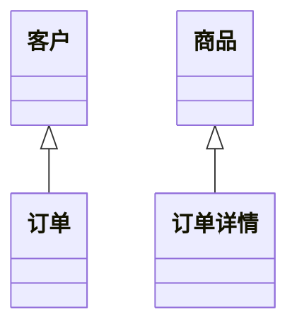

                 

### 领域建模：技术人都该是设计师

> 关键词：领域建模、技术人、设计师、方法、实践、案例

> 摘要：本文旨在探讨领域建模在信息技术领域的重要性，并阐述技术人如何通过领域建模提升自己的设计能力。通过详细介绍领域建模的基本概念、技术人视角的领域建模需求、设计师的能力与角色，以及领域建模的方法与工具，本文将帮助读者理解领域建模的原理和实践，从而在技术工作中更好地应用领域建模方法，提升自身设计水平。

## 目录大纲

### 第一部分：领域建模概述

- **1.1 问题背景**
  - **1.1.1 领域建模的重要性**
  - **1.1.2 领域建模的现状**
  - **1.1.3 领域建模的意义**

- **1.2 基本概念**
  - **1.2.1 领域**
  - **1.2.2 实体**
  - **1.2.3 关系**
  - **1.2.4 领域建模**

### 第二部分：技术人视角的领域建模

- **2.1 技术人的需求**
  - **2.1.1 技术人在工作中的挑战**
  - **2.1.2 领域建模的作用**
  - **2.1.3 技术人如何开展领域建模**

- **2.2 领域建模的基础知识**
  - **2.2.1 领域**
  - **2.2.2 实体**
  - **2.2.3 关系**
  - **2.2.4 领域建模方法**

- **2.3 领域建模流程**
  - **2.3.1 领域建模的步骤**
  - **2.3.2 领域建模的方法**
  - **2.3.3 领域建模的工具**

### 第三部分：设计师的能力与角色

- **3.1 设计师在领域建模中的角色**
  - **3.1.1 设计师在领域建模中的作用**
  - **3.1.2 设计师的技能要求**
  - **3.1.3 设计师的工作流程**

### 第四部分：领域建模方法与工具

- **4.1 常见的领域建模方法**
  - **4.1.1 实体关系图（ER图）**
  - **4.1.2 统一建模语言（UML）**

- **4.2 常用的领域建模工具**
  - **4.2.1 Visio**
  - **4.2.2 Enterprise Architect**

- **4.3 领域建模的最佳实践**
  - **4.3.1 实践案例**

### 第五部分：领域建模实践

- **5.1 实践一：实体关系图（ER图）设计**
- **5.2 实践二：统一建模语言（UML）应用**
- **5.3 实践三：领域特定语言（DSL）的引入**

### 第六部分：领域建模案例分析

- **6.1 案例一：电商平台的领域建模**
- **6.2 案例二：金融系统的领域建模**
- **6.3 案例三：物联网的领域建模**

### 第七部分：领域建模的未来发展趋势

- **7.1 人工智能与领域建模的结合**
- **7.2 领域特定语言的发展**
- **7.3 领域建模的未来挑战**

### 总结与拓展

- **7.1 小结**
- **7.2 注意事项**
- **7.3 拓展阅读**

---

### 第一部分：领域建模概述

#### 1.1 问题背景

在现代信息技术快速发展的背景下，软件系统变得越来越复杂，项目开发周期也越来越长。为了应对这一挑战，领域建模（Domain Modeling）作为一种有效的软件开发方法，逐渐受到了重视。领域建模旨在通过对特定领域的抽象，构建出系统的领域模型，从而帮助开发者更好地理解业务需求，提高软件系统的可维护性和扩展性。

##### 1.1.1 领域建模的重要性

领域建模在软件开发中具有以下几个重要意义：

1. **提高理解能力**：通过领域建模，开发者可以更加清晰地理解业务需求，减少误解和歧义。
2. **增强可维护性**：领域模型提供了一个统一的视图，使得系统架构更加清晰，易于后续维护和扩展。
3. **促进沟通**：领域模型作为一种通用的抽象表示，有助于不同团队成员之间的有效沟通。
4. **提高开发效率**：领域建模可以帮助团队提前识别潜在问题，减少开发过程中的返工。

##### 1.1.2 领域建模的现状

目前，领域建模已经广泛应用于多个领域，如金融、电商、物联网等。随着建模工具和方法的发展，领域建模在软件开发中的地位日益重要。例如，实体关系图（ER图）和统一建模语言（UML）等工具已经成为领域建模的标准方法。

##### 1.1.3 领域建模的意义

领域建模不仅对软件开发有重要影响，也对技术人的职业发展具有重要意义：

1. **提升设计能力**：通过领域建模，技术人可以学习如何更好地设计系统架构，提升自己的设计能力。
2. **增强业务理解**：领域建模有助于技术人深入了解业务需求，从而在开发过程中提供更有价值的解决方案。
3. **拓宽职业道路**：掌握领域建模技术的人，在求职过程中将更具竞争力，可以从事更多高级职位。

#### 1.2 基本概念

在进入领域建模的具体内容之前，我们需要先了解一些基本概念。

##### 1.2.1 领域

领域（Domain）是指一组具有共同特征的事物组成的集合。在软件工程中，领域通常是指与特定业务或行业相关的部分。

##### 1.2.2 实体

实体（Entity）是领域中具有独立存在意义的基本单位。例如，在电商领域中，客户、商品、订单等都是实体。

##### 1.2.3 关系

关系（Relationship）描述了实体之间的相互关联。例如，在电商领域中，客户可以下单购买商品，这构成了客户与商品之间的购买关系。

##### 1.2.4 领域建模

领域建模（Domain Modeling）是指通过抽象和表示，构建出特定领域的模型。领域模型通常包括实体、关系、属性和操作等要素。

#### 1.3 领域建模的重要性

领域建模在软件开发中具有重要作用，主要体现在以下几个方面：

1. **明确系统边界**：领域建模可以帮助开发者明确系统的边界，从而更好地理解系统功能和性能要求。
2. **优化系统设计**：通过领域建模，开发者可以提前识别系统中的关键组件和潜在问题，从而优化系统设计。
3. **提升开发效率**：领域建模可以减少开发过程中的误解和重复工作，从而提高开发效率。
4. **增强系统可维护性**：领域模型提供了一个清晰的系统架构视图，有助于后续系统的维护和扩展。

### 第二部分：技术人视角的领域建模

在了解了领域建模的基本概念和重要性之后，我们需要从技术人的视角来探讨领域建模的需求和实际应用。

#### 2.1 技术人的需求

作为软件开发者，技术人在工作中面临着多种挑战，这些挑战正是领域建模发挥作用的地方。

##### 2.1.1 技术人在工作中的挑战

1. **复杂系统架构**：随着软件系统的复杂性增加，开发者需要花费更多的时间和精力来理解系统架构。
2. **业务需求变化**：业务需求的变化可能导致系统的重构，给开发者带来额外的负担。
3. **沟通障碍**：开发者与业务人员之间的沟通不畅，可能导致开发出的系统与实际需求不符。
4. **系统维护困难**：随着系统规模的扩大，维护和扩展系统的难度也随之增加。

##### 2.1.2 领域建模的作用

领域建模可以帮助技术人应对上述挑战，具体体现在以下几个方面：

1. **清晰系统架构**：通过领域建模，开发者可以更加清晰地理解系统架构，从而更好地设计系统。
2. **提前识别问题**：领域建模可以帮助开发者提前识别系统中的潜在问题，从而在开发过程中进行优化。
3. **提高沟通效率**：领域模型作为一种通用的抽象表示，有助于开发者与业务人员之间的有效沟通。
4. **简化系统维护**：领域模型提供了一个清晰的系统架构视图，有助于后续系统的维护和扩展。

##### 2.1.3 技术人如何开展领域建模

为了有效地进行领域建模，技术人需要掌握以下几个关键步骤：

1. **理解业务需求**：通过需求调研和业务讨论，深入了解业务需求，明确系统的目标和功能。
2. **构建领域模型**：使用实体关系图（ER图）或统一建模语言（UML）等工具，构建出系统的领域模型。
3. **验证和迭代**：对领域模型进行验证和迭代，确保模型与实际需求相符，并不断完善模型。

#### 2.2 领域建模的基础知识

在进行领域建模时，技术人需要掌握一些基础知识，包括领域、实体、关系和属性等。

##### 2.2.1 领域

领域是指一组具有共同特征的事物组成的集合。在软件工程中，领域通常是指与特定业务或行业相关的部分。例如，在电商领域，客户、商品、订单等都是实体。

##### 2.2.2 实体

实体是领域中具有独立存在意义的基本单位。实体通常具有一些属性和操作。例如，在电商领域，客户实体可以具有姓名、地址、电话等属性，同时可以进行下单、查询订单等操作。

##### 2.2.3 关系

关系描述了实体之间的相互关联。关系可以是单对单、一对多或多对多。例如，在电商领域，客户与订单之间是一对多的关系，即一个客户可以有多个订单。

##### 2.2.4 领域建模方法

领域建模方法包括实体关系图（ER图）和统一建模语言（UML）等。实体关系图（ER图）主要用于表示实体和关系，而统一建模语言（UML）则提供了更丰富的建模工具和方法。

#### 2.3 领域建模流程

领域建模是一个系统性过程，需要遵循一定的步骤和方法。以下是领域建模的一般流程：

1. **需求调研**：通过需求调研和业务讨论，深入了解业务需求，明确系统的目标和功能。
2. **构建领域模型**：使用实体关系图（ER图）或统一建模语言（UML）等工具，构建出系统的领域模型。
3. **验证和迭代**：对领域模型进行验证和迭代，确保模型与实际需求相符，并不断完善模型。
4. **文档化**：将领域模型文档化，以便后续的开发和维护。

### 第三部分：设计师的能力与角色

在领域建模过程中，设计师的角色至关重要。设计师不仅需要具备扎实的领域知识，还需要具备一定的设计能力和方法论。

#### 3.1 设计师在领域建模中的角色

设计师在领域建模中扮演着多重角色，主要包括以下几个方面：

1. **领域专家**：设计师需要对特定领域有深入的了解，能够准确地理解业务需求，并将其转化为具体的领域模型。
2. **沟通桥梁**：设计师是连接开发者与业务人员之间的桥梁，需要确保双方对系统设计有共同的理解。
3. **模型构建者**：设计师需要使用实体关系图（ER图）或统一建模语言（UML）等工具，构建出系统的领域模型。
4. **质量保证**：设计师需要对领域模型进行验证和迭代，确保模型的质量和准确性。

#### 3.2 设计师的技能要求

设计师在领域建模中需要具备以下技能：

1. **领域知识**：设计师需要对特定领域有深入的了解，能够准确地理解业务需求。
2. **建模工具**：设计师需要熟练掌握实体关系图（ER图）或统一建模语言（UML）等建模工具。
3. **沟通能力**：设计师需要具备良好的沟通能力，能够有效地与开发者、业务人员等进行沟通。
4. **问题解决能力**：设计师需要具备较强的解决问题的能力，能够应对领域建模过程中遇到的各种挑战。

#### 3.3 设计师的工作流程

设计师的工作流程通常包括以下几个步骤：

1. **需求调研**：与业务人员进行需求调研，了解业务需求，明确系统的目标和功能。
2. **构建领域模型**：使用实体关系图（ER图）或统一建模语言（UML）等工具，构建出系统的领域模型。
3. **验证和迭代**：对领域模型进行验证和迭代，确保模型与实际需求相符，并不断完善模型。
4. **文档化**：将领域模型文档化，以便后续的开发和维护。

### 第四部分：领域建模方法与工具

领域建模方法与工具是领域建模过程中不可或缺的部分。本部分将介绍常见的领域建模方法与工具，包括实体关系图（ER图）和统一建模语言（UML）等。

#### 4.1 常见的领域建模方法

常见的领域建模方法包括实体关系图（ER图）和统一建模语言（UML）等。

##### 4.1.1 实体关系图（ER图）

实体关系图（ER图）是一种用于表示实体和关系的图形化工具。它包括以下几个基本元素：

1. **实体**：实体是领域中具有独立存在意义的基本单位。
2. **属性**：属性是实体的特征，用于描述实体的具体信息。
3. **关系**：关系描述了实体之间的相互关联。

实体关系图（ER图）的构建过程如下：

1. **确定实体**：根据业务需求，确定需要表示的实体。
2. **定义属性**：为每个实体定义相应的属性。
3. **建立关系**：确定实体之间的关系，并指定关系的类型（如一对一、一对多、多对多）。

##### 4.1.2 统一建模语言（UML）

统一建模语言（UML）是一种面向对象的建模语言，用于表示软件系统的结构和行为。UML包括多种不同的图，如用例图、类图、序列图等。

1. **用例图**：用例图用于表示系统的功能需求，展示系统与外部用户或其他系统之间的交互。
2. **类图**：类图用于表示系统的类和它们之间的关系，是UML中最常用的图之一。
3. **序列图**：序列图用于表示系统组件之间的交互顺序，展示系统在特定场景下的行为。

#### 4.2 常用的领域建模工具

在进行领域建模时，常用的工具包括Visio、Enterprise Architect等。

##### 4.2.1 Visio

Visio是Microsoft公司开发的一款图形化工具，用于创建和编辑图表、流程图、组织结构图等。Visio提供了丰富的图形库和模板，可以帮助用户快速创建领域模型。

##### 4.2.2 Enterprise Architect

Enterprise Architect是Sparx Systems公司开发的一款专业的建模工具，用于创建和编辑复杂的领域模型。Enterprise Architect支持多种建模语言和方法，包括UML、BPEL、Business Process Modeling Notation（BPMN）等。

#### 4.3 领域建模的最佳实践

在进行领域建模时，可以参考以下最佳实践：

1. **尽早开始建模**：领域建模应该尽早开始，最好在项目启动阶段就进行。
2. **迭代和改进**：领域模型不是一成不变的，应该根据项目进展和需求变化进行迭代和改进。
3. **与团队成员协作**：领域建模需要团队成员的协作，以确保模型能够准确地反映业务需求。
4. **文档化**：将领域模型文档化，以便后续的开发和维护。

### 第五部分：领域建模实践

在了解了领域建模的方法与工具之后，我们可以通过一些实际案例来进一步理解领域建模的实践过程。

#### 5.1 实践一：实体关系图（ER图）设计

实体关系图（ER图）是领域建模的一种基本方法，通过ER图可以直观地表示实体和关系。以下是一个简单的电商平台的ER图设计案例：

1. **确定实体**：在电商平台上，常见的实体包括客户、商品、订单等。
2. **定义属性**：为每个实体定义相应的属性，例如客户实体可以包括姓名、地址、电话等属性。
3. **建立关系**：确定实体之间的关系，例如客户与订单之间是一对多的关系，即一个客户可以有多个订单。

以下是一个简单的ER图示例：

```mermaid
erDiagram
  客户 ||--|{ 订单 }|
  商品 ||--|{ 订单详情 }|
```

#### 5.2 实践二：统一建模语言（UML）应用

统一建模语言（UML）是一种强大的领域建模工具，可以用于表示系统的结构和行为。以下是一个简单的电商平台的UML类图设计案例：

1. **确定类**：在电商平台上，常见的类包括客户、商品、订单、订单详情等。
2. **定义属性和方法**：为每个类定义相应的属性和方法，例如客户类可以包括姓名、地址、电话等属性，以及添加订单、查询订单等方法。
3. **建立关系**：确定类之间的关系，例如客户类与订单类之间是一对多的关系，即一个客户可以有多个订单。

以下是一个简单的UML类图示例：



#### 5.3 实践三：领域特定语言（DSL）的引入

领域特定语言（DSL）是一种专门用于特定领域的编程语言，可以用于简化领域建模过程。以下是一个简单的电商平台的DSL设计案例：

1. **定义语言结构**：定义DSL的基本结构，例如定义关键字、语法规则等。
2. **实现语言解析器**：实现DSL的解析器，用于将DSL代码转换为领域模型。
3. **编写DSL代码**：使用DSL编写领域模型，例如使用DSL定义客户、商品、订单等实体和关系。

以下是一个简单的DSL代码示例：

```python
# 定义实体
class 客户:
  姓名
  地址
  电话

class 商品:
  商品名
  价格
  库存

class 订单:
  客户
  订单详情

# 定义关系
客户 -- 订单
商品 -- 订单详情
```

通过DSL，开发者可以更方便地定义领域模型，从而提高建模效率和准确性。

### 第六部分：领域建模案例分析

在实际项目中，领域建模的应用可以帮助开发者更好地理解和设计复杂的系统。以下是一些典型的领域建模案例分析。

#### 6.1 案例一：电商平台的领域建模

电商平台是一个复杂的系统，涉及多个实体和关系。通过领域建模，可以清晰地表示系统中的各个组成部分。

1. **实体**：在电商平台上，常见的实体包括客户、商品、订单、订单详情等。
2. **关系**：客户与订单之间是一对多的关系，商品与订单详情之间是多对多的关系。
3. **领域模型**：使用实体关系图（ER图）或统一建模语言（UML）等工具，构建出电商平台的领域模型。

以下是一个简单的电商平台领域模型示例：

```mermaid
erDiagram
  客户 ||--|{ 订单 }|
  商品 ||--|{ 订单详情 }|
```

#### 6.2 案例二：金融系统的领域建模

金融系统是一个高度敏感和复杂的系统，领域建模在金融系统中的应用尤为重要。

1. **实体**：在金融系统中，常见的实体包括账户、交易、订单等。
2. **关系**：账户与交易之间是一对多的关系，交易与订单之间也是一对多的关系。
3. **领域模型**：使用实体关系图（ER图）或统一建模语言（UML）等工具，构建出金融系统的领域模型。

以下是一个简单的金融系统领域模型示例：

```mermaid
erDiagram
  账户 ||--|{ 交易 }|
  交易 ||--|{ 订单 }|
```

#### 6.3 案例三：物联网的领域建模

物联网（IoT）系统涉及多个设备和传感器，领域建模可以帮助开发者更好地理解和设计物联网系统。

1. **实体**：在物联网系统中，常见的实体包括设备、传感器、数据等。
2. **关系**：设备与传感器之间是一对多的关系，传感器与数据之间也是一对多的关系。
3. **领域模型**：使用实体关系图（ER图）或统一建模语言（UML）等工具，构建出物联网系统的领域模型。

以下是一个简单的物联网系统领域模型示例：

```mermaid
erDiagram
  设备 ||--|{ 传感器 }|
  传感器 ||--|{ 数据 }|
```

### 第七部分：领域建模的未来发展趋势

随着信息技术的发展，领域建模也在不断演进。以下是领域建模的未来发展趋势：

#### 7.1 人工智能与领域建模的结合

人工智能（AI）技术的发展为领域建模带来了新的机遇。通过将人工智能技术应用于领域建模，可以自动化部分建模过程，提高建模的效率和准确性。

1. **自动化建模**：利用机器学习算法，自动化识别实体和关系，构建领域模型。
2. **智能验证**：利用自然语言处理技术，对领域模型进行智能验证，确保模型的准确性。
3. **智能优化**：利用优化算法，对领域模型进行优化，提高系统的性能和可维护性。

#### 7.2 领域特定语言的发展

领域特定语言（DSL）作为一种强大的领域建模工具，正在不断发展。未来的DSL将更加灵活和强大，可以支持更复杂的领域建模需求。

1. **更丰富的语言特性**：未来的DSL将提供更丰富的语言特性，支持更复杂的建模需求。
2. **更好的集成性**：未来的DSL将更好地集成到现有的开发环境中，提高开发效率。
3. **更广泛的应用领域**：未来的DSL将应用于更多的领域，如物联网、金融、医疗等。

#### 7.3 领域建模的未来挑战

领域建模在未来仍然面临着一些挑战：

1. **复杂性**：随着系统的复杂度增加，领域建模的任务也变得越来越复杂，需要开发更高效的建模方法。
2. **可维护性**：领域模型需要随着时间的推移保持可维护性，需要不断进行更新和优化。
3. **跨领域建模**：如何将领域建模应用于跨领域系统，是一个亟待解决的问题。

### 总结与拓展

本文介绍了领域建模在信息技术领域的重要性，并从技术人的视角探讨了领域建模的需求和实际应用。通过介绍领域建模的基本概念、方法与工具，以及实际案例，本文帮助读者理解了领域建模的原理和实践。未来，领域建模将继续发展，结合人工智能和领域特定语言等新技术，为软件开发带来更多可能性。

#### 7.1 小结

本文主要内容包括：

1. 领域建模的基本概念和重要性。
2. 技术人视角的领域建模需求和实践方法。
3. 设计师在领域建模中的角色和技能要求。
4. 常见的领域建模方法和工具。
5. 领域建模的实际案例分析和未来发展趋势。

通过本文，读者可以了解领域建模的基本原理和实践方法，提升自己在领域建模方面的能力。

#### 7.2 注意事项

在实际进行领域建模时，需要注意以下几点：

1. **充分理解业务需求**：在进行领域建模之前，务必充分理解业务需求，确保模型能够准确地反映业务逻辑。
2. **保持模型简洁性**：领域模型应尽量简洁明了，避免过度抽象和复杂化。
3. **持续迭代和优化**：领域模型不是一成不变的，应根据项目进展和需求变化进行持续迭代和优化。
4. **文档化**：将领域模型文档化，以便后续的开发和维护。

#### 7.3 拓展阅读

为了更深入地了解领域建模，读者可以参考以下书籍和资料：

1. 《领域驱动设计》 - Eric Evans
2. 《领域建模：方法与实践》 - Hans Hertel，Thomas Proll
3. 《领域特定语言：从概念到实践》 - Kim Bruce，Stoyan Mihaylov
4. 《UML基础教程》 - Philippe Kruchten

通过阅读这些书籍和资料，读者可以进一步拓展自己的领域建模知识，提升设计能力。

---

**作者：AI天才研究院/AI Genius Institute & 禅与计算机程序设计艺术 /Zen And The Art of Computer Programming**

