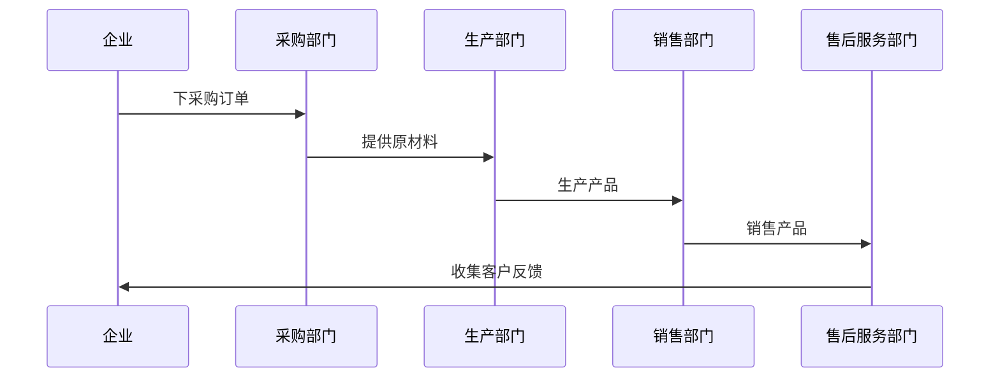

                 

### 引言

在当今快速发展的信息技术时代，领域模型作为一种重要的软件设计工具，已经在众多行业和应用场景中得到了广泛应用。领域模型旨在抽象和表示特定领域内的核心概念、关系和规则，从而帮助我们更好地理解和解决问题。然而，尽管领域模型在众多应用中表现出色，但其并非没有软肋。

本文将围绕领域模型展开，探讨其在实际应用中所面临的各种挑战和限制。通过深入分析领域模型的构成、构建方法、挑战以及应对策略，我们将揭示领域模型的软肋，并提供一些实用的解决方案。最终，本文旨在帮助读者更全面地了解领域模型，为其在实际项目中的应用提供有益的指导。

首先，我们将简要介绍领域模型的基本概念、重要性及其发展历程。接着，本文将详细探讨领域模型的构建方法，包括实体关系模型、用户体验模型、价值链模型等。在此基础上，我们将分析领域模型在金融、医疗等领域的应用案例，并总结其面临的挑战与应对策略。最后，本文将探讨领域模型的未来发展趋势，为读者提供一些前瞻性的思考。

通过本文的阅读，读者将深入了解领域模型的本质、应用场景以及未来方向，从而更好地发挥领域模型在项目开发中的价值。让我们开始这段关于领域模型的深入探索之旅吧！### 第一部分：领域模型的背景与基础

#### 第1章：领域模型的概念与重要性

**1.1 领域模型的基本概念**

领域模型（Domain Model）是一种软件设计工具，旨在抽象和表示特定领域内的核心概念、关系和规则。其核心理念是通过将现实世界的复杂系统抽象为一系列简洁的、易于理解的模型，从而帮助软件开发者更好地理解和解决问题。领域模型通常由一组实体、属性、关系和规则组成，这些元素共同构成了一个结构化的知识体系。

在领域模型中，实体（Entity）是模型的核心组成部分，表示领域内的具体对象，如用户、订单、产品等。每个实体具有一组属性（Attribute），用于描述其特征，如用户名、年龄、电子邮件等。关系（Relationship）则描述了实体之间的关联，如用户下单、订单包含商品等。

**1.2 领域模型的重要性**

领域模型在软件开发中具有重要价值。首先，领域模型有助于提高软件的可维护性和可扩展性。通过将领域内的核心概念和关系抽象出来，软件开发者可以更好地组织和管理代码，降低系统的复杂度。其次，领域模型有助于促进团队成员之间的沟通和理解。通过统一的领域模型，团队成员可以更清晰地了解项目需求，减少误解和冲突。

此外，领域模型还可以为领域驱动设计（Domain-Driven Design, DDD）提供基础。DDD 是一种软件开发方法，强调通过构建领域模型来驱动项目开发。领域模型在 DDD 中起到了核心作用，帮助开发团队更有效地设计和实现复杂的软件系统。

**1.3 领域模型的发展历程**

领域模型的概念最早可以追溯到 1980 年代，当时软件工程师开始意识到，传统的设计方法难以应对复杂的应用场景。为了解决这个问题，他们开始尝试使用抽象模型来表示领域知识。随着时间的推移，领域模型逐渐发展成为软件工程中的一个重要领域。

在 1990 年代，领域特定语言（Domain-Specific Language, DSL）的出现进一步推动了领域模型的发展。DSL 是一种为特定领域设计的编程语言，可以帮助开发者更高效地构建领域模型。例如，数据库查询语言 SQL 就是一种 DSL，它专门用于数据库查询操作。

进入 21 世纪，领域驱动设计（DDD）的兴起为领域模型的应用提供了新的思路。DDD 强调通过领域模型来驱动项目开发，使得领域模型在软件开发中的应用更加广泛和深入。

**1.4 领域模型的分类**

领域模型可以根据不同的标准进行分类。以下是几种常见的分类方式：

- **按功能分类**：领域模型可以分为业务领域模型、数据领域模型、用户界面领域模型等。
- **按抽象层次分类**：领域模型可以分为实体模型、关系模型、规则模型等。
- **按应用场景分类**：领域模型可以分为金融领域模型、医疗领域模型、物流领域模型等。

**1.5 领域模型的应用领域**

领域模型在多个行业和领域中都得到了广泛应用。以下是一些典型的应用领域：

- **金融行业**：领域模型在金融风险管理、交易系统、银行账户管理等方面有广泛应用。例如，商业银行可以通过领域模型来描述客户信息、交易记录、风险指标等。
- **医疗健康领域**：领域模型在电子病历、医学图像处理、药物研发等方面发挥着重要作用。例如，医生可以通过领域模型来管理患者信息、诊断结果、治疗方案等。
- **制造业**：领域模型在供应链管理、产品生命周期管理、生产调度等方面有广泛应用。例如，制造企业可以通过领域模型来描述原材料、产品、订单等。

通过上述介绍，我们可以看到领域模型在软件开发中具有重要作用，其应用范围广泛，但也面临一些挑战和限制。在接下来的章节中，我们将进一步探讨领域模型的构建方法、面临的挑战以及应对策略。### 第2章：领域模型的构建方法

在了解了领域模型的基本概念和重要性之后，接下来我们将深入探讨领域模型的构建方法。领域模型的构建是一个复杂的过程，需要充分考虑领域内的核心概念、关系和规则。在本章中，我们将详细介绍几种常见的领域模型构建方法，包括实体关系模型、用户体验模型和价值链模型。

**2.1 领域模型构建的基本步骤**

构建领域模型通常需要遵循以下基本步骤：

1. **需求分析**：首先，需要对领域进行需求分析，明确领域内的核心概念、关系和规则。这一步骤可以通过访谈、问卷调查、文献调研等方式进行。
2. **概念建模**：在需求分析的基础上，进行概念建模，将领域内的核心概念、关系和规则抽象为模型。常用的方法有实体关系模型、用户界面模型等。
3. **细化模型**：对概念模型进行细化，添加属性、关系和规则，使其更具体、更实用。在这一步骤中，可以使用实体关系模型、用户界面模型等工具进行建模。
4. **验证模型**：验证领域模型的正确性，确保其能够准确描述领域内的核心概念、关系和规则。这一步骤可以通过专家评审、用户测试等方式进行。
5. **优化模型**：在验证模型的基础上，对模型进行优化，提高其可维护性、可扩展性和性能。这一步骤可以通过调整模型结构、改进算法等方式进行。

**2.2 实体关系模型（ER模型）**

实体关系模型（Entity-Relationship Model，简称ER模型）是领域模型构建中常用的一种方法。ER模型通过实体、属性和关系来描述领域内的核心概念。

1. **实体**：实体是领域模型中的基本元素，表示领域内的具体对象。例如，在电子商务领域，用户、订单和商品都可以被视为实体。
2. **属性**：属性是实体的特征，用于描述实体的详细信息。例如，用户实体可以具有用户名、年龄、电子邮件等属性。
3. **关系**：关系描述了实体之间的关联。例如，在电子商务领域，用户可以下单，订单可以包含商品，这表示用户与订单、订单与商品之间存在关系。

ER模型通过ER图来表示，ER图由实体、属性和关系组成。例如，下图是一个简单的电子商务领域ER图：

```mermaid
erDiagram
    User ||--|{ Order }|
    Order ||--|{ Product }|
```

在这个ER图中，User、Order和Product是实体，Username、Age和Email是User实体的属性，OrderId、OrderDate和TotalAmount是Order实体的属性，ProductName、Quantity和Price是Product实体的属性。User与Order之间存在一对一的关系，Order与Product之间存在一对多的关系。

**2.3 用户体验模型**

用户体验模型（User Experience Model，简称UX模型）是一种用于描述用户与系统交互的领域模型。UX模型通过用户行为、用户界面和用户需求来描述用户与系统的交互过程。

1. **用户行为**：用户行为是用户在使用系统过程中所采取的操作。例如，用户可以在电子商务系统中浏览商品、添加购物车、下订单等。
2. **用户界面**：用户界面是用户与系统交互的媒介。例如，用户可以在电子商务系统中通过网页、移动应用或桌面应用与系统进行交互。
3. **用户需求**：用户需求是用户在使用系统时所期望实现的功能。例如，用户可能在电子商务系统中期望能够方便地搜索商品、查看商品详情、进行在线支付等。

用户体验模型可以通过UX图来表示，UX图由用户行为、用户界面和用户需求组成。例如，下图是一个简单的电子商务领域UX图：

```mermaid
gantt
    dateFormat  YYYY-MM-DD
    title 电子商务系统UX模型

    section 用户行为
    用户浏览商品 :   A2018-01-01, 2d
    用户添加购物车 :   A2018-01-03, 2d
    用户下订单 :   A2018-01-05, 2d

    section 用户界面
    网页界面 :   B2018-01-01, 2d
    移动应用界面 :   B2018-01-03, 2d
    桌面应用界面 :   B2018-01-05, 2d

    section 用户需求
    搜索商品 :   C2018-01-01, 2d
    查看商品详情 :   C2018-01-03, 2d
    在线支付 :   C2018-01-05, 2d
```

在这个UX图中，用户浏览商品、添加购物车和下订单是用户行为，网页界面、移动应用界面和桌面应用界面是用户界面，搜索商品、查看商品详情和在线支付是用户需求。

**2.4 价值链模型**

价值链模型（Value Chain Model）是一种用于描述企业内部价值创造的领域模型。价值链模型通过企业的各种活动和流程来描述企业如何通过内部资源和能力来创造价值。

1. **内部流程**：内部流程是企业内部进行价值创造的基本活动，如生产、采购、销售、服务等。
2. **支持活动**：支持活动是企业内部辅助价值创造的活动，如人力资源管理、技术开发、采购等。

价值链模型可以通过价值链图来表示，价值链图由内部流程和支持活动组成。例如，下图是一个简单的企业价值链图：



在这个价值链图中，企业是核心主体，采购、生产、销售和服务是企业内部的四种基本活动。这些活动相互关联，共同构成了企业的价值链。

**2.5 领域模型的设计原则**

在设计领域模型时，应遵循以下原则：

1. **简洁性**：领域模型应尽可能简洁，避免冗余和复杂性。简洁的模型更容易理解和维护。
2. **一致性**：领域模型中的实体、属性和关系应保持一致性，避免冲突和矛盾。
3. **可扩展性**：领域模型应具有可扩展性，能够适应领域的变化和扩展。
4. **灵活性**：领域模型应具有一定的灵活性，能够适应不同的应用场景和需求。

通过以上设计原则，我们可以构建出更高质量、更实用的领域模型，从而更好地支持软件开发和领域驱动设计（DDD）。

总结而言，领域模型的构建是一个复杂而关键的过程，需要充分考虑领域内的核心概念、关系和规则。通过实体关系模型、用户体验模型和价值链模型等构建方法，我们可以更有效地描述和解决领域问题。在接下来的章节中，我们将继续探讨领域模型在实际应用中面临的挑战和应对策略。### 第3章：领域模型的挑战

尽管领域模型在软件工程中具有重要价值，但其在实际应用中也面临着诸多挑战。这些挑战涉及到数据的完整性、模型的扩展性、跨领域的整合、性能优化以及模型的解释性等方面。下面我们将一一进行分析。

**3.1 数据质量问题**

数据质量是领域模型构建的基础，但其常常成为领域模型应用中的一个瓶颈。数据质量问题可能包括数据缺失、数据重复、数据不一致、数据不准确等。这些问题会导致领域模型不准确或无法正确地表示领域内的实际情况。

- **数据缺失**：在某些应用场景中，可能存在关键数据的缺失，使得领域模型无法完整地表示领域内的对象和关系。
- **数据重复**：数据重复会导致领域模型的冗余，增加系统的复杂度，降低系统的性能。
- **数据不一致**：数据不一致会使得领域模型中的信息冲突，导致模型的可靠性降低。
- **数据不准确**：数据不准确会使得领域模型无法正确地反映领域内的实际情况，影响系统的决策和性能。

**3.2 模型扩展性问题**

领域模型在构建时需要考虑领域的变化和扩展。然而，在实际应用中，领域模型往往面临着扩展性问题，主要包括以下方面：

- **功能扩展**：随着业务需求的变化，领域模型需要增加新的功能，但原有模型的结构可能无法直接支持这些扩展，导致模型重构。
- **数据扩展**：领域模型中的数据结构需要根据新的业务需求进行扩展，这可能会导致原有数据的冗余或丢失。
- **结构扩展**：领域模型的结构需要根据新的业务需求进行调整，这可能会影响模型的性能和可维护性。

**3.3 跨领域整合问题**

领域模型通常是为了解决特定领域的应用问题而设计的。然而，在实际应用中，可能需要将多个领域的模型进行整合，以实现更复杂的业务流程。跨领域整合问题主要包括：

- **数据整合**：不同领域的模型可能使用不同的数据结构和格式，需要进行数据整合和转换，这可能会增加系统的复杂度。
- **规则整合**：不同领域的模型可能包含不同的业务规则，需要进行规则整合，这可能会影响系统的性能和一致性。
- **流程整合**：不同领域的模型可能涉及不同的业务流程，需要进行流程整合，这可能会影响系统的可维护性和可扩展性。

**3.4 模型性能优化问题**

领域模型在构建时需要考虑性能问题，但其性能优化往往是一个挑战。模型性能优化问题主要包括：

- **查询效率**：领域模型中的查询操作需要高效，否则会影响系统的响应速度。
- **数据访问**：领域模型中的数据访问需要高效，否则会影响系统的性能。
- **内存管理**：领域模型中的内存管理需要优化，否则可能会导致内存泄漏或性能下降。

**3.5 模型可解释性问题**

领域模型通常用于业务决策和系统优化，但其可解释性往往是一个挑战。模型可解释性问题主要包括：

- **算法透明性**：领域模型中的算法需要具有透明性，使得业务人员可以理解模型的决策过程。
- **结果可解释性**：领域模型输出的结果需要具有可解释性，使得业务人员可以理解结果的意义和影响。
- **错误诊断**：在模型应用过程中，如果出现错误，需要能够快速诊断并定位问题，这要求模型具有一定的可解释性。

通过上述分析，我们可以看到领域模型在实际应用中面临着多种挑战。这些挑战不仅影响了领域模型的有效性，也影响了其可维护性和可扩展性。在接下来的章节中，我们将探讨如何应对这些挑战，提供一些有效的解决方案。### 第4章：领域模型的挑战应对策略

在面对领域模型的各种挑战时，我们需要采取一系列的应对策略，以确保模型的有效性、可维护性和可扩展性。以下是一些常见的挑战应对策略：

**4.1 数据质量管理策略**

数据质量是领域模型构建的基础，因此确保数据质量至关重要。以下是一些数据质量管理策略：

- **数据标准化**：对所有数据进行标准化处理，确保数据的格式、命名和结构一致。
- **数据校验**：对数据进行严格的校验，确保数据的完整性和准确性。
- **数据清洗**：定期进行数据清洗，去除重复、缺失和不一致的数据。
- **数据监控**：建立数据监控机制，实时检测数据质量问题，并采取相应的修复措施。
- **数据备份**：定期备份数据，确保在数据损坏或丢失时能够快速恢复。

**4.2 模型扩展性策略**

为了应对模型扩展性问题，我们需要采取以下扩展性策略：

- **模块化设计**：将领域模型分解为多个模块，每个模块负责一个特定的功能。这样，在需要增加新功能时，可以独立扩展相应的模块，而不影响其他部分。
- **可配置化**：将领域模型的配置与代码分离，通过配置文件或参数来调整模型的行为。这样，在需要修改模型时，不需要修改代码。
- **抽象层次**：将领域模型分为多个抽象层次，每个层次负责不同的功能。在高层次上，可以更灵活地调整模型结构，而不影响低层次的设计。
- **代码复用**：通过代码复用，减少重复的代码，提高系统的可扩展性。

**4.3 跨领域整合策略**

跨领域整合是一个复杂的过程，需要考虑数据、规则和流程的整合。以下是一些跨领域整合策略：

- **数据集成**：采用数据集成技术，将来自不同领域的数据进行整合，确保数据的一致性和完整性。
- **规则集成**：将不同领域的业务规则进行整合，确保规则的一致性和可执行性。
- **流程集成**：采用流程集成技术，将不同领域的业务流程进行整合，确保流程的连续性和高效性。
- **接口设计**：设计良好的接口，使得不同领域的模型可以通过接口进行交互，降低系统的耦合度。

**4.4 模型性能优化策略**

为了提高领域模型的性能，我们需要采取以下性能优化策略：

- **查询优化**：采用高效的查询算法和索引技术，提高查询效率。
- **数据缓存**：采用数据缓存技术，减少数据访问次数，提高系统性能。
- **负载均衡**：采用负载均衡技术，确保系统的负载均衡，避免单点瓶颈。
- **内存优化**：对内存使用进行优化，减少内存泄漏，提高系统稳定性。

**4.5 模型可解释性策略**

为了提高领域模型的可解释性，我们需要采取以下策略：

- **算法透明化**：确保算法的实现过程透明，使得业务人员可以理解模型的决策过程。
- **结果可视化**：将模型的输出结果进行可视化，使得业务人员可以直观地理解结果的意义和影响。
- **错误诊断**：提供详细的错误日志和诊断工具，帮助业务人员快速定位问题。
- **文档化**：编写详细的文档，包括模型的设计原理、实现过程和操作指南，帮助业务人员更好地理解和使用模型。

通过以上策略，我们可以有效地应对领域模型在构建和应用过程中所面临的挑战，提高模型的有效性、可维护性和可扩展性。在接下来的章节中，我们将进一步探讨领域模型在金融、医疗等领域的具体应用。### 第5章：领域模型在金融行业的应用

在金融行业，领域模型的应用已经成为提升业务效率、降低风险和优化客户体验的重要手段。以下我们将探讨领域模型在金融行业中的具体应用，并分析一些成功的应用案例。

**5.1 金融领域模型的应用场景**

金融领域模型的应用场景非常广泛，包括但不限于以下几个方面：

- **客户关系管理（CRM）**：通过领域模型来管理客户信息，包括客户的基本信息、交易记录、偏好和需求等，从而提供个性化的金融服务。
- **风险管理**：利用领域模型来分析和管理金融风险，包括信用风险、市场风险、操作风险等。
- **交易处理**：在交易系统中，领域模型可以用来描述交易过程，包括交易类型、交易对手、交易资产等，从而提高交易处理效率和准确性。
- **投资组合管理**：通过领域模型来管理投资组合，包括资产、风险、收益等，从而实现最优的投资策略。
- **合规性检查**：领域模型可以用来确保金融业务符合相关法规和标准，降低合规风险。

**5.2 金融领域模型案例分析**

以下是一些金融领域模型的应用案例：

1. **银行客户关系管理**：

   某大型银行采用了基于领域模型的客户关系管理系统。该系统通过领域模型来描述客户信息，包括客户的基本信息、交易记录、信用评分等。领域模型使得银行能够更好地了解客户需求，提供个性化的金融产品和服务，从而提升了客户满意度和忠诚度。

2. **信用风险管理**：

   另一家银行采用了基于领域模型的信用风险管理系统。该系统通过领域模型来分析客户的信用风险，包括客户的财务状况、历史信用记录等。领域模型帮助银行更加准确地评估客户的信用风险，从而优化信贷决策，降低信用损失。

3. **交易处理**：

   一家证券交易所采用了基于领域模型的交易处理系统。该系统通过领域模型来描述交易过程，包括交易类型、交易对手、交易资产等。领域模型使得交易所能够高效地处理海量交易，确保交易的准确性和安全性。

4. **投资组合管理**：

   一家投资公司采用了基于领域模型的投资组合管理系统。该系统通过领域模型来管理投资组合，包括资产、风险、收益等。领域模型帮助投资公司实现最优的投资策略，从而提高了投资回报。

**5.3 金融领域模型的挑战与应对策略**

尽管领域模型在金融行业表现出色，但在实际应用中仍面临一些挑战，包括：

- **数据质量**：金融领域涉及大量数据，数据质量直接影响领域模型的准确性。应对策略包括数据标准化、数据清洗、数据监控等。
- **合规性**：金融行业受到严格的法规和监管，领域模型需要确保合规性。应对策略包括合规性检查、法规跟踪等。
- **性能**：金融领域模型需要处理海量数据和高频交易，性能至关重要。应对策略包括查询优化、数据缓存、负载均衡等。

通过有效的领域模型，金融行业可以实现更加智能化和高效化的业务运营，降低风险，提升客户体验。在接下来的章节中，我们将继续探讨领域模型在医疗健康领域的应用。### 第6章：领域模型在医疗健康领域的应用

领域模型在医疗健康领域的应用为医疗信息的组织和处理提供了强有力的工具，极大地提升了医疗服务的质量和效率。以下我们将探讨领域模型在医疗健康领域中的具体应用，并分析一些成功的应用案例。

**6.1 医疗健康领域模型的应用场景**

医疗健康领域模型的应用场景主要包括以下几个方面：

- **电子病历管理**：通过领域模型来管理患者信息、病历记录、诊断结果等，实现电子病历的标准化和自动化处理。
- **医疗资源管理**：利用领域模型来描述医疗资源，包括医院、科室、医生、设备等，优化资源分配和调度。
- **临床决策支持**：通过领域模型来支持医生的诊断和治疗决策，提高医疗服务的准确性和效率。
- **医学研究**：利用领域模型来管理医学研究数据，支持医学研究分析和结果呈现。
- **健康管理系统**：通过领域模型来管理个人健康数据，提供个性化的健康建议和干预措施。

**6.2 医疗健康领域模型案例分析**

以下是一些医疗健康领域模型的应用案例：

1. **电子病历管理**：

   某大型医院采用了基于领域模型的电子病历管理系统。该系统通过领域模型来描述患者信息、病历记录、诊断结果等，实现了病历信息的电子化、标准化和自动化处理，大大提高了病历管理效率，降低了人为错误。

2. **医疗资源管理**：

   另一家医院采用了基于领域模型的医疗资源管理系统。该系统通过领域模型来描述医院、科室、医生、设备等资源，实现了资源的动态分配和优化调度，提高了医疗服务质量和效率。

3. **临床决策支持**：

   一家医疗机构采用了基于领域模型的临床决策支持系统。该系统通过领域模型来收集和分析患者信息、诊断结果、治疗方案等，为医生提供科学的诊断和治疗方案建议，提高了诊断准确性和治疗效果。

4. **医学研究**：

   一所医学院采用了基于领域模型的医学研究管理系统。该系统通过领域模型来管理医学研究数据，支持数据分析和结果呈现，为医学研究提供了有力的数据支持。

5. **健康管理系统**：

   一家健康科技公司采用了基于领域模型的健康管理系统。该系统通过领域模型来管理个人健康数据，提供个性化的健康建议和干预措施，帮助用户实现健康管理和疾病预防。

**6.3 医疗健康领域模型的挑战与应对策略**

尽管领域模型在医疗健康领域展现出巨大的潜力，但其实际应用也面临一些挑战，包括：

- **数据隐私和安全性**：医疗健康领域涉及敏感的个人信息，数据隐私和安全至关重要。应对策略包括数据加密、访问控制、安全审计等。
- **数据整合和标准化**：医疗健康领域的数据来源多样，数据整合和标准化是一个挑战。应对策略包括数据集成技术、数据标准化规则等。
- **模型可解释性**：医疗健康领域模型需要具备较高的可解释性，以便医生和患者理解模型的决策过程。应对策略包括算法透明化、可视化技术等。

通过有效的领域模型，医疗健康领域可以实现信息的高效管理和利用，提升医疗服务质量和患者体验。在接下来的章节中，我们将继续探讨领域模型在其他领域的应用。### 第7章：领域模型在其他领域的应用

领域模型不仅在金融和医疗健康领域发挥了重要作用，还在多个其他行业中展现出了强大的应用潜力。以下，我们将探讨领域模型在教育、制造业、服务业以及交通运输领域的应用，以及这些领域面临的挑战和应对策略。

**7.1 教育领域**

在教育领域，领域模型的应用主要体现在学习管理系统中。通过领域模型，教育机构可以有效地管理课程、学生、教师、成绩等信息。以下是一些具体的应用：

- **课程管理**：领域模型可以帮助教育机构描述和管理工作流程，包括课程设计、课程评估和课程调整。
- **学生管理**：领域模型可以记录和管理学生的基本信息、学习进度、考试成绩等，为个性化教学提供支持。
- **教师管理**：领域模型可以描述教师的教学任务、工作量、评估结果等，优化教师资源的分配和管理。

**挑战与应对策略**：

- **数据隐私与安全性**：学生和教师的个人信息敏感，需要确保数据的安全和隐私。
- **数据标准化**：不同学校和教育机构可能使用不同的数据标准和格式，需要进行数据整合和标准化。

**7.2 制造业领域**

在制造业领域，领域模型主要用于生产管理和供应链管理。以下是一些应用：

- **生产计划**：领域模型可以帮助制造商优化生产计划，提高生产效率。
- **供应链管理**：领域模型可以描述供应链中的各个环节，包括供应商、制造商、分销商等，优化供应链流程。

**挑战与应对策略**：

- **数据集成**：制造业涉及大量的数据来源，需要进行有效的数据集成。
- **系统性能**：领域模型需要处理大量的实时数据，需要确保系统的高性能。

**7.3 服务业领域**

在服务业领域，领域模型广泛应用于客户关系管理和业务流程优化。以下是一些应用：

- **客户关系管理**：领域模型可以描述客户的基本信息、购买历史、反馈等，帮助服务提供商提供个性化的服务。
- **业务流程优化**：领域模型可以描述业务流程中的各个环节，优化服务流程，提高服务质量。

**挑战与应对策略**：

- **业务规则复杂**：服务业的业务规则复杂，需要精确地描述和实现。
- **数据实时性**：领域模型需要及时更新和反映业务变化。

**7.4 交通运输领域**

在交通运输领域，领域模型主要用于交通管理和物流优化。以下是一些应用：

- **交通管理**：领域模型可以描述交通流、交通信号、道路状况等，帮助交通管理部门优化交通流量。
- **物流优化**：领域模型可以描述物流流程中的各个环节，包括运输、仓储、配送等，优化物流流程。

**挑战与应对策略**：

- **实时数据处理**：交通运输领域需要处理大量的实时数据，需要高效的实时数据处理能力。
- **系统可靠性**：领域模型需要确保系统的稳定性和可靠性，避免因系统故障导致的交通拥堵或物流中断。

通过在各个领域的广泛应用，领域模型为行业优化和管理提供了强大的工具。然而，面对不同的应用场景，领域模型也需要根据具体需求进行定制和优化。在接下来的章节中，我们将进一步探讨领域模型的未来发展趋势。### 第8章：领域模型的未来发展趋势

随着技术的不断进步和应用场景的拓展，领域模型在未来有望迎来新的发展机遇。以下，我们将探讨领域模型在未来可能面临的技术发展趋势、应用前景以及潜在的挑战与机遇。

**8.1 技术发展趋势**

1. **人工智能与机器学习的融合**：未来领域模型将更加紧密地与人工智能和机器学习技术结合。通过引入深度学习、强化学习等先进算法，领域模型可以实现自我学习和优化，提高模型的准确性和智能化水平。

2. **区块链技术的应用**：区块链技术的去中心化、安全性和不可篡改性为领域模型提供了一种新的基础设施。未来，领域模型可能会与区块链技术相结合，用于数据的共享、验证和审计。

3. **大数据分析**：随着数据量的持续增长，大数据分析技术将在领域模型中发挥越来越重要的作用。通过大数据分析，领域模型可以更全面、深入地理解领域内的现象和规律，从而提供更准确的预测和决策支持。

4. **多模态数据处理**：未来领域模型将能够处理多种类型的数据，包括结构化数据、非结构化数据和实时数据。通过多模态数据处理，领域模型可以更全面地捕捉和利用领域内的信息。

**8.2 应用发展趋势**

1. **智慧城市**：领域模型在智慧城市中的应用前景广阔。通过领域模型，智慧城市可以实现交通管理、能源管理、环境监测等领域的智能化和自动化，提高城市运行效率，提升居民生活质量。

2. **智能医疗**：领域模型在智能医疗领域的应用将进一步提升医疗服务的质量和效率。通过领域模型，医疗机构可以实现电子病历管理、临床决策支持、医学研究等环节的智能化，助力医疗健康事业的发展。

3. **智能制造**：领域模型在智能制造中的应用将推动生产过程的自动化和优化。通过领域模型，制造企业可以实现生产计划优化、供应链管理、产品追溯等，提高生产效率和产品质量。

4. **智能金融**：领域模型在智能金融中的应用将提升金融服务的精准性和可靠性。通过领域模型，金融机构可以实现客户关系管理、信用风险评估、交易处理等环节的智能化，提高业务运营效率和风险控制能力。

**8.3 挑战与机遇**

1. **数据隐私与安全**：随着领域模型的应用范围不断扩大，数据隐私和安全问题将变得更加突出。如何在保障数据隐私和安全的同时，充分利用领域模型提供的数据价值，将成为一个重要的挑战。

2. **技术融合与创新**：领域模型的未来发展依赖于与人工智能、区块链、大数据等新兴技术的融合与创新。如何有效地整合这些技术，发挥其协同效应，是一个亟待解决的问题。

3. **人才培养与团队协作**：领域模型的发展离不开专业人才的支持。未来，如何培养更多具备跨学科知识和技能的领域模型专家，建立高效的团队协作机制，将是一个关键挑战。

4. **标准化与规范化**：为了推动领域模型的应用和普及，制定统一的领域模型标准和规范至关重要。如何在技术多样性和应用需求之间找到平衡，是一个亟待解决的课题。

总结而言，领域模型在未来具有广阔的发展前景，但也面临诸多挑战。通过不断创新和优化，领域模型有望在各个领域发挥更加重要的作用，助力数字化转型和智能化升级。### 结论

本文系统地探讨了领域模型的概念、构建方法、挑战与应对策略，以及在金融、医疗健康、教育、制造业、服务业和交通运输等领域的应用。通过详细分析领域模型的基本概念、重要性、构建方法、挑战和应对策略，我们全面了解了领域模型在软件开发中的重要地位。

领域模型作为一种抽象和表示特定领域内核心概念、关系和规则的工具，有助于提高软件的可维护性、可扩展性和可理解性。其在金融、医疗健康等领域的成功应用，充分展示了领域模型在提升业务效率、降低风险和优化用户体验方面的巨大潜力。

然而，领域模型在实际应用中也面临数据质量、扩展性、跨领域整合、性能优化和可解释性等一系列挑战。通过采取有效的数据质量管理、模型扩展性、跨领域整合、性能优化和模型可解释性策略，我们可以应对这些挑战，充分发挥领域模型的优势。

展望未来，随着人工智能、区块链、大数据等新兴技术的快速发展，领域模型将在更广泛的领域和更复杂的场景中发挥重要作用。领域模型的应用前景广阔，但同时也需要不断创新和优化，以应对技术融合、数据隐私与安全、人才培养等新挑战。

总之，领域模型作为一种重要的软件设计工具，其在各个领域的应用将不断拓展和深化。通过本文的探讨，我们希望读者能够更好地理解领域模型，并在实际项目中运用领域模型，提高软件开发质量和效率。让我们继续关注领域模型的发展，期待其在未来带来更多的创新和突破。作者：AI天才研究院/AI Genius Institute & 禅与计算机程序设计艺术 /Zen And The Art of Computer Programming。

