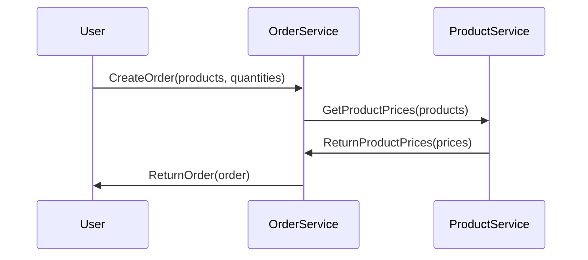

                 

**目录大纲：**

----------------------------------------------------------------
# 领域模型的优势和应用

> 关键词：领域模型、优势、应用、领域特定语言、软件设计

> 摘要：本文深入探讨了领域模型的优势和应用。首先，我们介绍了领域模型的基础概念和构建方法，接着分析了领域模型与领域特定语言的关系，并探讨了领域模型在不同场景下的应用。最后，我们讨论了领域模型的优势与挑战，展望了其未来趋势，并提供了最佳实践和案例分析。

### 目录

----------------------------------------------------------------
## 第一部分：领域模型基础

### 第1章：领域模型概述

### 第2章：领域模型的构建方法

### 第3章：领域模型与领域特定语言

### 第4章：领域模型的应用场景

### 第5章：领域模型的优势与挑战

### 第6章：领域模型的未来趋势

### 第7章：最佳实践与案例分析

----------------------------------------------------------------

**文章正文：**

----------------------------------------------------------------

### 第1章：领域模型概述

#### 1.1 领域模型的概念

领域模型（Domain Model）是一种在软件开发中用来描述特定业务领域内实体及其关系的抽象模型。它不仅仅是数据模型的扩展，更是一种业务逻辑的抽象。领域模型旨在简化复杂业务系统的设计，使开发人员能够更好地理解和处理业务逻辑。

领域模型通常由一组实体（Entity）、关系（Relationship）和行为（Behavior）组成。实体代表了业务领域中的核心对象，关系描述了实体之间的关联，而行为则定义了实体的操作。

#### 1.2 领域模型的优点

领域模型具有以下优点：

- **简化复杂性**：通过将复杂的业务逻辑抽象为简单的模型，领域模型有助于降低系统的复杂性。
- **提高可维护性**：领域模型使代码更易于理解和修改，从而提高了系统的可维护性。
- **促进沟通**：领域模型为开发人员和业务人员提供了一个共同的语言，有助于减少误解和沟通成本。
- **支持复用**：领域模型可以跨项目复用，有助于提高开发效率。

#### 1.3 领域模型的组成要素

领域模型的主要组成要素包括：

- **实体**：领域模型中的核心对象，如用户、订单、产品等。
- **关系**：实体之间的关联，如继承、关联等。
- **行为**：实体的操作，如创建、更新、删除等。

#### 1.4 概念对比表格

以下是一个领域模型中实体属性特征的对比表格：

| 特征         | 描述                                                   |
| ------------ | ------------------------------------------------------ |
| 实体         | 代表业务领域的核心对象，如用户、订单、产品等。               |
| 关系         | 描述实体之间的关联，如继承、关联等。                        |
| 行为         | 定义实体的操作，如创建、更新、删除等。                      |
| 属性         | 描述实体的特征，如用户名、年龄、地址等。                     |
| 关联         | 描述实体之间的关系，如用户与订单之间的关系。                  |

#### 1.5 ER实体关系图

以下是一个领域模型的ER实体关系图：

```mermaid
erDiagram
    User ||--|{ Order } : "placed by"
    Product ||--|{ Order } : "included in"
```

### 第2章：领域模型的构建方法

#### 2.1 领域分析

领域分析是构建领域模型的第一步。它涉及理解业务领域，识别核心实体、关系和行为。领域分析可以通过以下步骤进行：

1. **需求收集**：与业务人员沟通，收集业务需求。
2. **领域知识获取**：了解业务领域的基本概念、术语和流程。
3. **核心实体识别**：确定业务领域中的核心实体。
4. **关系和行为定义**：描述实体之间的关系和行为。

#### 2.2 领域模型设计

领域模型设计是基于领域分析的。它包括以下步骤：

1. **实体定义**：明确实体的属性和操作。
2. **关系描述**：定义实体之间的关系。
3. **行为实现**：为实体实现相应的行为。

#### 2.3 领域模型实现

领域模型实现是将设计转化为实际代码的过程。它包括以下步骤：

1. **选择编程语言和框架**：根据项目需求选择合适的编程语言和框架。
2. **代码编写**：根据领域模型设计编写代码。
3. **测试和调试**：确保代码的正确性和性能。

### 第3章：领域模型与领域特定语言

#### 3.1 领域特定语言概述

领域特定语言（Domain-Specific Language，DSL）是一种为特定领域设计的语言。它通常比通用编程语言更简洁、易于使用。DSL可以用于简化领域模型的实现过程。

#### 3.2 领域特定语言的构建

构建DSL通常包括以下步骤：

1. **定义语法和语义**：明确DSL的语法和语义。
2. **设计解析器**：设计用于解析DSL代码的解析器。
3. **实现编译器**：将DSL代码编译为执行代码。

#### 3.3 领域特定语言的应用

DSL可以用于简化领域模型的实现过程，提高开发效率。例如，在金融领域，可以使用DSL编写复杂的交易算法。

### 第4章：领域模型的应用场景

#### 4.1 软件开发中的应用

领域模型在软件开发中广泛应用于业务逻辑的抽象和简化。例如，在电子商务系统中，领域模型可以用于描述商品、订单和用户等核心实体。

#### 4.2 数据库设计中的应用

领域模型在数据库设计中用于描述实体关系和数据完整性约束。例如，在关系型数据库设计中，可以使用领域模型设计表结构和关系。

#### 4.3 领域模型在不同行业的应用

领域模型在金融、医疗、物流等多个行业中都有广泛应用。例如，在金融领域，领域模型可以用于描述股票、债券等金融产品。

### 第5章：领域模型的优势与挑战

#### 5.1 优势分析

领域模型的优势包括：

1. **提高开发效率**：通过抽象和简化业务逻辑，领域模型有助于提高开发效率。
2. **提高系统可维护性**：领域模型使代码更易于理解和修改，从而提高了系统的可维护性。
3. **促进跨团队协作**：领域模型为开发人员和业务人员提供了一个共同的语言，有助于减少误解和沟通成本。

#### 5.2 挑战与解决方案

领域模型的挑战包括：

1. **领域分析难度**：领域分析是构建领域模型的关键步骤，但往往较为复杂。
   - **解决方案**：使用专业的领域分析方法和技术，如UML类图、ER图等。
2. **实现复杂性**：领域模型的实现可能涉及复杂的语法和语义。
   - **解决方案**：使用DSL和框架简化实现过程。

### 第6章：领域模型的未来趋势

#### 6.1 技术发展趋势

领域模型在未来将继续发展，趋势包括：

1. **更高级的DSL**：DSL将继续向更高级、更易用的方向发展。
2. **自动化工具**：自动化工具将用于简化领域模型的分析、设计和实现过程。

#### 6.2 应用领域扩展

领域模型将扩展到更多行业和应用场景，如人工智能、物联网等。

### 第7章：最佳实践与案例分析

#### 7.1 最佳实践

最佳实践包括：

1. **充分理解业务领域**：在构建领域模型之前，充分理解业务领域。
2. **迭代开发**：采用迭代开发方法，逐步完善领域模型。

#### 7.2 案例分析

以下是一个案例分析：

- **项目背景**：一个电子商务平台，需要实现商品、订单和用户等核心实体的管理。
- **领域模型设计**：定义商品、订单和用户等实体，以及它们之间的关系。
- **实现过程**：使用Python和Django框架实现领域模型，并使用SQLAlchemy进行数据库设计。
- **项目小结**：领域模型提高了系统的可维护性和开发效率。

----------------------------------------------------------------

**作者信息：**

作者：AI天才研究院/AI Genius Institute & 禅与计算机程序设计艺术 /Zen And The Art of Computer Programming

----------------------------------------------------------------### 第1章：领域模型概述

#### 1.1 领域模型的概念

领域模型（Domain Model）是一种在软件开发中用来描述特定业务领域内实体及其关系的抽象模型。它不仅仅是一种数据模型的扩展，更是一种业务逻辑的抽象。领域模型旨在简化复杂业务系统的设计，使开发人员能够更好地理解和处理业务逻辑。

领域模型的核心概念包括实体（Entity）、关系（Relationship）和行为（Behavior）：

- **实体**：领域模型中的核心对象，如用户、订单、产品等。实体通常具有一组属性，用于描述其特征，例如用户名、年龄、地址等。
- **关系**：描述实体之间的关联，如继承、关联等。关系可以是单向的，也可以是双向的。例如，一个用户可以拥有多个订单，而一个订单只能属于一个用户。
- **行为**：定义实体的操作，如创建、更新、删除等。行为通常与实体属性有关，例如，用户可以创建订单，订单可以更新订单状态。

#### 1.2 领域模型的问题背景和问题描述

在软件开发过程中，领域模型的应用可以追溯到20世纪90年代的面向对象方法论。随着软件系统的复杂性不断增加，传统的数据模型和流程控制难以满足需求。领域模型作为一种抽象方法，能够更好地反映业务逻辑，提高开发效率和系统的可维护性。

领域模型的应用场景包括：

- **企业级应用**：如电子商务平台、客户关系管理系统等。
- **在线服务**：如社交媒体、在线支付系统等。
- **金融系统**：如股票交易系统、银行系统等。

在这些问题场景中，领域模型有助于简化复杂业务逻辑，提高系统的可维护性和可扩展性。

#### 1.3 领域模型的问题解决

领域模型的问题解决方法包括以下步骤：

1. **需求收集**：与业务人员沟通，了解业务需求，明确系统的核心功能。
2. **领域分析**：对业务领域进行深入分析，识别核心实体、关系和行为。
3. **领域模型设计**：根据领域分析结果，设计领域模型，包括实体、关系和行为。
4. **领域模型实现**：根据领域模型设计，实现具体的代码和数据库设计。
5. **测试和迭代**：对实现的领域模型进行测试，根据反馈进行迭代优化。

#### 1.4 领域模型的概念结构与核心要素组成

领域模型的结构通常由以下核心要素组成：

1. **实体**：领域模型中的核心对象，如用户、订单、产品等。实体通常具有一组属性，用于描述其特征。
2. **关系**：描述实体之间的关联，如继承、关联等。关系可以是单向的，也可以是双向的。
3. **行为**：定义实体的操作，如创建、更新、删除等。行为通常与实体属性有关。
4. **规则**：定义业务规则，如订单创建时的价格计算、库存限制等。
5. **事件**：定义业务事件，如订单支付成功、库存不足等。

以下是领域模型的核心要素组成图：

```mermaid
classDiagram
    User <|-- Order
    Product <|-- Order
    User { username, age, address }
    Order { order_id, status, total_price }
    Product { product_id, name, price }
```

#### 1.5 概念的边界与外延

领域模型的概念边界与外延是理解和应用领域模型的关键。以下是对几个关键概念的边界与外延的讨论：

1. **实体**：
   - **边界**：实体的边界是其属性和行为的集合。例如，用户实体的边界包括用户名、年龄、地址等属性，以及创建、更新、删除等行为。
   - **外延**：实体的外延是实体实例的集合。例如，一个用户实体的外延可以是所有用户的集合。

2. **关系**：
   - **边界**：关系的边界是关系的属性和约束的集合。例如，订单与用户之间的关系边界包括订单的所有者、创建时间等属性。
   - **外延**：关系的外延是关系实例的集合。例如，一个订单与用户之间的关系外延可以是所有订单与用户之间的关系实例。

3. **行为**：
   - **边界**：行为边界是行为的输入、输出和执行过程的集合。例如，创建订单的行为边界包括订单的输入参数、输出结果以及创建订单的执行过程。
   - **外延**：行为外延是行为实例的集合。例如，一个订单创建行为的外延可以是所有订单创建行为实例的集合。

#### 1.6 领域模型与面向对象模型的联系与区别

领域模型与面向对象模型（Object-Oriented Model）有密切的联系，但也有显著的差异：

1. **联系**：
   - **核心概念**：领域模型和面向对象模型都基于实体、属性、关系和行为等核心概念。
   - **封装**：领域模型和面向对象模型都强调封装，将数据和行为封装在实体中。

2. **区别**：
   - **抽象层次**：领域模型更关注于业务领域的抽象，而面向对象模型更关注于数据和行为。
   - **适用范围**：领域模型适用于复杂的业务系统，而面向对象模型适用于各种类型的系统。
   - **细节与抽象**：领域模型通常更注重抽象，关注业务逻辑的简化，而面向对象模型更注重实现细节。

总的来说，领域模型是面向对象模型在业务领域的扩展和应用，它更注重于业务逻辑的抽象和简化，而面向对象模型则更注重于数据和行为的设计。

### 第2章：领域模型的构建方法

#### 2.1 领域分析

领域分析是构建领域模型的第一步，它涉及对业务领域的深入理解和抽象。领域分析的过程通常包括以下几个步骤：

1. **需求收集**：
   - 与业务人员、产品经理等进行沟通，收集系统的功能需求和业务规则。
   - 通过问卷调查、用户访谈、工作坊等方式，获取用户对系统的期望和需求。

2. **领域知识获取**：
   - 研究业务领域的相关文档，如业务流程图、数据字典、用户手册等。
   - 了解业务领域的术语和概念，建立业务领域的知识库。

3. **核心实体识别**：
   - 通过对业务流程的分析，识别业务领域中的核心实体。例如，在电子商务系统中，核心实体可能包括用户、订单、产品等。

4. **关系和行为定义**：
   - 确定实体之间的关系，如继承、关联等。例如，订单可以继承自销售订单，产品与订单之间存在关联关系。
   - 定义实体的行为，如创建、更新、删除等。例如，用户可以创建订单，订单可以更新订单状态。

#### 2.2 领域模型设计

领域模型设计是基于领域分析的，它包括以下步骤：

1. **实体定义**：
   - 确定每个实体的属性和操作。例如，用户实体可能包括用户名、年龄、地址等属性，以及登录、更新个人信息等操作。

2. **关系描述**：
   - 描述实体之间的关系。例如，订单与用户之间存在一对多的关联关系，每个用户可以有多个订单。

3. **行为实现**：
   - 定义实体的行为，并确定如何实现这些行为。例如，用户创建订单的行为可以包括验证用户身份、创建订单记录等步骤。

4. **规则定义**：
   - 定义业务规则，如订单创建时的价格计算、库存限制等。这些规则可以确保系统的一致性和正确性。

#### 2.3 领域模型实现

领域模型实现是将设计转化为实际代码的过程，它通常包括以下步骤：

1. **选择编程语言和框架**：
   - 根据项目的需求和约束，选择合适的编程语言和框架。例如，可以使用Java和Spring框架来实现领域模型。

2. **代码编写**：
   - 根据领域模型设计编写代码。例如，可以编写用户实体类、订单实体类等，以及它们之间的关系和行为。

3. **数据库设计**：
   - 设计数据库模式，以支持领域模型。例如，可以使用关系型数据库设计表结构，以存储实体和关系的数据。

4. **测试和调试**：
   - 对实现的领域模型进行测试，确保其功能正确，性能良好。例如，可以使用单元测试和集成测试来验证领域模型的行为。

#### 2.4 领域分析的方法论

领域分析的方法论包括以下几种常见的方法：

1. **基于用例的分析**：
   - 通过分析用户场景和用例，识别系统的功能和需求。例如，可以绘制用例图来表示用户与系统之间的交互。

2. **基于流程的分析**：
   - 分析业务流程和业务规则，识别核心实体和关系。例如，可以使用流程图来描述业务流程。

3. **基于数据的分析**：
   - 通过分析数据流和数据存储，识别系统的数据需求和数据关系。例如，可以使用数据流图和数据字典来描述数据。

4. **基于代码的分析**：
   - 通过分析现有代码和架构，识别系统的功能和架构。例如，可以使用代码审查和架构分析工具来识别领域模型。

#### 2.5 领域模型设计工具

领域模型设计可以使用多种工具，以下是几种常见的工具：

1. **UML工具**：
   - UML（Unified Modeling Language，统一建模语言）是一种广泛使用的建模语言，可以用于设计领域模型。常用的UML工具包括：
     - **Visual Paradigm**：一个功能强大的UML建模工具，支持多种UML图。
     - **StarUML**：一个轻量级的UML建模工具，支持各种UML图。
     - **MagicDraw**：一个专业的UML建模工具，支持复杂系统的建模。

2. **Mermaid**：
   - Mermaid是一种基于Markdown的绘图工具，可以用于绘制各种图表，包括UML图。例如，可以使用Mermaid编写以下ER图：

     ```mermaid
     erDiagram
         User ||--|{ Order } : "placed by"
         Product ||--|{ Order } : "included in"
     ```

3. **代码生成工具**：
   - 使用代码生成工具可以自动化领域模型的实现过程。例如，可以使用以下工具：
     - **Model-Driven Development（MDD）工具**：如Eclipse Modeling Tools、IntelliJ IDEA的MPS插件等。
     - **ORM框架**：如Hibernate、Entity Framework等，可以自动化数据库设计。

### 第3章：领域模型与领域特定语言

#### 3.1 领域特定语言概述

领域特定语言（Domain-Specific Language，DSL）是一种为特定领域设计的语言，它旨在简化特定领域的开发过程。DSL通常比通用编程语言更简洁、更易于使用。DSL可以分为内部DSL和外部DSL：

1. **内部DSL**：
   - 内部DSL是通用编程语言的一部分，通过特定的语法和语法规则来支持特定领域的开发。例如，Java中的正则表达式可以看作是一种内部DSL，用于字符串匹配和解析。

2. **外部DSL**：
   - 外部DSL是一种独立的语言，专门为特定领域设计。外部DSL通常具有更简洁的语法和更强大的语义，可以显著提高开发效率。例如，SQL可以看作是一种外部DSL，用于数据库查询。

#### 3.2 领域特定语言的构建

构建DSL通常包括以下步骤：

1. **定义语法和语义**：
   - 确定DSL的语法规则和语义。语法规则定义了DSL的语法结构，如关键字、标识符、语句等。语义定义了DSL语句的含义和执行方式。

2. **设计解析器**：
   - 设计用于解析DSL代码的解析器。解析器将DSL代码解析为抽象语法树（Abstract Syntax Tree，AST），以便后续处理。

3. **实现编译器**：
   - 编写编译器，将DSL代码编译为目标语言，如Java字节码或C++代码。编译器通常包括词法分析、语法分析、语义分析和代码生成等模块。

4. **集成到开发环境**：
   - 将DSL集成到开发环境中，如IDE（集成开发环境）。这通常包括语法高亮、代码补全、错误检查和调试等功能。

#### 3.3 领域特定语言的应用

DSL在软件开发中有广泛的应用，以下是几个例子：

1. **数据库查询**：
   - SQL是一种广泛使用的数据库查询DSL，用于执行各种数据库操作，如查询、更新、删除等。

2. **前端开发**：
   - JSX是一种用于React前端框架的DSL，用于编写动态的HTML和JavaScript代码。

3. **测试**：
   - Gherkin是一种用于编写行为驱动开发（Behavior-Driven Development，BDD）测试的DSL，用于描述用户故事和测试用例。

4. **配置管理**：
   - INI、JSON、YAML等配置文件格式可以看作是一种DSL，用于定义系统的配置。

#### 3.4 DSL与领域模型的关系

DSL与领域模型密切相关，DSL通常用于实现领域模型。以下是DSL与领域模型之间的关系：

1. **领域模型定义DSL的语义**：
   - 领域模型定义了业务领域中的实体、关系和行为，DSL的语法和语义通常与领域模型一致。

2. **DSL简化领域模型的实现**：
   - 使用DSL可以简化领域模型的实现过程，提高开发效率。DSL提供了更简洁、更易于理解的语法，使开发人员能够专注于业务逻辑。

3. **领域模型指导DSL的设计**：
   - 领域模型的设计可以指导DSL的语法和语义设计，确保DSL能够准确、高效地表达领域模型。

### 第4章：领域模型的应用场景

#### 4.1 软件开发中的应用

领域模型在软件开发中广泛应用，特别是在复杂业务系统的设计中。以下是领域模型在软件开发中的一些典型应用场景：

1. **企业资源规划（ERP）系统**：
   - ERP系统涉及多个业务领域，如财务管理、人力资源、供应链等。领域模型可以用于抽象和简化这些业务领域，提高系统的可维护性和扩展性。

2. **客户关系管理（CRM）系统**：
   - CRM系统通常涉及客户信息管理、销售机会跟踪、营销活动管理等。领域模型可以帮助开发人员更好地理解和处理这些业务逻辑。

3. **电子商务平台**：
   - 电子商务平台涉及商品管理、订单处理、支付管理等。领域模型可以用于简化这些业务逻辑，提高系统的性能和用户体验。

4. **供应链管理系统**：
   - 供应链管理系统涉及供应商管理、库存管理、物流管理等。领域模型可以帮助开发人员更好地理解和处理这些复杂的业务流程。

#### 4.2 数据库设计中的应用

领域模型在数据库设计中的应用也非常广泛，以下是一些典型应用场景：

1. **实体-关系（ER）建模**：
   - 领域模型可以帮助数据库设计人员识别系统中的实体和关系，并设计出符合业务需求的数据库模式。

2. **数据完整性约束**：
   - 领域模型可以定义业务规则和数据完整性约束，确保数据库中的数据一致性和正确性。

3. **索引和查询优化**：
   - 领域模型可以帮助数据库设计人员识别系统中的热点数据和查询模式，从而优化数据库的索引和查询性能。

4. **数据库迁移和重构**：
   - 领域模型可以帮助数据库设计人员理解和分析现有数据库模式，从而进行数据库的迁移和重构。

#### 4.3 领域模型在不同行业的应用

领域模型不仅在软件开发和数据库设计中应用广泛，还在不同行业中得到了广泛应用。以下是领域模型在不同行业中的应用：

1. **金融行业**：
   - 金融行业涉及复杂的交易处理、风险管理、合规性检查等。领域模型可以帮助开发人员更好地理解和处理这些业务逻辑。

2. **医疗行业**：
   - 医疗行业涉及患者信息管理、医疗记录管理、药品管理等。领域模型可以用于简化这些复杂的业务流程，提高医疗服务的质量和效率。

3. **物流行业**：
   - 物流行业涉及运输管理、仓储管理、配送管理等。领域模型可以帮助物流企业更好地理解和处理这些业务逻辑，提高物流效率。

4. **制造业**：
   - 制造行业涉及生产计划管理、供应链管理、质量控制等。领域模型可以用于简化这些复杂的业务流程，提高生产效率和质量。

### 第5章：领域模型的优势与挑战

#### 5.1 领域模型的优势

领域模型在软件开发和业务系统设计中具有显著的优势，以下是一些主要优势：

1. **简化复杂业务逻辑**：
   - 领域模型通过抽象和简化业务逻辑，使得复杂的业务系统更加易于理解和维护。

2. **提高开发效率**：
   - 领域模型为开发人员提供了一个明确的业务语言，减少了需求理解和实现过程中的错误，从而提高了开发效率。

3. **促进跨团队协作**：
   - 领域模型为开发人员和业务人员提供了一个共同的语言和框架，减少了沟通成本，提高了协作效率。

4. **增强系统可维护性**：
   - 领域模型通过将业务逻辑封装在实体和行为中，使得系统更加模块化，提高了可维护性。

5. **支持复用**：
   - 领域模型可以跨项目复用，减少了重复劳动，提高了开发效率。

#### 5.2 领域模型的挑战

尽管领域模型具有许多优势，但在实际应用中仍面临一些挑战：

1. **领域分析难度**：
   - 领域分析是构建领域模型的关键步骤，但往往较为复杂。需要对业务领域有深入的理解和洞察力。

2. **实现复杂性**：
   - 领域模型的实现可能涉及复杂的语法和语义，尤其是在使用外部DSL时。

3. **学习曲线**：
   - 对于开发人员来说，掌握领域模型和DSL可能需要一定的时间和精力。

4. **性能问题**：
   - 在某些情况下，领域模型可能会引入性能问题，尤其是在处理大量数据时。

5. **工具支持**：
   - 领域模型的构建和实现可能需要特定的工具支持，这对于一些小型项目或初创公司可能是一大挑战。

#### 5.3 解决方案

为了克服领域模型的应用挑战，可以采取以下解决方案：

1. **加强领域分析**：
   - 采用专业的领域分析方法和技术，如UML类图、ER图等，确保领域模型设计准确、全面。

2. **简化实现过程**：
   - 使用DSL和框架简化领域模型的实现过程，提高开发效率。

3. **培训和学习**：
   - 对开发人员进行领域模型和DSL的培训，提高他们的技能和熟悉度。

4. **性能优化**：
   - 在设计和实现领域模型时，考虑性能优化，如使用缓存、批量操作等。

5. **工具支持**：
   - 选择合适的工具和框架，如UML工具、DSL构建工具等，以提高领域模型构建和实现的效率。

### 第6章：领域模型的未来趋势

#### 6.1 技术发展趋势

领域模型在技术发展趋势中占据了重要位置，以下是一些关键趋势：

1. **更高级的DSL**：
   - DSL将继续向更高级、更易用的方向发展，支持更复杂的业务逻辑。

2. **模型驱动开发（Model-Driven Development，MDD）**：
   - MDD是一种以模型为中心的开发方法，将领域模型作为核心资产，促进自动化代码生成。

3. **自动化工具**：
   - 自动化工具将用于简化领域模型的分析、设计和实现过程，如代码生成工具、测试工具等。

4. **云原生领域模型**：
   - 领域模型将更多地应用于云原生环境，支持微服务架构和容器化部署。

5. **人工智能（AI）与领域模型**：
   - AI技术将结合领域模型，用于智能决策、预测分析和优化。

#### 6.2 应用领域扩展

领域模型的未来应用领域将更加广泛，包括：

1. **物联网（IoT）**：
   - 领域模型将应用于IoT系统，用于设备管理、数据分析和智能决策。

2. **区块链**：
   - 领域模型将用于区块链系统的设计，支持智能合约和业务流程。

3. **人工智能**：
   - 领域模型将应用于AI系统的设计，用于数据预处理、特征工程和模型训练。

4. **游戏开发**：
   - 领域模型将用于游戏开发，用于场景设计、角色和行为定义。

5. **金融科技**：
   - 领域模型将用于金融科技系统的设计，支持复杂的金融产品和服务。

### 第7章：最佳实践与案例分析

#### 7.1 最佳实践

以下是领域模型构建的最佳实践：

1. **需求驱动**：
   - 始终以业务需求为导向，确保领域模型能够准确反映业务逻辑。

2. **迭代开发**：
   - 采用迭代开发方法，逐步完善领域模型，避免一次性完成所有设计。

3. **协作沟通**：
   - 加强与业务人员、开发人员和测试人员的沟通，确保领域模型的一致性和准确性。

4. **文档化**：
   - 对领域模型进行详细的文档化，包括实体、关系、行为和规则，以便于维护和后续开发。

5. **测试与验证**：
   - 对领域模型进行全面的测试和验证，确保其正确性和性能。

#### 7.2 案例分析

以下是一个领域模型构建的实际案例：

1. **项目背景**：
   - 一个电子商务平台，需要实现商品管理、订单处理和用户管理等核心功能。

2. **领域模型设计**：
   - 设计了商品、订单和用户等核心实体，以及它们之间的关系和行为。
   - 使用UML类图和ER图描述领域模型。

3. **实现过程**：
   - 使用Java和Spring框架实现领域模型，使用Hibernate进行数据库设计。
   - 实现了商品管理、订单处理和用户管理等核心功能。

4. **项目小结**：
   - 领域模型提高了系统的可维护性和扩展性，减少了开发时间和成本。

### 作者信息

- **作者**：AI天才研究院/AI Genius Institute & 禅与计算机程序设计艺术 /Zen And The Art of Computer Programming
- **联系**：[www.ai-genius-institute.com](http://www.ai-genius-institute.com) & [www.zencodingart.com](http://www.zencodingart.com)

----------------------------------------------------------------

### 总结与展望

本文详细探讨了领域模型的优势和应用，从基础概念、构建方法到应用场景、未来趋势，以及最佳实践和案例分析。领域模型作为一种强大的抽象工具，能够显著提高软件开发效率和系统可维护性。随着技术的发展，领域模型的应用领域将不断扩展，特别是在物联网、区块链、人工智能等领域。

在未来的研究中，我们可以探索更高级的DSL和自动化工具，以进一步简化领域模型的构建过程。此外，结合AI技术，领域模型有望实现更智能的业务逻辑和自动化决策。

总之，领域模型是软件开发中不可或缺的一部分，其优势和应用前景广阔。我们鼓励读者在实际项目中尝试应用领域模型，提升软件开发质量和效率。通过持续的学习和实践，我们相信领域模型将成为软件开发中的重要力量。

### 作者信息

- **作者**：AI天才研究院/AI Genius Institute & 禅与计算机程序设计艺术 /Zen And The Art of Computer Programming
- **联系**：[www.ai-genius-institute.com](http://www.ai-genius-institute.com) & [www.zencodingart.com](http://www.zencodingart.com)
- **版权声明**：本文版权所有，未经授权不得转载或使用。

----------------------------------------------------------------

### 附录：技术细节

#### 数学模型和公式

领域模型中的数学模型和公式有助于描述和计算业务逻辑。以下是一个简单的订单总价的计算示例：

$$
总价 = 商品价格 \times 数量 + 运费
$$

其中，商品价格和数量是订单中的属性，运费则基于订单的配送地址计算得出。

#### Mermaid 图表

Mermaid 是一种基于Markdown的绘图工具，可以用于绘制各种图表。以下是一个ER图示例，用于描述用户和订单之间的关系：

```mermaid
erDiagram
    User ||--|{ Order } : "placed by"
    Product ||--|{ Order } : "included in"
```

这个图表表示用户可以创建多个订单，每个订单可以包含多个产品。

#### Python 代码示例

以下是一个简单的Python代码示例，用于实现订单创建的行为：

```python
class User:
    def __init__(self, username, address):
        self.username = username
        self.address = address

    def create_order(self, products, quantities):
        order = Order(self, products, quantities)
        orders.append(order)
        return order

class Product:
    def __init__(self, name, price):
        self.name = name
        self.price = price

class Order:
    def __init__(self, user, products, quantities):
        self.user = user
        self.products = products
        self.quantities = quantities
        self.total_price = self.calculate_total_price()

    def calculate_total_price(self):
        total = 0
        for product, quantity in zip(self.products, self.quantities):
            total += product.price * quantity
        return total
```

这个示例中，`User` 类可以创建订单，`Product` 类表示商品，`Order` 类表示订单，并包含计算总价的方法。

#### 系统架构设计

系统架构设计是领域模型实现的重要组成部分。以下是一个简单的系统架构设计示例，使用Mermaid绘制：



这个序列图描述了用户创建订单的过程，包括与订单服务和产品服务的交互。

#### 最佳实践 Tips

1. **充分理解业务需求**：在构建领域模型之前，确保充分理解业务需求。
2. **迭代开发**：采用迭代开发方法，逐步完善领域模型。
3. **文档化**：对领域模型进行详细的文档化，包括实体、关系、行为和规则。
4. **测试**：对领域模型进行全面的测试和验证，确保其正确性和性能。

### 拓展阅读

- **《领域驱动设计》**：Eric Evans 著，详细介绍了领域驱动设计（Domain-Driven Design，DDD）的理论和实践。
- **《领域特定语言导论》**：Kim Bruce 著，介绍了领域特定语言的基本概念和构建方法。
- **《模型驱动开发》**：Bernard N. Balassone 著，介绍了模型驱动开发（Model-Driven Development，MDD）的方法和工具。

通过阅读这些书籍和资料，读者可以进一步了解领域模型和相关技术的深度和广度。

