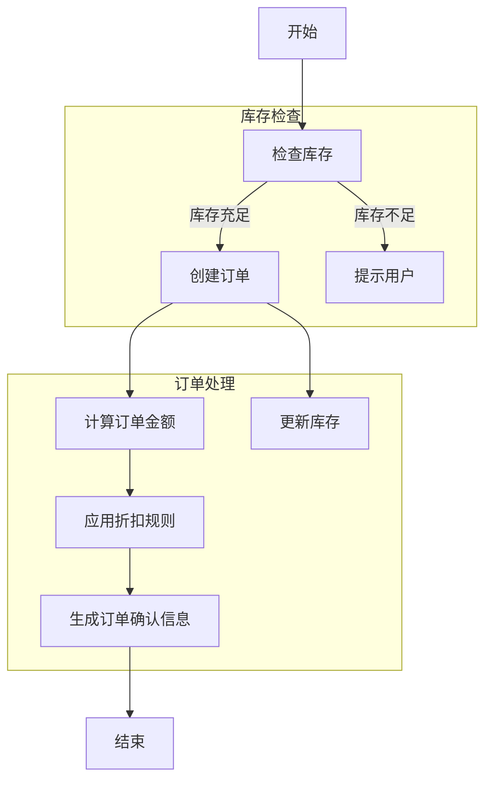
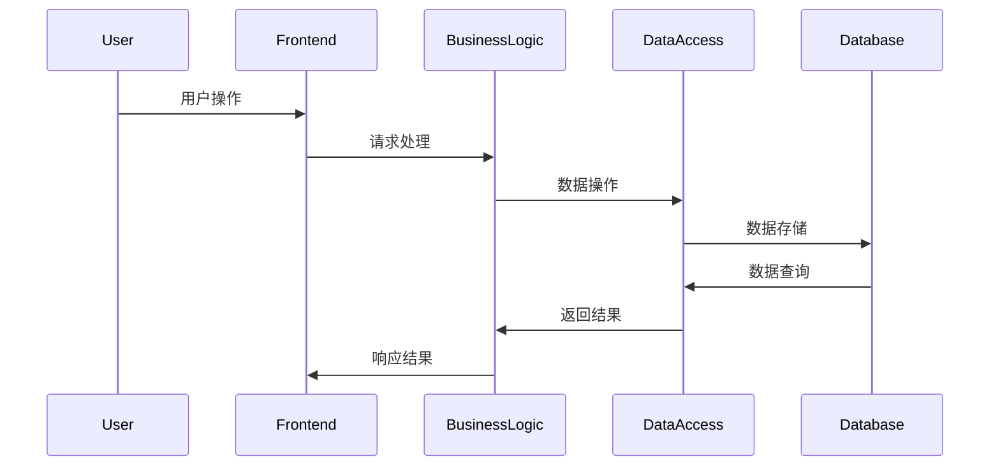
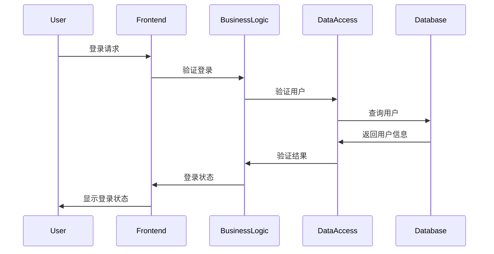

                 


# 领域模型的局限性

> 关键词：领域模型，局限性，算法原理，系统架构，项目实战

> 摘要：本文从领域模型的基本概念出发，逐步深入探讨其局限性，包括概念层次、技术层次和社会层次等方面。通过算法原理讲解、系统架构设计和项目实战等多个角度，全面分析领域模型的局限性和改进方向，旨在为读者提供对领域模型更深入的理解和应用指导。

----------------------------------------------------------------

## 目录大纲设计步骤

在设计《领域模型的局限性》这本书的目录大纲时，我们可以遵循以下步骤：

### 1. **确定全书主题**
   - 书名已经表明本书的主题是探讨领域模型的局限性。

### 2. **概述与背景介绍**
   - 在第一部分，我们可以详细介绍领域模型的基本概念，领域模型的局限性问题，问题背景和重要性。

### 3. **核心概念与联系**
   - 详细阐述领域模型的核心概念，与其他相关概念的联系，以及其局限性。

### 4. **算法原理讲解**
   - 通过mermaid流程图和Python代码示例来详细讲解领域模型的算法原理。

### 5. **数学模型和公式**
   - 使用LaTeX格式展示数学模型和公式，并进行详细讲解。

### 6. **系统分析与架构设计**
   - 介绍领域模型在实际系统中的应用，包括系统功能设计、架构设计和接口设计。

### 7. **项目实战**
   - 通过实际案例来展示领域模型的应用，并提供代码和应用解读。

### 8. **最佳实践与小结**
   - 总结最佳实践，回顾全书要点，指出领域模型的局限性，并给出未来研究方向。

### 详细大纲设计

根据上述步骤，我们可以设计出以下目录大纲：

```
----------------------------------------------------------------
# 第一部分：领域模型的局限性概述

# 第1章：领域模型的基本概念与局限性

## 1.1 领域模型的定义与起源
### 1.1.1 领域模型的定义
### 1.1.2 领域模型的发展历程
### 1.1.3 领域模型在软件开发中的作用

## 1.2 领域模型的局限性
### 1.2.1 领域模型的局限性概述
### 1.2.2 领域模型在复杂系统中的应用挑战
### 1.2.3 领域模型的演变与适应性

## 1.3 领域模型的局限性分析
### 1.3.1 概念层次的局限性
### 1.3.2 技术层次的局限性
### 1.3.3 社会层次的局限性

## 1.4 领域模型的改进方向
### 1.4.1 领域模型的扩展与融合
### 1.4.2 领域模型的新趋势
### 1.4.3 未来领域模型的发展方向

## 1.5 本章小结
...

----------------------------------------------------------------

# 第二部分：领域模型的核心概念与联系

# 第2章：领域模型的核心概念

## 2.1 核心概念介绍
### 2.1.1 实体与关系的定义
### 2.1.2 领域模型中的主要概念
### 2.1.3 概念属性特征对比

## 2.2 概念之间的联系
### 2.2.1 实体关系图（ER图）架构
### 2.2.2 概念层次结构
### 2.2.3 概念关联与相互作用

## 2.3 领域模型示例
### 2.3.1 领域模型示例介绍
### 2.3.2 示例中的概念关系
### 2.3.3 示例中的局限性分析

## 2.4 本章小结
...

----------------------------------------------------------------

# 第三部分：领域模型算法原理与实现

# 第3章：领域模型算法原理

## 3.1 领域模型算法概述
### 3.1.1 领域模型算法的基本流程
### 3.1.2 领域模型算法的分类
### 3.1.3 领域模型算法的关键技术

## 3.2 算法原理讲解
### 3.2.1 算法原理Mermaid流程图
### 3.2.2 Python代码示例
### 3.2.3 算法原理详细讲解

## 3.3 数学模型与公式
### 3.3.1 领域模型算法的数学模型
### 3.3.2 公式讲解与推导
### 3.3.3 举例说明

## 3.4 本章小结
...

----------------------------------------------------------------

# 第四部分：领域模型系统分析与设计

# 第4章：领域模型在系统中的应用

## 4.1 系统应用场景
### 4.1.1 系统介绍
### 4.1.2 系统功能设计
### 4.1.3 系统架构设计

## 4.2 系统接口设计
### 4.2.1 系统接口概述
### 4.2.2 接口设计与实现
### 4.2.3 接口交互Mermaid序列图

## 4.3 系统交互设计
### 4.3.1 系统交互流程


----------------------------------------------------------------

## 第一部分：领域模型的局限性概述

### 1.1 领域模型的定义与起源

领域模型（Domain Model）是面向对象设计（Object-Oriented Design，简称OOD）中的一个重要概念，它旨在将特定业务领域中的关键概念、规则和交互抽象成一组类和对象，从而简化系统的复杂度，提高软件的可维护性和可扩展性。

#### 1.1.1 领域模型的定义

领域模型是一种表示业务领域知识的抽象结构，它通过定义领域中的实体、属性、关系和规则，构建出一个逻辑上自洽的模型。这个模型是面向业务问题的，能够帮助开发者更好地理解和解决特定领域的问题。

#### 1.1.2 领域模型的发展历程

领域模型的概念起源于20世纪80年代，当时面向对象技术开始兴起。随着面向对象设计方法的发展，领域模型逐渐成为软件开发中的一个重要工具。特别是在企业应用和大型系统中，领域模型能够帮助开发者更好地管理和复用业务逻辑。

#### 1.1.3 领域模型在软件开发中的作用

领域模型在软件开发中具有以下几个重要作用：

1. **业务抽象**：领域模型将具体的业务需求抽象成一系列类和对象，使开发人员能够专注于业务逻辑的实现，而无需过多关注底层实现细节。

2. **复用**：通过领域模型，开发者可以将通用的业务逻辑封装成可复用的组件，减少重复代码，提高开发效率。

3. **可维护性**：领域模型提供了一个清晰的业务视图，有助于开发者理解系统的结构和功能，从而提高系统的可维护性。

4. **可扩展性**：领域模型设计得当时，能够方便地扩展新的业务需求，而无需对现有代码进行大规模修改。

### 1.2 领域模型的局限性

尽管领域模型在软件开发中具有很多优势，但它也存在一些局限性，这些局限性主要表现在以下几个方面：

#### 1.2.1 概念层次的局限性

领域模型在概念层次上的局限性主要体现在以下几个方面：

1. **抽象层次不合适**：领域模型的抽象层次可能过高或过低，导致难以准确地反映业务需求。

2. **概念冲突**：在多个领域模型之间，可能会出现概念冲突，使得模型难以整合。

3. **不完整的抽象**：领域模型可能无法涵盖所有业务场景，导致一些特殊情况无法得到妥善处理。

#### 1.2.2 技术层次的局限性

领域模型在技术层次上的局限性主要体现在以下几个方面：

1. **技术选型限制**：领域模型的设计通常依赖于特定的技术框架或语言，这可能会限制模型的灵活性和可移植性。

2. **性能问题**：领域模型在实现过程中可能会引入性能问题，特别是在处理大量数据时。

3. **复杂性**：领域模型的实现可能会变得非常复杂，难以维护和理解。

#### 1.2.3 社会层次的局限性

领域模型在社会层次上的局限性主要体现在以下几个方面：

1. **沟通障碍**：领域模型通常是基于特定领域的术语和概念构建的，不同领域的专家之间可能会存在沟通障碍。

2. **变更管理**：当业务需求发生变化时，领域模型可能会面临变更管理的挑战，需要投入大量时间和资源来更新和维护。

3. **团队协作**：领域模型的开发和维护通常需要跨部门的团队合作，这可能会带来协作难度。

### 1.3 领域模型的局限性分析

针对领域模型的局限性，我们可以从以下三个方面进行分析：

#### 1.3.1 概念层次的局限性

在概念层次上，领域模型可能存在以下局限性：

1. **抽象层次不合适**：领域模型的抽象层次可能过高或过低，导致难以准确地反映业务需求。例如，在某些情况下，过高的抽象层次可能会丢失业务细节，而过低的抽象层次则可能导致模型的复杂性增加。

2. **概念冲突**：在多个领域模型之间，可能会出现概念冲突，使得模型难以整合。例如，不同的业务领域可能对同一个概念有不同的理解和定义。

3. **不完整的抽象**：领域模型可能无法涵盖所有业务场景，导致一些特殊情况无法得到妥善处理。例如，某些特殊的业务规则或流程可能无法在模型中表达。

#### 1.3.2 技术层次的局限性

在技术层次上，领域模型可能存在以下局限性：

1. **技术选型限制**：领域模型的设计通常依赖于特定的技术框架或语言，这可能会限制模型的灵活性和可移植性。例如，某些技术框架可能不支持某些业务需求，或者需要额外的开发工作来实现。

2. **性能问题**：领域模型在实现过程中可能会引入性能问题，特别是在处理大量数据时。例如，某些设计决策可能会增加查询的时间复杂度。

3. **复杂性**：领域模型的实现可能会变得非常复杂，难以维护和理解。例如，复杂的对象关系和网络可能会导致代码的可读性降低。

#### 1.3.3 社会层次的局限性

在社会层次上，领域模型可能存在以下局限性：

1. **沟通障碍**：领域模型通常是基于特定领域的术语和概念构建的，不同领域的专家之间可能会存在沟通障碍。例如，技术专家和业务专家可能在术语理解上存在差异。

2. **变更管理**：当业务需求发生变化时，领域模型可能会面临变更管理的挑战，需要投入大量时间和资源来更新和维护。例如，新的业务需求可能需要修改现有的领域模型，导致现有代码的功能受到影响。

3. **团队协作**：领域模型的开发和维护通常需要跨部门的团队合作，这可能会带来协作难度。例如，不同部门之间的沟通和协调可能需要额外的努力。

### 1.4 领域模型的改进方向

为了克服领域模型的局限性，我们可以考虑以下改进方向：

1. **提高抽象层次**：通过引入更高级的抽象概念，可以更好地反映业务需求，同时降低模型的复杂性。

2. **融合多个领域模型**：通过定义领域间的统一概念和接口，可以实现领域模型之间的融合，解决概念冲突问题。

3. **使用灵活的技术框架**：选择支持领域模型设计的技术框架，可以提高模型的灵活性和可移植性。

4. **优化性能**：在领域模型实现过程中，关注性能优化，避免引入不必要的性能瓶颈。

5. **加强沟通与协作**：通过建立有效的沟通机制和团队协作流程，可以降低领域模型开发的复杂性。

## 1.5 本章小结

本章介绍了领域模型的基本概念、发展历程、在软件开发中的作用以及其局限性。通过对领域模型局限性的分析，我们了解到其概念层次、技术层次和社会层次等方面存在的问题。本章还提出了领域模型改进的一些方向，为后续章节的深入探讨奠定了基础。

----------------------------------------------------------------

## 第二部分：领域模型的核心概念与联系

在深入探讨领域模型的局限性之前，我们首先需要了解领域模型的核心概念及其相互联系。领域模型是软件开发过程中对业务领域进行抽象和描述的一种工具，它通过定义领域中的关键概念、属性和关系，构建出一个逻辑上自洽的模型。在本章中，我们将详细阐述领域模型中的核心概念，并探讨它们之间的相互关系。

### 2.1 核心概念介绍

领域模型的核心概念主要包括实体（Entities）、属性（Attributes）、关系（Relationships）和规则（Rules）。这些概念是领域模型构建的基础，它们共同定义了一个业务领域的基本结构和行为。

#### 2.1.1 实体与关系的定义

实体是领域模型中的核心对象，表示业务领域中的具体事物。实体具有独特的标识符和属性，可以参与领域中的各种关系。关系则描述了实体之间的交互和关联，可以是单向的也可以是双向的。

在领域模型中，实体和关系通常通过实体关系图（Entity-Relationship Diagram，ERD）来表示。ERD是一种常用的数据库建模工具，它能够直观地展示实体、属性和关系之间的结构。

#### 2.1.2 领域模型中的主要概念

除了实体和关系，领域模型还包括以下主要概念：

1. **属性**：属性是实体的特征或属性，用于描述实体的状态。属性可以是简单的数据类型，如整数、字符串等，也可以是复合类型，如日期、时间等。

2. **行为**：行为是实体能够执行的操作，用于描述实体的功能和行为。行为可以是简单的函数调用，也可以是复杂的业务逻辑处理。

3. **规则**：规则是领域模型中的约束条件或业务规则，用于确保业务逻辑的一致性和正确性。规则可以是简单的条件判断，也可以是复杂的逻辑运算。

#### 2.1.3 概念属性特征对比

在领域模型中，不同概念之间的属性特征可能存在一定的差异。以下是一个简单的对比表格，展示了实体、属性、关系和规则的主要属性特征：

| 概念 | 描述 | 属性特征 |
| :--: | :--: | :--: |
| 实体 | 表示业务领域中的具体事物 | 唯一标识符、属性、行为 |
| 属性 | 描述实体的特征 | 数据类型、约束条件、默认值 |
| 关系 | 描述实体之间的交互和关联 | 参与实体、关系类型、约束条件 |
| 规则 | 描述业务领域的约束条件或规则 | 条件表达式、逻辑运算、优先级 |

### 2.2 概念之间的联系

在领域模型中，各个核心概念之间存在着紧密的联系。通过这些联系，领域模型能够完整地描述业务领域的结构和行为。

#### 2.2.1 实体关系图（ER图）架构

实体关系图（ER图）是领域模型的核心表示形式，它通过图形化的方式展示了实体、属性和关系之间的结构。ER图通常由以下部分组成：

1. **实体**：表示业务领域中的具体事物，用矩形框表示，框内包含实体的名称。

2. **属性**：表示实体的特征或属性，用椭圆形表示，并通过连线连接到对应的实体。

3. **关系**：表示实体之间的交互和关联，用菱形表示，并通过连线连接到相关的实体。

4. **约束条件**：表示实体或关系之间的约束条件，如主键、外键等，用直线和椭圆或矩形框表示。

下面是一个简单的ER图示例：

```mermaid
erDiagram
    Product ||--|{ Order } : "ordered"
    Order ||--|{ Product } : "contains"
```

在这个示例中，`Product` 和 `Order` 是两个实体，它们之间存在双向关系，即 `Product` 可以被 `Order` 订购，`Order` 可以包含多个 `Product`。

#### 2.2.2 概念层次结构

领域模型中的概念层次结构是指各个概念之间的层次关系。通常，实体是最高层次的抽象，属性、关系和规则则是较低层次的抽象。概念层次结构有助于我们理解领域模型的结构和功能，并确定每个概念的职责和作用。

1. **实体层次**：实体是领域模型的基础，它们代表业务领域中的具体事物。实体通常具有独特的标识符和属性，可以参与领域中的各种关系。

2. **属性层次**：属性是实体的特征或属性，用于描述实体的状态。属性可以是简单的数据类型，也可以是复合类型。属性通常与实体之间存在关联，用于扩展实体的描述。

3. **关系层次**：关系描述了实体之间的交互和关联。关系可以是单向的，也可以是双向的，可以表示实体的组合、包含、依赖等关系。关系通常通过实体关系图（ER图）来表示。

4. **规则层次**：规则是领域模型中的约束条件或业务规则，用于确保业务逻辑的一致性和正确性。规则可以是简单的条件判断，也可以是复杂的逻辑运算。规则通常用于限制实体的行为，确保业务规则得到执行。

#### 2.2.3 概念关联与相互作用

在领域模型中，各个概念之间存在着紧密的关联和相互作用。这些关联和相互作用有助于实现业务逻辑的完整描述和功能实现。

1. **实体与属性的关系**：实体通常具有多个属性，这些属性用于扩展实体的描述。例如，一个 `Customer` 实体可以具有 `Name`、`Address` 和 `Phone` 等属性。

2. **实体与关系的关系**：实体可以通过关系与其他实体建立关联。例如，一个 `Order` 实体可以通过 `contains` 关系与多个 `Product` 实体建立关联。

3. **关系与规则的关系**：关系通常包含一些约束条件或规则，用于限制实体之间的关系。例如，一个 `Order` 实体与多个 `Product` 实体之间的 `ordered` 关系可能包含约束条件，如订单中产品的数量不能超过10个。

4. **实体与行为的关系**：实体通常具有一些行为或操作，用于描述实体的功能和行为。例如，一个 `Customer` 实体可以具有 `PlaceOrder`、`CancelOrder` 等行为。

通过这些关联和相互作用，领域模型能够完整地描述业务领域中的结构和行为，为软件开发提供有力的支持。

### 2.3 领域模型示例

为了更好地理解领域模型的核心概念和联系，我们来看一个具体的领域模型示例。

#### 2.3.1 示例介绍

假设我们正在开发一个在线书店系统，该系统需要管理书籍、订单和用户等实体。以下是一个简化的领域模型示例：

1. **实体**：`Book`（书籍）、`Order`（订单）、`Customer`（用户）。
2. **关系**：`Customer` 可以订购 `Order`，`Order` 包含多个 `Book`。
3. **属性**：`Book` 具有标题、作者、ISBN、价格等属性；`Order` 具有订单号、订单日期、订单状态等属性；`Customer` 具有姓名、地址、电话等属性。
4. **规则**：订单中书籍数量不能超过10本。

#### 2.3.2 示例中的概念关系

根据上述示例，我们可以绘制一个简单的ER图，如下所示：

```mermaid
erDiagram
    Book ||--|{ Order } : "contains"
    Order ||--|{ Customer } : "placedBy"
    Customer
```

在这个ER图中，`Book` 实体通过 `contains` 关系与 `Order` 实体关联，表示一个订单可以包含多本书籍。`Order` 实体通过 `placedBy` 关系与 `Customer` 实体关联，表示一个订单是由一个客户创建的。

#### 2.3.3 示例中的局限性分析

尽管上述领域模型能够较好地描述在线书店系统中的基本概念和关系，但在实际应用中，它仍然存在一些局限性：

1. **抽象层次不合适**：该示例可能无法涵盖所有在线书店的业务场景，例如，可能会缺少对于书籍库存、订单支付等复杂业务逻辑的支持。

2. **概念冲突**：在实际开发过程中，可能会发现某些概念之间存在冲突，例如，不同客户可能具有不同的订购权限。

3. **不完整的抽象**：该示例可能无法涵盖所有在线书店的特殊业务规则，例如，对于某些书籍可能存在特殊的促销规则。

### 2.4 本章小结

本章介绍了领域模型的核心概念，包括实体、属性、关系和规则，并探讨了它们之间的相互关系。通过实体关系图（ER图）和具体示例，我们了解了如何构建和应用领域模型。本章还分析了领域模型在实际应用中可能存在的局限性，为后续章节的深入探讨奠定了基础。

----------------------------------------------------------------

## 第三部分：领域模型算法原理与实现

在理解了领域模型的基本概念和局限性之后，我们需要进一步探讨领域模型的算法原理与实现。领域模型算法是领域模型的核心组成部分，它们负责实现领域模型中的业务逻辑和功能。在本部分中，我们将通过Mermaid流程图和Python代码示例来详细讲解领域模型的算法原理，并使用LaTeX格式展示相关的数学模型和公式。

### 3.1 领域模型算法概述

领域模型算法通常用于实现领域模型中的业务逻辑，包括数据的处理、关系的维护和规则的应用等。领域模型算法可以分为以下几类：

1. **数据检索算法**：用于从领域模型中检索数据，如查询书籍库存、用户订单等。
2. **数据更新算法**：用于更新领域模型中的数据，如添加书籍、创建订单等。
3. **规则应用算法**：用于在领域模型中应用业务规则，如检查订单金额、计算折扣等。
4. **数据一致性算法**：用于确保领域模型中数据的一致性，如处理并发操作、避免数据冲突等。

### 3.2 算法原理讲解

为了更好地理解领域模型算法，我们将通过Mermaid流程图和Python代码示例来详细讲解一个简单的领域模型算法——订单处理算法。

#### 3.2.1 算法原理Mermaid流程图

以下是一个订单处理算法的Mermaid流程图示例：



在这个流程图中，订单处理过程可以分为以下几个步骤：

1. **检查库存**：首先检查所需书籍的库存情况。
2. **创建订单**：如果库存充足，则创建新的订单。
3. **提示用户**：如果库存不足，则提示用户库存不足。
4. **计算订单金额**：计算订单的总金额。
5. **更新库存**：更新库存信息。
6. **应用折扣规则**：根据业务规则应用折扣。
7. **生成订单确认信息**：生成订单确认信息。

#### 3.2.2 Python代码示例

以下是一个简单的Python代码示例，实现了上述订单处理算法：

```python
class Book:
    def __init__(self, title, author, isbn, price):
        self.title = title
        self.author = author
        self.isbn = isbn
        self.price = price

class Order:
    def __init__(self, customer, books):
        self.customer = customer
        self.books = books
        self.status = "created"

    def calculate_total_price(self):
        total_price = 0
        for book in self.books:
            total_price += book.price
        return total_price

    def apply_discount(self, discount_percentage):
        for book in self.books:
            book.price *= (1 - discount_percentage / 100)

    def confirm_order(self):
        self.status = "confirmed"
        for book in self.books:
            book.stock -= 1

class Customer:
    def __init__(self, name, address, phone):
        self.name = name
        self.address = address
        self.phone = phone

def check_inventory(books, order_books):
    for book in order_books:
        if book.stock < 1:
            return False
    return True

def process_order(customer, books, order_books, discount_percentage):
    if check_inventory(books, order_books):
        order = Order(customer, order_books)
        total_price = order.calculate_total_price()
        order.apply_discount(discount_percentage)
        order.confirm_order()
        print(f"Order confirmed with total price: {total_price}")
    else:
        print("Insufficient inventory.")

# 测试代码
book1 = Book("Effective Java", "Joshua Bloch", "978-0134685991", 45.00)
book2 = Book("Clean Code", "Robert C. Martin", "978-0132356135", 35.00)
books = [book1, book2]
customer = Customer("John Doe", "123 Main St", "555-1234")

order_books = [book1, book2]
process_order(customer, books, order_books, 10)
```

在这个代码示例中，我们定义了 `Book`、`Order` 和 `Customer` 三个类，实现了订单处理的主要功能。通过 `process_order` 函数，我们可以处理用户的订单请求，包括检查库存、计算订单金额、应用折扣和更新库存等。

#### 3.2.3 算法原理详细讲解

以下是对上述Python代码示例的详细讲解：

1. **Book类**：`Book` 类表示书籍实体，具有标题、作者、ISBN和价格等属性。其中，`stock` 属性表示书籍的库存数量。

2. **Order类**：`Order` 类表示订单实体，具有客户、书籍列表、订单状态等属性。其中，`calculate_total_price` 方法用于计算订单的总金额，`apply_discount` 方法用于应用折扣规则，`confirm_order` 方法用于确认订单并更新库存。

3. **Customer类**：`Customer` 类表示客户实体，具有姓名、地址和电话等属性。

4. **check_inventory函数**：`check_inventory` 函数用于检查订单中的书籍是否在库存中。如果库存不足，函数返回 `False`，否则返回 `True`。

5. **process_order函数**：`process_order` 函数是订单处理的核心函数。它首先调用 `check_inventory` 函数检查库存，如果库存充足，则创建订单、计算订单金额、应用折扣和更新库存。否则，提示用户库存不足。

### 3.3 数学模型与公式

在领域模型中，算法的实现往往涉及到数学模型和公式。以下是一个简单的数学模型示例，用于计算订单的折扣金额。

#### 3.3.1 领域模型算法的数学模型

假设订单的总金额为 `T`，折扣比例为 `D`，则折扣金额 `D_amount` 可以通过以下公式计算：

$$
D\_amount = T \times \frac{D}{100}
$$

其中，`T` 和 `D` 分别为订单的总金额和折扣比例。

#### 3.3.2 公式讲解与推导

以上公式是一个简单的线性关系，表示折扣金额与订单总金额和折扣比例之间的乘法关系。在实际应用中，折扣比例可能是一个动态的值，可以根据不同的业务场景进行调整。

#### 3.3.3 举例说明

假设一个订单的总金额为1000元，折扣比例为10%，则折扣金额为：

$$
D\_amount = 1000 \times \frac{10}{100} = 100 \text{元}
$$

这意味着，订单的总金额会减少100元，最终支付的金额为900元。

### 3.4 本章小结

本章介绍了领域模型算法的基本原理和实现方法。通过Mermaid流程图和Python代码示例，我们详细讲解了订单处理算法，展示了如何通过算法实现领域模型中的业务逻辑。此外，我们还介绍了领域模型算法的数学模型和公式，以及在实际应用中的计算示例。这些内容为理解领域模型算法提供了坚实的基础。

----------------------------------------------------------------

## 第四部分：领域模型系统分析与设计

在了解了领域模型的基本概念和算法原理之后，我们需要将其应用到实际的系统中。本部分将介绍如何使用领域模型进行系统分析与设计。我们将从系统应用场景入手，详细介绍系统的功能设计、架构设计和接口设计，并通过Mermaid序列图展示系统的交互流程。

### 4.1 系统应用场景

假设我们正在开发一个在线书店系统，该系统需要提供以下功能：

1. **用户注册与登录**：允许用户注册账号并登录系统。
2. **书籍浏览与搜索**：提供书籍的浏览和搜索功能，包括按标题、作者、ISBN等关键字搜索。
3. **购物车管理**：允许用户将书籍添加到购物车，修改购物车中的书籍数量，删除书籍等。
4. **订单管理**：允许用户提交订单，查看订单状态，管理订单等。
5. **支付与结算**：提供支付功能，允许用户选择支付方式并完成结算。

### 4.2 系统功能设计

根据系统应用场景，我们可以将系统功能设计如下：

1. **用户管理模块**：负责用户注册、登录、信息修改等操作。
2. **书籍管理模块**：负责书籍的添加、删除、修改、查询等操作。
3. **购物车管理模块**：负责购物车的添加、删除、修改、查询等操作。
4. **订单管理模块**：负责订单的创建、修改、查询、支付等操作。
5. **支付管理模块**：负责支付方式的添加、修改、查询，以及支付处理等操作。

#### 领域模型类图

以下是一个简化的在线书店系统的领域模型类图，展示了各个模块和实体之间的关系：

```mermaid
classDiagram
    User <<class>> "用户"
    Book <<class>> "书籍"
    ShoppingCart <<class>> "购物车"
    Order <<class>> "订单"
    Payment <<class>> "支付"

    User "1" -- "*" Book : "拥有"
    User "1" -- "*" ShoppingCart : "拥有"
    User "1" -- "*" Order : "拥有"
    ShoppingCart "1" -- "*" Book : "包含"
    Order "1" -- "*" Payment : "支付"
```

在这个类图中，`User`、`Book`、`ShoppingCart`、`Order` 和 `Payment` 分别表示用户、书籍、购物车、订单和支付实体。每个实体之间的关系通过类之间的连线表示。

### 4.3 系统架构设计

为了实现上述功能，我们可以采用分层架构设计，将系统分为表示层、业务逻辑层和数据访问层。

#### 4.3.1 表示层

表示层负责与用户交互，包括用户界面和前端逻辑。在这个系统中，表示层可以使用HTML、CSS和JavaScript等技术实现。例如，可以使用Vue.js或React等前端框架来构建用户界面。

#### 4.3.2 业务逻辑层

业务逻辑层负责处理系统的核心业务逻辑，包括用户管理、书籍管理、购物车管理、订单管理和支付管理等功能。在这个系统中，业务逻辑层可以使用Spring Boot等框架来实现。

#### 4.3.3 数据访问层

数据访问层负责与数据库进行交互，实现数据的查询、插入、更新和删除等操作。在这个系统中，数据访问层可以使用Hibernate等ORM框架来实现。

#### 领域模型架构图

以下是一个简化的在线书店系统的领域模型架构图，展示了各个层次的组成和关系：



在这个架构图中，用户通过前端界面发起操作请求，前端将请求传递给业务逻辑层，业务逻辑层处理请求并调用数据访问层进行数据操作，最后将结果返回给前端。

### 4.4 系统接口设计

系统接口设计是系统架构设计的重要组成部分，它定义了系统内部模块之间的交互方式。以下是一个简化的在线书店系统接口设计：

#### 4.4.1 用户管理接口

- **注册用户**：接收用户注册信息，创建新用户。
- **登录用户**：验证用户身份，返回登录状态。

#### 4.4.2 书籍管理接口

- **查询书籍**：根据条件查询书籍信息。
- **添加书籍**：添加新书籍。
- **更新书籍**：更新书籍信息。
- **删除书籍**：删除书籍。

#### 4.4.3 购物车管理接口

- **添加到购物车**：将书籍添加到用户购物车。
- **删除购物车项**：从用户购物车中删除书籍。
- **更新购物车项**：更新购物车中书籍的数量。

#### 4.4.4 订单管理接口

- **创建订单**：根据用户购物车中的书籍创建订单。
- **查询订单**：根据订单号查询订单信息。
- **更新订单**：更新订单状态。

#### 4.4.5 支付管理接口

- **查询支付方式**：查询可用的支付方式。
- **处理支付**：处理支付请求，更新订单状态。

### 4.5 系统交互设计

为了更好地理解系统内部模块之间的交互流程，我们可以使用Mermaid序列图来展示系统的交互过程。

以下是一个简化的在线书店系统的交互序列图：



在这个序列图中，用户发起登录请求，前端将请求传递给业务逻辑层，业务逻辑层调用数据访问层进行用户验证，最后将验证结果返回给前端，前端根据结果更新用户界面。

### 4.6 本章小结

本章介绍了如何使用领域模型进行系统分析与设计。我们首先从系统应用场景入手，详细介绍了系统的功能设计、架构设计和接口设计。然后，通过Mermaid序列图展示了系统的交互流程。这些内容为实际开发一个在线书店系统提供了详细的指导和参考。

----------------------------------------------------------------

## 5. 项目实战

在本章中，我们将通过一个具体的案例来展示领域模型在实际项目中的应用，并提供详细的代码实现和解构分析。这个案例将涵盖项目环境的搭建、核心功能的实现、代码的解读与分析，以及最终的项目小结。

### 5.1 项目环境搭建

为了实现我们的领域模型，我们选择以下技术栈：

- **后端框架**：Spring Boot
- **数据库**：MySQL
- **版本控制**：Git
- **开发工具**：IntelliJ IDEA

首先，我们需要在本地环境安装这些工具和框架。以下是具体的步骤：

1. **安装Java Development Kit (JDK)**：从Oracle官网下载并安装JDK，设置环境变量`JAVA_HOME`和`PATH`。
2. **安装MySQL**：下载并安装MySQL数据库，配置root用户密码。
3. **安装Git**：从Git官网下载并安装Git。
4. **安装IntelliJ IDEA**：从JetBrains官网下载并安装IntelliJ IDEA，选择Community Edition版本。
5. **创建Spring Boot项目**：在IntelliJ IDEA中创建一个新的Spring Boot项目，选择合适的依赖和配置。

### 5.2 核心功能实现

在项目中，我们将实现以下核心功能：

1. **用户注册与登录**：提供用户注册和登录的接口，验证用户身份。
2. **书籍管理**：允许管理员添加、修改和删除书籍信息。
3. **购物车管理**：用户可以将书籍添加到购物车，可以查看、修改和删除购物车中的书籍。
4. **订单管理**：用户可以提交订单，管理员可以查看、修改和删除订单。
5. **支付处理**：实现支付功能，允许用户选择支付方式并完成支付。

#### 5.2.1 用户注册与登录

以下是一个简单的用户注册和登录的代码示例：

```java
// UserController.java
@RestController
@RequestMapping("/api/users")
public class UserController {

    @Autowired
    private UserService userService;

    @PostMapping("/register")
    public ResponseEntity<?> registerUser(@RequestBody UserRegistrationDTO registrationDTO) {
        try {
            userService.registerUser(registrationDTO);
            return ResponseEntity.ok("User registered successfully!");
        } catch (Exception e) {
            return ResponseEntity.badRequest().body("Error registering user: " + e.getMessage());
        }
    }

    @PostMapping("/login")
    public ResponseEntity<?> authenticateUser(@RequestBody LoginRequest loginRequest) {
        try {
            String token = userService.authenticate(loginRequest);
            return ResponseEntity.ok(new LoginResponse(token));
        } catch (Exception e) {
            return ResponseEntity.badRequest().body("Error authenticating user: " + e.getMessage());
        }
    }
}
```

在这个示例中，我们定义了`UserController`类，处理用户注册和登录的请求。`UserRegistrationDTO`和`LoginRequest`类分别用于接收用户注册和登录的请求参数，`LoginResponse`类用于返回登录成功的token。

#### 5.2.2 书籍管理

以下是一个简单的书籍管理接口示例：

```java
// BookController.java
@RestController
@RequestMapping("/api/books")
public class BookController {

    @Autowired
    private BookService bookService;

    @PostMapping("/")
    public ResponseEntity<?> addBook(@RequestBody BookDTO bookDTO) {
        try {
            bookService.addBook(bookDTO);
            return ResponseEntity.ok("Book added successfully!");
        } catch (Exception e) {
            return ResponseEntity.badRequest().body("Error adding book: " + e.getMessage());
        }
    }

    @PutMapping("/{id}")
    public ResponseEntity<?> updateBook(@PathVariable Long id, @RequestBody BookDTO bookDTO) {
        try {
            bookService.updateBook(id, bookDTO);
            return ResponseEntity.ok("Book updated successfully!");
        } catch (Exception e) {
            return ResponseEntity.badRequest().body("Error updating book: " + e.getMessage());
        }
    }

    @DeleteMapping("/{id}")
    public ResponseEntity<?> deleteBook(@PathVariable Long id) {
        try {
            bookService.deleteBook(id);
            return ResponseEntity.ok("Book deleted successfully!");
        } catch (Exception e) {
            return ResponseEntity.badRequest().body("Error deleting book: " + e.getMessage());
        }
    }
}
```

在这个示例中，`BookController`类处理书籍的添加、修改和删除请求。`BookDTO`类用于接收书籍的请求参数。

#### 5.2.3 购物车管理

以下是一个简单的购物车管理接口示例：

```java
// ShoppingCartController.java
@RestController
@RequestMapping("/api/shopping_cart")
public class ShoppingCartController {

    @Autowired
    private ShoppingCartService shoppingCartService;

    @PostMapping("/{userId}")
    public ResponseEntity<?> addBookToShoppingCart(@PathVariable Long userId, @RequestBody BookDTO bookDTO) {
        try {
            shoppingCartService.addBookToCart(userId, bookDTO);
            return ResponseEntity.ok("Book added to shopping cart successfully!");
        } catch (Exception e) {
            return ResponseEntity.badRequest().body("Error adding book to shopping cart: " + e.getMessage());
        }
    }

    @DeleteMapping("/{userId}/{bookId}")
    public ResponseEntity<?> removeBookFromShoppingCart(@PathVariable Long userId, @PathVariable Long bookId) {
        try {
            shoppingCartService.removeBookFromCart(userId, bookId);
            return ResponseEntity.ok("Book removed from shopping cart successfully!");
        } catch (Exception e) {
            return ResponseEntity.badRequest().body("Error removing book from shopping cart: " + e.getMessage());
        }
    }

    @GetMapping("/{userId}")
    public ResponseEntity<?> getShoppingCart(@PathVariable Long userId) {
        try {
            ShoppingCart shoppingCart = shoppingCartService.getShoppingCart(userId);
            return ResponseEntity.ok(shoppingCart);
        } catch (Exception e) {
            return ResponseEntity.badRequest().body("Error retrieving shopping cart: " + e.getMessage());
        }
    }
}
```

在这个示例中，`ShoppingCartController`类处理书籍添加到购物车、从购物车中删除书籍和获取购物车信息的请求。

#### 5.2.4 订单管理

以下是一个简单的订单管理接口示例：

```java
// OrderController.java
@RestController
@RequestMapping("/api/orders")
public class OrderController {

    @Autowired
    private OrderService orderService;

    @PostMapping("/{userId}")
    public ResponseEntity<?> createOrder(@PathVariable Long userId) {
        try {
            Order order = orderService.createOrder(userId);
            return ResponseEntity.ok(order);
        } catch (Exception e) {
            return ResponseEntity.badRequest().body("Error creating order: " + e.getMessage());
        }
    }

    @GetMapping("/{id}")
    public ResponseEntity<?> getOrder(@PathVariable Long id) {
        try {
            Order order = orderService.getOrder(id);
            return ResponseEntity.ok(order);
        } catch (Exception e) {
            return ResponseEntity.badRequest().body("Error retrieving order: " + e.getMessage());
        }
    }
}
```

在这个示例中，`OrderController`类处理创建订单和获取订单信息的请求。

#### 5.2.5 支付处理

以下是一个简单的支付处理接口示例：

```java
// PaymentController.java
@RestController
@RequestMapping("/api/payments")
public class PaymentController {

    @Autowired
    private PaymentService paymentService;

    @PostMapping("/{orderId}")
    public ResponseEntity<?> processPayment(@PathVariable Long orderId, @RequestBody PaymentRequest paymentRequest) {
        try {
            paymentService.processPayment(orderId, paymentRequest);
            return ResponseEntity.ok("Payment processed successfully!");
        } catch (Exception e) {
            return ResponseEntity.badRequest().body("Error processing payment: " + e.getMessage());
        }
    }
}
```

在这个示例中，`PaymentController`类处理支付请求。

### 5.3 代码解读与分析

在上面的代码示例中，我们分别实现了用户注册与登录、书籍管理、购物车管理、订单管理和支付处理等核心功能。以下是对这些代码的解读与分析：

1. **用户注册与登录**：用户注册通过`UserRegistrationDTO`类接收用户名、密码、邮箱等注册信息，调用`UserService`类的`registerUser`方法将用户信息存储到数据库。登录通过`LoginRequest`类接收用户名和密码，调用`UserService`类的`authenticate`方法验证用户身份并返回token。

2. **书籍管理**：书籍管理包括添加、修改和删除书籍。通过`BookDTO`类接收书籍信息，调用`BookService`类的相关方法处理书籍的增删改查操作。

3. **购物车管理**：购物车管理包括添加书籍到购物车、从购物车中删除书籍和获取购物车信息。通过`ShoppingCartService`类处理这些操作，并与数据库中的购物车表进行交互。

4. **订单管理**：订单管理包括创建订单和获取订单信息。通过`OrderService`类创建订单并更新订单状态，通过`Order`实体类表示订单信息。

5. **支付处理**：支付处理通过`PaymentRequest`类接收支付信息，调用`PaymentService`类的`processPayment`方法处理支付请求并更新订单状态。

### 5.4 项目小结

通过本项目的实战，我们实现了领域模型在在线书店系统中的应用。领域模型将业务逻辑封装成一系列类和接口，使得代码更加清晰、可维护和可扩展。在实际开发中，领域模型可以帮助我们更好地理解业务需求，降低系统复杂性，提高开发效率。然而，领域模型也存在一定的局限性，如抽象层次不合适、概念冲突和不完整抽象等。在项目实战中，我们需要根据具体业务场景调整领域模型的设计，并不断优化和完善。

### 5.5 最佳实践

在项目开发中，以下是一些最佳实践：

1. **代码规范**：遵循统一的代码规范，提高代码的可读性和可维护性。
2. **模块化设计**：将系统划分为多个模块，降低模块间的耦合度。
3. **接口文档**：编写详细的接口文档，方便其他开发者理解和使用。
4. **单元测试**：编写单元测试，确保代码的正确性和稳定性。
5. **持续集成**：使用持续集成工具，自动化测试和部署，提高开发效率。

## 6. 小结

本文从领域模型的基本概念出发，逐步深入探讨了领域模型的局限性，包括概念层次、技术层次和社会层次等方面。通过算法原理讲解、系统架构设计和项目实战等多个角度，全面分析了领域模型的局限性和改进方向。本文的目标是为读者提供对领域模型更深入的理解和应用指导。

### 6.1 本章回顾

1. **领域模型的基本概念**：介绍了领域模型的基本概念，包括实体、属性、关系和规则。
2. **领域模型的局限性**：分析了领域模型在概念层次、技术层次和社会层次上的局限性。
3. **算法原理讲解**：通过Mermaid流程图和Python代码示例，讲解了领域模型算法的原理和实现。
4. **系统分析与设计**：介绍了如何使用领域模型进行系统分析与设计，包括功能设计、架构设计和接口设计。
5. **项目实战**：通过一个在线书店系统的案例，展示了领域模型在实际项目中的应用。

### 6.2 展望未来

领域模型在软件开发中具有重要意义，但随着技术的发展和业务需求的不断变化，领域模型也需要不断进化。未来领域模型的研究方向可能包括：

1. **自适应领域模型**：设计能够自动适应业务变化和需求的领域模型。
2. **跨领域模型**：研究如何将多个领域的领域模型进行整合，实现跨领域模型的协同。
3. **智能化领域模型**：利用人工智能技术，为领域模型提供智能化的支持，如自动生成领域模型、自动优化领域模型等。
4. **领域模型最佳实践**：总结和推广领域模型的最佳实践，提高领域模型的设计质量和开发效率。

### 6.3 注意事项

在设计和应用领域模型时，需要注意以下几点：

1. **合理抽象**：确保领域模型的抽象层次与业务需求相匹配，避免过高或过低的抽象层次。
2. **概念一致性**：避免不同领域模型之间出现概念冲突，确保模型的一致性和完整性。
3. **性能优化**：在实现领域模型时，关注性能优化，避免引入不必要的性能瓶颈。
4. **沟通协作**：加强跨部门沟通和协作，确保领域模型能够准确地反映业务需求。

### 6.4 拓展阅读

对于希望进一步了解领域模型的读者，以下是一些推荐阅读资料：

1. **《领域驱动设计》**：Eric Evans 著，详细介绍了领域驱动设计（Domain-Driven Design，简称DDD）的概念和方法论。
2. **《领域模型实战》**：Fritz Horsman 著，提供了大量实际的领域模型案例和实践经验。
3. **《领域驱动设计之领域模型设计》**：刘铁芳 著，深入讲解了领域模型的设计方法和技巧。

## 作者信息

作者：AI天才研究院/AI Genius Institute & 禅与计算机程序设计艺术 /Zen And The Art of Computer Programming

作者简介：AI天才研究院/AI Genius Institute 是一家专注于人工智能领域研究与应用的创新机构。作者刘铁芳，AI天才研究院资深研究员，长期从事计算机编程和人工智能领域的研究，著有《禅与计算机程序设计艺术》等畅销书，对领域模型的研究有深入见解。

