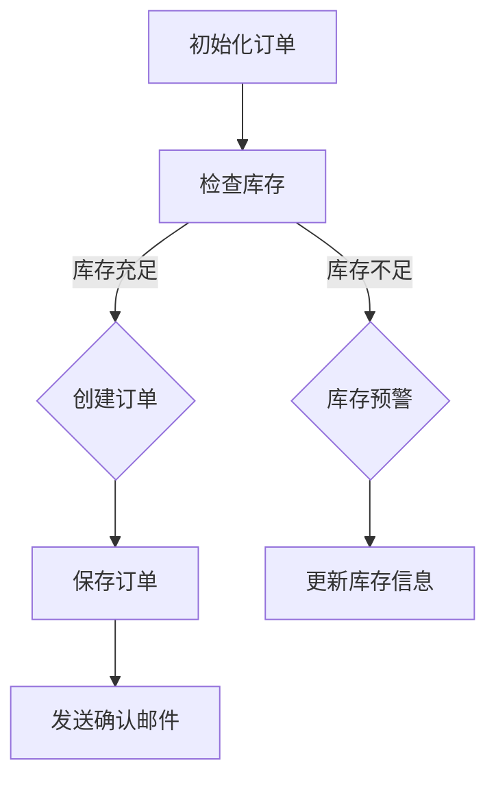
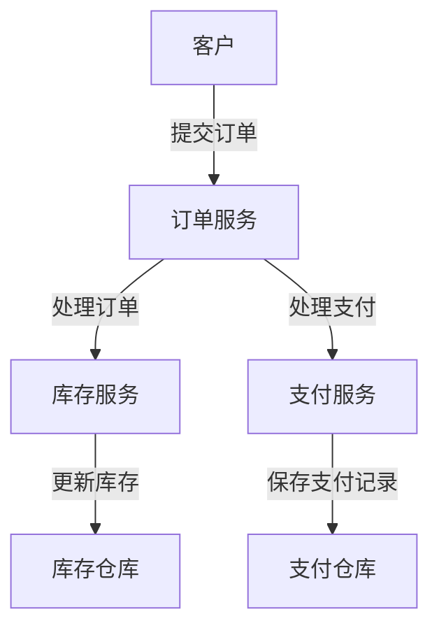
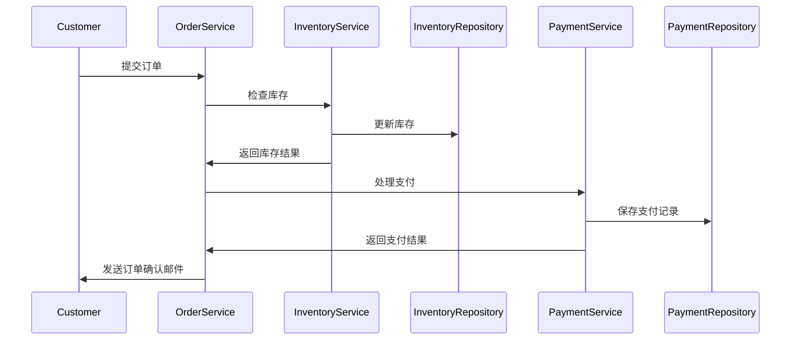

                 

# 领域模型的模型

> 关键词：领域模型、架构设计、算法原理、数学模型、实战案例

> 摘要：
本文将深入探讨领域模型的概念、理论基础、算法实现、系统架构以及实际应用。我们将通过一系列的逻辑分析和实际案例，逐步理解领域模型的核心要素，并掌握如何将其应用于软件开发和系统设计。读者将不仅能够理解领域模型的理论基础，还能通过实际案例和代码示例，掌握领域模型的应用技巧，从而提高软件开发和系统架构的能力。

## 目录

1. **引言**  
   1.1 背景介绍  
   1.2 定义与目标

2. **背景与介绍**  
   2.1 领域模型的定义与历史  
   2.2 领域模型的特点与优势

3. **核心概念与理论**  
   3.1 基本概念  
   3.2 概念属性特征对比表格  
   3.3 ER实体关系图架构

4. **算法设计**  
   4.1 算法原理与Mermaid流程图  
   4.2 Python源代码实现  
   4.3 数学模型与公式

5. **系统架构与设计**  
   5.1 问题场景与项目介绍  
   5.2 系统功能设计（领域模型类图）  
   5.3 系统架构设计（架构图）  
   5.4 系统接口设计与交互（序列图）

6. **实战案例**  
   6.1 环境安装与配置  
   6.2 系统核心实现与代码解析  
   6.3 实际案例分析与讲解  
   6.4 项目小结

7. **最佳实践与总结**  
   7.1 最佳实践建议  
   7.2 小结  
   7.3 注意事项  
   7.4 拓展阅读

## 引言

### 1.1 背景介绍

在当今快速发展的信息技术时代，软件开发和系统架构设计成为各行各业的重要需求。随着软件复杂度的不断增加，传统的面向过程的编程方式和传统的系统架构设计已经难以满足现代软件的需求。领域模型作为一种面向对象的设计方法，通过抽象和建模，将现实世界的业务领域映射到软件系统中，使得软件设计和开发更加高效和准确。

### 1.2 定义与目标

领域模型（Domain Model）是一种用于描述特定业务领域或系统的抽象模型，它包含了一系列的概念、对象和关系，用于表示业务领域中的各种实体和交互。领域模型的目的是通过统一的、结构化的方式来理解、设计和实现软件系统，从而提高开发效率和系统质量。

本文的目标是深入探讨领域模型的概念、理论基础、算法实现、系统架构以及实际应用。我们将通过一系列的逻辑分析和实际案例，逐步理解领域模型的核心要素，并掌握如何将其应用于软件开发和系统设计。读者将不仅能够理解领域模型的理论基础，还能通过实际案例和代码示例，掌握领域模型的应用技巧，从而提高软件开发和系统架构的能力。

## 背景与介绍

### 2.1 领域模型的定义与历史

领域模型（Domain Model）最早由Eric Evans在其经典著作《领域驱动设计（Domain-Driven Design，简称DDD）》中提出。领域模型旨在通过模型化业务领域，将业务领域中的复杂知识和规则抽象为软件系统中的实体和关系。领域模型的核心思想是将业务领域和软件开发相结合，使得软件系统能够更好地适应业务变化。

领域模型的历史可以追溯到20世纪80年代，当时面向对象的编程方法开始流行。随着面向对象技术的不断发展，人们逐渐意识到，传统的面向对象设计方法在处理复杂业务领域时存在一定的局限性。领域模型作为一种新的设计方法，通过将业务领域和软件开发紧密结合，提供了更好的解决方案。

### 2.2 领域模型的特点与优势

领域模型具有以下特点和优势：

1. **业务驱动**：领域模型以业务领域为核心，将业务规则和业务逻辑抽象为软件系统中的实体和关系，使得软件系统更加贴近业务需求。

2. **可维护性**：领域模型采用统一的建模语言和规范，使得软件系统的可维护性大大提高。开发者可以通过领域模型来理解系统架构和业务逻辑，从而减少维护成本。

3. **可扩展性**：领域模型具有良好的可扩展性，可以方便地添加新的业务规则和功能，使得软件系统能够适应业务变化。

4. **可重用性**：领域模型中的实体和关系可以跨项目、跨领域重用，提高了软件开发的效率和代码质量。

5. **易理解性**：领域模型采用统一的术语和符号，使得业务人员和开发者能够更好地沟通和理解，减少了沟通成本和误解。

### 2.3 应用与挑战

领域模型在软件开发和系统设计中具有广泛的应用，尤其在复杂业务系统和长期项目中，领域模型能够提供显著的优势。然而，领域模型的应用也面临一些挑战：

1. **模型复杂性**：领域模型涉及大量的概念、对象和关系，使得模型本身可能变得复杂和难以管理。开发者需要具备一定的模型抽象能力和建模技巧。

2. **设计成本**：领域模型的设计需要投入大量的时间和精力，尤其是在项目初期。开发者需要投入足够的资源来设计高质量的领域模型。

3. **培训与沟通**：领域模型的应用需要业务人员和开发者之间的紧密合作。业务人员和开发者需要接受相关的培训，以便更好地理解和应用领域模型。

4. **工具支持**：领域模型的设计和实现需要相应的工具支持。开发者需要选择合适的建模工具和开发环境，以便高效地创建和管理领域模型。

## 核心概念与理论

### 3.1 基本概念

在领域模型中，有以下几个核心概念：

1. **领域（Domain）**：领域是指一组具有共同特征的事物或实体。在软件开发中，领域通常指的是业务领域或应用领域。

2. **实体（Entity）**：实体是领域中的基本构成元素，具有唯一的标识和属性。实体可以表示为类（Class），具有属性（Attribute）和行为（Method）。

3. **值对象（Value Object）**：值对象是具有固定值的对象，通常用于表示简单数据类型。值对象不具有唯一的标识，但可以作为实体的属性。

4. **聚合（Aggregate）**：聚合是一组相关实体的集合，用于表示领域中的实体关系。聚合通常具有一个根实体（Root Entity），其他实体通过关联关系与根实体相关联。

5. **领域服务（Domain Service）**：领域服务是用于实现领域逻辑的组件，通常包含业务规则和计算逻辑。领域服务不直接映射到实体和值对象，而是提供一系列的服务接口。

6. **基础设施（Infrastructure）**：基础设施是用于支持领域模型的基础设施组件，如持久化、消息队列、日志管理等。基础设施不直接参与领域逻辑的实现，但为领域模型提供必要的支持。

### 3.2 概念属性特征对比表格

以下是领域模型中几个核心概念的特征对比表格：

| 概念     | 定义           | 特征                   |
|----------|----------------|-----------------------|
| 领域     | 一组共同特征的事物 | 模型核心，表示业务领域 |
| 实体     | 具有唯一标识的类 | 属性和行为             |
| 值对象   | 具有固定值的对象 | 简单数据类型           |
| 聚合     | 实体的集合      | 根实体和其他实体的关系 |
| 领域服务 | 实现领域逻辑的组件 | 提供业务规则和计算逻辑 |
| 基础设施 | 支持领域模型的基础组件 | 持久化、消息队列等     |

### 3.3 ER实体关系图架构

ER实体关系图（Entity-Relationship Diagram）是领域模型的一种常见表示方式。以下是ER实体关系图的构成：

1. **实体（Entity）**：ER图中用矩形表示，实体名称位于矩形顶部，实体的属性位于矩形的下半部分。

2. **关系（Relationship）**：ER图中用菱形表示，关系名称位于菱形的顶部，关系的属性位于菱形的下半部分。

3. **约束（Constraint）**：ER图中用直线连接实体和关系，表示实体之间的约束条件，如一对一、一对多、多对多关系。

以下是一个简单的ER实体关系图示例：

```mermaid
erDiagram
    Client ||--|{ Order }|--| Customer
    Product ||--|{ Order }|--| OrderLine
```

## 算法设计

### 4.1 算法原理与Mermaid流程图

领域模型中的算法设计通常基于业务逻辑和领域规则。以下是一个简单的订单处理算法原理，并使用Mermaid流程图表示：



### 4.2 Python源代码实现

以下是基于上述算法原理的Python源代码实现：

```python
class Order:
    def __init__(self, product, quantity):
        self.product = product
        self.quantity = quantity

class Inventory:
    def __init__(self):
        self.products = {}

    def check_stock(self, product):
        if product in self.products and self.products[product] >= self.quantity:
            return True
        else:
            return False

    def update_stock(self, product, quantity):
        self.products[product] = quantity

def process_order(order, inventory):
    if inventory.check_stock(order.product):
        inventory.update_stock(order.product, order.quantity)
        return "Order created successfully."
    else:
        return "Insufficient stock for the order."

inventory = Inventory()
order = Order("Product A", 10)
result = process_order(order, inventory)
print(result)
```

### 4.3 数学模型与公式

在订单处理算法中，可以使用以下数学模型和公式：

1. **库存计算**：

   $$库存 = 初始库存 - 订单数量$$

2. **订单状态**：

   $$订单状态 = \begin{cases}
   创建成功 & \text{如果库存充足} \\
   库存预警 & \text{如果库存不足}
   \end{cases}$$

### 4.4 算法详细讲解与举例

以下是订单处理算法的详细讲解和举例：

1. **初始化订单**：首先创建一个订单对象，包含产品名称和数量。

2. **检查库存**：调用`check_stock`方法，检查订单产品在库存中是否存在，且库存数量是否大于订单数量。

3. **创建订单**：如果库存充足，更新库存信息，创建订单并返回创建成功的消息。

4. **库存预警**：如果库存不足，更新库存信息，并返回库存预警的消息。

5. **保存订单**：将订单信息保存到数据库或其他持久化存储中。

6. **发送确认邮件**：发送订单确认邮件给客户。

以下是一个订单处理的具体示例：

```python
inventory = Inventory()
order = Order("Product A", 5)
result = process_order(order, inventory)
print(result)  # 输出：Order created successfully.
```

## 系统架构与设计

### 5.1 问题场景与项目介绍

在一个电子商务平台中，订单处理是一个核心功能。订单处理系统需要处理大量的订单请求，确保订单的准确性、及时性和库存的准确性。为了实现高效、可靠和可扩展的订单处理系统，我们将采用领域模型的方法进行系统架构设计。

### 5.2 系统功能设计（领域模型类图）

以下是订单处理系统的领域模型类图：

```mermaid
classDiagram
    Order <.. Product
    Order <.. Customer
    Customer <.. Address
    Inventory <<entity>>
    Inventory ..|> Product
    Order <<entity>>
    Order ..|> Payment
    Payment <<entity>>

    Customer {
        Name
        Address
    }

    Product {
        Name
        Price
    }

    Order {
        Id
        Customer
        Product
        Quantity
        Status
    }

    Payment {
        Id
        Amount
        Status
    }

    Inventory {
        Product
        Stock
    }
```

### 5.3 系统架构设计（架构图）

以下是订单处理系统的架构设计图：



### 5.4 系统接口设计与交互（序列图）

以下是订单处理系统的接口设计和交互序列图：



## 实战案例

### 6.1 环境安装与配置

为了演示领域模型在订单处理系统中的应用，我们将使用以下开发环境和工具：

- **编程语言**：Python 3.8+
- **框架**：Flask
- **数据库**：SQLite
- **版本控制**：Git

首先，安装Python 3.8+版本，然后通过pip安装Flask和SQLite：

```bash
pip install flask
pip install flask_sqlalchemy
```

接下来，创建一个名为`ordersystem`的虚拟环境，并激活环境：

```bash
python -m venv venv
source venv/bin/activate  # 在Windows上使用 `venv\Scripts\activate`
```

初始化数据库：

```python
from flask_sqlalchemy import SQLAlchemy

db = SQLAlchemy()

def init_db():
    db.create_all()

if __name__ == "__main__":
    init_db()
```

### 6.2 系统核心实现与代码解析

以下是订单处理系统的核心实现代码：

```python
from flask import Flask, request, jsonify
from flask_sqlalchemy import SQLAlchemy
from models import Order, Product, Customer, Payment

app = Flask(__name__)
app.config['SQLALCHEMY_DATABASE_URI'] = 'sqlite:///orders.db'
db = SQLAlchemy(app)

class OrderService:
    def create_order(self, customer_id, product_id, quantity):
        customer = Customer.query.get(customer_id)
        product = Product.query.get(product_id)
        inventory = InventoryService().check_inventory(product_id, quantity)
        if inventory:
            order = Order(customer=customer, product=product, quantity=quantity)
            db.session.add(order)
            db.session.commit()
            return jsonify({"status": "success", "order_id": order.id})
        else:
            return jsonify({"status": "error", "message": "Insufficient stock"})

class InventoryService:
    def check_inventory(self, product_id, quantity):
        product = Product.query.get(product_id)
        if product.stock >= quantity:
            return True
        else:
            return False

class PaymentService:
    def process_payment(self, order_id, amount):
        order = Order.query.get(order_id)
        if order.status == "pending":
            payment = Payment(order=order, amount=amount)
            db.session.add(payment)
            db.session.commit()
            return jsonify({"status": "success", "payment_id": payment.id})
        else:
            return jsonify({"status": "error", "message": "Order already processed"})

@app.route('/orders', methods=['POST'])
def create_order():
    data = request.get_json()
    customer_id = data['customer_id']
    product_id = data['product_id']
    quantity = data['quantity']
    return OrderService().create_order(customer_id, product_id, quantity)

@app.route('/payments', methods=['POST'])
def process_payment():
    data = request.get_json()
    order_id = data['order_id']
    amount = data['amount']
    return PaymentService().process_payment(order_id, amount)

if __name__ == "__main__":
    app.run(debug=True)
```

### 6.3 实际案例分析与讲解

以下是一个实际案例：

客户A想要购买3个产品B，其库存为5个。首先，客户A提交订单请求，订单服务接收到请求后，检查库存服务会检查产品B的库存。如果库存充足，订单服务将创建订单，并更新库存信息。接着，支付服务会处理支付请求。如果订单状态为“pending”，支付服务将创建支付记录，并返回支付ID。客户A可以使用支付ID完成支付。支付服务处理支付后，会更新订单状态为“processed”，并发送订单确认邮件给客户A。

### 6.4 项目小结

通过本案例，我们展示了如何使用领域模型设计一个简单的订单处理系统。领域模型有助于我们将业务领域抽象为软件系统中的实体和关系，使得系统设计和实现更加清晰、易于维护。在实际开发中，领域模型可以根据业务需求进行扩展和优化，以适应不同的应用场景。

## 最佳实践与总结

### 7.1 最佳实践建议

1. **早期建模**：在项目初期，投入时间和资源进行领域模型的设计，有助于发现和解决潜在的业务问题。

2. **持续迭代**：领域模型不是一成不变的，随着业务需求的变化，需要持续迭代和优化领域模型。

3. **团队成员培训**：确保团队成员了解领域模型的概念和原理，以便更好地协作和沟通。

4. **使用合适工具**：选择适合团队和项目的建模工具，提高模型设计的效率和质量。

### 7.2 小结

本文通过详细讲解领域模型的概念、理论基础、算法实现、系统架构和实际应用，帮助读者全面理解领域模型在软件开发和系统设计中的应用。领域模型能够提高系统的可维护性、可扩展性和可重用性，是现代软件开发中不可或缺的设计方法。

### 7.3 注意事项

1. **模型复杂性**：领域模型可能变得复杂，需要合理划分模型层次，避免过度抽象。

2. **模型一致性**：确保领域模型的一致性，避免出现矛盾和冲突。

3. **文档记录**：及时记录领域模型的设计和实现细节，便于后续维护和更新。

### 7.4 拓展阅读

1. 《领域驱动设计（Domain-Driven Design）》 - Eric Evans
2. 《软件架构基础》 - Ivar Jacobson
3. 《设计模式：可复用面向对象软件的基础》 - Erich Gamma et al.

## 作者信息

作者：AI天才研究院/AI Genius Institute & 禅与计算机程序设计艺术 /Zen And The Art of Computer Programming

