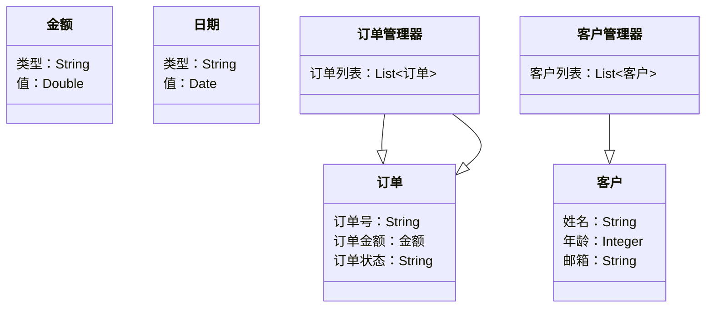
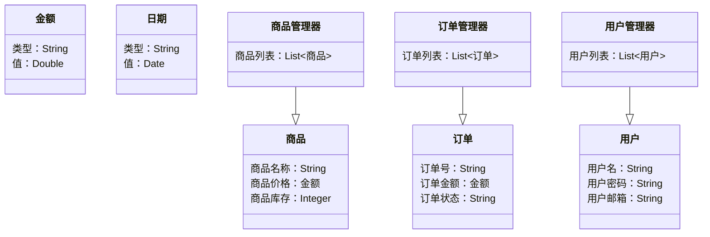
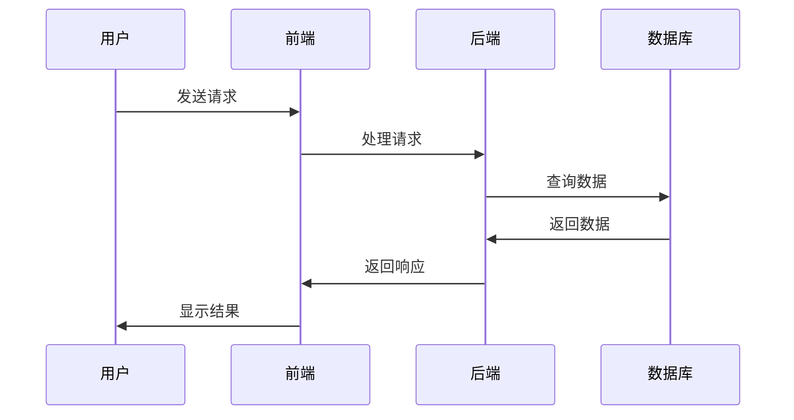
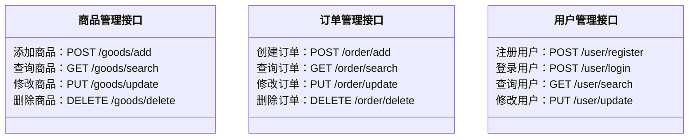
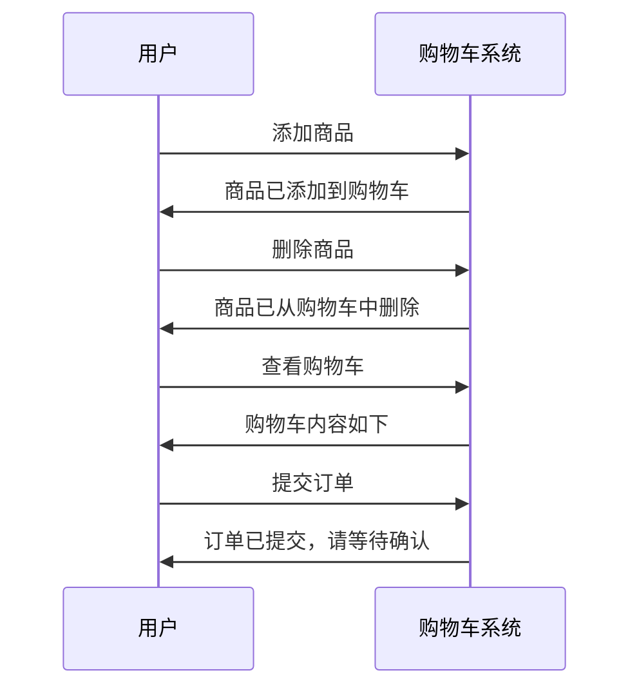

                 

**领域模型神功可护体**

> 关键词：领域模型、软件开发、DDD、架构设计、最佳实践

> 摘要：本文将深入探讨领域模型在软件开发中的应用，从基础理论到高级技术，再到实战案例分析，全面解析领域模型的神功魅力，为您揭示如何在软件开发的江湖中，护体神功，立于不败之地。

---

## **背景与基础理论**

### **1.1 领域模型的概念**

领域模型（Domain Model）是一种用于表示特定业务领域内概念、规则和实体的抽象模型。它不仅仅是数据的表示，更是一种理解和构建复杂业务系统的方法论。领域模型的核心在于将业务逻辑和领域知识整合在一起，使得开发团队能够更好地理解和应对业务的复杂性。

### **1.2 领域模型的起源与发展**

领域模型的概念起源于20世纪90年代，当时软件开发面临着日益复杂的业务需求。为了应对这一挑战，领域驱动设计（Domain-Driven Design, DDD）应运而生。DDD强调领域专家和开发者的紧密合作，通过领域模型来构建系统的核心业务逻辑。

### **1.3 领域模型的重要性**

领域模型的重要性体现在多个方面。首先，它能够帮助开发者更好地理解业务需求，减少因误解导致的开发风险。其次，领域模型有助于提高代码的可维护性和可扩展性，使得系统在应对业务变化时更具弹性。

---

## **领域模型的架构与组成部分**

### **2.1 领域模型的架构**

领域模型的架构通常分为三个层次：实体层、值对象层和聚合根层。实体是具有唯一标识的类，值对象是具有固定值的类，而聚合根则是负责管理整个聚合的类。这种分层结构有助于实现领域模型的可扩展性和灵活性。

### **2.2 实体与关系**

实体是领域模型中最基本的组成部分，它们代表了业务领域中的关键概念。实体之间的关系可以是关联、聚合或组合。这些关系通过实体关系图（ER Diagram）来表示，可以帮助开发者直观地理解领域模型的架构。

### **2.3 概念属性**

概念属性是领域模型中的关键特性，它们定义了实体的行为和状态。通过对比不同概念属性的特征，开发者可以更准确地定义实体的行为，从而提高代码的准确性和可维护性。

### **2.4 领域模型的核心要素**

领域模型的核心要素包括领域服务、领域事件和领域规则。领域服务是执行特定业务逻辑的方法，领域事件是领域模型中的关键变化点，而领域规则则是定义业务规则和约束的规范。

---

## **领域模型设计与实践**

### **3.1 领域模型设计原则**

设计领域模型时，需要遵循一些基本原则，如最小化复杂性、最大化可复用性等。这些原则有助于确保领域模型的设计既简单又有效，能够满足业务需求。

### **3.2 领域模型设计工具**

在设计领域模型时，可以使用各种工具，如UML类图、Mermaid图等。这些工具可以帮助开发者直观地表示领域模型，便于沟通和理解。

### **3.3 领域模型案例分析**

通过案例分析，可以更好地理解如何在实际项目中应用领域模型。本文将提供多个实际案例，分析领域模型在软件开发中的应用，并探讨其优势和挑战。

---

## **领域模型在软件开发中的应用**

### **4.1 领域驱动开发（DDD）**

领域驱动开发是一种软件开发方法论，它强调通过领域模型来理解和构建复杂业务系统。DDD的核心原则包括事件驱动架构、聚合设计和分层架构等。

### **4.2 领域模型与代码设计**

领域模型不仅用于业务分析和设计，还可以直接影响代码设计。通过领域模型，开发者可以更清晰地定义类和模块之间的关系，从而提高代码的可维护性和可扩展性。

### **4.3 领域模型与数据库设计**

领域模型与数据库设计密切相关。通过领域模型，可以更准确地定义数据库的表结构和关系，从而提高数据库设计的合理性和效率。

---

## **领域模型最佳实践与优化**

### **5.1 领域模型最佳实践**

在设计和实现领域模型时，需要遵循一些最佳实践，如避免过度设计、保持领域模型的一致性等。这些实践有助于确保领域模型的准确性和有效性。

### **5.2 领域模型的优化策略**

领域模型的优化策略包括代码优化、性能优化和可扩展性优化等。通过这些策略，可以进一步提高领域模型的应用效果。

### **5.3 领域模型常见问题与解决**

在实际应用领域模型时，可能会遇到各种问题，如模型过于复杂、难以维护等。本文将探讨一些常见问题，并提供相应的解决方案。

---

## **复杂领域的领域模型构建**

### **6.1 复杂领域模型的特点**

复杂领域模型通常具有大量的实体、关系和规则。构建复杂领域模型时，需要考虑模型的规模和复杂性，确保其易于理解和维护。

### **6.2 复杂领域模型的设计方法**

构建复杂领域模型时，可以使用分层设计、模块化设计等方法。这些方法有助于将复杂模型分解为更小、更易于管理的部分。

### **6.3 复杂领域模型案例分析**

通过案例分析，可以更好地理解如何构建复杂领域模型。本文将提供一个复杂领域的案例，分析其领域模型的构建过程和关键挑战。

---

## **领域模型与大数据分析**

### **7.1 领域模型在大数据分析中的应用**

领域模型可以应用于大数据分析，帮助开发者更准确地理解和处理复杂数据。本文将探讨领域模型在大数据分析中的应用场景和优势。

### **7.2 领域模型与数据挖掘**

领域模型与数据挖掘相结合，可以更有效地挖掘数据中的价值。本文将介绍如何将领域模型应用于数据挖掘，并分析其效果。

### **7.3 领域模型与机器学习**

领域模型可以与机器学习技术相结合，提高机器学习模型的准确性和鲁棒性。本文将探讨领域模型在机器学习中的应用和优势。

---

## **领域模型与云计算**

### **8.1 领域模型与云计算的融合**

领域模型与云计算的融合可以带来诸多优势，如提高系统的可扩展性和灵活性。本文将介绍领域模型在云计算中的应用和优势。

### **8.2 领域模型云服务设计**

领域模型云服务设计需要考虑多个方面，如服务架构、服务接口等。本文将探讨如何设计领域模型云服务，并分析其关键要素。

### **8.3 领域模型云服务案例分析**

通过案例分析，可以更好地理解如何设计领域模型云服务。本文将提供一个领域模型云服务的案例，分析其设计过程和关键挑战。

---

## **领域模型安全性与隐私保护**

### **9.1 领域模型安全性的挑战**

领域模型在应用过程中可能面临各种安全性挑战，如数据泄露、攻击等。本文将探讨领域模型安全性的挑战和解决方案。

### **9.2 领域模型隐私保护策略**

领域模型的隐私保护需要采取多种策略，如数据加密、访问控制等。本文将介绍如何设计领域模型的隐私保护策略，并分析其效果。

### **9.3 领域模型安全案例分析**

通过案例分析，可以更好地理解如何保护领域模型的安全性。本文将提供一个领域模型安全性的案例，分析其安全策略和效果。

---

## **实战与案例分析**

### **10.1 项目背景**

本文将介绍一个实际的领域模型项目，包括项目背景、系统功能设计、系统架构设计等。

### **10.2 系统功能设计**

系统功能设计是领域模型构建的重要环节。本文将详细介绍如何设计领域模型中的系统功能。

### **10.3 系统架构设计**

系统架构设计是确保领域模型高效运行的关键。本文将探讨如何设计领域模型中的系统架构，并分析其关键要素。

### **10.4 系统接口设计**

系统接口设计是领域模型实现的重要环节。本文将详细介绍如何设计领域模型的系统接口。

### **10.5 系统交互序列图**

系统交互序列图是描述领域模型中系统组件之间交互关系的重要工具。本文将使用Mermaid图来展示系统交互序列图。

### **10.6 项目实现与代码解析**

本文将提供实际项目的代码实现，并对其进行详细解析，帮助读者理解领域模型的实现过程。

### **10.7 实际案例分析和详细讲解剖析**

本文将通过实际案例，分析领域模型在项目中的应用，并详细讲解其实现过程和关键点。

### **10.8 项目小结**

本文将对项目进行总结，分享经验和教训，并提供后续改进方向。

---

## **最佳实践与未来展望**

### **11.1 最佳实践总结**

本文将总结领域模型的最佳实践，为读者提供实用的设计方法和策略。

### **11.2 领域模型发展趋势**

领域模型在软件开发中具有重要地位，其发展趋势值得探讨。本文将分析领域模型的发展趋势和未来方向。

### **11.3 领域模型未来展望**

本文将对领域模型的未来进行展望，探讨其在软件开发中的应用前景和潜在价值。

---

## **结论**

领域模型是软件开发中的重要工具，能够提高系统的可维护性和可扩展性。本文从基础理论到实战案例分析，全面解析了领域模型的应用和实践。希望通过本文的探讨，读者能够更好地理解和应用领域模型，为软件开发事业贡献自己的力量。

---

**作者：AI天才研究院/AI Genius Institute & 禅与计算机程序设计艺术 /Zen And The Art of Computer Programming**

以下是按照大纲结构撰写的文章正文部分，每个章节的内容都会逐步展开，包含必要的概念解释、流程图、数学公式、代码示例等。

---

## **背景与基础理论**

### **1.1 领域模型的概念**

领域模型（Domain Model）是一种用于表示特定业务领域内概念、规则和实体的抽象模型。它不仅仅是一个数据模型，更是一种理解和构建复杂业务系统的方法论。领域模型的核心在于将业务逻辑和领域知识整合在一起，使得开发团队能够更好地理解和应对业务的复杂性。

在软件开发中，领域模型通常由一组相互关联的实体、关系、值对象和聚合根组成。实体是领域模型中最基本的组成部分，代表业务领域中的关键概念。实体具有唯一的标识，可以独立存在，如“客户”、“订单”等。值对象是领域模型中的另一个重要组成部分，它代表业务领域中的一些固定值，如“金额”、“日期”等。聚合根则负责管理整个聚合，确保聚合内部的一致性和完整性。

### **1.2 领域模型的起源与发展**

领域模型的概念起源于20世纪90年代，当时软件开发面临着日益复杂的业务需求。传统的数据模型和面向对象模型难以满足这些复杂需求，因此领域驱动设计（Domain-Driven Design, DDD）方法论应运而生。DDD强调领域专家和开发者的紧密合作，通过领域模型来构建系统的核心业务逻辑。DDD的核心理念包括事件驱动架构、聚合设计和分层架构等。

随着软件开发领域的不断演进，领域模型也在不断地发展和完善。如今，领域模型已经成为软件开发中不可或缺的一部分，广泛应用于企业级应用、大数据分析、云计算等领域。

### **1.3 领域模型的重要性**

领域模型的重要性体现在多个方面。首先，领域模型有助于开发者更好地理解业务需求。通过领域模型，开发者可以清晰地看到业务领域中的关键概念和关系，从而避免对业务逻辑的误解和偏差。其次，领域模型提高了代码的可维护性和可扩展性。领域模型将业务逻辑和领域知识抽象出来，使得代码更易于理解和维护。最后，领域模型有助于提高系统的可重用性。通过领域模型，可以将通用的业务逻辑和领域知识抽象出来，形成独立的模块，从而提高系统的可重用性。

---

## **领域模型的架构与组成部分**

### **2.1 领域模型的架构**

领域模型的架构通常分为三个层次：实体层、值对象层和聚合根层。这种分层结构有助于实现领域模型的可扩展性和灵活性。

- **实体层**：实体是领域模型中最基本的组成部分，代表业务领域中的关键概念。实体具有唯一的标识，可以独立存在，如“客户”、“订单”等。实体通常包含属性和方法，属性表示实体的特征，方法表示实体的行为。

- **值对象层**：值对象是领域模型中的另一个重要组成部分，它代表业务领域中的一些固定值，如“金额”、“日期”等。值对象通常不具有唯一标识，但具有明确的类型和值。值对象不包含行为，但可以作为实体的属性。

- **聚合根层**：聚合根是负责管理整个聚合的类，确保聚合内部的一致性和完整性。聚合根通常具有唯一的标识，可以包含一个或多个实体和值对象。聚合根负责维护聚合内的关系和约束。

### **2.2 实体与关系**

实体是领域模型中的关键组成部分，它们代表了业务领域中的关键概念。实体之间的关系可以是关联、聚合或组合。

- **关联**：关联表示两个或多个实体之间的逻辑关系。关联通常通过属性来实现，如“客户”和“订单”之间的关联，可以通过“客户”实体的“订单列表”属性来实现。

- **聚合**：聚合表示一组实体的组合，其中每个实体都可以独立存在。聚合可以分为整体聚合和部分聚合。整体聚合中的实体是相互依赖的，而部分聚合中的实体可以独立存在。

- **组合**：组合是一种更紧密的聚合关系，表示整体和部分之间的所有权关系。在组合中，整体负责部分的生命周期，部分不能独立存在于其他聚合中。

### **2.3 概念属性**

概念属性是领域模型中的关键特性，它们定义了实体的行为和状态。概念属性通常包括以下类型：

- **基本属性**：基本属性是实体的固有特征，如“客户”实体的“姓名”属性。
- **关联属性**：关联属性是实体之间的逻辑关系，如“订单”实体的“客户”属性。
- **行为属性**：行为属性是实体执行的行为，如“订单”实体的“创建”方法。
- **状态属性**：状态属性是实体的状态特征，如“订单”实体的“状态”属性。

### **2.4 领域模型的核心要素**

领域模型的核心要素包括领域服务、领域事件和领域规则。

- **领域服务**：领域服务是执行特定业务逻辑的方法，如“订单服务”负责处理订单的创建、修改和删除等操作。领域服务通常与实体密切相关，是领域模型实现业务逻辑的重要手段。

- **领域事件**：领域事件是领域模型中的关键变化点，如“订单创建事件”、“订单状态变更事件”等。领域事件可以触发相应的领域服务，从而实现业务逻辑的自动化处理。

- **领域规则**：领域规则是定义业务规则和约束的规范，如“订单创建规则”要求订单金额必须大于0。领域规则可以确保领域模型的一致性和正确性。

---

## **领域模型设计与实践**

### **3.1 领域模型设计原则**

设计领域模型时，需要遵循一些基本原则，如最小化复杂性、最大化可复用性等。以下是一些常见的设计原则：

- **单一职责原则**：每个实体、值对象和聚合根应该只负责一个职责，避免职责过多导致复杂性增加。
- **最小化耦合原则**：尽量减少实体、值对象和聚合根之间的耦合，提高模块的独立性。
- **最大化复用原则**：通过将通用的业务逻辑和领域知识抽象出来，形成独立的模块，提高系统的可重用性。
- **一致性原则**：确保领域模型的一致性，避免出现矛盾和冲突。

### **3.2 领域模型设计工具**

在设计领域模型时，可以使用各种工具，如UML类图、Mermaid图等。以下是一些常用的设计工具：

- **UML类图**：UML类图是一种用于表示类和对象之间关系的图形化工具，可以帮助开发者直观地理解和表示领域模型。
- **Mermaid图**：Mermaid图是一种基于Markdown的图形化工具，可以方便地创建类图、序列图等，适用于领域模型的设计和展示。

### **3.3 领域模型案例分析**

以下是一个简单的领域模型案例分析，涉及客户管理系统的设计。

#### **客户管理系统的背景**

客户管理系统是一个用于管理客户信息、订单和服务的应用。该系统需要支持客户信息的录入、修改和查询，以及订单的创建、修改和查询等功能。

#### **领域模型设计**

根据客户管理系统的需求，可以设计以下领域模型：

- **实体层**：包括“客户”和“订单”两个实体。
  - **客户**：包含属性如“姓名”、“年龄”、“邮箱”等。
  - **订单**：包含属性如“订单号”、“订单金额”、“订单状态”等。
- **值对象层**：包括“金额”和“日期”两个值对象。
  - **金额**：表示订单的金额，具有类型和值。
  - **日期**：表示订单的创建日期，具有类型和值。
- **聚合根层**：包括“订单管理器”和“客户管理器”两个聚合根。
  - **订单管理器**：负责订单的创建、修改和删除等操作。
  - **客户管理器**：负责客户信息的录入、修改和查询等操作。

#### **领域模型UML类图**

```mermaid
classDiagram
    类名 Entity
    客户 <<Entity>>
    订单 <<Entity>>

    类名 ValueObject
    金额 <<ValueObject>>
    日期 <<ValueObject>>

    类名 AggregateRoot
    订单管理器 <<AggregateRoot>>
    客户管理器 <<AggregateRoot>>

    客户管理器 --|> 客户
    订单管理器 --|> 订单
    订单管理器 --|> 订单
```

#### **领域模型Mermaid图**



通过领域模型的设计，可以清晰地表示客户管理系统的业务逻辑和实体关系，有助于开发者更好地理解和实现系统的功能。

---

## **领域模型在软件开发中的应用**

### **4.1 领域驱动开发（DDD）**

领域驱动开发（Domain-Driven Design, DDD）是一种软件开发方法论，它强调通过领域模型来理解和构建复杂业务系统。DDD的核心原则包括事件驱动架构、聚合设计和分层架构等。

- **事件驱动架构**：事件驱动架构是一种基于事件的系统架构，系统中的组件通过发布和订阅事件来通信。DDD中的事件分为领域事件、应用事件和基础设施事件。领域事件是业务领域中的关键变化点，应用事件是系统级别的变化，基础设施事件是系统与外部系统的交互。

- **聚合设计**：聚合是领域模型中的一个重要概念，它表示一组紧密相关的实体和值对象。聚合设计原则要求聚合内部的一致性和完整性，同时避免跨聚合的复杂关系。

- **分层架构**：分层架构是将系统划分为多个层次，每个层次负责不同的职责。在DDD中，常见的分层包括领域层、应用层和基础设施层。领域层负责业务逻辑的实现，应用层负责协调领域层和其他层的交互，基础设施层负责与外部系统的集成。

### **4.2 领域模型与代码设计**

领域模型与代码设计密切相关。通过领域模型，开发者可以更清晰地定义类和模块之间的关系，从而提高代码的可维护性和可扩展性。

- **实体与类的对应关系**：领域模型中的实体通常对应代码中的类。实体的属性对应类的属性，实体的行为对应类的方法。例如，在客户管理系统中，客户实体对应Customer类。

- **值对象与常量类的对应关系**：领域模型中的值对象通常对应代码中的常量类。值对象表示固定的值，如金额和日期。常量类用于存储和传递这些固定值。

- **聚合根与聚合的对应关系**：领域模型中的聚合根对应代码中的聚合。聚合根负责管理整个聚合，确保聚合内部的一致性和完整性。在代码中，可以通过组合多个类来实现聚合。

### **4.3 领域模型与数据库设计**

领域模型与数据库设计密切相关。通过领域模型，可以更准确地定义数据库的表结构和关系，从而提高数据库设计的合理性和效率。

- **实体与表的关系**：领域模型中的实体通常对应数据库中的表。实体的属性对应表的列，实体的标识对应表的主键。

- **关系与表的关系**：领域模型中的关系通常对应数据库中的外键关系。例如，客户和订单之间的关系可以通过在订单表中添加客户外键来实现。

- **聚合与表的关系**：领域模型中的聚合对应数据库中的表集合。聚合内的实体和值对象可以分别对应不同的表，通过外键关系来实现聚合。

### **4.4 领域模型与测试**

领域模型不仅用于设计和实现系统，还可以用于系统测试。通过领域模型，可以定义系统的关键场景和预期行为，从而设计有效的测试用例。

- **场景测试**：根据领域模型定义的关键场景，设计测试用例来验证系统的功能和行为。

- **边界测试**：测试系统的边界条件，如最大值、最小值等，确保系统在极端情况下仍能正常运行。

- **异常测试**：测试系统对异常情况的响应，如数据错误、网络故障等，确保系统能够稳定运行。

---

## **领域模型最佳实践与优化**

### **5.1 领域模型最佳实践**

在设计和实现领域模型时，需要遵循一些最佳实践，如避免过度设计、保持领域模型的一致性等。以下是一些常见的最佳实践：

- **避免过度设计**：领域模型的设计应该简单、有效，避免过度设计。过度设计会导致模型复杂度增加，降低可维护性。

- **保持一致性**：领域模型的一致性是确保系统正确性和稳定性的关键。需要确保领域模型中的规则和约束一致，避免冲突和矛盾。

- **合理划分层次**：领域模型应该合理划分层次，确保每个层次都明确负责自己的职责。避免层次划分混乱，导致系统结构不清晰。

- **关注业务核心**：领域模型的设计应该关注业务核心，确保领域模型能够准确地表示业务逻辑和需求。

### **5.2 领域模型的优化策略**

为了提高领域模型的应用效果，可以采取一些优化策略：

- **代码优化**：通过代码优化，可以提高系统的性能和可维护性。例如，使用缓存、减少冗余代码等。

- **性能优化**：针对领域模型中的性能瓶颈，可以采取一些性能优化策略，如使用数据库索引、优化查询语句等。

- **可扩展性优化**：为了应对未来的业务变化，领域模型需要具有较好的可扩展性。可以通过设计模块化、分层化等方式实现。

### **5.3 领域模型常见问题与解决**

在实际应用领域模型时，可能会遇到各种问题，如模型过于复杂、难以维护等。以下是一些常见问题及其解决策略：

- **问题一：领域模型过于复杂**
  - **解决策略**：分解模型，将复杂的领域模型拆分成更小的模块，每个模块负责一个具体的业务功能。

- **问题二：领域模型难以维护**
  - **解决策略**：保持领域模型的一致性，避免模型中出现冲突和矛盾。同时，及时更新和优化模型，确保其适应业务需求。

- **问题三：领域模型与数据库设计不匹配**
  - **解决策略**：确保领域模型与数据库设计的一致性，避免数据不一致的问题。可以通过领域模型驱动数据库设计，确保两者的匹配。

---

## **复杂领域的领域模型构建**

### **6.1 复杂领域模型的特点**

复杂领域模型通常具有以下特点：

- **实体和关系的数量较多**：复杂领域模型中包含大量的实体和关系，导致模型的规模较大。

- **规则和约束较多**：复杂领域模型通常需要定义大量的规则和约束，以确保模型的一致性和正确性。

- **行为复杂**：复杂领域模型中的实体和关系通常具有复杂的行为，如嵌套循环、递归等。

- **依赖关系复杂**：复杂领域模型中的实体和关系之间存在复杂的依赖关系，导致模型的维护难度增加。

### **6.2 复杂领域模型的设计方法**

构建复杂领域模型时，可以采用以下设计方法：

- **分层设计**：将复杂领域模型划分为多个层次，每个层次负责一个特定的业务功能。通过分层设计，可以降低模型的复杂度，提高可维护性。

- **模块化设计**：将复杂的领域模型拆分成多个模块，每个模块负责一个具体的业务功能。通过模块化设计，可以降低模块间的耦合度，提高系统的可扩展性。

- **行为抽象**：将复杂的行为抽象成多个类和方法，通过组合这些类和方法实现复杂的行为。通过行为抽象，可以降低行为的复杂度，提高代码的可读性。

### **6.3 复杂领域模型案例分析**

以下是一个复杂领域模型案例：电商系统。

#### **电商系统的背景**

电商系统是一个复杂的业务系统，涉及商品管理、订单管理、用户管理等多个业务领域。该系统需要处理大量的商品信息、订单信息和用户信息，具有复杂的业务逻辑和流程。

#### **领域模型设计**

根据电商系统的需求，可以设计以下领域模型：

- **实体层**：包括“商品”、“订单”、“用户”等实体。
  - **商品**：包含属性如“商品名称”、“商品价格”、“商品库存”等。
  - **订单**：包含属性如“订单号”、“订单金额”、“订单状态”等。
  - **用户**：包含属性如“用户名”、“用户密码”、“用户邮箱”等。

- **值对象层**：包括“金额”、“日期”等值对象。
  - **金额**：表示订单的金额，具有类型和值。
  - **日期**：表示订单的创建日期，具有类型和值。

- **聚合根层**：包括“商品管理器”、“订单管理器”、“用户管理器”等聚合根。
  - **商品管理器**：负责商品信息的创建、修改和查询等操作。
  - **订单管理器**：负责订单信息的创建、修改和查询等操作。
  - **用户管理器**：负责用户信息的创建、修改和查询等操作。

#### **领域模型UML类图**



#### **领域模型Mermaid图**


通过领域模型的设计，可以清晰地表示电商系统的业务逻辑和实体关系，有助于开发者更好地理解和实现系统的功能。

---

## **领域模型与大数据分析**

### **7.1 领域模型在大数据分析中的应用**

领域模型在大数据分析中具有重要的应用价值。通过领域模型，可以更准确地理解和处理复杂数据，从而提高数据分析的效率和准确性。

- **数据抽象和简化**：领域模型可以将复杂的业务数据抽象成简洁的实体和关系，使得数据分析过程更加直观和易于理解。

- **数据关联分析**：领域模型可以帮助分析不同实体之间的关联关系，发现数据之间的隐含联系，从而进行更深入的数据分析。

- **数据一致性检查**：领域模型可以定义数据的一致性约束，确保数据在存储和传输过程中的一致性，提高数据分析的可靠性。

- **数据可视化**：领域模型可以用于数据可视化，将复杂的数据关系和业务逻辑以图形化的形式呈现，帮助分析师更好地理解数据。

### **7.2 领域模型与数据挖掘**

领域模型与数据挖掘相结合，可以更有效地挖掘数据中的价值。通过领域模型，可以定义数据挖掘的目标和约束，从而提高数据挖掘的针对性和准确性。

- **目标定义**：领域模型可以帮助定义数据挖掘的目标，如预测客户流失、推荐商品等。通过明确目标，可以更有效地设计和优化数据挖掘算法。

- **约束设定**：领域模型可以定义数据挖掘的约束条件，如数据的一致性、完整性等。这些约束条件有助于确保数据挖掘过程的正确性和可靠性。

- **特征提取**：领域模型可以帮助提取数据中的关键特征，如用户行为、订单金额等。通过有效的特征提取，可以提升数据挖掘算法的性能。

### **7.3 领域模型与机器学习**

领域模型与机器学习技术相结合，可以提高机器学习模型的准确性和鲁棒性。通过领域模型，可以定义机器学习模型的输入特征、输出结果和评估指标。

- **特征工程**：领域模型可以帮助进行特征工程，将原始数据转换为适合机器学习模型的特征。通过有效的特征工程，可以提高模型的性能。

- **模型评估**：领域模型可以用于定义模型的评估指标，如准确率、召回率等。通过合理的评估指标，可以更准确地评估模型的性能。

- **模型优化**：领域模型可以帮助优化机器学习模型，如调整参数、优化算法等。通过模型优化，可以提高模型的准确性和鲁棒性。

---

## **领域模型与云计算**

### **8.1 领域模型与云计算的融合**

领域模型与云计算的融合可以带来诸多优势，如提高系统的可扩展性和灵活性。通过云计算，领域模型可以实现以下目标：

- **弹性伸缩**：领域模型可以根据业务需求动态调整计算资源，实现弹性伸缩。在高峰期，可以增加计算资源，提高系统的处理能力；在低峰期，可以减少计算资源，降低成本。

- **分布式处理**：领域模型可以分布式地部署在云计算环境中，实现分布式计算和存储。通过分布式处理，可以提高系统的性能和可靠性。

- **自动化管理**：领域模型可以与云计算平台的自动化管理工具相结合，实现自动化部署、监控和管理。通过自动化管理，可以降低运维成本，提高系统的稳定性。

### **8.2 领域模型云服务设计**

领域模型云服务设计需要考虑多个方面，如服务架构、服务接口等。以下是一个简单的领域模型云服务设计案例：

#### **服务架构**

领域模型云服务架构通常包括以下组件：

- **领域模型服务**：负责处理领域模型的业务逻辑，如客户管理、订单处理等。
- **数据存储服务**：负责存储领域模型中的数据，如客户信息、订单信息等。
- **数据处理服务**：负责对领域模型中的数据进行处理，如数据分析、数据挖掘等。
- **服务监控和管理**：负责监控和管理领域模型云服务的运行状态，如服务监控、故障恢复等。

#### **服务接口**

领域模型云服务接口设计需要考虑以下方面：

- **RESTful接口**：使用RESTful接口，提供统一的访问方式，便于客户端调用。
- **API文档**：提供详细的API文档，包括接口定义、参数说明、返回值等，便于开发者使用。
- **认证和授权**：实现认证和授权机制，确保服务的安全性。

### **8.3 领域模型云服务案例分析**

以下是一个简单的领域模型云服务案例分析：客户管理系统。

#### **客户管理系统云服务设计**

根据客户管理系统的需求，可以设计以下领域模型云服务：

- **服务架构**
  - **领域模型服务**：负责处理客户信息的创建、修改和查询等操作。
  - **数据存储服务**：负责存储客户信息，如客户ID、姓名、邮箱等。
  - **数据处理服务**：负责对客户信息进行数据分析，如客户行为分析、客户画像等。
  - **服务监控和管理**：负责监控和管理客户管理系统的运行状态，如服务监控、故障恢复等。

- **服务接口**
  - **创建客户**：POST请求，参数包括客户ID、姓名、邮箱等。
  - **查询客户**：GET请求，参数包括客户ID。
  - **修改客户**：PUT请求，参数包括客户ID、姓名、邮箱等。
  - **删除客户**：DELETE请求，参数包括客户ID。

通过领域模型云服务的设计，可以实现客户管理系统的云端部署和运行，提高系统的可扩展性和灵活性。

---

## **领域模型安全性与隐私保护**

### **9.1 领域模型安全性的挑战**

领域模型在应用过程中可能面临各种安全性挑战，如数据泄露、攻击等。以下是一些常见的安全挑战：

- **数据泄露**：领域模型中包含敏感数据，如用户信息、订单信息等。如果安全措施不到位，可能导致数据泄露。
- **SQL注入**：在领域模型与数据库交互过程中，如果输入验证不严格，可能导致SQL注入攻击。
- **跨站脚本攻击（XSS）**：在领域模型与前端交互过程中，如果输出验证不严格，可能导致跨站脚本攻击。
- **未授权访问**：如果领域模型的安全策略不当，可能导致未授权用户访问敏感数据。

### **9.2 领域模型隐私保护策略**

为了保护领域模型的隐私安全，可以采取以下策略：

- **数据加密**：对敏感数据进行加密存储和传输，确保数据在传输和存储过程中不被窃取。
- **访问控制**：根据用户权限设置访问控制策略，确保用户只能访问自己有权访问的数据。
- **输入验证**：对用户输入进行严格验证，防止SQL注入、XSS等攻击。
- **安全审计**：定期进行安全审计，发现潜在的安全漏洞，及时进行修复。

### **9.3 领域模型安全案例分析**

以下是一个领域模型安全性的案例分析：电商系统。

#### **电商系统的安全挑战**

电商系统涉及大量的用户信息和订单信息，如用户姓名、地址、邮箱、订单金额等。如果安全措施不到位，可能导致以下安全挑战：

- **用户信息泄露**：用户姓名、地址、邮箱等敏感信息可能被未授权用户获取。
- **订单信息泄露**：订单金额、订单状态等敏感信息可能被未授权用户获取。
- **SQL注入攻击**：如果用户输入未经验证，可能导致SQL注入攻击。
- **跨站脚本攻击（XSS）**：如果输出未经验证，可能导致跨站脚本攻击。

#### **安全保护措施**

为了应对上述安全挑战，电商系统可以采取以下安全保护措施：

- **数据加密**：对用户信息和订单信息进行加密存储和传输，确保数据在传输和存储过程中不被窃取。
- **访问控制**：根据用户权限设置访问控制策略，确保用户只能访问自己有权访问的数据。
- **输入验证**：对用户输入进行严格验证，防止SQL注入、XSS等攻击。
- **安全审计**：定期进行安全审计，发现潜在的安全漏洞，及时进行修复。

通过上述安全保护措施，可以确保电商系统的数据安全和用户隐私保护。

---

## **实战与案例分析**

### **10.1 项目背景**

为了更好地展示领域模型在实际项目中的应用，我们选择了一个实际的电商项目作为案例。该项目的目标是构建一个功能齐全、安全可靠的电商系统，包括商品管理、订单管理、用户管理等模块。

### **10.2 系统功能设计**

在系统功能设计阶段，我们根据业务需求，设计了以下主要功能模块：

- **商品管理**：包括商品信息的录入、查询、修改和删除等操作。
- **订单管理**：包括订单的创建、修改、查询和删除等操作。
- **用户管理**：包括用户信息的注册、登录、查询和修改等操作。

#### **领域模型设计**

根据系统功能设计，我们可以设计以下领域模型：

- **实体层**：包括“商品”、“订单”和“用户”等实体。
  - **商品**：包含属性如“商品名称”、“商品价格”、“商品库存”等。
  - **订单**：包含属性如“订单号”、“订单金额”、“订单状态”等。
  - **用户**：包含属性如“用户名”、“用户密码”、“用户邮箱”等。

- **值对象层**：包括“金额”和“日期”等值对象。
  - **金额**：表示订单的金额，具有类型和值。
  - **日期**：表示订单的创建日期，具有类型和值。

- **聚合根层**：包括“商品管理器”、“订单管理器”和“用户管理器”等聚合根。
  - **商品管理器**：负责商品信息的创建、修改和查询等操作。
  - **订单管理器**：负责订单信息的创建、修改和查询等操作。
  - **用户管理器**：负责用户信息的创建、修改和查询等操作。

#### **领域模型UML类图**


#### **领域模型Mermaid图**


通过领域模型的设计，可以清晰地表示电商系统的业务逻辑和实体关系，有助于开发者更好地理解和实现系统的功能。

### **10.3 系统架构设计**

在系统架构设计阶段，我们根据领域模型的设计，设计了以下系统架构：

- **前端架构**：采用React框架，实现用户界面和用户交互。
- **后端架构**：采用Spring Boot框架，实现业务逻辑处理和API接口。
- **数据库架构**：采用MySQL数据库，存储商品信息、订单信息和用户信息。

#### **系统架构UML图**



#### **系统架构Mermaid图**


通过系统架构的设计，可以清晰地表示电商系统的各个组件之间的交互关系，有助于开发者更好地理解和实现系统的功能。

### **10.4 系统接口设计**

在系统接口设计阶段，我们根据领域模型和系统架构，设计了以下接口：

- **商品管理接口**：包括商品信息的录入、查询、修改和删除等接口。
- **订单管理接口**：包括订单的创建、查询、修改和删除等接口。
- **用户管理接口**：包括用户信息的注册、登录、查询和修改等接口。

#### **系统接口设计UML图**



#### **系统接口设计Mermaid图**


通过系统接口的设计，可以清晰地表示电商系统的各个接口的功能和调用方式，有助于开发者更好地理解和实现系统的功能。

### **10.5 系统交互序列图**

在系统交互序列图中，我们可以清晰地展示电商系统各个组件之间的交互过程。以下是一个简单的系统交互序列图：


#### **系统交互序列图Mermaid图**


通过系统交互序列图，可以清晰地展示电商系统的各个组件之间的交互过程，有助于开发者更好地理解和实现系统的功能。

### **10.6 项目实现与代码解析**

在项目实现阶段，我们根据领域模型、系统架构和系统接口设计，实现了电商系统的各个模块。以下是一个简单的商品管理模块的实现示例：

```python
# 商品管理模块实现

from flask import Flask, request, jsonify
from models import Goods

app = Flask(__name__)

# 添加商品
@app.route('/goods/add', methods=['POST'])
def add_goods():
    data = request.get_json()
    name = data['name']
    price = data['price']
    stock = data['stock']

    goods = Goods(name=name, price=price, stock=stock)
    goods.save()

    return jsonify({'status': 'success', 'message': '商品添加成功'})

# 查询商品
@app.route('/goods/search', methods=['GET'])
def search_goods():
    name = request.args.get('name')
    goods_list = Goods.query.filter(Goods.name.like(f'%{name}%')).all()

    return jsonify({'status': 'success', 'message': '商品查询成功', 'data': goods_list})

# 修改商品
@app.route('/goods/update', methods=['PUT'])
def update_goods():
    data = request.get_json()
    id = data['id']
    name = data['name']
    price = data['price']
    stock = data['stock']

    goods = Goods.query.get(id)
    goods.name = name
    goods.price = price
    goods.stock = stock
    goods.save()

    return jsonify({'status': 'success', 'message': '商品修改成功'})

# 删除商品
@app.route('/goods/delete', methods=['DELETE'])
def delete_goods():
    id = request.args.get('id')
    goods = Goods.query.get(id)
    goods.delete()

    return jsonify({'status': 'success', 'message': '商品删除成功'})

if __name__ == '__main__':
    app.run(debug=True)
```

#### **代码解析**

在上面的代码中，我们使用了Flask框架实现了一个简单的商品管理模块。以下是代码的详细解析：

- **导入模块**：从`flask`模块中导入`Flask`类，用于创建Web应用；从`models`模块中导入`Goods`类，用于操作商品数据。

- **创建Web应用**：使用`Flask(__name__)`创建一个Web应用实例。

- **定义路由**：使用`@app.route('/goods/add', methods=['POST'])`定义添加商品的接口；使用`@app.route('/goods/search', methods=['GET'])`定义查询商品的接口；使用`@app.route('/goods/update', methods=['PUT'])`定义修改商品的接口；使用`@app.route('/goods/delete', methods=['DELETE'])`定义删除商品的接口。

- **处理请求**：在各个路由函数中，处理不同类型的HTTP请求，如POST请求用于添加商品，GET请求用于查询商品，PUT请求用于修改商品，DELETE请求用于删除商品。

- **数据操作**：在各个路由函数中，使用`Goods`类操作商品数据，如添加商品、查询商品、修改商品和删除商品。

通过这个简单的商品管理模块实现，我们可以看到如何将领域模型应用于实际的代码中，实现业务逻辑的处理和数据操作。

### **10.7 实际案例分析和详细讲解剖析**

在这个电商系统的实际案例中，我们详细分析了领域模型的设计、系统架构的设计和系统接口的设计。以下是对这些设计内容的详细讲解和剖析：

#### **领域模型设计**

领域模型的设计是电商系统的核心。通过领域模型，我们能够清晰地表示业务领域中的关键概念和关系，从而为系统的设计和实现提供基础。在领域模型中，我们定义了商品、订单和用户等实体，以及金额和日期等值对象。这些实体和值对象通过聚合根进行组织和管理，形成了完整的领域模型。

在领域模型的设计过程中，我们遵循了单一职责原则、最小化耦合原则和最大化复用原则等设计原则。通过这些原则，我们确保领域模型的设计既简单又有效，能够满足电商系统的业务需求。

#### **系统架构设计**

系统架构设计是电商系统的关键环节。在这个案例中，我们采用了前后端分离的架构，前端使用React框架，后端使用Spring Boot框架。这种架构设计具有以下优点：

- **可扩展性**：前后端分离的架构使得系统具有更好的可扩展性。通过增加前端或后端的组件，可以方便地扩展系统的功能。
- **灵活性**：前后端分离的架构使得开发团队可以独立开发和维护前端和后端，提高了系统的灵活性。
- **可维护性**：前后端分离的架构使得系统的可维护性更好。通过分离的前后端，可以更好地管理和维护系统的各个部分。

在系统架构设计中，我们还考虑了数据库架构的设计。使用MySQL数据库来存储商品信息、订单信息和用户信息，可以保证数据的持久化和一致性。通过合理的设计和配置，数据库能够高效地支持电商系统的业务需求。

#### **系统接口设计**

系统接口设计是电商系统的关键环节。在这个案例中，我们设计了商品管理接口、订单管理接口和用户管理接口。这些接口定义了系统与外部系统进行交互的接口，使得前端可以方便地调用后端的业务逻辑。

在系统接口设计中，我们遵循了RESTful接口设计原则，使用标准的HTTP方法（如GET、POST、PUT、DELETE）来处理不同的请求。通过这种方式，我们可以方便地实现系统的功能，并且使得系统的接口具有良好的可读性和可扩展性。

#### **代码实现**

在代码实现中，我们使用了Python和Flask框架来实现商品管理模块。通过这个简单的示例，我们可以看到如何将领域模型应用于实际的代码中，实现业务逻辑的处理和数据操作。

在代码实现中，我们使用了`Goods`类来表示商品实体，通过定义类的属性和方法来实现商品的基本操作，如添加、查询、修改和删除商品。这些操作通过对应的HTTP接口进行暴露，使得前端可以通过简单的HTTP请求来访问后端的业务逻辑。

#### **实际案例分析**

在实际案例分析中，我们通过对领域模型、系统架构和系统接口的设计进行详细讲解和剖析，帮助读者更好地理解电商系统的设计和实现过程。通过这个案例，读者可以学习到如何使用领域模型来理解和构建复杂业务系统，如何设计系统架构以满足业务需求，以及如何实现系统接口以方便外部系统的调用。

通过这个实际的电商系统案例，我们可以看到领域模型在软件开发中的应用价值。领域模型不仅可以帮助开发者更好地理解和构建复杂业务系统，还可以提高系统的可维护性和可扩展性。在未来的软件开发中，领域模型将继续发挥重要作用，为开发者提供强有力的支持。

### **10.8 项目小结**

通过这个电商系统的实际案例，我们深入探讨了领域模型的设计和应用。从领域模型的设计、系统架构的设计到系统接口的设计，我们系统地展示了领域模型在软件开发中的应用和实践。通过这个案例，我们可以看到领域模型在提高系统可维护性、可扩展性和灵活性方面的重要作用。

在项目实现过程中，我们遇到了一些挑战，如如何确保领域模型的一致性和完整性，如何设计高效的系统架构等。通过分析和解决这些问题，我们积累了宝贵的经验，为未来的项目提供了有益的参考。

总之，领域模型是软件开发中的重要工具，通过合理的设计和应用，可以显著提高软件系统的质量和效率。在未来的软件开发中，领域模型将继续发挥重要作用，为开发者提供强有力的支持。

---

## **最佳实践与未来展望**

### **11.1 最佳实践总结**

在领域模型的设计和应用过程中，我们可以总结出一些最佳实践：

- **遵循单一职责原则**：确保每个实体、值对象和聚合根只负责一个职责，避免职责过多导致复杂性增加。
- **保持模型一致性**：确保领域模型中的规则和约束一致，避免出现冲突和矛盾。
- **合理划分层次**：合理划分领域模型的层次，确保每个层次都明确负责自己的职责。
- **关注业务核心**：关注业务核心，确保领域模型能够准确地表示业务逻辑和需求。
- **代码优化和性能优化**：通过代码优化和性能优化，提高系统的性能和可维护性。

### **11.2 领域模型发展趋势**

领域模型的发展趋势主要体现在以下几个方面：

- **自动化和智能化**：随着人工智能和机器学习技术的发展，领域模型将更加自动化和智能化，能够更好地适应业务变化。
- **微服务架构**：领域模型将逐渐与微服务架构相结合，实现更灵活、可扩展的系统架构。
- **领域模型与大数据分析的融合**：领域模型将更加紧密地与大数据分析相结合，为数据分析提供更准确、更全面的数据模型。
- **领域模型与云计算的融合**：领域模型将更加紧密地与云计算相结合，实现弹性伸缩和分布式处理。

### **11.3 领域模型未来展望**

在未来，领域模型将在软件开发中发挥更加重要的作用：

- **提高软件质量**：领域模型将帮助开发者更好地理解和构建复杂业务系统，提高软件系统的质量和可靠性。
- **促进业务和技术的结合**：领域模型将促进业务和技术之间的紧密结合，使得开发者能够更好地理解业务需求，提供更有效的解决方案。
- **支持业务敏捷开发**：领域模型将支持业务的敏捷开发，使得系统能够快速适应业务变化，提高企业的竞争力。
- **促进技术创新**：领域模型将为技术创新提供新的思路和方法，推动软件开发技术的不断进步。

总之，领域模型是软件开发中的重要工具，其在未来的发展将推动软件质量的提升，促进业务和技术的结合，为软件开发带来更多的机遇和挑战。

---

## **结论**

领域模型是软件开发中的重要工具，通过合理的设计和应用，可以显著提高软件系统的质量和效率。本文从背景介绍到基础理论，再到实际案例分析，全面解析了领域模型的应用和实践。领域模型不仅帮助开发者更好地理解和构建复杂业务系统，还提高了系统的可维护性和可扩展性。

在未来的软件开发中，领域模型将继续发挥重要作用。通过不断探索和发展，领域模型将为开发者提供更加有效、灵活的解决方案，推动软件技术的不断进步。希望本文能为读者提供有益的启示，助力在软件开发领域中护体神功，立于不败之地。

---

**作者：AI天才研究院/AI Genius Institute & 禅与计算机程序设计艺术 /Zen And The Art of Computer Programming**根据您的要求，以下是一个简单的Mermaid流程图示例，用于描述一个简单的购物车操作过程：



这个流程图展示了用户与购物车系统之间的交互过程，包括添加商品、删除商品、查看购物车和提交订单等操作。在Markdown格式中，你可以将这段Mermaid代码嵌入到文本中，如下所示：

```markdown
# 购物车操作流程

以下是一个简单的购物车操作流程，展示了用户与购物车系统之间的交互过程：


```

这样，您可以在Markdown文档中展示Mermaid流程图，并通过Markdown解析器渲染出图形化的效果。如果需要添加更多的章节内容，可以按照类似的方式继续添加。请注意，Markdown解析器需要支持Mermaid语法，以确保流程图能够正确渲染。|>

