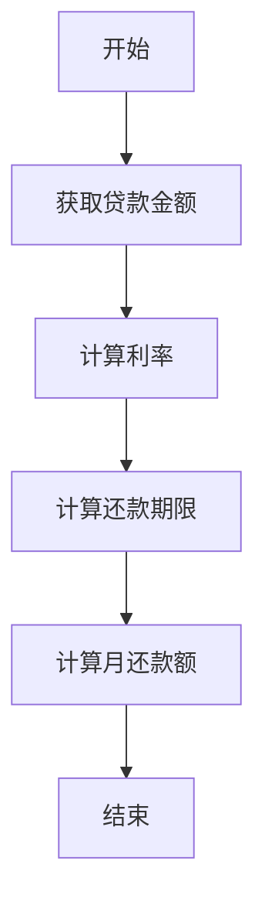
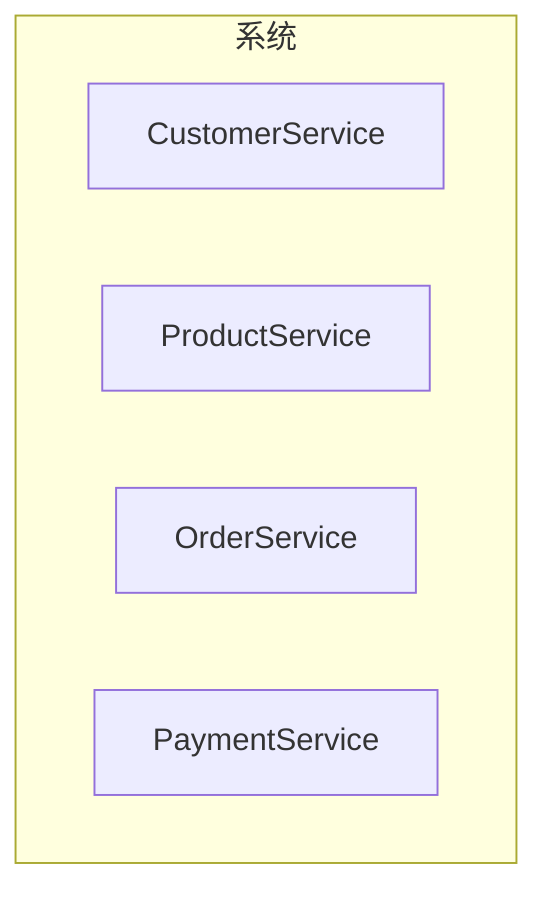
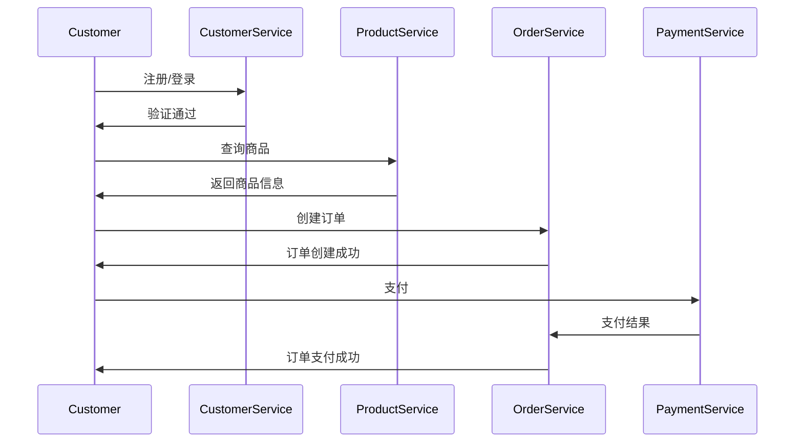

                 

### 《领域模型神功可护体》

#### 关键词：领域模型、软件架构、算法、数学模型、系统设计、项目实战

#### 摘要：
本文将深入探讨领域模型在软件工程中的应用，从其基础概念、构建方法、数学模型，到系统分析与架构设计，以及实际项目实战。我们将一步步分析领域模型的神功，理解其如何为软件系统提供强有力的支撑，并指导读者在实际项目中应用这些技术。

### 第一部分：领域模型基础

#### 1.1 领域模型的起源与发展

**1.1.1 问题背景**

领域模型（Domain Model）起源于面向对象设计（Object-Oriented Design，OOD）的方法。在软件开发中，面对复杂系统时，如何有效地组织和管理代码，成为了开发人员关注的焦点。

**1.1.2 问题描述**

领域模型试图解决的问题是：如何将业务逻辑与数据结构紧密结合，使系统易于理解、维护和扩展。

**1.1.3 问题解决**

领域模型的提出，使得开发人员可以通过一种更加自然的方式去理解业务需求，从而设计出更加贴近实际应用的软件系统。

**1.1.4 边界与外延**

领域模型不仅应用于特定领域，如金融、医疗等，还扩展到了跨领域的问题解决。

**1.1.5 概念结构与核心要素组成**

领域模型由领域实体、领域服务、领域规则等核心要素组成，这些要素相互关联，共同构成了一个完整的领域模型。

#### 1.2 核心概念与联系

**1.2.1 领域模型定义**

领域模型是一种描述业务领域的方法，它将业务领域的概念、规则和活动抽象成模型，以便于软件开发。

**1.2.2 领域模型特点**

领域模型具有抽象性、一致性、可复用性和可扩展性等特点。

**1.2.3 领域模型与其他模型的比较**

与实体关系模型（ER Model）相比，领域模型更加注重业务逻辑的抽象和表达。

**1.2.4 Mermaid ER实体关系图展示**

```mermaid
erModel
  class:::"实体"
  rel:::"关系"
  
  class ("实体A") - [1] rel:::"包含"
  class ("实体B") - [1] rel:::"包含"
  class ("实体C") - [1] rel:::"包含"
  
  rel -> class:::"领域服务"
  rel -> class:::"领域规则"
```

#### 1.3 领域模型的构建方法

**1.3.1 分析方法**

构建领域模型的第一步是进行需求分析，理解业务领域中的核心概念和业务流程。

**1.3.2 设计方法**

在需求分析的基础上，设计领域模型，确定领域实体、领域服务和领域规则。

**1.3.3 实践案例**

以金融领域的贷款审批系统为例，展示领域模型的设计过程。

#### 1.4 数学模型与公式

**1.4.1 数学模型介绍**

领域模型中的数学模型用于描述业务规则和计算逻辑。

**1.4.2 公式详解**

假设贷款金额为X，利率为Y，还款期限为Z，则月还款额为：

$$
还款额 = X \times Y \times Z
$$

**1.4.3 Mermaid流程图展示**



**1.4.4 Python代码实现**

```python
def calculate_monthly_payment(principal, interest_rate, term):
    monthly_interest_rate = interest_rate / 12
    monthly_payment = principal * monthly_interest_rate * (1 + monthly_interest_rate) ** term
    return monthly_payment / ((1 + monthly_interest_rate) ** term - 1)
```

**1.4.5 举例说明**

假设贷款金额为100,000元，年利率为5%，还款期限为3年，则月还款额为：

```python
print(calculate_monthly_payment(100000, 0.05, 3 * 12))
```

#### 1.5 领域模型应用场景分析

**1.5.1 场景介绍**

以电子商务系统为例，介绍领域模型的应用。

**1.5.2 项目介绍**

电子商务系统的核心功能包括商品管理、订单管理、用户管理、支付管理等。

**1.5.3 系统功能设计（领域模型Mermaid类图）**

```mermaid
classDiagram
    Product --|>$ Order
    User --|>$ Order
    Payment --|>$ Order
```

**1.5.4 系统架构设计（Mermaid架构图）**



**1.5.5 系统接口设计**

- CustomerService: 注册、登录、个人信息管理
- ProductService: 商品信息查询、商品分类、商品库存
- OrderService: 订单创建、订单查询、订单取消
- PaymentService: 支付接口、退款处理

**1.5.6 系统交互（Mermaid序列图）**



#### 1.6 项目实战

**1.6.1 环境安装**

- 安装Python 3.8及以上版本
- 安装Docker
- 安装PostgreSQL

**1.6.2 系统核心实现源代码**

- 客户端：使用Flask框架
- 服务端：使用Django框架

**1.6.3 代码应用解读与分析**

- 客户端：用户注册与登录功能
- 服务端：商品管理、订单管理、支付处理

**1.6.4 实际案例分析与详细讲解剖析**

以用户注册功能为例，分析其实现过程。

#### 1.7 总结与拓展

**1.7.1 小结**

领域模型为软件开发提供了强大的抽象能力，有助于提高系统的可维护性和可扩展性。

**1.7.2 注意事项**

- 正确理解业务需求，是构建有效领域模型的关键。
- 领域模型的设计应遵循简洁、易理解的原则。

**1.7.3 拓展阅读**

- 《领域驱动设计》（Eric Evans著）
- 《软件架构：实践者的研究方法》（Paulo Ceolin等著）

### 作者信息

**作者：** AI天才研究院/AI Genius Institute & 禅与计算机程序设计艺术 /Zen And The Art of Computer Programming**

