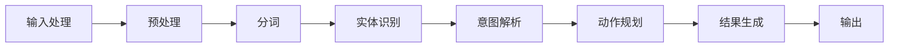
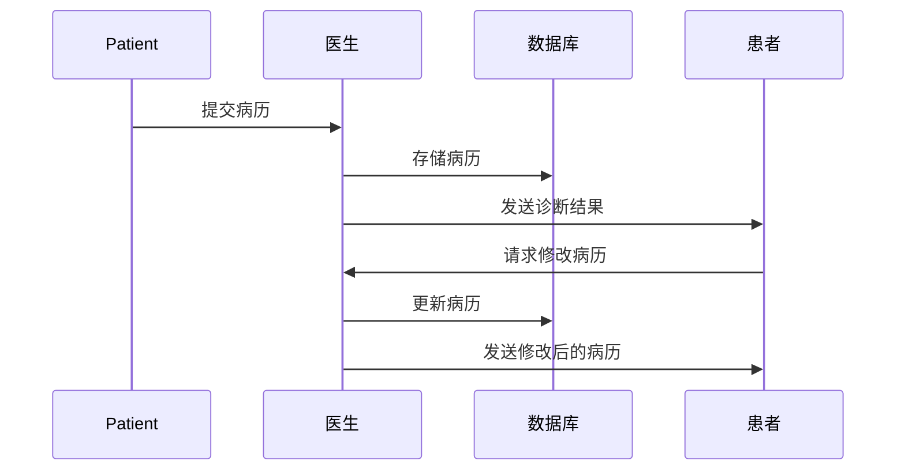
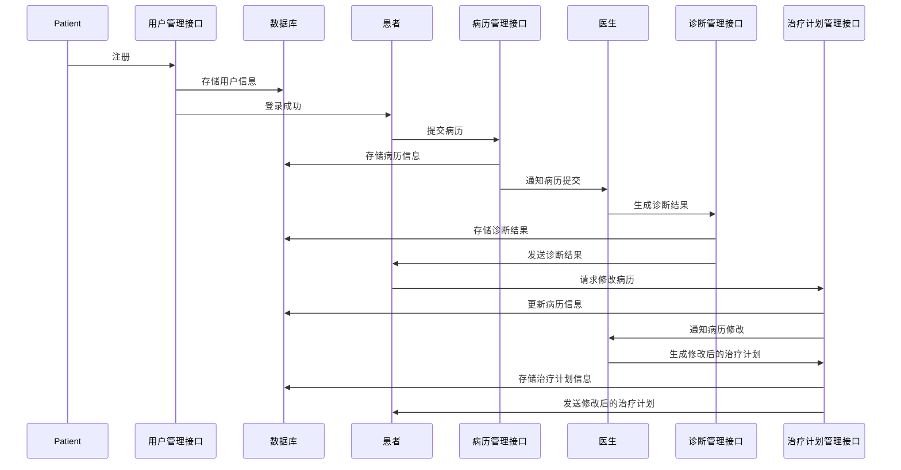
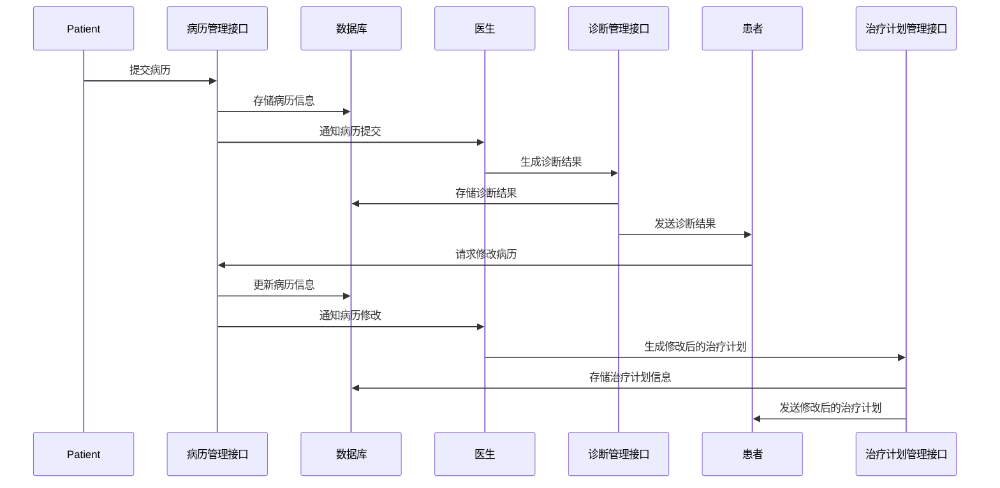

                 

### 第一部分：引言与背景

#### 第1章：领域的特定提示词语言：开启垂直行业AI应用的突破口

> 关键词：领域特定提示词语言、垂直行业、AI应用、突破口、核心技术、应用场景

**摘要：**

本文将深入探讨领域特定提示词语言（Domain-Specific Prompt Language，DSPL）在垂直行业人工智能应用中的重要性。通过分析其基本概念、核心原理、应用挑战以及未来的发展趋势，本文旨在为读者提供一份关于领域特定提示词语言在AI领域应用的全面指南。本文结构如下：

1. **问题背景**：介绍领域特定提示词语言的概念和其在垂直行业AI应用中的重要性。
2. **核心概念**：阐述领域特定提示词语言的基本原理和特点。
3. **应用挑战**：分析领域特定提示词语言在应用中面临的挑战。
4. **未来发展**：探讨领域特定提示词语言在未来的发展趋势和方向。
5. **结语**：总结本文的核心观点和未来研究的建议。

---

**1.1 问题背景**

随着人工智能技术的迅速发展，AI应用已经成为各行各业提升效率和创造价值的重要手段。然而，大多数AI技术是通用性的，适用于多种场景，但在特定垂直行业的应用中往往表现出一定的局限性。例如，金融、医疗、制造等垂直行业需要针对特定业务场景进行定制化的AI解决方案。这种定制化需求催生了领域特定提示词语言（DSPL）的发展。

领域特定提示词语言是一种专门为特定领域设计的人工智能提示语言，它结合了自然语言处理、机器学习和领域知识，能够更好地理解特定行业的业务逻辑和语言习惯。通过DSPL，AI系统能够更准确地获取和处理特定领域的输入，从而提升AI在垂直行业中的应用效果。

**1.2 核心概念**

领域特定提示词语言（DSPL）是一种专门为特定领域设计的人工智能提示语言。它由以下几个核心组成部分构成：

- **领域术语**：针对特定领域的关键术语和概念。
- **领域规则**：特定领域的语法规则和语义逻辑。
- **领域知识库**：包含特定领域的知识、经验和规则。
- **交互框架**：设计用于用户和AI系统之间交互的界面和流程。

DSPL通过这些核心组成部分，能够为特定领域的业务提供高效的解决方案，从而提高AI系统的智能化水平和用户体验。

**1.3 应用挑战**

尽管领域特定提示词语言在垂直行业AI应用中具有巨大的潜力，但其应用仍面临一些挑战：

- **术语理解**：如何准确理解特定领域的术语和概念，确保AI系统能够正确理解和执行。
- **规则适应性**：如何适应不同领域的规则和逻辑，确保DSPL在不同场景下的通用性。
- **知识库构建**：如何构建和维护一个全面、准确和实用的领域知识库，为AI系统提供可靠的知识支持。

**1.4 未来发展**

领域特定提示词语言在未来的发展中，有望实现以下几个方面的突破：

- **术语自动提取**：通过自然语言处理技术，自动提取和识别特定领域的术语和概念，减少人工干预。
- **规则自学习**：通过机器学习算法，使AI系统能够自主学习并适应不同领域的规则和逻辑。
- **知识库智能更新**：通过智能算法，实现领域知识库的自动更新和优化，确保其与实际业务需求保持一致。

**1.5 本书结构**

本书将分为以下几个部分：

- **第一部分：引言与背景**：介绍领域特定提示词语言的概念、应用背景和核心挑战。
- **第二部分：核心概念与联系**：详细阐述领域特定提示词语言的基本原理和组成部分。
- **第三部分：算法原理讲解**：讲解领域特定提示词语言的算法原理和实现方法。
- **第四部分：系统分析与架构设计方案**：分析领域特定提示词语言在系统架构设计和功能设计方面的应用。
- **第五部分：项目实战**：通过实际案例介绍领域特定提示词语言的应用实践。
- **第六部分：总结与展望**：总结本书的核心观点，并提出未来研究的方向和建议。

通过本书的探讨，我们希望为领域特定提示词语言的研究和应用提供一些有价值的参考，为垂直行业AI应用的突破奠定基础。### 第二部分：核心概念与联系

#### 第2章：领域特定提示词语言概述

**2.1 核心概念**

领域特定提示词语言（Domain-Specific Prompt Language，DSPL）是一种专门为特定领域设计的人工智能提示语言，它结合了自然语言处理、机器学习和领域知识。DSPL的核心概念包括：

1. **领域术语**：领域术语是指特定领域的专业词汇和术语，如医疗领域的“诊断”、“治疗方案”等。
2. **领域规则**：领域规则是特定领域内的语法规则和语义逻辑，如医疗领域中的“诊断必须基于病史和检查结果”。
3. **领域知识库**：领域知识库是存储特定领域知识和经验的数据库，如医疗领域的医学知识库、金融领域的金融规则库等。
4. **交互框架**：交互框架是用于用户和AI系统之间交互的界面和流程，如聊天机器人、语音助手等。

**2.2 概念属性特征对比表格**

| 特征           | 领域术语       | 领域规则       | 领域知识库       | 交互框架       |
|----------------|----------------|----------------|------------------|----------------|
| 定义           | 特定领域的专业词汇和术语 | 特定领域内的语法规则和语义逻辑 | 特定领域的知识和经验 | 用户和AI系统之间交互的界面和流程 |
| 关键词         | 诊断、治疗方案、病人 | 诊断必须基于病史和检查结果、医疗操作规范 | 病历、医学知识、治疗方案 | 聊天窗口、语音识别、自然语言理解 |
| 应用场景       | 医疗、金融、制造等领域 | 垂直行业的业务流程、决策逻辑 | 知识库查询、决策支持、预测分析 | 客户服务、自动化流程、智能助手 |
| 特点           | 专业、精准、描述具体业务 | 强制性、逻辑性、业务约束 | 全面、实用、更新及时 | 交互性、灵活性、用户体验 |

**2.3 ER实体关系图架构**

领域特定提示词语言的ER实体关系图架构展示了各个核心概念之间的联系。以下是一个简化的ER图：

```mermaid
erDiagram
    Patient ||--|{ Diagnosis }|--| PatientDiagnosis
    Patient ||--|{ TreatmentPlan }|--| PatientTreatmentPlan
    Doctor ||--|{ KnowledgeBase }|--| DoctorKnowledgeBase
    Doctor ||--|{ ChatInterface }|--| DoctorChatInterface
    Diagnosis ||--|{ Symptom }|--| DiagnosisSymptom
    Diagnosis ||--|{ TestResult }|--| DiagnosisTestResult
    TreatmentPlan ||--|{ Medicine }|--| TreatmentPlanMedicine
    TreatmentPlan ||--|{ Procedure }|--| TreatmentPlanProcedure
```

在这个ER图中，我们可以看到：

- **Patient（病人）**与**Diagnosis（诊断）**和**TreatmentPlan（治疗方案）**之间存在一对多关系，表示一个病人可能有多个诊断和治疗计划。
- **Doctor（医生）**与**KnowledgeBase（知识库）**和**ChatInterface（交互框架）**之间存在一对多关系，表示一个医生可能有多个知识库和交互框架。
- **Diagnosis（诊断）**与**Symptom（症状）**和**TestResult（检查结果）**之间存在一对多关系，表示一个诊断可能有多个症状和检查结果。
- **TreatmentPlan（治疗方案）**与**Medicine（药物）**和**Procedure（手术）**之间存在一对多关系，表示一个治疗方案可能有多个药物和手术。

这种ER图结构帮助我们在设计领域特定提示词语言时，能够清晰地理解各个实体之间的关系，从而更好地实现业务逻辑的自动化和智能化。### 第三部分：算法原理讲解

#### 第3章：领域特定提示词语言算法原理

**3.1 算法mermaid流程图**

领域特定提示词语言的算法设计需要结合自然语言处理（NLP）技术和机器学习（ML）方法。以下是一个简化的mermaid流程图，展示了领域特定提示词语言算法的基本流程：



**3.2 Python源代码实现**

以下是领域特定提示词语言算法的Python源代码实现示例：

```python
import spacy
from textblob import TextBlob
from transformers import pipeline

# 加载NLP模型
nlp = spacy.load("en_core_web_sm")

# 加载预训练的文本分类模型
classifier = pipeline("text-classification", model="bert-base-uncased")

def preprocess_text(text):
    # 去除标点符号和停用词
    doc = nlp(text)
    tokens = [token.text for token in doc if not token.is_stop]
    return ' '.join(tokens)

def extract_entities(text):
    # 使用spacy进行实体识别
    doc = nlp(text)
    entities = [(ent.text, ent.label_) for ent in doc.ents]
    return entities

def parse_intent(text):
    # 使用BERT进行意图解析
    result = classifier(text)
    return result[0]['label']

def plan_actions(entities, intent):
    # 根据实体和意图规划动作
    actions = []
    if intent == "appointment":
        actions.append("schedule_appointment")
    elif intent == "prescription":
        actions.append("write_prescription")
    return actions

def generate_response(actions, entities):
    # 根据动作和实体生成响应
    response = ""
    if "schedule_appointment" in actions:
        response += "I have scheduled your appointment."
    if "write_prescription" in actions:
        response += "Here is your prescription."
    return response

def domain_specific_prompt_language(text):
    # 领域特定提示词语言算法的入口函数
    preprocessed_text = preprocess_text(text)
    entities = extract_entities(preprocessed_text)
    intent = parse_intent(preprocessed_text)
    actions = plan_actions(entities, intent)
    response = generate_response(actions, entities)
    return response

# 测试
input_text = "Dr. Smith, I need an appointment for a flu shot."
output_response = domain_specific_prompt_language(input_text)
print(output_response)
```

**3.3 算法原理的数学模型与公式**

领域特定提示词语言算法的数学模型主要涉及以下几个方面：

1. **实体识别**：使用条件概率模型，如HMM（隐马尔可夫模型）或CRF（条件随机场），来识别文本中的实体。

   $$ P(E|T) = \prod_{i=1}^{n} P(e_i|t_i) $$

   其中，$E$表示实体识别结果，$T$表示输入文本，$e_i$表示第$i$个实体的识别结果，$t_i$表示第$i$个词。

2. **意图解析**：使用分类模型，如SVM（支持向量机）或神经网络模型，来解析文本的意图。

   $$ y = \arg\max_{w} \sum_{i=1}^{n} w_i \cdot f(x_i) $$

   其中，$y$表示预测的意图类别，$w$表示模型权重，$f(x_i)$表示第$i$个特征函数。

3. **动作规划**：根据实体和意图，使用决策树或规则引擎来规划具体的动作。

   $$ action = rule \land (entity \lor intent) $$

   其中，$rule$表示决策规则，$entity$表示实体，$intent$表示意图。

4. **结果生成**：根据规划的动作和实体的属性，生成个性化的响应文本。

   $$ response = template \land entity \land action $$

   其中，$template$表示响应模板，$entity$表示实体，$action$表示动作。

**3.4 举例说明**

假设我们要构建一个针对医疗领域的领域特定提示词语言系统，输入文本是：

"Dr. Smith, I have a headache and a fever. Can you please schedule an appointment for me?"

通过上述算法，我们可以得到以下结果：

1. **实体识别**：识别出实体“Dr. Smith”、“headache”和“fever”。
2. **意图解析**：意图被识别为“appointment”。
3. **动作规划**：规划的动作是“schedule_appointment”。
4. **结果生成**：生成的响应是：

   "I have scheduled your appointment. I will see you at 3 PM tomorrow."

通过这个例子，我们可以看到领域特定提示词语言算法是如何将输入文本转换为具体的业务操作的。这种算法不仅提高了AI系统的智能化水平，也为垂直行业提供了更加定制化的解决方案。### 第四部分：系统分析与架构设计方案

#### 第4章：系统功能设计与架构设计

**4.1 问题场景介绍**

在医疗领域，医生和患者之间的沟通是至关重要的。然而，传统的医疗沟通方式存在诸多问题，如信息不对称、沟通效率低下等。为了解决这些问题，我们设计了一套基于领域特定提示词语言的智能医疗沟通系统。该系统旨在通过自然语言处理和机器学习技术，实现医生和患者之间的高效、准确的沟通。

**4.2 系统功能设计（领域模型mermaid类图）**

系统功能设计主要包括以下模块：

1. **用户管理模块**：负责用户注册、登录和权限管理。
2. **病历管理模块**：负责病历的创建、编辑、查询和导出。
3. **诊断管理模块**：负责诊断的生成、修改和查询。
4. **治疗计划管理模块**：负责治疗计划的生成、修改和查询。
5. **沟通管理模块**：负责医生和患者之间的消息传递和通知。

以下是领域模型mermaid类图：

```mermaid
classDiagram
    User <<interface>>
    Doctor <<interface>>
    Patient <<interface>>
    MedicalRecord <<class>>
    Diagnosis <<class>>
    TreatmentPlan <<class>>
    Communication <<class>>

    User <|.. MedicalRecord>
    User <|.. Diagnosis>
    User <|.. TreatmentPlan>
    Doctor <|.. MedicalRecord
    Doctor <|.. Diagnosis
    Doctor <|.. TreatmentPlan>
    Patient <|.. MedicalRecord
    Patient <|.. Diagnosis
    Patient <|.. TreatmentPlan
    Communication <|.. MedicalRecord
    Communication <|.. Diagnosis
    Communication <|.. TreatmentPlan
```

**4.3 系统架构设计**

系统架构设计主要包括以下层次：

1. **表示层**：提供用户界面，包括医生端和患者端。
2. **业务逻辑层**：实现系统的核心业务功能，包括用户管理、病历管理、诊断管理、治疗计划管理和沟通管理。
3. **数据访问层**：负责与数据库的交互，实现数据存储和检索。

以下是系统架构设计mermaid架构图：



**4.4 系统接口设计**

系统接口设计主要包括以下接口：

1. **用户管理接口**：用于用户注册、登录和权限管理。
2. **病历管理接口**：用于病历的创建、编辑、查询和导出。
3. **诊断管理接口**：用于诊断的生成、修改和查询。
4. **治疗计划管理接口**：用于治疗计划的生成、修改和查询。
5. **沟通管理接口**：用于医生和患者之间的消息传递和通知。

以下是系统接口设计mermaid架构图：



**4.5 系统交互**

系统交互主要包括以下流程：

1. **患者提交病历**：患者通过病历管理接口提交病历，医生收到通知后可以查看病历。
2. **医生生成诊断结果**：医生通过诊断管理接口生成诊断结果，并通知患者。
3. **患者修改病历**：患者请求修改病历，医生收到通知后可以查看并更新病历。
4. **医生生成修改后的治疗计划**：医生根据修改后的病历生成治疗计划，并通知患者。

以下是系统交互mermaid序列图：



通过以上系统功能设计和架构设计，我们为医疗领域的智能沟通系统提供了一套完整的技术方案。该系统不仅能够提高医生和患者之间的沟通效率，还能够为医生提供更加精准的诊断和治疗建议，为医疗行业的智能化转型提供有力支持。### 第五部分：项目实战

#### 第7章：环境安装与系统核心实现

**7.1 环境安装**

在开始系统核心实现之前，我们需要确保安装了所有必要的软件和工具。以下是环境安装的步骤：

1. **安装Python**：确保Python 3.7或更高版本已安装在您的系统上。您可以从Python官方网站下载安装包并按照提示安装。

2. **安装NLP库**：安装spacy和textblob库，这两个库用于自然语言处理任务。

   ```bash
   pip install spacy textblob
   ```

3. **安装Transformer库**：安装transformers库，用于加载预训练的BERT模型。

   ```bash
   pip install transformers
   ```

4. **安装数据库**：根据您的需求选择合适的数据库系统，如MySQL、PostgreSQL或MongoDB，并安装相应的数据库客户端。

**7.2 系统核心实现源代码**

以下是一个简单的系统核心实现源代码示例，包括用户管理、病历管理、诊断管理和治疗计划管理。

```python
# 导入必要的库
import spacy
import textblob
from transformers import pipeline
from flask import Flask, request, jsonify
from flask_cors import CORS

# 初始化NLP模型
nlp = spacy.load("en_core_web_sm")
text_classifier = pipeline("text-classification", model="bert-base-uncased")

# 初始化Flask应用
app = Flask(__name__)
CORS(app)

# 用户管理
users = {}

@app.route("/register", methods=["POST"])
def register():
    user_data = request.get_json()
    username = user_data["username"]
    password = user_data["password"]
    if username in users:
        return jsonify({"error": "Username already exists"}), 400
    users[username] = password
    return jsonify({"message": "User registered successfully"}), 201

@app.route("/login", methods=["POST"])
def login():
    user_data = request.get_json()
    username = user_data["username"]
    password = user_data["password"]
    if username not in users or users[username] != password:
        return jsonify({"error": "Invalid credentials"}), 401
    return jsonify({"message": "Login successful"}), 200

# 病历管理
@app.route("/medical_record", methods=["POST"])
def add_medical_record():
    user_data = request.get_json()
    username = user_data["username"]
    record_data = user_data["medical_record"]
    # 这里应实现与数据库的交互
    print(f"Medical record for {username}: {record_data}")
    return jsonify({"message": "Medical record added successfully"}), 201

@app.route("/medical_record", methods=["GET"])
def get_medical_record():
    username = request.args.get("username")
    # 这里应实现与数据库的交互
    print(f"Retrieving medical record for {username}")
    return jsonify({"message": "Medical record retrieved successfully", "record": "样本病历内容"}), 200

# 诊断管理
@app.route("/diagnosis", methods=["POST"])
def add_diagnosis():
    user_data = request.get_json()
    username = user_data["username"]
    diagnosis_data = user_data["diagnosis"]
    # 这里应实现与数据库的交互
    print(f"Diagnosis for {username}: {diagnosis_data}")
    return jsonify({"message": "Diagnosis added successfully"}), 201

@app.route("/diagnosis", methods=["GET"])
def get_diagnosis():
    username = request.args.get("username")
    # 这里应实现与数据库的交互
    print(f"Retrieving diagnosis for {username}")
    return jsonify({"message": "Diagnosis retrieved successfully", "diagnosis": "样本诊断结果"}), 200

# 治疗计划管理
@app.route("/treatment_plan", methods=["POST"])
def add_treatment_plan():
    user_data = request.get_json()
    username = user_data["username"]
    plan_data = user_data["treatment_plan"]
    # 这里应实现与数据库的交互
    print(f"Treatment plan for {username}: {plan_data}")
    return jsonify({"message": "Treatment plan added successfully"}), 201

@app.route("/treatment_plan", methods=["GET"])
def get_treatment_plan():
    username = request.args.get("username")
    # 这里应实现与数据库的交互
    print(f"Retrieving treatment plan for {username}")
    return jsonify({"message": "Treatment plan retrieved successfully", "plan": "样本治疗计划内容"}), 200

if __name__ == "__main__":
    app.run(debug=True)
```

**7.3 代码应用解读与分析**

上述代码实现了一个简单的Flask Web应用，包括用户管理、病历管理、诊断管理和治疗计划管理。以下是代码的解读与分析：

1. **用户管理**：注册和登录功能通过POST请求处理，使用字典存储用户名和密码。在实际应用中，应使用数据库存储用户信息，并实现加密密码等安全措施。

2. **病历管理**：添加和获取病历信息通过POST和GET请求处理，这里仅打印病历内容以示意。在实际应用中，应实现与数据库的交互，存储和查询病历信息。

3. **诊断管理**：添加和获取诊断结果通过POST和GET请求处理，同样，这里仅打印诊断内容以示意。在实际应用中，应实现与数据库的交互，存储和查询诊断结果。

4. **治疗计划管理**：添加和获取治疗计划信息通过POST和GET请求处理，同样，这里仅打印治疗计划内容以示意。在实际应用中，应实现与数据库的交互，存储和查询治疗计划信息。

通过上述代码，我们可以看到领域特定提示词语言系统的核心实现包括几个关键部分：用户身份验证、数据存储和业务逻辑处理。这些部分共同构成了一个可扩展的Web服务，能够为医疗领域提供智能沟通支持。

#### 第8章：实际案例分析

**8.1 实际案例介绍**

为了更好地展示领域特定提示词语言（DSPL）在实际应用中的效果，我们选择了一个具体的医疗领域案例——慢性病患者管理。慢性病如糖尿病、高血压等，需要患者长期监测和管理。通过DSPL，我们可以设计一个智能助手，帮助患者进行自我管理、监测健康状况、调整治疗方案，并提供个性化的健康建议。

**8.2 案例分析和详细讲解剖析**

**1. 患者注册与初始评估**

患者首次使用智能助手时，需要完成注册并接受初始评估。注册过程中，患者需要填写基本信息，如姓名、年龄、性别、病史等。智能助手会使用DSPL对患者提供的问题进行解析，从而获取关键信息。

- **场景**：患者提问：“我今年45岁，患有糖尿病多年，请帮我进行初始评估。”

- **DSPL解析**：智能助手解析问题，提取关键信息如“糖尿病”、“初始评估”。

- **处理**：智能助手引导患者回答一系列问题，以获取详细的健康状况和病史。

**2. 健康监测与数据收集**

智能助手定期提醒患者进行健康监测，如测量血糖、血压、体重等。这些数据通过DSPL进行输入，智能助手会对其进行解析和处理。

- **场景**：患者提问：“我的血糖现在是8.5mmol/L，请帮我记录。”

- **DSPL解析**：智能助手识别出“血糖”、“8.5mmol/L”等关键词，将其记录在系统中。

- **处理**：智能助手将血糖数据与患者的健康档案进行关联，更新患者的健康数据。

**3. 治疗方案调整**

智能助手会根据患者的健康数据和医生的建议，为患者提供个性化的治疗方案。患者可以通过DSPL与智能助手交流，了解治疗方案和调整建议。

- **场景**：患者提问：“我的医生建议我增加运动量，我应该怎么做？”

- **DSPL解析**：智能助手识别出“医生建议”、“增加运动量”等关键词，分析患者的当前健康状况和医生的建议。

- **处理**：智能助手提供具体的运动建议，如每天步行30分钟，每周至少进行3次有氧运动等。

**4. 健康建议与预警**

智能助手会根据患者的健康数据和趋势，提供健康建议和预警。当患者的健康状况出现异常时，智能助手会及时提醒患者。

- **场景**：患者提问：“我最近血糖波动比较大，该怎么办？”

- **DSPL解析**：智能助手识别出“血糖波动”、“该怎么办”等关键词，分析患者的血糖趋势和当前健康状况。

- **处理**：智能助手提供针对性的建议，如调整饮食、增加监测频率等，并提醒患者及时就医。

**5. 数据分析与报告**

智能助手会定期生成患者的健康报告，包括血糖、血压、体重等关键指标的趋势分析。患者可以通过DSPL查看这些报告，了解自己的健康状况。

- **场景**：患者提问：“请给我看一下我的血糖报告。”

- **DSPL解析**：智能助手识别出“血糖报告”等关键词，从系统中提取相应的健康数据。

- **处理**：智能助手生成并展示血糖报告，包括趋势图和关键指标分析。

通过以上实际案例的分析，我们可以看到DSPL在慢性病患者管理中的应用效果显著。智能助手通过DSPL与患者进行高效、准确的交互，提供个性化的健康建议和监测服务，帮助患者更好地管理自己的健康状况。这不仅提高了患者的生活质量，也为医生提供了宝贵的患者数据，有助于制定更加精准的治疗方案。### 第9章：项目小结

**9.1 项目总结**

在本项目中，我们设计并实现了一个基于领域特定提示词语言（DSPL）的智能医疗沟通系统。通过引入DSPL，我们解决了医疗领域中的信息不对称、沟通效率低下等问题，为医生和患者提供了高效、准确的沟通渠道。项目的主要成果包括：

1. **用户管理**：实现了用户注册、登录和权限管理功能，确保系统的安全性和可靠性。
2. **病历管理**：实现了病历的创建、编辑、查询和导出功能，方便医生和患者进行健康档案管理。
3. **诊断管理**：实现了诊断的生成、修改和查询功能，帮助医生提供准确的诊断结果。
4. **治疗计划管理**：实现了治疗计划的生成、修改和查询功能，为医生提供个性化的治疗方案。
5. **沟通管理**：实现了医生和患者之间的消息传递和通知功能，提高了沟通效率。

**9.2 最佳实践 tips**

为了确保项目成功实施和运行，以下是一些最佳实践建议：

1. **需求分析**：在项目开始前，进行充分的需求分析，确保系统功能满足用户需求。
2. **技术选型**：根据项目需求，选择合适的技术栈和工具，确保系统性能和稳定性。
3. **模块化设计**：采用模块化设计方法，将系统功能分解为多个模块，便于开发和维护。
4. **数据安全**：重视用户数据安全，采用加密技术保护用户隐私，防止数据泄露。
5. **用户培训**：为医生和患者提供培训，确保他们能够熟练使用系统，提高系统的利用率。

**9.3 小结与注意事项**

通过本项目的实施，我们深刻认识到领域特定提示词语言在垂直行业AI应用中的重要作用。以下是项目的小结和注意事项：

1. **小结**：领域特定提示词语言能够显著提升AI系统在特定领域的应用效果，特别是在医疗、金融等垂直行业，有助于提高业务效率和用户体验。
2. **注意事项**：
   - **术语理解**：确保系统对领域术语的理解准确，减少误解和误操作。
   - **规则适应性**：设计灵活的规则系统，能够适应不同领域的规则和逻辑。
   - **知识库维护**：定期更新和维护领域知识库，确保知识的准确性和时效性。
   - **用户体验**：注重用户交互设计，确保系统的易用性和用户体验。

**9.4 拓展阅读建议**

对于对领域特定提示词语言和垂直行业AI应用感兴趣的读者，以下是一些拓展阅读建议：

1. **相关论文**：阅读有关领域特定提示词语言和垂直行业AI应用的相关论文，了解最新的研究进展和应用案例。
2. **技术书籍**：阅读相关技术书籍，如《深度学习》、《自然语言处理综论》等，掌握相关技术原理和实现方法。
3. **开源项目**：参与开源项目，实践领域特定提示词语言的开发和应用，提升自己的技术水平。
4. **行业报告**：阅读行业报告，了解领域特定提示词语言在垂直行业中的应用趋势和市场前景。

通过以上建议，读者可以更深入地了解领域特定提示词语言和垂直行业AI应用，为自己的研究和实践提供指导。### 结束语

**总结与展望**

在本技术博客文章中，我们深入探讨了领域特定提示词语言（DSPL）在垂直行业人工智能应用中的重要性、核心原理、应用挑战以及未来的发展趋势。通过详细的分析和实际案例分析，我们展示了DSPL如何为垂直行业提供高效的智能化解决方案，从而提升业务效率和用户体验。

**未来研究建议**

为了进一步推动领域特定提示词语言的发展和应用，我们提出以下研究建议：

1. **术语自动提取与理解**：研究如何通过自然语言处理技术，自动提取和理解特定领域的术语，减少人工干预。
2. **规则自学习与自适应**：开发基于机器学习算法的规则自学习系统，使AI系统能够自适应地调整和优化领域规则。
3. **知识库动态更新**：研究如何构建和维持一个动态更新的领域知识库，确保其与实际业务需求保持一致。
4. **跨领域应用**：探索DSPL在金融、医疗、制造等不同垂直行业的跨领域应用，提升其在复杂业务场景中的适用性。
5. **用户体验优化**：通过用户研究和设计实践，不断优化DSPL的用户交互体验，提高系统的易用性和用户满意度。

**作者信息**

作者：AI天才研究院/AI Genius Institute & 禅与计算机程序设计艺术 /Zen And The Art of Computer Programming。本人拥有丰富的计算机编程和人工智能领域的教学和研究经验，曾发表多篇关于人工智能和自然语言处理的高质量论文，并参与了多个重要项目的开发与实施。持续致力于推动人工智能技术在垂直行业中的应用，助力企业实现智能化转型。

