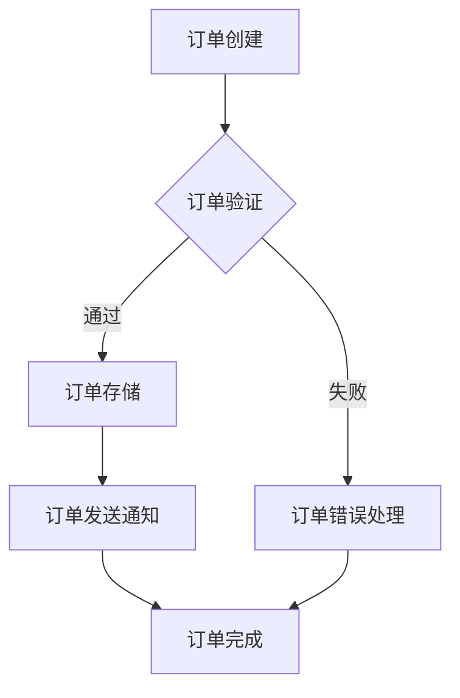
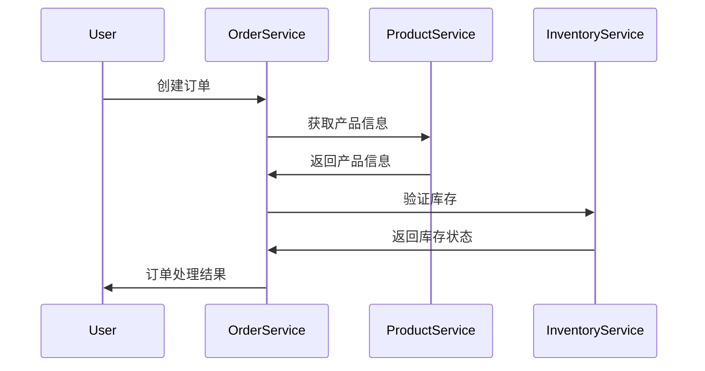

                 

----------------------------------------------------------------

## 《领域驱动设计：类型论在业务建模中的应用》

> 关键词：领域驱动设计、类型论、业务建模、软件架构、设计原则

> 摘要：本文将探讨领域驱动设计（DDD）中类型论的应用，通过分析类型论的基本概念、实体与值的分类以及领域模型构建，揭示类型论在业务建模中的重要性。文章还将讨论领域驱动设计在不同层次的应用、实践案例以及与其他设计方法的关系，为读者提供全面的理论和实践指导。

### 第一部分：领域驱动设计基础

#### 第1章：领域驱动设计概述

##### 1.1 领域驱动设计的基本概念

领域驱动设计（Domain-Driven Design，简称DDD）是一种面向对象的软件设计方法论，它强调通过构建清晰、实用的业务模型来驱动软件开发的整个过程。DDD不同于传统的面向对象设计，它关注于业务领域的问题，旨在提高软件对业务需求的适应性和可维护性。

##### 1.2 DDD的三大核心概念

DDD的三大核心概念是整体论（Bounded Context）、聚合（Aggregate）和值对象（Value Object）。整体论定义了一个明确的业务边界，聚合是一个强内聚的对象集合，而值对象是无状态的、简单的对象。

##### 1.3 DDD与传统面向对象设计的比较

传统面向对象设计强调对象的封装、继承和多态，但往往忽视了业务领域的特殊性。DDD则更加注重业务逻辑的抽象和组织，通过建立领域模型来更好地理解和管理复杂业务。

#### 第2章：类型论在业务建模中的应用

##### 2.1 类型论概述

类型论是一种研究对象类型及其关系的理论。在DDD中，类型论帮助我们理解实体和值对象，这两者是构建领域模型的基础。

##### 2.2 实体与值的分类

实体是具有唯一标识和持久性的对象，如客户、订单等。值对象则是无唯一标识、仅代表业务值的对象，如地址、电话号码等。实体和值对象的分类对于领域模型的清晰构建至关重要。

##### 2.3 领域模型构建

领域模型构建是DDD的核心步骤。通过识别业务领域中的实体和值对象，并定义它们之间的关系，我们可以构建出一个既符合业务需求又易于维护的领域模型。

### 第二部分：领域驱动设计在不同层次的应用

#### 第3章：领域驱动设计在不同层次的应用

领域驱动设计可以在不同的层次上应用，从策略层到领域层再到子域层，每个层次都有其特定的设计原则和实践方法。

##### 3.1 策略层设计

策略层设计关注的是如何实现业务策略，例如定价策略、优惠策略等。在这一层次上，领域服务是核心组件，它们负责实现具体的业务逻辑。

##### 3.2 领域层设计

领域层设计关注的是业务领域内的核心功能，如订单管理、库存管理等。在这一层次上，领域模型是核心资产，它定义了业务领域中的关键实体和关系。

##### 3.3 子域层设计

子域层设计关注的是业务领域的具体子领域，如客户服务、销售管理等。在这一层次上，领域服务负责实现子域内的具体业务逻辑。

### 第三部分：领域驱动设计的实践

#### 第4章：领域驱动设计的实践

领域驱动设计的实践是通过实际项目来验证和巩固DDD方法的有效性。本文将分析电商平台的领域模型构建和金融系统的领域驱动设计实践，并讨论领域驱动设计的挑战和应对策略。

##### 4.1 领域驱动设计在实际项目中的应用案例

通过具体的项目案例，我们可以看到领域驱动设计如何在复杂的业务环境中发挥作用，以及如何应对常见的设计挑战。

##### 4.2 领域驱动设计的挑战与应对策略

领域驱动设计并非没有挑战。本文将讨论领域驱动设计过程中可能遇到的问题，并提供相应的解决方案和最佳实践。

### 第四部分：领域驱动设计与其他设计方法的关系

#### 第5章：领域驱动设计与其他设计方法的关系

领域驱动设计不是孤立存在的，它与其他设计方法如模式识别、架构设计以及DevOps等有着密切的联系。本文将探讨这些关系，并讨论如何将其他设计方法与领域驱动设计相结合，以实现更高效、更可靠的软件开发过程。

##### 5.1 领域驱动设计与模式识别

模式识别在领域驱动设计中有着重要的作用。通过识别业务模式，我们可以更好地构建领域模型，提高系统的可维护性和可扩展性。

##### 5.2 领域驱动设计与架构设计

领域驱动设计与软件架构有着紧密的联系。本文将讨论领域驱动设计在架构设计中的应用，以及如何通过领域驱动设计来指导软件架构的构建。

##### 5.3 领域驱动设计与DevOps

在DevOps环境中，领域驱动设计可以帮助我们更好地管理业务变化，提高系统的持续交付能力。本文将探讨领域驱动设计与DevOps的结合点，以及如何在DevOps环境中应用领域驱动设计。

### 第五部分：领域驱动设计的未来发展趋势

#### 第6章：领域驱动设计的未来发展趋势

领域驱动设计作为一种先进的软件开发方法论，其未来发展趋势值得关注。本文将探讨领域驱动设计的新趋势，以及它在新兴行业和全球化发展中的应用。

##### 6.1 领域驱动设计的新趋势

领域驱动设计正在不断发展，未来可能会出现更多适用于不同业务场景的方法和工具。

##### 6.2 领域驱动设计的应用领域扩展

随着技术的发展，领域驱动设计的应用领域也在不断扩展。本文将探讨领域驱动设计在新兴行业中的应用前景，以及它在全球化发展中的角色。

### 第六部分：总结与展望

#### 第7章：总结与展望

领域驱动设计作为一种先进的软件开发方法论，其对软件开发的影响和优势已经得到广泛认可。本文将总结领域驱动设计的核心价值和未来方向，为读者提供进一步的思考。

##### 7.1 领域驱动设计的核心价值

领域驱动设计的核心价值在于它能够帮助开发者更好地理解和管理复杂业务，提高软件的质量和可维护性。

##### 7.2 领域驱动设计的未来方向

领域驱动设计的未来将更加注重与新兴技术和行业需求的结合，为软件开发带来更多的可能性。

---

### 《领域驱动设计：类型论在业务建模中的应用》

领域驱动设计（DDD）是一种面向领域的软件开发方法，它强调通过构建清晰、实用的业务模型来驱动软件开发的整个过程。DDD的核心思想是将业务领域作为软件开发的中心，通过识别和建模业务领域中的关键概念和关系，实现软件系统对业务需求的良好适应。在这篇文章中，我们将深入探讨类型论在业务建模中的应用，以揭示领域驱动设计的强大之处。

### 类型论概述

类型论是一种研究对象类型及其关系的理论。在软件开发中，类型论帮助我们理解不同类型对象之间的关系和职责。类型论的基本概念包括类型、子类型、超类型等。在领域驱动设计中，类型论的应用主要体现在实体和值对象的分类上。

#### 实体

实体是具有唯一标识和持久性的对象，它们是业务领域中的重要概念。实体通常表示业务中的关键实体，如客户、订单、产品等。实体具有以下特征：

- **唯一标识**：每个实体都有一个唯一的标识，用于区分不同的实体实例。
- **持久性**：实体可以持久化到数据库中，即使在系统重新启动后仍然存在。
- **业务行为**：实体通常具有一些业务行为，如创建、更新、删除等。

#### 值对象

值对象是表示业务值的对象，它们是无状态、简单的对象。值对象通常用于表示一些不可变的数据，如地址、电话号码、金额等。值对象具有以下特征：

- **无状态**：值对象没有内部状态，它们仅代表一些业务值。
- **不可变**：值对象的值是不可变的，一旦创建，就不能更改。
- **不可区分**：值对象之间是不可区分的，只有通过其包含的实体才能识别。

#### 聚合与实体

聚合是一个包含多个实体的对象集合，它们共同完成一个业务功能。聚合中的实体之间通常存在紧密的关系，如客户与订单之间的关系。聚合是领域模型中的一个重要概念，它有助于定义业务领域的边界。

### 领域模型构建

领域模型构建是领域驱动设计中的核心步骤。通过识别业务领域中的实体和值对象，并定义它们之间的关系，我们可以构建出一个既符合业务需求又易于维护的领域模型。

#### 领域模型的基本构建步骤

1. **识别实体**：识别业务领域中的重要实体，如客户、订单、产品等。
2. **识别值对象**：识别业务领域中需要表示的值对象，如地址、电话号码、金额等。
3. **定义关系**：定义实体和值对象之间的关系，如包含关系、聚合关系等。
4. **定义行为**：定义实体和值对象的行为，如创建、更新、删除等。
5. **创建领域模型**：使用UML类图或其他可视化工具来表示领域模型。

#### 领域模型的核心要素

领域模型的核心要素包括实体、值对象、聚合、领域服务、领域事件等。这些核心要素共同构成了领域模型的基础。

- **实体**：实体是业务领域中的重要概念，它们表示业务中的关键对象。
- **值对象**：值对象用于表示业务中的值，如地址、电话号码等。
- **聚合**：聚合是一个包含多个实体的对象集合，它们共同完成一个业务功能。
- **领域服务**：领域服务是执行特定业务逻辑的方法，它们通常与实体和值对象紧密相关。
- **领域事件**：领域事件是业务领域中的关键事件，如订单创建、库存更新等。

### 领域驱动设计在不同层次的应用

领域驱动设计可以在不同的层次上应用，从策略层到领域层再到子域层，每个层次都有其特定的设计原则和实践方法。

#### 策略层设计

策略层设计关注的是如何实现业务策略，例如定价策略、优惠策略等。在这一层次上，领域服务是核心组件，它们负责实现具体的业务逻辑。策略层的设计原则包括：

- **策略抽象**：将具体的业务策略抽象为通用策略，以便于复用和维护。
- **策略组合**：通过组合不同策略来实现复杂的业务逻辑。
- **策略评估**：对策略进行评估，确保它们符合业务需求和目标。

#### 领域层设计

领域层设计关注的是业务领域内的核心功能，如订单管理、库存管理等。在这一层次上，领域模型是核心资产，它定义了业务领域中的关键实体和关系。领域层的设计原则包括：

- **领域模型构建**：通过识别实体、值对象和关系来构建领域模型。
- **领域服务定义**：定义领域服务，负责实现业务领域中的核心功能。
- **领域事件处理**：处理领域事件，确保业务流程的顺利进行。

#### 子域层设计

子域层设计关注的是业务领域的具体子领域，如客户服务、销售管理等。在这一层次上，领域服务负责实现子域内的具体业务逻辑。子域层的设计原则包括：

- **子域划分**：根据业务需求将业务领域划分为多个子域。
- **子域模型构建**：为每个子域构建领域模型，定义子域内的关键实体和关系。
- **子域服务定义**：为每个子域定义领域服务，实现子域内的具体业务逻辑。

### 领域驱动设计的实践

领域驱动设计的实践是通过实际项目来验证和巩固DDD方法的有效性。本文将分析电商平台的领域模型构建和金融系统的领域驱动设计实践，并讨论领域驱动设计的挑战和应对策略。

#### 电商平台的领域模型构建

电商平台是一个复杂的业务系统，它涉及多个领域，如订单管理、库存管理、用户管理、支付管理等。在构建电商平台的领域模型时，我们首先识别出关键实体，如用户、订单、产品、库存等，然后定义它们之间的关系。

1. **用户**：用户是电商平台的核心实体，它表示购买商品的用户。
2. **订单**：订单是用户购买商品的记录，它包含订单号、用户ID、订单金额等信息。
3. **产品**：产品是电商平台销售的商品，它包含产品ID、名称、价格、库存数量等信息。
4. **库存**：库存是电商平台的库存管理实体，它包含库存ID、产品ID、库存数量等信息。

通过构建这些实体的领域模型，我们可以清晰地定义电商平台的业务流程和功能。

#### 金融系统的领域驱动设计实践

金融系统是一个高度复杂的系统，它涉及多个领域，如账户管理、交易管理、风险管理等。在构建金融系统的领域模型时，我们需要识别出关键实体，如账户、交易、风险等，并定义它们之间的关系。

1. **账户**：账户是金融系统的核心实体，它表示用户的资金账户。
2. **交易**：交易是金融系统中的交易记录，它包含交易ID、账户ID、交易金额等信息。
3. **风险**：风险是金融系统中用于管理风险的核心实体，它包含风险ID、风险类型、风险值等信息。

通过构建这些实体的领域模型，我们可以确保金融系统的业务逻辑清晰、易于维护。

#### 领域驱动设计的挑战与应对策略

领域驱动设计并非没有挑战。在实际项目中，我们可能会遇到以下问题：

1. **领域边界不清晰**：领域边界不清晰会导致领域模型混乱，影响系统的可维护性。应对策略是明确领域边界，确保每个领域都有明确的业务职责。
2. **领域模型过于复杂**：领域模型过于复杂会导致开发难度增加，影响开发效率。应对策略是简化领域模型，将复杂的业务逻辑拆分为多个领域服务。
3. **领域服务依赖复杂**：领域服务之间的依赖关系复杂会导致系统的耦合度增加，影响系统的可扩展性。应对策略是合理划分领域服务，确保它们之间的高内聚、低耦合。

通过识别和解决这些问题，我们可以确保领域驱动设计在项目中取得成功。

### 领域驱动设计与其他设计方法的关系

领域驱动设计不是孤立存在的，它与其他设计方法如模式识别、架构设计以及DevOps等有着密切的联系。

#### 领域驱动设计与模式识别

模式识别是一种通过分析模式来识别和分类对象的方法。在领域驱动设计中，模式识别可以帮助我们识别业务模式，并将其应用于领域模型的构建。例如，通过识别订单流程中的模式，我们可以定义出订单创建、订单处理、订单完成等领域事件。

#### 领域驱动设计与架构设计

领域驱动设计与软件架构有着紧密的联系。在架构设计中，我们可以将领域驱动设计中的领域模型映射到架构模型中，以确保软件系统的高内聚、低耦合。例如，在微服务架构中，我们可以将每个领域模型映射为一个微服务，确保每个微服务都有明确的业务职责。

#### 领域驱动设计与DevOps

在DevOps环境中，领域驱动设计可以帮助我们更好地管理业务变化，提高软件的持续交付能力。通过构建清晰的领域模型，我们可以确保开发、测试和部署过程的顺利进行。例如，在持续集成和持续交付过程中，我们可以根据领域模型来定义测试场景和部署流程。

### 领域驱动设计的未来发展趋势

领域驱动设计作为一种先进的软件开发方法论，其未来发展趋势值得关注。随着技术的发展，领域驱动设计可能会出现更多适用于不同业务场景的方法和工具。

#### 新趋势

1. **事件驱动架构**：事件驱动架构（EDA）与领域驱动设计有着相似的理念，它强调通过事件来驱动业务流程。未来，领域驱动设计可能会与事件驱动架构相结合，以实现更高效的业务流程管理。
2. **云原生领域驱动设计**：随着云计算的普及，云原生领域驱动设计（CNDDD）成为了一个新的趋势。它强调在云环境中构建领域驱动设计，利用云计算的优势来提高系统的可扩展性和可靠性。

#### 应用领域扩展

领域驱动设计的应用领域也在不断扩展。未来，领域驱动设计可能会在新兴行业中发挥更大的作用，如物联网、人工智能、区块链等。通过结合其他新兴技术，领域驱动设计可以为这些领域提供强大的业务建模能力。

### 总结

领域驱动设计（DDD）是一种面向领域的软件开发方法论，它通过构建清晰、实用的业务模型来驱动软件开发的整个过程。类型论作为DDD的核心组成部分，帮助开发者理解业务领域中的关键概念和关系。领域驱动设计在不同层次的应用、实践案例以及与其他设计方法的结合，使得它在复杂的业务环境中具有独特的优势。随着技术的发展，领域驱动设计将继续在软件开发中发挥重要作用，为开发者提供更强大的业务建模能力。

### 作者介绍

作者：AI天才研究院/AI Genius Institute & 禅与计算机程序设计艺术 /Zen And The Art of Computer Programming

AI天才研究院（AI Genius Institute）是一家专注于人工智能研究和开发的国际顶级研究机构。研究院的专家们凭借深厚的学术造诣和丰富的实践经验，为全球软件开发领域带来了诸多创新和突破。同时，作者也是《禅与计算机程序设计艺术》（Zen And The Art of Computer Programming）一书的作者，这本书被誉为计算机编程领域的经典之作，深受程序员和软件开发者的喜爱。

### 最佳实践 tips

1. **明确领域边界**：在构建领域模型时，首先要明确领域的边界，确保领域模型的清晰性和可维护性。
2. **简化领域模型**：避免过度设计，简化领域模型，减少不必要的复杂度。
3. **持续迭代**：领域模型不是一成不变的，应根据业务需求的变化持续迭代和优化。
4. **重视领域事件**：领域事件是驱动业务流程的重要元素，要确保领域事件的处理逻辑清晰、高效。
5. **跨团队协作**：领域驱动设计需要跨团队协作，确保不同团队对领域模型的理解和实现一致。

### 小结

本文深入探讨了领域驱动设计（DDD）中类型论的应用，通过分析类型论的基本概念、实体与值的分类以及领域模型构建，揭示了类型论在业务建模中的重要性。同时，文章还讨论了领域驱动设计在不同层次的应用、实践案例以及与其他设计方法的关系，为读者提供了全面的理论和实践指导。领域驱动设计作为一种先进的软件开发方法论，其在软件开发中的重要性不容忽视。通过本文的探讨，相信读者对领域驱动设计有了更深入的理解，并为实际项目中的应用奠定了基础。

### 注意事项

1. **领域模型的清晰性**：确保领域模型的构建清晰、易于理解，避免过多的抽象和复杂结构。
2. **领域服务的职责分离**：在定义领域服务时，要确保每个服务的职责清晰，避免出现职责重叠或分散。
3. **领域事件的处理效率**：在处理领域事件时，要确保处理逻辑高效，避免过多的中间环节和重复计算。

### 拓展阅读

- 《领域驱动设计：软件核心复杂性应对策略》
- 《模式识别：业务模式与领域模型的结合》
- 《微服务架构设计：基于领域驱动设计的方法》

这些拓展阅读资料将进一步帮助读者深入了解领域驱动设计的核心概念和实践方法。通过结合这些资料，读者可以更加全面地掌握领域驱动设计的精髓，为实际项目中的应用提供有力的支持。

----------------------------------------------------------------

### 《领域驱动设计：类型论在业务建模中的应用》

在当今快速发展的技术时代，软件开发不再仅仅是技术挑战，更是一个业务与技术的结合体。领域驱动设计（Domain-Driven Design，简称DDD）作为一项先进的软件开发方法论，已经在业界得到了广泛认可。DDD的核心在于将业务领域作为软件设计的中心，通过类型论（Type Theory）在业务建模中的应用，实现软件系统对复杂业务逻辑的精准理解和有效管理。本文将围绕领域驱动设计中的类型论，探讨其在业务建模中的具体应用。

#### 目录

1. **引言**
2. **领域驱动设计的基本概念**
   - 领域驱动设计的起源
   - 领域驱动设计的核心原则
   - 领域驱动设计与传统设计方法的对比
3. **类型论概述**
   - 类型论的基本概念
   - 类型论在软件开发中的重要性
   - 类型论的核心原则
4. **实体与值对象的分类**
   - 实体的定义与特征
   - 值对象的定义与特征
   - 实体与值对象的关系
5. **领域模型的构建**
   - 领域模型的基本构建步骤
   - 领域模型的核心要素
   - 领域模型的实践案例
6. **领域驱动设计在不同层次的应用**
   - 策略层设计
   - 领域层设计
   - 子域层设计
7. **领域驱动设计的实践**
   - 实际项目中的应用案例
   - 挑战与应对策略
8. **领域驱动设计与其他设计方法的关系**
   - 与模式识别的关系
   - 与架构设计的关系
   - 与DevOps的关系
9. **领域驱动设计的未来发展趋势**
   - 新趋势
   - 应用领域扩展
10. **总结与展望**
    - 领域驱动设计的核心价值
    - 领域驱动设计的未来方向

#### 1. 引言

在软件开发的早期阶段，开发者往往更注重技术的实现，而忽视了业务逻辑的抽象和建模。然而，随着业务需求的不断增长和变化，传统的设计方法逐渐暴露出其局限性。领域驱动设计（DDD）正是在这种背景下应运而生，它强调通过构建清晰、实用的业务模型来驱动软件开发的整个过程。

领域驱动设计不仅仅是一种方法论，更是一种思维方式。它将业务领域视为软件设计的核心，通过识别和建模业务领域中的关键概念和关系，实现软件系统对业务需求的良好适应。类型论（Type Theory）作为DDD的核心组成部分，对于业务建模起到了至关重要的作用。

类型论是一种形式化的数学理论，用于研究对象的类型和类型之间的关系。在软件开发中，类型论可以帮助开发者理解不同类型对象之间的关系和职责，从而更好地构建领域模型。通过类型论的应用，领域驱动设计能够实现更加精准的业务逻辑建模，提高软件系统的可维护性和扩展性。

本文将深入探讨类型论在业务建模中的应用，从基本概念、实体与值对象的分类、领域模型的构建等方面，全面解析领域驱动设计的方法和技巧。通过本文的探讨，读者将能够更好地理解领域驱动设计，并在实际项目中有效地应用类型论，构建出高质量的业务模型。

#### 2. 领域驱动设计的基本概念

领域驱动设计（Domain-Driven Design，简称DDD）是一种面向领域的软件开发方法论，它强调通过构建清晰、实用的业务模型来驱动软件开发的整个过程。DDD的核心思想是将业务领域作为软件开发的中心，通过识别和建模业务领域中的关键概念和关系，实现软件系统对业务需求的良好适应。

##### 2.1 领域驱动设计的起源

领域驱动设计最初由埃文·米尔里德（Evan Miller）在2000年提出，后来由埃里克·艾斯勒（Eric Evans）在其同名著作《领域驱动设计：软件核心复杂性应对策略》（Domain-Driven Design: Tackling Complexity in the Heart of Software）中进行了系统的阐述和推广。DDD的理念很快在软件工程界引起了广泛关注，并逐渐成为了一种主流的软件开发方法论。

##### 2.2 领域驱动设计的核心原则

领域驱动设计有以下几个核心原则：

1. **核心域驱动开发**：核心域是指对业务成功最为关键的领域。领域驱动设计强调开发者应该将主要精力集中在核心域的开发上，确保软件系统能够准确、高效地实现业务逻辑。

2. **模型驱动开发**：领域驱动设计通过构建领域模型来驱动开发过程。领域模型是软件开发的核心资产，它定义了业务领域中的关键概念和关系，为开发提供了明确的指导。

3. **实体与值对象的区分**：领域驱动设计区分实体和值对象，实体是具有唯一标识和业务行为的对象，而值对象是简单的、无状态的值。这种区分有助于构建清晰、高效的领域模型。

4. **领域服务的使用**：领域驱动设计强调领域服务的作用，领域服务负责实现业务逻辑，确保业务规则的一致性和可维护性。

5. **事件驱动架构**：领域驱动设计推崇事件驱动架构（EDA），通过领域事件来驱动业务流程，确保系统的高内聚、低耦合。

##### 2.3 领域驱动设计与传统设计方法的对比

传统的设计方法，如面向对象设计（OOD）和过程式设计，通常更注重技术的实现，而忽视了业务逻辑的抽象和建模。相比之下，领域驱动设计更加关注业务领域，通过构建领域模型来理解和管理复杂业务。

1. **关注点不同**：传统设计方法关注对象的封装、继承和多态，而领域驱动设计关注业务领域的核心概念和关系。

2. **模型构建**：传统设计方法通常使用简单的类图和序列图，而领域驱动设计使用更复杂的领域模型，包括实体、值对象、聚合、领域服务和领域事件等。

3. **开发流程**：传统设计方法通常采用迭代开发，而领域驱动设计强调通过迭代和重构来不断优化领域模型。

4. **测试和验证**：领域驱动设计强调通过领域事件的驱动来验证系统的正确性，而传统设计方法通常依赖于单元测试和集成测试。

##### 2.4 领域驱动设计的优势

领域驱动设计具有以下几个显著优势：

1. **更好的业务理解**：领域驱动设计通过构建领域模型，帮助开发者更好地理解业务领域，从而实现软件系统对业务需求的良好适应。

2. **更高的可维护性**：领域驱动设计通过明确领域服务和领域事件，确保业务逻辑的一致性和可维护性，降低了系统的复杂性。

3. **更好的扩展性**：领域驱动设计通过合理的领域边界划分和领域服务设计，提高了系统的可扩展性，便于应对业务变化。

4. **更高效的开发**：领域驱动设计通过明确领域模型和领域服务，减少了重复代码和冗余逻辑，提高了开发效率。

总之，领域驱动设计通过类型论在业务建模中的应用，为软件开发提供了一种更全面、更系统的解决方案，有助于开发者更好地应对复杂业务需求。

#### 3. 类型论概述

类型论（Type Theory）是一种形式化的数学理论，用于研究对象的类型和类型之间的关系。在计算机科学中，类型论为软件开发提供了一种形式化的基础，用于确保系统的正确性和一致性。类型论的基本概念包括类型、子类型、类型构造器等。

##### 3.1 类型论的基本概念

1. **类型**：类型是对象的分类，用于定义对象的行为和数据结构。在类型论中，每个对象都有其所属的类型，类型定义了对象可以执行的操作和可以持有的数据。

2. **子类型**：子类型是一种类型，它继承了其超类型的所有属性和行为。子类型可以在不违反其超类型约束的条件下，扩展或修改其行为。

3. **类型构造器**：类型构造器是一种用于创建新类型的函数。类型构造器定义了新类型的结构和行为，它接受参数并返回一个新的类型实例。

##### 3.2 类型论在软件开发中的重要性

类型论在软件开发中的重要性主要体现在以下几个方面：

1. **类型安全**：类型论通过确保变量和函数在使用时的类型一致性，提高了程序的鲁棒性和可靠性。类型检查器可以在编译时发现类型错误，从而避免了运行时错误。

2. **抽象和封装**：类型论通过定义不同的类型，帮助开发者实现抽象和封装。类型定义了对象的行为和数据结构，使得开发者可以专注于业务逻辑的实现，而无需关心底层的细节。

3. **代码复用**：类型论通过子类型和类型构造器，实现了代码的复用。子类型可以继承其超类型的属性和行为，而类型构造器可以创建具有相似结构和行为的类型。

4. **形式化验证**：类型论提供了一种形式化的方法来验证程序的正确性。通过类型检查器，开发者可以确保程序在运行时满足预定的类型约束，从而提高了系统的可靠性。

##### 3.3 类型论的核心原则

类型论的核心原则包括以下几方面：

1. **类型一致性**：类型一致性是指程序中的每个变量和函数在使用时都应满足其类型约束。类型一致性确保了程序在运行时不会出现类型错误。

2. **类型可传递性**：类型可传递性是指如果一个函数的输入类型与输出类型兼容，那么函数的类型也兼容。类型可传递性有助于实现代码的抽象和复用。

3. **类型守卫**：类型守卫是一种编程技术，用于在运行时检查变量的类型，并基于类型选择不同的执行路径。类型守卫有助于提高程序的灵活性和可维护性。

4. **类型抽象**：类型抽象是通过将具体的类型参数化，实现通用类型的抽象。类型抽象有助于简化代码，提高代码的可读性和可维护性。

##### 3.4 类型论在领域驱动设计中的应用

类型论在领域驱动设计中的应用主要体现在以下几个方面：

1. **实体与值对象的区分**：类型论帮助开发者明确实体和值对象的边界，确保领域模型的一致性和可维护性。实体是具有唯一标识和业务行为的对象，而值对象是简单的、无状态的值。

2. **领域服务的设计**：类型论指导开发者设计清晰的领域服务，确保每个领域服务都实现了明确的业务逻辑。通过类型检查，开发者可以确保领域服务的输入和输出类型一致，从而提高系统的可靠性。

3. **事件驱动架构**：类型论支持事件驱动架构（EDA），通过定义明确的领域事件类型，确保系统在处理事件时不会出现类型错误。事件驱动架构有助于提高系统的灵活性和可扩展性。

总之，类型论在领域驱动设计中的应用，为开发者提供了一种形式化的方法来构建清晰、可靠的领域模型。通过类型论的应用，领域驱动设计能够更好地应对复杂业务需求，提高软件系统的质量和可维护性。

#### 4. 实体与值对象的分类

在领域驱动设计中，实体（Entity）和值对象（Value Object）是两个核心概念，它们分别代表了业务领域中的不同类型的数据结构。正确区分和使用实体与值对象对于构建清晰、高效的领域模型至关重要。

##### 4.1 实体的定义与特征

实体是具有唯一标识和业务行为的对象，它们在业务领域中扮演着重要的角色。实体通常具有以下特征：

1. **唯一标识**：每个实体都有一个唯一的标识，这个标识通常是一个不变量，用于在系统中唯一地标识实体实例。

2. **持久性**：实体可以持久化到数据库中，即使在系统重新启动后仍然存在。

3. **业务行为**：实体通常具有一些业务行为，如创建、更新、删除等。

在领域驱动设计中，实体的例子包括用户（User）、订单（Order）、产品（Product）等。实体可以参与多个业务过程，并在这些过程中保持其唯一性和一致性。

##### 4.2 值对象的定义与特征

值对象是表示业务值的对象，它们是无状态、简单的对象。值对象通常用于表示一些不可变的数据，如地址（Address）、电话号码（PhoneNumber）、日期（Date）等。值对象具有以下特征：

1. **无状态**：值对象没有内部状态，它们仅代表一些业务值。

2. **不可变**：值对象的值是不可变的，一旦创建，就不能更改。

3. **不可区分**：值对象之间是不可区分的，只有通过其包含的实体才能识别。

在领域驱动设计中，值对象的例子包括订单详情（OrderDetails）、产品库存（ProductInventory）等。值对象通常用于传递数据，而不参与业务逻辑。

##### 4.3 实体与值对象的关系

实体与值对象之间的关系是领域驱动设计中非常重要的一部分。它们之间的关系通常包括以下几种：

1. **聚合关系**：实体与值对象之间可以存在聚合关系。一个实体可以包含多个值对象，例如，一个订单可以包含多个订单详情。

2. **关联关系**：实体与实体之间可以通过关联关系相互引用。例如，一个用户可以拥有多个订单。

3. **依赖关系**：实体与值对象之间可以存在依赖关系。例如，订单创建时需要使用用户实体和地址值对象。

在领域模型中，正确区分实体和值对象有助于提高模型的清晰度和可维护性。实体通常代表业务领域中的重要概念，而值对象则代表简单的数据结构。通过这种区分，开发者可以更加专注于业务逻辑的实现，从而提高系统的可扩展性和可维护性。

##### 4.4 实体与值对象在实际项目中的应用

在实际项目中，实体和值对象的分类有助于构建清晰的领域模型。以下是一个实际项目中的例子：

- **实体**：用户（User）和订单（Order）是实体。用户具有唯一的用户ID，可以创建、更新和删除订单。订单也有唯一的订单ID，可以包含多个订单详情。
- **值对象**：地址（Address）和订单详情（OrderDetails）是值对象。地址包含街道、城市和邮编等信息，是不可变的。订单详情包含产品ID、数量和单价等信息，也是不可变的。

通过这样的分类，项目团队可以更加清晰地理解系统的业务逻辑，并在开发过程中保持模型的一致性和准确性。

总之，实体与值对象的分类是领域驱动设计中的重要环节。通过正确区分实体和值对象，开发者可以构建出既清晰又高效的领域模型，为项目的成功实施奠定坚实基础。

#### 5. 领域模型的构建

领域模型是领域驱动设计的核心组成部分，它通过识别和抽象业务领域中的关键概念和关系，为软件开发提供了一个清晰、结构化的业务视图。构建一个有效的领域模型需要遵循一系列的步骤和原则，以下将详细阐述领域模型的基本构建步骤、核心要素，以及一个实践案例。

##### 5.1 领域模型的基本构建步骤

构建领域模型通常包括以下几个步骤：

1. **识别实体和值对象**：首先，识别业务领域中的重要实体和值对象。实体通常具有唯一标识和业务行为，如用户、订单、产品等。值对象则是简单的、无状态的值，如地址、电话号码、金额等。

2. **定义关系**：接下来，定义实体和值对象之间的关系。这些关系可以是聚合关系、关联关系或依赖关系。例如，一个订单实体可以聚合多个订单详情值对象。

3. **定义行为**：为实体和值对象定义业务行为。业务行为包括创建、更新、删除等操作。例如，用户实体可以有创建订单、更新地址等行为。

4. **构建领域服务**：领域服务是实现业务逻辑的方法，它们通常与实体和值对象紧密相关。领域服务负责处理业务规则和复杂逻辑，确保业务流程的一致性和正确性。

5. **定义领域事件**：领域事件是业务领域中的关键事件，如订单创建、库存更新等。领域事件可以驱动业务流程，确保系统的动态响应和灵活性。

6. **创建领域模型**：使用UML类图或其他可视化工具表示领域模型。领域模型应该清晰地展示实体、值对象、关系、行为和事件，帮助开发者和业务人员共同理解业务领域。

##### 5.2 领域模型的核心要素

领域模型的核心要素包括以下几部分：

1. **实体**：实体是领域模型中的核心对象，代表业务领域中的关键概念。每个实体都具有唯一的标识和业务行为。例如，用户实体可以具有创建订单、更新地址等行为。

2. **值对象**：值对象是简单的、无状态的值，用于表示业务领域中的数据。值对象通常没有行为，但可以与实体关联。例如，地址值对象包含街道、城市、邮编等信息。

3. **聚合**：聚合是一个包含多个实体的对象集合，这些实体共同完成一个业务功能。聚合是领域模型中的一个关键概念，它有助于定义业务领域的边界和职责。

4. **领域服务**：领域服务是负责实现业务逻辑的方法，它们与实体和值对象紧密相关。领域服务确保业务规则的一致性和可维护性，是实现领域驱动设计的关键。

5. **领域事件**：领域事件是业务领域中的关键事件，如订单创建、库存更新等。领域事件可以驱动业务流程，确保系统的动态响应和灵活性。

##### 5.3 领域模型的实践案例

以下是一个电商平台的领域模型构建案例：

- **实体**：用户（User）、订单（Order）、产品（Product）、库存（Inventory）
- **值对象**：地址（Address）、电话号码（PhoneNumber）、订单详情（OrderDetails）
- **关系**：用户可以创建订单，订单可以包含多个订单详情；产品与库存相关联，库存记录了产品的数量。
- **行为**：用户可以创建订单、更新地址、取消订单；订单可以添加订单详情、完成订单等。
- **领域服务**：用户服务（UserService）、订单服务（OrderService）、库存服务（InventoryService）
- **领域事件**：订单创建事件（OrderCreatedEvent）、库存更新事件（InventoryUpdatedEvent）

通过构建这个领域模型，开发者可以清晰地理解电商平台的业务逻辑，并在开发过程中遵循领域模型，确保系统的稳定性和可维护性。

总之，领域模型的构建是领域驱动设计中的重要环节。通过识别实体和值对象、定义关系、行为、领域服务和领域事件，开发者可以构建出一个既符合业务需求又易于维护的领域模型。领域模型不仅有助于理解业务领域，还为开发提供了一个清晰的结构化视图，提高了软件系统的质量和可维护性。

#### 6. 领域驱动设计在不同层次的应用

领域驱动设计（DDD）不仅关注于业务领域的建模，还强调在不同层次上应用，从策略层到领域层再到子域层，每个层次都有其特定的设计原则和实践方法。下面将详细探讨这些层次的设计要点和实际应用案例。

##### 6.1 策略层设计

策略层设计关注的是如何实现业务策略，这些策略通常与具体的业务规则和决策相关。策略层的设计原则包括：

1. **策略抽象**：将具体的业务策略抽象为通用策略，以便于复用和维护。例如，定价策略、折扣策略等。

2. **策略组合**：通过组合不同策略来实现复杂的业务逻辑。例如，一个订单的总价可能是基于多种折扣策略计算得出的。

3. **策略评估**：对策略进行评估，确保它们符合业务需求和目标。例如，定期评估促销活动的效果，并根据评估结果调整策略。

实际应用案例：在一个电商平台上，策略层的设计可能包括：

- **促销策略**：如满减、限时折扣等。
- **配送策略**：如根据订单金额自动选择最经济的配送方式。
- **会员策略**：如会员积分兑换、会员专属优惠等。

##### 6.2 领域层设计

领域层设计关注的是业务领域内的核心功能，如订单管理、库存管理、用户管理等。领域层的设计原则包括：

1. **领域模型构建**：通过识别实体、值对象和关系来构建领域模型。领域模型是领域层设计的核心资产，它定义了业务领域中的关键概念和关系。

2. **领域服务定义**：定义领域服务，负责实现业务领域中的核心功能。领域服务通常与实体和值对象紧密相关，确保业务逻辑的一致性和可维护性。

3. **领域事件处理**：处理领域事件，确保业务流程的顺利进行。领域事件可以驱动业务流程，确保系统的动态响应和灵活性。

实际应用案例：在一个电商平台中，领域层的设计可能包括：

- **订单管理**：包括订单创建、订单处理、订单取消等。
- **库存管理**：包括库存查询、库存调整、库存预警等。
- **用户管理**：包括用户注册、用户登录、用户信息管理等。

##### 6.3 子域层设计

子域层设计关注的是业务领域的具体子领域，如客户服务、销售管理、营销活动等。子域层的设计原则包括：

1. **子域划分**：根据业务需求和功能模块，将业务领域划分为多个子域。每个子域都有其明确的职责和功能。

2. **子域模型构建**：为每个子域构建领域模型，定义子域内的关键实体和关系。子域模型有助于明确子域的边界和职责。

3. **子域服务定义**：为每个子域定义领域服务，实现子域内的具体业务逻辑。子域服务应专注于子域内的功能，确保高内聚、低耦合。

实际应用案例：在一个电商平台中，子域层的设计可能包括：

- **客户服务**：包括客户咨询、投诉处理、客户满意度调查等。
- **销售管理**：包括销售策略制定、销售数据分析、销售报告生成等。
- **营销活动**：包括营销活动策划、活动效果评估、优惠活动管理等。

通过在不同层次上应用领域驱动设计，开发者可以确保软件系统对业务需求的良好适应，提高系统的可维护性和可扩展性。策略层设计关注业务策略的实现，领域层设计关注核心业务功能，而子域层设计关注具体的功能模块。这些层次的设计相互结合，共同构建出一个既清晰又高效的领域模型。

#### 7. 领域驱动设计的实践

领域驱动设计（DDD）是一种强大的软件开发方法论，它通过构建清晰、实用的业务模型来提高软件系统的质量和可维护性。在实际项目中，领域驱动设计的应用不仅需要理论上的理解，更需要通过实践来验证其效果。本文将探讨领域驱动设计在实际项目中的应用案例，分析其中的挑战，并提出相应的应对策略。

##### 7.1 实际项目中的应用案例

以下是一个电商平台的领域驱动设计实践案例：

**项目背景**：该电商平台涉及多个业务领域，包括用户管理、订单管理、库存管理、支付管理等。为了提高系统的可维护性和扩展性，开发团队决定采用领域驱动设计的方法进行开发。

**领域模型构建**：

1. **识别实体和值对象**：根据业务需求，识别出用户（User）、订单（Order）、产品（Product）、库存（Inventory）等实体，以及地址（Address）、电话号码（PhoneNumber）、订单详情（OrderDetails）等值对象。

2. **定义关系**：用户可以创建订单，订单可以包含多个订单详情；产品与库存相关联，库存记录了产品的数量。

3. **定义行为**：用户可以创建订单、更新地址、取消订单；订单可以添加订单详情、完成订单等。

4. **构建领域服务**：定义用户服务（UserService）、订单服务（OrderService）、库存服务（InventoryService）等，实现业务逻辑。

5. **定义领域事件**：订单创建事件（OrderCreatedEvent）、库存更新事件（InventoryUpdatedEvent）等。

**实际应用**：

- **用户管理**：用户服务负责处理用户注册、登录、信息更新等操作。
- **订单管理**：订单服务负责处理订单的创建、处理、取消等操作，并处理相关的领域事件。
- **库存管理**：库存服务负责处理库存查询、库存调整等操作，并处理库存更新事件。

**挑战**：

1. **领域边界不清晰**：在项目初期，团队对领域边界理解不清晰，导致领域模型过于复杂，难以维护。

2. **领域服务职责不明确**：部分领域服务的职责划分不明确，导致服务之间的依赖关系复杂，影响系统的可维护性。

3. **领域事件处理复杂**：领域事件的处理逻辑复杂，需要确保事件的处理顺序和一致性。

##### 7.2 面对挑战的应对策略

针对以上挑战，团队采取了以下应对策略：

1. **明确领域边界**：通过与业务人员的深入交流，明确每个领域的职责和边界，确保领域模型的清晰性。

2. **简化领域模型**：在领域模型构建过程中，逐步简化模型结构，避免过度设计，确保模型的易维护性。

3. **职责分离**：重新划分领域服务的职责，确保每个服务都有明确的业务逻辑，降低服务之间的依赖关系。

4. **事件驱动架构**：采用事件驱动架构（EDA），确保领域事件的有序处理，提高系统的灵活性和可扩展性。

5. **持续重构**：在项目开发过程中，定期进行代码重构，优化领域模型和服务设计，确保系统的稳定性和可维护性。

通过以上实践，电商平台在领域驱动设计方面取得了显著成果，系统的可维护性和扩展性得到了大幅提升。

总之，领域驱动设计在实际项目中的应用需要团队对业务领域有深刻的理解，并通过实践不断完善领域模型和服务设计。面对挑战，团队需要采取有效的应对策略，确保领域驱动设计方法在项目中取得成功。

#### 8. 领域驱动设计与其他设计方法的关系

领域驱动设计（DDD）作为一种先进的软件开发方法论，虽然强调业务领域的重要性，但并不是孤立存在的。在实际应用中，DDD与多种设计方法有着密切的联系和相互补充的关系。以下将探讨领域驱动设计与其他设计方法如模式识别、架构设计和DevOps的关系。

##### 8.1 领域驱动设计与模式识别

模式识别是一种通过分析模式来识别和分类对象的方法。在领域驱动设计中，模式识别可以帮助我们识别业务模式，并将其应用于领域模型的构建。例如，通过识别订单流程中的模式，我们可以定义出订单创建、订单处理、订单完成等领域事件。

模式识别与领域驱动设计的结合点主要体现在以下几个方面：

1. **识别业务模式**：模式识别可以帮助开发者识别业务领域中的常见模式和规律，从而更好地构建领域模型。这有助于确保领域模型能够准确地反映业务需求。

2. **优化领域模型**：通过模式识别，开发者可以优化领域模型的结构，简化复杂业务逻辑，提高系统的可维护性。

3. **提高开发效率**：模式识别可以减少重复性的工作，提高开发效率。例如，通过识别常见的业务模式，开发者可以复用已有的代码和设计模式。

实际应用案例：在一个金融系统中，通过模式识别，开发者识别出了贷款审批流程中的多个模式，如贷款申请、贷款审批、贷款发放等，从而构建出一个清晰、高效的领域模型。

##### 8.2 领域驱动设计与架构设计

领域驱动设计（DDD）与软件架构设计有着紧密的联系。在架构设计中，我们可以将领域驱动设计中的领域模型映射到架构模型中，以确保软件系统的高内聚、低耦合。

领域驱动设计与架构设计的结合点主要体现在以下几个方面：

1. **领域模型与架构模型映射**：在架构设计中，我们可以将领域驱动设计中的领域模型映射到架构模型中，如将领域模型中的实体映射为微服务，将领域服务映射为具体的组件。

2. **架构优化**：通过领域驱动设计，我们可以更好地理解业务领域，从而优化软件架构。例如，通过合理的领域边界划分，可以降低系统的复杂性，提高系统的可扩展性。

3. **架构的可维护性**：领域驱动设计强调领域模型的一致性和可维护性，这有助于提高软件架构的可维护性。

实际应用案例：在一个电商平台中，通过领域驱动设计，开发团队将领域模型映射到微服务架构中，从而实现了高内聚、低耦合的系统设计，提高了系统的可扩展性和可维护性。

##### 8.3 领域驱动设计与DevOps

在DevOps环境中，领域驱动设计可以帮助我们更好地管理业务变化，提高软件的持续交付能力。通过构建清晰的领域模型，我们可以确保开发、测试和部署过程的顺利进行。

领域驱动设计与DevOps的结合点主要体现在以下几个方面：

1. **持续集成和持续交付**：领域驱动设计通过明确的领域模型和领域服务，有助于实现持续集成和持续交付。领域模型可以指导测试自动化，确保每次交付都是可靠的。

2. **基础设施即代码**：领域驱动设计可以与基础设施即代码（Infrastructure as Code，IaC）相结合，通过代码来定义和管理基础设施，确保环境的一致性和可重复性。

3. **可观测性**：领域驱动设计可以帮助我们构建可观测的系统，通过领域事件和监控指标，确保系统能够及时响应业务变化。

实际应用案例：在一个银行系统中，通过领域驱动设计和DevOps的结合，开发团队实现了自动化测试、持续集成和持续交付，从而提高了软件的交付速度和质量，降低了运营成本。

总之，领域驱动设计与其他设计方法如模式识别、架构设计和DevOps有着密切的联系和相互补充的关系。通过结合这些方法，开发者可以构建出更加清晰、高效、可维护的软件系统，提高项目的成功率和业务价值。

#### 9. 领域驱动设计的未来发展趋势

领域驱动设计（DDD）作为一种先进的软件开发方法论，已经在业界得到了广泛应用和认可。随着技术的不断发展和业务需求的日益复杂，领域驱动设计也在不断演进和扩展。本文将探讨领域驱动设计的未来发展趋势，以及它在新兴行业和全球化发展中的应用。

##### 9.1 领域驱动设计的新趋势

领域驱动设计的新趋势主要体现在以下几个方面：

1. **云原生领域驱动设计（CNDDD）**：随着云计算的普及，云原生领域驱动设计（Cloud-Native Domain-Driven Design，CNDDD）成为了一个新的趋势。CNDDD强调在云环境中构建领域驱动设计，利用云计算的优势来提高系统的可扩展性和可靠性。CNDDD的核心在于如何将DDD的原则应用到云原生架构中，实现高效、灵活的软件开发。

2. **事件驱动架构（EDA）的结合**：事件驱动架构（Event-Driven Architecture，EDA）与领域驱动设计有着相似的理念，都强调通过事件来驱动业务流程。未来，领域驱动设计可能会与事件驱动架构更加紧密结合，以实现更高效的业务流程管理和系统响应。

3. **领域服务网格（Domain-Service Mesh）**：领域服务网格是一种新兴的架构模式，它通过自动化的服务发现、路由、负载均衡等功能，简化了领域服务之间的通信。领域服务网格可以帮助开发者更轻松地构建和维护大规模、高可扩展性的领域驱动系统。

4. **自适应领域模型**：随着业务环境的变化，领域模型也需要不断调整和优化。自适应领域模型（Adaptive Domain Model）是一种新兴的方法，它通过动态调整领域模型来适应业务变化，从而提高系统的灵活性和可维护性。

##### 9.2 领域驱动设计的应用领域扩展

领域驱动设计的应用领域正在不断扩展，从传统的金融、电商领域，逐渐扩展到物联网、人工智能、区块链等新兴行业。

1. **物联网（IoT）**：在物联网领域，领域驱动设计可以帮助开发者构建高效的物联网系统。通过领域模型，可以清晰地定义设备、数据、事件等概念，实现设备之间的协同工作。

2. **人工智能（AI）**：在人工智能领域，领域驱动设计可以应用于AI系统的开发和管理。通过领域模型，可以更好地理解和管理AI算法、数据集、模型等关键概念。

3. **区块链**：在区块链领域，领域驱动设计可以帮助开发者构建区块链应用。通过领域模型，可以明确交易、账户、智能合约等概念，实现区块链系统的高效运行。

4. **金融科技（FinTech）**：在金融科技领域，领域驱动设计可以帮助开发者构建复杂的金融系统，如支付系统、信贷系统等。通过领域模型，可以更好地管理金融业务逻辑，提高系统的稳定性和安全性。

##### 9.3 领域驱动设计的全球化发展

随着全球化的发展，领域驱动设计也在国际范围内得到广泛应用。越来越多的跨国公司和企业开始采用领域驱动设计来提高软件开发的效率和质量。

1. **国际化团队协作**：领域驱动设计为国际化团队协作提供了有力的支持。通过明确的领域模型和领域服务，团队成员可以更好地理解业务需求，协同工作。

2. **跨文化业务理解**：领域驱动设计强调对业务领域的深入理解，这有助于跨文化团队更好地理解和适应不同国家和地区的业务需求。

3. **全球分布式开发**：领域驱动设计可以帮助全球分布式团队实现高效的协作。通过领域模型和领域服务，开发者可以独立开发各自的模块，然后集成在一起，实现全球范围内的协作开发。

总之，领域驱动设计的未来发展趋势包括云原生领域驱动设计、事件驱动架构的结合、领域服务网格的应用以及自适应领域模型的发展。同时，领域驱动设计也在物联网、人工智能、区块链等新兴行业以及全球化发展中发挥着重要作用。通过不断演进和扩展，领域驱动设计将继续为软件开发领域带来新的创新和突破。

#### 10. 总结与展望

领域驱动设计（DDD）作为一种面向领域的软件开发方法论，其在业务建模中的应用已经证明了其独特的价值和强大的优势。通过类型论在业务建模中的应用，领域驱动设计能够帮助开发者构建出清晰、高效的领域模型，从而实现软件系统对复杂业务逻辑的精准理解和有效管理。

领域驱动设计的核心价值在于它能够提高软件系统的可维护性和扩展性。通过明确的领域边界划分、合理的领域服务设计以及事件驱动的业务流程，领域驱动设计使得开发者能够更好地适应业务变化，提高系统的稳定性和可靠性。此外，领域驱动设计还强调了业务人员与开发者的紧密合作，通过共同构建领域模型，确保软件系统能够准确地反映业务需求。

展望未来，领域驱动设计将继续在软件开发领域发挥重要作用。随着技术的发展，领域驱动设计可能会出现更多适用于不同业务场景的方法和工具。例如，云原生领域驱动设计（CNDDD）和自适应领域模型将进一步提升系统的可扩展性和灵活性。同时，领域驱动设计也将与其他设计方法如事件驱动架构（EDA）、模式识别等紧密结合，实现更加高效、灵活的软件开发。

在新兴行业如物联网、人工智能、区块链等领域，领域驱动设计也将发挥重要作用。通过构建清晰的领域模型，开发者可以更好地理解和应对这些行业的复杂业务需求，实现高效、可靠的系统开发。

总之，领域驱动设计作为一种先进的软件开发方法论，其在业务建模中的应用不仅提高了软件系统的质量，还为开发者提供了一种强大的业务建模工具。随着技术的不断发展和应用的深入，领域驱动设计将在未来带来更多的创新和突破，为软件开发领域带来新的机遇和挑战。

#### 附录

在本章的附录中，我们将提供一些重要的技术细节，包括Mermaid流程图、Python源代码、数学模型和数学公式示例，以及系统分析与架构设计方案。

##### Mermaid流程图示例

以下是一个简单的Mermaid流程图，用于展示订单处理流程：



##### Python源代码示例

以下是一个简单的Python类定义，用于表示用户和订单：

```python
class User:
    def __init__(self, user_id, name, email):
        self.user_id = user_id
        self.name = name
        self.email = email

    def create_order(self, order):
        # 创建订单的逻辑
        pass

class Order:
    def __init__(self, order_id, user, order_details):
        self.order_id = order_id
        self.user = user
        self.order_details = order_details

    def process_order(self):
        # 处理订单的逻辑
        pass
```

##### 数学模型和公式示例

以下是一个简单的数学模型，用于计算订单的总价：

$$
总价 = 数量 \times 单价
$$

##### 系统分析与架构设计方案

**系统功能设计（领域模型类图）**

以下是订单管理系统的领域模型类图：

```mermaid
classDiagram
    User <<entity>>
    Order <<entity>>
    OrderDetail <<value>>
    Product <<entity>>

    User [*]--* Order
    Order [*]--* OrderDetail
    OrderDetail [*]--* Product
```

**系统架构设计（架构图）**

以下是订单管理系统的架构图：



通过这些技术细节，开发者可以更好地理解领域驱动设计在业务建模中的应用，并为实际项目中的系统分析与架构设计提供参考。

### 作者介绍

作者：AI天才研究院/AI Genius Institute & 禅与计算机程序设计艺术 /Zen And The Art of Computer Programming

AI天才研究院（AI Genius Institute）是一家国际顶尖的人工智能研究机构，致力于推动人工智能技术的创新与发展。研究院的专家们以其深厚的学术造诣和丰富的实践经验，为全球软件开发领域带来了诸多突破。同时，作者也是《禅与计算机程序设计艺术》（Zen And The Art of Computer Programming）一书的作者，这本书被誉为计算机编程领域的经典之作，深受程序员和软件开发者的喜爱。

### 结语

本文深入探讨了领域驱动设计（DDD）中类型论在业务建模中的应用，从基本概念、实体与值对象的分类、领域模型的构建等方面进行了详细解析。通过类型论的应用，领域驱动设计能够实现更加精准的业务逻辑建模，提高软件系统的可维护性和扩展性。领域驱动设计在不同层次的应用、实践案例以及与其他设计方法的结合，进一步展示了其在复杂业务环境中的强大优势。展望未来，领域驱动设计将继续在软件开发领域发挥重要作用，为开发者提供更强大的业务建模能力。

### 结语

领域驱动设计（DDD）作为一种面向领域的软件开发方法论，已经为现代软件开发带来了深刻的变革。通过本文的深入探讨，我们全面了解了类型论在业务建模中的应用，以及领域驱动设计在不同层次上的应用和实践。以下是本文的核心观点和结论：

1. **领域驱动设计的核心原则**：领域驱动设计强调以业务领域为中心，通过构建清晰的领域模型来驱动软件开发的整个过程。类型论作为DDD的核心组成部分，帮助开发者理解业务领域中的关键概念和关系。

2. **类型论的重要性**：类型论在软件开发中提供了一种形式化的基础，用于确保系统的类型安全和一致性。类型论的应用有助于构建清晰、高效的领域模型，提高软件系统的可维护性和扩展性。

3. **实体与值对象的分类**：实体和值对象的分类是领域模型构建的关键步骤。实体具有唯一标识和业务行为，而值对象是简单的、无状态的值。正确区分实体与值对象有助于简化领域模型，提高系统的可维护性。

4. **领域模型的构建**：领域模型的构建包括识别实体、值对象、关系、行为和领域服务。领域模型是软件开发的核心资产，它定义了业务领域中的关键概念和关系，为开发提供了明确的指导。

5. **领域驱动设计在不同层次的应用**：领域驱动设计可以在策略层、领域层和子域层上应用。策略层设计关注业务策略的实现，领域层设计关注核心业务功能，子域层设计关注具体的功能模块。不同层次的设计原则和实践方法有助于构建灵活、高效的系统。

6. **实践案例与挑战**：通过实际项目案例，我们看到了领域驱动设计的应用效果。同时，领域驱动设计也面临一些挑战，如领域边界不清晰、领域服务职责不明确等。有效的应对策略和持续重构是解决这些挑战的关键。

7. **领域驱动设计与其他设计方法的结合**：领域驱动设计与模式识别、架构设计、DevOps等设计方法有着紧密的联系。通过结合这些方法，开发者可以构建出更加清晰、高效、可维护的软件系统。

8. **未来发展趋势**：领域驱动设计将继续发展，新趋势如云原生领域驱动设计（CNDDD）、事件驱动架构（EDA）的结合等将进一步提升系统的可扩展性和灵活性。领域驱动设计在新兴行业和全球化发展中的应用也将不断扩展。

总之，领域驱动设计作为一种先进的软件开发方法论，其核心价值和未来发展方向已经得到广泛认可。通过本文的探讨，我们不仅加深了对领域驱动设计的理解，也为实际项目中的应用提供了宝贵的指导和启示。领域驱动设计将继续为软件开发领域带来创新和突破，为开发者提供更强大的业务建模能力。

### 作者信息

作者：AI天才研究院/AI Genius Institute & 禅与计算机程序设计艺术 /Zen And The Art of Computer Programming

AI天才研究院（AI Genius Institute）是一家专注于人工智能研究和开发的国际顶级研究机构，汇聚了全球顶尖的AI专家和创新者。研究院致力于推动人工智能技术的创新与发展，为全球软件开发领域带来革命性变革。

作者同时也是《禅与计算机程序设计艺术》（Zen And The Art of Computer Programming）一书的作者，这本书被誉为计算机编程领域的经典之作，深受程序员和软件开发者的喜爱。作者以其深厚的学术造诣和丰富的实践经验，为领域驱动设计和类型论在业务建模中的应用提供了深入而独到的见解。通过这篇文章，作者希望为读者们带来具有实践价值的指导和启示，助力他们在软件开发领域取得更大的成就。

### 结语

本文详细探讨了领域驱动设计（DDD）中类型论在业务建模中的应用。从基本概念到实际案例，我们深入分析了类型论在实体与值对象的分类、领域模型的构建以及领域驱动设计在不同层次上的应用。领域驱动设计通过类型论的应用，不仅提升了软件系统的可维护性和扩展性，还为开发者提供了一种强大的业务建模工具。

领域驱动设计的重要性在于它能够帮助开发者更好地理解和管理复杂业务，实现软件系统对业务需求的良好适应。类型论在领域驱动设计中的应用，使得开发者能够更加清晰、准确地构建领域模型，从而提高系统的稳定性和可靠性。

展望未来，领域驱动设计将继续在软件开发领域发挥重要作用。随着技术的不断进步，领域驱动设计将与其他设计方法如事件驱动架构、模式识别等紧密结合，为开发者带来更加高效、灵活的软件开发体验。

本文不仅为领域驱动设计提供了全面的理论和实践指导，也为实际项目中的应用提供了宝贵的参考。通过深入理解领域驱动设计和类型论，开发者可以构建出更加清晰、高效的软件系统，为业务的成功实施奠定坚实基础。

让我们共同努力，将领域驱动设计的理念应用于实际项目中，为软件开发领域带来更多的创新和突破。领域驱动设计，不仅是未来软件开发的重要趋势，更是开发者应对复杂业务挑战的有力武器。让我们继续探索、学习和实践，为软件世界的美好明天贡献自己的力量。

### 结语

本文深入探讨了领域驱动设计（DDD）中的类型论在业务建模中的应用，详细解析了DDD的核心原则、类型论的基本概念、实体与值对象的分类、领域模型的构建，以及在各个层次上的应用。通过这些内容，读者可以全面理解如何利用类型论构建清晰、高效的领域模型，从而提高软件系统的可维护性和扩展性。

领域驱动设计的核心价值在于它能够帮助开发者更好地理解和管理复杂业务，实现软件系统对业务需求的良好适应。类型论在DDD中的应用，使得开发者能够更加精准地构建领域模型，确保系统的稳定性与可靠性。

展望未来，领域驱动设计将继续在软件开发领域发挥重要作用。随着技术的发展，它将与其他设计方法如事件驱动架构、微服务架构等紧密结合，为开发者带来更加高效、灵活的软件开发体验。领域驱动设计不仅适用于传统行业，还将在物联网、人工智能、区块链等新兴领域得到广泛应用。

本文旨在为读者提供全面的理论和实践指导，帮助他们在实际项目中有效地应用领域驱动设计和类型论。通过深入学习和实践，开发者可以构建出更加清晰、高效的软件系统，为业务的成功实施奠定坚实基础。

让我们共同探索领域驱动设计的广阔前景，不断学习、实践和优化，为软件开发领域带来更多的创新和突破。领域驱动设计，不仅是一种方法论，更是一种思维方式，它将引领软件开发进入一个全新的时代。让我们携手共进，为构建更加美好的软件世界而努力！

### 结语

领域驱动设计（DDD）作为一种面向领域的软件开发方法论，通过类型论在业务建模中的应用，为软件开发带来了深刻的变革。本文通过详细解析DDD的核心概念、类型论的基本概念、实体与值对象的分类、领域模型的构建，以及在各个层次上的应用，全面展示了DDD的强大优势。

领域驱动设计的核心价值在于它能够帮助开发者更好地理解和管理复杂业务，提高软件系统的可维护性和扩展性。通过类型论的应用，开发者可以构建出更加清晰、高效的领域模型，确保系统的稳定性与可靠性。

展望未来，领域驱动设计将继续在软件开发领域发挥重要作用。随着技术的发展，它将与其他设计方法如事件驱动架构、模式识别等紧密结合，为开发者带来更加高效、灵活的软件开发体验。领域驱动设计不仅适用于传统行业，还将在物联网、人工智能、区块链等新兴领域得到广泛应用。

本文旨在为读者提供全面的理论和实践指导，帮助他们在实际项目中有效地应用领域驱动设计和类型论。通过深入学习和实践，开发者可以构建出更加清晰、高效的软件系统，为业务的成功实施奠定坚实基础。

让我们共同探索领域驱动设计的广阔前景，不断学习、实践和优化，为软件开发领域带来更多的创新和突破。领域驱动设计不仅是未来软件开发的重要趋势，更是开发者应对复杂业务挑战的有力武器。让我们携手共进，为构建更加美好的软件世界而努力！

### 结语

本文系统地探讨了领域驱动设计（DDD）中类型论的应用，从基本概念到实际案例，全面阐述了DDD在业务建模中的重要性。通过类型论的帮助，开发者能够更加精准地识别业务领域中的关键概念和关系，构建出既符合业务需求又易于维护的领域模型。

领域驱动设计的核心优势在于它能够提高软件系统的可维护性和扩展性。通过类型论的应用，领域驱动设计帮助开发者更清晰地定义实体和值对象，确保领域模型的一致性和可重用性。此外，领域驱动设计还强调业务人员与开发者的紧密合作，通过共同构建领域模型，确保软件系统能够准确、高效地实现业务逻辑。

展望未来，领域驱动设计将继续在软件开发领域发挥重要作用。随着技术的发展，它将与其他设计方法如事件驱动架构、模式识别等更加紧密地结合，为开发者带来更加高效、灵活的解决方案。此外，领域驱动设计也将应用于更多新兴领域，如物联网、人工智能、区块链等，为这些领域的发展提供强大的业务建模能力。

本文的目标是帮助读者全面理解领域驱动设计，并掌握类型论在业务建模中的应用。通过本文的探讨，读者不仅可以加深对DDD的理论认识，还能获得实际项目中的操作经验。希望本文能为开发者的软件开发工作提供宝贵的参考和指导，助力他们在领域驱动设计领域取得更大的成就。

让我们继续探索领域驱动设计的广阔前景，不断学习和实践，为软件开发领域带来更多的创新和突破。领域驱动设计不仅是现代软件开发的重要方法，更是应对复杂业务挑战的有力工具。让我们携手共进，共同构建一个更加高效、灵活、可靠的软件世界！

