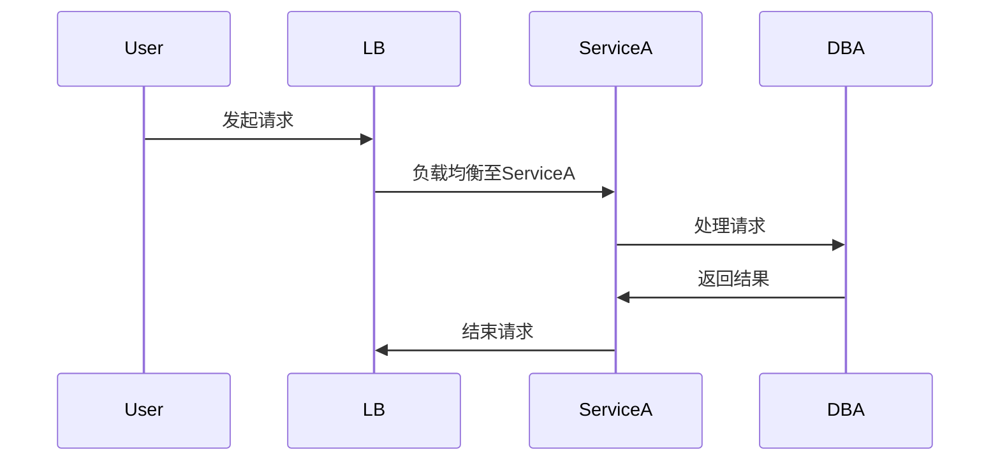
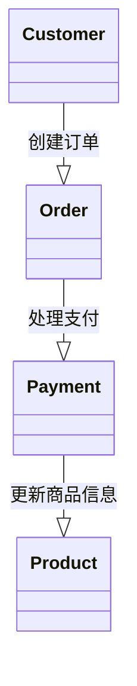
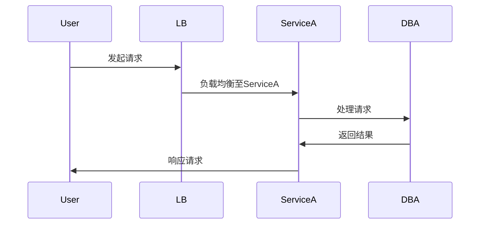

                 

### 高可用架构：构建永不宕机的系统

> 关键词：高可用架构、系统稳定性、故障转移、数据一致性、微服务、容器化、自动化运维

> 摘要：
本文旨在深入探讨高可用架构的核心概念、实现方法与最佳实践，帮助读者理解如何构建一个永不宕机的系统。我们将从背景介绍开始，逐步解析高可用性的定义及其重要性，探讨不可用性问题及其影响，回顾高可用架构的发展历程。随后，文章将详细分析高可用架构的核心概念与联系，通过系统分析与架构设计，讲解实现高可用性的关键技术。此外，文章还将通过项目实战与案例分析，展示高可用架构在现实中的应用，并提供必要的注意事项与拓展阅读。

#### 第1章 引言与背景介绍

**1.1 高可用架构的定义与重要性**

高可用架构（High Availability Architecture），通常指的是通过一系列技术和策略，确保系统在面临各种故障和异常情况下，能够快速恢复并保持持续运行的能力。其核心目标是最大限度地减少系统的停机时间，确保业务连续性和数据完整性。

高可用性在现代社会中至关重要，特别是在互联网、金融、电信等对系统可靠性要求极高的行业。高可用架构能够显著提升用户体验，降低业务风险，减少潜在的经济损失。

**1.2 不可用性问题与影响**

不可用性问题可能表现为系统故障、服务中断、数据丢失等。这些问题对业务的直接和间接影响包括：

- **直接影响**：用户无法访问服务，导致客户满意度下降，交易失败，订单丢失。
- **间接影响**：业务中断，影响公司声誉，导致潜在客户流失，增加维护和修复成本。

**1.3 高可用架构的发展历程**

高可用架构的发展经历了从简单备份到复杂分布式系统的演变。以下是几个关键里程碑：

- **单点架构**：早期的系统设计通常采用单点架构，容易成为单点故障。
- **冗余架构**：通过冗余硬件和备份机制来提高系统的可靠性。
- **分布式系统**：现代高可用架构依赖于分布式系统技术，如负载均衡、故障转移、数据复制等。
- **云计算与容器化**：云服务和容器技术进一步提升了系统的弹性和可管理性。

#### 第2章 高可用架构的核心概念与联系

**2.1 高可用性的核心概念**

高可用性涉及到多个核心概念，包括：

- **可用性指标**：衡量系统在特定时间内保持正常运行的能力。常见指标包括系统 uptime（正常运行时间）、MTTF（平均无故障时间）、MTTR（平均故障恢复时间）等。
- **关键组件**：包括负载均衡器、冗余硬件、备份与恢复机制、监控与报警系统等。

**2.2 核心概念属性特征对比表格**

| 概念                | 特征                                                   |
|---------------------|--------------------------------------------------------|
| 负载均衡            | 分摊请求，提高系统处理能力，减少单点压力                   |
| 备份与恢复          | 在故障发生时，恢复数据，确保业务连续性                     |
| 故障转移            | 当主节点故障时，自动切换到备份节点，保持服务可用           |
| 数据一致性          | 确保多个节点之间的数据一致，避免数据冲突                   |

**2.3 ER实体关系图架构**

以下是高可用架构的ER实体关系图：

```mermaid
erDiagram
  ServiceA <|.. User : 发起请求
  ServiceB <|.. User : 发起请求
  ServiceA ..|> DBA : 存储数据
  ServiceB ..|> DBB : 存储数据
  LB |--|> ServiceA : 负载均衡
  LB |--|> ServiceB : 负载均衡
```

#### 第3章 高可用架构的系统分析与架构设计方案

**3.1 问题场景介绍**

假设我们正在开发一个在线购物平台，要求在高峰期保持系统的稳定运行，同时确保数据的安全性和一致性。

**3.2 系统功能设计（领域模型）**

领域模型如下所示：

```mermaid
classDiagram
  Customer <<-- Order : 下单
  Order <<-- Payment : 支付
  Payment <<-- Product : 购买商品
  Product : { name, price }
  Customer : { name, email }
  Order : { id, status }
  Payment : { id, status }
```

**3.3 系统架构设计**

以下是系统架构设计：



**3.4 系统接口设计**

接口设计如下：



**3.5 系统交互（Mermaid序列图）**

以下是用户请求处理流程：



#### 第4章 高可用架构的实现技术与最佳实践

**4.1 实现高可用性的关键技术**

实现高可用性的关键技术包括：

- **负载均衡**：通过将请求分配到多个节点，提高系统处理能力，降低单点压力。
- **冗余硬件**：通过部署冗余硬件，确保系统在单个组件故障时仍能正常运行。
- **备份与恢复**：定期备份数据，并在故障发生时快速恢复。
- **故障转移**：当主节点故障时，自动切换到备份节点，保持服务可用。
- **数据一致性**：确保多个节点之间的数据一致，避免数据冲突。

**4.2 高可用性最佳实践**

高可用性最佳实践包括：

- **设计原则**：模块化设计，降低耦合度，便于故障隔离和恢复。
- **监控与报警**：实时监控系统状态，及时发现和响应异常。
- **自动化运维**：通过自动化脚本和工具，减少人工干预，提高运维效率。
- **持续集成与部署**：确保系统的稳定性和安全性，减少人为错误。

**4.3 高可用架构的实现技术**

以下是实现高可用架构的关键技术：

- **容器化技术**：如 Docker，提高系统的可移植性和可扩展性。
- **微服务架构**：将系统分解为多个独立的服务，降低故障传播风险。
- **自动化部署与运维工具**：如 Kubernetes、Ansible 等。

#### 第5章 项目实战与案例分析

**5.1 项目环境安装**

环境安装步骤如下：

1. 安装 Docker。
2. 配置 Docker 网络。
3. 部署服务组件。

**5.2 系统核心实现源代码**

以下是系统核心实现源代码：

```python
# 示例：用户注册
class UserRegistration:
    def __init__(self, username, email, password):
        self.username = username
        self.email = email
        self.password = password
    
    def register(self):
        # 注册逻辑
        pass

# 示例：用户登录
class UserLogin:
    def __init__(self, username, password):
        self.username = username
        self.password = password
    
    def login(self):
        # 登录逻辑
        pass
```

**5.3 实际案例分析与讲解**

案例分析将涉及以下内容：

- **案例背景**：描述实际案例的背景。
- **案例实施**：详细讲解案例的实施过程。
- **案例分析**：剖析案例中的关键技术和策略。

**5.4 项目小结**

项目小结将总结项目的实施经验，包括成功经验和不足之处。

#### 第6章 小结与拓展阅读

**6.1 小结**

本文系统地介绍了高可用架构的概念、实现方法和最佳实践。通过项目实战与案例分析，读者可以更好地理解高可用架构的实际应用。

**6.2 注意事项**

- 高可用架构设计需要考虑业务需求，确保系统稳定运行。
- 监控和报警系统是确保高可用性的关键环节。

**6.3 拓展阅读**

- 《高可用架构：设计原则与实践》
- 《微服务设计：构建基于Docker和Kubernetes的应用》

### 结语

作者：AI天才研究院/AI Genius Institute & 禅与计算机程序设计艺术 /Zen And The Art of Computer Programming

本文旨在帮助读者深入理解高可用架构，构建永不宕机的系统。通过系统化的分析和实战案例，读者可以掌握高可用架构的设计和实现方法，为实际项目提供有力的技术支持。让我们共同追求系统的高可用性，为业务的成功保驾护航。

