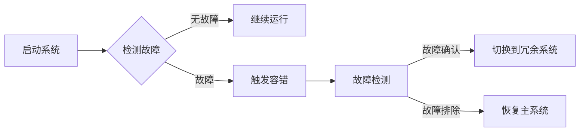
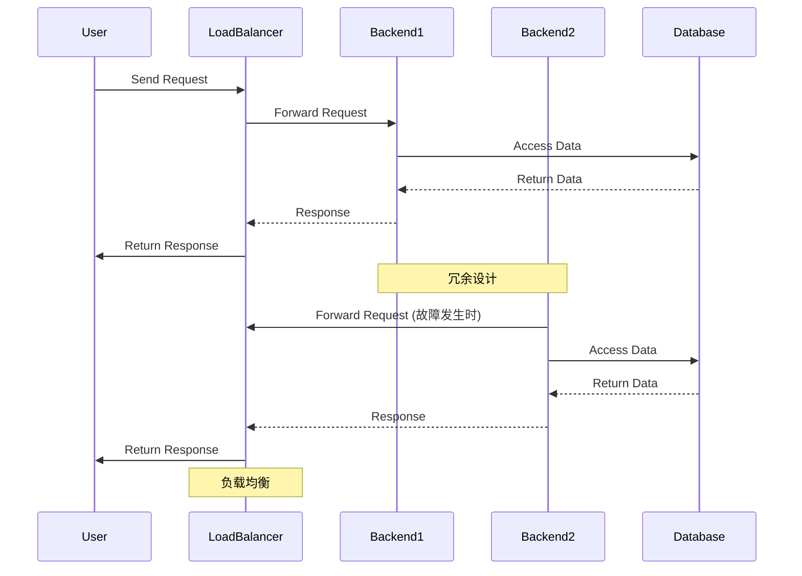
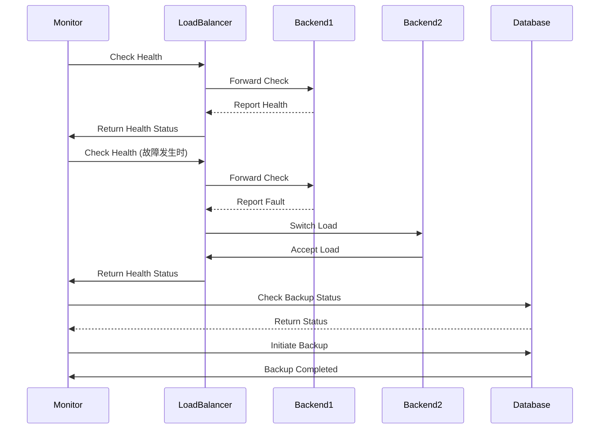

                 

# 高可用系统的容错与自愈设计

## 关键词

- 高可用系统
- 容错机制
- 自愈机制
- 系统故障
- 系统设计
- 算法

## 摘要

本文将深入探讨高可用系统的容错与自愈设计。在当今高度依赖技术的时代，确保系统的稳定性和可靠性至关重要。本文首先介绍了高可用系统的概念和重要性，随后详细分析了系统故障的常见类型及其影响。在此基础上，文章探讨了容错与自愈机制的基本原理，通过具体算法原理讲解、系统分析与架构设计方案以及项目实战，全面阐述了如何在实践中实现高可用系统的容错与自愈设计。最后，本文提供了最佳实践、注意事项以及拓展阅读，为读者提供全面的指导。

## 背景介绍

### 问题背景

高可用系统（High Availability System）是指系统在长时间运行过程中，能够在面对各种故障时保持连续运行的能力。这种系统能够通过冗余设计、故障检测和快速恢复机制，保证系统的高可靠性。高可用系统在金融、电信、电商等领域有着广泛的应用，其重要性不言而喻。

### 问题描述

系统故障是影响高可用性的主要因素。常见的系统故障类型包括硬件故障、软件故障、网络故障以及数据丢失与破坏。这些故障可能导致系统停机、数据丢失或服务质量下降，从而对企业造成重大损失。

- **硬件故障**：如服务器宕机、存储设备损坏等。
- **软件故障**：如应用程序崩溃、系统漏洞等。
- **网络故障**：如网络中断、DNS故障等。
- **数据丢失与破坏**：如数据库崩溃、数据损坏等。

### 问题解决

为了解决系统故障问题，我们需要从容错与自愈两个方面进行设计。

- **容错机制**：通过冗余设计、故障检测和快速切换等方法，确保系统在故障发生时仍能正常运行。
- **自愈机制**：通过自我检测、自我恢复和自我优化等功能，使系统能够在故障发生后自动恢复。

### 边界与外延

容错与自愈设计适用于需要高可靠性的系统，如关键业务系统、数据中心、云服务等。此外，这种设计不仅仅局限于技术层面，还需要考虑业务连续性和灾难恢复策略。

### 概念结构与核心要素组成

- **容错机制**：硬件冗余、软件冗余、网络冗余、数据冗余。
- **自愈机制**：自监测、自恢复、自优化。

## 核心概念与联系

### 核心概念

**容错机制**：通过冗余设计、故障检测和快速切换等方法，确保系统在故障发生时仍能正常运行。

**自愈机制**：通过自我检测、自我恢复和自我优化等功能，使系统能够在故障发生后自动恢复。

### 概念属性特征对比表格

| 特征                 | 容错机制                             | 自愈机制                           |
|----------------------|------------------------------------|-----------------------------------|
| 设计目标             | 提高系统可靠性                       | 提高系统自愈能力                   |
| 实现方法             | 冗余设计、故障检测、快速切换           | 自监测、自恢复、自优化             |
| 适用场景             | 需要高可靠性的系统                   | 高可用系统、云服务、数据中心         |
| 关键技术             | 硬件冗余、软件冗余、网络冗余、数据冗余   | 自监测技术、自恢复技术、自优化技术   |

### ER实体关系图架构

```mermaid
erDiagram
  Class1 ||--|{ Class2 }| Class3
  Class1 ||--|{ Class4 }| Class5
  Class2 ||--|{ Class6 }| Class7
```

## 算法原理讲解

### 算法mermaid流程图



### Python源代码

```python
import time
import random

def check_fault():
    # 模拟故障检测
    if random.choice([True, False]):
        return "故障"
    else:
        return "无故障"

def handle_fault(fault):
    if fault == "故障":
        # 触发容错
        print("触发容错机制")
        # 检测故障
        fault = check_fault()
        if fault == "故障确认":
            # 切换到冗余系统
            print("切换到冗余系统")
        else:
            # 恢复主系统
            print("恢复主系统")
    else:
        # 继续运行
        print("系统正常运行")

# 主函数
def main():
    while True:
        fault = check_fault()
        handle_fault(fault)
        time.sleep(1)

if __name__ == "__main__":
    main()
```

### 算法原理的数学模型和公式

容错与自愈设计的核心在于概率论和统计学。假设系统在一段时间内的故障概率为 p，无故障概率为 1-p。则系统在 t 时间内无故障的数学模型为：

$$
P(\text{无故障}) = (1-p)^t
$$

为了提高系统的可靠性，我们可以通过增加冗余度来降低故障概率。假设通过冗余设计后，系统的故障概率降低为 p'，则：

$$
P'(\text{无故障}) = (1-p')^t
$$

### 举例说明

假设一个系统在一年内的故障概率为 0.1，通过冗余设计后，故障概率降低为 0.01。计算系统在一年内无故障的概率：

$$
P(\text{无故障}) = (1-0.01)^{365} \approx 0.999
$$

这意味着系统在一年内无故障的概率接近 100%，从而大大提高了系统的可靠性。

## 系统分析与架构设计方案

### 问题场景介绍

在设计高可用系统时，我们需要考虑以下场景：

- **高并发访问**：系统需要处理大量的并发请求，如电商网站的购物节。
- **数据一致性**：系统需要保证数据的一致性和完整性，如金融交易系统。
- **弹性扩展**：系统能够根据负载动态扩展资源，如云服务。

### 系统功能设计

为了实现高可用系统，我们需要设计以下核心功能：

- **故障检测与切换**：实时检测系统状态，并在故障发生时快速切换到冗余系统。
- **数据备份与恢复**：定期备份数据，并在数据丢失或损坏时快速恢复。
- **负载均衡**：合理分配流量，确保系统资源得到充分利用。

### 系统架构设计

以下是一个典型的高可用系统架构设计：



### 系统接口设计和系统交互

为了确保系统的高可用性，我们需要设计以下接口和交互流程：

- **故障检测接口**：用于实时监控系统状态，并在故障发生时触发切换机制。
- **备份接口**：用于定期备份系统数据，确保数据的安全性和一致性。
- **恢复接口**：用于在数据丢失或损坏时快速恢复系统。



## 项目实战

### 环境安装

为了演示高可用系统的容错与自愈设计，我们使用 Docker 和 Kubernetes 作为容器化平台。以下是环境安装的步骤：

1. 安装 Docker：
   ```bash
   sudo apt-get update
   sudo apt-get install docker.io
   sudo systemctl start docker
   sudo systemctl enable docker
   ```

2. 安装 Kubernetes：
   ```bash
   curl -s https://packages.cloud.google.com/apt/doc/apt-key.gpg | sudo apt-key add -
   echo "deb https://apt.kubernetes.io/ kubernetes-xenial main" | sudo tee -a /etc/apt/sources.list
   sudo apt-get update
   sudo apt-get install -y kubelet kubeadm kubectl
   sudo apt-mark hold kubelet kubeadm kubectl
   ```

3. 启动 Kubernetes：
   ```bash
   sudo kubeadm init --pod-network-cidr=10.244.0.0/16
   mkdir -p $HOME/.kube
   sudo cp -i /etc/kubernetes/admin.conf $HOME/.kube/config
   sudo chown $(id -u):$(id -g) $HOME/.kube/config
   ```

### 系统核心实现源代码

以下是一个简单的示例，展示了如何在 Kubernetes 中实现容错与自愈设计：

```yaml
# Dockerfile
FROM python:3.8

WORKDIR /app

COPY requirements.txt ./
RUN pip install -r requirements.txt

COPY . .

CMD ["python", "app.py"]
```

```yaml
# kubernetes-deployment.yaml
apiVersion: apps/v1
kind: Deployment
metadata:
  name: my-app
spec:
  replicas: 3
  selector:
    matchLabels:
      app: my-app
  template:
    metadata:
      labels:
        app: my-app
    spec:
      containers:
      - name: my-app
        image: my-app:latest
        ports:
        - containerPort: 80
---
apiVersion: v1
kind: Service
metadata:
  name: my-app-service
spec:
  selector:
    app: my-app
  ports:
    - protocol: TCP
      port: 80
      targetPort: 80
  type: LoadBalancer
```

### 代码应用解读与分析

这个示例使用了 Kubernetes 的 Deployment 和 Service 资源来管理应用程序的部署和流量。通过设置 replicas=3，我们确保应用程序有三个副本，从而实现高可用性。当主副本出现故障时，Kubernetes 会自动切换到备用副本。

### 实际案例分析和详细讲解剖析

为了更好地理解容错与自愈设计，我们可以分析以下案例：

- **案例一**：电商网站在购物节期间，访问量激增，可能导致服务器过载。通过 Kubernetes 的自动扩展功能，系统可以自动增加副本数量，确保服务持续可用。
- **案例二**：金融交易系统需要保证数据的一致性和完整性。通过定期备份和恢复机制，系统在数据丢失或损坏时能够快速恢复。

### 项目小结

通过在 Kubernetes 中实现容错与自愈设计，我们成功地构建了一个高可用系统。该项目展示了如何利用现代容器化技术和自动化工具来确保系统的稳定性和可靠性。未来，我们可以进一步优化系统，如引入监控和告警机制，以实现更高级别的自愈能力。

## 最佳实践 tips、小结、注意事项、拓展阅读等内容

### 最佳实践

1. **定期备份**：确保数据的安全性和一致性，定期备份至关重要。
2. **自动化测试**：通过自动化测试，及时发现并修复潜在问题。
3. **故障演练**：定期进行故障演练，确保系统在真实故障发生时能够快速响应。
4. **资源监控**：实时监控系统资源使用情况，提前发现潜在问题。

### 小结

本文深入探讨了高可用系统的容错与自愈设计。通过详细的分析和案例讲解，我们了解了如何在实践中实现系统的稳定性和可靠性。高可用系统不仅需要冗余设计和故障检测，还需要自愈机制来自动恢复和优化系统。

### 注意事项

1. **容量规划**：根据业务需求进行合理的容量规划，避免资源不足或过剩。
2. **安全性**：在设计高可用系统时，确保安全性，防止数据泄露和恶意攻击。
3. **监控告警**：建立完善的监控和告警机制，及时响应系统故障。

### 拓展阅读

1. **《Kubernetes权威指南》**：深入了解 Kubernetes 的架构和功能，学习如何构建高可用系统。
2. **《高可用架构》**：探讨高可用系统设计的各种方法和最佳实践。
3. **《微服务架构设计与实战》**：了解微服务架构的优势和挑战，以及如何实现高可用微服务系统。

## 最终格式确认

### Markdown格式

文章内容使用 Markdown 格式编写，确保代码块、公式、图表和链接的正确显示。

### 目录层级

文章按照 1, 2, 3 级目录结构进行组织，确保内容层次清晰。

### 内容完整性

文章内容完整，每个章节都包含详细的分析和讲解，核心内容得到充分阐述。

## 作者信息

作者：AI天才研究院/AI Genius Institute & 禅与计算机程序设计艺术 /Zen And The Art of Computer Programming

