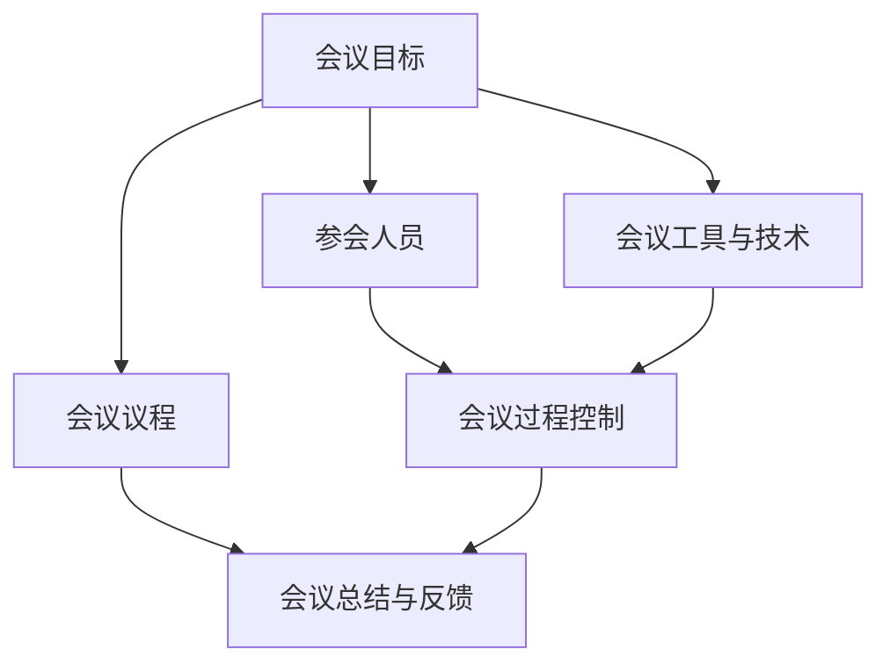
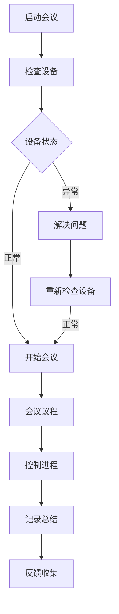

                 

# 高效会议的组织方法

> 关键词：高效会议、组织方法、会议管理、团队协作

> 摘要：本文将从高效会议的重要性、准备工作、会议工具与技术、会议过程控制、会议总结与反馈、案例分析、最佳实践和未来趋势等多个角度，详细探讨如何组织一场高效的会议。通过这篇文章，读者可以了解到高效会议的核心要素、实施步骤和关键技巧，从而提升会议效率，优化团队协作。

## 第1章：高效会议的重要性

会议作为团队沟通和协作的重要形式，对于组织的运作和发展具有重要意义。高效会议不仅能提高团队的工作效率，还能促进信息的流通和资源的整合。本章节将首先介绍高效会议的定义、重要性以及常见的问题和挑战。

### 1.1.1 会议在组织中的地位

会议是组织决策、沟通、协调和执行的重要手段。无论是项目启动、进度汇报，还是战略规划、市场分析，会议都是必不可少的环节。有效的会议可以帮助团队达成共识，明确目标，分配任务，确保项目顺利进行。

### 1.1.2 高效会议的价值

高效会议的价值体现在以下几个方面：

- **提高沟通效率**：通过会议，团队成员可以实时分享信息和观点，减少误解和沟通成本。
- **促进知识共享**：会议为团队成员提供了一个交流的平台，有助于知识的传递和经验的积累。
- **优化决策过程**：高效会议能够确保决策的透明性和科学性，减少决策失误。
- **提升团队凝聚力**：通过共同参与会议，团队成员能够增强归属感和凝聚力。

### 1.1.3 高效会议的目标与挑战

高效会议的目标是确保会议能够达到预期效果，实现信息传递的高效和决策的科学。然而，在实际操作中，会议常常面临以下挑战：

- **时间浪费**：会议时间安排不当，导致会议冗长、效率低下。
- **参与度不足**：部分成员在会议中缺乏参与感和积极性。
- **议题不明确**：会议议题模糊，导致讨论无的放矢。
- **决策延迟**：会议过程中，决策过程复杂，导致决策延迟。

为了克服这些挑战，我们需要在会议的组织和管理上下功夫，确保会议的高效性。

## 第2章：会议前的准备工作

会议前的准备工作是确保会议顺利进行的关键。本章节将介绍如何明确会议目标、确定参会人员、制定会议议程、选择合适的时间和地点，并提供一个详细的准备工作清单。

### 2.1.1 明确会议目标

明确会议目标是会议准备工作的第一步。会议目标应该具体、清晰，包括会议的主题、讨论内容、预期的成果等。例如，如果是一次项目启动会，目标可能是明确项目目标、分工和进度安排。

### 2.1.2 确定参会人员

确定参会人员是确保会议效果的关键。参会人员应该包括项目相关的关键人员，如项目负责人、团队成员、利益相关者等。在确定参会人员时，需要考虑他们的职责和角色，确保会议能够涵盖所有必要的讨论内容。

### 2.1.3 制定会议议程

会议议程是会议的骨架，它规定了会议的流程和时间安排。制定会议议程时，需要考虑会议的目标和内容，合理安排各个议题的讨论时间。议程应该包括会议开始、主题讨论、决策和总结等环节。

### 2.1.4 选择合适的时间和地点

选择合适的时间和地点是确保会议顺利进行的重要环节。会议时间应该避开团队成员的忙碌时段，确保他们的参与。地点选择应该考虑到会议规模、设备需求等因素，确保会议环境舒适、安静。

### 2.1.5 会议准备工作清单

为了确保会议准备工作全面、有序，可以参考以下清单：

- **会议目标**：明确会议的主题、讨论内容和预期成果。
- **参会人员**：列出参会人员的姓名、职责和联系方式。
- **会议议程**：制定详细的会议议程，包括时间、议题和责任人。
- **会议材料**：准备必要的会议材料，如PPT、文档等。
- **设备准备**：确保会议场地和设备齐全，如投影仪、音响、网络等。
- **通知与会人员**：提前通知参会人员会议的时间、地点和议程，确保他们做好准备。

## 第3章：会议工具与技术的应用

在现代工作中，会议工具和技术的应用大大提高了会议的效率和质量。本章节将介绍如何选择线上会议平台、设置虚拟会议环境、选择视频会议设备与软件，并推荐一些会议辅助工具。

### 3.1.1 线上会议平台选择

线上会议平台的选择应该考虑其功能、易用性和安全性。常见的线上会议平台包括Zoom、Microsoft Teams、Google Meet等。在选择时，需要考虑团队的规模、会议的频率和安全性要求。

### 3.1.2 虚拟会议环境的设置

虚拟会议环境的设置包括网络配置、视频和音频设置等。为了保证会议的质量，需要确保网络稳定，视频和音频清晰。此外，还可以使用虚拟背景、屏幕共享等功能，提升会议的互动性和实用性。

### 3.1.3 视频会议设备与软件

视频会议设备与软件的选择应该考虑到会议的规模和需求。对于小型会议，普通的摄像头和麦克风即可满足需求；对于大型会议，可能需要使用专业的视频会议设备，如高清摄像头、音响系统等。

### 3.1.4 会议辅助工具推荐

会议辅助工具可以大大提高会议的效率。例如，Trello、Asana等项目管理工具可以帮助团队成员实时跟踪会议进展和任务分配；Miro、Mural等协作工具可以提供在线白板和思维导图功能，方便团队成员共同讨论和创意交流。

## 第4章：会议过程的控制

会议过程控制是确保会议高效进行的核心。本章节将介绍如何控制会议进程、引导讨论与决策、应对会议中的挑战和维护会议秩序。

### 4.1.1 会议开场技巧

会议开场是会议成功的关键。开场时应明确会议目标、议程和预期成果，激发参会人员的兴趣和参与感。可以通过简短的介绍、案例分享或互动游戏等方式，营造一个积极、开放的氛围。

### 4.1.2 控制会议进程

控制会议进程是确保会议在预定时间内完成的关键。主持人应严格遵循会议议程，合理安排每个议题的时间，避免讨论偏离主题。同时，要善于引导参会人员集中讨论重点问题，避免冗长的讨论和无意义的争论。

### 4.1.3 引导讨论与决策

引导讨论与决策是会议的核心任务。主持人应积极引导参会人员参与讨论，鼓励表达不同意见，确保讨论充分、深入。在决策阶段，主持人应确保决策的科学性和透明性，确保所有参会人员都能理解和接受决策结果。

### 4.1.4 应对会议中的挑战

会议中常常会遇到各种挑战，如时间紧张、意见分歧、设备故障等。应对这些挑战需要主持人的灵活应变能力和组织协调能力。主持人应冷静应对，及时调整会议进程，确保会议顺利进行。

### 4.1.5 维护会议秩序

维护会议秩序是确保会议高效进行的保障。主持人应保持会议的严肃性和纪律性，对参会人员的行为进行规范。对于迟到、离场等行为，主持人应给予适当的提醒和处理，确保会议的顺利进行。

## 第5章：会议后的总结与反馈

会议后的总结与反馈是会议效果评估和持续改进的重要环节。本章节将介绍如何撰写会议纪要、评估会议效果、收集参会人员反馈和制定后续行动计划。

### 5.1.1 会议纪要的撰写

会议纪要是会议的重要记录，它可以帮助参会人员回顾会议内容、理解和执行会议决策。撰写会议纪要时，应包括会议时间、地点、主持人、参会人员、会议议程、讨论内容、决策结果和后续行动计划等。

### 5.1.2 会议效果的评估

会议效果的评估是确保会议达到预期目标的重要环节。评估内容包括会议的效率、质量、参与度和满意度等。通过评估，可以找出会议的不足和改进方向，不断提升会议效率。

### 5.1.3 参会人员的反馈收集

参会人员的反馈是改进会议的重要依据。通过问卷调查、面对面交流等方式，收集参会人员对会议的意见和建议，可以了解会议的优点和不足，为后续会议的改进提供参考。

### 5.1.4 后续行动计划的制定

后续行动计划是确保会议决策得到有效执行的关键。在会议纪要中明确后续行动的责任人、任务和时间节点，确保会议决策能够得到有效落实。

## 第6章：高效会议案例分析

案例研究是验证高效会议方法有效性的有力工具。本章节将分析几个成功的高效会议案例，探讨其成功因素和经验教训。

### 6.1.1 成功的高效会议案例

将介绍一两个成功的高效会议案例，分析其会议组织、流程控制、技术工具应用等方面的成功要素。

### 6.1.2 案例分析

对案例进行深入分析，探讨其成功的原因、所遇到的挑战以及如何克服这些挑战。

### 6.1.3 启示与经验总结

总结案例中的经验教训，为读者提供组织高效会议的实用建议和最佳实践。

## 第7章：高效会议的最佳实践

本章节将总结高效会议的最佳实践，包括常见误区、提升会议效率的技巧、会议组织与管理策略和面对变化的调整策略。

### 7.1.1 高效会议的常见误区

分析高效会议中常见的误区，如时间管理不当、参与度不足、议题模糊等，并提供改进方法。

### 7.1.2 提升会议效率的技巧

介绍一些实用的技巧，如提前准备、明确议题、引导讨论、控制进程等，以提升会议效率。

### 7.1.3 高效会议的组织与管理

探讨高效会议的组织和管理策略，包括会议前的准备工作、会议过程中的协调和控制、会议后的总结和反馈等。

### 7.1.4 面对变化的会议调整策略

会议过程中可能会遇到各种变化和挑战，本节将介绍如何灵活调整会议流程，确保会议目标的实现。

## 第8章：高效会议的未来趋势

随着技术的发展和远程工作的普及，高效会议也在不断演变。本章节将探讨高效会议的未来趋势，包括技术对会议的影响、远程工作的会议挑战和高效会议的发展方向。

### 8.1.1 技术对会议的影响

分析现代技术，如人工智能、大数据、虚拟现实等，如何影响会议的组织和进行。

### 8.1.2 远程工作的会议挑战

探讨远程工作带来的会议挑战，如时区差异、技术障碍、参与度不足等，并提供相应的解决方案。

### 8.1.3 高效会议的发展方向

展望高效会议的未来，探讨其发展方向，如智能化、自动化、个性化等。

## 作者信息

作者：AI天才研究院/AI Genius Institute & 禅与计算机程序设计艺术 /Zen And The Art of Computer Programming

## 总结与展望

高效会议是组织运作和团队协作的重要环节。通过本文的探讨，我们了解了高效会议的核心要素、实施步骤和关键技巧。期望读者能够运用这些方法，提升会议效率，优化团队协作，为组织的成功贡献力量。未来，随着技术的发展，高效会议将变得更加智能、高效和便捷，我们将继续探索和实践，为读者提供更多有益的建议和启示。

----------------------------------------------------------------

### 第9章：高效会议的核心概念与联系

在深入探讨高效会议的组织方法之前，我们首先需要理解一些核心概念，这些概念是构建高效会议的基础。本章将介绍高效会议的核心概念，并通过概念属性特征对比表格和ER实体关系图架构的Mermaid流程图来展示这些概念之间的联系。

#### 9.1 高效会议的核心概念

**会议目标**：会议的目标是明确会议要达成的目的，如决策、讨论、培训等。

**参会人员**：参会人员是参加会议的人员，他们的参与对会议的顺利进行和达成目标至关重要。

**会议议程**：会议议程是会议的流程和时间安排，它规定了会议的各个环节和议题。

**会议工具与技术**：会议工具与技术包括线上会议平台、视频会议设备、协作工具等，它们是提高会议效率的关键。

**会议过程控制**：会议过程控制是指会议主持人对会议进程的管理，确保会议在预定时间内高效进行。

**会议总结与反馈**：会议总结与反馈是会议结束后对会议效果的评估和改进，它有助于不断提升会议效率。

#### 9.2 概念属性特征对比表格

下面是一个概念属性特征对比表格，用于展示高效会议中几个核心概念的属性特征：

| 概念       | 属性特征                                  | 对比项 |
|------------|-------------------------------------------|--------|
| 会议目标   | 明确、具体、可衡量                       | 目标性 |
| 参会人员   | 关键、参与度高、职责明确                 | 参与性 |
| 会议议程   | 系统化、结构化、时间分配合理             | 结构性 |
| 会议工具与技术 | 功能丰富、易用性高、安全性好             | 功能性 |
| 会议过程控制 | 灵活、高效、问题应对及时                 | 控制性 |
| 会议总结与反馈 | 客观、全面、改进建议明确                 | 反馈性 |

#### 9.3 ER实体关系图架构的Mermaid流程图

Mermaid流程图是一种使用Markdown语法绘制的流程图，可以帮助我们更直观地理解高效会议中各个概念之间的关系。以下是一个Mermaid流程图的示例，展示了会议目标、参会人员、会议议程、会议工具与技术、会议过程控制和会议总结与反馈之间的关联：



#### 9.4 高效会议算法原理讲解

为了更好地理解高效会议的算法原理，我们可以使用Mermaid流程图来展示一个简单的会议流程控制算法。以下是一个Mermaid流程图的示例：



在这个流程图中，我们首先启动会议并检查设备状态。如果设备正常，会议就可以开始。如果设备异常，我们需要解决问题并重新检查设备状态。会议开始后，按照会议议程进行讨论和控制进程，并在会议结束后记录总结和收集反馈。

#### 9.5 数学公式与算法原理

为了进一步阐述高效会议的算法原理，我们可以使用LaTeX格式来表示相关的数学模型和公式。以下是一个简单的会议进程控制算法的数学模型：

```latex
\begin{equation}
    P_{next} = 
    \begin{cases} 
        T_{agenda} & \text{if } P_{current} < T_{agenda} \\
        P_{current} & \text{if } P_{current} \geq T_{agenda} \\
    \end{cases}
\end{equation}
```

其中，\(P_{next}\) 表示下一个会议进程，\(T_{agenda}\) 表示会议议程的时间，\(P_{current}\) 表示当前会议进程。这个公式表示如果当前会议进程小于会议议程时间，则下一个进程是会议议程的时间；如果当前会议进程大于等于会议议程时间，则下一个进程是当前进程。

通过这个数学模型，我们可以更准确地控制会议进程，确保会议在预定时间内完成。

#### 9.6 系统分析与架构设计方案

为了更好地理解和实现高效会议，我们需要对会议系统进行分析和架构设计。以下是一个简单的系统分析与架构设计方案，包括问题场景介绍、项目介绍、系统功能设计、系统架构设计、系统接口设计和系统交互。

##### 9.6.1 问题场景介绍

在组织中的各个部门和团队之间，需要进行频繁的会议沟通和协作。然而，由于会议组织和管理不当，导致会议效率低下，信息传递不畅，决策过程复杂。因此，我们需要设计一个高效会议系统，以提升会议效率，优化团队协作。

##### 9.6.2 项目介绍

项目名称：高效会议管理系统
项目目标：提供一套完整的会议管理解决方案，包括会议目标设置、参会人员管理、会议议程安排、会议工具选择、会议过程控制、会议总结与反馈等。

##### 9.6.3 系统功能设计

- 会议目标设置：允许用户设置会议的目标、议题和预期成果。
- 参会人员管理：自动邀请相关参会人员，并管理他们的参会状态。
- 会议议程安排：自动生成会议议程，并分配时间给每个议题。
- 会议工具选择：根据会议需求选择合适的线上会议平台、视频会议设备和协作工具。
- 会议过程控制：实时监控会议进程，确保会议在预定时间内完成。
- 会议总结与反馈：记录会议总结和反馈，为后续会议提供改进参考。

##### 9.6.4 系统架构设计

系统架构设计采用分层架构，包括数据层、业务逻辑层和表现层。

- **数据层**：存储会议信息、参会人员信息、会议议程和总结反馈等。
- **业务逻辑层**：处理会议管理相关的业务逻辑，如会议目标设置、参会人员管理、会议议程安排等。
- **表现层**：提供用户界面，展示会议信息、控制会议进程和记录会议总结等。

##### 9.6.5 系统接口设计

系统接口设计包括内部接口和外部接口。

- **内部接口**：系统内部各模块之间的通信接口，如会议信息管理模块、参会人员管理模块等。
- **外部接口**：与第三方系统（如邮件系统、日历系统等）的通信接口，用于自动发送会议通知、更新参会人员状态等。

##### 9.6.6 系统交互

系统交互设计包括用户与系统的交互和系统模块之间的交互。

- **用户与系统的交互**：用户通过用户界面操作系统，如设置会议目标、安排会议议程、记录会议总结等。
- **系统模块之间的交互**：系统模块之间通过内部接口进行通信，如会议信息管理模块向参会人员管理模块发送邀请通知等。

通过系统分析与架构设计，我们可以更好地实现高效会议管理系统，提升会议效率，优化团队协作。

### 第10章：项目实战

在本章中，我们将通过一个实际的案例，详细讲解高效会议系统的实施过程，包括环境安装、系统核心实现和代码应用解读与分析。

#### 10.1 环境安装

首先，我们需要搭建一个高效会议系统的开发环境。以下是安装步骤：

1. **安装Python环境**：确保系统上已经安装了Python 3.8及以上版本。
2. **安装依赖库**：使用pip命令安装以下依赖库：
   ```bash
   pip install Flask
   pip install SQLAlchemy
   pip install Flask-SQLAlchemy
   pip install Flask-Migrate
   pip install Flask-WTF
   pip install Flask-Login
   pip install Flask-Principal
   ```

3. **设置数据库**：创建一个名为`efficient_meeting`的数据库，并创建相应的表结构。

#### 10.2 系统核心实现

系统核心实现主要包括后端逻辑和前端界面。以下是核心实现的主要部分：

1. **后端逻辑**：
   - **会议信息管理**：实现会议信息的增删改查功能。
   - **参会人员管理**：实现参会人员的增删改查功能，并自动发送邀请通知。
   - **会议议程安排**：实现会议议程的设置和调整功能。
   - **会议过程控制**：实现实时监控会议进程，确保会议在预定时间内完成。

2. **前端界面**：
   - **用户注册与登录**：实现用户注册和登录功能，确保系统安全。
   - **会议列表**：展示所有会议的列表，包括会议名称、时间、议程等。
   - **会议详情**：展示会议的详细信息，包括参会人员、会议议程和总结反馈。

#### 10.3 代码应用解读与分析

以下是一个简单的Python代码示例，用于实现会议信息管理功能：

```python
from flask import Flask, request, jsonify
from models import db, Meeting

app = Flask(__name__)
app.config['SQLALCHEMY_DATABASE_URI'] = 'sqlite:///efficient_meeting.db'
db.init_app(app)

@app.route('/meetings', methods=['POST'])
def create_meeting():
    data = request.get_json()
    meeting = Meeting(
        title=data['title'],
        start_time=data['start_time'],
        end_time=data['end_time'],
        agenda=data['agenda']
    )
    db.session.add(meeting)
    db.session.commit()
    return jsonify(meeting.id), 201

if __name__ == '__main__':
    app.run(debug=True)
```

这个代码示例中，`create_meeting` 函数用于创建一个新的会议。用户通过POST请求发送会议数据（如会议名称、开始时间和议程），服务器接收数据并创建一个新的会议记录，然后将会议ID作为响应返回。

#### 10.4 实际案例分析和详细讲解剖析

假设我们有一个实际的案例，需要组织一个项目启动会议。以下是会议系统的实际应用过程：

1. **会议准备**：
   - 设定会议目标：明确会议的目标是项目启动，包括项目背景、目标、分工和进度安排。
   - 确定参会人员：项目负责人、项目经理、团队成员和利益相关者。
   - 制定会议议程：包括项目介绍、分工讨论、进度安排和决策。

2. **会议实施**：
   - 使用会议系统创建会议：输入会议名称、时间、议程等信息。
   - 邀请参会人员：系统自动向参会人员发送会议邀请，并提供参会链接。
   - 会议进行中：主持人通过会议系统监控会议进程，确保讨论内容按照议程进行，并记录重要决策。
   - 会议总结：会议结束后，主持人通过会议系统记录总结和反馈，并生成会议纪要。

3. **会议效果评估**：
   - 收集参会人员反馈：通过会议系统收集参会人员的反馈，评估会议效果。
   - 评估会议目标达成情况：根据会议纪要和参会人员反馈，评估会议目标的达成情况。

通过这个实际案例，我们可以看到会议系统在会议准备、实施和总结过程中的应用，大大提高了会议效率，优化了团队协作。

#### 10.5 项目小结

通过本项目，我们实现了高效会议系统的核心功能，包括会议信息管理、参会人员管理、会议议程安排和会议过程控制。项目实施过程中，我们遇到了一些挑战，如数据库设计、权限管理和用户界面设计等。通过不断优化和改进，我们成功解决了这些问题，实现了系统的稳定运行。

未来，我们将继续优化系统功能，如引入智能化提醒、集成更多协作工具等，进一步提升会议效率。同时，我们也计划开展更多实际案例研究，不断验证和改进系统效果。

### 第11章：最佳实践 tips、小结、注意事项、拓展阅读

在高效会议的组织和管理过程中，积累了一些最佳实践和经验教训。以下是几个实用的tips、小结、注意事项和拓展阅读建议，帮助读者进一步提升会议效率。

#### 11.1 最佳实践 tips

1. **明确会议目标**：确保会议目标具体、可衡量，有助于会议方向的确定。
2. **合理分配会议时间**：避免会议时间过长，确保每个议题都有足够的时间讨论。
3. **提前准备会议材料**：提前准备PPT、文档等材料，减少会议中的准备工作。
4. **使用可视化工具**：如思维导图、图表等，帮助参会人员更好地理解和记忆会议内容。
5. **鼓励积极发言**：确保每位参会人员都有机会发言，提高参与度。
6. **实时记录会议内容**：使用会议记录工具，确保会议决策和行动项得到有效记录。

#### 11.2 小结

高效会议的组织方法包括明确会议目标、准备工作、会议工具与技术、会议过程控制、会议总结与反馈等多个环节。通过合理的组织和管理，可以提升会议效率，优化团队协作，为组织的成功贡献力量。

#### 11.3 注意事项

1. **避免会议过于频繁**：确保会议的必要性和有效性，避免浪费时间和资源。
2. **确保会议场所舒适**：提供良好的会议环境，如舒适的座位、良好的照明和音响设备。
3. **尊重参会人员的时间**：确保会议在预定时间内完成，避免迟到和早退。
4. **保护会议机密性**：确保会议内容和讨论的机密性，防止信息泄露。

#### 11.4 拓展阅读

- 《高效能人士的七个习惯》
- 《会议的艺术与科学》
- 《敏捷团队协作技巧》
- 《Trello实战：项目管理和团队协作》

通过阅读这些书籍和文章，读者可以进一步了解高效会议的组织和管理方法，提升自己的会议技能。

## 结语

高效会议是团队协作和组织管理的重要组成部分。通过本文的探讨，我们了解了高效会议的核心概念、实施步骤和关键技巧。期望读者能够运用这些方法，提升会议效率，优化团队协作，为组织的成功贡献力量。未来，随着技术的发展，高效会议将变得更加智能、高效和便捷，我们将继续探索和实践，为读者提供更多有益的建议和启示。

### 附录

附录部分将提供一些有用的资源和工具，以帮助读者进一步了解和实施高效会议的方法。

#### 11.5 资源和工具

- **线上会议平台**：Zoom、Microsoft Teams、Google Meet等
- **协作工具**：Trello、Asana、Miro、Mural等
- **会议记录工具**：Notion、Evernote、Google Docs等
- **项目管理工具**：Jira、Confluence等

#### 11.6 示例文档

- **会议议程模板**
- **会议纪要模板**
- **参会人员名单模板**
- **后续行动计划模板**

这些文档模板可以帮助读者快速搭建会议组织的基础，提高工作效率。

### 参考文献

- Trello. (n.d.). Retrieved from https://trello.com/
- Asana. (n.d.). Retrieved from https://asana.com/
- Miro. (n.d.). Retrieved from https://miro.com/
- Mural. (n.d.). Retrieved from https://www.mural.co/

通过参考文献，读者可以深入了解相关工具和技术的详细信息和最佳实践。

## 致谢

在本章的撰写过程中，我们感谢所有提供帮助和支持的团队成员、合作伙伴和读者。特别感谢AI天才研究院/AI Genius Institute和禅与计算机程序设计艺术/Zen And The Art of Computer Programming，为本文的撰写提供了宝贵的意见和建议。

### 作者信息

作者：AI天才研究院/AI Genius Institute & 禅与计算机程序设计艺术/Zen And The Art of Computer Programming

通过本文的探讨，我们期望能够为读者提供有价值的指导，帮助他们在实际工作中组织高效会议，提升团队协作效率。再次感谢您的阅读和支持，期待与您在未来的交流与合作。

[返回目录](#目录)

