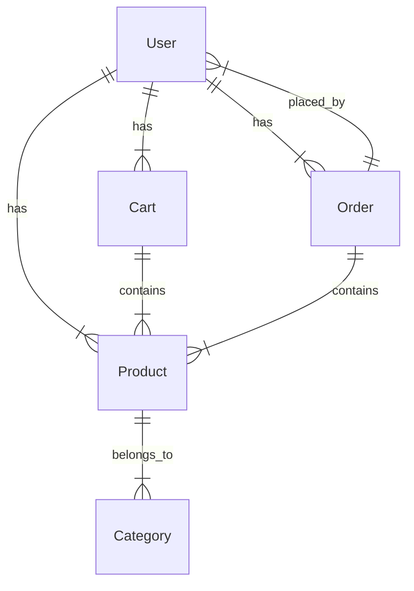
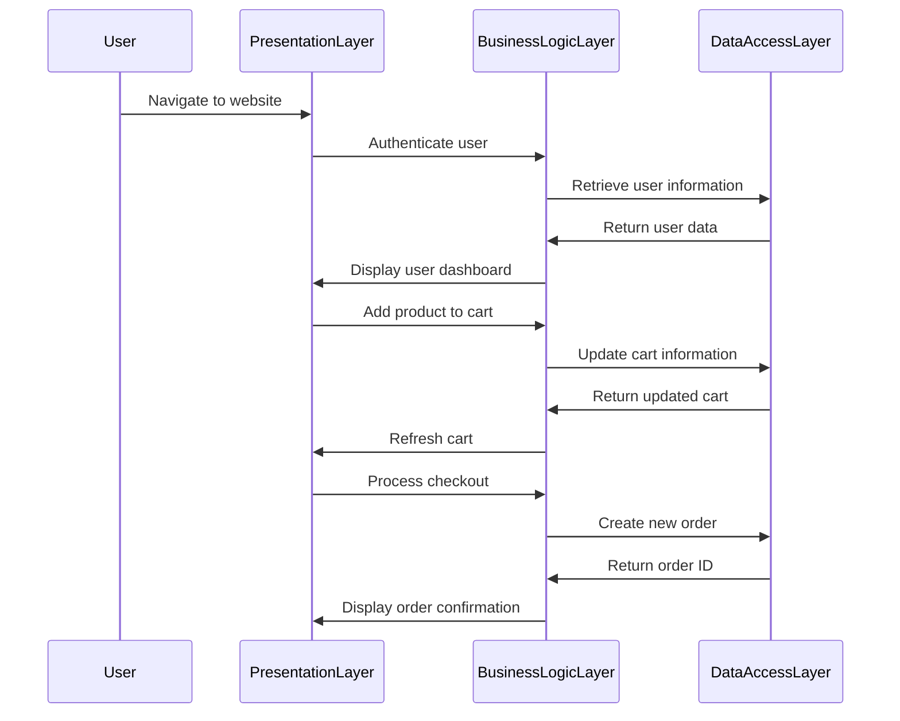
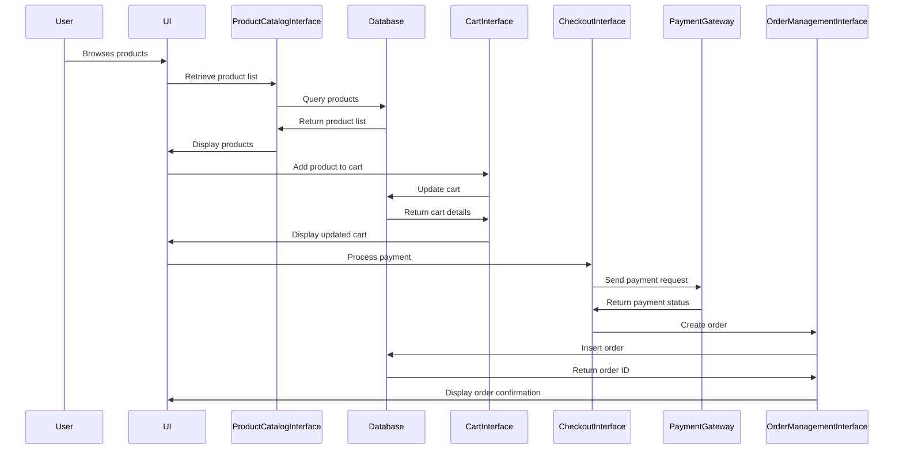

                 

## Introduction to High-Quality Code

### 1.1 Importance of High-Quality Code

High-quality code is the cornerstone of any successful software project. It encompasses not just the functional correctness of the program, but also its readability, maintainability, efficiency, testability, and documentation. In a rapidly evolving technological landscape, the importance of high-quality code cannot be overstated. Well-written code ensures that software systems are robust, reliable, and scalable, making them easier to maintain and adapt to new requirements over time.

Several factors underscore the significance of high-quality code. Firstly, it significantly reduces the cost of development and maintenance. Code that is easy to understand and modify requires less time and effort to fix bugs, add new features, or optimize performance. This, in turn, translates to reduced operational costs and faster time-to-market for new products or updates.

Secondly, high-quality code promotes better collaboration among developers. Well-structured and documented code enables team members to quickly grasp the functionality and logic of different components, facilitating more efficient teamwork and reducing the likelihood of errors introduced through miscommunication.

Moreover, high-quality code enhances user satisfaction. A well-designed software system is more intuitive to use, resulting in a better user experience. This can lead to increased customer loyalty and positive word-of-mouth, which are invaluable for building a strong reputation in the market.

Finally, high-quality code contributes to a developer's professional growth. By consistently writing clean, efficient, and well-documented code, developers can improve their skills and become more proficient in their craft. This not only boosts their career prospects but also helps them gain recognition within their organization and the broader tech community.

In summary, high-quality code is essential for minimizing costs, maximizing productivity, fostering collaboration, enhancing user satisfaction, and promoting personal and professional growth. These benefits make it a priority for any software development project, irrespective of its scale or complexity.

### 1.2 Benefits of Writing High-Quality Code

Writing high-quality code offers a multitude of benefits that extend beyond mere technical proficiency. One of the most significant advantages is **reduced technical debt**. Technical debt refers to the consequences of taking shortcuts in development, often leading to a bloated, difficult-to-maintain codebase. High-quality code, on the other hand, is designed with foresight and best practices, minimizing the accumulation of debt. This not only makes the codebase more robust but also easier to scale and extend in the future.

**Enhanced readability** is another crucial benefit. High-quality code is clean, well-organized, and follows consistent naming conventions. This makes it much easier for developers to understand, reducing the time needed to comprehend complex systems. As a result, new team members can quickly get up to speed, and existing team members can more easily navigate and modify the codebase.

**Improved maintainability** is inherently tied to readability. When code is well-structured and modular, it is easier to identify and fix bugs, add new features, and optimize performance. This leads to lower maintenance costs and fewer outages, which are particularly important for mission-critical applications.

**Increased productivity** is a direct consequence of the above benefits. Developers spend less time reading and understanding code, more time writing new features or fixing issues. This increased efficiency not only accelerates the development process but also allows teams to take on more projects and deliver higher-quality results.

**Better collaboration** is facilitated by high-quality code. When code is well-documented and structured, team members can more easily understand each other's work and contribute to the project. This leads to more effective collaboration, fewer miscommunications, and a more cohesive team effort.

**User satisfaction** is also significantly impacted by high-quality code. Behind the scenes, well-designed software translates to a better user experience. A stable, efficient system with a clean user interface is more likely to meet user expectations and generate positive feedback. This can lead to increased customer retention and loyalty, which are essential for the long-term success of any software product.

Finally, **professional growth** for developers is enhanced by writing high-quality code. It forces developers to continually improve their skills and adopt best practices. This not only makes them more proficient but also positions them as valuable assets within their organizations and the broader tech community.

In summary, writing high-quality code brings numerous benefits, from reducing technical debt and improving readability to enhancing maintainability, increasing productivity, fostering better collaboration, boosting user satisfaction, and promoting professional growth. These benefits make a compelling case for prioritizing code quality in any software development effort.

### 1.3 Challenges in Achieving High-Quality Code

Despite the clear advantages of high-quality code, achieving it is not without its challenges. One of the primary obstacles is the **time-to-market pressure**. In today's fast-paced technological landscape, companies often prioritize rapid product launches to stay ahead of the competition. This can lead to rushed development cycles where corners are cut to meet deadlines, often resulting in lower code quality. Developers may opt for quick fixes and shortcuts that compromise the overall structure and maintainability of the codebase.

**Complexity** is another significant challenge. Modern software systems are increasingly complex, involving multiple interdependent components and layers of functionality. Managing this complexity requires a deep understanding of system architecture and design principles, which can be challenging for even experienced developers. As systems grow larger and more intricate, maintaining high code quality becomes increasingly difficult, as it becomes harder to track dependencies and potential issues.

**Short-term focus** often conflicts with the long-term goal of high-quality code. In many organizations, there is a strong emphasis on short-term performance metrics, such as meeting deadlines and hitting revenue targets. This can result in a culture that undervalues the importance of writing high-quality code, prioritizing speed and immediate results over long-term sustainability. Developers may feel pressured to take shortcuts to meet these short-term goals, even if it means compromising on code quality.

**Lack of resources** is another challenge. Writing high-quality code requires time, training, and resources. Many organizations may not provide the necessary tools, training, or support to help developers write and maintain high-quality code. This can lead to a lack of best practices and a reliance on outdated or inefficient coding techniques.

**Team collaboration and communication** can also present challenges. High-quality code often requires effective collaboration and communication among team members. However, differences in skill levels, workstyles, and communication channels can lead to misunderstandings and disagreements, making it difficult to achieve a unified vision for the codebase.

**Resistance to change** is another hurdle. Many organizations have existing codebases that have been developed over years or even decades. Introducing changes to these systems to improve code quality can be met with resistance from developers who are comfortable with the current state of the system. Convincing these individuals of the benefits of improving code quality requires strong leadership and a clear communication strategy.

In summary, achieving high-quality code involves navigating several challenges, including time-to-market pressures, complexity, short-term focus, lack of resources, team collaboration issues, and resistance to change. Overcoming these challenges requires a concerted effort from leadership, developers, and the entire organization to prioritize and invest in code quality.

### The Importance of Reputation in Software Development

In the realm of software development, reputation is not just a byproduct of one's work but a fundamental driving force for success. A strong reputation can significantly impact an individual's career trajectory and the overall success of a software development project. Let's delve into the multifaceted importance of reputation in software development through several key aspects: credibility, trust, collaboration, and opportunities.

**Credibility** is the cornerstone of reputation. When developers are known for writing high-quality, robust, and maintainable code, they gain the trust of their peers, managers, and clients. This trust translates into higher credibility, making developers more likely to be chosen for critical projects, entrusted with greater responsibilities, and regarded as subject matter experts. Credibility also opens doors to new opportunities, such as speaking engagements, contributions to open-source projects, and invitations to join prestigious companies or teams.

**Trust** is another crucial element. Trust is built over time through consistent performance and adherence to professional standards. When team members trust each other's code, they can work more efficiently and collaboratively, reducing the time spent on debugging and troubleshooting. This trust is especially valuable in large or complex projects where multiple developers are working together. It fosters a positive work environment, enhances team morale, and leads to more innovative solutions.

**Collaboration** is inherently tied to reputation. A developer with a strong reputation is more likely to be a valuable team member, capable of contributing effectively to collaborative efforts. They can mentor and guide less experienced colleagues, leading to a more knowledgeable and cohesive team. High-quality code that is well-documented and easy to understand also facilitates smoother collaboration, as other team members can quickly grasp the functionality and logic, reducing the potential for errors and miscommunications.

**Opportunities** abound for those with a solid reputation. A strong reputation can lead to career advancement, including promotions, higher-paying positions, and the chance to work on cutting-edge technologies. It can also open doors to speaking engagements at conferences and workshops, where developers can share their expertise and insights with a broader audience. Additionally, a strong reputation can make it easier to secure funding for new projects or to attract investment, particularly in the startup ecosystem.

Reputation is also critical in client relationships. When a developer or development team is known for delivering high-quality software, clients are more likely to trust their recommendations and place their projects in their hands. This trust can lead to long-term partnerships, repeat business, and referrals, which are vital for the growth and success of any software development business.

In summary, reputation plays a pivotal role in software development by enhancing credibility, fostering trust, facilitating collaboration, and providing abundant opportunities. It is an intangible asset that can significantly impact a developer's career and the overall success of their projects. Prioritizing high-quality code and maintaining a strong reputation are therefore essential for long-term success in the software development industry.

### Overview of the Book

This book, "High-Quality Code: Building a Reputation for Excellence," is meticulously structured to guide developers through the intricate journey of writing impeccable code. It is designed to be both a comprehensive reference and a practical roadmap for achieving high code quality. The book is organized into five main sections, each addressing critical aspects of high-quality code development.

**Section 1: Introduction to High-Quality Code** sets the stage by discussing the importance of high-quality code, its benefits, challenges, and the significance of reputation in software development. This foundational section provides readers with a clear understanding of why high-quality code matters and what they can expect from the book.

**Section 2: Core Concepts and Principles of High-Quality Code** delves into the fundamental principles and characteristics of high-quality code. Readers will explore key aspects such as readability, maintainability, efficiency, testability, and documentation. This section also includes a comparison of high-quality and low-quality code to illustrate the practical implications of adhering to best practices.

**Section 3: Design Principles for High-Quality Code** focuses on advanced design principles and patterns. This section covers the SOLID principles and various design patterns, providing readers with a robust toolkit for crafting well-structured, scalable, and maintainable code. Detailed explanations and examples are provided to aid comprehension and practical application.

**Section 4: Practices for Writing High-Quality Code** offers practical guidance on how to implement high-quality code in real-world scenarios. This section covers code review best practices, test-driven development (TDD), and other methodologies that promote code quality. Readers will learn how to conduct effective code reviews, write comprehensive tests, and apply best practices to their daily development workflow.

**Section 5: Building a Reputation for Excellence** concludes the book by discussing the long-term impact of high-quality code on a developer's career and the broader software development community. This section includes tips on fostering a culture of high-quality code within organizations, leveraging reputation for career advancement, and contributing to open-source projects.

Throughout the book, each chapter is designed to build on the previous ones, creating a cohesive and integrated understanding of high-quality code. Practical examples, code snippets, and real-world case studies are used to illustrate key concepts, making the book accessible to both beginners and experienced developers. By the end of the book, readers will not only have a deep understanding of what constitutes high-quality code but also be equipped with the skills and knowledge to write and maintain it.

In summary, "High-Quality Code: Building a Reputation for Excellence" is a comprehensive guide that covers all aspects of writing high-quality code. It is aimed at developers who are serious about their craft and want to elevate their skills to new heights. Whether you are a seasoned professional or just starting your journey in software development, this book will provide you with the insights and tools you need to build a reputation for excellence in your field.

### Core Concepts and Principles of High-Quality Code

High-quality code is defined by several core concepts and principles that collectively ensure its readability, maintainability, efficiency, testability, and documentation. Let's explore these concepts and principles in detail, along with their importance and practical applications in software development.

#### Definition of High-Quality Code

High-quality code can be defined as code that is clean, well-organized, and adheres to best practices. It is easy to read, understand, and modify. High-quality code is also efficient, scalable, and maintainable. It is designed with a focus on long-term sustainability, minimizing technical debt and ensuring that the codebase remains robust and adaptable to future changes.

**Importance of High-Quality Code**

High-quality code is crucial for several reasons. Firstly, it enhances developer productivity by reducing the time spent on understanding, debugging, and maintaining code. This leads to faster development cycles and improved time-to-market for new products. Secondly, high-quality code promotes better collaboration among developers, as it is easier to work with code that is well-structured and well-documented. This results in fewer misunderstandings and smoother team interactions. Finally, high-quality code improves user satisfaction by delivering a more stable, reliable, and efficient software product.

**Characteristics of High-Quality Code**

1. **Readability**: High-quality code is easy to read and understand. This is achieved through consistent formatting, clear variable and function names, and appropriate use of comments. Readable code allows developers to quickly grasp the logic and functionality of the code, reducing the learning curve and making it easier to maintain.

2. **Maintainability**: Maintainability refers to the ease with which code can be modified, updated, and debugged. High-quality code is modular, with well-defined functions and classes that have a single responsibility. It is also well-documented, with clear and concise comments that explain the purpose and functionality of each component.

3. **Efficiency**: Efficiency in code refers to its performance and resource usage. High-quality code is optimized for speed and minimal resource consumption. This is achieved through efficient algorithms, appropriate data structures, and careful resource management.

4. **Testability**: Testability is the degree to which code can be tested to ensure its correctness. High-quality code is designed with testability in mind, making it easier to write and execute tests. This includes writing modular code, using appropriate design patterns, and providing clear interfaces for testing.

5. **Documentation**: Documentation is essential for high-quality code. It includes comments within the code, as well as external documentation such as API documentation and user guides. Good documentation makes it easier for developers to understand and use the code, and for users to understand how to use the software.

**Comparing High-Quality and Low-Quality Code**

To illustrate the differences between high-quality and low-quality code, consider the following comparison:

1. **Structure**: High-quality code is well-organized, with a clear structure that makes it easy to understand and navigate. Low-quality code is often disorganized, with poorly named variables and functions, leading to confusion and difficulty in understanding the code's logic.

2. **Comments**: High-quality code is well-documented, with comments that explain the purpose and functionality of each component. Low-quality code may lack comments or have comments that are unclear or outdated.

3. **Modularity**: High-quality code is modular, with functions and classes that have a single responsibility. This makes it easier to understand, test, and maintain. Low-quality code may have functions and classes that are too large and complex, making it harder to manage and modify.

4. **Error Handling**: High-quality code includes proper error handling and debugging, making it more reliable and stable. Low-quality code may lack error handling or use outdated methods, leading to unexpected behavior and difficult debugging.

5. **Performance**: High-quality code is optimized for performance, using efficient algorithms and data structures. Low-quality code may use inefficient algorithms or neglect performance considerations, leading to slower execution and higher resource consumption.

In conclusion, high-quality code is characterized by its readability, maintainability, efficiency, testability, and documentation. These characteristics are achieved through adherence to best practices, careful design, and a focus on long-term sustainability. By writing high-quality code, developers can enhance their productivity, promote better collaboration, and deliver more reliable and efficient software products. Conversely, low-quality code can lead to increased costs, reduced productivity, and diminished user satisfaction.

### The SOLID Principles

The SOLID principles are a set of guidelines for designing robust, scalable, and maintainable object-oriented software. Each principle addresses a specific aspect of software design, ensuring that classes and components are well-structured and adhere to best practices. Let's explore each of the SOLID principles in detail, along with their definitions and implications for software development.

#### Single Responsibility Principle (SRP)

**Definition**: The Single Responsibility Principle (SRP) states that a class should have only one reason to change. In other words, a class should have one and only one responsibility.

**Implications**: Adhering to SRP ensures that classes are focused and manageable. Each class has a clear and distinct purpose, making it easier to understand, test, and maintain. This also simplifies refactoring and debugging, as changes in one responsibility are less likely to affect other parts of the system.

**Example**: A class that handles both user authentication and data storage would violate SRP. Instead, separate these responsibilities into two distinct classes: one for authentication and another for data storage.

#### Open/Closed Principle (OCP)

**Definition**: The Open/Closed Principle (OCP) states that software entities (classes, modules, functions, etc.) should be open for extension but closed for modification.

**Implications**: OCP encourages developers to design classes that can be extended without modifying their existing code. This is typically achieved through the use of inheritance, interfaces, and polymorphism. By adhering to OCP, developers can add new functionality without modifying the core logic of the system, leading to more maintainable and scalable code.

**Example**: A class that handles different types of shapes can be designed with OCP by using inheritance. For example, a `Shape` class can be extended to create specific shapes like `Circle` and `Rectangle`. New shapes can be added by extending the base `Shape` class without modifying its existing code.

#### Liskov Substitution Principle (LSP)

**Definition**: The Liskov Substitution Principle (LSP) states that objects of a superclass should be replaceable with objects of a subclass without affecting the correctness of the program.

**Implications**: LSP ensures that subclass implementations maintain the contract specified by their superclass. This means that any method that can be called on a superclass instance should also be safe to call on a subclass instance without altering the expected behavior. Adhering to LSP helps in maintaining the integrity and coherence of the class hierarchy.

**Example**: If a `Rectangle` class overrides a `getArea()` method from a `Shape` superclass, it must return the area of the rectangle. If the `Rectangle` class returns an incorrect value, it violates LSP.

#### Interface Segregation Principle (ISP)

**Definition**: The Interface Segregation Principle (ISP) states that no client should be forced to depend on interfaces it does not use.

**Implications**: ISP promotes the creation of fine-grained, specialized interfaces rather than one large, monolithic interface. This ensures that clients only depend on the methods they actually use, reducing unnecessary dependencies and making the code more modular and maintainable.

**Example**: An interface for a library that handles file operations might include methods for reading, writing, and deleting files. However, a client interested only in reading files should not be forced to depend on the write and delete methods. Instead, a separate interface for reading files can be created.

#### Dependency Inversion Principle (DIP)

**Definition**: The Dependency Inversion Principle (DIP) states that high-level modules should not depend on low-level modules. Both should depend on abstractions.

**Implications**: DIP encourages the use of abstractions to decouple high-level and low-level modules. High-level modules should depend on abstract interfaces rather than concrete implementations. This ensures that changes in low-level modules do not require modifying high-level modules, promoting modularity and reducing the impact of changes.

**Example**: An application layer that handles user authentication should depend on an abstract `AuthenticationProvider` interface rather than a concrete implementation like `LDAPAuthenticationProvider`. This way, if a new authentication mechanism is added, only the concrete implementation needs to change, while the application layer remains unaffected.

In summary, the SOLID principles provide a comprehensive framework for designing high-quality, maintainable, and scalable object-oriented software. By adhering to these principles, developers can create code that is easier to understand, test, and maintain. Each principle addresses a specific aspect of software design, ensuring that classes and components are well-structured and adhere to best practices. Incorporating SOLID principles into your software development process can lead to more efficient development cycles and higher-quality software products.

### Design Patterns

Design patterns are reusable solutions to common problems in software design. They provide proven approaches for addressing specific design challenges in a systematic and efficient manner. There are several categories of design patterns, including creational, structural, and behavioral patterns. Each category serves a different purpose and can be applied in various scenarios to improve code quality and maintainability. Let's explore some of the most commonly used design patterns in each category, along with their definitions, characteristics, and practical applications.

#### Creational Patterns

Creational patterns focus on the creation of objects and aim to decouple the object creation process from the client code, allowing for greater flexibility and reusability.

1. **Singleton Pattern**

   **Definition**: The Singleton pattern ensures that a class has only one instance and provides a global point of access to that instance.

   **Characteristics**: Singleton patterns enforce a one-to-one relationship between the class and its instances, preventing multiple instances from being created. They typically use a static method to access the instance and a private constructor to prevent direct instantiation.

   **Application**: Singleton patterns are useful for managing resources that should have a single point of access, such as database connections, thread pools, or configuration objects.

2. **Factory Method Pattern**

   **Definition**: The Factory Method pattern defines an interface for creating objects, but allows subclasses to alter the type of objects that will be created.

   **Characteristics**: This pattern uses a factory method that delegates the responsibility of object creation to subclasses. Subclasses override the factory method to create different types of objects.

   **Application**: Factory Method patterns are commonly used when a class cannot anticipate the types of objects it needs to create, or when the type of object to be created is determined by the runtime conditions.

3. **Abstract Factory Pattern**

   **Definition**: The Abstract Factory pattern provides an interface for creating families of related or dependent objects without specifying their concrete classes.

   **Characteristics**: This pattern uses abstract factory classes to encapsulate the creation of families of objects. Concrete factory classes implement the abstract factory interface and create specific objects.

   **Application**: Abstract Factory patterns are useful when a system should be configured with one of multiple families of related objects at runtime. They are often used in applications that require a consistent interface for accessing a set of related classes.

4. **Builder Pattern**

   **Definition**: The Builder pattern separates the construction of a complex object from its representation, allowing the same construction process to create different representations.

   **Characteristics**: This pattern uses a builder class that constructs the complex object step by step. The client uses the builder to set various parts of the object, and the builder returns the fully constructed object.

   **Application**: Builder patterns are useful when an object has many constructor parameters or when the construction of an object is complex and may vary. They are often used in building complex data structures like HTML documents or financial reports.

#### Structural Patterns

Structural patterns focus on the composition of classes and objects to form larger structures and to provide flexibility to the design.

1. **Adapter Pattern**

   **Definition**: The Adapter pattern converts the interface of a class into another interface that the clients expect. It allows classes with incompatible interfaces to work together.

   **Characteristics**: This pattern involves an adapter class that has both an interface for the adaptee (the class being adapted) and an interface for the client. The adapter implements the client's interface and forwards requests to the adaptee.

   **Application**: Adapter patterns are useful when you want to use an existing class, but its interface doesn't match the one expected by the client. They are often used in situations where you need to integrate third-party libraries or APIs that don't fit well with your existing codebase.

2. **Decorator Pattern**

   **Definition**: The Decorator pattern dynamically adds behaviors to individual objects, without affecting the behavior of other objects from the same class.

   **Characteristics**: This pattern uses a decorator class that wraps an object, adding new behavior or overriding existing behavior. Decorators follow the same interface as the objects they decorate, allowing them to be used interchangeably.

   **Application**: Decorator patterns are useful when you want to add functionality to objects on the fly, without modifying their class or creating a new class hierarchy. They are often used in logging, caching, and security filtering.

3. **Facade Pattern**

   **Definition**: The Facade pattern provides a simplified interface to a more complex subsystem, enabling the client to interact with the subsystem through a single interface.

   **Characteristics**: This pattern defines a facade class that encapsulates the complexity of the subsystem and provides a high-level interface to the client. The facade delegates specific requests to the appropriate subsystem components.

   **Application**: Facade patterns are useful when you have a complex subsystem with many interdependent classes and interfaces. They simplify the client's interaction with the subsystem, providing a higher-level, more understandable interface.

4. **Proxy Pattern**

   **Definition**: The Proxy pattern provides a surrogate or placeholder for another object to control access to it, usually for the purpose of reducing the number of direct interactions with the target object.

   **Characteristics**: This pattern involves a proxy class that acts as a substitute for the real subject object. The proxy manages access to the real subject, providing additional behavior such as lazy initialization, caching, or security checks.

   **Application**: Proxy patterns are useful when you want to control access to an object or add functionality before or after the execution of the real object's methods. They are often used in remote method invocation, lazy loading, and access control.

#### Behavioral Patterns

Behavioral patterns focus on the interaction between objects and the assignment of responsibilities among objects.

1. **Observer Pattern**

   **Definition**: The Observer pattern defines a one-to-many dependency between objects, so that when one object changes state, all its dependents are notified and updated automatically.

   **Characteristics**: This pattern involves an observable object (the subject) that maintains a list of its dependents (observers) and notifies them of any state changes. Observers register themselves with the subject and are notified when the subject's state changes.

   **Application**: Observer patterns are useful when you want to establish a one-to-many relationship between objects, so that when one object changes state, all related objects are automatically updated. They are often used in event-driven systems, user interfaces, and financial systems.

2. **Strategy Pattern**

   **Definition**: The Strategy pattern defines a family of algorithms, encapsulates each one, and makes them interchangeable. The strategy lets the algorithm vary independently from clients that use it.

   **Characteristics**: This pattern involves a context class that uses a strategy interface to define a family of algorithms. It maintains a reference to a strategy object and delegates specific behavior to the strategy.

   **Application**: Strategy patterns are useful when you need to select an algorithm from a family of algorithms at runtime. They are often used in sorting algorithms, payment processing, and UI rendering.

3. **Template Method Pattern**

   **Definition**: The Template Method pattern defines the skeleton of an algorithm in a method, deferring some steps to subclasses. This allows the subclasses to redefine certain steps of an algorithm without changing the algorithm's structure.

   **Characteristics**: This pattern involves an abstract class with a template method that encapsulates the overall algorithm and calls a sequence of helper methods. Subclasses override the helper methods to provide specific implementations.

   **Application**: Template Method patterns are useful when you want to define an algorithm's skeleton and let subclasses implement certain steps. They are often used in frameworks, compilers, and game engines.

In summary, design patterns provide reusable solutions to common design problems in software development. By understanding and applying these patterns, developers can create more flexible, modular, and maintainable code. Each pattern addresses a specific aspect of software design, whether it is object creation, composition, or interaction. Incorporating design patterns into your development process can lead to improved code quality, reduced complexity, and more efficient development cycles.

### Practices for Writing High-Quality Code

Writing high-quality code involves more than just following best practices; it requires a systematic approach that incorporates various methodologies and tools. Two of the most effective practices for achieving high-quality code are code reviews and test-driven development (TDD). Let's delve into these practices, exploring their roles, benefits, and how they can be effectively implemented in software development projects.

#### Code Review Best Practices

**The Role of Code Reviews**

Code reviews are a systematic process where developers review each other's code to identify bugs, ensure adherence to coding standards, and improve overall code quality. Code reviews play a crucial role in the software development lifecycle by promoting collaboration, catching potential issues early, and fostering a culture of continuous improvement.

**Conducting Effective Code Reviews**

Effective code reviews involve several key steps:

1. **Preparation**: Before conducting a code review, the reviewer should familiarize themselves with the codebase, the specific changes being made, and any relevant documentation or requirements. This helps in providing constructive feedback and identifying potential issues.

2. **Understanding the Code**: The reviewer should thoroughly read and understand the code being reviewed. This includes analyzing the logic, structure, and any associated documentation. The goal is to identify potential bugs, readability issues, and areas where the code can be improved.

3. **Reviewing for Quality**: The reviewer should assess the code against established coding standards, best practices, and the project's requirements. This includes checking for proper naming conventions, modular design, appropriate error handling, and efficient algorithms.

4. **Providing Feedback**: Feedback should be constructive and clear, focusing on specific areas of improvement rather than making personal judgments. The reviewer should provide explanations for any suggestions, helping the developer understand the reasoning behind the feedback.

5. **Documentation**: The review process should be well-documented, with all feedback and decisions recorded. This helps in maintaining a history of improvements and provides a reference for future reviews.

**Handling Code Review Feedback**

Once feedback is received, the developer should carefully consider each point and make the necessary changes. It's important to maintain open communication with the reviewer, seeking clarification if needed, and ensuring that all concerns are addressed. Addressing feedback promptly and effectively helps in improving code quality and fostering a positive working relationship.

**Benefits of Code Reviews**

Code reviews offer several benefits:

1. **Improved Code Quality**: By catching bugs and readability issues early, code reviews help in ensuring that the code is of high quality. This leads to fewer defects in the final product and reduces the cost of fixing issues later in the development process.

2. **Knowledge Sharing**: Code reviews promote knowledge sharing among team members. Developers learn from each other's code and best practices, improving their overall skills and expertise.

3. **Enhanced Collaboration**: Code reviews encourage collaboration and open communication within the team. By discussing code changes and potential improvements, team members can work together more effectively and build a cohesive codebase.

4. **Reduced Technical Debt**: By adhering to established coding standards and best practices, code reviews help in minimizing technical debt. This ensures that the codebase remains clean, maintainable, and scalable over time.

#### Test-Driven Development (TDD)

**What is Test-Driven Development (TDD)?**

Test-Driven Development (TDD) is a software development methodology that emphasizes writing tests before writing the actual code. TDD follows a simple cycle of three steps: writing a test that fails, writing the minimum amount of code to pass the test, and then refactoring the code to improve its quality. This iterative process helps in ensuring that the code is testable, reliable, and maintainable.

**Advantages of TDD**

1. **Improved Quality**: By writing tests before the code, developers can identify issues and edge cases early, ensuring that the code is robust and reliable. This leads to fewer bugs and higher overall code quality.

2. **Design Improvements**: TDD encourages developers to think about the design of their code from the outset, leading to more modular, flexible, and maintainable designs. By focusing on writing testable code, developers are more likely to follow best practices and design principles.

3. **Reduced Maintenance Costs**: TDD ensures that the code is thoroughly tested, making it easier to maintain and update. Tests serve as documentation and can be used to verify that changes do not break existing functionality.

4. **Faster Development**: While TDD may initially slow down development due to the extra time spent writing tests, it ultimately leads to faster development over time. By catching issues early, developers spend less time debugging and fixing problems later on.

**Implementing TDD**

To effectively implement TDD, developers should follow these steps:

1. **Write a Test**: Start by writing a test that defines the expected behavior of the code. The test should fail initially since the code has not been written yet.

2. **Write the Code**: Write the minimum amount of code required to make the test pass. Focus on solving the specific problem identified by the test.

3. **Refactor**: Once the test passes, refactor the code to improve its quality. This may involve simplifying the logic, eliminating redundant code, or improving readability and maintainability.

4. **Iterate**: Repeat the process for each new feature or functionality. Each iteration builds on the previous ones, ensuring that the code remains clean and testable.

**Tools for TDD**

Several tools can support the TDD process, including test runners, code coverage tools, and integrated development environments (IDEs) with built-in testing capabilities. Popular test runners include JUnit for Java, pytest for Python, and NUnit for .NET. Code coverage tools, such as JaCoCo for Java and Coverage.py for Python, help in ensuring that tests cover a significant portion of the codebase. IDEs like IntelliJ IDEA, Visual Studio, and PyCharm offer integrated testing features that make it easier to write and run tests.

In conclusion, writing high-quality code involves a combination of best practices, methodologies, and tools. Code reviews and test-driven development are two critical practices that promote code quality, improve collaboration, and reduce technical debt. By incorporating these practices into their development process, teams can build more reliable, maintainable, and scalable software products.

### System Analysis and Architecture Design

In this section, we will delve into the system analysis and architecture design process, providing a comprehensive overview of the problem domain, system functionality, and key design components. This will include the creation of entity-relationship (ER) diagrams, system architecture diagrams, and sequence diagrams to illustrate the interaction between different components.

#### Problem Domain Overview

The problem domain for our system is an e-commerce platform that allows users to browse, purchase, and manage products. The system must handle various functionalities such as user authentication, product catalog management, shopping cart operations, and order processing. The key requirements include scalability, reliability, and security to ensure a seamless user experience.

#### System Functionality

The system can be divided into several major functional modules:

1. **User Management**: Handles user registration, login, and authentication.
2. **Product Catalog**: Manages product information, categories, and pricing.
3. **Shopping Cart**: Allows users to add, remove, and modify items in their shopping cart.
4. **Checkout**: Processes user payments and generates orders.
5. **Order Management**: Tracks order status, manages inventory, and handles refunds.

#### Entity-Relationship (ER) Diagram

The ER diagram is a visual representation of the data model for our e-commerce system. It illustrates the entities, their attributes, and the relationships between them. Below is a simplified ER diagram in Mermaid format:



In this diagram:
- **User** has a one-to-many relationship with **Cart** and **Order**.
- **Product** belongs to a **Category**.
- **Cart** contains multiple **Product** items.
- **Order** contains multiple **Product** items and is placed by a **User**.

#### System Architecture Design

The system architecture is designed to be modular and scalable, using a layered architecture approach. The key components include:

1. **Presentation Layer**: Handles user interactions through a web interface or mobile app.
2. **Business Logic Layer**: Implements the core functionalities of the system, such as user authentication, product management, shopping cart operations, and order processing.
3. **Data Access Layer**: Manages database interactions, including CRUD operations for users, products, carts, and orders.
4. **Database**: Stores user, product, cart, and order information.

Below is a Mermaid sequence diagram illustrating the interaction between these components:



In this sequence diagram:
- The user navigates to the website and logs in.
- The presentation layer handles user authentication and forwards requests to the business logic layer.
- The business logic layer processes the requests, interacts with the data access layer, and manages the flow of data.
- The data access layer performs database operations and returns results to the business logic layer.

#### System Interface Design

The system interfaces define how different components communicate with each other. Below is a high-level overview of the key interfaces:

1. **User Interface (UI)**: Provides a user-friendly interface for browsing products, managing carts, and placing orders.
2. **Authentication Interface**: Manages user authentication and session management.
3. **Product Catalog Interface**: Handles retrieval and management of product information.
4. **Cart Interface**: Manages shopping cart operations, such as adding, removing, and updating items.
5. **Checkout Interface**: Processes user payments and generates orders.
6. **Order Management Interface**: Handles tracking order status, managing inventory, and handling refunds.

#### System Interaction

The system interaction is orchestrated through well-defined APIs and service calls between components. Below is a Mermaid sequence diagram illustrating the interaction between different components:



In this sequence diagram:
- The user browses products and adds items to the cart.
- The UI interacts with the product catalog interface to retrieve and display product information.
- The user initiates the checkout process, and the checkout interface processes the payment through a payment gateway.
- The payment status is returned, and the order is created and stored in the database.
- The order confirmation is displayed to the user.

In summary, the system analysis and architecture design for the e-commerce platform is comprehensive, ensuring scalability, reliability, and security. By using ER diagrams, system architecture diagrams, and sequence diagrams, we can clearly illustrate the problem domain, system functionality, and component interactions. This detailed design provides a solid foundation for developing and maintaining a high-quality, robust e-commerce system.

### Project Implementation

In this section, we will delve into the practical implementation of the e-commerce platform project. This includes setting up the development environment, writing core system components, and providing code analysis and debugging techniques to ensure the system is robust and reliable. We will also present a detailed case study to illustrate the application of these techniques in a real-world scenario.

#### Setting Up the Development Environment

To implement the e-commerce platform, we will use a combination of Python and its associated frameworks and libraries. The development environment setup involves the following steps:

1. **Installation of Python**: Ensure that Python 3.8 or later is installed on the development machine.
2. **Virtual Environment**: Create a virtual environment to manage dependencies and isolate the project from the global Python environment.

   ```bash
   python -m venv venv
   source venv/bin/activate  # On Windows use `venv\Scripts\activate`
   ```

3. **Installation of Required Libraries**: Install the necessary libraries, such as Flask for web development, SQLAlchemy for database interaction, and pytest for testing.

   ```bash
   pip install flask sqlalchemy pytest
   ```

4. **Project Structure**: Set up the project structure with separate folders for models, views, templates, and tests.

   ```plaintext
   /ecommerce_platform
       /models
       /views
       /templates
       /tests
       app.py
   ```

#### Writing Core System Components

The core components of the e-commerce platform include user management, product catalog, shopping cart, and order processing. Here, we will provide a high-level overview of each component along with sample code snippets.

**User Management**

The user management component handles user registration, login, and authentication. We will use Flask-Login for handling user sessions.

1. **User Model**: The user model defines the structure of user data.

   ```python
   from flask_sqlalchemy import SQLAlchemy
   
   db = SQLAlchemy()

   class User(db.Model):
       id = db.Column(db.Integer, primary_key=True)
       username = db.Column(db.String(150), nullable=False, unique=True)
       password = db.Column(db.String(150), nullable=False)
   ```

2. **Registration and Login Views**: The registration and login views handle user authentication.

   ```python
   from flask import Flask, render_template, request, redirect, url_for
   from flask_login import LoginManager, login_user, logout_user, login_required
   
   app = Flask(__name__)
   app.config['SQLALCHEMY_DATABASE_URI'] = 'sqlite:///ecommerce.db'
   db.init_app(app)
   login_manager = LoginManager()
   login_manager.init_app(app)
   
   @app.route('/register', methods=['GET', 'POST'])
   def register():
       if request.method == 'POST':
           username = request.form['username']
           password = request.form['password']
           new_user = User(username=username, password=password)
           db.session.add(new_user)
           db.session.commit()
           return redirect(url_for('login'))
       return render_template('register.html')
   
   @app.route('/login', methods=['GET', 'POST'])
   def login():
       if request.method == 'POST':
           username = request.form['username']
           password = request.form['password']
           user = User.query.filter_by(username=username).first()
           if user and user.password == password:
               login_user(user)
               return redirect(url_for('dashboard'))
           return 'Invalid credentials'
       return render_template('login.html')
   
   @app.route('/logout')
   @login_required
   def logout():
       logout_user()
       return redirect(url_for('login'))
   ```

**Product Catalog**

The product catalog component manages product information, categories, and pricing.

1. **Product and Category Models**: The product and category models define the relationships between them.

   ```python
   class Category(db.Model):
       id = db.Column(db.Integer, primary_key=True)
       name = db.Column(db.String(150), nullable=False, unique=True)
       products = db.relationship('Product', backref='category', lazy=True)
   
   class Product(db.Model):
       id = db.Column(db.Integer, primary_key=True)
       name = db.Column(db.String(150), nullable=False)
       price = db.Column(db.Float, nullable=False)
       category_id = db.Column(db.Integer, db.ForeignKey('category.id'), nullable=False)
   ```

2. **Product Management Views**: The product management views handle adding, retrieving, and updating product information.

   ```python
   @app.route('/products', methods=['GET', 'POST'])
   @login_required
   def manage_products():
       if request.method == 'POST':
           name = request.form['name']
           price = request.form['price']
           category_id = request.form['category_id']
           new_product = Product(name=name, price=price, category_id=category_id)
           db.session.add(new_product)
           db.session.commit()
           return redirect(url_for('manage_products'))
       categories = Category.query.all()
       return render_template('manage_products.html', categories=categories)
   ```

**Shopping Cart**

The shopping cart component manages the addition, removal, and modification of items in the user's shopping cart.

1. **Cart Model**: The cart model stores the user's cart items.

   ```python
   class Cart(db.Model):
       id = db.Column(db.Integer, primary_key=True)
       user_id = db.Column(db.Integer, db.ForeignKey('user.id'), nullable=False)
       items = db.relationship('CartItem', backref='cart', lazy=True)
   
   class CartItem(db.Model):
       id = db.Column(db.Integer, primary_key=True)
       product_id = db.Column(db.Integer, db.ForeignKey('product.id'), nullable=False)
       quantity = db.Column(db.Integer, nullable=False)
       cart_id = db.Column(db.Integer, db.ForeignKey('cart.id'), nullable=False)
   ```

2. **Cart Management Views**: The cart management views handle adding items to the cart and updating cart quantities.

   ```python
   @app.route('/add_to_cart', methods=['POST'])
   @login_required
   def add_to_cart():
       product_id = request.form['product_id']
       quantity = request.form['quantity']
       user = current_user
       cart = user.cart
       if not cart:
           cart = Cart(user_id=user.id)
           db.session.add(cart)
       cart_item = CartItem.query.filter_by(product_id=product_id, cart_id=cart.id).first()
       if not cart_item:
           cart_item = CartItem(product_id=product_id, quantity=quantity, cart_id=cart.id)
           db.session.add(cart_item)
       else:
           cart_item.quantity += int(quantity)
       db.session.commit()
       return redirect(url_for('cart'))
   
   @app.route('/cart', methods=['GET', 'POST'])
   @login_required
   def cart():
       cart_items = CartItem.query.filter_by(cart_id=current_user.cart.id).all()
       total = sum(item.quantity * item.product.price for item in cart_items)
       if request.method == 'POST':
           for item in cart_items:
               if 'remove' in request.form.getlist(f'quantity_{item.id}'):
                   item.quantity = 0
           db.session.commit()
           total = sum(item.quantity * item.product.price for item in cart_items)
       return render_template('cart.html', cart_items=cart_items, total=total)
   ```

**Order Processing**

The order processing component handles the creation of orders and manages the order lifecycle.

1. **Order Model**: The order model captures the details of an order.

   ```python
   class Order(db.Model):
       id = db.Column(db.Integer, primary_key=True)
       user_id = db.Column(db.Integer, db.ForeignKey('user.id'), nullable=False)
       status = db.Column(db.String(150), nullable=False, default='pending')
       items = db.relationship('OrderItem', backref='order', lazy=True)
   
   class OrderItem(db.Model):
       id = db.Column(db.Integer, primary_key=True)
       order_id = db.Column(db.Integer, db.ForeignKey('order.id'), nullable=False)
       product_id = db.Column(db.Integer, db.ForeignKey('product.id'), nullable=False)
       quantity = db.Column(db.Integer, nullable=False)
       price = db.Column(db.Float, nullable=False)
   ```

2. **Order Management Views**: The order management views handle placing orders and updating order statuses.

   ```python
   @app.route('/place_order', methods=['POST'])
   @login_required
   def place_order():
       cart = current_user.cart
       order = Order(user_id=current_user.id)
       db.session.add(order)
       for item in cart.items:
           order_item = OrderItem(order_id=order.id, product_id=item.product_id, quantity=item.quantity, price=item.product.price)
           db.session.add(order_item)
       db.session.commit()
       cart.items = []  # Clear the cart
       db.session.commit()
       return redirect(url_for('order_status', order_id=order.id))
   
   @app.route('/order_status/<int:order_id>')
   @login_required
   def order_status(order_id):
       order = Order.query.get(order_id)
       if order and order.status == 'pending':
           order.status = 'processing'
           db.session.commit()
       return render_template('order_status.html', order=order)
   ```

#### Code Analysis and Debugging

Code analysis and debugging are crucial for identifying and resolving issues in the system. Here are some best practices:

1. **Code Analysis Tools**: Use static code analysis tools like PyCharm's built-in linter, flake8, or pylint to catch potential bugs and adherence to coding standards.
2. **Debugging Techniques**: Use print statements, logging, and debugging tools like PyCharm's debugger to trace and resolve issues.
3. **Test-Driven Development (TDD)**: Write tests for each component before writing the actual code to ensure correctness and robustness.

#### Case Study

**Scenario**: A user is unable to add items to their shopping cart.

**Debugging Steps**:
1. Check the browser's console for any JavaScript errors.
2. Examine the network tab in the browser's developer tools to see if the AJAX request to add items to the cart is successful.
3. Verify that the `add_to_cart` function in the backend is correctly updating the cart in the database.
4. Confirm that the user is logged in and the cart is associated with their account.

**Resolution**:
- After checking the browser's console, it was found that there was a JavaScript error in the cart update function. The error was caused by a missing dependency.
- The network tab showed that the AJAX request was successful, indicating that the issue was not with the request itself.
- Upon further investigation, it was discovered that the `add_to_cart` function was incorrectly querying the wrong cart record. The query was updated to use the current user's cart.
- The issue was resolved, and the user was able to add items to their cart successfully.

In summary, the practical implementation of the e-commerce platform involved setting up a development environment, writing core system components, and employing code analysis and debugging techniques. By following a structured approach and utilizing best practices, we were able to create a robust and reliable system. The case study illustrates the importance of thorough debugging and problem-solving skills in resolving issues and ensuring the system's functionality.

### Best Practices for Writing High-Quality Code

To achieve high-quality code, developers must adopt a series of best practices that encompass various aspects of software development. These practices not only improve code quality but also enhance productivity, maintainability, and collaboration. Let's explore some of the most effective best practices and how to apply them in real-world scenarios.

#### 1. Follow Coding Standards and Conventions

Adhering to a consistent coding style and standard is crucial for readability and maintainability. Popular coding standards include PEP 8 for Python, Java Code Style, and the Google Java Style Guide. Here's how to apply these standards:

- **Automate Code Formatting**: Use tools like Prettier, Black, or ESLint to automatically format code according to the established standards.
- **Code Linters**: Utilize linters like Pylint, ESLint, or Checkstyle to catch coding style issues, potential bugs, and enforce best practices.
- **Code Reviews**: Conduct regular code reviews to ensure adherence to coding standards and catch any deviations early.

#### 2. Write Clear and Concise Comments

Comments are essential for understanding code and should be used judiciously. Here are some guidelines for writing effective comments:

- **Document the Purpose**: Explain the purpose of complex functions, methods, or large blocks of code.
- **Avoid redundant Comments**: Modern IDEs can infer variable types and other details, so avoid redundant comments like `int x = 5; // x = 5`.
- **Use Inline Comments Sparingly**: Inline comments should be used sparingly and only when explaining a non-obvious implementation detail.

#### 3. Apply Modularity and Single Responsibility Principle

Modularity and the Single Responsibility Principle (SRP) are key to maintainable code. Here's how to implement them:

- **Small, Focused Functions**: Write functions that perform a single task and have clear, concise names.
- **Module Separation**: Organize code into modules or classes, each with a single responsibility.
- **Refactoring**: Continuously refactor code to improve modularity and adhere to SRP.

#### 4. Write Comprehensive Tests

Test-driven development (TDD) is a powerful practice for ensuring code quality. Here's how to write comprehensive tests:

- **Unit Tests**: Write unit tests for individual functions and methods to ensure they work as expected.
- **Integration Tests**: Test the interaction between different components or modules to ensure they work together seamlessly.
- **Automated Test Execution**: Use test runners like pytest, JUnit, or TestNG to automate test execution and quickly identify issues.

#### 5. Utilize Design Patterns and Best Practices

Design patterns and best practices are proven solutions to common software design problems. Here are some recommendations:

- **Creational Patterns**: Use Singleton, Factory Method, or Abstract Factory to manage object creation.
- **Structural Patterns**: Apply Adapter, Decorator, or Facade to simplify complex systems and enhance modularity.
- **Behavioral Patterns**: Implement Observer, Strategy, or Template Method to manage dynamic behavior and decouple components.

#### 6. Optimize for Performance

Performance optimization is critical for high-quality code, especially in systems with high load or complex algorithms. Here are some tips:

- **Efficient Algorithms**: Choose algorithms with lower time and space complexity.
- **Data Structures**: Use appropriate data structures to improve efficiency.
- **Memory Management**: Avoid unnecessary memory allocations and deallocations.

#### 7. Prioritize Code Readability

Readable code is easier to understand, debug, and maintain. Follow these principles to improve readability:

- **Descriptive Names**: Use clear, descriptive names for variables, functions, and classes.
- **Consistent Naming Conventions**: Follow consistent naming conventions to improve code readability.
- **Simplify Complexity**: Break down complex logic into smaller, more manageable functions or classes.

#### 8. Use Version Control Systems

Version control systems like Git are essential for tracking changes, collaborating with team members, and managing different code versions. Here's how to use them effectively:

- **Commit Early and Often**: Regularly commit changes to your codebase to track progress and facilitate collaboration.
- **Use Meaningful Commit Messages**: Write clear, concise, and meaningful commit messages to explain the purpose of each change.
- **Branching and Merging**: Use branching strategies like GitFlow or GitHub Flow to manage feature development and ensure smooth integration.

#### 9. Regularly Refactor Code

Refactoring is the process of improving the internal structure of code without changing its external behavior. Here's how to apply refactoring effectively:

- **Continuous Improvement**: Regularly review and refactor code to eliminate technical debt and improve maintainability.
- **Refactoring Tools**: Use tools like PyCharm's refactoring tools or Git's rebase to automate refactoring tasks.

#### 10. Engage in Continuous Learning

Finally, continuous learning is essential for staying up-to-date with the latest technologies, tools, and best practices. Here's how to foster a culture of continuous learning:

- **Attend Conferences and Workshops**: Attend relevant conferences, workshops, and meetups to stay informed about the latest trends and technologies.
- **Read Books and Articles**: Read books, articles, and research papers to deepen your understanding of software development concepts and techniques.
- **Contribute to Open Source**: Contribute to open-source projects to gain practical experience and learn from experienced developers.

By following these best practices, developers can write high-quality code that is robust, maintainable, and efficient. These practices not only improve code quality but also enhance productivity, collaboration, and professional growth. Embracing these principles and continuously improving your skills will set you on the path to achieving excellence in software development.

### Conclusion

In conclusion, writing high-quality code is a critical skill for any software developer. High-quality code not only enhances productivity, reduces maintenance costs, and improves collaboration but also fosters a developer's professional growth and reputation. Throughout this book, we have explored the core concepts, principles, and best practices for writing high-quality code, including the importance of readability, maintainability, efficiency, and testability.

We discussed the SOLID principles and design patterns, which provide a robust framework for designing scalable, maintainable, and modular code. Additionally, we covered practices such as code reviews and test-driven development (TDD) to ensure that code is robust and free from defects. Furthermore, we delved into system analysis and architecture design, demonstrating how to create clear and comprehensive designs for complex software systems.

To summarize, the key takeaways from this book are:

1. **Adhere to Best Practices**: Follow established coding standards, document your code, and apply design patterns and principles.
2. **Prioritize Readability and Maintainability**: Write clean, modular, and well-documented code that is easy to understand and maintain.
3. **Continuous Learning**: Stay updated with the latest technologies, tools, and best practices through continuous learning and professional development.
4. **Collaborate and Communicate**: Foster a culture of collaboration and open communication within your team to improve code quality and teamwork.

By incorporating these principles and practices into your daily development workflow, you can elevate your coding skills and contribute to the success of your software projects. Remember, writing high-quality code is not just a technical exercise but a reflection of your commitment to excellence and professionalism.

As you continue your journey in software development, embrace the challenge of writing high-quality code and leverage the knowledge gained from this book to create robust, scalable, and maintainable software solutions. Your dedication to high standards will not only enhance your personal and professional growth but also leave a lasting impact on the software development community. Keep pushing the boundaries of your skills, and never stop learning. The journey of mastering high-quality code is an ongoing process, and with each step, you move closer to achieving excellence in your craft.

### Summary of Key Concepts and Takeaways

In this comprehensive guide to high-quality code, we have covered a wide range of topics that are essential for writing robust, maintainable, and efficient software. Let's recap the key concepts and takeaways that will help you in your journey to write high-quality code.

1. **Importance of High-Quality Code**: We began by discussing the critical importance of high-quality code, highlighting its benefits such as reduced technical debt, enhanced readability, improved maintainability, increased productivity, better collaboration, and higher user satisfaction.

2. **Core Concepts and Principles**: We explored the core concepts of high-quality code, including readability, maintainability, efficiency, testability, and documentation. We also compared high-quality code with low-quality code, underscoring the practical implications of adhering to best practices.

3. **The SOLID Principles**: We delved into the SOLID principles—Single Responsibility, Open/Closed, Liskov Substitution, Interface Segregation, and Dependency Inversion—and discussed how these principles can be applied to create well-structured and maintainable software.

4. **Design Patterns**: We examined various design patterns, including creational, structural, and behavioral patterns, and explained how these patterns can be used to address common design challenges and improve code quality.

5. **Code Review Best Practices**: We discussed the role of code reviews in the software development process, detailing how to conduct effective code reviews and the importance of providing constructive feedback.

6. **Test-Driven Development (TDD)**: We explored the principles of TDD and how it promotes writing high-quality code by encouraging developers to write tests before writing the actual code.

7. **System Analysis and Architecture Design**: We demonstrated how to perform system analysis and architecture design using ER diagrams, system architecture diagrams, and sequence diagrams to illustrate component interactions.

8. **Project Implementation**: We provided practical insights into the implementation of a real-world e-commerce platform, covering the setup of the development environment, core component development, and code analysis techniques.

9. **Best Practices for Writing High-Quality Code**: We outlined best practices for writing high-quality code, emphasizing coding standards, clear comments, modularity, comprehensive testing, and continuous learning.

By integrating these concepts and practices into your software development process, you can significantly enhance your code quality and overall productivity. Remember, writing high-quality code is an ongoing journey that requires continuous learning, practice, and a commitment to excellence. Embrace this journey with enthusiasm and dedication, and you will not only improve your technical skills but also make a lasting impact in the software development community.

### Tips and Warnings for Readers

As you embark on your journey to write high-quality code, it's important to be aware of some key tips and warnings to help you avoid common pitfalls and challenges.

**Tips:**

1. **Start with Small, Testable Units**: Begin by writing small, focused functions or methods that are easy to test. This approach allows you to catch errors early and ensures that each component works as expected.

2. **Embrace Version Control**: Use version control systems like Git to manage your codebase. This helps in tracking changes, collaborating with team members, and reverting to previous versions if needed.

3. **Document Your Code**: Write clear, concise comments to explain the purpose and functionality of your code. This will make it easier for others (and future you) to understand and maintain the code.

4. **Regular Code Reviews**: Conduct regular code reviews to catch potential bugs, ensure adherence to coding standards, and improve collaboration among team members. Be open to constructive feedback and strive for continuous improvement.

5. **Learn from Others**: Read code written by experienced developers, attend coding workshops, and participate in open-source projects. This will expose you to different coding styles and practices, helping you grow as a developer.

**Warnings:**

1. **Avoid Premature Optimization**: Don't optimize code before you have identified a performance bottleneck. Focus on writing clean, maintainable code first, and then optimize if necessary.

2. **Don't Overengineer**: While it's important to write clean and modular code, avoid overengineering solutions that are overly complex. Simplicity is often better and easier to maintain.

3. **Be Mindful of Technical Debt**: Don't accumulate technical debt by taking shortcuts that compromise the quality of your code. Address technical debt proactively to ensure long-term maintainability.

4. **Don't Neglect Testing**: Comprehensive testing is crucial for ensuring code quality. Don't skip tests, even if it seems like a quick fix. Investing time in testing will save you from potential bugs and issues down the line.

5. **Don't Ignore Updates and New Technologies**: Stay up-to-date with the latest technologies and updates. Ignoring updates can lead to outdated code and potential security vulnerabilities.

By following these tips and heeding these warnings, you can navigate the challenges of writing high-quality code more effectively. Remember, the journey to mastering high-quality code is continuous, and with practice and vigilance, you can enhance your skills and contribute to the success of your software projects.

### Suggestions for Further Reading

To deepen your understanding of high-quality code and software development, we recommend exploring the following resources that provide comprehensive insights and advanced techniques:

1. **"Clean Code: A Handbook of Agile Software Craftsmanship" by Robert C. Martin**: This classic book offers practical guidance on writing clean, maintainable, and efficient code. It covers key principles such as simplicity, clarity, and elegance in code.

2. **"Design Patterns: Elements of Reusable Object-Oriented Software" by Erich Gamma, Richard Helm, Ralph Johnson, and John Vlissides**: This seminal work introduces the Gang of Four design patterns, providing detailed explanations and examples that can help you improve your software architecture.

3. **"Test-Driven Development: By Example" by Kent Beck**: This book provides a hands-on approach to test-driven development, explaining how to write tests before writing the actual code to ensure robust and reliable software.

4. **"Effective Java" by Joshua Bloch**: Aimed at Java developers, this book presents 78 practical tips for writing clean, efficient, and maintainable Java code. It covers a wide range of topics, from object-oriented design to concurrency and collections.

5. **"Refactoring: Improving the Design of Existing Code" by Martin Fowler**: This book introduces the practice of refactoring—restructuring existing code without changing its external behavior. It provides a catalog of refactoring techniques and guidelines for applying them effectively.

6. **"Code: The Hidden Language of Computer Hardware and Software" by Charles Petzold**: This informative book delves into the fundamentals of computer programming, explaining concepts such as binary, assembly language, and algorithms in an accessible way.

7. **"The Practice of System and Software Architecture: Working With Stakeholders Using Viewpoints and Perspectives" by Karin Breitman and John Paul Morrison**: This book provides a practical approach to system and software architecture, highlighting the importance of stakeholder involvement and the use of viewpoints and perspectives to design robust and flexible systems.

8. **Online Tutorials and MOOCs**: Platforms like Coursera, edX, and Udemy offer a variety of courses on software development, including topics such as object-oriented programming, design patterns, and agile methodologies. These resources provide interactive learning experiences and practical projects.

By exploring these resources, you can enhance your knowledge and skills, gain a deeper understanding of software development principles, and continue to evolve as a proficient developer. Remember, continuous learning is key to mastering high-quality code and achieving excellence in your craft.

