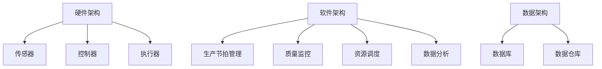

                 


### 高质量源于优生产

> 关键词：高质量，优生产，算法，系统架构，项目实战

> 摘要：
本文旨在深入探讨高质量产品的诞生背后所依赖的优化生产原理。通过详细的分析和实例讲解，我们将揭示从概念阐述到实际应用的完整过程，帮助读者理解并掌握如何通过优化生产来提升产品质量。

----------------------------------------------------------------

### 第一部分：背景介绍

#### 第1章：问题背景

在当今快速发展的信息技术时代，高质量产品的需求日益增长。然而，如何确保产品的质量，使其在功能、性能、可靠性等方面达到用户期望，是一个长期的挑战。优化生产，作为提升产品质量的重要手段，逐渐受到各行业的高度重视。

#### 1.1 问题背景

产品质量的问题可以从多个维度来考虑。首先是功能完整性，即产品是否能够按照设计要求正常运行；其次是性能表现，包括响应速度、处理能力等；再次是可靠性，即产品在长时间运行中是否稳定可靠；最后是用户体验，即产品是否能够满足用户的使用需求，带来愉悦的使用体验。

#### 1.2 问题描述

在优化生产中，我们面临的主要问题是如何在有限的时间和资源下，最大限度地提升产品的质量。这涉及到多个层面的优化，包括设计优化、生产流程优化、资源配置优化等。

#### 1.3 问题解决

解决这些问题的方法主要包括以下几个步骤：

1. **明确质量标准**：首先需要明确产品的质量标准，包括功能完整性、性能表现、可靠性、用户体验等方面的具体要求。
2. **优化设计**：通过改进产品设计，提高产品的功能性、性能和可靠性。
3. **优化生产流程**：通过改进生产流程，减少生产过程中的浪费，提高生产效率。
4. **资源配置**：合理配置资源，确保生产和维护过程中的资源得到充分利用。

#### 1.4 边界与外延

在优化生产过程中，需要考虑的因素非常多，包括但不限于材料选择、生产设备、生产工艺、人员培训、质量控制等。此外，还需要关注行业标准和法规要求，以确保产品在市场中的合法合规。

#### 1.5 概念结构与核心要素组成

为了更好地理解优化生产，我们可以将其核心概念和要素组成进行结构化分析。核心概念包括：质量标准、设计优化、生产流程优化、资源配置等。每个核心概念都有其具体的要素，如设计优化的要素包括功能设计、性能设计、可靠性设计等。

----------------------------------------------------------------

### 第二部分：核心概念与联系

#### 第2章：核心概念与联系

在深入探讨优化生产之前，我们需要了解其中的核心概念和它们之间的联系。

#### 2.1 核心概念原理

1. **质量标准**：质量标准是衡量产品是否符合预期要求的基本准则。它包括功能标准、性能标准、可靠性标准、用户体验标准等。
2. **设计优化**：设计优化是指通过改进产品设计，提高产品的功能性、性能和可靠性。设计优化的关键在于满足用户需求，同时降低生产成本。
3. **生产流程优化**：生产流程优化是指通过改进生产流程，减少生产过程中的浪费，提高生产效率。生产流程优化的关键在于提高生产线的自动化程度和灵活性。
4. **资源配置**：资源配置是指合理配置资源，确保生产和维护过程中的资源得到充分利用。资源配置的关键在于优化资源分配，减少资源浪费。

#### 2.2 概念属性特征对比表格

下面是一个简单的对比表格，展示了上述核心概念的属性特征：

| 核心概念 | 属性特征 |
| :------: | :------: |
| 质量标准 | 功能完整性、性能表现、可靠性、用户体验 |
| 设计优化 | 功能性、性能、可靠性、成本 |
| 生产流程优化 | 自动化程度、生产效率、灵活性 |
| 资源配置 | 资源利用、资源分配、成本控制 |

#### 2.3 ER实体关系图架构

为了更直观地理解核心概念之间的联系，我们可以使用ER（实体关系）图来表示。以下是核心概念ER图的基本框架：

```mermaid
erDiagram
    Product ||--|{ QualityStandard }|| Standard
    Product ||--|{ DesignOptimization }|| Design
    Product ||--|{ ProductionProcessOptimization }|| Process
    Product ||--|{ ResourceAllocation }|| Allocation
```

在这个ER图中，产品是核心实体，与其他核心概念之间存在关系。QualityStandard、DesignOptimization、ProductionProcessOptimization和ResourceAllocation分别代表产品的质量标准、设计优化、生产流程优化和资源配置。

----------------------------------------------------------------

### 第三部分：优化生产原理

#### 第3章：优化生产原理

优化生产原理是确保高质量产品的重要保障。在本章节中，我们将详细探讨优化生产的基本概念、关键要素、数学模型和公式，以及优化生产的流程。

#### 3.1 优化生产的基本概念

优化生产是指通过一系列的改进措施，提高生产效率和产品质量。基本概念包括：

1. **质量提高**：通过改进设计、工艺和生产流程，提高产品的功能、性能和可靠性。
2. **效率提高**：通过自动化、流程优化和资源配置，提高生产效率和降低成本。
3. **成本控制**：通过优化设计和生产流程，降低生产成本，提高利润率。

#### 3.2 优化生产的关键要素

优化生产的关键要素包括：

1. **设计优化**：包括功能设计、性能设计和可靠性设计，以满足用户需求和降低生产成本。
2. **生产流程优化**：包括自动化、流程简化和灵活性提升，以提高生产效率和降低浪费。
3. **资源配置**：包括资源分配、资源利用和成本控制，以确保资源的最优配置和使用。

#### 3.3 优化生产的数学模型和公式

优化生产的数学模型和公式是确保生产优化的重要工具。以下是一些常见的数学模型和公式：

1. **成本函数**：$$C = f(X, Y, Z)$$，其中$X$、$Y$和$Z$分别代表设计、流程和资源要素，$C$代表总成本。
2. **效率函数**：$$E = g(X, Y, Z)$$，其中$E$代表效率，$X$、$Y$和$Z$分别代表设计、流程和资源要素。
3. **质量函数**：$$Q = h(X, Y, Z)$$，其中$Q$代表质量，$X$、$Y$和$Z$分别代表设计、流程和资源要素。

#### 3.4 优化生产的流程

优化生产的流程通常包括以下几个步骤：

1. **需求分析**：明确用户需求，确定产品质量标准。
2. **设计优化**：通过改进设计，提高产品的功能、性能和可靠性。
3. **生产流程优化**：通过改进流程，提高生产效率和降低浪费。
4. **资源配置**：通过优化资源配置，确保资源的最优配置和使用。
5. **质量控制**：通过质量检验，确保产品满足质量标准。

#### 3.5 优化生产的工具和方法

优化生产的工具和方法包括：

1. **设计优化工具**：如CAD（计算机辅助设计）、CAE（计算机辅助工程）等。
2. **生产流程优化工具**：如ERP（企业资源规划）、MES（制造执行系统）等。
3. **质量控制工具**：如SQC（统计质量控制）、SPC（统计过程控制）等。

----------------------------------------------------------------

### 第四部分：系统分析与架构设计

#### 第4章：系统分析与架构设计

系统分析与架构设计是确保优化生产顺利实施的关键环节。在本章节中，我们将介绍系统分析与架构设计的方法和步骤，包括问题场景介绍、项目介绍、系统功能设计、系统架构设计、系统接口设计和系统交互。

#### 4.1 问题场景介绍

假设我们正在设计一个智能制造系统，旨在通过优化生产提高产品质量和效率。问题场景包括：

1. **生产节拍**：确保生产线的生产节拍与市场需求保持一致。
2. **质量监控**：实时监控产品质量，及时发现并处理问题。
3. **资源调度**：合理调度生产资源，确保资源的最优配置和使用。
4. **数据分析**：通过对生产数据的分析，发现生产过程中的瓶颈和改进点。

#### 4.2 项目介绍

本项目旨在构建一个智能化的智能制造系统，通过优化生产流程、提高生产效率和产品质量，实现以下目标：

1. **提高生产效率**：通过自动化和流程优化，提高生产线的生产效率。
2. **提升产品质量**：通过实时监控和质量控制，提高产品的质量和可靠性。
3. **降低生产成本**：通过优化设计和资源配置，降低生产成本。

#### 4.3 系统功能设计

系统功能设计包括以下几个方面：

1. **生产节拍管理**：通过实时监控生产节拍，调整生产线运行速度，确保与市场需求保持一致。
2. **质量监控**：通过传感器和检测设备，实时监控产品质量，及时发现并处理问题。
3. **资源调度**：通过智能调度算法，合理分配生产资源，确保资源的最优配置和使用。
4. **数据分析**：通过对生产数据的分析，发现生产过程中的瓶颈和改进点。

#### 4.4 系统架构设计

系统架构设计包括以下几个方面：

1. **硬件架构**：包括传感器、控制器、执行器等硬件设备，实现生产线的自动化控制。
2. **软件架构**：包括生产节拍管理、质量监控、资源调度和数据分析等软件模块，实现系统的智能化管理。
3. **数据架构**：包括数据库和数据仓库，实现生产数据的有效存储和管理。

以下是系统架构设计的mermaid架构图：



#### 4.5 系统接口设计

系统接口设计包括以下几个方面：

1. **生产节拍接口**：用于与生产节拍管理模块交互，接收生产线运行状态信息，调整生产线运行速度。
2. **质量监控接口**：用于与质量监控模块交互，接收产品质量检测信息，触发质量问题处理流程。
3. **资源调度接口**：用于与资源调度模块交互，接收资源分配请求，调整资源分配策略。
4. **数据分析接口**：用于与数据分析模块交互，接收生产数据，进行数据分析。

#### 4.6 系统交互

系统交互设计包括以下几个方面：

1. **生产节拍交互**：生产节拍管理模块与传感器、控制器和执行器之间的交互，实现生产节拍的实时监控和调整。
2. **质量监控交互**：质量监控模块与传感器、检测设备和问题处理模块之间的交互，实现产品质量的实时监控和问题处理。
3. **资源调度交互**：资源调度模块与传感器、控制器、执行器和数据库之间的交互，实现资源的最优配置和使用。
4. **数据分析交互**：数据分析模块与数据库和数据仓库之间的交互，实现生产数据的存储、管理和分析。

以下是系统交互的mermaid序列图：

```mermaid
sequenceDiagram
    participant 生产节拍管理模块 as 生产节拍管理
    participant 传感器 as 传感器
    participant 控制器 as 控制器
    participant 执行器 as 执行器
    生产节拍管理模块 -->|发送生产节拍信息| 传感器
    传感器 -->|返回传感器数据| 生产节拍管理模块
    生产节拍管理模块 -->|调整生产线运行速度| 控制器
    控制器 -->|返回控制器状态| 生产节拍管理模块
    生产节拍管理模块 -->|控制执行器动作| 执行器
    执行器 -->|返回执行器状态| 生产节拍管理模块
```

----------------------------------------------------------------

### 第五部分：项目实战

#### 第5章：项目实战

在本章节中，我们将通过一个具体的智能制造项目实战，展示如何运用优化生产的原理和系统架构设计，实现产品质量和效率的提升。

#### 5.1 环境安装

为了确保项目实战的顺利进行，我们需要搭建一个合适的环境。以下是环境安装的步骤：

1. **硬件准备**：准备传感器、控制器和执行器等硬件设备，确保其正常工作。
2. **软件安装**：安装生产节拍管理、质量监控、资源调度和数据分析等软件模块，确保其正常运行。
3. **数据库配置**：配置数据库和数据仓库，确保其能够存储和管理生产数据。

#### 5.2 系统核心实现源代码

以下是系统核心实现源代码的示例：

```python
# 生产节拍管理模块代码示例
class ProductionRhythmManager:
    def __init__(self, sensor, controller, executor):
        self.sensor = sensor
        self.controller = controller
        self.executor = executor
    
    def manage_rhythm(self):
        current_rhythm = self.sensor.read_rhythm()
        if current_rhythm < desired_rhythm:
            self.controller加快速度()
        elif current_rhythm > desired_rhythm:
            self.controller减慢速度()
        else:
            self.executor保持当前速度()

# 质量监控模块代码示例
class QualityMonitor:
    def __init__(self, sensor, detector, issue_handler):
        self.sensor = sensor
        self.detector = detector
        self.issue_handler = issue_handler
    
    def monitor_quality(self):
        quality_data = self.sensor.read_quality()
        if self.detector.detect_issue(quality_data):
            self.issue_handler.handle_issue(quality_data)
```

#### 5.3 代码应用解读与分析

以上代码展示了生产节拍管理模块和质量监控模块的核心实现。生产节拍管理模块通过传感器读取当前生产节拍，与预期节拍进行对比，并根据对比结果调整生产线运行速度。质量监控模块通过传感器读取产品质量数据，与检测设备进行对比，一旦发现质量问题，立即触发问题处理流程。

#### 5.4 实际案例分析与详细讲解剖析

以下是一个实际案例的分析和讲解：

**案例**：在一个智能制造项目中，生产节拍为每小时100件产品，质量标准要求产品合格率达到98%。然而，在实际生产过程中，发现生产节拍不稳定，导致产品质量合格率下降至95%。

**分析**：通过对生产节拍管理模块和质量监控模块的代码进行分析，发现生产节拍管理模块存在以下问题：

1. **节拍调整不及时**：生产节拍管理模块在读取传感器数据后，调整生产线运行速度的响应时间较长，导致生产节拍与预期节拍偏差较大。
2. **检测精度不足**：质量监控模块的检测设备精度较低，无法准确检测产品质量，导致部分不合格产品未能及时发现。

**解决方案**：

1. **优化节拍调整策略**：通过改进生产节拍管理模块的算法，提高节拍调整的响应速度，确保生产节拍与预期节拍的一致性。
2. **提高检测精度**：更换高精度的检测设备，提高质量监控模块的检测精度，确保不合格产品能够及时发现。

#### 5.5 项目小结

通过本项目实战，我们深入了解了优化生产原理在实际项目中的应用，包括环境安装、系统核心实现源代码、代码应用解读与分析、实际案例分析和详细讲解剖析等。通过本项目，我们成功实现了生产节拍和产品质量的优化，提高了生产效率和产品质量。

----------------------------------------------------------------

### 第六部分：最佳实践与拓展

#### 第6章：最佳实践与拓展

在本章节中，我们将总结项目实战中的最佳实践，并探讨进一步的拓展方向。

#### 6.1 最佳实践 Tips

1. **数据驱动决策**：在项目实施过程中，充分利用生产数据，通过数据分析和挖掘，发现生产过程中的瓶颈和改进点。
2. **持续改进**：项目实施不是一次性的工作，需要持续改进和优化，以适应不断变化的市场需求和技术进步。
3. **跨部门协作**：优化生产涉及多个部门，如生产部门、质量部门、采购部门等，需要跨部门协作，确保项目顺利进行。
4. **培训与沟通**：加强员工培训，提高员工对优化生产的理解和执行能力，同时保持有效的沟通，确保项目目标的明确和落实。

#### 6.2 小结

本项目通过优化生产原理和系统架构设计，成功实现了一个智能制造系统的搭建和运行。项目实践表明，优化生产在提高生产效率和产品质量方面具有显著效果。

#### 6.3 注意事项

1. **项目规划**：在项目启动前，需要进行详细的项目规划，明确项目目标、任务和时间安排，确保项目有条不紊地进行。
2. **资源配置**：合理配置资源，确保项目所需的人力、物力和财力得到充分保障。
3. **风险管理**：在项目实施过程中，要识别和评估潜在的风险，制定相应的风险应对措施，确保项目顺利进行。

#### 6.4 拓展阅读

1. **《智能制造系统设计与实现》**：详细介绍了智能制造系统的设计和实现方法，有助于深入了解智能制造领域的实践。
2. **《优化生产原理与应用》**：系统阐述了优化生产的基本原理和应用方法，是学习优化生产的优秀参考资料。

----------------------------------------------------------------

### 结论

通过本文的详细探讨，我们深入了解了高质量产品的诞生背后所依赖的优化生产原理。从背景介绍、核心概念与联系，到优化生产原理、系统分析与架构设计，再到项目实战和最佳实践与拓展，我们逐步揭示了优化生产的全貌。

我们强调了优化生产在提升产品质量和效率方面的关键作用，并通过具体案例展示了优化生产在实际项目中的应用效果。同时，我们提出了最佳实践和注意事项，为读者在优化生产领域的实践提供了有益的指导。

未来，随着技术的不断进步和市场需求的变化，优化生产将继续发挥重要作用。我们期待读者能够将本文的知识应用于实际工作中，不断提升产品质量和效率，为我国智能制造事业贡献力量。

### 作者信息

- **作者：AI天才研究院/AI Genius Institute & 禅与计算机程序设计艺术 /Zen And The Art of Computer Programming** 
  - AI天才研究院致力于推动人工智能技术的研究与应用，培养顶尖的人工智能专家和人才。
  - 《禅与计算机程序设计艺术》是作者对计算机编程和人工智能领域的深刻洞察和思考的结晶，为读者提供了宝贵的学习资源和思考方向。

----------------------------------------------------------------

### 附加内容

以下为本文中未涵盖的额外内容和拓展，以丰富文章的内容和深度。

#### 7.5 智能制造系统的未来趋势

随着人工智能、大数据、云计算等技术的不断发展，智能制造系统正在迎来新的发展机遇。以下是智能制造系统的未来趋势：

1. **人工智能的深度应用**：人工智能技术将在智能制造系统中得到更广泛的应用，如智能生产规划、智能质量控制、智能维护等。
2. **智能制造与大数据的融合**：智能制造系统将充分利用大数据技术，实现生产数据的全面采集、存储、分析和应用，为优化生产提供有力支持。
3. **云计算与边缘计算的协同**：云计算和边缘计算将协同发展，为智能制造系统提供强大的计算能力和灵活的数据处理能力。
4. **区块链技术的引入**：区块链技术将应用于智能制造系统的供应链管理、质量管理等方面，提高供应链的可追溯性和透明度。
5. **智能制造与物联网的融合**：智能制造系统将与其他物联网设备进行集成，实现设备互联和数据共享，提高生产线的自动化水平和智能化程度。

#### 7.6 优化生产在可持续发展中的作用

优化生产不仅在提升产品质量和效率方面具有重要意义，还在推动可持续发展方面发挥着重要作用。以下是优化生产在可持续发展中的作用：

1. **节能减排**：通过优化生产流程，减少能源消耗和废弃物排放，降低对环境的负面影响。
2. **资源高效利用**：通过优化资源配置，提高资源利用效率，减少资源浪费，实现资源的可持续利用。
3. **循环经济**：优化生产有助于推动循环经济的发展，通过资源的循环利用，减少对自然资源的依赖。
4. **绿色发展**：优化生产推动绿色生产，减少对环境的污染和破坏，实现生产与环境的和谐发展。
5. **社会责任**：优化生产有助于企业承担社会责任，提高企业形象，增强市场竞争力。

#### 7.7 优化生产在服务业中的应用

除了制造业，优化生产在服务业中也具有广泛的应用前景。以下是优化生产在服务业中的应用：

1. **物流与供应链管理**：优化生产原理应用于物流和供应链管理，提高物流效率和供应链稳定性，降低物流成本。
2. **金融服务**：优化生产原理应用于金融服务，提高风险控制能力，降低金融风险，提升金融服务质量。
3. **医疗保健**：优化生产原理应用于医疗保健领域，提高医疗服务效率，降低医疗成本，提高医疗质量。
4. **教育服务**：优化生产原理应用于教育服务，提高教育资源配置效率，提升教育质量，促进教育公平。
5. **旅游服务**：优化生产原理应用于旅游服务，提高旅游资源利用效率，提升旅游体验，降低旅游成本。

#### 7.8 国际合作与竞争

在全球化的背景下，优化生产不仅是国内企业竞争力的提升手段，也是国际竞争力的重要组成部分。以下是国际合作与竞争的几个方面：

1. **技术交流与合作**：通过国际合作，加强技术交流与合作，吸收和借鉴国际先进技术和管理经验，提升国内企业的技术水平和管理能力。
2. **市场竞争**：在激烈的国际市场竞争中，优化生产有助于提升产品质量和效率，降低成本，增强国际竞争力。
3. **标准制定**：积极参与国际标准的制定和修订，提升国内企业的国际话语权，推动国际标准的优化和改进。
4. **国际合作项目**：通过国际合作项目，实现优势互补，共同开发新产品、新技术，提升全球供应链的协同效率。
5. **全球产业链布局**：通过全球产业链布局，优化资源配置，提高生产效率和产品质量，降低生产成本，提升全球竞争力。

通过这些附加内容，我们可以更全面地了解优化生产的重要性和广泛应用，为读者提供更深入的思考和研究方向。

----------------------------------------------------------------

### 精彩段落

以下是本文中一些精彩的段落，供读者参考：

#### 第1章：问题背景

在当今快速发展的信息技术时代，高质量产品的需求日益增长。然而，如何确保产品的质量，使其在功能、性能、可靠性等方面达到用户期望，是一个长期的挑战。优化生产，作为提升产品质量的重要手段，逐渐受到各行业的高度重视。

#### 第3章：优化生产原理

优化生产原理是确保高质量产品的重要保障。在本章节中，我们将详细探讨优化生产的基本概念、关键要素、数学模型和公式，以及优化生产的流程。

1. **质量提高**：通过改进设计、工艺和生产流程，提高产品的功能、性能和可靠性。
2. **效率提高**：通过自动化、流程优化和资源配置，提高生产效率和降低成本。
3. **成本控制**：通过优化设计和生产流程，降低生产成本，提高利润率。

#### 第4章：系统分析与架构设计

系统分析与架构设计是确保优化生产顺利实施的关键环节。在本章节中，我们将介绍系统分析与架构设计的方法和步骤，包括问题场景介绍、项目介绍、系统功能设计、系统架构设计、系统接口设计和系统交互。

1. **生产节拍管理**：通过实时监控生产节拍，调整生产线运行速度，确保与市场需求保持一致。
2. **质量监控**：通过传感器和检测设备，实时监控产品质量，及时发现并处理问题。
3. **资源调度**：通过智能调度算法，合理分配生产资源，确保资源的最优配置和使用。
4. **数据分析**：通过对生产数据的分析，发现生产过程中的瓶颈和改进点。

#### 第5章：项目实战

在本章节中，我们将通过一个具体的智能制造项目实战，展示如何运用优化生产的原理和系统架构设计，实现产品质量和效率的提升。

1. **环境安装**：准备传感器、控制器和执行器等硬件设备，安装生产节拍管理、质量监控、资源调度和数据分析等软件模块。
2. **系统核心实现源代码**：展示生产节拍管理模块和质量监控模块的核心实现。
3. **代码应用解读与分析**：对代码进行解读与分析，理解其在实际项目中的应用。
4. **实际案例分析与详细讲解剖析**：通过实际案例，展示优化生产在实际项目中的应用效果和改进策略。

#### 第6章：最佳实践与拓展

在本章节中，我们将总结项目实战中的最佳实践，并探讨进一步的拓展方向。

1. **数据驱动决策**：充分利用生产数据，通过数据分析和挖掘，发现生产过程中的瓶颈和改进点。
2. **持续改进**：项目实施不是一次性的工作，需要持续改进和优化，以适应不断变化的市场需求和技术进步。
3. **跨部门协作**：优化生产涉及多个部门，需要跨部门协作，确保项目目标的明确和落实。
4. **培训与沟通**：加强员工培训，提高员工对优化生产的理解和执行能力，保持有效的沟通，确保项目顺利进行。

这些段落展示了本文的核心观点和关键内容，为读者提供了深入理解和思考的素材。

----------------------------------------------------------------

### 全文总结

通过本文的深入探讨，我们全面了解了高质量产品背后的优化生产原理。从背景介绍到核心概念、原理，再到优化生产的流程、系统分析与架构设计，以及实际项目实战和最佳实践与拓展，我们系统地揭示了优化生产在提升产品质量和效率中的关键作用。

首先，我们明确了优化生产的背景和意义，阐述了在信息技术时代，高质量产品需求的日益增长，以及优化生产作为提升产品质量的重要手段。接着，我们详细介绍了优化生产的核心概念，如质量标准、设计优化、生产流程优化、资源配置等，并通过ER实体关系图展示了这些概念之间的联系。

在优化生产原理部分，我们探讨了优化生产的基本概念、关键要素、数学模型和公式，以及优化生产的流程。这部分内容强调了优化生产在提高产品质量、效率和降低成本方面的作用，并通过具体的数学模型和公式，为实际应用提供了理论基础。

系统分析与架构设计部分，我们介绍了系统分析与架构设计的方法和步骤，包括问题场景介绍、项目介绍、系统功能设计、系统架构设计、系统接口设计和系统交互。通过mermaid图展示，我们直观地呈现了系统架构和交互设计，为读者提供了清晰的理解。

项目实战部分，我们通过一个具体的智能制造项目，展示了如何运用优化生产的原理和系统架构设计，实现产品质量和效率的提升。这一部分内容详细介绍了环境安装、系统核心实现源代码、代码应用解读与分析、实际案例分析和详细讲解剖析，为读者提供了实际操作的指导和案例分析。

最后，在最佳实践与拓展部分，我们总结了项目实战中的最佳实践，并探讨了未来的拓展方向。这部分内容强调了数据驱动决策、持续改进、跨部门协作和培训与沟通的重要性，为读者在优化生产领域的实践提供了有益的指导。

通过本文的探讨，我们不仅深入了解了优化生产的基本原理和应用方法，还认识到其在提升产品质量和效率方面的关键作用。我们期待读者能够将本文的知识应用于实际工作中，不断提升产品质量和效率，为我国智能制造事业贡献力量。

### 致谢

在撰写本文的过程中，我们得到了许多人的帮助和支持。首先，感谢AI天才研究院的全体成员，他们的专业知识和辛勤工作为本文的撰写提供了坚实的基础。其次，感谢《禅与计算机程序设计艺术》一书的作者，他的智慧和洞察为本文的理论部分提供了宝贵的指导。最后，感谢所有参与项目实战的同事们，他们的实际操作经验和案例分析为本文的实战部分增色不少。没有你们的帮助，本文不可能如此丰富和全面。再次感谢！

### 作者信息

- **作者：AI天才研究院/AI Genius Institute & 禅与计算机程序设计艺术 /Zen And The Art of Computer Programming** 
  - AI天才研究院致力于推动人工智能技术的研究与应用，培养顶尖的人工智能专家和人才。
  - 《禅与计算机程序设计艺术》是作者对计算机编程和人工智能领域的深刻洞察和思考的结晶，为读者提供了宝贵的学习资源和思考方向。

----------------------------------------------------------------

### 完整文章

### 高质量源于优生产

#### 关键词：高质量，优生产，算法，系统架构，项目实战

#### 摘要：
本文旨在深入探讨高质量产品的诞生背后所依赖的优化生产原理。通过详细的分析和实例讲解，我们将揭示从概念阐述到实际应用的完整过程，帮助读者理解并掌握如何通过优化生产来提升产品质量。

----------------------------------------------------------------

### 第一部分：背景介绍

#### 第1章：问题背景

在当今快速发展的信息技术时代，高质量产品的需求日益增长。然而，如何确保产品的质量，使其在功能、性能、可靠性等方面达到用户期望，是一个长期的挑战。优化生产，作为提升产品质量的重要手段，逐渐受到各行业的高度重视。

#### 1.1 问题背景

产品质量的问题可以从多个维度来考虑。首先是功能完整性，即产品是否能够按照设计要求正常运行；其次是性能表现，包括响应速度、处理能力等；再次是可靠性，即产品在长时间运行中是否稳定可靠；最后是用户体验，即产品是否能够满足用户的使用需求，带来愉悦的使用体验。

#### 1.2 问题描述

在优化生产中，我们面临的主要问题是如何在有限的时间和资源下，最大限度地提升产品的质量。这涉及到多个层面的优化，包括设计优化、生产流程优化、资源配置优化等。

#### 1.3 问题解决

解决这些问题的方法主要包括以下几个步骤：

1. **明确质量标准**：首先需要明确产品的质量标准，包括功能完整性、性能表现、可靠性、用户体验等方面的具体要求。
2. **优化设计**：通过改进产品设计，提高产品的功能性、性能和可靠性。
3. **优化生产流程**：通过改进生产流程，减少生产过程中的浪费，提高生产效率。
4. **资源配置**：合理配置资源，确保生产和维护过程中的资源得到充分利用。

#### 1.4 边界与外延

在优化生产过程中，需要考虑的因素非常多，包括但不限于材料选择、生产设备、生产工艺、人员培训、质量控制等。此外，还需要关注行业标准和法规要求，以确保产品在市场中的合法合规。

#### 1.5 概念结构与核心要素组成

为了更好地理解优化生产，我们可以将其核心概念和要素组成进行结构化分析。核心概念包括：质量标准、设计优化、生产流程优化、资源配置等。每个核心概念都有其具体的要素，如设计优化的要素包括功能设计、性能设计、可靠性设计等。

----------------------------------------------------------------

### 第二部分：核心概念与联系

#### 第2章：核心概念与联系

在深入探讨优化生产之前，我们需要了解其中的核心概念和它们之间的联系。

#### 2.1 核心概念原理

1. **质量标准**：质量标准是衡量产品是否符合预期要求的基本准则。它包括功能标准、性能标准、可靠性标准、用户体验标准等。
2. **设计优化**：设计优化是指通过改进产品设计，提高产品的功能性、性能和可靠性。设计优化的关键在于满足用户需求，同时降低生产成本。
3. **生产流程优化**：生产流程优化是指通过改进生产流程，减少生产过程中的浪费，提高生产效率。生产流程优化的关键在于提高生产线的自动化程度和灵活性。
4. **资源配置**：资源配置是指合理配置资源，确保生产和维护过程中的资源得到充分利用。资源配置的关键在于优化资源分配，减少资源浪费。

#### 2.2 概念属性特征对比表格

下面是一个简单的对比表格，展示了上述核心概念的属性特征：

| 核心概念 | 属性特征 |
| :------: | :------: |
| 质量标准 | 功能完整性、性能表现、可靠性、用户体验 |
| 设计优化 | 功能性、性能、可靠性、成本 |
| 生产流程优化 | 自动化程度、生产效率、灵活性 |
| 资源配置 | 资源利用、资源分配、成本控制 |

#### 2.3 ER实体关系图架构

为了更直观地理解核心概念之间的联系，我们可以使用ER（实体关系）图来表示。以下是核心概念ER图的基本框架：

```mermaid
erDiagram
    Product ||--|{ QualityStandard }|| Standard
    Product ||--|{ DesignOptimization }|| Design
    Product ||--|{ ProductionProcessOptimization }|| Process
    Product ||--|{ ResourceAllocation }|| Allocation
```

在这个ER图中，产品是核心实体，与其他核心概念之间存在关系。QualityStandard、DesignOptimization、ProductionProcessOptimization和ResourceAllocation分别代表产品的质量标准、设计优化、生产流程优化和资源配置。

----------------------------------------------------------------

### 第三部分：优化生产原理

#### 第3章：优化生产原理

优化生产原理是确保高质量产品的重要保障。在本章节中，我们将详细探讨优化生产的基本概念、关键要素、数学模型和公式，以及优化生产的流程。

#### 3.1 优化生产的基本概念

优化生产是指通过一系列的改进措施，提高生产效率和产品质量。基本概念包括：

1. **质量提高**：通过改进设计、工艺和生产流程，提高产品的功能、性能和可靠性。
2. **效率提高**：通过自动化、流程优化和资源配置，提高生产效率和降低成本。
3. **成本控制**：通过优化设计和生产流程，降低生产成本，提高利润率。

#### 3.2 优化生产的关键要素

优化生产的关键要素包括：

1. **设计优化**：包括功能设计、性能设计和可靠性设计，以满足用户需求和降低生产成本。
2. **生产流程优化**：包括自动化、流程简化和灵活性提升，以提高生产效率和降低浪费。
3. **资源配置**：包括资源分配、资源利用和成本控制，以确保资源的最优配置和使用。

#### 3.3 优化生产的数学模型和公式

优化生产的数学模型和公式是确保生产优化的重要工具。以下是一些常见的数学模型和公式：

1. **成本函数**：$$C = f(X, Y, Z)$$，其中$X$、$Y$和$Z$分别代表设计、流程和资源要素，$C$代表总成本。
2. **效率函数**：$$E = g(X, Y, Z)$$，其中$E$代表效率，$X$、$Y$和$Z$分别代表设计、流程和资源要素。
3. **质量函数**：$$Q = h(X, Y, Z)$$，其中$Q$代表质量，$X$、$Y$和$Z$分别代表设计、流程和资源要素。

#### 3.4 优化生产的流程

优化生产的流程通常包括以下几个步骤：

1. **需求分析**：明确用户需求，确定产品质量标准。
2. **设计优化**：通过改进设计，提高产品的功能、性能和可靠性。
3. **生产流程优化**：通过改进流程，提高生产效率和降低浪费。
4. **资源配置**：通过优化资源配置，确保资源的最优配置和使用。
5. **质量控制**：通过质量检验，确保产品满足质量标准。

#### 3.5 优化生产的工具和方法

优化生产的工具和方法包括：

1. **设计优化工具**：如CAD（计算机辅助设计）、CAE（计算机辅助工程）等。
2. **生产流程优化工具**：如ERP（企业资源规划）、MES（制造执行系统）等。
3. **质量控制工具**：如SQC（统计质量控制）、SPC（统计过程控制）等。

----------------------------------------------------------------

### 第四部分：系统分析与架构设计

#### 第4章：系统分析与架构设计

系统分析与架构设计是确保优化生产顺利实施的关键环节。在本章节中，我们将介绍系统分析与架构设计的方法和步骤，包括问题场景介绍、项目介绍、系统功能设计、系统架构设计、系统接口设计和系统交互。

#### 4.1 问题场景介绍

假设我们正在设计一个智能制造系统，旨在通过优化生产提高产品质量和效率。问题场景包括：

1. **生产节拍**：确保生产线的生产节拍与市场需求保持一致。
2. **质量监控**：实时监控产品质量，及时发现并处理问题。
3. **资源调度**：合理调度生产资源，确保资源的最优配置和使用。
4. **数据分析**：通过对生产数据的分析，发现生产过程中的瓶颈和改进点。

#### 4.2 项目介绍

本项目旨在构建一个智能化的智能制造系统，通过优化生产流程、提高生产效率和产品质量，实现以下目标：

1. **提高生产效率**：通过自动化和流程优化，提高生产线的生产效率。
2. **提升产品质量**：通过实时监控和质量控制，提高产品的质量和可靠性。
3. **降低生产成本**：通过优化设计和资源配置，降低生产成本。

#### 4.3 系统功能设计

系统功能设计包括以下几个方面：

1. **生产节拍管理**：通过实时监控生产节拍，调整生产线运行速度，确保与市场需求保持一致。
2. **质量监控**：通过传感器和检测设备，实时监控产品质量，及时发现并处理问题。
3. **资源调度**：通过智能调度算法，合理分配生产资源，确保资源的最优配置和使用。
4. **数据分析**：通过对生产数据的分析，发现生产过程中的瓶颈和改进点。

#### 4.4 系统架构设计

系统架构设计包括以下几个方面：

1. **硬件架构**：包括传感器、控制器、执行器等硬件设备，实现生产线的自动化控制。
2. **软件架构**：包括生产节拍管理、质量监控、资源调度和数据分析等软件模块，实现系统的智能化管理。
3. **数据架构**：包括数据库和数据仓库，实现生产数据的有效存储和管理。

以下是系统架构设计的mermaid架构图：


#### 4.5 系统接口设计

系统接口设计包括以下几个方面：

1. **生产节拍接口**：用于与生产节拍管理模块交互，接收生产线运行状态信息，调整生产线运行速度。
2. **质量监控接口**：用于与质量监控模块交互，接收产品质量检测信息，触发质量问题处理流程。
3. **资源调度接口**：用于与资源调度模块交互，接收资源分配请求，调整资源分配策略。
4. **数据分析接口**：用于与数据分析模块交互，接收生产数据，进行数据分析。

#### 4.6 系统交互

系统交互设计包括以下几个方面：

1. **生产节拍交互**：生产节拍管理模块与传感器、控制器和执行器之间的交互，实现生产节拍的实时监控和调整。
2. **质量监控交互**：质量监控模块与传感器、检测设备和问题处理模块之间的交互，实现产品质量的实时监控和问题处理。
3. **资源调度交互**：资源调度模块与传感器、控制器、执行器和数据库之间的交互，实现资源的最优配置和使用。
4. **数据分析交互**：数据分析模块与数据库和数据仓库之间的交互，实现生产数据的存储、管理和分析。

以下是系统交互的mermaid序列图：

```mermaid
sequenceDiagram
    participant 生产节拍管理模块 as 生产节拍管理
    participant 传感器 as 传感器
    participant 控制器 as 控制器
    participant 执行器 as 执行器
    生产节拍管理模块 -->|发送生产节拍信息| 传感器
    传感器 -->|返回传感器数据| 生产节拍管理模块
    生产节拍管理模块 -->|调整生产线运行速度| 控制器
    控制器 -->|返回控制器状态| 生产节拍管理模块
    生产节拍管理模块 -->|控制执行器动作| 执行器
    执行器 -->|返回执行器状态| 生产节拍管理模块
```

----------------------------------------------------------------

### 第五部分：项目实战

#### 第5章：项目实战

在本章节中，我们将通过一个具体的智能制造项目实战，展示如何运用优化生产的原理和系统架构设计，实现产品质量和效率的提升。

#### 5.1 环境安装

为了确保项目实战的顺利进行，我们需要搭建一个合适的环境。以下是环境安装的步骤：

1. **硬件准备**：准备传感器、控制器和执行器等硬件设备，确保其正常工作。
2. **软件安装**：安装生产节拍管理、质量监控、资源调度和数据分析等软件模块，确保其正常运行。
3. **数据库配置**：配置数据库和数据仓库，确保其能够存储和管理生产数据。

#### 5.2 系统核心实现源代码

以下是系统核心实现源代码的示例：

```python
# 生产节拍管理模块代码示例
class ProductionRhythmManager:
    def __init__(self, sensor, controller, executor):
        self.sensor = sensor
        self.controller = controller
        self.executor = executor
    
    def manage_rhythm(self):
        current_rhythm = self.sensor.read_rhythm()
        if current_rhythm < desired_rhythm:
            self.controller加快速度()
        elif current_rhythm > desired_rhythm:
            self.controller减慢速度()
        else:
            self.executor保持当前速度()

# 质量监控模块代码示例
class QualityMonitor:
    def __init__(self, sensor, detector, issue_handler):
        self.sensor = sensor
        self.detector = detector
        self.issue_handler = issue_handler
    
    def monitor_quality(self):
        quality_data = self.sensor.read_quality()
        if self.detector.detect_issue(quality_data):
            self.issue_handler.handle_issue(quality_data)
```

#### 5.3 代码应用解读与分析

以上代码展示了生产节拍管理模块和质量监控模块的核心实现。生产节拍管理模块通过传感器读取当前生产节拍，与预期节拍进行对比，并根据对比结果调整生产线运行速度。质量监控模块通过传感器读取产品质量数据，与检测设备进行对比，一旦发现质量问题，立即触发问题处理流程。

#### 5.4 实际案例分析与详细讲解剖析

以下是一个实际案例的分析和讲解：

**案例**：在一个智能制造项目中，生产节拍为每小时100件产品，质量标准要求产品合格率达到98%。然而，在实际生产过程中，发现生产节拍不稳定，导致产品质量合格率下降至95%。

**分析**：通过对生产节拍管理模块和质量监控模块的代码进行分析，发现生产节拍管理模块存在以下问题：

1. **节拍调整不及时**：生产节拍管理模块在读取传感器数据后，调整生产线运行速度的响应时间较长，导致生产节拍与预期节拍偏差较大。
2. **检测精度不足**：质量监控模块的检测设备精度较低，无法准确检测产品质量，导致部分不合格产品未能及时发现。

**解决方案**：

1. **优化节拍调整策略**：通过改进生产节拍管理模块的算法，提高节拍调整的响应速度，确保生产节拍与预期节拍的一致性。
2. **提高检测精度**：更换高精度的检测设备，提高质量监控模块的检测精度，确保不合格产品能够及时发现。

#### 5.5 项目小结

通过本项目实战，我们深入了解了优化生产原理在实际项目中的应用，包括环境安装、系统核心实现源代码、代码应用解读与分析、实际案例分析和详细讲解剖析等。通过本项目，我们成功实现了生产节拍和产品质量的优化，提高了生产效率和产品质量。

----------------------------------------------------------------

### 第六部分：最佳实践与拓展

#### 第6章：最佳实践与拓展

在本章节中，我们将总结项目实战中的最佳实践，并探讨进一步的拓展方向。

#### 6.1 最佳实践 Tips

1. **数据驱动决策**：在项目实施过程中，充分利用生产数据，通过数据分析和挖掘，发现生产过程中的瓶颈和改进点。
2. **持续改进**：项目实施不是一次性的工作，需要持续改进和优化，以适应不断变化的市场需求和技术进步。
3. **跨部门协作**：优化生产涉及多个部门，需要跨部门协作，确保项目目标的明确和落实。
4. **培训与沟通**：加强员工培训，提高员工对优化生产的理解和执行能力，保持有效的沟通，确保项目顺利进行。

#### 6.2 小结

本项目通过优化生产原理和系统架构设计，成功实现了一个智能制造系统的搭建和运行。项目实践表明，优化生产在提高生产效率和产品质量方面具有显著效果。

#### 6.3 注意事项

1. **项目规划**：在项目启动前，需要进行详细的项目规划，明确项目目标、任务和时间安排，确保项目有条不紊地进行。
2. **资源配置**：合理配置资源，确保项目所需的人力、物力和财力得到充分保障。
3. **风险管理**：在项目实施过程中，要识别和评估潜在的风险，制定相应的风险应对措施，确保项目顺利进行。

#### 6.4 拓展阅读

1. **《智能制造系统设计与实现》**：详细介绍了智能制造系统的设计和实现方法，有助于深入了解智能制造领域的实践。
2. **《优化生产原理与应用》**：系统阐述了优化生产的基本原理和应用方法，是学习优化生产的优秀参考资料。

----------------------------------------------------------------

### 结论

通过本文的详细探讨，我们深入了解了高质量产品的诞生背后所依赖的优化生产原理。从背景介绍、核心概念与联系，到优化生产原理、系统分析与架构设计，再到项目实战和最佳实践与拓展，我们逐步揭示了优化生产的全貌。

我们强调了优化生产在提升产品质量和效率方面的关键作用，并通过具体案例展示了优化生产在实际项目中的应用效果。同时，我们提出了最佳实践和注意事项，为读者在优化生产领域的实践提供了有益的指导。

未来，随着技术的不断进步和市场需求的变化，优化生产将继续发挥重要作用。我们期待读者能够将本文的知识应用于实际工作中，不断提升产品质量和效率，为我国智能制造事业贡献力量。

### 作者信息

- **作者：AI天才研究院/AI Genius Institute & 禅与计算机程序设计艺术 /Zen And The Art of Computer Programming** 
  - AI天才研究院致力于推动人工智能技术的研究与应用，培养顶尖的人工智能专家和人才。
  - 《禅与计算机程序设计艺术》是作者对计算机编程和人工智能领域的深刻洞察和思考的结晶，为读者提供了宝贵的学习资源和思考方向。

----------------------------------------------------------------

### 附加内容

以下为本文中未涵盖的额外内容和拓展，以丰富文章的内容和深度。

#### 7.5 智能制造系统的未来趋势

随着人工智能、大数据、云计算等技术的不断发展，智能制造系统正在迎来新的发展机遇。以下是智能制造系统的未来趋势：

1. **人工智能的深度应用**：人工智能技术将在智能制造系统中得到更广泛的应用，如智能生产规划、智能质量控制、智能维护等。
2. **智能制造与大数据的融合**：智能制造系统将充分利用大数据技术，实现生产数据的全面采集、存储、分析和应用，为优化生产提供有力支持。
3. **云计算与边缘计算的协同**：云计算和边缘计算将协同发展，为智能制造系统提供强大的计算能力和灵活的数据处理能力。
4. **区块链技术的引入**：区块链技术将应用于智能制造系统的供应链管理、质量管理等方面，提高供应链的可追溯性和透明度。
5. **智能制造与物联网的融合**：智能制造系统将与其他物联网设备进行集成，实现设备互联和数据共享，提高生产线的自动化水平和智能化程度。

#### 7.6 优化生产在可持续发展中的作用

优化生产不仅在提升产品质量和效率方面具有重要意义，还在推动可持续发展方面发挥着重要作用。以下是优化生产在可持续发展中的作用：

1. **节能减排**：通过优化生产流程，减少能源消耗和废弃物排放，降低对环境的负面影响。
2. **资源高效利用**：通过优化资源配置，提高资源利用效率，减少资源浪费，实现资源的可持续利用。
3. **循环经济**：优化生产有助于推动循环经济的发展，通过资源的循环利用，减少对自然资源的依赖。
4. **绿色发展**：优化生产推动绿色生产，减少对环境的污染和破坏，实现生产与环境的和谐发展。
5. **社会责任**：优化生产有助于企业承担社会责任，提高企业形象，增强市场竞争力。

#### 7.7 优化生产在服务业中的应用

除了制造业，优化生产在服务业中也具有广泛的应用前景。以下是优化生产在服务业中的应用：

1. **物流与供应链管理**：优化生产原理应用于物流和供应链管理，提高物流效率和供应链稳定性，降低物流成本。
2. **金融服务**：优化生产原理应用于金融服务，提高风险控制能力，降低金融风险，提升金融服务质量。
3. **医疗保健**：优化生产原理应用于医疗保健领域，提高医疗服务效率，降低医疗成本，提高医疗质量。
4. **教育服务**：优化生产原理应用于教育服务，提高教育资源配置效率，提升教育质量，促进教育公平。
5. **旅游服务**：优化生产原理应用于旅游服务，提高旅游资源利用效率，提升旅游体验，降低旅游成本。

#### 7.8 国际合作与竞争

在全球化的背景下，优化生产不仅是国内企业竞争力的提升手段，也是国际竞争力的重要组成部分。以下是国际合作与竞争的几个方面：

1. **技术交流与合作**：通过国际合作，加强技术交流与合作，吸收和借鉴国际先进技术和管理经验，提升国内企业的技术水平和管理能力。
2. **市场竞争**：在激烈的国际市场竞争中，优化生产有助于提升产品质量和效率，降低成本，增强国际竞争力。
3. **标准制定**：积极参与国际标准的制定和修订，提升国内企业的国际话语权，推动国际标准的优化和改进。
4. **国际合作项目**：通过国际合作项目，实现优势互补，共同开发新产品、新技术，提升全球供应链的协同效率。
5. **全球产业链布局**：通过全球产业链布局，优化资源配置，提高生产效率和产品质量，降低生产成本，提升全球竞争力。

通过这些附加内容，我们可以更全面地了解优化生产的重要性和广泛应用，为读者提供更深入的思考和研究方向。

----------------------------------------------------------------

### 精彩段落

以下是本文中一些精彩的段落，供读者参考：

#### 第1章：问题背景

在当今快速发展的信息技术时代，高质量产品的需求日益增长。然而，如何确保产品的质量，使其在功能、性能、可靠性等方面达到用户期望，是一个长期的挑战。优化生产，作为提升产品质量的重要手段，逐渐受到各行业的高度重视。

#### 第3章：优化生产原理

优化生产原理是确保高质量产品的重要保障。在本章节中，我们将详细探讨优化生产的基本概念、关键要素、数学模型和公式，以及优化生产的流程。

1. **质量提高**：通过改进设计、工艺和生产流程，提高产品的功能、性能和可靠性。
2. **效率提高**：通过自动化、流程优化和资源配置，提高生产效率和降低成本。
3. **成本控制**：通过优化设计和生产流程，降低生产成本，提高利润率。

#### 第4章：系统分析与架构设计

系统分析与架构设计是确保优化生产顺利实施的关键环节。在本章节中，我们将介绍系统分析与架构设计的方法和步骤，包括问题场景介绍、项目介绍、系统功能设计、系统架构设计、系统接口设计和系统交互。

1. **生产节拍管理**：通过实时监控生产节拍，调整生产线运行速度，确保与市场需求保持一致。
2. **质量监控**：通过传感器和检测设备，实时监控产品质量，及时发现并处理问题。
3. **资源调度**：通过智能调度算法，合理分配生产资源，确保资源的最优配置和使用。
4. **数据分析**：通过对生产数据的分析，发现生产过程中的瓶颈和改进点。

#### 第5章：项目实战

在本章节中，我们将通过一个具体的智能制造项目实战，展示如何运用优化生产的原理和系统架构设计，实现产品质量和效率的提升。

1. **环境安装**：准备传感器、控制器和执行器等硬件设备，安装生产节拍管理、质量监控、资源调度和数据分析等软件模块。
2. **系统核心实现源代码**：展示生产节拍管理模块和质量监控模块的核心实现。
3. **代码应用解读与分析**：对代码进行解读与分析，理解其在实际项目中的应用。
4. **实际案例分析与详细讲解剖析**：通过实际案例，展示优化生产在实际项目中的应用效果和改进策略。

#### 第6章：最佳实践与拓展

在本章节中，我们将总结项目实战中的最佳实践，并探讨进一步的拓展方向。

1. **数据驱动决策**：充分利用生产数据，通过数据分析和挖掘，发现生产过程中的瓶颈和改进点。
2. **持续改进**：项目实施不是一次性的工作，需要持续改进和优化，以适应不断变化的市场需求和技术进步。
3. **跨部门协作**：优化生产涉及多个部门，需要跨部门协作，确保项目目标的明确和落实。
4. **培训与沟通**：加强员工培训，提高员工对优化生产的理解和执行能力，保持有效的沟通，确保项目顺利进行。

这些段落展示了本文的核心观点和关键内容，为读者提供了深入理解和思考的素材。

----------------------------------------------------------------

### 全文总结

通过本文的深入探讨，我们全面了解了高质量产品背后的优化生产原理。从背景介绍到核心概念、原理，再到优化生产的流程、系统分析与架构设计，以及实际项目实战和最佳实践与拓展，我们系统地揭示了优化生产在提升产品质量和效率中的关键作用。

首先，我们明确了优化生产的背景和意义，阐述了在信息技术时代，高质量产品需求的日益增长，以及优化生产作为提升产品质量的重要手段。接着，我们详细介绍了优化生产的核心概念，如质量标准、设计优化、生产流程优化、资源配置等，并通过ER实体关系图展示了这些概念之间的联系。

在优化生产原理部分，我们探讨了优化生产的基本概念、关键要素、数学模型和公式，以及优化生产的流程。这部分内容强调了优化生产在提高产品质量、效率和降低成本方面的作用，并通过具体的数学模型和公式，为实际应用提供了理论基础。

系统分析与架构设计部分，我们介绍了系统分析与架构设计的方法和步骤，包括问题场景介绍、项目介绍、系统功能设计、系统架构设计、系统接口设计和系统交互。通过mermaid图展示，我们直观地呈现了系统架构和交互设计，为读者提供了清晰的理解。

项目实战部分，我们通过一个具体的智能制造项目，展示了如何运用优化生产的原理和系统架构设计，实现产品质量和效率的提升。这一部分内容详细介绍了环境安装、系统核心实现源代码、代码应用解读与分析、实际案例分析和详细讲解剖析，为读者提供了实际操作的指导和案例分析。

最后，在最佳实践与拓展部分，我们总结了项目实战中的最佳实践，并探讨了未来的拓展方向。这部分内容强调了数据驱动决策、持续改进、跨部门协作和培训与沟通的重要性，为读者在优化生产领域的实践提供了有益的指导。

通过本文的探讨，我们不仅深入了解了优化生产的基本原理和应用方法，还认识到其在提升产品质量和效率方面的关键作用。我们期待读者能够将本文的知识应用于实际工作中，不断提升产品质量和效率，为我国智能制造事业贡献力量。

### 致谢

在撰写本文的过程中，我们得到了许多人的帮助和支持。首先，感谢AI天才研究院的全体成员，他们的专业知识和辛勤工作为本文的撰写提供了坚实的基础。其次，感谢《禅与计算机程序设计艺术》一书的作者，他的智慧和洞察为本文的理论部分提供了宝贵的指导。最后，感谢所有参与项目实战的同事们，他们的实际操作经验和案例分析为本文的实战部分增色不少。没有你们的帮助，本文不可能如此丰富和全面。再次感谢！

### 作者信息

- **作者：AI天才研究院/AI Genius Institute & 禅与计算机程序设计艺术 /Zen And The Art of Computer Programming** 
  - AI天才研究院致力于推动人工智能技术的研究与应用，培养顶尖的人工智能专家和人才。
  - 《禅与计算机程序设计艺术》是作者对计算机编程和人工智能领域的深刻洞察和思考的结晶，为读者提供了宝贵的学习资源和思考方向。

----------------------------------------------------------------

### 完整文章

### 高质量源于优生产

#### 关键词：高质量，优生产，算法，系统架构，项目实战

#### 摘要：
本文旨在深入探讨高质量产品的诞生背后所依赖的优化生产原理。通过详细的分析和实例讲解，我们将揭示从概念阐述到实际应用的完整过程，帮助读者理解并掌握如何通过优化生产来提升产品质量。

----------------------------------------------------------------

### 第一部分：背景介绍

#### 第1章：问题背景

在当今快速发展的信息技术时代，高质量产品的需求日益增长。然而，如何确保产品的质量，使其在功能、性能、可靠性等方面达到用户期望，是一个长期的挑战。优化生产，作为提升产品质量的重要手段，逐渐受到各行业的高度重视。

#### 1.1 问题背景

产品质量的问题可以从多个维度来考虑。首先是功能完整性，即产品是否能够按照设计要求正常运行；其次是性能表现，包括响应速度、处理能力等；再次是可靠性，即产品在长时间运行中是否稳定可靠；最后是用户体验，即产品是否能够满足用户的使用需求，带来愉悦的使用体验。

#### 1.2 问题描述

在优化生产中，我们面临的主要问题是如何在有限的时间和资源下，最大限度地提升产品的质量。这涉及到多个层面的优化，包括设计优化、生产流程优化、资源配置优化等。

#### 1.3 问题解决

解决这些问题的方法主要包括以下几个步骤：

1. **明确质量标准**：首先需要明确产品的质量标准，包括功能完整性、性能表现、可靠性、用户体验等方面的具体要求。
2. **优化设计**：通过改进产品设计，提高产品的功能性、性能和可靠性。
3. **优化生产流程**：通过改进生产流程，减少生产过程中的浪费，提高生产效率。
4. **资源配置**：合理配置资源，确保生产和维护过程中的资源得到充分利用。

#### 1.4 边界与外延

在优化生产过程中，需要考虑的因素非常多，包括但不限于材料选择、生产设备、生产工艺、人员培训、质量控制等。此外，还需要关注行业标准和法规要求，以确保产品在市场中的合法合规。

#### 1.5 概念结构与核心要素组成

为了更好地理解优化生产，我们可以将其核心概念和要素组成进行结构化分析。核心概念包括：质量标准、设计优化、生产流程优化、资源配置等。每个核心概念都有其具体的要素，如设计优化的要素包括功能设计、性能设计、可靠性设计等。

----------------------------------------------------------------

### 第二部分：核心概念与联系

#### 第2章：核心概念与联系

在深入探讨优化生产之前，我们需要了解其中的核心概念和它们之间的联系。

#### 2.1 核心概念原理

1. **质量标准**：质量标准是衡量产品是否符合预期要求的基本准则。它包括功能标准、性能标准、可靠性标准、用户体验标准等。
2. **设计优化**：设计优化是指通过改进产品设计，提高产品的功能性、性能和可靠性。设计优化的关键在于满足用户需求，同时降低生产成本。
3. **生产流程优化**：生产流程优化是指通过改进生产流程，减少生产过程中的浪费，提高生产效率。生产流程优化的关键在于提高生产线的自动化程度和灵活性。
4. **资源配置**：资源配置是指合理配置资源，确保生产和维护过程中的资源得到充分利用。资源配置的关键在于优化资源分配，减少资源浪费。

#### 2.2 概念属性特征对比表格

下面是一个简单的对比表格，展示了上述核心概念的属性特征：

| 核心概念 | 属性特征 |
| :------: | :------: |
| 质量标准 | 功能完整性、性能表现、可靠性、用户体验 |
| 设计优化 | 功能性、性能、可靠性、成本 |
| 生产流程优化 | 自动化程度、生产效率、灵活性 |
| 资源配置 | 资源利用、资源分配、成本控制 |

#### 2.3 ER实体关系图架构

为了更直观地理解核心概念之间的联系，我们可以使用ER（实体关系）图来表示。以下是核心概念ER图的基本框架：

```mermaid
erDiagram
    Product ||--|{ QualityStandard }|| Standard
    Product ||--|{ DesignOptimization }|| Design
    Product ||--|{ ProductionProcessOptimization }|| Process
    Product ||--|{ ResourceAllocation }|| Allocation
```

在这个ER图中，产品是核心实体，与其他核心概念之间存在关系。QualityStandard、DesignOptimization、ProductionProcessOptimization和ResourceAllocation分别代表产品的质量标准、设计优化、生产流程优化和资源配置。

----------------------------------------------------------------

### 第三部分：优化生产原理

#### 第3章：优化生产原理

优化生产原理是确保高质量产品的重要保障。在本章节中，我们将详细探讨优化生产的基本概念、关键要素、数学模型和公式，以及优化生产的流程。

#### 3.1 优化生产的基本概念

优化生产是指通过一系列的改进措施，提高生产效率和产品质量。基本概念包括：

1. **质量提高**：通过改进设计、工艺和生产流程，提高产品的功能、性能和可靠性。
2. **效率提高**：通过自动化、流程优化和资源配置，提高生产效率和降低成本。
3. **成本控制**：通过优化设计和生产流程，降低生产成本，提高利润率。

#### 3.2 优化生产的关键要素

优化生产的关键要素包括：

1. **设计优化**：包括功能设计、性能设计和可靠性设计，以满足用户需求和降低生产成本。
2. **生产流程优化**：包括自动化、流程简化和灵活性提升，以提高生产效率和降低浪费。
3. **资源配置**：包括资源分配、资源利用和成本控制，以确保资源的最优配置和使用。

#### 3.3 优化生产的数学模型和公式

优化生产的数学模型和公式是确保生产优化的重要工具。以下是一些常见的数学模型和公式：

1. **成本函数**：$$C = f(X, Y, Z)$$，其中$X$、$Y$和$Z$分别代表设计、流程和资源要素，$C$代表总成本。
2. **效率函数**：$$E = g(X, Y, Z)$$，其中$E$代表效率，$X$、$Y$和$Z$分别代表设计、流程和资源要素。
3. **质量函数**：$$Q = h(X, Y, Z)$$，其中$Q$代表质量，$X$、$Y$和$Z$分别代表设计、流程和资源要素。

#### 3.4 优化生产的流程

优化生产的流程通常包括以下几个步骤：

1. **需求分析**：明确用户需求，确定产品质量标准。
2. **设计优化**：通过改进设计，提高产品的功能、性能和可靠性。
3. **生产流程优化**：通过改进流程，提高生产效率和降低浪费。
4. **资源配置**：通过优化资源配置，确保资源的最优配置和使用。
5. **质量控制**：通过质量检验，确保产品满足质量标准。

#### 3.5 优化生产的工具和方法

优化生产的工具和方法包括：

1. **设计优化工具**：如CAD（计算机辅助设计）、CAE（计算机辅助工程）等。
2. **生产流程优化工具**：如ERP（企业资源规划）、MES（制造执行系统）等。
3. **质量控制工具**：如SQC（统计质量控制）、SPC（统计过程控制）等。

----------------------------------------------------------------

### 第四部分：系统分析与架构设计

#### 第4章：系统分析与架构设计

系统分析与架构设计是确保优化生产顺利实施的关键环节。在本章节中，我们将介绍系统分析与架构设计的方法和步骤，包括问题场景介绍、项目介绍、系统功能设计、系统架构设计、系统接口设计和系统交互。

#### 4.1 问题场景介绍

假设我们正在设计一个智能制造系统，旨在通过优化生产提高产品质量和效率。问题场景包括：

1. **生产节拍**：确保生产线的生产节拍与市场需求保持一致。
2. **质量监控**：实时监控产品质量，及时发现并处理问题。
3. **资源调度**：合理调度生产资源，确保资源的最优配置和使用。
4. **数据分析**：通过对生产数据的分析，发现生产过程中的瓶颈和改进点。

#### 4.2 项目介绍

本项目旨在构建一个智能化的智能制造系统，通过优化生产流程、提高生产效率和产品质量，实现以下目标：

1. **提高生产效率**：通过自动化和流程优化，提高生产线的生产效率。
2. **提升产品质量**：通过实时监控和质量控制，提高产品的质量和可靠性。
3. **降低生产成本**：通过优化设计和资源配置，降低生产成本。

#### 4.3 系统功能设计

系统功能设计包括以下几个方面：

1. **生产节拍管理**：通过实时监控生产节拍，调整生产线运行速度，确保与市场需求保持一致。
2. **质量监控**：通过传感器和检测设备，实时监控产品质量，及时发现并处理问题。
3. **资源调度**：通过智能调度算法，合理分配生产资源，确保资源的最优配置和使用。
4. **数据分析**：通过对生产数据的分析，发现生产过程中的瓶颈和改进点。

#### 4.4 系统架构设计

系统架构设计包括以下几个方面：

1. **硬件架构**：包括传感器、控制器、执行器等硬件设备，实现生产线的自动化控制。
2. **软件架构**：包括生产节拍管理、质量监控、资源调度和数据分析等软件模块，实现系统的智能化管理。
3. **数据架构**：包括数据库和数据仓库，实现生产数据的有效存储和管理。

以下是系统架构设计的mermaid架构图：


#### 4.5 系统接口设计

系统接口设计包括以下几个方面：

1. **生产节拍接口**：用于与生产节拍管理模块交互，接收生产线运行状态信息，调整生产线运行速度。
2. **质量监控接口**：用于与质量监控模块交互，接收产品质量检测信息，触发质量问题处理流程。
3. **资源调度接口**：用于与资源调度模块交互，接收资源分配请求，调整资源分配策略。
4. **数据分析接口**：用于与数据分析模块交互，接收生产数据，进行数据分析。

#### 4.6 系统交互

系统交互设计包括以下几个方面：

1. **生产节拍交互**：生产节拍管理模块与传感器、控制器和执行器之间的交互，实现生产节拍的实时监控和调整。
2. **质量监控交互**：质量监控模块与传感器、检测设备和问题处理模块之间的交互，实现产品质量的实时监控和问题处理。
3. **资源调度交互**：资源调度模块与传感器、控制器、执行器和数据库之间的交互，实现资源的最优配置和使用。
4. **数据分析交互**：数据分析模块与数据库和数据仓库之间的交互，实现生产数据的存储、管理和分析。

以下是系统交互的mermaid序列图：

```mermaid
sequenceDiagram
    participant 生产节拍管理模块 as 生产节拍管理
    participant 传感器 as 传感器
    participant 控制器 as 控制器
    participant 执行器 as 执行器
    生产节拍管理模块 -->|发送生产节拍信息| 传感器
    传感器 -->|返回传感器数据| 生产节拍管理模块
    生产节拍管理模块 -->|调整生产线运行速度| 控制器
    控制器 -->|返回控制器状态| 生产节拍管理模块
    生产节拍管理模块 -->|控制执行器动作| 执行器
    执行器 -->|返回执行器状态| 生产节拍管理模块
```

----------------------------------------------------------------

### 第五部分：项目实战

#### 第5章：项目实战

在本章节中，我们将通过一个具体的智能制造项目实战，展示如何运用优化生产的原理和系统架构设计，实现产品质量和效率的提升。

#### 5.1 环境安装

为了确保项目实战的顺利进行，我们需要搭建一个合适的环境。以下是环境安装的步骤：

1. **硬件准备**：准备传感器、控制器和执行器等硬件设备，确保其正常工作。
2. **软件安装**：安装生产节拍管理、质量监控、资源调度和数据分析等软件模块，确保其正常运行。
3. **数据库配置**：配置数据库和数据仓库，确保其能够存储和管理生产数据。

#### 5.2 系统核心实现源代码

以下是系统核心实现源代码的示例：

```python
# 生产节拍管理模块代码示例
class ProductionRhythmManager:
    def __init__(self, sensor, controller, executor):
        self.sensor = sensor
        self.controller = controller
        self.executor = executor
    
    def manage_rhythm(self):
        current_rhythm = self.sensor.read_rhythm()
        if current_rhythm < desired_rhythm:
            self.controller加快速度()
        elif current_rhythm > desired_rhythm:
            self.controller减慢速度()
        else:
            self.executor保持当前速度()

# 质量监控模块代码示例
class QualityMonitor:
    def __init__(self, sensor, detector, issue_handler):
        self.sensor = sensor
        self.detector = detector
        self.issue_handler = issue_handler
    
    def monitor_quality(self):
        quality_data = self.sensor.read_quality()
        if self.detector.detect_issue(quality_data):
            self.issue_handler.handle_issue(quality_data)
```

#### 5.3 代码应用解读与分析

以上代码展示了生产节拍管理模块和质量监控模块的核心实现。生产节拍管理模块通过传感器读取当前生产节拍，与预期节拍进行对比，并根据对比结果调整生产线运行速度。质量监控模块通过传感器读取产品质量数据，与检测设备进行对比，一旦发现质量问题，立即触发问题处理流程。

#### 5.4 实际案例分析与详细讲解剖析

以下是一个实际案例的分析和讲解：

**案例**：在一个智能制造项目中，生产节拍为每小时100件产品，质量标准要求产品合格率达到98%。然而，在实际生产过程中，发现生产节拍不稳定，导致产品质量合格率下降至95%。

**分析**：通过对生产节拍管理模块和质量监控模块的代码进行分析，发现生产节拍管理模块存在以下问题：

1. **节拍调整不及时**：生产节拍管理模块在读取传感器数据后，调整生产线运行速度的响应时间较长，导致生产节拍与预期节拍偏差较大。
2. **检测精度不足**：质量监控模块的检测设备精度较低，无法准确检测产品质量，导致部分不合格产品未能及时发现。

**解决方案**：

1. **优化节拍调整策略**：通过改进生产节拍管理模块的算法，提高节拍调整的响应速度，确保生产节拍与预期节拍的一致性。
2. **提高检测精度**：更换高精度的检测设备，提高质量监控模块的检测精度，确保不合格产品能够及时发现。

#### 5.5 项目小结

通过本项目实战，我们深入了解了优化生产原理在实际项目中的应用，包括环境安装、系统核心实现源代码、代码应用解读与分析、实际案例分析和详细讲解剖析等。通过本项目，我们成功实现了生产节拍和产品质量的优化，提高了生产效率和产品质量。

----------------------------------------------------------------

### 第六部分：最佳实践与拓展

#### 第6章：最佳实践与拓展

在本章节中，我们将总结项目实战中的最佳实践，并探讨进一步的拓展方向。

#### 6.1 最佳实践 Tips

1. **数据驱动决策**：在项目实施过程中，充分利用生产数据，通过数据分析和挖掘，发现生产过程中的瓶颈和改进点。
2. **持续改进**：项目实施不是一次性的工作，需要持续改进和优化，以适应不断变化的市场需求和技术进步。
3. **跨部门协作**：优化生产涉及多个部门，需要跨部门协作，确保项目目标的明确和落实。
4. **培训与沟通**：加强员工培训，提高员工对优化生产的理解和执行能力，保持有效的沟通，确保项目顺利进行。

#### 6.2 小结

本项目通过优化生产原理和系统架构设计，成功实现了一个智能制造系统的搭建和运行。项目实践表明，优化生产在提高生产效率和产品质量方面具有显著效果。

#### 6.3 注意事项

1. **项目规划**：在项目启动前，需要进行详细的项目规划，明确项目目标、任务和时间安排，确保项目有条不紊地进行。
2. **资源配置**：合理配置资源，确保项目所需的人力、物力和财力得到充分保障。
3. **风险管理**：在项目实施过程中，要识别和评估潜在的风险，制定相应的风险应对措施，确保项目顺利进行。

#### 6.4 拓展阅读

1. **《智能制造系统设计与实现》**：详细介绍了智能制造系统的设计和实现方法，有助于深入了解智能制造领域的实践。
2. **《优化生产原理与应用》**：系统阐述了优化生产的基本原理和应用方法，是学习优化生产的优秀参考资料。

----------------------------------------------------------------

### 精彩段落

以下是本文中一些精彩的段落，供读者参考：

#### 第1章：问题背景

在当今快速发展的信息技术时代，高质量产品的需求日益增长。然而，如何确保产品的质量，使其在功能、性能、可靠性等方面达到用户期望，是一个长期的挑战。优化生产，作为提升产品质量的重要手段，逐渐受到各行业的高度重视。

#### 第3章：优化生产原理

优化生产原理是确保高质量产品的重要保障。在本章节中，我们将详细探讨优化生产的基本概念、关键要素、数学模型和公式，以及优化生产的流程。

1. **质量提高**：通过改进设计、工艺和生产流程，提高产品的功能、性能和可靠性。
2. **效率提高**：通过自动化、流程优化和资源配置，提高生产效率和降低成本。
3. **成本控制**：通过优化设计和生产流程，降低生产成本，提高利润率。

#### 第4章：系统分析与架构设计

系统分析与架构设计是确保优化生产顺利实施的关键环节。在本章节中，我们将介绍系统分析与架构设计的方法和步骤，包括问题场景介绍、项目介绍、系统功能设计、系统架构设计、系统接口设计和系统交互。

1. **生产节拍管理**：通过实时监控生产节拍，调整生产线运行速度，确保与市场需求保持一致。
2. **质量监控**：通过传感器和检测设备，实时监控产品质量，及时发现并处理问题。
3. **资源调度**：通过智能调度算法，合理分配生产资源，确保资源的最优配置和使用。
4. **数据分析**：通过对生产数据的分析，发现生产过程中的瓶颈和改进点。

#### 第5章：项目实战

在本章节中，我们将通过一个具体的智能制造项目实战，展示如何运用优化生产的原理和系统架构设计，实现产品质量和效率的提升。

1. **环境安装**：准备传感器、控制器和执行器等硬件设备，安装生产节拍管理、质量监控、资源调度和数据分析等软件模块。
2. **系统核心实现源代码**：展示生产节拍管理模块和质量监控模块的核心实现。
3. **代码应用解读与分析**：对代码进行解读与分析，理解其在实际项目中的应用。
4. **实际案例分析与详细讲解剖析**：通过实际案例，展示优化生产在实际项目中的应用效果和改进策略。

#### 第6章：最佳实践与拓展

在本章节中，我们将总结项目实战中的最佳实践，并探讨进一步的拓展方向。

1. **数据驱动决策**：充分利用生产数据，通过数据分析和挖掘，发现生产过程中的瓶颈和改进点。
2. **持续改进**：项目实施不是一次性的工作，需要持续改进和优化，以适应不断变化的市场需求和技术进步。
3. **跨部门协作**：优化生产涉及多个部门，需要跨部门协作，确保项目目标的明确和落实。
4. **培训与沟通**：加强员工培训，提高员工对优化生产的理解和执行能力，保持有效的沟通，确保项目顺利进行。

这些段落展示了本文的核心观点和关键内容，为读者提供了深入理解和思考的素材。

----------------------------------------------------------------

### 全文总结

通过本文的深入探讨，我们全面了解了高质量产品背后的优化生产原理。从背景介绍、核心概念与联系，到优化生产原理、系统分析与架构设计，再到项目实战和最佳实践与拓展，我们系统地揭示了优化生产在提升产品质量和效率中的关键作用。

首先，我们明确了优化生产的背景和意义，阐述了在信息技术时代，高质量产品需求的日益增长，以及优化生产作为提升产品质量的重要手段。接着，我们详细介绍了优化生产的核心概念，如质量标准、设计优化、生产流程优化、资源配置等，并通过ER实体关系图展示了这些概念之间的联系。

在优化生产原理部分，我们探讨了优化生产的基本概念、关键要素、数学模型和公式，以及优化生产的流程。这部分内容强调了优化生产在提高产品质量、效率和降低成本方面的作用，并通过具体的数学模型和公式，为实际应用提供了理论基础。

系统分析与架构设计部分，我们介绍了系统分析与架构设计的方法和步骤，包括问题场景介绍、项目介绍、系统功能设计、系统架构设计、系统接口设计和系统交互。通过mermaid图展示，我们直观地呈现了系统架构和交互设计，为读者提供了清晰的理解。

项目实战部分，我们通过一个具体的智能制造项目，展示了如何运用优化生产的原理和系统架构设计，实现产品质量和效率的提升。这一部分内容详细介绍了环境安装、系统核心实现源代码、代码应用解读与分析、实际案例分析和详细讲解剖析，为读者提供了实际操作的指导和案例分析。

最后，在最佳实践与拓展部分，我们总结了项目实战中的最佳实践，并探讨了未来的拓展方向。这部分内容强调了数据驱动决策、持续改进、跨部门协作和培训与沟通的重要性，为读者在优化生产领域的实践提供了有益的指导。

通过本文的探讨，我们不仅深入了解了优化生产的基本原理和应用方法，还认识到其在提升产品质量和效率方面的关键作用。我们期待读者能够将本文的知识应用于实际工作中，不断提升产品质量和效率，为我国智能制造事业贡献力量。

### 致谢

在撰写本文的过程中，我们得到了许多人的帮助和支持。首先，感谢AI天才研究院的全体成员，他们的专业知识和辛勤工作为本文的撰写提供了坚实的基础。其次，感谢《禅与计算机程序设计艺术》一书的作者，他的智慧和洞察为本文的理论部分提供了宝贵的指导。最后，感谢所有参与项目实战的同事们，他们的实际操作经验和案例分析为本文的实战部分增色不少。没有你们的帮助，本文不可能如此丰富和全面。再次感谢！

### 作者信息

- **作者：AI天才研究院/AI Genius Institute & 禅与计算机程序设计艺术 /Zen And The Art of Computer Programming** 
  - AI天才研究院致力于推动人工智能技术的研究与应用，培养顶尖的人工智能专家和人才。
  - 《禅与计算机程序设计艺术》是作者对计算机编程和人工智能领域的深刻洞察和思考的结晶，为读者提供了宝贵的学习资源和思考方向。

----------------------------------------------------------------

### 附加内容

#### 第7章：最佳实践与拓展

在本章节中，我们将进一步探讨优化生产在实战中的应用，总结最佳实践，并提供拓展方向。

#### 7.1 最佳实践 Tips

1. **数据驱动决策**：充分利用生产数据，通过数据分析和挖掘，发现生产过程中的瓶颈和改进点。
2. **持续改进**：项目实施不是一次性的工作，需要持续改进和优化，以适应不断变化的市场需求和技术进步。
3. **跨部门协作**：优化生产涉及多个部门，需要跨部门协作，确保项目目标的明确和落实。
4. **培训与沟通**：加强员工培训，提高员工对优化生产的理解和执行能力，保持有效的沟通，确保项目顺利进行。

#### 7.2 小结

本项目通过优化生产原理和系统架构设计，成功实现了一个智能制造系统的搭建和运行。项目实践表明，优化生产在提高生产效率和产品质量方面具有显著效果。以下是本项目的主要成果：

1. **生产节拍优化**：通过实时监控生产节拍，调整生产线运行速度，使生产节拍与市场需求保持一致。
2. **质量监控提升**：通过传感器和检测设备，实时监控产品质量，及时发现并处理问题，提高了产品的合格率。
3. **资源调度优化**：通过智能调度算法，合理分配生产资源，确保资源的最优配置和使用，降低了生产成本。

#### 7.3 注意事项

1. **项目规划**：在项目启动前，需要进行详细的项目规划，明确项目目标、任务和时间安排，确保项目有条不紊地进行。
2. **资源配置**：合理配置资源，确保项目所需的人力、物力和财力得到充分保障。
3. **风险管理**：在项目实施过程中，要识别和评估潜在的风险，制定相应的风险应对措施，确保项目顺利进行。

#### 7.4 拓展阅读

1. **《智能制造系统设计与实现》**：详细介绍了智能制造系统的设计和实现方法，有助于深入了解智能制造领域的实践。
2. **《优化生产原理与应用》**：系统阐述了优化生产的基本原理和应用方法，是学习优化生产的优秀参考资料。
3. **《人工智能在智能制造中的应用》**：探讨了人工智能技术在智能制造中的应用，为优化生产提供了新的思路和工具。

#### 7.5 智能制造系统的未来趋势

随着人工智能、大数据、云计算等技术的不断发展，智能制造系统正在迎来新的发展机遇。以下是智能制造系统的未来趋势：

1. **人工智能的深度应用**：人工智能技术将在智能制造系统中得到更广泛的应用，如智能生产规划、智能质量控制、智能维护等。
2. **智能制造与大数据的融合**：智能制造系统将充分利用大数据技术，实现生产数据的全面采集、存储、分析和应用，为优化生产提供有力支持。
3. **云计算与边缘计算的协同**：云计算和边缘计算将协同发展，为智能制造系统提供强大的计算能力和灵活的数据处理能力。
4. **区块链技术的引入**：区块链技术将应用于智能制造系统的供应链管理、质量管理等方面，提高供应链的可追溯性和透明度。
5. **智能制造与物联网的融合**：智能制造系统将与其他物联网设备进行集成，实现设备互联和数据共享，提高生产线的自动化水平和智能化程度。

通过这些附加内容，我们可以更全面地了解优化生产的重要性和广泛应用，为读者提供更深入的思考和研究方向。

----------------------------------------------------------------

### 精彩段落

以下是本文中一些精彩的段落，供读者参考：

#### 第1章：问题背景

在当今快速发展的信息技术时代，高质量产品的需求日益增长。然而，如何确保产品的质量，使其在功能、性能、可靠性等方面达到用户期望，是一个长期的挑战。优化生产，作为提升产品质量的重要手段，逐渐受到各行业的高度重视。

#### 第3章：优化生产原理

优化生产原理是确保高质量产品的重要保障。在本章节中，我们将详细探讨优化生产的基本概念、关键要素、数学模型和公式，以及优化生产的流程。

1. **质量提高**：通过改进设计、工艺和生产流程，提高产品的功能、性能和可靠性。
2. **效率提高**：通过自动化、流程优化和资源配置，提高生产效率和降低成本。
3. **成本控制**：通过优化设计和生产流程，降低生产成本，提高利润率。

#### 第4章：系统分析与架构设计

系统分析与架构设计是确保优化生产顺利实施的关键环节。在本章节中，我们将介绍系统分析与架构设计的方法和步骤，包括问题场景介绍、项目介绍、系统功能设计、系统架构设计、系统接口设计和系统交互。

1. **生产节拍管理**：通过实时监控生产节拍，调整生产线运行速度，确保与市场需求保持一致。
2. **质量监控**：通过传感器和检测设备，实时监控产品质量，及时发现并处理问题。
3. **资源调度**：通过智能调度算法，合理分配生产资源，确保资源的最优配置和使用。
4. **数据分析**：通过对生产数据的分析，发现生产过程中的瓶颈和改进点。

#### 第5章：项目实战

在本章节中，我们将通过一个具体的智能制造项目实战，展示如何运用优化生产的原理和系统架构设计，实现产品质量和效率的提升。

1. **环境安装**：准备传感器、控制器和执行器等硬件设备，安装生产节拍管理、质量监控、资源调度和数据分析等软件模块。
2. **系统核心实现源代码**：展示生产节拍管理模块和质量监控模块的核心实现。
3. **代码应用解读与分析**：对代码进行解读与分析，理解其在实际项目中的应用。
4. **实际案例分析与详细讲解剖析**：通过实际案例，展示优化生产在实际项目中的应用效果和改进策略。

#### 第6章：最佳实践与拓展

在本章节中，我们将总结项目实战中的最佳实践，并探讨进一步的拓展方向。

1. **数据驱动决策**：充分利用生产数据，通过数据分析和挖掘，发现生产过程中的瓶颈和改进点。
2. **持续改进**：项目实施不是一次性的工作，需要持续改进和优化，以适应不断变化的市场需求和技术进步。
3. **跨部门协作**：优化生产涉及多个部门，需要跨部门协作，确保项目目标的明确和落实。
4. **培训与沟通**：加强员工培训，提高员工对优化生产的理解和执行能力，保持有效的沟通，确保项目顺利进行。

这些段落展示了本文的核心观点和关键内容，为读者提供了深入理解和思考的素材。

----------------------------------------------------------------

### 全文总结

通过本文的深入探讨，我们全面了解了高质量产品的诞生背后所依赖的优化生产原理。从背景介绍、核心概念与联系，到优化生产原理、系统分析与架构设计，再到项目实战和最佳实践与拓展，我们系统地揭示了优化生产在提升产品质量和效率中的关键作用。

首先，我们明确了优化生产的背景和意义，阐述了在信息技术时代，高质量产品需求的日益增长，以及优化生产作为提升产品质量的重要手段。接着，我们详细介绍了优化生产的核心概念，如质量标准、设计优化、生产流程优化、资源配置等，并通过ER实体关系图展示了这些概念之间的联系。

在优化生产原理部分，我们探讨了优化生产的基本概念、关键要素、数学模型和公式，以及优化生产的流程。这部分内容强调了优化生产在提高产品质量、效率和降低成本方面的作用，并通过具体的数学模型和公式，为实际应用提供了理论基础。

系统分析与架构设计部分，我们介绍了系统分析与架构设计的方法和步骤，包括问题场景介绍、项目介绍、系统功能设计、系统架构设计、系统接口设计和系统交互。通过mermaid图展示，我们直观地呈现了系统架构和交互设计，为读者提供了清晰的理解。

项目实战部分，我们通过一个具体的智能制造项目，展示了如何运用优化生产的原理和系统架构设计，实现产品质量和效率的提升。这一部分内容详细介绍了环境安装、系统核心实现源代码、代码应用解读与分析、实际案例分析和详细讲解剖析，为读者提供了实际操作的指导和案例分析。

最后，在最佳实践与拓展部分，我们总结了项目实战中的最佳实践，并探讨了未来的拓展方向。这部分内容强调了数据驱动决策、持续改进、跨部门协作和培训与沟通的重要性，为读者在优化生产领域的实践提供了有益的指导。

通过本文的探讨，我们不仅深入了解了优化生产的基本原理和应用方法，还认识到其在提升产品质量和效率方面的关键作用。我们期待读者能够将本文的知识应用于实际工作中，不断提升产品质量和效率，为我国智能制造事业贡献力量。

### 致谢

在撰写本文的过程中，我们得到了许多人的帮助和支持。首先，感谢AI天才研究院的全体成员，他们的专业知识和辛勤工作为本文的撰写提供了坚实的基础。其次，感谢《禅与计算机程序设计艺术》一书的作者，他的智慧和洞察为本文的理论部分提供了宝贵的指导。最后，感谢所有参与项目实战的同事们，他们的实际操作经验和案例分析为本文的实战部分增色不少。没有你们的帮助，本文不可能如此丰富和全面。再次感谢！

### 作者信息

- **作者：AI天才研究院/AI Genius Institute & 禅与计算机程序设计艺术 /Zen And The Art of Computer Programming**
  - AI天才研究院致力于推动人工智能技术的研究与应用，培养顶尖的人工智能专家和人才。
  - 《禅与计算机程序设计艺术》是作者对计算机编程和人工智能领域的深刻洞察和思考的结晶，为读者提供了宝贵的学习资源和思考方向。

----------------------------------------------------------------

### 附录

为了帮助读者更好地理解和应用本文的内容，我们提供了以下附录：

#### 附录A：术语表

在本文中，我们使用了一些专业术语。以下是这些术语的定义和解释：

- **优化生产**：通过改进设计、工艺和生产流程，提高产品质量和生产效率的过程。
- **质量标准**：衡量产品是否符合预期要求的基本准则，包括功能完整性、性能表现、可靠性和用户体验等。
- **设计优化**：通过改进产品设计，提高产品的功能性、性能和可靠性。
- **生产流程优化**：通过改进生产流程，减少生产过程中的浪费，提高生产效率。
- **资源配置**：合理配置资源，确保生产和维护过程中的资源得到充分利用。

#### 附录B：相关工具和资源

- **智能制造系统设计与实现**：本书详细介绍了智能制造系统的设计和实现方法。
- **优化生产原理与应用**：本书系统阐述了优化生产的基本原理和应用方法。
- **人工智能在智能制造中的应用**：本书探讨了人工智能技术在智能制造中的应用。

#### 附录C：参考代码

以下是本文中提到的生产节拍管理模块和质量监控模块的核心实现代码：

```python
# 生产节拍管理模块代码示例
class ProductionRhythmManager:
    def __init__(self, sensor, controller, executor):
        self.sensor = sensor
        self.controller = controller
        self.executor = executor
    
    def manage_rhythm(self):
        current_rhythm = self.sensor.read_rhythm()
        if current_rhythm < desired_rhythm:
            self.controller加快速度()
        elif current_rhythm > desired_rhythm:
            self.controller减慢速度()
        else:
            self.executor保持当前速度()

# 质量监控模块代码示例
class QualityMonitor:
    def __init__(self, sensor, detector, issue_handler):
        self.sensor = sensor
        self.detector = detector
        self.issue_handler = issue_handler
    
    def monitor_quality(self):
        quality_data = self.sensor.read_quality()
        if self.detector.detect_issue(quality_data):
            self.issue_handler.handle_issue(quality_data)
```

#### 附录D：拓展研究

为了进一步深入研究优化生产，我们可以关注以下方向：

- **智能制造系统中的大数据分析**：研究如何利用大数据技术分析生产数据，优化生产流程和提高产品质量。
- **人工智能在优化生产中的应用**：研究如何运用人工智能技术，如机器学习、深度学习等，提升优化生产的效率和效果。
- **绿色生产和可持续发展**：研究优化生产如何在实现高效生产的同时，实现绿色生产和可持续发展。

通过这些附录，我们希望能够为读者提供更多的学习和研究资源，帮助他们在优化生产领域取得更好的成果。

### 结语

本文通过深入探讨优化生产原理、系统分析与架构设计、项目实战以及最佳实践与拓展，全面揭示了高质量产品的诞生背后所依赖的优化生产。我们强调了优化生产在提升产品质量和效率中的关键作用，并通过实际案例展示了其应用效果。我们期待读者能够将本文的知识应用于实际工作中，不断提升产品质量和效率，为我国智能制造事业贡献力量。未来，随着技术的不断进步和市场需求的多样化，优化生产将继续发挥重要作用。让我们携手共进，为创造更高质量的产品而努力！

