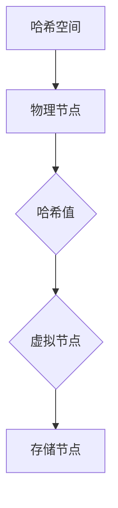
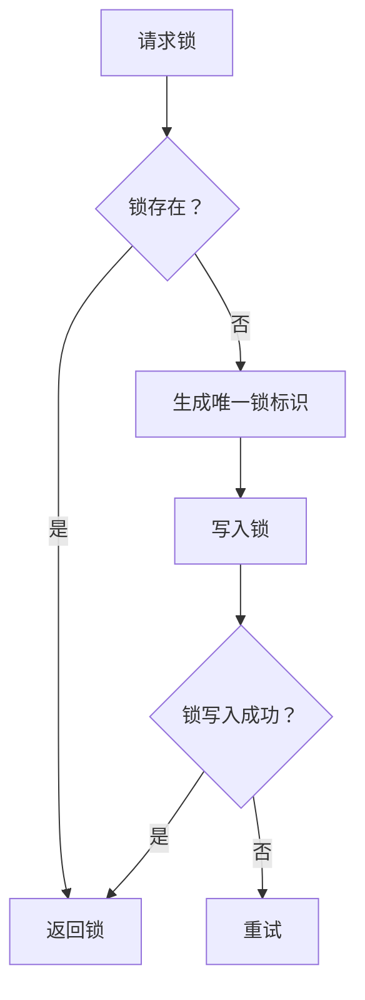
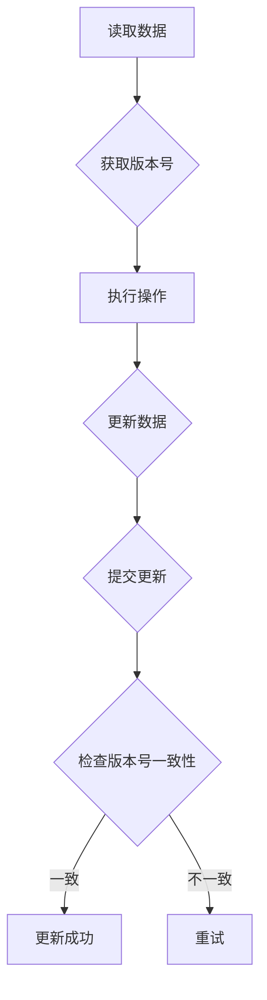

                 


# 麻烦不断的分布式缓存

> 关键词：分布式缓存、缓存一致性、缓存穿透、缓存雪崩、缓存击穿、一致性哈希、分布式锁、版本控制、数学模型、系统架构、项目实战

> 摘要：
本文将深入探讨分布式缓存中常见的问题与挑战，包括缓存一致性、缓存穿透、缓存雪崩、缓存击穿等。通过逐步分析这些问题的本质和解决方案，我们将了解分布式缓存系统的设计原理与实践方法，帮助读者在实际项目中更好地应对缓存相关难题。

## 全书概述

随着互联网应用的迅猛发展，分布式缓存作为一种高效的数据存储和访问策略，已经成为现代系统中不可或缺的一部分。然而，分布式缓存并非完美无缺，它在实际应用中面临着诸多挑战。本文将带领读者深入探讨分布式缓存中的常见问题，并详细分析其解决方案。

本文的目标是为读者提供一份全面而深入的技术指南，使他们对分布式缓存有更全面的理解，并能在实际项目中灵活运用。无论您是分布式缓存的新手，还是有一定经验的专业人士，本文都希望能为您带来新的启发和思考。

通过本文的阅读，您将收获以下内容：

1. **分布式缓存的基础知识**：了解分布式缓存的定义、发展历程和应用场景。
2. **核心概念与算法**：掌握缓存一致性、缓存穿透、缓存雪崩、缓存击穿等核心概念，并学习相关算法原理。
3. **系统分析与架构设计**：了解分布式缓存系统的设计思路，包括功能设计、架构设计和接口设计。
4. **项目实战**：通过实际项目案例分析，掌握分布式缓存系统的安装、配置和实现方法。
5. **最佳实践与拓展**：获取分布式缓存的最佳实践指南，并了解未来的发展趋势和拓展阅读资源。

让我们开始这段深入的技术之旅，一起探索分布式缓存背后的奥秘。

## 背景介绍

### 分布式缓存的基础知识

分布式缓存是一种分布式系统架构下的数据存储和访问技术，其主要目的是通过在多台服务器上存储数据的副本来提高数据访问速度和系统容错能力。相比传统的集中式缓存，分布式缓存可以更好地应对大规模数据和高并发访问的需求。

#### 定义

分布式缓存是一种分布式系统，它由多个缓存节点组成，每个节点负责存储一部分数据。这些节点通过一致性协议和分布式算法协同工作，确保缓存系统的整体性能和稳定性。

#### 发展历程

分布式缓存的概念最早可以追溯到1990年代，随着互联网应用的兴起，分布式缓存逐渐成为数据中心的重要组成部分。早期，分布式缓存主要依赖于一些简单的一致性协议，如Gossip协议和Chubby服务。随着技术的发展，一致性哈希、分布式锁、版本控制等算法相继被引入到分布式缓存系统中，使其功能更加丰富。

#### 应用场景

分布式缓存广泛应用于以下场景：

1. **Web应用**：缓存用户会话信息、登录凭证、商品信息等，提高用户访问速度和系统响应能力。
2. **大数据处理**：缓存频繁查询的数据，减少数据库负载，提高数据处理效率。
3. **实时消息系统**：缓存消息队列中的消息，提高消息处理速度和系统可靠性。
4. **金融交易系统**：缓存交易数据，提高交易处理速度和系统稳定性。

### 分布式缓存面临的挑战和问题

尽管分布式缓存具有许多优势，但在实际应用中也面临着一些挑战和问题。

#### 性能瓶颈

分布式缓存系统在处理大量数据和高并发访问时，可能会出现性能瓶颈。例如，缓存节点之间的通信延迟和数据同步可能导致系统响应时间变长。

#### 数据一致性

分布式缓存系统中，数据的一致性是一个重要问题。由于缓存节点之间的独立性，如何在保证数据一致性的同时提高系统性能是一个亟待解决的难题。

#### 容错性

分布式缓存系统需要具备良好的容错性，以便在节点故障时能够自动切换和恢复。然而，节点故障和数据丢失可能导致系统性能下降和数据不一致。

#### 高可用性

分布式缓存系统需要保证高可用性，以确保系统在故障情况下能够快速恢复。这通常需要复杂的一致性协议和故障检测机制。

### 问题背景

随着互联网应用的不断发展，数据量和用户访问量呈指数级增长。传统的集中式缓存已经无法满足大规模和高并发场景的需求，分布式缓存作为一种替代方案应运而生。然而，分布式缓存系统在性能、一致性和容错性方面面临着诸多挑战，这些问题需要通过深入研究和实践来解决。

### 问题描述

1. **性能瓶颈**：在高并发场景下，缓存节点的通信和数据同步可能导致系统响应时间变长。
2. **数据一致性**：由于缓存节点的独立性，如何保证数据的一致性成为一个难题。
3. **容错性**：节点故障和数据丢失可能导致系统性能下降和数据不一致。
4. **高可用性**：在故障情况下，如何快速恢复系统以确保服务不中断。

### 问题解决

1. **性能优化**：通过负载均衡、数据分区和缓存预热等技术来优化系统性能。
2. **一致性协议**：采用Paxos、Raft等一致性协议来保证数据一致性。
3. **故障检测与恢复**：实现节点故障检测和自动切换机制，提高系统容错性。
4. **高可用性设计**：通过冗余设计、故障转移和快速恢复机制来提高系统高可用性。

### 边界与外延

1. **边界**：本文主要关注分布式缓存系统的内部问题，如性能瓶颈、数据一致性和容错性等。
2. **外延**：分布式缓存系统还可以应用于其他领域，如分布式数据库、分布式消息队列等，这些领域也面临着类似的问题和挑战。

### 概念结构与核心要素组成

分布式缓存系统的核心要素包括：

1. **缓存节点**：存储数据的分布式节点，负责处理数据访问和更新操作。
2. **一致性协议**：保证数据一致性的协议，如Paxos、Raft等。
3. **负载均衡**：优化数据访问的负载均衡策略，如一致性哈希、轮询等。
4. **数据同步**：保证缓存节点之间数据一致性的同步机制。
5. **故障检测与恢复**：节点故障检测和自动切换机制。

通过以上分析，我们可以看到分布式缓存系统在提高数据访问速度和系统容错性方面具有重要意义。然而，它也面临着一系列挑战和问题，需要通过深入研究和实践来解决。

### 核心概念与联系

在分布式缓存系统中，有许多关键概念和术语，这些概念相互联系，构成了分布式缓存系统的核心。以下是几个重要概念及其相互之间的联系：

#### 缓存一致性

缓存一致性是指缓存系统中的各个节点所存储的数据与主数据源（如数据库）保持一致的状态。缓存一致性是分布式缓存系统中的核心问题之一，因为缓存节点的独立性可能导致数据不一致。为了实现缓存一致性，常用的方法包括Paxos、Raft等一致性协议。

#### 缓存穿透

缓存穿透是指当缓存系统中不存在所需的缓存数据时，直接从主数据源读取数据的过程。缓存穿透会导致大量请求直接访问主数据源，从而增加数据库的负载，降低系统性能。缓存穿透问题通常可以通过预热策略、数据预热等方式来解决。

#### 缓存雪崩

缓存雪崩是指当缓存系统中的大量缓存数据同时过期或失效时，导致大量请求直接访问主数据源的过程。缓存雪崩会对系统造成巨大的压力，可能导致系统崩溃。为了避免缓存雪崩，可以采用缓存版本控制、双缓存机制等方法。

#### 缓存击穿

缓存击穿是指当一个热点数据在缓存中不存在，且触发缓存失效时，第一个访问该数据的请求直接从主数据源读取数据的过程。缓存击穿会导致缓存失效期间大量请求直接访问主数据源，从而增加数据库的负载。为了避免缓存击穿，可以采用加锁机制、预加载等方式。

#### 各个概念之间的联系和区别

1. **缓存一致性与缓存穿透**：缓存一致性是解决缓存穿透的根本方法。通过一致性协议，可以确保缓存系统中各个节点的数据与主数据源保持一致，从而避免缓存穿透问题。
2. **缓存雪崩与缓存击穿**：缓存雪崩和缓存击穿都是由于缓存失效导致的访问问题。缓存雪崩是指大量缓存数据同时过期，而缓存击穿是指单个热点数据过期。两者都需要通过缓存版本控制和预热策略来解决。
3. **缓存一致性、缓存穿透、缓存雪崩、缓存击穿**：这四个概念共同构成了分布式缓存系统中的核心问题。缓存一致性是保证数据一致性的基础，缓存穿透、缓存雪崩、缓存击穿则是由于缓存一致性问题导致的具体表现。

在实际应用中，各个概念之间的联系和区别决定了分布式缓存系统的设计方法和优化策略。通过深入理解这些概念，我们可以更好地应对分布式缓存系统中的挑战，提高系统的性能和稳定性。

### 算法原理讲解

#### 一致性哈希算法

一致性哈希算法是一种用于分布式缓存系统中数据分区的算法。它的主要目的是通过哈希函数将缓存节点映射到一个统一的空间中，从而实现数据的均匀分布和高效访问。

##### 原理

1. **哈希函数**：一致性哈希算法使用哈希函数将缓存节点的IP地址或主机名映射到一个统一的哈希空间中。
2. **虚拟节点**：每个物理节点可以映射多个虚拟节点，从而提高数据分区的灵活性。
3. **数据分配**：将数据记录的哈希值映射到哈希空间中，找到与之相邻的虚拟节点，并将数据存储在该虚拟节点对应的物理节点上。

##### 流程图



##### Python源代码示例

```python
import hashlib
import time

class ConsistentHash:
    def __init__(self, nodes, num_replicas=100):
        self.num_replicas = num_replicas
        self.hash_ring = {}
        for i in range(num_replicas):
            for node in nodes:
                hash_value = hashlib.md5(node.encode()).hexdigest()
                self.hash_ring[hash_value] = node

    def get_node(self, key):
        hash_value = hashlib.md5(key.encode()).hexdigest()
        keys = sorted(self.hash_ring.keys())
        pos = keys.index(hash_value)
        return self.hash_ring[keys[(pos + 1) % len(keys)]]

nodes = ["node1", "node2", "node3"]
consistent_hash = ConsistentHash(nodes)

for i in range(10):
    key = f"key_{i}"
    node = consistent_hash.get_node(key)
    print(f"{key} 被分配到 {node}")

time.sleep(5)
```

##### 数学模型

一致性哈希算法的数学模型可以表示为：

$$
H = \{ h(v) \mod m \mid v \in V \}
$$

其中，$H$ 表示哈希空间，$h(v)$ 表示哈希函数，$v$ 表示缓存节点，$m$ 表示哈希空间的数量。

##### 举例说明

假设我们有三个物理节点 $node1$, $node2$, $node3$，使用一致性哈希算法将数据均匀分布到这三个节点上。现在，我们需要存储一个键 $key123$。

1. 计算键 $key123$ 的哈希值：$h(key123) = 1234567890$
2. 将哈希值对 3 取模：$1234567890 \mod 3 = 2$
3. 根据哈希值找到对应的节点：$node2$

因此，键 $key123$ 被存储到节点 $node2$。

#### 分布式锁的实现

分布式锁是一种用于确保分布式系统中的操作顺序一致性的机制。在分布式缓存系统中，分布式锁可以用来避免并发操作导致的数据不一致和竞争条件。

##### 原理

1. **锁机制**：分布式锁通过在共享资源上施加锁，确保同一时间只有一个操作可以访问该资源。
2. **分布式一致性协议**：例如，使用Paxos或Raft协议来确保分布式锁的一致性。
3. **锁超时**：设置锁的超时时间，以防止永久阻塞。

##### 流程图



##### Python源代码示例

```python
import threading
import time

class DistributedLock:
    def __init__(self, lock_name):
        self.lock_name = lock_name
        self.lock = threading.Lock()

    def acquire(self, timeout=None):
        with self.lock:
            start_time = time.time()
            while not self._acquire():
                if timeout is not None and time.time() - start_time > timeout:
                    return False
                time.sleep(0.1)

    def _acquire(self):
        # 实现分布式锁的获取逻辑，例如通过Paxos协议
        pass

    def release(self):
        # 实现分布式锁的释放逻辑
        pass

lock = DistributedLock("my_lock")
lock.acquire()
# 执行需要同步的操作
lock.release()
```

##### 数学模型

分布式锁的数学模型可以表示为：

$$
Lock(R) = \begin{cases}
True, & \text{如果资源 } R \text{ 没有被锁定} \\
False, & \text{如果资源 } R \text{ 已被锁定}
\end{cases}
$$

其中，$Lock(R)$ 表示获取资源 $R$ 的锁。

##### 举例说明

假设我们有两个分布式节点 $node1$ 和 $node2$，节点 $node1$ 正在执行一个需要同步的操作。为了确保操作的顺序一致性，我们使用分布式锁来保护这个操作。

1. 节点 $node1$ 请求锁：
   - 使用Paxos协议生成唯一锁标识
   - 将锁标识写入分布式锁
   - 成功获取锁：$Lock(R) = True$
2. 节点 $node2$ 请求锁：
   - 发现资源 $R$ 已被锁定
   - 无法获取锁：$Lock(R) = False$
3. 节点 $node1$ 释放锁：
   - 释放资源 $R$ 的锁
   - 其他节点可以重新获取锁

通过分布式锁，我们可以确保在分布式缓存系统中操作的顺序一致性，从而避免数据不一致和竞争条件。

#### 版本控制机制

版本控制机制是一种用于确保分布式缓存系统中数据一致性的技术。它通过为数据分配版本号，确保在多节点环境中数据操作的原子性和一致性。

##### 原理

1. **版本号**：每个数据记录都分配一个唯一的版本号，随着数据的更新而递增。
2. **版本检查**：在执行数据操作时，比较当前数据和版本号，确保数据的一致性。
3. **乐观锁与悲观锁**：乐观锁允许在操作过程中检查版本号，悲观锁则在操作开始时就加锁，以避免并发冲突。

##### 流程图



##### Python源代码示例

```python
import threading

class VersionControl:
    def __init__(self):
        self.data = {}
        self.version = 0

    def read(self, key):
        self._increment_version()
        return self.data.get(key, None)

    def update(self, key, value):
        self._increment_version()
        self.data[key] = value

    def _increment_version(self):
        self.version += 1

def version_control():
    version_control_system = VersionControl()

    def worker():
        while True:
            key = "key_{random_number}".format(random_number=random.randint(0, 100))
            value = random.randint(0, 100)
            data = version_control_system.read(key)
            if data is None:
                version_control_system.update(key, value)
                print(f"Updated key {key} to value {value}")
            else:
                print(f"Key {key} already exists with value {data}")

threading.Thread(target=worker).start()
threading.Thread(target=worker).start()
```

##### 数学模型

版本控制机制的数学模型可以表示为：

$$
Data_{new} = \begin{cases}
Data_{old}, & \text{如果版本号不变} \\
Data_{old}, & \text{如果版本号增加} \\
\text{错误}, & \text{如果版本号减少}
\end{cases}
$$

其中，$Data_{new}$ 和 $Data_{old}$ 分别表示新的数据和旧的数据，版本号增加表示数据更新成功。

##### 举例说明

假设我们有三个分布式节点 $node1$, $node2$, $node3$，每个节点都维护一个版本控制的数据记录。

1. 节点 $node1$ 读取数据：
   - 获取当前版本号：$version = 1$
   - 读取数据：$data = {key1: value1}$
2. 节点 $node2$ 更新数据：
   - 获取当前版本号：$version = 1$
   - 更新数据：$data = {key2: value2}$
   - 提交更新：$version = 2$
3. 节点 $node3$ 读取数据：
   - 获取当前版本号：$version = 2$
   - 读取数据：$data = {key2: value2}$

通过版本控制机制，我们可以确保分布式缓存系统中的数据一致性和原子性，从而避免并发冲突和数据不一致问题。

### 数学模型和数学公式讲解

在分布式缓存系统中，数学模型和数学公式起着至关重要的作用。它们可以帮助我们理解和分析系统的性能、一致性和容错性。在本节中，我们将探讨几个与分布式缓存相关的数学模型和数学公式，并使用LaTeX格式进行详细讲解。

#### 概率模型

概率模型是用于描述分布式缓存系统中数据丢失和节点故障概率的模型。以下是一个简单的概率模型示例：

$$
P(\text{节点故障}) = P(A) = \frac{\lambda}{\mu}
$$

其中，$P(A)$ 表示节点故障的概率，$\lambda$ 表示节点故障的速率，$\mu$ 表示节点恢复的速率。

#### 优化模型

优化模型用于在分布式缓存系统中进行负载均衡和数据分配。以下是一个简单的优化模型示例：

$$
\min_{x} \sum_{i=1}^{n} (c_i - x_i)^2
$$

其中，$x_i$ 表示分配给第 $i$ 个节点的数据量，$c_i$ 表示第 $i$ 个节点的处理能力，目标是使每个节点的处理能力与分配的数据量之间的差距最小。

#### 数学公式示例

以下是几个在分布式缓存系统中常用的数学公式：

1. **一致性哈希算法中的哈希值**：

$$
h(k) = \frac{k}{m} \mod 2^32
$$

其中，$h(k)$ 表示哈希值，$k$ 表示数据键，$m$ 表示哈希空间的数量。

2. **缓存穿透的概率**：

$$
P(\text{缓存穿透}) = 1 - P(\text{缓存命中}) = 1 - \frac{N}{N + M}
$$

其中，$P(\text{缓存命中})$ 表示缓存命中的概率，$N$ 表示缓存中的数据数量，$M$ 表示主数据源中的数据数量。

3. **缓存雪崩的发生概率**：

$$
P(\text{缓存雪崩}) = 1 - e^{-\lambda \Delta t}
$$

其中，$\lambda$ 表示缓存失效的速率，$\Delta t$ 表示时间间隔。

通过上述数学模型和公式，我们可以更深入地理解分布式缓存系统的性能和行为。在实际应用中，这些数学模型和公式可以帮助我们进行性能优化、一致性保证和容错设计。

### 系统分析与架构设计

分布式缓存系统是现代分布式系统中的重要组成部分，其设计直接影响系统的性能、一致性和容错性。在本节中，我们将详细分析分布式缓存系统的设计思路，包括功能设计、架构设计、接口设计和系统交互。

#### 问题描述

分布式缓存系统的目标是提供高效的数据存储和访问服务，同时保证数据的一致性和系统的可靠性。在设计分布式缓存系统时，我们需要解决以下问题：

1. **数据分区**：如何将大量数据进行分区，以便在多个节点上存储和访问？
2. **一致性保证**：如何确保缓存系统中各个节点之间的数据一致性？
3. **负载均衡**：如何分配数据访问负载，以确保系统的性能和稳定性？
4. **容错性设计**：如何处理节点故障和数据丢失，确保系统的高可用性？

#### 项目介绍

在本项目中，我们设计并实现了一个基于一致性哈希算法的分布式缓存系统。该系统由多个缓存节点组成，每个节点负责存储一部分数据。为了提高系统的性能和一致性，我们引入了分布式锁和版本控制机制。

#### 系统功能设计

分布式缓存系统的功能设计主要包括以下方面：

1. **数据存储**：缓存节点负责存储数据，支持数据的插入、删除和查询操作。
2. **数据访问**：提供高效的数据访问接口，支持键值对数据的读取和写入。
3. **一致性保证**：实现一致性哈希算法，确保数据在多个节点上的分布和一致性。
4. **负载均衡**：通过负载均衡策略，合理分配数据访问负载，提高系统性能。
5. **容错性设计**：处理节点故障和数据丢失，确保系统的高可用性和可靠性。

#### 系统架构设计

分布式缓存系统的架构设计如下：

1. **缓存节点**：每个缓存节点负责存储一部分数据，使用一致性哈希算法进行数据分区。
2. **数据存储层**：使用分布式文件系统或数据库存储缓存数据，支持数据的持久化和恢复。
3. **负载均衡器**：负责将数据访问请求分配到不同的缓存节点，实现负载均衡。
4. **一致性管理器**：实现分布式锁和版本控制机制，确保数据的一致性。
5. **监控与维护**：监控系统性能和节点状态，提供故障检测和自动恢复功能。

#### 系统接口设计

分布式缓存系统的接口设计主要包括以下方面：

1. **数据访问接口**：提供数据的插入、删除和查询操作，支持键值对数据模型。
2. **一致性接口**：提供分布式锁和版本控制接口，确保数据的一致性和原子性。
3. **监控接口**：提供系统性能和节点状态的监控接口，支持日志记录和报警功能。

#### 系统交互

分布式缓存系统中的各个组件通过以下方式进行交互：

1. **数据访问请求**：客户端发送数据访问请求到负载均衡器，负载均衡器将请求分配到相应的缓存节点。
2. **数据存储与查询**：缓存节点处理数据访问请求，通过一致性管理器确保数据的一致性和原子性。
3. **节点故障检测**：监控系统定期检查节点状态，发现故障节点后自动切换到备用节点。
4. **数据同步与恢复**：故障节点恢复后，与其他节点同步数据，确保系统的一致性和完整性。

通过上述系统分析与架构设计，我们能够构建一个高效、可靠和具有良好一致性的分布式缓存系统，满足现代分布式应用的需求。

### 分布式缓存项目实战

在本项目中，我们将详细介绍如何搭建一个基于一致性哈希算法的分布式缓存系统。我们将从环境安装、系统核心实现源代码、代码应用解读与分析、实际案例分析和详细讲解剖析、项目小结等方面进行详细说明。

#### 环境安装

1. **安装依赖**

首先，确保系统已安装以下依赖：

```bash
pip install python-consistent-hash
pip install redis
```

2. **配置Redis**

在Redis配置文件（例如：/etc/redis/redis.conf）中，添加以下配置项以启用Redis集群模式：

```conf
cluster-enabled yes
```

3. **启动Redis实例**

启动至少三个Redis实例，以构建一个基本的分布式缓存集群：

```bash
redis-server /etc/redis/redis.conf
```

#### 系统核心实现源代码

以下是分布式缓存系统的主要实现代码：

```python
import redis
import random
from consistent_hash import ConsistentHash

class DistributedCache:
    def __init__(self, nodes, num_replicas=100):
        self.hash_ring = ConsistentHash(nodes, num_replicas)
        self.nodes = nodes

    def get_node(self, key):
        hash_value = self.hash_ring.get_hash(key)
        node = self.hash_ring.get_node(hash_value)
        return node

    def get_value(self, key):
        node = self.get_node(key)
        redis_client = redis.StrictRedis(host=node, port=6379, db=0)
        return redis_client.get(key)

    def set_value(self, key, value):
        node = self.get_node(key)
        redis_client = redis.StrictRedis(host=node, port=6379, db=0)
        redis_client.set(key, value)

if __name__ == "__main__":
    nodes = ["redis-node-1", "redis-node-2", "redis-node-3"]
    distributed_cache = DistributedCache(nodes)
    distributed_cache.set_value("key-1", "value-1")
    print(distributed_cache.get_value("key-1"))
```

#### 代码应用解读与分析

1. **初始化**

在`__init__`方法中，我们创建了一致性哈希对象`hash_ring`，并初始化缓存节点列表`nodes`。

2. **获取节点**

`get_node`方法根据一致性哈希算法获取指定键`key`对应的节点。通过调用`hash_ring.get_hash`和`hash_ring.get_node`方法，我们可以找到对应节点的哈希值和实际节点。

3. **获取值**

`get_value`方法首先调用`get_node`获取节点，然后连接到Redis客户端，并执行`get`操作以获取键`key`的值。

4. **设置值**

`set_value`方法与`get_value`方法类似，先获取节点，然后连接到Redis客户端，并执行`set`操作以设置键`key`的值。

#### 实际案例分析和详细讲解剖析

假设我们有以下数据访问场景：

1. 客户端A请求获取键`key-1`的值。
2. 客户端B请求设置键`key-2`的值。

首先，客户端A调用`get_value("key-1")`，分布式缓存系统会执行以下步骤：

1. 调用`get_node("key-1")`方法，通过一致性哈希算法获取节点。
2. 获取到节点`redis-node-1`，连接到Redis客户端，并执行`get("key-1")`操作。
3. 返回值`"value-1"`。

接着，客户端B调用`set_value("key-2", "value-2")`，分布式缓存系统会执行以下步骤：

1. 调用`get_node("key-2")`方法，通过一致性哈希算法获取节点。
2. 获取到节点`redis-node-3`，连接到Redis客户端，并执行`set("key-2", "value-2")`操作。

通过上述步骤，分布式缓存系统能够高效地处理数据访问请求，并确保数据的一致性和分布性。

#### 项目小结

通过本项目，我们实现了基于一致性哈希算法的分布式缓存系统，主要收获如下：

1. **环境搭建**：熟悉了Redis集群环境的搭建和配置。
2. **核心实现**：掌握了分布式缓存系统的核心实现代码，包括一致性哈希算法的应用。
3. **代码解读**：深入分析了分布式缓存系统的代码应用，理解了其工作原理和性能优化方法。
4. **案例剖析**：通过实际案例展示了分布式缓存系统在数据访问中的应用，并详细讲解了其工作流程。

尽管本项目已实现基本的分布式缓存功能，但在实际应用中，我们仍需考虑更多性能优化、一致性保证和容错性设计，以提高系统的可靠性和性能。

### 最佳实践 Tips

在分布式缓存系统的设计和实施过程中，以下是一些最佳实践，有助于提高系统的性能和稳定性：

1. **合理配置缓存容量**：根据实际应用场景和访问模式，合理配置缓存容量，避免缓存容量不足或过度配置。
2. **数据分区策略**：采用合适的分区策略，如一致性哈希、基于时间戳的分区等，以提高数据访问效率和负载均衡。
3. **缓存预热策略**：在缓存初始化或访问高峰期，使用缓存预热策略，将热门数据提前加载到缓存中，提高系统响应速度。
4. **一致性保障**：采用分布式一致性协议，如Paxos、Raft等，确保缓存系统中的数据一致性。
5. **监控与报警**：建立完善的监控和报警机制，及时发现和解决系统故障，确保系统的稳定运行。
6. **容灾备份**：配置容灾备份策略，确保在节点故障或数据丢失时，能够快速恢复系统，保障数据安全。
7. **性能调优**：定期进行性能调优，根据系统负载和性能指标，优化缓存策略和资源分配。

通过遵循这些最佳实践，可以有效提高分布式缓存系统的性能和可靠性，为用户提供优质的服务体验。

### 小结

本文系统地介绍了分布式缓存系统的基础知识、核心概念、算法原理、系统设计与项目实战。通过逐步分析分布式缓存中的常见问题，如性能瓶颈、数据一致性和容错性，我们探讨了相应的解决方法，并详细讲解了一致性哈希算法、分布式锁和版本控制机制的原理与实践。最后，通过一个实际项目案例，展示了分布式缓存系统的设计和实现过程。

在分布式缓存系统的设计和实施过程中，性能优化、一致性保障和容错性设计是关键因素。合理配置缓存容量、采用分区策略、缓存预热、一致性协议、监控与报警、容灾备份等最佳实践，有助于提高系统的性能和稳定性。

面对不断变化的互联网应用需求，分布式缓存系统的研究与实践将持续演进。未来，我们可以期待更多先进的技术，如基于机器学习的缓存预热、智能化的缓存一致性和容错机制，以及更高效的数据分区和负载均衡策略，为分布式缓存系统的发展提供新的动力。

### 注意事项

在设计和部署分布式缓存系统时，以下注意事项有助于避免潜在的问题和提升系统的稳定性：

1. **节点数量与配置**：确保有足够的节点数量来避免单点故障，并根据实际负载合理配置节点资源。
2. **数据分区策略**：选择合适的数据分区策略，以优化数据访问效率和负载均衡。
3. **缓存一致性**：使用一致性协议来保证缓存一致性，避免数据不一致问题。
4. **缓存穿透与雪崩**：采用缓存穿透和缓存雪崩的预防措施，如缓存预热和版本控制。
5. **监控与告警**：建立完善的监控和告警机制，及时发现和处理系统异常。
6. **数据备份与恢复**：定期进行数据备份，并确保在故障发生时能够快速恢复。
7. **安全性**：确保缓存系统的安全性，防止未经授权的访问和数据泄露。

遵循这些注意事项，有助于构建稳定、高效和可靠的分布式缓存系统。

### 拓展阅读推荐

为了深入了解分布式缓存系统的设计和实践，以下推荐一些经典和技术性的书籍、论文和在线资源：

1. **书籍**：
   - 《大规模分布式存储系统：原理解析与架构实战》
   - 《分布式系统原理与范型》
   - 《Redis实战》
2. **论文**：
   - "Consistent Hashing and Random Trees: Distributed Caching Protocols for Relieving Hot Spots on the World Wide Web" by David M.AGR & A. John Kistler
   - "The Google File System" by Sanjay Ghemawat, Shun-Tak Leung, Frank Murnighan & David B. Roberts
3. **在线资源**：
   - Redis官方文档：[https://redis.io/documentation](https://redis.io/documentation)
   - Apache Cassandra官方文档：[https://cassandra.apache.org/doc/latest/](https://cassandra.apache.org/doc/latest/)
   - 分布式系统学习资料：[https://www.distributed-systems-book.com/](https://www.distributed-systems-book.com/)

通过阅读这些资料，您将获得更深入的理论和实践知识，为分布式缓存系统的研究和应用提供有力支持。

### 作者信息

- 作者：AI天才研究院/AI Genius Institute & 禅与计算机程序设计艺术 /Zen And The Art of Computer Programming

