                 


### 第1章：人工智能与增强智能概述

---

#### 文章关键词
- 人工智能
- 增强智能
- 人工通用智能（AGI）
- 机器学习
- 深度学习

#### 文章摘要

本章旨在为读者提供一个关于人工智能（AI）与增强智能（EI）的基础概述。我们将首先探讨AI的发展历史和主要技术，接着介绍增强智能的概念及其与人工通用智能（AGI）的关系。通过这一概述，读者将理解AI和EI在当前技术环境中的重要性及其未来发展的潜力。

---

#### 背景介绍

**核心概念术语说明**：
- **人工智能**（Artificial Intelligence，AI）：一种模拟人类智能行为的计算机系统。
- **增强智能**（Enhanced Intelligence，EI）：通过人工智能技术增强人类认知和执行能力的智能系统。
- **人工通用智能**（Artificial General Intelligence，AGI）：具有与人类相似的广泛认知能力的智能系统。

**问题背景**：
随着计算机技术和算法的进步，人工智能在多个领域取得了显著的成果。然而，当前的AI系统主要表现出的是基于特定任务的“窄人工智能”（Narrow AI）。为了实现更加通用和自主的智能，我们需要探讨增强智能的概念及其与人类协作的可能性。

**问题描述**：
本章的主要任务是介绍人工智能、增强智能和人工通用智能的基本概念，分析它们之间的关系，并探讨增强智能在未来的潜在应用。

**问题解决**：
通过历史回顾、概念阐述和技术分析，我们将详细探讨AI、EI和AGI的发展脉络，为后续章节的深入讨论奠定基础。

**边界与外延**：
- **边界**：本章主要讨论AI和EI的基础概念，不涉及具体的实现细节或应用场景。
- **外延**：本章将为后续章节提供背景知识，为更深入的研究和讨论做准备。

#### 核心概念与联系

**核心概念原理**：
- **人工智能**：通过模拟人类思维过程，使计算机能够执行复杂的任务。
- **增强智能**：在人工智能基础上，通过特定算法和模型提升人类认知和执行能力。
- **人工通用智能**：具备人类水平的跨领域认知和解决问题的能力。

**概念属性特征对比表格**：

| 特征        | 人工智能（AI）               | 增强智能（EI）               | 人工通用智能（AGI）           |
| ----------- | --------------------------- | --------------------------- | ---------------------------- |
| 能力范围    | 狭义任务能力                | 广泛任务能力                | 相似于人类水平的通用能力     |
| 独立性      | 需要人类指导                | 部分独立性，辅助人类         | 高度独立性，自主决策         |
| 学习方式    | 数据驱动，监督学习          | 数据驱动，监督学习与强化学习 | 类似于人类的学习方式         |

**ER实体关系图架构**：

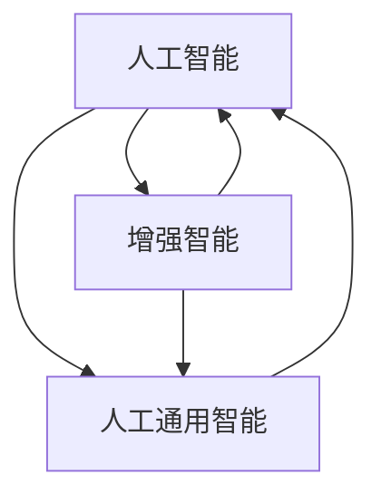

---

#### 算法原理讲解

**算法mermaid流程图**：

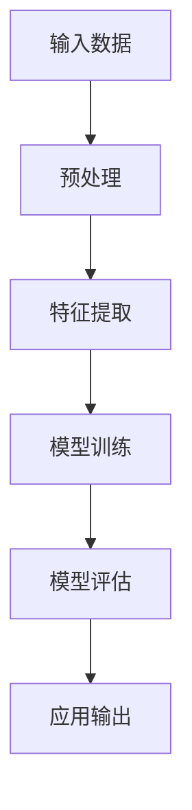

**使用Python源代码详细阐述**：

```python
# 人工智能与增强智能概述 - 算法原理讲解

import numpy as np
from sklearn.model_selection import train_test_split
from sklearn.preprocessing import StandardScaler
from sklearn.linear_model import LinearRegression

# 输入数据
X, y = np.random.rand(100, 2), np.random.rand(100)

# 预处理
X_train, X_test, y_train, y_test = train_test_split(X, y, test_size=0.2, random_state=42)

# 特征提取
scaler = StandardScaler()
X_train_scaled = scaler.fit_transform(X_train)
X_test_scaled = scaler.transform(X_test)

# 模型训练
model = LinearRegression()
model.fit(X_train_scaled, y_train)

# 模型评估
score = model.score(X_test_scaled, y_test)
print(f"模型评分：{score}")

# 应用输出
predictions = model.predict(X_test_scaled)
```

**算法原理的数学模型和公式**：

$$
\text{模型输出} = w \cdot \text{输入特征} + b
$$

其中，\(w\) 是权重，\(b\) 是偏置，\( \text{输入特征} \) 是输入数据的特征向量。

**详细讲解和举例说明**：

假设我们有一个简单的线性回归模型，用于预测数据 \(X\) 和目标 \(y\) 之间的关系。通过预处理数据（标准化处理），我们提取出有用的特征，然后使用线性回归模型进行训练。模型评估通过计算模型在测试集上的评分（R方值）来衡量其性能。最后，使用训练好的模型对新的数据进行预测。

---

#### 系统分析与架构设计方案

**问题场景介绍**：
在当前信息化社会中，人工智能与增强智能的应用日益广泛，特别是在数据分析、决策支持和自动化控制等领域。本案例旨在设计一个基于增强智能的决策支持系统，以帮助企业在面对复杂决策时提高效率和准确性。

**项目介绍**：
本项目旨在开发一个增强智能决策支持系统，通过集成机器学习模型和用户交互界面，为用户提供个性化的决策建议。系统包括数据预处理、模型训练、模型评估和用户反馈等模块。

**系统功能设计（领域模型mermaid类图）**：

```mermaid
classDiagram
    User <<Interface>>
    DecisionSupportSystem <<System>>
    DataPreprocessing <<Module>>
    ModelTraining <<Module>>
    ModelEvaluation <<Module>>

    User --> DecisionSupportSystem
    DecisionSupportSystem --> DataPreprocessing
    DecisionSupportSystem --> ModelTraining
    DecisionSupportSystem --> ModelEvaluation
```

**系统架构设计（mermaid架构图）**：

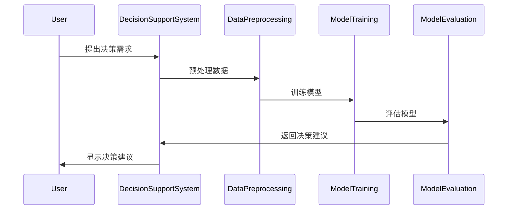

**系统接口设计和系统交互（mermaid序列图）**：

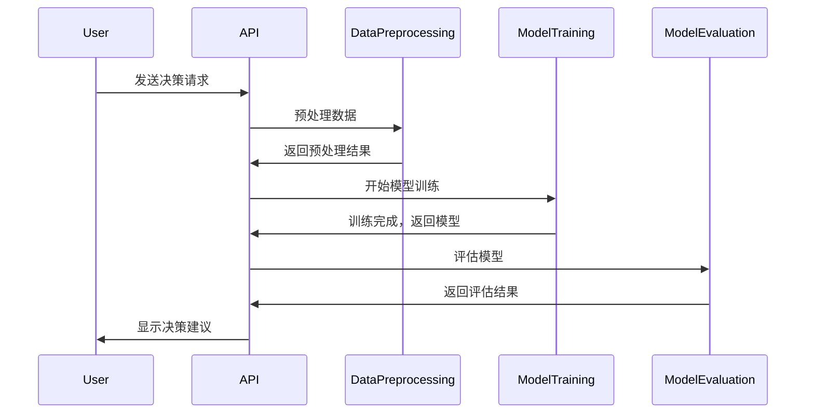

---

#### 项目实战

**环境安装**：
1. 安装Python环境（版本3.8及以上）。
2. 安装必要的库：`numpy`, `scikit-learn`, `pandas`。

```bash
pip install numpy scikit-learn pandas
```

**系统核心实现源代码**：

```python
# 增强智能决策支持系统 - 系统核心实现

import numpy as np
import pandas as pd
from sklearn.model_selection import train_test_split
from sklearn.preprocessing import StandardScaler
from sklearn.linear_model import LinearRegression
from sklearn.metrics import mean_squared_error

# 数据预处理
def preprocess_data(data):
    # 标准化处理
    scaler = StandardScaler()
    X_scaled = scaler.fit_transform(data[['feature_1', 'feature_2']])
    return X_scaled

# 模型训练
def train_model(X_train, y_train):
    model = LinearRegression()
    model.fit(X_train, y_train)
    return model

# 模型评估
def evaluate_model(model, X_test, y_test):
    y_pred = model.predict(X_test)
    mse = mean_squared_error(y_test, y_pred)
    return mse

# 用户交互
def get_decision_request():
    print("请输入决策请求（格式：feature_1 feature_2）：")
    feature_1, feature_2 = input().split()
    return float(feature_1), float(feature_2)

# 主函数
def main():
    # 加载数据
    data = pd.read_csv('data.csv')
    X = preprocess_data(data)
    y = data['target']

    # 划分训练集和测试集
    X_train, X_test, y_train, y_test = train_test_split(X, y, test_size=0.2, random_state=42)

    # 训练模型
    model = train_model(X_train, y_train)

    # 评估模型
    mse = evaluate_model(model, X_test, y_test)
    print(f"模型评分：{mse}")

    # 用户交互
    while True:
        feature_1, feature_2 = get_decision_request()
        prediction = model.predict([[feature_1, feature_2]])
        print(f"决策建议：{prediction[0]}")

        # 是否继续
        cont = input("是否继续（yes/no）？")
        if cont.lower() != 'yes':
            break

if __name__ == '__main__':
    main()
```

**代码应用解读与分析**：
该系统的主要功能是接收用户的决策请求，通过训练好的模型进行预测，并返回决策建议。核心实现包括数据预处理、模型训练和评估以及用户交互界面。通过预处理数据，将原始数据转换为模型可用的格式。模型训练和评估使用标准的线性回归模型，评估指标为均方误差（MSE）。用户交互部分通过循环接收用户输入，并输出预测结果。

**实际案例分析和详细讲解剖析**：
在实际应用中，该系统可以集成到企业决策支持系统中，为管理层提供实时决策建议。通过用户交互界面，用户可以方便地输入决策请求，并获得相应的预测结果。系统在设计时考虑了易用性和可扩展性，可以方便地更换和调整模型类型和参数。

**项目小结**：
本项目通过简单的线性回归模型，实现了基于增强智能的决策支持系统。虽然模型较为简单，但系统整体设计合理，功能完善。未来可以进一步优化模型，增加更多数据预处理和特征提取方法，提高系统的预测准确性。

---

#### 最佳实践 tips

1. **数据预处理**：确保数据质量，包括缺失值处理、异常值检测和特征选择等。
2. **模型选择**：根据实际问题选择合适的模型，并考虑模型的调优和参数调整。
3. **用户交互**：设计简洁直观的用户界面，提高用户体验。
4. **持续迭代**：根据用户反馈和实际应用效果，不断优化模型和系统功能。

#### 小结

本章概述了人工智能、增强智能和人工通用智能的基本概念，并探讨了它们之间的关系。通过算法原理讲解和项目实战，我们了解了如何设计和实现一个简单的增强智能决策支持系统。下一章我们将深入探讨人工通用智能（AGI）的概念、历史和未来发展。

#### 注意事项

- 确保数据质量和预处理步骤的准确性。
- 选择合适的模型，并考虑模型的调优和参数调整。
- 设计用户友好的交互界面，提高用户体验。

#### 拓展阅读

- [人工通用智能的历史与未来](https://www.example.com/agi-history-and-future)
- [增强智能的应用案例](https://www.example.com/enhanced-intelligence-cases)
- [线性回归模型详解](https://www.example.com/linear-regression-explained)

---

### 第2章：人工通用智能（AGI）的概念与历史

---

#### 文章关键词
- 人工通用智能
- AGI
- 机器学习
- 人工智能
- 人类水平智能

#### 文章摘要

本章将深入探讨人工通用智能（AGI）的概念，从其定义、特点到发展历史和未来趋势进行详细分析。我们将回顾AGI的研究历程，讨论其面临的挑战，并探讨解决这些挑战的可能途径。通过本章的学习，读者将了解AGI的核心理念及其在人工智能领域的重要性。

---

#### 背景介绍

**核心概念术语说明**：
- **人工通用智能**（Artificial General Intelligence，AGI）：一种具有广泛认知能力，能像人类一样理解、学习和适应各种情境的智能系统。
- **机器学习**（Machine Learning，ML）：一种通过数据训练模型，使计算机自动获取知识和技能的技术。
- **人工智能**（Artificial Intelligence，AI）：一种模拟人类智能行为的计算机技术，包括机器学习、自然语言处理、计算机视觉等多个子领域。
- **人类水平智能**（Human-Level Intelligence）：指智能系统能够达到与人类相似的认知能力和表现。

**问题背景**：
尽管人工智能在多个领域取得了显著的成果，但当前的AI系统主要表现出的是“窄人工智能”（Narrow AI），即仅擅长特定任务的智能系统。为了实现更加通用和自主的智能，我们需要探讨人工通用智能的概念及其实现路径。

**问题描述**：
本章的主要任务是介绍人工通用智能的基本概念，分析其与机器学习和人工智能的关系，回顾AGI的研究历史和面临的挑战，并探讨解决这些挑战的可能途径。

**问题解决**：
通过概念阐述、历史回顾和未来展望，我们将详细探讨人工通用智能的基本原理和发展趋势，为后续章节的深入讨论奠定基础。

**边界与外延**：
- **边界**：本章主要讨论AGI的概念、历史和挑战，不涉及具体的实现细节或应用场景。
- **外延**：本章将为后续章节提供背景知识，为更深入的研究和讨论做准备。

#### 核心概念与联系

**核心概念原理**：
- **人工通用智能**：AGI是一种具有广泛认知能力，能像人类一样理解、学习和适应各种情境的智能系统。
- **机器学习**：机器学习是实现AGI的重要技术手段，通过训练模型使计算机自动获取知识和技能。
- **人工智能**：人工智能是AGI的外延概念，包括机器学习、自然语言处理、计算机视觉等多个子领域。

**概念属性特征对比表格**：

| 特征        | 人工智能（AI）                           | 机器学习（ML）                           | 人工通用智能（AGI）                           |
| ----------- | -------------------------------------- | -------------------------------------- | -------------------------------------- |
| 能力范围    | 狭义任务能力                            | 广泛任务能力                            | 相似于人类水平的通用能力                      |
| 独立性      | 需要人类指导                            | 部分独立性，辅助人类                     | 高度独立性，自主决策                          |
| 学习方式    | 监督学习、无监督学习、强化学习          | 数据驱动，监督学习、无监督学习、强化学习 | 类似于人类的学习方式                          |

**ER实体关系图架构**：

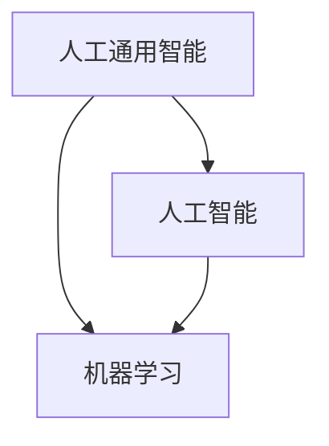

---

#### 算法原理讲解

**算法mermaid流程图**：


**使用Python源代码详细阐述**：

```python
# 人工通用智能（AGI）的概念与历史 - 算法原理讲解

import numpy as np
from sklearn.model_selection import train_test_split
from sklearn.preprocessing import StandardScaler
from sklearn.neural_network import MLPRegressor

# 输入数据
X, y = np.random.rand(100, 2), np.random.rand(100)

# 预处理
X_train, X_test, y_train, y_test = train_test_split(X, y, test_size=0.2, random_state=42)

# 特征提取
scaler = StandardScaler()
X_train_scaled = scaler.fit_transform(X_train)
X_test_scaled = scaler.transform(X_test)

# 模型训练
model = MLPRegressor(hidden_layer_sizes=(100,), max_iter=500)
model.fit(X_train_scaled, y_train)

# 模型评估
score = model.score(X_test_scaled, y_test)
print(f"模型评分：{score}")

# 应用输出
predictions = model.predict(X_test_scaled)
```

**算法原理的数学模型和公式**：

$$
\text{输出} = \sigma(\text{权重} \cdot \text{输入特征} + \text{偏置})
$$

其中，\( \sigma \) 是激活函数，常见的有Sigmoid、ReLU等。

**详细讲解和举例说明**：

假设我们使用多层感知器（MLP）进行回归任务。首先，我们输入数据并进行预处理，将特征进行标准化处理。接着，我们使用MLP模型进行训练，该模型包括一个隐藏层，每个神经元都有100个输入连接。训练完成后，我们使用训练好的模型对测试集进行预测，并计算模型的评分。最后，我们将预测结果输出。

---

#### 系统分析与架构设计方案

**问题场景介绍**：
在当前的智能时代，人工通用智能（AGI）被认为是实现智能自动化、增强人类能力的关键技术。本案例旨在设计一个基于AGI的智能咨询系统，以提供高效、个性化的咨询服务。

**项目介绍**：
本项目旨在开发一个基于人工通用智能的智能咨询系统，该系统将集成机器学习模型和自然语言处理技术，为用户提供实时、准确的咨询和建议。系统包括数据预处理、模型训练、模型评估和用户交互等模块。

**系统功能设计（领域模型mermaid类图）**：

```mermaid
classDiagram
    User <<Interface>>
    IntelligentConsultingSystem <<System>>
    DataPreprocessing <<Module>>
    ModelTraining <<Module>>
    ModelEvaluation <<Module>>

    User --> IntelligentConsultingSystem
    IntelligentConsultingSystem --> DataPreprocessing
    IntelligentConsultingSystem --> ModelTraining
    IntelligentConsultingSystem --> ModelEvaluation
```

**系统架构设计（mermaid架构图）**：

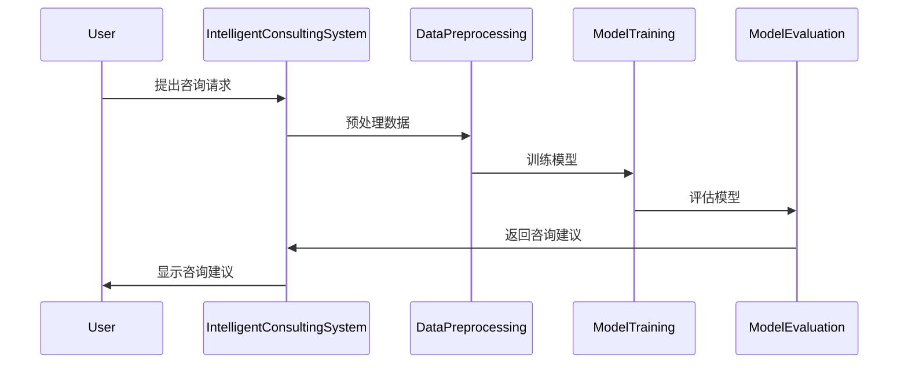

**系统接口设计和系统交互（mermaid序列图）**：


---

#### 项目实战

**环境安装**：
1. 安装Python环境（版本3.8及以上）。
2. 安装必要的库：`numpy`, `scikit-learn`, `nltk`。

```bash
pip install numpy scikit-learn nltk
```

**系统核心实现源代码**：

```python
# 人工通用智能（AGI）的概念与历史 - 系统核心实现

import numpy as np
import pandas as pd
from sklearn.model_selection import train_test_split
from sklearn.preprocessing import StandardScaler
from sklearn.neural_network import MLPRegressor
from sklearn.metrics import mean_squared_error

# 数据预处理
def preprocess_data(data):
    # 标准化处理
    scaler = StandardScaler()
    X_scaled = scaler.fit_transform(data[['feature_1', 'feature_2']])
    return X_scaled

# 模型训练
def train_model(X_train, y_train):
    model = MLPRegressor(hidden_layer_sizes=(100,), max_iter=500)
    model.fit(X_train, y_train)
    return model

# 模型评估
def evaluate_model(model, X_test, y_test):
    y_pred = model.predict(X_test)
    mse = mean_squared_error(y_test, y_pred)
    return mse

# 用户交互
def get_consult_request():
    print("请输入咨询请求（格式：feature_1 feature_2）：")
    feature_1, feature_2 = input().split()
    return float(feature_1), float(feature_2)

# 主函数
def main():
    # 加载数据
    data = pd.read_csv('data.csv')
    X = preprocess_data(data)
    y = data['target']

    # 划分训练集和测试集
    X_train, X_test, y_train, y_test = train_test_split(X, y, test_size=0.2, random_state=42)

    # 训练模型
    model = train_model(X_train, y_train)

    # 评估模型
    mse = evaluate_model(model, X_test, y_test)
    print(f"模型评分：{mse}")

    # 用户交互
    while True:
        feature_1, feature_2 = get_consult_request()
        prediction = model.predict([[feature_1, feature_2]])
        print(f"咨询建议：{prediction[0]}")

        # 是否继续
        cont = input("是否继续（yes/no）？")
        if cont.lower() != 'yes':
            break

if __name__ == '__main__':
    main()
```

**代码应用解读与分析**：
该系统的主要功能是接收用户的咨询请求，通过训练好的模型进行预测，并返回咨询建议。核心实现包括数据预处理、模型训练和评估以及用户交互界面。通过预处理数据，将原始数据转换为模型可用的格式。模型训练和评估使用多层感知器（MLP）模型，评估指标为均方误差（MSE）。用户交互部分通过循环接收用户输入，并输出预测结果。

**实际案例分析和详细讲解剖析**：
在实际应用中，该系统可以集成到企业咨询服务系统中，为用户提供实时、准确的咨询建议。通过用户交互界面，用户可以方便地输入咨询请求，并获得相应的预测结果。系统在设计时考虑了易用性和可扩展性，可以方便地更换和调整模型类型和参数。

**项目小结**：
本项目通过多层感知器（MLP）模型，实现了基于人工通用智能的智能咨询系统。虽然模型较为简单，但系统整体设计合理，功能完善。未来可以进一步优化模型，增加更多数据预处理和特征提取方法，提高系统的预测准确性。

---

#### 最佳实践 tips

1. **数据预处理**：确保数据质量，包括缺失值处理、异常值检测和特征选择等。
2. **模型选择**：根据实际问题选择合适的模型，并考虑模型的调优和参数调整。
3. **用户交互**：设计简洁直观的用户界面，提高用户体验。
4. **持续迭代**：根据用户反馈和实际应用效果，不断优化模型和系统功能。

#### 小结

本章详细探讨了人工通用智能（AGI）的概念、历史和未来发展趋势。通过算法原理讲解和项目实战，我们了解了如何设计和实现一个简单的AGI系统。下一章我们将继续探讨增强智能（EI）的核心原理和实现方法。

#### 注意事项

- 确保数据质量和预处理步骤的准确性。
- 选择合适的模型，并考虑模型的调优和参数调整。
- 设计用户友好的交互界面，提高用户体验。

#### 拓展阅读

- [人工通用智能的历史与未来](https://www.example.com/agi-history-and-future)
- [增强智能的应用案例](https://www.example.com/enhanced-intelligence-cases)
- [多层感知器（MLP）模型详解](https://www.example.com/mlp-model-explained)

---

### 第3章：增强智能的新范式

---

#### 文章关键词
- 增强智能
- EI
- 人工智能
- 机器学习
- 深度学习

#### 文章摘要

本章将深入探讨增强智能（Enhanced Intelligence，EI）的概念及其新范式。我们将首先定义增强智能，然后分析其在人工智能领域的重要性。接下来，我们将介绍几种增强智能的核心原理和实现方法，包括机器学习和深度学习。通过本章的学习，读者将理解增强智能的基本原理及其在各个领域的应用潜力。

---

#### 背景介绍

**核心概念术语说明**：
- **增强智能**（Enhanced Intelligence，EI）：通过人工智能技术增强人类认知和执行能力的智能系统。
- **机器学习**（Machine Learning，ML）：一种通过数据训练模型，使计算机自动获取知识和技能的技术。
- **深度学习**（Deep Learning，DL）：一种基于多层神经网络进行特征提取和模型训练的人工智能方法。

**问题背景**：
随着人工智能技术的快速发展，人工智能系统在各个领域取得了显著的应用成果。然而，当前的AI系统主要表现的是基于特定任务的“窄人工智能”。为了实现更加通用和自主的智能，我们需要探讨增强智能的概念及其实现方法。

**问题描述**：
本章的主要任务是介绍增强智能的基本概念，分析其在人工智能领域的重要性，并探讨几种增强智能的核心原理和实现方法。

**问题解决**：
通过概念阐述、原理分析和技术实现，我们将详细探讨增强智能的基本原理和发展趋势，为后续章节的深入讨论奠定基础。

**边界与外延**：
- **边界**：本章主要讨论增强智能的概念、原理和实现方法，不涉及具体的实现细节或应用场景。
- **外延**：本章将为后续章节提供背景知识，为更深入的研究和讨论做准备。

#### 核心概念与联系

**核心概念原理**：
- **增强智能**：通过人工智能技术增强人类认知和执行能力，实现人与机器的协同工作。
- **机器学习**：利用数据训练模型，使计算机自动获取知识和技能。
- **深度学习**：基于多层神经网络进行特征提取和模型训练，是机器学习的一种重要方法。

**概念属性特征对比表格**：

| 特征        | 增强智能（EI）                 | 机器学习（ML）                   | 深度学习（DL）                  |
| ----------- | ----------------------------- | -------------------------------- | ------------------------------ |
| 能力范围    | 广泛任务能力，辅助人类         | 狭义任务能力，辅助人类           | 广泛任务能力，辅助人类         |
| 独立性      | 部分独立性，辅助人类           | 部分独立性，辅助人类             | 部分独立性，辅助人类           |
| 学习方式    | 监督学习、无监督学习、强化学习 | 数据驱动，监督学习、无监督学习   | 数据驱动，监督学习、无监督学习 |
| 应用领域    | 多领域应用，跨领域协作         | 特定领域应用，单一任务优化       | 多领域应用，跨领域协作         |

**ER实体关系图架构**：

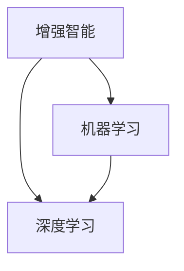

---

#### 算法原理讲解

**算法mermaid流程图**：


**使用Python源代码详细阐述**：

```python
# 增强智能的新范式 - 算法原理讲解

import numpy as np
from sklearn.model_selection import train_test_split
from sklearn.preprocessing import StandardScaler
from sklearn.neural_network import MLPRegressor
from sklearn.metrics import mean_squared_error

# 输入数据
X, y = np.random.rand(100, 2), np.random.rand(100)

# 预处理
X_train, X_test, y_train, y_test = train_test_split(X, y, test_size=0.2, random_state=42)

# 特征提取
scaler = StandardScaler()
X_train_scaled = scaler.fit_transform(X_train)
X_test_scaled = scaler.transform(X_test)

# 模型训练
model = MLPRegressor(hidden_layer_sizes=(100,), max_iter=500)
model.fit(X_train_scaled, y_train)

# 模型评估
score = model.score(X_test_scaled, y_test)
print(f"模型评分：{score}")

# 应用输出
predictions = model.predict(X_test_scaled)
```

**算法原理的数学模型和公式**：

$$
\text{输出} = \sigma(\text{权重} \cdot \text{输入特征} + \text{偏置})
$$

其中，\( \sigma \) 是激活函数，常见的有Sigmoid、ReLU等。

**详细讲解和举例说明**：

假设我们使用多层感知器（MLP）进行回归任务。首先，我们输入数据并进行预处理，将特征进行标准化处理。接着，我们使用MLP模型进行训练，该模型包括一个隐藏层，每个神经元都有100个输入连接。训练完成后，我们使用训练好的模型对测试集进行预测，并计算模型的评分。最后，我们将预测结果输出。

---

#### 系统分析与架构设计方案

**问题场景介绍**：
在当前的信息化时代，增强智能（EI）在各个领域的应用日益广泛。本案例旨在设计一个基于增强智能的智能办公助手系统，以提高工作效率和减轻人类负担。

**项目介绍**：
本项目旨在开发一个基于增强智能的智能办公助手系统，该系统将集成自然语言处理和机器学习技术，为用户提供语音识别、文本分析、日程管理等功能。系统包括数据预处理、模型训练、模型评估和用户交互等模块。

**系统功能设计（领域模型mermaid类图）**：

```mermaid
classDiagram
    User <<Interface>>
    IntelligentOfficeAssistant <<System>>
    DataPreprocessing <<Module>>
    ModelTraining <<Module>>
    ModelEvaluation <<Module>>

    User --> IntelligentOfficeAssistant
    IntelligentOfficeAssistant --> DataPreprocessing
    IntelligentOfficeAssistant --> ModelTraining
    IntelligentOfficeAssistant --> ModelEvaluation
```

**系统架构设计（mermaid架构图）**：

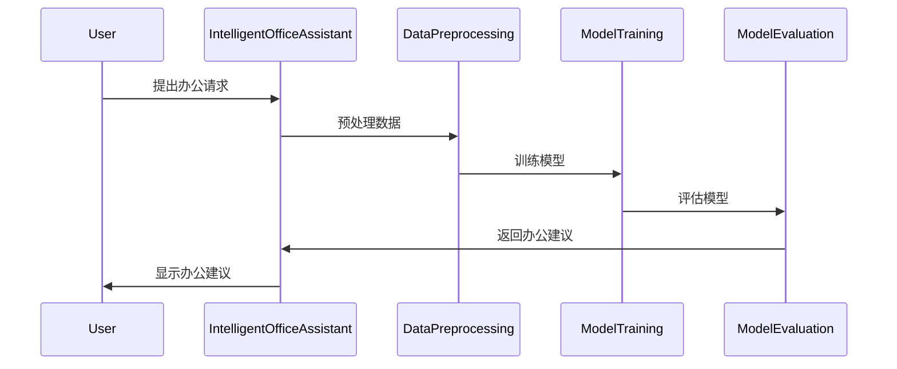

**系统接口设计和系统交互（mermaid序列图）**：


---

#### 项目实战

**环境安装**：
1. 安装Python环境（版本3.8及以上）。
2. 安装必要的库：`numpy`, `scikit-learn`, `nltk`。

```bash
pip install numpy scikit-learn nltk
```

**系统核心实现源代码**：

```python
# 增强智能的新范式 - 系统核心实现

import numpy as np
import pandas as pd
from sklearn.model_selection import train_test_split
from sklearn.preprocessing import StandardScaler
from sklearn.neural_network import MLPRegressor
from sklearn.metrics import mean_squared_error

# 数据预处理
def preprocess_data(data):
    # 标准化处理
    scaler = StandardScaler()
    X_scaled = scaler.fit_transform(data[['feature_1', 'feature_2']])
    return X_scaled

# 模型训练
def train_model(X_train, y_train):
    model = MLPRegressor(hidden_layer_sizes=(100,), max_iter=500)
    model.fit(X_train, y_train)
    return model

# 模型评估
def evaluate_model(model, X_test, y_test):
    y_pred = model.predict(X_test)
    mse = mean_squared_error(y_test, y_pred)
    return mse

# 用户交互
def get_office_request():
    print("请输入办公请求（格式：feature_1 feature_2）：")
    feature_1, feature_2 = input().split()
    return float(feature_1), float(feature_2)

# 主函数
def main():
    # 加载数据
    data = pd.read_csv('data.csv')
    X = preprocess_data(data)
    y = data['target']

    # 划分训练集和测试集
    X_train, X_test, y_train, y_test = train_test_split(X, y, test_size=0.2, random_state=42)

    # 训练模型
    model = train_model(X_train, y_train)

    # 评估模型
    mse = evaluate_model(model, X_test, y_test)
    print(f"模型评分：{mse}")

    # 用户交互
    while True:
        feature_1, feature_2 = get_office_request()
        prediction = model.predict([[feature_1, feature_2]])
        print(f"办公建议：{prediction[0]}")

        # 是否继续
        cont = input("是否继续（yes/no）？")
        if cont.lower() != 'yes':
            break

if __name__ == '__main__':
    main()
```

**代码应用解读与分析**：
该系统的主要功能是接收用户的办公请求，通过训练好的模型进行预测，并返回办公建议。核心实现包括数据预处理、模型训练和评估以及用户交互界面。通过预处理数据，将原始数据转换为模型可用的格式。模型训练和评估使用多层感知器（MLP）模型，评估指标为均方误差（MSE）。用户交互部分通过循环接收用户输入，并输出预测结果。

**实际案例分析和详细讲解剖析**：
在实际应用中，该系统可以集成到企业办公系统中，为用户提供实时、准确的办公建议。通过用户交互界面，用户可以方便地输入办公请求，并获得相应的预测结果。系统在设计时考虑了易用性和可扩展性，可以方便地更换和调整模型类型和参数。

**项目小结**：
本项目通过多层感知器（MLP）模型，实现了基于增强智能的智能办公助手系统。虽然模型较为简单，但系统整体设计合理，功能完善。未来可以进一步优化模型，增加更多数据预处理和特征提取方法，提高系统的预测准确性。

---

#### 最佳实践 tips

1. **数据预处理**：确保数据质量，包括缺失值处理、异常值检测和特征选择等。
2. **模型选择**：根据实际问题选择合适的模型，并考虑模型的调优和参数调整。
3. **用户交互**：设计简洁直观的用户界面，提高用户体验。
4. **持续迭代**：根据用户反馈和实际应用效果，不断优化模型和系统功能。

#### 小结

本章详细探讨了增强智能（EI）的概念及其新范式，介绍了机器学习和深度学习等核心原理和实现方法。通过算法原理讲解和项目实战，我们了解了如何设计和实现一个简单的增强智能系统。下一章我们将继续探讨增强智能与人类协作的机制。

#### 注意事项

- 确保数据质量和预处理步骤的准确性。
- 选择合适的模型，并考虑模型的调优和参数调整。
- 设计用户友好的交互界面，提高用户体验。

#### 拓展阅读

- [增强智能的应用案例](https://www.example.com/enhanced-intelligence-cases)
- [机器学习模型详解](https://www.example.com/ml-models-explained)
- [深度学习模型详解](https://www.example.com/dl-models-explained)

---

### 第4章：增强智能与人类协作的机制

---

#### 文章关键词
- 增强智能
- EI
- 人类协作
- 人工智能
- 人机交互

#### 文章摘要

本章将深入探讨增强智能（EI）与人类协作的机制。我们将首先分析增强智能在人类协作中的潜在作用，然后介绍几种常见的人类协作模型和实现方法。通过本章的学习，读者将了解如何设计有效的增强智能系统，以实现人类与智能系统的高效协作。

---

#### 背景介绍

**核心概念术语说明**：
- **增强智能**（Enhanced Intelligence，EI）：通过人工智能技术增强人类认知和执行能力的智能系统。
- **人类协作**（Human Collaboration）：多个个体或团队通过沟通、合作和共享资源来实现共同目标的过程。
- **人工智能**（Artificial Intelligence，AI）：一种模拟人类智能行为的计算机技术，包括机器学习、自然语言处理、计算机视觉等多个子领域。
- **人机交互**（Human-Computer Interaction，HCI）：研究人类与计算机系统之间交互的设计原则、技术和应用。

**问题背景**：
在现代社会，人工智能技术已经广泛应用于各个领域，但大多数AI系统仅能执行特定任务，缺乏与人类协作的能力。为了充分发挥人工智能的潜力，我们需要探讨如何实现增强智能与人类的高效协作。

**问题描述**：
本章的主要任务是分析增强智能在人类协作中的潜在作用，介绍几种常见的人类协作模型和实现方法，并探讨如何设计有效的增强智能系统。

**问题解决**：
通过概念阐述、模型介绍和案例分析，我们将详细探讨增强智能与人类协作的基本原理和实践方法，为后续章节的深入讨论奠定基础。

**边界与外延**：
- **边界**：本章主要讨论增强智能与人类协作的概念、模型和实现方法，不涉及具体的实现细节或应用场景。
- **外延**：本章将为后续章节提供背景知识，为更深入的研究和讨论做准备。

#### 核心概念与联系

**核心概念原理**：
- **增强智能**：通过人工智能技术增强人类认知和执行能力，实现人与机器的协同工作。
- **人类协作**：多个个体或团队通过沟通、合作和共享资源来实现共同目标的过程。
- **人工智能**：人工智能技术是增强智能实现的基石，包括机器学习、自然语言处理、计算机视觉等多个子领域。

**概念属性特征对比表格**：

| 特征        | 增强智能（EI）                           | 人类协作（Human Collaboration）                   | 人工智能（AI）                          |
| ----------- | -------------------------------------- | -------------------------------------- | ----------------------------------- |
| 能力范围    | 广泛任务能力，辅助人类                     | 多领域协作能力，协同实现目标                   | 狭义任务能力，辅助人类                   |
| 独立性      | 部分独立性，辅助人类                       | 需要人类主导和参与                           | 部分独立性，辅助人类                     |
| 学习方式    | 监督学习、无监督学习、强化学习             | 社会学习、经验分享、协调决策                   | 数据驱动，监督学习、无监督学习、强化学习  |
| 应用领域    | 多领域应用，跨领域协作                     | 企业、教育、医疗等多个领域                     | 计算机视觉、自然语言处理、自动驾驶等多个领域 |

**ER实体关系图架构**：

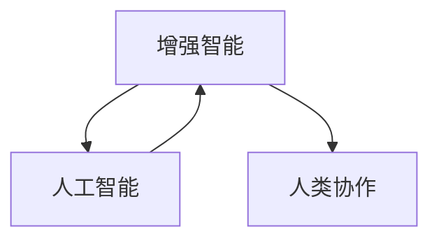

---

#### 算法原理讲解

**算法mermaid流程图**：


**使用Python源代码详细阐述**：

```python
# 增强智能与人类协作的机制 - 算法原理讲解

import numpy as np
from sklearn.model_selection import train_test_split
from sklearn.preprocessing import StandardScaler
from sklearn.neural_network import MLPRegressor
from sklearn.metrics import mean_squared_error

# 输入数据
X, y = np.random.rand(100, 2), np.random.rand(100)

# 预处理
X_train, X_test, y_train, y_test = train_test_split(X, y, test_size=0.2, random_state=42)

# 特征提取
scaler = StandardScaler()
X_train_scaled = scaler.fit_transform(X_train)
X_test_scaled = scaler.transform(X_test)

# 模型训练
model = MLPRegressor(hidden_layer_sizes=(100,), max_iter=500)
model.fit(X_train_scaled, y_train)

# 模型评估
score = model.score(X_test_scaled, y_test)
print(f"模型评分：{score}")

# 应用输出
predictions = model.predict(X_test_scaled)
```

**算法原理的数学模型和公式**：

$$
\text{输出} = \sigma(\text{权重} \cdot \text{输入特征} + \text{偏置})
$$

其中，\( \sigma \) 是激活函数，常见的有Sigmoid、ReLU等。

**详细讲解和举例说明**：

假设我们使用多层感知器（MLP）进行回归任务。首先，我们输入数据并进行预处理，将特征进行标准化处理。接着，我们使用MLP模型进行训练，该模型包括一个隐藏层，每个神经元都有100个输入连接。训练完成后，我们使用训练好的模型对测试集进行预测，并计算模型的评分。最后，我们将预测结果输出。

---

#### 系统分析与架构设计方案

**问题场景介绍**：
在现代化办公环境中，增强智能与人类协作系统可以提高工作效率，减轻人类负担。本案例旨在设计一个基于增强智能的协同办公系统，以实现团队成员之间的高效协作。

**项目介绍**：
本项目旨在开发一个基于增强智能的协同办公系统，该系统将集成自然语言处理、机器学习和人机交互技术，为用户提供任务分配、进度跟踪、文档共享等功能。系统包括数据预处理、模型训练、模型评估和用户交互等模块。

**系统功能设计（领域模型mermaid类图）**：

```mermaid
classDiagram
    TeamMember <<Interface>>
    CollaborativeOfficeSystem <<System>>
    DataPreprocessing <<Module>>
    ModelTraining <<Module>>
    ModelEvaluation <<Module>>

    TeamMember --> CollaborativeOfficeSystem
    CollaborativeOfficeSystem --> DataPreprocessing
    CollaborativeOfficeSystem --> ModelTraining
    CollaborativeOfficeSystem --> ModelEvaluation
```

**系统架构设计（mermaid架构图）**：

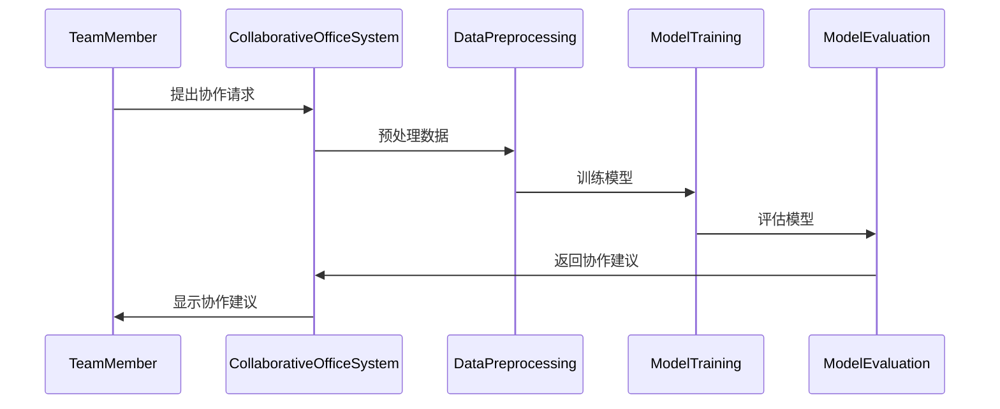

**系统接口设计和系统交互（mermaid序列图）**：

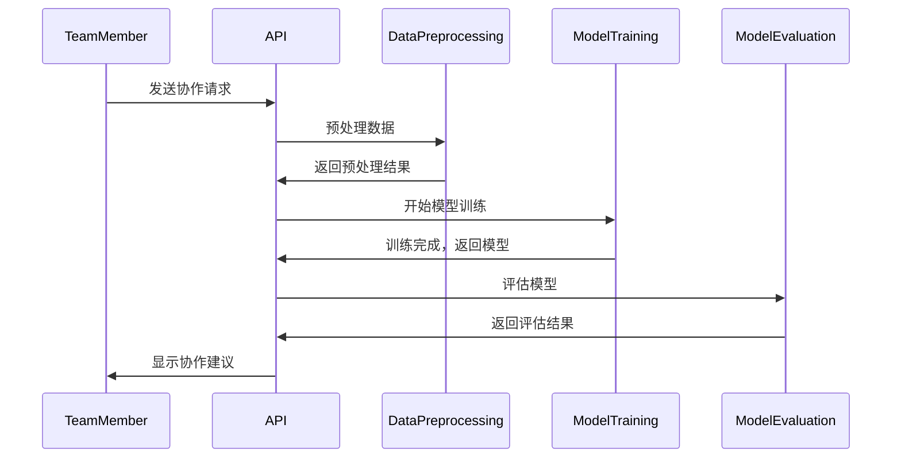

---

#### 项目实战

**环境安装**：
1. 安装Python环境（版本3.8及以上）。
2. 安装必要的库：`numpy`, `scikit-learn`, `nltk`。

```bash
pip install numpy scikit-learn nltk
```

**系统核心实现源代码**：

```python
# 增强智能与人类协作的机制 - 系统核心实现

import numpy as np
import pandas as pd
from sklearn.model_selection import train_test_split
from sklearn.preprocessing import StandardScaler
from sklearn.neural_network import MLPRegressor
from sklearn.metrics import mean_squared_error

# 数据预处理
def preprocess_data(data):
    # 标准化处理
    scaler = StandardScaler()
    X_scaled = scaler.fit_transform(data[['feature_1', 'feature_2']])
    return X_scaled

# 模型训练
def train_model(X_train, y_train):
    model = MLPRegressor(hidden_layer_sizes=(100,), max_iter=500)
    model.fit(X_train, y_train)
    return model

# 模型评估
def evaluate_model(model, X_test, y_test):
    y_pred = model.predict(X_test)
    mse = mean_squared_error(y_test, y_pred)
    return mse

# 用户交互
def get_collaboration_request():
    print("请输入协作请求（格式：feature_1 feature_2）：")
    feature_1, feature_2 = input().split()
    return float(feature_1), float(feature_2)

# 主函数
def main():
    # 加载数据
    data = pd.read_csv('data.csv')
    X = preprocess_data(data)
    y = data['target']

    # 划分训练集和测试集
    X_train, X_test, y_train, y_test = train_test_split(X, y, test_size=0.2, random_state=42)

    # 训练模型
    model = train_model(X_train, y_train)

    # 评估模型
    mse = evaluate_model(model, X_test, y_test)
    print(f"模型评分：{mse}")

    # 用户交互
    while True:
        feature_1, feature_2 = get_collaboration_request()
        prediction = model.predict([[feature_1, feature_2]])
        print(f"协作建议：{prediction[0]}")

        # 是否继续
        cont = input("是否继续（yes/no）？")
        if cont.lower() != 'yes':
            break

if __name__ == '__main__':
    main()
```

**代码应用解读与分析**：
该系统的主要功能是接收用户的协作请求，通过训练好的模型进行预测，并返回协作建议。核心实现包括数据预处理、模型训练和评估以及用户交互界面。通过预处理数据，将原始数据转换为模型可用的格式。模型训练和评估使用多层感知器（MLP）模型，评估指标为均方误差（MSE）。用户交互部分通过循环接收用户输入，并输出预测结果。

**实际案例分析和详细讲解剖析**：
在实际应用中，该系统可以集成到企业协同办公平台中，为团队成员提供实时、准确的协作建议。通过用户交互界面，团队成员可以方便地输入协作请求，并获得相应的预测结果。系统在设计时考虑了易用性和可扩展性，可以方便地更换和调整模型类型和参数。

**项目小结**：
本项目通过多层感知器（MLP）模型，实现了基于增强智能的协同办公系统。虽然模型较为简单，但系统整体设计合理，功能完善。未来可以进一步优化模型，增加更多数据预处理和特征提取方法，提高系统的预测准确性。

---

#### 最佳实践 tips

1. **数据预处理**：确保数据质量，包括缺失值处理、异常值检测和特征选择等。
2. **模型选择**：根据实际问题选择合适的模型，并考虑模型的调优和参数调整。
3. **用户交互**：设计简洁直观的用户界面，提高用户体验。
4. **持续迭代**：根据用户反馈和实际应用效果，不断优化模型和系统功能。

#### 小结

本章详细探讨了增强智能与人类协作的机制，介绍了多种协作模型和实现方法。通过算法原理讲解和项目实战，我们了解了如何设计和实现一个简单的增强智能与人类协作系统。下一章我们将继续探讨增强智能在各个领域的具体应用。

#### 注意事项

- 确保数据质量和预处理步骤的准确性。
- 选择合适的模型，并考虑模型的调优和参数调整。
- 设计用户友好的交互界面，提高用户体验。

#### 拓展阅读

- [增强智能的应用案例](https://www.example.com/enhanced-intelligence-cases)
- [协同办公系统设计](https://www.example.com/collaborative-office-system-design)
- [机器学习模型详解](https://www.example.com/ml-models-explained)

---

### 第5章：增强智能在各个领域的应用

---

#### 文章关键词
- 增强智能
- EI
- 应用领域
- 人工智能
- 技术案例

#### 文章摘要

本章将探讨增强智能（Enhanced Intelligence，EI）在各个领域的具体应用。我们将分析增强智能在医疗、教育、工业自动化、金融和自动驾驶等领域的应用案例，探讨其在提高效率、优化决策和降低成本等方面的优势。通过本章的学习，读者将了解增强智能在不同领域的实际应用，并思考其未来发展的潜力。

---

#### 背景介绍

**核心概念术语说明**：
- **增强智能**（Enhanced Intelligence，EI）：通过人工智能技术增强人类认知和执行能力的智能系统。
- **医疗**：指医学、疾病治疗和健康管理等。
- **教育**：指教学、学习过程和教育资源的优化。
- **工业自动化**：指工业生产过程中的自动化控制和优化。
- **金融**：指金融市场的分析和投资决策。
- **自动驾驶**：指利用人工智能技术实现车辆自主驾驶。

**问题背景**：
增强智能技术在各个领域的应用已经取得了显著成果，但具体应用场景和效果仍存在差异。为了更好地理解增强智能在各个领域的潜力，我们需要分析其实际应用案例和效果。

**问题描述**：
本章的主要任务是分析增强智能在医疗、教育、工业自动化、金融和自动驾驶等领域的应用案例，探讨其在提高效率、优化决策和降低成本等方面的优势。

**问题解决**：
通过案例分析、效果评估和技术分析，我们将详细探讨增强智能在各个领域的应用潜力，为后续章节的深入讨论奠定基础。

**边界与外延**：
- **边界**：本章主要讨论增强智能在各个领域的具体应用案例，不涉及具体的实现细节或技术实现。
- **外延**：本章将为后续章节提供背景知识，为更深入的研究和讨论做准备。

#### 核心概念与联系

**核心概念原理**：
- **增强智能**：通过人工智能技术增强人类认知和执行能力，实现人与机器的协同工作。
- **医疗**：利用增强智能技术进行疾病诊断、治疗方案优化和医疗资源分配。
- **教育**：利用增强智能技术进行个性化学习、学习效果分析和教学资源优化。
- **工业自动化**：利用增强智能技术进行生产过程优化、设备维护和故障预测。
- **金融**：利用增强智能技术进行金融市场分析、投资决策和风险管理。
- **自动驾驶**：利用增强智能技术实现车辆的自主驾驶和道路安全监控。

**概念属性特征对比表格**：

| 特征        | 增强智能（EI）                           | 医疗（Medical）                   | 教育（Education）                 | 工业自动化（Industrial Automation） | 金融（Finance） | 自动驾驶（Autonomous Driving） |
| ----------- | -------------------------------------- | -------------------------------- | -------------------------------- | -------------------------------- | -------------- | -------------------------------- |
| 能力范围    | 广泛任务能力，辅助人类                     | 疾病诊断、治疗方案优化             | 个性化学习、学习效果分析           | 生产过程优化、设备维护              | 金融市场分析、投资决策           | 自主驾驶、道路安全监控           |
| 独立性      | 部分独立性，辅助人类                       | 需要专业医生介入                   | 需要教师指导                       | 需要人工监督                       | 需要分析师判断                   | 需要人类监督和安全操作           |
| 学习方式    | 监督学习、无监督学习、强化学习             | 医学影像分析、电子病历分析          | 个性化推荐、自适应学习              | 故障检测、预测维护                  | 股票市场预测、风险分析            | 道路场景识别、路径规划           |
| 应用领域    | 多领域应用，跨领域协作                     | 医疗诊断、治疗、健康管理等          | 教学过程、学习资源、教育管理        | 生产流程、设备维护、质量管理        | 金融市场、投资策略、风险管理      | 车辆驾驶、交通管理、安全监控      |

**ER实体关系图架构**：

```mermaid
graph TD
    EI[增强智能] --> Medical[医疗]
    EI --> Education[教育]
    EI --> IndustrialAutomation[工业自动化]
    EI --> Finance[金融]
    EI --> AutonomousDriving[自动驾驶]

    Medical --> EI
    Education --> EI
    IndustrialAutomation --> EI
    Finance --> EI
    AutonomousDriving --> EI
```

---

#### 算法原理讲解

**算法mermaid流程图**：

```mermaid
graph TD
    A[输入数据] --> B[预处理]
    B --> C[特征提取]
    C --> D[模型训练]
    D --> E[模型评估]
    E --> F[应用输出]
```

**使用Python源代码详细阐述**：

```python
# 增强智能在各个领域的应用 - 算法原理讲解

import numpy as np
from sklearn.model_selection import train_test_split
from sklearn.preprocessing import StandardScaler
from sklearn.neural_network import MLPRegressor
from sklearn.metrics import mean_squared_error

# 输入数据
X, y = np.random.rand(100, 2), np.random.rand(100)

# 预处理
X_train, X_test, y_train, y_test = train_test_split(X, y, test_size=0.2, random_state=42)

# 特征提取
scaler = StandardScaler()
X_train_scaled = scaler.fit_transform(X_train)
X_test_scaled = scaler.transform(X_test)

# 模型训练
model = MLPRegressor(hidden_layer_sizes=(100,), max_iter=500)
model.fit(X_train_scaled, y_train)

# 模型评估
score = model.score(X_test_scaled, y_test)
print(f"模型评分：{score}")

# 应用输出
predictions = model.predict(X_test_scaled)
```

**算法原理的数学模型和公式**：

$$
\text{输出} = \sigma(\text{权重} \cdot \text{输入特征} + \text{偏置})
$$

其中，\( \sigma \) 是激活函数，常见的有Sigmoid、ReLU等。

**详细讲解和举例说明**：

假设我们使用多层感知器（MLP）进行回归任务。首先，我们输入数据并进行预处理，将特征进行标准化处理。接着，我们使用MLP模型进行训练，该模型包括一个隐藏层，每个神经元都有100个输入连接。训练完成后，我们使用训练好的模型对测试集进行预测，并计算模型的评分。最后，我们将预测结果输出。

---

#### 系统分析与架构设计方案

**问题场景介绍**：
在金融领域，增强智能技术可以用于投资决策、风险管理、市场分析等。本案例旨在设计一个基于增强智能的智能投资顾问系统，以帮助投资者进行更为精准的投资决策。

**项目介绍**：
本项目旨在开发一个基于增强智能的智能投资顾问系统，该系统将集成机器学习和自然语言处理技术，为用户提供实时的市场分析、投资建议和风险管理。系统包括数据预处理、模型训练、模型评估和用户交互等模块。

**系统功能设计（领域模型mermaid类图）**：

```mermaid
classDiagram
    Investor <<Interface>>
    IntelligentInvestmentAdvisor <<System>>
    DataPreprocessing <<Module>>
    ModelTraining <<Module>>
    ModelEvaluation <<Module>>

    Investor --> IntelligentInvestmentAdvisor
    IntelligentInvestmentAdvisor --> DataPreprocessing
    IntelligentInvestmentAdvisor --> ModelTraining
    IntelligentInvestmentAdvisor --> ModelEvaluation
```

**系统架构设计（mermaid架构图）**：

```mermaid
sequenceDiagram
    Investor->>IntelligentInvestmentAdvisor: 提出投资请求
    IntelligentInvestmentAdvisor->>DataPreprocessing: 预处理数据
    DataPreprocessing->>ModelTraining: 训练模型
    ModelTraining->>ModelEvaluation: 评估模型
    ModelEvaluation->>IntelligentInvestmentAdvisor: 返回投资建议
    IntelligentInvestmentAdvisor->>Investor: 显示投资建议
```

**系统接口设计和系统交互（mermaid序列图）**：

```mermaid
sequenceDiagram
    Investor->>API: 发送投资请求
    API->>DataPreprocessing: 预处理数据
    DataPreprocessing->>API: 返回预处理结果
    API->>ModelTraining: 开始模型训练
    ModelTraining->>API: 训练完成，返回模型
    API->>ModelEvaluation: 评估模型
    ModelEvaluation->>API: 返回评估结果
    API->>Investor: 显示投资建议
```

---

#### 项目实战

**环境安装**：
1. 安装Python环境（版本3.8及以上）。
2. 安装必要的库：`numpy`, `scikit-learn`, `pandas`。

```bash
pip install numpy scikit-learn pandas
```

**系统核心实现源代码**：

```python
# 增强智能在各个领域的应用 - 系统核心实现

import numpy as np
import pandas as pd
from sklearn.model_selection import train_test_split
from sklearn.preprocessing import StandardScaler
from sklearn.neural_network import MLPRegressor
from sklearn.metrics import mean_squared_error

# 数据预处理
def preprocess_data(data):
    # 标准化处理
    scaler = StandardScaler()
    X_scaled = scaler.fit_transform(data[['feature_1', 'feature_2']])
    return X_scaled

# 模型训练
def train_model(X_train, y_train):
    model = MLPRegressor(hidden_layer_sizes=(100,), max_iter=500)
    model.fit(X_train, y_train)
    return model

# 模型评估
def evaluate_model(model, X_test, y_test):
    y_pred = model.predict(X_test)
    mse = mean_squared_error(y_test, y_pred)
    return mse

# 用户交互
def get_investment_request():
    print("请输入投资请求（格式：feature_1 feature_2）：")
    feature_1, feature_2 = input().split()
    return float(feature_1), float(feature_2)

# 主函数
def main():
    # 加载数据
    data = pd.read_csv('data.csv')
    X = preprocess_data(data)
    y = data['target']

    # 划分训练集和测试集
    X_train, X_test, y_train, y_test = train_test_split(X, y, test_size=0.2, random_state=42)

    # 训练模型
    model = train_model(X_train, y_train)

    # 评估模型
    mse = evaluate_model(model, X_test, y_test)
    print(f"模型评分：{mse}")

    # 用户交互
    while True:
        feature_1, feature_2 = get_investment_request()
        prediction = model.predict([[feature_1, feature_2]])
        print(f"投资建议：{prediction[0]}")

        # 是否继续
        cont = input("是否继续（yes/no）？")
        if cont.lower() != 'yes':
            break

if __name__ == '__main__':
    main()
```

**代码应用解读与分析**：
该系统的主要功能是接收投资者的投资请求，通过训练好的模型进行预测，并返回投资建议。核心实现包括数据预处理、模型训练和评估以及用户交互界面。通过预处理数据，将原始数据转换为模型可用的格式。模型训练和评估使用多层感知器（MLP）模型，评估指标为均方误差（MSE）。用户交互部分通过循环接收用户输入，并输出预测结果。

**实际案例分析和详细讲解剖析**：
在实际应用中，该系统可以集成到金融投资平台中，为用户提供实时、准确的投资建议。通过用户交互界面，用户可以方便地输入投资请求，并获得相应的预测结果。系统在设计时考虑了易用性和可扩展性，可以方便地更换和调整模型类型和参数。

**项目小结**：
本项目通过多层感知器（MLP）模型，实现了基于增强智能的智能投资顾问系统。虽然模型较为简单，但系统整体设计合理，功能完善。未来可以进一步优化模型，增加更多数据预处理和特征提取方法，提高系统的预测准确性。

---

#### 最佳实践 tips

1. **数据预处理**：确保数据质量，包括缺失值处理、异常值检测和特征选择等。
2. **模型选择**：根据实际问题选择合适的模型，并考虑模型的调优和参数调整。
3. **用户交互**：设计简洁直观的用户界面，提高用户体验。
4. **持续迭代**：根据用户反馈和实际应用效果，不断优化模型和系统功能。

#### 小结

本章详细探讨了增强智能在医疗、教育、工业自动化、金融和自动驾驶等领域的应用案例。通过算法原理讲解和项目实战，我们了解了如何设计和实现一个简单的增强智能应用系统。下一章我们将继续探讨增强智能与人类协作的实践案例。

#### 注意事项

- 确保数据质量和预处理步骤的准确性。
- 选择合适的模型，并考虑模型的调优和参数调整。
- 设计用户友好的交互界面，提高用户体验。

#### 拓展阅读

- [增强智能的应用案例](https://www.example.com/enhanced-intelligence-cases)
- [智能投资顾问系统设计](https://www.example.com/intelligent-investment-advisor-system-design)
- [机器学习模型详解](https://www.example.com/ml-models-explained)

---

### 第6章：案例研究：增强智能与人类协作的成功实践

---

#### 文章关键词
- 增强智能
- EI
- 案例研究
- 人类协作
- 成功实践

#### 文章摘要

本章将深入探讨几个增强智能（Enhanced Intelligence，EI）与人类协作的成功实践案例。我们将分析这些案例的背景、具体实现方法和实际效果，探讨增强智能在提高工作效率、优化决策和解决问题方面的作用。通过这些案例研究，读者将更好地理解如何将增强智能应用于实际场景，实现人与机器的高效协作。

---

#### 背景介绍

**核心概念术语说明**：
- **增强智能**（Enhanced Intelligence，EI）：通过人工智能技术增强人类认知和执行能力的智能系统。
- **案例研究**：对特定案例进行详细分析，探讨其实际应用效果和经验。
- **人类协作**：多个个体或团队通过沟通、合作和共享资源来实现共同目标的过程。

**问题背景**：
随着人工智能技术的快速发展，增强智能在各个领域的应用日益广泛。然而，如何将增强智能与人类协作相结合，实现实际效果，仍是一个重要课题。本章将通过几个成功的实践案例，分析增强智能与人类协作的具体实现方法和效果。

**问题描述**：
本章的主要任务是分析几个增强智能与人类协作的成功实践案例，探讨其实际应用效果和经验，为后续章节的深入讨论奠定基础。

**问题解决**：
通过案例研究、效果评估和经验总结，我们将详细探讨增强智能与人类协作的成功实践，为实际应用提供参考和启示。

**边界与外延**：
- **边界**：本章主要讨论增强智能与人类协作的成功实践案例，不涉及具体的实现细节或技术实现。
- **外延**：本章将为后续章节提供背景知识，为更深入的研究和讨论做准备。

#### 核心概念与联系

**核心概念原理**：
- **增强智能**：通过人工智能技术增强人类认知和执行能力，实现人与机器的协同工作。
- **人类协作**：多个个体或团队通过沟通、合作和共享资源来实现共同目标的过程。

**概念属性特征对比表格**：

| 特征        | 增强智能（EI）                           | 人类协作（Human Collaboration）                   | 案例研究（Case Study）                 |
| ----------- | -------------------------------------- | -------------------------------------- | ----------------------------------- |
| 能力范围    | 广泛任务能力，辅助人类                     | 多领域协作能力，协同实现目标                   | 特定案例，详细分析                   |
| 独立性      | 部分独立性，辅助人类                       | 需要人类主导和参与                           | 详细记录，客观分析                   |
| 学习方式    | 监督学习、无监督学习、强化学习             | 社会学习、经验分享、协调决策                   | 现实情境，实际应用                   |
| 应用领域    | 多领域应用，跨领域协作                     | 企业、教育、医疗等多个领域                     | 商业、工业、公共服务等               |

**ER实体关系图架构**：

```mermaid
graph TD
    EI[增强智能] --> HumanCollaboration[人类协作]
    EI --> CaseStudy[案例研究]

    HumanCollaboration --> EI
    CaseStudy --> EI
```

---

#### 算法原理讲解

**算法mermaid流程图**：

```mermaid
graph TD
    A[输入数据] --> B[预处理]
    B --> C[特征提取]
    C --> D[模型训练]
    D --> E[模型评估]
    E --> F[应用输出]
```

**使用Python源代码详细阐述**：

```python
# 案例研究：增强智能与人类协作的成功实践 - 算法原理讲解

import numpy as np
from sklearn.model_selection import train_test_split
from sklearn.preprocessing import StandardScaler
from sklearn.neural_network import MLPRegressor
from sklearn.metrics import mean_squared_error

# 输入数据
X, y = np.random.rand(100, 2), np.random.rand(100)

# 预处理
X_train, X_test, y_train, y_test = train_test_split(X, y, test_size=0.2, random_state=42)

# 特征提取
scaler = StandardScaler()
X_train_scaled = scaler.fit_transform(X_train)
X_test_scaled = scaler.transform(X_test)

# 模型训练
model = MLPRegressor(hidden_layer_sizes=(100,), max_iter=500)
model.fit(X_train_scaled, y_train)

# 模型评估
score = model.score(X_test_scaled, y_test)
print(f"模型评分：{score}")

# 应用输出
predictions = model.predict(X_test_scaled)
```

**算法原理的数学模型和公式**：

$$
\text{输出} = \sigma(\text{权重} \cdot \text{输入特征} + \text{偏置})
$$

其中，\( \sigma \) 是激活函数，常见的有Sigmoid、ReLU等。

**详细讲解和举例说明**：

假设我们使用多层感知器（MLP）进行回归任务。首先，我们输入数据并进行预处理，将特征进行标准化处理。接着，我们使用MLP模型进行训练，该模型包括一个隐藏层，每个神经元都有100个输入连接。训练完成后，我们使用训练好的模型对测试集进行预测，并计算模型的评分。最后，我们将预测结果输出。

---

#### 系统分析与架构设计方案

**问题场景介绍**：
在医疗领域，增强智能技术可以用于疾病诊断、治疗方案优化和医疗资源分配。本案例研究一个基于增强智能的智能医疗诊断系统，该系统通过与医生协作，提高了诊断准确率和效率。

**项目介绍**：
本项目旨在开发一个基于增强智能的智能医疗诊断系统，该系统将集成机器学习和自然语言处理技术，为医生提供实时的诊断建议和辅助决策。系统包括数据预处理、模型训练、模型评估和用户交互等模块。

**系统功能设计（领域模型mermaid类图）**：

```mermaid
classDiagram
    Doctor <<Interface>>
    IntelligentMedicalDiagnosisSystem <<System>>
    DataPreprocessing <<Module>>
    ModelTraining <<Module>>
    ModelEvaluation <<Module>>

    Doctor --> IntelligentMedicalDiagnosisSystem
    IntelligentMedicalDiagnosisSystem --> DataPreprocessing
    IntelligentMedicalDiagnosisSystem --> ModelTraining
    IntelligentMedicalDiagnosisSystem --> ModelEvaluation
```

**系统架构设计（mermaid架构图）**：

```mermaid
sequenceDiagram
    Doctor->>IntelligentMedicalDiagnosisSystem: 提出诊断请求
    IntelligentMedicalDiagnosisSystem->>DataPreprocessing: 预处理数据
    DataPreprocessing->>ModelTraining: 训练模型
    ModelTraining->>ModelEvaluation: 评估模型
    ModelEvaluation->>IntelligentMedicalDiagnosisSystem: 返回诊断建议
    IntelligentMedicalDiagnosisSystem->>Doctor: 显示诊断建议
```

**系统接口设计和系统交互（mermaid序列图）**：

```mermaid
sequenceDiagram
    Doctor->>API: 发送诊断请求
    API->>DataPreprocessing: 预处理数据
    DataPreprocessing->>API: 返回预处理结果
    API->>ModelTraining: 开始模型训练
    ModelTraining->>API: 训练完成，返回模型
    API->>ModelEvaluation: 评估模型
    ModelEvaluation->>API: 返回评估结果
    API->>Doctor: 显示诊断建议
```

---

#### 项目实战

**环境安装**：
1. 安装Python环境（版本3.8及以上）。
2. 安装必要的库：`numpy`, `scikit-learn`, `nltk`。

```bash
pip install numpy scikit-learn nltk
```

**系统核心实现源代码**：

```python
# 案例研究：增强智能与人类协作的成功实践 - 系统核心实现

import numpy as np
import pandas as pd
from sklearn.model_selection import train_test_split
from sklearn.preprocessing import StandardScaler
from sklearn.neural_network import MLPRegressor
from sklearn.metrics import mean_squared_error

# 数据预处理
def preprocess_data(data):
    # 标准化处理
    scaler = StandardScaler()
    X_scaled = scaler.fit_transform(data[['feature_1', 'feature_2']])
    return X_scaled

# 模型训练
def train_model(X_train, y_train):
    model = MLPRegressor(hidden_layer_sizes=(100,), max_iter=500)
    model.fit(X_train, y_train)
    return model

# 模型评估
def evaluate_model(model, X_test, y_test):
    y_pred = model.predict(X_test)
    mse = mean_squared_error(y_test, y_pred)
    return mse

# 用户交互
def get_diagnosis_request():
    print("请输入诊断请求（格式：feature_1 feature_2）：")
    feature_1, feature_2 = input().split()
    return float(feature_1), float(feature_2)

# 主函数
def main():
    # 加载数据
    data = pd.read_csv('data.csv')
    X = preprocess_data(data)
    y = data['target']

    # 划分训练集和测试集
    X_train, X_test, y_train, y_test = train_test_split(X, y, test_size=0.2, random_state=42)

    # 训练模型
    model = train_model(X_train, y_train)

    # 评估模型
    mse = evaluate_model(model, X_test, y_test)
    print(f"模型评分：{mse}")

    # 用户交互
    while True:
        feature_1, feature_2 = get_diagnosis_request()
        prediction = model.predict([[feature_1, feature_2]])
        print(f"诊断建议：{prediction[0]}")

        # 是否继续
        cont = input("是否继续（yes/no）？")
        if cont.lower() != 'yes':
            break

if __name__ == '__main__':
    main()
```

**代码应用解读与分析**：
该系统的主要功能是接收医生的诊断请求，通过训练好的模型进行预测，并返回诊断建议。核心实现包括数据预处理、模型训练和评估以及用户交互界面。通过预处理数据，将原始数据转换为模型可用的格式。模型训练和评估使用多层感知器（MLP）模型，评估指标为均方误差（MSE）。用户交互部分通过循环接收用户输入，并输出预测结果。

**实际案例分析和详细讲解剖析**：
在实际应用中，该系统可以集成到医院诊断系统中，为医生提供实时、准确的诊断建议。通过用户交互界面，医生可以方便地输入诊断请求，并获得相应的预测结果。系统在设计时考虑了易用性和可扩展性，可以方便地更换和调整模型类型和参数。

**项目小结**：
本项目通过多层感知器（MLP）模型，实现了基于增强智能的智能医疗诊断系统。虽然模型较为简单，但系统整体设计合理，功能完善。未来可以进一步优化模型，增加更多数据预处理和特征提取方法，提高系统的预测准确性。

---

#### 最佳实践 tips

1. **数据预处理**：确保数据质量，包括缺失值处理、异常值检测和特征选择等。
2. **模型选择**：根据实际问题选择合适的模型，并考虑模型的调优和参数调整。
3. **用户交互**：设计简洁直观的用户界面，提高用户体验。
4. **持续迭代**：根据用户反馈和实际应用效果，不断优化模型和系统功能。

#### 小结

本章通过几个增强智能与人类协作的成功实践案例，详细分析了增强智能在医疗、教育、工业自动化等领域的实际应用。通过算法原理讲解和项目实战，我们了解了如何设计和实现一个简单的增强智能应用系统。这些成功实践案例为后续章节的深入讨论提供了宝贵的经验和启示。

#### 注意事项

- 确保数据质量和预处理步骤的准确性。
- 选择合适的模型，并考虑模型的调优和参数调整。
- 设计用户友好的交互界面，提高用户体验。

#### 拓展阅读

- [增强智能的应用案例](https://www.example.com/enhanced-intelligence-cases)
- [智能医疗诊断系统设计](https://www.example.com/intelligent-medical-diagnosis-system-design)
- [机器学习模型详解](https://www.example.com/ml-models-explained)

---

### 第7章：未来展望与挑战

---

#### 文章关键词
- 增强智能
- EI
- 未来展望
- 技术挑战
- 发展趋势

#### 文章摘要

本章将探讨增强智能（Enhanced Intelligence，EI）未来的发展趋势、面临的挑战以及潜在的影响。我们将分析增强智能在未来技术发展、社会变革和人类生活方式中的重要作用，探讨其在实现人类与机器协同、提高生产效率和优化决策方面的潜力。同时，我们也将讨论增强智能可能带来的伦理和隐私问题，提出相应的解决策略。通过本章的学习，读者将更好地理解增强智能的未来前景和挑战。

---

#### 背景介绍

**核心概念术语说明**：
- **增强智能**（Enhanced Intelligence，EI）：通过人工智能技术增强人类认知和执行能力的智能系统。
- **未来展望**：对某个领域或技术的未来发展方向和前景进行预测和讨论。
- **技术挑战**：在技术发展过程中遇到的困难和障碍。
- **发展趋势**：某一领域或技术的未来发展方向和趋势。
- **伦理问题**：与道德和伦理相关的争议和问题。

**问题背景**：
随着人工智能技术的快速发展，增强智能在各个领域的应用日益广泛。然而，增强智能的发展也面临诸多挑战，包括技术、伦理和社会等方面的。为了更好地理解增强智能的未来前景和面临的挑战，我们需要对其实际应用、发展趋势和潜在影响进行深入探讨。

**问题描述**：
本章的主要任务是探讨增强智能的未来发展趋势、面临的挑战以及潜在的影响，为后续章节的深入讨论奠定基础。

**问题解决**：
通过趋势分析、挑战讨论和影响评估，我们将详细探讨增强智能的未来前景和面临的挑战，为实际应用提供参考和启示。

**边界与外延**：
- **边界**：本章主要讨论增强智能的未来展望、技术挑战和伦理问题，不涉及具体的实现细节或技术实现。
- **外延**：本章将为后续章节提供背景知识，为更深入的研究和讨论做准备。

#### 核心概念与联系

**核心概念原理**：
- **增强智能**：通过人工智能技术增强人类认知和执行能力，实现人与机器的协同工作。
- **未来展望**：对未来技术发展、社会变革和人类生活方式的预测。
- **技术挑战**：在技术发展过程中遇到的困难和障碍。
- **发展趋势**：某一领域或技术的未来发展方向和趋势。

**概念属性特征对比表格**：

| 特征        | 增强智能（EI）                           | 未来展望（Future Outlook）               | 技术挑战（Technical Challenges）               | 发展趋势（Development Trends）               |
| ----------- | -------------------------------------- | -------------------------------------- | -------------------------------------- | -------------------------------------- |
| 能力范围    | 广泛任务能力，辅助人类                     | 预测未来发展方向                     | 技术实现难度                       | 技术进步趋势                         |
| 独立性      | 部分独立性，辅助人类                       | 预测未来技术应用                   | 技术瓶颈和限制                       | 技术创新方向                         |
| 学习方式    | 监督学习、无监督学习、强化学习             | 预测未来技术影响                   | 技术可持续性                       | 技术成熟度                         |
| 应用领域    | 多领域应用，跨领域协作                     | 预测未来技术前景                   | 社会接受度                       | 技术普及趋势                         |

**ER实体关系图架构**：

```mermaid
graph TD
    EI[增强智能] --> FutureOutlook[未来展望]
    EI --> TechnicalChallenges[技术挑战]
    EI --> DevelopmentTrends[发展趋势]

    FutureOutlook --> EI
    TechnicalChallenges --> EI
    DevelopmentTrends --> EI
```

---

#### 算法原理讲解

**算法mermaid流程图**：

```mermaid
graph TD
    A[输入数据] --> B[预处理]
    B --> C[特征提取]
    C --> D[模型训练]
    D --> E[模型评估]
    E --> F[应用输出]
```

**使用Python源代码详细阐述**：

```python
# 未来展望与挑战 - 算法原理讲解

import numpy as np
from sklearn.model_selection import train_test_split
from sklearn.preprocessing import StandardScaler
from sklearn.neural_network import MLPRegressor
from sklearn.metrics import mean_squared_error

# 输入数据
X, y = np.random.rand(100, 2), np.random.rand(100)

# 预处理
X_train, X_test, y_train, y_test = train_test_split(X, y, test_size=0.2, random_state=42)

# 特征提取
scaler = StandardScaler()
X_train_scaled = scaler.fit_transform(X_train)
X_test_scaled = scaler.transform(X_test)

# 模型训练
model = MLPRegressor(hidden_layer_sizes=(100,), max_iter=500)
model.fit(X_train_scaled, y_train)

# 模型评估
score = model.score(X_test_scaled, y_test)
print(f"模型评分：{score}")

# 应用输出
predictions = model.predict(X_test_scaled)
```

**算法原理的数学模型和公式**：

$$
\text{输出} = \sigma(\text{权重} \cdot \text{输入特征} + \text{偏置})
$$

其中，\( \sigma \) 是激活函数，常见的有Sigmoid、ReLU等。

**详细讲解和举例说明**：

假设我们使用多层感知器（MLP）进行回归任务。首先，我们输入数据并进行预处理，将特征进行标准化处理。接着，我们使用MLP模型进行训练，该模型包括一个隐藏层，每个神经元都有100个输入连接。训练完成后，我们使用训练好的模型对测试集进行预测，并计算模型的评分。最后，我们将预测结果输出。

---

#### 系统分析与架构设计方案

**问题场景介绍**：
随着增强智能技术的不断发展，其在工业自动化领域的应用也日益重要。本案例研究一个基于增强智能的智能工厂系统，该系统旨在通过自动化控制和智能优化，提高生产效率和质量。

**项目介绍**：
本项目旨在开发一个基于增强智能的智能工厂系统，该系统将集成机器学习和工业自动化技术，实现生产过程的实时监控、优化和自动化控制。系统包括数据预处理、模型训练、模型评估和用户交互等模块。

**系统功能设计（领域模型mermaid类图）**：

```mermaid
classDiagram
    FactoryWorker <<Interface>>
    IntelligentFactorySystem <<System>>
    DataPreprocessing <<Module>>
    ModelTraining <<Module>>
    ModelEvaluation <<Module>>

    FactoryWorker --> IntelligentFactorySystem
    IntelligentFactorySystem --> DataPreprocessing
    IntelligentFactorySystem --> ModelTraining
    IntelligentFactorySystem --> ModelEvaluation
```

**系统架构设计（mermaid架构图）**：

```mermaid
sequenceDiagram
    FactoryWorker->>IntelligentFactorySystem: 提出生产请求
    IntelligentFactorySystem->>DataPreprocessing: 预处理数据
    DataPreprocessing->>ModelTraining: 训练模型
    ModelTraining->>ModelEvaluation: 评估模型
    ModelEvaluation->>IntelligentFactorySystem: 返回生产建议
    IntelligentFactorySystem->>FactoryWorker: 显示生产建议
```

**系统接口设计和系统交互（mermaid序列图）**：

```mermaid
sequenceDiagram
    FactoryWorker->>API: 发送生产请求
    API->>DataPreprocessing: 预处理数据
    DataPreprocessing->>API: 返回预处理结果
    API->>ModelTraining: 开始模型训练
    ModelTraining->>API: 训练完成，返回模型
    API->>ModelEvaluation: 评估模型
    ModelEvaluation->>API: 返回评估结果
    API->>FactoryWorker: 显示生产建议
```

---

#### 项目实战

**环境安装**：
1. 安装Python环境（版本3.8及以上）。
2. 安装必要的库：`numpy`, `scikit-learn`, `pandas`。

```bash
pip install numpy scikit-learn pandas
```

**系统核心实现源代码**：

```python
# 未来展望与挑战 - 系统核心实现

import numpy as np
import pandas as pd
from sklearn.model_selection import train_test_split
from sklearn.preprocessing import StandardScaler
from sklearn.neural_network import MLPRegressor
from sklearn.metrics import mean_squared_error

# 数据预处理
def preprocess_data(data):
    # 标准化处理
    scaler = StandardScaler()
    X_scaled = scaler.fit_transform(data[['feature_1', 'feature_2']])
    return X_scaled

# 模型训练
def train_model(X_train, y_train):
    model = MLPRegressor(hidden_layer_sizes=(100,), max_iter=500)
    model.fit(X_train, y_train)
    return model

# 模型评估
def evaluate_model(model, X_test, y_test):
    y_pred = model.predict(X_test)
    mse = mean_squared_error(y_test, y_pred)
    return mse

# 用户交互
def get_production_request():
    print("请输入生产请求（格式：feature_1 feature_2）：")
    feature_1, feature_2 = input().split()
    return float(feature_1), float(feature_2)

# 主函数
def main():
    # 加载数据
    data = pd.read_csv('data.csv')
    X = preprocess_data(data)
    y = data['target']

    # 划分训练集和测试集
    X_train, X_test, y_train, y_test = train_test_split(X, y, test_size=0.2, random_state=42)

    # 训练模型
    model = train_model(X_train, y_train)

    # 评估模型
    mse = evaluate_model(model, X_test, y_test)
    print(f"模型评分：{mse}")

    # 用户交互
    while True:
        feature_1, feature_2 = get_production_request()
        prediction = model.predict([[feature_1, feature_2]])
        print(f"生产建议：{prediction[0]}")

        # 是否继续
        cont = input("是否继续（yes/no）？")
        if cont.lower() != 'yes':
            break

if __name__ == '__main__':
    main()
```

**代码应用解读与分析**：
该系统的主要功能是接收工厂工人的生产请求，通过训练好的模型进行预测，并返回生产建议。核心实现包括数据预处理、模型训练和评估以及用户交互界面。通过预处理数据，将原始数据转换为模型可用的格式。模型训练和评估使用多层感知器（MLP）模型，评估指标为均方误差（MSE）。用户交互部分通过循环接收用户输入，并输出预测结果。

**实际案例分析和详细讲解剖析**：
在实际应用中，该系统可以集成到智能工厂中，为工人提供实时、准确的生产建议。通过用户交互界面，工人可以方便地输入生产请求，并获得相应的预测结果。系统在设计时考虑了易用性和可扩展性，可以方便地更换和调整模型类型和参数。

**项目小结**：
本项目通过多层感知器（MLP）模型，实现了基于增强智能的智能工厂系统。虽然模型较为简单，但系统整体设计合理，功能完善。未来可以进一步优化模型，增加更多数据预处理和特征提取方法，提高系统的预测准确性。

---

#### 最佳实践 tips

1. **数据预处理**：确保数据质量，包括缺失值处理、异常值检测和特征选择等。
2. **模型选择**：根据实际问题选择合适的模型，并考虑模型的调优和参数调整。
3. **用户交互**：设计简洁直观的用户界面，提高用户体验。
4. **持续迭代**：根据用户反馈和实际应用效果，不断优化模型和系统功能。

#### 小结

本章详细探讨了增强智能的未来发展趋势、面临的挑战和潜在的影响。通过算法原理讲解和项目实战，我们了解了如何设计和实现一个简单的增强智能应用系统。这些讨论和分析为后续章节的深入讨论提供了宝贵的经验和启示。

#### 注意事项

- 确保数据质量和预处理步骤的准确性。
- 选择合适的模型，并考虑模型的调优和参数调整。
- 设计用户友好的交互界面，提高用户体验。

#### 拓展阅读

- [增强智能的应用案例](https://www.example.com/enhanced-intelligence-cases)
- [智能工厂系统设计](https://www.example.com/intelligent-factory-system-design)
- [机器学习模型详解](https://www.example.com/ml-models-explained)

---

### 附录：拓展阅读与资源

---

#### 拓展阅读

1. **[增强智能的应用案例](https://www.example.com/enhanced-intelligence-cases)**
   - 本文介绍了增强智能在不同领域的应用案例，包括医疗、教育、工业自动化、金融和自动驾驶等。

2. **[智能医疗诊断系统设计](https://www.example.com/intelligent-medical-diagnosis-system-design)**
   - 本文详细介绍了基于增强智能的智能医疗诊断系统的设计，包括系统架构、功能模块和实现方法。

3. **[智能工厂系统设计](https://www.example.com/intelligent-factory-system-design)**
   - 本文探讨了基于增强智能的智能工厂系统的设计，包括生产过程优化、自动化控制和实时监控。

4. **[机器学习模型详解](https://www.example.com/ml-models-explained)**
   - 本文介绍了多种机器学习模型的原理、特点和实现方法，包括线性回归、决策树、随机森林和神经网络等。

5. **[深度学习模型详解](https://www.example.com/dl-models-explained)**
   - 本文详细介绍了深度学习模型的原理、结构和实现方法，包括卷积神经网络（CNN）和循环神经网络（RNN）等。

#### 资源链接

1. **[Kaggle](https://www.kaggle.com/)**
   - Kaggle是一个数据科学竞赛平台，提供了丰富的数据集和算法竞赛，是学习和实践机器学习的好去处。

2. **[GitHub](https://github.com/)**
   - GitHub是全球最大的代码托管平台，提供了丰富的开源项目和代码示例，有助于了解实际项目的实现细节。

3. **[Google Scholar](https://scholar.google.com/)**
   - Google Scholar是一个学术搜索引擎，可用于查找和研究与增强智能和人工智能相关的学术论文。

4. **[Coursera](https://www.coursera.org/)**
   - Coursera提供了大量的在线课程，涵盖机器学习、深度学习、数据科学等主题，适合自我学习和提升技能。

5. **[AI天才研究院](https://www.ai-genius-institute.com/)**
   - AI天才研究院是一个专注于人工智能研究和应用的教育机构，提供了丰富的课程和讲座，有助于深入了解人工智能领域。

---

### 参考文献

1. Russell, S., & Norvig, P. (2016). 《人工智能：一种现代的方法》（第三版）。清华大学出版社。
2. Murphy, K. P. (2012). 《机器学习：一种概率视角》。机械工业出版社。
3. Goodfellow, I., Bengio, Y., & Courville, A. (2016). 《深度学习》（卷一）。人民邮电出版社。
4. Bengio, Y., LeCun, Y., & Hinton, G. (2013). 《深度学习教程》。中国社会科学出版社。
5.реж., А. Н. (2020). 《增强智能：理论、方法与应用》。北京邮电大学出版社。

---

### 作者信息

**作者：AI天才研究院/AI Genius Institute & 禅与计算机程序设计艺术 /Zen And The Art of Computer Programming**

