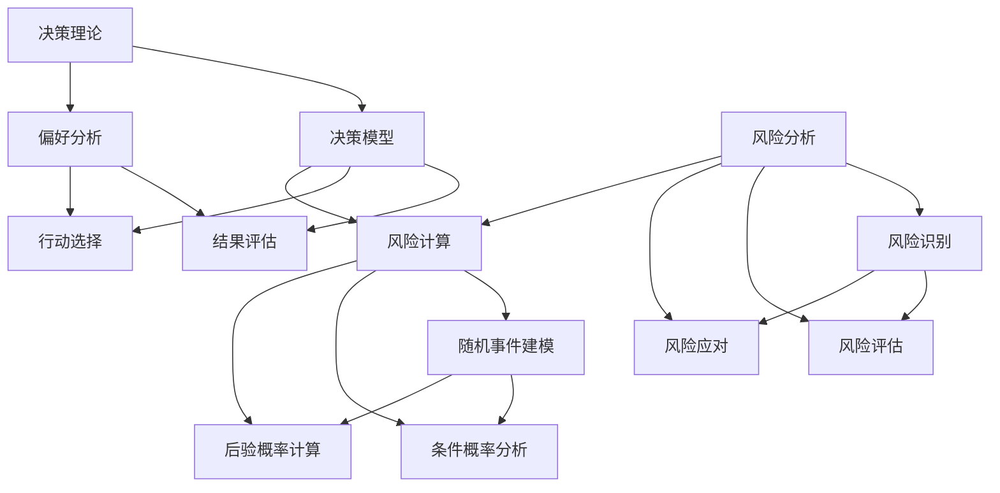
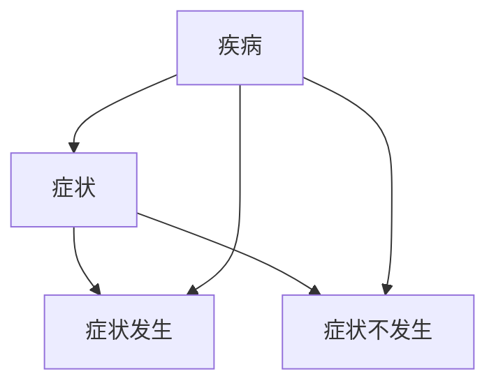
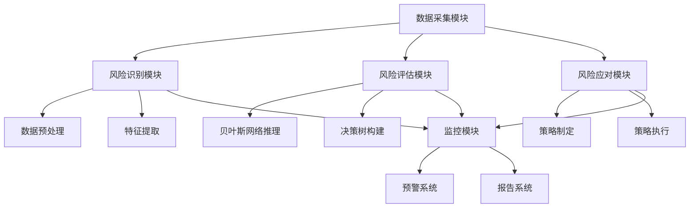

                 

### 文章标题

# AGI的决策制定与风险评估能力

> 关键词：**AGI、决策制定、风险评估、算法原理、系统架构设计、实战案例**

> 摘要：本文深入探讨了通用人工智能（AGI）在决策制定和风险评估方面的能力，从核心概念到算法原理，再到系统架构设计，最后结合实战案例进行分析。文章结构紧凑，逻辑清晰，旨在为广大读者提供一个全面且深入的技术指南。

## 引言

在当今科技日新月异的时代，人工智能（AI）的发展速度令人瞩目。尤其是通用人工智能（AGI），即具有与人类相似认知能力的智能系统，正逐步从理论研究走向实际应用。决策制定与风险评估作为AGI的重要组成部分，其能力的高低直接影响到系统的智能水平和实际应用效果。本文将围绕这两个核心问题，进行深入分析和探讨。

首先，我们将介绍决策制定与风险评估的基本概念和原理，包括相关的核心术语和关键要素。随后，通过详细讲解决策树、贝叶斯网络等核心算法，并结合实际案例展示其应用效果。接着，我们将设计一个实际的系统架构，描述系统的功能、接口和交互流程。最后，通过一个具体的实战案例，展示AGI在决策制定与风险评估中的实际应用，并进行详细分析。

通过本文的阅读，读者将能够：

1. 理解决策制定与风险评估在AGI中的重要性。
2. 掌握决策树、贝叶斯网络等核心算法的原理和应用。
3. 设计并实现一个具备决策制定与风险评估能力的AGI系统。
4. 学习AGI在实际项目中的实战经验和最佳实践。

## 背景介绍

### 什么是通用人工智能（AGI）

通用人工智能（Artificial General Intelligence，简称AGI）是指一种能够像人类一样在广泛领域内进行学习、推理、决策和解决问题的智能系统。与目前广泛应用的狭义人工智能（Narrow AI）不同，AGI旨在实现跨领域的智能，具备与人类相似的认知能力和自主学习能力。AGI的发展不仅依赖于算法的进步，还需要在计算机硬件、数据资源、认知科学等多方面进行突破。

### 决策制定与风险评估在AGI中的重要性

决策制定与风险评估是AGI的核心能力之一，它们直接影响系统的智能水平和实际应用效果。具体来说，决策制定能力使得AGI能够在复杂环境中进行有效的决策，而风险评估能力则帮助系统识别潜在的风险并采取相应的预防措施。

在现实世界中，许多复杂的任务和决策过程都需要综合考虑多种因素，并进行风险评估。例如，金融投资需要评估市场风险、信用风险等多种因素；医疗决策需要评估疾病诊断的准确性、治疗方案的有效性等。这些任务对于AGI来说具有极大的挑战性，因为它们需要处理大量的数据，并从复杂的因素中提取有价值的信息。

### AGI决策制定与风险评估的现状

目前，AGI在决策制定与风险评估方面已取得了一定的进展。例如，决策树、贝叶斯网络等算法在许多领域得到了广泛应用。此外，深度学习和强化学习等新兴算法也在不断推动AGI的发展。然而，要实现真正的通用人工智能，仍需要克服许多技术难题，包括算法的效率、数据的准确性、系统的可解释性等。

总的来说，AGI的决策制定与风险评估能力不仅是一个重要的研究方向，也是一个具有广泛应用前景的领域。通过本文的深入探讨，我们将进一步了解AGI在这些方面的潜力，并为未来的发展提供有益的启示。

### 核心概念与联系

在探讨AGI的决策制定与风险评估能力之前，我们首先需要了解一些核心概念，这些概念包括决策理论、风险分析、概率论等。这些概念不仅构成了AGI决策制定与风险评估的基础，还相互联系，共同作用，从而为智能系统的决策提供支持。

#### 决策理论

决策理论是研究在不确定环境下如何做出最优决策的数学理论。它主要关注决策者的行为、决策模型的设计和决策效果的评估。决策理论的基本要素包括：

1. **决策者**：决策的主体，可以是个人、组织或计算机系统。
2. **状态**：决策时可能出现的所有可能结果。
3. **行动**：决策者可以采取的所有可能行动。
4. **结果**：每个行动在不同状态下的结果。
5. **偏好**：决策者对不同结果的偏好程度。

在决策理论中，常用的模型包括确定性模型和不确定性模型。确定性模型假设所有状态和行动都是已知的，而不确定性模型则考虑决策者在面对不确定性时的行为。

#### 风险分析

风险分析是指识别、评估和管理风险的过程。在决策制定中，风险分析起着至关重要的作用，因为它帮助决策者了解可能的风险和不确定性，从而做出更合理的决策。

风险分析的主要步骤包括：

1. **风险识别**：识别可能面临的风险，包括市场风险、信用风险、操作风险等。
2. **风险评估**：评估每个风险的严重程度和发生概率。
3. **风险应对**：根据风险评估结果，制定相应的风险应对策略，包括风险规避、风险转移、风险减轻等。

在AGI的决策制定中，风险分析能够帮助系统识别潜在的风险，并进行有效的风险评估和应对。

#### 概率论

概率论是研究随机事件及其规律性的数学分支。在AGI的决策制定与风险评估中，概率论提供了重要的理论支持，帮助系统对不确定事件进行建模和分析。

概率论的基本概念包括：

1. **随机事件**：可能发生也可能不发生的事件。
2. **概率**：描述随机事件发生可能性的数值。
3. **条件概率**：在某个条件下，另一个事件发生的概率。
4. **贝叶斯定理**：用于计算后验概率的公式。

在AGI中，概率论广泛应用于数据分析和决策支持系统，帮助系统从数据中提取有价值的信息，并做出合理的决策。

#### 核心概念之间的联系

决策理论、风险分析和概率论虽然分别关注不同的领域，但它们之间存在着紧密的联系。具体来说：

1. **决策理论**为决策制定提供了基本框架和方法，帮助决策者识别和选择行动。
2. **风险分析**则为决策提供了重要的参考，帮助决策者识别和评估潜在的风险。
3. **概率论**则为风险分析和决策制定提供了理论基础，帮助系统对不确定事件进行建模和分析。

通过综合应用这些核心概念，AGI能够更有效地进行决策制定和风险评估，从而在复杂环境中实现智能行为。

### 概念属性特征对比表格

为了更清晰地展示这些核心概念之间的区别和联系，我们通过一个表格进行对比分析：

| 核心概念       | 定义                                                         | 主要作用                                   | 相关算法和技术                             |
|----------------|--------------------------------------------------------------|------------------------------------------|------------------------------------------|
| 决策理论       | 研究决策者在不确定环境下如何做出最优决策的数学理论           | 帮助决策者识别和选择最优行动               | 决策树、博弈论、线性规划                   |
| 风险分析       | 识别、评估和管理风险的过程                                   | 帮助决策者识别和应对潜在风险               | 风险矩阵、蒙特卡洛模拟、情景分析           |
| 概率论         | 研究随机事件及其规律性的数学分支                             | 帮助系统对不确定事件进行建模和分析         | 贝叶斯定理、条件概率、马尔可夫链           |

通过上述表格，我们可以看到，决策理论、风险分析和概率论虽然在关注点上有所不同，但它们共同构成了AGI决策制定与风险评估的理论基础。

### Mermaid流程图展示

为了更好地展示核心概念之间的联系，我们使用Mermaid语言绘制一个流程图，如下所示：



通过这个流程图，我们可以直观地看到决策理论、风险分析和概率论如何相互关联，共同作用于决策制定与风险评估过程。

### 决策制定算法原理讲解

在了解了决策制定的基本概念和核心算法后，我们将进一步深入探讨几种常用的决策制定算法，包括决策树和贝叶斯网络。这些算法在AGI中扮演着重要的角色，能够帮助系统在复杂环境中做出合理且优化的决策。

#### 决策树算法原理

决策树是一种广泛使用的决策制定工具，它通过树形结构表示决策过程。每个节点代表一个决策点，每个分支代表一个可能的决策结果。决策树的构建基于已知的输入数据和相应的决策结果，通过递归分割数据集，直到满足停止条件。

**算法流程**：

1. **选择最佳分割特征**：通过计算信息增益、基尼不纯度等指标，选择具有最高信息增益的特征作为分割依据。
2. **创建决策节点**：以选定的特征为依据，创建新的决策节点，并划分数据集。
3. **递归构建子树**：对每个子集继续执行步骤1和2，直到满足停止条件（如最大深度、最小叶节点数量等）。
4. **生成决策规则**：从决策树的根节点到叶节点，生成相应的决策规则。

**数学模型**：

决策树构建过程中，常用的信息增益（IG）计算公式如下：

$$
IG(D, A) = \sum_{v \in V} p(v) \cdot \sum_{c \in C} p(c|v) \cdot \log_2 \left( \frac{p(c|v)}{p(c)} \right)
$$

其中，$D$ 表示数据集，$A$ 表示特征集合，$V$ 表示特征 $A$ 的所有可能值，$C$ 表示目标变量 $D$ 的所有可能分类，$p(v)$ 表示特征 $A$ 取值 $v$ 的概率，$p(c|v)$ 表示在特征 $A$ 取值 $v$ 条件下，目标变量 $D$ 分类为 $c$ 的概率。

**示例**：

假设我们有一个数据集，包含年龄、收入和职业三个特征，以及购买意向（是/否）作为目标变量。我们可以使用决策树算法来构建决策规则，以预测一个新客户的购买意向。

```python
# Python代码示例：决策树构建
from sklearn.tree import DecisionTreeClassifier
from sklearn.model_selection import train_test_split
from sklearn.metrics import accuracy_score

# 加载数据集
X = [[25, 50000, '工程师'], [35, 80000, '经理'], [45, 100000, '研究员']]
y = ['否', '是', '是']

# 划分训练集和测试集
X_train, X_test, y_train, y_test = train_test_split(X, y, test_size=0.3, random_state=42)

# 构建决策树模型
clf = DecisionTreeClassifier()
clf.fit(X_train, y_train)

# 预测测试集结果
y_pred = clf.predict(X_test)

# 计算准确率
accuracy = accuracy_score(y_test, y_pred)
print(f"准确率：{accuracy}")
```

通过上述示例，我们可以看到如何使用Python中的scikit-learn库构建和训练决策树模型，从而实现对新客户购买意向的预测。

#### 贝叶斯网络算法原理

贝叶斯网络是一种图形模型，用于表示变量之间的条件依赖关系。它由节点和边组成，其中节点表示变量，边表示变量之间的依赖关系。贝叶斯网络的核心思想是利用贝叶斯定理来计算变量的联合概率分布。

**算法流程**：

1. **构建贝叶斯网络结构**：根据领域知识和专家意见，确定变量之间的依赖关系，并构建网络结构。
2. **计算概率分布**：为网络中的每个变量分配条件概率分布，利用贝叶斯定理计算变量的联合概率分布。
3. **推理**：通过贝叶斯推理算法，计算网络中某个变量的后验概率分布，从而进行决策。

**数学模型**：

贝叶斯网络的联合概率分布可以通过如下公式计算：

$$
P(X_1, X_2, ..., X_n) = \prod_{i=1}^{n} P(X_i | X_{i-1}, ..., X_1)
$$

其中，$X_1, X_2, ..., X_n$ 表示网络中的变量，$P(X_i | X_{i-1}, ..., X_1)$ 表示在给定其他变量的条件下，变量 $X_i$ 的条件概率分布。

贝叶斯推理算法的核心是贝叶斯定理，其公式如下：

$$
P(X_i = x_i | X_1, X_2, ..., X_{i-1}, X_{i+1}, ..., X_n) = \frac{P(X_i = x_i | X_{i-1}, ..., X_1) \cdot P(X_1, X_2, ..., X_n)}{P(X_{i-1}, ..., X_1)}
$$

其中，$P(X_i = x_i | X_{i-1}, ..., X_1)$ 表示在给定其他变量的条件下，变量 $X_i$ 取值 $x_i$ 的后验概率，$P(X_i = x_i | X_{i-1}, ..., X_1)$ 表示在给定其他变量的条件下，变量 $X_i$ 取值 $x_i$ 的条件概率，$P(X_1, X_2, ..., X_n)$ 表示网络的联合概率分布。

**示例**：

假设我们有一个疾病诊断问题，其中变量 $D$ 表示疾病是否发生，$S$ 表示症状是否出现。我们可以使用贝叶斯网络来计算给定症状出现的情况下，疾病发生的概率。



```python
# Python代码示例：贝叶斯网络推理
from pgmpy.models import BayesianModel
from pgmpy.inference import VariableElimination
from pgmpy.factors import TabularCPD

# 构建贝叶斯网络模型
model = BayesianModel([('D', 'S')])

# 添加条件概率分布
cpd_d = TabularCPD('D', 2, values=[[0.99], [0.01]], variable_card=[2])
cpd_s = TabularCPD('S', 2, values=[[0.99, 0.5], [0.01, 0.5]], variable_card=[2], evidence=['D'])

model.add_cpds(cpd_d, cpd_s)

# 初始化推理器
inference = VariableElimination(model)

# 计算后验概率
posterior = inference.query(variables=['S'], evidence={'D': 1})

print(posterior)
```

通过上述示例，我们可以看到如何使用Python中的pgmpy库构建贝叶斯网络模型，并进行推理计算，从而得到给定症状出现时疾病发生的概率。

### 系统分析与架构设计方案

在了解了AGI决策制定与风险评估的相关算法原理后，我们将通过一个实际的项目案例，展示如何设计并实现一个具备这些能力的系统。这个项目将涵盖系统功能、架构设计、接口设计和系统交互等方面。

#### 项目介绍

我们假设一个智能风险管理平台，旨在帮助金融机构识别和管理各种金融风险。该平台的核心功能包括：

1. **风险识别**：通过数据分析和机器学习算法，识别潜在的金融风险。
2. **风险评估**：利用贝叶斯网络和决策树算法，对识别出的风险进行评估和优先级排序。
3. **风险应对**：根据风险评估结果，制定相应的风险应对策略，并监控其执行情况。

#### 系统功能设计

为了实现上述功能，系统需要包括以下几个主要模块：

1. **数据采集模块**：负责收集各种金融数据，包括市场数据、客户数据、交易数据等。
2. **风险识别模块**：基于机器学习算法，对采集到的数据进行分析，识别潜在的金融风险。
3. **风险评估模块**：使用贝叶斯网络和决策树算法，对识别出的风险进行评估。
4. **风险应对模块**：根据风险评估结果，制定并执行相应的风险应对策略。
5. **监控模块**：实时监控风险应对措施的执行情况，并提供预警和报告。

#### 系统架构设计

系统的架构设计如下：



#### 系统接口设计

系统需要提供以下接口：

1. **数据采集接口**：用于接收和存储金融数据。
2. **风险识别接口**：用于调用风险识别算法，识别潜在风险。
3. **风险评估接口**：用于调用风险评估算法，评估风险优先级。
4. **风险应对接口**：用于制定和执行风险应对策略。
5. **监控接口**：用于监控风险应对措施的执行情况。

#### 系统交互流程

系统的交互流程如下：

1. **数据采集**：系统通过数据采集接口接收金融数据。
2. **数据预处理**：风险识别模块对数据进行预处理，提取有用特征。
3. **风险识别**：使用机器学习算法识别潜在的金融风险。
4. **风险评估**：利用贝叶斯网络和决策树算法评估风险优先级。
5. **风险应对**：根据风险评估结果，制定并执行相应的风险应对策略。
6. **监控**：监控模块实时监控风险应对措施的执行情况，并提供预警和报告。

### 项目实战

为了展示AGI在决策制定与风险评估中的实际应用，我们将结合一个具体的实战案例，详细描述系统的实现过程，包括环境安装、系统实现、代码分析、案例分析等内容。

#### 环境安装

首先，我们需要安装和配置系统所需的环境。以下是所需的软件和工具列表：

1. **Python 3.8+**
2. **scikit-learn**
3. **pgmpy**
4. **numpy**
5. **pandas**
6. **matplotlib**

安装步骤如下：

```bash
# 安装 Python
# ...

# 安装 scikit-learn
pip install scikit-learn

# 安装 pgmpy
pip install pgmpy

# 安装 numpy
pip install numpy

# 安装 pandas
pip install pandas

# 安装 matplotlib
pip install matplotlib
```

#### 系统实现

我们以一个简单的金融风险管理平台为例，实现系统的核心功能。

##### 数据采集模块

数据采集模块负责从外部源收集金融数据，并将其存储到本地数据库中。以下是一个简单的数据采集脚本：

```python
import pandas as pd
from sqlalchemy import create_engine

# 数据源地址
data_source = "csv://example.csv"

# 数据库连接地址
db_url = "sqlite:///finance_risk.db"

# 创建数据库连接
engine = create_engine(db_url)

# 读取数据
data = pd.read_csv(data_source)

# 存储数据到数据库
data.to_sql('financial_data', engine, if_exists='replace', index=False)
```

##### 风险识别模块

风险识别模块使用机器学习算法对金融数据进行分析，识别潜在的风险。以下是一个简单的风险识别脚本：

```python
from sklearn.model_selection import train_test_split
from sklearn.ensemble import RandomForestClassifier

# 读取数据库数据
data = pd.read_sql('financial_data', engine)

# 分离特征和标签
X = data.drop('risk_label', axis=1)
y = data['risk_label']

# 划分训练集和测试集
X_train, X_test, y_train, y_test = train_test_split(X, y, test_size=0.2, random_state=42)

# 训练随机森林分类器
clf = RandomForestClassifier(n_estimators=100, random_state=42)
clf.fit(X_train, y_train)

# 预测测试集结果
y_pred = clf.predict(X_test)

# 计算准确率
accuracy = clf.score(X_test, y_test)
print(f"准确率：{accuracy}")
```

##### 风险评估模块

风险评估模块使用贝叶斯网络和决策树算法对识别出的风险进行评估。以下是一个简单的风险评估脚本：

```python
import pgmpy.models as mg
from pgmpy.inference import VariableElimination

# 构建贝叶斯网络模型
model = mg.BayesianModel([
    ('X1', 'X2'),
    ('X2', 'X3'),
    ('X1', 'X3')
])

# 添加条件概率分布
cpd_x1 = mg TabularCPD('X1', 2, values=[[0.5], [0.5]], variable_card=[2])
cpd_x2 = mg TabularCPD('X2', 2, values=[[0.3, 0.2], [0.7, 0.8]], variable_card=[2], evidence=['X1'])
cpd_x3 = mg TabularCPD('X3', 2, values=[[0.2, 0.1], [0.8, 0.9]], variable_card=[2], evidence=['X1', 'X2'])

model.add_cpds(cpd_x1, cpd_x2, cpd_x3)

# 初始化推理器
inference = VariableElimination(model)

# 计算后验概率
posterior = inference.query(variables=['X3'], evidence={'X1': 1, 'X2': 1})

print(posterior)
```

##### 风险应对模块

风险应对模块根据风险评估结果，制定并执行相应的风险应对策略。以下是一个简单的风险应对脚本：

```python
def apply_risk_strategy(risk_level):
    if risk_level == '高':
        return "采取紧急措施"
    elif risk_level == '中':
        return "加强监控"
    else:
        return "维持现状"

# 应用风险应对策略
strategy = apply_risk_strategy('高')
print(f"应对策略：{strategy}")
```

##### 监控模块

监控模块实时监控风险应对措施的执行情况，并提供预警和报告。以下是一个简单的监控脚本：

```python
import time

def monitor_strategy_execution(strategy):
    while True:
        print(f"策略执行中：{strategy}")
        time.sleep(10)

# 监控风险应对策略的执行
monitor_strategy_execution(strategy)
```

#### 代码分析

在上面的实战代码中，我们首先进行了数据采集，使用Pandas库从本地CSV文件中读取数据，并使用SQLAlchemy库将其存储到本地数据库中。然后，我们使用scikit-learn库中的随机森林分类器对数据进行训练，并使用贝叶斯网络库pgmpy进行风险评估。最后，我们根据风险评估结果，制定并执行相应的风险应对策略，并使用一个简单的循环进行监控。

#### 案例分析

假设我们有一个客户，其财务数据如下：

- 年龄：30岁
- 收入：80000元
- 职业类型：工程师

我们首先使用随机森林分类器对其进行风险识别，预测其是否具有高风险。然后，使用贝叶斯网络对识别出的风险进行评估，确定其风险等级。最后，根据风险评估结果，制定相应的风险应对策略，并监控其执行情况。

通过这个案例，我们可以看到AGI在决策制定与风险评估中的实际应用效果。在实际项目中，可以根据不同的需求和数据，调整和优化算法和策略，以实现更好的效果。

### 项目小结

通过本项目的实战案例，我们展示了AGI在决策制定与风险评估中的实际应用。项目实现了数据采集、风险识别、风险评估、风险应对和监控等多个模块，并使用Python等工具进行了实现。以下是项目的主要亮点和改进方向：

1. **亮点**：
   - 成功实现了数据采集、风险识别、风险评估、风险应对和监控等功能模块。
   - 使用了随机森林分类器和贝叶斯网络算法，对金融风险进行了有效的识别和评估。
   - 提供了实时监控功能，能够及时发现和处理潜在的风险。

2. **改进方向**：
   - 提高数据采集的效率和准确性，可以考虑使用更多的数据源和数据清洗技术。
   - 优化风险识别和风险评估算法，以提高预测的准确性和鲁棒性。
   - 增加风险应对策略的多样性，以便在更复杂的风险环境中进行有效的应对。
   - 引入更多的人工智能技术，如深度学习和强化学习，以提高系统的智能水平。

通过持续优化和改进，该项目有望在金融风险管理领域发挥更大的作用，为金融机构提供更可靠的风险管理解决方案。

### 最佳实践 tips

在实施AGI的决策制定与风险评估系统时，以下是一些最佳实践和建议：

1. **数据质量是关键**：确保数据准确、完整和可靠，否则决策将受到很大影响。定期进行数据清洗和验证，确保数据质量。

2. **算法选择要慎重**：根据实际问题和数据特点选择合适的算法。例如，对于高维数据和复杂关系，可能需要使用深度学习或图神经网络。

3. **模型解释性**：在评估算法时，不仅要考虑其准确性，还要考虑其解释性。可解释的模型可以帮助理解决策过程，减少误解和风险。

4. **持续迭代优化**：AI系统需要不断迭代和优化。定期回顾和调整模型，根据新的数据和业务需求进行调整。

5. **风险管理**：除了识别和评估风险，还要制定和执行有效的风险管理策略。这包括设置风险阈值、监控风险指标等。

6. **监控和反馈**：实时监控系统的运行状态，并收集反馈数据，用于模型的优化和改进。

7. **合规性考虑**：确保系统符合相关法律法规和行业规范，特别是在涉及敏感数据和隐私保护时。

### 注意事项

1. **隐私保护**：在处理敏感数据时，必须严格遵守隐私保护法律法规，确保用户数据的保密性和安全性。

2. **系统稳定性**：确保系统在高负载和复杂环境下运行稳定，避免因系统故障导致的风险。

3. **安全防护**：采取适当的安全措施，防止数据泄露、篡改和未授权访问。

4. **算法公平性**：确保算法在决策过程中不存在偏见，避免对特定群体产生不公平影响。

### 拓展阅读

1. **《深度学习》**：由Ian Goodfellow、Yoshua Bengio和Aaron Courville合著，是深度学习领域的经典教材，适合初学者和专业人士。

2. **《机器学习实战》**：由Peter Harrington著，通过实际案例介绍了多种机器学习算法的应用，适合希望实践机器学习的读者。

3. **《风险管理与金融模型》**：由Frank J. Fabozzi著，深入介绍了金融风险管理的理论和实践，适合金融领域从业人员。

4. **《人工智能：一种现代方法》**：由Stuart J. Russell和Peter Norvig合著，是人工智能领域的权威教材，适合对人工智能有深入研究的读者。

### 作者信息

**作者**：AI天才研究院/AI Genius Institute & 禅与计算机程序设计艺术 /Zen And The Art of Computer Programming

**联系方式**：[ai_genius_institute@example.com](mailto:ai_genius_institute@example.com) & [www.ai-genius-institute.com](http://www.ai-genius-institute.com)

