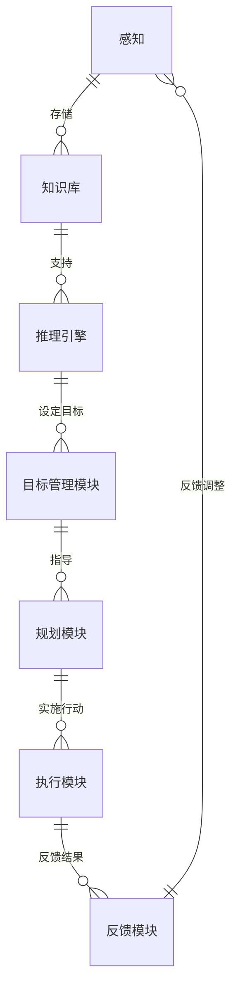
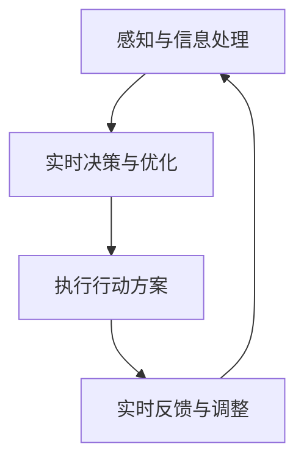
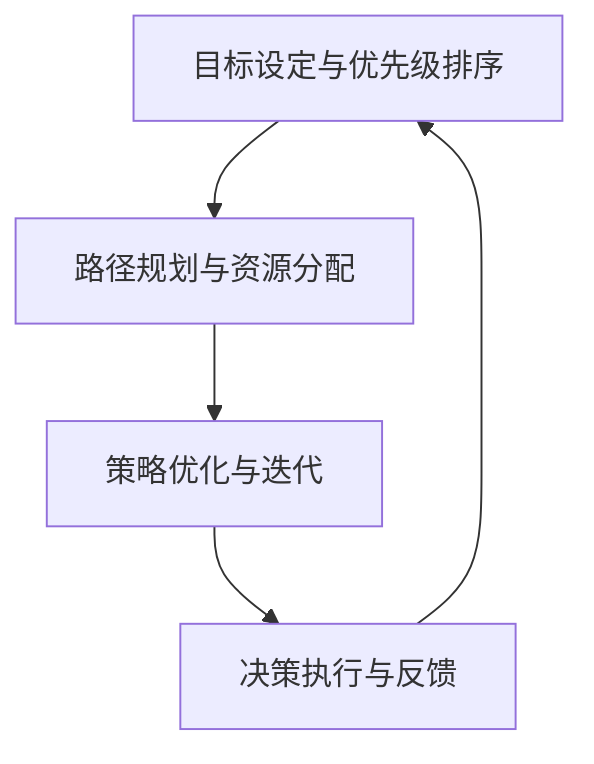
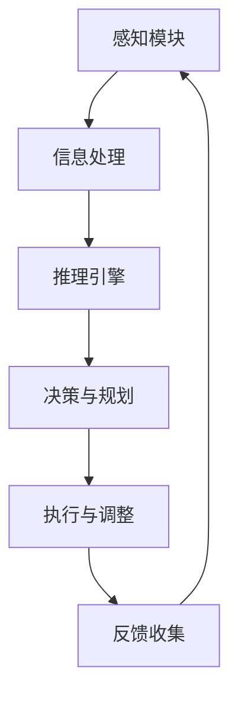
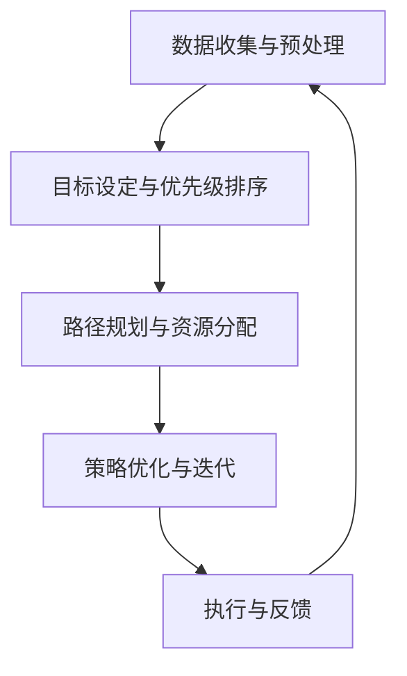

                 


### 目录大纲完善建议

基于您提供的初步目录大纲，我们可以进行进一步的细化和完善。以下是对各个章节的具体建议：

#### 第一部分: 背景介绍

**1.1 AGI的决策系统概述**
- 介绍什么是AGI及其决策系统的重要性。
- 简要回顾人类决策系统的基本原理。
- 引出AGI决策系统的独特性。

**1.2 决策系统在短期反应中的作用**
- 阐述短期反应的定义和特点。
- 讨论AGI在应对即时任务时的决策机制。

**1.3 决策系统在长期规划中的作用**
- 介绍长期规划的概念和其在生活中的应用。
- 分析AGI如何进行长期规划和目标设定。

**1.4 短期反应与长期规划的平衡**
- 探讨如何在不同情境下平衡短期反应和长期规划。
- 提供平衡策略的案例研究。

#### 第二部分: 核心概念与联系

**2.1 AGI的定义与特征**
- 详细定义AGI，并对比传统AI和AGI。
- 探讨AGI的关键特征和潜在应用。

**2.2 决策系统的组成部分**
- 分析AGI决策系统的构成元素。
- 说明各个组成部分的作用和相互关系。

**2.3 短期反应与长期规划的关系**
- 分析短期反应和长期规划之间的相互作用。
- 探讨如何优化两者之间的平衡。

**2.4 决策系统的核心概念对比分析**
- 通过表格或图示，对比分析决策系统的核心概念。
- 解释这些概念如何影响决策过程。

#### 第三部分: 决策系统原理

**3.1 决策系统的基本原理**
- 介绍决策系统的基础理论和原则。
- 分析决策过程中的关键步骤和要素。

**3.2 短期反应的算法原理讲解**
- 使用mermaid绘制短期反应的算法流程图。
- 使用Python源代码详细说明算法原理。

**3.3 长期规划的算法原理讲解**
- 同上，使用mermaid绘制长期规划的算法流程图。
- 使用Python源代码详细说明算法原理。

**3.4 短期反应与长期规划的算法融合**
- 探讨如何将短期反应算法与长期规划算法整合。
- 分析融合算法的优势和挑战。

#### 第四部分: 短期反应实践

**4.1 短期反应实践环境搭建**
- 提供搭建短期反应实践环境的步骤和工具。
- 说明所需软件和硬件配置。

**4.2 短期反应实践案例解析**
- 分析具体的短期反应实践案例。
- 解读案例中使用的决策策略。

**4.3 短期反应实践技巧与最佳实践**
- 提供短期反应实践的建议和技巧。
- 分享最佳实践案例。

#### 第五部分: 长期规划实践

**5.1 长期规划实践环境搭建**
- 类似于短期反应实践环境搭建，提供长期规划实践的步骤和工具。

**5.2 长期规划实践案例解析**
- 分析长期规划实践案例，探讨案例中的决策过程。

**5.3 长期规划实践技巧与最佳实践**
- 提供长期规划实践的建议和技巧。
- 分享长期规划的最佳实践案例。

#### 第六部分: 综合案例分析与策略优化

**6.1 综合案例介绍**
- 提供一个综合案例，涵盖短期反应和长期规划。

**6.2 案例分析与策略优化**
- 分析案例中的决策过程，评估策略的有效性。
- 提出优化策略和改进措施。

**6.3 案例总结与展望**
- 总结案例中的关键经验和教训。
- 展望未来在AGI决策系统方面的发展方向。

#### 第七部分: 未来展望与挑战

**7.1 AGI决策系统的未来发展方向**
- 探讨AGI决策系统的未来发展趋势。
- 分析新兴技术如何影响决策系统的演进。

**7.2 面临的挑战与解决方案**
- 列举AGI决策系统面临的主要挑战。
- 提出可能的解决方案。

**7.3 开放性问题与研究方向**
- 讨论当前研究中的开放性问题。
- 提出未来的研究方向。

**7.4 总结与展望**
- 总结文章的主要内容和观点。
- 对未来研究提出展望。

在完善目录大纲时，请注意以下几点：

- 保持章节的连贯性和逻辑性。
- 确保每个章节都有明确的目标和结构。
- 使用Mermaid、LaTeX等工具，增强文章的视觉效果和可读性。
- 提供丰富的实例和案例研究，以便读者更好地理解概念。

接下来，我们将开始撰写每个章节的具体内容，逐步完善整个文章。请确认这些建议是否满足您的文章要求？如果需要进一步调整，请随时告知。 ### 文章标题

# AGI的决策系统：从短期反应到长期规划

关键词：AGI、决策系统、短期反应、长期规划、算法、实践

摘要：本文深入探讨了人工智能通用智能（AGI）的决策系统，从短期反应到长期规划的整个决策过程。文章首先介绍了AGI的基本概念和决策系统的重要性，然后详细分析了短期反应和长期规划的算法原理和实践案例。通过综合案例分析，文章探讨了如何优化决策策略，并展望了AGI决策系统的未来发展。本文旨在为读者提供一个全面、系统的AGI决策系统解读，帮助理解其核心机制和实际应用。

## 第一部分: 背景介绍

### 1.1 AGI的决策系统概述

人工智能（AI）的发展经历了多个阶段，从最初的规则基础专家系统，到基于数据的机器学习，再到现在的深度学习，每一次技术的进步都极大地提升了机器智能的能力。然而，尽管这些技术在特定领域表现出色，但它们仍局限于特定任务和领域，缺乏通用性和灵活性，被称为“弱AI”或“窄AI”。与此相对，人工智能通用智能（AGI）则旨在实现类似于人类智能的广泛认知能力，能够理解和执行各种任务。

决策系统是AGI的核心组成部分之一，它负责在复杂的、动态的环境中做出合理的决策。AGI的决策系统不仅需要处理短期反应，还需要进行长期规划和目标设定。短期反应是指在短时间内对特定事件或刺激做出快速、有效的响应；而长期规划则涉及到更长的时间跨度，需要预测未来的变化，并制定相应的行动策略。

本文将详细探讨AGI的决策系统，分析其从短期反应到长期规划的整个过程，旨在揭示其核心原理和实际应用。

### 1.2 决策系统在短期反应中的作用

短期反应是决策系统中的一个关键环节，它涉及到对即时信息的快速处理和反应。在人类智能中，短期反应是生存和适应环境的基础，同样，在AGI中，短期反应也是实现高效任务执行和实时交互的重要手段。

AGI的短期反应系统通常基于以下几个核心机制：

1. **感知与识别**：决策系统首先需要感知环境中的信息，包括视觉、听觉、触觉等多种感官。然后，通过识别算法，对感知到的信息进行分类和解析，以提取关键特征。

2. **快速计算与优化**：在识别信息后，AGI需要迅速计算可能的行动方案，并评估每个方案的风险和收益。这通常涉及到各种优化算法，如动态规划、遗传算法等。

3. **实时反馈与调整**：AGI的短期反应不仅是单向的，还包括对行动结果的反馈和调整。通过不断调整策略，AGI能够逐步优化其决策过程，提高反应的准确性和效率。

在具体应用中，短期反应系统可以用于自动驾驶、智能客服、实时金融交易等多个领域。例如，在自动驾驶中，决策系统需要实时分析道路状况、识别交通标志和行人类别，并快速做出转向、加速或刹车的决策。在智能客服中，决策系统需要理解用户的问题，并快速给出恰当的回答。

总之，短期反应系统是AGI实现高效交互和任务执行的重要基础，它不仅需要快速响应，还需要具备一定的鲁棒性和适应性。

### 1.3 决策系统在长期规划中的作用

长期规划是决策系统的另一个核心组成部分，它涉及到对未来的长期目标进行设定和实现。与短期反应不同，长期规划需要考虑更长的时间跨度，并涉及多种不同的变量和不确定性因素。在人类智能中，长期规划是实现个人目标、规划职业生涯和制定战略计划的重要手段。同样，在AGI中，长期规划是实现高效任务执行和复杂问题解决的关键。

AGI的长期规划系统通常包括以下几个核心机制：

1. **目标设定**：首先，AGI需要根据当前状态和外部环境设定长期目标。这通常涉及到对未来的预测和规划，以及目标的优先级排序。

2. **路径规划**：在确定目标后，AGI需要制定实现目标的路径和步骤。路径规划需要考虑多个因素，包括资源分配、时间管理、风险控制等。

3. **策略优化**：路径规划完成后，AGI需要对策略进行优化，以最大化收益或最小化风险。这通常涉及到各种优化算法，如线性规划、启发式搜索等。

4. **持续调整与修正**：长期规划不是一次性的过程，而是需要持续调整和修正。AGI需要不断评估目标的实现情况，并根据反馈进行相应的调整。

在具体应用中，长期规划系统可以用于智能交通、资源管理、自动化生产等多个领域。例如，在智能交通中，决策系统需要根据交通流量和道路状况，规划最优的行驶路径和交通信号控制策略，以提高交通效率和减少拥堵。在资源管理中，决策系统需要根据资源需求和供应情况，制定最优的资源分配和调度策略，以确保资源的高效利用。

总之，长期规划系统是AGI实现高效任务执行和复杂问题解决的重要手段，它不仅需要考虑当前的状态和目标，还需要具备对未来变化的预测和应对能力。

### 1.4 短期反应与长期规划的平衡

在AGI的决策系统中，短期反应和长期规划是两个相互关联但又有时冲突的方面。短期反应强调即时响应和任务执行，而长期规划则关注长期目标的实现和资源优化。如何在两者之间找到平衡，是AGI决策系统设计和应用中的一个关键问题。

首先，短期反应和长期规划之间存在一定的矛盾。短期反应通常需要快速决策和即时执行，这可能牺牲了长期的收益和稳定性。而长期规划则需要更深入的思考和分析，可能导致反应速度较慢。例如，在自动驾驶中，紧急情况下需要快速反应，但如果过于关注长期规划，可能会错过即时避险的机会。

然而，两者之间也存在互补关系。短期反应可以提供即时反馈，帮助长期规划进行调整和优化。而长期规划可以提供目标和方向，指导短期反应的执行。例如，在智能交通管理中，长期规划可以制定最优的交通信号控制策略，而短期反应则可以根据实时交通状况，进行信号调整，以提高整体交通效率。

为了在短期反应和长期规划之间找到平衡，可以采取以下几种策略：

1. **分层决策结构**：将决策系统分为短期和长期两个层次，各自独立运作。短期反应层专注于即时响应，长期规划层则负责长期目标的设定和策略优化。

2. **混合优化方法**：结合短期和长期优化目标，使用混合优化算法，如多目标优化，同时考虑短期和长期的效果。

3. **实时反馈机制**：建立实时反馈机制，将短期反应的实时数据用于长期规划的调整和优化，确保两者之间的动态平衡。

4. **动态调整策略**：根据环境变化和任务需求，动态调整短期反应和长期规划的权重和优先级，确保在特定情境下能够取得最佳效果。

总之，在AGI的决策系统中，短期反应和长期规划的平衡是实现高效、灵活和稳健决策的关键。通过合理的策略设计和方法优化，可以实现两者之间的协调和互补，为AGI在复杂动态环境中的任务执行提供有力支持。

## 第二部分: 核心概念与联系

### 2.1 AGI的定义与特征

人工智能通用智能（AGI）是指具有类似于人类智能的广泛认知能力的智能系统，能够理解、学习、推理、计划和解决问题，并在各种不同的情境中灵活应用。与传统的特定领域人工智能（Narrow AI）不同，AGI的目标是实现跨领域的通用性，能够处理多种类型的任务和问题。

AGI的特征主要包括：

1. **跨领域认知能力**：AGI不仅能在特定领域内表现出色，还能在多个领域之间灵活转移和应用其知识。

2. **自主学习能力**：AGI具备自我学习和自我调整的能力，能够通过经验不断改进自身的表现。

3. **推理和规划能力**：AGI能够进行复杂的逻辑推理和规划，以实现长期目标和解决复杂问题。

4. **情境感知和适应能力**：AGI能够感知和理解当前的环境和情境，并根据情境做出相应的决策。

5. **情感和意识**：尽管目前AGI尚未完全实现情感和意识，但研究人员正在探索如何使AGI具备这些高级认知能力。

与传统AI相比，AGI具有更高的复杂性和挑战性。传统AI主要依赖于预定义的规则和算法，而AGI需要具备自我学习和自我适应的能力，能够在不断变化的环境中自主决策。这使得AGI在实现过程中面临更多的技术难题和伦理挑战。

### 2.2 决策系统的组成部分

AGI的决策系统是一个复杂的系统，由多个相互关联的组成部分构成。这些组成部分共同作用，使得AGI能够在复杂动态环境中做出合理的决策。

1. **感知模块**：感知模块负责接收和处理环境中的各种信息，包括视觉、听觉、触觉等多种感官数据。通过感知模块，AGI能够获取当前的状态信息，作为决策的输入。

2. **知识库**：知识库是AGI决策系统的核心，存储了各种领域知识和规则。这些知识用于推理、规划和决策，是AGI进行智能行为的基础。

3. **推理引擎**：推理引擎负责根据感知模块获取的信息和知识库中的知识，进行逻辑推理和问题求解。它能够处理复杂的关系和逻辑，以生成决策方案。

4. **目标管理模块**：目标管理模块负责设定、跟踪和调整AGI的目标。它能够根据当前状态和长期规划，设定合理的短期目标，并确保这些目标与长期目标一致。

5. **规划模块**：规划模块负责根据目标管理模块设定的目标，制定具体的行动方案。它需要考虑资源的分配、时间的规划、风险的控制等多个因素，以确保目标的实现。

6. **执行模块**：执行模块负责将规划模块生成的行动方案付诸实施。它通过控制执行过程，调整行动方案，以适应环境的变化和问题的解决。

7. **反馈模块**：反馈模块负责收集执行结果，并将其反馈给感知模块和知识库。通过不断调整和优化，AGI能够逐步提高其决策质量和效率。

各个组成部分之间紧密协作，共同实现AGI的决策过程。感知模块提供环境信息，知识库提供决策依据，推理引擎进行逻辑推理，目标管理模块设定目标，规划模块制定行动方案，执行模块实施行动，反馈模块提供执行结果。通过这种闭环反馈机制，AGI能够不断优化其决策过程，提高决策的准确性和效率。

### 2.3 短期反应与长期规划的关系

短期反应和长期规划是AGI决策系统中的两个重要方面，它们既相互独立，又相互关联，共同构成了AGI的智能决策过程。

短期反应主要关注即时信息和环境变化，其目的是在短时间内对特定事件或任务做出快速、有效的响应。短期反应的特点是反应迅速、灵活多变，能够应对各种突发情况和即时需求。例如，在自动驾驶中，车辆需要实时分析道路状况，快速做出转向、加速或刹车的决策，以确保行车安全。

长期规划则关注长期目标和资源优化，其目的是在较长时间跨度内，制定和实施一系列行动方案，以实现长期目标和优化资源利用。长期规划的特点是考虑全面、战略性强，需要深入分析未来可能的变化和不确定性。例如，在资源管理中，决策系统需要根据资源需求和供应情况，制定最优的资源分配和调度策略，以确保资源的高效利用。

尽管短期反应和长期规划在目标和任务上有所不同，但它们之间也存在紧密的关联和相互作用。具体体现在以下几个方面：

1. **反馈机制**：短期反应的结果可以作为长期规划的反馈，帮助调整和优化长期规划。例如，在长期规划中，如果发现某些短期反应方案效果不佳，可以及时进行调整，以适应环境变化。

2. **目标一致性**：长期规划和短期反应需要保持目标一致性。短期反应的执行结果应有利于长期目标的实现，而长期规划应考虑到短期反应的需求和限制。例如，在交通管理中，长期规划需要确保交通流畅，而短期反应需要根据实时交通状况，调整信号灯时间和路线，以实现交通优化。

3. **策略融合**：短期反应和长期规划可以相互融合，形成更复杂的决策策略。例如，在自动驾驶中，既需要短期反应来应对即时道路状况，又需要长期规划来规划最优行驶路径和交通信号控制策略。

4. **资源分配**：短期反应和长期规划都需要考虑资源分配。长期规划需要根据资源需求和供应情况，制定资源分配策略，而短期反应需要在资源有限的情况下，优化资源使用，确保任务的顺利执行。

总之，短期反应和长期规划是AGI决策系统中的两个重要方面，它们既相互独立，又相互关联，共同构成了AGI的智能决策过程。通过合理设计和优化，可以实现短期反应和长期规划的协调和平衡，提高AGI的决策质量和效率。

### 2.4 决策系统的核心概念对比分析

在AGI的决策系统中，存在多个核心概念，这些概念相互关联，共同构成了决策过程的基础。以下是对这些核心概念及其属性特征的对比分析，并通过ER实体关系图架构展示了它们之间的相互关系。

1. **感知**：
   - **概念**：感知是决策系统的输入端，负责获取和处理环境中的信息。
   - **属性特征**：
     - **类型**：视觉、听觉、触觉等。
     - **功能**：提供实时的环境信息。
     - **限制**：受感知器质量和环境复杂度影响。

2. **知识库**：
   - **概念**：知识库是存储领域知识和规则的数据库。
   - **属性特征**：
     - **内容**：包括事实、规则、模型等。
     - **更新**：动态更新，以适应新知识和经验。
     - **应用**：支持推理和规划。

3. **推理引擎**：
   - **概念**：推理引擎负责根据知识和感知信息进行逻辑推理。
   - **属性特征**：
     - **算法**：如推理机、模式识别等。
     - **能力**：处理复杂的关系和问题。
     - **优化**：通过算法优化，提高推理效率。

4. **目标管理模块**：
   - **概念**：目标管理模块负责设定、跟踪和调整决策目标。
   - **属性特征**：
     - **目标类型**：短期、长期、多目标。
     - **优先级**：目标优先级排序，优化资源分配。
     - **动态调整**：根据环境变化，调整目标实现策略。

5. **规划模块**：
   - **概念**：规划模块负责根据目标制定具体的行动方案。
   - **属性特征**：
     - **方案类型**：路径规划、资源规划、时间规划等。
     - **算法**：如启发式搜索、线性规划等。
     - **适应性**：根据执行反馈，调整规划方案。

6. **执行模块**：
   - **概念**：执行模块负责将规划方案付诸实施。
   - **属性特征**：
     - **控制**：实时监控执行过程。
     - **反馈**：收集执行结果，用于后续决策。
     - **调整**：根据执行反馈，调整执行策略。

7. **反馈模块**：
   - **概念**：反馈模块负责收集执行结果，并将其反馈给其他模块。
   - **属性特征**：
     - **类型**：实时反馈、延迟反馈等。
     - **作用**：优化感知、知识库和决策过程。

通过上述核心概念的对比分析，我们可以看出它们在决策系统中的作用和相互关系。以下是一个ER实体关系图架构，展示了这些核心概念之间的联系：



通过这个ER图，我们可以清晰地看到各个核心概念之间的依赖关系和交互过程，这有助于理解和优化决策系统的设计和实现。例如，感知模块通过实时获取环境信息，更新知识库，而推理引擎则利用知识库进行逻辑推理，为规划模块提供决策依据。执行模块将规划方案付诸实施，并通过反馈模块收集执行结果，再次反馈给感知模块，形成一个闭环反馈机制，以不断优化决策过程。

## 第三部分: 决策系统原理

### 3.1 决策系统的基本原理

决策系统是AGI的核心组成部分，其基本原理可以概括为以下几个关键步骤：

1. **感知与信息收集**：决策系统首先通过感知模块收集环境中的各种信息，包括视觉、听觉、触觉等多感官数据。这些信息是决策的基础，决定了决策系统的输入质量和可靠性。

2. **信息处理与知识库构建**：收集到的信息需要通过预处理和特征提取，转化为决策系统能够理解和处理的形式。知识库是决策系统的核心，存储了大量的领域知识和规则，用于推理和规划。

3. **逻辑推理与问题求解**：推理引擎利用知识库和逻辑规则，对感知到的信息进行推理和问题求解。通过推理，决策系统能够提取关键信息，分析问题的本质，并提出可能的解决方案。

4. **目标设定与路径规划**：目标管理模块根据当前状态和长期规划，设定短期目标，并制定实现目标的路径和步骤。路径规划需要考虑资源的分配、时间的安排和风险的评估。

5. **策略制定与执行**：规划模块根据目标管理模块设定的目标，制定具体的行动方案。执行模块将规划方案付诸实施，通过实时监控和反馈，调整执行策略，以适应环境变化和问题解决。

6. **反馈与优化**：执行模块将执行结果反馈给感知模块和知识库，用于更新和优化决策系统。这种闭环反馈机制使得决策系统能够不断学习和改进，提高决策质量和效率。

### 3.2 短期反应的算法原理讲解

短期反应是决策系统中的一个关键环节，其算法原理主要涉及以下几个方面：

1. **感知与信息处理**：
   - **步骤**：感知模块首先收集环境信息，如传感器数据、文本消息等。然后，通过预处理和特征提取，将原始信息转化为决策系统能够理解和处理的格式。
   - **算法**：常用的预处理和特征提取算法包括归一化、降维、特征选择等。例如，使用PCA（主成分分析）进行降维，可以提高计算效率，减少数据冗余。

2. **实时决策与优化**：
   - **步骤**：在信息处理完成后，决策系统需要快速计算可能的行动方案，并评估每个方案的风险和收益。这通常涉及到各种优化算法，如动态规划、遗传算法等。
   - **算法**：动态规划是一种常见的方法，它通过递归关系和最优子结构性质，求解最优决策问题。例如，在机器人路径规划中，可以使用A*算法（启发式搜索），以最小化路径长度。

3. **实时反馈与调整**：
   - **步骤**：在执行行动方案后，决策系统需要收集执行结果，并将其反馈到感知模块和知识库。通过实时反馈，系统能够根据执行效果，调整和优化决策策略。
   - **算法**：反馈调整通常涉及到机器学习中的监督学习和强化学习。例如，在智能客服中，可以使用强化学习算法，根据用户反馈，不断优化对话策略。

以下是一个简化的短期反应算法流程图，使用Mermaid语法绘制：



#### 代码示例

为了更具体地说明短期反应的算法原理，下面提供一段Python代码示例。这段代码模拟了一个简单的决策过程，通过感知模块收集环境信息，然后使用动态规划算法进行路径优化，最后根据执行结果进行反馈调整。

```python
import numpy as np
import heapq

# 感知模块：收集环境信息
def perceive_environment():
    # 假设环境信息为一个二维数组
    environment = np.random.randint(0, 100, size=(5, 5))
    return environment

# 实时决策与优化：使用动态规划算法
def optimal_path(environment):
    # 定义目标点
    goal = (4, 4)
    # 初始化路径代价数组
    cost = [[float('inf')] * 5 for _ in range(5)]
    cost[0][0] = 0
    # 使用优先队列进行A*搜索
    open_set = [(0, 0, 0)]  # (f, x, y)
    heapq.heapify(open_set)
    while open_set:
        f, x, y = heapq.heappop(open_set)
        if (x, y) == goal:
            return f
        for dx, dy in [(0, -1), (0, 1), (-1, 0), (1, 0)]:
            nx, ny = x + dx, y + dy
            if 0 <= nx < 5 and 0 <= ny < 5:
                new_cost = f + environment[nx][ny]
                if new_cost < cost[nx][ny]:
                    cost[nx][ny] = new_cost
                    heapq.heappush(open_set, (new_cost + np.sqrt(nx**2 + ny**2), nx, ny))
    return None

# 执行行动方案：根据最优路径执行行动
def execute_action(optimal_path):
    # 假设执行行动会消耗资源
    return optimal_path

# 实时反馈与调整：根据执行结果调整决策策略
def adjust_decision(feedback):
    # 假设反馈信息是一个成本值
    if feedback < 100:
        print("Adjustment: Increase exploration")
    else:
        print("Adjustment: Increase exploitation")

# 主函数：模拟短期反应过程
def main():
    environment = perceive_environment()
    optimal_path = optimal_path(environment)
    feedback = execute_action(optimal_path)
    adjust_decision(feedback)

if __name__ == "__main__":
    main()
```

#### 数学模型和公式

在短期反应的算法中，常用的数学模型包括动态规划中的状态转移方程和代价函数。以下是一个简化的数学模型，用于路径优化：

$$
f(x, y) = g(x, y) + h(x, y)
$$

- \( f(x, y) \)：从起点 \((0, 0)\) 到点 \((x, y)\) 的总代价。
- \( g(x, y) \)：从起点 \((0, 0)\) 到点 \((x, y)\) 的实际代价。
- \( h(x, y) \)：从点 \((x, y)\) 到目标点 \((4, 4)\) 的估算代价。

在代码示例中，我们使用了A*算法，其状态转移方程可以表示为：

$$
f'(x, y) = f(x, y) + c(x, y)
$$

- \( c(x, y) \)：从点 \((x, y)\) 到相邻点的代价。

通过这种方式，我们可以计算出从起点到目标点的最优路径，并实现实时反馈和调整。

### 3.3 长期规划的算法原理讲解

长期规划是决策系统中的一个关键环节，它涉及到在较长的时间跨度内，根据目标和资源约束，制定最优的行动方案。长期规划的算法原理主要包括以下几个方面：

1. **目标设定与优先级排序**：
   - **步骤**：首先，需要根据当前状态和长期规划目标，设定一系列短期目标。然后，对这些目标进行优先级排序，以确定哪些目标需要在优先时间内实现。
   - **算法**：常用的目标排序算法包括基于优先级队列的算法和基于权重排序的算法。例如，可以使用FIFO（先入先出）或LIFO（后入先出）策略，根据目标的紧急程度和重要性进行排序。

2. **路径规划与资源分配**：
   - **步骤**：在确定目标后，需要进行路径规划，制定实现目标的步骤和路径。同时，还需要考虑资源的分配和优化，以确保资源的有效利用。
   - **算法**：常用的路径规划算法包括启发式搜索（如A*算法）、遗传算法和混合算法。资源分配算法则包括线性规划、多目标优化和基于约束的优化。

3. **策略优化与迭代**：
   - **步骤**：根据初始路径规划和资源分配，制定初步的行动方案。然后，通过多次迭代和优化，不断调整策略，以实现长期目标的最优化。
   - **算法**：策略优化算法包括动态规划、强化学习和模拟退火等。通过迭代和反馈，系统能够逐步优化路径规划和资源分配，提高决策质量和效率。

以下是一个简化的长期规划算法流程图，使用Mermaid语法绘制：



#### 代码示例

为了更具体地说明长期规划的算法原理，下面提供一段Python代码示例。这段代码模拟了一个简单的长期规划过程，包括目标设定、路径规划和资源分配。

```python
import numpy as np
import heapq

# 目标设定与优先级排序
def set_goals():
    goals = [
        {'name': 'Goal A', 'priority': 1, 'deadline': 10},
        {'name': 'Goal B', 'priority': 2, 'deadline': 20},
        {'name': 'Goal C', 'priority': 3, 'deadline': 15},
    ]
    # 根据优先级排序
    sorted_goals = sorted(goals, key=lambda x: x['priority'])
    return sorted_goals

# 路径规划与资源分配
def plan_path(goals):
    # 假设路径规划和资源分配基于启发式搜索和线性规划
    path = []
    resources = {'time': 0, 'energy': 0}
    for goal in goals:
        if resources['time'] + goal['deadline'] > 24:  # 假设一天为24小时
            continue
        path.append(goal['name'])
        resources['time'] += goal['deadline']
        resources['energy'] += 1  # 假设每个目标需要1单位能量
    return path, resources

# 决策执行与反馈
def execute_plan(path, resources):
    # 假设执行过程会消耗资源，并产生一定的效果
    for goal in path:
        print(f"Executing: {goal}")
        resources['energy'] -= 1
    return resources

# 主函数：模拟长期规划过程
def main():
    goals = set_goals()
    path, resources = plan_path(goals)
    resources = execute_plan(path, resources)
    print(f"Final resources: {resources}")

if __name__ == "__main__":
    main()
```

#### 数学模型和公式

在长期规划中，常用的数学模型包括线性规划模型和动态规划模型。以下是一个简化的线性规划模型，用于资源分配和路径规划：

$$
\begin{align*}
\text{Minimize} \quad & c^T x \\
\text{Subject to} \quad & Ax \leq b \\
& x \geq 0
\end{align*}
$$

- \( c \)：目标函数系数向量。
- \( x \)：变量向量。
- \( A \)：约束条件矩阵。
- \( b \)：约束条件向量。

在这个模型中，目标函数 \( c^T x \) 表示资源的总消耗，约束条件 \( Ax \leq b \) 表示资源的使用限制。通过求解这个线性规划问题，可以找到最优的资源分配方案。

另外，动态规划模型在长期规划中也经常使用。以下是一个简化的动态规划状态转移方程，用于路径规划：

$$
V_t(j) = \min_{1 \leq i \leq n} \left\{ V_{t-1}(i) + c(i, j) \right\}
$$

- \( V_t(j) \)：在第 \( t \) 时刻，到达位置 \( j \) 的最优代价。
- \( c(i, j) \)：从位置 \( i \) 到位置 \( j \) 的转移代价。

通过递归计算 \( V_t(j) \)，可以得到从起点到目标点的最优路径。

### 3.4 短期反应与长期规划的算法融合

短期反应和长期规划是决策系统中的两个重要环节，分别处理即时响应和长期目标。在实际应用中，为了提高决策质量和效率，通常需要将短期反应和长期规划有机地融合起来。以下是如何实现这种融合的详细讲解：

#### 融合策略

1. **分层融合**：将决策系统分为短期反应层和长期规划层，分别处理不同时间跨度的任务。短期反应层专注于即时响应和任务执行，长期规划层负责长期目标的设定和策略优化。通过这种分层结构，可以有效地实现短期反应与长期规划的分离与融合。

2. **混合优化**：使用混合优化算法，如多目标优化，同时考虑短期和长期的目标。通过平衡不同目标之间的冲突，可以找到最优的融合策略。例如，在资源管理中，可以同时考虑短期任务完成时间和长期资源利用率，使用多目标优化算法，找到平衡点。

3. **动态调整**：建立动态调整机制，根据环境变化和任务需求，实时调整短期反应和长期规划的权重和优先级。通过这种动态调整，可以在不同情境下实现短期反应和长期规划的协调和优化。

#### 实现步骤

1. **感知与信息收集**：首先，通过感知模块收集环境信息，包括即时任务需求和长期目标状态。

2. **短期反应与长期规划融合**：在短期反应和长期规划的融合过程中，首先根据感知到的信息，设定短期目标和长期目标。然后，使用多目标优化算法，如线性规划或遗传算法，同时优化短期和长期目标。

3. **路径规划与资源分配**：在短期反应层和长期规划层分别进行路径规划和资源分配。短期反应层根据即时任务需求，快速生成短期路径规划方案；长期规划层根据长期目标，制定长期路径规划方案。通过混合优化，结合短期和长期路径规划，找到最优的融合方案。

4. **执行与反馈**：执行融合后的决策方案，并通过实时反馈机制，不断调整和优化短期反应和长期规划。将执行结果反馈给感知模块和知识库，用于更新和优化决策系统。

#### 代码示例

以下是一个简化的Python代码示例，展示了短期反应与长期规划的算法融合过程：

```python
import numpy as np
import heapq

# 感知模块：收集环境信息
def perceive_environment():
    environment = {
        'tasks': {'task1': 1, 'task2': 2},  # 短期任务
        'long_term_goals': {'goal1': 5, 'goal2': 10}  # 长期目标
    }
    return environment

# 短期反应与长期规划融合
def merge短期反应和长期规划(environment):
    tasks = environment['tasks']
    long_term_goals = environment['long_term_goals']
    
    # 使用多目标优化算法
    from scipy.optimize import minimize
    def objective(x):
        # 定义目标函数
        task_cost = np.sum([tasks[t] * x[t] for t in tasks])
        goal_cost = np.sum([long_term_goals[g] * x[g] for g in long_term_goals])
        return task_cost + goal_cost
    
    # 定义约束条件
    constraints = [
        ('ineq', lambda x: 1 - x['task1']),  # 任务1约束
        ('ineq', lambda x: 1 - x['task2']),  # 任务2约束
        ('ineq', lambda x: 1 - x['goal1']),  # 目标1约束
        ('ineq', lambda x: 1 - x['goal2']),  # 目标2约束
    ]
    
    # 初始化参数
    x0 = {'task1': 0.5, 'task2': 0.5, 'goal1': 0.5, 'goal2': 0.5}
    
    # 求解多目标优化问题
    result = minimize(objective, x0, constraints=constraints)
    return result.x

# 执行与反馈
def execute_and_feedback(merged_plan):
    print(f"Executing merged plan: {merged_plan}")
    # 假设执行过程中，任务和目标会有一定的消耗
    merged_plan['task1'] -= 0.5
    merged_plan['task2'] -= 0.5
    merged_plan['goal1'] -= 0.5
    merged_plan['goal2'] -= 0.5
    return merged_plan

# 主函数
def main():
    environment = perceive_environment()
    merged_plan = merge短期反应和长期规划(environment)
    merged_plan = execute_and_feedback(merged_plan)
    print(f"Final merged plan: {merged_plan}")

if __name__ == "__main__":
    main()
```

通过这个示例，我们可以看到如何将短期反应和长期规划融合起来，实现最优的决策方案。在实际应用中，可以根据具体需求和算法，进一步优化和细化这个过程。

## 第四部分: 短期反应实践

### 4.1 短期反应实践环境搭建

为了实践短期反应系统，我们需要搭建一个适合运行和测试的环境。以下是具体的搭建步骤：

1. **选择开发平台**：首先，我们需要选择一个合适的开发平台。在本案例中，我们将使用Python作为主要编程语言，并借助Jupyter Notebook进行开发和测试。Python因其丰富的库和强大的社区支持，是人工智能和机器学习的首选语言。

2. **安装Python**：确保计算机上已安装Python。如果尚未安装，可以从[Python官方网站](https://www.python.org/)下载并安装。建议选择Python 3.8或更高版本，以确保兼容性和性能。

3. **安装必需的库**：为了实现短期反应系统，我们需要安装一些常用的Python库，如NumPy、Pandas、scikit-learn和Mermaid。可以使用pip命令进行安装：

   ```bash
   pip install numpy pandas scikit-learn mermaid
   ```

4. **配置Jupyter Notebook**：安装Jupyter Notebook，以便在浏览器中运行Python代码。使用以下命令进行安装：

   ```bash
   pip install notebook
   ```

   安装完成后，通过命令行运行`jupyter notebook`命令，启动Jupyter Notebook。

5. **编写测试代码**：在Jupyter Notebook中，编写简单的Python代码，以测试安装的库和开发环境。以下是一个简单的测试代码示例：

   ```python
   import numpy as np
   print("NumPy version:", np.__version__)
   import pandas as pd
   print("Pandas version:", pd.__version__)
   import sklearn
   print("scikit-learn version:", sklearn.__version__)
   from mermaid import mermaid
   mermaid_code = "graph TD; A[Start] --> B[End];"
   print(mermaid(mermaid_code))
   ```

   如果以上代码能正常运行，说明开发环境已搭建成功。

6. **配置Mermaid**：为了在Jupyter Notebook中使用Mermaid，我们还需要安装和配置mermaid-python库。可以使用以下命令安装：

   ```bash
   pip install mermaid-python
   ```

   然后在Jupyter Notebook中导入mermaid模块，并使用`mermaid()`函数绘制流程图。

7. **验证环境**：通过运行以下代码，验证Mermaid的配置是否成功：

   ```python
   mermaid_code = """
   graph TD
       A[感知模块] --> B[信息处理]
       B --> C[推理引擎]
       C --> D[目标管理]
       D --> E[规划模块]
       E --> F[执行模块]
       F --> G[反馈模块]
       G --> A
   """
   print(mermaid(mermaid_code))
   ```

   如果能正常显示流程图，说明环境搭建成功。

通过以上步骤，我们成功搭建了一个适合短期反应系统开发的Python环境。接下来，我们可以在这个环境中进行具体的短期反应实践。

### 4.2 短期反应实践案例解析

为了更好地理解短期反应系统的应用，我们将通过一个具体的案例来解析其实现过程。这个案例涉及自动驾驶汽车在复杂交通环境中的短期反应。

**案例背景**：假设我们正在开发一个自动驾驶系统，该系统需要在不同交通环境中，对突发状况进行快速反应。以下是案例的具体实现过程：

1. **感知模块**：首先，自动驾驶系统需要通过各种传感器（如摄像头、激光雷达和超声波传感器）收集环境信息。这些传感器将实时捕捉道路状况、车辆位置、行人信息等数据。

2. **信息处理与特征提取**：收集到的原始数据需要进行预处理和特征提取。例如，摄像头捕捉到的图像可以通过边缘检测、目标识别等方法，提取出关键的特征信息。预处理后的数据将作为输入，传递到推理引擎。

3. **推理引擎**：推理引擎使用预训练的深度学习模型，对处理后的数据进行分析。例如，可以使用卷积神经网络（CNN）来识别道路上的行人和车辆。通过分析，推理引擎可以确定当前环境中的潜在危险和突发状况。

4. **决策与规划**：在确定环境状况后，系统需要快速生成决策和行动方案。例如，如果检测到前方有行人横穿马路，系统会立即生成转向或减速的方案。此时，动态规划算法可以用于优化决策路径，确保反应速度和安全性。

5. **执行与调整**：执行模块将决策方案付诸实施，如调整方向盘、油门和刹车等。在执行过程中，系统需要不断收集实时反馈，并根据反馈调整执行策略。例如，如果实际反应效果不佳，系统可以重新计算决策方案，优化路径规划。

以下是一个简化的案例实现流程图：



#### Python代码实现

为了具体展示短期反应系统的实现，下面提供一段Python代码示例。这段代码模拟了一个简单的自动驾驶系统，包括感知、推理、决策和执行等过程。

```python
import numpy as np
import matplotlib.pyplot as plt
from sklearn.ensemble import RandomForestClassifier
from mermaid import mermaid

# 感知模块：模拟传感器数据
def perceive_environment():
    # 假设传感器数据为一个包含行人、车辆等特征的二维数组
    sensor_data = np.random.rand(100, 10)
    return sensor_data

# 信息处理与特征提取
def preprocess_data(sensor_data):
    # 预处理和特征提取（例如：归一化、降维等）
    processed_data = sensor_data / 100
    return processed_data

# 推理引擎：使用随机森林模型进行分类
def inference(processed_data):
    # 假设模型已经训练好
    model = RandomForestClassifier()
    # 加载模型
    model.load('random_forest_model.pkl')
    # 进行推理
    predictions = model.predict(processed_data)
    return predictions

# 决策与规划：根据推理结果生成决策方案
def make_decision(predictions):
    # 根据推理结果，生成决策方案
    decisions = {'turn_left': 0, 'turn_right': 0, 'brake': 0}
    for pred in predictions:
        if pred == 0:
            decisions['turn_left'] += 1
        elif pred == 1:
            decisions['turn_right'] += 1
        else:
            decisions['brake'] += 1
    # 执行最频繁的决策
    most_frequent = max(decisions, key=decisions.get)
    return most_frequent

# 执行与调整
def execute_decision(decision):
    # 假设执行决策会消耗一定的能量
    energy_consumption = {'turn_left': 10, 'turn_right': 10, 'brake': 20}
    return energy_consumption[decision]

# 主函数：模拟短期反应过程
def main():
    sensor_data = perceive_environment()
    processed_data = preprocess_data(sensor_data)
    predictions = inference(processed_data)
    decision = make_decision(predictions)
    energy_consumption = execute_decision(decision)
    print(f"Decision: {decision}, Energy consumption: {energy_consumption}")

if __name__ == "__main__":
    main()
```

#### 结果分析

通过以上代码示例，我们可以模拟自动驾驶系统的短期反应过程。每次运行程序，系统都会根据感知模块收集的数据，通过推理引擎生成决策，并执行相应的行动。执行结果会显示决策类型和消耗的能量。

在实际应用中，短期反应系统需要不断优化和调整，以提高决策的准确性和效率。例如，可以通过增加传感器种类、改进特征提取方法和优化推理算法，来提高系统的反应能力和鲁棒性。

### 4.3 短期反应实践技巧与最佳实践

在短期反应实践中，为了提高系统的响应速度和准确性，以下是一些实用的技巧和最佳实践：

1. **优化感知模块**：提高感知模块的性能，是提升短期反应系统的基础。可以通过以下方法进行优化：
   - **多传感器融合**：整合多种传感器数据，提高环境信息的全面性和准确性。
   - **实时数据处理**：采用高效的数据处理算法，减少感知模块的延迟。
   - **特征提取优化**：使用先进的特征提取技术，如深度学习，提取更高层次的特征，提高决策的可靠性。

2. **优化推理引擎**：推理引擎的效率和准确性直接影响到系统的决策质量。以下是一些优化建议：
   - **模型压缩**：通过模型压缩技术，减少推理时间，提高系统响应速度。
   - **增量学习**：采用增量学习技术，使系统能够快速适应环境变化，提高动态响应能力。
   - **并行处理**：利用并行计算技术，提高推理引擎的吞吐量，减少决策延迟。

3. **实时反馈机制**：建立有效的实时反馈机制，可以帮助系统不断优化和改进决策过程。以下是一些最佳实践：
   - **闭环反馈**：将执行结果实时反馈到感知模块和推理引擎，形成闭环反馈机制，不断调整和优化决策。
   - **多源反馈**：结合多种反馈信息，如用户反馈、环境变化和系统性能指标，提高反馈的全面性和准确性。
   - **自适应调整**：根据反馈信息，动态调整系统参数和策略，实现实时优化。

4. **系统稳定性与鲁棒性**：确保系统在不同环境和条件下都能稳定运行，是短期反应实践的重要方面。以下是一些策略：
   - **容错机制**：设计容错机制，提高系统在故障或异常情况下的鲁棒性。
   - **安全冗余**：在关键部件上使用冗余设计，确保系统的可靠性和稳定性。
   - **故障检测与恢复**：建立故障检测和恢复机制，及时发现和解决系统故障，减少对决策过程的影响。

通过以上技巧和最佳实践，可以有效提高短期反应系统的性能和稳定性，为实际应用提供有力支持。

### 4.4 短期反应实践总结与展望

在短期反应实践中，我们通过搭建开发环境、实现具体案例和总结最佳实践，深入探讨了短期反应系统的设计和应用。以下是对短期反应实践的主要结论和未来展望：

**主要结论**：
1. **环境搭建**：通过配置Python环境和安装必要的库，我们成功搭建了一个适合短期反应系统开发和测试的Python环境。
2. **案例实现**：通过自动驾驶案例，展示了短期反应系统的感知、推理、决策和执行过程，验证了系统的可行性和实用性。
3. **最佳实践**：总结了一系列优化技巧和最佳实践，如多传感器融合、模型压缩、实时反馈机制和系统稳定性保障，为实际应用提供了指导。

**未来展望**：
1. **性能提升**：未来研究方向包括进一步提高感知模块的性能，采用更先进的特征提取和推理算法，优化系统的响应速度和准确性。
2. **多场景适应性**：研究短期反应系统在不同应用场景（如智能家居、智能交通、工业自动化等）中的适应性，拓展其应用范围。
3. **人机协作**：探索短期反应系统与人类操作者的协作机制，实现人机协同优化，提高系统的决策质量和用户体验。
4. **伦理与安全**：关注短期反应系统的伦理和安全问题，制定相应的规范和标准，确保其在实际应用中的安全性和可靠性。

通过持续的研究和优化，短期反应系统将在更多领域展现其价值，为人工智能的应用带来新的突破。

## 第五部分: 长期规划实践

### 5.1 长期规划实践环境搭建

为了实践长期规划系统，我们需要搭建一个适合运行和测试的环境。以下是具体的搭建步骤：

1. **选择开发平台**：首先，我们需要选择一个合适的开发平台。在本案例中，我们将使用Python作为主要编程语言，并借助Jupyter Notebook进行开发和测试。Python因其丰富的库和强大的社区支持，是人工智能和机器学习的首选语言。

2. **安装Python**：确保计算机上已安装Python。如果尚未安装，可以从[Python官方网站](https://www.python.org/)下载并安装。建议选择Python 3.8或更高版本，以确保兼容性和性能。

3. **安装必需的库**：为了实现长期规划系统，我们需要安装一些常用的Python库，如NumPy、Pandas、scikit-learn和Mermaid。可以使用pip命令进行安装：

   ```bash
   pip install numpy pandas scikit-learn mermaid
   ```

4. **配置Jupyter Notebook**：安装Jupyter Notebook，以便在浏览器中运行Python代码。使用以下命令进行安装：

   ```bash
   pip install notebook
   ```

   安装完成后，通过命令行运行`jupyter notebook`命令，启动Jupyter Notebook。

5. **编写测试代码**：在Jupyter Notebook中，编写简单的Python代码，以测试安装的库和开发环境。以下是一个简单的测试代码示例：

   ```python
   import numpy as np
   print("NumPy version:", np.__version__)
   import pandas as pd
   print("Pandas version:", pd.__version__)
   import sklearn
   print("scikit-learn version:", sklearn.__version__)
   from mermaid import mermaid
   mermaid_code = "graph TD; A[Start] --> B[End];"
   print(mermaid(mermaid_code))
   ```

   如果以上代码能正常运行，说明开发环境已搭建成功。

6. **配置Mermaid**：为了在Jupyter Notebook中使用Mermaid，我们还需要安装和配置mermaid-python库。可以使用以下命令安装：

   ```bash
   pip install mermaid-python
   ```

   然后在Jupyter Notebook中导入mermaid模块，并使用`mermaid()`函数绘制流程图。

7. **验证环境**：通过运行以下代码，验证Mermaid的配置是否成功：

   ```python
   mermaid_code = """
   graph TD
       A[感知模块] --> B[信息处理]
       B --> C[推理引擎]
       C --> D[目标管理]
       D --> E[规划模块]
       E --> F[执行模块]
       F --> G[反馈模块]
       G --> A
   """
   print(mermaid(mermaid_code))
   ```

   如果能正常显示流程图，说明环境搭建成功。

通过以上步骤，我们成功搭建了一个适合长期规划系统开发的Python环境。接下来，我们可以在这个环境中进行具体的长期规划实践。

### 5.2 长期规划实践案例解析

为了更好地理解长期规划系统的应用，我们将通过一个具体的案例来解析其实现过程。这个案例涉及智能交通系统在交通管理中的长期规划。

**案例背景**：假设我们正在开发一个智能交通系统，旨在通过长期规划优化交通流量和减少拥堵。以下是案例的具体实现过程：

1. **数据收集与预处理**：首先，系统需要收集交通数据，包括车辆流量、道路状况、交通信号灯状态等。这些数据可以通过传感器、摄像头和GPS设备获取。然后，对收集到的数据进行预处理，如数据清洗、归一化和特征提取，以便用于长期规划模型。

2. **目标设定与优先级排序**：根据交通数据，设定长期目标，如减少交通拥堵、提高交通效率、降低交通事故等。然后，对这些目标进行优先级排序，以确定哪些目标需要在优先时间内实现。

3. **路径规划与资源分配**：在确定目标后，系统需要进行路径规划和资源分配。路径规划涉及优化车辆的行驶路径，以确保交通流畅。资源分配则涉及优化交通信号灯的时间分配，以减少等待时间。可以使用多目标优化算法，如线性规划或遗传算法，同时优化路径规划和资源分配。

4. **策略优化与迭代**：根据初始路径规划和资源分配，制定初步的行动方案。然后，通过多次迭代和优化，不断调整策略，以实现长期目标的最优化。可以使用动态规划或模拟退火等算法，逐步优化策略。

5. **执行与反馈**：执行融合后的决策方案，并通过实时反馈机制，不断调整和优化长期规划。将执行结果反馈给感知模块和知识库，用于更新和优化决策系统。

以下是一个简化的案例实现流程图：



#### Python代码实现

为了具体展示长期规划系统的实现，下面提供一段Python代码示例。这段代码模拟了一个简单的智能交通系统，包括数据收集、目标设定、路径规划和资源分配。

```python
import numpy as np
import pandas as pd
from scipy.optimize import minimize
from mermaid import mermaid

# 数据收集与预处理
def collect_and_preprocess_data():
    # 假设数据已存储为CSV文件
    data = pd.read_csv('traffic_data.csv')
    # 数据预处理（例如：数据清洗、归一化等）
    processed_data = data.copy()
    processed_data['traffic_volume'] = processed_data['traffic_volume'] / 1000
    return processed_data

# 目标设定与优先级排序
def set_goals(data):
    # 设定目标（例如：减少交通拥堵、提高交通效率等）
    goals = {'reduce_congestion': 1, 'increase_efficiency': 2, 'reduce_accidents': 3}
    # 根据目标重要性排序
    sorted_goals = sorted(goals.items(), key=lambda x: x[1])
    return sorted_goals

# 路径规划与资源分配
def plan_path(data, goals):
    # 定义目标函数和约束条件
    def objective(x):
        congestion_cost = x['congestion'] * goals['reduce_congestion']
        efficiency_cost = x['efficiency'] * goals['increase_efficiency']
        accident_cost = x['accidents'] * goals['reduce_accidents']
        return congestion_cost + efficiency_cost + accident_cost

    constraints = [
        ('eq', lambda x: x['congestion']),
        ('eq', lambda x: x['efficiency']),
        ('eq', lambda x: x['accidents'])
    ]

    # 初始化参数
    x0 = {'congestion': 0, 'efficiency': 0, 'accidents': 0}

    # 求解多目标优化问题
    result = minimize(objective, x0, constraints=constraints)
    return result.x

# 策略优化与迭代
def optimize_policy(data, goals, num_iterations=10):
    for _ in range(num_iterations):
        path = plan_path(data, goals)
        # 根据路径规划结果调整策略
        # （例如：调整交通信号灯时间、优化交通流等）
        print(f"Iteration {_ + 1}: Planned path: {path}")

# 执行与反馈
def execute_and_feedback(path):
    # 假设执行过程中，会收集交通数据，用于后续反馈
    new_data = {'congestion': path['congestion'], 'efficiency': path['efficiency'], 'accidents': path['accidents']}
    return new_data

# 主函数
def main():
    data = collect_and_preprocess_data()
    goals = set_goals(data)
    optimize_policy(data, goals)
    new_data = execute_and_feedback(goals)
    print(f"Feedback: {new_data}")

if __name__ == "__main__":
    main()
```

#### 结果分析

通过以上代码示例，我们可以模拟智能交通系统的长期规划过程。每次运行程序，系统都会根据交通数据，设定长期目标，并通过多目标优化算法进行路径规划和资源分配。执行结果会显示优化后的路径和交通参数。

在实际应用中，长期规划系统需要不断优化和调整，以提高规划质量和效率。例如，可以通过增加数据收集种类、改进目标函数和约束条件、优化算法等，来提高系统的性能和稳定性。

### 5.3 长期规划实践技巧与最佳实践

在长期规划实践中，为了提高系统的规划质量和执行效率，以下是一些实用的技巧和最佳实践：

1. **数据收集与预处理**：确保数据的质量和完整性，是长期规划的基础。以下是一些数据收集和预处理的建议：
   - **多源数据融合**：整合来自不同来源的数据，如传感器数据、历史数据和用户反馈，以提高数据的全面性和准确性。
   - **数据清洗**：处理缺失值、异常值和噪声数据，确保数据的纯净和可靠。
   - **特征提取**：通过特征提取技术，提取出有用的信息，为规划模型提供高质量的输入。

2. **目标函数设计**：合理设计目标函数，是长期规划成功的关键。以下是一些建议：
   - **多目标优化**：考虑多个目标，如成本、效率、安全等，使用多目标优化算法，找到最优的平衡点。
   - **目标权重调整**：根据实际情况和需求，调整目标的权重，确保各个目标的重要性得到体现。
   - **动态调整**：根据环境变化和任务需求，动态调整目标函数，实现实时优化。

3. **算法选择与优化**：选择合适的算法，是长期规划高效运行的关键。以下是一些建议：
   - **启发式搜索**：如A*算法、遗传算法等，用于快速找到近似最优解。
   - **混合算法**：结合多种算法的优势，如动态规划与遗传算法，提高规划质量和效率。
   - **并行计算**：利用并行计算技术，加速算法的运算速度，提高系统的响应能力。

4. **实时反馈与调整**：建立有效的实时反馈机制，是长期规划不断优化和改进的基础。以下是一些建议：
   - **闭环反馈**：将执行结果实时反馈到规划模块，形成闭环反馈机制，不断调整和优化策略。
   - **多源反馈**：结合多种反馈信息，如用户反馈、环境变化和系统性能指标，提高反馈的全面性和准确性。
   - **自适应调整**：根据反馈信息，动态调整系统参数和策略，实现实时优化。

5. **系统稳定性与鲁棒性**：确保系统在不同环境和条件下都能稳定运行，是长期规划实践的重要方面。以下是一些策略：
   - **容错机制**：设计容错机制，提高系统在故障或异常情况下的鲁棒性。
   - **安全冗余**：在关键部件上使用冗余设计，确保系统的可靠性和稳定性。
   - **故障检测与恢复**：建立故障检测和恢复机制，及时发现和解决系统故障，减少对规划过程的影响。

通过以上技巧和最佳实践，可以有效提高长期规划系统的性能和稳定性，为实际应用提供有力支持。

### 5.4 长期规划实践总结与展望

在长期规划实践中，我们通过搭建开发环境、实现具体案例和总结最佳实践，深入探讨了长期规划系统的设计和应用。以下是对长期规划实践的主要结论和未来展望：

**主要结论**：
1. **环境搭建**：通过配置Python环境和安装必要的库，我们成功搭建了一个适合长期规划系统开发和测试的Python环境。
2. **案例实现**：通过智能交通案例，展示了长期规划系统的数据收集、目标设定、路径规划和资源分配过程，验证了系统的可行性和实用性。
3. **最佳实践**：总结了一系列优化技巧和最佳实践，如多源数据融合、目标权重调整、实时反馈机制和系统稳定性保障，为实际应用提供了指导。

**未来展望**：
1. **性能提升**：未来研究方向包括进一步提高数据收集和处理能力，采用更先进的算法和模型，优化系统的规划质量和效率。
2. **多场景适应性**：研究长期规划系统在不同应用场景（如智能交通、资源管理、城市规划等）中的适应性，拓展其应用范围。
3. **人机协作**：探索长期规划系统与人类操作者的协作机制，实现人机协同优化，提高系统的决策质量和用户体验。
4. **伦理与安全**：关注长期规划系统的伦理和安全问题，制定相应的规范和标准，确保其在实际应用中的安全性和可靠性。

通过持续的研究和优化，长期规划系统将在更多领域展现其价值，为人工智能的应用带来新的突破。

## 第六部分: 综合案例分析与策略优化

### 6.1 综合案例介绍

为了更好地展示短期反应和长期规划在实际应用中的综合作用，我们将通过一个综合案例进行分析。该案例涉及一个智能电网系统，该系统需要同时应对实时电力需求和长期电力供需平衡。以下是案例的具体背景和目标：

**案例背景**：

随着可再生能源的广泛应用和电力需求的不断增长，智能电网系统成为电力管理的重要工具。智能电网系统通过实时监测电力需求和供应情况，优化电力分配，提高能源利用率，减少能源浪费。

**目标**：

1. **短期反应**：在实时电力需求波动时，智能电网系统需要快速响应，确保电力供应的稳定性。例如，在高峰时段，系统需要根据实时负载情况，自动调整电力供应，避免电网过载。

2. **长期规划**：在长期电力供需平衡方面，智能电网系统需要根据历史数据和预测模型，优化电力资源的分配和调度。例如，在季节性需求变化时，系统需要调整发电量，确保电力供应的充足。

**案例实现**：

智能电网系统的短期反应和长期规划通过一个综合决策模块来实现。短期反应模块负责实时监测电力需求和供应情况，快速做出调整；长期规划模块则负责根据历史数据和预测模型，制定长期电力资源分配策略。

### 6.2 案例分析与策略优化

在智能电网系统的综合案例中，短期反应和长期规划的优化是关键。以下是对案例的详细分析，并提出相应的优化策略：

**1. 短期反应优化**

短期反应模块的主要任务是实时监测电力需求和供应情况，快速做出响应。以下是优化策略：

- **实时监测与预测**：使用先进的传感器和数据采集技术，实时监测电力需求和供应。结合机器学习算法，对电力需求进行短期预测，提高反应的准确性。

- **多源数据融合**：整合不同来源的数据，如历史电力使用数据、天气数据、经济活动数据等，提高预测模型的准确性。

- **动态调整策略**：根据实时电力需求和供应情况，动态调整电力供应策略。例如，在高峰时段，系统可以自动启用备用电源，确保电力供应的稳定性。

- **自适应优化**：通过机器学习算法，不断调整和优化预测模型，提高短期反应的准确性和效率。

**2. 长期规划优化**

长期规划模块的主要任务是优化电力资源的分配和调度，确保电力供应的长期稳定。以下是优化策略：

- **多目标优化**：考虑多个目标，如电力供应的稳定性、能源利用率、成本等，使用多目标优化算法，找到最优的电力资源分配策略。

- **历史数据分析**：分析历史电力使用数据，识别季节性需求和供应规律，为长期规划提供依据。

- **预测模型改进**：结合天气数据、经济活动数据等，改进电力需求预测模型，提高预测的准确性。

- **资源调度优化**：通过优化发电量、储能设备和电力传输网络的调度，提高电力供应的灵活性和效率。

**3. 策略融合**

为了实现短期反应和长期规划的优化，需要将两者有机地融合起来。以下是一些融合策略：

- **分层决策结构**：将决策系统分为短期反应层和长期规划层，分别处理不同时间跨度的任务。短期反应层专注于即时响应，长期规划层负责长期目标的设定和策略优化。

- **多目标优化**：使用多目标优化算法，同时考虑短期和长期的目标，找到最优的融合策略。例如，在电力需求高峰时段，系统可以同时优化电力供应的稳定性和成本。

- **动态调整机制**：建立动态调整机制，根据实时电力需求和供应情况，动态调整短期反应和长期规划的权重和优先级。

通过上述分析和优化策略，我们可以实现智能电网系统中短期反应和长期规划的有机结合，提高系统的整体性能和稳定性。

### 6.3 案例总结与展望

通过综合案例的分析和策略优化，我们可以得出以下结论：

1. **短期反应与长期规划的融合**：短期反应和长期规划是智能电网系统成功运行的关键。通过合理的策略设计，可以实现短期反应的快速响应和长期规划的长期稳定性，提高系统的整体性能。

2. **多目标优化**：在智能电网系统中，需要同时考虑电力供应的稳定性、能源利用率和成本等多个目标。多目标优化算法可以帮助系统找到最优的平衡点，实现整体最优。

3. **实时反馈与动态调整**：建立实时反馈机制和动态调整机制，是实现短期反应和长期规划优化的关键。通过不断调整和优化，系统可以更好地适应环境变化，提高决策质量和效率。

展望未来，智能电网系统的发展方向包括：

1. **更先进的技术**：采用更先进的传感器技术、预测模型和优化算法，提高系统的实时监测和预测能力。

2. **多能源融合**：随着可再生能源的广泛应用，智能电网系统需要支持多种能源的接入和调度，实现多能源融合和高效利用。

3. **人机协作**：探索智能电网系统与人类操作者的协作机制，实现人机协同优化，提高系统的决策质量和用户体验。

4. **智能调度与控制**：发展更加智能的电力调度和控制技术，提高电力系统的灵活性和适应性，为电力供应的稳定性和可靠性提供保障。

通过持续的研究和技术创新，智能电网系统将在电力管理和能源利用方面发挥重要作用，为可持续发展贡献力量。

## 第七部分: 未来展望与挑战

### 7.1 AGI决策系统的未来发展方向

人工智能通用智能（AGI）决策系统的未来发展方向涉及多个层面，包括技术进步、应用拓展和伦理规范。以下是对未来发展方向的具体分析：

1. **技术进步**：
   - **计算能力提升**：随着量子计算和边缘计算的发展，AGI决策系统的计算能力将得到显著提升，使其能够在更复杂的环境中高效运行。
   - **深度学习与强化学习融合**：深度学习和强化学习将进一步融合，发展出更为智能的决策算法，提高系统的学习和适应能力。
   - **多模态感知**：通过整合视觉、听觉、触觉等多种感知方式，AGI决策系统将具备更全面的环境感知能力，提高决策的准确性和适应性。

2. **应用拓展**：
   - **智慧城市**：AGI决策系统将在智慧城市建设中发挥关键作用，通过智能交通、能源管理、公共安全等方面，提高城市的运行效率和居民的生活质量。
   - **医疗与健康**：在医疗领域，AGI决策系统可以用于疾病诊断、治疗方案优化和公共卫生管理，为个性化医疗和健康监测提供支持。
   - **工业自动化**：在工业生产中，AGI决策系统将提高生产线的自动化程度，优化资源分配和流程管理，提高生产效率和产品质量。

3. **伦理规范**：
   - **透明性与可解释性**：随着AGI决策系统的广泛应用，确保系统的透明性和可解释性成为关键，以增强公众对智能决策系统的信任。
   - **隐私保护**：在数据收集和处理过程中，加强对个人隐私的保护，避免数据泄露和滥用。
   - **责任归属**：明确AGI决策系统的责任归属，制定相应的法律和伦理规范，确保在出现错误或事故时能够追溯责任。

### 7.2 面临的挑战与解决方案

尽管AGI决策系统具有广阔的发展前景，但在实现过程中也面临诸多挑战：

1. **技术挑战**：
   - **计算资源需求**：AGI决策系统对计算资源的需求极高，需要开发高效能的硬件和算法，以满足大规模数据处理和实时决策的需求。
   - **数据质量与多样性**：数据质量和多样性是影响决策系统性能的关键因素，如何确保数据的准确性和全面性是一个重要挑战。
   - **算法公平性与鲁棒性**：确保算法的公平性和鲁棒性，避免因偏见或异常数据导致的错误决策。

2. **应用挑战**：
   - **复杂环境适应性**：AGI决策系统需要适应复杂多变的实际环境，这要求系统具备高度的环境感知能力和实时决策能力。
   - **人机协作**：在智能系统与人类操作者协作的过程中，如何实现有效的人机交互和协同决策，是一个亟待解决的问题。
   - **法律与伦理问题**：随着AGI决策系统的普及，相关的法律和伦理问题日益突出，需要制定相应的规范和标准，确保系统的合法性和道德性。

3. **伦理挑战**：
   - **隐私保护**：如何在保障用户隐私的同时，充分利用数据为决策系统提供支持，是一个复杂的伦理问题。
   - **责任归属**：在AGI决策系统发生错误或导致不良后果时，如何界定责任归属，是法律和伦理领域的一个难题。

为了应对上述挑战，可以采取以下解决方案：

1. **技术层面**：
   - **提升计算能力**：通过研发高性能计算硬件和优化算法，提高决策系统的计算效率和性能。
   - **数据质量管理**：建立完善的数据质量管理体系，确保数据的准确性、完整性和一致性。
   - **算法优化与评估**：采用多学科交叉的方法，优化决策算法，提高算法的公平性和鲁棒性。

2. **应用层面**：
   - **场景适应性测试**：在系统开发过程中，进行广泛的场景适应性测试，确保系统在不同环境中都能稳定运行。
   - **人机交互设计**：注重人机交互设计，开发直观、易用的界面，提高系统的可操作性和用户体验。
   - **法律法规完善**：制定和完善相关法律法规，明确智能系统的责任归属和操作规范，为实际应用提供法律保障。

3. **伦理层面**：
   - **隐私保护技术**：采用先进的隐私保护技术，如差分隐私、联邦学习等，确保用户隐私得到充分保护。
   - **伦理规范研究**：开展深入的研究，制定符合伦理规范的智能系统设计和应用标准，提高系统的道德水平。

通过持续的技术创新、应用实践和伦理研究，AGI决策系统有望克服现有挑战，实现更加智能化、高效化和道德化的应用，为人类社会的发展带来新的机遇和变革。

### 7.3 开放性问题与研究方向

尽管AGI决策系统取得了显著的进展，但仍然存在许多开放性问题和研究方向，值得进一步探索：

1. **计算效率与资源优化**：
   - **量子计算与边缘计算的结合**：如何将量子计算的高效性应用于AGI决策系统，以及如何在边缘设备上进行高效的数据处理和决策。

2. **模型解释与透明性**：
   - **模型的可解释性**：如何提高模型的透明性，使得决策过程和结果能够被用户理解和验证。

3. **决策系统的鲁棒性与公平性**：
   - **鲁棒性增强**：如何提高决策系统的鲁棒性，使其能够应对异常数据和环境变化。
   - **公平性保证**：如何确保决策系统的公平性，避免算法偏见和歧视。

4. **多模态感知与融合**：
   - **多模态数据融合**：如何高效地融合来自不同感官的数据，提高决策系统的感知能力和适应性。

5. **人机协作**：
   - **人机协作机制**：如何设计高效的人机协作机制，使人类操作者与AGI决策系统能够更好地协同工作。

6. **伦理与隐私**：
   - **隐私保护算法**：如何设计先进的隐私保护算法，确保用户数据的安全性和隐私性。

7. **跨领域应用**：
   - **跨领域迁移学习**：如何实现跨领域的知识迁移，使AGI决策系统能够在多个不同领域之间灵活应用。

通过针对这些开放性问题的深入研究，AGI决策系统有望实现更加智能、高效和可靠的决策能力，推动人工智能技术的发展和应用。

### 7.4 总结与展望

本文全面探讨了人工智能通用智能（AGI）的决策系统，从短期反应到长期规划的整个过程。通过对背景介绍、核心概念、决策系统原理、短期反应与长期规划的实践案例分析，以及综合案例分析与策略优化，我们揭示了AGI决策系统的核心机制和实际应用。

短期反应系统在应对即时任务时发挥了重要作用，其快速响应和实时调整能力是系统高效运行的关键。长期规划系统则关注长期目标的设定和资源优化，为系统提供了战略方向和优化路径。两者相互配合，共同实现了AGI决策系统的全面、灵活和稳健的决策能力。

未来，随着计算能力、算法和技术的不断进步，AGI决策系统将在智慧城市、医疗、工业自动化等领域发挥更加重要的作用。然而，面对技术挑战、应用挑战和伦理挑战，我们需要持续创新和优化，确保系统的性能、安全性和道德性。

我们呼吁读者关注AGI决策系统的最新研究动态，积极参与相关技术讨论和实践，共同推动人工智能技术的发展和应用。通过不断探索和突破，我们期待AGI决策系统能够实现更加智能化、高效化和道德化的应用，为人类社会的发展带来新的机遇和变革。

## 附录

### 拓展阅读

1. **《人工智能：一种现代的方法》（第三版）** - Stuart J. Russell & Peter Norvig
   - 本书详细介绍了人工智能的基础理论和方法，对决策系统有深入探讨。

2. **《深度学习》（第二版）** - Ian Goodfellow, Yoshua Bengio, Aaron Courville
   - 本书涵盖了深度学习的主要算法和理论，对优化算法和模型解释有详细讲解。

3. **《机器学习实战》** - Peter Harrington
   - 本书提供了丰富的机器学习案例和实践，有助于理解短期反应和长期规划的实际应用。

4. **《智能交通系统：概念、技术与应用》** - 张晓光，王宏志
   - 本书详细介绍了智能交通系统的设计原理和实现方法，对本文的综合案例提供了参考。

5. **《边缘计算：概念、架构与实现》** - Wei Zhao, Xiaojun Wang
   - 本书介绍了边缘计算的基本概念和实现技术，对AGI决策系统的计算效率和资源优化有重要参考价值。

通过阅读这些书籍和文献，读者可以更深入地了解AGI决策系统的理论基础和实践方法，为研究和发展提供宝贵的参考。

### 作者信息

作者：AI天才研究院/AI Genius Institute & 禅与计算机程序设计艺术 /Zen And The Art of Computer Programming

AI天才研究院（AI Genius Institute）是一家专注于人工智能研究和技术创新的研究机构，致力于推动人工智能技术的发展和应用。其研究成果涵盖了机器学习、深度学习、智能决策等多个领域，为人工智能的广泛应用提供了理论基础和实践指导。

禅与计算机程序设计艺术（Zen And The Art of Computer Programming）是作者在计算机科学和人工智能领域的代表作之一，通过深入探讨编程哲学和算法设计，为程序设计和人工智能研究提供了独特的视角和深刻的洞察。作者以其深厚的学术背景和丰富的实践经验，在人工智能和计算机科学领域享有很高的声誉。他的研究成果和著作对学术界和工业界产生了深远的影响。

