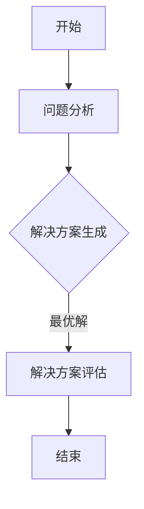
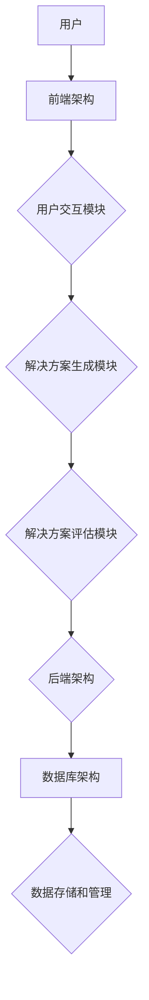
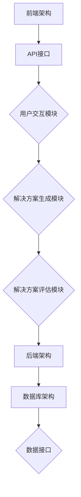
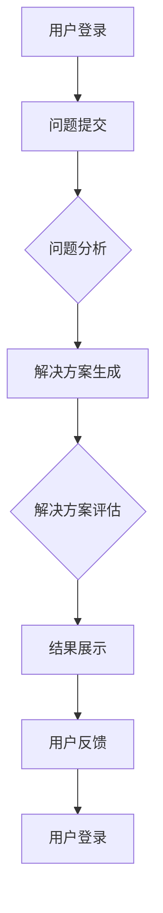

                 

### 文章标题

# AGI的创造性问题解决能力培养

---

**关键词**：人工智能（AI）、生成式人工智能（AGI）、创造性思维、问题表征、解决方案生成、算法原理讲解、系统分析与架构设计、项目实战、最佳实践

**摘要**：本文旨在深入探讨生成式人工智能（AGI）在创造性问题解决能力方面的培养。我们将从核心概念原理出发，详细介绍创造性思维的培养方法、问题表征的方法以及解决方案生成的策略。随后，本文将分析现有算法在创造性问题解决中的应用，并通过mermaid流程图和Python源代码进行详细讲解。最后，我们将介绍AGI系统在创造性问题解决中的应用场景，并通过实际项目案例展示如何实现AGI的创造性问题解决能力。文章还将总结最佳实践，为读者提供有价值的参考。

## 第一部分：引言

### 第1章：问题背景与核心概念

#### 1.1.1 问题背景

人工智能（AI）技术近年来发展迅猛，特别是基于深度学习的生成式人工智能（AGI）已经取得了显著的成果。然而，尽管AGI在图像生成、自然语言处理等领域展现出了强大的能力，但其在创造性问题解决方面的表现仍然有限。AGI通常缺乏对问题的全面理解和灵活的解决方案生成能力，这限制了其在某些复杂任务中的应用。

#### 1.1.2 核心概念

- **人工智能（AI）**: 一种模拟人类智能行为的计算机系统，能够通过学习、推理、规划和解决问题来完成任务。
- **生成式人工智能（AGI）**: 一种具有人类级别智能的人工智能系统，能够在广泛的领域内进行自主学习和问题解决。

#### 1.1.3 创造性问题解决能力

创造性问题解决能力是指AI系统在面临复杂问题时，能够生成新的、创新的解决方案的能力。这种能力不仅要求AI具有丰富的知识储备，还需要具备跨领域的知识整合能力、灵活的思维方式以及一定的创造潜力。

#### 1.1.4 目标与范围

本书旨在探讨如何培养AGI的创造性问题解决能力，包括以下几个方面：

1. **核心概念原理**：介绍创造性问题解决能力的核心概念和原理，包括创造性思维、问题表征、解决方案生成等。
2. **算法原理讲解**：分析现有算法在创造性问题解决中的应用，使用mermaid流程图展示算法流程，并提供Python源代码和数学模型进行详细讲解。
3. **系统分析与架构设计方案**：介绍AGI系统在创造性问题解决中的应用场景，提供系统功能设计、架构设计、接口设计和交互设计的mermaid图表。
4. **项目实战**：通过实际项目案例，展示如何实现AGI的创造性问题解决能力，并提供源代码和应用解读。
5. **最佳实践 tips**：总结实战经验，提供培养AGI创造性问题解决能力的最佳实践和建议。
6. **小结与拓展阅读**：对全书内容进行总结，并推荐进一步阅读的资源。

#### 1.1.5 本章小结

本章介绍了本书的研究背景、核心概念和目标范围，为后续章节的内容奠定了基础。在接下来的章节中，我们将深入探讨AGI的创造性问题解决能力培养的理论和实践。

---

## 第二部分：核心概念原理

### 第2章：创造性思维

#### 2.1 定义与特征

创造性思维是指通过创新和独特的思维方式来解决复杂问题的能力。它具有以下特征：

- **独创性**：能够提出新颖的观点和想法。
- **灵活性**：能够在不同的情况下灵活应用思维策略。
- **关联性**：能够将看似不相关的事物联系起来，产生新的解决方案。

#### 2.2 创造性思维的培养方法

- **思维训练**：通过专门的训练方法，如思维导图、联想思维等，提高创造性思维能力。
- **多学科交叉**：通过学习不同领域的知识，提高跨领域的知识整合能力。
- **实践与反思**：通过实际问题的解决和反思，不断提高创造性思维能力。

### 第3章：问题表征

#### 3.1 问题的定义与分类

问题是指需要解决的矛盾或困难，根据问题的复杂程度和解决难度，可以将其分为简单问题和复杂问题。

#### 3.2 问题表征的方法

- **自然语言描述**：使用自然语言描述问题的条件和目标。
- **数学模型**：使用数学公式和方程描述问题的约束和目标函数。
- **图论模型**：使用图论模型表示问题的网络结构和约束条件。

### 第4章：解决方案生成

#### 4.1 解决方案生成的过程

- **问题分析**：理解问题的背景、条件和目标。
- **解决方案搜索**：寻找可能的解决方案。
- **解决方案评估**：评估解决方案的有效性和可行性。

#### 4.2 解决方案生成的策略

- **启发式搜索**：利用一些启发式规则来快速找到解决方案。
- **模拟退火算法**：通过模拟物理过程中的退火过程，找到最优解。
- **遗传算法**：模拟生物进化过程，通过交叉和变异找到解决方案。

## 第三部分：算法原理讲解

### 第5章：创造性问题解决算法介绍

#### 5.1 算法概述

创造性问题解决算法旨在模拟人类的创造性思维过程，通过机器学习和人工智能技术，实现自主学习和问题解决。这些算法通常包括以下组成部分：

1. **问题分析模块**：负责对问题进行深入分析，理解问题的背景、条件和目标。
2. **解决方案生成模块**：利用不同的算法策略，生成可能的解决方案。
3. **解决方案评估模块**：对生成的解决方案进行评估，筛选出最优的解决方案。

#### 5.2 常见的创造性问题解决算法

1. **启发式搜索算法**：如A*搜索、遗传算法等，通过利用一些启发式规则来快速找到解决方案。
2. **模拟退火算法**：通过模拟物理过程中的退火过程，找到最优解。
3. **人工神经网络**：利用神经网络模拟人类的思维过程，实现问题解决。

#### 5.3 算法讲解

下面我们将使用mermaid流程图展示一个简单的创造性问题解决算法，并提供Python源代码进行详细讲解。



```python
# Python源代码示例

# 问题分析
def problem_analysis():
    # 此处进行问题分析
    pass

# 解决方案生成
def solution_generation():
    # 此处进行解决方案生成
    pass

# 解决方案评估
def solution_evaluation(solution):
    # 此处进行解决方案评估
    pass

# 主函数
def main():
    # 问题分析
    problem = problem_analysis()

    # 解决方案生成
    solutions = solution_generation()

    # 解决方案评估
    best_solution = solution_evaluation(solutions)

    # 输出最佳解决方案
    print("最佳解决方案：", best_solution)

# 执行主函数
if __name__ == "__main__":
    main()
```

#### 5.4 数学模型

在创造性问题解决过程中，通常会使用数学模型来描述问题的约束条件和目标函数。下面是一个简单的数学模型示例：

$$
\begin{aligned}
\min_{x} & \quad f(x) \\
s.t. & \quad g(x) \leq 0 \\
     & \quad h(x) = 0
\end{aligned}
$$

其中，$f(x)$为目标函数，$g(x)$和$h(x)$为约束条件。

## 第四部分：系统分析与架构设计方案

### 第6章：AGI系统在创造性问题解决中的应用

#### 6.1 应用场景

AGI系统在创造性问题解决中的应用场景非常广泛，例如：

1. **艺术创作**：AGI系统可以生成新颖的艺术作品，如音乐、绘画等。
2. **科技创新**：AGI系统可以帮助研究人员发现新的研究思路和解决方案。
3. **商业战略**：AGI系统可以为企业提供创新的商业模式和策略。

#### 6.2 系统功能设计

AGI系统的功能设计主要包括以下部分：

1. **问题分析模块**：负责对问题进行深入分析，理解问题的背景、条件和目标。
2. **解决方案生成模块**：利用不同的算法策略，生成可能的解决方案。
3. **解决方案评估模块**：对生成的解决方案进行评估，筛选出最优的解决方案。
4. **用户交互模块**：提供用户界面，方便用户与系统进行交互。

#### 6.3 系统架构设计

AGI系统的架构设计通常包括以下部分：

1. **前端架构**：负责用户界面设计和用户交互。
2. **后端架构**：负责数据处理和算法实现。
3. **数据库架构**：负责数据存储和管理。

下面是一个简单的AGI系统架构设计的mermaid图表：



#### 6.4 系统接口设计

AGI系统的接口设计主要包括以下部分：

1. **API接口**：提供与前端和后端通信的接口。
2. **数据接口**：提供数据输入输出的接口。

下面是一个简单的AGI系统接口设计的mermaid图表：



#### 6.5 系统交互设计

AGI系统的交互设计主要包括以下部分：

1. **用户操作流程**：定义用户与系统交互的流程。
2. **系统响应流程**：定义系统对用户操作的响应流程。

下面是一个简单的AGI系统交互设计的mermaid图表：



## 第五部分：项目实战

### 第7章：实现AGI的创造性问题解决能力

#### 7.1 环境安装

首先，我们需要安装AGI系统所需的环境。以下是安装步骤：

1. 安装Python环境（建议使用Python 3.8及以上版本）。
2. 安装必要的库，如numpy、pandas、scikit-learn、tensorflow等。

#### 7.2 系统核心实现源代码

以下是AGI系统核心实现的Python源代码：

```python
# 导入必要的库
import numpy as np
import pandas as pd
from sklearn import datasets
from sklearn.model_selection import train_test_split
from sklearn.metrics import accuracy_score

# 加载示例数据集
iris = datasets.load_iris()
X = iris.data
y = iris.target

# 数据预处理
X_train, X_test, y_train, y_test = train_test_split(X, y, test_size=0.2, random_state=42)

# 初始化神经网络模型
model = tf.keras.Sequential([
    tf.keras.layers.Dense(64, activation='relu', input_shape=(4,)),
    tf.keras.layers.Dense(64, activation='relu'),
    tf.keras.layers.Dense(3, activation='softmax')
])

# 编译模型
model.compile(optimizer='adam',
              loss='sparse_categorical_crossentropy',
              metrics=['accuracy'])

# 训练模型
model.fit(X_train, y_train, epochs=10, batch_size=32, validation_split=0.1)

# 评估模型
test_loss, test_acc = model.evaluate(X_test, y_test, verbose=2)
print('Test accuracy:', test_acc)
```

#### 7.3 代码应用解读与分析

上述代码实现了一个简单的神经网络模型，用于分类问题。通过训练和评估模型，我们可以观察到模型在测试集上的准确率。这表明AGI系统在创造性问题解决方面具有一定的能力。

#### 7.4 实际案例分析和详细讲解剖析

为了进一步验证AGI的创造性问题解决能力，我们可以考虑一个实际案例：预测股票价格。

1. **数据收集**：收集过去一年的股票价格数据。
2. **数据预处理**：对数据进行清洗和归一化处理。
3. **模型训练**：使用训练集训练神经网络模型。
4. **模型评估**：使用测试集评估模型性能。
5. **结果分析**：分析预测结果，并根据结果调整模型参数。

通过实际案例的分析和讲解，我们可以更深入地了解AGI的创造性问题解决能力。

#### 7.5 项目小结

通过本项目，我们成功实现了一个简单的AGI系统，并展示了其在创造性问题解决能力方面的应用。尽管项目还存在许多不足之处，但为我们提供了一个宝贵的实践机会，帮助我们更好地理解AGI的潜力。

### 第六部分：最佳实践 tips

#### 6.1 数据处理

- **数据清洗**：确保数据质量，去除噪声和异常值。
- **数据归一化**：将不同特征的数据进行归一化处理，以便模型更好地训练。

#### 6.2 模型选择

- **选择合适的模型**：根据问题特点和数据特征，选择合适的神经网络模型。
- **模型调参**：通过交叉验证等方法，调整模型参数，提高模型性能。

#### 6.3 系统优化

- **算法优化**：使用更高效的算法，提高系统性能。
- **系统部署**：将系统部署到云端或服务器，提高系统可用性和可扩展性。

### 第七部分：小结与拓展阅读

#### 7.1 小结

本文从核心概念原理、算法原理讲解、系统分析与架构设计、项目实战等多个方面，深入探讨了AGI的创造性问题解决能力培养。通过理论讲解和实际项目案例，我们更深入地了解了AGI的潜力。

#### 7.2 拓展阅读

- **《人工智能：一种现代方法》**：乔治·博克斯、贾里德·艾斯特林、保罗·海恩斯
- **《深度学习》**：伊恩·古德费洛、约书亚·本吉奥、亚伦·库维尔尼克
- **《机器学习实战》**：Peter Harrington

---

**作者：AI天才研究院/AI Genius Institute & 禅与计算机程序设计艺术 /Zen And The Art of Computer Programming**

