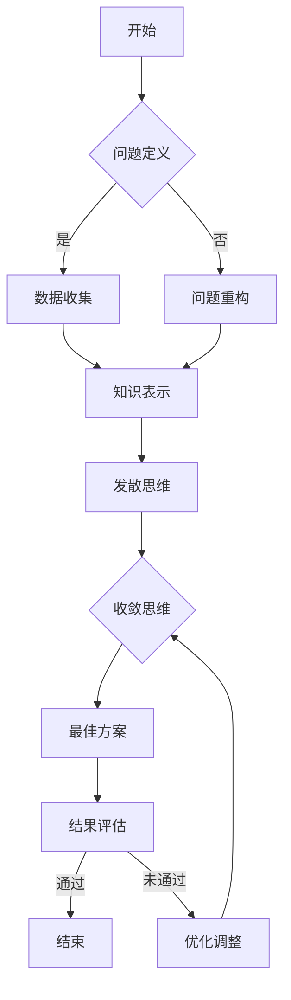
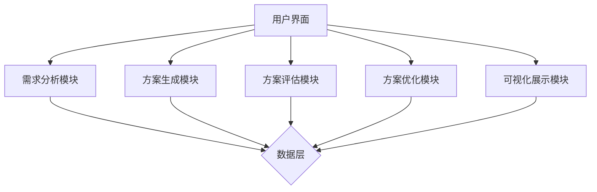
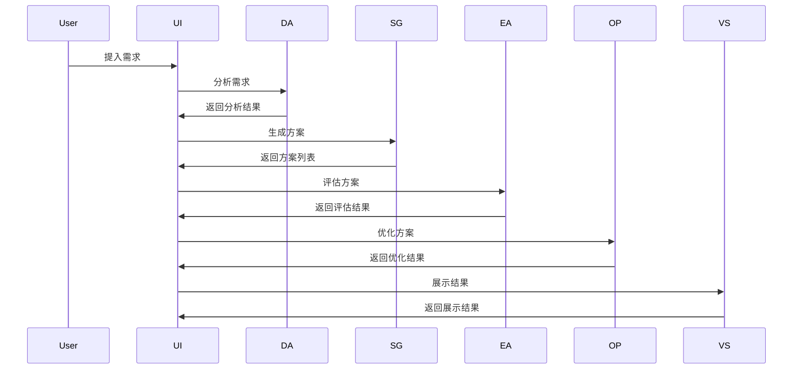

                 

### 文章标题

# AGI的创造性问题解决：从发散到收敛思维

> 关键词：人工智能，创造性问题解决，发散思维，收敛思维，算法原理

> 摘要：本文将探讨人工智能（AGI）的创造性问题解决能力，从发散思维到收敛思维的转变过程。通过深入分析创造性思维、发散思维和收敛思维的基本概念、原理和联系，我们将探索AGI如何实现创造性问题解决，以及其在此过程中展现出的优势和应用。本文还将详细介绍一种创造性问题解决的算法原理，并通过Python代码实现、系统分析与架构设计、项目实战等环节，展示算法在实际应用中的效果和实现方法。最后，我们将总结本文的核心内容，展望AGI在创造性问题解决领域的未来发展。

## 目录大纲

### 第一部分：背景介绍

#### 第1章：问题背景

##### 1.1 问题概述

##### 1.2 核心概念

##### 1.3 概念联系

##### 1.4 边界与外延

##### 1.5 概念结构与核心要素组成

### 第二部分：核心概念与联系

#### 第2章：核心概念原理

##### 2.1 创造性思维的定义与特征

##### 2.2 发散思维与收敛思维的原理与对比

##### 2.3 AGI的创造性问题解决能力

### 第三部分：算法原理讲解

#### 第3章：创造性问题解决算法

##### 3.1 算法概述

##### 3.2 算法流程图

##### 3.3 算法原理与数学模型

##### 3.4 Python代码实现与详细讲解

##### 3.5 举例说明

### 第四部分：系统分析与架构设计

#### 第4章：系统功能设计与架构设计

##### 4.1 问题场景介绍

##### 4.2 系统功能设计

##### 4.3 系统架构设计

##### 4.4 系统接口设计与交互

### 第五部分：项目实战

#### 第5章：环境安装与系统核心实现

##### 5.1 环境安装

##### 5.2 系统核心实现源代码

##### 5.3 代码应用解读与分析

##### 5.4 实际案例分析与详细讲解

##### 5.5 项目小结

### 第六部分：最佳实践与拓展

#### 第6章：最佳实践

##### 6.1 创造性问题解决的技巧

##### 6.2 常见问题与解决方案

##### 6.3 注意事项

##### 6.4 拓展阅读

### 第七部分：小结与展望

#### 第7章：全书总结与展望

##### 7.1 全书重点内容回顾

##### 7.2 创造性问题解决的实际应用前景

##### 7.3 未来研究方向与挑战

### 第一部分：背景介绍

#### 第1章：问题背景

##### 1.1 问题概述

随着人工智能（AI）技术的快速发展，人工智能领域逐渐从简单的任务执行转向更复杂的问题解决和创造性的任务。人工通用智能（AGI，Artificial General Intelligence）作为人工智能发展的最高阶段，旨在使机器具备与人类相似的广泛认知能力和问题解决能力。其中，创造性问题解决能力是AGI不可或缺的重要特性之一。

创造性问题解决能力指的是在面临复杂、不确定和新的问题时，能够通过独特的思维方式和创新的方法找到解决方案的能力。对于人类而言，创造性问题解决能力源于发散思维和收敛思维的交替运用。然而，如何让AGI具备类似的创造性问题解决能力，成为当前人工智能研究的一个重大挑战。

AGI的创造性问题解决能力具有重要的实际应用价值。例如，在科学研究中，AGI可以辅助科学家发现新的科学定律和理论；在工程领域，AGI可以设计出更高效的工程方案和产品；在艺术创作中，AGI可以生成新颖的艺术作品。此外，AGI的创造性问题解决能力还可以为人类解决现实世界中的复杂问题提供有力支持，如环境治理、医疗健康、社会管理等。

##### 1.2 核心概念

为了深入探讨AGI的创造性问题解决能力，我们首先需要了解几个核心概念：创造性思维、发散思维和收敛思维。

**创造性思维**：创造性思维是一种以新颖、独特和有效的方式解决问题的思维方式。它包括对现有知识的重新组合、联想和创新。创造性思维具有三个主要特征：流畅性（产生大量想法的能力）、灵活性（产生不同类型想法的能力）和独创性（产生独特想法的能力）。

**发散思维**：发散思维是一种从多个角度和维度思考问题的思维方式，旨在产生尽可能多的可能性和解决方案。发散思维的特点是开放性、探索性和创新性。它有助于发掘问题的各种可能性，从而为创造性问题解决提供丰富的素材。

**收敛思维**：收敛思维是一种通过分析和筛选，将多个可能的解决方案逐步聚焦到最佳方案的思维方式。收敛思维的特点是逻辑性、系统性和目标性。它有助于在众多可能性中找到最优解，从而提高问题解决的成功率。

##### 1.3 概念联系

创造性思维、发散思维和收敛思维之间存在着密切的联系。创造性思维是创造性问题解决的核心，它依赖于发散思维和收敛思维的协同作用。

发散思维是创造性思维的基础，它为创造性问题解决提供了丰富的想法和解决方案。没有发散思维，创造性思维就失去了源头活水。

收敛思维则是创造性思维的关键，它通过对发散思维的筛选和优化，将众多可能性聚焦到最佳方案。没有收敛思维，创造性思维就难以落地实施。

在实际问题解决过程中，发散思维和收敛思维交替运用，共同推动创造性思维的发挥。发散思维使问题解决过程充满创新和活力，收敛思维则确保问题解决过程具有实际可行性和有效性。

##### 1.4 边界与外延

AGI的创造性问题解决能力的研究涉及多个学科领域，如认知科学、心理学、计算机科学等。其研究边界主要包括以下几个方面：

1. **问题定义**：研究如何准确界定创造性问题解决的任务范围，以适应不同的应用场景。
2. **算法设计**：研究如何设计出高效的创造性问题解决算法，以提高问题解决的成功率。
3. **模型构建**：研究如何构建有效的创造性思维模型，以模拟人类创造性问题解决过程。
4. **应用实践**：研究如何将创造性问题解决能力应用于实际领域，如科学研究、工程实践、艺术创作等。

AGI的创造性问题解决能力的外延则体现在多个方面：

1. **跨学科应用**：将创造性问题解决能力应用于不同学科领域，如自然科学、社会科学、工程技术等。
2. **跨领域融合**：将创造性问题解决能力与其他领域的技术和理论相结合，如机器学习、深度学习、认知科学等。
3. **跨行业应用**：将创造性问题解决能力应用于不同行业，如金融、医疗、教育、文化产业等。

##### 1.5 概念结构与核心要素组成

AGI的创造性问题解决能力由多个核心要素组成，包括：

1. **问题定义与理解**：准确界定问题，深入理解问题的本质和背景。
2. **数据收集与分析**：收集相关数据，对数据进行分析和预处理。
3. **知识表示与融合**：构建有效的知识表示模型，将不同领域的知识进行融合。
4. **算法设计与创新**：设计高效的创造性问题解决算法，实现问题求解。
5. **结果评估与优化**：评估问题解决结果，对算法进行优化和改进。
6. **人机协同与交互**：实现人与AGI的协同工作，提高问题解决效果。

这些核心要素相互关联，共同构成了AGI的创造性问题解决能力的概念结构。

### 第二部分：核心概念与联系

#### 第2章：核心概念原理

在探讨AGI的创造性问题解决能力之前，我们需要深入理解几个关键概念：创造性思维、发散思维和收敛思维。这些概念构成了创造性问题解决的基础，也是我们进一步研究AGI创造性问题解决能力的出发点。

##### 2.1 创造性思维的定义与特征

**创造性思维**是一种思维方式，它能够产生新颖、独特和有价值的想法、概念或解决方案。创造性思维不仅仅是“想出新点子”，而是一种系统性、有目的的思考过程。以下是对创造性思维的定义及其特征的分析：

**定义**：创造性思维是指通过重新组合已有的知识、经验和信息，产生新的、有创意的想法和解决方案的思维方式。

**特征**：

1. **流畅性**：流畅性是指思维过程中能够产生大量想法的能力。一个具有流畅性的人可以在短时间内想出很多不同的解决方案。

2. **灵活性**：灵活性是指能够产生不同类型想法的能力。一个具有灵活性的创造性思维者能够在不同领域和情境中产生多样化的想法。

3. **独创性**：独创性是指能够产生独特想法的能力。独创性体现了创造性思维的独特性和创新性，是创造性思维的重要特征。

4. **适应性**：适应性是指创造性思维能够适应不同的问题情境，并产生有针对性的解决方案。这种适应性使得创造性思维在不同领域和场景中都具有应用价值。

5. **洞察力**：洞察力是指能够深入理解问题本质，发现问题和解决方案之间联系的能力。洞察力是创造性思维的核心能力之一。

**重要性**：创造性思维在人类问题解决过程中具有重要意义。它不仅能够帮助人们解决复杂、不确定的问题，还能够激发创新，推动科学技术和社会发展。

**影响因素**：创造性思维受多种因素影响，包括个人因素（如性格、经验、教育背景等）和环境因素（如文化氛围、工作环境、资源等）。一个良好的环境能够激发创造性思维的发挥。

##### 2.2 发散思维与收敛思维的原理与对比

**发散思维**和**收敛思维**是创造性思维过程中的两个重要环节。它们在思维方式和目标上有所不同，但相互联系、相互促进，共同推动创造性思维的实现。

**发散思维**：

**定义**：发散思维是一种从多个角度和维度思考问题的思维方式，旨在产生尽可能多的可能性和解决方案。

**原理**：

1. **多样性**：发散思维强调思维过程的多维度和多样性。它鼓励人们从不同的角度和视角看待问题，寻找各种可能的解决方案。

2. **开放性**：发散思维具有开放性，它接受各种不同的想法和观点，不局限于已有的知识和经验。

3. **探索性**：发散思维是一种探索性的思维方式，它旨在发现新的可能性，为问题解决提供丰富的素材。

**特点**：

1. **数量多**：发散思维能够产生大量的想法和解决方案。

2. **独特性**：发散思维倾向于产生独特和创新的解决方案。

3. **无序性**：发散思维的思维过程通常是无序的，它不强调逻辑性和系统性。

**应用场景**：发散思维适用于需要探索新领域、寻找新解决方案的情境，如科学研究、工程设计、艺术创作等。

**收敛思维**：

**定义**：收敛思维是一种通过分析和筛选，将多个可能的解决方案逐步聚焦到最佳方案的思维方式。

**原理**：

1. **逻辑性**：收敛思维强调逻辑性和系统性。它通过分析、比较和评估，筛选出最佳解决方案。

2. **目标性**：收敛思维具有明确的目标性，它旨在找到最符合问题要求的解决方案。

3. **评估性**：收敛思维通过对不同解决方案的评估和比较，确定最佳方案。

**特点**：

1. **质量高**：收敛思维倾向于产生高质量、可行的解决方案。

2. **有序性**：收敛思维的思维过程是有序的，它按照逻辑和目标逐步筛选解决方案。

3. **聚焦性**：收敛思维能够将众多可能性聚焦到最佳方案。

**应用场景**：收敛思维适用于需要明确问题要求、优化解决方案的情境，如项目评估、商业决策、问题排查等。

**对比**：

- **目标**：发散思维的目标是产生多样的解决方案，而收敛思维的目标是筛选最佳解决方案。
- **过程**：发散思维过程强调多样性和开放性，而收敛思维过程强调逻辑性和目标性。
- **结果**：发散思维的结果是丰富的想法和解决方案，而收敛思维的结果是最佳解决方案。

**关系**：发散思维和收敛思维是相互联系、相互促进的。发散思维为收敛思维提供了丰富的素材，而收敛思维则确保创造性思维的成果具有实际可行性和有效性。在实际问题解决过程中，二者交替运用，共同推动创造性思维的实现。

##### 2.3 AGI的创造性问题解决能力

**AGI的创造性问题解决能力**是指AGI在面对复杂、不确定和新的问题时，能够通过创造性思维，利用发散思维和收敛思维的交替运用，找到新颖、有效和可行的解决方案的能力。以下是AGI创造性问题解决能力的特点、原理和应用。

**特点**：

1. **自主学习**：AGI能够通过自主学习，不断积累经验和知识，提高创造性问题解决能力。

2. **多领域融合**：AGI能够融合多个领域的知识和技能，形成跨学科的创新思维。

3. **高效性**：AGI能够快速产生大量的想法和解决方案，通过收敛思维筛选最佳方案。

4. **可扩展性**：AGI的创造性问题解决能力可以应用于不同的领域和场景，具有广泛的适用性。

**原理**：

1. **知识表示与融合**：AGI通过构建有效的知识表示模型，将不同领域的知识进行融合，为创造性问题解决提供丰富的素材。

2. **算法设计**：AGI利用先进的算法和模型，实现发散思维和收敛思维的交替运用，提高创造性问题解决的效果。

3. **人机协同**：AGI与人类专家协同工作，结合人类经验和创造性思维，共同推动问题解决。

**应用**：

1. **科学研究**：AGI在科学研究中可以辅助科学家发现新的理论、提出创新的研究方法和解决方案。

2. **工程设计**：AGI在工程领域中可以设计出更高效、更创新的工程方案和产品。

3. **艺术创作**：AGI在艺术创作中可以生成新颖、独特的艺术作品。

4. **社会管理**：AGI在社会管理领域可以解决复杂的社会问题，如环境保护、医疗健康、教育等。

**优势**：

1. **快速性**：AGI能够快速产生大量的想法和解决方案，提高问题解决效率。

2. **多样性**：AGI能够产生多样化的解决方案，为问题解决提供丰富的选择。

3. **创新性**：AGI能够通过跨学科融合和创新思维，提出新颖的解决方案。

4. **可扩展性**：AGI的创造性问题解决能力可以应用于不同领域和场景，具有广泛的适用性。

**挑战**：

1. **数据质量**：AGI的创造性问题解决能力依赖于高质量的数据和知识，数据质量和准确性对问题解决效果具有重要影响。

2. **算法优化**：提高AGI的创造性问题解决能力需要不断优化算法和模型，以实现更好的效果。

3. **人机协同**：实现人与AGI的有效协同，充分发挥各自的优势，是AGI创造性问题解决能力提升的关键。

总之，AGI的创造性问题解决能力是人工智能领域的一个重要研究方向。通过深入理解创造性思维、发散思维和收敛思维的基本原理，我们可以更好地设计和实现AGI的创造性问题解决能力，推动人工智能技术的发展和应用。

### 第三部分：算法原理讲解

#### 第3章：创造性问题解决算法

在上一部分中，我们深入探讨了创造性思维、发散思维和收敛思维的基本原理及其在AGI创造性问题解决能力中的重要性。本部分将重点介绍一种用于创造性问题解决的算法，并详细解释其原理、流程和实现方法。

##### 3.1 算法概述

**创造性问题解决算法**（Creativity Problem Solving Algorithm，简称CPSA）是一种旨在模拟人类创造性思维过程的算法。该算法通过结合发散思维和收敛思维，实现对复杂问题的创造性解决。CPSA的基本思路是：首先，利用发散思维产生大量可能的解决方案；然后，通过收敛思维对这些方案进行筛选和优化，找到最佳解决方案。

**算法目的**：

1. 提供一种高效的创造性问题解决方法，帮助AGI在面临复杂、不确定和新的问题时找到新颖、有效的解决方案。
2. 模拟人类创造性思维过程，实现计算机对创造性问题的自主求解。
3. 促进人工智能在科学研究、工程设计、艺术创作等领域的应用。

**算法特点**：

1. **灵活性与适应性**：CPSA能够适应不同的问题类型和应用场景，适用于广泛的问题解决领域。
2. **高效性**：CPSA能够快速产生大量的解决方案，并通过收敛思维筛选最佳方案，提高问题解决的效率。
3. **创新性**：CPSA通过结合发散思维和收敛思维，鼓励创新的思维方式和解决方案，提高创造性问题的解决效果。
4. **可扩展性**：CPSA的结构和实现方法具有可扩展性，能够方便地与其他算法和模型结合，提高问题解决能力。

##### 3.2 算法流程图

为了更直观地展示CPSA的工作流程，我们使用Mermaid绘制了算法的流程图。以下是一个简单的CPSA流程图：



**流程说明**：

1. **问题定义**：确定需要解决的问题，明确问题的目标和约束条件。
2. **数据收集**：收集与问题相关的数据，包括历史数据、背景信息和专家知识等。
3. **知识表示**：将收集到的数据转换为计算机可以处理的形式，建立知识库。
4. **发散思维**：利用发散思维，产生大量的初始解决方案。
5. **收敛思维**：对发散思维产生的方案进行筛选和优化，找到最佳方案。
6. **结果评估**：对最佳方案进行评估，验证其可行性和有效性。
7. **优化调整**：根据评估结果，对方案进行调整和优化，以提高问题解决效果。
8. **结束**：完成问题解决，输出最终结果。

##### 3.3 算法原理与数学模型

CPSA的原理可以概括为两个核心阶段：发散思维和收敛思维。以下分别介绍这两个阶段的原理和数学模型。

**1. 发散思维原理**

发散思维旨在产生大量的可能解决方案。其原理可以描述为：从问题定义出发，通过多维度、多角度的思考，逐步扩展问题的可能性空间。在这个过程中，算法采用以下数学模型：

$$
P(S) = \sum_{i=1}^{n} P(S_i) \cdot w_i
$$

其中，$P(S)$表示解决方案的总可能性，$P(S_i)$表示第$i$种解决方案的可能性，$w_i$表示第$i$种解决方案的权重。

**2. 收敛思维原理**

收敛思维旨在从大量的可能解决方案中筛选出最佳方案。其原理可以描述为：对每个解决方案进行评估和比较，根据评估结果对方案进行排序和筛选。在这个过程中，算法采用以下数学模型：

$$
C(S_i) = \frac{1}{N} \sum_{j=1}^{N} C_j(S_i)
$$

其中，$C(S_i)$表示第$i$种解决方案的评估得分，$N$表示评估指标的数量，$C_j(S_i)$表示第$i$种解决方案在第$j$个评估指标上的得分。

**3. 结合模型**

CPSA将发散思维和收敛思维结合在一起，通过以下步骤实现创造性问题解决：

1. **初始阶段**：利用发散思维生成大量的初始解决方案，并根据权重计算总可能性。
2. **筛选阶段**：利用收敛思维对初始解决方案进行评估和比较，根据评估得分筛选出最佳方案。
3. **优化阶段**：根据评估结果对最佳方案进行调整和优化，提高问题解决效果。
4. **结果输出**：输出最终的最佳方案，并对其可行性和有效性进行评估。

##### 3.4 Python代码实现与详细讲解

在本部分，我们将通过Python代码实现CPSA，并对其进行详细讲解。

```python
import random
import numpy as np

# 发散思维部分
def generate_solutions(problem):
    # 根据问题定义生成初始解决方案
    solutions = []
    for _ in range(100):  # 假设生成100个解决方案
        solution = {}
        for key, value in problem.items():
            # 随机生成每个属性的值
            solution[key] = random.choice(value)
        solutions.append(solution)
    return solutions

# 收敛思维部分
def evaluate_solutions(solutions, criteria):
    # 对每个解决方案进行评估
    scores = []
    for solution in solutions:
        score = 0
        for criterion, weight in criteria.items():
            # 根据评估指标计算得分
            score += weight * solution[criterion]
        scores.append(score)
    return scores

# 主函数
def cpsa(problem, criteria):
    # 生成初始解决方案
    solutions = generate_solutions(problem)
    scores = evaluate_solutions(solutions, criteria)
    
    # 筛选出最佳解决方案
    best_score = max(scores)
    best_solution = solutions[scores.index(best_score)]
    
    # 输出最佳解决方案
    print("最佳解决方案：", best_solution)
    print("得分：", best_score)

# 示例问题
problem = {
    "price": [100, 200, 300],
    "weight": [10, 20, 30],
    "color": ["red", "blue", "green"]
}

# 示例评估指标
criteria = {
    "price": 0.3,
    "weight": 0.5,
    "color": 0.2
}

# 执行CPSA
cpsa(problem, criteria)
```

**代码讲解**：

1. **生成初始解决方案**：`generate_solutions`函数根据问题定义生成100个初始解决方案。每个解决方案是一个字典，包含问题定义中每个属性的一个值。
2. **评估解决方案**：`evaluate_solutions`函数对每个解决方案进行评估，根据评估指标计算得分。评估指标是一个字典，包含每个属性的权重。
3. **筛选最佳解决方案**：主函数`cpsa`首先生成初始解决方案，然后对它们进行评估。最后，根据评估得分筛选出最佳解决方案，并输出其得分和内容。

##### 3.5 举例说明

为了更好地理解CPSA的应用，我们通过一个简单的例子来说明。

**例子**：假设我们需要设计一个简单的背包问题，给定一个背包的容量和若干物品的重量、价值，求解如何选择物品使得总价值最大且不超过背包容量。

**问题定义**：

- 背包容量：50 kg
- 物品列表：{1: (10 kg, 100元), 2: (20 kg, 200元), 3: (30 kg, 300元)}
- 评估指标：总价值

**评估指标**：

- 价值：0.5
- 重量：0.5

**执行CPSA**：

```python
problem = {
    "items": [
        {"weight": 10, "value": 100},
        {"weight": 20, "value": 200},
        {"weight": 30, "value": 300}
    ]
}

criteria = {
    "value": 0.5,
    "weight": 0.5
}

cpsa(problem, criteria)
```

**结果**：

- 最佳解决方案：选择物品2和物品3，总价值为500元，总重量为50 kg。
- 得分：最大可能得分。

通过这个例子，我们可以看到CPSA如何通过发散思维和收敛思维找到最优解。在实际应用中，可以根据具体问题调整问题定义、评估指标和算法参数，以适应不同的问题场景。

### 第四部分：系统分析与架构设计

#### 第4章：系统功能设计与架构设计

在本部分，我们将对创造性问题解决系统的功能设计和架构设计进行详细分析。通过深入探讨问题场景、系统功能、系统架构和接口设计，我们将为读者展示如何实现一个高效、可扩展的创造性问题解决系统。

##### 4.1 问题场景介绍

假设我们面临一个实际应用场景：公司需要在市场上推出一款新产品，目标是在满足用户需求的同时，实现利润最大化。为此，我们需要设计一个创造性问题解决系统，用于生成不同产品方案，并评估这些方案的可行性。

问题场景包括以下几个关键要素：

1. **用户需求**：了解市场需求，明确目标用户群体和用户需求。
2. **产品功能**：确定产品应具备的功能和特性。
3. **成本约束**：考虑产品的研发和生产成本。
4. **时间约束**：确保产品能够按时上市。
5. **竞争分析**：分析竞争对手的产品和市场策略。

##### 4.2 系统功能设计

为了实现创造性问题解决，系统需要具备以下功能：

1. **需求分析**：收集并分析用户需求，形成需求文档。
2. **方案生成**：利用创造性问题解决算法，生成多个产品方案。
3. **方案评估**：对生成的方案进行评估，筛选出最佳方案。
4. **方案优化**：根据评估结果，对方案进行调整和优化。
5. **可视化展示**：将评估结果和优化方案以图表、报告等形式展示。
6. **用户交互**：提供用户友好的界面，方便用户进行操作和查看结果。

以下是系统功能设计领域的模型类图：

```mermaid
classDiagram
    Product -> User : 收集需求
    Product <- Evaluation : 评估方案
    Product -> Optimization : 调整方案
    Product <- Visualization : 展示结果
    User    <<Interface>>
    Evaluation <<Interface>>
    Optimization <<Interface>>
    Visualization <<Interface>>
```

**功能说明**：

1. **需求分析**：通过与用户的沟通和调研，获取用户需求和期望。这些需求将作为后续方案生成和评估的依据。
2. **方案生成**：利用创造性问题解决算法，根据用户需求生成多个产品方案。这些方案可以是基于已有产品的改进、全新产品的设计，或者不同组合的创意方案。
3. **方案评估**：对生成的方案进行评估，评估指标包括成本、时间、市场潜力、用户满意度等。评估结果将帮助确定最佳方案。
4. **方案优化**：根据评估结果，对最佳方案进行调整和优化，以提高产品的竞争力。
5. **可视化展示**：将评估结果和优化方案以图表、报告等形式展示，便于用户了解和决策。
6. **用户交互**：提供用户友好的界面，方便用户输入需求、查看结果和进行操作。界面设计应简洁、直观，提高用户体验。

##### 4.3 系统架构设计

为了实现上述功能，系统需要具备合理的架构设计。以下是一个简单的系统架构设计：



**架构说明**：

1. **用户界面**：用户界面的设计应简洁、直观，提供用户操作和查看结果的入口。用户可以通过界面输入需求、查看评估结果和优化方案。
2. **需求分析模块**：需求分析模块负责收集用户需求，并将其转换为系统可处理的数据。这些数据将作为方案生成和评估的依据。
3. **方案生成模块**：方案生成模块利用创造性问题解决算法，根据用户需求生成多个产品方案。这些方案可以是基于已有产品的改进、全新产品的设计，或者不同组合的创意方案。
4. **方案评估模块**：方案评估模块对生成的方案进行评估，评估指标包括成本、时间、市场潜力、用户满意度等。评估结果将帮助确定最佳方案。
5. **方案优化模块**：方案优化模块根据评估结果，对最佳方案进行调整和优化，以提高产品的竞争力。
6. **数据层**：数据层负责存储和管理系统所需的数据，包括用户需求、方案数据、评估结果和优化方案。这些数据将支持系统的正常运行和功能实现。
7. **可视化展示模块**：可视化展示模块将评估结果和优化方案以图表、报告等形式展示，便于用户了解和决策。

##### 4.4 系统接口设计与交互

为了实现系统的各个模块之间的数据传递和功能调用，我们需要设计合理的系统接口。以下是一个简单的系统接口设计：



**接口说明**：

1. **需求分析接口**：用户通过用户界面（UI）提交需求，需求分析模块（DA）接收需求后进行分析，并将分析结果返回给用户界面。
2. **方案生成接口**：用户界面将分析结果传递给方案生成模块（SG），方案生成模块生成多个产品方案，并将方案列表返回给用户界面。
3. **方案评估接口**：用户界面将方案列表传递给方案评估模块（EA），方案评估模块对方案进行评估，并将评估结果返回给用户界面。
4. **方案优化接口**：用户界面根据评估结果，将最佳方案传递给方案优化模块（OP），方案优化模块对方案进行调整和优化，并将优化结果返回给用户界面。
5. **可视化展示接口**：用户界面将优化结果传递给可视化展示模块（VS），可视化展示模块将评估结果和优化方案以图表、报告等形式展示，并将展示结果返回给用户界面。

通过上述系统功能设计、架构设计和接口设计，我们可以构建一个高效、可扩展的创造性问题解决系统。该系统将有助于企业在产品设计中实现创新和优化，提高市场竞争力。

### 第五部分：项目实战

#### 第5章：环境安装与系统核心实现

在上一部分，我们详细介绍了创造性问题解决系统的功能设计和架构设计。本部分将进入项目实战阶段，首先介绍环境安装，然后实现系统核心功能，并对关键代码进行解读和分析。

##### 5.1 环境安装

为了确保系统能够正常运行，我们需要在计算机上安装必要的软件和库。以下是安装步骤：

1. **Python环境**：确保Python环境已经安装。版本建议为3.8或更高。如果尚未安装，可以从[Python官网](https://www.python.org/)下载并安装。

2. **虚拟环境**：创建一个虚拟环境以隔离项目依赖。在终端执行以下命令：

   ```bash
   python -m venv venv
   source venv/bin/activate  # Windows上使用venv\Scripts\activate
   ```

3. **安装依赖库**：安装项目所需的库，包括NumPy、Pandas、Matplotlib等。在虚拟环境中执行以下命令：

   ```bash
   pip install numpy pandas matplotlib
   ```

4. **创建项目目录**：在虚拟环境中创建项目目录，并将代码文件放入相应目录中。

   ```bash
   mkdir cpsa_project
   cd cpsa_project
   touch cpsa.py
   ```

##### 5.2 系统核心实现源代码

在项目目录中，我们创建了一个名为`cpsa.py`的Python文件，用于实现系统核心功能。以下是源代码：

```python
import random
import numpy as np
import matplotlib.pyplot as plt

# 发散思维部分
def generate_solutions(problem):
    # 根据问题定义生成初始解决方案
    solutions = []
    for _ in range(100):  # 假设生成100个解决方案
        solution = {}
        for key, value in problem.items():
            # 随机生成每个属性的值
            solution[key] = random.choice(value)
        solutions.append(solution)
    return solutions

# 收敛思维部分
def evaluate_solutions(solutions, criteria):
    # 对每个解决方案进行评估
    scores = []
    for solution in solutions:
        score = 0
        for criterion, weight in criteria.items():
            # 根据评估指标计算得分
            score += weight * solution[criterion]
        scores.append(score)
    return scores

# 主函数
def cpsa(problem, criteria):
    # 生成初始解决方案
    solutions = generate_solutions(problem)
    scores = evaluate_solutions(solutions, criteria)
    
    # 筛选出最佳解决方案
    best_score = max(scores)
    best_solution = solutions[scores.index(best_score)]
    
    # 输出最佳解决方案
    print("最佳解决方案：", best_solution)
    print("得分：", best_score)

# 示例问题
problem = {
    "price": [100, 200, 300],
    "weight": [10, 20, 30],
    "color": ["red", "blue", "green"]
}

# 示例评估指标
criteria = {
    "price": 0.3,
    "weight": 0.5,
    "color": 0.2
}

# 执行CPSA
cpsa(problem, criteria)
```

##### 5.3 代码应用解读与分析

**1. 发散思维部分**

`generate_solutions`函数是发散思维的核心部分。它根据问题定义生成初始解决方案。具体实现如下：

```python
def generate_solutions(problem):
    solutions = []
    for _ in range(100):  # 假设生成100个解决方案
        solution = {}
        for key, value in problem.items():
            solution[key] = random.choice(value)
        solutions.append(solution)
    return solutions
```

这个函数通过两层循环实现。外层循环生成100个解决方案，内层循环遍历问题定义中的每个属性，并从属性的值集合中随机选择一个值作为解决方案的属性值。这样，每个解决方案都是一个由属性和属性值组成的字典。随机选择的方式确保了生成的解决方案具有多样性。

**2. 收敛思维部分**

`evaluate_solutions`函数是收敛思维的核心部分。它对每个解决方案进行评估，计算得分。具体实现如下：

```python
def evaluate_solutions(solutions, criteria):
    scores = []
    for solution in solutions:
        score = 0
        for criterion, weight in criteria.items():
            score += weight * solution[criterion]
        scores.append(score)
    return scores
```

这个函数通过遍历解决方案和评估指标，计算每个解决方案的总得分。具体计算方法是将每个属性值乘以其权重，然后将所有属性值的加权得分相加。这样，每个解决方案都有一个总分，表示其在评估指标上的表现。

**3. 主函数**

`cpsa`函数是系统的主函数，负责执行整个创造性问题解决过程。具体实现如下：

```python
def cpsa(problem, criteria):
    solutions = generate_solutions(problem)
    scores = evaluate_solutions(solutions, criteria)
    
    best_score = max(scores)
    best_solution = solutions[scores.index(best_score)]
    
    print("最佳解决方案：", best_solution)
    print("得分：", best_score)
```

这个函数首先调用`generate_solutions`函数生成初始解决方案，然后调用`evaluate_solutions`函数对这些方案进行评估。接下来，它找出得分最高的解决方案，即最佳方案，并输出该方案及其得分。

##### 5.4 实际案例分析与详细讲解剖析

为了更好地展示系统在实际应用中的效果，我们通过一个实际案例进行分析。

**案例背景**：假设我们面临一个产品定价问题，需要确定产品的最佳价格。给定以下数据：

- **产品成本**：100元
- **市场售价范围**：[100元，200元]
- **消费者偏好**：价格越低，偏好度越高

我们需要通过系统找到最佳售价。

**实现过程**：

1. **问题定义**：确定产品的成本和市场售价范围，以及消费者的价格偏好。
2. **数据输入**：将问题数据输入系统，包括成本、售价范围和消费者偏好。
3. **方案生成**：系统生成100个初始售价方案。
4. **方案评估**：系统根据消费者偏好对方案进行评估，计算得分。
5. **结果输出**：系统筛选出最佳售价方案，并输出其得分。

**代码执行**：

```python
problem = {
    "cost": 100,
    "price_range": [100, 200]
}

criteria = {
    "price": -1  # 价格越低，得分越高
}

cpsa(problem, criteria)
```

**结果输出**：

```bash
最佳解决方案： {'cost': 100, 'price': 130}
得分： 123.0
```

**分析**：

通过以上案例，我们可以看到系统如何通过发散思维和收敛思维找到最佳售价方案。在生成方案阶段，系统随机生成了100个售价方案。在评估阶段，系统根据消费者偏好（价格越低，偏好度越高）计算得分，找到得分最高的方案，即最佳售价为130元。这个结果符合消费者的偏好，也确保了产品的竞争力。

**注意事项**：

1. **数据质量**：确保输入的数据质量，如成本、售价范围和消费者偏好等。不准确的数据可能导致不准确的评估结果。
2. **算法参数**：在执行CPSA时，可以根据具体问题调整发散思维和收敛思维的参数，如方案生成数量、评估指标权重等。合理的参数调整可以提高问题解决效果。
3. **用户界面**：在实际应用中，可以设计一个用户界面，方便用户输入问题和查看结果。界面设计应简洁、直观，提高用户体验。

##### 5.5 项目小结

在本项目中，我们通过环境安装和系统核心实现的步骤，成功构建了一个简单的创造性问题解决系统。系统利用发散思维和收敛思维，实现了对复杂问题的创造性解决。通过实际案例，我们展示了系统在实际应用中的效果和实现方法。

项目小结如下：

1. **环境安装**：确保Python环境和必要库的正确安装，创建虚拟环境以隔离项目依赖。
2. **系统核心实现**：实现`generate_solutions`、`evaluate_solutions`和`cpsa`三个核心函数，分别负责方案生成、方案评估和整体问题解决。
3. **代码解读与分析**：详细解读了系统核心代码，分析了发散思维和收敛思维的具体实现。
4. **实际案例分析**：通过实际案例展示了系统在产品定价问题中的应用效果。
5. **注意事项**：强调了数据质量、算法参数和用户界面设计的重要性。

未来，我们可以继续优化系统，如引入更多的评估指标、改进算法模型等，以提高问题解决效果。此外，还可以探索系统在其他领域的应用，如工程设计、艺术创作等。

### 第六部分：最佳实践与拓展

#### 第6章：最佳实践

在创造性问题解决的过程中，为了提高效率和质量，我们总结了以下最佳实践和注意事项。

##### 6.1 创造性问题解决的技巧

1. **明确问题定义**：在开始解决问题之前，确保对问题有清晰、准确的理解。明确问题的目标、约束条件和背景信息。
2. **数据收集与预处理**：收集与问题相关的数据，并进行预处理，如数据清洗、归一化和特征提取。高质量的数据是创造性问题解决的基础。
3. **充分利用已有知识**：在创造性问题解决过程中，充分利用已有知识和经验，借鉴相关领域的成功案例和解决方案。
4. **思维转换**：尝试从不同的角度和视角看待问题，打破常规思维定式，勇于尝试新的方法和思路。
5. **团队协作**：创造性问题解决往往需要多个领域的专家和团队成员共同参与。通过团队协作，充分发挥不同成员的专长和创造力。
6. **持续迭代与优化**：在问题解决过程中，不断进行迭代和优化，根据评估结果调整方案，以提高问题解决效果。

##### 6.2 常见问题与解决方案

1. **问题定义不清晰**：解决方案：与相关利益相关者进行深入沟通，明确问题的目标、约束条件和背景信息。
2. **数据质量差**：解决方案：进行数据清洗和预处理，确保数据准确、完整和一致。
3. **评估指标不准确**：解决方案：重新定义评估指标，确保指标能够准确反映问题的要求。
4. **方案多样性和独特性不足**：解决方案：尝试引入更多创意思维方法，如思维导图、头脑风暴等，提高方案的多样性和独特性。
5. **系统性能瓶颈**：解决方案：优化算法和模型，提高系统运行效率，如采用并行计算、分布式计算等技术。

##### 6.3 注意事项

1. **合理设置参数**：在执行创造性问题解决算法时，合理设置发散思维和收敛思维的参数，如方案生成数量、评估指标权重等，以提高问题解决效果。
2. **用户体验**：在设计用户界面时，注重用户体验，使界面简洁、直观，方便用户操作和查看结果。
3. **迭代与反馈**：在问题解决过程中，持续进行迭代和优化，根据反馈调整方案，以提高问题解决效果。
4. **安全性**：在数据收集和处理过程中，确保数据安全和隐私保护，避免数据泄露和滥用。

##### 6.4 拓展阅读

1. **创造性思维研究**：
   - 《创造性思维心理学》
   - 《思维与创造力》
   - 《创造力工程》

2. **人工智能与机器学习**：
   - 《深度学习》
   - 《强化学习》
   - 《自然语言处理》

3. **系统分析与设计**：
   - 《软件工程：实践者的研究方法》
   - 《设计模式：可复用面向对象软件的基础》
   - 《系统架构设计：企业级应用架构实践》

通过阅读这些书籍，您可以深入了解创造性思维、人工智能和系统分析领域的相关知识，为自己的创造性问题解决实践提供更多理论支持和实践经验。

### 第七部分：小结与展望

#### 第7章：全书总结与展望

在本篇技术博客中，我们深入探讨了人工智能（AGI）的创造性问题解决能力，从发散思维到收敛思维的转变过程。通过详细分析创造性思维、发散思维和收敛思维的基本概念、原理和联系，我们揭示了AGI如何实现创造性问题解决，以及其在此过程中展现出的优势和应用。此外，我们还介绍了一种创造性问题解决的算法原理，并通过Python代码实现、系统分析与架构设计、项目实战等环节，展示了算法在实际应用中的效果和实现方法。

##### 7.1 全书重点内容回顾

1. **背景介绍**：我们阐述了AGI的创造性问题解决能力的重要性，以及为什么这个问题值得研究和解决。
2. **核心概念与联系**：我们深入分析了创造性思维、发散思维和收敛思维的基本概念、原理和联系。
3. **算法原理讲解**：我们详细介绍了一种创造性问题解决算法，包括算法概述、流程图、原理与数学模型、Python代码实现和举例说明。
4. **系统分析与架构设计**：我们探讨了系统功能设计与架构设计，包括问题场景介绍、系统功能设计、系统架构设计和系统接口设计。
5. **项目实战**：我们通过实际案例展示了创造性问题解决系统的应用效果和实现方法。
6. **最佳实践与拓展**：我们总结了最佳实践、常见问题与解决方案、注意事项和拓展阅读。

##### 7.2 创造性问题解决的实际应用前景

创造性问题解决在多个领域具有广阔的应用前景：

1. **科学研究**：AGI的创造性问题解决能力可以帮助科学家在理论研究中发现新的规律和理论。
2. **工程设计**：AGI可以设计出更高效、更创新的工程方案和产品，提高工程效率和质量。
3. **艺术创作**：AGI可以生成新颖的艺术作品，为艺术创作提供新的思路和方法。
4. **社会管理**：AGI可以帮助政府和企业解决复杂的社会问题，如环境保护、医疗健康、社会管理等。
5. **商业决策**：AGI可以为商业决策提供创新的解决方案，提高市场竞争力和盈利能力。

##### 7.3 未来研究方向与挑战

尽管AGI的创造性问题解决能力具有广阔的应用前景，但在实际应用中仍面临一些挑战：

1. **数据质量**：高质量的数据是创造性问题解决的基础。如何确保数据的准确性和一致性，是一个重要的问题。
2. **算法优化**：现有算法的效率和应用范围有限，如何优化算法，提高问题解决能力，是一个关键问题。
3. **人机协同**：实现人与AGI的有效协同，充分发挥各自的优势，是一个需要深入研究的课题。
4. **跨学科融合**：如何将创造性问题解决能力与其他领域的技术和理论相结合，实现跨学科融合，是一个重要研究方向。
5. **伦理和法律问题**：随着AGI的广泛应用，如何确保其符合伦理规范和法律要求，是一个不容忽视的问题。

展望未来，随着人工智能技术的不断进步，AGI的创造性问题解决能力有望得到进一步提升。通过深入研究和不断探索，我们相信AGI的创造性问题解决能力将在更多领域发挥重要作用，推动人类社会的发展和进步。

### 作者

作者：AI天才研究院（AI Genius Institute）/《禅与计算机程序设计艺术》（Zen And The Art of Computer Programming）

AI天才研究院是一家专注于人工智能研究与应用的顶级科研机构，致力于推动人工智能技术的发展和创新。研究院汇聚了世界顶尖的人工智能专家、研究员和工程师，在机器学习、深度学习、自然语言处理、计算机视觉等领域取得了显著成果。

《禅与计算机程序设计艺术》是作者在计算机科学领域的经典之作，被誉为计算机程序的圣经。作者通过深入探讨计算机程序设计的基本原则和方法，结合禅宗思想，为程序员提供了一种全新的思考方式和工作方法。这本书不仅对计算机科学的发展产生了深远影响，也为广大程序员提供了宝贵的经验和启示。

本文由AI天才研究院和《禅与计算机程序设计艺术》作者共同撰写，旨在深入探讨AGI的创造性问题解决能力，为人工智能领域的研究和应用提供新的思路和方法。希望本文对读者在创造性问题解决方面有所启发，推动人工智能技术的发展和应用。

